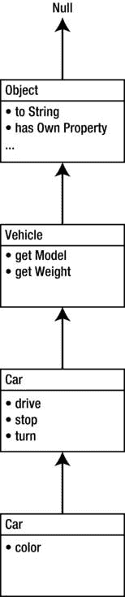

# 第 1 章：入门

## 原型

原型的工作原理类似于其他语言中的类：它们为通过同一构造函数创建的对象定义了通用结构。原型一直是 JavaScript 开发者困惑的源头。我将尝试在不使其比原本更令人困惑的情况下描述这个主题。

JavaScript 中的每个对象都有一个原型，而原型本身也是一个对象。它像一个父对象：将所有属性与子对象共享，允许子对象像使用自己的属性一样使用它们。请看图 1-11。`car` 对象（图中的底部方框）只有一个自有属性 `color`，但 `car` 的原型具有 `drive` 函数。由于原型的全部属性都可供对象使用，你可以调用 `car.drive()`，就像它是 `car` 的常规函数一样。

**图 1-11.** *原型上定义的属性可供对象使用*

**注意：** 在 JavaScript 中，有一个术语叫做*自有属性*，指的是直接定义在对象上的属性。在以下代码中，`color` 属性是 `car` 对象的自有属性，因为它是由 `car` 直接定义的，而不是在 `car` 的原型中。

```
var car = new Car();
car.color = "red";
```

由于原型是一个常规对象，它也可以有自己的原型。该“超”原型的方法也可供对象使用。图 1-12 阐述了这一概念。当 JavaScript 需要查找变量或调用方法时，它首先查找对象自身的属性。如果未找到该属性，则会继续查找其原型，然后是原型的原型，依此类推，直到达到顶层。这个概念被称为原型链。



