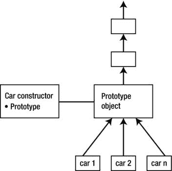
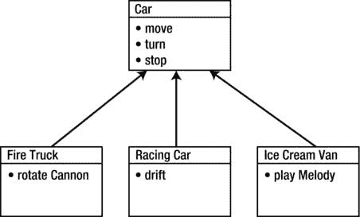

# 第 1 章：入门

**注意：** 有两种方法可以访问对象的原型。标准方法是使用 `Object.getPrototypeOf` 函数。另一种方法是通过调用 `__proto__` 属性。`car.__proto__` 是 `car` 对象的原型。第二种方法并非标准方法，但在大多数浏览器中均已实现。尽管 `__proto__` 属性已被弃用，但它对于调试仍然很方便。

JavaScript 中的每个函数都有一个名为 `prototype` 的属性。如果该函数用作构造函数，此属性将自动分配为通过 `new` 调用创建的对象的原型。让我们看看清单 1-4 中的另一个示例。

**清单 1-4.** *原型属性的简单用例*

```
function Car() {
    this._color = "red";
}

Car.prototype.drive = function () {
    console.log(this._color + " car is driving");
};

var car = new Car();
car.drive();
```

你对 `prototype` 属性所做的所有更改都会立即可用于使用 `new Car()` 构造的每个对象，无论它们是在更改之前还是之后创建的。请看清单 1-5。第一个对象 `car1` 已创建


```javascript
照常。其原型为 `Car.prototype`，如前所述。接下来，我们将新函数添加到 `Car.prototype` 中。该函数会立即对所有共享同一原型的对象可用，无论对象是在此更改之前还是之后创建的。

**清单 1-5.** *更新原型*

```javascript
function Car(color) {
  this._color = color;
}

Car.prototype.drive = function () {
  console.log(this._color + " car is driving");
};

var car1 = new Car("red");
console.log(Object.getPrototypeOf(car1) === Car.prototype); // true
car1.drive();
```



第 1 章：入门指南 **33**

```javascript
// 向原型中添加新函数
Car.prototype.stop = function () {
  console.log(this._color + " car has stopped");
};

var car2 = new Car("blue");

// 对象共享同一个原型对象
console.log(Object.getPrototypeOf(car1) === Object.getPrototypeOf(car2)); // true

// 两个对象现在都能访问新方法
car2.stop();
car1.stop();
```

当执行这段脚本时，你会看到新方法对 `car1` 和 `car2` 都可用。图 1-13 说明了这一概念。每个通过 `new Car()` 调用创建的对象都共享同一个原型对象。显然，通过共享原型，它们也共享了整个原型链。

**图 1-13.** *所有通过 `new Car()` 创建的对象共享定义在 `Car.prototype` 中的同一个原型*

## 继承

继承是面向对象编程的核心概念之一。它允许复用定义在“父”对象中的通用功能，并通过“子”对象的特定功能进行扩展。让我们看一个操作多种不同类型汽车的应用示例：消防车、赛车和冰淇淋车。所有这些汽车都有共同特征：它们都能移动、转弯和停止。但每类汽车都有其专属的特殊功能：消防车可以旋转水炮，赛车可以漂移，冰淇淋车可以播放旋律。图 1-14 展示了这一架构。



第 1 章：入门指南

**图 1-14.** *继承的概念。“父类”（`Car`）定义了通用方法，而“子类”（`FireTruck`、`RacingCar` 和 `IceCreamVan`）仅定义特定的扩展功能。*

如你所见，原型链的作用完全相同：它允许你复用上层原型中的方法和变量。

让我们从两个构造函数的代码开始，它们定义了所需的方法（见清单 1-6）。

**清单 1-6.** *继承的基本设置*

```javascript
function Car(color) {
  this._color = color;
}

Car.prototype.move = function() {
  console.log(this._color + " car moves");
};

Car.prototype.turn = function(direction) {
  console.log(this._color + " car turns " + direction);
};

Car.prototype.stop = function() {
  console.log(this._color + " car stops");
};

function FireTruck() {}

FireTruck.prototype.turnCannon = function(direction) {
  console.log("Cannon moves to the " + direction);
};

// 以某种方式将 FireTruck 和 Car 的原型链接到原型链中
var truck = new FireTruck();

// 这将不会生效，因为 Car.prototype 尚未出现在 truck 对象的原型链中，
// 所以方法 move() 不可用
truck.move();
truck.turnCannon("right");
```

**注意：** 如你所见，代码使用 `console.log` 来追踪执行过程。要了解如何在移动端和桌面浏览器中捕获控制台输出，请参考附录 A。

这段代码将无法运行。`truck.move()` 调用会导致错误，因为 `move` 方法对 `FireTruck` 不可用。修复这段代码并将 `Car` 加入原型链出奇地简单。JavaScript 中有一个特殊方法叫做 `Object.create(proto, properties)`。它会创建一个新的空对象，并将其原型设置为函数的第一个参数 `proto`。清单 1-7 展示了如何修复代码。

**清单 1-7.** *修正后的继承*

```javascript
function FireTruck() {}

FireTruck.prototype = Object.create(Car.prototype);

// 为了保险起见做一下检查
console.log(Object.getPrototypeOf(FireTruck.prototype) === Car.prototype);
// true
```

下载自 Wow! eBook <www.wowebook.com>
```


```javascript
// 现在 Car.prototype 被添加到了原型链中

FireTruck.prototype.turnCannon = function(direction) {
  console.log("Cannon moves to the " + direction);
};

var truck = new FireTruck();

// 现在可以正常工作了，因为 Car.prototype 已位于 truck 对象的原型链中
truck.move();
truck.turnCannon("right");
```

示例现在可以运行了，但输出结果仍然有些问题。

```
true
undefined car moves
Cannon moves to the right
```

