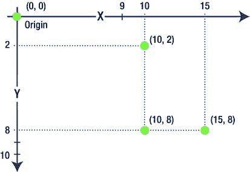
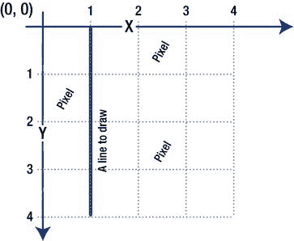
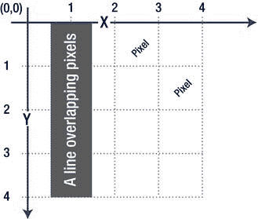
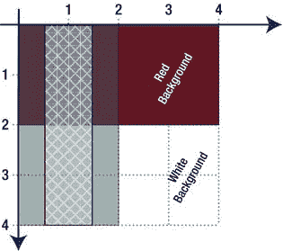
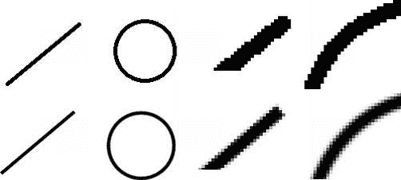
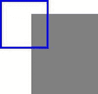
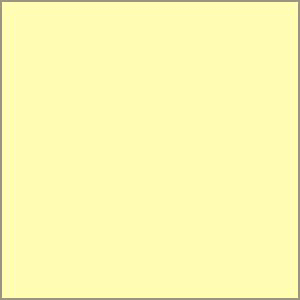
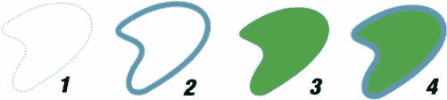
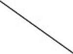

# `doctypes`、脚本块中语言的显式声明等

由于所有现代浏览器都已支持 HTML5，至少是在其基本层面，这个 HTML 页面虽然是空的，但它包含了 JavaScript 代码的入口点：`init()` 方法。这个方法在 HTML 文件加载、解析完毕，并且文档对 JavaScript 完全可用后执行。这是放置初始化逻辑的理想位置：显示“加载”屏幕、初始化并分配事件监听器，或开始加载外部资源。目前，该方法为空，但我们很快会向其中添加绘图代码。基本 HTML 骨架的代码可在本章的 `1.skeleton.html` 文件中找到。

现在，我们已准备好开始探索 canvas 了。

---

#### 什么是 Canvas？

Canvas 是一种相对较新的 HTML 元素。这类元素的概念由苹果公司在 2004 年引入。它允许你绘制任意图形，例如几何图元、形状和图像、渐变、描边和填充。它还拥有丰富的 API 来控制输出，支持缩放、旋转等变换以及逐像素图像处理。通过额外的工作，它还可以用于图像处理和应用高级效果。

Canvas 的工作方式与常规 HTML 渲染不同。使用 HTML 时，你创建元素并将其附加到 DOM 树中。一旦附加，你就可以通过 CSS 改变它们的外观和位置。如果你将一个 `div` 向左移动 100 像素，它之前的区域会神奇地变为空白，而 `div` 出现在新位置。操作 HTML 节点就像桌子上放着十几张带图像的纸张；你可以将它们移动、叠放或丢弃，如图 2-1 所示。

**图 2-1.** *当你在 HTML 页面中移动一个 `div` 时，无需担心清除内容；你只需改变坐标，`div` 就会在新位置渲染。虚线边框表示 `div`；虚线边框表示正在移动的 `div`。*

Canvas 更像是在……画布上作画。没错，就是那种真实世界中由织物制成的画布。一旦你画上了什么，它就会一直存在，直到你将其擦除或在上面画上别的东西。要“移动”图像，你首先需要擦除旧图像，恢复所有可能受移动影响的其他对象，然后再在新位置重新绘制图像。请看图 2-2，它说明了这一概念。

**图 2-2.** *要改变图像的位置，你首先必须清除其原始位置，恢复可能受影响的其它对象，然后将图像绘制到新位置。*

清单 2-2 是一个演示 Canvas API 的示例。通读代码，感受一下 Web 开发的“canvas 风格”。

**清单 2-2.** *Canvas API 示例*

```html
<!DOCTYPE html>
<html lang="en">
<head>
<meta charset="utf-8" />
<style>
</style>
<script>
function init() {
    var canvas = document.getElementById('mainCanvas');
    var ctx = canvas.getContext('2d');
    ctx.clearRect(0, 0, 300, 300);
    ctx.fillStyle = "lightgray";
    ctx.fillRect(10, 10, 50, 50);
}
</script>
</head>
<body onload="init()">
<canvas id="mainCanvas" width="300px" height="300px"></canvas>
</body>
</html>
```

如你所见，canvas 是一个常规的 DOM 元素，就像 `div` 或 `table` 一样。它的行为方式与其他节点完全相同：可以通过 `document.createElement()` 创建，附加到父节点，或使用 CSS 设置样式。它可以有外边距、内边距、边框、位置等等。在 `var ctx = canvas.getContext('2d')` 这一行之后，神奇的事情就开始发生了。

## 上下文

上下文（清单 2-2 中的 `ctx`）决定了 canvas 的“绘图模式”。从实际角度来看，这个对象就像是访问整个绘图方法集的接入点。再次查看这个清单。


`Context`是负责设置绘制颜色和绘制形状的对象。`ctx`的类型是`CanvasRenderingContext2D`，但为简单起见，我们将其简称为`context`。如果你仍然对`canvas`及其`context`之间的关系感到困惑，可以将`canvas`视为一个看起来像透明矩形的普通 DOM 元素，而`context`则是用于在其上绘制的入口点，是一系列用于绘制内容的函数集合。

**注意：** 此时，你可能会问：为什么我要调用`canvas.getContext('2d')`？为什么是`'2d'`？也许还有其他类型的`context`，比如`'3d'`？W3C 规范定义：`getContext`“返回一个对象，该对象暴露了用于在`canvas`上绘图的 API。第一个参数指定了所需的 API。后续参数由该 API 处理。”

这基本上意味着你可以从`canvas`中获取不同的`context`，它们会暴露不同的 API 集合，例如 3D API。具体能获取到什么取决于浏览器。2D `context`的结果由 W3C 规范明确定义。

2007 年，Opera 发布了首个支持自定义 3D canvas 的实验性构建版本；你需要通过获取`"opera-3d"` `context`来访问它。2011 年 3 月 3 日发布的 WebGL[规范](https://www.khronos.org/registry/webgl/specs/1.0/)定义了名为`"webgl"`的`context`，用于访问标准化的 3D `context`。（我们将在第 9 章深入探讨 WebGL。）

因此，`'2d'`并非一个可以省略的随意术语。

这一解释应当能清楚地说明，“canvas 可以绘制曲线”这种说法为何不完全正确。能够或不能够进行绘制的并非`canvas`本身，而是图形`context`（即 API）。在一个`context`中完全合理的操作（如 2D 中的曲线），在另一个`context`中（如 WebGL 中的曲线）可能无法实现。



## 第 2 章：浏览器中的图形：Canvas 元素

#### 坐标系

坐标定义了你要将某个图形绘制在哪个确切位置，或者图形的大小。几乎每次调用`canvas` API 都会涉及坐标。如果要绘制一个矩形，你必须设置其左上角坐标、宽度和高度。对于圆形，你需要圆心和半径。这些坐标具体是什么？它们又是如何工作的？

2D `context`定义了一个矩形的位图区域。该`context`使用经典的笛卡尔坐标系来引用其中的各个点。有两个轴：水平轴称为`x`，垂直轴称为`y`。`x`轴向右增加，`y`轴向下增加。`x`和`y`都设置为 0 的点称为原点；它位于位图的左上角。图 2-3 显示了四个点，其中一个是原点。每个点旁边都用括号标出了其坐标。

**图 2-3.** *2D context 的坐标系*

在 2D 空间中，每个点都由一对坐标`(x, y)`来引用。在本书中，我使用常规的数学表示法：`(x, y)`；例如，`(10, 2)`表示点的`x`坐标为 10，`y`坐标为 2。原点的坐标是`(0, 0)`。在图形`context`中，点`(10, 8)`将位于点`(15, 8)`的左侧，以及点`(10, 2)`的下方。

这里还有一个值得提及的重要规则。有时，图形 API 和软件不区分坐标网格上的点和屏幕上的像素，并将这两个术语互换使用。2D `context`的工作方式则不同，且有些反直觉（至少对于刚开始编写`canvas`代码的人来说是反直觉的）。

坐标不是像素。坐标是像素内部或像素之间的小点；例如，`(0, 0)`坐标位于左上角像素的左上角。



**第 2 章：浏览器中的图形：Canvas 元素**

**49**

同一个像素的中心点坐标是小数坐标`(0.5, 0.5)`。


假设你想绘制一条从 `(1, 0)` 到 `(1, 4)` 的细垂直线。你希望这条线宽度为一个像素，且颜色为黑色。上下文会将其视为一条位于屏幕**第一与第二像素之间**的线。图 2-4 展示了 2D API 如何处理此类调用。

**图 2-4.** 上下文将整数坐标的线视为位于像素之间。

线的宽度为一个像素，因此上下文应绘制左侧像素的一半和右侧像素的一半，以凑成一个完整像素。显然，设备显示器无法完成此任务，因为像素是原子级元素——它无法同时被涂上两种不同颜色。因此，这条线会同时覆盖左右两个像素。为了补偿线宽的增大，上下文会将两个像素都渲染为半透明，从而使线的颜色看起来更浅。图 2-5 展示了这条一个像素宽的线位于实际物理像素边界上的模型。



**图 2-5.** 线的宽度为一个像素，因为它跨越了两个像素的边界，所以各覆盖了它们的一半。

上下文的工作方式就像一位油漆工，桶里恰好有足够覆盖一面墙的油漆。突然，他发现有**两面**墙需要粉刷。他决定用水稀释油漆来完成这项工作（没有额外资金再买一桶油漆——生活就是这样）。现在两面墙都有了新颜色，但由于油漆层太薄，你仍能透过它看到旧墙纸。这就是上下文绘制线的方式：描边颜色被“分配”给左侧和右侧的像素。用户最终看到的颜色不会是黑色，而是浅灰色。最终颜色还取决于背景色，因为背景色会透过半透明的线显现出来。此外，最终线的宽度会是两个像素，因为左右两个像素都被原始线“覆盖”了。图 2-6 展示了此类调用在 2D 上下文中的结果。白色虚线是原本想要绘制的线，它位于像素之间。最终绘制的线以 50%透明度呈现；因此，背景会影响线的最终颜色。线的上方为深红色，下方为深灰色。



**图 2-6.** 使用整数坐标绘制一个像素宽的垂直线所得结果

要绘制一个像素宽的黑色线，你必须设置小数坐标，即额外增加半个像素。如果一条从 `(1.5, 0)` 到 `(1.5, 4)` 的线穿过每个像素的中心，那么它的宽度正好为一个像素；并且由于它没有重叠任何额外空间，所以呈现纯粹的黑色。

如果你想要一条两个像素宽的线呢？正确。你必须切换回整数坐标，否则它实际上会覆盖三个像素——中间一个实心像素，两侧各一个半透明像素。

如此处理坐标可能有些令人困惑，但一旦你开始处理更复杂的形状，这就变得完全合理了。只要图形渲染得当且对用户来说看起来自然，你就不必过分关注构成图形的精确像素。平滑的颜色和柔和的边缘看起来自然；而像素非黑即白的锯齿状“阶梯”则不然。图 2-7 展示了这两种情况的实际差异。上方一行显示了线和圆的锯齿版本（正常大小及放大片段），而下方一行则显示了与 2D 上下文绘制时相同的经过抗锯齿处理的图形。如你所见，下方的图像看起来美观得多。



**图 2-7.** 锯齿图形与平滑图形的对比


**注意：** 2D 上下文默认启用了抗锯齿功能，这就是为什么会出现半透明像素。如果你想要复古的、锯齿状的像素艺术风格呢？能关闭抗锯齿吗？简单回答是不能。如果你仍想完全控制像素，就必须进入更底层，直接操作位图图像数据。我们将在后续章节中演示如何做到这一点（第 5 章解释该技术的基础知识）。

现在我们已经了解坐标系的工作原理，可以开始绘制实际图形了。

### 绘制图形

2D 上下文定义了两种类型的图形：简单图形和复杂图形。简单图形是矩形的一种技术性称呼。任何不是矩形的图形都是复杂图形，甚至一条线也算。我们将从最简单的图形——矩形——开始绘图实验，然后深入研究更复杂的图形和路径。

正如我在本章开头承诺的那样，我们将为第一个大项目——四球游戏——准备一些代码。既然我们已经了解了上下文中棘手的坐标系，就能处理第一个任务：为游戏板绘制背景。游戏板是矩形的，所以我们从学习如何绘制矩形轮廓并用颜色填充它开始。默认的白色背景有点单调，我们将把它改成更好的颜色！



**第 2 章 浏览器中的图形：Canvas 元素**

**53**

#### 矩形

绘制矩形是一项直截了当的任务（参见清单 2-3）。有两个函数可用于此任务：`drawRect()` 和 `fillRect()`。第一个函数仅绘制矩形轮廓，我们将用它绘制边框。第二个函数绘制填充形状，适用于背景。这两个方法都接受四个参数：矩形左上角的 `x` 和 `y` 坐标，以及其尺寸：`width` 和 `height`。

***清单 2-3.** 绘制一个矩形*

```
<!DOCTYPE html>
<html lang="en">
<head>
<meta charset="utf-8" />
<style>
</style>
<script>
function init() {
var canvas = document.getElementById("mainCanvas");
var ctx = canvas. getContext("2d");
ctx.fillStyle = "gray";
ctx.strokeStyle = "blue";
ctx.lineWidth = 3;
ctx.fillRect(50, 50, 100, 120);
ctx.strokeRect(4.5, 30.5, 70, 70);
}
</script>
</head>
<body onload="init()">
<canvas id="mainCanvas" width="300px" height="300px"></canvas>
</body>
</html>
```

输出结果如图 2-8 所示。

**图 2-8.** *使用 `drawRect` 和 `fillRect` 绘制矩形*

**第 2 章 浏览器中的图形：Canvas 元素**

将清单 2-3 中的代码插入本章开头的 HTML 模板中。在后续的清单中，我通常会省略 HTML 包装器，因为它通常不会改变。你需要将代码直接写入 `init()` 方法，然后尝试运行。

**注意：** 这种复制/粘贴方法仅用于简短的动手示例，因为我们正在学习如何绘图。在下一章，当我们完成基础知识后，我们将为游戏创建一个良好的面向对象架构。

别忘了使用上一节中的坐标指南。描边是一条线；当描边宽度为奇数时，使用半像素坐标；当描边宽度为偶数时，使用整数坐标，否则线条会模糊且半透明。对于 `fillRect` 操作，你可以一直使用整数坐标，因为你通常希望填充整个像素，而不是一半。

**注意：** 我还没有提到如何使用这些描边和填充。我将在接下来的章节中详细解释。现在，可以将填充视为图形编辑器中的“油漆桶”工具，将描边视为图形的“边框”。

要填充整个可用空间，可以使用 `canvas.width` 和 `canvas.height` 属性。清单 2-4 展示了如何用非常浅的黄色（像旧纸的颜色）填充背景，以及之后如何绘制一个两像素宽的边框。

**清单 2-4.** *绘制游戏板背景*

```
var canvas = document.getElementById("mainCanvas");
var ctx = canvas.getContext("2d");
ctx.fillStyle = "#fffbb3";
ctx.strokeStyle = "#989681";
ctx.lineWidth = 2;
```


`ctx.fillRect(0, 0, canvas.width, canvas.height);`

`ctx.strokeRect(1, 1, canvas.width - 2, canvas.height - 2);`

以上代码的输出结果如图 2-9 所示。





## 第 2 章：浏览器中的图形：Canvas 元素

**图 2-9.** *一个填充并描边的矩形*

#### 路径

在 2D 上下文中，除了矩形之外的所有图形都属于复杂形状——这是另一个极客术语。复杂形状是指你在上下文中绘制的“虚拟”路径。为什么说它是虚拟的呢？因为只有当你对其进行描边或填充时，它才会变得可见。

图 2-10 中第一张图片的虚线在显示时并不存在；我在此处添加它仅为提供参考。填充功能类似于油漆桶，而描边则是指边框。你可以单独使用其中任意一种，或者同时使用两者，但在你使用它们进行“上色”之前，路径将始终保持不可见。设置路径就像用极细的铅笔勾勒草图；要完成画面，还需在其上施加颜料。图 2-10 形象地说明了这一概念。

**图 2-10.** *(1) 无描边和填充的路径（不可见）。 (2) 仅描边的路径。 (3) 仅填充的路径。 (4) 同时包含描边和填充的路径。*

`Context2D API` 提供了三种用于构建路径的“工具”：线条、弧线以及曲线（二次曲线和贝塞尔曲线）。

我们将从在游戏板上绘制网格开始学习路径的工作原理。接着，我们会研究弧线并绘制游戏棋子。最后，我们将运用曲线来绘制精美的棋盘装饰。



## 第 2 章：浏览器中的图形：Canvas 元素

##### 线条

线条是路径中最简单的形式。在 Canvas 上渲染一条线的代码非常直接：

```
ctx.beginPath();
ctx.moveTo(50, 50);
ctx.lineTo(120, 100);
ctx.strokeStyle = "#000";
ctx.stroke();
```

首先，我们需要让上下文知道我们正在开始一条新路径：`beginPath` 正是执行此操作的。`moveTo` 方法的意思是“我们将从这一点开始绘制下一段路径”。或者，沿用铅笔和纸张的类比，“将你的铅笔从纸上提起，并放到那个点上，但不画任何东西。” 下一行代码不言自明：从你当前所在的位置画一条线到 `(120, 100)`。此时，这条线还未实际绘制，它仅作为一条虚拟路径存在。最后两行代码对路径进行描边；线条最终变得可见。结果不出所料：从 `(50, 50)` 到 `(120, 120)` 的线条，如图 2-11 所示。

**图 2-11.** *绘制一条线*

现在你已经知道如何绘制线条了。让我们运用这个知识来为棋盘绘制一个网格（参见清单 2-5）。

**清单 2-5.** *绘制网格*

```
// 为简单起见，此处显式设置单元格大小，
// 后续我们将根据设备尺寸进行计算。
var cellSize = 40;

ctx.beginPath();

// 绘制水平线
for (var i = 0; i < 8; i++) {
  ctx.moveTo(i*cellSize + 0.5, 0);
  ctx.lineTo(i*cellSize + 0.5, cellSize*6)
}

// 绘制垂直线
for (var j = 0; j < 7; j++) {
  ctx.moveTo(0, j*cellSize + 0.5);
  ctx.lineTo(cellSize*7, j*cellSize + 0.5);
}

// 描边以在屏幕上显示
ctx.lineWidth = 1;
ctx.strokeStyle = "#989681";
ctx.stroke();
```

棋盘有七列六行，因此我们需要绘制八条垂直和七条水平线。请注意，我们并没有逐条对每条线进行描边。这些线被合并成一条大路径，随后通过单个 `ctx.stroke()` 调用进行描边。其中每一条独立的线称为子路径。关于子路径的更多内容将在本章后续部分介绍。

**注意：** 如你所见，我在此处硬编码了单元格大小。如果你的游戏需要缩放以适应不同分辨率的屏幕，在实际应用中请不要这样做。我们将在下一章重写代码，使其自适应屏幕尺寸。

如果你将这段代码添加到清单 2-4 的代码之后，结果看起来就会很像棋盘了。网格目前还未完全在棋盘内居中，但这很容易修正，正如我们在本章最后一部分将看到的那样。


