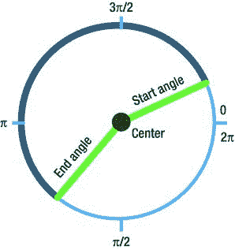
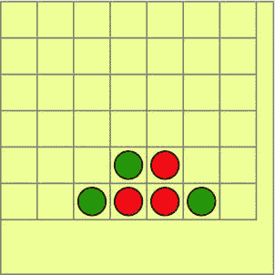
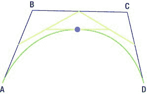
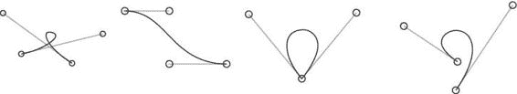
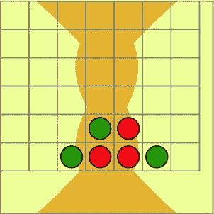
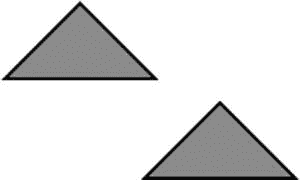
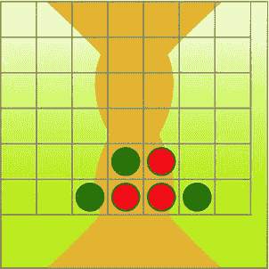
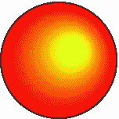

# Canvas 绘图基础

我们使用了名为 `beginPath` 的方法，但从未使用过类似 `closePath` 的方法，尽管确实存在这样一个方法。就 2D 上下文而言，“闭合”路径意味着在子路径的最后一个点和第一个点之间画一条直线。例如，如果你需要创建一个三角形，你只需要定义三条边中的两条。当你闭合路径时，API 会自动为你添加第三条边。

##### 弧线

弧线的绘制方式与直线略有不同。你不需要将“铅笔”移动到任何地方；你可以直接调用 `arc` 方法，并传入六个参数：圆心的 `x` 和 `y` 坐标、半径、起始角度、结束角度以及逆时针标志。

**注意：** 为什么 API 中没有名为 `drawCircle` 的方法？因为 `Context2D` 的 API 力求尽可能简洁。它没有提供很多便捷方法；这些方法的实现留给了开发者。弧线是圆的一段弧，就像一块披萨切片。因此，圆是弧线的一个特例，即只有一大块披萨的披萨。



##### 角度与弧度

关于角度有两种度量方式：度数和弧度。度数是日常生活中的常用度量：直角是 90 度，地球的轴向倾斜约为 23.4 度，等等。弧度主要用在数学和……Canvas API 中。一个完整的圆是 360 度或 `2 * pi`（`2π`）弧度，因此一弧度大约是 57 度。如果你习惯了使用度数，那么将每个角度都用计算器转换成弧度，甚至编写代码来执行此操作，意义不大。最好让自己习惯使用弧度。

用普通数字表示的弧度意义不大；它们几乎总是用 `pi`（`π`）来表示。一个完整的圆是 `2π` 弧度；一个直角是 `π/2`；45 度是 `π/8`，以此类推。在 JavaScript 中，`Math` 类定义了一个方便的常量：`Math.PI`。每当你需要以弧度设置角度时，都可以使用它。

图 2-12 展示了弧线是如何绘制的，以及角度是如何以弧度表示的。

***图 2-12.** 弧线出现在起始角度和结束角度之间，方向由 `clockwise` 标志决定。*

要绘制一个棋子，我们需要一个圆。一个完整的圆是 `2π` 弧度。以下代码说明了如何绘制它：

```javascript
var x = 90;
var y = 70;
var radius = 50;

ctx.beginPath();
ctx.arc(x, y, radius, 0, 2 * Math.PI, false);

// 设置描边和填充样式
ctx.fillStyle = "darkgoldenrod";
ctx.lineWidth = 5;
ctx.strokeStyle = "black";

ctx.fill();
ctx.stroke();
```

`arc` 函数中的最后一个参数是弧线的“方向”：如果为 `true`，则弧线将逆时针方向移动（默认情况下为顺时针方向）。当我们绘制一个完整的圆时，方向无关紧要，因此我们保留默认值。

在查看输出之前，让我们再向游戏迈进一步：创建一个二维数组并用棋盘数据填充它：`0` 表示无棋子，`1` 表示红色棋子，`2` 表示绿色棋子。然后，我们将在上一节创建的网格之上绘制棋子。清单 2-6 展示了代码。

**清单 2-6.** *绘制棋子*

```javascript
var data = [
  [0, 0, 0, 0, 0, 0, 0],
  [0, 0, 0, 0, 0, 0, 0],
  [0, 0, 0, 0, 0, 0, 0],
  [0, 0, 0, 0, 0, 0, 0],
  [0, 0, 0, 2, 1, 0, 0],
  [0, 0, 2, 1, 1, 2, 0]
];

ctx.strokeStyle = "#000";
ctx.lineWidth = 3;

for (var i = 0; i < data.length; i++) {
  for (var j = 0; j < data[i].length; j++) {
    var value = data[i][j];
    if (!value)
      continue;

    switch (value) {
      case 1:
        ctx.fillStyle = "red";
        break;
      case 2:
        ctx.fillStyle = "green";
        break;
    }

    ctx.beginPath();
    ctx.arc((j + 0.5) * cellSize, (i + 0.5) * cellSize, cellSize / 2 - 5, 0,
            2 * Math.PI, false);
    ctx.fill();
    ctx.stroke();
  }
}
```



看看图 2-13。结果开始看起来像一个真正的游戏了。

**图 2-13.** *带有网格和棋子的游戏场地*


到目前为止，我们已经拥有了将在第三章游戏项目中使用的棋盘背景、网格和棋子。

##### 曲线

除了直线和弧线之外，二维上下文还支持另外两种复杂的路径类型：二次曲线和贝塞尔曲线。它们背后的数学原理比绘制矩形或圆形的数学原理要复杂一些，但我会尽量在不过度深入细节的前提下进行解释。

这两种曲线都使用“控制点”来确定曲线的形状。第一个和最后一个控制点是锚点，它们分别是曲线的起点和终点。其他控制点并不属于曲线本身，它们更像是可以弯曲和扭转曲线的磁铁。二次曲线使用三个控制点，而贝塞尔曲线则使用四个。我们先从二次曲线开始。一旦你理解了其中的原理，贝塞尔曲线的机制也就显而易见了。绘制曲线的 API 非常简单，只有一行代码：

`ctx.bezierCurveTo(0, 100, 60, 200, 30, 300);`

为了正确使用它，我们首先需要了解其背后的数学原理。

###### 二次曲线

曲线是逐点绘制的。曲线上每个点的位置都由控制点的位置决定。假设我们要绘制属于曲线的五个点：第一个点是曲线的起点，最后一个点是曲线的终点，其他三个是中间的点。我们使用参数 `t` 来指代曲线上的点。当曲线从起点绘制到终点时，`t` 会从 0 变化到 1。第一个点的 `t` 为 0，第二个点为 0.25，第三个点为 0.50，第四个点为 0.75，最后一个点为 1。现在我们开始构建曲线。

首先，我们有三个控制点：A、B 和 C。初始设置如图 2-14 中的图像 1 所示。

**图 2-14.** *曲线背后的数学原理*

曲线的起点（当 `t` 为 0 时）是点 A。现在来处理第二个点（`t = 0.25`）。测量 AB 线段的四分之一（0.25）和 BC 线段的四分之一，然后在这两个点之间画一条线，如图像 2 所示。现在我们得到了一条虚线的“辅助线”。取这条新线的四分之一，你就得到了曲线上的一个点！图像 3 中用小十字标记了这个点。

对第三个点重复这些步骤。`t` 的值是 0.5（即 ½），因此你需要取线段的一半，而不是四分之一。在 AB 的中点和 BC 的中点之间画一条虚线的辅助线。找到这条虚线线的中点，这就是第三个点。结果如图 2-14 中的图像 4 所示。

再计算第四个点（`t = 0.75`），最后一个点就是点 C（见图 2-15）。现在你有五个点来构建一条曲线！用平滑的曲线将它们连接起来，如图 2-15 所示，一条二次曲线就准备好了。

**图 2-15.** *逐点构建的二次曲线*

这种机制非常强大。只需使用三个控制点，你就可以构建出最适合你需求的曲线！图 2-16 展示了更多的二次曲线示例。

**图 2-16.** *更多的二次曲线*

###### 贝塞尔曲线

贝塞尔曲线的工作方式与二次曲线相同，不同之处在于它使用四个控制点而不是三个，并且需要三条辅助线而不是一条。

**注意：** 实际上，从数学角度来看，`Context2D` API 中的二次曲线和贝塞尔曲线*都*是贝塞尔曲线。称它们为“三次”曲线会更直观，因为贝塞尔曲线可以是任意阶的。还有四阶和五阶的贝塞尔曲线，但 Canvas API 不支持它们。

看一下图 2-17 中的贝塞尔曲线示例。要找到一个点的位置，你首先需要在 AB 和 BC 之间构建一条辅助线段，然后在 BC 和 CD 之间构建一条。构建这些线段的算法完全遵循与二次曲线相同的工作原理。


好的，作为高级文档工程师，我将严格按照您的要求，对提供的文本进行排版优化和翻译。


好的，作为高级文档工程师，我将根据您指定的规则对提供的文本进行排版优化。

---

与二次曲线相同。我们选取一个从`0`到`1`的值，为了方便称其为`t`，并找到每条线段上与该值成比例的部分。（`t = 0`）是线段的起点，（`t = 1/3`）是线段的三分之一处，依此类推。在贝塞尔曲线上完成这些步骤后，我们构建三个支撑点。将它们视为二次曲线的控制点进行处理。





**第 2 章：浏览器中的图形：Canvas 元素**

**63**

我们拥有与上一节完全相同的设置（三个点和一个`t`值），并且我们已经知道如何找到这种曲线上的点。

**图 2-17. 贝塞尔曲线示例**

*贝塞尔曲线比二次曲线更灵活：四个点让您对形状有更多控制。贝塞尔曲线可以自交，但二次曲线不能。图 2-18 展示了不同贝塞尔曲线的行为。*

**图 2-18.** *更多贝塞尔曲线*

### 绘制曲线

在画布上绘制曲线比理解其背后的数学原理要容易得多。您唯一需要做的就是将控制点的坐标传递给两个方法之一：`quadraticCurveTo()`或`bezierCurveTo()`，具体取决于您想要哪种类型的曲线。第一个控制点隐式地是调用方法前“虚拟铅笔”所在的点。举例来说，如果您调用了`moveTo(10, 20)`，然后调用了`lineTo(40, 50)`，您“当前”的坐标就是`(40, 50)`；它们将被用作曲线的第一个控制点。以下是贝塞尔曲线的一个示例：

```
ctx.beginPath();
ctx.moveTo(50, 50);
ctx.bezierCurveTo(0, 100, 60, 200, 30, 300);
ctx.stroke();
```

这段代码绘制了一条具有四个控制点的贝塞尔曲线：`(50, 50)`——曲线的起点，`(0, 100)`；`(60, 200)`——磁力点；以及`(30, 300)`——曲线的终点。



**第 2 章：浏览器中的图形：Canvas 元素**

让我们发挥想象力，在游戏板的背景上添加一些抽象图形。绘制两条贝塞尔曲线怎么样？在您用纯色填充背景之后，但在描边边框之前（否则曲线会重叠），添加清单 2-7 中的代码：

**清单 2-7.** *在背景上绘制曲线*

```
// Drawing curves
ctx.strokeStyle = "#6f6e62";
ctx.fillStyle = "#e8b948";
ctx.beginPath();
ctx.moveTo(50, 300);
ctx.bezierCurveTo(450, -50, -150, -50, 250, 300);
ctx.fill();

ctx.beginPath();
ctx.moveTo(50, 0);
ctx.bezierCurveTo(450, 350, -150, 350, 250, 0);
ctx.fill();
```

结果看起来……有点抽象。稍加练习，我相信您可以做得比图 2-19 中展示的更好。

**图 2-19.** *使用曲线装饰背景*

曲线不仅仅能绘制波浪或小山。事实上，贝塞尔曲线在游戏开发中被大量使用：用于定义运动路径、高级缓动函数以及描述相当复杂的 3D 几何形状，如 B 样条或 NURBS 曲面。贝塞尔曲线的强大之处在于它表示形状的方式；仅需几个点，即可轻松通过网络传输或保存到文件中。

**第 2 章：浏览器中的图形：Canvas 元素**

**65**

##### 子路径

2D 上下文中的路径可能由几个独立的图形组成，称为子路径；例如，您可以绘制两个三角形作为单个“路径”的组成部分。当您调用`stroke()`或`fill()`时，每个子路径作为单独的图形进行描边或填充。

有两种方法可以开始新的子路径：调用`moveTo()`或`closePath()`。区别在于，`closePath`会添加一条从当前点到子路径起点的线段以使其闭合；而`moveTo`则只是简单地开始新的子路径。

**注意：** `closePath`这个名称极具误导性；路径本身并未关闭。只有当您再次调用`beginPath`时，路径才会关闭（实际上是被丢弃）。

所有新的几何图形——线、曲线和弧——都会添加到同一个路径中。

清单 2-8 展示了一个借助绘制两个三角形的示例：

---

好的，作为高级文档工程师和翻译员，我将严格按照您提供的注意事项和示例格式，将给定的英文文本翻译成中文。


```markdown
`subpaths`。 其效果与使用独立路径渲染它们相同。

**列表 2-8.** *作为子路径渲染的两个三角形*

```
ctx.beginPath();                // 开始路径
ctx.moveTo(150, 150);           // 开始第一个子路径
ctx.lineTo(200, 200);
ctx.lineTo(100, 200);
// 无需添加回到 (150, 150) 的线段，closePath 会添加
ctx.closePath();                // 结束子路径（不是路径本身）
ctx.moveTo(250, 200);           // 开始第二个子路径
ctx.lineTo(300, 250);
ctx.lineTo(200, 250);
ctx.closePath();                // 结束第二个子路径
ctx.fill();
ctx.stroke();
// 此时两个三角形都被填充和描边，
// 因为它们是同一路径的子路径
ctx.beginPath();                // 旧路径被丢弃，新路径从这里开始
…                               // 接下来的子路径代码写在这里
```

这段代码的结果是两个三角形，它们作为单个路径进行填充和描边（见图 2-20）。



**图 2-20.** *作为单个路径的子路径绘制的两个三角形*

然而，大多数情况下，您会为每个图形创建一个独立的路径。当您需要绘制大量具有相同描边和填充样式的图形时，子路径的作用就显现出来了；例如，将网格作为一个大路径绘制比单独描边每条线要快约 1.5 倍。不过，这种情况相当少见。

我们已经学习了如何绘制形状，现在是时候学习如何用吸引人的颜色来绘制它们了。我们之前已经看到了如何更改填充和描边的颜色，但 Canvas 2D API 提供的选项远不止单一的纯色填充。

**描边与填充**

在前面的章节中，您已经看到了一些描边和填充的示例。下面的代码展示了如何设置填充颜色、描边颜色和线宽：

```
ctx.fillStyle = "gray";
ctx.strokeStyle = "blue";
ctx.lineWidth = 3;
```

描边和填充非常容易理解。描边描述了形状的轮廓，而填充描述了内部区域。描边是路径的“边界”，填充是它的颜色。`fillStyle()` 和 `strokeStyle()` 都接受相同类型的值：纯色、渐变色和图案。

**纯色**

CSS 颜色是定义样式最简单的方式。您可以使用任何喜欢的格式：颜色名称、颜色代码或 `rgb` 和 `rgba` 函数（见列表 2-9）。

**列表 2-9.** *为描边和填充定义颜色的几种方式*

```
ctx.fillStyle = "#987654";              // 使用颜色的代码
ctx.strokeStyle = "blue";               // 使用预定义的 CSS 颜色名称
ctx.fillStyle = "rgb(255, 0, 0)";       // 使用 rgb 函数
ctx.strokeStyle = "rgba(255, 0, 0, 0.5)"; // 使用 rgba 函数
```

上下文会“记住”填充和描边的设置。它会一直使用最新的值，直到您显式地覆盖它们。

现在让我们尝试渐变色！

**渐变色**

渐变色是指两种或多种颜色之间，或同一种颜色的不同色调之间的平滑过渡。日落时分的天空，从蓝色变为红色或彩虹色，就是自然渐变的一个例子。在计算机图形学中，渐变色用于模拟光照效果，如耀斑、发光或柔和的阴影。图 2-21 展示了渐变色的几种用途。

**图 2-21.** **渐变色。** 左侧图片截取自游戏 *《指挥官基恩》*；天空背景使用了锯齿状渐变色。在右侧，使用了多个径向渐变色来模拟内部发光和光泽高光。

Canvas 支持两种类型的渐变色：**线性渐变色** 和 **径向渐变色**。

**线性渐变色**

要创建线性渐变色，首先需要创建渐变对象：

```
var gradient = ctx.createLinearGradient(10, 10, 50, 50);
```

传递给 `createLinearGradient` 的参数是两个点的 `x` 和 `y` 坐标：渐变的起点和渐变的终点。在前面的例子中，我初始化了一个从 `(10, 10)` 开始、在 `(50, 50)` 结束的渐变色。接下来，您必须为渐变色设置颜色断点：

```
gradient.addColorStop(0, "blue");
gradient.addColorStop(0.3, "green");
```
```


`gradient.addColorStop(1, "red");`



## 第 2 章：浏览器中的图形：Canvas 元素

每次调用都会将某种颜色与渐变线上的点关联起来。第一个参数是偏移量：0 表示线的起点；1 表示线的终点。在这个例子中，我们添加了三种颜色。渐变以蓝色开始。在线的三分之一处，变为纯绿色，然后以红色结束。渐变线起点之前和终点之后的区域是纯色。在我们的示例中，渐变从 (10, 10) 开始；点 (5, 5) 是蓝色的，因为它位于起点之前，而点 (70, 80) 是红色的，因为它位于渐变终点之外。

当渐变准备好后，你需要将其设置为填充或描边：

```
ctx.fillStyle = gradient; // 设置渐变作为填充
ctx.strokeStyle = gradient; // 设置渐变作为描边
```

如果你亲自尝试这段代码，理解起来会容易得多：颜色渐变在书页上的效果并不好。LED 显示屏能更好地渲染它们。尽管如此，将简单的线性渐变应用到我们棋盘背景上的结果如图 2-22 所示。

**图 2-22.** *用作棋盘背景的线性渐变*

代码如下：

```
var gradient = ctx.createLinearGradient(0, 0, 0, 300);
gradient.addColorStop(0, "#ffffff");
gradient.addColorStop(1, "#c6c602");
ctx.fillStyle = gradient;
ctx.fillRect(0, 0, canvas.width, canvas.height);
```

**第 2 章：浏览器中的图形：Canvas 元素** **69**

**注意：** 本示例中使用的颜色相当明亮，以便演示曲线和渐变的效果。在实际产品中，背景不应分散用户对游戏的注意力。本章其余代码使用的是生产版本的色彩，它们在设备屏幕上更柔和、更具吸引力。

##### 径向渐变

径向渐变的工作方式完全相同，唯一的区别是它们使用圆而不是直线来定义渐变的起点和终点。渐变的起点是内圆，终点是另一个外圆。要设置它们，你需要指定它们的圆心和半径，总共六个参数：

```
c.createRadialGradient(x0, y0, r0, x1, y1, r1);
```

参数如下：

- `x0` 和 `y0`：第一个圆的圆心
- `r0`：第一个圆的半径
- `x1`, `y1`：第二个圆的圆心
- `r1`：第二个圆的半径

径向渐变在内圆和外圆之间实现平滑的颜色过渡。清单 2-10 展示了完整的代码。

**清单 2-10.** *使用径向渐变*

```
var gradient = ctx.createRadialGradient(30, 30, 5, 45, 30, 60);
gradient.addColorStop(0, "blue");
gradient.addColorStop(0.3, "green");
gradient.addColorStop(1, "red");
ctx.fillStyle = gradient;
ctx.lineWidth = 10;
ctx.fillRect(0, 0, 80, 80);
```

现在，让我们将这一新知识应用到实践中，为游戏绘制更好的棋子。在模拟光照和虚假立体感方面，径向渐变效果完美。我们将借助单一的径向渐变为棋子添加类似光照的辉光和微弱的柔和轮廓（见清单 2-11）。



第 2 章：浏览器中的图形：Canvas 元素

**清单 2-11.** *使用径向渐变模拟光照和阴影效果*

```
var x = y = 50; // 棋子的中心
var gradient = ctx.createRadialGradient(x + 10, y - 10, 10, x, y, radius);
gradient.addColorStop(0, "yellow");
gradient.addColorStop(0.95, "red");
gradient.addColorStop(1, "black");
ctx.fillStyle = gradient;
ctx.beginPath();
ctx.arc(x, y, radius, 0, 2*Math.PI, true);
ctx.fill();
```

这里绘制的圆明显比棋子大，以展示其外观效果。在制作出一个大版本后，调整尺寸并非难事。我们将内圆从棋子中心向右和向上各偏移了 10 像素。外圆与棋子本身具有相同的半径和位置。

该渐变有三个色标。内圆将是黄色的，因为


