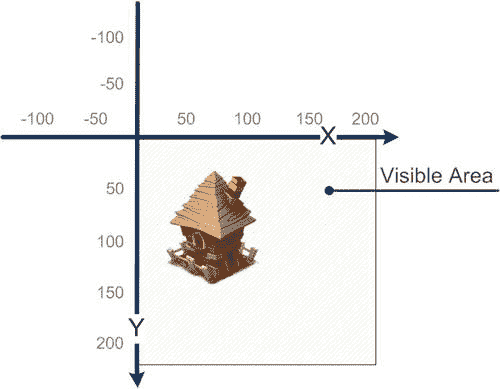
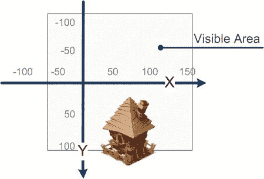
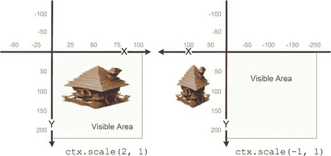
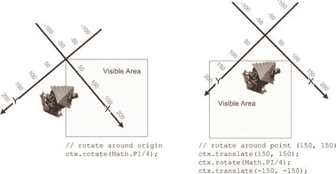
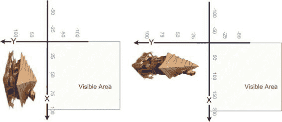

# 注意
演示转换用法的代码可随本章源码一同找到，文件名为`transform-demo.html`。该代码相当庞大，除了几行转换代码外并无其他有价值的新内容，因此本节中不再重复。该代码使用了一个略有不同的 HTML 框架：它包含多个`canvas`元素，而非只有一个。第一个元素显示原始场景，其余元素显示变换后的版本。你可以将其用作实验场：尝试不同的转换，以不同顺序应用于不同形状。该演示使用形状而非图像。



**第 2 章：浏览器中的图形：Canvas 元素**

本节中的图展示了两件重要的事情：坐标轴如何变换，以及形状如何变化。初始场景示意性地呈现在图 2-27 中。

**图 2-27.** *无变换，原始场景*

默认情况下，未应用任何变换时，坐标系如图 2-27 所示：x 轴向右递增，y 轴向下递增，原点`(0, 0)`位于画布的左上角。初始状态下，坐标空间中只有 x 和 y 值均为正的部分是可见的。

从 Wow! eBook 下载：<www.wowebook.com>

#### 平移

平移是一种将每个对象移动给定距离的变换。要应用此变换，请调用：

```
ctx.translate(50, 100)
```

这段代码将坐标轴（以及所有图形）向右移动 50 像素，向下移动 100 像素（见图 2-28）。画布的左上角现在位于点`(-50, -100)`处。



**第 2 章：浏览器中的图形：Canvas 元素**

**77**

**图 2-28.** *使用`translate`函数移动场景中的形状*

此变换常用于需要更改组件位置而又不修改其代码的情况。本章后续部分将介绍如何利用此变换来改进令牌渲染代码，使其更清晰、更易理解。

#### 缩放

缩放是一种对场景中的形状进行“拉伸”或“收缩”的变换。x 轴和 y 轴的缩放值可独立设置。初始正常缩放值为两轴均为 1，简称`(1, 1)`（在本小节中，此写法表示缩放值而非坐标；数字分别代表 x 和 y 方向的缩放值）。

以下三个简单示例有助于你更好地理解缩放：

- 缩放值大于 1 会使每个图形变大。例如，`(2, 2)`使形状变为两倍大。
- 缩放值介于 0 和 1 之间会缩小图形。例如，`(0.5, 0.5)`使每个形状变为正常大小的一半。
- 负数缩放值会改变坐标轴方向并翻转形状。例如，`(-1, 1)`会使每个形状水平翻转。

以下代码展示了缩放的常见用法：

```
ctx.scale(2, 2) // 使所有形状放大两倍
ctx.scale(1, 2) // 仅沿 Y 轴缩放（宽高比将改变）
ctx.scale(1, 1) // 不做任何操作，保持坐标不变
ctx.scale(-1, 1) // 沿 X 轴翻转
```



**第 2 章：浏览器中的图形：Canvas 元素**

当使用负数缩放值时，缩放会改变轴的方向，效果如同翻转图形。x 轴上的`-1`导致水平翻转；y 轴上的`-1`导致垂直翻转。当然，你也可以将其与尺寸变化结合使用；例如，`ctx.scale(0.5, -0.5)`会使所有图形缩小两倍，同时翻转 y 轴。

翻转对于创建图像的镜像版本非常有用。例如，如果你有一张骑士面朝左的图像，你可以直接在浏览器中轻松创建其镜像版本（骑士面朝右），而无需从服务器额外下载图像。图 2-29 展示了缩放和翻转的效果。

**图 2-29.** *缩放。左侧图像沿 x 轴缩放；右侧图像显示翻转后的场景。*


**提示：** 你常常需要将“翻转”与`translate`调用结合使用，因为翻转后，场景的一部分可能会出现在可见画布区域之外，就像图 2-29 右侧的图像那样。

缩放变换常用于表现游戏对象的“生动性”：比如显示跳动心脏的“额外生命”图标、撞到地面后变形的球，或是即将爆炸的卡通风格炸弹。所有这些效果只需几个`scale`调用即可实现。



#### 旋转

旋转变换，顾名思义，就是围绕原点 `(0, 0)` 旋转场景。与 API 的其他部分一样，角度以弧度为单位传入。

```
// 围绕点 (0, 0) 旋转
ctx.rotate(Math.PI/4);
```

你通常需要围绕任意点旋转对象，而不仅仅是 `(0, 0)`；例如，坦克的炮塔应该围绕自己的轴旋转，而不是坐标原点。此时，你需要使用以下代码所示的简单技巧：

```
// 围绕任意点 (150, 150) 旋转
ctx.translate(150, 150);
ctx.rotate(Math.PI/4);
ctx.translate(-150, -150);
```

与围绕原点旋转相比，其结果如图 2-30 右侧图像所示。

**图 2-30.** *旋转。左侧图像显示围绕原点旋转的效果；右侧图像显示围绕点 (150, 150) 旋转的效果*

如你所见，为了围绕 `(150, 150)` 旋转场景，我们必须使用三个变换：`translate`、`rotate`，然后`translate` 返回。这种方法之所以可行，是因为上下文的修改是逐个叠加的。让我们看看多重应用变换如何影响场景。



#### 变换的叠加

你并不局限于每个上下文只能应用一个变换。事实上，你可以应用任意数量的变换；每一个变换都会改变渲染规则。变换的顺序非常重要；例如，如果我们有两个变换（比如，绕 Z 轴旋转 π/2 和在 X 轴上缩放 2 倍），其结果取决于调用相应函数的顺序。

请看图 2-31。它展示了同一场景以不同顺序应用两种变换的结果。

**图 2-31.** *变换的顺序会影响结果。左侧，先应用缩放后应用旋转；右侧，先应用旋转后应用缩放*

上下文按其调用顺序的逆序对形状应用变换。如果你先调用`rotate`再调用`scale`，形状看起来会像是先被缩放然后才被旋转。

在内部，变换以矩阵的形式存储：一个二维的 3 × 3 数字数组。当你应用变换时，你隐式地改变这个数组。一个副作用是，你可以应用任意数量的变换而不会影响性能。应用了 100 个变换的上下文不会比只有两个变换的上下文运行得更慢。

如果你确实了解自己在做什么，你可以手动将变换矩阵传递给上下文。有两种方法可以实现：`transform()`，它在现有变换之上应用新变换；以及`setTransform()`，它会完全重置矩阵。

**提示：** 如果你不理解矩阵是什么，或者它如何改变场景中形状的坐标，不必担心。在第 8 章中，我们将深入探讨这个话题。

#### 上下文状态

上下文状态是影响渲染的各种设置（变换、填充、描边等）的集合。有时，保存当前状态以便稍后恢复是很有用的。让我们看一个简单的场景：一个坦克游戏，其中每辆坦克都可以改变其朝向，并且可以旋转它们的炮管。

绘制坦克的代码如清单 2-15 所示。

**清单 2-15.** *变换上下文状态*

```
function drawTank(ctx, x, y, tankRotation, cannonRotation) {
    ctx.translate(x, y);
```


```javascript
ctx.rotate(tankRotation);

// draw tank body

ctx.rotate(cannonRotation);

// draw cannon
```

该函数通过变换上下文来绘制坦克。问题在于，这些变换在事后并未清除。当你尝试绘制第二辆坦克时，上下文已发生变换，后续的变换会叠加在先前的变换之上（如前文所述），结果可能不正确。

要解决这个问题，必须恢复上下文的状态。当然，可以应用逆向变换。如果你调用了 `translate(x, y)`，就调用 `translate(-x, -y)`；但这种方法容易出错，且浪费宝贵的 CPU 资源。更好的方法如清单 2-16 所示，即在第一行 `save()` 上下文状态，然后在最后一行 `restore()` 它。

**清单 2-16.** *保存并恢复上下文状态*
```javascript
function drawTank(ctx, x, y, tankRotation, cannonRotation) {
  ctx.save();
  ctx.translate(x, y);
  ctx.rotate(tankRotation);
  // 绘制坦克车身
  ctx.rotate(cannonRotation);
  // 绘制坦克炮管
  ctx.restore();
}
```

状态被“保存”到内部堆栈中。如果你多次调用此方法，状态会逐一压入堆栈。然后，你可以通过 `restore()` 将状态弹出。注意，当你调用 `save()` 时，上下文的当前状态并不会重置。它仍保留在调用 `save()` 之前应用的所有变换和样式。

经验法则：如果函数或代码块除了填充和描边样式之外还更改了任何内容，则应在绘制完成后恢复上下文的原始状态（参见清单 2-17）。

**清单 2-17.** *在多重变换中使用 `save()` 和 `restore()`*
```javascript
function drawTank(ctx, x, y, tankRotation, cannonRotation) {
  ctx.save();
  ctx.translate(x, y);
  ctx.rotate(tankRotation);
  // 绘制坦克车身
  drawBody();
  // 绘制坦克炮管
  drawCannon(ctx, cannonRotation);
  // 绘制坦克的其他部件
  ctx.restore();
}

function drawCannon(ctx, cannonRotation) {
  ctx.save();
  ctx.rotate(cannonRotation);
  // 此处为实际代码
  ctx.restore();
}
```

### 示例项目中的上下文变换

现在，让我们将一些变换应用到示例项目中。首先，我们现在可以实现渲染棋子的正确方法，如清单 2-18 所示。（完整版代码将在下一节提供）。

**清单 2-18.** *在示例项目中应用 `save()` 和 `restore()`*
```javascript
for (var i = 0; i < data.length; i++) {
  for (var j = 0; j < data[i].length; j++) {
    var value = data[i][j];
    if (!value)
      continue;

    // 确定棋子的颜色
    var color;
    switch (value) {
      case 1:
        color = "red";
        break;
      case 2:
        color = "green";
        break;
    }

    // 保存上下文当前状态，
    // 以便在渲染完棋子后恢复它
    ctx.save();

    // 此时上下文尚未变换，我们平移坐标。
    ctx.translate((j + 0.5)*cellSize, (i + 0.5)*cellSize);
    // 调用后，坐标原点 (0, 0) 位于单元格中心

    var radius = cellSize*0.4;
    // 渐变偏移量现在相对于单元格中心计算，
    // 这样的表达式看起来更简洁！
    var gradientX = cellSize*0.1;
    var gradientY = -cellSize*0.1;
    // 省略了余下的渐变和填充设置
    ...

    // 填充设置完成后，我们准备绘制棋子，
    // 代码也更易于阅读
    ctx.arc(0, 0, radius, 0, 2*Math.PI, true);
    ctx.fill();

    // 最后，恢复上下文的状态，
    // 如果不这样做，变换将会叠加，渲染代码将使用完全错误的位置
    ctx.restore();
  }
}
```

如你所记，网格并未居中在画布上；它被绘制在棋盘的左上角。让我们通过另一个变换（如清单 2-19 所示）来解决这个问题。

**清单 2-19.** *重新定位网格*
```javascript
// 在绘制边框后应用
...
```


```javascript
var gridOffsetLeft = Math.floor((canvas.width - gridWidth)/2);
var gridOffsetTop = Math.floor((canvas.height - gridHeight)/2);

ctx.save();
ctx.translate(gridOffsetLeft, gridOffsetTop);
// 绘制网格和棋子（参见清单 2-18）
ctx.restore(); // 始终恢复状态
```

现在结果看起来好多了。

上下文变换是一个非常强大的工具。它让你能够做出用其他方法无法实现的效果。

## 示例游戏项目结果

现在让我们回顾一下 canvas 2D API 的使用。我们在本章中创建的游戏棋盘如图 2-32 所示。渲染四球游戏棋盘及部分棋子的代码见清单 2-20。

**图 2-32.** *游戏棋盘的最终版本*

第 2 章：浏览器中的图形：Canvas 元素 **85**

清单 2-20 展示了本章描述的大部分技术。这段代码的片段经过适当拆分成更小的函数后，将用于第 3 章的游戏项目中。该代码也包含在`final.html`文件中，可与其他本章资料一同获取。

**清单 2-20.** *渲染棋盘和棋子的最终版本代码*

```html
<!DOCTYPE html>
<html lang="en">
<head>
<meta charset="utf-8" />
<style>
</style>
<script>
function init() {
    var canvas = document.getElementById("mainCanvas");
    var ctx = canvas.getContext("2d");

    // 背景
    var gradient = ctx.createLinearGradient(0, 0, 0, 300);
    gradient.addColorStop(0, "#fffbb3");
    gradient.addColorStop(1, "#f6f6b2");
    ctx.fillStyle = gradient;
    ctx.fillRect(0, 0, canvas.width, canvas.height);

    // 绘制曲线
    ctx.strokeStyle = "#dad7ac";
    ctx.fillStyle = "#f6f6b2";
    ctx.beginPath();
    ctx.moveTo(50, 300);
    ctx.bezierCurveTo(450, -50, -150, -50, 250, 300);
    ctx.fill();
    ctx.beginPath();
    ctx.moveTo(50, 0);
    ctx.bezierCurveTo(450, 350, -150, 350, 250, 0);
    ctx.fill();

    // 边框
    ctx.strokeStyle = "#989681";
    ctx.lineWidth = 2;
    ctx.strokeRect(1, 1, canvas.width - 2, canvas.height - 2);

    // 网格和棋子（平移至 Canvas 中心）
    var cellSize = 40;
    var gridWidth = cellSize*7;
    var gridHeight = cellSize*6;
    第 2 章：浏览器中的图形：Canvas 元素
    var gridOffsetLeft = Math.floor((canvas.width - gridWidth)/2);
    var gridOffsetTop = Math.floor((canvas.height - gridHeight)/2);
    ctx.save();
    ctx.translate(gridOffsetLeft, gridOffsetTop);

    // 网格
    ctx.beginPath();
    // 绘制水平线
    for (var i = 0; i < 8; i++) {
        ctx.moveTo(i*cellSize + 0.5, 0);
        ctx.lineTo(i*cellSize + 0.5, cellSize*6)
    }
    // 绘制垂直线
    for (var j = 0; j < 7; j++) {
        ctx.moveTo(0, j*cellSize + 0.5);
        ctx.lineTo(cellSize*7, j*cellSize + 0.5);
    }
    // 描边以显示在屏幕上
    ctx.lineWidth = 1;
    ctx.strokeStyle = "#989681";
    ctx.stroke();

    // 棋子
    var data = [
        [0, 0, 0, 0, 0, 0, 0],
        [0, 0, 0, 0, 0, 0, 0],
        [0, 0, 0, 0, 0, 0, 0],
        [0, 0, 0, 0, 0, 0, 0],
        [0, 0, 0, 2, 1, 0, 0],
        下载自 Wow! eBook <www.wowebook.com>
        [0, 0, 2, 1, 1, 2, 0]
    ];
    ctx.strokeStyle = "#000";
    ctx.lineWidth = 3;
    for (var i = 0; i < data.length; i++) {
        for (var j = 0; j < data[i].length; j++) {
            var value = data[i][j];
            if (!value)
                continue;
            // 确定棋子的颜色
            var color;
            switch (value) {
                case 1:
                    color = "red";
                    第 2 章：浏览器中的图形：Canvas 元素 **87**
                    break;
                case 2:
                    color = "green";
                    break;
            }
            // 棋子中心
            var x = (j + 0.5)*cellSize;
            var y = (i + 0.5)*cellSize;
            // 棋子半径
            var radius = cellSize*0.4;
            // 渐变中心
            var gradientX = x + cellSize*0.1;
            var gradientY = y - cellSize*0.1;
            var gradient = ctx.createRadialGradient(
                gradientX, gradientY, cellSize*0.1, // 内圆（高光）
                gradientX, gradientY, radius*1.2); // 外圆
            gradient.addColorStop(0, "yellow"); // “光照”的颜色
            gradient.addColorStop(1, color); // 棋子的颜色
            ctx.fillStyle = gradient;
            ctx.beginPath();
            ctx.arc(x, y, radius, 0, 2*Math.PI, true);
            ctx.fill();
        }
    }
    // 恢复上下文状态，因为我们已改变了它
    ctx.restore()
}
</script>
</head>
<body onload="init()">
<canvas id="mainCanvas" width="300px" height="300px"></canvas>
</body>
</html>
```


## 第 2 章：浏览器中的图形：Canvas 元素

**概述**

在本章中，我们学习了在浏览器中渲染图形的基础知识。为此，我们使用了`canvas`对象，这是一个相对较新的 HTML5 元素，它突破了浏览器图形能力的限制，使我们能够制作更高级的浏览器游戏。

我们有一个实际目标：为将在第 3 章中制作的“四球游戏”准备代码。我们创建了游戏板：一个网格、棋子，以及一个充满线性渐变并用贝塞尔曲线装饰的背景。为了完成这些工作，我们学习了`canvas` API。具体来说，我们学习了如何：

- 绘制形状（简单和复杂）
- 使用填充（颜色、图案和渐变）
- 应用变换（`translate()`、`moveTo()`和`fill()`）
- 保存和恢复上下文状态

渲染游戏的代码已基本就绪，但它还不是一个游戏。游戏必须具有特定的逻辑，并且必须处理用户输入。接下来的章节将专门讨论这些主题。

## 第 3 章：创建第一个游戏

本章的目标是制作一个简单的 2D 网页游戏。我们已经学习了`canvas` API 的精髓，这是网页内渲染任意形状或图像的强大机制。现在是时候将这些知识付诸实践，创建一个真正的游戏项目了。

我们将把这个游戏称为“四球游戏”。这是一款流行逻辑游戏的网页版，该游戏有多个名称，包括“四连珠”、“四子连线”和“四分棋”，并且有多种规则变体。据传闻，早在 18 世纪，詹姆斯·库克船长就玩过这个游戏。他非常喜欢这款游戏，以至于他的船员们称其为“船长的心上人”。该游戏的一个热门商业化版本，Connect Four（连珠四子），于 1974 年由米尔顿·布拉德利公司首次发售。1988 年，Connect Four 被“数学求解”。结果发现，先手玩家通过遵循特定的最优策略可以确保胜利。尽管如此，这款游戏在现实生活和电子版本中仍然非常受欢迎。

规则非常简单。游戏在一个垂直的七列六行棋盘上进行。玩家放置不同颜色的棋子，棋子会沿着棋盘垂直下落。最先使四个同色棋子连成一条线的玩家获胜。这个项目相当容易完成，但它展示了游戏开发的几个重要方面。

在动手编写代码之前，我们需要一个好的计划。我们将从回顾 HTML5 骨架开始。我们在第 2 章中使用的版本需要进行调整，以适应游戏开发的需求。

游戏架构是另一个需要解决的问题。将越来越多的代码添加到同一个文件中，很快就会使项目难以改进和维护。我们必须为它开发一个更好的“逻辑”结构：将游戏功能分散到多个类中，每个类负责自己的小任务。

最后，我们还需要添加用户输入处理并实现游戏逻辑。用户输入和浏览器事件将在第 5 章中更详细地介绍；然而，我们仍然需要添加少量代码，而不深入探讨其工作原理的细节，否则我们无法拥有一个可运行的游戏。

在本章中，我们将学习如何执行以下操作：

- 为移动游戏开发需求更新 HTML5 骨架
- 创建游戏架构，并将负责游戏逻辑的代码与渲染代码分离
- 实现游戏机制：回合验证、游戏状态、胜负条件
- 将基本的输入处理添加到项目中

在开始之前，请看图 3-1。它展示了游戏在浏览器中启动后的最终版本。

**图 3-1.** *四球游戏*

### HTML5 游戏骨架

游戏与常规网页不同，它们需要不同的 HTML 骨架。本节将致力于制作这样一个骨架。我们开始


