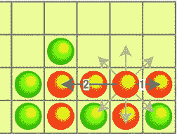

# 第三章：创建第一个游戏

`orientation` 指的是地址栏。页面似乎对方向变化没有响应。

下方两张图片展示了页面的正常行为。

关于网页游戏的一般建议：如果你能让你的游戏在横竖两种屏幕方向下都能运行——那就这样做。这样，你就不会违反标准行为，用户也会感到满意。如果无论如何都需要锁定屏幕方向——那就使用侵入性最小的方式来实现。本书其余部分的代码都依赖于标准浏览器行为，并不会强制指定任何特定方向。

**注意：** 在原生的安卓游戏中锁定屏幕方向是一种标准做法，因此，如果你设计的是原生游戏，则不应避免这样做。关于如何从 Web 应用制作原生游戏，更多信息请参见第 15 章。

本书中的大多数示例都使用了这个基本框架，本章的项目也不例外。我们刚刚实现的全屏画布设置当然不是布局网页的唯一可能方式。游戏可以有一个更小的画布，并将其余页面空间用于用户界面元素——例如，游戏内的聊天控件。然而，本节描述的方法是最典型的。

为了方便起见，该框架的代码单独保存在名为 `skeleton.html` 的文件中。一旦你开始新的游戏实验，就可以将其作为模板使用。

### 游戏架构

本节的目标是思考组成“四球游戏”的组件。这些组件的功能是什么？它们之间的关系又是什么？游戏是相对复杂的应用程序，可能包含数十个不同的类，每个类负责自己的任务：加载资源、渲染场景、游戏逻辑、网络、人工智能、声音等等。如果所有代码都放入一个庞大的类中（或者更糟糕，直接放入 HTML 页面的主体中），你最终会得到一个难以理解或修改的、怪物般的脚本。

我们希望我们的项目编写良好：没有用于保存状态的全局变量，代码中没有“坏味道”，并且拥有一个清晰、面向对象的 API，每个类都执行一组明确定义的功能。如果你对 JavaScript 中的继承和原型感到不自在，请毫不犹豫地回顾本书的第一章。理解这些原则对于本章至关重要。

**第三章：创建第一个游戏 99**

让我们从游戏流程开始，然后思考游戏如何被分解为一组独立的组件。以下是游戏加载后发生的事情：

1.  最初，用户看到空棋盘。
2.  用户点击棋盘放置棋子。如果该回合无效，则不会发生任何事。
3.  如果上一个回合是“获胜”回合，游戏会报告哪个玩家获胜：红色或绿色。如果棋盘上没有剩余空间，游戏则报告平局。否则，下一个玩家有机会进行他的回合。
4.  游戏结束后（无论获胜还是平局），玩家应该看到一个提示框，其中显示诸如“红方玩家获胜”之类的文本。
5.  最后，新游戏开始。棋盘清空，准备开始游戏。

非常简单，对吧？现在，让我们再进一步，思考为了实现上述流程，游戏具体需要具备哪些能力：

-   绘制棋盘和棋子（渲染）
-   检查回合是否有效且不违反游戏规则，并检查玩家是否获胜或是否达到平局状态（逻辑）
-   响应用户输入，并确定点击了哪一列（事件处理）
-   将组件连接起来：将浏览器事件传递给逻辑处理程序和渲染例程；当棋盘状态改变时更新 UI；管理游戏流程；报告获胜或平局；为新游戏清空棋盘；等等（内务管理）。

现在，将整个项目分解成各个类就非常容易了。它们如下所示：

-   `Game`：负责启动游戏、事件处理的类


## 第 3 章：创建第一个游戏

`handling`和`housekeeping`。它的任务是将其他组件连接起来，让它们相互通信。可以将其视为游戏的主要"编排"类。

- **`BoardModel`**：游戏的核心。负责实现机制的类。它存储游戏状态信息：哪些格子为空，哪些被红绿棋子占据，当前轮到哪位玩家，以及如果玩家将棋子放入第三列会发生什么。这里我们将实现游戏规则：走棋验证和获胜条件检查。
- **`BoardRenderer`**：负责视觉呈现和在画布上渲染游戏界面的类。当`BoardRenderer`需要渲染某个格子时，它会向`BoardModel`询问该格子的状态：是空、红色还是绿色？`BoardModel`充当渲染器的数据源。该类的代码大部分已在第 2 章编写完成。

为了让架构更清晰，以下示例展示了用户轻触屏幕时各类之间的交互流程：

1. 用户轻触屏幕。浏览器触发包含点击坐标的事件。
2. `Game`类接收事件并检查用户点击的是哪一列。它能够从浏览器坐标转换为列坐标，因为它知道棋盘在画布中的位置以及每列的宽度，因此可以判断出被点击的是哪一列。
3. 获得列索引后，`Game`询问`BoardModel`是否可以执行此操作。如果该列已满，将忽略无效输入。有效操作会更新`BoardModel`：新棋子出现在内部棋盘表示中。
4. 现在走棋已完成，但用户尚未在屏幕上看到任何变化。我们更新了模型但未更新画布——它仍显示旧版本棋盘。`Game`调用`BoardRenderer`重绘包含新棋子的格子。
5. 为重绘格子，`BoardRenderer`需要知道该格子中棋子的颜色。它从`BoardModel`获取颜色标识符，并渲染出带有渐变填充的可爱球体。
6. 现在画布已更新，玩家看到新棋子。
7. 最后，当比赛结束时，`Game`显示提示框通知用户结果。
8. `Game`"重置"`BoardModel`的状态，调用`BoardRenderer`重绘空棋盘，并开始新比赛。

### 制作游戏

一旦定义了架构，我们就可以开始编写代码。首先创建空文件夹，并将清单 3-5 中的骨架代码复制到`index.html`文件中。创建`js`文件夹——我们将把所有脚本保存在这里。现在可以按照第 1 章所述，将 nginx Web 服务器指向项目文件夹，以便使用真实设备测试游戏。

#### 渲染棋盘

我们将从`BoardRenderer`开始——这是项目中最简单的类。它负责渲染界面：背景、网格和棋子。本节中的大部分代码源自第 2 章的示例，因此看起来会比较熟悉。

创建名为`BoardRenderer.js`的新文件，并将其放入`js`文件夹。然后，在`index.html`文件中添加以下标签以加载脚本：

```html
<script src="js/BoardRenderer.js"></script>
```

在你最喜欢的 IDE 中打开新创建的文件，准备编写代码。

**注意：** 在本书中，每个示例都使用相同的命名约定和几乎相同的项目结构。当你需要创建新类并将其添加到项目时，首先在`<project_folder>/js`中创建空文件。文件名应为`<ClassName>.js`。例如，`BoardModel`类的代码应放在名为`BoardModel.js`的文件中。这是一种简单且非常方便的代码组织方式。它能让项目文件夹保持整洁，并便于查找所需类。同时，别忘了将你创建的每个脚本都包含到`index.html`页面中。

#### 构造函数

让我们从构造函数开始。编写类的构造函数时，


## 第 3 章：创建第一个游戏

你必须思考哪些数据类型对这个类来说是绝对必要的。它需要什么才能正常运行？`BoardRenderer`类需要`context`来进行绘制，否则将毫无用处。它还需要`BoardModel`来获取棋子的颜色。清单 3-8 展示了构造函数的前几行。

**清单 3-8.** *BoardRenderer 构造函数的第一个版本，保存了必要的参数*

```
function BoardRenderer(context, model) {
  this._ctx = context;
  this._model = model;
}
```

`_p = BoardRenderer.prototype;`

现在思考那些保存类状态的字段。将它们放入构造函数中，即使你暂时无法用有意义的值来初始化它们（参见清单 3-9）。将它们集中放在一处是个好习惯——当你打开文件阅读代码时，可以直接跳转到构造函数，查看所有保存类实例状态的变量。

**清单 3-9.** *BoardRenderer 构造函数，声明了所有变量*

```
function BoardRenderer(context, model) {
  this._ctx = context;
  this._model = model;
  // 为方便起见保存
  this._cols = model.getCols();
  this._rows = model.getRows();
  // 棋盘左上角
  this._x = 0;
  this._y = 0;
  // 棋盘矩形的宽度和高度
  this._width = 0;
  this._height = 0;
  // 棋盘格的最佳尺寸
  this._cellSize = 0;
}
```

如果你不理解这些字段从何而来，不必担心，我马上就会解释一切。

将类的原型引用保存到简短名称的变量中会非常方便，如下所示：

`_p = BoardRenderer.prototype;`

当你开始编写函数时，代码看起来会整洁得多。请看下面比较两种风格的片段。第一行使用了显式的原型，理解起来更困难：你必须在最终看到函数名之前，先阅读`BoardRenderer.prototype`这一部分（23 个字符！）。而在第二种情况下，只有两个字符。

`BoardRenderer.prototype.repaint = function() { … }` // 使用无简写变量
`_p.repaint = function() { … }` // 使用简写变量

### 处理不同的屏幕尺寸

这个类最重要的特性之一，是不应依赖于任何硬编码的坐标或尺寸。例如，如果你硬编码了棋子大小，就等于将这个类的使用范围限制在了特定分辨率和像素密度的设备上。在智能手机上看起来不错的棋子，在全高清笔记本电脑屏幕上可能就太小了。这就是保持所有尺寸相对性的重要性所在。清单 3-10 展示了如何计算棋子的半径和渐变偏移量。

**清单 3-10.** *计算棋子半径和渐变偏移量*

```
// 棋子半径
var radius = cellSize*0.4;
// 渐变中心
var gradientX = cellSize*0.1;
var gradientY = -cellSize*0.1;
var gradient = ctx.createRadialGradient(
  gradientX, gradientY, cellSize*0.1, // 内圈（高光）
  gradientX, gradientY, radius*1.2); // 外圈
```

`cellSize`变量在其他地方计算（确切地说是在`Game`类中），它代表浏览器窗口中棋盘格的最佳尺寸。屏幕越大，`cellSize`的值就越大。如果我们改变这个变量的值，所有元素会随之缩放，棋子保持其比例，渐变也仍能正确定位。清单 3-11 是为设置游戏 UI 参数（位置和`cellSize`）的函数代码。

**清单 3-11.** *设置游戏 UI 的参数：棋盘在画布中的位置以及每个格子的大小*

```
/**
 * 设置棋盘的新位置和尺寸。应该调用 repaint 来查看变化
 * @param x 左上角的 x 坐标
 * @param y 左上角的 y 坐标
 * @param cellSize 格子的最佳尺寸（以像素为单位）
 */
_p.setSize = function(x, y, cellSize) {
```

```
this._x = x;
this._y = y;
this._cellSize = cellSize;
this._width = this._cellSize*this._cols;
```


`this._height = this._cellSize * this._rows;` ;

**JSDoc 注释**

尽管函数体本身很简单，但这种注释风格对你来说可能是全新的。这种记录代码的方式被称为 **JSDoc**。它与普通的注释略有不同：它包含一些特殊的标签，这些标签以 `@` 字符开头，例如 `@param`。这些标签指明了所记录的代码的某个方面：函数的参数、代码作者的名字或变量的默认值。这些标签具有人类可读性，并不会让注释变得更难理解。但当你使用**IDE（集成开发环境）**等能够理解这些标签的工具时，它们的真正价值就体现出来了。JSDoc 标签易于解析，有助于创建结构更清晰的文档。图 3-3 展示了 WebStorm 如何渲染清单 3-11 所示函数中的 JSDoc 注释。

**图 3-3.** *WebStorm 中渲染的 JSDoc 注释*

有一些工具，例如 `jsdoc-toolkit` ([`code.google.com/p/jsdoc-toolkit/`](http://code.google.com/p/jsdoc-toolkit/))，能够为整个项目生成文档，形式是静态 HTML 文件，便于发布到网站上。`jsdoc-toolkit` 项目的维基页面（参见 [`code.google.com/p/jsdoc-toolkit/w/list`](http://code.google.com/p/jsdoc-toolkit/w/list)）是学习如何充分利用此格式的良好灵感来源。

第 3 章：创建第一个游戏

**105**

当然，是否使用这种格式，或者坚持使用老式的纯文本注释，这完全取决于你。我主张至少对于函数的参数和返回值，要使用 JSDoc 进行记录。

**注意：** JSDoc 是 **JavaDoc** 的 JavaScript 版本，JavaDoc 是用于 Java 代码自动生成文档的工具。JavaDoc 是记录 Java 代码的标准方式，开发者已经使用了超过 15 年。在 JavaScript 领域，它虽尚未成为事实上的标准，但却是一种编写详尽表达性文档的便捷方式。

本书中，我们经常会从代码清单中删除注释，因为代码通常会在正文中直接讨论。但各章节的源代码则包含了更详尽的注释。

**渲染棋盘**

回到 `BoardRenderer`，下面三个函数是第 2 章中代码的精炼版本：`_drawBackground()`、`_drawGrid()` 和 `drawToken()`（参见清单 3-12）。每个函数绘制用户界面（UI）的一个元素：带有曲线的渐变背景、网格或棋子。

**清单 3-12.** *渲染棋盘用户界面的函数：给定单元格中的背景、网格和棋子*

```
_p._drawBackground = function() {
    var ctx = this._ctx;
    // 背景
    var gradient = ctx.createLinearGradient(0, 0, 0, this._height);
    gradient.addColorStop(0, "#fffbb3");
    gradient.addColorStop(1, "#f6f6b2");
    ctx.fillStyle = gradient;
    ctx.fillRect(0, 0, this._width, this._height);
    // 绘制曲线
    var co = this._width/6; // 曲线偏移量
    ctx.strokeStyle = "#dad7ac";
    ctx.fillStyle = "#f6f6b2";
    // 第一条曲线
    ctx.beginPath();
    ctx.moveTo(co, this._height);
    ctx.bezierCurveTo(this._width + co*3, -co,
        -co*3, -co, this._width - co, this._height);
    ctx.fill();
    // 第二条曲线
    ctx.beginPath();
    ctx.moveTo(co, 0);
    ctx.bezierCurveTo(this._width + co*3, this._height + co,
        -co*3, this._height + co, this._width - co, 0);
    ctx.fill();
};

_p._drawGrid = function() {
    var ctx = this._ctx;
    ctx.beginPath();
    // 绘制水平线
    for (var i = 0; i <= this._cols; i++) {
        ctx.moveTo(i*this._cellSize + 0.5, 0.5);
        ctx.lineTo(i*this._cellSize + 0.5, this._height + 0.5)
    }
    // 绘制垂直线
    for (var j = 0; j <= this._rows; j++) {
        ctx.moveTo(0.5, j*this._cellSize + 0.5);
        ctx.lineTo(this._width + 0.5, j*this._cellSize + 0.5);
    }
    // 描边以在屏幕上显示
    ctx.strokeStyle = "#CCC";
    ctx.stroke();
};

_p.drawToken = function(cellX, cellY) {
    var ctx = this._ctx;
    var cellSize = this._cellSize;
    var tokenType = this._model.getPiece(cellX, cellY);
    // 单元格为空
    if (!tokenType)
        return;
```


```javascript
var colorCode = "black";

switch(tokenType) {

case BoardModel.RED:

colorCode = "red";

break;

case BoardModel.GREEN:

colorCode = "green";

break;

}
```

## 第三章：创建首个游戏

```javascript
// 棋子的中心
var x = this._x + (cellX + 0.5)*cellSize;
var y = this._y + (cellY + 0.5)*cellSize;
ctx.save();
ctx.translate(x, y);

// 棋子半径
var radius = cellSize*0.4;

// 渐变中心点
var gradientX = cellSize*0.1;
var gradientY = -cellSize*0.1;

var gradient = ctx.createRadialGradient(
    gradientX, gradientY, cellSize*0.1, // 内圆（高光）
    gradientX, gradientY, radius*1.2); // 外圆

gradient.addColorStop(0, "yellow"); // “光源”的颜色
gradient.addColorStop(1, colorCode); // 棋子的颜色

ctx.fillStyle = gradient;
ctx.beginPath();
ctx.arc(0, 0, radius, 0, 2*Math.PI, true);
ctx.fill();
ctx.restore();
```

**注意：** `BoardRenderer` 的函数依赖 `BoardModel` 来获取单元格中棋子的颜色。我们将在下一节创建这个类，因此你现在还无法直接运行代码。如果你仍然急于尝试其效果，可以先对值进行硬编码，测试渲染效果，待 `BoardModel` 准备就绪后再切换回来。

我们需要创建的最后一个函数是 `repaint`（见清单 3-13）。它按步骤渲染整个棋盘：先绘制背景，再绘制网格，最后绘制棋子。

**清单 3-13.** *Repaint 函数从头开始渲染整个棋盘*

```javascript
_p.repaint = function() {
    this._ctx.save();
    this._ctx.translate(this._x, this._y);
    this._drawBackground();
    this._drawGrid();
    this._ctx.restore();

    for (var i = 0; i < this._cols; i++) {
        for (var j = 0; j < this._rows; j++) {
            this.drawToken(i, j);
        }
    }
};
```

`BoardRenderer` 现已就绪。让我们再次回顾类的结构。它有两个用于绘制的公开方法：`repaint()` 和 `drawToken()`。第一个方法用于重新渲染整个棋盘，例如当屏幕方向发生改变时。第二个方法用于在用户执行一次有效操作后绘制单个棋子。当然，我们也可以每次都重新渲染整个棋盘，但这会造成资源浪费（虽然不太明显，但我们希望把事情做到位）。

`BoardRenderer` 不会自行决定棋盘的优化尺寸。这个任务留给了其他类，因为 `BoardRenderer` 对其运行环境（屏幕尺寸、画布大小或像素密度）一无所知。这个类的职责是绘制——并且只负责绘制。

**注意：** 只执行小任务的细粒度类是 API 设计良好的标志。这个原则被称为“单一职责”。它是面向对象编程五大基本原则之一。如果你有兴趣了解其他四个原则，可以从维基百科的相关条目开始查阅：[`en.wikipedia.org/wiki/SOLID_(object-oriented_design)`](http://en.wikipedia.org/wiki/SOLID_(object-oriented_design))。

本章的源代码中包含该类的最终版本。文件名为 `BoardRenderer.js`。

### 游戏状态与逻辑

我们已经有了一个能渲染棋盘当前状态的类，但缺少一个负责持有该状态的类。让我们来创建一个！像往常一样开始：在项目的 `js` 文件夹中创建一个名为 `BoardModel.js` 的新文件，并在 `index.html` 中添加额外的 `<script>` 标签来加载它。现在你可以编写这个类的代码了。

让我们从构造函数开始，如清单 3-14 所示。

**清单 3-14.** *BoardModel 构造函数*

```javascript
function BoardModel(cols, rows) {
    this._cols = cols || 7;
    this._rows = rows || 6;
    this._data = [];
    this._currentPlayer = BoardModel.RED;
    this._totalTokens = 0;
    this.reset();
}

_p = BoardModel.prototype;
```

构造函数接受两个可选参数：棋盘的列数和行数。JavaScript 在语言层面没有可选参数的概念。要使参数变为可选，你需要检查它是否被设置，若未设置则使用默认值。

这一行代码

```javascript
this._cols = cols || 7
```

等同于

```javascript
if (cols) {
```


```javascript
this._cols = cols;

} else {

this._cols = 7;

}
```

变量`_data`保存游戏的当前状态——一个二维数字数组：`0`代表空单元格，`1`代表红色棋子，`2`代表绿色棋子。

通过此类 ID 引用棋子容易出错。考虑以下代码，它检查单元格中的棋子是否为绿色：

```javascript
if (this._data[i][j] == 2) {
  /* 2 是什么？这里发生了什么？ */
}
```

这段代码难以立即理解。让我们为每个 ID 创建变量并使用它们。将代码清单 3-15 中的代码添加到`BoardModel`类中。

**代码清单 3-15.** *使用“常量”代替数字的代码更易读*
```javascript
BoardModel.EMPTY = 0;
BoardModel.RED = 1;
BoardModel.GREEN = 2;
```

现在，同样的颜色检查代码变得容易理解多了：

```javascript
if (this._data[i][j] == BoardModel.GREEN) {
  /* 好，明白了，是绿色，让我们做点什么 */
}
```

**第 3 章：创建第一个游戏**

**注意：** 大写命名的变量（`CAPITAL_CASED`）是另一种代码约定，就像下划线开头的私有变量（`_underlinedPrivateVariables`）一样。它表示该变量是一个“常量”——一旦初始化，就不能更改其值。

初始化代码分为两个函数：构造函数和名为`reset`的函数。之所以有独立的`reset`函数，是因为我们在多轮游戏中复用同一个`BoardModel`实例。它将对象恢复到初始状态，就像刚构造完成后一样：空棋盘、总棋子数为 0、第一个移动的玩家是`RED`。`reset()`函数的代码如代码清单 3-16 所示。

**代码清单 3-16.** *将游戏板重置为初始状态*
```javascript
_p.reset = function() {
    this._data = [];
    for (var i = 0; i < this._rows; i++) {
        this._data[i] = [];
        for (var j = 0; j < this._cols; j++) {
            this._data[i][j] = BoardModel.EMPTY;
        }
    }
    this._currentPlayer = BoardModel.RED;
    this._totalTokens = 0;
};
```

`BoardModel`外部的代码需要访问游戏状态。例如，`BoardRenderer`需要读取单元格的状态才能绘制棋子。让我们添加一些公共函数来支持这一点（见代码清单 3-17）。

**代码清单 3-17.** *访问游戏板状态的函数*
```javascript
_p.getPiece = function(col, row) {
    return this._data[row][col];
};

_p.getCols = function() {
    return this._cols;
};

_p.getRows = function() {
    return this._rows;
};
```

初始化代码现已就位，我们可以进入最有趣的部分：游戏逻辑的实现。

**第 3 章：创建第一个游戏**

### 进行移动

当玩家点击屏幕时会发生什么？根据流程，一旦我们获得列的 ID，我们将执行以下操作：

1.  检查移动是否有效（如果无效——立即返回）
2.  更新游戏状态（切换玩家，增加移动计数器，将棋子放入单元格）
3.  检查是否满足胜利或平局条件

移动的有效性意味着列 ID 在范围内（例如，当只有七列时，将棋子放在第 10 列是不允许的），并且目标列至少有一个空单元格。这两个条件都非常容易检查。如果移动有效，`BoardModel`会放置棋子并检查胜利条件（我们将在下一节实现这种检查）。代码清单 3-18 的注释很完善，因此不难理解。

**代码清单 3-18.** *检查新移动的有效性并更新棋盘*
```javascript
_p.makeTurn = function(column) {
    // 我们要放下的棋子的颜色
    var piece = this._currentPlayer;

    // 检查列是否有效
    if (column < 0 || column > this._cols) {
        return {
            status: BoardModel.ILLEGAL_TURN
        }
    }

    // 检查给定列中是否存在空行，
    // 如果没有空行，则此次移动非法
    var row = this._getEmptyRow(column);
    if (row == -1) {
        return {
            status: BoardModel.ILLEGAL_TURN
        }
    }

    // 我们找到了空行，可以放下棋子
    this._totalTokens++;
    this._data[row][column] = piece;

    // 切换下一个玩家
    this._toggleCurrentPlayer();

    // 返回成功的移动以及游戏的
    // 新状态（NONE、WIN 或 DRAW）
    return {
```
**第 3 章：创建第一个游戏**


`status: this._getGameState(column, row)`,

`x: column`,

`y: row`,

`piece: piece`

};

};

`_p._getEmptyRow = function(column)` {

for (var i = this._rows - 1; i >= 0; i--) {

if (!this.getPiece(column, i)) {

return i;

}

}

return -1;

};

`_p._toggleCurrentPlayer = function()` {

if (this._currentPlayer == BoardModel.RED)

this._currentPlayer = BoardModel.GREEN;

else

this._currentPlayer = BoardModel.RED;

};

`makeTurn` 函数返回一个描述回合结果的对象：回合是否成功？棋子的颜色和落子的位置是什么？我们必须引入几个额外的常量来标识游戏的不同状态：`NONE`（正常状态，游戏进行中）、`WIN`（上一回合是获胜回合）、`DRAW`（没有剩余空格，平局）和`ILLEGAL_TURN`（状态未改变，因为该回合不被允许）。使用常量而非直接使用数字的原因与之前相同：使用常量编写的代码更易于阅读（参见清单 3-19）。

**清单 3-19.** 定义更多“常量”来引用游戏状态

```javascript
/**
 * Game state after the turn
 */
BoardModel.NONE = 0;           // No win or draw
BoardModel.WIN = 1;            // The player who just dropped a piece has won
BoardModel.DRAW = 2;           // No more free cells in the board - it is a draw
BoardModel.ILLEGAL_TURN = 3;   // The last attempted move was illegal
```

唯一需要编写的函数是`_getGameState()`，它检查游戏是否达到获胜条件。



第 3 章：创建第一个游戏

**113**

**获胜条件**

游戏的目标从其名称“四球”中显而易见。如果最后一步完成了一条由四个或更多同色棋子组成的直线，那么落下最后一个棋子的玩家即为赢家。该算法在`_getGameState()`函数中实现。它比例如国际象棋的算法要简单得多。不过，它仍然值得用几句话来解释。

显然，最后落下的棋子必须是获胜线的一部分；否则，游戏在当前回合之前就已经结束了。我们需要检查是否存在一条通过给定单元格（即最后一个棋子落下的格子）的直线，该直线由四个或更多同色棋子组成。我们计算所有可能方向上构成直线的棋子数量。例如，如果左边有两个同色棋子，右边有一个同色棋子，那么我们就有一条由四个棋子组成的线：左边两个，右边一个，以及中间的一个——即最后一步落下的棋子。我们对水平线、垂直线以及两条对角线分别进行此检查。

图 3-4 说明了这些检查的工作原理。图中存在获胜条件，因为有一条由四个球组成的水平线。最后落下的球左边有两个球，右边有一个球，总共四个。

**图 3-4.** 检查获胜条件

实现此检查的代码非常精简。它被拆分为两个函数。其中一个函数`_checkWinDirection()`，从最后落下的球开始，计算在某个方向上相同颜色的球有多少个。另一个函数`_getGameState()`，在检查完所有可能的方向后返回游戏状态。方向由两个数值设置：`deltaX`和`deltaY`。在循环的每一步，这些值都会被加到单元格的坐标上。例如，如果`deltaX`为 -1，意味着我们每一步都会减小列索引（向左移动）；如果`deltaY`为 0，意味着每一步行索引保持不变。结合起来，就产生了向左移动。如果单元格坐标为 (4, 2)，则检查以下单元格： (3, 2), (2, 2), (1, 2)。当然，如果其中一个单元格为空或存在不同颜色的棋子，检查将提前结束。清单 3-20 展示了`_checkWinDirection`的代码，该函数计算在给定方向上相同颜色球的数量。


### 排版后的文本

**清单 3-20** *检查特定方向上同色球的数量*

`_p.checkWinDirection = function(column, row, deltaX, deltaY) {`

```javascript
var pieceColor = this.getPiece(column, row);
var tokenCounter = 0;
var c = column + deltaX;
var r = row + deltaY;
while (c >= 0 && r >= 0 && c < this._cols && r < this._rows && this.getPiece(c, r) == pieceColor) {
      c += deltaX;
      r += deltaY;
      tokenCounter++;
}
return tokenCounter;
};
```

该“行”由两个相反方向组成。例如，图 3-3 中的获胜行有两个方向：左和右。我们在循环中将`deltaX`和`deltaY`的值从-1 改为 1，尝试每一种可能的方向。当`deltaX`和`deltaY`均为 0 时，跳过此步骤。显然，如果不移动任何位置，就会陷入无限循环。`_getGameState()`计算每一行中的棋子数量，如果该数量大于 4，则报告获胜（参见清单 3-21）。

**清单 3-21** *检查获胜状态*

`_p.getGameState = function(column, row) {`

```javascript
if (this._totalTokens == Game.BOARD_WIDTH * Game.BOARD_HEIGHT)
      return BoardModel.DRAW;
for (var deltaX = -1; deltaX < 2; deltaX++) {
      for (var deltaY = -1; deltaY < 2; deltaY++) {
            if (deltaX == 0 && deltaY == 0)
                  continue;
            var count = this._checkWinDirection(column, row, deltaX, deltaY)
                  + this._checkWinDirection(column, row, -deltaX, -deltaY) + 1;
            if (count >= 4) {
                  return BoardModel.WIN;
            }
      }
}
return BoardModel.NONE;
};
```

**第 3 章：创建第一个游戏**

现在我们已经创建了`BoardModel`——整个项目中最复杂的类。该类的完整注释代码可在本章的`BoardModel.js`文件中找到。我们现在有了游戏逻辑，以及将棋盘渲染到画布上的类。如果我们让它们协同工作，就会得到游戏！

### 连接组件：Game 类

应用程序的主类是`Game`类。它负责连接`Board`和`BoardModel`，响应用户输入和方向变化，并管理游戏生命周期。应用程序的生命周期非常简单。游戏开始，玩家依次点击屏幕轮流操作。当一名玩家获胜或棋盘满时，应用程序显示警告对话框并重置棋盘进行下一轮。`Game`类还确定`Board`的最佳位置和大小。

首先在`js`文件夹中创建另一个名为`Game.js`的文件，并将脚本标签添加到`index.html`文件中。我相信你已经明白了——每次创建新类时，我们都执行相同的步骤。在以下示例中，我假设你已经知道如何操作。像往常一样，从构造函数开始（参见清单 3-22）。

**清单 3-22** *Game 的构造函数*

```javascript
function Game(canvas) {
      this._boardRect = null;
      this._canvas = canvas;
      this._ctx = canvas.getContext("2d");
      this._boardModel = new BoardModel();
      this._boardRenderer = new BoardRenderer(this._ctx, this._boardModel);
      this.handleResize();
}
_p = Game.prototype;
```

构造函数接受一个参数——`canvas` DOM 元素。`_boardRect`变量是一个对象，用于存储当前棋盘在画布内的位置信息以及单元格的大小。我们需要它来处理点击事件，并将画布坐标转换为棋盘坐标。我们直接创建了两个对象：`_boardModel`和`_boardRenderer`。它们实现了游戏最重要的部分：图形和逻辑。

构造函数在最后一行调用了`handleResize`函数。该函数重新绘制整个 UI。它在两种情况下被调用：要么在构造函数中（用于渲染初始棋盘），要么在浏览器窗口调整大小后（因为画布刷新的内容需要重新渲染棋盘）。该函数的代码如清单 3-23 所示。

**清单 3-23** *处理大小调整*

```javascript
_p.handleResize = function() {
      this._clearCanvas();
      this._boardRect = this._getBoardRect();
```


`this._boardRenderer.setSize(this._boardRect.x, this._boardRect.y, this._boardRect.cellSize);`  
`this._boardRenderer.repaint();`  
};  

清除画布背景后，`handleResize()` 借助 `_getBoardRect()` 函数更新棋盘参数（位置和尺寸）。随后将新参数传递给 `_boardRenderer`，使其在空白画布上重新绘制新版棋盘。`_getBoardRect()` 的算法非常简单：计算出可容纳的最大区域，然后将棋盘居中显示在屏幕上（见代码清单 3-24）。  

**代码清单 3-24.** *调整棋盘尺寸：为界面留出最大空间并将其置于屏幕中央*  

```
_p._getBoardRect = function() {
    var cols = this._boardModel.getCols();
    var rows = this._boardModel.getRows();
    var cellSize = Math.floor(
        Math.min(this._canvas.width/cols, this._canvas.height/rows));
    var boardWidth = cellSize*cols;
    var boardHeight = cellSize*rows;
    return {
        x: Math.floor((this._canvas.width - boardWidth)/2),
        y: Math.floor((this._canvas.height - boardHeight)/2),
        cellSize: cellSize
    }
};
```  

现在来看最重要的部分：`Game` 类必须处理点击事件，并将其转化为玩家操作（见代码清单 3-25）。我们将负责处理此功能的方法命名为 `handleClick()`（尽管它同时处理鼠标点击和触屏点击）。每当用户点击屏幕，该方法就将点击坐标转换为列 ID，并启动整个“新落子”流程。有效操作会更新界面：我们在棋子落下的位置绘制新棋子。最后一步是检查获胜条件。如果出现胜者或棋盘已满，我们会弹出提示框并重置游戏。  

**代码清单 3-25.** *处理点击事件*  

```
_p.handleClick = function(x, y) {
    // 获取列索引
    var column = Math.floor((x - this._boardRect.x)/this._boardRect.cellSize);
    // 执行落子并检查结果
    var turn = this._boardModel.makeTurn(column);
    // 如果落子合法，更新棋盘并绘制新棋子
    if (turn.status != BoardModel.ILLEGAL_TURN) {
        this._boardRenderer.drawToken(turn.x, turn.y);
    }
    // 最后一手后是否有胜者？
    if (turn.status == BoardModel.WIN) {
        // 通知结果并重置棋盘以开始新一局
        alert((turn.piece == BoardModel.RED ? "红色" : "绿色") + " 赢得了比赛！");
        this._reset();
    }
    // 如果平局，做相同处理
    if (turn.status == BoardModel.DRAW) {
        alert("平局！");
        this._reset();
    }
};
```  

最后需要强调的两个函数是 `_reset()` 和 `_clearCanvas()`（见代码清单 3-26）。两个函数都很简单。`_reset()` 负责为新游戏准备一切，而 `_clearCanvas()` 则用纯白色填充画布。  

**代码清单 3-26.** *`_reset` 和 `_clearCanvas` 函数*  

```
_p._reset = function() {
    this._clearCanvas();
    this._boardModel.reset();
    this._boardRenderer.repaint();
};

_p._clearCanvas = function() {
    this._ctx.fillStyle = "white";
    this._ctx.fillRect(0, 0, this._canvas.width, this._canvas.height);
};
```  

该类的完整版及详细注释文档可随本章源代码在 `Game.js` 文件中获取。  

## 将游戏添加到 HTML 骨架  

最后一步是添加用户输入处理，并更新 `index.html` 文件，以便页面加载时启动游戏，并将所有重要的浏览器事件传递给它。打开 `index.html`，按代码清单 3-27 所示修改代码。  

**代码清单 3-27.** *将游戏添加到骨架中*  

```
<!DOCTYPE html>
<html lang="en">
<head>
    <meta charset="utf-8" />
    <meta name="viewport"
          content="width=device-width, initial-scale=1.0, maximum-scale=1.0,
                   user-scalable=no, target-densitydpi=device-dpi"/>
    <style>
        html, body {
            overflow: hidden;
            width: 100%;
            height: 100%;
            margin:0;
            padding:0;
            border: 0;
        }
    </style>
    <script src="js/BoardRenderer.js"></script>
    <script src="js/BoardModel.js"></script>
    <script src="js/Game.js"></script>
    <script>
        var game;
        function init() {
            var canvas = initFullScreenCanvas("mainCanvas");
```


```javascript
game = new Game(canvas);

if (isTouchDevice()) {
    canvas.addEventListener("touchstart", function(e) {
        var touch = event.targetTouches[0];
        game.handleClick(touch.pageX, touch.pageY);
        e.stopPropagation();
        e.preventDefault();
    }, false);
} else {
    canvas.addEventListener("mouseup", function(e) {
        game.handleClick(e.pageX, e.pageY);
        e.stopPropagation();
        e.preventDefault();
    }, false);
}
```

```javascript
function initFullScreenCanvas(canvasId) {
    var canvas = document.getElementById(canvasId);
    resizeCanvas(canvas);
    window.addEventListener("resize", function() {
        resizeCanvas(canvas);
    });
    return canvas;
}

function resizeCanvas(canvas) {
    canvas.width = document.width || document.body.clientWidth;
    canvas.height = document.height || document.body.clientHeight;
    game && game.handleResize();
}

function isTouchDevice() {
    return ('ontouchstart' in document.documentElement);
}
```

```html
</script>
</head>
<body onload="init()">
<canvas id="mainCanvas" width="100" height="100"></canvas>
</body>
</html>
```

让我们简要回顾一下代码。本章过程中添加了三个 `<script>` 块，每个块分别加载了一个类：`BoardRenderer`、`BoardModel` 和 `Game`。要启动游戏，我们创建了一个 `Game` 的新实例。此时，用户会看到渲染好的棋盘，随时可以开始游玩。我们在 `resizeCanvas()` 函数中添加了一行代码，用于通知游戏实例每次尺寸调整事件：`game && game.handleResize()`。这行代码等同于以下内容：

```javascript
if (game) {
    game.handleResize();
}
```

我们需要检查 `game` 变量是否存在，因为首次调用此函数时，它尚未被创建。

`init()` 函数末尾那段加粗代码的重点是处理触摸和鼠标点击事件。当用户按下鼠标按钮或点击屏幕时，游戏会收到此事件的通知。如果你现在还不太习惯处理 DOM 事件，请不要担心；我将在下一章详细解释。目前，你只需相信这段代码神奇地将点击坐标传递给了 `Game`。

**注意：** 在下一章中，我们将更深入地探讨用户输入的处理。现在，你只需相信这段代码确实在运行。我们让这个游戏同时支持使用触屏的安卓设备和 WebKit 系列的桌面浏览器。正因如此，我们必须处理两种类型的输入：触摸事件和鼠标点击。

即使你不打算在桌面端发布游戏，这项工作也值得一做。鼠标处理代码只增加了额外的几行，但却因此可以在桌面端调试应用程序。要了解更多关于调试移动网络应用的内容，请参考附录 A。

就这样。游戏已准备就绪，可以启动并享受了。这个版本非常简单，还有很多改进空间：比如最好能在某处显示玩家姓名、指示下一步轮到哪位玩家，以及制作一个计分板。此外，大多数商业级游戏都有人工智能（AI），因为用户通常不一定有真人伙伴一起游玩。（我们将在第 13 章学习更多关于 AI 的知识。）你还可以添加动画——让棋子掉落时有动态效果（动画将在第 4 章描述），添加音效（在第 16 章中介绍），或者创建一个原生安卓应用程序并通过安卓市场分发你的游戏（第 15 章是一个很好的起点）。然而，最重要的是，你现在已经拥有了你的第一个真正的游戏！

## 总结

在本章中，我们创建了一个名为“四球”的简单游戏。我们首先了解了网络游戏所使用的 HTML 页面结构。接着，我们为游戏及相关实验创建了一个独立的 HTML 骨架，将在本书后续章节中使用。

我们分析游戏并将代码划分为三个类，每个类都有自己的一套职责。

我们构建了 `BoardRenderer`（负责绘制棋盘和棋子的类）、`BoardModel`（负责验证落子并检查胜负条件的类）以及 `Game`（负责协调其他类的类）。


