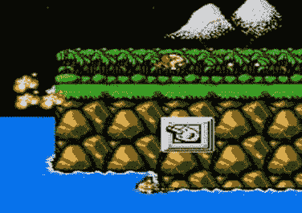

# 第三章：创建第一个游戏

**121**

……两个部分，并管理游戏生命周期。游戏逻辑与用户界面、用户输入处理及生命周期管理相分离。

我们游戏的各个组件相互独立。我们可以改变棋盘的外观而无需修改`BoardModel`或`Game`中的代码。我们可以修改游戏规则——例如，让随机玩家先走，这一改动不会影响其他组件。项目规模越大，思考架构和可维护性就越重要。

本游戏中的所有图形均在运行时渲染，完全没有静态图像。我们设计的游戏界面支持各种屏幕尺寸和分辨率。该游戏在移动设备、平板电脑和个人电脑上都能呈现良好效果。为此，我们必须正确处理方向变化和浏览器窗口大小调整。

完成第一个游戏是最重要的一步。现在我们就可以添加激动人心的新功能，或探索更复杂的游戏类型，比如包含动画角色、广阔世界和多人游戏功能的游戏。然而，如果不理解前三章的内容（JavaScript 面向对象方法、Canvas API 以及游戏架构基础），这一切都将无从谈起。

