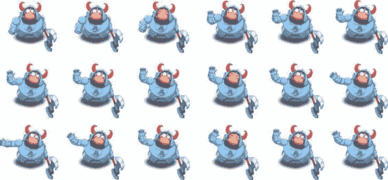
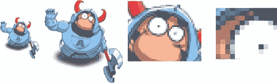

# 第四章：动画与精灵

在上一章中，我们创建了第一个网页游戏：双人版四球游戏。这个游戏非常简单，我们仅使用了基本图形（线条、圆形和渐变）来显示棋盘。当然，很多其他游戏也可以用完全相同的工具集创建，但如果我们想做更酷的事情呢？比如，一款二维平台射击游戏？

平台射击游戏通常比益智游戏拥有更丰富的图形（见图 4-1）。这类游戏有一个主角，可以跑、跳，当然还有射击。射击游戏中还有敌人、物品、地形以及许多其他元素来娱乐玩家。换句话说，你需要的不只是圆形和方块，还需要使用通常由图形艺术家创建的自定义图形和动画。

**图 4-1.** *科乐美（Konami）在 80 年代末发布的平台射击游戏（或称跑轰游戏）《魂斗罗》的截图。如你所见，用线条和圆形很难绘制出这类复杂元素。*

假设你已经有了一位经验丰富的艺术家：有人能为你的游戏注入生机，创造出出色的图形。

你向艺术家解释了一个游戏创意——你需要一个能跑、能跳、能射击的角色，还需要几个背景、世界元素和几个“坏蛋”。一两周后，艺术家给了你几个像图 4-2 那样的 PNG 文件。现在你的工作就是用它来制作游戏。

**图 4-2.** *你可能从艺术家那里获得的图形资源*

在本章中，我们将学习三个关键的游戏开发概念：处理位图图形、利用帧序列制作动画以及实现用户输入。

**注意：** 本章中使用的精彩动画骑士由 MarcusFilm（[www.marcusstudio.com.ua](http://www.marcusstudio.com.ua)）慷慨提供。您可以在自己的项目（业余或商业）中免费使用该骑士。更多艺术资源请访问 MarcusFilm 主页。

### 精灵

在游戏开发中，光栅图像通常被称为精灵。它可以是静态图像，也可以是动画序列的一帧，如图 4-2 所示。当多个精灵被放置在一个文件中时，就称为精灵表（Sprite Sheet）。图 4-2 是包含 18 张图像的精灵表的一部分，每张图像都是角色动画（跳跃、奔跑或行走）的一帧。

**125**

**注意：** 二维图形中有两个对立的概念：矢量图形和光栅图形。

### 矢量图形 vs. 光栅图形

`矢量图形`以公式和坐标的形式存储。例如，圆形可以存储为其圆心坐标和半径值。如果你想把一个圆形放大 30%，只需将半径乘以`1.3`然后重新渲染图形。同样的概念也适用于任何其他图形基元——线条、曲线和矩形。这就是矢量图形易于缩放的原因。尝试在不同屏幕尺寸的设备上运行我们的四球游戏，你会发现它在各处都表现良好。

`精灵`是*位图*或*光栅*图形的一个例子。光栅图形背后没有令人头疼的数学计算。你可以将其视为一个二维像素阵列。光栅图形只有在原始尺寸下看起来才完美。一旦你开始放大或缩小它们，效果就会大打折扣。除了视觉效果差，缩放图像还会影响性能。本章后面会对此进行更详细的讨论。

我们在上一章中使用的图形基元与即将尝试的光栅图像之间的主要区别在于它们的表示方式。基元由定义形状的参数来表示，而光栅图像则是一个由像素颜色组成的二维数组。图像需要更多的内存，但能带来一定的性能提升，尤其是在处理复杂图形时。渲染精灵的过程就是简单地将像素从图像复制到屏幕上——无需数学计算意味着更少的计算量和更快的渲染速度。精灵的主要优势在于你可以制作出明显更复杂、更具吸引力的图形。但精灵本质上是一组像素，这意味着它们的缩放效果并不好。

我们在上一章中制作的四球游戏在任何分辨率下都会显示良好，因为每个元素都由一个或多个“公式”来描述。例如，圆形由圆心和半径定义。如果你把圆形放大一倍，它看起来依然好看——只是变大了而已。图形 API 会尽力绘制出平滑的图形。而精灵是图像；如果你增大精灵的尺寸，图形 API 会尝试放大每一个像素。因此，当精灵被放大一倍时，根据你采用的缩放方法，它会看起来参差不齐或模糊不清。请查看图 4-3，了解一旦开始缩放精灵会发生什么。

## 第 4 章：动画与精灵

**图 4-3.** 缩放操作对精灵效果很差。放大的倍数越多，它看起来就越像是一大堆混乱的像素。

这意味着，如果你想让游戏在每一种屏幕分辨率和密度下都看起来不错，就需要付出一些额外的努力。好消息是，canvas 在处理精灵缩放方面做得相当不错。因此，如果你缩放幅度不大，它们看起来仍然相当好。经验法则是“尽可能避免缩放光栅图像”。

你的服务器上有一个`PNG`文件，现在我们需要加载并绘制它！

### 加载图像

在渲染图像之前，你需要完成的第一步是加载它们：从服务器传输图像字节，或直接在 JavaScript 代码中提供它们；让浏览器解析数据；以内部格式存储图像；并确保结果成功。对这个过程的描述比实际执行所有这些步骤的代码要长得多。在本节中，我们将学习如何加载一张图像，以及如何为多张图像组织加载过程。我们将探讨两种方法：从文件加载图像和从数据 URL（一种编码了像素数据的字符串）加载图像。

#### 从文件加载图像

在 JavaScript 中加载图像是一项非常简单的任务。你不必关心图像格式的解析、网络传输或缓存问题：浏览器替你完成了这些繁重的工作。你所要做的就是创建一个`Image`对象，并为其分配`src`属性。完成这一步后，浏览器就会开始从服务器或其缓存中加载图像。一旦图像加载完成，浏览器会通知...

