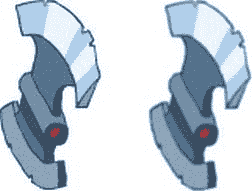

# 图像优化策略

你有一张巨大的单张图像，即便是微小的更新也会强制客户端重新下载所有游戏内容。换句话说，这非常令人头疼。

一般的推荐做法是将精灵图按类别拆分；例如，主角一张图，敌人一张图，关卡物品一张图，等等。如果你决定更新某个物品，只需要重新下载一张图。

你还应该考虑到，在游戏开始的第一分钟内，你几乎不可能需要所有游戏图形。例如，平台射击游戏通常有多个关卡。每个关卡可能有独特的图形——比如独特的背景或独特的敌人——这些图形在其他关卡中并不需要。显然，你不应该在用户到达某个关卡之前就下载这些图形。那将是浪费时间和带宽。

## 文件与数据 URL

`Data URL` 并不是处理图像的常见方式。尽管 `Data URL` 有很多优点，但它们也有缺点。

第一个也是最明显的缺点是 `Data URL` 难以管理。你可以在查看器应用程序中遍历图像，轻松找到你需要的图像。而 `Data URL` 是一堆乱码；你无法区分编码为 `Data URL` 的汽车图像和同样方式编码的仓鼠图像（除非你是机器人，或者拥有即时解码 `Base64` 的特殊超能力）。

图像以二进制文件存储时占用空间更小。`Data URL` 的大小比同一图像作为文件的大小大约大 30%。如果你使用的网页服务器正在压缩内容，这个比率会略好一些，但二进制文件仍然更优。

使用 `Data URL` 会将脚本与资源“耦合”，这是一种不好的做法。一旦你修改了其中任何一个，客户端就必须重新下载整个文件。编辑图像后，你必须重新生成 `Data URL`。每次设计师改动一个像素，你就必须更新代码。

`Data URL` 的好处在于它们是文本。它们可以通过只接受文本的系统传输。它们可以嵌入到代码中，但这并不意味着它们应该被嵌入到代码中。上一节中的例子——占位图像——是 `Data URL` 的正确用法。我们想确保图像始终对脚本可用，这就是我们使用 `Data URL` 的原因。

``

第四章：动画与精灵图

**139**

## 那么策略是什么？

检查你的游戏是否需要在启动时加载所有图形，或者某些文件可以等到玩家到达游戏中的某个节点再加载。如果是这种情况，你应该将可以延迟加载的图形分开，并在需要时才加载它们。

一张合适的图像大小应该在 `50 KB` 到 `250 KB` 之间。如果小于这个范围，会产生大量请求，因此你应该将几个小文件合并成一个大文件（包含多个小精灵图的大图像被称为精灵表，我们将在本章后面讨论）。如果你的文件明显更大，它们会卡住进度指示器。此外，如果你修改了其中哪怕一个像素，你就必须从服务器重新下载它。

在有充分理由时使用 `Data URL`；否则，就使用传统的图像文件。

### 绘制图像

加载图像本身并不有趣，但一旦你知道如何加载它，你就可以在画布上绘制它了。让我们继续我们的绘制实验。

#### 如何绘制图像

`Context2D API` 中有一个专门的函数用于绘制图像，它叫做 `drawImage()`。其思路是从图像（源）中获取一个矩形像素区域，并将其适配到画布（目标）中的矩形区域，如图 4-5 所示。

***图 4-5.** 在画布上绘制图像*

``

第四章：动画与精灵图

该函数接受八个参数：

```
drawImage(image, sx, sy, sWidth, sHeight, dx, dy, dWidth, dHeight)
```


第一个参数是我们加载的`Image`对象。接下来的四个参数：`sx`、`sy`、`sWidth`和`sHeight`定义了要绘制的图像部分，此矩形外的所有内容将被忽略。参数名中的小写‘`s`’代表“`source`”（源）。最后四个参数定义画布上的一个矩形，用于将图像部分绘制进去。参数名中的小写‘`d`’代表“`destination`”（目标）。

如果目标矩形与源矩形不同（更大、更小或边长比例不同），图像将被缩放以适应目标区域（见图 4-6）。栅格图像在未缩放时效果最佳，因此应尽量保持源矩形和目标矩形的大小一致。不过，这种效果可用于制作精美的动画。

**图 4-6.** 如果源矩形与目标矩形不同，图像将被缩放以适应目标区域。此示例显示了一个不成比例的变化，导致图像在宽度方向上的缩放程度大于高度方向。

*回想一下，精灵图缩放效果不佳。过度缩放或不成比例缩放会使精灵图看起来相当糟糕。*

现在，让我们加载精灵图表并在画布上绘制一个精灵。第一步是使用`ImageManager`加载图像。完成后，我们就可以继续绘制实际的精灵图。清单 4-13 中的函数绘制了一个单独的动画帧。

**第 4 章：动画与精灵**

**141**

**清单 4-13.** 从精灵图表绘制单个精灵的函数
```javascript
function drawPlayer() {
    var canvas = document.getElementById("mainCanvas");
    var ctx = canvas.getContext("2d");
    var playerImage = imageManager.getImage("player");
    ctx.drawImage(playerImage, 8, 8, 40, 40, 50, 50, 40, 40);
}
```

如你所见，我们限定了图像区域——第一个矩形`(8, 8, 40, 40)`覆盖了一个动画帧。源矩形的大小与目标矩形相同，因此图像不会被缩放。这是从精灵图表绘制精灵的常用方法。关于如何在画布上绘制图像的完整示例，可在本章源代码的`03.drawing_image.html`文件中找到。

还有另外两种绘制图像的方式，如清单 4-14 所示。

**清单 4-14.** `drawImage`的简写版本
```javascript
// 在画布的 (dx, dy) 点绘制整个图像，不进行缩放。
ctx.drawImage(image, dx, dy);
// 这是以下完整版本的简写
ctx.drawImage(im, 0, 0, im.width, im.height, dx, dy, im.width, im.height);

// 缩放图像以适应矩形 (dw, dh) 并在 (dx, dy) 处绘制
drawImage(image, dx, dy, dw, dh)
// 这是以下完整版本的简写
ctx.drawImage(im, 0, 0, im.width, im.height, dx, dy, dw, dh);
```

这些版本的绘图函数参数数量较少。但它们都作用于整个源图像，不允许从精灵图表中选取精确的帧。这就是为什么它们在游戏开发中不太有用。

**绘制性能**

在基于精灵的游戏中，每个人都会问同样的问题：每帧实际能绘制多少个精灵？绘制四个小的`32 × 32`图像效果好，还是使用一个大的`64 × 64`图像更好？答案很大程度上取决于三个参数：硬件、软件以及你正在使用的图像。我在[`jsperf.com/draw-image`](http://jsperf.com/draw-image)上编写了几个测试，来观察它在不同浏览器和硬件上的实际表现。我检查了`PNG`透明度、图像大小、图像内容和缩放如何影响绘制性能。

当我第一次执行这些测试时，我对结果感到惊讶。不同的浏览器似乎针对不同类型的图像渲染进行了优化。

**第 4 章：动画与精灵**

例如，谷歌`Chrome`以几乎相同的速度渲染每种类型的图像：无论大小、是否透明、是从精灵图表中截取的还是原样绘制的。其他浏览器的表现则完全不同。


用户偏好不透明背景的图像，而非同一图像的纯色背景。Safari 浏览器则偏好透明图像。

几乎不可能给出适用于所有浏览器的优化建议：有些浏览器渲染图形更快，有些则稍慢。不过，仍有一些相对恒定的行为可被用于优化。

**注意：** `jsperf.com` 测试的结果是每秒迭代次数。换句话说，它告诉你一秒钟内可以执行某个任务多少次——次数越多越好。这些数字不应被视为衡量某个操作速度的绝对数值。测试结果用于比较一个操作比另一个操作快多少。哪个操作更快：将数字乘以`0.5`还是除以`2`？这正是`jsperf.com`旨在回答的问题。如果你对某种方法相对于另一种方法的有效性有任何疑问，请毫不犹豫地使用这个小巧实用的工具。

较小的图像通常比较大的图像绘制得更快。这听起来像是一个显而易见的观察，但有趣的一点是，绘制一张大图比用几张小图覆盖相同区域要“更便宜”。我测试了一组`25`个精灵。一组`64 × 64`的精灵每秒执行了`306`次重绘，而一组`32 × 32`的精灵则达到了`506`次（记住，次数越多越好）。要覆盖与大精灵相同的面积，我需要绘制`100`个小精灵，因为一个`64 × 64`的精灵覆盖的面积是一个`32 × 32`精灵的四倍。考虑到面积因素的相对数字是：大精灵覆盖面积时为`306`，而小精灵覆盖面积时为`127`（`506 ÷ 4 = 127`）。大精灵完成工作的速度几乎快了`三倍`！

缩放是魔鬼。当我测试图像缩放行为时，几乎所有浏览器都出现了极端的性能下降。在标准的 Android 2.2 浏览器中，将一个`32 × 32`的图像缩放到`64 × 64`的大小所需的时间是绘制未缩放的`64 × 64`图像的两倍。Firefox Mobile 绘制它的速度慢了`九倍`（在撰写本文时）。结论：如果你想支持不同尺寸的精灵，最好创建不同的资源集——一套用于低分辨率，一套用于高分辨率。如果你试图在运行时进行缩放，CPU 是不会感激你的。



**第 4 章：动画和精灵**

**143**

精灵图集比单个图像工作得稍慢一些。等等！但你刚才说精灵图集很好！是的，它们很好——尤其是在通过 3G 网络传输图像时；但当你需要绘制它时，单个图像会赢得比赛。性能损失有多严重？没那么严重：单个图像每秒`306`次操作，而同一图像从精灵图集中裁剪出来则为`267`次操作。在一个精灵密集型的游戏中，尽可能榨取每个 CPU 周期仍然很重要，但逐帧加载图像是不可行的。你已经看到了如何使用数据 URL 从`canvas`对象构建图像。你可以在此处使用相同的方法：将图像作为精灵图集传输，但在浏览器中将其转换为一组单独的图像。在加载时间上多花几秒钟通常是换取性能提升的好代价。

小数像素会扼杀性能。在大多数浏览器上，使用小数坐标（如`(1.5, 1.5)`）绘制精灵比在`(1, 1)`或`(2, 2)`上绘制同一图像要慢得多。性能损失的程度与缩放图像相当。还记得第 1 章中描述的模糊线条吗？精灵的工作方式相同：浏览器使用抗锯齿来绘制小数坐标处的精灵，从而带来图像预处理和边界上的半透明像素，这两者都倾向于消耗 CPU（见图 4-7）。解决方案很简单：在绘制前对坐标执行`Math.round()`。没有小数部分，就不会有问题。


**图 4-7.** *使用整数坐标（左图）与小数坐标（右图）绘制的效果。右图输出耗时是左图的九倍，且视觉效果并不理想。*

在撰写本书时，Android 2.2 的标准浏览器会忽略子像素值，以完全相同的效果绘制图像。这就是为何在整数坐标与小数坐标下绘制效果相同的原因。然而，即使你只针对 Android 平台开发，也不应忽视此问题——因为你永远无法预知玩家设备系统中默认的浏览器会是哪一款。它可能是 Firefox Mobile，而这款浏览器并不会自动修剪坐标。

不过，问题仍未得到解答：每秒能绘制多少精灵图？精确答案自然是“这取决于诸多因素……”，但我想各位从政治类电视节目中听到的类似回答已经够多了。为此我编写了一个简单测试用例，用于评估手机浏览器与桌面浏览器的性能表现。我假设游戏需要约 30 FPS 才能保证流畅体验，并测试了在不低于此帧率上限前提下，可绘制的 32×32 像素精灵图数量。在我看来，使用更小的精灵图毫无意义——在当今屏幕密度下，32×32 像素的图案已经显得非常渺小了。

我的 Galaxy S 手机在 Dolphin HD 浏览器上可稳定承载约 370 个精灵图，而自带浏览器及 Fennec 则停留在 100 个左右。

桌面 PC 在处理简单精灵图方面表现更佳：Safari 可渲染约 2200 个；Google Chrome 15 与 Opera 11 轻松达到 3200 个；IE9 达到 4500 个；Firefox 7 则管理着 5500 个。要完全铺满全高清屏幕，大约需要 2000 个精灵图。

**注：** 在每个测试用例中，我都会检查浏览器是否能覆盖游戏屏幕区域。若你每帧都能用全新精灵图重新渲染整个屏幕，那游戏运行应当流畅。这是一个非常粗略的衡量标准，因为它基于最坏情况。实际上 99% 的情况下你无需更新整个屏幕。有许多技术可优化此流程，仅渲染画布中真正需要更新的部分。

此外，我未将可能相当复杂的游戏逻辑纳入考量。在《愤怒的小鸟》这类游戏中，计算真实物理效果所消耗的 CPU 时间远超渲染几个方块的耗时。关于优化渲染速度的具体技术，将在第 7 章详细论述。

即使处理能力不足以用瓦片铺满屏幕，也并不意味着游戏无法运行，而是需要进行更精确的基准测试，并很可能需要构建原型在目标设备上运行。每开发一款新游戏都进行此类测试是良好实践。你永远无法预知这个小实验会暴露出哪些问题。

### 精灵图集

让我们更仔细地观察角色图像。它包含一组构成十几种动画的动画帧。每个帧在精灵图集上都有独立位置且互不重叠。各帧尺寸不同：角色静止站立时的帧比挥手时的帧要小，因为举手动作需要占据更多空间。

角色在帧内的位置也会随帧变化。该位置取决于角色的姿势或动作：静止站立时大致位于帧中央；蹲下时可能略微右移；挥动武器时可能左移，以此类推。

当渲染流畅动画时，我们需要知道这个位置（即锚点）。当角色鞠躬时，其双脚必须固定在游戏世界的某个位置，且不随帧尺寸改变。“角色中心点”就是该帧的锚点。


**注意：** 在本章中，我将展示如何直接从精灵表（sprite sheet）中绘制精灵。尽管这种技术比渲染单个图像稍慢，但一旦你知道如何绘制每一帧，调整代码来预渲染每一帧会相当容易。

锚点（anchor point）用于在屏幕上定位帧。当我们需要在坐标点（`x`, `y`）绘制一帧时，这意味着锚点应放置在该位置，而非图像的左上角或任何其他点（见图 4-8）。

**图 4-8.** 动画帧的锚点。在每一帧中，锚点可能具有不同的坐标。

我们刚刚弄清了在给定坐标集下绘制动画角色之前需要了解的帧信息：帧的大小以及该帧内锚点的坐标。如果没有合适的 API，十几个精灵表（每个表多达上百帧）很快就会变得难以管理。所以，是时候创建一个新类了！`SpriteSheet` 这个名字听起来不错。

到目前为止，`SpriteSheet` 是本书中最简单的类之一。我在清单 4-15 中展示了代码。

## 第 4 章：动画与精灵

**清单 4-15.** 负责绘制单个帧的 `SpriteSheet` 类

```javascript
/**
*
* @param image 用于绘制的图像对象
* @param frames 描述精灵表帧的数组，格式如下：
* [
*   [x, y, width, height, anchorX, anchorY] // - 帧 1
*   [x, y, width, height, anchorX, anchorY] // - 帧 2
*   ...
* ]
*/
function SpriteSheet(image, frames) {
    this._image = image;
    this._frames = frames;
}

SpriteSheet.FRAME_X = 0;
SpriteSheet.FRAME_Y = 1;
SpriteSheet.FRAME_WIDTH = 2;
SpriteSheet.FRAME_HEIGHT = 3;
SpriteSheet.FRAME_ANCHOR_X = 4;
SpriteSheet.FRAME_ANCHOR_Y = 5;

/**
* 在画布（Context）的给定坐标处绘制精灵表的帧。
* @param ctx 要绘制的画布
* @param index 帧的索引
* @param x 锚点出现的 x 坐标
* @param y 锚点出现的 y 坐标
*/
_p.drawFrame = function(ctx, index, x, y) {
    var frame = this._frames[index];
    if (!frame)
        return;
    ctx.drawImage(this._image,
        frame[SpriteSheet.FRAME_X], frame[SpriteSheet.FRAME_Y],
        frame[SpriteSheet.FRAME_WIDTH], frame[SpriteSheet.FRAME_HEIGHT],
        x - frame[SpriteSheet.FRAME_ANCHOR_X],
        y - frame[SpriteSheet.FRAME_ANCHOR_Y],
        frame[SpriteSheet.FRAME_WIDTH], frame[SpriteSheet.FRAME_HEIGHT]);
};
```

构造函数接受两个参数：一个图像和帧的描述信息。每个帧由一个包含六个元素的数组描述：其中四个用于描述帧在精灵表中的大小和位置，另外两个用于锚点的坐标。绘制函数也非常简单：它计算给定帧的偏移量，使锚点出现在 (`x`, `y`) 位置。

**注意：** 你可能注意到我创建了几个常量来引用帧数组的索引。它们的唯一目的是让代码更具可读性。将清单中的代码与下面不使用常量重写的代码进行比较：

```javascript
ctx.drawImage(this._image, frame[0], frame[1], frame[2],
    frame[3], x - frame[5], y - frame[6], frame[2],
    frame[3]);
```

这段代码看起来更紧凑一些，但如果以后你重读这段代码，我敢打赌你不会记得索引背后的含义。

现在我们可以将精灵表描述与绘制代码分离开来，如清单 4-16 所示。

**清单 4-16.** 使用 `SpriteSheet` 绘制精灵

```javascript
var frames = [
    [9, 8, 38, 37, 10, 36],
    [57, 8, 39, 37, 10, 36],
    [107, 8, 45, 37, 10, 36],
    [163, 8, 45, 37, 10, 36]
];
var spriteSheet = new SpriteSheet(imageManager.getImage("player"), frames);
spriteSheet.drawFrame(ctx, current, 10, 40);
```

**提示：** 这些帧描述的数字从哪里来？通常由你的美术人员提供，但请务必在美术人员开始工作之前向他解释你需要帧的描述信息。否则，你将花费一个晚上的时间，用鼠标指针悬停在图像上，自己费力地找出坐标。


