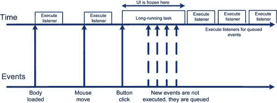

# 第四章：动画与精灵

**注意：**`arguments.callee`是对函数自身的引用。例如，当我在名为`animate`的函数内部时，`arguments.callee`指向的就是这个函数——`animate()`。当你需要在函数内部引用自身时，这是最佳方式。按名称引用有其缺陷。例如，如果你重构代码，需要记得更新另一个引用。在 JavaScript 中，函数可能根本没有名称。在这种情况下，`arguments.callee`是函数被创建后访问它的唯一方式。最后一行可以理解为“在 50 毫秒后再次调用同一个函数”。

为了举例说明，让我们考虑另一种暂停脚本的方法。我们告诉 JavaScript“等待五毫秒，然后继续执行”。最糟糕且通常不可接受的方式是向 CPU 抛出一个无用的任务，并在循环中重复执行。每次循环后，检查经过了多少时间，并决定是否继续（参见清单 4-18）。请勿在家中尝试。

**清单 4-18.** 让浏览器等待 5 秒再继续的原始方法

```
var delay = 5000; // 五秒
var start = new Date().getTime();
while (true) {
    // 找点事让 CPU 忙活，比如做点数学运算？
    Math.sin(Math.random()*2*Math.PI) + Math.cos(Math.random()*2*Math.PI);
    var passed = new Date().getTime() - start;
    if (passed > delay)
        break;
}
```

为了理解如何以最佳方式组织动画，需要深入 JavaScript 的内部机制，了解为什么清单 4-18 中的代码是最糟糕的做法之一，如何避免长时间运行任务带来的陷阱，并正确调度动画循环。

### JavaScript 线程模型

JavaScript 是一种单线程语言。这意味着在任何给定时刻，最多只有一段代码在执行。例如，如果在另一个函数执行时，一个图片恰好加载完成，回调函数不会立即并行运行。JavaScript 会将那段代码的执行安排在当前函数结束后。如果有多个监听器，它们会被排队并逐一执行。



第四章：动画与精灵 **151**

图片加载并非 JavaScript 中唯一使用回调的场景。用户输入处理代码（我们将在下一章详细讨论）也依赖类似的机制来响应触摸和鼠标点击。这意味着，当脚本执行一个长时间任务时，其余部分都会被冻结，直到任务完成。图 4-9 说明了这一点。

**图 4-9.** JavaScript 的线程模型。由于 JavaScript 是单线程的，同一时刻只能执行一段代码。长时间运行的任务会阻塞用户界面，导致应用无响应。

假设你正处于一个运行时间很长的重量级函数中。用户将鼠标光标移到用户界面组件上。这个操作会生成几十个事件，但在长时间运行的函数完成之前，这些事件都不会被处理。

从以上内容可以得出什么实际结论？有两点。

- 你可以确信当前执行的代码是唯一正在运行的代码片段。如果你在一个监听器内部，不用担心在`animate()`恰好重绘场景时会发生什么；这种情况根本不可能发生。
- 任何长时间运行的函数都会阻塞输入。如果你的象棋 AI 需要 5 秒来计算最佳策略，这意味着用户至少需要等待 5 秒才能看到反馈。长时间运行的任务可以分解成较小的任务，这样就不会阻止其他部分的执行。

第二点听起来可能令人头疼。实际上，这完全不是问题。你只需要在设计包含长时间运行任务的应用程序时多花一点心思。


## 第 4 章：动画与精灵

上述方法的主要优势在于，设计单线程应用程序（每个 JavaScript 应用程序都是单线程的）比编写多线程代码要简单得多。像`Java`这样的语言充分利用了线程的强大功能，但代价是需要使用复杂且非常复杂的 API 来协调多个线程的执行。更糟的是，多线程环境中的错误可能会数月不被察觉，最终仅仅因为时间上的不凑巧而导致整个系统崩溃。对多线程代码进行单元测试是一种只有少数人才能掌握的“黑魔法”。

既然我们了解了这些陷阱，现在回到我们的问题：如何安排`repaint`函数在稍后执行？

### 定时器

如我所提，JavaScript 拥有所谓的定时器，这是一种用于安排任务稍后执行的内置机制。在本节中，我们将学习定时器如何帮助处理像动画这样的重复任务。

#### 设置定时器

JavaScript 有三个用于安排代码稍后执行的函数：`setInterval()`、`setTimeout()`和`requestAnimationFrame()`。这三个函数都做类似的事情——它们告诉浏览器：“嘿，请安排我给你的代码的执行。当你有空闲周期时，大约在 N 毫秒后调用我。”

N 毫秒后，浏览器会将函数的执行排入队列，就像处理一个简单的事件监听器一样。如果队列为空，那你很幸运，你的函数会立即执行。如果队列中充满了其他任务——那么，无论你的函数多么重要，它都必须等待。

**注意：** 这是关于定时器的一个重要概念：它们并不能保证在你设定的时间精确触发。原因之一前面已经展示过；如果另一段代码正在执行，定时器就必须等待轮到它。即使在没有任何事件和用户活动的完全静止的页面中，定时器也无法保证准时运行。延迟可能发生，例如由于操作系统定时器的分辨率问题（但这远超本书的讨论范围）。

你只能依赖两件事：

- 定时器绝不会在预定时间之前触发。
- 浏览器会尽最大努力准时触发它。

**提示：** 不用担心定时器延迟了一毫秒。通常用户不会注意到这个微小故障。不要追求完美，也不要试图让定时器变得完美。当我还在做 Java 游戏开发时，我花了很多时间试图让 Java 中的动画循环稍微好一点。Java 作为一个企业级平台，也存在同样的定时器问题——你不能依赖定时器的精度。这曾让我抓狂，我写了数十个测试、原生模块和变通方案，但效果几乎难以察觉。把这时间花在编写真正的游戏代码上要好得多。

现在让我们回到调度函数，看看它们有什么不同。

`setInterval()` 每隔 N 毫秒安排一次函数的执行（参见代码清单 4-19）。

**代码清单 4-19.** `setInterval` 示例

```javascript
setInterval(
  function() {
    console.log("Hello")
  }, 500);
```

代码清单 4-19 中的代码会每秒两次向控制台输出单词“Hello”。

`setTimeout()` 安排函数执行一次。当然，你也可以在函数末尾再次调用`setTimeout()`，从而模拟`setInterval()`的工作方式。调用`setTimeout`有两种不同的方式；代码清单 4-20 展示了这两种方法。第一个调用安排单次执行，而第二个调用在每次循环后再次安排执行。

**代码清单 4-20.** 调用 `setTimeout` 的两种方式

```javascript
// 将触发一次
setTimeout(function() {
  console.log("Hello")
}, 500);

// 几乎像 setInterval 一样工作，将永远触发
setTimeout(function() {
  setTimeout(arguments.callee, 500);
  console.log("Hello")
}, 500);
```

`requestAnimationFrame()` 是最后一个定时器函数，也是最近才添加的。它受到绝大多数桌面浏览器的支持，但遗憾的是……


## 第 4 章：动画与精灵

不是通过安卓原生浏览器实现的（移动版火狐浏览器支持）。顾名思义，这个函数是专门为处理动画而创建的。你不能向`requestAnimationFrame`传递超时值；由浏览器自行决定下一次动画循环的最佳时机。浏览器会将`requestAnimationCallback`与页面上的其他动画（如 CSS 过渡、DOM 动画、SVG 的 SMIL 等）进行同步，从而提升页面的整体性能。此外，如果浏览器标签页不可见，`requestAnimationFrame()`将不会触发。既然没人观看动画，何必浪费宝贵的 CPU 周期和电池电量呢？这应是 JavaScript 游戏中用于调度动画的标准方法。列表 4-21 展示了如何在 JavaScript 游戏中使用该函数来调度动画（适用于支持该功能的浏览器）。

**列表 4-21.** *`requestAnimationFrame`使用示例*

```
function animate(timestamp){
    console.log("Hello");
    requestAnimationFrame(animate);
}
```

在撰写本文时，此函数仍需要使用厂商特定的前缀。在 WebKit 浏览器中，它被称为`webkitRequestAnimationFrame()`；在 Opera 中，则为`oRequestAnimationFrame()`，依此类推。当该函数标准化后，浏览器厂商最终会移除前缀；但目前，使用以下由 Paul Irish 实现的填充层（列表 4-22）会更为便利。

**列表 4-22.** *`requestAnimationFrame`的填充层*

```
window.requestAnimationFrame = (function(){
    //检查每种浏览器
    //@paul_irish 函数
    //将此函数全局化，使其能在任何浏览器上运行，
    //因为每种浏览器对此有不同的命名空间
    return window.requestAnimationFrame || //Chromium
        window.webkitRequestAnimationFrame || //Webkit
        window.mozRequestAnimationFrame || //Mozilla Geko
        window.oRequestAnimationFrame || //Opera Presto
        window.msRequestAnimationFrame || //IE Trident
        function(callback, element){ //后备函数
            return window.setTimeout(callback, 1000/60);
        }
})();
```

请注意这段代码是如何优雅地降级到`setTimeout()`的。即使浏览器不支持`requestAnimationFrame()`，你的代码也不会崩溃！而且，一旦浏览器增加了对这个神奇小功能的支持，你无需做任何更改就能使用它。

**注意：** Paul 使用的这种构造方式乍看可能令人困惑。让我们花点时间解释一下。Paul 创建了一个匿名函数，该函数返回另一个函数（记住，在 JavaScript 中，函数像任何其他对象一样，可以被方法返回），并立即调用了它。这个函数会检查可用的`requestAnimationFrame`实现，并将其赋值给`window.requestAnimationFrame`属性：

```
window.requestAnimationFrame = (function(){
    // 实际的填充代码在此
})();
```

将这段代码添加到`utils.js`文件中，因为我们在本书的大部分章节中都会用到它。

#### 停止定时器

有时你需要取消定时器——例如，当游戏结束，不再需要任何动画时，你可能想要停止`requestAnimationFrame()`或其他定时器。我们之前描述的每个函数都有一个对应的反函数，用于停止定时器并阻止下一次调用。

要停止通过`setTimeout()`设置的定时器，你可以像下面这样调用`clearTimeout()`：

```
var handler = setTimeout(function() {alert ("Boom");}, 1000);
clearTimeout(handler);
```

每个定时器函数都会返回一个用于标识该定时器的`handler`。当你的脚本中有多个定时器时，这个处理程序用于区分它们。间隔定时器遵循完全相同的模式，唯一的区别是用于停止执行的函数叫做`clearInterval()`：

```
var handler = setInterval(function() {alert ("Tick");}, 1000);
clearInterval(handler);
```

最后，清除动画帧（animationFrame）会稍微复杂一些，因为存在不同的命名约定。我们需要另一个填充层来实现。


