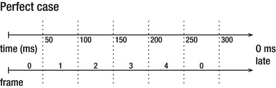
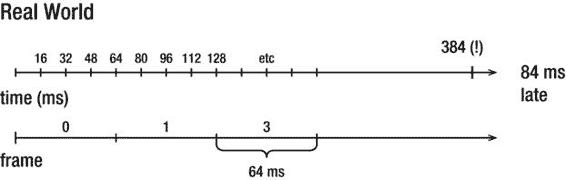

# 以浏览器无关的方式实现 `cancelRequestAnimationFrame()`，并自然提供标准 `clearTimeout()` 实现作为回退方案（参见清单 4-23）。

## 第 4 章：动画与精灵

**清单 4-23.** *取消 `requestAnimationFrame`*

```javascript
window.cancelRequestAnimFrame = ( function() {
    return window.cancelAnimationFrame ||
        window.webkitCancelRequestAnimationFrame ||
        window.mozCancelRequestAnimationFrame ||
        window.oCancelRequestAnimationFrame ||
        window.msCancelRequestAnimationFrame ||
        clearTimeout
} )();
```

### 改进动画

既然我们已经知道了如何组织动画序列，接下来就该思考如何改进这个简单的方案了。例如，要考虑到当前帧率可能远低于理想的 60 FPS，并处理可能出现的画面异常。本节末尾将介绍 `Animator` 类——一个用于处理更复杂动画策略的类。

#### 帧率与帧间时间

让我们再次回顾本节开头的动画示例。这个版本的代码（见清单 4-24）并未考虑帧率因素。动画在性能更强的设备上会渲染得更快。

**清单 4-24.** *动画的基本实现*

```javascript
var currentFrame = -1;
function animate(timestamp) {
    ctx.fillStyle = "white";
    ctx.fillRect(0, 0, canvas.width, canvas.height);
    currentFrame = ++currentFrame%5;
    spriteSheet.drawFrame(ctx, current, 10, 40);
    requestAnimationFrame(arguments.callee);
}
animate();
```

如果你添加更多精灵并在不同设备上测试，会发现动画速度严重依赖于 CPU 和帧率（只需确保添加足够多的精灵即可）。该动画没有考虑时间因素，因此在不同的浏览器和硬件上表现会不一致。

如果用清单 4-24 所示的动画方法构建图形密集型游戏，你很快会发现动画速度取决于设备硬件：在无法保持稳定 60 FPS 的低性能设备上运行较慢，而在新款多核智能手机上则较快。这并不是用户对游戏的预期表现。动画速度应保持恒定，不应依赖于帧率。让我们来解决这个问题。

我们需要让每一帧在屏幕上停留固定的时间（例如 50 毫秒），然后再切换到下一帧。这样一来，游戏的连贯性会稍有提升。清单 4-25 所示的第二个代码版本实现了这一思路。

**清单 4-25.** *检查帧间经过时间的改进版代码*

```javascript
function animate(t) {
    var now = t || new Date().getTime();
    ctx.fillStyle = "white";
    ctx.fillRect(0, 0, canvas.width, canvas.height);
    var timeSinceFrameStart = now - currentFrameStart;
    if (timeSinceFrameStart > timePerFrame) {
        currentFrame = ++currentFrame%5;
        console.log(currentFrame);
        currentFrameStart = now;
    }
    spriteSheet.drawFrame(ctx, currentFrame, 10, 40);
    requestAnimationFrame(arguments.callee);
}
animate(0);
```

如果你尝试运行此脚本，会发现在桌面浏览器和 Android 浏览器上的结果大致相同。

**注意：** `requestAnimationFrame()` 应将时间戳参数传递给监听函数，但由于我们使用了前一节中描述的小技巧，任何不支持新定时器的浏览器都会回退到 `setTimeout()`。在这种情况下，我们需要自己计算当前时间（幸运的是，这并非重量级操作）。这就是额外那行代码的由来：

```javascript
var now = t || new Date().getTime();
```

然而，这种方法也有其缺点。请看图 4-10 和图 4-11，它们展示了动画流程。我们先看图 4-10，它展示了理想情况。在完美世界中，定时器恰好在我们需要的时刻触发——每隔 50 毫秒——从而提供非常可预测的帧间间隔。





## 第 4 章：动画与精灵


