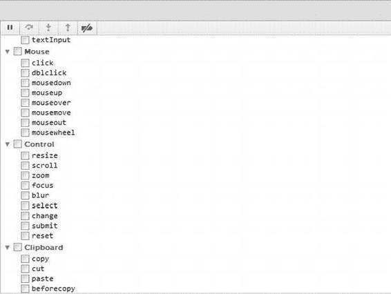
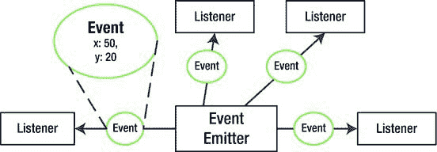

# 移动设备控制与事件处理

移动设备配备的加速度计和陀螺仪，使其本身可作为控制器使用。

##### 移动端控制的局限性

- 用户没有像样的键盘。即使输入名字也颇为不便。
- 鼠标支持多种交互方式（悬停、单击、右键单击、滚轮滚动），而触摸操作仅有点击和滑动。
- 鼠标拥有更多按键，部分型号甚至多达 20 个。而在无键盘的触摸界面中，你只有一个“按键”——点击。常规情况下，要实现至少一种额外交互方式，可借助长按操作，但这也已是极限。其余交互均需通过屏幕按钮、手势或多点触控来弥补。
- 大多数安卓设备并未向浏览器开放多点触控功能（除少数摩托罗拉设备外，但效果也不尽如人意）。
- 安卓设备未向浏览器开放陀螺仪和加速度计数据。

正如你所见，前文列表中的两点优势因浏览器支持不足而瞬间失效。不幸的是，这恰恰是安卓原生浏览器的现状，因此你实际可开发的游戏类型仅限于能用单键鼠标操控的品种。

情况即将迎来转机。最新发布的安卓版本（撰写本文时为 4.0）为 HTML5 游戏世界带来了曙光。加速度计和陀螺仪逐渐向游戏开发者开放。目前你仍可使用这些功能，但仅限打包为原生安卓应用的网页（如 Apache Cordova 等工具——我们将在第 15 章详述——可将此 API 暴露给 JavaScript）。这并非最佳选择，但总比没有强。现在，我们将基于原生浏览器开展工作，并尝试寻找移动端与桌面端输入模型的最大公约数。

### 利用事件捕捉用户输入

让我们从最根本的动机问题开始：应用程序为何要实现事件与事件处理器？作为经验丰富的开发者，你或许已知答案：构建事件系统的目的是解耦各组件。例如，按钮组件无需直接通知特定对象状态变化，而是触发事件。任何订阅方都会知晓按钮状态变化并做出响应。按钮无需了解订阅者的类型，只需知道当重要事件发生时，订阅者具备需被调用的函数即可。

就 JavaScript 与 DOM 而言，事件是浏览器对自身状态变化或外部动作的响应。你点击按钮，事件被触发；你滑动手指，另一事件被触发；页面加载完成，又一个事件被触发。若要查看各类事件，请打开谷歌 Chrome 浏览器，按`F12`进入开发者工具窗口，选择 Script 标签（见图 5-1）。在右侧面板中展开“事件监听器断点”并查看事件列表。可见浏览器事件按类型分类：键盘、鼠标、控件等。几乎所有操作场景都有对应事件。

**图 5-1.** *浏览器事件长列表片段*

### 事件对象

在 JavaScript 语境中，事件是传递给已注册事件监听器的普通对象。事件对象与普通对象一样包含字段和方法。其字段提供事件发生的额外信息。例如，用户点击屏幕时，仅知点击发生不足以执行有意义的操作，还需知道点击坐标。图 5-2 展示了事件发射器与监听器之间的关系，事件对象承载着事件详情。

