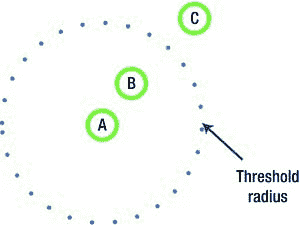
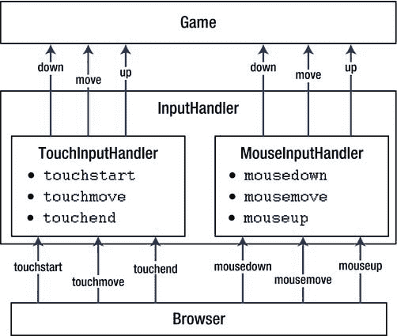

# 第五章：事件处理与用户输入

### 自定义事件

自定义事件 API 背后的理念是为触摸事件和鼠标事件提供"最小公分母"接口。有三对事件的工作方式几乎相同：`mousedown`-`touchstart`、`mousemove`-`touchmove` 和 `mouseup`-`touchend`。正是"几乎"这个词让开发者的生活变得更加艰难。让我们从再次分析事件开始，找出它们的共同点和差异。

第一个主要差异是 `targetTouches` 对象。它仅适用于触摸屏，但由于 Android 浏览器尚未广泛支持多点触控，这一差异可以安全地忽略。多点触控支持目前并不相关，但后续处理起来也很容易。

以下是三个事件组：

- **按下事件**：由 `mousedown` 和 `touchstart` 事件表示。它们标志着交互的开始：用户触摸了屏幕或按下了鼠标按钮。当用户处于此状态时，可以执行两种操作之一：开始移动控制器（鼠标或手指），或者立即释放并触发"点击"。

- **抬起事件**：由 `mouseup` 和 `touchend` 表示。它们的工作方式相同，但 `touchend` 不提供用户手指抬起位置的坐标。此时不再有触摸，这意味着可能没有坐标（鼠标没有这个问题，因为光标停留在屏幕上，`mouseup` 的坐标是有效的）。为了模拟与触摸事件相同的行为，我们必须跟踪触摸的最后已知坐标，并在用户抬起手指时提供这些坐标。

- **移动事件**：由 `mousemove` 和 `touchmove` 表示。最重要的区别在于，鼠标可以有两种移动类型：悬停（在按钮未按下时移动光标）和拖动（在按钮按下时移动光标）。由于触摸屏没有对应的悬停操作，我们必须忽略悬停。同时，我们必须跟踪按钮的状态，以便在使用鼠标时区分悬停和拖动。

移动事件值得更多关注。按下和抬起事件相对简单：它们由一对发生事件时的坐标 `x` 和 `y` 完全描述。移动具有稍复杂的性质。对于处理移动的客户端 API 而言，通常仅了解光标的当前位置是不够的。你还需要知道增量（delta），即自上次移动事件以来位置的变化。这样，客户端 API 就可以计算出移动的速度，例如。我们的目标是构建一个便捷易用的 API，使诸如增量之类的基本信息能够开箱即用。图 5-3 展示了增量值。

**图 5-3.** *增量值：移动的实际"量"。该参数在游戏开发中经常使用。*

另一个重要问题是，用户可能会在并不真正希望时意外触发"移动"。如果没有特殊处理，每一次微小的移动都会被当作"拖动"操作，而不是"点击"操作。我们的生理结构决定了手指会一直微微颤抖，即使你无法察觉，但高灵敏度的触摸界面常常会检测到移动而非点击。使用这样的界面相当困难且令人恼火，尤其当这两种操作在游戏中具有不同含义时。

在实践中，微小移动的问题通过设定一个特殊的移动阈值来解决，即围绕用户最初点击屏幕位置的半径区域。此区域内的所有移动都被视为无意的


以下是根据您提供的格式和注意事项，将英文文本翻译成中文的结果：


会被忽略，如图 5-4 所示。交互从点 A 开始，几毫秒后，API 检测到移动至点 B。由于点 B 在阈值内，因此被视为无意的微小移动并被忽略。接着，交互在点 C 被检测到。由于点 C 超出了阈值，这意味着用户确实是在尝试移动指针。



**图 5-4.** *阈值的示意图。由于点 B 在阈值内，因此被视为无意的微小移动。*

现在我们已准备好实现我们的 API。我们将创建两个类：`MouseInputHandler` 和 `TouchInputHandler`。它们将同时充当事件发射器和事件监听器。它们会监听 canvas 对象的原始 DOM 事件，并将这些事件转换为我们的自定义表示形式：`down`、`up` 和 `move` 事件。

图 5-5 展示了这一概念。`TouchInputHandler` 和 `MouseInputHandler` 就像中间人，它们监听浏览器事件并发出与平台无关的自定义事件。根据系统不同，这些事件要么来自鼠标事件，要么来自触摸事件。`InputHandler` 是一个便捷类：它在运行时创建，要么是 `TouchInputHandler`，要么是 `MouseInputHandler`。



**图 5-5.** *事件处理 API 的架构：*

由于浏览器事件模型差别不大，这两个类包含大量公共代码。因此，从中提取一个公共父类并将基本处理代码放在其中是合理的。`MouseInputHandler` 和 `TouchInputHandler` 随后只需实现差异部分。这个基类被命名为 `InputHandlerBase`。

### 实现 `InputHandlerBase`

现在让我们编写更多代码。`InputHandlerBase` 的结构相对简单。它继承自 `EventEmitter`。它触发自定义的 `up`、`down` 和 `move` 事件——为浏览器的事件系统提供更简洁的接口。

请查看清单 5-13 中构造函数的代码。

**清单 5-13.** `InputHandlerBase` 的构造函数

```javascript
function InputHandlerBase(element) {
  EventEmitter.call(this);

  // DOM 元素
  this._element = element;

  // 上次已知的“移动”坐标，用于计算增量
  this._lastMoveCoordinates = null;

  // 指示是否已超过“移动”阈值的标志
  // 如果为 true，则表示是真正的移动，而非颤抖
  this._moving = false;

  // 移动阈值的像素值，如图 5-4 所示
  this._moveThreshold = 10;

  // 监听器是否应在 DOM 事件上调用 stopPropagation/preventDefault
  this._stopDomEvents = true;
}

extend(InputHandlerBase, EventEmitter);

_p = InputHandlerBase.prototype;
```

如您所见，该类仅有五个字段。其中两个，`_moveThreshold` 和 `_stopDomEvents`，是“设置项”，可以在对象生命周期内通过 getter 和 setter 进行更改。列表中省略了简单的 getter 和 setter 的代码。

下一个函数是 `_getInputCoordinates()`。此版本完全忽略多点触控；它仅与 `targetTouches` 数组的第一个元素配合使用（参见清单 5-14）。

**清单 5-14.** `_getInputCoordinates` 函数从输入事件中检索坐标，忽略多点触控

```javascript
_p._getInputCoordinates = function(e) {
  var element = this._element;
  var coords = e.targetTouches ? e.targetTouches[0] : e;

  return {
    x: (coords.pageX || coords.clientX + document.body.scrollLeft) -
       element.offsetLeft,
    y: (coords.pageY || coords.clientY + document.body.scrollTop) -
       element.offsetTop
  };
};
```

`InputHandlerBase` 的核心函数是将 DOM 事件转换为更易用形式的函数：`_onUpDomEvent()`、`_onDownDomEvent()` 和 `_onMoveDomEvent()`。`TouchInputHandler` 和 `MouseInputHandler` 将以它们为基础，并在其上添加小的调整。

我们从清单 5-15 中所示的 `_onDownDomEvent()` 函数开始。它的作用类似于...


