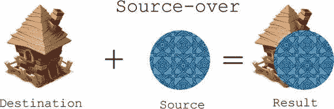
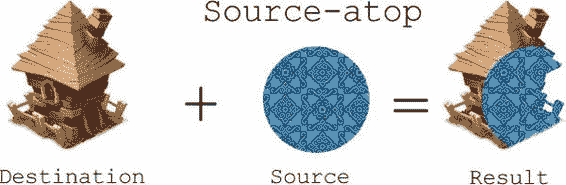
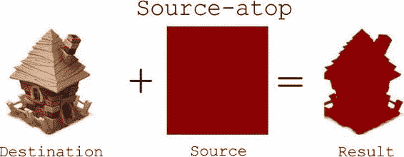
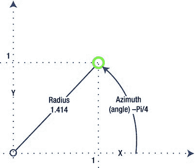
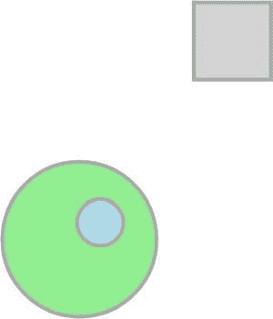

# 排版后的内容

只需要将遮罩颜色的红色、绿色和蓝色值转换回来，就可以得到形状的整数 ID。

关键在于现在实现这一技术。

**注意：** 但用户点击后，屏幕难道不会闪过彩虹的每一种颜色吗？我们需要事后*渲染*那些颜色！没错，我们需要渲染遮罩，但承载它们的画布不必与你的“主”画布相同。在真实的游戏中，用于绘制遮罩的画布对用户永远不可见，遮罩也绝不会出现在屏幕上。所有渲染都在内存中幕后完成。

#### 复合操作

让我们从一个简单的问题开始：如何绘制图像遮罩？我们需要将图像的每个不透明像素替换为具有遮罩颜色的不透明像素。为此，我们使用 2D 上下文的一个特性，称为`globalCompositeOperation`。它定义了在现有像素之上绘制新像素的方法。默认方法称为`source-over`。新的非透明像素绘制在现有像素之上，就像一层层颜料叠加在一起。将要绘制的像素称为源，场景中已有的像素称为目标。`source-over`意味着“将源像素放在目标像素之上”。

图 5-7 展示了该操作的组成部分以及操作结果——也就是你预期会看到的结果。房子图像先被绘制；因此，在绘制圆形时，它已经在画布上了。房子是目标。圆形后绘制，所以它是源。





**图 5-7.** *默认复合操作：source-over*

这是绘画的自然方式。当你绘制图像时，你期望它出现在任何现有背景图像之上。然而，这条规则可以很容易地改变。如果你将`globalCompositeOperation`设置为`"source-atop"`，新绘制的像素只会出现在背景不透明的地方，如图 5-8 所示。

**图 5-8.** *source-atop 复合操作。源像素仅当背景不透明时才出现在背景之上；其他所有部分都被裁剪。*

这正是制作图像遮罩所需要的！但我们将使用覆盖整个图像的纯色矩形，而不是带有花哨图案的圆形。我们首先绘制图像（目标），然后用由唯一对象 ID 定义的颜色覆盖它。这个概念非常简单但非常强大。图 5-9 展示了如何使用`source-atop`操作制作图像遮罩。



**图 5-9.** *使用 source-atop 操作的图像遮罩。纯色矩形仅覆盖图像的非透明部分。*

**注意：** Canvas API 还提供了其他几种复合操作。如果你对深入了解此主题感兴趣，请查看名为`08.composites.html`的演示，该演示随本章材料提供。它展示了每个可用复合操作的效果。关于颜色合成背后数学的更多正式描述，请参考 Thomas Porter 和 Tom Duff 的论文《合成数字图像》。*计算机图形学* 18, 第 3 期 (1984 年 7 月)。

现在让我们在实践中实现这一技术。我们从清单 5-26 中的两个函数开始。

**清单 5-26.** *使用从图像 ID 派生的颜色绘制图像遮罩*

```
function numberToColor(n) {
    var hexString = n.toString(16);
    // 添加填充
    return "#" + "000000".substr(0, 6 - hexString.length) + hexString;
}

function drawImageMask(image, x, y, maskColor, ctx) {
    var w = bufferCanvas.width = image.width;
    var h = bufferCanvas.height = image.height;
    var maskCtx = bufferCanvas.getContext("2d");
    // 原始图像先绘制，它是目标
    maskCtx.drawImage(image, 0, 0);
    // 设置复合操作
    maskCtx.globalCompositeOperation = "source-atop";
    maskCtx.fillStyle = maskColor;
    maskCtx.fillRect(0, 0, w, h);
}
```


`ctx.drawImage(bufferCanvas, x, y);`

第一个函数`numberToColor()`是一个小型工具，它将对象的数字 ID 转换为适合设置填充样式的颜色表示。第二个函数使用不可见的`bufferCanvas`来创建遮罩图像。然后，从`bufferCanvas`将纯色遮罩绘制到作为参数传递的`context`上。您可以在此处插入任何复杂的渲染代码，而不仅仅是绘制图像，因为一旦像素位于`context`上，无论原始来源是 PNG 图像还是 JavaScript 例程，都无关紧要。

如果您以这种方式绘制每个图像，获取所选像素的颜色并找到所选形状就相当容易（参见`Listing 5-27`）。展示如何渲染图像遮罩的示例可以在`05.mask.html`文件中找到，该文件与本章节的其他源代码一同提供。

**`Listing 5-27.`** *从颜色转换为图形 ID*

```
var imageData = pixelContext.getImageData(x, y, 1, 1).data;

// The black color is default, so we have to draw masks starting from
// color “1” (or take alpha values into the account). To return back
// from color to array index we have to subtract 1 back.
var index = (imageData[0] << 16 | imageData[1] << 8 | imageData[2]) - 1;
console.log(“User selected index “ + index.toString(16));
```

加粗的位运算可能需要一点解释。它从三个颜色分量中恢复整数。颜色的位表示为`RRRRRRRRGGGGGGGGBBBBBBBB`（`R`块是红色的 8 位，`G`块是绿色的 8 位，`B`块是蓝色的 8 位）。

`<<`操作向数字的右侧添加指定位数，并用零填充额外的空间。例如，数字 3 的二进制形式是`11`。`3 << 1`表示“在右边加一个`0`”，结果为`110`，即十进制形式的 6。

整个表达式意味着“从数组的第 0 个元素中取 8 位放入`R`块；接着，从第 1 个元素中取 8 位填充`G`块；最后，用`B`块填充剩余部分。”这产生了该值的数值表示，其操作与我们在`numberToColor()`中所做的相反。

遮罩操作仅适用于没有半透明像素的图像。如果图像有半透明区域，遮罩将不会保留其原始颜色；相反，它会受到目标透明度的影响。要处理此类图像，必须在运行时对其进行预处理；大于 0 的 alpha 值必须设置为 1。

第五章：事件处理和用户输入

如果您要处理半透明像素，您需要稍微修改代码，并在应用遮罩之前从图像中移除 alpha 值。否则，原始颜色将无法保存，您将无法找到您要查找的形状索引。我们可以像读取像素值一样更改像素值（参见`Listing 5-28`）。

**`Listing 5-28.`** *动态更改上下文的像素数据*

```
function drawImageMask (image, x, y, maskColor, ctx) {
    …
    maskCtx.drawImage(image, 0, 0);
    filterAlpha(maskCtx, w, h);
    maskCtx.globalCompositeOperation = "source-atop";
    maskCtx.fillStyle = maskColor;
    maskCtx.fillRect(0, 0, w, h);
    ctx.drawImage(bufferCanvas, x, y);
}

function filterAlpha(ctx, width, height) {
    var imageData = ctx.getImageData(0, 0, width, height);
    var pixels = imageData.data;

    // Pixels are stored as RGBA. Alpha values are in every
    // fourth cell of the array
    for (var i = 0; i < width*height; i++) {
        pixels[i*4 + 3] = pixels[i*4 + 3] == 0 ? 0 : 255;
    }
    ctx.putImageData(imageData, 0, 0);
}
```

本节中的代码仅解释了使用遮罩进行对象选取的关键点。您可以在本书附带的源代码文件`06.pixel_picking.html`中找到完整的演示。

**注意：** 这里描述的技术可以通过多种方式进行优化；例如，我们可以检查每个图像的大小和位置，并丢弃那些不符合条件的图像。


## 排版结果

不要与选中像素重叠。此外，我们保留了全尺寸的画布对象用于绘制遮罩，但实际只需要单个像素。我们可以改用单像素大小的画布，从而节省一些 CPU 时间和内存。这类优化显而易见，且在你的项目中如需实现也并不困难。不过，大多数情况下，可供选择的拖拽对象并不会太多，此处描述的方案仍能展现出不错的性能。



## 第 5 章：事件处理与用户输入

### **模拟摇杆**

本章的最后部分致力于模拟真实世界的游戏控制方式。这是移动游戏的常见做法：尝试制作用于输入的虚拟硬件版本。

从太空模拟游戏到第三人称射击游戏，各类游戏都会使用摇杆。当你需要对游戏角色进行直接控制时，对于缺乏多点触控的设备而言，摇杆可能是最佳选择。虚拟摇杆是一个对触摸和移动敏感的区域。其内部有一个小“摇杆柄”来显示当前位置。玩家可以改变方向（角度）和力度（距中心的距离）。

摇杆采用极坐标系。使用笛卡尔坐标系对其而言意义不大。极坐标系采用不同的方法来指定空间中的点位置。它不使用`x`和`y`值，而是使用方位角和半径。例如，笛卡尔坐标为 (`1`, `1`) 的点，在极坐标中半径约为 `1.414`，方位角为 `Math.PI / 4`。这两种坐标系之间的关系如图 5-10 所示。

**图 5-10.** *笛卡尔坐标系 (x, y) 与极坐标系 (方位角, 半径)*

摇杆的输出是极坐标比常规坐标系更有用的绝佳例子。“方向”即方位角，而“力度”（距中心的距离）即半径。这种表示方式更适合控制任务。

摇杆的实现思路相当简单：追踪用户的触摸和移动，并计算摇杆位置的方位角和半径。



如果用户点击了“活动”摇杆区域之外，该触摸将被忽略。图 5-11 展示了该简易摇杆界面在网页上的可能外观。

**图 5-11.** *简易虚拟摇杆。外圆是用户点击以控制物体位置的“活动”区域。内部的圆表示摇杆的当前位置。*

代码相对简单；最重要的函数如代码清单 5-29 所示。完整实现可在本书的其他材料中找到。

**代码清单 5-29.** *实现虚拟摇杆控制*

```
_p._onDownOrMove = function(coords) {
    // 当收到“按下”或“移动”事件时，保存当前
    // 偏移量并更新半径和方位角
    var deltaX = coords.x - this._x;
    var deltaY = coords.y - this._y;
    this._updateJoystickValues(deltaX, deltaY);
};

_p._onUp = function(x, y) {
    // 如果没有交互，则恢复空闲状态
    this._updateJoystickValues(0, 0);
};

_p._updateJoystickValues = function(deltaX, deltaY) {
    var newAzimuth = 0;
    var newRadius = 0;
    // 如果摇杆处于空闲状态，则无需进行计算
    if (deltaX != 0 || deltaY != 0) {
        newRadius = Math.sqrt(deltaX*deltaX + deltaY*deltaY)/this._controllerRadius;
        // 用户滑动距离过远，摇杆返回空闲状态
        if (newRadius > 1) {
            deltaX = 0;
            deltaY = 0;
            newRadius = 0;
        } else {
            newAzimuth = Math.atan2(deltaY, deltaX);
        }
    }
    // 如果值实际发生了变化，通知监听器
    if (this._azimuth != newAzimuth || this._radius != newRadius) {
        this._azimuth = newAzimuth;
        this._radius = newRadius;
        this._deltaX = deltaX;
        this._deltaY = deltaY;
        this.emit("joystickchange", {
            azimuth: newAzimuth,
            radius: newRadius
        });
    }
};
```


