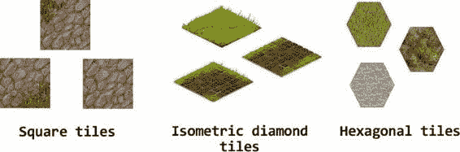
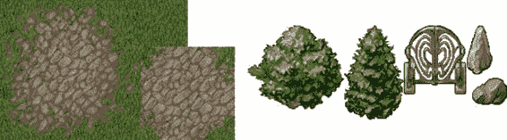

# 渲染虚拟世界

在前几章中，我们学习了如何渲染动画、控制时序以及响应用户输入。下一个有趣的主题是游戏世界的渲染。如果您正在创建像国际象棋这样的游戏，这可能是一项简单的任务，但如果是角色扮演游戏或策略游戏，其中的世界非常巨大呢？显然，将地图和游戏对象存储在智能手机的内存中不是一个好选择——数据太多，通过网络传输的字节太多，渲染速度也太慢。

接下来的两章专门介绍虚拟世界的渲染。首先，我们将介绍在智能手机屏幕上绘制广阔 2D 空间的基本技术。我们将探讨几种不同的方法来优化渲染速度以及服务器和客户端之间传输的数据量。

我们将尝试关注每种技术背后的动机，讨论何时以及为何需要应用它们。本章的内容将为在下一章中构建成熟的等距引擎奠定坚实的基础。

在本章中，我们将学习以下内容：

- 瓦片地图以及如何将世界表示为瓦片网格
- 如何在画布上渲染瓦片地图
- 如何优化渲染性能


### 如何渲染建筑物和角色等世界对象

## 第 6 章：渲染虚拟世界

#### 瓦片地图

`Tile maps`（瓦片地图）是一种非常强大的技术，它允许使用名为`tiles`（瓦片）的小图像来构建庞大而复杂的关卡。想象一下，你正在制作一款大型多人在线策略游戏，其中包含一张巨大的世界地图，拥有河流、平原、森林和山脉，总尺寸为 100,000 × 100,000 像素。这对大型游戏来说绰绰有余。显然，我们无法直接使用一张图像将其展示给用户：无论是移动设备还是个人电脑，都没有足够的 RAM 来容纳如此巨大的地图。

事实证明，地图的广阔区域由非常相似的图案组成。雪地几乎到处都一样——洁白而闪亮。沙漠、草地、水域和类似的自然区域也是如此。也许我们可以利用这一点来优化我们的地图？

##### 瓦片地图背后的理念

`Tiles`是相同尺寸的小图像，设计成彼此无缝衔接而不破坏图案——它们就是这样拼凑出地图的一部分的。请看图 6-1，你会看到这一概念的实际应用。

**图 6-1.** *《魔兽争霸 2》中的*瓦片地图

这是《魔兽争霸 2》地图编辑器的截图。白线显示了构成一幅完整图像的瓦片边界。注意，瓦片是对齐到网格上的。如果仔细观察，你会发现瓦片并非独一无二。事实上，它们重复出现的频率相当高。例如，森林只有三四种不同的瓦片，泥土有几种瓦片，而森林向泥土过渡的边界区域大约有十二种瓦片。

瓦片的设计方式使得用户看不出分隔瓦片的边界。查看截图中未被辅助网格覆盖的右侧部分，你会发现森林看起来相当自然。尽管几乎所有的树木看起来都一样，但你不会立刻意识到这张图像的瓦片本质。玩家也同样不会意识到。

那么，这如何帮助我们解决超大尺寸地图的问题呢？让我们进行一些简单的计算。假设我们有四种地形类型：雪地、森林、平原和山脉。我们的设计师为每种地形创建了四个瓦片，共计 16 个瓦片。此外，我们还有大约 40 个边界瓦片，用于渲染一种地形向另一种地形过渡的区域，使得瓦片总数达到 56 个。

如果每个瓦片的尺寸是 64 像素，我们可以将整个瓦片集放入一张 512 × 512 像素的图像中。因此，我们不再需要一张庞大的 100,000 × 100,000 像素的地图图像，取而代之的是一张 512 × 512 像素的瓦片集，任何现代设备都能轻松下载。

下一步是将世界表示为一个瓦片网格。通常，关卡设计师会使用专门编辑瓦片地图的工具。将世界地图划分为 64 × 64 的单元格，并为每个单元格选择合适的瓦片。现在，整个世界都可以用一个二维数组来描述。以下是这样一个数组可能的示例：

```javascript
var world = [
  [2, 2, 2, 8, 2, 2],
  [5, 4, 7, 3, 4, 3],
  [5, 4, 3, 3, 4, 7]
];
```

当然，实际的数组会大得多。数组元素的索引是世界地图中单元格的坐标（x 和 y），而值则是瓦片集中的瓦片编号。例如，在该数组中，`world[1][2]` 的值是 7。这意味着世界地图中坐标（x=2, y=1）处的单元格使用瓦片集中的 7 号瓦片来渲染。具体是哪个瓦片取决于实际的瓦片集，可能是雪地、沙子或森林。图 6-2 展示了与《魔兽争霸 2》地图编辑器相同的截图；每个单元格上都标有瓦片索引。这是一个世界片段的示例，可以用我们的数组来描述。

**图 6-2.** *带有标记瓦片的瓦片地图片段*

这种方法还有一个优势：你无需一次性下载描述整个世界地图的数组。还记得我们一开始举的例子吗——一个用于大型多人在线游戏的巨大地图？


为了进一步优化地图加载，我们最初只需要加载玩家周围`50 × 50`个瓦片的区域。假设这片地图区域最有可能满足玩家当前的探索需求。剩余的瓦片可以在玩家开始移动或滚动地图时，从服务器加载。我将在本章稍后部分展示如何实现此技术。

通过合理的内存管理，“世界地图”的大小实际上可以是无限的，因为它不存储在浏览器中；只有当前“最重要”的那块地图区域才会被缓存在客户端。其余部分则保留在服务器上。

##### 实现瓦片地图

在本节中，我们将学习如何使用 JavaScript 实现瓦片地图。我们将从最简单的实现开始，然后逐步改进。在本章中，我们使用方形瓦片，但当然，其他形状也是可以的。例如，等距游戏使用菱形瓦片。回合制策略游戏可能会使用六边形瓦片，因为六边形瓦片之间距离的计算更为“公平”。一旦我们为方形瓦片创建了引擎，实现相同思路的其他几何形状就会相当容易，但其背后的数学原理可能稍微复杂一些。图 6-3 展示了不同形状的瓦片。





**图 6-3.***瓦片可能有不同的大小和形状。*

在本章中，我们使用一个名为`img/tiles.png`的文件中的瓦片集，该文件随本章的源代码一起提供。这个瓦片集有 14 个`40 × 40`的瓦片，这正好满足我们的需求。这些瓦片来自[www.lostgarden.com](http://www.lostgarden.com)的免费瓦片集，并得到了 Daniel Cook 的许可。为了让您了解我们的资源是什么样的，它们展示在图 6-4 中。

**图 6-4.***本章所使用的资源。左侧是用于渲染背景的瓦片。右侧是世界对象。*

### 设置

让我们从在屏幕上绘制瓦片开始，不进行任何优化。现在我们正在处理一个由`40 × 40`数组描述的相当小的世界。该代码基于第 3 章的骨架（清单 3-6），并增加了第 4 章动画的支持（清单 4-24）和第 5 章的事件处理（“自定义事件”部分）。清单 6-1 显示了 `<script>` 块，它是进行虚拟世界实验的基础。该代码建立了一个典型的游戏开发试验场：它初始化了图像加载、输入处理和动画循环。为了方便起见，这个更高级的骨架与本章节的其他源代码一起保存在一个名为`setup`的文件夹中。

**清单 6-1.***本章的设置*

```javascript
<script>
var canvas;
var ctx;
var imageManager;
var inputHandler;
var images = {
  "tiles": "img/tiles.png"
};

function init() {
  // Start image loading
  imageManager = new ImageManager();
  imageManager.load(images, onLoaded);
  
  // Init canvas
  canvas = initFullScreenCanvas("mainCanvas");
  ctx = canvas.getContext("2d");
  
  // Init input and listen to move events
  inputHandler = new InputHandler(canvas);
  inputHandler.on("move", onMove);
}

/** Once all images are loaded - starts the animation loop */
function onLoaded() {
  animate(0);
}

/** Perform rendering here */
function animate(t) {
  clear();
  requestAnimationFrame(arguments.callee);
}

/** Handle map move */
function onMove(e) {
}

/* Clears the canvas with the solid black color */
function clear() {
  ctx.fillStyle = "black";
  ctx.fillRect(0, 0, canvas.width, canvas.height);
}

function initFullScreenCanvas(canvasId) {/* not changed */}
```


## 第 6 章：渲染虚拟世界

**第 223 页**

```html
function resizeCanvas(canvas) {/* 未修改 */}
```

```html
</script>
```

现在我们需要获取一些示例地图数据来构建我们的虚拟世界——即描述关卡结构的数组。最好将这样的数组放在单独的文件中，因为它的规模可能相当大。创建新文件 `js/world.js`，内容如代码清单 6-2 所示。此清单中的代码已进行精简以适应书页尺寸；完整的 40 × 40 版本数组可随本章其他源代码一同在 `world.js` 文件中找到。

**代码清单 6-2.** *描述待渲染世界的 `world.js` 文件*

```javascript
var world = [
  [3, 3, 3, 3, 3, 3, 3, 3, 3, 3, 3, 3, 3],
  [3, 3, 3, 3, 3, 3, 3, 3, 3, 3, 3, 3, 3],
  [3, 3, 0, 1, 1, 1, 1, 2, 3, 3, 3, 3, 3],
  [3, 3, 5, 6, 14, 11, 13, 7, 3, 3, 3, 3, 3],
  [3, 3, 5, 6, 9, 1, 8, 7, 3, 3, 3, 3, 3],
  [3, 3, 5, 6, 6, 6, 6, 7, 3, 3, 3, 3, 3],
  [3, 3, 10, 11, 11, 11, 11, 12, 3, 3, 3, 3, 3],
];
```

### 渲染瓦片地图

现在我们准备绘制瓦片地图。为此，我们将创建一个名为 `MapRenderer` 的独立类。绘制形成网格的一组方形瓦片的基本代码非常简单。要基于瓦片地图渲染世界，我们需要知道三件事：

-   地图数据（刚刚保存在 `world.js` 文件中的数组）
-   用于提取瓦片的图像
-   瓦片的大小

我们使用矩形瓦片，因此不需要宽度和高度；仅需一个参数就足够了——`tileSize`。`MapRenderer` 类的构造函数看起来相当简单（见代码清单 6-3）。

**代码清单 6-3.** `MapRenderer` 的构造函数

```javascript
function MapRenderer(mapData, image, tileSize) {
  this._mapData = mapData;
  this._image = image;
  this._tileSize = tileSize;
  // 地图的坐标
  this._x = 0;
  this._y = 0;
  // 图像中一行包含的瓦片数量
  this._tilesPerRow = image.width / tileSize;
}
```

除了保存参数外，构造函数还计算了瓦片表单行中包含的瓦片数量。我们很快将需要这个值来获取瓦片在表单内的坐标。`_x` 和 `_y` 变量是地图本身的坐标。当用户移动视口时，我们将修改这些坐标以在新的位置渲染地图（见代码清单 6-4）。

**代码清单 6-4.** *在屏幕上渲染瓦片网格*

```javascript
_p = MapRenderer.prototype;

/* 绘制整个地图 */
_p.draw = function(ctx) {
  for (var cellY = 0; cellY < this._mapData.length; cellY++) {
    for (var cellX = 0; cellX < this._mapData[cellY].length; cellX++) {
      var tileId = this._mapData[cellY][cellX];
      this._drawTileAt(ctx, tileId, cellX, cellY);
    }
  }
};

/* 绘制单个瓦片 */
_p._drawTileAt = function(ctx, tileId, cellX, cellY) {
  // 瓦片在瓦片表单中的位置
  var srcX = (tileId % this._tilesPerRow) * this._tileSize;
  var srcY = Math.floor(tileId / this._tilesPerRow) * this._tileSize;
  // 瓦片的大小
  var size = this._tileSize;
  // 瓦片在屏幕上的位置
  var destX = this._x + cellX * size;
  var destY = this._y + cellY * size;
  ctx.drawImage(this._image, srcX, srcY, size, size, destX, destY, size, size);
};
```

如你所见，绘制瓦片比绘制精灵要简单得多。精灵由帧组成，每帧有自己的大小和锚点。而所有瓦片的大小相同，且不需要锚点。瓦片背后的数学逻辑一点也不复杂。

**第 225 页**

**注意：** 在数组中设置瓦片索引时应格外小心。如果瓦片索引超过了瓦片总数，Canvas API 不会静默忽略复制超出图像边界的像素的尝试。这将抛出异常，导致瓦片地图无法正确渲染。

让我们添加一个功能来在屏幕上移动地图，使我们的应用程序更具交互性。代码清单 6-5 展示了相关代码。

**代码清单 6-5.** *移动地图*

```javascript
_p.move = function(deltaX, deltaY) {
  this._x += deltaX;
  this._y += deltaY;
};
```

现在我们已经拥有一个可以在屏幕上渲染瓦片地图的类。接下来将其集成到应用程序中。


