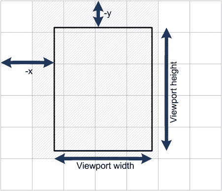
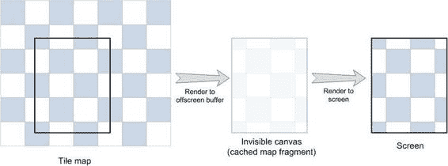

# 我们的空白骨架！按粗体代码所示更新函数

**代码清单 6-6** *更新 index.html 文件以渲染地图*

```javascript
/** 添加变量来保存地图渲染器 */
var mapRenderer;

...

/**
 * 当所有图像加载完成后——创建地图渲染器并
 * 启动动画循环
 */
function onLoaded() {
    mapRenderer = new MapRenderer(world, imageManager.get("tiles"), 40);
    animate(0);
}

/** 在此处执行渲染 */
function animate(t) {
    clear();
    // 在画布上绘制地图
    mapRenderer.draw(ctx);
    requestAnimationFrame(arguments.callee);
}

/** 处理地图移动 */
function onMove(e) {
    // 当用户滑动手指时移动地图
    mapRenderer.move(e.deltaX, e.deltaY);
}
```

在您的 Android 设备或桌面浏览器上启动此示例，看看效果如何。还不错，对吧？图 6-5 展示了在模拟器中启动的虚拟世界第一个版本。

**图 6-5** *地图的第一个版本*

现在花点时间思考一下每一帧中浪费的 CPU 循环次数。目前，我们存在两个问题导致这段代码效率极其低下：

-   每次都会渲染整个地图，无论特定瓦片在屏幕上是否可见。
-   即使地图没有移动，每一帧也会重新渲染每一个瓦片。

我们将逐一解决这些问题，但首先让我们添加一个小的每秒帧数监视器，它可以帮助我们判断是否真正优化了性能，或者只是写了一大堆无用的代码。对于显示当前每秒帧数的任务，我使用了一个由 John-David Dalton 创建（基于 Ricardo Cabello 的工作）的名为 `xStats` 的小巧但非常实用的工具。

### 测量 FPS

`xStats` 添加了一个小型监视器——一个 HTML 元素，用来显示关于网页的一些有用统计信息：

-   `fps`（每秒帧数）
-   每帧花费的时间
-   内存使用情况（适用于桌面浏览器）

目前我们最感兴趣的是第一个参数——帧率。帧数越多意味着游戏运行得越流畅。

让我们将 `xStats` 添加到项目中，看看能从设备中榨出多少帧每秒。从 [`github.com/bestiejs/xstats.js`](https://github.com/bestiejs/xstats.js) 下载源代码，找到 `xstats.js` 文件，然后将其与其他脚本一起放入 `js` 文件夹。要使 `xStats` 正常工作，您需要在 `<style>` 代码块中添加三行代码，并在 `init()` 函数中添加两行代码。代码清单 6-6 总结了这些更改。

**代码清单 6-6** *向页面添加 xStats 元素*

```html
<style>
.xstats {
    position: absolute;
    top: 0;
    left: 0;
}
</style>
```

```javascript
...
function init() {
    imageManager = new ImageManager();
    imageManager.load(images, onLoaded);
    canvas = initFullScreenCanvas("mainCanvas");
    ctx = canvas.getContext("2d");
    inputHandler = new InputHandler(canvas);
    inputHandler.on("move", onMove);

    var stats = new xStats();
    document.body.appendChild(stats.element);
}
```

就是这样！`xStats` 可能是监控应用程序稳健性时侵入性最小的 API 了。重新加载页面，您会看到页面左上角显示当前每秒帧数值的运行图表。图 6-6 展示了它的样子（图片已放大 2 倍）。

**图 6-6** *显示帧率的 xStats*

当您在桌面浏览器中运行示例时，很可能看到稳定的 60 fps。这并不意味着重绘一帧需要长达 17 毫秒，而是浏览器每秒请求重绘的次数不超过 60 次。

我在我的 Galaxy 手机上启动了应用程序……等等，什么？只有 27 fps，这怎么可能？！让我们改进渲染技术，也许游戏会运行得更快。实现最简单地图渲染和 `xStats` 监视器的完整示例可以在 `v01` 文件夹中找到，该文件夹与本章的其他源代码放在一起。

### 优化渲染性能

当前版本的 `MapRenderer` 能够正确显示平铺地图；然而，它


## 第 6 章：渲染虚拟世界

...但这种方式远非最佳。在本节中，我们将尝试提升渲染性能。首先从减少每帧绘制的瓦片数量开始。

#### 只绘制所需内容

我们的第一个问题：每次都会绘制整个世界，尽管玩家只需要其中一小部分。与其绘制整个瓦片阵列，不如只绘制可见的部分。图 6-7 展示了这一思路。



**图 6-7.** 仅绘制当前视口中可见的瓦片。被划掉的瓦片是我们将绘制的区域。

`MapRenderer` 需要知道视口的大小才能确定哪些瓦片是可见的。然后，我们可以使用以下简单公式计算最左侧和最右侧可见瓦片的坐标：

```javascript
var startX = Math.floor(-this._x / this._tileSize);
```

表达式 `-this._x / this._tileSize` 给出了视口左侧的瓦片数量。由于这个数字可能是小数，我们对其应用 `Math.floor()` 来获取整数索引，从而得到用户看到的最左侧瓦片的 `x` 坐标。类似公式可用于获取最右侧坐标：

```javascript
var endX = Math.floor((this._viewportWidth - this._x) / this._tileSize);
```

当用户滚动超过地图边界时，`startX` 和 `endX` 可能超出世界数组的范围。因此，我们需要检查边界并在必要时裁剪值。

```javascript
startX = Math.max(startX, 0);
endX = Math.min(endX, this._mapData[0].length - 1);
```

使用相同的公式获取可见瓦片的最顶部和最底部 `y` 坐标。一旦你获得全部四个值—— `startX`、`endX`、`startY` 和 `endY` ——就能确切知道用户通过当前视口看到的内容，从而可以省略任何无用的瓦片。让我们如清单 6-7 所示实现这一改动。

**清单 6-7.** 仅绘制可见瓦片

```javascript
function MapRenderer(mapData, image, tileSize, viewportWidth, viewportHeight) {
    ...
    this.setViewportSize(viewportWidth, viewportHeight);
}

_p.setViewportSize = function(width, height) {
    this._viewportWidth = width;
    this._viewportHeight = height;
};

_p.draw = function(ctx) {
   // 不再绘制地图的每个瓦片，而是检查哪些
   // 是实际可见的

   // 最左侧可见瓦片的 x 坐标
   var startX = Math.floor(-this._x / this._tileSize);
   startX = Math.max(startX, 0);

   // 最右侧可见瓦片的 x 坐标
   var endX = Math.floor((this._viewportWidth - this._x) / this._tileSize);
   endX = Math.min(endX, this._mapData[0].length - 1);

   // 最顶部可见瓦片的 y 坐标
   var startY = Math.floor(-this._y / this._tileSize);
   startY = Math.max(startY, 0);

   // 最底部可见瓦片的 y 坐标
   var endY = Math.floor((this._viewportHeight - this._y) / this._tileSize);
   endY = Math.min(endY, this._mapData.length - 1);

   // 仅绘制可见瓦片
   for (var cellY = startY; cellY <= endY; cellY++) {
        for (var cellX = startX; cellX <= endX; cellX++) {
            var tileIndex = this._mapData[cellY][cellX];
            ...
            ...
        }
   }
};
```

你应注意画布可能随时改变大小。用户倾向于晃动和翻转智能手机和平板电脑，导致屏幕方向变化，因此画布渲染器应能感知此类变化。更新画布大小的代码也应同时更新视口大小，以便 `MapRenderer` 能使用新值计算可见瓦片。清单 6-8 展示了如何更新 `index.html` 文件以保持 `MapRenderer` 与画布大小一致。

**清单 6-8.** 每次更新画布大小时同步更新视口大小

```javascript
function resizeCanvas(canvas) {
    canvas.width = document.width || document.body.clientWidth;
    canvas.height = document.height || document.body.clientHeight;
    mapRenderer && mapRenderer.setViewportSize(canvas.width, canvas.height);
}

function onLoaded() {
    mapRenderer = new MapRenderer(world, imageManager.get("tiles"),
        40, canvas.width, canvas.height);
    animate(0);
}
```


现在正是看看它在设备上效果的好时机！每秒三十四帧！成功！嗯……其实还不算完全成功。它还能运行得更快；导致我们每秒丢失最多帧数的问题在于，每一帧我们都重新绘制整个地图，即使可见部分并没有变化。换句话说，如果用户看到的地图片段是 10×15 个格子，我们每帧要执行 `150` 次 `drawImage()` 调用，而大多数情况下绘制结果与前一帧完全相同。如果能够缓存视口的当前状态，并在需要时将其作为一张图片重新绘制，就能获得巨大的性能提升。这正是我们接下来要介绍的技术的核心理念。

#### 离屏缓冲

如果我们直接创建另一个与视口大小完全相同的 `canvas` 实例，并将渲染好的地图保存到其中呢？如果用户没有移动地图，我们就可以使用预渲染的快照。这项技术在游戏开发中非常普遍，因为它能让复杂图案的绘制变得更快。它通常被称为离屏缓冲。之所以叫“离屏”，是因为你看不到存放缓存片段的元素。

在深入代码之前，请先看一下图 6-8，它说明了这个思路。

现在我们有两个 `canvas` 实例，而不是一个。第二个 `canvas` 是不可见的，甚至没有附加到 DOM 上。我们称之为离屏 `canvas`。它保存了上次绘制在屏幕上的帧。如果用户没有移动地图，也没有改变设备方向，那么我们就可以使用“缓存”的帧并再次绘制它。否则，离屏 `canvas` 就失效了（这种状态通常称为脏）。我们需要先更新离屏 `canvas`，再将离屏 `canvas` 的内容复制到屏幕上。



**图 6-8.** *我们不会每帧重新渲染整个图块集合，而是将当前帧“缓存”在不可见的离屏 canvas 上。如果视口坐标没有变化，我们就使用预渲染的帧，从而节省一些计算周期。*

如果用户没有移动地图，帧始终不变，我们就不需要重新绘制几十个图块。在这种情况下使用离屏缓冲可以节省大量的 CPU 周期。绘制大图在性能上优于尝试用小块图填充同一区域。这正是我们获得性能提升的关键所在。

现在来看一些代码。`MapRenderer` 再次需要添加几个额外的字段。我们将其添加进去（见代码清单 6-9）。

**代码清单 6-9.** *为 MapRenderer 添加对离屏 Canvas 的支持*

```
function MapRenderer(mapData, image, tileSize, viewportWidth, viewportHeight) {
    …
    // 离屏 canvas
    this._offCanvas = document.createElement("canvas");
    // 离屏 canvas 的上下文
    this._offContext = this._offCanvas.getContext("2d");
    // 标志，表示用户已移动视口
    // 并且离屏 canvas 必须重新绘制
    this._offDirty = true;
    this.setViewportSize(viewportWidth, viewportHeight);
}
```

前两个字段不言自明：离屏 `canvas` 及其上下文。第三个字段 `_offDirty` 是我们要设置的标志，用于指示离屏 `canvas` 的内容已失效，需要重新绘制。

我们需要保持离屏 `canvas` 的大小与视口大小一致。此外，如果地图移动了，我们需要设置 `_offDirty` 标志。最好的方法就是更新 `move()` 方法。代码清单 6-10 展示了如何实现这一更新。

**代码清单 6-10.** *保持离屏 Canvas 大小与视口一致，并在用户移动地图时将其标记为脏*

```
_p.setViewportSize = function(width, height) {
    this._viewportWidth = width;
    this._viewportHeight = height;
    this._resetOffScreenCanvas();
};

/**
 * 更新离屏 canvas 的大小，并将其标记为脏
 */
_p._resetOffScreenCanvas = function() {
    this._offCanvas.width = this._viewportWidth;
```


`this._offCanvas.height = this._viewportHeight;`

`this._offDirty = true;`

`};`

`_p.move = function(deltaX, deltaY) {`

`Drawable.prototype.move.call(this, deltaX, deltaY);`

`this._offDirty = true;`

`};`

现在到了最后、也是最关键的一步。更新 `draw()` 函数，使其更加智能。不再直接从瓦片地图绘制瓦片，而是先检查离屏缓冲区是否“洁净”。缓冲区洁净意味着用户未移动地图，且视口大小未改变；换句话说，离屏缓冲区中保存的图像与当前帧所需的图像完全一致。因此，我们无需逐块绘制世界的一部分，只需将离屏画布的内容直接复制到屏幕上即可。

如果缓冲区是“脏”的呢？那我们就需要执行与之前完全相同的操作：逐块渲染世界片段，只不过这次要在离屏画布上进行。渲染完成后，我们便再次拥有一个洁净的缓冲区，可以将其绘制到屏幕上。清单 6-11 总结了这些改动。

**清单 6-11.** *更新 MapRenderer 的绘制函数*

```
_p.draw = function(ctx) {
  if (this._offDirty) {
    this._redrawOffscreen();
  }
  ctx.drawImage(this._offCanvas, 0, 0);
};

_p._redrawOffscreen = function() {
  var ctx = this._offContext;
  ctx.clearRect(0, 0, this._viewportWidth, this._viewportHeight);

  var startX = Math.max(Math.floor(-this._x / this._tileSize), 0);
  var endX = Math.min(Math.floor((this._viewportWidth - this._x) /
      this._tileSize), this._mapData[0].length - 1);
  var startY = Math.max(Math.floor(-this._y / this._tileSize), 0);
  var endY = Math.min(Math.floor((this._viewportHeight - this._y) /
      this._tileSize), this._mapData.length - 1);

  for (var cellY = startY; cellY <= endY; cellY++) {
    for (var cellX = startX; cellX <= endX; cellX++) {
      var tileIndex = this._mapData[cellY][cellX];
      if (tileIndex > -1) {
        ctx.drawImage(this._image,
          (tileIndex%this._tilesPerRow)*this._tileSize,
          Math.floor(tileIndex/this._tilesPerRow)*this._tileSize,
          this._tileSize, this._tileSize,
          this._x + cellX*this._tileSize,
          this._y + cellY*this._tileSize,
          this._tileSize, this._tileSize);
      }
    }
  }
  this._offDirty = false;
};
```

如你所见，`draw` 函数中的大部分代码都转移到了 `_redrawOffscreen()` 函数中，唯一的区别在于 `_redrawOffscreen()` 操作的是离屏上下文。

就这样！现在我们的代码比本章开头时复杂了一些，那么让我们看看这些努力是否值得。稳定达到 45 帧！离我们的目标更近了一步。

然而，这段代码仍有一个问题。当用户移动地图时，新版本的 `draw()` 函数执行的工作甚至比以前更多。你自己比较一下。在最后一次修改之前，我们每帧只重绘几十个瓦片。而在新版本中，如果地图静止不动，我们就不重绘。但如果地图持续移动，我们首先要将瓦片重绘到离屏缓冲区（与之前相同的工作），然后再将离屏缓冲区绘制到屏幕上。我们优化了地图静止或移动不多的情况（45 帧已经非常好了），但让地图移动时的情况变得更糟了。

有些游戏依赖于始终移动的地图。例如，如果视口与角色绑定，那么角色的每一步都会移动视口。让我们看看如何改进最坏的情况。

#### 缓存视口周围区域

那么，我们现在面临的问题如下：由于离屏画布与视口大小相同，每次移动都不得不重绘它。每一个像素都会导致缓冲区变“脏”。此外，我们通常每次都会重绘同一组瓦片。如果我们把离屏画布做得比视口稍大一些，使其能够容纳视口周围的小区域，会怎样呢？这样，我们就可以绘制一组瓦片，并将它们保留在“缓冲区”中，直到视口越过网格的下一个单元格。一旦发生这种情况，我们就需要绘制一组新的瓦片。这样就能避免重复绘制相同的瓦片。


一次又一次地重复。这里的关键是，当用户拖动地图时，我们不会在每一帧都重绘缓冲区。只有当用户跨越某个瓦片的边界时，我们才进行重绘，频率大约是每 25 到 30 帧一次。这样就能解决性能下降的问题。图 6-9 展示了这一思路。

**图 6-9.** *地图渲染的进一步优化。屏幕外画布包含的区域大于视口；只有当视口跨越“预绘制”区域时，才会重绘屏幕外画布。我们选择覆盖整数个地图单元格的区域作为该区域。*

这次我们需要更新不少方法，但成果是值得的。显然，我们需要更改屏幕外画布的大小。这次我们要求它至少比视口大一个单元格，这样只有当可见的瓦片集合发生变化时，我们才进行重绘。

此前，我们在每次移动时都会重绘缓冲区。这次，在判断缓冲区为“脏”之前，我们需要检查用户是否已经越过了已渲染区域的边界。清单 6-12 中的 `_updateOffscreenBounds()` 函数正是执行此操作的。

第 6 章：渲染虚拟世界

**清单 6-12.** *检查用户是否已越过已渲染区域的边界*

```
_p.updateOffscreenBounds = function() {
    var newBounds = {
        x: Math.floor(-this._x / this._tileSize),
        y: Math.floor(-this._y / this._tileSize),
        w: Math.ceil(this._viewportWidth/this._tileSize) + 1,
        h: Math.ceil(this._viewportHeight/this._tileSize) + 1
    };
    var oldBounds = this._offBounds;
    if (!(oldBounds.x == newBounds.x
        && oldBounds.y == newBounds.y
        && oldBounds.w == newBounds.w
        && oldBounds.h == newBounds.h)) {
        this._offBounds = newBounds;
        this._offDirty = true;
    }
};
```

`_updateOffScreenBounds()` 会在视口每次移动时被调用，以检查用户是否已导航到地图上尚未在屏幕外上下文中渲染的新区域。如果后台画布需要更新，则设置 `_offDirty` 标志。现在，我们来更新那些可能会使屏幕外画布失效的函数——`move()` 和 `_setViewportSize()`，如清单 6-13 所示。这段代码非常简单。

**清单 6-13.** *更新 MapRenderer*

```
_p.move = function(deltaX, deltaY) {
    this._updateOffscreenBounds();
}

_p.setViewportSize = function(width, height) {
    this._viewportWidth = width;
    this._viewportHeight = height;
    this._resetOffScreenCanvas();
};

_p._resetOffScreenCanvas = function() {
    this._updateOffscreenBounds();
    this._offCanvas.width = this._offBounds.w*this._tileSize;
    this._offCanvas.height = this._offBounds.h*this._tileSize;
    this._offDirty = true;
};
```

一旦你设置了新的画布大小，画布就会被清空；这就是为什么 `_resetOffScreenCanvas()` 要显式地设置 `_offDirty` 标志。实际边界是否改变并不重要；因为那里的内容已经不存在了，所以我们需要重新绘制。现在我们已经定义了屏幕外画布的边界，接下来看看如何渲染它。下一步，我们需要更新 `_redrawOffscreen()` 函数，该函数用瓦片填充屏幕外画布。改动很小：我们不再使用 `this._x` 和 `this._y` 来计算可见瓦片的集合，而是使用 `this._offBounds` 对象，如清单 6-14 所示。

**清单 6-14.** *更新屏幕外画布*

```
_p._redrawOffscreen = function() {
    var ctx = this._offContext;
    ctx.clearRect(0, 0, this._offCanvas.width, this._offCanvas.height);
    var startX = Math.max(this._offBounds.x, 0);
    var endX = Math.min(startX + this._offBounds.w - 1,
        this._mapData[0].length - 1);
    var startY = Math.max(this._offBounds.y, 0);
    var endY = Math.min(startY + this._offBounds.h - 1,
        this._mapData.length - 1);
    for (var cellY = startY; cellY <= endY; cellY++) {
        for (var cellX = startX; cellX <= endX; cellX++) {
            var tileIndex = this._mapData[cellY][cellX];
            if (tileIndex > -1) {
                ctx.drawImage(this._image,
                    (tileIndex%this._tilesPerRow)*this._tileSize,
                    Math.floor(tileIndex/this._tilesPerRow)*this._tileSize,
                    this._tileSize, this._tileSize,
                    cellX*this._tileSize - this._offBounds.x*this._tileSize,
```


`cellY * this._tileSize - this._offBounds.y * this._tileSize`，  
`this._tileSize`, `this._tileSize`);  

下载自 Wow! eBook <www.wowebook.com>  

```  
}  
}  
}  
this._offDirty = false;  
```  

在之前版本的代码中，离屏画布的大小与视口完全相同，因此我们在每次`draw()`调用中将整个缓冲区复制到屏幕上。而这一次，缓冲区比画布大，因此我们需要计算要传输的区域的坐标。我们必须进行一些额外的计算，以确保绘制正确的像素。清单 6-15 展示了如何更新`draw()`方法。  

