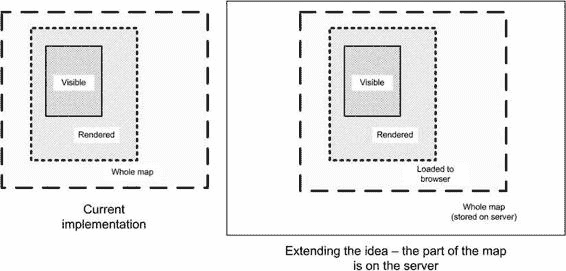
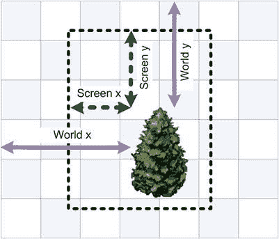

# 第 6 章：渲染虚拟世界  

## 清单 6-15：新的 Draw 方法  

```javascript
_p.draw = function(ctx) {
    if (this._offDirty) {
        this._redrawOffscreen();
    }

    // Should draw offscreen at
    var offCanvasX = -Math.floor(this._x) - this._offBounds.x * this._tileSize;
    var offCanvasY = -Math.floor(this._y) - this._offBounds.y * this._tileSize;
    var offCanvasW = Math.min(this._offCanvas.width - offCanvasX,
                              this._viewportWidth);
    var offCanvasH = Math.min(this._offCanvas.height - offCanvasY,
                              this._viewportHeight);

    ctx.drawImage(this._offCanvas, offCanvasX, offCanvasY, offCanvasW,
                  offCanvasH, 0, 0, offCanvasW, offCanvasH);
};
```  

运行测试并享受结果！尽管在静态图像上运行速度稍慢，但在移动地图上我们获得了显著更好的效果！我的 Galaxy S 在此演示中稳定保持在 45 fps。当前状态的代码版本已保存到`v.04`文件夹中，与本章的其他代码放在一起。  

同样的优化类型也可以应用于从服务器加载地图区块。我们将地图划分为几个虚拟区域：视口——用户当前看到的内容；离屏缓冲区——预渲染的内容；以及世界的其余部分。规则很简单：当用户到达某个区域的边界时，该区域会被重新计算（在我们的例子中，离屏缓冲区会被重新渲染）。  

但如果我们像图 6-10 那样在离屏缓冲区和世界的其余部分之间增加一个区域呢？我们将已传输到浏览器中的地图数据存储在这个新区域中，一旦用户到达边界，我们从服务器加载新数据。这是我们已经实现的想法的扩展。  

  

## 图 6-10：进一步扩展该想法。如果我们添加新的“已加载到浏览器”区域，就可以跟踪用户何时到达边界，并及时从服务器加载新的数据部分。  

地图运行得相当不错。当然，这并不意味着没有改进空间！事实上，我认为完全可以写一整本独立的书来描述各种优化算法，榨取处理器时间的每一毫秒。但从这一点开始，你已经准备好自己实现这些算法了，因为你已经了解了优化的基本原则，并且可以比较每种算法的效果。  

我们在这些章节中实现的优化保存在不同的文件夹中，因此只需在智能手机上打开每个演示，就可以比较效果。  

- `v.01` 包含没有任何优化的代码（对我来说是 21 fps）  
- `v.02` 实现了“仅绘制可见部分”策略（34 fps）  
- `v.03` 实现了后备缓冲区（地图不移动时约 45 fps；地图持续移动时约 30 fps）  
- `v.04` 实现了视口周边小区域的缓存（约 43-45 fps，取决于地图是否移动；性能下降太小，没有 `xStats` 图表难以察觉）  

  

