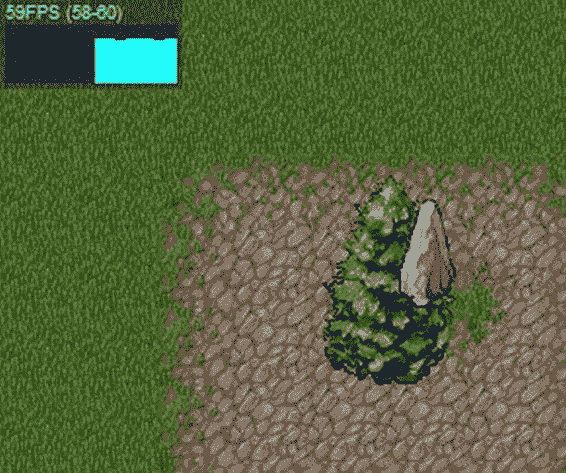
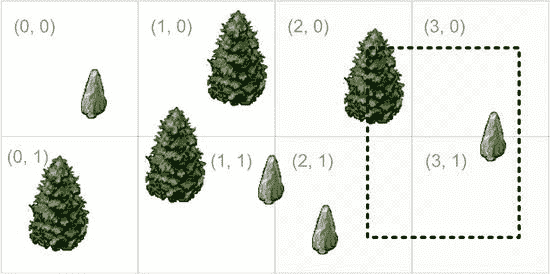

# 第 4 章 它们的渲染方式与平铺地形不同。地形瓦片是统一的——它们的大小都相同。而世界对象可以有不同的大小——有些较大，另一些较小。这就是为什么世界对象不能像瓦片那样轻松对齐到网格中。在本节中，我们将学习渲染游戏世界对象的基础知识。我们仅涵盖基础主题；下一章将介绍更高级的解决方案。

#### 坐标系

在处理对象时，像处理地图那样用屏幕坐标来描述它们并没有太大意义。用世界坐标来描述对象要方便得多。例如，当对象在世界内部移动并改变了相对于地图的位置时，我们自然会认为它发生了移动，而不是由于滚动而产生的移动。但仅有世界坐标不足以渲染对象。我们需要将屏幕坐标传递给渲染函数，以便将精灵显示在正确的位置上。这样一来，游戏对象会同时“存在于”多个坐标系中。我们刚刚描述的两种坐标系分别是世界坐标系和屏幕坐标系。图 6-11 展示了这一概念。

**图 6-11.** 游戏对象的两个坐标系：虚线箭头是屏幕坐标；实线箭头是世界坐标。

我们需要使用多个不同的坐标系，并能够快速地将坐标从一个坐标系转换到另一个坐标系。如果那棵树位于世界坐标的 (1270, 930) 处，我们应该在屏幕上的哪个位置绘制它？它是否可见？这是将世界坐标转换为屏幕坐标的一个例子。相反的例子是——当用户点击屏幕上的 (50, 120) 位置时，我们需要判断该点击处是否有一棵树。在这种情况下，我们需要从屏幕坐标转换到世界坐标，并检查给定的世界位置上是否有一棵树。

像我们现在正在探讨的这种俯视图，是坐标系之间转换最容易的视图。例如，要将屏幕坐标转换为世界坐标，我们可以这样写：

```
worldX = screenX - mapX;
worldY = screenY - mapY,
```

其中 `mapX` 和 `mapY` 是地图在屏幕上的当前位置。例如，`MapRenderer` 会将它们存储为 `this._x` 和 `this._y`。

反向转换，即从世界坐标转换到屏幕坐标，也同样容易：

```
screenX = worldX + mapX;
screenY = worldY + mapY,
```

有时，你还需要根据点击坐标或世界坐标来获取世界数组中瓦片的位置。例如，用户点击地图以建造一个兵营，游戏需要检查点击处下方地形的类型。如果用户点击了一个水域瓦片，我们就不应允许他在那里建造任何东西。这第三种常用的坐标系被称为瓦片坐标。其转换公式也非常简单：

```
tileX = Math.floor((screenX - mapX) / tileSize);
tileY = Math.floor((screenY - mapY) / tileSize);
```

如你所见，这些计算一点也不难。这是因为世界空间与屏幕空间非常相似。然而，情况并非总是如此。例如，由菱形或六边形瓦片构成的等距世界的计算就会稍微复杂一些。

**注意：** 在游戏开发中，坐标系通常被称为*空间*。例如，较为冗长的短语“从屏幕坐标系转换到世界坐标系”通常被简称为“从屏幕空间转换到世界空间”。我们会交替使用这些术语。

#### 实现 `WorldObjectRenderer`

现在我们准备实现 `WorldObjectRenderer` 类，它负责在屏幕上绘制对象。让我们从一个名为 `WorldObject` 的辅助类开始，它代表一个简单的可绘制实体，比如一棵树或一块岩石。代码如列表 6-16 所示。


**清单 6-16.** *WorldObject 类*

```
function WorldObject(spriteSheet, frame) {
    this._spriteSheet = spriteSheet;
    this._frame = frame;
    this._x = 0;
    this._y = 0;
}

_p = WorldObject.prototype;

_p.getPosition = function() {
    return {
        x: this._x,
        y: this._y
    };
};

_p.setPosition = function(x, y) {
    this._x = x;
    this._y = y;
};

_p.draw = function(ctx, x, y) {
    this._spriteSheet.drawFrame(ctx, this._frame, x, y);
};
```

`WorldObject` 是对 `SpriteSheet` 的封装，它将世界坐标与精灵表中的特定帧关联起来。`WorldObject` 期望内部 API 在调用 `draw()` 方法时传入正确的屏幕坐标。该类不关心视口位置或地图位置。

主要工作在 `WorldObjectRenderer` 类中完成，该类负责在地图之上渲染对象集合。该类的初始版本也非常简单：它将屏幕坐标传递给每个 `WorldObject` 并请求其自行绘制。代码如清单 6-17 所示。

**清单 6-17.** *绘制世界对象：第一版*

```
function WorldObjectRenderer(objects, viewportWidth, viewportHeight) {
    this._objects = objects;
    this._viewportWidth = viewportWidth;
    this._viewportHeight = viewportHeight;
    this._x = 0;
    this._y = 0;
}

_p = WorldObjectRenderer.prototype;

_p.move = function(deltaX, deltaY) {
    this._x += deltaX;
    this._y += deltaY;
};

_p.setViewportSize = function(width, height) {
    this._viewportWidth = width;
    this._viewportHeight = height;
};

_p.draw = function(ctx) {
    for (var i = 0; i < this._objects.length; i++) {
        var obj = this._objects[i];
        var pos = obj.getPosition();
        obj.draw(ctx, this._x + pos.x, this._y + pos.y);
    }
};
```

`WorldObjectRenderer` 的 API 与 `MapRenderer` 非常相似。实际上，唯一的区别在于构造函数的参数。在下一章中，我们将学习如何利用这一特性，但就目前而言，我们将保持一切不变。

最后一步是更新 `index.html` 文件。我们需要添加代码来加载新资源（包含世界对象的图片）、创建一些 `WorldObject` 实例并渲染它们。清单 6-18 中的代码总结了这些更新。

**清单 6-18.** *更新 index.html 以在平铺地图上渲染对象*

```
var spriteSheet;
var objectRenderer;

var images = {
    "tiles": "img/tiles.png",
    "objects": "img/objects.png" // 加载对象图片
};

// 帧的坐标
var frames = [
    [0, 0, 110, 96, 55, 96],
    [110, 0, 68, 108, 34, 108],
    [178, 0, 71, 79, 35, 79],
    [250, 0, 29, 56, 15, 56],
    [256, 60, 40, 31, 20, 31]
];

/** 一旦所有图片加载完成，启动动画循环 */
function onLoaded() {
    mapRenderer = new MapRenderer(world, imageManager.get("tiles"),
        40, canvas.width, canvas.height);
    spriteSheet = new SpriteSheet(imageManager.get("objects"), frames);
    objectRenderer = new WorldObjectRenderer(getObjects(),
        canvas.width, canvas.height);
    animate(0);
}

function getObjects() {
    return [
        getTree(200, 200),
        getTree(280, 220),
        getRock(300, 270),
        getRock(150, 197)
    ];
}

function getTree(x, y) {
    var obj = new WorldObject(spriteSheet, 1);
    obj.setPosition(x, y);
    return obj;
}

function getRock(x, y) {
    var obj = new WorldObject(spriteSheet, 3);
    obj.setPosition(x, y);
    return obj;
}

/** 在此执行渲染 */
function animate(t) {
    clear();
    mapRenderer.draw(ctx);
    objectRenderer.draw(ctx);
    requestAnimationFrame(arguments.callee);
}

/** 处理地图移动 */
function onMove(e) {
    mapRenderer.move(e.deltaX, e.deltaY);
    objectRenderer.move(e.deltaX, e.deltaY);
}

function resizeCanvas(canvas) {
    canvas.width = document.width || document.body.clientWidth;
    canvas.height = document.height || document.body.clientHeight;
    mapRenderer && mapRenderer.setViewportSize(canvas.width, canvas.height);
    objectRenderer && objectRenderer.setViewportSize(canvas.width,
        canvas.height);
}
```

保存更改并刷新页面后，您应该会看到如图 6-12 所示的画面。效果更棒了！

**图 6-12.** *世界对象的渲染*

#### 渲染顺序


##### 游戏对象的渲染顺序

游戏对象必须按正确的顺序渲染。图 6-13 展示了使用错误渲染顺序可能发生的情况。岩石本应位于树的后方，但由于渲染顺序错误，它出现在了树的前方。



**图 6-13.** *错误的渲染顺序*

为了解决这个问题，我们必须确保“更靠后”的对象在更靠近玩家的对象之前被渲染。在 2D 世界中，这很容易实现。你可以根据对象底部的坐标对其排序，然后按从远到近的顺序绘制它们。为此，我们向 `SpriteSheet` 类添加了几行代码。我们需要知道帧的边界才能对世界对象进行排序。清单 6-19 展示了具体做法。

**清单 6-19.** *向 SpriteSheet 添加代码以获取帧的边界*

```javascript
_p.getFrameBounds = function(index, x, y) {
    var frame = this._frames[index];
    if (!frame)
        return;
    return {
        x: x - frame[SpriteSheet.FRAME_ANCHOR_X],
        y: y - frame[SpriteSheet.FRAME_ANCHOR_Y],
        w: frame[SpriteSheet.FRAME_WIDTH],
        h: frame[SpriteSheet.FRAME_HEIGHT]
    };
};
```

接下来，更新 `WorldObject` 自身，使其能向 `WorldObjectRenderer` 报告相对于世界对象位置的边界（参见清单 6-20）。

**清单 6-20.** *更新 WorldObject 类，添加 getBounds() 函数*

```javascript
_p.getBounds = function() {
    return this._spriteSheet.getFrameBounds(this._frame, this._x, this._y);
};
```

最后，在 `WorldObjectRenderer` 的构造函数中添加排序代码，如清单 6-21 所示。

**清单 6-21.** *排序世界对象*

```javascript
function WorldObjectRenderer(objects, viewportWidth, viewportHeight) {
    this._objects = objects;
    this._objects.sort(function(o1, o2) {
        var bounds1 = o1.getBounds();
        var bounds2 = o2.getBounds();
        return (bounds1.y + bounds1.h) - (bounds2.y + bounds2.h);
    });
    this._viewportWidth = viewportWidth;
    this._viewportHeight = viewportHeight;
    this._x = 0;
    this._y = 0;
}
```

完成对象的排序后，渲染就正确了。

这个简单的问题很容易解决，但它带来了很多影响。在拥有大量世界对象且对象可能移动并破坏已排序顺序的情况下，“每帧排序”不再是可行方案。目前，所有对象都是静态的——只有岩石和树木——但一旦你添加了移动的实体，情况就会变得有趣得多。在下一章中，我们将解决这个问题，并构建一个更高级的 `WorldObjectRenderer` 版本，它也能处理移动。

##### 优化

从优化的角度来看，对象的处理方式与常规图块完全相同。规则依然不变：如果你不想浪费任何 CPU 周期，只绘制你真正需要绘制的内容。我们不会再重复从最简单的案例开始逐步改进的练习——同样的技巧没有必要做两次。让我们直接思考一种近乎最优的对象渲染方式。

我们无法轻易确定需要绘制哪些对象。游戏对象不构成网格，我们也不能像对待图块那样说“本轮我们绘制五号到八号对象”。因此，我们有两个选择。第一，我们可以检查世界中的每一个对象，并决定是否绘制它。是的，这确实是一个选项。例如，假设在你的游戏中，主要角色在房间之间移动；那么房间会逐个加载，并且每个房间相对于屏幕尺寸来说都比较小。这样一来，你可能需要绘制世界中至少 50% 的对象。对于拥有较小世界的社交农场类游戏也是如此。在这种情况下，使用最简单的方案来节省编码时间其实是合理的：检查每个对象的边界框，并绘制那些落在可见区域内的对象。

然而，也存在其他情况，比如当你的世界非常大时，玩家……


只能同时看到屏幕上不到 1% 的对象。很有可能！在这种情况下，我们不能像那样检查对象，因为这会立刻拖垮游戏性能。唯一的解决方案是将游戏对象组织成某种空间结构，该结构可以决定哪些对象“现在”最有可能可见。

**注意：** 这个问题并非游戏开发所独有。还有许多其他类型的应用程序也面临同样的问题。例如，“用户能看到哪些精灵？”这个问题与“列出距离我家不超过 3 英里的加油站”非常相似，后者常见于地图和导航领域。加油站就是精灵，“3 英里”是视口的大小，“我的家”是视口的当前位置。因此，这个问题被认真研究过也就不足为奇了。

有各种算法可以解决这个问题（大多数基于树），它们通过将实体分组到边界矩形中，并在下一级将边界矩形分组到更大的边界矩形中（尝试搜索“`R-Tree`”以获取关于此方法如何工作的好例子）。然而，其背后的数学原理相当复杂，在此解释会占用太多篇幅，而且对大多数读者来说也不有趣。

有一种更简单的方法适用于游戏开发（至少在客户端），实现起来不需要火箭科学学位。我们喜欢使用网格。网格很简单，因为它们有整齐的方形单元格，并且很容易找到与当前视口相交的单元格。我们之前在瓦片网格中使用过这个技巧，那么让我们再用一次！我们可以将整个游戏对象集合分解为一个均匀的网格，并且只检查落在可见单元格中的对象。

看一下图 6-14 中的图片，它展示了这个想法。在图片所示的例子中，只有四个对象会被检查是否与视口相交：位于网格单元格 (2,0)、(3,0)、(2,1) 和 (3,1) 中的对象。其中只有两个实际与视口相交的对象会被渲染。这样，我们就能消除无用的检查，只绘制真正重要的内容。



第 6 章：渲染虚拟世界 **249**

**图 6-14.** *最小化绘制前需要检查的对象数量。世界被划分为网格。每个对象被分配到几个网格单元格中。在每一帧中，只检查单元格 (2,0) 到 (3,1) 中的对象。*

显然，游戏对象可能位于两个单元格的边界上，甚至位于两个边界相交的点上。在这种情况下，该对象会被分配到两个或四个网格单元格中。之后，我们会过滤这些对象，以免将它们绘制两次或四次。

如果对象在移动怎么办？我们必须跟踪它，并确保当它离开某个网格单元格时取消注册，并在进入新单元格时进行注册。这就像带着手机在城市里旅行：它总是在寻找最好的 GSM 发射器。当您离开一个发射器的范围时，您就会在另一个发射器上注册。

确定网格单元格的最佳大小非常重要。最佳大小取决于您游戏的具体情况、游戏对象的密度，以及它们是静态的（不移动、不出现或消失）还是动态的（四处移动、出现新对象、旧对象消失）。如果单元格做得很大，意味着在每一动画帧中您都必须检查更多对象。例如，如果一个单元格是 500×500 像素，而视口位于单元格的交汇处，这意味着您必须测试一个 1000×1000 像素区域内的对象，这相当大。如果把单元格做得太小，很快就会面临大量空单元格的问题。此外，一个移动的对象必须不断地在这些单元格中注册/取消注册。那么最佳大小是多少？这个问题最好通过在您的特定设置上运行一些基准测试来回答。


