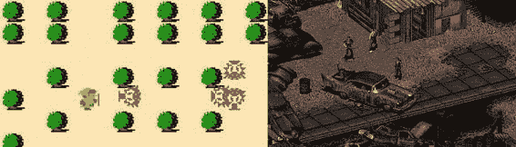
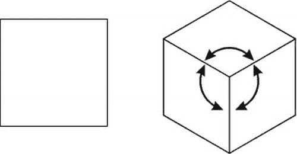
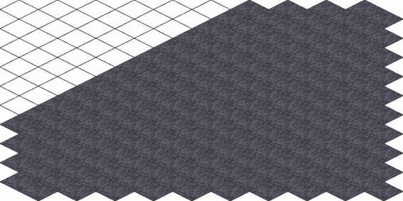
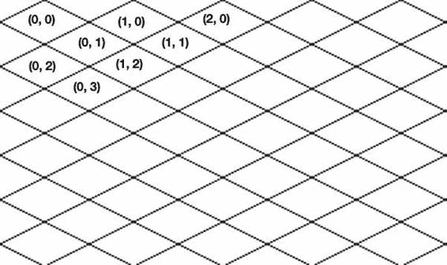
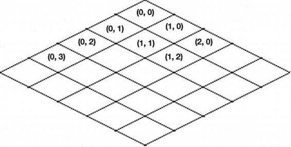

# 第六章：渲染虚拟世界

### 等距视角

在下一章中，我们将基于网格这一简单概念，构建更高级的对象渲染器。

本章最后部分专门快速概述等距投影。到目前为止，我们一直使用的是俯视图，这意味着用户以 90 度角观察场景。图 6-15 展示了俯视图和等距投影之间的区别。

**图 6-15.** *左侧是任天堂于 1986 年发行的《塞尔达传说》，采用正交（俯视）视图。右侧是黑岛工作室制作、Interplay 于 1998 年发行的《辐射 2》，采用等距投影。*

另一种有趣的观察方式是当摄像机轻微旋转时。当然，在 2D 世界中，我们无法旋转摄像机。对于 2D 游戏而言，等距视图意味着一种特殊的绘制和渲染对象的方式，它能营造出深度感。其定义是：等距投影是坐标轴之间角度相等（均为 120 度）的投影。

图 6-16 展示了我们正在制作的立方体在俯视图投影和等距投影中的样子。

**图 6-16.** *左侧的立方体是俯视图投影——无论是俯视还是侧视，看起来都一样。右侧的立方体是等距投影。*

有许多游戏采用这种渲染世界的方法。与俯视图相比，等距视图对用户来说看起来更自然。当你玩棋盘游戏时，你不会直接从正上方看棋盘。当中世纪的将军率领军队作战时，他也不会从热气球上俯瞰战场。

让我们看看在`canvas`上创建基于等距投影的引擎需要什么。最重要的是，我们在本章中介绍的优化方法并非俯视图游戏所独有。它同样适用于“等距游戏”。唯一的区别在于绘制瓦片的方式以及在坐标系之间转换的方式。

在等距游戏中，瓦片是菱形的，其宽度是高度的两倍。因此，它们形成的网格不是矩形的；奇数行的瓦片相对于偶数行的瓦片会偏移半个宽度。所以，等距瓦片的渲染代码需要进行调整。**图 6-17 展示了一个等距网格的示例。**

**图 6-17.** *等距地图的左侧填充了“空”瓦片，以展示网格的样子。*

等距瓦片的坐标系也与我们在通常的“方形”投影中使用的坐标系不同。在等距瓦片地图中，至少有两种设置瓦片坐标和渲染瓦片世界的方法。图 6-18 展示了第一种为瓦片分配坐标的方法。

**图 6-18.** *为等距网格分配坐标的一种方法*

在这里，地图的坐标轴与`canvas`的坐标轴平行。第二种方法如图 6-19 所示：将坐标逆时针旋转 45 度。`x`轴现在指向屏幕的右下角，而`y`轴指向左下角。

**图 6-19.** *绘制瓦片地图的另一种方法*

这段简短的介绍应该能让您对等距投影是什么以及等距游戏的外观有所了解。我们还没有探讨如何实现等距游戏，但这正是下一章的全部内容。您一定玩过至少几款等距游戏，即使不是在《辐射 2》的时代，那么近些年在社交网络中也玩过。等距引擎在吸引人的外观与相对较低的复杂性（例如与 3D 引擎相比）之间取得了平衡。这就是等距游戏成为社交应用开发者主要目标的原因。

## 总结

