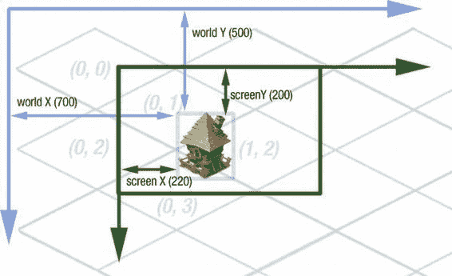
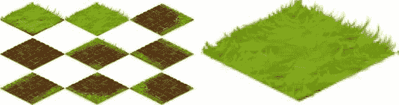
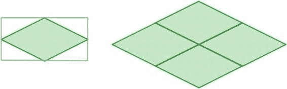
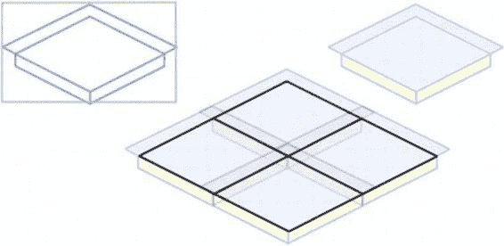

# 第七章：制作等距引擎

当然，如果函数绑定到某个对象，那么 `apply()` 和 `call()` 都无法改变这一行为。

**注意：** 严格来说，`apply()` 和 `call()` *确实* 会改变“绑定”函数中 `this` 关键字的值，但不会改变原始函数中的值。不过这种改变不会产生任何效果，因为绑定函数并不依赖 `this`。

#### 数学函数与 `Rect` 类

自然，编写 2D 引擎需要一些 2D 数学知识。等距引擎也不例外。最常见的数学运算包括矩形操作——判断两个矩形是否相等，测试对象是否可见（对象矩形与视口矩形相交），测试用户是否点击了对象（点击位置在对象矩形内），以及找出需要重绘以覆盖所有脏区域的最小矩形（寻找矩形凸包）。

由于函数数量众多，若将它们分散在代码中会显得杂乱。更好的方法是创建一个类，并在其中实现所有矩形处理相关的数学运算。我们将这个类命名为 `Rect`（`Rectangle` 输入起来太长了）。这些函数的代码实际上属于大家在学校学过的基础数学课程内容，因此在此不再赘述。完整源代码随本章资料一起提供，位于 `js/Rect.js` 文件中。这里我们仅列出函数声明，以便了解我们依赖的工具：

```
function Rect(x, y, width, height) {
    this.x = x; this.y = y;
    this.width = width; this.height = height;
}

_p = Rect.prototype;

/* 创建一个与给定矩形大小和位置完全相同的新矩形 */
_p.copy = function() {...}

/* 如果两个矩形相等则返回 true（大小和位置相同） */
_p.equals = function(r2) {...};

/* 返回矩形的字符串表示，便于调试 */
_p.toString = function() {...};

/* 将 toString() 的值输出到控制台 */
_p.print = function() {...};

/**
 * 所有接受 4 个参数（坐标）的函数
 * 也可以接受单个参数（矩形）
 */

/* 如果两个矩形相交（共享部分区域）则返回 true */
_p.intersects = function(x2, y2, w2, h2) { ... };

/* 如果该矩形完全覆盖另一个矩形则返回 true。 */
_p.covers = function(x2, y2, w2, h2) { ... };

/* 返回当前矩形与作为参数传入的矩形的凸包。
 * 换句话说，返回能够覆盖两者的最小可能矩形。
 */
_p.convexHull = function(x2, y2, w2, h2) { ... };

/* 返回两个矩形的交集 */
_p.intersection = function(x2, y2, w2, h2) { ... };

/* 如果该矩形包含坐标 (x, y) 的点，则返回 true */
_p.containsPoint = function(x, y) { ... };

/**
 * 给定一个矩形单元格网格，单元格大小为 (cellW, cellH)，
 * 测试该矩形重叠了哪些单元格。
 * cellsInRow 和 cellsInColumn 仅用于限制坐标，
 * 以防止例如数组访问越界。
 */
_p.getOverlappingGridCells = function(cellW, cellH, cellsInRow, cellsInColumn) {
    ... };
```

#### `GameObject` 类

在编写引擎本身之前，我们需要创建的另一个重要类是 `GameObject`。这个类是游戏中所有实体的根类：对象、图层、UI 小部件等。我们放在屏幕上、渲染、移动或调整大小的所有东西都属于这个类。清单 7-4 是 `GameObject.js` 的代码。清单中最有趣的部分是 `setPosition()`。一旦 `GameObject` 确认新位置与旧位置确实不同，它就会触发 `move` 事件。其他实体（如图层）可以订阅此事件并相应地更新世界（例如，`ObjectLayer` 的聚类算法需要追踪每个对象的移动以保持聚类的一致性）。


### **清单 7-4.** `GameObject` 类：游戏对象体系的根节点

```javascript
function GameObject() {
  EventEmitter.call(this);
  this._id = GameObject._maxId++;
  this._bounds = new Rect(0, 0, 100, 100);
}

extend(GameObject, EventEmitter);

var _p = GameObject.prototype;
GameObject._maxId = 1;

_p.draw = function(ctx) {
  // 待实现
};

_p.setSize = function(width, height) {
  this._bounds.width = width;
  this._bounds.height = height;
};

_p.move = function(deltaX, deltaY) {
  this.setPosition(this._bounds.x + deltaX, this._bounds.y + deltaY);
};

_p.setPosition = function(x, y) {
  if (this._bounds.x != x || this._bounds.y != y) {
    var evendData = {
      oldX: this._bounds.x,
      oldY: this._bounds.y,
      x: x,
      y: y,
      object: this
    };
    this._bounds.x = x;
    this._bounds.y = y;
    this.emit("move", evendData);
  }
};

_p.getBounds = function() {
  return this._bounds;
};

_p.getId = function() {
  return this._id;
};
```

`GameObject` 继承了 `EventEmitter`，因此每个游戏对象都可以发送自定义事件。这是一个相当便捷的特性。例如，`IsometricTileLayer` 可以触发一个带额外参数的 `tileClicked` 事件，通知外部用户点击了某个特定瓦片；而 `ObjectLayer` 则可以触发 `objectClicked`——这是一个专属于其领域的事件。

每个游戏对象都有一个唯一 ID。这个 ID 在许多方面都很有用——从网络同步（精确判断十栋建筑中是哪一栋被摧毁）到调试这样虽小却重要的事情。`GameObject` 类的代码使用一个全局计数器来跟踪已分配给游戏对象的最大 ID，并在每次后续构造函数调用时递增该值。

### **数组**

最后一个工具类将一小套工具整合在一起，使数组操作至少变得稍微容易一些。JavaScript 对数组操作的支持非常薄弱；即使是其他语言通常内置提供的诸如 `contains()` 和 `remove()` 这样简单的函数，在 JavaScript 中也是缺失的。我们只需要三个辅助方法。这个类，如**清单 7-5** 所示，非常小巧，我直接把它放到了 `utils.js` 文件中。

### **清单 7-5.** `Array` 类：简化数组操作的小型辅助方法集合

```javascript
var Arrays = {
  remove: function(obj, arr) {
    var index = arr.indexOf(obj);
    if (index != -1)
      arr.splice(index, 1);
  },
  contains: function(obj, arr) {
    return arr.indexOf(obj) > -1;
  },
  addIfAbsent: function(obj, arr) {
    if (!Arrays.contains(obj, arr)) {
      arr.push(obj);
    }
  }
};
```

**注意：** 有一个名为 `Underscore.js` 的出色库，它已经实现了核心 JavaScript 中大多数缺失的数据操作函数。请访问 [`underscorejs.org`](http://underscorejs.org) 查看。你可能会发现它对你的项目相当便利。

现在我们拥有了几个可用的实用工具函数。游戏框架已经就绪，我们可以开始添加引擎的各个组件——地形、对象、UI 控件和事件。我们将从地形开始。

### 等距地形

项目的第一步是渲染一个等距地形。我们已经在第 6 章中学习了相当多的理论，现在该在实践中实现它了。让我们先从回顾游戏引擎的坐标系知识开始。

#### 坐标系

这类游戏至少存在几种坐标系统：屏幕坐标、世界坐标和等距网格坐标。理解它们之间的区别以及如何在不同坐标系之间进行转换至关重要。在继续之前，请确保你熟悉本节内容；否则，本章中的大部分公式可能会显得令人困惑。

游戏世界是一个广阔的区域，包含许多不同的对象。每个对象在世界空间中都拥有坐标。如果你将世界想象成一个巨大的图像，比如 5000 × 5000 像素，那么世界坐标就是该图像内部的坐标。世界坐标对于游戏内机制非常有用：AI、


## 碰撞检测等

在绘制时，世界坐标必须转换为屏幕坐标。

请看图 7-4 所示的典型世界渲染任务。假设我们需要绘制一个位于世界坐标`(700, 500)`处的小屋。`drawImage()`接受画布坐标（即屏幕坐标），那么如何找到它们呢？物体在屏幕上的位置取决于当前可见的世界区域——即视口位置。如果视口的左上角位于世界坐标`(480, 300)`处，则该物体的屏幕坐标为`(700 – 480, 500 – 300) = (220, 200)`。



## 第 7 章：制作等距引擎

反向转换也是如此。当用户点击屏幕时，你会获得屏幕坐标。例如，`EventHandler`报告用户点击了`(50, 100)`点。现在你需要找出点击的是哪个物体。物体存储在世界坐标中（在第 6 章中，我们讨论了为什么以这种方式存储物体更便捷），因此要找到物体，你必须转换回世界坐标。该点击点的世界坐标为`(480 + 50, 300 + 100) = (530, 400)`。

我们继续举例，假设用户没有点击到任何物体。这意味着他点击了某个地面瓦片。但究竟是哪一个呢？要找出答案，我们需要将世界坐标转换为等距网格坐标。该转换公式稍微复杂一些；我们将在本章后面探讨。

图 7-4 中的小屋具有世界坐标`(700, 500)`、屏幕坐标`(220, 200)`，并且它位于坐标`(0, 3)`和`(1, 2)`的瓦片上。

**图 7-4.** *三种不同的坐标系：世界坐标、屏幕坐标和等距网格坐标*

一旦你理解了坐标的工作原理以及如何在不同系统之间进行转换，你就可以进入下一部分——编写游戏本身了。我们计划的第一步是渲染地形。

### 渲染瓦片

我们首先仔细检查已有的资源——图 7-5 所示的等距瓦片集。



**第 7 章：制作等距引擎** **273**

**图 7-5.** *用于渲染的原材料：左侧为精灵集，右侧为放大的草地精灵*

这个地形精灵的不寻常之处在于其边缘并非完全笔直；草块碎片延伸到了单元格边界之外。艺术家们经常利用这种技术来为图像增加深度感，使其更逼真。如果你从草坪上切下一块矩形草皮，然后在“等距”角度下拍照，你会发现边缘根本不是直的。这正是这类瓦片的样子。

这类瓦片在游戏开发中非常常见。为了在文本中引用它们，并与上一章中完美的菱形瓦片区分开来，我们将使用**装饰型**这个词——因为你需要考虑额外的装饰元素。对于边缘完全笔直的瓦片，我们将使用**平面型**或**简单型**这两个词。

**注意：** 这些术语并非行业标准。我们需要在本节中区分不同类型的瓦片，因此我决定自己发明名称来对它们进行分类。

装饰型瓦片的渲染技术与平面型瓦片略有不同。由于你在自己的游戏中可能会遇到这两种情况，我们将探讨其中的区别。图 7-6 展示了一个简单的等距瓦片案例，其形状为完美的菱形。绘制它非常简单：精灵的宽度和高度与等距网格中单元格的宽度相同，且渲染顺序无关紧要。你可以按任何顺序绘制——从上到下、从右到左——只要你方便就行。由于瓦片不重叠，结果总是相同的。




**第 7 章：制作等距引擎**


