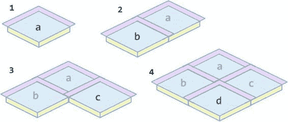
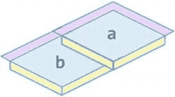
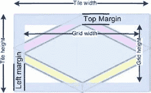
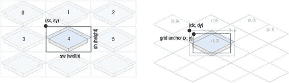
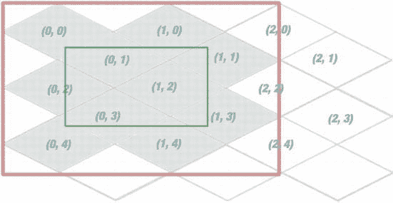
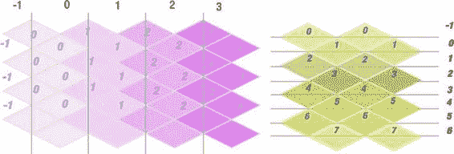

# 排版后的内容

**图 7-6.** *无重叠元素的简单等距瓦片：绘制顺序无关紧要*

装饰性瓦片则有所不同。请看图 7-7。这类瓦片比网格单元格更大，因为它包含会与相邻瓦片重叠的区域。左图展示了它在一个矩形精灵中的可能定位方式。请注意，覆盖网格单元格的区域不一定位于精灵的正中心。“菱形”的精确位置取决于重叠部分的大小。右侧图像显示了单个瓦片，底部图像则展示了排列成网格的一组瓦片。

**图 7-7.** *装饰性等距瓦片：它们比网格单元格大，且会重叠相邻瓦片*

显然，在处理装饰性瓦片时，渲染顺序确实很重要。图 7-8 展示了正确的渲染顺序——从上到下。




第 7 章：构建等距引擎

**275**

**图 7-8.** *重叠瓦片必须按从上到下的顺序绘制。如果顺序被打乱，结果将不像地形，因为瓦片之间无法契合。*

图 7-9 展示了先绘制瓦片 b 而非瓦片 a 的结果。如你所见，最终图像看起来并不像真实地形。

**图 7-9.** *错误的渲染顺序*

渲染代码需要知道“装饰部分”的确切尺寸，以便在网格上正确排列瓦片。图 7-10 展示了瓦片的关键参数。瓦片宽度和瓦片高度是指容纳该瓦片的精灵尺寸——即同时包含瓦片及其装饰部分的图像大小。在精灵表中，单个精灵的单元格大小为 `瓦片宽度 × 瓦片高度`（单位为像素）。例如，我们的瓦片宽 128 像素，高 68 像素。网格宽度和网格高度是等距网格单元格的尺寸；换言之，即覆盖单元格的完美菱形的大小。我们的艺术家为网格单元格尺寸 124 × 62 像素创建了瓦片。最后一组参数是边距，即从精灵边缘到菱形的距离。要渲染瓦片，我们只需知道左边距和上边距。在我们的案例中，它们分别为 0 像素和 3 像素（左边距为零）。但并非所有情况都如此；例如，图 7-10 中的瓦片就同时展示了左边距和上边距。




第 7 章：构建等距引擎

**图 7-10.** *标识瓦片的参数：瓦片尺寸、网格尺寸和边距。这些测量值足以渲染地形。*

**注意：** 当你使用其他瓦片工作表时，这些参数会有所不同。关键在于，这六个数值描述了瓦片的几何形状，且足以完成地形渲染。同样的数值也可用于描述没有重叠区域的简单瓦片。此类瓦片没有边距（0px），且“瓦片尺寸”与“网格尺寸”相同。

现在我们可以编写渲染代码了。等距地图的本质是一个二维数组，其中的值指向瓦片在工作表中的位置。由于瓦片工作表的宽度已知，仅用一个数字就能唯一标识瓦片。图 7-11 展示了瓦片索引的工作原理。

**图 7-11.** *绘制装饰性精灵*

随后，应将精灵放置到网格上，使瓦片的菱形区域与网格单元格的位置对齐，如图 7-11 右侧所示。我们需要找到网格锚点——即网格单元格的左上角——然后在该位置上方渲染瓦片，并根据边距值偏移位置。清单 7-6 中的代码正是实现了这一功能。

第 7 章：构建等距引擎

**277**

**清单 7-6.** *在画布上绘制装饰性瓦片*

```
/* 首先获取瓦片在瓦片表中的位置 */
var tileX = tileId%spritesInRow;
var tileY = Math.floor(tileId/spritesInRow);
var sx = tileX*tileWidth;
var sy = tileY*tileHeight;
```


/* 接下来，找到网格锚点——即我们所要渲染的单元格的坐标 */

```javascript
var gridAnchorX = cellX*cellWidth + (cellY%2)*cellWidth/2;
var gridAnchorY = cellY*cellHeight/2;
```

/* 最后，在单元格上渲染瓦片： */

```javascript
var dx = gridAnchorX - marginLeft;
var dy = gridAnchorY - marginRight;
ctx.drawImage(tilesetImage, sx, sy, tileWidth, tileHeight, dx, dy, tileWidth, tileHeight);
```

如果需要绘制多个瓦片，别忘了顺序很重要。以下代码展示了如何渲染更大的地图区域——从 `startCellX` 到 `endCellX`，以及从 `startCellY` 到 `endCellY`，如清单 7-7 所示：

**清单 7-7.** *绘制由 `startCellX`、`endCellX`、`startCellY` 和 `endCellY` 限定的地图区域*

```javascript
for (var cellY = startCellY; cellY <= endCellY; cellY++) {
    for (var cellX = startCellX; cellX <= endCellX; cellX++) {
        var tileId = mapData[cellY][cellX];
        var tileX = spritesInRow;
        var tileY = Math.floor(tileId / spritesInRow);
        var sx = tileX * tileWidth;
        var sy = tileY * tileHeight;
        var dx = cellX * cellWidth + (cellY % 2) * cellWidth / 2 - marginLeft;
        var dy = cellY * cellHeight / 2 - marginRight;
        ctx.drawImage(tilesetImage, sx, sy, tileWidth, tileHeight,
            dx, dy, tileWidth, tileHeight);
    }
}
```

#### 实现 IsometricTileLayer

现在，基本渲染应该已经很清楚了。下一步是创建 `IsometricTileLayer`——负责渲染地图的类。它的任务不仅像我们刚才做的那样绘制瓦片，还要实现一些优化技巧。

正如你所记得的，在每一帧上渲染每个瓦片并不是一个好主意——更好的做法是将地图的预渲染区域保存在不可见的离屏画布上，并在需要时从中复制。

在你的 `js` 文件夹中创建一个名为 `map` 的文件夹，然后在其中创建一个空白文件，命名为 `IsometricTileLayer.js`。我们还有几个与地图相关的类，因此将它们与应用程序的其他部分分开存放是值得的。

我们已经知道渲染需要哪些参数，以及如何绘制地图的一个区域。现在我们可以编写构造函数和 `_drawMapRegion()` 方法了。代码如清单 7-8 所示。

**清单 7-8.** *`IsometricTileLayer` 及其 `_drawMapRegion` 方法*

```javascript
function IsometricTileLayer(mapData, tileset, tileWidth, tileHeight, cellWidth,
                            cellHeight, marginLeft, marginTop) {
    GameObject.call(this);
    this._mapData = mapData;
    this._tileset = tileset;
    this._tileWidth = tileWidth;
    this._tileHeight = tileHeight;
    this._cellWidth = cellWidth || tileWidth;
    this._cellHeight = cellHeight || tileHeight;
    this._marginLeft = marginLeft;
    this._marginTop = marginTop;
    this._spritesInOneRow = Math.floor(tileset.width / tileWidth);
    this._offCanvas = document.createElement("canvas");
    this._offContext = this._offCanvas.getContext("2d");
    this._offRect = new Rect(0, 0, 0, 0);
    this._offDirty = true;
}

extend(IsometricTileLayer, GameObject);
_p = IsometricTileLayer.prototype;

_p._drawMapRegion = function (ctx, rect) {
    var startCellX = Math.max(0, rect.x);
    var endCellX = Math.max(0,
        Math.min(rect.x + rect.width - 1, this._mapData[0].length - 1));
    var startCellY = Math.max(0, rect.y);
    var endCellY = Math.min(rect.y + rect.height - 1, this._mapData.length - 1);

    for (var cellY = startCellY; cellY <= endCellY; cellY++) {
        for (var cellX = startCellX; cellX <= endCellX; cellX++) {
            var tileId = this._mapData[cellY][cellX];
            var tileX = tileId % this._spritesInOneRow;
            var tileY = Math.floor(tileId / this._spritesInOneRow);
            var sx = tileX * this._tileWidth;
            var sy = tileY * this._tileHeight;
            var sw = this._tileWidth;
            var sh = this._tileHeight;
            var dx = (cellX - rect.x) * this._cellWidth +
                (cellY % 2) * this._cellWidth / 2 - this._marginLeft;
            var dy = (cellY - rect.y) * this._cellHeight / 2 - this._marginTop;
            var dw = this._tileWidth;
            var dh = this._tileHeight;
            ctx.drawImage(this._tileset, sx, sy, sw, sh, dx, dy, dw, dh);
        }
    }
};
```

这段代码你应该已经很熟悉了。构造函数保存了参数并初始化了离屏画布，而 `_drawMapRegion()` 负责


`exactly what it sounds like`——它将地图的片段渲染到给定的上下文中。这里我们实现了第六章中探索的第一种瓦片地图优化：只渲染屏幕上可见的那些瓦片。

下一步是创建离屏缓冲区，并编写代码来管理它：处理大小调整、移动和失效。这样我们就可以实现瓦片地图的第二种优化——仅当用户移动超出已渲染区域边界时才重新渲染地图。

##### 视口和地图边界

离屏图像是一个预渲染的图像，其面积略大于用户当前可见的区域。第一步是找出用户当前应该看到地图的哪一部分。图 7-12 中的小矩形是视口，高亮的瓦片是那些至少部分可见的瓦片，而更大的矩形则是离屏画布的大小，它足以容纳可见区域。



**图 7-12.** 离屏画布的参数说明。找出哪些瓦片可见，然后找出覆盖它们的矩形。

在网格坐标中，最小的`x`和`y`是`0`，最大的`x`和`y`分别是`1`和`4`。因此，网格坐标中的边界矩形是`x=0`、`y=0`、`width=2`、`height=5`。如果你将这些坐标传递给`_drawMapRegion()`，它将渲染所需的地图片段。

当然，在图片上找出正确的瓦片很容易，但现在我们需要编写代码来做同样的事情。直接找出正确的公式可能有点棘手。在本节中，我们将从代码开始，然后解释其工作原理。清单 7-9 中的函数返回地图在网格坐标中的边界，也就是用户通过视口将看到的内容。

**清单 7-9.** 获取地图边界

```javascript
_p._getVisibleMapRect = function() {
    var x = Math.floor((this._bounds.x - this._cellWidth/2)/this._cellWidth);
    var y = Math.floor(this._bounds.y/(this._cellHeight/2)) - 1;
    var width = Math.ceil(this._bounds.width/this._cellWidth) + 1;
    var height = Math.ceil((this._bounds.height)/(this._cellHeight/2)) + 2;
    return new Rect(x, y, width, height);
};
```

将视口想象成用户观察世界的窗口。视口的大小就是可用于渲染的大小。在我们的例子中，它是画布的大小。`x`和`y`坐标决定了用户看到世界的哪一部分。当玩家滚动地图时，实际上是在移动视口以查看新区域。显然，`IsometricTileLayer`需要知道视口的大小和位置才能渲染地图。



一个存放视口矩形的好地方是`this._bounds`——图层对象中从`GameObject`继承而来的变量。游戏地图的实际边界（整个世界的尺寸）对外部 API 来说几乎无用：将图层边界视为视口的边界要好得多。这样，移动图层就是移动视口，调整大小就是改变视口的尺寸：

```javascript
layer.move(0, 50);            // 显示当前位置下方 50 像素的地图片段
layer.setSize(300, 300);      // 将图层的可见部分调整为 300x300
layer.getBounds();            // 获取视口的边界
```

**注意：** 关于图层和视口的坐标有两种不同的方法。一种是保持图层在世界坐标`(0, 0)`处，并*移动视口*。另一种是将视口“固定”在世界坐标`(0, 0)`处，并*移动图层*。结果完全相同：当玩家移动地图时，他会看到新区域。这主要取决于个人偏好——是移动图层还是移动视口。

现在我们需要找出视口所覆盖的地图边界。拿一张纸，画一个等距网格，并将其划分为垂直区域，以便每个...


