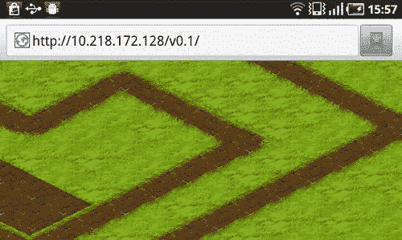

# 制作等距引擎

`zone` 具有瓦片的最小可见 x 坐标。为更简便起见，请在网格的每个单元格上写出 x 坐标。然后，对 y 坐标执行相同操作，并将网格划分为水平区域。我在图 7-13 中为你绘制了一个示例。在垂直网格（左侧）中，区域 -1 是瓦片最小可见 x 坐标（-1）所在的位置。用于 y 坐标的水平网格（位于右侧）遵循相同的思路：区域 2 包含可见瓦片的最小 y 坐标，即 2。

**图 7-13.** *将网格划分为垂直和水平区域*

我们的目标是编写代码，当给定世界坐标时，能够找到区域的 ID。我们找到的值是贴图边界的 x 和 y 值：即左上角。观察图 7-13 中的垂直区域（左侧），你会发现这些区域的大小恰好是 `cellWidth`，并且从 `cellWidth/2` 开始。0 区域的 x 值范围是从 `0.5*cellWidth` 到 `1.5*cellWidth`，1 区域的 x 值范围是从 `1.5*cellWidth` 到 `2.5*cellWidth`，依此类推。以下代码形式化了这种依赖关系：

```
var x = Math.floor((this._bounds.x - this._cellWidth/2)/this._cellWidth);
```

对 y 执行相同操作：区域大小为 `cellHeight/2`，区域从 -1 开始。接下来的代码片段现在也很清晰：

```
var y = Math.floor(this._bounds.y/(this._cellHeight/2)) - 1;
```

现在我们得到了边界矩形的左上角坐标。宽度和高度值的获取则更为简单。对于宽度，取覆盖视口所需的最小区域数，即 `Math.ceil(this._bounds.width/this._cellWidth)`。由于等距视图中的行是错位排列的，我们需要在此值上加 2，以覆盖下一列和前一列：

```
var width = Math.ceil(this._bounds.width/this._cellWidth) + 2;
```

高度公式的工作原理相同：

```
var height = Math.ceil((this._bounds.height)/(this._cellHeight/2)) + 2;
```

最难的部分已经过去了。既然你知道了玩家看到的内容，并且知道如何在离屏画布上渲染它，剩下唯一要做的事情就是将内容展示给用户，并确保当用户滚动离开时，使其失效并重新绘制。

### 管理离屏画布

每帧都需要检查等距离屏图像，以确保它仍然有效。如果无效，则重新绘制使其再次有效。然后将正确的图像绘制到画布上。实现此功能的代码如清单 7-10 所示。其模式与第 6 章相同。唯一真正改变的是我们计算边界矩形的方式。

**清单 7-10.** *`IsometricTileLayer` 的 `draw()` 函数*

```
_p.draw = function(ctx, dirtyRect) {
    if (this._offDirty) {
        this._redrawOffscreen();
    }
    var offscreenImageWorldX = this._offRect.x*this._cellWidth;
    var offscreenImageWorldY = this._offRect.y*this._cellHeight/2;
    ctx.drawImage(this._offCanvas, offscreenImageWorldX - this._bounds.x,
                  offscreenImageWorldY - this._bounds.y);
};
```

下一个函数 `_redrawOffscreen()` 也同样直观；它仅仅是对离屏上下文调用 `_drawMapRegion()`。而 `_drawMapRegion()` 函数则知道如何在给定的上下文上绘制地图的部分内容。代码如清单 7-11 所示。

**清单 7-11.** *刷新离屏缓冲区：`_redrawOffscreen()` 函数*

```
_p._redrawOffscreen = function() {
    var ctx = this._offContext;
    ctx.fillStyle = "darkgreen";
    ctx.fillRect(0, 0, this._offCanvas.width, this._offCanvas.height);
    this._drawMapRegion(ctx, this._offRect);
    this._offDirty = false;
};
```

我们在两个代码清单中使用的变量 `_offRect` 保存了当前“有效”的地图边界。我们拥有覆盖该地图区域的离屏图像。当用户导航足够远并跨越该区域时，`_offRect` 会发生变化，并且 `_offDirty` 标志将变为 `true`。此标志通知渲染代码：离屏图像不再有效，需要重新渲染。还有一些


### 几个可能改变标志状态并切换离屏画布重置的函数

例如，当画布尺寸改变时，内容会被销毁，我们需要重绘画布。当用户移出世界已渲染的部分时，我们需要渲染新的部分，就像我们在第 6 章中所做的那样。清单 7-12 中的代码总结了需要在离屏缓冲区需要重新渲染时更新以重新渲染它的函数。

**清单 7-12.** *重置离屏画布*

```javascript
_p.setSize = function(width, height) {
    GameObject.prototype.setSize.call(this, width, height);
    this._resetOffScreenCanvas();
};

_p.setPosition = function(x, y) {
    GameObject.prototype.setPosition.call(this, x, y);
    this._updateOffscreenBounds();
};

_p._resetOffScreenCanvas = function() {
    this._offRect = this._getVisibleMapRect();
    this._offCanvas.height = this._offRect.height * this._cellHeight;
    this._offCanvas.width = this._offRect.width * this._cellWidth;
    this._offDirty = true;
};

_p._updateOffscreenBounds = function() {
    var newRect = this._getVisibleMapRect();
    if (!newRect.equals(this._offRect)) {
        this._offRect = newRect;
        this._offDirty = true;
    }
};
```

在构造函数中添加`_resetOffscreenCanvas()`调用，以设置视口的初始大小并创建第一个离屏图像。然后实现一些我们稍后需要的地图操作函数：`setTileAt()`，用于在用户点击地形时更改地形；`getTileAt()`，用于识别单元格中的当前瓦片；以及`_getTileCoordinates()`，用于将屏幕坐标转换为地图坐标。参考代码如清单 7-13 所示。

**清单 7-13.** *我们稍后需要的函数：`setTileAt`和`getTileAt`*

```javascript
/* Updates the map setting the new tile in the given map index */
p.setTileAt = function(x, y, tileId) {
    this._mapData[y][x] = tileId;
    if (this._offRect.containsPoint(x, y)) {
        this._dirtyRectManager.markAllDirty();
        this._offDirty = true;
    }
};

/* Returns the tile at a given map index */
_p.getTileAt = function(x, y) {
    return this._mapData[y][x];
};

_p._getTileCoordinates = function(x, y) {
    x += this._bounds.x;
    y += this._bounds.y;
    var w = this._cellWidth;
    var h = this._cellHeight;
    var x1 = Math.floor((x + 2 * y - w / 2) / w);
    var y1 = Math.floor((y - x / 2 + h / 2) / h);
    return {
        x: Math.floor((x1 - y1) / 2),
        y: x1 + y1
    };
};
```

`setTile()`导致整个离屏画布重绘。我们真的需要渲染整个图像来改变一个小瓦片吗？记住，装饰过的瓦片需要按顺序绘制：从上到下。当你重绘一个瓦片时，你自动需要重绘它上方的两个瓦片和下方的两个瓦片；而这些瓦片又需要重绘更多行，以此类推。我们假设地形变化不大，因此不值得在这方面优化太多。如果你有兴趣完善这段代码，请阅读本章的“脏矩形”部分，其中解释了如何设置裁剪并将重绘区域限制为单个矩形。借助裁剪，你只需要重绘五个瓦片：被更改的瓦片本身、其上方行中的两个相邻瓦片以及其下方行中的两个相邻瓦片。

**注意：** 实际上，实现一个更有用的优化会更好。当用户移动地图并且我们需要绘制新区域时，新瓦片的数量相当小（相对于可见瓦片的总数）。我们已经在离屏画布上渲染了大部分图像，但却不得不重新绘制每一块瓦片。多么浪费！更好的做法是重用现有的离屏图像，将未改变的部分重绘到第二个离屏缓冲区，然后绘制剩下的少量新瓦片。这种技术实现起来并不太难，但需要多一个离屏画布，因为不能安全地在同一画布上进行像素的复制操作。

### 为游戏添加图层

作为最后的点睛之笔，我们将尝试新创建的`IsometricTileLayer`。创建一个


一个简单的二维数组来存储地图，并将其保存到某个位置。你可以自己创建地图，也可以随机生成。目前，我们只需要一些数据来测试新图层。在我的项目中，我使用了名为`Level.js`的文件，其内容如代码清单 7-14 所示。

**代码清单 7-14.** `Level.js`文件描述关卡（目前，关卡只有地形）
```
var levelMap = [
  [1,0,0,5, .... 1,1,1,0,0],
  [1,1,0,5, .... 3,1,1,1,1],
  // 更多数据
  [1,0,1,0, .... 0,1,1,1,0]
];
```

这不是管理关卡数据最棒的方式，但对于测试来说已经足够了。

现在，我们已经创建了游戏引擎的第一个组件，以便将其添加到游戏骨架中，并在屏幕上渲染地图。更新`Game`类的代码，如代码清单 7-15 所示。

**代码清单 7-15.** 将`IsometricTileLayer`添加到`Game`中（新增代码已加粗）
```
function Game(canvas, map) {
  /* 未变更部分 */
  this._map = map;
  this._tileLayer = null;
}

_p = Game.prototype;

/** 所有图片加载完成后调用 */
_p._onImagesLoaded = function() {
  this._initLayers();
  /* 其余代码与之前相同 */
};

_p._initLayers = function() {
  var im = this._imageManager;
  this._tileLayer = new IsometricTileLayer(
    this._map, im.get("terrain"), 128, 68, 124, 62, 0, 3);
};

/** 移动世界中的视口 */
_p.move = function(deltaX, deltaY) {
  this._tileLayer.move(-deltaX, -deltaY);
};

/** 处理窗口大小调整 */
_p.resize = function() {
  this._tileLayer.setSize(this._canvas.width, this._canvas.height);
};

/** 事件处理 */
_p._onMove = function(e) {
  this.move(e.deltaX, e.deltaY);
};

/** 在上下文中渲染帧 */
_p._renderFrame = function() {
  this._tileLayer.draw(this._ctx);
};
```

在运行代码之前，不要忘记将所有新脚本添加到`index.html`中。当前状态的代码位于`v0.1`文件夹中，与本章节的其他资料放在一起。你可以随意将其用作参考，或从该点继续你的工作。



**第七章：制作等距引擎 287**

我们已经完成了项目的第一阶段：拥有了用户可以滚动的等距地形。我们努力的成果如图 7-14 所示。

**图 7-14.** 在三星 Galaxy S 屏幕上渲染的等距地形

下一步是向游戏中添加对象。

### 渲染对象

好消息：渲染对象比渲染地形更容易，尤其是在没有成千上万个对象移动的小游戏中。游戏对象只是一个精灵——静态或动画——放置在地形上方的图层上。“困难”的部分是只渲染当前帧需要的对象，而忽略其余部分。处理瓦片更容易，因为瓦片地图是一个网格，很容易判断哪些单元格当前可见。

对于任意放置的对象，找到所有与视口相交的对象稍微困难一些。直接的方法——检查视口是否与每个对象相交——如果世界的大小远大于屏幕，并且对象数量至少达到几百个，那么这种方法会很快失效。然而，对于许多世界较小的游戏（如社交农场游戏），这种方法仍然有效。

解决这个问题的常用方法是将世界划分为大的区域（簇），并将对象分配其中。然后你可以检查这些区域——如果某个区域不与视口重叠，那么其中的任何对象都不会重叠。区域本身可以有更小的子区域，以此类推，形成树状结构。空间树就是这样工作的。或者，可以将簇排列成网格——这是一种简单但在客户端渲染中非常常用的方法。本节的目标是在代码中实现这种方法，并将其封装到`ObjectLayer`——用于渲染对象的类中。

**第七章：制作等距引擎**

从一个检查每个对象边界的`ObjectLayer`裸版本开始。代码清单 7-16 展示了如何实现。本质上，代码……


### 排版后内容

这段代码与第 6 章的代码几乎相同，唯一的区别在于它继承自`GameObject`。

**清单 7-16.** *ObjectLayer 测试每个对象的基本版本*

```
function ObjectLayer(objects) {
  GameObject.call(this);
  this._objects = objects;
  this._sortObjects();
}

extend(ObjectLayer, GameObject);
_p = ObjectLayer.prototype;

_p.draw = function(ctx) {
  for (var i = 0; i < this._objects.length; i++) {
    var obj = this._objects[i];
    if (obj.getBounds().intersects(this._bounds)) {
      obj.draw(ctx, this._bounds.x, this._bounds.y);
    }
  }
};

_p.addObject = function(obj) {
  this._objects.push(obj);
  this._sortObjects();
};

_p._getScreenBounds = function(obj) {
  var worldBounds = obj.getBounds();
  Download from Wow! eBook <www.wowebook.com>
  return new Rect(worldBounds.x - this._bounds.x, worldBounds.y -
                  this._bounds.y,
                  worldBounds.width, worldBounds.height);
};

_p._sortObjects = function() {
  this._objects.sort(function(a, b) {
    var aBounds = a.getBounds();
    var bBounds = b.getBounds();
    return (aBounds.y + aBounds.height) - (bBounds.y + bBounds.height);
  });
};
```

我们为`draw()`调用添加了两个参数——绘制偏移量。由于对象可能存储在世界空间中，它需要一种方式转换为屏幕空间。最简单的解决方案是为`draw()`添加两个参数。第 7 章：制作等距引擎 **289

我们希望保持各个对象不关心诸如视口位置之类的细节，但仍要解决在屏幕上渲染它们的问题。

渲染顺序也很重要。对象按其基准线（它们“接触地面”的位置）的`y`坐标进行排序。`y`值较小的对象先渲染。如果世界中存在移动对象，您必须跟踪移动并确保也更新渲染顺序。

为了测试新创建的层，让我们向场景中添加一些对象。我创建了一个名为`StaticImage`的小类，用于表示游戏世界中一个静态的、非动画的精灵。在本章中，我们只使用这种精灵，以保持简单。或者，您可以使用第 6 章中创建的版本（该版本从`SpriteSheet`获取图像），或实现您自己带有动画支持的版本。清单 7-17 显示了我们在本章中使用的版本。

**清单 7-17.** *用于在引擎中渲染静态对象的 StaticImage 类*

```
function StaticImage(image, x, y, w, h) {
  GameObject.call(this);
  this._bounds = new Rect(x, y, w || image.width, h || image.height);
  this._image = image;
}

extend(StaticImage, GameObject);
var _p = StaticImage.prototype;

_p.draw = function(ctx, dirtyRect, viewportX, viewportY) {
  ctx.drawImage(this._image, this._bounds.x - viewportX, this._bounds.y -
                viewportY);
};
```

现在，将新层添加到游戏中，并向其中添加几个对象。使用清单 7-18 中的代码作为参考，或者设计您自己的关卡。

**清单 7-18.** *将 ObjectLayer 添加到游戏（按所示更新 Game.js 的代码）*

```
_p._initLayers = function() {
  var im = this._imageManager;
  this._tileLayer = new IsometricTileLayer(this._map, im.get("terrain"),
                                           128, 68, 124, 62, 0, 3);
  // 创建新类型的层
  this._objectLayer = new ObjectLayer([]);
  // 用于测试移动的虚拟球体
  this._ball1 = new StaticImage(im.get("ball"), 370, 30);
  this._ball2 = new StaticImage(im.get("ball"), 370, 30);
  // 第 7 章：制作等距引擎
  this._objectLayer.addObject(this._ball1);
  this._objectLayer.addObject(this._ball2);
  // 大房屋
  var img = im.get("house-1");
  this._objectLayer.addObject(new StaticImage(img, 350, 130));
  this._objectLayer.addObject(new StaticImage(img, 200, 50));
  this._objectLayer.addObject(new StaticImage(img, 150, 200));
  // 小房屋
  img = im.get("house-2");
  this._objectLayer.addObject(new StaticImage(img, 550, 230));
  this._objectLayer.addObject(new StaticImage(img, 920, 250));
};

/* objectLayer 需要与地图的其余部分一起移动 */
_p.move = function(deltaX, deltaY) {
  this._tileLayer.move(-deltaX, -deltaY);
```


```javascript
this._objectLayer.move(-deltaX, -deltaY);

};

/* objectLayer 与其他地图元素一起调整大小 */
_p.resize = function() {
    this._tileLayer.setSize(this._canvas.width, this._canvas.height);
    this._objectLayer.setSize(this._canvas.width, this._canvas.height);
};

/* 为静态世界增添一些动态效果！ */
_p._updateWorld = function() {
    // 将球 1 向下移动
    this._ball1.move(0, 2);
    // 将球 2 向右移动
    this._ball2.move(2, 0);
};

/* 渲染帧时也需要渲染对象 */
_p._renderFrame = function() {
    this._tileLayer.draw(this._ctx);
    this._objectLayer.draw(this._ctx);
};
```

这段代码包含许多重复的行。每当为游戏添加一个新图层时，我们都必须在每个`move()`、`resize()`和`render()`函数中额外添加一行代码。这不是管理图层的好方法。事实上，这种方式非常容易出错。如果忘记在某处添加一行代码，渲染就会出错。在本章稍后，我们将找到更好的方法来管理多个图层。现在，先让我们看看效果，然后进入`ObjectLayer`更复杂的部分。图 7-15 展示了游戏当前的进展。

**图 7-15.** *中间结果：等距地形周围点缀着几间小屋*

#### 实现对象集群

下一步是优化对象渲染过程。目前，无论世界是大是小，每个对象都会被检查是否在视口内。更糟的是，如果对象在移动，则必须对整个对象集合进行排序，以保持一致的绘制顺序。

明智的做法是只处理视口附近的一小部分对象，而忽略其他对象直到它们足够接近。为此，我们将世界空间划分为若干个区域（即集群），并将每个对象分配给一个或多个这样的集群。当需要渲染帧时，我们只检查与当前视口相交的那些集群。图 7-16 阐述了这一思路。

图中展示了将世界划分为方形集群的示例。除了`(2,0)`集群外，每个集群都包含一个对象。位于`(1, 1)`和`(2, 1)`之间的小屋同时属于这两个集群，因为它跨越了它们。视口与四个集群相交（图中高亮显示），因此只有两个对象参与渲染。

**图 7-16.** *集群布局示例。视口与四个集群相交，只有两个对象参与渲染。*

要将世界划分为网格，我们需要知道网格的参数：单元格大小和世界大小。更新构造函数，将这些参数添加到类中。

下一步是创建用于在集群中存储对象的数据结构。三维数组是显而易见的选择：二维用于网格，第三维用于存储对象。数组是回答"哪些对象属于给定集群"这一问题的快速方法。对于反向问题，我们需要另一种数据结构。从对象 ID 到矩形集群集合的映射即可满足需求。完成这些修改后，你的代码应如代码清单 7-19 所示。

**代码清单 7-19.** *将世界空间划分为集群并在其间分配对象*

```javascript
function ObjectLayer(objects, clusterSize, worldWidth, worldHeight) {
    GameObject.call(this);
    this._objects = objects;
    this._clusterSize = clusterSize;
    this._worldWidth = worldWidth;
    this._worldHeight = worldHeight;

    /* 按网格排列的集群 */
    this._clusters = [];

    /* 对象 ID 到矩形对象 - 集群边界 */
    this._idToClusterBounds = {};

    /* 当前可见的集群 */
    this._visibleClusterBounds = {};

    /* 来自活动集群的已排序对象数组，无重复 */
    this._cache = [];

    /* 如果缓存需要完全重建，则为 true */
    this._cacheDirty = true;

    /* 如果缓存仅需排序（例如对象移动时），则为 true */
    this._cacheUnsorted = false;

    this._resetClusters();
}

extend(ObjectLayer, GameObject);
```


```javascript
_p = ObjectLayer.prototype;

/**
* 将每个对象重新分配到一个（或多个）集群中
*/

_p._resetClusters = function() {
    // 清除集群
    this._clusters = [];
    for (var i = 0; i < Math.ceil(this._worldHeight/this._clusterSize); i++) {
        this._clusters[i] = [];
        for (var j = 0; j < Math.ceil(this._worldWidth/this._clusterSize); j++) {
            this._clusters[i][j] = [];
        }
    }

    // 将每个对象分配到集群中
    for (i = 0; i < this._objects.length; i++) {
        var obj = this._objects[i];
        this._addToClusters(obj);
    }
};
```

要添加对象，首先需要找到重叠的集群（`Rect` 类中已包含执行此操作的 `getOverlappingGridCells()` 函数）。然后，将对象推入数组，并将边界保存到 `_idToClusterBounds` 中。清单 7-20 演示了如何实现。

**清单 7-20.** 将对象添加到集群

```javascript
_p._addToClusters = function(obj, clusterBounds) {
    clusterBounds = clusterBounds || obj.getBounds().getOverlappingGridCells(
        this._clusterSize, this._clusterSize,
        this._clusters[0].length, this._clusters.length);

    var startY = clusterBounds.y;
    var endY = clusterBounds.y + clusterBounds.height;
    
    for (var clusterY = startY; clusterY < endY; clusterY++) {
        var startX = clusterBounds.x;
        var endX = clusterBounds.x + clusterBounds.width;
        
        for (var clusterX = clusterBounds.x; clusterX < endX; clusterX++) {
            this._clusters[clusterY][clusterX].push(obj);
        }
    }

    this._idToClusterBounds[obj.getId()] = clusterBounds;
    return clusterBounds;
};
```

#### 对象缓存

一旦每个对象都被分配到了集群，我们就可以开始绘制它们。整个过程如下所示：

1. 确定当前哪些集群对用户可见。
2. 获取所有这些集群中注册的对象。
3. 移除重复的对象。
4. 对对象进行排序。
5. 绘制对象。

如果用户自上一帧以来没有跨越集群边界，那么步骤 2 到 4 将得到完全相同的结果。对于移动对象的情况，这一点可能不成立，但我们会在本节后面处理它们。现在，我们假设对象是静止的。利用这个事实，我们可以进一步优化对象的渲染。我们将步骤 4 之后的结果保存到单独的 `cache` 中，并用于渲染。

对象缓存与 `IsometricTileLayer` 的离屏画布有些相似，但它保存的不是图像，而是一个对象数组。它的工作方式非常直接。一旦我们知道当前可见的集群，我们就将每个对象添加到缓存中，并检查它是否已存在。然后对数组进行排序，以便在绘制代码中直接使用。清单 7-21 展示了如何初始化对象缓存并准备渲染。将这段代码添加到你的 `ObjectLayer` 类中。

**清单 7-21.** 重置对象缓存

```javascript
_p._resetCache = function() {
    var cache = this._cache = [];

    var startY = this._visibleClusterBounds.y;
    var endY = this._visibleClusterBounds.y + this._visibleClusterBounds.height;

    for (var i = startY; i < endY; i++) {
        var startX = this._visibleClusterBounds.x;
        var endX = this._visibleClusterBounds.x + this._visibleClusterBounds.width;

        for (var j = startX; j < endX; j++) {
            var cluster = this._clusters[i][j];
            for (var k = 0; k < cluster.length; k++) {
                if (!Arrays.contains(cluster[k], cache)) {
                    cache.push(cluster[k]);
                }
            }
        }
    }

    this._sortCache();
    this._cacheDirty = false;
    this._cacheUnsorted = false;
};

_p._sortCache = function() {
    this._cache.sort(function(a, b) {
        var aBounds = a.getBounds();
        var bBounds = b.getBounds();
        return (aBounds.y + aBounds.height) - (bBounds.y + bBounds.height);
    });

    this._cacheUnsorted = false;
};
```

缓存是一个简单的、包含已排序且无重复对象的数组，可直接用于渲染。它可以处于以下三种状态之一：

- **干净**：在这种情况下，可直接按原样使用。
- **未排序**：这意味着某些对象发生了移动，可能打乱了顺序；此时只需对缓存重新排序即可。
- **脏数据**：必须完全丢弃缓存，然后重新创建。


