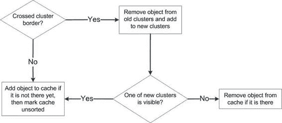

# 排版后的 Markdown 文档

我们来看以下场景：用户轻点屏幕添加一个对象。该对象最终会进入缓存，因为它被添加到了某个可见的簇中。然而，必须将其插入到缓存中的正确位置，而不是简单地追加到末尾。为了保持顺序，我们将缓存标记为`'unsorted'`。

清单 7-22 的代码展示了这一流程。`addObject()`函数需要进行更新，以将缓存纳入考量。

## 第 7 章：制作等距引擎

**清单 7-22.** *更新 `addObject()` 函数以将缓存纳入考量*

```
_p.addObject = function(obj) {
    this._objects.push(obj);
    var clusters = this._addToClusters(obj);
    if (clusters.intersects(this._visibleClusterBounds)) {
        this._cache.push(obj);
        this._cacheUnsorted = true;
    }
};
```

第二种场景：用户移除一个现有对象。其他缓存对象的顺序得以保留，缓存保持干净。清单 7-23 的代码展示了如何从图层中移除对象；我们需要同时更新缓存和簇。

**清单 7-23.** *从图层中移除对象*

```
_p.removeObject = function(obj) {
    if (!Arrays.contains(obj, this._objects)) {
        return;
    }
    this._removeFromClusters(obj);
    Arrays.remove(obj, this._cache);
};

_p._removeFromClusters = function(obj, clusterBounds) {
    clusterBounds = clusterBounds || this._idToClusterBounds[obj.getId()];
    var startY = clusterBounds.y;
    var endY = clusterBounds.y + clusterBounds.height;
    for (var clusterY = startY; clusterY < endY; clusterY++) {
        var startX = clusterBounds.x;
        var endX = clusterBounds.x + clusterBounds.width;
        for (var clusterX = startX; clusterX < endX; clusterX++) {
            Arrays.remove(obj, this._clusters[clusterY][clusterX]);
        }
    }
    delete this._idToClusterBounds[obj.getId()];
};
```

缓存的最终用途：用户滚动屏幕，视口与新的簇相交，缓存变为无效（或称`'dirty'`）。此时需要添加一些对象，并移除一些对象。缓存有效性的检查在每次调用`setPosition()`和`setSize()`时进行。清单 7-24 展示了更新后的`setSize()`和`setPosition()`函数；它们可能会改变用户看到的簇，因此必须在必要时触发缓存的重新验证。

## 第 7 章：制作等距引擎

**297**

**清单 7-24.** *改变视口位置或大小的函数应检查缓存是否仍然有效*

```
_p.setSize = function(width, height) {
    GameObject.prototype.setSize.call(this, width, height);
    this._updateVisibleClusters();
};

_p.setPosition = function(x, y) {
    GameObject.prototype.setPosition.call(this, x, y);
    this._updateVisibleClusters();
};
```

我们检查缓存有效性的方式，与在 `IsometricTileLayer` 中检查用户是否导航到脏区域的方式完全相同。如果新的可见簇与之前已知的可见簇不同，那么我们必须从头重建缓存。清单 7-25 展示了如何做到这一点。

**清单 7-25.** *检查用户是否看到了新的簇，如果是，则使缓存失效*

```
/**
 * 当视口移动时调用，检查我们是否仍在同一组
 * “活跃”的簇上
 */
_p._updateVisibleClusters = function() {
    var newRect = this._bounds.getOverlappingGridCells(
        this._clusterSize, this._clusterSize,
        this._clusters[0].length, this._clusters.length);
    if (!newRect.equals(this._visibleClusterBounds)) {
        this._visibleClusterBounds = newRect;
        this._cacheDirty = true;
    }
};
```

最后，我们需要更新渲染函数，仅绘制缓存中的对象。如果缓存是脏的或未排序的，我们执行相应操作，使缓存恢复到干净状态。现在，渲染函数在屏幕上绘制对象，如清单 7-26 所示。

**清单 7-26.** *更新后的 `draw()` 函数*

```
_p.draw = function(ctx) {
    if (this._cacheDirty) {
        this._resetCache();
    } else if (this._cacheUnsorted) {
        this._sortCache();
    }

    

    第 7 章：制作等距引擎

    for (var i = 0; i < this._cache.length; i++) {
        var obj = this._cache[i];
        if (obj.getBounds().intersects(this._bounds)) {
```


`obj.draw(ctx, this._bounds.x, this._bounds.y);`

这段代码对于静态对象完美运行。但如果对象移动了会怎样？

### 处理移动

一旦你从将对象从集群中移除并添加到其他集群的角度来思考，移动就很简单了。移动对象的流程如图 7-17 所示。

**图 7-17.** *对象移动：保持集群和缓存的一致状态*

如你所记，我们使用自定义事件来跟踪对象的移动。触发该事件的代码位于`GameObject`类中。首先要做的是为添加到图层的每个对象设置适当的监听器，如清单 7-27 所示。一旦对象从图层中移除，监听器也会被注销。

**清单 7-27.** *跟踪移动对象*

```
function ObjectLayer(objects, clusterSize, worldWidth, worldHeight) {
  /* 未更改的代码 */
  this._boundOnMove = this._onObjectMove.bind(this);
  this._addMoveListeners();
  this._resetClusters();
}
```

```
_p._addMoveListeners = function() {
  for (var i = 0; i < this._objects.length; i++) {
    this._objects[i].addListener("move", this._boundOnMove);
  }
};

_p.addObject = function(obj) {
  this._objects.push(obj);
  obj.addListener("move", this._boundOnMove);
  var clusters = this._addToClusters(obj);
  if (clusters.intersects(this._visibleClusterBounds)) {
    this._cache.push(obj);
    this._cacheUnsorted = true;
  }
};

_p.removeObject = function(obj) {
  if (!Arrays.contains(obj, this._objects)) {
    return;
  }
  obj.removeListener("move", this._boundOnMove);
  this._removeFromClusters(obj);
  Arrays.remove(obj, this._cache);
};
```

处理移动的函数是`_onObjectMove()`（`_boundOnMove()`是绑定到`ObjectLayer`实例的版本，但本质上是同一个函数）。它接受一个参数——移动事件。该函数的关键点是保持图层数据一致：集群（包括`_clusters`和`_idToClusterBounds`）以及缓存。第一步是确定对象是否已移动到新的集群。如果是，我们必须将对象从旧集群中移除并添加到新集群中。接下来，如果对象位于某个活动集群中并且发生了垂直移动，我们需要将缓存标记为未排序。清单 7-28 展示了如何实现此流程。

**清单 7-28.** *处理对象移动*

```
_p._onObjectMove = function(e) {
  var obj = e.object;
  var id = obj.getId();
  var objectBounds = obj.getBounds();
  var newClusters = objectBounds.getOverlappingGridCells(
    this._clusterSize, this._clusterSize,
    this._clusters[0].length, this._clusters.length);
  var oldClusters = this._idToClusterBounds[id];
  if (!oldClusters.equals(newClusters)) {
    this._moveObjectBetweenClusters(obj, oldClusters, newClusters);
  }
  if (newClusters.intersects(this._visibleClusterBounds) && e.y != e.oldY) {
    this._cacheUnsorted = true;
  }
};

_p._moveObjectBetweenClusters = function(obj, oldClusters, newClusters) {
  this._removeFromClusters(obj, oldClusters);
  this._addToClusters(obj, newClusters);
  this._idToClusterBounds[obj.getId()] = newClusters;
  // 如果对象已离开屏幕，则从缓存中移除
  if (newClusters.intersects(this._visibleClusterBounds)) {
    Arrays.addIfAbsent(obj, this._cache);
  } else {
    Arrays.remove(obj, this._cache);
  }
};
```

现在，`ObjectLayer`可以用于移动对象了！

### 复合对象

由于我们的渲染方式，复合对象不能表示为游戏世界中的一个精灵。以拱门为例。它应该允许角色从下方通过。但这里我们遇到了一个排序问题：我们先绘制什么？拱门还是角色？经过一些实验，你会发现两者都不对。图 7-18 说明了这个问题。

**图 7-18.** *像拱门这样的对象的问题：无论渲染顺序如何，结果在某些时候都会出错。*

问题在于我们假设只有两种排序类型。


