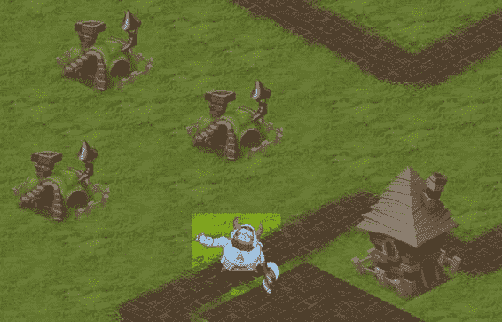
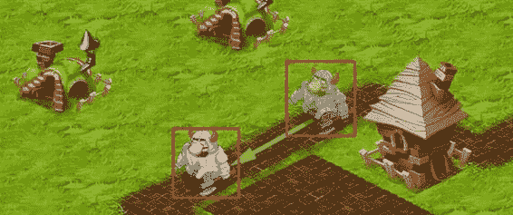
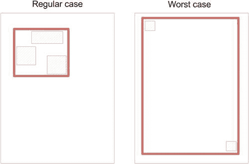

# 处理后的 Markdown 文档

`object` 位于另一个 `object` 之后，反之亦然。对于像这样的拱门，我们有一个对象的第三种状态——一个位于另一个对象之间的对象。我们的引擎无法处理这种情况，如果没有一点帮助，编写处理这种技巧的代码会相当困难。然而，我敢打赌你见过许多包含拱门和传送门的游戏。那么它们是如何解决这个问题的呢？

如果你查看过`resources`文件夹，那么你就已经知道答案了。拱门由两个不同的`Sprite`表示，并按通常方式排序。然后，它的渲染方式如图 7-19 所示。

**图 7-19.** *将拱门表示为两个对象*

你以这种方式解决问题，因为引擎现在会分别检查球相对于拱门左支柱和右支柱的位置，而不是将拱门作为一个整体来检查。随着球的移动，渲染顺序会发生变化，从而始终显示正确的画面。

清单 7-29 展示了这种解决方案在代码中的实现方式。将以下三个对象添加到你的`ObjectLayer`中，如清单 7-29 所示。

**清单 7-29.** *在游戏中添加拱门和移动的球*

```
this._archBall = new StaticImage(im.get("ball"), 300, 600);
this._objectLayer.addObject(this._archBall);
img = im.get("arch-left");
this._objectLayer.addObject(new StaticImage(img, 120, 470));
img = im.get("arch-right");
this._objectLayer.addObject(new StaticImage(img, 234, 462));
```

通过一个简单的运动规则让球穿过拱门（参见清单 7-30）。

第 7 章：制作等距引擎

**清单 7-30.** *移动球穿过拱门*

```
_p._updateWorld = function() {
    // 更新
    this._ball1.move(0, 2);
    this._ball2.move(2, 0);
    // 对角线移动穿过拱门
    this._archBall.move(2*this._archBallDirection, this._archBallDirection);
    if (this._archBall.getBounds().x > 300 || this._archBall.getBounds().x <
        100)
        this._archBallDirection *= -1;
};
```

`_archBallDirection`是一个变量，在`Game`类的构造函数中初始化为`1`（添加相应的代码行）。它会根据球的移动方向而改变。启动应用程序并观察移动。球应该能正确地穿过拱门。

### 对象层：后续步骤

像往常一样，还有很大的进一步优化空间，这里提供一些思路。

- 使用数组来保持对象集合排序是最简单但也是最昂贵的方法；排序数组以及在其中搜索项的效率都相当低。如果你有很多对象，最好考虑使用专门的数据结构，比如二叉树，它可以保持对象排序并使得搜索操作非常高效。另一方面，如果你只有少量对象，那么这样做就不值得了。有一篇很棒的文章解释了二叉树的工作原理：《JavaScript 中的计算机科学：二叉搜索树》(http://bit.ly/F4Dmc)。
- `ObjectLayer`可以使用与`IsometricTileLayer`相同的离屏 canvas 缓存技巧。如果同一时间屏幕上有许多对象（例如一个拥有许多建筑的城市），那么缓存这个图层以节省一些 CPU 循环是很有意义的。
- 还有更好的（尽管编码复杂）数据结构来跟踪空间对象。`R-Tree`是一个很好的例子。考虑使用它；它可能会真正提高你游戏的性能。



第 7 章：制作等距引擎

**303**

项目此时的状态被保存在一个名为`v0.2`的文件夹中。请随意将其用作参考，或直接从中获取代码并继续。

### 脏矩形

`脏矩形` 是我们将在引擎中实现的下一个主要渲染优化技术。该技术背后的思想是“只渲染屏幕中发生变化的区域”。

假设我们有一个不会自行移动的世界，并且用户此刻也没有移动视口。可能有一两个移动的对象，但屏幕的大部分区域保持静态。换句话说，屏幕在两次重绘之间变化很小；大部分内容与上一帧相同，只有少数区域发生变化。


像动画精灵或移动的球这样的小元素。图 7-20 展示了这一概念。屏幕的灰色部分在帧与帧之间没有变化；重新绘制它是在浪费 CPU 周期。唯一真正需要重新绘制的部分是挥舞着的骑士角色。

**图 7-20.** *帧与帧之间变化的区域远小于整个屏幕；但我们仍然每次都重新绘制整个屏幕。*



第 7 章：制作等距引擎

让我们再次思考如何优化重绘过程，使其只绘制屏幕上真正发生变化的部分。

目前，`IsometricTileLayer`每帧都会重新绘制其缓冲区，即使没有任何变化，这正是我们浪费性能的地方。我们必须标记屏幕上发生变化的区域，并只绘制这些区域。这正是被称为脏矩形（dirty rectangles）的技术背后的思想。

工作原理

本节对脏矩形算法进行非正式描述。一旦我们理解了它的工作原理，我们将在下一节中实现它，并使我们的引擎更加强大。

假设我们正处于游戏进行中。我们在屏幕上渲染了上一帧，现在是时候用新一帧替换它了。此时，屏幕被认为是“干净的”。

开始更新游戏逻辑。如果对象移动了，或者动画序列切换到了下一帧，这意味着必须更新屏幕的相应部分，才能正确显示这些变化。

图 7-21 展示了一个典型的游戏场景：一帧中包含一个移动的角色和一个静态的背景。游戏引擎无需重新渲染整个场景来反映变化。它只需要重新绘制两个矩形：一个对应角色的旧位置，另一个对应其新位置。用户感觉不到这种技术与重新绘制整个帧的区别；而你将节省一些宝贵的周期。

**图 7-21.** *脏矩形背后的思想*



第 7 章：制作等距引擎

**305**

该算法背后的思想是：将屏幕的某些区域标记为“脏”区域，并只重新绘制它们。画面的其余部分保持不变，因为画布（canvas）不会在帧之间清理内容。如果我们自己不清理旧内容，它将保持原样，我们可以在其上绘制。

为了简单起见，我们标记为脏的区域始终是矩形。构建更精细的选区没有意义，因为矩形是处理待重绘区域计算的最快方式。那么，我们如何判断一个区域是否应该被标记为脏呢？规则集非常简单：

- 如果精灵（sprite）更改了动画帧，则将完全覆盖新旧帧的矩形标记为脏。
- 如果对象移动了，则将同时包含旧位置和新位置的矩形标记为脏。
- 如果某个实体被添加到场景中或从场景中移除，则将该实体的边界标记为脏。
- 如果用户移动了屏幕或改变了画布的大小，则将整个视口（viewport）标记为脏。

在世界更新阶段应用这些规则后，你会得到一组标记游戏地图上已更改区域的脏矩形。现在你必须决定如何使用它们来重新绘制世界。

最简单（通常也是最有效）的方法是找到覆盖所有脏区域的最小尺寸矩形，并将其视为重绘区域。图 7-22 展示了这种技术。左图是一个正常情况：多个脏矩形被一个更大的矩形包围。右图展示了最坏情况：两个移动的对象会导致整个屏幕被重新绘制。

**图 7-22.** *在常规情况下我们有一个小的脏矩形，但最坏的情况会导致整个区域被重新绘制。*

第 7 章：制作等距引擎

这种方法看起来可能效率不高，但在大多数情况下，它足以获得性能提升。现在你已经了解了脏矩形的原理，是时候开始实现了。


