# 第七章：构建等距引擎

`DirtyRectangleManager` 的实现可能会输出一个脏矩形数组，这将需要多次调用 `draw()`。图层的任务非常简单：将内容渲染到给定的矩形上。那么，如果我们只需要一个矩形，为什么还要传递 `DirtyRectangleManager` 呢？因为像 `ObjectLayer` 这样的图层需要一种方法来将区域标记为脏。

这两个图层都应遵循新规则，仅渲染脏矩形内的内容部分。代码相当简单：不再检查视口（viewport），而是检查脏矩形的边界。因此，`ObjectLayer` 的 `draw()` 方法已更新，如清单 7-35 所示。

**清单 7-35.** *更新 `ObjectLayer` 以仅重新渲染屏幕的脏部分*

```
_p.draw = function(ctx, dirtyRect) {
  if (this._cacheDirty) {
    this._resetCache();
  } else if (this._cacheUnsorted) {
    this._sortCache();
  }
  // 如果没有脏矩形，则重新绘制所有内容，并使用 _bounds
  // 代替脏矩形
  dirtyRect = dirtyRect || new Rect(0, 0, this._bounds.width,
                                    this._bounds.height);
  for (var i = 0; i < this._cache.length; i++) {
    var obj = this._cache[i];
    // 仅绘制与脏矩形相交的对象
    if (this._getScreenBounds(obj).intersects(dirtyRect)) {
      obj.draw(ctx, dirtyRect, this._bounds.x, this._bounds.y);
    }
  }
};

/*
 * 返回给定对象的屏幕边界
 */
_p._getScreenBounds = function(obj) {
  var worldBounds = obj.getBounds();
  return new Rect(worldBounds.x - this._bounds.x, worldBounds.y -
                  this._bounds.y,
                  worldBounds.width, worldBounds.height);
};
```

`DirtyRectangleManager` 在屏幕坐标中操作，因此我们首先将对象坐标转换为屏幕空间，然后检查对象是否与脏区域相交。

下一步是更新 `IsometricTileLayer`。它使用屏幕外图像（offscreen image）来重绘帧。让我们修改它，使得仅重绘脏部分（由于添加了大部分代码，这次我不会将新行标记为粗体）。清单 7-36 显示了 `draw()` 函数的更新代码。

**清单 7-36.** *更新 `IsometricTileLayer` 以使其支持脏矩形*

```
_p.draw = function(ctx, dirtyRect) {
  if (this._offDirty) {
    this._redrawOffscreen();
  }
  var offscreenImageWorldX = this._offRect.x * this._cellWidth;
  var offscreenImageWorldY = this._offRect.y * this._cellHeight / 2;
  // 如果有脏矩形，
  // 计算屏幕外图像与脏矩形的交集。然后仅绘制
  // 屏幕外缓冲区中
  // 被 dirtyRect 覆盖的部分
  if (dirtyRect) {
    var sx = this._bounds.x - offscreenImageWorldX + dirtyRect.x;
    var sy = this._bounds.y - offscreenImageWorldY + dirtyRect.y;
    var sw = dirtyRect.width;
    var sh = dirtyRect.height;
    var dx = dirtyRect.x;
    var dy = dirtyRect.y;
    var dw = dirtyRect.width;
    var dh = dirtyRect.height;
    ctx.drawImage(this._offCanvas, sx, sy, sw, sh, dx, dy, dw, dh);
  } else {
    // 如果没有 dirtyRect，则像之前一样重绘整个视口。
    ctx.drawImage(this._offCanvas, offscreenImageWorldX - this._bounds.x,
                  offscreenImageWorldY - this._bounds.y);
  }
};
```

请注意，我们试图使两个图层的实现独立于脏矩形管理器。如果你不向 `draw()` 传递第二个参数，它们两者仍将正常运行。

#### 标记脏矩形

最后一部分是在代码中定位使场景变脏的位置，并标记这些矩形。显然，第一部分是整个视口的移动——我们已经在 `Game` 类中处理了该任务。第二部分是 `IsometricTileLayer`；`setTileAt()` 函数更改了地图中的某个瓦片，并且该瓦片周围的区域必须被标记为脏。更新 `setTileAt()` 函数，以便每当有人更改瓦片时，它就将屏幕的一部分标记为脏。清单 7-37 展示了如何实现。

**清单 7-37.** *`setTileAt` 更改了屏幕的内容，因此它应将相应的矩形标记为脏*

```
_p.setTileAt = function(x, y, tileId) {
```


##### 代码上下文与脏矩形标记

```
this._mapData[y][x] = tileId;

if (this._offRect.containsPoint(x, y)) {

    var dirtyX = x*this._cellWidth +
        (y%2 ? this._cellWidth/2 : 0) - this._marginLeft - this._bounds.x;

    var dirtyY = y*this._cellHeight/2 - this._marginTop - this._bounds.y;

    var dirtyWidth = this._tileWidth;

    var dirtyHeight = this._tileHeight;

    this.markDirty(dirtyX, dirtyY, dirtyWidth, dirtyHeight);

    this._offDirty = true;

}
```

最后一个位置是`ObjectLayer`中移动的对象。一旦对象移动，两个区域会变脏：对象之前的边界和新的边界。需要在`ObjectLayer`方法中添加一些代码；清单 7-38 总结了这些更改。在`ObjectLayer`中有三个地方可以更新帧：`_onObjectMove()`（当对象改变位置时调用的函数），以及`addObject()`和`removeObject()`（添加或移除世界实体的函数）。在这些情况下，屏幕的相关部分可能会变脏。

**清单 7-38.** *在 ObjectLayer 中标记脏矩形*

```
_p._onObjectMove = function(e) {

    var obj = e.object;

    var id = obj.getId();

    var objectBounds = obj.getBounds();

    var newClusters = objectBounds.getOverlappingGridCells(
        this._clusterSize, this._clusterSize,
        this._clusters[0].length, this._clusters.length);

    var oldClusters = this._idToClusterBounds[id];

    if (!oldClusters.equals(newClusters)) {
        this._moveObjectBetweenClusters(obj, oldClusters, newClusters);
    }

    if (e.y != e.oldY) {
        this._cacheUnsorted = true;
    }

    // 对象已移动，标记两个矩形为脏：对象的旧位置和新位置
    var worldBounds = obj.getBounds();
    this.markDirty(worldBounds.x - this._bounds.x, worldBounds.y -
        this._bounds.y,
        worldBounds.width, worldBounds.height);

    this.markDirty(
        new Rect(e.oldX - this._bounds.x, e.oldY - this._bounds.y,
            worldBounds.width, worldBounds.height));
};

/*
 * 当添加或移除对象时，将其边界标记为脏以重新绘制该区域。
*/

_p.addObject = function(obj) {
    this._objects.push(obj);
    obj.addListener("move", this._boundOnMove);
    var clusters = this._addToClusters(obj);
    if (clusters.intersects(this._visibleClusterBounds)) {
        this._cache.push(obj);
        this._cacheUnsorted = true;
        this.markDirty(this._getScreenBounds(obj));
    }
};

_p.removeObject = function(obj) {
    if (!Arrays.contains(obj, this._objects)) {
        return;
    }
    obj.removeListener("move", this._boundOnMove);
    this._removeFromClusters(obj);
    Arrays.remove(obj, this._cache);
    this._dirtyRectManager.markDirty(this._getScreenBounds(obj));
};
```

现在我们已经准备就绪。每一层负责报告脏矩形，而`DirtyRectangleManager`负责管理它们并将它们合并为一个大的矩形，该矩形会报告回`Game`。接着，`Game`将这个“重绘提示”向下传递给各层。

脏矩形是一项非常有用的优化。事实上，在许多游戏中，大部分帧是静止的，或者移动是局部且较小的。在这些情况下，脏矩形可以节省大量重绘操作，这在移动设备上尤其重要。

### UI 与图层管理器

我们项目的下一阶段是添加用户界面元素。我们只有一个元素——圆形按钮，显示游戏的当前状态：移动、改变地形或建造新小屋。由于 UI 应该位于其他图层之上，显然我们需要在游戏中再添加一个图层。这意味着我们必须重复调用`move()`、`resize()`和`draw()`。显然，继续这样做不是一个好主意。我们需要一种方案来同时处理一组有序的图层。让我们将这个新类称为`LayerManager`。

**图层管理器**

`LayerManager`是一个以一致方式处理一组图层的类。`LayerManager`将每次调用委托给底层图层，同时保持正确的顺序。`LayerManager`也负责管理`DirtyRectangleManager`。一旦图层被添加，它就会收到同一个`DirtyRectangleManager`实例。


```javascript
LayerManager 具有。清单 7-39 中的代码展示了一个简单但非常实用的
该类实现。

**清单 7-39.** *LayerManager*

function LayerManager() {
  GameObject.call(this);
  // 要管理的图层集合
  this._layers = [];
}

extend(LayerManager, GameObject);

var _p = LayerManager.prototype;

/**
 * 将 setSize 调用传播到每个图层
 */
_p.setSize = function(width, height) {
  GameObject.prototype.setSize.call(this, width, height);
  for (var i = 0; i < this._layers.length; i++) {
    this._layers[i].setSize(width, height);
  }
};

/**
 * 将 setPosition 调用传播到每个图层
 */
_p.setPosition = function(x, y) {
  GameObject.prototype.setPosition.call(this, x, y);
  for (var i = 0; i < this._layers.length; i++) {
    this._layers[i].setPosition(x, y);
  }
};

/**
 * 将 setDirtyRectManager 调用传播到每个图层
 */
_p.setDirtyRectManager = function(dirtyRectManager) {
  GameObject.prototype.setDirtyRectManager.call(this, dirtyRectManager);
  for (var i = 0; i < this._layers.length; i++) {
    this._layers[i].setDirtyRectManager(dirtyRectManager);
  }
};

/**
 * 按顺序绘制图层，并传递 dirtyRect
 */
_p.draw = function(ctx, dirtyRect) {
  for (var i = 0; i < this._layers.length; i++) {
    this._layers[i].draw(ctx, dirtyRect);
  }
};

/**
 * 将新图层添加到集合中
 */
_p.addLayer = function(layer) {
  if (this._dirtyRectManager) {
    layer.setDirtyRectManager(this._dirtyRectManager);
  }
  this._layers.push(layer);
};

/**
 * 从集合中返回第 i 个图层
 */
_p.getLayerAt = function(i) {
  return this._layers[i];
};
```

`LayerManager` 背后的理念是隐藏图层集合，使其表现为单一图层。对 `LayerManager` 执行的每个操作都会传播到集合中的各个图层。

一旦 `LayerManager` 就位，`Game` 的代码就会变得更容易阅读和维护。更重要的是，我们消除了重复代码！现在，当你添加新图层时，无需在代码中维护需要修改的位置列表。请查看清单 7-40 中更新后的 `Game` 类，以了解其差异。

**清单 7-40.** *使用 LayerManager 可消除代码重复并将多个图层视为一个整体*

```javascript
_p._initLayers = function() {
  var im = this._imageManager;

  // 平铺图层
  this._tiledLayer = new IsometricTileLayer(this._map, im.get("terrain"), 128, 68, 124, 62, 0, 3);

  // 对象图层
  this._ball1 = new StaticImage(im.get("ball"), 370, 30);
  this._ball2 = new StaticImage(im.get("ball"), 370, 30);
  this._objectLayer = new ObjectLayer([this._ball1, this._ball2], 200, 10000, 10000);

  var img = im.get("house-1");
  this._objectLayer.addObject(new StaticImage(img, 350, 130));
  this._objectLayer.addObject(new StaticImage(img, 200, 50));
  this._objectLayer.addObject(new StaticImage(img, 150, 200));

  img = im.get("house-2");
  this._objectLayer.addObject(new StaticImage(img, 550, 230));
  this._objectLayer.addObject(new StaticImage(img, 920, 250));

  // 图层管理器
  this._layerManager.addLayer(this._tiledLayer);
  this._layerManager.addLayer(this._objectLayer);
};

_p.move = function(deltaX, deltaY) {
  // 此处每个图层都需要重复调用
  this._dirtyRectangleManager.markAllDirty();
  this._layerManager.move(-deltaX, -deltaY);
};

_p.resize = function() {
  // 此处每个图层都需要重复调用
  this._dirtyRectangleManager.setViewport(this._canvas.width, this._canvas.height);
  this._layerManager.setSize(this._canvas.width, this._canvas.height);
};
```

对于喜欢设计模式的读者来说，`LayerManager` 是组合模式的一个示例——该模式允许将对象集合视为单一对象进行处理。实际上，`LayerManager` 本身就可以被视为一个图层——将 `LayerManager` 的实例添加到另一个 `LayerManager` 中是完全可行的。

UI

我们拥有的唯一 UI 元素是显示当前
```


游戏模式：移动、建造或地形。图 7-23 展示了本节结束时 UI 的外观。左上角的圆圈同时充当**“模式指示器”**和按钮。目前，它显示用户处于**建造模式**，点击屏幕会添加或移除新的建筑。如果用户点击该按钮，模式会切换到“地形”，再点击一次，则切换到“移动”。

**图 7-23.** *游戏的简单 UI：左上角的圆形按钮* 目前，这个按钮没什么用，因为我们还没有实现交互功能，但让我们尝试将它放置到屏幕上，为项目下一阶段做好准备。`RoundStateButton`类在屏幕上渲染按钮并返回按钮的当前状态。清单 7-41 展示了这个类的简单实现。

**清单 7-41.** *`RoundStateButton`的实现*

```
/*
 * RoundStateButton 构造函数接受包含三个帧的图像：
 * 每帧对应一个状态。frameWidth 和 frameHeight 是单帧的尺寸。
 */
function RoundStateButton(image, frameWidth, frameHeight) {
    GameObject.call(this);
    this._bounds = new Rect(0, 0, frameWidth, frameHeight || image.height);
    this._image = image;
    this._frame = 2;
}
extend(RoundStateButton, GameObject);

// 用于引用状态的常量
RoundStateButton.TERRAIN = "terrain";
RoundStateButton.OBJECTS = "objects";
RoundStateButton.MOVE = "move";

var _p = RoundStateButton.prototype;

/**
 * 在画布上渲染当前帧。
 */
_p.draw = function(ctx, dirtyRect, viewportX, viewportY) {
    ctx.drawImage(
        this._image,
        this._bounds.width * this._frame,
        0,
        this._bounds.width,
        this._bounds.height,
        this._bounds.x - viewportX || 0,
        this._bounds.y - viewportY || 0,
        this._bounds.width,
        this._bounds.height);
};

/**
 * 将当前按钮状态设置为给定值。
 */
_p.setFrame = function(frame) {
    this._frame = frame;
};

/**
 * 切换到下一个状态。当用户点击按钮时执行此函数。
 * 发出事件通知外部世界状态的变化。
 */
_p.nextFrame = function() {
    this._frame = (this._frame + 1) % 3;
    this.emit("change", {object: this});
};

/**
 * 获取当前状态的字符串表示。
 */
_p.getState = function() {
    return [RoundStateButton.TERRAIN, RoundStateButton.OBJECTS,
            RoundStateButton.MOVE][this._frame];
};
```

现在我们已经有了`RoundStateButton`，需要决定如何将其放置到屏幕上。按钮与我们之前处理的其他实体之间的区别在于，按钮不绑定到世界坐标，而是绑定到屏幕坐标。当用户滚动地图时，按钮保持原位不动。一种选择是将其视为特殊实体，并与其他对象分开管理。更好的选择是将其添加到某个图层中，让`LayerManager`来处理其余工作。现有的图层都无法正确处理此任务，因为`ObjectLayer`和`IsometricTileLayer`都是为在世界坐标下工作而设计的；我们需要的按钮图层在移动地图时不应移动。让我们创建一个新的图层类，并命名为`UiLayer`。清单 7-42 展示了这个简单的类。

**清单 7-42.** *`UiLayer`类*

```
/**
 * UiLayer – 在屏幕坐标下工作且不随地图滚动而移动的图层。
 * 此图层“绑定”到屏幕，因此可以安全地忽略对 move()和 setPosition()的调用。
 */
function UiLayer(objects) {
    GameObject.call(this);
    // 要渲染的对象数组
    this._objects = objects;
    // 为此图层的每个对象绑定“change”事件的监听器，以标记脏区域
    this._addChangeListeners();
}

extend(UiLayer, GameObject);
_p = UiLayer.prototype;

_p.setPosition = function(x, y) {
    // 忽略
};

_p.move = function(deltaX, deltaY) {
    // 忽略
};

/**
 * 根据 dirtyRect 在屏幕上绘制每个对象。
 */
_p.draw = function(ctx, dirtyRect) {
```


```javascript
// 如果没有提供 dirtyRect，则绘制所有可见对象
dirtyRect = dirtyRect || this._bounds;
for (var i = 0; i < this._objects.length; i++) {
  var obj = this._objects[i];
  var bounds = obj.getBounds();
  // 仅绘制与脏矩形相交的对象
  if (bounds.intersects(dirtyRect)) {
    obj.draw(ctx, dirtyRect, this._bounds.x, this._bounds.y);
  }
}
```

```javascript
/**
 * 在屏幕上添加新的 UI 元素
 */
_p.addObject = function(obj) {
  this._objects.push(obj);
};
```

```javascript
/**
 * 从屏幕上移除现有对象
 */
_p.removeObject = function(obj) {
  if (Arrays.contains(obj, this._objects)) {
    Arrays.remove(obj, this._objects);
  }
};
```

```javascript
/**
 * 如果某个对象报告自身已发生变化，则将对应区域标记为脏。
 * 该图层的对象以屏幕坐标存储，因此此函数无需进行世界坐标转换。
 */
_p._onObjectChange = function(e) {
  var obj = e.object;
  this.markDirty(obj.getBounds());
};
```

```javascript
/**
 * 追踪每个对象上的变化事件
 */
_p._addChangeListeners = function() {
  var boundOnChange = this._onObjectChange.bind(this);
  for (var i = 0; i < this._objects.length; i++) {
    this._objects[i].addListener("change", boundOnChange);
  }
};
```

请注意图层如何通过自定义事件机制与按钮“连接”，就像 `GameObject` 向感兴趣的图层报告移动一样。当外部 API 在按钮上调用 `nextFrame()` 时，它会触发事件并通知所有已注册的监听器。图层监听到该事件后，会将按钮的包围矩形标记为脏。另一种方案是让按钮自行标记脏区域，但我倾向于尽可能保持游戏对象的简洁。当然，你可以自由实现自己的架构。我将省略向 `Game` 添加另一个图层的代码；经过多次练习后，你应该已经对大部分代码驾轻就熟。如果需要提示，可以查看 `v1.0` 文件夹中的项目最终版本。

### 交互

欢迎来到本章的最后一节，也是项目的最后阶段。我们已经拥有了地形、对象和 UI。为了让一切“活起来”，我们需要考虑用户与游戏之间的交互。让我提醒一下本节的目标：

- 游戏可处于三种状态之一：移动、地形和对象。在每种状态下，拖拽事件都会移动地图。
- 如果游戏处于移动状态，弹起事件不执行任何操作。
- 如果游戏处于地形状态，弹起事件会更换底层瓦片。
- 如果游戏处于对象状态，且玩家点击了现有对象，则移除该对象；否则，在游戏世界中添加一个新球体。

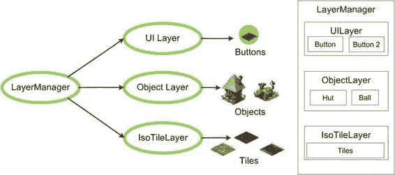

为了设计灵活且可重用的 API，我们需要记住一些微妙的要点：

- 我们不应在图层代码中硬编码对任何事件的特定响应。例如，其他游戏可能复用等距地形，但使用自己的单击处理规则。
- 出于同样的原因，图层之间不应相互感知。例如，`ObjectLayer` 不应假设其上方或下方存在任何图层。图层不应假设它们由 `LayerManager` 管理。

现在，在你继续阅读之前，我挑战你拿出纸笔，尝试自行设计交互流程。这是一个极好的练习，能让你深刻理解基于事件的架构应如何运作。现在去画几个图表吧。完成后，请继续阅读——是时候让我们的游戏焕发生机了。

#### 事件传播与处理

看看我们构建的游戏模型，如图 7-24 所示。我们拥有实体层级结构。顶层是 `LayerManager`，其内部由一个或多个图层组成。每个图层又由对象或瓦片组成。这些实体中的每一个都可能对事件感兴趣。

**图 7-24.** *游戏的组件与图层*


## 第 7 章：构建等距引擎

该模型与传统的 HTML 文档模型——层级结构或 DOM 树——非常相似。自然可以采用类似的事件模型，因为它设计周全，且程序员对此已相当熟悉。

第一步是构建事件传播模型。在本示例中，我们仅处理`up`事件，其他事件可依此类推。

在游戏代码中找到`_onUp()`函数并修改，使其将所有传入事件发送给`LayerManager`（参见列表 7-43）。

**列表 7-43.** *将事件传递给 LayerManager*

```
_p._onUp = function(e) {
    this._layerManager.emit("up", e);
};
```

该函数在本章前文已绑定到`up`事件，但现在它有了实际用途——将同一事件发送给`_layerManager`。接下来，在`LayerManager`中，依次将同一事件发送给每个图层（参见列表 7-44）。

**列表 7-44.** *LayerManager 将事件发送给其控制的所有图层*

```
function LayerManager() {
    GameObject.call(this);
    this._layers = [];
    this.addListener("up", this._onUpEvent.bind(this));
}

_p._onUpEvent = function(e) {
    for (var i = this._layers.length - 1; i >= 0; i--) {
        this._layers[i].emit("up", e);
    }
};
```

现在每个图层都会收到事件。图层进而将事件传递给元素，或将其转换为游戏特定事件。例如，`ObjectLayer`可以发送`objectClicked`事件，这对外部 API 可能更友好。代码如列表 7-45 所示。

**列表 7-45.** *ObjectLayer 将 `up` 事件转换为自定义 `objectClicked` 事件*

```
_p._onUpEvent = function(e) {
    // 忽略拖拽结束
    if (e.moved)
        return;

    var x = e.x + this._bounds.x;
    var y = e.y + this._bounds.y;
    var obj = this.getObjectAt(x, y);

    if (obj) {
        obj.emit("up", e);
        this.emit("objectClicked", {object: obj, layer: this, cause: e});
    }
};
```

`UiLayer`的工作方式完全相同，如列表 7-46 所示。

**列表 7-46.** *UiLayer 将 Up 事件转换为 `objectClicked` 事件*

```
_p._onUpEvent = function(e) {
    if (e.moved)
        return;

    var obj = this.getObjectAt(e.x, e.y);

    if (obj) {
        obj.emit("up", e);
        this.emit("objectClicked", {object: obj, layer: this, cause: e});
    }
};

/**
 * 返回给定坐标 (x, y) 处的对象，
 * 如果没有对象则返回 null
 */
_p.getObjectAt = function(x, y) {
    for (var i = 0; i < this._objects.length; i++) {
        if (this._objects[i].getBounds().containsPoint(x, y)) {
            return this._objects[i];
        }
    }
    return null;
};
```

`IsometricTileLayer`略有不同，因为单个瓦片并非以对象形式表示。该图层仅发送一个自定义`tileClicked`事件。列表 7-47 展示了如何更新`IsometricTileLayer`的代码以响应事件。现在，每当用户点击瓦片时，该图层就会发送`tileClicked`事件。

**列表 7-47.** *更新 IsometricTileLayer*

```
_p._onUpEvent = function(e) {
    if (e.moved)
        return;

    var coords = this._getTileCoordinates(e.x, e.y);

    if (coords.x >= 0 && coords.x < this._mapData[0].length &&
        coords.y >= 0 && coords.y < this._mapData.length) {

        this.emit("tileClicked", {x: coords.x, y: coords.y, layer: this, cause: e});
    }
};
```

现在，当用户点击画布时，事件会像 DOM 事件一样在图层间传播。接下来是最有趣的部分。让我们为`Game`类添加事件监听器来实现我们的逻辑。在`_initLayers()`中添加以下两行代码：

```
this._tiledLayer.addListener("tileClicked", this._onTileClicked.bind(this));
this._objectLayer.addListener("objectClicked", this._onObjectClicked.bind(this));
```

添加这些代码行后，`Game`类会监听图层发送的新事件：`tileClicked`和`objectClicked`。这正是我们的游戏逻辑所需要的！点击瓦片意味着如果按钮状态为`TERRAIN`，则需更改该瓦片。点击对象意味着如果状态为`OBJECTS`，则应移除该对象。最后，如果状态为`OBJECTS`时点击地形，则表示用户


`点击空白处，因此需要添加一个新对象。` 在代码中实现这一功能很简单。`清单 7-48` 展示了具体做法。

**清单 7-48.** *实现核心逻辑*

```
_p._onTileClicked = function(e) {
    if (this._ui.getState() == RoundStateButton.TERRAIN) {
        var newTileId = (this._tiledLayer.getTileAt(e.x, e.y) + 1)%9;
        this._tiledLayer.setTileAt(e.x, e.y, newTileId);
    } else if (this._ui.getState() == RoundStateButton.OBJECTS) {
        this._addDummyObjectAt(e.cause.x, e.cause.y);
    }
};
```

下载自 Wow! eBook <www.wowebook.com>

```
_p._onObjectClicked = function(e) {
    if (this._ui.getState() == RoundStateButton.OBJECTS) {
        this._objectLayer.removeObject(e.object);
    }
};
```

```
_p._addDummyObjectAt = function(x, y) {
    var layerPosition = this._objectLayer.getBounds();
    var obj = new StaticImage(this._imageManager.get("ball"),
        x + layerPosition.x, y + layerPosition.y);
    var bounds = obj.getBounds();
    obj.move(-bounds.width/2, -bounds.height/2);
    this._objectLayer.addObject(obj);
};
```

第 7 章：制作等距引擎

**329**

添加事件处理的最后一步是响应圆形按钮的点击并更新其状态。直接将处理程序添加到 `RoundStateButton` 类中即可。我几乎想不到任何场景，在这种按钮点击会表示除“更改状态”以外的含义（别忘了在构造函数中注册此监听器）：

```
_p._onUpEvent = function(e) {
    this.nextFrame();
};
```

添加这段代码并尝试运行应用程序。你很快就会发现，这段代码执行了过多的操作。点击按钮不仅会改变按钮状态，还会进入下一层并修改地形或改变对象。对象删除也看起来有问题：一旦对象被删除，事件会传递到 `IsometricTileLayer`，在那里对象又会被重新创建！

**停止事件传播**

在某些情况下，我们不希望事件继续在层之间传递。上一节中有几个这样的例子。一旦按钮被点击，你不希望任何底层接收相同的事件。事件应该在 `UiLayer` 处结束。出于同样的原因，DOM API 提供了事件操作方法：`stopPropagation()` 和 `preventDefault()`。我们需要自己实现一个类似的机制。问题在于如何保存事件的状态，并跟踪它是被停止了，还是应该继续在层之间传递。

有两种选择。第一种是将事件制作为构造对象，为它们创建一个单独的类层次结构，并添加两个方法，类似于 DOM API 的方法：`stopPropagation()` 和 `isPropagationStopped()`。另一种方法是选择简单的路径，约定在事件上设置某个标志，以标记它不应再继续传递。对于这样的项目，采用更简单的方法是有意义的；我们希望事件保持小巧、简单和轻量。

让我们将这个标志称为“stopped”。因此，每当你编写

```
e.stopped = true;
```

你就在说：“这个事件我已处理完毕。不要让游戏中的任何其他组件对此作出反应。”

代码中有两个地方应该停止事件。第一个是 `Game` 类中的 `objectClicked` 事件处理程序。如果你点击一个对象来移除它，你必须停止事件的进一步传播。否则，事件会命中 `IsometricTileLayer`，并且 `Game` 会再次创建一个新的虚拟球体！这就是我们刚刚看到的行为。修改 `Game` 类中的监听器代码，如 `清单 7-49` 所示。

**清单 7-49.** *Game 类应在处理事件后将其停止*

```
_p._onObjectClicked = function(e) {
    if (this._ui.getState() == "objects") {
        this._objectLayer.removeObject(e.object);
        e.cause.stopped = true;
    }
};
```

请注意，游戏接收到的是 `onObjectClicked` 事件，而不是需要停止的 up 事件。为了访问原始事件，我们使用了 `e.cause` 属性——这正是我们为此目的使用的一个小技巧。

第二个显而易见的位置是按钮的事件处理程序。如果用户点击了


按钮，他只想改变状态，其他什么都不做。这类事件不应该被传播。请修改`RoundStateButton`的代码，如清单 7-50 所示。

**清单 7-50.** *在用户点击按钮时阻止事件传播*

```
_p._onUpEvent = function(e) {
  this.nextFrame();
  e.stopped = true;
};
```

该方案的最后一个部分，是更新 `LayerManager`——这个类决定了事件是否应该传播到下一层。代码的修改非常简单，如清单 7-51 所示。

**清单 7-51.** *在 LayerManager 中阻止事件传播*

```
_p._onUpEvent = function(e) {
  for (var i = this._layers.length - 1; i >= 0; i--) {
    this._layers[i].emit("up", e);
    if (e.stopped)
      return;
  }
};
```

**注意：** 还有另一种标记事件已被阻止的方式：事件处理函数的返回值。通常情况下，返回值是`false`。如果某个处理函数返回了`false`，下一层将不会接收到事件。

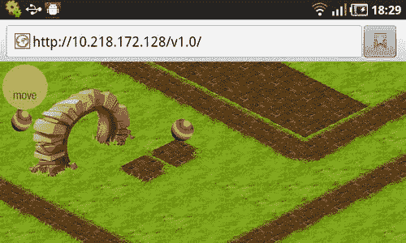

第 7 章：构建等距引擎 **331**

再次运行游戏——尽情享受这个完全可操控的世界吧！图 7-25 展示了该游戏引擎在智能手机上运行的截图。你可以在这个世界中导航、改变地形、添加和移除物体。这些简单的操作构成了你能自行构建的各种各样游戏的基础。

**图 7-25.** *在智能手机上运行的已完成引擎*

代码位于 `v1.0` 文件夹中。拿去用它，做出一款真正的游戏吧！

你现在能做的最好的事情，就是思考如何构建你自己的等距游戏。例如，在游戏中添加会随时间恢复的“资源”。制作控件来选择要建造的建筑类型，并且只有在资源充足时才允许建造。利用你在第 4 章学到的内容添加动画单位，基于此构建游戏玩法，并组装出一款你自己会喜欢的游戏。

**总结**

恭喜！你已经出色地完成了学习等距引擎工作原理的任务！这是整本书中最长的章节之一，我们在学习过程中收获颇丰：

-   对构建等距引擎的更深入理解
-   使用装饰瓦片——与游戏艺术家 Sergey Lesiuk 的实际资源共同工作
-   为等距地形实现图层
-   使用屏幕外缓冲区来加速渲染
-   使用对象层——将游戏对象组织成易于管理的数据结构
-   实现集群——一种限制渲染代码需要处理的物体集合的方法
-   实现脏矩形——一种允许我们将屏幕的特定区域标记为“脏”，从而只重绘这些部分的策略（对于只有少数移动实体的游戏来说，这是一个非常宝贵的优化）
-   构建用户界面——对游戏状态的简单控制
-   实现 `LayerManager`——一种将多个图层作为单个对象来操作的方法
-   响应用户输入——事件传播与阻止传播

现在你手上已经有了一个等距引擎，下一步就是用引擎制作一款真正的游戏！不要犹豫，大胆尝试。构建一个社交策略游戏的单人原型，添加一些资源和挑战，并摆弄一下用户界面、对话框和控件。如果资源充足，尝试对建筑进行“升级”。添加动画、制作加载画面，或者增加几个不同的关卡。

现在你可以尝试很多想法！等读到第 10 章和第 12 章时，你将学习如何为游戏添加联网功能。

但现在，你已经拥有了足够的知识来制作具有商业外观的游戏。有了 Canvas 图形、动画、事件以及世界渲染技巧这些锦上添花的功能，你已拥有构建可玩游戏所需的所有工具。别再犹豫——拿起代码，尝试一些自己的想法吧！

# 第 **3D in a Browser** 章

在本书的第一部分，我们学习了如何制作 2D 游戏。在浏览器游戏开发的很多很多年里，2D 游戏是人们能使用的最前沿技术。3D 游戏则是 [...] 的成果


## 第 8 章：浏览器中的 3D 技术

本章将涵盖以下主题：

- 3D 渲染的基础知识：如何在平面屏幕上呈现立体图形
- 矩阵代数基础：3D 技术背后的主要机制
- 透视与投影：让场景看起来更自然

本章的目标是构建一个能够渲染 3D 模型线框的简单演示。我们将从最简单的形状——立方体开始。

### 认识 3D 渲染

那么，究竟什么是 3D？它与我们前几章看到的常规 2D 图形有何不同？3D 图形和动画一样，都是一种幻觉。当你渲染动画时，你是在快速切换帧，从而产生物体在移动的感觉。但实际上，这个过程并不涉及物理移动。像素停留在各自的位置，只是改变颜色，然而屏幕上的图形看起来却在移动。

渲染 3D 场景的工作原理与此类似。显示器本身是平面的，但我们通过一种渲染方式，让用户感觉自己正通过一扇窗户观察一个 3D 世界。现在，你肯定会问一个常见问题：如果 3D 本质上是 2D 的一个特例，而且我们已经知道如何处理 2D 场景，为什么不直接用 Canvas 2D 上下文来绘制 3D 场景呢？这是个很合理的问题。事实上，我们可以仅使用 Canvas 构建一个非常简单的 3D 引擎，但我们会面临两个主要问题。

首先是此类项目涉及的工作量和数学计算量。3D 引擎和 2D 引擎背后的数学原理和优化方法有着数量级的差异。但即使你花上几年的时间学习 3D 相关知识并将其实现为一个 3D 引擎，你还会遇到第二个关键问题：实现自定义 3D 渲染所需的处理能力。

自从玩家、游戏开发商和硬件制造商意识到 3D 很酷以来，他们也明白 CPU 并不擅长渲染 3D。因此，他们决定添加专门负责 3D 计算的显卡芯片。这些硬件通常比 CPU 更昂贵，并且专注于 3D 图形。在浏览器的 JavaScript 中，你无法直接访问 GPU（图形处理器）并发送渲染指令。

自然进化过程旨在让游戏看起来尽可能逼真。目前唯一限制我们在智能手机上运行《上古卷轴：天际》的因素，当然是便携式硬件的处理能力。与常规 2D 引擎相比，3D 引擎需要更多的处理时间。在 2D 引擎中，渲染工作相对简单：从图像中获取像素，复制到 Canvas；如果涉及透明度，则计算合成颜色。而对于 3D 引擎来说，难度就大得多，其底层数学计算也更复杂。这就是直到最近浏览器（无论是桌面端还是移动端）才原生支持 3D 的原因之一。

本章专门讨论在浏览器中开发 3D 应用。有一个被称为`WebGL`的 API，旨在成为浏览器中 3D 的“标准”实现。目前，`WebGL`在移动市场才刚刚起步。支持它的 Android 智能手机和平板电脑的浏览器只有 Firefox Mobile（至少在撰写本文时是如此）。索尼 Xperia PLAY 的原生浏览器支持`WebGL`。由于`WebGL`在桌面浏览器中大规模普及，很明显，很快我们将在许多移动设备上看到这个出色的 API。

当更多设备能够在良好水平上处理 3D 时，毫无疑问，我们的浏览器中将出现 3D 游戏。这就是为什么对于游戏开发者来说，了解 3D 渲染的工作原理以及在自己的项目中实现它所需的条件至关重要。本章致力于介绍 3D 背后的通用概念，并作为进入第 9 章的温和铺垫，在第 9 章中我们将学习`WebGL`的基础知识。


# 第八章：浏览器中的 3D 世界

你受限于在 CPU 中执行每条指令的 **JavaScript** 引擎。由于 CPU 并非为此类运算而优化，因此与使用 GPU 渲染相比，渲染所需的时间要多得多。

事实上，在 **WebGL** 出现之前，构建完全自定义的 3D 渲染器是在浏览器中创建 3D 效果（且无需 Flash 或 Java）的唯一途径。人们曾发明过自己的 3D 引擎，其中一些实验令人印象深刻。但遗憾的是，归根结底，你无法在 2D 环境中编写出质量过硬的 3D 游戏。**WebGL** 的工作方式截然不同——它允许你将所有最繁重的 3D 计算交给 GPU 处理。

目前市场上的大多数手机尚未配备独立的 GPU，但这只是时间问题。如果在这样的手机上启动 **WebGL** 会发生什么？它还能工作吗？快速回答：是的，能工作。但它仍然使用 CPU 来渲染场景，在这种配置下你无法获得很高的帧率。当 3D 场景由 GPU 渲染时，称为**硬件渲染**，这意味着数学运算和繁重计算都由专门针对此类任务优化的 GPU 完成。相反的情况称为**软件渲染**，即使用 CPU 渲染场景，例如在不使用 WebGL 的 JavaScript 中，或者在不支持其所需硬件的设备上进行渲染。

**注意：** 即使在你台式机上，也可能遇到 WebGL 加速问题。有一份特殊的“黑名单”，列出了已知会导致 WebGL 问题的硬件-驱动-操作系统组合。如果你的电脑属于黑名单类别，你的 WebGL 上下文将无法加速，或者 WebGL 会被完全禁用。如果你仍想自担风险启用它，每个浏览器都有一个启动参数可以强制忽略黑名单。在 Chrome 中，使用选项 `--ignore-gpu-blacklist` 启动浏览器。在 Firefox 中，转到 `about:config` 并设置 `webgl.force-enabled=true`。

#### 3D 渲染的工作原理

这是整本书中最难写的章节之一。3D 渲染确实是一个复杂的主题，完全有可能单独写上一两本名为《3D 渲染是如何工作的》的书。我试图只解释 3D 渲染的重要核心内容，并为你后续理解其背后更高级的算法打下良好基础。我也会尽量减少数学公式的复杂度，但某些地方仍然需要写一些公式。

##### 数学部分

我们先来说说关于 3D 的好消息。你在平面二维空间中使用的数学在 3D 中同样适用。3D 中的所有东西都只是 2D 加上一个额外维度，称为 `z`。在 2D 中，线段中点的计算如下：

```
x = (x1 + x2) ÷ 2, y = (y1 + y2) ÷ 2
```

再增加一个维度，就得到了 3D 版本：

```
x = (x1 + x2) ÷ 2, y = (y1 + y2) ÷ 2, z = (z1 + z2) ÷ 2
```

两点之间的距离也是如此。在二维空间中，公式是：

```
d = sqrt((x1 - x2)² + (y1 - y2)²)
```

增加第三个维度后，公式变为：

```
d = sqrt((x1 - x2)² + (y1 - y2)² + (z1 - z2)²)
```

为什么现在要强调这个？因为有时理解 2D 中的运作方式要比 3D 容易得多。理解 2D 图形和公式更简单，一旦你掌握了它们，转向 3D 就一点也不难了。如果你在理解 3D 的某些概念时遇到困难，无论是在本章还是其他地方，试着用 2D 空间中的相同概念来思考。如果能找到类似的例子，你很快就能理解 3D。

当然，任何规则都有例外。例如，在 2D 中，直线要么平行，要么在某处相交。而在 3D 中，直线完全可能既不平行也不相交。

##### 一个 3D 示例

让我们从一个非常基本的现实生活例子开始。在 2D 表面上进行 3D 渲染最常见的例子是什么？没错——就是用相机拍照或录像。

``


手机摄像头。摄像头对三维场景“拍照”，并将其捕捉到二维平面上。十年前，这个平面是模拟胶片，如今则是数字矩阵。请看图 8-1，了解其工作原理。

**图 8-1.** *相机是利用二维投影来呈现三维场景特定片段的绝佳例子。*

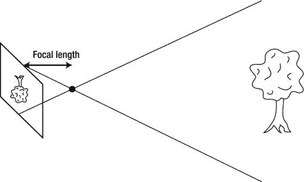

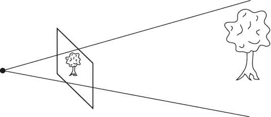

## 第 8 章：浏览器中的 3D 技术

物体反射的光线被镜头捕捉，并传输到矩阵上。图像会出现上下颠倒，这是因为镜头以这种方式进行了变换。

数码相机通常具有变焦功能。你按下按钮，图像就会神奇地拉近。实际发生的是你改变了焦点与镜头之间的距离，从而增大或减小视野（见图 8-2）。更大的视野意味着可见的物体更多，每个物体占据的空间更小——这大致相当于相机上的“缩小”。更小的视野则相反：物体在视口中占据更多空间，你能看到更多细节，就像按下“放大”键一样。

**图 8-2.** *改变焦距就像放大或缩小：视野越大，图像在屏幕上显示得越小。*

渲染 3D 场景的工作原理几乎相同，但由于我们没有镜头之类的部件，因此无需将“目标”二维平面放在焦点后方。它被当作是直接位于相机前方（见图 8-3）。

**图 8-3.** *计算机图形中没有镜头。这就是“捕捉”场景投影的平面被放置在焦点前方的原因。然而，视野的规则保持不变：你看到的越多，单个物体就变得越小。*

## 第 8 章：浏览器中的 3D 技术

现在我们来看看拍照与渲染 3D 场景有何不同。与现实世界不同，3D 场景由三角形构成（这是目前表示 3D 模型的最佳方式）。三角形与你每天看到和触摸的物体不同，它们没有任何物理属性。它们没有重量、颜色、材质等。这些属性必须通过其他更复杂的数学模型来模拟。

当你按下相机快门拍照时，棘手的部分已经由自然法则为你完成了：光线从表面正确反射——被雾气或热气流扭曲，被半透明物体过滤——然后简单地传递到你的相机或你眼睛的视网膜上。而在 3D 世界中，你的任务就是实现这些自然法则，并计算出用户实际能看到什么。这就是 3D 引擎复杂性的来源。

好消息是，你不需要为每一条光学定律构建一个超真实的模拟就能搭建一个 3D 引擎。如果我们抛开光照和材质，引擎就非常简单——它仅仅显示场景中多边形的线框。每个人在学习 3D 编程时都会做的“Hello World”是显示一个旋转的 3D 立方体。这就是我们现在要做的，而且暂时不涉及 WebGL。为什么呢？因为这很可能是开启我们理解 3D 世界的最佳示例。

### Hello World 3D 引擎

在本节中，我们将使用我们已经熟悉的普通 Canvas API 来创建最简单的 3D 引擎。我们将首先了解如何在 JavaScript 中表示一个 3D 模型。然后，我们会简要介绍矩阵——这种数学抽象能帮助我们在屏幕上渲染模型。借助矩阵和变换，我们将让一个立方体在屏幕上旋转。最后，我们会探讨透视和投影，以使模型看起来更自然。实际目标是显示一个漂亮的旋转立方体，就像图 8-4 所示的那样。

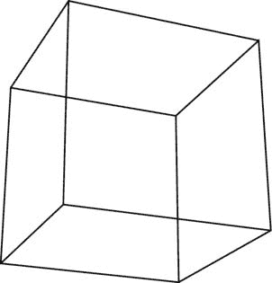

## 第 8 章：浏览器中的 3D 技术

**图 8-4.** *我们在本章中制作的应用程序的最终版本，演示了如何渲染一个旋转的 3D 立方体。*

#### 模型与场景

要渲染一个场景，我们需要了解哪些信息？首先，我们需要组成立方体或我们渲染的任何其他模型的顶点列表。其次，我们需要知道哪些点由边连接，哪些没有连接。让我们为我们的 JavaScript 实验定义一个立方体。

##### 模型

在 3D 空间中，模型由顶点、边和面表示。顶点就是空间中的一个点；边是连接两个顶点的线；面则是由边围成的平面。

一个立方体有八个顶点、十二条边和六个面：每条边连接一对顶点，每个面是由四条边围成的正方形。3D 空间中的每个点都由三个坐标 (`x`, `y`, `z`) 表示。我们先看图 8-5，它展示了立方体的示意图、坐标方向以及立方体顶点的坐标。

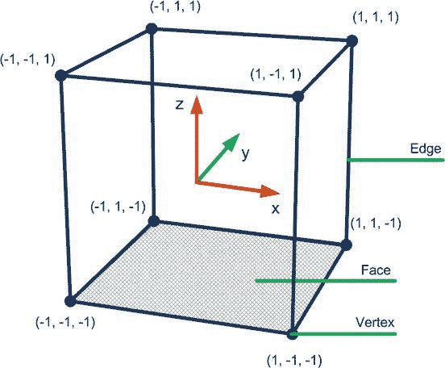

## 第 8 章：浏览器中的 3D 技术

**图 8-5.** *立方体在空间中的表示*

**注意：** 3D 空间没有上、下、左、右方向——只有三个轴，每个轴指向各自的方向。哪个方向是“上”由你来决定；然而，通常的约定是 `z` 轴代表高度。

坐标原点位于立方体的中心——`(0, 0, 0)` 点。为简单起见，边长设为 2，因此每个坐标分量是 1 或 -1。

现在，我们将顶点的信息保存到数组中。因为有八个顶点，所以数组有八个元素。每个元素是 3D 空间中的一个点，由另一个包含三个坐标的数组表示。清单 8-1 展示了代码中的样子。

**清单 8-1.** *立方体的顶点*

```
var vertices = [
    [-1, -1, -1], [-1, -1, 1], [-1, 1, -1], [-1, 1, 1],
    [1, -1, -1], [1, -1, 1], [1, 1, -1], [1, 1, 1]
];
```

模型的第二部分是边。边是连接两个顶点的线。我们不需要存储边的坐标，因为我们在顶点数组中已经有了这些坐标。相反，边保存的是第一个数组中的索引。例如，清单 8-2 中的第一条边保存为 `[0, 1]`。这意味着它连接了索引为 0 的顶点和索引为 1 的顶点。查看第一个数组中这些点的坐标，你会发现它们是 `(-1, -1, -1)` 和 `(-1, -1, 1)`。边数组的代码如清单 8-2 所示。

**清单 8-2.** *立方体的边，每个元素引用顶点数组中的索引*

```
var edges = [
    [0, 1], [0, 2], [0, 4], [1, 3],
    [1, 5], [2, 3], [2, 6], [3, 7],
    [4, 5], [4, 6], [5, 7], [6, 7]
];
```

##### 场景

现在我们有了一个立方体，我们肯定希望从不同角度观察它。在现实世界中，我们通常无法移动世界本身，因此我们移动相机。在 3D 图形中，相机通常固定在空间中，朝向特定方向。例如，在 WebGL 中，相机沿着 `z` 轴向下看，这样 `z` 值较小的物体看起来更远。为了向用户展示他需要看到的场景部分，我们需要调整相机的角度和位置，或者改变世界的角度和位置。这工作原理与上一章完全相同：为了营造用户在导航到地图新区域的感觉，我们将视口保持在点 `(0, 0)` 处，并移动地图本身。

旋转只是你可以应用于模型的一种变换。其他简单的变换类型包括在场景中移动物体，或在每个轴上缩放物体。编写几个能处理这些情况的漂亮函数并不难，但一旦你开始将这些变换层层叠加，任务就变得越来越困难。例如，先移动……


# 排版后的文本

将对象向左移动五个单位，然后绕`z`轴旋转`3.14`弧度，最后在`x`轴上缩放三倍。编写代码实现这种逻辑会是一个不错的数学练习，但我们不要操之过急，而是先看看已被证明高效的机制。

### 渲染

现在我们已经定义了模型的坐标并将其存储在数组中，是时候在屏幕上渲染立方体了。但我们如何将这些点转换为线框呢？在本节中，我们将学习 3D 渲染在非常基础层面上的工作原理。要渲染 3D 图形，我们必须找到其顶点在屏幕上的投影。一旦找到投影，我们就可以在每个由边连接的两点之间绘制线条——这就足以渲染线框了！

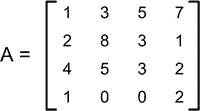
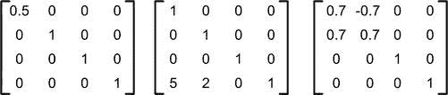

## 第 8 章：浏览器中的 3D

用于寻找投影和进行 3D 渲染的数学工具被称为矩阵理论。让我们从一个非常基础的要素——矩阵开始。一旦我们了解了矩阵的工作原理，我们将把这些知识应用到我们的任务中。我们将渲染立方体，旋转它，然后应用透视投影，使立方体看起来更自然。

### 矩阵

那么，什么是矩阵？不，它不仅仅是尼奥与特工史密斯战斗的那个平行现实。矩阵也是一种基础数据结构，对于每个 3D 程序都至关重要。图 8-6 展示了一个矩阵的外观。

**图 8-6.** *一个矩阵的示例*

本质上，矩阵是一个由行和列组成的网格。当然，矩阵可以有不同的大小。图 8-6 是一个 4×4 矩阵。在 JavaScript 中表示矩阵的自然方式是使用二维数组。真正令人兴奋的是，一个 4×4 矩阵可以按任意顺序容纳你应用于场景的任意数量的变换。这是如何做到的呢？每个矩阵代表一个特定的变换：旋转、缩放、平移，或者这些操作的任意组合。图 8-7 展示了一些示例。

**图 8-7.** *代表不同变换的矩阵。从左到右：在 x 轴上缩小 50%，沿 x 轴移动五个单位并沿 y 轴移动两个单位，绕 z 轴旋转大约 45 度。*

如果你从未使用过矩阵，图 8-7 可能看起来像三个由无意义数字组成的网格。然而，当你知道了如何将矩阵相乘，事情就变得清晰多了。这些规则有些反直觉，但在 2×2 矩阵上展示它们要容易得多。假设我们想要将矩阵`A`乘以矩阵`B`。

矩阵乘法的一般规则如下：要得到结果矩阵中第`m`行第`n`列的元素，你必须取左侧矩阵的第`m`行和右侧矩阵的第`n`列，将它们对应的元素相乘，再相加。要得到第一个单元格（第 1 行，第 1 列）中的数字，你必须取左侧矩阵的第一行和右侧矩阵的第一列，逐元素相乘，然后将结果相加。此操作如图 8-8 所示。

**图 8-8.** *矩阵相乘以得到第一个元素*

对于第一行第二列的单元格，你必须取左侧矩阵的第一行和右侧矩阵的第二列，并执行相同操作：逐元素相乘，然后将结果相加。图 8-9 展示了如何操作。

**图 8-9.** *乘法的下一步：第一行中的第二个元素*

图 8-10 展示了如何计算结果矩阵的最后两个单元格。

**图 8-10.** *矩阵相乘的最终结果*

现在来看期待已久的功能。要应用矩阵所代表的变换，你必须将点的坐标与矩阵相乘。你会得到新的坐标——即变换后的坐标。如果你对立方体的每个顶点应用相同的变换，立方体本身就会被变换：旋转、缩放，或移动到场景中的特定位置。


其工作原理如下。首先，你需要以矩阵形式写出点的坐标：`[x, y, z, 1]`。必须添加这个 “1” 坐标才能进行矩阵乘法，然后应用常规的矩阵乘法规则。让我们看看，当取立方体的第一个顶点，并对其应用示例中的第二个矩阵时会发生什么。图 8-11 显示了乘法运算的结果。

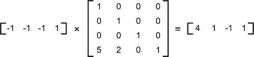

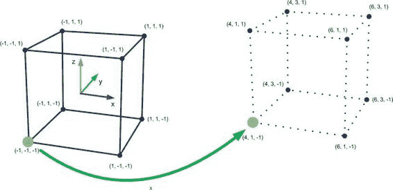

**图 8-11.** *对顶点坐标应用变换*

该点在 x 坐标上移动了 5，在 y 坐标上移动了 2。这正是我们想要的结果！如果我们对立方体的每个点重复此过程，那么每个点都会被移动，立方体本身最终会处于一个新位置。图 8-12 示意性地展示了其效果。虚线边缘标记了当变换应用于每个顶点时立方体的位置。高亮显示的点正是我们刚刚变换过的点。

**图 8-12.** *立方体的“平移”变换。如果每个顶点都被移动，那么立方体本身也会被移动。*

好吧，这其实算不上一个惊人的结果，因为我们可以简单地将 5 和 2 加到相应的坐标上，完全无需处理矩阵。当你需要对一组点应用一系列变换时，矩阵的真正用途才得以体现。例如，如果你有十个不同的变换（一个接一个），以及一个包含大量顶点的模型，你要么必须逐个将这些变换应用于模型上的点，要么创建一个能实现所有变换的单一矩阵并直接使用它。猜猜哪种方式更好。

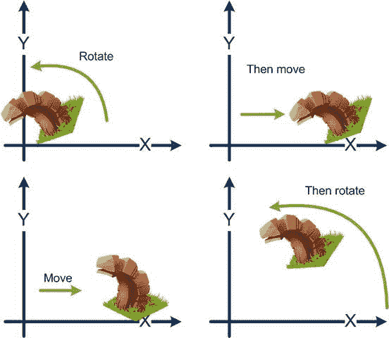

**注意：** 我们在点的坐标中作为第四个分量添加的那个不起眼的 “1”，并不仅仅是为了让乘法运算有效。3D 引擎严格使用一种略有不同的坐标系来表示点，这种坐标系被称为齐次坐标。为什么在计算机图形学中要使用它？因为当涉及投影时，这种坐标处理起来要容易得多。如果你有兴趣，可以轻松地在互联网和数学文献中找到关于这个概念的深入解释，但在你自己创作 3D 杰作的过程中，除了这一点之外，实际上并不需要其他更多知识。不过，我确实鼓励你在掌握了基本概念后，去了解其底层的工作原理。

创建一个组合了多个变换的矩阵，就如同将代表各个独立变换的矩阵相乘一样简单。如果你将移动顶点向右的矩阵与移动顶点向上的矩阵相乘，再与绕 x 轴旋转顶点的矩阵相乘，就会得到一个能一次性完成所有三个操作的矩阵：向右上方移动，同时旋转模型。

关于矩阵，有两点需要了解。首先，乘法的顺序至关重要。处理数字时，(5 × 3) 和 (3 × 5) 的结果相同，但对于矩阵来说则不然。为了说明这一点，请看图 8-13，它展示了变换顺序如何改变结果。

**图 8-13.** *改变变换顺序会产生不同的结果*

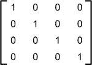

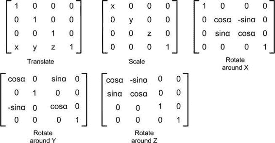

诀窍在于，当你使用所描述的矩阵模型时，变换是按相反顺序应用的：最后一个变换最先应用。一开始这有点令人困惑，但你最终会习惯的。

第二点是，就像普通代数中的 “1” 在相乘时不会改变另一个数字的值一样，有一种矩阵被称为单位矩阵，它在乘法运算中不会改变左边或右边的矩阵。这个矩阵代表了“无变换”状态。图 8-14 展示了它的样子。

**图 8-14.** *单位矩阵代表“无变换”*

最后，图 8-15 列出了最常用的变换矩阵。不要被旋转矩阵中的正弦和余弦吓到。


# 矩阵——你无需深究点是如何变换的细节，也不必纠结正弦或余弦函数为何出现在那里。

**图 8-15.** *以矩阵形式呈现的不同变换类型*

### 实现变换

现在我们已经准备就绪，可以绘制“立方体引擎”的第一个版本了。先从好消息说起。有一个非常优秀的 JavaScript 库能帮我们处理矩阵运算的所有繁重工作，它叫 `gl-matrix`（[`github.com/toji/gl-matrix`](https://github.com/toji/gl-matrix)）。感谢布兰登·琼斯，我们拥有了一个出色且高效的工具。获取名为 `gl-matrix.js` 或 `gl-matrix-min.js` 的文件，并将其添加到你的项目中。顾名思义，这个库原本是为 WebGL 设计的，但由于它实现了通用的矩阵数学运算（这些运算在全球范围内都是相同的），我们将把它用于我们的项目。

渲染立方体线框的思路是执行两个简单步骤：

1.  按照我们想要的方式变换每个顶点（这里我们希望旋转顶点）。
2.  在每两个具有共享边的顶点之间绘制一条线段。

这个过程的具体步骤如图 8-16 所示。

**图 8-16.** *渲染立方体线框的步骤*

我们先从第一部分开始。需要对立方体应用两个变换：绕 x 轴旋转和绕 y 轴旋转（如果你愿意，也可以应用其他变换）。`gl-matrix` 提供了几个便捷方法，将矩阵的细节封装在库内部。创建变换矩阵的代码如代码清单 8-3 所示。

**代码清单 8-3.** *创建变换矩阵*

```
var modelView = mat4.create();
mat4.identity(modelView);
mat4.rotateX(modelView, xRot);
mat4.rotateY(modelView, yRot);
```

在第一行，我们创建了一个空矩阵。由于创建的矩阵填充的是零，所以在使用之前必须将其初始化为单位矩阵（否则它会将所有点变换到坐标 (0, 0, 0)）。第三行向矩阵添加了 x 轴旋转，这相当于先创建旋转矩阵，再将我们的单位矩阵与其相乘。最后一行完成了准备工作，现在我们可以旋转立方体了。

**注意：** 为什么我们将矩阵变量命名为 `modelView`？这是 OpenGL 中使用的名称，它表示……呃，模型的视图：即应用到顶点上、用以精确表示我们所需模型的所有变换。为什么不直接叫“matrix”？因为在这个过程中还有其他矩阵参与。例如，我们将在本章后面处理用于计算透视的投影矩阵。

“旋转”过程非常简单：我们将矩阵逐一应用到每个顶点上。得到变换后的坐标后，通过简单地丢弃 `z` 坐标，将其投影到相机表面上。我们还需要将立方体稍微放大一些，以便它能够适配屏幕。立方体的大小仅为 2（范围从 -1 到 1），如果直接将其换算成像素，它会显得非常小。代码清单 8-4 展示了如何计算投影的坐标。

**注意：** 大小为 2？2 什么？像素、英寸、米还是甜瓜？在 3D 图形学中，这并不重要。你需要在项目中自行制定某种约定来定义这些数值。唯一的规则是在整个项目中保持度量单位的一致性。如果你决定“2”代表“2 米”，之后可别忘了；否则，你可能会意外创建出一个跟小汽车一样大的兔子模型。但这也不是问题：你随时可以用神奇的矩阵将它缩放到适合你的场景。在本章中，当需要指代 3D 场景中的大小时，我会使用“单位”这个词。

**代码清单 8-4.** *计算每个点的投影坐标*


// 创建此类索引以方便与数组索引对应

```javascript
var X = 0;
var Y = 1;
var Z = 2;
```

// 屏幕坐标

```javascript
var points = [];
```

// 缩放因子，暂时选取一个你最喜欢的值

```javascript
var scaleFactor = canvas.width/8;

for (var i = 0; i < vertices.length; i++) {
    // 将点转换为齐次坐标，准备进行乘法运算
    var point = [vertices[i][X], vertices[i][Y], vertices[i][Z], 1];
```

## 第 8 章：浏览器中的 3D 世界

**349**

```javascript
    // 应用变换
    mat4.multiplyVec4(modelView, point);
    // 将计算所得的坐标添加到数组
    points[i] = [
        Math.round(canvas.width/2 + scaleFactor*point[X]),
        Math.round(canvas.height/2 - scaleFactor*point[Y])];
}
```

可以看到，一旦了解了矩阵的奥秘，这一切其实并不复杂。

最后一步是绘制边线。我们已有边线数组和点投影数组。将两者结合——瞧——立方体开始旋转了（别忘了更新旋转角度值）。代码清单 8-5 展示了该项目的完整代码。请尝试在你的手机和桌面浏览器上运行它。

**代码清单 8-5.** *旋转立方体演示的完整源代码*

```html
<script src="js/utils.js"></script>
<script src="js/gl-matrix-min.js"></script>
<script>
    var canvas = null;
    var ctx = null;
    var X = 0;
    var Y = 1;
    var Z = 2;
    var vertices = [
        [-1, -1, -1], [-1, -1, 1], [-1, 1, -1], [-1, 1, 1],
        [1, -1, -1], [1, -1, 1], [1, 1, -1], [1, 1, 1]
    ];
    var edges = [
        [0, 1], [0, 2], [0, 4], [1, 3],
        [1, 5], [2, 3], [2, 6], [3, 7],
        [4, 5], [4, 6], [5, 7], [6, 7]
    ];
    var xRot = 0;
    var yRot = 0;

    function init() {
        canvas = initFullScreenCanvas("mainCanvas");
        ctx = canvas.getContext("2d");
        animate(0);
    }
```

## 第 8 章：浏览器中的 3D 世界

```javascript
    function animate(t) {
        ctx.clearRect(0, 0, canvas.width, canvas.height);
        renderCube();
        requestAnimationFrame(arguments.callee);
    }

    function renderCube() {
        var modelView = mat4.create();
        mat4.identity(modelView); // 设置为单位矩阵
        mat4.rotateX(modelView, xRot);
        mat4.rotateY(modelView, yRot);
        var points = [];
        var scaleFactor = canvas.width/8;

        for (var i = 0; i < vertices.length; i++) {
            var point = [vertices[i][X], vertices[i][Y], vertices[i][Z], 1];
            mat4.multiplyVec4(modelView, point);
            points[i] = [
                Math.round(canvas.width/2 + scaleFactor*point[X]),
                Math.round(canvas.height/2 + scaleFactor*point[Y])];
        }

        ctx.strokeStyle = "black";
        // 绘制线框
        ctx.beginPath();
        for (i = 0; i < edges.length; i++ ) {
            ctx.moveTo(points[ edges[i][0] ][X], points[ edges[i][0] ][Y]);
            ctx.lineTo(points[ edges[i][1] ][X], points[ edges[i][1] ][Y]);
        }
        ctx.stroke();
        ctx.closePath();

        xRot += 0.01;
        yRot += 0.01;
    }

    function initFullScreenCanvas(canvasId) {
        var canvas = document.getElementById(canvasId);
        resizeCanvas(canvas);
        window.addEventListener("resize", function() {
            resizeCanvas(canvas);
        });
        return canvas;
    }

    function resizeCanvas(canvas) {
```

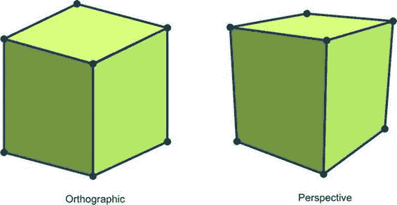

## 第 8 章：浏览器中的 3D 世界

**351**

```javascript
        canvas.width = document.width || document.body.clientWidth;
        canvas.height = document.height || document.body.clientHeight;
    }
</script>
```

如果运行这个演示，你会看到立方体的外观有些不太自然；不知为何，它看起来根本不像一个真实的三维立方体。问题在于我们使用了正交投影，而真实世界的运作方式并非如此。本演示的完整源代码可在名为 `01.spinning_cube.html` 的文件中找到，该文件随本章的其他资源一起提供。

### 投影

在真实世界中，离相机越远的物体看起来比离得近的物体更小。我们的演示没有考虑到这一点——这就是为什么立方体看起来不对劲。正如你在代码中所见，我们简单地丢弃了 `z` 值，它完全没有参与投影的计算过程。

我们的演示使用了正交投影，即在不具备任何透视效果的情况下渲染 3D 图形。在正交投影中，距离相机 5 米的汽车与 20 米外的汽车渲染出来大小相同。这种投影看起来有些不太自然，但常用于工程蓝图。而透视投影则更符合自然规律：远处的物体会显得更小。


# 排版后的内容

比靠近摄像机的物体要小。图 8-17 展示了这两种投影之间的区别。

**图 8-17.** *左图显示的是正交投影，右图显示的是透视投影。*

如你所见，右图中使用透视投影渲染的同一个立方体，看起来比左图现在呈现的效果要逼真得多。我们如何修复引擎以使其考虑到透视效果呢？没错，我们需要再添加一个矩阵。

我不会深入讲解投影矩阵的具体数学实现细节。要制作酷炫的 3D 游戏，你只需知道两件事。第一，将`modelView`变换的结果乘以这个矩阵，就能得到考虑了透视效果的投影变换。第二，Brandon 是个好人，他在自己的库中加入了一个便捷的方法，只需给定一组人类可读的参数，就能创建一个透视矩阵。

清单 8-6 展示了我们如何创建这个矩阵。

**清单 8-6.** *创建投影矩阵*

```
var persp = mat4.create();
mat4.perspective(45, canvas.width/canvas.height, 0.1, 100, persp);
```

这些参数分别代表：垂直视角、宽高比、到“近平面”的距离以及到“远平面”的距离。近平面和远平面定义了场景的边界。这相当于在说：“我不想看到任何比 0.1 更近或超过 100 距离的物体。”最后一个参数是由这些值初始化的矩阵（参见清单 8-7）。图 8-18 说明了透视参数如何影响最终生成的画面。

**清单 8-7.** *使用投影矩阵*

```
for (var i = 0; i < vertices.length; i++) {
    var point = [vertices[i][X], vertices[i][Y], vertices[i][Z], 1];
    mat4.multiplyVec4(modelView, point);
    mat4.multiplyVec4(persp, point);
    ...
}
```

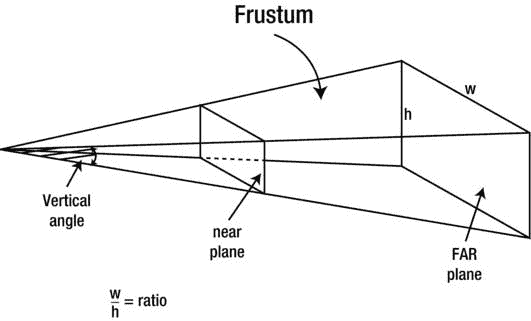

**图 8-18.** *使用透视定义场景边界*

在应用透视矩阵后得到的坐标，必须先经过归一化处理，才能将顶点绘制到屏幕上。简单来说，我们就是将齐次坐标（即多了一个分量的坐标）转换为只有`x`和`y`两个轴的标准屏幕坐标（参见清单 8-8）。

**清单 8-8.** *归一化坐标*

```
var ndcPoint = [
    point[X]/point[W],
    point[Y]/point[W]
];
```

得到的`x`和`y`值范围在-1 到 1 之间。`ndcPoint`中的 NDC 代表归一化设备坐标。现在，我们唯一要做的就是将它们“拉伸”以填满整个画布，如清单 8-9 所示。透视投影的完整演示可以在本章附带源代码中名为`02.perspective.html`的文件里找到。

**清单 8-9.** *转换为窗口坐标*

```
points[i] = [
    Math.round(canvas.width/2*(1 + ndcPoint[0])),
    Math.round(canvas.height/2*(1 - ndcPoint[1]))
];
```

清单 8-10 展示了`renderCube()`函数的完整代码，该函数已具备透视感知能力（新代码以粗体显示）。

**清单 8-10.** *renderCube 的最终版本*

```
function renderCube() {
    var modelView = mat4.create();
    mat4.identity(modelView); // 设置为单位矩阵
    mat4.translate(modelView, [0, 0, -10]);
    mat4.rotateX(modelView, xRot);
    mat4.rotateY(modelView, yRot);

    var persp = mat4.create();
    mat4.perspective(45, canvas.width/canvas.height, 0.1, 100, persp);

    var points = [];
    for (var i = 0; i < vertices.length; i++) {
        var point = [vertices[i][X], vertices[i][Y], vertices[i][Z], 1];
        mat4.multiplyVec4(modelView, point);
        mat4.multiplyVec4(persp, point);
        var ndcPoint = [
            point[X]/point[W], // W = 3，数组中第四个坐标的位置
            point[Y]/point[W]
        ];
        points[i] = [
            Math.round(canvas.width/2*(1 + ndcPoint[0])),
            Math.round(canvas.height/2*(1 - ndcPoint[1]))
        ];
    }

    ctx.strokeStyle = "black";
    // 绘制线框
    ctx.beginPath();
    for (i = 0; i < edges.length; i++ ) {
        ctx.moveTo(points[ edges[i][0] ][X], points[ edges[i][0] ][Y]);
    }
```


`ctx.lineTo(points[ edges[i][1] ][X], points[ edges[i][1] ][Y]);`

```
}

ctx.stroke();

ctx.closePath();

xRot += 0.01;

yRot += 0.01;

}
```

嘿！你刚刚创建了一个非常简单的 3D 引擎——而且它属于你！这可是一个了不起的成就！你知道吗？你刚刚重复了 `OpenGL` 渲染管线的一部分——这正是该 API 的核心。让我们回顾一下我们所做的事情。

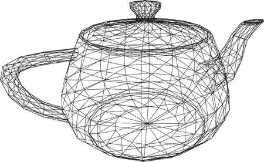

## 第 8 章：浏览器中的 3D

**355**

1.  我们以顶点坐标和边作为输入。
2.  我们对顶点应用了变换，绕两个轴旋转了模型。
3.  我们对上一步变换的结果应用了透视矩阵。
4.  我们对坐标进行了归一化。
5.  我们将源顶点的坐标转换到了 2D 画布的坐标上。
6.  我们绘制了边，以显示旋转的立方体。

当然，WebGL 的过程要复杂得多，但主要部分——顶点的变换、矩阵的使用、透视以及我们在本章中强调的其他概念——是不变的。现在，你已经为理解基本 WebGL 操作背后的数学原理打下了坚实的基础。

最后的问题是，我们能否真正绘制出比这些无聊的立方体、矩形和圆形更有趣的东西？当然可以。我在互联网上找到了一个非常好的模型。我不会在接下来的几页中粘贴几百个顶点，但你可以在本书的配套资源中找到它们。请欣赏图 8-19 中的茶壶！

**图 8-19.** *使用与立方体相同的技术渲染的茶壶*

旋转茶壶的完整演示可在本章的其他资源中找到，文件名为 `03.teapot.html`。

## 第 8 章：浏览器中的 3D

### 总结

本章致力于理解 3D 引擎背后的基础。计算顶点位置和应用透视只是一个真实的引擎在游戏中为每一帧所做的第一步。其他步骤可能更复杂——例如，丢弃不可见的多边形以节省资源、为模型表面应用纹理、计算光照效果等等。3D 引擎通常比 2D 引擎涉及更复杂的数学运算，并且它们在不断发展。开发者和数学家们致力于带来更好的算法，让渲染出的画面更加逼真。

即使是最复杂的 3D 数学运算，也是从世界中顶点的位置以及模型变换的计算开始的。如果你以前从未接触过 3D 图形，那么现在你已经是为数不多的真正理解自己在做什么的 3D 开发者之一了。

在本章中，我们构建了最简单的 3D 演示——一个旋转的立方体。在此过程中，我们学到了几个重要的方面：

-   模型在内存中的表示方式
-   如何使用矩阵来移动、旋转或缩放模型
-   如何渲染线框
-   投影以及如何在场景中实现透视

现在，我们准备探索一个更高级的主题：WebGL API。

## 第 9 章

### 使用 WebGL

WebGL 是一项非常有前景的倡议，它已经征服了大部分桌面浏览器世界。WebGL 是一个 API，它将显卡的资源暴露给你的 JavaScript 应用程序。有了 WebGL，你可以创建 3D 游戏并在浏览器中运行，而无需像我们在第 8 章中那样自己实现所有 3D 数学运算。WebGL 基于 `OpenGL ES 2.0`（嵌入式系统 OpenGL，一个适用于移动设备的 `OpenGL` API 子集）。

WebGL 在移动端网页中才刚刚起步。它尚未获得 Android 设备的广泛支持。事实上，只有 Firefox Mobile 支持这一对游戏开发者至关重要的 API。其他先行者包括索尼爱立信的 Xperia 手机——它们也在原生浏览器中支持 WebGL。在撰写本文时，除 IE 外，所有主要的桌面浏览器都支持 WebGL。

本章专门介绍 WebGL。这项技术尚未为 Android 网页游戏的大众市场做好准备，但它正变得越来越受游戏开发者欢迎。本章的目标是向你介绍这项尖端技术。


edge API，并为您在更多设备支持该 API 时创建游戏做好准备。本章是 3D 编程的入门简介。我们将构建几个示例，演示如何使用 `WebGL` 的各个方面。我们将执行以下操作：

- 在移动浏览器中初始化 `WebGL` 上下文
- 学习 `WebGL` 渲染管线
- 使用 OpenGL 着色语言（`GLSL`），这是一种用于着色器的语言
- 显示基本图元
- 加载纹理并学习如何渲染它们
- 从二进制源加载 3D 模型

本章的目标是让您对 `WebGL` 有一个扎实、基本的理解。您将学习 3D 程序的结构，并具备足够的知识来继续自行探索。阅读完本章后，您将有很多资源可以自行探索。

### WebGL 基础

制作一个展示 3D 渲染效果的 `WebGL` 示例网页，比在 2D 上下文中渲染一个三角形或圆形要复杂一些。之所以复杂，是因为渲染是在显卡上执行的，而不是在 `JavaScript` 代码中，并且您必须用来将渲染参数传递给 GPU 的 API 是相当底层的。`WebGL` 的学习曲线很陡峭——它涉及相当多的数学知识，但在阅读前一章后，您会很快掌握它。

在本章中，我们将使用 `Firefox` 在桌面端和智能手机上运行和调试我们的示例。从 [desktop from www.mozilla.org/en-US/firefox/new/](http://www.mozilla.org/en-US/firefox/new/) 下载并安装适用于桌面的最新版本。然后安装 `Firebug` ([`getfirebug.com`](http://getfirebug.com))，这个插件可以为 `Firefox` 添加开发工具，类似于我们在 `Chrome` 中使用的。安装最新版本的 `Firefox` 移动版 ([www.mozilla.org/en-US/mobile/](http://www.mozilla.org/en-US/mobile/))，或者从您的设备应用商店中查找。

**注意：** 在桌面上使用兼容的浏览器不能保证 `WebGL` 能为您工作。拥有受支持的显卡和最新的驱动程序非常重要。

`WebGL` 有黑名单和白名单，用于确定对每个单独案例的支持级别。更多信息请参见官方 `WebGL` 维基：[www.khronos.org/webgl/wiki/BlacklistsAndWhitelists](http://www.khronos.org/webgl/wiki/BlacklistsAndWhitelists)。如果您的显卡或驱动程序被列入黑名单，您可以自行承担风险启用 `WebGL`。在 `Firefox` 中，转到 `about:config` 页面，找到 `webgl.force-enabled` 标志，并将其设置为 `true`。这将使 `Firefox` 绕过黑名单。

### 初始化 WebGL

`WebGL` 作为 `canvas` 的上下文暴露给 `JavaScript`，因此大部分代码保持不变。但是，有几个 `WebGL` 特定的设置。本章中我们使用的框架如 `清单 9-1` 所示。

**清单 9-1.** *WebGL 的基本设置*

```
<!DOCTYPE html>
<html lang="en">
<head>
    <-- 常规的 meta 和样式省略 -->
    <-- gl-matrix – 我们在每个示例中都会用到它 -->
    <script src="js/gl-matrix.js"></script>
    <script>
        var canvas;
        /* WebGL 上下文 */
        var gl;

        function init() {
            canvas = initFullScreenCanvas("mainCanvas");
            gl = getWebGLContext(canvas);
            gl.clearColor(0.0, 0.0, 0.0, 1.0);
            gl.enable(gl.DEPTH_TEST);
            drawScene();
        }

        /**
         * 返回 WebGL 上下文。
         */
        function getWebGLContext(canvas) {
            var ctx;
            try {
                ctx = canvas.getContext("webgl") ||
                      canvas.getContext("experimental-webgl");
            } catch (e) {}
            if (ctx)
                return ctx;
            throw "Could not initialize WebGL";
        }

        /**
         * 渲染场景
         */
        function drawScene() {
            gl.viewport(0, 0, canvas.width, canvas.height);
            gl.clear(gl.COLOR_BUFFER_BIT | gl.DEPTH_BUFFER_BIT);
            // 我们将在此处添加渲染代码。
        }

        function initFullScreenCanvas(canvasId) {
            var canvas = document.getElementById(canvasId);
            resizeCanvas(canvas);
            window.addEventListener("resize", function() {
                resizeCanvas(canvas);
            });
            return canvas;
        }

        function resizeCanvas(canvas) {
            canvas.width = document.width || document.body.clientWidth;
            canvas.height = document.height || document.body.clientHeight;
        }
    </script>
</head>
</html>
```


```html
<script>

gl && drawScene();

}

</script>

</head>

<body onload="init()">

<canvas id="mainCanvas" width="20px" height="20px"></canvas>

</body>

</html>
```

与 2D 示例相比，这段代码稍微复杂一些。首先，我们获取 WebGL 上下文，它被命名为 `webgl` 或 `experimental-webgl`。接着，设置常规的“环境”参数——`gl.clearColor` 是场景的背景颜色。最后一个参数 `gl.enable(gl.DEPTH_TEST)` 指示 WebGL 考虑物体距离的远近，这样距离较远的物体就会被距离观察者较近的物体遮挡。

“主要”绘图函数是 `drawScene()`。目前，它只是初始化场景：根据画布大小设置视口参数，并清除整个区域。在浏览器中打开页面时，你应该会看到一个黑色屏幕。如果一切操作正确，你就可以在新创建的上下文上开始绘图了。清单 9-1 中的代码保存在名为 `01.init.html` 的文件中。

### 几何体

3D 空间中最基本的图元是三角形。3D 场景通常由三角形构成，显卡也针对其渲染进行了优化，因为它是处理起来最简单的图元。WebGL 也有其他类型的图元：线条、三角形条带和三角形扇——但它们不太常用。在本章中，我们只使用三角形。

你还记得我们在第 8 章中是如何表示一个立方体的 3D 模型吗？我们使用了两个数组来描述空间几何体：一个是顶点数组，另一个是边数组。边是连接两个顶点的线段，因此第二个数组保存了对第一个数组元素的引用。

在 WebGL 中，我们采用相同的策略，只不过我们需要的是面（三角形）而不是边。请看清单 9-2 中的数据结构。`vertices` 数组中每个带注释的块定义立方体的一个面：前面、后面、顶面、底面、右面和左面。立方体的每个面都是一个由四个点构成的正方形。然后，这个立方体的面被分解为两个三角形，列在 `faces` 数组中。

**清单 9-2.** *WebGL 中的立方体几何体*

```
var cube = {
  vertices: [
    // 前面
    -1.0, -1.0, 1.0,
     1.0, -1.0, 1.0,
     1.0,  1.0, 1.0,
    -1.0,  1.0, 1.0,
    // 后面
    -1.0, -1.0, -1.0,
    -1.0,  1.0, -1.0,
     1.0,  1.0, -1.0,
     1.0, -1.0, -1.0,
    // 顶面
    -1.0, 1.0, -1.0,
    -1.0, 1.0,  1.0,
     1.0, 1.0,  1.0,
     1.0, 1.0, -1.0,
    // 底面
    ...
    // 右面
    ...
    // 左面
    ...
  ],
  // 每个面对应两个三角形
  faces: [
    0, 1, 2, 0, 2, 3,    // 前面
    4, 5, 6, 4, 6, 7,    // 后面
    8, 9, 10, 8, 10, 11,  // 顶面
    12, 13, 14, 12, 14, 15, // 底面
    16, 17, 18, 16, 18, 19, // 右面
    20, 21, 22, 20, 22, 23  // 左面
  ],
  x: 0,
  y: 0,
  z: -10,
  rx: 0,
  ry: 1.2,
  rz: 0
};
```

这个对象还存储了立方体的位置（`x`、`y` 和 `z` 属性）及其在空间中的朝向（`rx`、`ry` 和 `rz`，表示沿各轴的旋转）。这是在场景中绘制它所需的全部信息。通常，将几何体数据与位置和朝向混在一起并不是个好主意；如果你需要在场景的不同位置绘制几个相似的立方体，就必须为每个立方体重复同样的几何体数据，从而浪费宝贵的移动设备内存。最好将几何体与实例属性（如旋转、颜色、纹理、大小等）分开，因为虽然每个立方体的几何体相同，但其他属性可以变化。不过，为了简单起见，在接下来的几个示例中，我们仍将使用这种方法。

我们自制的引擎与 WebGL 之间的另一个非常相似之处是矩阵几何体。WebGL 也依赖两个主要矩阵来渲染场景：包含模型变换（旋转、位置和缩放）的 `modelView` 矩阵，以及描述观察视口的 `projection` 矩阵。清单 9-3 展示了如何初始化这些矩阵。

**清单 9-3.** *初始化 modelView 和投影矩阵*

```
/* 投影矩阵和模型视图矩阵 */
var modelViewMatrix = mat4.create();
var projectionMatrix = mat4.create();
```


# `mat4` 是由 `gl-matrix.js` 库提供的对象——我们在第 8 章首次尝试使用该库，并在本章中继续沿用。

现在，我们已经具备在屏幕上渲染立方体所需的一切条件。在基于 Canvas 的 3D 引擎中，我们可以直接使用这些数据来渲染模型的线框，对每条边连接的两个顶点调用 `lineTo()` 方法。而 **WebGL** 的工作方式则完全不同：它将数据发送到显卡，然后请求显卡渲染几何体。将顶点、面、光照和纹理转换为显示屏上像素的整个过程，被称为**管线**。

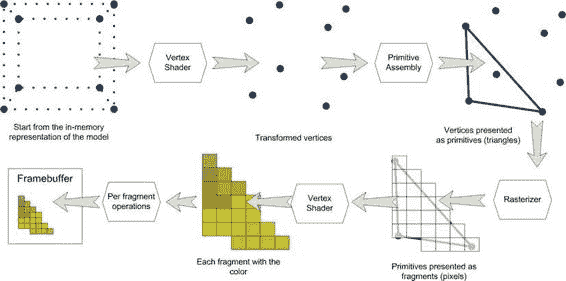

## 第 9 章：使用 WebGL

### OpenGL ES 2.0 渲染管线

OpenGL 渲染管线（简称“管线”）是将输入数据转换为你能在显示器上看到的二维渲染图像的过程。每次需要渲染模型时，你都会经历同样的一系列步骤——其中一些步骤是“固定的”，另一些则是“可编程的”。

理解这一过程极为重要，不仅对 WebGL 如此，对整体的 3D 图形编程亦是如此，因为它是最基础的概念之一。首先，请看图 9-1，该图展示了管线的各个阶段。虽然它是对幕后真实情况的一种简化表示，但足以让你对这一过程有一个鸟瞰式的理解。

**图 9-1.** *OpenGL ES 2.0 管线*

管线的输入是渲染模型所需的一切数据——原始模型的顶点位置、颜色、光源的位置与属性、纹理、方向、缩放、视口属性等。这些数据会输入到一个称为**顶点着色器**的程序中。

顶点着色器会为每个顶点运行一次。它的任务是确定顶点在屏幕上的投影（请记住，在第 8 章中，我们是手动通过矩阵乘法来实现的）。换句话说，它的主要任务是为接收到的每个顶点返回坐标。除了这个简单的任务，它还能进行各种其他有用的计算——例如，在给定多个不同类型光源的情况下，确定最终的光照颜色和强度。顶点着色器甚至可以自行变换几何体，例如将一个简单的线框变成飘扬的旗帜，或者实现液体物理模拟。

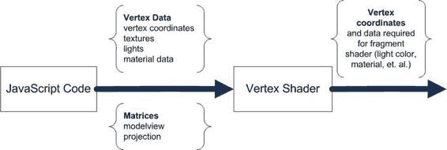


可能性是无限的，而着色器非常重要的一点是，它们在经过此类数学运算优化的 **GPU**（如果可用）上执行。换句话说，着色器的工作速度比 JavaScript 变换快得多。我们将在本章下一节学习如何编写简单的着色器。图 9-2 显示了 WebGL 渲染过程的第一步——将数据传递给着色器。

**图 9-2.** *在 WebGL 程序的第一步中，渲染模型所需的数据被传递给顶点着色器。顶点着色器变换顶点并返回坐标。*

接下来，顶点的坐标被组装成**图元**——也就是三角形。如前所述，还有其他类型的图元，但本章我们只处理三角形。然后，每个三角形被表示为一系列像素。这个过程称为**光栅化**。你无法控制这些步骤。

随后，像素数组被传递到**片段着色器**中，该着色器需要你自行编写。片段着色器会为三角形的每个像素执行一次，其任务是指示该像素的最终颜色。带有颜色和深度信息的像素会再经过一些变换，最终显示在屏幕上。该过程的第二部分如图 9-3 所示。

**图 9-3.** *在渲染过程的第二部分中，从顶点着色器接收的数据被插值后传递给片段着色器。片段着色器输出像素颜色。*

整个过程可能看起来有些复杂——确实，这超出了


`just ctx.drawRect()`——但它能让你对渲染细节拥有更显著的控制。实际上，创建一个 WebGL 程序只需三个组件：模型与环境数据、顶点着色器以及片段着色器。

## 第 9 章：使用 WebGL

让我们从第一步开始：获取几何数据并将其发送到管线。

### 使用缓冲

显卡对 JavaScript 或浏览器一无所知，因此你不能直接将 JavaScript 对象送入渲染管线。数据必须转换为适合图形硬件的内部格式。在 WebGL 中，我们必须创建缓冲。

`Buffer` 的工作方式类似于 JavaScript 中的数组，不同之处在于它们存储在 JavaScript 引擎之外，并且你无法直接控制它们。你将渲染所需的数据加载到单独的缓冲中：顶点坐标、面列表、顶点颜色或纹理坐标。具体加载什么取决于你的程序。数据加载完成后，你可以告诉 WebGL 如何处理这些数据。`Buffer` 是在脚本与管线之间传递信息的主要方式，因此理解其工作原理至关重要。

你需要做的第一件事是声明新的缓冲：

```javascript
var vertexBuffer = gl.createBuffer();
```

`vertexBuffer` 就像一个指向其他地方（例如显卡内存中）实际创建的缓冲的指针。在 WebGL 中，所有与缓冲相关的操作都是针对当前活动缓冲执行的。例如，要上传几何数据，我们首先必须激活一个缓冲：

```javascript
gl.bindBuffer(gl.ARRAY_BUFFER, vertexBuffer);
```

第一个参数是缓冲类型。WebGL 中有两种类型的缓冲：

- `gl.ARRAY_BUFFER`：存储数据本身的缓冲（例如，顶点坐标或顶点颜色）。
- `gl.ELEMENT_ARRAY_BUFFER`：存储对其他数组中元素引用的数组——通常是对存储顶点数据的 `ARRAY_BUFFER` 的引用。例如，我们需要指定三个顶点来描述 3D 模型的一个面。由于顶点已被存储，无需复制其坐标并创建另一个包含相同数据的缓冲。只需知道顶点在另一个缓冲中的索引即可，无需知道它们在空间中的实际坐标。这就是 `ELEMENT_ARRAY_BUFFER` 的作用。

现在缓冲已准备好接收数据：

```javascript
gl.bufferData(gl.ARRAY_BUFFER, new Float32Array(model.vertices), gl.STATIC_DRAW);
```

第一个参数是缓冲类型。第二个参数将 `model.vertices` 数组包装成一个名为 `Float32Array` 的 JavaScript 对象。第三个参数 `gl.STATIC_DRAW` 作为数据使用方式的提示。`STATIC_DRAW` 表示数据不会改变。

**注意：** `Float32Array` 是类型化数组 API 的一部分——这是迈向使用 JavaScript 更好地处理二进制和类型化数据的一步。你可以在 MDN 页面 https://developer.mozilla.org/en/JavaScript_typed_arrays 上找到关于此 API 的更多信息。

让我们准备立方体的两个缓冲（顶点缓冲和索引缓冲），如清单 9-4 所示。

**清单 9-4.** *为 WebGL 准备缓冲*

```javascript
function initModel(model) {
  // 顶点缓冲
  model.vertexBuffer = gl.createBuffer();
  gl.bindBuffer(gl.ARRAY_BUFFER, model.vertexBuffer);
  gl.bufferData(gl.ARRAY_BUFFER, new Float32Array(model.vertices), gl.STATIC_DRAW);

  // 面缓冲
  model.faceBuffer = gl.createBuffer();
  gl.bindBuffer(gl.ELEMENT_ARRAY_BUFFER, model.faceBuffer);
  gl.bufferData(gl.ELEMENT_ARRAY_BUFFER, new Uint16Array(model.faces), gl.STATIC_DRAW);
}
```

这种初始化只执行一次——在程序启动时或首次使用几何数据之前。一旦以这种方式创建，缓冲就可与着色器一起使用，在屏幕上显示立方体。

### 着色器与 GLSL

着色器是 WebGL 学习曲线中最复杂的部分。有两个原因：（1）着色器是用自己的语言编写的，这种语言看起来更像


#### 关于 GLSL 的简介

与 C 语言相比，JavaScript 更像 C，并且 (2) 调试它们相当困难。让我们从查看最简单的顶点着色器代码开始，该代码计算点到屏幕的投影（参见清单 9-5）。

**清单 9-5.** *最简单的顶点着色器*

```glsl
attribute vec3 aPos;
uniform mat4 uMVMatrix;
uniform mat4 uPMatrix;

void main(void) {
    gl_Position = uPMatrix * uMVMatrix * vec4(aPos, 1.0);
}
```

直观地看，这个程序的工作原理很清晰：

- 着色器从外部世界接收三个参数：`aPos`、`uMVMatrix` 和 `uPMatrix`。
- 矩阵的类型是 4×4 矩阵，`aPos` 的类型是三维向量。
- 我们通过添加 `1.0`，从三维向量创建一个四维向量。
- 着色器将两个矩阵相乘，然后将结果与向量相乘。这看起来很像点到屏幕的投影。从数学角度来看，这与第 8 章中的代码完全相同。
- 结果随后被赋值给 `gl_Position`。

如果你之前用过 C 语言，这段代码应该让你感觉更熟悉。当然，你不能仅凭直觉编写自己的着色器。然而，在本章中，我们将只描述该语言的基本概念。如果你对更深入的细节感兴趣，请参考 GLSL 规范或更高级的着色器示例。

**注意：** 用于 WebGL 的 GLSL 语言完整规范可在 Khronos Group 网站上获取，网址为 [www.khronos.org/registry/gles/specs/2.0/GLSL_ES_Specification_1.0.17.pdf](http://www.khronos.org/registry/gles/specs/2.0/GLSL_ES_Specification_1.0.17.pdf)。

GLSL 是一种编程语言，就像 JavaScript、PHP 或 C 一样，但与你见过的大多数语言不同，它不是为编写 Web 服务器或数据库等通用任务而设计的。GLSL 专门用于 3D 图形操作。我们需要它的基础知识来编写 WebGL 程序，所以让我们从每种语言中最小的构建块开始：变量和数据类型。

#### 数据类型

与 JavaScript 不同，GLSL 是一种强类型的静态语言。这意味着每个变量都有自己的类型，该类型在程序执行期间不会改变。例如，以下代码行：

```glsl
int x = 1;
```

声明了整型变量 `x` 的初始值为 `1`。在下一行或程序的任何其他位置，不可能将浮点值赋给 `x`。一旦声明，变量的类型就不能改变。严格类型的概念对于使用过 C 或 Java 等语言的人来说应该很熟悉。表 9-1 显示了最常见的 GLSL 类型。

**表 9-1.** GLSL 中的类型

| 类型 | 示例值 | 描述 |
| --- | --- | --- |
| `void` | -- | 通常是函数的返回值。意思是“没有返回任何内容。” |
| `int` | `2`, `-1`, `0` | 整数，无浮点值。 |
| `float` | `1.2`, `0.3`, `.4`, `-5.2` | 浮点值。 |
| `bool` | `true`, `false` | 布尔值——`true` 或 `false`。 |
| `vec2`, `vec3`, `vec4` | `vec2 v = vec2(0.0, 0.0)`<br>`vec3 v3 = vec3(v, -1.0)` | 2、3、4 分量向量。可以从数字或其他向量构造。 |
| `mat2`, `mat3`, `mat4` | `mat2 m;`<br>`m[0] = vec2(1.0, 1.0);`<br>`m[1] = vec2(1.0, 1.0);` | 通常从 JavaScript 传递，示例显示用 `1.0` 填充的矩阵。矩阵总是包含浮点值。 |
| `sampler2D`, `samplerCube` | | 用于纹理。 |

现在你可以重新阅读清单 9-5 中着色器程序的部分，以确定变量的类型。你还会注意到 GLSL 支持常见的矩阵运算。你可以做矩阵乘矩阵，或矩阵乘向量，并得到有效的结果。无需在着色器中手动实现矩阵运算。

变量定义中还有另一个组成部分：修饰符，如 `attribute` 和 `uniform`。变量的这个属性称为存储限定符。它可以是表 9-2 中所示的任何一个限定符。

**表 9-2.** GLSL 中的存储限定符

| 限定符 | 示例 | 描述 |
| --- | --- | --- |
| 没有限定符 | `int a` | 常规变量或函数参数。 |
| `const` | `const int a = 1;` | 常量。 |


##### GLSL 存储限定符

###### 常量

`Constants`，其值不会改变。

###### uniform

`uniform mat4 uMVMatrix;` —— 从 JavaScript 传递到着色器。`uniform` 值在不同顶点之间不会改变；例如，由于投影矩阵对每个顶点都相同，因此它是统一的。另一个 `uniform` 的例子是光照颜色。`uniform` 不会在着色器内部初始化，因为它们的值来自 JavaScript。

###### attribute

`attribute vec3 aPos;` —— 逐顶点数据，可以在不同顶点之间变化；例如，顶点坐标或颜色可能对每个顶点不同。`attribute` 是将数据从 JavaScript 传递到顶点着色器的方式。

`attribute vec3 aNormal;`  
`attribute vec3 aColor;`

###### varying

`varying vec2 vTexCoord;` —— 变量提供了一种将数据从顶点着色器传递到片段着色器的方式。通过 `varying` 传递的值在到达片段着色器之前会被插值（本章后续将详细介绍）。

`varying vec3 vColor;`

为了更好地理解存储限定符如何影响变量的行为，图 9-4 展示了数据如何注入着色器，以及它们之后如何交换数据。如您所见，JavaScript 只能设置 `attribute`（当需要逐顶点数据时）和 `uniform`（当数据对整个顶点集合相同时）。顶点着色器可以使用 `attribute` 和 `uniform` 将数据传递给片段着色器。片段着色器可以有它自己的 `uniform`，但没有 `attribute`，因为它不需要关于特定顶点的信息。

``

**第九章：使用 WebGL**

**图 9-4.** *GLSL 变量的存储限定符以及它们在 WebGL 各层之间的传输方式：JavaScript、顶点着色器和片段着色器。*

现在您可以阅读完整的顶点着色器。让我们再次查看代码。

```
attribute vec3 aPos;
uniform mat4 uMVMatrix;
uniform mat4 uPMatrix;

void main(void) {
    gl_Position = uPMatrix * uMVMatrix * vec4(aPos, 1.0);
}
```

该着色器定义了一个 `attribute` —— `aPos`，它存储当前顶点的位置。它还有两个矩阵 `uniform` —— 一个用于模型视图矩阵，一个用于投影矩阵。该着色器没有任何 `varying`，因此它不会向片段着色器传递任何数据。

#### 操作与函数

在操作方面，GLSL 的工作原理与大多数编程语言类似。以下是一些典型结构的例子。

`if-else`:

```
if (shininess != 0.0) {
    // 对光亮表面进行计算
} else {
    // 否则
}
```

`for` 循环:

```
for (int i = 0; i < limit; i++) {
    // 在循环中执行操作
}
```

`while` 和 `do-while` 循环:

```
while (value < limit) {
    // 循环体
}

do {
    // 循环体
} while (value > 0);
```

着色器的入口点是一个名为 `main()` 的函数。它不接受任何参数，也不返回任何值。每个着色器都必须有一个像示例代码中那样声明的 `main()` 函数。函数的结果被写入一个魔法变量。在片段着色器中，它被称为 `gl_Position`。

对于像本章中这样的简单示例，我们将所有代码放在 `main` 函数中。但是，为了方便起见，您可以定义自己的函数。关于函数语法的深入解释，请参考本章前面提到的 GLSL 规范的第 6.1.1 节。以下是一个简单函数的示例：

```
float transform(float t) {
    return sin(t * t);
}
```

GLSL 拥有大量用于几何和矩阵计算的内置函数。表 9-3 展示了最常用的 GLSL 函数。

**表 9-3.** *GLSL 程序中最常用的函数*

| 函数名 | 描述 |
| :--- | :--- |
| `sin`，`cos`，`tan`，`asin`，`acos`，`atan`，`radians`，`degrees` | 通用三角函数。 |
| `abs`，`sign`，`floor`，`ceil`，`fract`，`mod`，`min`，`max`，`clamp`，`pow`，`exp`，`log`，`exp2`，`log2`，`sqrt`，`mix` | 通用数学函数。 |
| `length`，`distance`，`dot`，`cross`，`normalize`，`faceforward`，`reflect`，`refract` | 几何函数，主要用于向量。 |
| `equal`，`notEqual`，`lessThan`，`lessThanEqual`，`greaterThan`，`greaterThanEqual`，`any`，`all` | 向量逐分量函数（应用于两个向量的每个分量）。 |


`not`

`texture2D`、`texture2DProj`、`texture2DLod`、`texture2DProjLod`

纹理查找函数。

这些函数名不言自明，除了与纹理相关的那些。我们将在本章稍后讨论它们。

如你所见，`GLSL` 是一门相对较小且专注于数学的语言。如果你花更多时间去探索它，你会发现它是用于 3D 渲染的强大工具。如果你现在还不是很熟悉它，请不要担心。本节旨在让你对这门语言有一个大致的了解。通过跟随本章的示例并对着色器进行实践，你将更好地理解它。

在本节中，我们一直在使用顶点着色器。让我们来看一个“Hello World”片段着色器的示例（见清单 9-6）。

**清单 9-6.** 最简单的片段着色器，使每个像素变为白色

```
precision mediump float;

void main(void) {
    gl_FragColor = vec4(1.0, 1.0, 1.0, 1.0);
}
```

对于每个给定的像素，它返回相同的颜色——白色。第一行看起来是新的。它定义了着色器中浮点值的默认精度。深入探讨这具体意味着什么并没有太大意义，但中等精度对于着色器的任务来说已经足够了。

**注意：** 更多关于精度的信息，请参阅 `GLSL` 规范，`www.khronos.org/registry/gles/specs/2.0/GLSL_ES_Specification_1.0.17.pdf`，第 4.5 节，“精度和精度限定符”。

**基本示例：渲染一个 3D 立方体**

现在，我们已经掌握了所有必要的知识来组装一个能够输出内容的可运行的 `WebGL` 程序。就像在第 8 章中一样，我们将在屏幕上渲染一个立方体。本节的目标是理解 `WebGL` 脚本的不同部分如何协同工作。我们将学习如何编译和链接着色器，配置渲染管线，如何将数据加载到管线中，并绘制一个立方体。

**在网页中使用着色器**

要在程序中使用着色器，你必须执行几个步骤：编译着色器，将一个顶点着色器和一个片段着色器组合成程序，链接它，并告诉 `WebGL` 在管线中使用它。在 `JavaScript` 代码内部，着色器的源代码作为简单的字符串存储，如清单 9-7 所示。

**清单 9-7.** 将着色器代码保存到 JavaScript 字符串中

```
var vertexShaderSource =
    "attribute vec3 aPos;" +
    "uniform mat4 uMVMatrix;" +
    "uniform mat4 uPMatrix;" +
    "void main(void) {" +
    "    gl_Position = uPMatrix * uMVMatrix * vec4(aPos, 1.0);" +
    "}";

var fragmentShaderSource =
    "precision mediump float;" +
    "void main(void) {" +
    "    gl_FragColor = vec4(1.0, 1.0, 1.0, 1.0);" +
    "}";
```

这并不是管理它们的最佳方式。实际上，这种方法远非完美：以一种语言编写的代码作为字符串保存在另一种语言中，难以管理、阅读和理解。当然，你不必在正式产品中这样做。例如，你可以将代码保存在纯文本文件中，通过 `XHR` 调用加载它，然后读取内容。你也可以创建一个着色器库，并将其保存为带有一些额外描述和元信息的 `XML` 文件。如何管理它们完全取决于你。只需记住，最终你需要包含源代码的 `JavaScript` 字符串才能编译着色器。

当源代码编写完毕并准备好后，执行清单 9-8 中的代码。

**清单 9-8.** 编译顶点着色器

```
var vertexShader = gl.createShader(gl.VERTEX_SHADER);
gl.shaderSource(vertexShader, source);
gl.compileShader(vertexShader);
if (!gl.getShaderParameter(vertexShader, gl.COMPILE_STATUS)) {
    // Something went wrong
    alert(gl.getShaderInfoLog(vertexShader));
}
```

这段代码创建了着色器对象，加载了源代码，并尝试编译它。然后，它检查编译状态，如果有错误，则向用户显示（不要忘记在正式产品构建中关闭 `alert` 弹窗）。该过程


创建片段着色器的过程与此相同，只是着色器类型是`gl.FRAGMENT_SHADER`而不是`gl.VERTEX_SHADER`。

现在，您已将两个着色器编译完毕，需要将它们组合成一个着色器程序，即可以在管线中使用的单一单元（参见清单 9-9）。

**清单 9-9.** *从两个已编译的着色器创建着色器程序*

```
var shaderProgram = gl.createProgram();
gl.attachShader(shaderProgram, vertexShader);
gl.attachShader(shaderProgram, fragmentShader);
gl.linkProgram(shaderProgram);
if (!gl.getProgramParameter(shaderProgram, gl.LINK_STATUS)) {
    alert("Error initializing shaders");
}
gl.useProgram(shaderProgram);
```

`WebGL`使用我们创建的两个着色器来渲染几何体。第一个着色器计算顶点在屏幕上的投影，第二个着色器用纯白色填充立方体的每个像素。下一步是获取程序内部参数的位置，以便稍后从`JavaScript`代码中传入它们：

```
var pMatrixUniform = gl.getUniformLocation(shaderProgram, "uPMatrix");
var mvMatrixUniform = gl.getUniformLocation(shaderProgram, "uMVMatrix");
```

最后，告诉`WebGL`着色器程序拥有顶点数据的属性（参见清单 9-10）。该变量稍后用于设置属性的值。

**清单 9-10.** *处理着色器的属性*

```
var vertexPositionAttribute = gl.getAttribLocation(shaderProgram, "aPos");
gl.enableVertexAttribArray(vertexPositionAttribute);
```

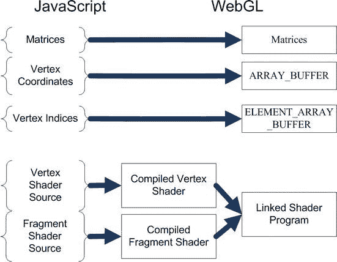

第 9 章：使用 WebGL

**375**

在继续之前，让我们回顾一下`WebGL`程序的组成部分。它们如图 9-5 所示。

**图 9-5.** *数据从 JavaScript 到 WebGL 的转换*

现在，`WebGL`和程序都已准备好接收几何体并将其渲染到屏幕上。

### 渲染 Hello World

现在所有组件都已就绪，我们可以开始渲染了。渲染屏幕的函数名为`drawScene()`（参见清单 9-11）。它的任务是使用准备好的组件并将其传递给`WebGL`。这个函数并不执行实际的渲染，它只将数据传递到管线中。渲染由`WebGL`实现执行——无论是通过显卡还是在没有显卡时通过软件模拟器执行。

**清单 9-11.** *绘制立方体：`drawScene` 是执行渲染的主函数*

```
function drawScene() {
    gl.viewport(0, 0, width, height);
    gl.clear(gl.COLOR_BUFFER_BIT | gl.DEPTH_BUFFER_BIT);
    mat4.perspective(45, width / height, 0.1, 100.0, projectionMatrix);
    // 重置 modelView 矩阵
    mat4.identity(modelViewMatrix);
    // 更新 modelView 矩阵，“移动”模型到正确位置
    mat4.translate(modelViewMatrix, [model.x, model.y, model.z]);
    // 更新旋转
    if (model.rx)
        mat4.rotateX(modelViewMatrix, model.rx);
    if (model.ry)
        mat4.rotateY(modelViewMatrix, model.ry);
    if (model.rz)
        mat4.rotateZ(modelViewMatrix, model.rz);
    // 将投影矩阵作为 uniform 传递给程序
    gl.uniformMatrix4fv(pMatrixUniform, false, projectionMatrix);
    // 将 modelView 矩阵作为 uniform 传递给程序
    gl.uniformMatrix4fv(mvMatrixUniform, false, modelViewMatrix);
    // 告诉 WebGL 当前活动缓冲区是 vertexBuffer
    gl.bindBuffer(gl.ARRAY_BUFFER, model.vertexBuffer);
    // 将活动缓冲区的元素作为 "aPos" 属性的值传递
    gl.vertexAttribPointer(vertexPositionAttribute, 3, gl.FLOAT, false, 0, 0);
    // "激活" faceBuffer
    gl.bindBuffer(gl.ELEMENT_ARRAY_BUFFER, model.faceBuffer);
    // 使用 faceBuffer 绘制总共 model.faces.length 个三角形
    // 缓冲区中的每个元素指向 vertexBuffer 中的顶点
    gl.drawElements(gl.TRIANGLES, model.faces.length, gl.UNSIGNED_SHORT, 0);
    // 管线已启动，现在将渲染立方体
}
```

现在，您已经拥有启动 Hello World 所需的一切。让我们回顾一下典型`WebGL`应用程序中必须执行的步骤：

1.  加载几何体及相关数据，如顶点颜色、法线等。
2.  将几何体数据传递给`WebGL`并接收缓冲区对象。


3.  加载片段着色器和顶点着色器的源代码。
4.  编译两个着色器，并确保没有错误。
5.  创建着色器程序并链接它。确保仍然没有错误。
6.  通过名称获取程序输入参数的位置。
7.  更新`modelViewMatrix`：设置模型的大小、位置和旋转。
8.  将矩阵和缓冲区与程序参数关联。
9.  执行`gl.drawElements()`以启动管线并渲染图形。
10. 对场景中的每个模型重复最后四个步骤。如果需要，更换着色器程序。

是的，这听起来像驾驶喷气式客机前要检查的清单。幸运的是，大多数步骤很容易隔离到单独的函数中，然后暂时忘记它们。清单 9-12 显示了 Hello World 应用程序的源代码，该应用程序在屏幕上渲染一个没有纹理或光照的白色 3D 立方体。为节省空间，注释已尽可能删除，部分代码被隔离到函数中。完整源代码可在本章材料中找到，文件名为`02.basic.html`。

**清单 9-12.** *WebGL 中的 Hello World 示例*

```html
<!DOCTYPE html>
<html lang="en">
<head>
    <!—regular meta and styles -->
    <script src="js/gl-matrix.js"></script>
    <!-- The geometry data of the cube -->
    <script src="js/geometry.js"></script>
    <script>
        // Canvas object
        var canvas;
        // The WebGL context
        var gl;
        // The only shader program that we'll use
        var shaderProgram;
        // Projection and modelview matrices
        var modelViewMatrix = mat4.create();
        var projectionMatrix = mat4.create();
        // Location of parameters in shader program
        var pMatrixUniform;
        var mvMatrixUniform;
        var vertexPositionAttribute;

        var vertexShaderSource = /* vertex source stripped, see Listing 9-7 */
        var fragmentShaderSource = /* fragment source stripped, see Listing 9-7 */

        function getWebGLContext(canvas) {
            /* Return the WebGL context as in Listing 9-1 */
        }

        function initShaders() {
            var fragmentShader = createShader(gl.FRAGMENT_SHADER, fragmentShaderSource);
            var vertexShader = createShader(gl.VERTEX_SHADER, vertexShaderSource);
            shaderProgram = gl.createProgram();
            gl.attachShader(shaderProgram, vertexShader);
            gl.attachShader(shaderProgram, fragmentShader);
            gl.linkProgram(shaderProgram);
            if (!gl.getProgramParameter(shaderProgram, gl.LINK_STATUS)) {
                alert("Error initializing shaders");
            }
            gl.useProgram(shaderProgram);
            vertexPositionAttribute = gl.getAttribLocation(shaderProgram, "aPos");
            gl.enableVertexAttribArray(vertexPositionAttribute);
            pMatrixUniform = gl.getUniformLocation(shaderProgram, "uPMatrix");
            mvMatrixUniform = gl.getUniformLocation(shaderProgram, "uMVMatrix");
        }

        function createShader(shaderType, source) {
            var shader = gl.createShader(shaderType);
            gl.shaderSource(shader, source);
            gl.compileShader(shader);
            if (!gl.getShaderParameter(shader, gl.COMPILE_STATUS)) {
                alert(gl.getShaderInfoLog(shader));
                return null;
            }
            return shader;
        }

        function initModel(model) {
            model.vertexBuffer = gl.createBuffer();
            gl.bindBuffer(gl.ARRAY_BUFFER, model.vertexBuffer);
            gl.bufferData(gl.ARRAY_BUFFER, new Float32Array(model.vertices), gl.STATIC_DRAW);
            model.faceBuffer = gl.createBuffer();
            gl.bindBuffer(gl.ELEMENT_ARRAY_BUFFER, model.faceBuffer);
            gl.bufferData(gl.ELEMENT_ARRAY_BUFFER, new Uint16Array(model.faces), gl.STATIC_DRAW);
        }

        function drawScene() {
            gl.viewport(0, 0, canvas.width, canvas.height);
            gl.clear(gl.COLOR_BUFFER_BIT | gl.DEPTH_BUFFER_BIT);
            mat4.perspective(45, canvas.width / canvas.height, 0.1, 100.0, projectionMatrix);
            mat4.identity(modelViewMatrix);
            drawModel(cube);
        }

        function drawModel(model) {
            mat4.translate(modelViewMatrix, [model.x, model.y, model.z]);
            if (model.rx)
                mat4.rotateX(modelViewMatrix, model.rx);
            if (model.ry)
                mat4.rotateY(modelViewMatrix, model.ry);
            if (model.rz)
                mat4.rotateZ(modelViewMatrix, model.rz);
            gl.uniformMatrix4fv(pMatrixUniform, false, projectionMatrix);
```


`gl.uniformMatrix4fv(mvMatrixUniform, false, modelViewMatrix);`

`gl.bindBuffer(gl.ARRAY_BUFFER, model.vertexBuffer);`

`gl.vertexAttribPointer(vertexPositionAttribute, 3, gl.FLOAT, false, 0, 0);`

`gl.bindBuffer(gl.ELEMENT_ARRAY_BUFFER, model.faceBuffer);`

`gl.drawElements(gl.TRIANGLES, model.faces.length, gl.UNSIGNED_SHORT, 0);`

}

`function init()` {

`canvas = initFullScreenCanvas("mainCanvas");`

`gl = getWebGLContext(canvas);`

`gl.clearColor(0.0, 0.0, 0.0, 1.0);`

`gl.enable(gl.DEPTH_TEST);`


## 第 9 章：使用 WebGL

`initShaders();`

`initModel(cube);`

`drawScene();`

}

`/* 其余代码与清单 9-1 相同 */`

`</script>`

`</head>`

`<body onload="init()">`

`<canvas id="mainCanvas" width="20px" height="20px"></canvas>`

`</body>`

`</html>`

当你将页面加载到浏览器中时，应该会看到如图 9-6 所示的结果：一个黑色背景上的白色立方体轮廓。

**图 9-6.** *WebGL Hello World 的结果*

### 探索 WebGL

恭喜你，你已经进入了本章最激动人心的部分。现在，我们将在基础的立方体示例基础上逐步改进，并在此过程中解释 WebGL 的各种可能性。第一个明显的改进是为每个面渲染其自身的颜色，而不仅仅是白色。由于单一颜色过于简单，难以给人留下深刻印象，我们还将添加纹理。最后，我们将探讨如何使用 WebGL 加载 3D 模型以及处理二进制数据的技术。

#### 颜色

我们从颜色开始。如你所知，像素的颜色是在片元着色器中确定的。在本节中，我们将修改片元着色器，使其为立方体的每个面涂上各自颜色。

有多种方法可以对颜色进行编码：你可以将颜色保存为单个整数、十六进制字符串、CSS 字符串或四个浮点值。鉴于片元着色器返回结果的方式，最后一种方法对我们来说最为方便：

`gl_FragColor = vec4(1.0, 1.0, 1.0, 1.0);`

向量中的四个参数分别是颜色的红色、绿色、蓝色和 Alpha 分量。

让我们在立方体对象中添加另一个数组，用于描述每个顶点的颜色（见清单 9-13）。由于整个立方体面具有相同的颜色，因此每个顶点的颜色值完全相同。

**清单 9-13.** *为立方体的每个顶点关联颜色*

```
var cube = {
    vertices: [
        // 前面
        -1.0, -1.0, 1.0,
        1.0, -1.0, 1.0,
        1.0, 1.0, 1.0,
        -1.0, 1.0, 1.0,
        // 后面
        -1.0, -1.0, -1.0,
        -1.0, 1.0, -1.0,
        1.0, 1.0, -1.0,
        1.0, -1.0, -1.0,
        // 其余顶点在此处
    ],
    // 每个面对应两个三角形
    faces: [
        // 面的定义如清单 9-2 所示
    ],
    colors: [
        // 前面
        0.5, 0.0, 0.0, 1.0,
        0.5, 0.0, 0.0, 1.0,
        0.5, 0.0, 0.0, 1.0,
        0.5, 0.0, 0.0, 1.0,
        // 后面
        0.0, 0.5, 0.0, 1.0,
        0.0, 0.5, 0.0, 1.0,
        0.0, 0.5, 0.0, 1.0,
        0.0, 0.5, 0.0, 1.0,
        // 类似地，为每个顶点分配颜色
    ],
    vertexBuffer: null,
    faceBuffer: null,
    colorBuffer: null,
    x: 0,
    y: 0,
    z: -10,
    rx: 0.4,
    ry: 1.2,
    rz: 0
};
```

回顾上一节中典型 WebGL 程序的清单，然后停下来思考一下。我们需要更新哪些步骤以包含这些额外信息？顶点着色器又将如何变化？

1.  片元着色器需要接受一个参数，该参数编码了顶点的颜色。由于颜色在顶点之间变化，因此该参数是`varying`类型的，并且这也是片元着色器从外部接受的唯一可变类型参数（参见图 9-4，该图展示了脚本和着色器之间如何交换信息）。
2.  片元着色器`varying`参数的唯一来源是顶点着色器。我们需要向顶点着色器添加一个额外的`attribute`参数，以便将其保存为`varying`类型并传递给片元着色器。
3.  新参数的数据以缓冲区形式提供——连同其他顶点信息（如坐标）一起。我们需要创建新的缓冲区，并用其向着色器发送颜色数据。

让我们从更新片元着色器开始。

#### 更新着色器


让我们再添加一个输入参数。其类型为`vec4`，因为颜色有四个分量；存储限定符为`varying`，因为颜色会随顶点变化而变化。更新后的着色器 GLSL 代码见代码清单 9-14。

**代码清单 9-14.** *支持颜色的片段着色器*

```
precision mediump float;
varying vec4 vColor;
void main(void) {
    gl_FragColor = vColor;
};
```

如你所见，这个片段着色器并未进行任何类型的处理。它只是将接收到的颜色赋值给`gl_FragColor`；不过，这对绘制矩形来说已经足够了。

在此情况下，顶点着色器扮演着参数入口点的角色：它无法对顶点颜色信息进行任何处理，因为设置像素颜色并非它的职责。它只是静默地将该值传递给片段着色器。为此，需要创建一个新的 attribute 来接收缓冲区中每个顶点的值，然后创建一个`varying`来将数据传递给片段着色器，最后将 attribute 的值赋给`varying`。颜色信息最终会进入片段着色器。顶点着色器的代码如代码清单 9-15 所示。

**代码清单 9-15.** *将颜色数据传递给片段着色器的顶点着色器*

```
attribute vec3 aPos;
attribute vec4 aCol;
uniform mat4 uMVMatrix;
uniform mat4 uPMatrix;
varying vec4 vColor;
void main(void) {
    gl_Position = uPMatrix * uMVMatrix * vec4(aPos, 1.0);
    vColor = aCol;
}
```

这样，片段着色器也能使用颜色了。你可以将`varying`变量视为顶点着色器的输出，同时也是片段着色器的输入。如果你对此原理还不太理解，请再看一下图 9-4。

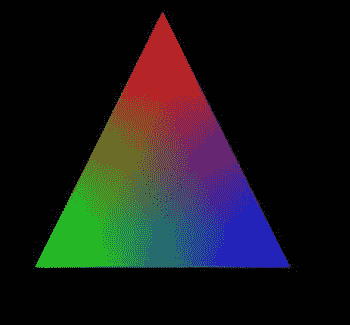

## 第 9 章：使用 WebGL

#### Varying 的工作原理

为什么要在同一程序中做这种无意义的赋值来传递值？好问题。这种复杂性的原因在于片段着色器无法直接访问顶点数据。

片段着色器处理的是像素，而像素属于整个面——而非单一顶点。如果面上的所有三个顶点颜色相同，那么生成的每个像素也应为该颜色。但若顶点颜色不同呢？像素的最终颜色取决于它离每个顶点的距离。因此得名`'varying'`——片段着色器接收到的确切值取决于像素在面内的位置。在顶点着色器中存入`varying`变量的所有内容都会用作插值的值。这一概念不仅适用于颜色，也适用于其他按顶点计算的值：法线、纹理坐标等。

为了更好地理解这个概念，请看图 9-7，它展示了 WebGL 如何处理`varying`变量的值。每个顶点被赋予一种颜色：纯红色、纯绿色和纯蓝色。

**图 9-7.** *三种颜色之间线性插值的结果*

每个像素的颜色是对各顶点值进行线性插值的结果。中间的像素呈现灰色，因为它是三种颜色（红、绿、蓝）等比例混合的结果。

#### 向顶点着色器传递颜色数据

最后一部分是更新主脚本。我们需要创建一个额外的缓冲区，用数据填充它，在着色器程序中注册一个新变量的位置，并将新缓冲区与该变量关联起来。实现此功能的代码无需进一步解释。

可参考代码清单 9-16，或使用本章源代码附带的完整版本（文件名`03.color.html`）。代码清单 9-16 经过精简，只显示变更的行。

**代码清单 9-16.** *使用纹理的演示程序更新版本*

```
function initShaders() {
    // 着色器按常规初始化，参见代码清单 9-12
    vertexPositionAttribute = gl.getAttribLocation(shaderProgram, "aPos");
    gl.enableVertexAttribArray(vertexPositionAttribute);
    vertexColorAttribute = gl.getAttribLocation(shaderProgram, "aCol");
    gl.enableVertexAttribArray(vertexColorAttribute);
```


```javascript
pMatrixUniform = gl.getUniformLocation(shaderProgram, "uPMatrix");

mvMatrixUniform = gl.getUniformLocation(shaderProgram, "uMVMatrix");
```

```javascript
function initModel(model) {
  model.vertexBuffer = gl.createBuffer();
  gl.bindBuffer(gl.ARRAY_BUFFER, model.vertexBuffer);
  gl.bufferData(gl.ARRAY_BUFFER, new Float32Array(model.vertices), gl.STATIC_DRAW);

  model.faceBuffer = gl.createBuffer();
  gl.bindBuffer(gl.ELEMENT_ARRAY_BUFFER, model.faceBuffer);
  gl.bufferData(gl.ELEMENT_ARRAY_BUFFER, new Uint16Array(model.faces), gl.STATIC_DRAW);

  model.colorBuffer = gl.createBuffer();
  gl.bindBuffer(gl.ARRAY_BUFFER, model.colorBuffer);
  gl.bufferData(gl.ARRAY_BUFFER, new Float32Array(model.colors), gl.STATIC_DRAW);
}
```

```javascript
function drawModel(model) {
  // 旋转并定位模型，如清单 9-12 所示
  gl.bindBuffer(gl.ARRAY_BUFFER, model.vertexBuffer);
  gl.vertexAttribPointer(vertexPositionAttribute, 3, gl.FLOAT, false, 0, 0);
  gl.bindBuffer(gl.ARRAY_BUFFER, model.colorBuffer);
  gl.vertexAttribPointer(vertexColorAttribute, 4, gl.FLOAT, false, 0, 0);
  gl.bindBuffer(gl.ELEMENT_ARRAY_BUFFER, model.faceBuffer);
  gl.drawElements(gl.TRIANGLES, model.faces.length, gl.UNSIGNED_SHORT, 0);
}
```

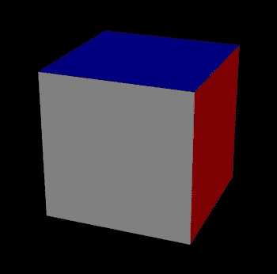

## 第 9 章：使用 WebGL

更新你的应用程序，或获取本书附带的代码。你的 WebGL 演示现在看起来应该好多了（见图 9-8）。

**图 9-8.** *为立方体的每个顶点添加颜色数据后的效果*

### 纹理

那么，纹理呢？从片段着色器的角度来看，纹理与纯色并没有太大区别。唯一的区别在于，着色器接收的是图像坐标，并从中提取颜色数据，而不是直接接收颜色值。

在深入代码之前，我们先来看看纹理是如何工作的。纹理是一张普通的图像：任何浏览器可以加载并显示在页面上的图片。模型的每个顶点都与图像上的某个点相关联，这个点被称为*纹理坐标*。片段着色器的工作是在给定插值后的纹理坐标和图像本身的情况下，找到该像素的颜色。请查看图 9-9，它说明了纹理贴图的工作原理。

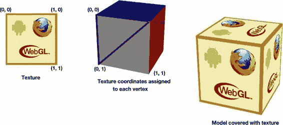

## 第 9 章：使用 WebGL

**387**

**图 9-9.** *纹理贴图：像素的颜色由纹理图像和纹理坐标共同决定。*

与颜色值一样，纹理坐标也是一个可变变量：它基于顶点的值进行插值。现在让我们为演示程序添加纹理。

#### 加载纹理

你已经熟悉了加载图像的过程；我们甚至有一个便捷的类来管理加载。我们稍微重写一下 `init()` 函数。它会等待纹理加载完成，然后再渲染场景（见清单 9-17）。

**清单 9-17.** *在渲染场景之前加载纹理*

```javascript
function init() {
  canvas = initFullScreenCanvas("mainCanvas");
  imageManager = new ImageManager();
  imageManager.load({"texture": "img/texture.png"}, initWebGL);
}

// 剩余的初始化工作转移到
// 一个单独的函数中
function initWebGL() {
  gl = getWebGLContext(canvas);
  gl.clearColor(1.0, 1.0, 1.0, 1.0);
  gl.enable(gl.DEPTH_TEST);
  initShaders();
  initModel(cube);
  drawScene();
}
```

## 第 9 章：使用 WebGL

#### 为 WebGL 使用准备纹理

现在图像已经加载并准备就绪。就像数组和缓冲区一样，在着色器中使用纹理之前，我们必须先准备好它。这段代码与初始化缓冲区的代码非常相似。将清单 9-18 中的代码行添加到 `initModel()` 函数的末尾。

**清单 9-18.** *为 WebGL 使用准备纹理*

```javascript
model.texture = gl.createTexture();
gl.bindTexture(gl.TEXTURE_2D, model.texture);
gl.pixelStorei(gl.UNPACK_FLIP_Y_WEBGL, true);
gl.texImage2D(gl.TEXTURE_2D, 0, gl.RGBA, gl.RGBA, gl.UNSIGNED_BYTE, imageManager.get("texture"));
gl.texParameteri(gl.TEXTURE_2D, gl.TEXTURE_MAG_FILTER, gl.LINEAR);
gl.texParameteri(gl.TEXTURE_2D, gl.TEXTURE_MIN_FILTER, gl.LINEAR);
```


纹理被创建后，会被标记为“当前活动”（`currently active`），随后所有与纹理相关的操作都将针对这个特定资源执行。  

第三行通过翻转`y`轴来标准化坐标。这一步是必需的，因为`WebGL`与图像中的坐标系存在差异。第三行将图像中的数据传输到纹理。最后两行设置了纹理的渲染策略，规定了当多个纹理像素匹配单个片段，或单个纹理像素匹配多个片段时应如何处理。换句话说，最后两行告诉程序当纹理过大或过小时该怎么做。`gl.LINEAR`指示使用最近的四个纹理元素的加权平均值。

#### 纹理坐标

我们需要为模型的每个顶点分配纹理坐标，并创建并初始化相应的缓冲区，以将这些数据传输到着色器。你已经知道如何操作（参见清单 9-19）。

**清单 9-19.** *为模型添加纹理坐标*

```
var cube = {

// 顶点和面的定义保持不变

textureCoords: [

// 正面

0.0, 0.0,

1.0, 0.0,

1.0, 1.0,

0.0, 1.0,

// 背面

1.0, 0.0,

1.0, 1.0,

0.0, 1.0,

0.0, 0.0,

// 为每个顶点设置纹理坐标

],

vertexBuffer: null,

faceBuffer: null,

colorBuffer: null,

textureCoordsBuffer: null,

texture: null,

// 位置、旋转及其他参数与之前相同

};

function initModel(model) {

// 代码未修改

// 为纹理坐标初始化一个额外的缓冲区

model.textureCoordsBuffer = gl.createBuffer();

gl.bindBuffer(gl.ARRAY_BUFFER, model.textureCoordsBuffer);

gl.bufferData(gl.ARRAY_BUFFER, new Float32Array(model.textureCoords),

gl.STATIC_DRAW);

}
```

纹理坐标是介于 0 和 1 之间的值，并非精确的像素坐标。这是一种相当便捷的方式——坐标不依赖于纹理的大小。你可以使用任意大小的纹理（例如 256×256、512×512、1024×1024 或任意尺寸），而无需修改代码。查找纹理中匹配像素的具体工作由 WebGL 负责。

#### 更新着色器

现在该更新着色器了。与颜色类似，纹理坐标是与顶点关联的值。你需要创建一个额外的 `varying` 变量，并将坐标传递给片段着色器（参见清单 9-20）。

**清单 9-20.** *将纹理坐标传递给片段着色器的顶点着色器*

```
attribute vec3 pos;

attribute vec2 aTex;

uniform mat4 uMVMatrix;

uniform mat4 uPMatrix;

varying vec2 vTex;

void main(void) {

gl_Position = uPMatrix * uMVMatrix * vec4(pos, 1.0);

vTex = aTex;

}
```

片段着色器接收坐标，但同时还需要图像数据来获取颜色。在 `GLSL` 中，有几个称为“`sampler`（采样器）”的特殊对象，它们类似于像素信息存储单元。你可以将采样器视为 `GLSL` 内部的图像。纹理不会随顶点变化，因此采样器是 `uniform` 类型的（参见清单 9-21）。

**清单 9-21.** *从纹理为像素分配颜色*

```
precision mediump float;

varying vec2 vTex;

uniform sampler2D uSampler;

void main(void) {

gl_FragColor = texture2D(uSampler, vTex);

}
```

如你所见，从纹理分配颜色非常简单。有一个内建函数 ——`texture2D()`—— 它接收采样器和纹理坐标，并返回匹配的颜色。

#### 将纹理数据传递给片段着色器

最后一步是注册新的属性（`aTex`）和新的 `uniform` 变量（`uSampler`），并将纹理数据传递给着色器程序（参见清单 9-22）。

**清单 9-22.** *将纹理数据传递给顶点着色器*

```
gl.activeTexture(gl.TEXTURE0);

gl.bindTexture(gl.TEXTURE_2D, model.texture);

gl.uniform1i(samplerUniform, 0);
```

最终呈现的是一个漂亮的纹理立方体，如图 9-10 所示。

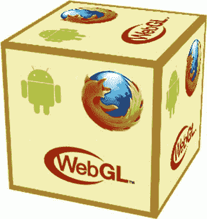

**图 9-10.** *带纹理的立方体*

文件 `04.texture.html` 是展示纹理立方体的代码最终版本。


[...] 与本章的源代码一同提供。

### 加载模型

立方体是一种基础 3D 形状，长期以来一直被用作“Hello World”式的示例。然而，在实际的 3D 演示或游戏中，立方体的用途相对有限。接下来，我们将学习如何在 WebGL 应用中使用其他 3D 模型。首先，我们会了解不同类型的 3D 模型以及相应的处理工具，然后学习如何将模型加载到你的应用中。

#### 3D 模型概述

3D 模型分为两种：高多边形（`hi-poly`）模型和低多边形（`low-poly`）模型。通常，`高多边形`模型用于静态渲染。例如，一个包含 10000 个三角形的古代花瓶模型看起来非常精美，但移动处理器无法以足够快的速度渲染它来用于游戏。`低多边形`模型则专为游戏设计，它们的多边形数量显著减少，专门为实时 3D 应用而创建。因此，你需要的显然是`低多边形`模型。

要在 WebGL 中显示任意 3D 模型，你至少需要顶点坐标和一个面数组。如果模型带有纹理，你还需要每个顶点的纹理坐标。最佳方案是将现有模型转换为 JSON 格式，并在脚本中使用它，就像我们使用立方体模型那样。随着 WebGL 的日益流行，已有多种工具可以实现这一转换。大多数工具会将模型从 Wavefront（`.obj`）或 Collada（`.dae`）格式转换为 JSON，因为这些格式在解析上最为简单。`OBJ`文件以纯文本形式存储数据，且元信息极少。`DAE`文件则是 XML 格式，因此将其转换为 JSON 等其他文本格式并不困难。有些游戏引擎甚至可以直接加载`DAE`模型，无需中间转换步骤。

如果你的模型不是 OBJ 或 DAE 格式怎么办？你可以使用 3D 编辑工具进行格式转换。`Blender` [(www.blender.org)](http://www.blender.org) 是一款免费的 3D 编辑器，拥有许多用于处理 3D 模型的自定义插件。图 9-11 展示了在 Blender 中加载的一个免费模型的截图。

**图 9-11.** *在 Blender 中加载的太空护卫舰*

在 Blender 的官方教程页面 [www.blender.org/education-help/](http://www.blender.org/education-help/) 上，你可以找到更多关于 Blender 的信息，以及如何使用它加载和转换 3D 模型。

有时，直接加载原始格式的模型比创建 JSON 表示要方便得多。原因之一在于生成文件的大小。一个以二进制格式（`MD2`）保存的角色模型大约只有 218 KB，而同一个模型转换为 JSON 后则达到 6 MB。即使对模型进行压缩，效果也不明显；压缩后的 JSON 文件仍然比原始二进制模型大十倍。

另一方面，在客户端解析二进制数据是一项相当繁重的操作，无论是在处理性能还是编码复杂程度上都是如此。这项任务被视为‘高级’任务，因为输入到 WebGL 的数据仍然必须是 JavaScript 数组形式；因此，要以自定义格式加载 3D 模型，你必须编写自己的解析器。

#### 处理二进制数据

在本节中，我将向你介绍一些处理二进制数据非常基础的技术。二进制文件可以存储各种信息：音乐、图片、数据库等等。有时，能够用 JavaScript 解析它们非常有用。

我们将以`MD2`文件解析器为例——这是 Quake II [(http://en.wikipedia.org/wiki/MD2_file_format)](http://en.wikipedia.org/wiki/MD2_file_format) 中使用的一种用于动画角色的旧格式。我们的目标并非深入研究该格式的具体细节，而是学习解析此类文件的一般原则。如果你对完整实现感兴趣，`MD2`解析器的源代码包含在本章的源代码中。

处理二进制数据的主要问题在于目标设备的内存 [...]


浏览器 JavaScript 引擎无法直接处理这类数据。目前还没有常规的方法可以从服务器加载类似 MD2 模型的数据并在客户端进行解析。`XHR（XMLHttpRequest）` 期望接收的是文本，而非字节流。

**注意：** XHR Level 2 调用支持二进制数据，但移动端浏览器尚未广泛支持。更多信息请参阅第 11 章。如果您不熟悉 `XHR`，建议先阅读第 11 章，然后再回到本节。

开发者经常使用一种笨拙的变通方法来克服这个限制。请查看代码清单 9-23。

**代码清单 9-23.** *通过 Ajax 调用接收未修改的二进制数据*
```javascript
var req = new XMLHttpRequest();
req.open('GET', "models/marine.md2", false);
// 覆盖 MIME 类型，此类字符集将阻止浏览器干扰字节
req.overrideMimeType('text/plain; charset=x-user-defined');
req.send(null);
var data = req.responseText;
```
这个字符集阻止了浏览器将响应视为纯文本并转换为常规 JavaScript 字符串。接下来，从这个字符串中提取字节数据并不困难：
```javascript
var byteValue = data.charCodeAt(offset) & 0xff;
```
这行代码的最后部分从字符编码中剥离了多余信息，仅保留从服务器接收的原始数字。某些数字可能包含多个字节；例如，两字节整数（通常称为“short”）或四字节浮点数。要读取此类数字，只需像代码清单 9-24 所示的那样，通过二进制移位操作组合字节即可。

**代码清单 9-24.** *读取包含多个字节的数字*
```javascript
var b0 = buf.charCodeAt(off) & 0xff;
var b1 = buf.charCodeAt(off+1) & 0xff;
var short = b0 + (b1 << 8);
```
有几个小型库可以为您处理所有繁琐的字节交换工作。我在 MD2 转换器中使用的库是 Brandon Jones 的 `BinaryFile.js`。`BinaryFile` 将 Ajax 响应作为输入，并隐藏了计算的细节。您的客户端代码类似于代码清单 9-25。

**代码清单 9-25.** *使用 BinaryFile.js 读取二进制数据*
```javascript
for (var i = 0; i < model.header.num_tris; i++) {
  vert.push([bf.readShort(), bf.readShort(), bf.readShort()]);
  tex.push([bf.readFloat(), bf.readFloat(), bf.readFloat()]);
}
```
使用这种技术，您可以向服务器请求模型，获取格式规范，并逐字节读取模型信息。

最终结果是：您可以在 WebGL 应用程序中使用自定义的二进制模型，并通过稍长的加载时间换取网络流量的节省。然而，通过移动网络加载数兆字节所花费的时间通常比处理模型所需的时间要多。

**总结**

在本章中，我们学习了如何创建 WebGL 应用程序。WebGL 是一个非常强大的工具，它允许您在网页上实现真正的（在可能的情况下）加速 3D 图形。

WebGL 是一个相对底层且复杂的 API。它需要对 3D 机制和 3D 可视化的数学原理有深入的理解。另一个复杂之处在于，要创建 WebGL 页面，您需要用 GLSL 语言编写两个称为着色器的程序。着色器的语言具有类似 C 的语法，并且是面向数学的（没有用于处理字符串或用户输入的函数，但有许多用于处理向量和矩阵的函数）。

WebGL 在移动设备上仍然不普及，因此本章仅对这个主题进行了非常简要的介绍。要制作包含动画、光照、材质、物理模拟、环境效果（如雾或雨）以及这个丰富 API 提供的众多其他可能性的完整 WebGL 应用程序，还有很多主题需要掌握。

在本章中，我们学习了如何初始化 WebGL、加载基本几何体、编写着色器、使用颜色和纹理、以及处理模型和二进制数据。由于 WebGL 学习曲线陡峭，最重要的建议是开始动手并让您的第一个演示程序运行起来。在您熟悉了基本原理之后，其他主题就会变得容易理解得多。

有几个更高级的 3D 引擎可以简化常见任务，例如加载模型、添加光照、添加纹理等。

WebGL 是一个广阔的话题。如果您想了解更多关于这个 API 的信息，以下网站将会非常有用：

*   [`learningwebgl.com`](http://learningwebgl.com): WebGL 课程和教程的集合，以及 WebGL 新闻和精彩实验的链接。
*   [www.khronos.org](http://www.khronos.org): Khronos Group 的官方网站。
*   [`mrdoob.github.com/three.js`](http://mrdoob.github.com/three.js): Three.js 的主页，这是一个基于 WebGL 的 3D 引擎，具有许多高级功能。

# 第 10 章 走向服务器端

你想知道你的朋友是不是一个幸运的游戏开发者吗？问问他最喜欢的编程语言或平台是什么。Java 爱好者很幸运：他们可以仅使用他们熟知的语言和工具（即 Java）来创作他们的杰作。他们不需要学习额外的知识就可以开始游戏开发工作。PHP 开发者的运气则稍差一些——他们喜欢的语言仅用于服务器端脚本，因此他们需要学习其他东西才能制作出出色的游戏客户端。他们也可以选择与 ActionScript 开发者合作，而后者则面临相反的问题：无法用他们喜欢的工具编写高效的服务器代码。

直到最近，JavaScript 开发者还完全不走运——他们不仅要学习服务器端语言来构建哪怕是最简单的网络游戏，还要处理浏览器中 DOM 引擎的不同实现。要在生产级产品中实现各项功能，所需的学习曲线和需要实施的变通方案数量令人望而生畏。

那是 JavaScript 游戏开发的黑暗时代。如今，那个时代已经过去，JavaScript 开发者成了最幸运的人。首先，当 canvas 出现后，我们摆脱了大多数由浏览器 DOM 错误引起的问题。事实证明，在 canvas 中绘制的一条线，在 IE、Chrome 和 Firefox 中的显示效果相同。此外，我们现在可以用我们最喜欢的语言编写服务器代码，这要归功于 Ryan Dahl，Node.js 的创造者——这个工具彻底改变了人们对 JavaScript 的思考方式。

在本章中，我们将学习如何高效地使用 Node.js 为我们的应用程序创建全面的服务器端支持。有很多情况都需要网络功能。即使是涉及与世界共享数据的最小的游戏功能也需要网络：高分榜或简单的游戏内聊天就是一个很好的例子，它说明了一个 JavaScript 应用程序需要超越 canvas 的功能。

在本章中，我们将编写最少的客户端 JavaScript；本章完全致力于服务器开发。此外，其中的内容显然不限于智能手机或平板电脑。您也可以将这些知识用于普通的桌面网站和应用程序。

在本章中，我们将学习以下内容：

*   如何安装 Node.js，以及如何编写和调试可以在服务器环境中执行的简单脚本
*   Node.js 程序是如何组织的
*   如何使用 NPM 发现和安装 Node.js 模块
*   如何使用 Express 框架为“四个球”游戏构建一个简单的服务器

**注意：** 在本章中，我将用“Node”指代 Node.js，为方便起见，我有时会将专门为 Node.js 编写的 JavaScript 文件称为“Node 脚本”。另外，我有时会使用“用 Node.js 读取文件”这样的表述，意思是指“用运行在 Node.js 上的 JavaScript 读取文件”。


# 温馨提示

在开始之前，有一点需要说明：Node.js 是一款快速演进的软件，其开源库也是如此。它们每天都在改进，为开发者带来更强大、更友好、更高效的软件。API 变化非常迅速。在撰写本章初稿到最终定稿的这段时间里，本文所述框架的多个部分已发生改变。原先的邮件发送框架已被弃用，取而代之的是更强大的框架，而 Node 本身的安装流程也简单了许多。

本章中的大部分代码仍能正常运行；但如果某些代码未能立即按预期工作，请查阅相关库的在线文档，特别是那些不符合你使用预期的库。此外，建议你时常访问作者的[页面](http://juriy.com)查看更新，并关注 Apress 网站上托管的源代码。我会尽力使代码保持最新，并列出所有必要的修改，以确保你的代码能与最新版本的库兼容。

## 第 10 章：走向服务器端

### Node.js 基础

Node.js ([`nodejs.org`](http://nodejs.org)) 的理念是将 JavaScript 的强大能力引入服务器端。正如我此前所述，Node.js 是一种工具，能让身为 Web 开发者的你，使用自己熟悉的语言编写代码。当然，这并非 Node.js 成为在线游戏开发首选的全部原因。在本节中，我们将介绍 Node.js 的基础知识。先从经典的 Hello World 程序开始，然后安装 Node，为编写自己的脚本做好准备。

#### 认识 Node.js

在深入探讨 Node.js 的内部机制之前，我们先来看看它究竟是什么，以及如何使用。本质上，Node.js 是一个小巧的命令行工具，能够运行 JavaScript 代码。为此，它使用了极其高效的 JavaScript 引擎——V8 ([`code.google.com/p/v8/`](http://code.google.com/p/v8/))，但与浏览器运行环境不同，它直接与操作系统交互，将其资源暴露给程序员。不再有移动 div 或改变按钮背景的操作。借助 Node.js，你可以完成所有常规桌面编程语言能做到的事情：打开和读取文件、使用套接字、构建 HTTP 服务器、下载图片、解析 XML、流式播放音频——一切皆有可能。

Node.js 绝对不是一个 Web 服务器。它更像一个以 JavaScript 为驱动的虚拟机，并将 HTTP 作为一等协议——这意味着它开箱即用，并得到 Node.js 的全面支持。如果你愿意，可以用 Node.js 编写一个 Web 服务器，但这并不代表你必须这么做。你也可以编写一个在媒体库中查找重复照片的工具，其中甚至不包含任何网络相关的指令。不过，在绝大多数情况下，你会使用 Node 来处理网络请求（无论是 HTTP 还是 TCP/IP），因为这才是其展现全部潜力的领域。

如果你和我一样，一定很想看看代码长什么样。那么，请看下面使用 Node.js 编写的著名 Hello World：

```
console.log("Hello World");
```

嘿，你还期待什么呢？它本就该如此简单！我知道这个例子不会让你兴奋，但我不想打破 Hello World 的老派传统。稍后我们将学习如何运行这个脚本。

接下来，在代码清单 10-1 中，我们来看一个更复杂的例子：编写一个向用户返回数据的 Web 服务器。

**代码清单 10-1.** *Node.js 脚本稍高级示例*

```
var http = require('http');

http.createServer(function (req, res) {
  res.writeHead(200, {'Content-Type': 'text/plain'});
  res.end('Hello World\n');
}).listen(1337, "127.0.0.1");
```

如果你不能完全理解这段代码，不必担心；本章剩余部分会带你熟悉它。你需要注意的核心点是，这是常规的 JavaScript 代码，如果你稍加思考，就能...


了解其工作原理。在第一行中，我们接收到`http`对象，然后在其上调用`createServer()`，并将函数作为参数传递。该函数的作用类似于常规浏览器中的事件监听器：它在某个特定事件发生时被调用。在这种情况下，触发调用的时间是用户发起的 HTTP 连接。

### 编程模型

Node.js 的哲学是尽可能在 I/O 操作中使用异步方式。这正是 Node 能够如此快速的原因：它节省了每微秒的时间，而常规服务器往往认为这种损耗是不可避免的。如果你有其他服务器端语言的经验，Node 脚本完全由回调组成，这可能会看起来有些奇怪。

最好通过一个代码示例来解释。清单 10-2 展示了一个 Node 脚本的代码，该脚本从文件系统读取文件并将输出打印到控制台：

```js
var fs = require('fs');

fs.readFile('some/file/here', function (err, data) {
  if (err)
    throw err;
  console.log(data);
});
```

其理念与清单 10-1 完全相同。你请求 Node.js 为你检索文件内容，并在操作完成时通知你的回调函数。

现在，将这段代码与清单 10-3 中执行完全相同任务的 PHP 片段进行比较。

**清单 10-3.** *执行相同文件读取及内容输出任务的 PHP 示例代码*

```php
<?php
$content = file_get_contents('some/file/here');
echo $content;
?>
```

当然，清单 10-3 看起来更简单一些。但这种简单性代价高昂。PHP 代码在读取文件时会阻塞脚本的执行：它会等待文件完全读取后，才继续执行第二行。那么，其他想要同时访问服务器的用户会怎样呢？他们会一直等待，直到文件读取操作完成。当然，在实际应用中，Web 服务器会创建大量线程，以便用户不必等待单个可用线程就绪。但这种模式有其局限性：创建和支持线程并非廉价操作。当更多用户向服务器请求页面时，它会创建更多线程，直到达到线程限制，或者服务器耗尽内存和 CPU 资源。

Node.js 的工作方式不同。一旦你请求文件数据，你就让脚本继续执行。你提供一个回调，当 I/O 操作完成时执行该回调，并释放服务器以处理下一个用户。换句话说，服务器线程在读取操作期间不会被阻塞。当文件被某个外部进程读取时，服务器同时还会服务另一个或两个用户的请求。一旦文件完全读取完毕，它会完成当前任务并调用你提供的回调。

图 10-1 展示了阻塞型服务器的典型流程。在此示例中，第一个请求导致服务器执行一个长时间运行的操作，例如读取大文件或查询数据库以获取复杂数据。该操作需要相当长的时间才能完成。其他请求——请求 2 和 3——处理速度非常快，它们的结果几乎立即返回给浏览器。

在图 10-1 所示的阻塞型服务器情况下，请求 2 和 3 必须等待服务器忙于执行长时间运行的操作，即使实际工作在别处完成（例如，在数据库软件中）。服务器只能在长时间运行的操作完成后才能响应，即使在此期间它处于空闲状态，没有执行任何有用的工作。

**图 10-1.** *阻塞型服务器流程*

Node.js 采用了不同的方法，如图 10-2 所示。当长时间运行的操作正在进行时，Node.js 可以服务其他请求。例如，它可以返回请求 2 和 3 的响应。当长时间运行的任务完成时，Node.js 调用注册的回调，脚本就可以服务结果了。


# 关于请求 1

**图 10-2.** *Node.js 流程。当长时间运行的请求在后台处理时，Node.js 会处理其他请求。*

丹·约克（Dan York）找到了一个很好的比喻来描述传统 IO 与异步 IO 之间的区别（`http://tinyurl.com/49wl5lk`）。他将传统 IO 比作快餐店的排队队伍。轮到你时，你点餐并等待订单完成。即使收银员此刻无事可做，只是等待厨房的订单送达，他也会被阻塞。当你和收银员都在等待订单时，其他顾客只能等你的订单处理完毕才能继续。创建大量线程就像增加更多收银员：这确实能加快处理速度，但这种解决方案不具备可扩展性，因为空间和预算有限。此外，问题本身并未真正解决——收银员站在原地，在等待厨房工作人员完成工作的过程中浪费时间。

在异步模型中，收银员会在你点餐后请你站到一旁，同时为另一位顾客服务。很可能下一位顾客想要一些非常简单的东西，比如一块已经烤好的松饼，这样收银员就能立即为这位顾客服务。最终，厨房会通知收银员你的订单已准备好。他完成当前顾客的服务后，再回头为你服务。此时他拿到了你所需的东西，并将其交给你。

看出区别了吗？在第二个例子中，收银员高效利用了每一分钟时间：当厨房工作人员制作汉堡时，他不会站在那里盯着你浪费时间——每一秒都被用来满足客户的需求。显然，在这个比喻中，客户是来自浏览器的请求，收银员是 Web 服务器线程，而厨房则是可能很快但需要花些时间完成的 IO 操作。

如果你已有服务端技术栈的编程经验，可能会觉得改变对代码结构的思维方式很困难——你习惯了同步模型，即操作按顺序依次执行。希望这个简要的解释能让你对概念更清晰一些。现在，让我们进入 Node.js 的安装环节。是时候尝试这个令人惊叹的工具了。

### 安装 Node.js

在编写任何实际 Node.js 代码之前，我们必须先安装它。有两个软件对开发至关重要，第一个就是 Node.js 本身。这是一个可执行文件，负责运行脚本并处理所有底层操作系统的复杂事务。第二部分是 NPM，即 Node.js 的包管理器。它是下载和安装 Node 附加包（如开发过程中所需的框架、工具和实用程序）的事实标准。

**注意：** Node.js 拥有非常活跃的社区，并且有大量的*模块*——你可以使用这些扩展来简化开发，从而不必每次都重新发明轮子。从 FTP 服务器和命令行解析器，到 PDF 生成和图像处理，这样的模块有数百个。本章中，我们也会用到其中一些模块。

Node.js 的安装相当简单：从 `http://nodejs.org/#download` 选择安装包（根据操作系统选择 Windows 或 Mac 版本），然后按照安装说明进行操作。更新 `PATH` 环境变量以指向目标目录（如果你不记得如何设置环境变量，请参考第 1 章的“安装 Java 开发工具包”）。我更喜欢创建一个名为 `NODE_HOME` 的额外变量，并在之后的 `PATH` 中引用它。

**注意：** 在我自己的系统中，我使用路径 `c:\apps` 来存放所有与开发相关的应用程序、工具和实用程序。例如，Node.js 位于 `c:\apps\node`。


```text
它比标准的 `Program Files` 更好用……因为名称简短且不含空格。它在 Windows 中也没有任何特殊处理，意味着安全限制问题更少。最后，它首字母是 "a"，在命令提示符中按下 Tab 键自动补全文件名时，它会成为第一个出现的文件夹。

完成上述操作后，打开命令提示符并输入：

```
node --version
```

如果一切正常，你应该能看到 `Node.js` 构建的版本号。对我而言，在撰写本文时，最新稳定版本是 `v0.8.3`。

`Node.js` 的包管理器 `NPM` 也安装在同一个目录中。输入以下命令检查 `NPM` 是否可用：

```
npm --version
```

按下回车后，你应该能看到 `NPM` 的版本号。在撰写本文时，我看到的版本是 `1.1.43`。

为了尝试真正的脚本，请将 Hello World 示例代码复制到名为 `hello.js` 的文件中，然后输入以下命令行：

```
node hello.js
```

如果一切设置正确，Node 将在控制台中输出问候语。

这个第一个但重要的示例位于名为 `01.hello_world` 的文件夹中。你可以与本章的其他材料一起找到它。

### 调试 Node 脚本

有时我们都会犯错，因此拥有快速发现并修复错误的工具非常棒。`IntelliJ Idea` 和 `WebStorm` 都拥有由 Maxim Mossienko 开发的出色插件，它允许你直接从 IDE 调试 JavaScript。

该插件添加了额外的运行配置类型：`Node JS`、`Node JS Remote Debug` 以及用于运行单元测试的 `Nodeunit`。创建你自己的运行配置，并提供 `Node` 可执行文件和 "main" 应用程序文件的路径。其余参数为可选。图 10-3 显示了 `WebStorm` IDE 中 `Node JS` 插件的配置界面。


第 10 章：转向服务端

**405**

**图 10-3.** *用于调试 Node.js 脚本的 IntelliJ 模块*

现在，你可以在代码中设置几个断点，然后点击 Debug 按钮。一旦执行到某个断点，程序就会暂停。你将有机会检查变量的值、设置监视，并执行任何你通常为让代码正常工作而进行的操作。图 10-4 显示了一个示例 `Node.js` 应用程序的开放调试会话。

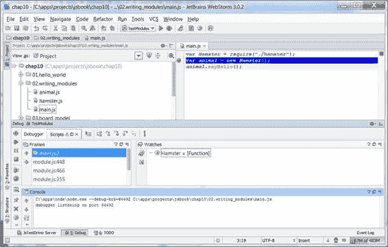

第 10 章：转向服务端

**图 10-4.** *WebStorm 中的调试会话*

如果你还没有在 `IntelliJ Idea` 或 `WebStorm` 中进行过调试，其过程与 WebKit 浏览器的 Web 开发者工具几乎相同。如果你想了解更多关于在 Idea 中进行调试的信息，可以查阅 [`wiki.jetbrains.net/intellij/Debugging_JavaScript_with_IntelliJ_IDEA`](http://wiki.jetbrains.net/intellij/Debugging_JavaScript_with_IntelliJ_IDEA)，这是一个不错的入门文档。它介绍了常规浏览器脚本的调试，但 `Node.js` 的工作方式完全相同。

`Eclipse` 目前还没有专用的 Node 插件，但由于 Node 使用了 V8 引擎，因此可以在 `Eclipse` 中使用 V8 调试器来配合 Node 工作。具体设置方法详见 [`github.com/joyent/node/wiki/Using-Eclipse-as-Node-Applications-Debugger`](https://github.com/joyent/node/wiki/Using-Eclipse-as-Node-Applications-Debugger)。

在进入下一节之前，还有一点关于 Node 需要说明。它的发展速度极快。如果你想用这个工具制作一款多人游戏，请养成每一两周关注一下新动态的习惯。整个 Node 生态系统以极其动态的节奏运转。当你还在思考如何解决某个问题时，可能别人已经发布了解决该问题的工具。

既然你已经知道如何设置和调试 Node，那么就可以准备运行你的第一个真正的脚本了。

第 10 章：转向服务端

**407**

### 编写 Node.js 脚本

在本节中，我们将学习如何编写超越 Hello World 的 `Node.js` 脚本。大多数 `Node.js` 程序由模块组成——这些模块是以特定方式编写和分发的可复用组件。要编写服务器应用程序，我们必须使用
```


# 排版后的文本

使用其他开发者的模块，并编写我们自己的几个模块。

首先，从你安装 Node 的文件夹中导航离开。你不再需要它了。为你的新服务器项目创建一个单独的文件夹，并创建一个名为`hello-server.js`的文件，内容如下清单 10-4 所示。

**清单 10-4.** *运行 HTTP 版的 Hello World*

```javascript
var http = require('http');

http.createServer(function (req, res) {
  res.writeHead(200, {'Content-Type': 'text/plain'});
  res.end('Hello World\n');
}).listen(80);
```

通过以下命令从命令行运行它：

```bash
> node hello-server.js
```

然后在你桌面浏览器中打开 `http://localhost` 。你应该会看到 Hello World 页面。

#### 异常和堆栈跟踪

在运行此脚本之前，你需要确保你的 `nginx` 实例已关闭，否则你会得到类似这样的消息：

```
node.js:201
throw e; // process.nextTick error, or 'error' event on first tick
          ^
Error: listen EADDRINUSE
    at errnoException (net.js:614:11)
    at Array.0 (net.js:704:26)
    at EventEmitter._tickCallback (node.js:192:40)
```

哎呀。这并不那么友好。别担心，如果你在自己的脚本中犯了错误，你可以期待一个更好的解释。尝试给你的脚本添加一个错误的行，如下所示：

```javascript
var http = require('http');

http.createServer(function (req, res) {
  foo.bar = 123;
  res.writeHead(200, {'Content-Type': 'text/plain'});
  res.end('Hello World\n');
}).listen(80);
```

然后再次执行它。你应该会看到类似这样的内容：

```
node.js:201
throw e; // process.nextTick error, or 'error' event on first tick
          ^
ReferenceError: bar is not defined
    at Object.<anonymous>
    (c:\apps\projects\jsbook\chap10\01.hello_world\main.js:3:7)
    at Module._compile (module.js:432:26)
    at Object..js (module.js:450:10)
    at Module.load (module.js:351:31)
    at Function._load (module.js:310:12)
    at Array.0 (module.js:470:10)
    at EventEmitter._tickCallback (node.js:192:40)
```

加粗的行指向了导致问题的代码中的确切位置，错误信息也相当友好。

现在让我们写一些真正的代码吧！我们在接下来的两章中有一个有趣的任务：为本节开头提到的“四球”游戏的多人模式实现构建基础。我们将把它打造成一个多人游戏：玩家互相邀请进行游戏，并通过网络交换回合。

#### 全局命名空间和 Node 模块

Node.js 拥有一个非常活跃的开发者社区，他们为它创建扩展和工具。如果没有对贡献者 API 的结构化和沙盒化的良好支持，这样的生态系统就无法存在。想象一下，当两个程序员（我们称他们为 John 和 Frank）正在开发他们的框架时。John 定义了一个名为`count`的全局变量，他用它来保存从服务器加载的图像文件数量。Frank 对 John 的代码一无所知，他创建了自己的同名变量，但他用它来跟踪 `mousedown` 事件的数量。假设你想要同时使用这两个框架。如果这些变量冲突了怎么办？显然，如果我们不特别小心，我们将面临一个需要清理的大烂摊子。很可能，其中一个框架会出错，或者两者都会出错。

在研究 Node 如何解决这个问题之前，让我们先尝试思考一下解决方案。在本书的前面部分，我们将程序的功能分解为类，并将每个类放入一个单独的文件中。这种方法对于应用程序来说效果很好，但在涉及可分发的 API 时就失效了。所有问题的根本原因是 JavaScript 的全局作用域，它对所有文件都是相同的。任何对全局作用域的粗心使用都会引入错误。

但是，如果我们承诺非常小心，并且完全不依赖全局作用域呢？我们将不会创建或读取全局变量，只在类和方法中定义它们。这会有帮助吗？这当然会让情况稍好一些，但不会解决根本问题，因为类的构造函数是一个全局变量。


```markdown

`variable`本身，以及同名的类会发生冲突。

看一下清单 10-5 中的代码。它模拟了两个庞大且有用的框架的加载过程：一个处理数学运算，另一个处理字符串。两个框架都有一个名为`Utils`的类。猜猜会发生什么？

**清单 10-5.** *一段完全有效的 JavaScript 代码，却导致了意想不到的行为*

```javascript
<script>

// The class defined in Mathematics API

function Utils() {

}

Utils.prototype.add = function(x, y) {

return x + y;

};

</script>

<script>

// The class defined in Strings API

function Utils() {

}

Utils.prototype.add = function(x, y) {

return x + "" + y;

};

</script>

<script>

// Now we want to add two numbers... easy, right?

console.log(new Utils().add(2, 3));

</script>
```

从 Wow! eBook <www.wowebook.com> 下载

结果显然是`23`，因为字符串 API 覆盖了全局变量`Utils`（该变量保存了类的构造函数）。现在`add`方法只对字符串能正确工作。解决这个问题的常用方法是使用包——一种对 API 而言唯一的特殊命名空间。例如，如果每个开发者都使用自己网页的名称来标识其作品，那么避免冲突就会容易得多。清单 10-6 展示了一个通常做法的示例。

**清单 10-6.** *通过创建命名空间解决命名问题*

```javascript
<script>

// The class defined in Mathematics API

if (typeof com == "undefined") {com = {};}

if (!com.juriy) {com.juriy = {};}

if (!com.juriy.math) {com.juriy.math = {};}

com.juriy.math.Utils = function () {

};

com.juriy.math.Utils.prototype.add = function(x, y) {

return x + y;

};

</script>

<script>

// The class defined in Strings API

if (typeof com == "undefined") {com = {};}

if (!com.juriy) {com.juriy = {};}

if (!com.juriy.strings) {com.juriy.strings = {};}

com.juriy.strings.Utils = function() {

};

com.juriy.strings.Utils.prototype.add = function(x, y) {

return x + "" + y;

};

</script>

<script>

// Now we want to add two numbers... easy, right?

console.log(new com.juriy.math.Utils().add(2, 3));

</script>
```

我的网站是 <http://juriy.com>。如果一切顺利，我打算在未来 60 年内保持它——足够长的时间来将其用作我 API 的唯一标识符。最后一个示例没有第一个版本代码的问题——它显示了正确的结果。当然，代码不那么简洁，但我们总是可以通过一些便利函数来清理它。尽管如此，这种方法仍然存在一个问题。

如果我支持 API 的多个版本，并决定推出一个不向后兼容的新主版本呢？我引入了一个真正的问题，因为有些框架依赖我的旧 API，有些框架依赖新 API——而你在同一个应用程序中不能同时使用它们，因为它们使用了相同的命名空间：`com.juriy.math`！

**注意：** 这听起来可能像一个人为的问题，但在现实世界中，尤其是在高端企业环境中的软件和组件方面，这并不少见。那里的组件可能多年都不会更新，因为旧库经过充分测试，已知 Bug 且有变通方法。更新任何东西的动机都非常小。俗话说：“如果没坏，就别修它。”

许多平台干脆忽略了最后一个问题。例如，Java 没有一种好的开箱即用方式来支持同一个库的多个版本。Java 中的库以`jar`文件形式分发，Java 程序员有一个专门的术语来描述他们遇到这个问题时的情况：`Jar Hell`。正如你可能猜到的，这是最难处理的问题之一。别担心，Node.js 在模块方面非常智能：它不会让你失望。

问题的根本原因是一样的：全局命名空间。我们刚刚引入的命名空间是保存在全局作用域中的普通对象。解决这个严重问题的方法简单得令人惊讶：不要使用全局作用域。

```


##### 定义 API 的作用域

使用 JavaScript 闭包，只需几行代码即可实现 API 的作用域隔离。清单 10-7 展示了如何将两个 API 彼此隔离。

**清单 10-7.** *将 API 与全局作用域隔离*

```html
<script>
// The class defined in old String API
var oldApi = (function () {
    function Utils() {
    }
    Utils.prototype.add = function(x, y) {
        return x + "" + y;
    };
    return Utils;
})();

// The class defined in new String API
var newApi = (function () {
    function Utils() {
    }
    Utils.prototype.add = function(x, y) {
        return x + "!THIS IS COOL TO JOIN STRINGS!" + y;
    };
    return Utils;
})();

console.log(new oldApi().add("foo", "bar"));
console.log(new newApi().add("foo", "bar"));
</script>
```

如你所见，旧 API 和新 API 都定义了同名对象——`Utils`——但它们不会冲突，因为通过包装器与全局作用域隔离。在 JavaScript 中，新函数会创建一个新作用域——你可以在其中定义任何新变量，而不必担心覆盖已定义的内容。

这种方法与 Node 的做法非常相似。当你调用`var foobarApi = require('foobar')`时，Node 会查找名为`foobar.js`的文件，在独立作用域中执行文件内容，并返回该文件决定与外部世界共享的任何内容。

示例中的`foobar`被称为模块。模块是可重用的 API，你可以在应用程序中使用它。如前所述，每个主流平台都有类似的可重用组件概念——有些称为库，有些称为扩展，还有些称为插件。Node 将它们称为模块。

每个平台都使用自己的规则来打包和分发此类组件，以及查找规则——当需要时到哪里去找它们。Node.js 当然也有自己的规则，我们将在编写第一个 Node.js 模块后立即探讨这些规则！

#### 编写第一个模块

为 Node 编写模块并不困难。实际上，它与为浏览器编写普通脚本没有太大区别，但有两大不同：你无需担心全局作用域，并且必须明确声明要与外部世界共享哪些变量或构造函数。

创建一个名为`animal.js`的新文件，并将清单 10-8 中的代码复制到新文件中。

**清单 10-8.** *创建自己的模块*

```javascript
function Animal() {
    console.log("New animal is born");
}

var _p = Animal.prototype;

_p.sayHello = function() {
    console.log("Hello, I'm a humble animal");
};

function makeNewAnimal() {
    return new Animal();
}

exports.Animal = Animal;
```

你不需要显式地将模块包装到函数调用中，因为 Node 会为你进行作用域隔离。`exports`是每个模块都可用的“伪全局”变量。通过将属性赋值给`exports`，你可以将它们与系统的其他部分共享。如你所见，我们只导出了构造函数。函数`makeNewAnimal`未被导出，因此它对该模块保持私有。

我们可以访问新创建的模块，如清单 10-9 所示。

**清单 10-9.** *访问模块*

```javascript
var animalApi = require("./animal");
var animal = new animalApi.Animal(); // Creates the new instance of animal
console.log(typeof animalApi.makeNewAnimal); // Undefined, method is not visible
animal.sayHello(); // Prints greeting
```

`require`函数从当前文件夹加载`animal.js`文件，执行其中的代码，并返回包含所有“已导出”字段的对象。完成后，你可以访问你导出的任何内容——调用函数、从构造函数创建对象等。第三行显示，定义在模块内部但未导出的函数仍然不可访问。

语法有点不寻常。有些人更倾向于导出函数本身，而不是包含函数作为值之一的对象。那样语法会更清晰一些：

```javascript
var Animal = require("./animal");
var hamster = new Animal();
```


为此，你必须使用 `module.exports`，它指向模块外部实际可访问的对象。列表 10-10 展示了一种常见模式，即当你的模块只需要导出一个变量时（通常该变量是构造函数）。

**列表 10-10.** 导出单个变量

```
// 仅导出构造函数
exports = module.exports = Animal;

function Animal() {
  console.log("新动物出生了");
}
// 其余代码写在这里
```

一个模块可以包含任意数量的类、函数和变量，但一个文件只能包含一个模块。另一个重要点是继承。它的工作方式与浏览器中的继承完全相同。为了进行“干净”的实验，创建另一个名为 `hamster.js` 的文件，并将其保存在 `animal.js` 旁边。将列表 10-11 中的代码复制到新文件中。

**列表 10-11.** Node 模块中的继承

```
var Animal = require("./animal");
var util = require("util");

function Hamster() {
  Animal.call(this);
  console.log("这是仓鼠");
}

util.inherits(Hamster, Animal);
var _p = Hamster.prototype;

_p.sayHello = function() {
  console.log("(咀嚼胡萝卜)");
};

exports = module.exports = Hamster;
```

在第二行，我们加载了 Node 的一个核心模块——`util`。尽管附近没有 `util.js` 文件，它仍然能被正确加载。这个模块被直接编译到 Node 的二进制文件中，不需要任何额外的文件。

现在让我们回到继承问题。第一部分看起来与我们的浏览器代码完全相同。我们像往常一样调用父构造函数。第二部分，调用 `util` 模块的 `inherits()` 函数，与我们的实现（称为 `extend()`）非常相似。

更新主脚本，使用 `Hamster` 替代 `Animal`，并检查输出。示例代码如列表 10-12 所示。请注意，我们只导入实际使用的模块，而不是其依赖项。

**列表 10-12.** 更新后的主脚本

```
var Hamster = require("./hamster");

var animal = new Hamster();
animal.sayHello();
```

以下是输出结果：

```
C:\apps\node\node.exe C:/apps/projects/jsbook/chap10/02.writing_modules/main.js
新动物出生了
这是仓鼠
(咀嚼胡萝卜)
```

就是这样。现在仓鼠是动物的快乐后代。请注意，主脚本不再需要加载 `animal` 模块。从 `hamster` 中调用它就足够了。当你创建 Node.js 脚本时，你只需要那些实际需要的模块。所有依赖模块都会自动加载。

本节展示如何组织自己的模块的完整代码示例可以在 `02.writing_modules` 文件夹中找到。

**注意：** Node.js 模块背后的架构是 [CommonJS (www.commonjs.org) 规范](http://www.commonjs.org) 的实现。CommonJS 的目标是为如何编写 JavaScript 模块创建一套通用规则。理论上，遵循预定义模式的模块应该能在不同环境中正常运行：Rhino、Node、浏览器等。然而，在实践中，服务器端 JavaScript 与浏览器 JavaScript 差异很大，这使得 CommonJS 在浏览器环境中的实用性降低。

这些权衡在 RequireJS（用于浏览器的 CommonJS 风格模块）的创建者 James Burke 的一篇精彩文章中有详细描述，文章地址为 [`tagneto.blogspot.com/2010/03/commonjs-module-trade-offs.html`](http://tagneto.blogspot.com/2010/03/commonjs-module-trade-offs.html)。基本上，CommonJS 与浏览器环境配合得并不好，这就是为什么我们没有从本书开头就直接使用它的原因。

#### 发现模块

在 Node.js 中，有两种主要方式引用模块，我们都已见过。第一种是指定模块文件的路径，可以是绝对路径，也可以是相对路径。例如，`require("./hamster")` 通过指定相对路径来加载模块（绝对路径以 `/` 开头，指向文件系统的根目录）。


第十章：迈向服务器端

`filesystem`)。第二种方式才是真正神奇的地方——当你仅通过模块名称来引用它时，例如 `require("http")`。

在后一种情况下，Node.js 会在当前模块（或主文件）所在目录下的 `node_modules` 目录中进行查找。Node 会按以下顺序查找描述该模块的三个文件之一：

1.  `node_modules/<module-name>.js` 文件
2.  `node_modules/<module-name>/package.json` 文件
3.  `node_modules/<module-name>/index.js` 文件

`package.json` 是一个 JSON 文件，它必须至少包含一个名为 `name` 的属性，该属性指向模块的主文件。清单 10-13 展示了一个最简单的 `package.json` 文件示例。

**清单 10-13.** *最简单的模块描述文件*

```
{
  "main": "hamster"
}
```

主文件可能会依次引用其他模块，并为复杂功能提供接口。在大型模块中，主文件通常不实现特定功能，而是执行一些内务处理任务：例如加载依赖文件、向导出对象添加键等。这种发现机制允许将复杂的模块作为一个文件夹来分发，例如可以从版本控制系统中检出这个文件夹。

如果在当前文件夹中未找到这三个文件中的任何一个，Node 就会进入父文件夹并重复整个过程。如果仍然找不到请求的模块，它就会继续向上查找，直到到达文件系统的根目录。这种方法允许你在文件系统的某个顶层位置设置模块的默认版本，使其对你所有的 Node 项目都可用。然而，如果某个特定项目需要与默认版本不同的库版本，你可以很容易地在项目自身的 `node_modules` 文件夹中覆盖它。你还可以通过定义 `NODE_PATH` 环境变量，将任意文件夹添加到搜索过程中。

有时你需要知道模块是从哪里被加载的（通常是在某些行为不符合预期时）。在 Node.js 中，有一种方法可以做到这一点：

```
> node
> require.resolve("hamster");
'c:\\apps\\projects\\jsbook\\chap10\\node_modules\\hamster\\hamster.js'
```

最后这个清单展示的是所谓的 REPL 模式（读取-求值-输出循环）。如果你启动 Node 时没有指定 `.js` 文件，就可以直接在终端中输入命令。当你懒得创建和保存文本文件时，这是一种快速检查某些内容的方法。

本书的范畴不涵盖构建和分发复杂 Node 模块的内容，但如果你对这个主题感兴趣并且想要深入了解，官方关于模块的文档（http://nodejs.org/api/modules.html）是一个不错的起点。

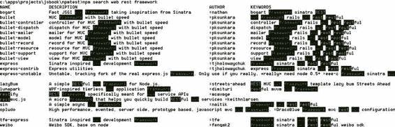

#### 使用 NPM

NPM 是 Node.js 中的标准包管理器。它不仅仅是一个简单的下载和解压类型的软件，而是一套完整的工具集，允许你安装和管理模块、创建自己的模块、通过关键词在在线注册表中搜索模块，以及做更多事情。NPM 本身是一个 Node 应用程序，尽管你像调用普通 Windows 程序一样从命令行调用它。NPM 由 Isaac Z. Schlueter 开发和维护。

与其继续写 NPM 能做什么，不如让我们执行几个命令，看看实际操作是什么样子。关于 Node.js 我们已经学习了足够多的理论；现在我们需要挑选一个合适的框架来构建我们的多人应用。我们希望一个遵循 REST 风格（https://www.ibm.com/developerworks/webservices/library/ws-restful/）的 Web 框架。

让我们问问 NPM 是否知道这样的框架：

```
> npm search web rest framework
```

输出是一个漂亮的搜索结果列表，其中关键词会用不同的颜色高亮显示。图 10-5 展示了我机器上的输出效果。

**图 10-5.** *NPM 搜索的结果*

现在你可以浏览这些结果，并选择你喜欢的框架。


当然，你通常会在网上先搜索相关框架，阅读论坛和邮件列表，然后才会选择要使用的工具。在本书中，我选择了`Express`（[`expressjs.com`](http://expressjs.com)）——市场上最流行的框架之一。现在我们来安装它。

> `npm install express`

在几行显示进度的输出后，你会看到`NPM`报告该模块及其所需依赖已安装完毕：

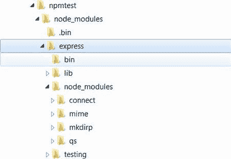

```
CHAPTER 10: Going Server-Side
express@3.0.0beta7 node_modules\express
├── methods@0.0.1
├── fresh@0.1.0
├── range-parser@0.0.4
├── cookie@0.0.3
├── commander@0.6.1
├── debug@0.7.0
├── mkdirp@0.3.3
├── response-send@0.0.1 (crc@0.2.0)
├── send@0.0.3 (mime@1.2.6)
└── connect@2.3.9 (bytes@0.1.0, cookie@0.0.4, crc@0.2.0, qs@0.4.2,
    formidable@1.0.11)
```

安装过程需要一点时间——`NPM`需要先下载包及其依赖，然后将其安装到系统中。打开项目文件夹，查看我们执行这两条命令后出现的文件结构。你应该会看到类似图 10-6 所示的结构。

**图 10-6.** *安装 Express 后创建的文件夹结构*

如你所见，`NPM`创建了`node_modules`文件夹，其中现在包含`express`文件夹。由于`Express`作为模块依赖其他几个模块，其依赖也位于自身的`node_modules`中。

让我们验证模块是否已安装，并输出每个模块更详细的信息。输出如图 10-7 所示（在我的 Windows 机器上）。

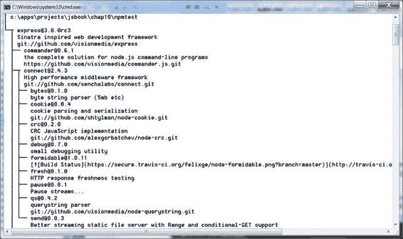

**图 10-7.** *每个已安装模块的详细信息*

现在你不仅可以看到可用包的名称和版本，还能看到简短描述、模块文件夹路径以及模块的来源——指向`Git`仓库的链接。现在我们知道了`Express`是一个“受`Sinatra`启发的 Web 开发框架”，并且该模块的源代码可以在`git://github.com/visionmedia/express.git`处检出。信息真不少！你还可以使用`list`命令的同义词：`ll`、`ls`和`la`（`ll`和`la`显示“长”版本，`ls`显示短版本）。

如果由于某种原因你忘记了命令的详细信息，请使用：

`npm <command> help`

它会打开浏览器窗口，并从本地文件系统打开文档部分。

关于入门`Node`需要了解的`NPM`知识，这几乎就是全部了。我们现在已经完成了`Node.js`的学习曲线——我们已经准备好编写我们的服务器了。

## 第 10 章：走向服务端

### 实战：为游戏构建一个服务器

现在我们了解了很多关于`Node.js`的知识：如何编写简单的脚本，如何调试它们，如何安装额外的模块，以及如何编写我们自己的模块。是时候应用我们的知识，构建一个更高级的应用程序了——多人版本的“四球”游戏。我们将从头开始，创建一个简单的纯文本页面，允许两名玩家轮流操作。

本节将介绍如何使用我们刚刚安装的`Express`框架来完成此任务。让我们从学习`Express`开始。为了确保我们从干净的环境开始，请删除文件夹中的所有文件，然后重新安装`Express`。

#### Node 的 Web 开发框架

什么是`Express`（[`expressjs.com`](http://expressjs.com)）？为什么我们会在游戏中使用它？正如我们在上一节中学到的，`Express`是一个“受`Sinatra`启发的 Web 开发框架”。`Sinatra`是一个用于`Ruby`的 Web 开发框架。


“web 开发框架”到底是什么？如你所见，`Node` 原生就能处理 HTTP 流量，那为什么我们还需要安装额外的工具呢？让我们退一步，思考一下构建网站时通常需要执行的常见操作。至少，你需要解析 URL，从中提取 `GET` 或 `POST` 参数，然后将调用路由到执行有用操作的脚本。接下来，你需要提供静态数据——图片、CSS、客户端 `JavaScript` 等等。有时你还需要处理用户会话、错误页面（404 和 500）以及日志。当然，如果你愿意，可以自己实现所有这些功能，但这只是在重复造轮子。

但是，仅仅为了制作一个简单的“四球游戏”，我们真的需要所有这些功能吗？好吧，你说得对。实际上，我们并不需要。我们或许可以使用一个像 `Connect`（[`senchalabs.github.com/connect/`](http://senchalabs.github.com/connect/)）这样更小的框架，它只处理 cookies 和请求路由等基本功能；但一旦你开始为项目添加功能，最终你会面临两个选择：安装 `Express`，或者再次重复造轮子。好消息是，`Express` 是构建在 `Connect` 之上的，一旦你学会了如何使用这个“大哥大”，你就能轻松掌握 `Connect`。

第 10 章：走向服务器端

**421**

**注意：** 本章专门讲解服务器端编程，这意味着我们完全不会触及智能手机。一旦你开始考虑 Android，事情会变得稍微复杂一些——你需要实现许多与服务器无关的客户端功能。为了避免同时处理客户端和服务器端带来的混乱，我将这部分内容分成了三章。这意味着，抱歉各位，本章没有花里胡哨的东西；界面功能仅足以测试服务器是否正常工作——仅此而已。但别担心。在接下来的章节中，我们将回到我们熟悉的环境，并制作一个外观酷炫的游戏客户端。

基本输出

和往常一样，起点是 Hello World 应用程序（参见清单 10-14）。在深入研究细节之前，先让一些东西跑起来总是不错的。

**清单 10-14.** *使用 Express 的 Hello World*

```
var app = require('express').createServer();

app.get('/', function(req, res){
  res.send('hello world');
});

app.listen(80);
```

安装好 `Express`（如果尚未安装）后，将脚本保存到 `main.js` 文件中，并使用以下命令运行它：

> `node main`

访问 [`localhost`](http://localhost)。你应该能在那里看到我们熟悉的文字。代码的第一行加载了一个名为 `express` 的模块（我们已经安装好了它），然后调用了导出对象的 `createServer()` 函数。`app` 变量现在持有我们用来设置应用本身的 `Server` 对象。这个示例只添加了一条路由规则：所有对网站根目录的 `GET` 请求都会输出 `Hello World` 这行文字。最后一行将服务器绑定到 80 端口。请确保你没有运行 `nginx`——在本章中，我们只使用 `Node` 来提供文件服务。

让我们通过创建一个简单的游戏界面来增加一些实际操作——仅仅是为了验证服务器能正常工作。我们将从第 3 章中加载空的 `BoardModel`，然后通过 HTML 页面显示它。

第 10 章：走向服务器端

**注意：** 原始 `BoardModel` 的代码可以在第 3 章的资料中找到，文件名为 `js/BoardModel.js`。

为此，我们首先需要将 `BoardModel` 转换为 `Node` 模块。幸运的是，改动不多。我们修改了其中的继承代码（因为它在 `Node` 中无效），并将构造函数赋值给了 `exports` 变量。清单 10-15 展示了结果。我删减了旧函数的代码（当我粘贴整个源码时，它有三页长；如果你和我一样，那么你没有耐心阅读三页的代码）。如果你想查看这个类的完整源代码，可以下载本章的代码。


# 排版后的内容

请参考 `chapter` 或第 3 章。我将保留函数名以提醒你关于 `BoardModel` 的接口。我们新增了一个名为 `toString()` 的方法，它返回棋盘状态的人类可读字符串表示。

**清单 10-15.** *作为 Node.js 模块的 BoardModel*

```
function BoardModel(cols, rows) {

this._cols = cols || 7;

this._rows = rows || 6;

this._data = [];

this._currentPlayer = BoardModel.RED;

this._totalTokens = 0;

this.reset();

}

BoardModel.EMPTY = 0;

BoardModel.RED = 1;

BoardModel.GREEN = 2;

BoardModel.NONE = 0;

BoardModel.WIN = 1;

BoardModel.DRAW = 2;

BoardModel.ILLEGAL_TURN = 3;

_p = BoardModel.prototype;

_p.reset = function() { … };

_p.getCols = function() { … };

_p.getRows = function() { … };

_p.makeTurn = function(column) { … };

_p.getPiece = function(col, row) { … };

/**
 * 此处省略了几个私有方法
 */

/**
 * 此方法在最新版本中添加，用于构建
 * BoardModel 的简单字符串表示。
 */

_p.toString = function() {
    var value = "";
    for (var row = 0; row < this._rows; row++) {
        for (var col = 0; col < this._cols; col++) {
            value += "[" + this._cellToString(this._data[row][col]) + "]";
        }
        value += "\n";
    }
    return value;
};

_p._cellToString = function(value) {
    switch (value) {
        case 0:
            return " ";
        case BoardModel.GREEN:
            return "X";
        case BoardModel.RED:
            return "O";
    }
};

exports = module.exports = BoardModel;
```

现在让我们更新主脚本以显示棋盘，而不是"Hello World"。清单 10-16 展示了如何实现这一点。

**清单 10-16.** *在网站主页显示棋盘*

```
var app = require('express').createServer();
var BoardModel = require("./BoardModel");
var board = new BoardModel();

board.makeTurn(2);
board.makeTurn(3);

app.get('/', function(req, res){
    res.setHeader('Content-Type', 'text/plain');
    res.send(board.toString());
});

app.listen(80);
```

现在代码的功能应该非常明显了。唯一不同的是我们在响应中额外发送了一个 `Content-Type` 头。在清单 10-14 中，我们传递的文本是随 `Content-Type: text/html`（这是 Express 在未明确指定 `Content-Type` 时使用的默认值）一起发送到浏览器的。如果我们在这里也这样做，浏览器会将棋盘显示为一行方括号。HTML 不会将 `\n` 符号视为新行，这就是为什么我们需要将 `Content-Type` 显式设置为 `text/plain`。我们还放了几枚棋子以确保页面渲染出有意义的内容。图 10-8 展示了 Chrome 如何渲染我们刚刚创建的网页。

**图 10-8.** *渲染后的棋盘*

这显然是正确的，但……它看起来一点都不美观。此外，你无法点击任何东西，因为这不是 HTML，而是纯文本。尽管我们决定在服务器端工作时不在乎美观与否，但我们仍然需要某种方式与棋盘进行交互。

不要急于更新你的代码使其看起来像 HTML。如果你在 JavaScript 代码内部编写页面标记，这意味着方法从根本上出了问题。UI 应该保存在漂亮的 HTML 文件中，你可以将其交给设计师进行样式设计。想象一下，如果你给他发送几百行 JavaScript 代码，他会说什么。

**注意：** 项目当前阶段完整的代码可以在 `03.board_model` 文件夹中找到。

#### 渲染网页

本节的目标是向浏览器输出 HTML 而不是纯文本。虽然调整 `toString()` 函数的代码相当容易，但我们不想这样做。`BoardModel` 是代表游戏状态和游戏逻辑的类；渲染 HTML 显然超出了它的职责范围。

我们将从学习如何向客户端浏览器发送静态文件（HTML、CSS 和 JavaScript 文件）开始。之后，我们将探索模板——一种将应用程序逻辑与渲染逻辑分离的机制。


我们无需改动其他部分，即可改变页面的外观。

**提供静态文件**

向用户发送纯 HTML 或 CSS 文件相当简单。你只需要告诉 `Express` 你想要使用“静态中间件”——一个用于提供静态文件的模块——然后将文件放入你指定为静态文件根目录的文件夹中即可。清单 10-17 展示了具体做法。一旦你按照清单所示更新代码，`Express` 就会在浏览器请求时提供 `public` 文件夹中的任何文件。

**清单 10-17.** *提供静态文件*

```
var express = require('express');
var BoardModel = require("./BoardModel");
var app = express.createServer();
app.use(express.static(__dirname + '/public'));
var board = new BoardModel();
board.makeTurn(2);
board.makeTurn(3);
app.get('/', function(req, res){
    res.setHeader('Content-Type', 'text/plain');
    res.send(board.toString());
});
app.listen(80);
```

`__dirname` 是 `Node` 的全局变量之一。它保存着脚本所在目录的路径（注意，这取决于脚本本身；如果在模块中使用它，它指向的是模块所在的目录，而不是最初的启动文件）。现在，如果你将名为 `about.html` 的文件放入项目中的 `public` 文件夹，就可以通过 `http://localhost/about.html` 访问它。创建这个文件并试试看。制作一个小页面，确保 `Node` 能正确提供服务。

**注意：** 为什么我们要在这里使用一个特殊的文件夹，而不是项目的根目录？这是出于良好的安全原因。因为你的服务器是用 JavaScript 编写的，而 JavaScript 文件只是另一种类型的静态内容，如果你将项目根目录设为静态文件目录，`Node` 会愉快地提供服务器本身及其所有模块的源代码。此外，将客户端脚本与服务器脚本分开总是更好的做法。

现在我们知道如何提供静态文件了，但这仍然没有解决渲染棋盘的问题。我们需要以某种方式将当前的棋盘数据传递给 HTML。这时，模板就派上用场了。

**什么是模板**

模板是一种特殊的文件，它定义了文档的通用结构，并用占位符来代替实际的动态数据。清单 10-18 展示了一个模板可能的样子。

**清单 10-18.** *模板示例*

```
<!DOCTYPE html>
<html lang="en">
<head>
<meta charset="utf-8" />
</head>
<body>
<% if (user) { %>
<h1><%= user.name %></h1>
<% } %>
</body>
</html>
```

这是 `EJS`（`https://github.com/visionmedia/ejs`）的代码，它是可用的模板引擎之一。请注意，该模板主要是一个 HTML 文件，因此设计师会感到相当舒适。此外，模板包含一种可用于渲染的嵌入式语言。在清单 10-18 中，模板检查是否存在一个名为 `user` 的变量；如果存在，它就在 `<h1>` 标签中输出该用户的名称。对于 `EJS`，这种语言就是 JavaScript。稍后你会看到，JavaScript 并非必需。

模板本身不足以渲染一个 HTML 页面。如你所见，模板引用了数据——名为 `user` 的变量，该变量并不存在于模板本身。这就在渲染逻辑和应用程序的其他部分之间提供了清晰的分离。

将模板代码和数据结合起来，并输出 HTML 页面的组件被称为模板引擎。图 10-9 展示了该过程的高层概述。

**图 10-9.** *模板背后的理念。要生成 HTML 页面，模板引擎需要两个组件：模板和数据模型。*

基本上，只要引擎知道如何用数据丰富模板代码并将其转换为可用的形式，模板代码本身是什么样子并不重要。这个特性允许你构建非常有趣的模板方言，旨在使标记看起来更好看。清单 10-19 展示了一个模板示例，用于其中一种


# 最流行的模板引擎

最流行的引擎 —— `jade` ([`jade-lang.com`](http://jade-lang.com)).

**列表 10-19.** *一个 Jade 模板示例*

```
!!!
5
html(lang="en")
head
title= pageTitle
script(type='text/javascript')
if (foo) {
bar()
```

**第 10 章：转向服务器端**

```
body
h1 Jade - node 模板引擎
#container
- if (youAreUsingJade)
p 你很了不起
- else
p 赶紧上手吧！
```

`Node` 支持多种模板引擎 —— `Haml`、`Jade`、`EJS`、`CoffeeCup` 和 `jQuery Templates`。如果你有几小时的空闲时间，可以逐一浏览它们，找到最喜欢的那一款。

**注意：** 本书作者更倾向于使用那些不会为了生成一个简单的旧 HTML 文件而创造全新语言的模板。原因有二：HTML 本身就是简洁、易用的，并且会长期存在；如果你把一个奇特的模板交给设计师，十有八九他们会问：“嘿，这是什么？”让非程序员也能轻松阅读和修改文件，这一点很重要。第二个原因是，我们已经熟悉 JavaScript 并且喜欢它；我们可以用它来处理模板，没有理由不去用它。

##### 创建模板

让我们把关于模板的知识应用到项目中。创建一个能渲染游戏面板的模板。首先，你需要安装模板引擎 `EJS`。

```
>npm install ejs
ejs@0.4.3 ./node_modules/ejs
```

现在创建一个名为 `views` 的文件夹，并在其中放入一个名为 `board.ejs` 的文件。这个文件本身就是一个 `EJS` 模板。列表 10-20 展示了该模板的完整代码。最重要的部分已用粗体标出。

**列表 10-20.** *使用 EJS 模板渲染游戏面板*

```
<!DOCTYPE html>
<html lang="en">
<head>
<meta charset="utf-8" />
<meta name="viewport"
content="width=device-width, initial-scale=1.0, maximum-scale=1.0,
user-scalable=no, target-densitydpi=device-dpi"/>
<style>
.cell {
display: inline;
font-family: monospace;
font-size: 2em;
cursor: pointer;
}
h1 {
font-family: monospace;
}
</style>
</head>
<body>
<h1>欢迎来到四球游戏！</h1>
<div class="board">
<% for (var i = 0; i < board.getRows(); i++) {
for (var j = 0; j < board.getCols(); j++) {
%><div class="cell"><%
switch(board.getPiece(j, i)) {
case BoardModel.GREEN: %>X<% break;
case BoardModel.RED: %>O<% break;
default: %>-<% break;
}
%></div><%
}
%><br /><%
} %>
</div>
<a href="about.html">关于</a>
</body>
</html>
```

加粗的 JavaScript 代码不会出现在发送给浏览器的页面中。

下载自 Wow! eBook <www.wowebook.com>

此脚本仅供 `EJS` 引擎用于生成 HTML 内容。最终生成的文档是纯 HTML。为了区分普通 HTML 标记和脚本，`EJS` 使用了 `<% %>` 符号。符号内的内容会被解析执行；符号外的内容则原封不动地保留在页面上。

最后一步是更新我们的主脚本：使用新创建的模板，而不是纯文本表示。当然，我们需要向模板传递正确的数据才能使其正常工作。列表 10-21 展示了更新后的 `main.js` 文件。

**列表 10-21.** *考虑模板的更新版服务器代码*

```
var express = require('express');
var BoardModel = require("./BoardModel");
var app = express.createServer();

app.set('views', __dirname + '/views');
app.set('view engine', 'ejs');

app.use(app.router);
app.use(express.static(__dirname + '/public'));

var board = new BoardModel();
board.makeTurn(2);
board.makeTurn(3);

app.get('/', function(req, res){
res.render('board', {
BoardModel: BoardModel,
board: board,
layout: false
});
});

app.listen(80);
```

这里有很多变化！首先，新增了两行代码用以设置两个值。方法 `set()` 可以将值分配给应用级别的设置。随后，各种模块可以利用这些设置来调整自身行为。第一行加粗的代码设置了模板的查找目录。第二行则告诉 `Express` 我们将使用 `ejs` 引擎来渲染模板。接下来的两行...


```markdown


将中间件添加到服务器。我们明确告诉服务器，我们会首先尝试通过`app.get(…)`函数来服务请求。只有当在那里找不到合适的内容时，我们才会转而处理静态文件。

最后一个代码块执行`render()`而不是`send()`。正如你所猜测的，`render()`指示`Express`接收第一个参数，检查当前视图引擎，找到`board.ejs`文件，并将其与模板数据一起传递给引擎。最后一个参数`layout: false`关闭了`Express`的默认行为，因为它会尝试查找`layout.ejs`文件并将实际模板嵌入其中。这个特性对于存在公共 HTML 文档结构的多页面站点很有用。但因为我们只有一个文件，所以不需要它。

保存文件并重启 Node。你应该会看到一个有点书呆子气的棋盘，这是我用自己的技能和灵感设计的（如图 10-10 所示）。由于模板现在已经与服务器的其余部分分离，我可以把它交给我的网页设计师。即使模板中有几行 JavaScript 代码，这并不可怕。

``

**第 10 章：走向服务端**

**431**

**图 10-10.** *使用模板渲染的棋盘。在展示给你的朋友们之前，最好先交给设计师。*

项目当前状态的代码可以在`04.templates`文件夹中找到，该文件夹位于本章的其他代码旁边。

**解析用户输入**

让我们让这个小型 demo 变得可玩，让用户能够点击列并进行操作。为此，我们需要从请求字符串中提取`GET`参数，然后更新棋盘。点击单元格会将用户导航到一个类似`http://localhost/?turn=3`的 URL。我们的服务器会检查该参数是否存在，并更新棋盘。

要访问通过查询字符串传递的参数，你可以使用请求对象的`query`数组。代码相当简单，如**列表 10-22**所示。

**列表 10-22.** *访问查询参数*

```
app.get('/', function(req, res) {
    var turn = req.query["turn"];
    if (!isNaN(turn)) {
        board.makeTurn(turn);
    }
    res.render('board', {
        BoardModel: BoardModel,
        board: board,
        layout: false
    });
});
```

现在，我们需要对模板（`views/board.ejs`文件）做一些小的调整，以便点击单元格能将用户带到正确的 URL。**列表 10-23**总结了这些更改。点击单元格会将用户带到带有`turn`参数的 URL。服务器会在每次点击时更新棋盘。

**列表 10-23.** *添加`onclick`事件*

```html
<!DOCTYPE html>
<html lang="en">
<head>
…
<script>
function turn(col) {
    location.href = "/?turn=" + col;
}
</script>
</head>
<body>
<h1>Welcome to the Connect Four!</h1>
<div class="board">
<% for (var i = 0; i < board.getRows(); i++) {
    for (var j = 0; j < board.getCols(); j++) {
%><div class="cell" onclick="turn(<%= j %>)"><%
        switch(board.getPiece(j, i)) {
            case BoardModel.GREEN: %>X<% break;
            case BoardModel.RED: %>O<% break;
            default: %>-<% break;
        }
%></div><%
    }
%><br /><%
} %>
</div>
</body>
</html>
```

现在你可以再次启动游戏，并尝试点击棋盘的不同单元格。它奏效了！

**注意：** 那些了解 REST 原则的人一定在想：“这家伙全做错了——谁来阻止他。”我刚刚违反了`GET`请求的语义，该语义不应该改变系统的状态。当你设计 API 或服务器时，你的`GET`请求应该只检索数据，而不是修改它。对于修改，我们有`POST`。这次我为了简单起见使用了`GET`来更新棋盘。但使用`GET`的危险是什么？嗯，点击任意单元格进行一次操作，然后刷新浏览器几次。这就是这个糟糕设计决策的副作用。在实际开发中不要这样做。

**第 10 章：走向服务端**

**433**

还有两种方法可以将参数传递给服务器：通过`POST`（在这种情况下，它被编码在请求体中）以及通过路径本身：对于


```

```markdown

例如，我们的 URL 可能看起来像 `http://localhost/turn/5`，那么 `5` 就是参数（顺便一提，`turn` 也可以是参数）。如果你想要了解更多关于这个技巧的信息，可以查阅 Express 的文档（`http://expressjs.com/guide.html#route-param pre-conditions`），或者继续阅读下一章——我们在那里使用了它。

#### 使用会话（Sessions）

目前，任何用户都可以加入游戏并开始点击棋盘，因为整个服务器只有一个共享的棋盘。当你开始制作真正的游戏时，需要将用户与游戏分开。换句话说，对于每一个正在游戏的用户，你需要存储他正在玩的棋盘的引用。一旦你知道如何处理会话，这就变成了一项简单的任务。

会话是一种识别用户并跟踪其行为的方式。如果你之前没有接触过会话，可以将其视为一个与用户浏览器关联的对象。这个对象驻留在服务器上，因此用户无法更改它。例如，我们可以通过向用户会话中添加一个计数器，并在每次为用户提供页面服务时增加它，来跟踪用户访问了多少个页面。

为了给我们的服务器添加会话支持，我们需要使用另一件中间件：我想你已经开始看到这种模式了。清单 10-24 展示了所需的配置。

**清单 10-24.** *向服务器添加会话支持*

```javascript
app.use(express.cookieParser());
app.use(express.session({ secret: "gameserversession" }));
app.use(app.router);
app.use(express.static(__dirname + '/public'));
```

以上就是跟踪用户所需的全部内容。添加这些行之后，传递给处理函数（handler function）的请求对象（`request`）会被添加一个名为 `session` 的新字段。你可以添加新的属性，读取之前设置过的属性，并将它们传递给模板。清单 10-25 中的示例展示了如何创建一个新的会话参数 `totalTurns`，该参数会在用户每次执行操作（turn）时递增。

**清单 10-25.** *使用会话参数*

```javascript
app.get('/', function(req, res) {
  if (!req.session.totalTurns) {
    req.session.totalTurns = 0;
  }
  var turn = req.query["turn"];
  if (!isNaN(turn)) {
    board.makeTurn(turn);
    req.session.totalTurns++;
  }
  res.render('test', {
    BoardModel: boardApi.BoardModel,
    board: board,
    totalTurns: req.session.totalTurns,
    layout: false
  });
});
```

会话的典型用途是区分用户：在需要时支持身份验证和授权。最常见的用例是检查会话是否包含 `userID` 属性，如果包含，则表示用户已登录并可以访问你网站的受限区域。如果没有这个属性，则表示用户是匿名用户，他应该继续前往登录表单。当用户输入正确的登录名和密码后，他的会话会被更新，并设置 `userID`。

我们使用会话将用户与进度关联起来。显然，一个真正的多人解决方案必须支持多个同时进行的游戏，而不是像我们之前那样只支持一个。因此，我们将使用会话来跟踪在服务器上运行的众多游戏实例中，哪一个是属于该用户的正确实例。我们将在第 12 章中为游戏添加这个功能。

关于会话的最后一点重要说明：默认情况下，会话数据存储在内存中，因此服务器重启后会话将不会保留。如果你需要一个更可靠的解决方案，应该查阅 Express 文档，地址是 `http://expressjs.com/guide.html#session-support`。

当前状态的项目源代码位于 `05.sessions` 文件夹中。

#### 理解中间件（Middleware）

我们在本章中多次使用这个术语，因此我认为现在是时候解释一下它到底是什么了。中间件是 Express 选用的一种特殊说法，用来表示一个模块，该模块可以用某种方式来过滤 HTTP 请求，

```


# 为下一个中间件丰富请求和响应变量

在 Express 中，你几乎所有的操作都在这些小巧精良的模块中完成。为了更好地理解它们，不妨将其视为层级（参见图 10-11）。

**图 10-11.** *中间件层级。请求会依次通过每个执行特定任务的"层级"。*  
*请求处理可以在某个层级停止并返回，也可以继续传递到下一层级，如此类推。*

每个新请求都会先传递到第一层。它可以在该层停止并返回结果，也可以传递到下一层，以此类推。正如你所见，中间件有时依赖于前几层的处理结果。例如，我们的`get`处理器需要会话才能正常工作。如果将其放在会话中间件之上，那么调用时就不会有可用的会话数据。会话本身也是如此。会话需要先解析 Cookie。Cookie 存储着当前用户的会话 ID，没有它，我们就无法加载用户的会话数据。如果前一层没有解析 Cookie，会话就无法工作。这意味着`cookieParser`中间件必须放在`session`中间件之前。

典型的中间件堆栈如代码清单 10-26 所示。

**代码清单 10-26.** *一个典型的 Node.js 服务器中间件堆栈*

```javascript
app.use(express.logger(...)); // 类似于 Apache HTTP 服务器的访问日志
app.use(express.bodyParser(...)); // 提取请求体中存储的有用数据（通常是 POST 请求）
app.use(express.cookieParser(...)); // 解析 Cookie 并填充 req.cookies
app.use(express.session(...)); // 启用会话支持，并填充 session 和 sessionStore

第 10 章：转向服务端

app.use(app.router); // 执行路由函数
app.use(express.static(...)); // 提供静态文件服务
app.use(express.errorHandler(...)); // 报告任何异常
```

你可以对中间件其他层级的执行进行一定程度的控制。这种控制通过`next()`函数赋予你，它通常作为第三个参数传递给回调函数。在此之前，我们一直忽略第三个参数：

```javascript
app.get('/', function(req, res) {
  …
});
```

要接收这个回调，只需像这样添加一个参数：

```javascript
app.get('/', function(req, res, next) {
  …
});
```

请求的执行会在决定不调用`next()`的中间件处停止。忽略`next()`意味着该中间件决定返回结果，并且不希望将执行传递到更低层级。

请看代码清单 10-27，它演示了如何利用这个技巧实现一些疯狂的内容过滤。假设有一个非常特殊的静态页面，只对至少完成了十次操作的用户显示。我们可以添加一个路由来匹配该页面地址，并在其中检查安全限制。

**代码清单 10-27.** *通过层级传递控制权*

```javascript
app.get('/prize.html', function(req, res, next) {
  if (req.session.totalTurns && req.session.totalTurns > 10) {
    next();
  } else {
    res.send("点击次数还不够哦！");
  }
});
```

当路由器收到对`/prize.html`的请求时，它会检查用户的操作次数。该值存储在会话中。如果值大于十，我们只需调用`next()`。这样做可以让其他中间件继续工作。反之，如果点击次数不够，我们就自己处理请求。由于我们没有调用`next()`，请求处理在此停止，静态中间件甚至不会知道用户曾试图访问该页面。只有当你的路由器在堆栈中位于静态中间件之上时，这个技巧才有效。否则，你将无法过滤请求，因为静态中间件会先于你提供内容。

如果在中间件层级中遇到错误并决定让它继续传递，你应该将错误作为参数传递给`next()`函数。然后错误会被注册的错误处理器捕获并处理。请继续阅读以了解其工作方式。

#### 内务整理

本章的最后一部分将致力于那些虽小但实用的内务管理任务。


# 每个 Web 服务器都应实现的功能

每个 Web 服务器都应具备的功能包括：日志记录、错误报告以及对不同环境的支持。在前一节中，你可能已经注意到了几个新的中间件：`logger`和`errorHandler`。现在我们来深入了解它们，以此结束对 Express 框架的初步认识。

##### 报告错误

日志记录和错误报告都是非常重要的任务——无法想象一个运行在生产环境中的严肃 Web 服务器会忽视这两者中的任何一个。我们从错误报告系统开始，编写一些会产生错误并引发异常的代码（见清单 10-28）。这是最简单的一步——引入错误可比解决错误容易多了！

**清单 10-28.** 制造人为错误以展示服务器如何处理

```
var express = require('express');
var app = express.createServer();
app.set('views', __dirname + '/views');
app.set('view engine', 'ejs');
app.use(express.cookieParser());
app.use(express.session({ secret: "gameserversession" }));
app.use(app.router);
app.use(express.static(__dirname + '/public'));
app.get('/', function(req, res) {
  var foo = {};
  var bar = foo["bar"].baz;
  res.send("这行本不应可见");
});
app.listen(80);
```

显然，尝试访问未定义属性的某个属性必然会导致问题。启动服务器并发送请求，错误信息会同时输出到控制台和渲染在网页上。在我的环境中，堆栈跟踪信息如下所示：

```
TypeError: Cannot read property 'baz' of undefined
  at C:\apps\projects\jsbook\chap10\err.js:18:25
  at callbacks (C:\apps\projects\jsbook\chap10\node_modules\express\lib\router\index.js:272:11)
  at param (C:\apps\projects\jsbook\chap10\node_modules\express\lib\router\index.js:246:11)
  at pass (C:\apps\projects\jsbook\chap10\node_modules\express\lib\router\index.js:253:5)
  at Router._dispatch (C:\apps\projects\jsbook\chap10\node_modules\express\lib\router\index.js:280:4)
  at Object.handle (C:\apps\projects\jsbook\chap10\node_modules\express\lib\router\index.js:45:10)
  at next
```

这样的错误信息对开发者来说或许还能接受，但绝对不适合生产环境，原因有两点。首先，错误报告显然不够用户友好。你的最终用户不需要知道具体出了什么问题，也不需要了解是哪些代码行导致服务器崩溃。用户真正需要知道的只是：发生了某些问题，你的应用程序无法处理该请求。他或许应该再试一次——毕竟错误可能是临时性的。

同时，最好告诉用户："当你看到这条信息时，我们的技术支持团队已经在调查这个错误，并且正在尽最大努力修复它。" 关注这类小细节是让项目显得可靠的关键。浏览器窗口中的堆栈跟踪会让你的系统看起来完全崩溃了，仿佛内部电线和齿轮正通过船体上的一个洞盯着用户。而一个设计良好的自定义错误页面则会让用户觉得这个错误并不严重。嘿，我们是游戏开发者——我们必须制作有趣的错误页面！想找一些错误页面设计的灵感，可以看看 GitHub 的 404 页面（见图 10-12）[`github.com/404`](https://github.com/404)。

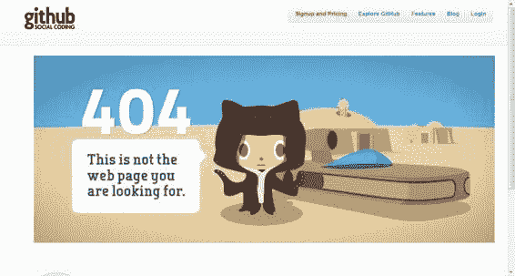

**图 10-12.** 一个优秀错误页面的示例，它具备一些动态特性。当你在页面周围移动鼠标时，由于简单的视差效果，页面会感觉"活"起来。

默认错误处理的第二个问题是，错误除了记录在日志中之外，不会在其他任何地方被报告。想象一下，你的朋友打电话给你说："嘿，我刚试玩了你那款很棒的新在线游戏，但当我进入精灵森林时，它显示了一个花哨的错误界面。" 如果你保留默认的错误处理，你甚至不会知道发生了什么——错误只会输出到控制台。这并非是报告此类重要错误的可靠方式。


当然，你可以将控制台输出保存到日志文件中，但你必须定期翻阅它，以检查一切是否正常。相信我，你迟早会懒得去做。程序员都很懒——这是我们的美德之一。但如果你可以对朋友说，“感谢报告，我正在处理。我已经在邮箱里收到报告了。”那该多好。这一切通过 Express 都能实现。

第一步是添加`errorHandler`中间件，它可以配置为在浏览器中显示更美观（但仍然对技术人员友好）的错误页面。在你的中间件列表末尾添加以下代码行：

```javascript
app.use(express.errorHandler());
```

这个中间件仅在开发阶段使用。图 10-13 展示了异常屏幕的外观。

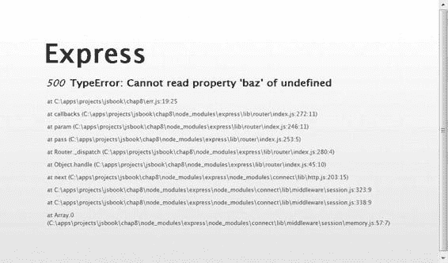

**图 10-13.** *更美观的错误报告。对用户来说仍然可怕，因为阅读堆栈跟踪会让他们觉得自己的电脑要爆炸了。*

对于生产环境，我们应该提供一个更好的错误页面。如果你注册一个任意四个参数的函数到`use()`方法中，它会被视为错误处理器并作为中间件工作。它完全集成到生命周期中，可以决定是自己处理某个错误还是将其传递给下一层。清单 10-29 展示了多个错误处理中间件如何协同工作。

**清单 10-29.** *添加自定义错误处理中间件*

```javascript
app.use(express.cookieParser());
app.use(express.session({ secret: "gameserversession" }));
app.use(app.router);
app.use(express.static(__dirname + '/public'));
app.use(function(err, req, res, next) {
  if (canHandleMyself()) {
    res.render("error", {layout: false});
  } else {
    // 传递给下面定义的标准 errorHandler 中间件
    next(err);
  }
});
app.use(express.errorHandler());
```

示例中的代码非常简单，但它实现了一个有用的功能：它向用户隐藏了错误的可怕细节，并显示了一个精美的错误页面。在当前设置下，它会在`views`文件夹中查找`error.ejs`文件，并渲染它来代替默认的错误信息。我将设计你喜欢的错误页面的任务留给你。`canHandleMyself()`是你自己实现的函数。如果你不需要多层错误处理器，可以随意重写代码，使其始终返回自定义错误页面。

```javascript
app.use(function(err, req, res, next) {
  res.render("error", {layout: false});
});
```

现在我们来到最后的任务：将错误保存到某个地方，并通知支持团队。我会在本章下一节中，连同其他与日志相关的问题，向你展示如何将异常写入日志文件。接下来，我们转向支持团队的通知。最明显的选择是发送电子邮件。对于这类典型任务，通常已经有一个模块可以完成。它叫做`nodemailer` (https://github.com/andris9/Nodemailer)。你可以通过运行以下命令来安装它：

```bash
npm install nodemailer
```

然后像清单 10-30 那样使用它。

**清单 10-30.** *使用邮件程序将错误通知支持团队*

```javascript
var express = require("express");
var email = require("nodemailer");
var app = express.createServer();

app.set('views', __dirname + '/views');
app.set('view engine', 'ejs');

app.use(express.cookieParser());
app.use(express.session({ secret: "gameserversession" }));
app.use(app.router);
app.use(express.static(__dirname + '/public'));

// 发送邮件给团队
app.use(function(err, req, res, next) {
  res.render("error", {layout: false});
  var transport = nodemailer.createTransport("SMTP", {
    service: "Gmail",
    auth: {
      user: "juriy.bura@gmail.com",
      pass: "mysecretpass" // 不，这不是我的真实密码
    }
  });

  transport.sendMail({
    from: "node@juriy.com", // 发件人
    to: "juriy.bura@gmail.com", // 收件人
    subject: "错误报告", // 主题
  });
});
```


# 第 10 章：转向服务器端

`body: "我们在这里遇到错误！\n" + err.stack` // 错误描述

```
}, function(error, responseStatus){

if(error){

console.log("错误 " + error);

} else {

console.log(responseStatus.message); // 来自服务器的响应

}

});

});

// 向用户渲染一个美观的页面

app.use(function(err, req, res, next) {

res.render("error", {layout: false});

});

app.get('/', function(req, res) {

res.send("这是页面");

});

app.listen(80);
```

就是这样！现在你应用的错误报告功能（几乎）达到了商业级水准！如果你想更有趣一些，可以在 NPM 上搜索其他模块，发布到 Twitter，发送 Jabber 消息，连接短信服务，甚至把 bug 直接发送到你的手机上——一切皆由你掌控。

错误处理中最后但最重要的一点是：永远、永远不要让任何异常从你的错误报告代码中溜走。Express 会吞掉原始错误，并将新错误报告给底层中间件。

##### 日志记录

应用的另一个重要方面是日志记录——将使用信息写入控制台或文件。Express 默认的日志记录功能相当简陋，但对我们来说已经足够。最简单的设置是在你的中间件栈顶部添加日志中间件：

```
app.use(express.logger());
```

完成这一步后，你会看到应用在控制台输出更多的信息。现在每个请求都会被记录下来。

```
127.0.0.1 - - [2011 年 11 月 14 日 周一 22:35:11 GMT] "GET / HTTP/1.1" 500 - "-"
"Mozilla/5.0 (Windows NT 6.1; WOW64) AppleWebKit/535.7 (KHTML, like Gecko)
Chrome/16.0.912.36 Safari/535.7"

127.0.0.1 - - [2011 年 11 月 14 日 周一 22:35:11 GMT] "GET /favicon.ico HTTP/1.1" 404 -
"-" "Mozilla/5.0 (Windows NT 6.1; WOW64) AppleWebKit/535.7 (KHTML, like Gecko) Chrome/16.0.912.36 Safari/535.7"

第 10 章：转向服务器端

127.0.0.1 - - [2011 年 11 月 14 日 周一 22:35:12 GMT] "GET / HTTP/1.1" 500 - "-"
"Mozilla/5.0 (Windows NT 6.1; WOW64) AppleWebKit/535.7 (KHTML, like Gecko)
Chrome/16.0.912.36 Safari/535.7"
```

这些行里包含了大量信息：主机、时间、请求、状态、用户代理等。如果你不需要如此详细的信息，可以更改 `logger` 的 `format`。格式是由多个令牌组成的字符串，每个令牌代表一类信息。下面是一个格式行示例，它只打印 HTTP 方法、页面 URL 以及处理它所花费的时间：

```
app.use(express.logger({
  format: ":method :url - :response-time ms"
}));
```

如果你将该行传递给记录器，你会得到更简洁（当然，信息量也更少）的输出。

```
GET / - 5 ms
GET /favicon.ico - 3 ms
GET / - 4 ms
GET /favicon.ico - 3 ms
```

可用的令牌列表可以在 Connect 文档页面找到——[`extjs.github.com/Connect/logger.html`](http://extjs.github.com/Connect/logger.html)（请记住，Express 使用的是 Connect 的中间件）。

在生产环境中，写入控制台并不是最佳选择。写入文件要好得多。做起来有点小技巧。Connect 的记录器没有直接传递文件名的方式，但它接受所谓的 `stream`。在 Node.js 中，这是可写流——任何你可以写入的东西：TCP/IP 套接字、文件、Unix 套接字、控制台等等（参见 [`nodejs.org/docs/api/streams.html`](http://nodejs.org/docs/api/streams.html)）。为了将记录器的输出发送到文件，你需要在该文件上打开一个流并将其传递给记录器。清单 10-31 展示了如何做到这一点。

**清单 10-31.** *将日志写入文件*

```
var express = require("express");
var email = require("mailer");
var fs = require("fs");
var fileStream = fs.createWriteStream(__dirname + "/node.log",
  { flags: 'a',
    encoding: "UTF-8" });
var app = express.createServer();
app.set('views', __dirname + '/views');
app.set('view engine', 'ejs');

第 10 章：转向服务器端

app.use(express.logger({
  format: ":method :url - :response-time ms",
  stream: fileStream
}));
```

在第三行，我们加载了 `fs` 模块，它允许我们处理文件。


文件系统。然后我们创建`WriteStream`，传入文件名以及一组参数，这些参数指明我们希望文件以何种方式打开。

`flags`参数表明文件以写入模式打开，并且光标位于文件末尾。这样，你的日志就能在服务器重启后得以保留。最后，我们将创建好的流传递给 logger 中间件，并享受其结果。

当然，你也可以自行向同一个文件写入内容。列表 10-32 展示了一个错误处理器的示例，正如我所承诺的，它会将堆栈信息保存到文件中。

**列表 10-32.** *将错误信息写入同一日志文件*

```javascript
// Write logs
app.use(function(err, req, res, next) {
    fileStream.write(err.stack);
    next(err);
});
```

我们几乎完成了维护工作，但还剩下一项小任务：支持不同的服务器配置。通常，企业级服务器会拥有多个配置文件，用以描述十几种不同的环境：开发环境、测试环境、预上线环境、生产环境等等。其动机非常简单：你希望在不同配置下启用不同的服务器特性。

#### 服务器配置

我们决定对用户隐藏错误信息，但不想对自己隐藏。当你编写大量代码并每分钟都在测试变更时，你希望立即看到错误追踪信息，而无需查看控制台。换句话说，你希望在生产环境中启用“友好错误页面”功能，但在开发环境中则不需要。很可能，你也不想让自己的邮箱塞满通知邮件，而且同样不需要日志。

显然，你希望在不编写一行代码的情况下切换服务器模式（我们都很懒，记得吧）。这个任务通常通过添加配置文件支持来解决，但 Express 提供了一种更轻量级的机制。Node 预留了一个叫`NODE_ENV`的特殊环境变量，用于保存环境标识符。它有两个“魔法”值：`development`（默认使用的值）和`production`（启用“生产模式”）。

Express 有一个名为`configure`的函数，它允许你定义仅在特定环境中执行的配置部分。列表 10-33 展示了针对`production`配置的代码片段。

**列表 10-33.** *环境特定配置的示例*

```javascript
// For production we want logs to be written to the file and have the verbose format
app.configure("production", function() {
    loggerStream = fs.createWriteStream(__dirname + "/node.log", { flags: 'a'});
    app.use(express.logger({
        format: "default",
        stream: loggerStream
    }));
});
```

这样，初始化日志的代码仅在`production`环境中执行——即当你明确将`NODE_ENV`设置为`production`时。默认情况下，Express 会忽略这一部分。如果`configure`函数不带参数调用，它会在任何可用环境中执行。

现在你已经拥有了为不同运行模式定义服务器不同行为的工具。请看以下完整代码，它阐释了这一思路（为了节省篇幅，我删去了冗长的函数）：

```javascript
var express = require("express");
var BoardModel = require("./BoardModel");
var nodemailer = require("nodemailer");
var fs = require("fs");
var loggerStream;
var app = express.createServer();

// Every environment has the same settings for views
app.configure(function() {
    app.set('views', __dirname + '/views');
    app.set('view engine', 'ejs');
});

// For production we want logs to be written to the file and have the verbose format
app.configure("production", function() {
    loggerStream = fs.createWriteStream(__dirname + "/node.log", { flags: 'a'});
    app.use(express.logger({
        format: "default",
        stream: loggerStream
    }));
});

// For development, we don't use logger at all
// Main stack is the same for both environments
app.configure(function() {
    app.use(express.cookieParser());
    app.use(express.session({ secret: "gameserversession" }));
```

第 10 章：迈向服务端

**445**


```javascript
app.use(app.router);

app.use(express.static(__dirname + '/public'));

});

// 写入日志并隐藏页面——仅在生产环境中使用
app.configure("production", function() {
  app.use(function(err, req, res, next) {
    loggerStream.write(err.stack);
    next(err);
  });

  // 向团队发送邮件
  app.use(function(err, req, res, next) {
    /* 邮件代码 */
    next(err);
  });

  // 向用户渲染一个友好的错误页面
  app.use(function(err, req, res, next) {
    res.render("error", {layout: false});
  });
});

// 开发环境下使用标准错误处理即可
app.configure("development", function() {
  app.use(express.errorHandler({stack: true, dump: true}));
});

app.get('/', function(req, res) {
  // 生成错误以观察处理流程。
  // 在生产环境下，你应该看到为用户设计的友好错误页面。
  // 在开发环境下，你会在网页和控制台中看到堆栈跟踪信息。
  var foo = req["bar"].baz;
  res.send("这是页面内容");
});

app.listen(80);
```

有时，你可能希望为“环境”设置使用不同的来源——例如，配置文件或自定义的命令行选项。在这种情况下，你可以通过调用 `app.set("env", "production")` 来始终覆盖这个值。

环境切换功能相当好用，但事实上，你只有在真正进入生产阶段时才需要它，这意味着你要将应用程序展示给朋友之外的其他人。在此之前，你只需记住你手头有这个功能，并像我们在本章大部分时间所做的那样，使用单一的开发环境即可。

本章的成果位于名为 `06.housekeeping` 的目录中。如果你想测试邮件通知，别忘了将邮件设置替换成你自己的。

## 总结

在本章中，我们无需切换语言，就从客户端开发转向了服务端开发。我们学习了一个强大且快速演进的工具 —— Node.js，它允许我们像运行操作系统原生代码一样运行 JavaScript 代码。Node.js 使我们能够创建 Web 服务器并实现非常基础的用户交互。更重要的是：我们学习了服务端编程的基本构建模块，在接下来的章节中，我们将利用这些模块来构建一个完整的多人应用——一个具有一些相当高级功能的“四球”游戏。

我们还学习了 Node.js 最流行和强大的 Web 开发框架之一：Express。我们从简单的 Hello World 应用开始，逐步增加功能集。我们学习了如何处理查询参数（用户输入），如何通过会话跟踪用户活动，以及如何通过模板引擎将服务器逻辑与 HTML 视图分离。

我们简要了解了 Express 的架构，并学习了封装了小型功能集的不同中间件：Cookie、查询解析、日志记录、会话等。我们学习了中间件栈以及请求是如何被它处理的。

最后，我们完成了一些维护任务：我们研究了 Express 的错误处理、日志记录和配置。现在我们已准备好继续前进。凭借我们获得的知识，我们可以开始构建一个多人客户端，该客户端使用 Ajax 从服务器获取数据，并发送用户操作的信息——例如点击、聊天消息或游戏对局提议。

# 第 11 章：与服务器对话

阅读完上一章后，你已经准备好创建一个游戏服务器，并为其提供包含模板、错误处理和日志记录的完善基础设施。然而，要构建一个真正的多人应用，仅有服务器是不够的。网络架构的第二个关键部分是客户端。本章的目标是从客户端的角度提供扎实的网络知识。为此，我们将学习以下内容：

- 如何在不重新加载网页的情况下从服务器加载数据
- `XMLHttpRequest` 对象的新版本 —— XHR Level 2


# 如何从服务器加载二进制数据并在客户端解析

- 移动设备的局限性
- 关于反向 Ajax 以及实现实时客户端-服务器通信可用方案的一些要点
- 传输层的定义，以及开发者为游戏选择传输层时需要考虑的权衡类型

本章开头，我们将简要回顾网络通信的演进历程：从历史 API 到即将面世的尖端技术。随后，我们将准备应对更复杂的任务：探索客户端与服务器之间的不同通信方式，并构建支持双向消息发送的实时解决方案。

## 第 11 章：与服务器对话

### 浏览器中网络功能的演进

让我们上一堂（非常）简短的历史课，看看网络技术如何帮助 Web 应用发展到今天的样子，开发者曾面临哪些问题，以及这些问题中大部分是如何被解决的。

早期，浏览器只能渲染纯 HTML 页面、点击链接、下载和显示图片，并提供搜索、书签等少数实用功能。没有人将浏览器视为构建丰富应用或游戏的平台。当时使用 Web 的常规模式是：

- 加载页面
- 阅读页面内容
- 点击链接，在地址栏输入地址，或需要新内容时重新加载页面

显然，这种模式将网页的完全控制权交给了用户；没有用户的明确操作，内容将保持不变。这种模式非常适合被动浏览和探索静态数据。例如，允许用户阅读书籍章节的网站可以完全不依赖 JavaScript 和 Ajax 等动态功能运行，仍然保持可读性和用户友好性。

然而，有许多情况下这种模式不足以支持舒适的浏览体验。重新加载网页意味着重新加载其每个部分；在某些情况下，这可能是冗余且浪费的。想象一个左侧有分层菜单的页面。如果所有页面都是静态的，点击菜单项展开将导致整个页面重新加载。即使流量不是问题，从头开始渲染页面的过程也会分散用户的注意力——至少页面会闪烁。

这种模式最终必然"终结"。事实上，它的实际使用存在大量开销，甚至像聊天或 Web 游戏这样的基本交互式应用也无法在无法在不重新加载页面的情况下从服务器加载新数据时实现。然后 Ajax 登场了。

Ajax 是一种无需重新加载网页即可加载服务器数据的技术。它最初由微软实现为名为`XMLHTTP`的小组件。后来，`XMLHttpRequest`使得查询服务器、接收响应并仅更新需要更新的页面部分成为可能。

Ajax 感觉像是 Web 的自然演进——允许网页在不重新加载的情况下执行 HTTP 请求，使开发者能够创建一个全新的 Web 应用世界；更复杂的网页中，用户与浏览器之间的交互不再仅仅是浏览过程的副产品。当然，即使在 Ajax 出现之前也有可能制作动态网页——例如，通过将永不间断的内容流加载到`IFRAME`中——但这些技术只是权宜之计：它们缺乏可靠性和良好的跨浏览器支持。

**注意：** 严格来说，Ajax 是 Asynchronous JavaScript and XML（异步 JavaScript 和 XML）的缩写。缩写词通常使用大写字母拼写。然而，这个词已成为一个普通名词，大多数在线媒体将其拼写为 Ajax。在本书中，我将采用第二种命名方式。

Ajax 既不是标准，也不是实现方案或 API 名称。它只是一个流行术语。


Ajax 是一种开发者用于从服务器加载数据而无需重新加载页面的技术。我们将在本章后续部分看到一个 Ajax 调用的示例。

Ajax 有其自身的局限性，其中最主要的就是 HTTP 本身。HTTP 是一种请求-响应协议，客户端与服务器之间的通信遵循预定顺序：

1. 客户端发送一个请求，精确描述它想要读取或更新的内容。
2. 服务器分析请求、形成响应并将其发送回客户端。
3. 连接被关闭。
4. 要发送另一段数据，客户端必须发起一个新连接。

服务器无法自行向客户端发送消息：这种通信模型假设服务器仅响应来自页面的请求。当你用一个例子来思考时，传统 Ajax 的弱点就很容易理解了。想象一下，你正在编写一个带有内部邮件系统的多人在线游戏。在某个时刻，服务器收到一封需要传递给用户的新邮件：我们希望在屏幕角落显示一个闪烁的“新邮件”图标。即使服务器现在有了该用户的新数据，它也无法对其进行任何处理，因为服务器无法与页面建立新连接。相反，服务器必须耐心等待新的 Ajax 请求，然后才能用新更新进行响应。这种模式的明显缺点是，客户端必须不断轮询服务器，以检查是否有新消息（本章下一节将详细介绍这种模式及其问题）。

丰富的应用程序，尤其是游戏，通常需要更好的网络连接。它们需要一种像 TCP/IP 那样工作的连接：一旦页面打开它，它就保持打开状态，并且任何一方（客户端和服务器）都可以随时、以任意顺序发送各自的消息。使用这样的连接，服务器可以立即将邮件通知发送给客户端，而无需等待页面的新请求。

进化的下一个合乎逻辑的步骤是 WebSocket，它是一种填补网页与服务器之间实时双向通信空白的**技术**。WebSocket 允许你打开一个真正的 TCP 连接并传输数据，而无需任何 HTTP 开销。类似这样的技术正在推动整个 HTML5 游戏开发领域向前发展，开启了几年前还无法想象的可能性。

**注意：** 在 Android 平台上，WebSocket 仅在 Android 版 Chrome 中可用。标准浏览器中缺少 WebSocket 是 Android 网络开发者成千上万投诉的原因。更糟糕的是，Android 的主要竞争对手 iOS 已经支持它了。毫无疑问，Android 原生浏览器*最终*会支持它，但就目前而言，我们只能等待。

WebSocket 正是 Web 应用开发者从一开始就想要的：一种能够以最小开销和延迟发送消息的持久双向连接。游戏比任何其他应用都更需要它，因为在游戏中，延迟至关重要。如果你有一个聊天应用，聊天消息到达时延迟了 200 毫秒，那你运行的是一个完美的聊天应用，你的用户会喜欢它！如果你要制作一款实时 3D 射击游戏，这种延迟就太长了——游戏会显得不精确或卡顿，因为 200 毫秒就是击中目标与击中他身后墙壁之间的差异。

Web 开发者和浏览器厂商发明了许多不同的技术来构建可靠的客户端-服务器通信解决方案。这些技术被称为传输方式。WebSocket 和 Ajax 轮询是两种不同的传输方式，它们都服务于同一个目标：尽快将服务器的更新传回客户端。许多库将传输方式的细节隐藏在抽象层之下，这样开发者就不必担心错误处理或恢复断开的连接等实现细节。


## 第 11 章：与服务器通信

### 服务器设置

本章及下一章中的大部分示例都需要运行服务器。你可以随意使用前一章中的服务器代码作为示例的起点，或者从头编写一个十几行的 Express 应用。我们将省略前一章中有关环境搭建的代码部分，转而专注于实际功能，并保持代码清单的简洁。请记住，这并非生产环境的可选方案：在将项目公开上线前，应返回第 10 章再次仔细审阅。清单 11-1 是服务器的起点代码。

**清单 11-1.** *本章使用的基础服务器代码*

```
var express = require("express");
var app = express.createServer();
app.set('views', __dirname + '/views');
app.set('view engine', 'ejs');
app.use(express.bodyParser());
app.use(express.cookieParser());
app.use(express.session({ secret: "gameserversession" }));
app.use(app.router);
app.use(express.static(__dirname + '/public'));
app.use(express.errorHandler());
app.get('/', function(req, res) {
    res.sendfile(__dirname + "/public/index.html");
});
app.listen(80);
```

### 使用 `XMLHttpRequest` API 进行基本 HTTP 请求

所有主流浏览器均提供了 `XMLHttpRequest` 对象，作为从网页向服务器发起 HTTP 请求的公认标准方式。你可能已经使用过它：无论是直接自行创建新实例，还是通过 `jQuery` 或 `Prototype.js` 等 JavaScript 库提供的抽象层间接使用。

**注意：** 正如 W3C 所承认的，该对象的名称相当具有误导性：*"首先，该对象支持任何基于文本的格式，包括 XML。其次，它可用于通过 HTTP 和 HTTPS 发起请求 (...) 最后，它支持广义上的'请求'概念，即涉及定义 HTTP 方法的所有 HTTP 请求或响应活动。"*

[—www.w3.org/TR/XMLHttpRequest/](http://www.w3.org/TR/XMLHttpRequest/)

`XMLHttpRequest` API 有两个版本：大多数浏览器提供的常规旧版本，以及新增了许多实用功能的新版 `XMLHttpRequest Level 2`（二级 XMLHttpRequest）。

**注意：** `XMLHttpRequest` 常被简称为 `XHR`。我在本书中交替使用这两个名称。`XMLHttpRequest Level 2` 是另一个非常长的 API 名称，因此常被简称为 `Level 2`、`XHR Level 2` 甚至 `XHR2`。最后一个名称有些误导性，因为它看起来像是在谈论一个不同的对象，因此我使用另外两个名称。

`Level 2` 规范（[www.w3.org/TR/XMLHttpRequest2](http://www.w3.org/TR/XMLHttpRequest2)）并未定义完全不同的接口，而是通过增加对上传文件到服务器、发送和接收二进制数据、跟踪上传进度以及提供更好的生命周期通知等支持，对现有接口进行了扩展。这意味着所有为"原始" `XMLHttpRequest` 编写的代码同样适用于 `Level 2` 版本。

尽管该规范自 2008 年起一直处于"工作草案"状态（根据 W3C 流程，这是文档最早期且最不成熟的阶段），但大多数浏览器已经实现了这些新特性（[`caniuse.com/xhr2`](http://caniuse.com/xhr2)）。Android 原生浏览器从 Android 3.0 开始也在其中。在撰写本文时，搭载 Android 3.0 或更高版本的设备市场份额尚未达到安全放弃旧 API 并迁移到 `Level 2` 的程度，但这只是时间问题。我在本节中同时介绍新旧 API，以便你可以在市场成熟时迁移到新实现。

#### 使用传统 `XHR` 发起 HTTP 请求

`XMLHttpRequest` 对象是为网页添加网络功能的大多数方法的基础。如今，很难找到一个网页不使用它来动态检查表单、按需加载 UI 片段或实现其他类型的功能。


# 第 11 章：与服务器对话

## **455

`XMLHttpRequest` 于 2006 年标准化，但自那时起，Web 应用程序已变得更为复杂且要求更高。基于以往经验，W3C 正在制定旨在解决原始实现问题的新标准（XMLHttpRequest Level 2）。

让我们从一个非常基础的 Hello World 示例开始。我们将向服务器发送 GET 请求，并将响应打印到控制台。在本节中，我们将使用旧方法（Level 2 之前）。请查看清单 11-2 中的网页代码，以及清单 11-3 中提供数据的服务器端代码。

**清单 11-2.** *发送 XHR 请求以从服务器检索文本数据*

```
function init() {
  var xhr = new XMLHttpRequest();
  xhr.onreadystatechange = function (e) {
    if (xhr.readyState == 4) {
      console.log("Got " + xhr.status +
        " saying [" + xhr.responseText + "]");
    }
  };
  xhr.open("GET", "data.json");
  xhr.send();
}
```

**清单 11-3.** *为清单 11-2 的请求提供数据的服务器代码*

```
app.get("/data.json", function(req, res) {
  res.contentType("application/json");
  res.send(JSON.stringify({hello: "World"}));
});
```

启动示例并查看输出。它应该在控制台打印这一行：

```
Got 200 saying [{"hello":"World"}]
```

客户端函数与我们之前用于从服务器下载图像的代码（第 4 章）非常相似。主要区别在于我们收到的是文本响应而非图像。此外，`onreadystatechange` 包含一些额外代码，用于检查请求的当前状态：只有当 XHR 对象的`readyState`为 4 时，该函数才会执行实际的数据处理；否则，它会直接返回，忽略本次调用。

与仅指示图像是否已成功加载或是否发生错误的 Image 对象相比，`XMLHttpRequest`（即使是旧版本）支持对 HTTP 请求的生命周期进行更细粒度的控制。浏览器的`XMLHttpRequest`每次状态变化都会调用`onreadystatechange`。状态本身存储在名为`readyState`的属性中，我们在函数体内进行检查。

状态'4'表示完成。当对象状态为完成时，意味着 XHR 已到达其生命周期的最后阶段，并且响应文本已完全可用（在成功调用的情况下）。状态如下所示：

- UNSENT (0)：对象已构建，但尚未调用`open()`方法。此时尚未进行任何网络活动。
- OPENED (1)：在调用`open`方法之后，但在调用`send`之前。网络通信尚未开始。
- HEADERS_RECEIVED (2)：在调用`send`之后，重定向已解析，且服务器已发送其标头。网络通信正在进行中，但响应尚不可用。
- LOADING (3)：正在从服务器下载响应主体。
- DONE (4)：响应主体已下载完毕并可用。

在大多数情况下，您唯一检查的状态是状态 4。使用清单 11-2 和 11-3 中的代码更新客户端（`public/index.html`文件）和服务器（`main.js`文件），然后运行示例。本示例的完整源代码可在`01.XHR`文件夹以及本章的其他资料中找到。

#### 使用 XHR 处理错误

如果在请求执行过程中发生错误，对象仍然会进入完成状态，但响应数据（HTTP 响应代码、标头和响应主体）可能不可用。清单 11-4 展示了一个略微改进的代码版本，它显式检查错误。

**清单 11-4.** *检查错误的清单 11-2 更新版本*

```
function init() {
  var xhr = new XMLHttpRequest();
  xhr.onreadystatechange = function (e) {
    if (xhr.readyState == 4) {
      if (xhr.status == 200) {
        console.log("Got " + xhr.status +
          " saying [" + xhr.responseText + "]");
      } else {
        第 11 章：与服务器对话
      }
    }
  };
}
```

## **457


```javascript
console.log("Got error " + xhr.status + " saying [" + xhr.statusText + "]");
```

此版本的代码稍有改进。在报告请求成功之前，它会检查服务器返回的 HTTP 状态码。`200` 是表示“OK”（正常成功响应）的状态码。这样，XHR 调用会将所有服务器端问题视为错误，因此它们不会完全被忽略。例如，当使用默认服务器（该服务器不知道如何处理对 `/no.json` 的请求）启动清单 11-4 中的代码时，它会在控制台打印以下消息：

`http://localhost/:27 Got error 404 saying [Not Found]`

这条消息提供了足够的细节来描述和诊断问题：服务器发送了状态码 `404`，表明无法找到给定的资源。然而，有时这种检查还不够。如果存在网络问题，或者用户通过调用 `xhr.abort()` 中止了请求，状态行的信息量会较少：

`Got error 0 saying []`

如果服务器没有机会处理请求，甚至没有看到请求，那么 HTTP 状态码和状态文本都是未定义的，从而无法判断到底出了什么问题。无法通过 JavaScript 以编程方式诊断问题的根本原因。XHR API 允许你区分两种类型的错误：服务器错误和任何其他错误。显然，“任何其他错误”这个描述过于宽泛，难以依赖——网络连接丢失、DNS 查找失败、重定向过多或程序性中止——这些以及许多其他问题都属于同一类别。

看到这些问题的几率远低于常见的 `404` 或 `503` 状态码；如果浏览器能够加载网页本身，则意味着当时 Web 服务器是可用的，并且带宽足以承载初始内容。这通常也意味着 Ajax 请求能够顺利完成。然而，对于移动游戏来说，概率会稍高一些，主要是因为移动互联网的质量高度依赖于环境（如果用户跑到他家的水泥地下室，他可能会失去信号）。

## 提示

有几种方法可以检查你的应用程序在低连接性下的工作情况。测试网络问题最简单的方法是随机中止你的请求。第二种技术是从服务器端中止连接，不写回任何数据，如下所示：

```javascript
app.get("/no.json", function(req, res) {
    req.socket.end();
    req.socket.destroy();
});
```

在更复杂的情况下（例如，当你想要测试低带宽连接、数据包丢失等时），你应该使用专门的网络模拟软件。

#### XMLHttpRequest Level 2

新的 Level 2 规范为 XHR 对象增加了一些缺失的功能，包括更好的事件处理器、支持发送和接收二进制数据、支持文件上传以及跟踪上传进度等。在本节中，我们通过两个示例来比较旧 API 与 Level 2：一个常规 HTTP 请求和一个二进制请求。这两个任务对于游戏开发都至关重要。尽管这两个任务使用旧 API 也能完成，但 Level 2 看起来更方便，并且不需要任何 hack。

让我们来看一下清单 11-5 中同一个“Hello World”应用程序的代码——但已更新为使用新版本 XHR 的某些功能。

**清单 11-5.** Level 2 版本的 Hello World 请求

```javascript
function init() {
    var xhr = new XMLHttpRequest();

    xhr.onload = function(e) {
        if (xhr.status == 200) {
            console.log("Got response saying [" + xhr.responseText + "]");
        } else {
            console.log("Got server error " + xhr.status +
                " saying [" + xhr.statusText + "]");
        }
    };

    xhr.onerror = function(e) {
        console.log("Got network error");
    };

    xhr.onabort = function(e) {
        console.log("Request is explicitly aborted");
    };

    xhr.open("GET", "data.json");
    xhr.send();
}
```


# 排版后的内容

此方案显然优于原始版本。针对 HTTP 请求的结果，有三种不同的回调函数进行处理：

- `onload`，用于处理 HTTP 调用正常完成时的常规情况（不区分响应状态码，因此 200 和 503 状态码均视为正常）；
- `onabort`，当用户中断请求时触发；
- `onerror`，当发生网络错误时触发。

此代码的主要优势在于更易阅读，并且它是迈向更高质量错误报告的第一步。在 `XMLHttpRequest` Level 2 中，`abort` 被视作独立事件处理。

Level 2 带来的改进远不止细粒度的回调函数，其中最重要的新特性之一是对二进制数据的处理能力。

#### 处理二进制数据

能够处理二进制数据对于游戏开发而言极为重要。无论是出于历史原因，还是为了节省流量并保持资源体积小巧，3D 模型等游戏资源通常以二进制格式保存。在 XHR Level 2 之前，并没有标准方法来实现这一需求。唯一可行的方案依赖于自定义函数 `overrideMimeType()`。清单 11-6 展示了这一方法。

**清单 11-6.** *使用原始 XMLHttpRequest 加载二进制数据（自定义字符集 Hack）*

```
function init() {
  var xhr = new XMLHttpRequest();
  xhr.open('GET', 'bin/marine.md2');
  xhr.overrideMimeType('text/plain; charset=x-user-defined');
  xhr.onreadystatechange = function(e) {
    if (this.readyState == 4 && this.status == 200) {
      for (var i = 0; i < this.responseText.length; i++) {
        var byte = this.responseText.charCodeAt(i) & 0xff;
        // 在此处处理字节
      }
    }
  };
  xhr.send();
}
```

清单 11-6 中的代码覆盖了服务器返回的 MIME 类型，强制浏览器将二进制响应解释为带有未知字符集 `x-user-defined` 的文本。这种方式旨在确保浏览器不对响应进行处理，从而保持服务器发送的字节数据不变。

XHR Level 2 规范明确增加了对二进制通信的支持。支持新特性的浏览器可以发送和接收任意二进制数据，而无需像清单 11-6 那样采用变通方法。查看清单 11-7 中的代码，了解其工作原理。

**清单 11-7.** *XHR Level 2 中对二进制数据交换的支持*

```
function init() {
  var xhr = new XMLHttpRequest();
  xhr.open('GET', 'bin/marine.md2');
  xhr.responseType = 'arraybuffer';
  xhr.onload = function(e) {
    var byteArray = new Uint8Array(xhr.response);
    for (var i = 0; i < byteArray.length; i++) {
      var byte = byteArray[i];
      // 在此处处理字节
    }
  };
  xhr.send();
}
```

清单 11-7 中的代码未使用任何 Hack 手段，因此更易于阅读和使用。要启用此功能，你需要将 XHR 对象的 `responseType` 属性设置为 `ArrayBuffer` 或 `Blob`。在这种情况下，浏览器会将服务器的响应视为二进制数据，你无需任何变通即可访问字节。`responseType` 的其他可能值包括 `document`（用于 DOM 对象）和 `text`（用于纯文本响应），默认值为 `text`。注意，在清单 11-7 中，我们使用了 XHR 的不同属性来访问响应数据：即 `response` 而非之前的 `responseText`。

XHR Level 2 中的二进制数据支持依赖于其他规范：类型化数组（www.khronos.org/registry/typedarray/specs/latest/）和文件 API（www.w3.org/TR/FileAPI/）。类型化数组增加了操作二进制数据的标准方式。在类型化数组出现之前，开发者必须自行处理数据类型：从字节序列中创建字节、浮点数、整数及其他原子类型。在清单 11-7 中，服务器的响应被视为“无符号 8 位整数”数组，换言之，即字节数组。

还有其他类型，例如：`Int32Array` 用于表示 32 位有符号整数。


# 等效于 C 中的`int`或`Float64Array`（双精度浮点类型）

等效于 C 中的`double`。第二种二进制响应类型是`Blob`（[`dev.w3.org/2006/webapi/FileAPI/#blob`](http://dev.w3.org/2006/webapi/FileAPI/#blob)），这是来自 File API 规范的数据结构，与`ArrayBuffer`非常相似，唯一的区别在于`Blob`保留了它所持有的数据类型信息——无论是 PNG 图像、ZIP 压缩包还是 MD2 模型。

**注意：** 本章编写时，所有三个规范——`XMLHttpRequest Level 2`、`File API`和类型化数组——均处于工作草案状态。这意味着它们可能在几个月内发生变化。然而，浏览器厂商已经在基于这些规范构建实现。目前，你仍然需要考虑不支持新功能的设备和浏览器；这样的设备和浏览器数量仍然很多。关于浏览器支持的最佳信息来源，通常可以访问[`caniuse.com/fileapi`](http://caniuse.com/fileapi)和[`caniuse.com/typedarrays`](http://caniuse.com/typedarrays)，以及通过模拟器和真实设备进行广泛测试。

如果你想了解更多关于新 API 的激动人心的特性，请参阅 Eric Bidelman 撰写的精彩 HTML5 Rocks 文章《New Tricks in XMLHttpRequest2》([www.html5rocks.com/en/tutorials/file/xhr2/](http://www.html5rocks.com/en/tutorials/file/xhr2/))。另一个很好的灵感来源是 W3C 规范——这些文档在本书中经常被引用，因为它们对开发者友好且编写良好。你应该阅读它们，以全面了解新特性应该如何工作以及 Web 的发展方向。

### 反向 Ajax

本节致力于探讨客户端与服务器之间的低延迟通信，其中双方都可以相互发送消息。`XHR`的典型用法假设客户端是唯一的事件源；例如，当用户填写表单时，他可能需要验证服务的响应，此时他向服务器请求执行某些操作并返回响应。如果我们有一个应用程序，其中服务器应该能够向客户端发送请求，该怎么办？例如，在聊天应用程序中，服务器可能想要向客户端发送新的聊天消息；换句话说，就是向客户端发送请求。

允许服务器与客户端通信的技术集合通常被称为反向 Ajax。从技术上讲，服务器无法连接到网页并直接发送消息，因为能够建立连接的唯一一方是网页。然而，通过服务器与客户端之间的某种协作，可以实现这一结果。

每种此类技术背后的思路是在页面与 Web 服务器之间建立某种持久连接，以便服务器在出现更新时能够使用该连接将消息推回给客户端。当没有活动时，连接保持空闲，但一旦服务器有要发布的新事件，它就可以利用打开的连接立即将其传递给客户端。这种模型与常规 Ajax 不同，因为它允许服务器（而非客户端）成为通信的发起方。

**注意：** 这种架构有几种名称，但都未标准化。最流行的名称是反向 Ajax、服务器推送和 Comet。除了 Comet 之外，所有这些名称都表明通信的主动权现在在服务器端：服务器现在可以*推送*消息给客户端，这种模型是常规 Ajax 工作方式的*反向*。

#### 问题

任何在线游戏服务的大厅都是服务器推送架构至关重要的完美示例。假设用户已连接到游戏，他需要找出还有谁在玩。其他玩家的列表必须……


# 与服务器通信：第 11 章

交互性至关重要；用户希望了解其他玩家的状态（准备游戏、游戏中、离开键盘）。他还希望列表能够实时更新。

在这种情况下，服务器充当事件的调度者：当两位玩家决定开始一局比赛时，服务器应通知所有其他已订阅的用户，正在游戏的玩家状态已变更，并且在完成游戏之前无法接受新的游戏请求（这是基于匹配的在线游戏的常见做法）。

#### 解决方案

现在，我们需要找到一种方法，向每个正在浏览页面的用户展示大厅的实时更新。解决此任务的每种可用方法都属于以下三类之一：

- **最佳解决方案**：专为解决此类任务而设计的 API。
- **可接受的解决方案**：考虑到可用 API 和限制，仅仅是“足够好”的解决方案。
- **过时的解决方案**：通常不再使用，但仍可能在某些库中可用的方法。

在本节中，我主要关注第二组，即可接受的解决方案。最佳解决方案仅作简要描述，因为它们无法在 Android 浏览器中使用。过时的解决方案不会在代码中展示：它们出现在本章中只是为了“完整性”地回顾传输方式。

**注意：** 如本章前面所述，实现服务器推送的不同方法通常被称为*传输方式*。

##### 最佳解决方案

有两种专门设计用于处理实时通信以及从客户端向服务器发送事件的 API：

- **WebSocket**：规范[`(www.w3.org/TR/websockets/)`](http://www.w3.org/TR/websockets/) 支持情况[`(http://caniuse.com/websockets)`](http://caniuse.com/websockets)
- **服务器发送事件（SSE）**：规范[`(www.w3.org/TR/eventsource/)`](http://www.w3.org/TR/eventsource/) 支持情况[`(http://caniuse.com/eventsource)`](http://caniuse.com/eventsource)

不幸的是，这两者都无法在原生 Android 浏览器中使用。然而，由于这两种 API 正在向桌面浏览器普及，Android 平台最终也可能支持它们（例如，Android 版 Chrome 支持 WebSocket）。本节简要概述了这两种 API 的客户端代码。当你阅读本章时，新的 Android 版本很可能已经支持`WebSocket`或`SSE`。

###### WebSocket

`WebSocket`提供 API 和基于 TCP 的轻量级协议，用于保持客户端与服务器之间的连接。如果 Android 支持它，任务将相对简单。每个客户端都会初始化与服务器的连接，该连接在应用程序的生命周期内保持打开状态。当玩家的状态发生变化时，服务器会将消息发送到所有打开的`WebSocket`连接。假设的`WebSocket`客户端代码如下所示：

```javascript
var webSocket = new WebSocket('ws://example.com/lobby');

webSocket.onmessage = function (e) {
    // e.data holds the response from the server,
    // update the UI or log it to the console
    console.log('Server: ' + e.data);
};
```

`WebSocket`与`XHR`的区别在于，客户端和服务器都可以相互发送消息，并且连接在消息发送后保持打开状态。

###### 服务器发送事件

服务器发送事件（SSE）是一种 API，它定义了一个名为`EventSource`的新 DOM 元素。当构造此对象时，它会连接到服务器并开始监听新事件。以下展示了如果 Android 支持，客户端代码将如何编写：

```javascript
var es = new EventSource('lobby');

source.addEventListener('message', function(e) {
    // now you can manipulate the event data
    console.log(e.data);
}, false);
```

从客户端角度来看，`SSE`和`WebSocket`看起来非常相似；然而，它们在技术上有重大差异。Eric Bidelman 在他发表于 HTML5 Rocks 的文章《使用服务器发送事件进行流更新》中，非常出色地解释了使用这些 API 的细微差别。


([www.html5rocks.com/en/tutorials/eventsource/basics/](http://www.html5rocks.com/en/tutorials/eventsource/basics/)):

“……像 WebSockets 这样的 API 提供了更丰富的协议，可以实现双向、全双工通信。对于游戏、即时通讯应用以及需要在两个方向上获得近乎实时更新的场景而言，双向通道更具吸引力。然而，在某些场景下，客户端无需发送数据，你只需要从某个服务器动作中获取更新即可。

……SSE 通过传统 HTTP 协议发送。这意味着它们不需要特殊的协议或服务器实现就能工作。另一方面，WebSockets 则需要全双工连接，并且需要新的 WebSocket 服务器来处理该协议。此外，服务器推送事件具有 WebSockets 在设计上所缺乏的一系列特性，例如自动重连、事件 ID 以及发送任意事件的能力。”

（此片段经 Eric Bidelman 许可发布。）

本节中描述的解决方案可用于针对移动设备和桌面设备的项目。然而，为了在安卓智能手机上实现相同效果，应提供一个可靠的降级方案。下一节将专门介绍此类降级传输方案。它们虽不如本节中的“最佳”方案那样完美，但已被证明是行之有效的。

**注意：** 不要被本节名称所误导：*最佳*并不意味着*完美无缺*。WebSocket API 和 SSE 都有各自的缺点和陷阱。“最佳”一词是指这些 API 的语义比 XHR 等其他 API 更契合此任务。

##### 可接受的解决方案

“可接受”的解决方案是在依赖尖端技术的优雅代码与经过数百万用户多年实地检验的稳定方案之间寻求的折中。

首先，我们来看看用 XHR 模拟服务器到客户端通信的最简单方法。客户端每隔几秒轮询服务器，询问“有我的新事件吗？”如果存在新事件，则将其传输给客户端；否则，服务器仅返回空响应。这种情况下的客户端与服务器通信如图 11-1 所示。那些未给客户端或服务器带来任何信息的“无用”请求以灰色显示。如你所见，为了仅接收一个事件，客户端和服务器都需要处理许多连接，只为给服务器一个响应的机会。

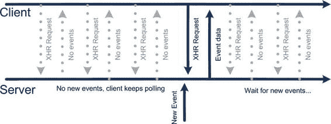

**图 11-1.** *最简单的轮询技术需要服务器和客户端执行大量不必要的工作。*

在简单轮询方法中，即使没有新事件，也会写入响应并关闭连接。然后客户端会等待一定时间（称为“轮询间隔”），并再次重新连接。这种方法的缺点是，在最坏情况下，延迟等于轮询间隔时间。缩短间隔值也不可取：大量带宽将被浪费在仅发送头部信息上。服务器会在巨大负载下不堪重负（处理一个 HTTP 请求本身就有少量 CPU 和内存开销）。更多的客户端意味着更多浪费的 CPU 时间。

HTTP 协议有一个有趣的特点：它不要求服务器立即响应客户端请求。事实上，服务器可以根据需要保持 HTTP 连接长时间打开。本节中的第一个技术正是利用这一事实来减少无用的调用次数。

###### XHR 长轮询

XHR 长轮询的工作原理与传统轮询几乎相同。唯一的区别在于，当服务器没有新事件时，它会保持连接打开。一旦有客户端的新事件，服务器就会响应并在之后关闭连接。这样，客户端连接可能会保持打开数秒钟，等待新数据。图 11-2 说明了这一思路。

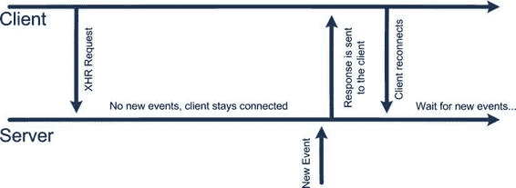

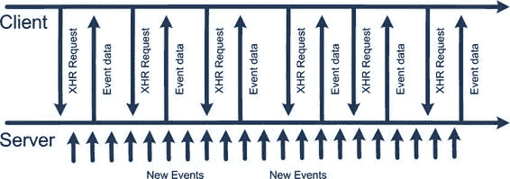


## 第 11 章：与服务器通信

**图 11-2.** *通过 XHR 长轮询，服务器会保持连接打开，直到有数据需要发送给客户端。*

如您所见，XHR 长轮询使用较少的请求来维持与服务器的连接。最大延迟开销是网页重新连接服务器所需的时间。

然而，长轮询也有其缺点：长时间运行的 XHR 请求可能会被中间代理服务器甚至浏览器本身终止。例如，运行在三星 Galaxy 上的 Android 2.2 如果空闲约 20 秒，就会终止 XHR 连接。更糟糕的是，中断"挂起"连接的规则可能因浏览器和代理而异。安全超时时间约为 15 秒。如果超过此时间且服务器没有响应内容，它应发送空响应并关闭连接。

第二个缺点是，在消息密集型环境中，长轮询会失去优势并退化为常规轮询。这是该技术不适用于竞速类、在线 RPG 或策略游戏等快节奏实时游戏的原因之一。客户端会花费大量时间重新连接服务器（见图 11-3）。

**图 11-3.** *消息密集型环境中的长轮询问题。长轮询退化为简单轮询：每秒发送一次请求。*

长轮询的示例代码如清单 11-8（客户端）和 11-9（服务器）所示。

**清单 11-8.** *XHR 长轮询客户端示例*

```javascript
function init() {
  pollServer();
}

function pollServer() {
  var xhr = new XMLHttpRequest();
  console.log("Requesting");
  xhr.open('GET', 'lobby');
  xhr.onload = function(e) {
    console.log("RESPONSE:" + xhr.responseText);
    setTimeout(pollServer, 4); // 收到响应后再次轮询服务器
  };
  xhr.onerror = function(e) {
    console.log("Error, retrying");
    setTimeout(pollServer, 4); // 发生错误时再次轮询服务器
  };
  xhr.send();
}
```

**清单 11-9.** *最简单的长轮询服务器*

```javascript
var clients = [];

// 以随机间隔发送通知
(function() {
  notifyClients();
  setTimeout(arguments.callee, Math.floor((Math.random()*10000)));
})();

/**
 * 向每个已连接客户端发送新事件数据
 */
function notifyClients() {
  clients.forEach(function(res) {
    res.send("new event data");
  });
  clients = []; // 客户端将重新连接，清空数组
}

app.get("/lobby", function(req, res) {
  clients.push(res);
  console.log("Added client, now " + clients.length + " connected");
});
```

当然，这种实现不应用于生产环境；它仅说明长轮询传输背后的基本技术。如您所见，服务器不会立即返回响应。相反，响应对象会保存在`clients`数组中供后续使用。一旦有可用数据，服务器会将其广播给客户端并清空数组。此时客户端断开连接，并在几毫秒后重新连接。

实际生产环境中的实现会更加复杂。它需要优雅地处理断开连接和错误，将客户端消息保存在队列中以免在客户端重连时丢失，等等。下一章，我们将使用 Socket.IO——这个库已经实现了传输处理的复杂部分。

这个简化版长轮询实现的完整源代码与其他本章资源一起位于`02.longpoll`文件夹中。

###### XHR 流式传输

有一种方法可以解决长轮询的主要问题：在每次收到消息后重新连接。这种方法称为 XHR 流式传输。

从技术上讲，这并非全新的传输方式，而是对长轮询的轻微改进。

其工作原理如下：如果将响应内容的类型设置为自定义


# Markdown 排版结果

`value`（如`"application/x-custom-event-stream"`），浏览器不会等待接收完整的响应体。相反，它会将服务器写入`XHR`对象的`responseText`的所有内容追加到末尾，并触发`onreadystatechange`（以及 Level 2 中的`onprogress`），让您有机会从流中提取新消息。请查看列表 11-10 和 11-11 中更新的客户端和服务器代码。

**列表 11-10.** *XHR Streaming Transport：示例客户端*

```javascript
function init() {
  pollServer();
}

function pollServer() {
  var responseMarker = 0;
  var xhr = new XMLHttpRequest();
  console.log("Requesting");
  xhr.open('GET', 'lobby');

  xhr.onload = function(e) {
    console.log("Server closed the stream, reconnect");
    setTimeout(pollServer, 4);
  };

  xhr.onprogress = function(e) {
    if (this.readyState == 3 && this.status == 200) {
      var response = xhr.responseText.substr(responseMarker);
      responseMarker = xhr.responseText.length;
      console.log(response);
    }
  };

  xhr.onerror = function(e) {
    console.log("Error, retrying");
    setTimeout(pollServer, 4);
  };

  xhr.send();
}
```

客户端的代码发生了显著变化。此版本的代码依赖`onprogress()`函数来获取新事件，而不是通常的`onload()`。此外，新消息被追加到`responseText`的末尾，因此要使用所描述的方法，必须从整个响应字符串中手动提取最新消息。

**列表 11-11.** *XHR Streaming：示例服务器*

```javascript
var clients = [];

// send notification with random intervals
(function() {
  notifyClients();
  setTimeout(arguments.callee, Math.floor((Math.random() * 10000)));
})();

/**
 * Sends the new event data to every connected client
 */
function notifyClients() {
  clients.forEach(function(res) {
    res.write("new event data");
  });
  // clients = []; // Do not clean the array, clients stay connected
}

app.get("/lobby", function(req, res) {
  res.contentType("application/x-custom-event-stream");
  clients.push(res);
  console.log("Added client, now " + clients.length + " connected");
});
```

服务器几乎保持不变。更改的部分已加粗。首先，服务器向浏览器发送自定义的`contentType`。然后，当新消息到达时，它会将新消息写入客户端流中。`write()`函数不会关闭底层连接，因此此时无需清除客户端数组（当客户端断开连接时仍需清除，否则数组会保留垃圾数据；但就这个简单的演示而言，它工作得很好）。流式传输的主要优势在于，在消息密集的环境中，客户端无需在每条消息后重新建立连接。

完整的 XHR 流式传输示例应用程序位于`03.streaming`文件夹中，与本章的其他代码一起提供。

##### 过时的解决方案

本节介绍了一些以前使用过但已被其他 API 替代的传输方式，这些 API 以更好的方式解决了问题。这些传输方式包括：

- JSONP 轮询
- Flash Socket
- Forever IFRAME

###### JSONP 轮询

JSONP 轮询旨在解决从与客户端不同域的服务器加载数据的问题。例如，如果服务器位于`http://server.example.com`，而客户端 HTML 页面从`http://client.example.com`加载，由于同源策略的限制，它们无法通过`XHR`进行通信，这是一种安全限制，阻止了`XHR`向其他域发送请求。

JSONP 背后的技术是创建新的`<script>`元素并将其附加到文档的`body`中。由于`script`元素可以从任何域加载脚本，因此没有安全限制阻止请求检索数据。

JSONP 传输已过时，因为现在有一种新的 API 以标准方式规定域间资源共享：跨域资源共享（CORS）。


## 第 11 章：与服务器通信

### 共享或 CORS

CORS（跨域资源共享）是一种在 [www.w3.org/TR/cors/](http://www.w3.org/TR/cors/) 中描述的规范。该规范描述了服务器必须发送给客户端以允许访问其资源的特殊标头。使用 CORS 更为可取，因为 JSONP 对请求生命周期（例如，一旦启动就无法取消）和错误处理的控制能力要弱得多。使用 CORS 的最后一个重要原因是它是一个受支持的标准，而不是像 JSONP 那样的权宜之计。

### Flash Socket

Flash Socket 是一种依赖 Flash 插件来处理与服务器通信的传输方式。Flash 组件通知 JavaScript 新事件的发生。Flash 负责通知，而 JavaScript 负责处理逻辑。许多人不同意这种传输方式已经过时；事实上，Flash 在处理持久的低延迟连接方面做得非常好，非常类似于 WebSocket。然而，Adobe 停止了对移动设备上 Flash Player 的支持——这就是为什么不能再依赖这种传输方式的原因（至少不能在智能手机上）。

这种传输方式过时，并不是因为通信技术被更好的 API 取代，而是因为它所依赖的核心组件现在已走到生命周期的尽头。

### 永久 IFRAME

永久 IFRAME 是最古老的传输方式：它依赖于 HTTP/1.1 的一个特性及其分块编码，该编码最初是为了处理非常大的文档而引入的。IFRAME 与服务器建立一个永不关闭的连接。服务器的任务是不断提供新的数据块——即包含处理新事件命令的 script 元素。每当服务器需要发送事件时，它就会向这个无限页面中追加另一个 `<script>` 块。该脚本会被客户端立即执行，这就是这种传输方式提供低延迟通信的原理。

这种传输方式已经过时，因为它已被本节前面描述的几种更好的解决方案所取代。永久 IFRAME 的两个主要缺点是在不同浏览器之间行为不一致以及错误处理能力差。

### 在现场测试传输方式

一个好的传输方式的主要要求之一是可靠性。我们生活在一个不完美的世界，移动数据连接有时可能会中断。作为开发者，你对此无能为力。你的目标是确保连接的暂时中断不会将玩家踢出游戏，并且当连接恢复后，他可以继续游戏。此外，在连接不畅期间游戏尝试发送的消息不应丢失。这些消息应该被保存在某个地方，以便在设备重新上线后发送并传递到服务器。

测试游戏的最佳方式是启动一个服务器，然后尝试在从家到办公室的路上进行游戏。从家里的 Wi-Fi 连接开始，然后当你走到街上时切换到 3G。坐几站公交车，然后换乘地铁，继续在那里进行你的实验。最后，去买杯咖啡，然后去公园。别忘了在有空闲时间时接听来电或发送几条短信。

现在，请诚实地回答以下问题：

-   你的在线游戏体验如何？
-   是否有任何卡顿或崩溃？
-   你是否丢失了任何数据、回合或服务器更新？
-   一旦服务器变得可用，游戏引擎是否能够恢复同步？
-   你的游戏是否显示某种消息来警告你未连接？
-   从你的对手的角度看情况如何？他是否知道你正在失去连接？他应该知道吗？当他看到你几分钟没有响应时，他是否有机会结束比赛？

如果你在第一次进行此类实验后对所有答案都感到满意，请给我寄张明信片。我想生活在一个拥有完美移动数据覆盖的城市。

跑遍全城并不是调试网络的最佳方式，但是如何


#### 调试网络问题

如果你的办公室 Wi-Fi 运行完美，为何还要调试？有一些工具可以模拟糟糕的网络环境；它们就是为此专门设计的。

##### `DDMS` （Dalvik 调试监控服务器）

模拟不良网络最简单的方法是使用 Android 模拟器配合一个名为 Dalvik 调试监控服务器（简称`DDMS`）的标准工具。它位于模拟器安装目录的`Tools`文件夹中。运行该应用程序，并在右侧找到`Emulator Control`标签页（见图 11-4）。其中包含几个用于控制数据行为、带宽和延迟的选项。

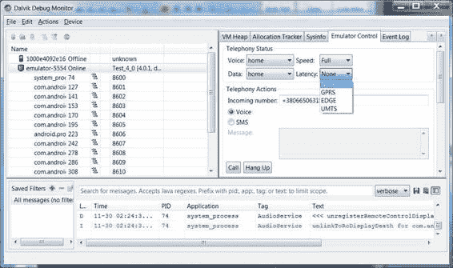

**第 11 章：与服务器通信**

**图 11-4.** *DDMS 窗口显示了多个用于模拟真实网络环境的选项* 还有一个选项可以完全切断模拟器的网络连接，但建议不要勾选它：`DDMS`和`ADB`（Android 调试桥）是通过网络与模拟器通信的。如果关闭了网络，你将无法以同样的方式重新开启，因为模拟器将不再响应。

`Telephony Actions`（电话操作）部分允许你模拟来电或短信。

##### 模拟不良网络的专用软件

`DDMS`的功能有些局限，因为它只能模拟低带宽和网络延迟，无法模拟数据包丢失和临时断连。

幸运的是，有多种解决方案可用于模拟不良网络，不过大多数方案都需要一定的网络知识。

遗憾的是，深入讨论网络配置以及搭建一个能帮助模拟真实移动流量的系统超出了本书的范围。不过，我将为你提供关于`DummyNet`和`WANem`的信息，它们是入门的不错选择。

`DummyNet`（[`info.iet.unipi.it/~luigi/dummynet/`](http://info.iet.unipi.it/~luigi/dummynet/)）是一个用于流量整形和低连接性模拟的工具。它最初是为 FreeBSD 开发的，但后来被移植到所有主流平台，包括 Windows 和 Linux。

**第 11 章：与服务器通信**

**475**

你可以在[`cs.baylor.edu/~donahoo/tools/dummy/tutorial.htm`](http://cs.baylor.edu/~donahoo/tools/dummy/tutorial.htm)找到关于为`DummyNet`设置规则的教程。

`WANem`项目（[http://wanem.sourceforge.net](http://wanem.sourceforge.net）是一个基于定制 Knoppix 发行版的工具。基本上，`WANem`是一个独立的操作系统，需要通过 Live CD 加载或在虚拟盒子中运行，以便它能在任何现代操作系统上运行。`WANem`拥有直观的 Web 界面，允许只想测试 Web 游戏连接性的人员无需深入研究网络细节即可搭建测试环境。市面上还有其他工具，但`DummyNet`和`WANem`似乎是最流行的。

## 本章小结

在本章中，我们回顾了从服务器加载数据的多种可用技术。主要有两种通信类型：

- **Ajax**：一种“经典”模型，其中客户端是唯一可以发起通信的一方。
- **反向 Ajax**：一种“反转”模型，也称为服务器推送和 Comet，其中服务器可以将消息推送到客户端。

我们了解到这两种技术都有多种可用的 API，但市场上大多数设备对新 API 的支持程度并不高。对于 Ajax，我们学习了如何通过普通的`XMLHttpRequest`从服务器请求数据，以及同一 API 的更好版本——`XMLHttpRequest Level 2`。我们还研究了加载二进制数据并在客户端进行解析的问题。

反向 Ajax 允许我们在服务器和网页之间建立一个相对可靠且低延迟的通信通道，以实现接近实时的通信。

为此，客户端和服务器必须建立连接并尽可能长时间地保持其打开状态。然后服务器可以利用此连接发送更新。有多种方法可以建立这种通信并支持该连接，这些方法被称为传输机制。


## 第 12 章：打造多人游戏

在撰写本文时，没有任何一种传输方式能像银弹一样完美适用于游戏开发。每种可用的传输方式都是在浏览器支持、延迟、可靠性、CPU 周期和流量之间进行权衡。

在下一章中，我们将把所学知识应用于实际任务：为我们的“四球游戏”构建客户端-服务器实现。

## 打造多人游戏

本章致力于将我们在前两章中学到的技能付诸实践。目标是将我们在第 3 章中开发的单人版“四球游戏”打造成一个功能完备的多人游戏版本。阅读本章后，你将了解如何：

- 实现基本的多人游戏架构
- 在客户端和服务器之间分配游戏逻辑
- 在浏览器和`Node.js`之间共享 JavaScript 组件
- 使用`Socket.IO`处理实时通信

我们将从审视网络游戏的架构开始，内容涵盖从典型休闲在线游戏面临的挑战，到近期可能在移动网页上出现的高级快节奏实时游戏。

下一节将专门介绍支持在线体验的多人游戏基本组件。

接着，我们将讨论`Socket.IO`——这个`Node.js`模块能够减轻提供最佳实时网络传输方式的负担。最后一节专门讲解游戏实现：我们将采用单人版的代码，并新增对大厅和多人比赛的支持。代码将展示`Socket.IO`的常见模式；一旦你掌握了这些，就可以自行向项目添加更高级的功能。

### 网络游戏架构分析

网络应用总是由两个部分组成：客户端和服务器。在 PC 游戏开发行业中，服务器端逻辑常被嵌入到游戏中。例如，当两个用户想要玩《暗黑破坏神 2》时，他们无需单独设置专门的服务器软件；相反，他们启动游戏并选择局域网游戏模式。随后，其中一个启动的实例担任服务器角色，允许其他人连接并一起游戏，负责处理数据包传输、语音通信、游戏内聊天以及其他常见的多人游戏功能。在这种情况下，可能没有独立的服务器应用程序，比如游戏文件夹中的某个`server.exe`文件。尽管如此，这两个组成部分——客户端和服务器——在每一个支持网络的游戏中都实际存在。

网页游戏的工作方式则不同：游戏客户端通常是一个包含一定量 JavaScript 逻辑的网页。该页面由网页服务器准备和提供，然后由浏览器加载和渲染。从这一刻起，它可以作为独立应用程序运行（就像前几章详细介绍的那些），也可以作为一个“客户端”，与相同或不同的服务器“对话”，并让用户与其他像他自己一样的玩家一起游玩。

本章的任务是制作一个更高级的“四球游戏”版本。我们将添加非常基础的网络支持——一个大厅和游戏的多人版本。本章的材料将让你构建一个支持网络功能的网页应用工作骨架，你可以在此基础上进一步扩展，以满足实际需求。

对于一个从未开发过简单在线多人游戏的人来说，这可能听起来是一项非常容易的任务。确实，我们已经实现了游戏中最困难的部分——图形引擎和逻辑——因此我们可以重用部分代码并迅速组装出一个服务器。然而，在实践中，情况并非如此。根据经验法则，将你制作一款优秀单人游戏所付出的努力乘以十，就是你制作同一款优秀多人版本所需付出的努力。图 12-1 展示了完成游戏网络版本所需的工作量。


# 简易游戏。核心游戏本身只是整个基础设施的一小部分。

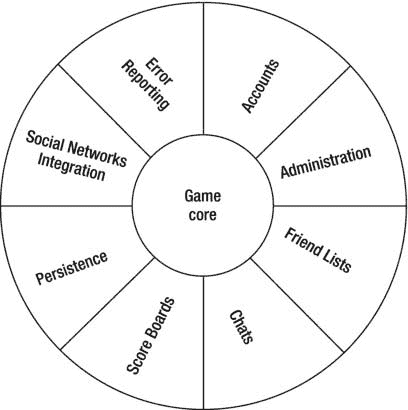

## 第 12 章：制作多人游戏

**479**

**图 12-1.** *开发一款优秀多人游戏各部分的投入比例*

为何需要如此多时间？多人游戏之所以更复杂，是因为它们需要特定的基础设施来支持无缝在线体验：大厅、评分、排行榜、好友列表、头像、聊天室——这些仅仅是个开始。浏览先进在线游戏社区，你还会发现更多组件。用户在线游戏时，不仅希望利用离线经验并消耗网络流量，更想结识新朋友、找到合适的对手、查看成就与进度，并证明自己胜过他人——这正是在线游戏的乐趣所在。开发此类基础设施工具往往比实现游戏核心（逻辑和 UI）更具挑战性。

**注意：** 本章假定读者具备 HTTP 协议基础知识。至少应了解请求头与请求体的区别，熟悉`GET`和`POST`方法及其差异，知道开发者向服务器发送参数时应如何序列化，理解服务器响应码的含义，以及其他 HTTP 基础知识。

## 第 12 章：制作多人游戏

#### 游戏架构：从单机走向联机

让我们找出将第三章创建的独立游戏升级为多人版本的最佳方式。首先，客户端-服务器方案涉及两个共同承担职责与逻辑的组件：客户端和服务器。我们需要分析两者之间分配任务的最佳方式。由于已实现部分组件，我们希望尽可能复用它们。需考虑两点：第一，专为单机设计的组件通常至少需要微调才能使用；第二，如何实现组件代码在客户端与服务器间的共享。

解决这两个问题后，即可着手设计游戏架构并用代码实现。通用流程如下：

1. 明确客户端与服务器的职责。
2. 审查现有游戏组件，思考如何复用。
3. 设计游戏架构。
4. 实现架构。

#### 客户端与服务器的职责

划分客户端与服务器的职责并非总是小事一桩，但架构师大多会基于游戏类型、安全需求、响应速度要求等因素做出决策。核心问题在于游戏逻辑（例如回合验证）的存放位置。本节中，我们将探讨不同类型的游戏，而不仅是四球游戏。

Web 领域的古老规则是："永远不要信任客户端输入。"这意味着客户端能发送到服务器的任何内容，恶意用户也可能发送，以攻击系统并获取本不应访问的功能。举个简单的潜在问题示例：支持将最终得分提交至全球排行榜的游戏。如果用户具备足够技术能力，就可能轻易劫持向服务器传输结果的过程，并发送任意数值。通常，使用 HTTP 等文本协议更容易实现，二进制协议稍难，但只要黑客有足够时间和耐心，任何协议都可能被突破。这样一来，任何用户都可能登上排行榜首位。最好的情况是作弊者被识别并封禁。

考虑到安全性，解决方案似乎显而易见：将所有可能的逻辑都放在服务器端，不让客户端做出任何


`unchecked input`。这种偏执的方法在处理回合制游戏时效果很好，因为整个验证逻辑都在服务器端完成。服务器是仲裁者，无论如何都不允许客户端作弊。然而，这并非总是可行的。

对于仅在联系服务器时发送高分数据的单人游戏客户端，其合法性是无法验证的，因为客户端并没有发送任何能证明它通过合法操作获得该分数的证据。服务器就像一位告诉学生“如果你们完成了作业，就举手”的大学教授。如果他不核实那些声称完成的学生是否真的做了，学生们很快就开始为了获得加分或好成绩而作弊。

另一类极难限制作弊的广泛游戏类型是快节奏的多人游戏，例如在线射击游戏。这类游戏往往不得不为了更好的可玩性和更低的服务器复杂度而牺牲验证。之所以无法完美验证用户的操作，至少有两个原因：数据量过大以及导致验证不准确的延迟。

如果用于验证而发送的数据量过大，那么在流量和所需的处理能力方面，验证成本都会变得过于高昂。Heckler & Koch MP5K 系列的射速约为每分钟 900 发（每秒 15 发）。验证每一颗子弹需要多少流量和 CPU 周期？更不用说在多人游戏地图上十个人同时开火的情况了。当然，这个问题是可以解决的：例如，你可以只发送连发中每第十发子弹的方向，然后对其他的子弹方向进行插值计算。

第二个使服务器端验证对实时动作游戏吸引力下降的问题是网络延迟（或称 lag）。图 12-2 说明了这个问题。这是虚拟游戏战场的俯视图，玩家正试图用投射武器攻击一个快速移动的目标。客户端看到玩家击中了目标，但由于延迟，服务器端的游戏状态与客户端不同，服务器认为玩家打偏了。不用说，当玩家看到自己刚刚击中的敌人欢快地跑开时，会非常沮丧。

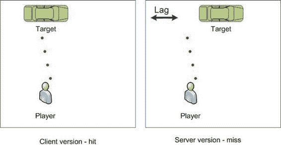

**图 12-2.** 由于延迟，服务器接收到的射击结果与客户端不同。

有很多复杂的算法可以解决延迟问题，这些算法通常被称为延迟补偿技术。例如，如果特定客户端的网络延迟是 300 毫秒，那么当服务器接收到事件时，它会尝试回退 300 毫秒，并像玩家在射击那一刻看到的那样查看游戏世界。不幸的是，这些技术为一种截然不同的网络协议漏洞利用方式打开了方便之门，使得恶意玩家能够在游戏中获得不公平的优势。

**注意：** 正如我所提到的，Android 游戏尚未准备好应对这类问题，因为快节奏的在线游戏离不开网络层的良好支持。在默认的 Android 浏览器支持 `WebSockets` 或任何其他类似 API 之前，那些毫秒数至关重要的游戏是无法以可接受的质量来实现的。

回到“四球”游戏，将逻辑迁移到服务器端的任务并不太难：没有像 3D 射击游戏那样需要补偿的延迟，也没有需要在服务器端复制的物理效果等，而且规则相当简单。我们将让服务器验证玩家执行的每一步——这就是我们验证解决方案的策略。如果这一步是有效的，服务器就将其广播给双方玩家；否则，它会向试图发送错误操作的玩家发送一个错误。

### 游戏组件

至少，多人游戏应该有一个大厅，也就是玩家列表。


# 第 12 章：制作多人游戏

等待对手并准备开始游戏。这意味着除了我们已经拥有的组件外，还需要至少再创建两个：用于在客户端渲染的大厅 UI，以及用于通知新用户的服务器端支持。

游戏架构中一个非常重要的变化是，客户端现在拥有多个屏幕（或状态）：大厅和游戏。在此之前，我们的游戏是在一个大画布上渲染的，唯一的游戏状态就是“游玩中”。然而，当你制作一款商业游戏时，它会有几个完全不同的屏幕，以完全不同的方式渲染，并支持一套完全不同的用户操作。例如，以下是一款在线策略游戏的几个屏幕：

- 主菜单
- 世界地图
- 城市界面
- 建筑与交易界面
- 战场界面
- 游戏内帮助界面
- 设置界面

这些屏幕充当游戏的子模块：它们提供了访问游戏不同方面的途径，你应该将它们视为独立的软件组件。如果你决定更新战场界面，那意味着只更新这个模块，而不是整个项目。我们即将实现的游戏非常简单：它只有两个屏幕（大厅和游戏板），但我们仍然需要思考一种好的方法，向用户显示正确的屏幕，并根据应用程序的当前状态处理输入。最后这项任务在 HTML 触摸界面中非常简单：触摸事件总是分发给你触摸的组件，因此不可见的组件不会接收到任何事件。

我们唯一缺少的重要部分就是传输方式的选择。在本章中，我们将使用`Socket.IO`库。在讨论完项目结构之后，我们将立即开始学习它。

### 项目结构

这个项目的文件夹结构与典型的 Node 项目结构相同。我们来回顾一下，确保文件夹结构清晰。图 12-3 展示了项目完成时的样子。

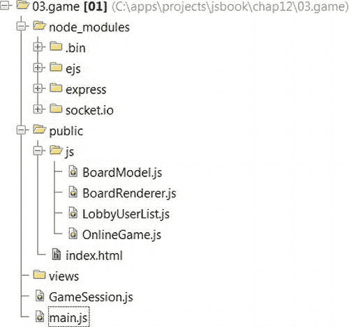

**图 12-3.** *项目的结构*

`main.js`文件是 Node.js 应用程序的入口点。用于浏览器 HTML 文件和客户端 JavaScript 文件的文件存放在`public`文件夹中。创建所描述的文件夹结构，并将我们在第 3 章中创建的离线游戏代码放入`public`文件夹中。我将旧的`index.html`文件重命名为`offline.html`，以保持单人游戏版本可访问。新的`index.html`文件是多人游戏版本的入口点。

### 使用 Socket.IO 的游戏大厅

`Socket.IO`是由 Guillermo Rauch（[`devthought.com`](http://devthought.com)）创建的项目，可在 GitHub（[`github.com/LearnBoost/socket.io`](https://github.com/LearnBoost/socket.io)）或作为 NPM 模块获取。该项目的目标是“模糊不同传输机制之间的差异”，正如官方项目页面（[`socket.io/`](http://socket.io/)）所述。更正式地说，`Socket.IO`是一个便捷的客户端-服务器库，它允许你在不考虑传输细节的情况下实现页面内网络连接。让`Socket.IO`回答一些底层问题，比如“在这个设备上使用哪种传输方式最好？”或“如何处理客户端重新连接时可能到来的消息？”或“如何跟踪所有客户端并在需要时向他们广播消息？”节省下来的时间可以用来构建更好的游戏。

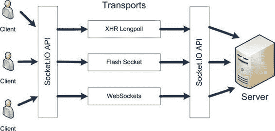

**注意：** 如果说`Socket.IO`是唯一可用的浏览器网络库，那是不公平的。还有另一个不错的项目叫 Faye（[`github.com/faye/faye`](https://github.com/faye/faye)），由 James Coglan（[`jcoglan.com`](http://jcoglan.com)）创建。它提供了类似的解决方案，并获得了开发者们的一些好评。


# 为何本章选择 Socket.IO 而非 Faye

我选择在教程中使用 `Socket.IO` 而非 `Faye`，理由与技术或质量无关。首先，`Faye` 实现了一种名为 `Bayeux` 的高级通信协议（http://svn.cometd.org/trunk/bayeux/bayeux.html），为保持内容简洁，我不打算花费额外篇幅来详述该协议。第二个原因则纯粹出于社交层面：`Socket.IO` 拥有更庞大的开源社区，且规模持续增长。在我撰写本章期间，其邮件列表又新增了约 50 名成员。不过，我仍鼓励你亲自去了解 `Faye`，从而对这个精巧项目形成自己的判断。

`Socket.IO` 基于套接字（Socket）理念构建。`Socket.IO` 中的套接字与真正的 TCP 套接字或 Unix 套接字并无关联，它仅仅是针对不同客户端所使用的传输层协议之上的抽象层。请参考图 12-4 了解其工作原理：服务器可同时维持与多个客户端的连接，每个客户端会选用最适合的传输方式。无论是客户端还是服务器，都不需要执行任何传输层相关的具体操作（例如创建 XHR 对象或发送请求）。统一的通信接口就是 `Socket`——其余细节均由库自行处理。我相信你已经迫不及待想看到实际案例了。

**图 12-4.** *Socket.IO 隐藏了底层传输的细节，为客户端与服务器之间的通信提供了简单可靠的 API。*

#### 客户端-服务器通信

让我们先迈出实现大厅功能的第一步。当第一个客户端连接到服务器时，应收到“你已连接”的消息；后续客户端则应收到“新用户加入”的消息。

首先，你需要安装 `Socket.IO`（即使 `Socket.IO` 报告无法编译原生扩展也无需担心，项目依然能正常运行）：

```
> npm install socket.io
```

接着，初始化 `Socket.IO` 服务器。它可独立运行，但更常见的是作为 `Express` 服务器的包装器（参见代码清单 12-1）。专用于 `Socket.IO` 的请求会被拦截，并与主流网站流程分开独立处理。`Express` 与 `Socket.IO` 的集成相得益彰，过程简洁流畅。

**代码清单 12-1.** *为 Express 服务器添加 Socket.IO 支持*

```
var express = require("express");
var http = require("http");
var app = express();
var server = http.createServer(app);
var io = require("socket.io").listen(server, {
  "polling duration": 10
});
…
// 接下来是常规的 Express 设置
server.listen(80);
```

你可能已经猜到，新对象 `io` 包装了现有的服务器。`listen` 的第二个参数是可选的服务器配置项列表。`"polling duration"` 控制长轮询模式下保持打开请求的最大时长，此处已从默认值调低，因为某些移动设备会提前强制断开连接。新创建的 `io` 对象就是准备就绪的 `Socket.IO` 服务器，可以监听连接并与客户端交换消息。事不宜迟，让我们为服务器添加用户跟踪功能吧。

从现在开始，通信流程变得十分直接。每当有新客户端连接时，服务器会创建一个名为 `socket` 的新对象——这是隐藏传输细节的抽象层。你可以监听客户端可能通过 `emit()` 发出的各种套接字事件，也可以自行使用 `emit()` 发送消息。若需要向多个客户端通知特定事件，可调用 `broadcast()`。代码清单 12-2 实现了基本的大厅功能，是展示 `Socket.IO` 基础知识的良好示例。

**代码清单 12-2.** *为服务器添加基本大厅功能*

```
var maxUserId = 0;
io.sockets.on("connection", function (socket) {
  var userId = maxUserId++;
  var userName = "User " + userId;
  var user = {id: userId, name: userName};
  socket.emit("info", { text: "You have connected" });
}
```


`socket.broadcast.emit("user-joined", user);`

`socket.on("disconnect", function () {`

`    socket.broadcast.emit("user-left", user);`

`});`

`});`

第二行监听了为每个新建立的连接触发的`"connection"`事件。请注意，`Socket.IO`连接与`Express`会话无关。例如，如果您在谷歌浏览器中打开两个选项卡并访问同一个页面，它们共享同一个`Express`会话（因为它们共享存储在 Cookie 中的会话 ID），但`Socket.IO`将它们识别为两个不同的套接字。API 将`socket`对象作为参数传递给该函数。

接下来的两行创建了一个包含某些用户信息的新对象，以便用一种人类可读的方式识别用户。每个用户都有一个 ID 和一个唯一的默认名称。如果您的游戏具有身份验证和授权算法，您可能会从数据库或社交网络 API 获取用户名，但在这个简单的示例中，所有用户都称为`User 1`、`User 2`，依此类推。

代码中最有趣的部分是对`emit()`和`broadcast()`的两次调用。在第一行中，我们向刚刚连接的用户发送消息（或者，用`Socket.IO`的术语来说，我们触发了该事件），消息类型为`"info"`，并附带一个包含问候文本的对象。第二行“广播”了这个事件——即向除已连接用户之外的所有其他用户发送消息。最后一部分监听了`"disconnect"`事件，并再次广播消息，以通知其他玩家大厅内发生的变化。

现在让我们构建客户端。请查看列表 12-3 中的客户端代码。和往常一样，这是一个简单的网页；不过，它带有一些`Socket.IO`的魔法。

**第 12 章：制作多玩家游戏**

**列表 12-3.** *用于 Socket.IO 服务器的客户端*

```
<!DOCTYPE html>
<html lang="en">
<head>
    <meta charset="utf-8" />
    <meta name="viewport"
          content="width=device-width, initial-scale=1.0, maximum-scale=1.0,
          user-scalable=no, target-densitydpi=device-dpi"/>
    <style>
        html, body {
            overflow: hidden;
            width: 100%;
            height: 100%;
            margin:0;
            padding:0;
            border: 0;
        }
    </style>
    <script src="js/utils.js"></script>
    <script src="/socket.io/socket.io.js"></script>
    <script>
        var socket;
        function init() {
            socket = io.connect();
            socket.on("user-joined", function (user) {
                console.log (user.name + " joined");
            });
            socket.on("user-left", function (user) {
                console.log (user.name + " left");
            });
            socket.on("info", function (info) {
                console.log (info.text);
            });
        }
    </script>
</head>
<body onload="init()">
</body>
</html>
```

列表 12-3 中的代码使用了与服务器完全相同的方法。它获取`socket`对象，并将其用作与服务器通信的唯一入口点。然后使用该`socket`来监听消息，或触发新的事件（稍后会详细介绍）。请注意，服务器上并没有名为`"/socket.io/socket.io.js"`的文件。`Socket.IO`服务器会处理对此脚本的请求，并返回该文件本身，因此您无需为此担心。这段代码看起来异常简单和清晰！

**注意：**几年前，我必须实现一个自定义的浏览器网络库，该库仅依赖于两种传输实现：`XHR`长轮询和`XHR`流式传输。我花了大约三周的时间来构建服务器和可靠的客户端，而它们完成的功能与我们刚才在三分钟内构建的完全相同。

现在您可以尝试运行此代码。到目前为止，它没有任何用户界面元素，但预期的控制台输出可以证明您所做的一切都是正确的，并且您已经让一个非常基本的`Hello World`应用程序运行起来了。

当前状态下的应用程序代码以及本章的其他资料位于名为`01.basic_io`的文件夹中。

**添加游戏大厅屏幕**

我们已经建立了基本的通信，现在我们应该制作一个游戏大厅屏幕。将消息写入控制台并不是通知用户游戏事件的好方法。


# 排版后的文档

大厅是一个可点击按钮的列表——每个按钮代表一个用户。当玩家点击按钮时，游戏应开始。你永远不应忘记的经验法则是：不要试图通过光栅图形或`canvas`来重现丰富的用户界面。人们在此阶段常犯的错误是开始重新造轮子，并在 2D 上下文中渲染按钮。有时这种做法是有意义的，但 99%的情况下，这会极大浪费你的努力和浏览器资源。现代浏览器多年来已逐步改进典型 UI 元素的渲染算法。我无法相信有人能在游戏开发通常有限的时间范围内，在`canvas`上做到同样的事情。不要尝试在`canvas`上自行实现滑块、按钮或下拉列表。在你有真正充分的理由之前，请使用 HTML 设施。

我们将大厅的用户列表实现为一个独立的类，名为`LobbyUsersList`。它封装了 UI 元素，并将其用作用户列表的占位符。这个类的代码相当简单：它只进行 DOM 操作。这里使用的一个小技巧是——列表项的类名与用户在大厅中的状态名称相同：`playing`或`ready`。这样，我们可以根据玩家是否准备好游戏，轻松更改按钮的视觉样式。清单 12-4 展示了这个类的代码。

**清单 12-4.** *`LobbyUsersList`类：用于显示当前可用用户的客户端组件*

```javascript
function LobbyUsersList(listElement, clickCallback) {
  this._users = {};
  this._listElement = listElement;
  this._clickCallback = clickCallback;
}

var _p = LobbyUsersList.prototype;

_p.add = function(userId, username, status) {
  // 如果用户已存在，则仅更新其信息
  if (this._users[userId]) {
    this.setStatus(userId, status);
    this.setName(userId, username);
  } else {
    // 否则，创建新元素并附加到 DOM 树
    var el = this._getUserListElement(userId, username, status);
    this._users[userId] = el;
    this._listElement.appendChild(el);

    // 当列表项被点击时，提取当前用户数据并执行回调
    el.addEventListener("click", (function(e) {
      var userId = el.getAttribute("data-userid");
      var userName = el.innerHTML;
      var state = el.className;
      this._clickCallback.call(this, userId, userName, status);
    }).bind(this));
  }
};

_p.setStatus = function(userId, status) {
  // 设置"status"意味着更新类名
  if (this._users[userId]) {
    this._users[userId].className = status;
  }
};

_p.setName = function(userId, name) {
  // Name 是 innerHTML
  if (this._users[userId]) {
    this._users[userId].innerHTML = name;
  }
};

_p.remove = function(userId) {
  if (this._users[userId]) {
    this._listElement.removeChild(this._users[userId]);
    delete this._users[userId];
  }
};

_p._getUserListElement = function(userId, userName, status) {
  // 创建新元素（列表项）并设置值
  var el = document.createElement("li");
  el.className = status;

  // 使用 HTML5 data 属性保存与此元素关联的自定义数据
  // http://dev.w3.org/html5/spec/Overview.html#embedding-custom-non-visible-data-with-the-data-attributes
  el.setAttribute("data-userid", userId);
  el.innerHTML = userName;
  return el;
};
```

这个类有点取巧：它将模型（用户列表、用户名、ID 和状态）与视图（表示各个项目的 HTML 元素）结合在一起。代码相当不言自明。如果我们将用户列表元素添加到页面，并钩入`Socket.IO`事件，我们将获得一个功能完善的大厅（参见清单 12-5）。

**清单 12-5.** *创建大厅的代码*

```html
<html>
<head>
```


# 第 12 章：制作多人游戏

从 Wow! eBook 下载 <www.wowebook.com>

```html
<script>
var socket;
var userList;

function init() {
  socket = io.connect();

  socket.on("user-joined", function (user) {
    userList.add(user.id, user.name, user.status);
  });

  socket.on("user-left", function (user) {
    userList.remove(user.id);
  });

  socket.on("user-playing", function (user) {
    userList.setStatus(user.id, "playing");
  });

  socket.on("user-ready", function (user) {
    userList.setStatus(user.id, "ready");
  });

  socket.on("user-list", function (data) {
    for (var userId in data.users) {
      var user = data.users[userId];
      userList.add(user.id, user.name, user.status);
    }
  });

  socket.on("info", function (info) {
    console.log(info.text);
  });

  var listElement = document.getElementById("online_users");
  userList = new LobbyUsersList(listElement, onChallenge);
}

function onChallenge(userId, userName, status) {
  alert("你向用户 " + userName + " 发起了挑战，该用户当前状态为 " + status);
}
</script>

</head>
<body onload="init()">
<div id="lobby">
  <ul id="online_users"></ul>
</div>
</body>
</html>
```

客户端代码知道如何响应六种服务器事件：

- `"user-joined"`：当新用户加入大厅时发送
- `"user-left"`：当用户离开游戏时发送
- `"user-playing"`：当用户开始新游戏时发送（该用户无法参与其他游戏，也不能被邀请）
- `"user-ready"`：当用户完成游戏并准备接受新的邀请时发送
- `"user-list"`：房间内所有用户的列表（用于初始化大厅列表）
- `"info"`：在控制台中显示用于调试的通用消息

目前，服务器仅知道如何发送`"user-joined"`、`"user-left"`和`"info"`这三种消息。让我们增加一种消息类型——`"user-list"`，用于用已在线用户填充用户列表。为此，我们需要追踪每一位连接和断开的用户。幸运的是，这并不难实现。清单 12-6 展示了具体做法。

**清单 12-6.** *追踪连接和断开的用户*

```javascript
var maxUserId = 0;
var users = {};

io.sockets.on("connection", function (socket) {
  var userId = addUser(socket);

  socket.on("disconnect", function () {
    socket.broadcast.emit("user-left", users[userId]);
    delete users[userId];
  });
});

/**
 * 在服务器上注册用户。通知所有人该用户已加入大厅，
 * 并向新连接的用户发送在线用户列表。
 * @param socket 已连接客户端的套接字对象
 * @returns 新创建用户的 ID
 */
function addUser(socket) {
  var userId = maxUserId++;
  var userName = "User " + userId;
  var user = {id: userId, name: userName, status: "ready"};
  users[userId] = user;

  Object.defineProperty(user, "socket", {
    value: socket,
    enumerable: false
  });

  socket.emit("info", "你已经连接成功");
  socket.emit("user-list", { users: users });
  socket.broadcast.emit("user-joined", user);
  return userId;
}
```

我们将添加用户的代码移到了独立函数`addUser()`中。这样管理起来更加方便。每个新用户都会获得一个唯一 ID、一个`userName`、一个状态以及一个套接字。我们通过一种不同寻常的方式——`Object.defineProperty()`——来分配套接字属性。如果按常规方式分配套接字，例如：

```javascript
user.socket = socket;
```

那么每次用户对象被发送到客户端时，套接字对象也会被一并发送。显然，应用程序中并不需要这些数据。修复此行为的最简单方法是将该属性声明为不可枚举。此类属性只有在你知道其名称时才能访问，不会出现在`for..in`循环中，并且在将 JSON 序列化为字符串时会被忽略。这正是代码中`Object.defineProperty()`所实现的功能。

现在你可以测试代码了。尝试用你的设备连接服务器，打开几个浏览器窗口，观察新的列表项如何出现在屏幕上。然后关闭窗口，观察其中一个列表项是如何消失的。


大厅（lobby）的样式相当简陋，不适合游戏。实际上，无论是在桌面浏览器还是手机上，HTML 列表的基本样式都缺乏吸引力。图 12-5 展示了我们当前的工作成果。

**图 12-5.** *未添加任何额外 CSS 的大厅渲染效果*

这个结果看起来并不特别吸引人，但如果我们添加一些 CSS 魔法，列表会变得好得多。将清单 12-7 中的 CSS 代码添加到页面中。

**清单 12-7.** *大厅的 CSS 样式*

```css
<style>
html, body {
  overflow: hidden;
  width: 100%;
  height: 100%;
  margin: 0;
  padding: 0;
  border: 0;
}

#online_users {
  font-size: 2.5em;
  cursor: pointer;
  list-style: none;
  padding-left: 0;
}

#online_users li {
  margin: 0.2em;
  padding: 0.2em 0.2em 0.2em 0.2em;
  font-weight: bold;
  text-align: center;
  border: 3px solid #456f9a;
  background-image: -webkit-gradient(linear, 0% 0%, 0% 100%, from(#7FA6CD), to(#5F88B0));
  box-shadow: 3px 3px 3px #000000;
  border-radius: 6px;
}

#online_users li.ready {
  color: white;
}

#online_users li.playing {
  color: #006400;
}
</style>
```

经过样式处理后，普通的列表变成了相当美观的按钮列表（见图 12-6）。好吧，也许它没有那么漂亮——但如果你聘请一位真正的设计师，可以确信它一定会很棒。

**图 12-6.** *应用 CSS 样式后的同一大厅*

当前状态的项目保存在`02.lobby`文件夹中，以及本章的其他源码文件。欢迎随意尝试并改进大厅的外观和感觉。

### 添加游戏逻辑

本节的目标是完成多人版“四球”游戏的实现。我们现在有了一个可运行的大厅，玩家可以互相挑战。接下来让我们添加游戏处理逻辑本身。

在深入代码之前，我们先看看客户端和服务器都需要哪些共享组件。这个类就是`BoardModel`——它负责处理回合逻辑，并能检查回合是否合法。

#### 在客户端和服务器之间共享逻辑

目前，游戏板在单人模式下运行良好。当用户尝试走一步时，`BoardModel`会在移动正确时将新棋子放入场地，否则忽略该操作。在多玩家游戏中，仅点击屏幕不足以将棋子放到棋盘上。回合首先发送到服务器，然后服务器验证合法玩家是否在进行合法回合，只有在那之后，服务器才会将回合结果发送回客户端。

一个设计良好的游戏也应在客户端执行回合验证。这样做提高了可用性：错误的回合会立即被报告，无需向服务器发送响应。执行回合的算法如下：

1. 用户点击游戏板。
2. 客户端检测点击并计算点击下方列的编号。
3. 游戏客户端检查回合是否有效（如果无效，则忽略该回合，算法终止）。
4. 回合被发送到服务器，服务器执行相同类型的验证。
5. 回合结果发送给两位玩家，然后下一个玩家可以开始他的回合（当然，如果游戏未结束的话）。

如你所见，我们必须在客户端和服务器中重用验证逻辑——步骤 3 和步骤 4 执行相同的操作：步骤 3 在客户端验证回合，步骤 4 在服务器端验证。由于游戏的两部分都是用 JavaScript 编写的，因此自然而然地尝试重用相同的代码和可能相同的文件，以避免无用的代码重复。

这种方法只有一个问题。Node.js 的模块定义方式与常规的基于浏览器的类不同。Node.js 使用了一些在浏览器环境中不存在的“魔法”变量。例如，在 Node.js 中，你必须使用`exports`来使模块的部分内容对外部可见，而在浏览器中，你只需声明新的函数，它们就会被附加到全局`window`对象上。换句话说……


# 第 12 章：制作多人游戏

## 497

不同的是 `Node.js` 与浏览器环境下类的发布方式。

幸运的是，调整组件代码使其在两种环境下都能工作并不太难。我们先来看看代码清单 12-8 中的代码。

**代码清单 12-8.** *为在浏览器和 Node.js 中使用而对类代码进行封装*

```
(function(exports) {

function BoardModel(cols, rows) {

/* 此处为常规构造函数 */

}

/* BoardModel.js 的其余代码 */

// 将 API 发布到外部世界

exports.BoardModel = BoardModel;

})(typeof global == "object" ? exports : window);
```

从最后一行开始阅读代码。最后一行试图检测当前执行环境。如果当前作用域中定义了 `global` 对象，则代码由 `Node.js` 执行，否则由浏览器执行。

**注意：** 当然，这种检测方式远非完美。例如，如果有人在浏览器中定义了 `window.global` 变量，这段代码就会失效。然而在撰写本文时，还没有更好的方法来检测 JavaScript 模块的执行环境。

代码清单的最后一行将 `exports` 或 `window` 对象作为参数传递给匿名函数。接下来的代码片段相当简单：构造函数及其他函数和变量照常定义，只是它们现在属于函数的内部作用域（而不是像之前那样属于全局作用域）。最后，我们必须让构造函数对外部世界可用：`exports.BoardModel = BoardModel` 正是实现这一目的。在 `Node.js` 中，构造函数之后像往常一样通过调用 `require()` 来获取；而在浏览器中，这段代码等同于 `window.BoardModel = BoardModel`，这简单地将构造函数追加到浏览器的全局作用域中。

这种技术远非完美，但比代码复制要好得多。要完成此任务，请将更新后的 `Board.js` 文件添加到 `public/js` 文件夹中。放在这个位置，客户端和 `Node.js` 都可以访问到它。

从第 10 章中获取旧版本的 `BoardModel.js` 文件。按照代码清单 12-8 所示进行更新，并保存到 `public/js/BoardModel.js` 中。该文件

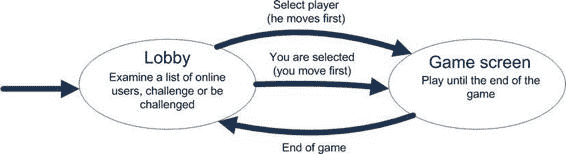

在客户端和服务器端都是必需的。这就是我们把它放在两者都可以访问的位置的原因。客户端可以读取 `public` 文件夹中的任何内容，而服务器端则可以读取任何内容，包括 `public` 文件夹。

#### 服务器端

鉴于我们已经为 `Node.js` 适配了主要的逻辑处理类，服务器现在已准备好处理真正的游戏会话！玩家从大厅开始，在那里他可以挑战其他玩家或等待被挑战（我们已经实现了这个功能）。一旦被挑战，玩家便进入与服务器之间的一种新的“通信模式”。他现在可以发送和接收游戏回合。一旦游戏结束，玩家便返回大厅。

让我们来看看客户端和服务器之间的通信协议，我们需要实现这个协议来支持所有这些功能。当玩家从列表中选择一位对手时，他会发送挑战。在真实的游戏中，玩家应该可以选择接受或拒绝挑战，但在这个简单的例子中，挑战总是被接受。服务器此时会处理几种错误情况。例如，玩家不能挑战自己，也不能挑战正在进行另一场比赛的玩家。如果没有错误，双方玩家都会收到一条指示游戏开始的消息。此时，双方客户端都应切换活动屏幕，显示棋盘而不是大厅，让玩家轮流操作。比赛结束后，双方玩家都返回大厅，可以挑战新的对手。

图 12-7 展示了主要的游戏流程。

**图 12-7.** *多人游戏流程*

现在，让我们开始编写主要的服务器类。它必须处理一种名为 `challenge` 的新消息类型。请看实现该功能的代码清单 12-9 中的代码，


# 处理后的文档

服务端流程中处理连接的部分。`onConnection()` 函数的代码大部分你已经熟悉，新的部分是处理挑战（即开始游戏的邀请）。我们首先检查挑战是否有效；如果有效，则在用户之间启动游戏。游戏在 `startGame()` 函数内部启动，我们稍后会查看它。

**列表 12-9.** *主服务端文件*

```javascript
/* set up express and socket.io as usual */

io.sockets.on("connection", onConnection);

/**
 * 全局计数器和用户注册表
 */

var maxUserId = 0;
var maxGameId = 0;
var users = {};

/**
 * 连接处理器，多人服务器的"主"函数
 * @param socket
 */

function onConnection(socket) {
  var userId = addUser(socket);

  // 处理挑战，检查挑战的有效性，如果有效则借助 startGame()
  // 将两位用户（挑战者及其对手）设置为"游戏中"模式
  socket.on('challenge', function (challengedUserId, respond) {
    if (userId == challengedUserId) {
      respond({ error: "不能挑战自己" });
    } else if (!users[challengedUserId]) {
      respond({ error: "找不到用户 " + challengedUserId });
    } else if (users[challengedUserId].status != "ready") {
      respond({ error: "用户尚未准备好游戏" });
    } else {
      startGame(users[userId], users[challengedUserId], respond)
    }
  });

  socket.on('disconnect', function () {
    console.log(users[userId].name + " 已断开连接");
    socket.broadcast.emit('user-left', users[userId]);
    delete users[userId];
  });
}

/**
 * 在服务器上注册用户。通知所有人该用户已加入大厅，
 * 并将在线用户列表发送给新连接的用户。
 * @param socket 已连接客户端的 socket 对象
 * @returns 新创建用户的 ID
 */

function addUser(socket) {
  var userId = maxUserId++;
  var userName = "用户 " + userId;
  var user = {id: userId, name: userName, status: "ready"};
  Object.defineProperty(user, "socket", {
    value : socket,
    enumerable : false}
  );
  users[userId] = user;
  socket.emit('info', {text: "您已连接"});
  socket.emit('user-list', { users: users });
  socket.broadcast.emit('user-joined', user);
  return userId;
}
```

服务端的第二部分是 `startGame()` 函数。游戏在两个玩家之间启动：“发起者”（在游戏大厅中选择对手的一方）和他的对手“目标”。该函数创建特殊的 `initGame` 消息，发送给双方。消息包含玩家数据，以便客户端应用程序可以在屏幕上显示玩家姓名。接下来，我们通知所有在线用户，发起者和目标现在处于“游戏中”状态。他们的名字现在在用户列表中会以不同方式高亮显示，所有人都能看到他们正在忙。

最后，该函数创建新的 `GameSession` 对象，负责处理玩家之间的游戏内交互。`GameSession` 构造函数接受四个参数：

- `gameId`：唯一标识此会话的编号
- `player1`：先出招的玩家（在我们的例子中是目标）
- `player2`：后出招的玩家（在我们的例子中是发起者）
- `onEndGame`：游戏结束时调用的回调函数

现在，`startGame()` 函数的代码（如列表 12-10 所示）应该很容易阅读了。

**列表 12-10.** *startGame 函数：在两个玩家之间启动游戏*

```javascript
function startGame(initiator, target, initiatorRespond) {

  initiator.status = target.status = "playing";

  var initGame = {
    player1: initiator,
    player2: target
  };

  initiatorRespond(initGame);
  target.socket.emit('challenged', initGame);

  io.sockets.emit("user-playing", initiator);
  io.sockets.emit("user-playing", target);

  var gameId = maxGameId++;

  new GameSession(gameId, target, initiator, function() {
    initiator.status = target.status = "ready";
    io.sockets.emit("user-ready", initiator);
    io.sockets.emit("user-ready", target);
  });
}
```


`respond`对象作为第二个参数传递给监听器函数，允许服务器对来自客户端的特定消息发送响应。以下是相应的客户端代码：

```javascript
// Client-side code. data is the
socket.emit('challenge', userId, function (data) {
    if (data.error) {
        // Something bad has happened, maybe the other party has left
    } else {
        // The game has started
    }
}
```

如你所见，`Socket.IO`将响应传递给回调方法。这相当方便，尤其是当客户端发送多个相同类型的消息时；否则，在没有额外编码工作的情况下，无法将特定的请求消息与特定的接收响应匹配。

最后，我们需要创建一个`GameSession`类，它负责运行两个玩家之间的游戏。让我们从清单 12-11 中的构造函数开始。一切都相当简单：游戏会话以默认值初始化：当前玩家为 0，以及空的`BoardModel`。然后，我们向`socket`添加特定于游戏的监听器，这些监听器将监听`"turn"`事件。

**清单 12-11.** `GameSession`类

```javascript
exports = module.exports = GameSession;

var board = require("public/js/BoardModel");
var BoardModel = board.BoardModel;

function GameSession(id, player1, player2, onEndGame) {
    this._roomName = "game" + id;
    this._players = [player1, player2];
    this._currentPlayer = 0;
    this._boardModel = new BoardModel();
    this._onEndGame = onEndGame;
    for (var i = 0; i < this._players.length; i++) {
        this._setupGameListeners(i);
    }
}
```

此时唯一不完全清晰的代码片段是`_roomName`变量。为什么我们需要它？`Socket.IO`有一个非常实用的概念，称为房间。房间是一个便捷的 API，允许你在需要时对套接字进行分组，并快速向房间成员发送特定消息。这类似于聊天应用中的房间或更高级消息 API 中的“主题订阅”。一旦你向房间发送了某些内容，每个订阅的套接字都会收到该消息。

清单 12-12 展示了`GameSession`代码的最后一部分，即实现主要游戏流程的`_setupGameListeners()`函数。在这个简化模型中，玩家在比赛过程中唯一能做的就是走一步。最终，一名玩家获胜或游戏进入平局状态。当这种情况发生时，监听器会被注销。

**清单 12-12.** 响应玩家走棋并结束游戏

```javascript
var _p = GameSession.prototype;
_p._setupGameListeners = function(playerIndex) {
    var socket = this._players[playerIndex].socket;
    socket.join(this._roomName);
    socket.on("turn", (function(column) {
        if (playerIndex != this._currentPlayer) {
            // For some reason, the wrong player is trying to make a turn
            socket.emit("error", {
                cause: "It is not your turn now"
            });
            return;
        }
        // Let's try to make a turn and see what happens
        var turn = this._boardModel.makeTurn(column);
        // Check if that was illegal turn
        if (turn.status == BoardModel.ILLEGAL_TURN) {
            socket.emit("error", {
                cause: "This turn is illegal"
            });
            return;
        }
        // The turn is legal, we can broadcast it to both parties
        socket.manager.sockets.to(this._roomName).emit("turn", turn);
        // Next player is the "current" now
        this._currentPlayer = (this._currentPlayer + 1)%2;
        // If there's a win condition or it is a draw,
        // then players are already in lobby. Clean up listeners.
        if (turn.status == BoardModel.WIN || turn.status == BoardModel.DRAW) {
            // End game, leave room and de-register listeners
            for (var i = 0; i < this._players.length; i++) {
                this._players[i].socket.removeAllListeners("turn");
                this._players[i].socket.leave(this._roomName);
            }
        }
        // Call the callback
        this._onEndGame();
    }).bind(this));
};
```

服务器已经就绪。它完成了我们计划的所有工作：大厅、游戏处理以及两者之间的切换。游戏的最后一部分是……


# 客户端 HTML

我们已经开始构建它了；我们拥有单人版本中的工作大厅和组件。

**注意：** 当前实现未涵盖诸如玩家断开连接或长时间不移动等情况。我们将其留给读者作为练习。使用`disconnect`监听器和`setTimeout()`来追踪停滞的玩家很容易实现。

# 第 12 章：制作多人游戏

#### 客户端

客户端也需要一些调整。目前，客户端代码只能处理大厅，而不能处理游戏本身。从第 3 章复制脚本：将`Game.js`和`BoardRenderer.js`复制到项目的`public/js`文件夹中。

`BoardRenderer.js`完全不需要更改，但`Game.js`会略有不同。

让我们快速回顾一下“四球”的单人游戏架构。

- `BoardModel`类负责维护游戏状态并验证回合。在多人版本中，它稍作修改，以便在浏览器环境和 Node.js 中都能使用（参见清单 12-8）。
- `BoardRenderer`类负责在画布上渲染棋盘。它完全不会改变，因为它是一个纯客户端类。你可以保持不变。
- `Game`类负责运行游戏，特别是对点击做出反应。这个类在多人版本中变化最大，因为游戏流程现在完全不同。我们不再在点击后立即将棋子放在棋盘上，而是必须等待服务器端的回合批准。

最重要的变化在`Game`类中，即客户端对玩家点击屏幕的反应方式。在单人游戏中，客户端可以自行决定回合是否有效，而无需询问服务器。在多人游戏中，服务器是主控者，负责游戏的流程。因此，`Game`类不应该直接将新棋子放在棋盘上，而是应该向服务器发送回合消息，并且仅在服务器确认回合有效时才显示棋子。

新的实现与原始版本有很大不同，因此请将你的文件和构造函数重命名为`OnlineGame.js`。查看清单 12-13 中的代码，它展示了对此类的更改（以粗体显示）。如果代码看起来不熟悉，请随时参考第 3 章中的“连接组件：Game 类”以查看`Game`类的原始版本。

**清单 12-13.** *对 Game 类的更改*

```javascript
function OnlineGame(canvas, socket, endGameFn) {

    this._boardRect = null;
    this._canvas = canvas;
    this._ctx = canvas.getContext("2d");
    this._boardModel = BoardModel.newDefaultBoard();
    this._boardRenderer = new BoardRenderer(this._ctx, this._boardModel);
    this.handleResize();
    this._socket = socket;
    this._endGameFn = endGameFn;

    socket.on("turn", (function(turn) {
        this._makeTurn(turn.x);
    }).bind(this));

    socket.on("error", function(error) {
        alert(error.cause);
    });
}
_p = OnlineGame.prototype;

/**
 * 处理 Canvas 上的点击（或触摸）。将画布坐标转换为游戏棋盘的列号，
 * 并在该列进行下一步操作
 * @param x 点击或触摸的 x 坐标
 * @param y 点击或触摸的 y 坐标
 */
_p.handleClick = function(x, y) {
    // 获取列索引
    var column = Math.floor((x - this._boardRect.x)/this._boardRect.cellSize);
    if (this._boardModel.isTurnValid(column)) {
        // 先不放置棋子，只向服务器发送回合
        this._requestTurn(column);
    } else {
        alert("无效回合");
        // 忽略此回合
    }
};

/**
 * 告诉服务器我们正在进行回合。此时不放置任何棋子
 * @param column 要落下棋子的列
 */
_p._requestTurn = function(column) {
    this._socket.emit("turn", column);
};

/**
 * 当服务器响应时调用，放置棋子并检查结果。如果游戏已结束，则返回大厅。
 * @param column 新棋子落下的列
 */
_p._makeTurn = function(column) {
```


# 第 12 章：制作多人游戏

### 处理玩家操作

```javascript
// Make the turn and check for the result
var turn = this._boardModel.makeTurn(column);

// If the turn was legal, update the board, draw
// the new piece
if (turn.status == BoardModel.ILLEGAL_TURN) {
    alert("Ouch, we're out of sync with server");
    return;
}

this._boardRenderer.drawToken(turn.x, turn.y);

// Do we have a winner after the last turn?
if (turn.status != BoardModel.NONE) {
    _p._notifyAboutGameEnd(turn);
    this._reset();
    this._endGameFn();
}
```

```javascript
/* rest of the functions not changed */
```

如你所见，玩家操作的处理方式与单人版本不同。在线版本的类会等待服务器确认操作已在服务端棋盘上记录。这就是为什么我们将操作代码拆分为三个步骤。首先，我们通过`_boardModel.isTurnValid()`检查操作在本地棋盘版本上的有效性，然后通过`_requestTurn(column)`将操作发送到服务器，最后在`_makeTurn()`函数中接收服务器响应并将棋子放置到棋盘上。只有在此之后，它才会在画布上渲染新棋子。此类的代码已被精简。完整版本通常可以在本书源代码的`03.game`目录中找到。

### 更新 BoardModel 类

`BoardModel`类也需要更新。我们需要将操作验证逻辑提取到单独的函数中。对于此游戏，验证代码是一行边界检查。使用列表 12-14 中的`isTurnValid()`函数更新`BoardModel.js`。

**列表 12-14.** 更新 BoardModel：将验证逻辑提取到单独的函数中

```javascript
_p.isTurnValid = function(column) {
    // Check if the column is valid and if there's the empty row in the
    // given column. If there's no empty row, then the turn is illegal
    return (column >= 0 && column < this._cols &&
        this._getEmptyRow(column) != -1);
};
```

### 更新 index.html 文件

要完成应用程序，我们需要更新`index.html`文件，即客户端的入口点。该文件是大厅处理代码与单人版四球游戏的合并。现在我们的游戏有两个屏幕：大厅屏幕和游戏屏幕。我们使用两个`div`标签实现屏幕切换，在任意时刻只有一个标签可见。执行切换的代码如列表 12-15 所示。

**列表 12-15.** 切换游戏屏幕

```javascript
function switchScreen(screenId) {
    document.getElementById(currentScreen).style.display = "none";
    document.getElementById(screenId).style.display = "block";
    currentScreen = screenId;
}
```

```html
<body onload="init()">
    <div id="lobby">
        <ul id="online_users"></ul>
    </div>
    <div id="game" style="display: none">
        <canvas id="mainCanvas" width="30px" height="30px"></canvas>
    </div>
</body>
```

默认情况下，大厅屏幕可见，游戏屏幕隐藏。一旦调用`switchScreen("game")`，带有游戏棋盘的画布就会出现在屏幕上，而大厅`div`消失（借助`style.display = "none"`）。这里需要注意的重要一点是，大厅继续正常运行。它仍然接收来自服务器的事件，并保持用户列表更新。当游戏结束且大厅屏幕恢复时，它处于完全有效的状态。

查看列表 12-16 中`index.html`文件的源代码。列表中的某些部分（如`meta`和 CSS 样式）被省略，以保持简洁并聚焦于主要内容。完整代码可在本章的`03.game`文件夹中找到（文件名为`index.html`）。

**列表 12-16.** 主 HTML 文件

```html
<!DOCTYPE html>
<html lang="en">
<head>
    <!-- meta and css as usual, omitted here -->
    <script src="js/LobbyUserList.js"></script>
    <script src="js/BoardModel.js"></script>
    <script src="js/BoardRenderer.js"></script>
    <script src="js/OnlineGame.js"></script>
    <script src="/socket.io/socket.io.js"></script>
    <script>
        var socket;
        var userList;
        var game;
        var currentScreen = "lobby";

        function init() {
```


`var canvas = initFullScreenCanvas("mainCanvas");`

```javascript
// 从第 3 章复制而来，你可以借助第 5 章的类实现更好的用户输入处理方式

if (isTouchDevice()) {
    canvas.addEventListener("touchstart", function(e) {
        var touch = event.targetTouches[0];
        game.handleClick(touch.pageX, touch.pageY);
        e.stopPropagation();
        e.preventDefault();
    }, false);
} else {
    canvas.addEventListener("mouseup", function(e) {
        game.handleClick(e.pageX, e.pageY);
        e.stopPropagation();
        e.preventDefault();
    }, false);
}

socket = io.connect();
game = new OnlineGame(canvas, socket, onGameEnd);

socket.on("user-joined", function (user) {
    userList.add(user.id, user.name, user.status);
});

socket.on("user-left", function (user) {
    userList.remove(user.id);
});

socket.on("user-playing", function (user) {
    userList.setStatus(user.id, "playing");
});

socket.on('user-ready', function (user) {
    userList.setStatus(user.id, "ready");
});

socket.on('user-list', function (data) {
    for (var userId in data.users) {
        var user = data.users[userId];
        userList.add(user.id, user.name, user.status);
    }
});

socket.on('challenged', function (data) {
    switchScreen("game");
    alert("收到来自 " + data.player1.name + " 的挑战");
});

socket.on("info", function (info) {
    console.log (info.text);
});

var listElement = document.getElementById("online_users");
userList = new LobbyUsersList(listElement, onChallenge);
switchScreen("lobby");
}
```

```javascript
function switchScreen(screenId) {
    document.getElementById(currentScreen).style.display = "none";
    document.getElementById(screenId).style.display = "block";
    currentScreen = screenId;
}

function onChallenge(userId, userName, status) {
    socket.emit('challenge', userId, function (data) {
        if (data.error) {
            alert(data.error);
        } else {
            switchScreen("game");
            alert("正在与 " + data.player2.name + " 对战");
        }
    });
}

function switchScreen(screenId) {
    document.getElementById(currentScreen).style.display = "none";
    document.getElementById(screenId).style.display = "block";
    currentScreen = screenId;
}

function onGameEnd() {
    switchScreen("lobby");
}

function initFullScreenCanvas(canvasId) { /* 代码未更改 */ }
function resizeCanvas(canvas) { /* 代码未更改 */ }
function isTouchDevice() { /* 代码未更改 */ }
```

---

如您所见，清单 12-16 中的代码基于第 3 章的`index.html`代码。从那时起，我们已经学会了用更好的方式处理用户输入。您可以自由更新代码，并使用`InputHandler.js`来检测点击。

代码现已准备就绪。您可以启动游戏、加入大厅、挑战其他玩家并在线进行游戏。

这个项目只是迈向真正多人游戏的一个起点（尽管是非常重要的起点）。它的主要任务是让您熟悉多人游戏的概念以及相应的代码。一旦您对这些概念感到得心应手，就可以继续前进，制作更高级的游戏版本，或许可以加入聊天、排行榜、有趣的头像和锦标赛功能。

请查看您的工作成果，如图 12-8 所示。有多个客户端在同一服务器上运行；其中一些正在游戏中，另一些则在大厅里。

**图 12-8.** *游戏的多开会话*

## 总结

在本章中，我们学习了如何将单人游戏版本改造成多人游戏。即使单机版已经能正常运行，构建一个商业级的在线游戏仍需投入大量精力。在线体验不仅涉及游戏本身，还包括其周围庞大的基础设施：聊天、锦标赛、评级等。即使玩家已经精通游戏，保持他们对游戏的兴趣也至关重要。


我们学习了如何使用`Socket.IO`来简化客户端与服务器之间的通信。我们分析了游戏架构，并确定了需要在客户端和服务器之间共享的类。我们找到了一种方法，以`Node.js`和浏览器都能使用的方式来表示`JavaScript`类。游戏逻辑现在分布在客户端和服务器之间。客户端执行回合有效性的“快速而粗略”检查，以便向用户提供早期警告，而服务器则充当最终仲裁者，负责更新游戏状态。我们创建了一个大厅，并实现了对手选择和游戏进程。

本章的成果是一个网络应用原型，它演示了在线游戏的典型流程：大厅和游戏本身。本章源代码的最终版本可以在名为`03.game`的文件夹中找到。

下载自 Wow! eBook <www.wowebook.com>

# 第 13 章 游戏中的 AI

人工智能（简称`AI`）是让计算机控制的角色表现得像真实生物的技术：追捕猎物、在关卡中寻路、计划攻击、表露情感，甚至向玩家学习。换句话说，`AI`是一个术语，指的是让游戏代理看起来智能的一系列算法。

本章是对几种最常用的`AI`算法及其背后方法的温和介绍。这个主题本身相当广泛，不可能在一章的篇幅内对`AI`进行全面的概述，但我会努力为你提供一个良好的起点，以便你进一步探索这个精彩的领域。一旦你掌握了基础，可以随意探索更高级的`AI`算法。

在本章中，我们将了解以下内容：

- `AI`以及你的游戏需要哪种`AI`
- 图的类型、它们在现实生活中的用途，以及如何在`JavaScript`中实现图
- 构建路径点图
- 寻路
- 一种流行的寻路算法：`A*`
- 使用决策树进行决策

我发现`AI`是游戏开发中最有趣的部分之一。即使没有声音、3D 效果、网络甚至传统图形，你也能构建一个激动人心的游戏世界。看看`NetHack`、`ADOM`和`Dwarf Fortress`。我知道这些例子有些极客，但一旦你学会了怎么玩，这些游戏就会让人上瘾。它们都是围绕着一个`AI`构建的，这个`AI`创建了一个随机的虚拟世界，用生物填充它，并构成了游戏玩法。

**注意：** 术语`AI`的使用范围远不止游戏开发。人工智能在解决实际任务（如自然语言识别与合成、金融分析与预测、图像处理和面部识别）以及探索人类思维背后的机制（如记忆、学习、决策等）方面具有巨大的科学意义。在本书中，`AI`一词仅用于游戏开发的语境。有关更多信息，请参考著名科学家、`AI`一词的发明者约翰·麦卡锡撰写的一篇精彩文章：“什么是人工智能”（www-formal.stanford.edu/jmc/whatisai/whatisai.html）。

### 我的游戏需要 AI 吗？

“我的游戏需要`AI`吗？如果需要，它应该有多智能？”这是你在花费大量时间实现算法之前必须问自己的首要问题。对`AI`的真实需求很大程度上取决于你正在制作的游戏类型以及你试图构建的游戏玩法。例如，纸牌类游戏不需要`AI`，在线`F1`模拟器（玩家只相互竞争，不与电脑控制的机器人比赛）也不需要。

问题的第二部分更难回答。那么你的`AI`应该有多智能？事实是——更“聪明”的`AI`并不总是意味着更好的游戏体验。在某些情况下，简单直接的算法比复杂的方法更有效。例如，僵尸入侵游戏就完全可以做到这一点。


# 游戏中的 AI

只需几条简单的规则就能描述僵尸的行为：如果周围没有玩家——四处游荡；否则——追逐玩家。僵尸不需要成为战术天才就能有趣，对吧？

当然，有些游戏中 AI 扮演着相当重要的角色。以下是几个例子：一款为玩家呈现智能对手的 3D 射击游戏，一款需要 AI 预测物理对汽车影响的拉力赛游戏，以及一款电脑控制的守卫对入侵做出逼真反应的战术模拟游戏。对于这些游戏来说，AI 是游戏玩法的核心部分。

经验法则是，AI 应该足够智能，以在特定游戏和特定环境下显得自然。究竟什么是"自然"取决于两个因素。其一是游戏类型。一个面壁站立的僵尸比一个做同样动作的人类守卫看起来自然得多。第二个因素是玩家观察电脑控制角色的时间长度。如果某个角色刚出现在屏幕上，下一秒就在枪林弹雨中消失，它甚至没有机会展示自己有多聪明。另一方面，如果玩家长时间观察某个角色（例如在《模拟人生》中），那些不真实、非人类的行为就会变得非常明显。

在本章中，我决定介绍两种在游戏中最常实现的算法：一种是寻路算法，另一种是决策算法。决策算法回答"做什么"的问题，而寻路算法则解决"如何在世界中到达某个点"的问题。这些算法很容易掌握，并且能让你构建出种类丰富的游戏。

**注意：** 本章的示例是用我为 AI 实验创建的一个小型开源框架构建的。你可以从[`github.com/Juriy/gameai`](https://github.com/Juriy/gameai)获取该框架。这是一套工具集，用于渲染一个微小的 2D 世界，并执行 AI 中经常需要的常见几何计算。本章描述的是 AI 的算法部分，所以代码对框架的依赖并不强。框架仅用于可视化结果：渲染墙壁、为智能体添加动画效果等。

### 寻路算法入门

寻路是一系列技术的集合，用于帮助角色从世界中的一个点移动到另一个点。例如，当你命令一个单位前往塔楼时，它必须首先找到通往塔楼的路径。图 13-1 展示了一个示例游戏世界，其中有几栋建筑和障碍物。寻路的目标是帮助智能体穿越世界。

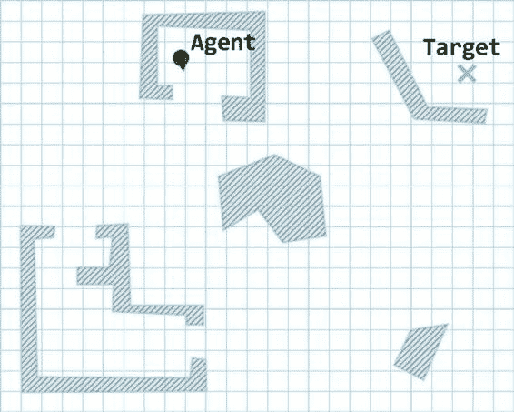

**图 13-1.** *寻路任务：在游戏世界中找到两点之间的路径。*

路径还应尽可能短。如果一个单位在有捷径可走的情况下选择了远路，它的行为就会显得不自然。所以我们应该设法找到最佳路径，而不仅仅是任何一条路径。

**注意：** 距离并不是衡量路径优劣的唯一标准。路径优化还有其他选项。例如，我想要到街上买一瓶汽水，最快的办法是从三楼窗户跳出去。但通常我不会选择这条路线。这是一个极端的例子，但在游戏世界中，这类情况更为常见。角色可能会决定从平台跳下，损失一些生命值，但比对手更快拿到弹药。然而，如果生命值很低，那么保命更为重要，应该选择较慢的路线。这些情况更为复杂，同时涉及寻路和决策。在本章中，我们只讨论以距离为唯一标准的情况。

分析完整的世界几何图形来找到两点之间的路径可能是一项非常复杂的任务。一个简单得多的解决方案是在整个关卡中放置航点，使它们通过视线相互连接，角色便可以在它们之间移动。这样一来，寻路任务就变得容易多了。


## 第 13 章：游戏中的 AI

**517**

角色不再穿梭于可能极其复杂的游戏世界，而是在一组预定义的路径点之间移动。图 13-2 展示了这一概念。如您所见，一旦路径点设定完毕，只需在它们之间移动即可。

**图 13-2.** *借助路径点简化的寻路任务*

如图 13-2 所示，AI 角色现在需要从当前位置移动到点 0，然后依次经过点 1、3、6、7，最后直接朝向目标点移动。剩下的唯一问题是：如何让我们的 AI 找到正确的路径点序列：0-1-3-6-7？从点 1 到点 7 有多种走法。例如，AI 角色可以通过点 5，或者通过点 2 和点 5，但这些路径都比正确路径更长。要解答这个问题，我们先退一步，从名为图论的数学工具中学习一些基础知识。

#### 图

许多 AI 算法（不仅仅是寻路算法）都利用了图论。本节是对图的快速、非正式介绍，主要目的是让您熟悉后续章节中使用的术语。如果您已经熟悉图论，并且能直接理解“无环加权图”的含义，可以跳过本节，直接进入算法部分。

##### 什么是图？

图是一组相互连接的对象。这些对象称为节点或顶点，连接称为边。请勿让“边”和“顶点”这些名称迷惑您——它们与多边形和 WebGL 编程毫无关系。图 13-3 展示了一个图的示例。

**图 13-3.** *一个图的示例*

许多现实世界中的实体都适合用图来表示。以国家地图为例：城市代表节点，道路代表边。如果两个节点之间存在一条边，则意味着有一条直达道路连接着两座城市。计算机网络、覆盖特定区域的 GSM 蜂窝网络、以及您、您的朋友和您朋友的朋友之间的社交关系，也都是图的例子。

图在众多任务中都被证明是一种很好的抽象工具：寻找两座城市之间的最短路径；构建能够处理高负载的高效网络拓扑结构；以及在社交网络中寻找可能成为用户朋友的人。在涉及移动和战斗的游戏中，通常会将关卡表示为一个由路径点组成的图。这种结构更易于分析，并能快速做出决策。

图在表面上绘制的方式可以任意选择：图唯一重要的是节点以及它们之间的连接。布局只是结构在表面上的呈现方式。图 13-4 中的这些图是等价的：事实上，它们是同一个图，只是绘制方式略有不同。为了让这一点更清晰，节点用数字进行了标记。

**519**

**图 13-4.** *使用不同布局绘制的同一个图*

当然，图形表示方式在开发中并不方便。在脚本中表示图的常用方式是使用矩阵——每一行和每一列都代表一个节点。如果两个节点相连，则对应行与列交叉处的矩阵元素为 1，否则为 0。图 13-5 中的矩阵表示的就是图 13-4 中的图，无需在屏幕上绘制出来。

**图 13-5.** *图的矩阵表示。例如，如果列 i 与行 j 的交点处为“1”，则表示顶点 i 和顶点 j 通过一条边相连。*

图的边可以有方向。在这种情况下，该图称为有向图。有向图的一个示例如图 13-6 所示。

**图 13-6.** *一个有向图*


```markdown

最后，图的边可能有权重。权重只是一个数字，表示在节点之间移动的成本。例如，如果顶点是城市，边是道路，那么可以将边的权重视为道路的长度。图 13-7 显示了添加权重后的图。

**图 13-7.** 一个加权图

图是表示路点的完美方式。节点之间的边意味着智能体可以通过直线移动或执行其他简单操作，从一个路点到达另一个路点。如果我们处理的是像图 13-1 中那样的平面关卡，可以使用无向图。如果你可以从点 1 到达点 2，这自动意味着你可以返回。在更复杂的情况下，你可能需要使用有向图。例如，如果有一个单向传送门或一个角色可以跳进去但无法爬出来的板条箱。边的权重是路点之间的距离。

第 13 章：游戏中的 AI

**521

##### 在 JavaScript 中实现图

图的实现相当直接。具体的代码当然可能有所不同，但清单 13-1 和 13-2 中的代码让你大致了解图实际上有多么简单。该代码实现了适用于寻路的通用图结构。首先，让我们看看表示图节点的类。

**清单 13-1.** *图节点的实现*

```
function Node(id, x, y) {
    this.id = id;
    this.x = x;
    this.y = y;
    this._connections = [];
}

var _p = Node.prototype;

_p.addConnection = function(node, weight) {
    this._connections.push({
        node: node,
        weight: weight
    });
};

_p.getConnections = function() {
    return this._connections;
};
```

尽管通用图不需要节点位置信息，但寻路需要它。我们稍后将讨论的算法会考虑节点之间的距离，这就是为什么我们需要保存每个节点的坐标。`id` 参数只是为了方便。当节点有名称或唯一编号时，调试图算法会容易得多。

每个节点都有一个连接数组。该数组是一个列表，包含了与当前节点相连的其他图节点（如果图是有向的，则考虑方向）。

图本身仅仅是一组节点（见清单 13-2）。

**清单 13-2.** *图是一组节点*

```
function Graph(nodes) {
    this._nodes = nodes;
}
```


第 13 章：游戏中的 AI

通常，以二维数组或矩阵的形式表示图是很方便的。如果节点 `i` 和 `j` 之间存在一条边，那么 `[i][j]` 的值为 1，否则为 0。例如，清单 13-3 中的 3×3 数组表示了一个包含三个节点的图。

**清单 13-3.** *存储节点之间连接的数组*

```
var nodes = [
    [0, 1, 0],
    [1, 0, 1],
    [0, 1, 0]
];
```

这个数组所描述的图如图 13-8 所示。它在节点 0 和 1 之间，以及节点 1 和 2 之间有连接。

**图 13-8.** *清单 13-3 中数组所描述的图*

这种指定连接的方法在数学中被广泛使用。对于 JavaScript 开发来说，对于小型图，在代码中放入矩阵比多次调用 `node.addConnection()` 更清晰。让我们更新图的构造函数。它接受可选的连接数组，并用数组中的数据更新节点。因为我们正在构建用于寻路的图，代码还会计算节点之间的距离，并将连接权重设置为该值。清单 13-4 显示了更新后的构造函数。

**清单 13-4.** *接受连接数组的更新后的图构造函数* 下载自 Wow! eBook <www.wowebook.com>

```
function Graph(nodes, connections) {
    this._nodes = nodes;
    if (!connections)
        return;

    for (var i = 0; i < connections.length; i++) {
        for (var j = 0; j < connections[i].length; j++) {
            if (matrix[i][j]) {
                nodes[i].addConnection(nodes[j],
                    Graph.distance(nodes[i], nodes[j]));
            }
        }
    }
}
```

第 13 章：游戏中的 AI

**523**

```
Graph.distance = function(node1, node2) {
    return Math.sqrt(
```

```


```javascript
(node1.x - node2.x)*(node1.x - node2.x) +
(node1.y - node2.y)*(node1.y - node2.y));
```

有了 `Node` 和 `Graph` 类之后，我们就可以将路径点转换为适用于寻路算法的图。例如，我们在图 13-2 中看到的游戏世界所使用的图，就是通过清单 13-5 中的代码创建的。

**清单 13-5.** 根据节点坐标和连接矩阵创建新图
```javascript
function createGraph() {
  var coords = [[248,76],[205,329],[592,230],[420,410],
                [95,410],[479,230],[420,16],[555,16]];
  var matrix =
    [[1, 1, 0, 0, 0, 0, 0, 0],
     [1, 1, 0, 1, 0, 0, 0, 0],
     [0, 0, 1, 1, 0, 1, 0, 0],
     [0, 1, 1, 1, 1, 1, 1, 0],
     [0, 0, 0, 1, 1, 0, 0, 0],
     [0, 0, 1, 1, 0, 1, 1, 0],
     [0, 0, 0, 1, 0, 1, 1, 1],
     [0, 0, 0, 0, 0, 0, 1, 1]];
  var nodes = [];
  for (var i = 0; i < coords.length; i++) {
    nodes.push(new Node(i, coords[i][0], coords[i][1]));
  }
  graph = new Graph(nodes, matrix);
}
```

另外再添加几个函数来在画布上绘制这张图也是值得的。但这些函数与 AI 算法无关，因此在本章中不予包含。你可以在本章源代码附带的 `Graph.js` 文件中找到它们。最终的示例代码将如清单 13-6 所示。该代码包含了对一些实用函数的调用，例如从本章开头提到的 AI 游乐场框架中渲染网格和障碍物。这些函数相当简单；你可以自己实现它们，或者直接从 GitHub 获取最新版本。

**清单 13-6.** 图渲染示例
```html
<!DOCTYPE html>
<html>
  <head>
    <title>图渲染演示</title>
    第 13 章：游戏中的 AI
    <!-- 添加所需的脚本标签 -->
    <script>
      var map = new Map(mapData);
      var canvas;
      var ctx;
      var agent;
      var graph;

      function init() {
        agent = new Agent();
        createGraph();
        agent.setPosition(220, 70);
        agent.setOrientation(Math.PI/2 - 0.2);
        canvas = document.getElementById("mainCanvas");
        ctx = canvas.getContext("2d");
        drawFrame();
      }

      function createGraph() {
        var coords = [[248,76],[205,329],[592,230],[420,410],
                      [95,410],[479,230],[420,16],[555,16]];
        var matrix =
          [[1, 1, 0, 0, 0, 0, 0, 0],
           [1, 1, 0, 1, 0, 0, 0, 0],
           [0, 0, 1, 1, 0, 1, 0, 0],
           [0, 1, 1, 1, 1, 1, 1, 0],
           [0, 0, 0, 1, 1, 0, 0, 0],
           [0, 0, 1, 1, 0, 1, 1, 0],
           [0, 0, 0, 1, 0, 1, 1, 1],
           [0, 0, 0, 0, 0, 0, 1, 1]];
        var nodes = [];
        for (var i = 0; i < coords.length; i++) {
          nodes.push(new Node(i, coords[i][0], coords[i][1]));
        }
        graph = new Graph(nodes, matrix);
      }

      function drawFrame() {
        ctx.fillStyle = "white";
        ctx.fillRect(0, 0, canvas.width, canvas.height);
        Grid.draw(ctx, canvas.width, canvas.height);
        graph.draw(ctx);
        agent.draw(ctx);
        第 13 章：游戏中的 AI
        **525
        map.draw(ctx);
      }
    </script>
  </head>
  <body onload="init()" >
    <canvas id="mainCanvas" width="625" height="500"></canvas>
  </body>
</html>
```

这段代码为测试你的 AI 算法提供了一个良好的开端。

### 构建寻路 AI

构建简单的寻路 AI 需要两个步骤：找到一种方法来构建关卡对应的寻路图，并实现在该图上寻找路径的算法。我们先从算法开始讲起。

### A*算法

A*（读作"A 星"）是现代游戏中寻路的事实标准。A* 解决了在图的任意两个节点之间寻找最佳路径的任务。在寻路领域，"最佳"路径指的是代价最低的路径——即所有连接权重的总和尽可能小的那条路。从节点 A 到节点 B，经过权重为 3-3-2 的路径（总代价为 8）显然优于经过权重为 5-3-4 的路径（总代价为 12）。在我们的简单示例中，连接的权重就是节点之间的距离；然而，其他衡量标准也是可能的：例如，当游戏涉及不同地形类型（如泥土或岩石），或者关卡中存在传送点（可以瞬间将玩家移动到世界的另一部分）时。我们将从一个非常非正式的解释开始介绍这个算法。

##### 非正式描述

A* 的核心思想是在图的节点间进行移动，以便最…


首先探索有希望的路径。路径是从起始节点到图中某个其他节点的连接列表，其成本是构成路径的连接权重的总和。图 13-9 显示了节点`0`和`3`之间的路径，该路径的成本为`485`（从`0`到`1`需`256`，从`1`到`3`需`229`）。该图展示的与图 13-2 完全相同，只是去掉了周围的障碍物。路径查找图构建完成后，我们不再关心关卡的地形几何，只需处理节点位置和连接权重。

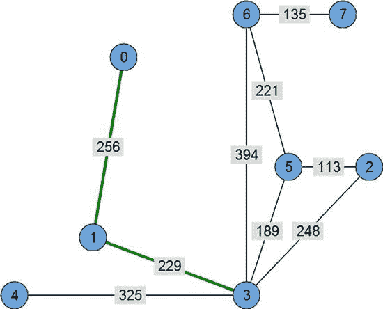

**图 13-9.** *节点`0`和`3`之间的路径；该路径的成本为`485`。*

如果我们需要找到节点`0`和`7`之间的路径，前两步是显而易见的。我们移动到节点`1`，然后是节点`3`，因为在这里我们别无选择——只有一条可能的路径。但在节点`3`，我们有四个其他节点可以探索：`2`、`4`、`5`和`6`。问题是先选择哪一个。

A*会选择最有可能最短的路径。为了找出哪条路径最短，我们需要计算路径的预估成本。由于不知道还需要访问多少个节点，我们将路径分为两部分来估算成本。第一部分是“已知”部分——在当前节点之前已经访问过的节点。这一部分的成本很容易计算——只需累加到达当前点所经过的连接权重即可。路径的第二部分，即从当前点到目的地，是未知的，但我们仍需估算它。为此，我们假设当前节点到目的地有一条直接连接。这条连接的权重将是这两点之间的距离。将其加到第一部分，就能得到路径可能成本的粗略估计。

这是对路径长度的乐观估计——我们知道路径至少会这么长，可能更长，但绝不会更短。事实证明，这种启发式方法效果相当不错。

现在，让我们尝试从节点`3`选择最佳路径。表 13-1 总结了我们需要对四条可能的路径进行的计算。

**表 13-1.** *计算路径预估成本*

| 路径 | 成本 | 到目标点的距离 | 预估成本 |
|---|---|---|---|
| `0-1-3-2` | `485 + 248 = 706` | | |
| `0-1-3-4` | `485 + 325 = 810` | | |
| `0-1-3-5` | `485 + 189 = 674` | | `901` |
| `0-1-3-6` | `485 + 394 = 879` | | |

最有希望的路径是预估成本最小的路径，即`0-1-3-5`。如你所见，这条路径并不是正确的路径，但算法的后续步骤会修正这个问题。

在下一步中，A*会前往节点`5`，并计算路径`0-1-3-5-6`的成本。这条路径比我们在上一步尝试的`0-1-3-6`更长。尽管当时没有选择路径`0-1-3-6`，但现在它反而成为了最有希望的路径。

过程反复进行：选择最佳节点，将其标记为“当前”节点，找到相邻节点，检查哪个最佳，将其标记为当前节点，依此类推，直到我们到达目标节点。该算法保证：如果路径存在，就一定能找到。

当访问一个节点时，我们会记录下到达该节点的连接：一旦找到目标并需要构建整条路径时，我们将使用这些信息。每个节点会跟踪路径的总成本和路径的预估总成本。因此，每个被访问的节点都关联着三个数字：

- 到达该节点的上一个被访问节点
- 路径成本（截至目前）
- 到达目的地的预估路径成本

##### 节点列表

A*会跟踪所有已被访问或处理的节点。有两个列表，分别称为 `open list` 和 `closed list`。当一个节点被处理完毕，且其所有连接都已评估（换言之，该节点在算法的某个步骤中曾是“当前”节点），则它被视为已关闭节点并被移至。


闭合列表。通过某条连接被访问过，并且具有关联的路径长度和成本估算的节点称为开放节点。

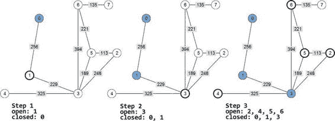

## 第 13 章：游戏中的 AI

该节点会被移动到开放列表中。请查看图 13-10，该图说明了节点如何在列表之间移动。

**图 13-10.** *A* 算法的列表：填充的节点位于闭合列表中，加粗的节点位于开放列表中，其余节点未被处理。*

第一步从节点`0`开始。在第一步结束时，节点`0`被关闭（因为所有连接都已被处理），其相邻节点变为开放状态（因为我们对其有了成本估算，但尚未处理它们的连接）。第二步从选择一个最佳开放节点开始。由于只有一个节点`1`，我们选择了它。所有连接到节点`1`的节点现在都被处理，然后节点`1`也被移动到闭合列表。接下来，我们将节点`2`、`4`、`5`和`6`添加到开放列表，并找出其中最有希望的节点。当检查完所有四个节点后，节点`3`被移动到闭合列表。

在算法的运行过程中，我们最终可能会尝试评估一个已经在某个列表中的节点。如果到达该节点的新路径比之前的路径更好，那么我们只需将该节点视为未处理：更新关联的值，如果该节点尚未在开放列表中，则将其移动到开放列表。

##### 形式化描述

现在我们准备好进行算法的形式化描述了。`A*`算法首先将第一个节点放入开放节点列表。接下来，当开放节点列表不为空时，执行以下步骤：

1.  寻找最有希望的开放节点（最小估算成本）。该节点现在是“当前”节点。
2.  对于连接到当前节点的每一个节点：
    -   a. 计算路径成本和估算路径成本。
    -   b. 如果该节点在闭合列表中，并且新路径成本低于与该节点关联的成本，则将其从闭合列表中移除，像对待新节点一样更新其值，然后将其放入开放列表。
    -   c. 如果该节点在开放列表中，并且新路径成本低于与该节点关联的成本，则更新其值并将其保留在列表中。
    -   d. 否则，更新其值并将该节点放入开放列表。
3.  将当前节点从开放列表移动到闭合列表。

一旦找到终点节点，就可以通过追溯形成路径的节点连接来构建路径。

##### 实现

`A*`算法的实现相当简单（见清单 13-4）。根据前面的解释，你应该能轻松理解`findPath`函数的代码。

**清单 13-7.** *A* 算法的 JavaScript 实现*

```
_p.findPath = function(startNode, endNode) {

  function updateNodeValues(node, prevNode, routeCost) {
    node.routeCost = routeCost;
    node.estimatedCost = routeCost + Graph.distance(node, endNode);
    node.prevNode = prevNode;
  }

  var openList = [];
  var closedList = [];

  startNode.routeCost = 0;
  openList.push(startNode);

  var routeFound = false;

  while (openList.length > 0) {
    // 获取最小元素（可以考虑更好的获取最小元素的方法）。
    var currentNode = openList.sort(function(a, b) {
      return a.estimatedCost - b.estimatedCost;
    })[0];

    if (currentNode == endNode) {
      routeFound = true;
      break;
    }

    currentNode.getConnections().forEach(function(connection) {
      var node = connection.node;
      var newRouteCost = currentNode.routeCost + connection.weight;

      if (closedList.indexOf(node) > -1) {
        // 该节点在闭合列表中
        if (newRouteCost < node.routeCost) {
          // 从闭合列表中移除
          closedList.splice(closedList.indexOf(node), 1);
          updateNodeValues(node, currentNode, newRouteCost);
          openList.push(node);
        }
      } else if (openList.indexOf(node) > -1) {
        // 该节点在开放列表中
        if (newRouteCost < node.routeCost) {
          updateNodeValues(node, currentNode, newRouteCost);
        }
      } else {
        // 该节点未被处理
        updateNodeValues(node, currentNode, newRouteCost);
        openList.push(node);
      }
    });

    // 从开放列表中移除
    // ... (此处代码似乎不完整，但已按原文保留)
  }
}
```


`openList.splice(openList.indexOf(currentNode), 1);`

`// 添加到关闭列表`

`closedList.push(currentNode);`

`}`

`var route = [];`

`if (routeFound) {`

`var routeNode = endNode;`

`while (routeNode) {`

`route.push(routeNode);`

`routeNode = routeNode.prevNode;`

`}`

`route.reverse();`

`}`

`// 清理，防止旧数据造成干扰`

`this._nodes.forEach(function(node) {`
`delete node.routeCost;`
`delete node.estimatedCost;`
`delete node.prevNode;`
`});`

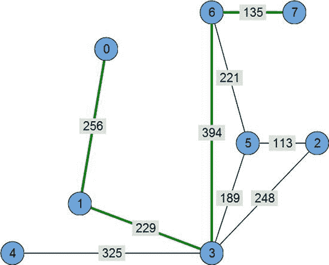

**第 13 章：游戏中的 AI**

**531**

`return route;`

`};`

如果再花些绘图功夫，你就可以高亮显示路径，看到图 13-11 所示的结果。

**图 13-11.** *节点之间高亮显示的路径*

#### 实现注意事项

该算法的具体实现可能差异很大，具体取决于你正在制作的游戏。例如，在战术游戏中，单位在方形网格内移动，你其实并不需要路点图。网格本身扮演了图的角色。每个瓦片恰好有四个连接：东、西、北、南（如果你允许对角线移动则是八个），并且很容易预测当前瓦片旁边的瓦片是哪个。如果某个瓦片被标记为“墙壁”，则那个方向就没有连接。图 13-12 展示了一个此类游戏世界的示例。

移动的代价通常也是恒定的。距离的计算方式有所不同：欧几里得距离不适用，因为你不允许角色笔直穿过瓦片移动。这种情况下使用的距离被称为曼哈顿距离。它代表了一种只能沿坐标轴移动的世界——就像在曼哈顿市区，你驾车行驶在由街道和林荫大道构成的网格中，但不会穿过摩天大楼。曼哈顿距离由公式 `|x2 - x1| + |y2 - y1|` 计算得出。对于此类寻路，你可以坚持使用更简单的 A* 算法实现。

**图 13-12.** *基于方形瓦片的游戏世界在寻路时可以无需图结构也能运作。*

最后，实现中有一行代码在大图上可能成为性能杀手：

```
var currentNode = openList.sort(function(a, b) {return a.estimatedCost - b.estimatedCost})[0];
```

问题在于，在包含数千个节点的大图上，对开放节点数组进行排序可能会非常慢（在小地图上你不会注意到差异）。如果你需要一个高效的算法，应该寻找能够保持元素预排序的数据结构。例如，基于二叉树的优先队列实现。对这些算法的讨论超出了本章的范围，但你可以在互联网上轻松找到几种优秀的实现。`https://github.com/vadimg/js_bintrees` 上的小型库是一个不错的起点。

### 构建寻路图的方法

正确构建的寻路图是实现智能 AI 移动的关键。构建图的方法有很多种，本节将对其中一些进行简要概述。

- 全手动图：由你自行设置节点和连接的坐标。
- 视线方法：允许你仅设置节点位置，然后基于关卡几何体计算连接。
- 导航网格：图的节点是多边形而非点。

#### 全手动图

手动创建图的第一种方法是逐个定义每个节点和连接，然后让角色选择离他最近的节点。对于拥有大型关卡的的游戏来说，这种方法可能相当低效，因为游戏设计师在放置节点时必须非常小心。图 13-13 展示了一个可能的问题：角色选择了最近的节点，但中间有一堵墙挡路。

**图 13-13.** *左侧是简单寻路图存在的问题：由于关卡设计师的失误，角色试图穿过墙壁到达节点。右侧是修正后的版本。*


此问题可通过在选中最近节点前检查其是否可见来解决。虽然编码通常不难，但该算法在运行时执行代价可能相当高昂。

手动放置节点也是一项相当繁琐的任务。有几种方法能让关卡设计师的工作更轻松。

#### 射线投射（视线检测）

在许多 2D 游戏中，如果从一个节点能看到另一个节点，则两者可达。利用这一简单规则，我们可以自动生成路径点图的边：放置顶点就变得容易得多。请看图 13-14，它展示了这一思想。节点由关卡设计师放置。然后我们在每对节点之间投射虚拟射线，检查中间是否有障碍物。如果视线清晰，则将该边添加到图中：

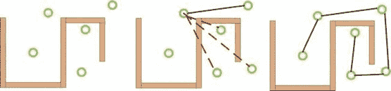

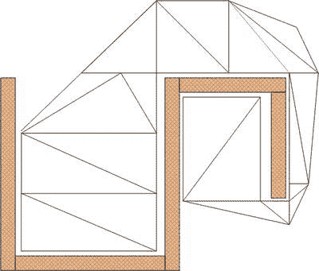

**图 13-14.** *利用视线自动生成路径点图的边。*

#### 导航网格

现代游戏开发中最流行的技术是导航网格，通常简称为 navmesh。其背后的思想是让关卡设计师准备图形，但不是放置单个节点，而是绘制多边形来标记“可移动”区域（见图 13-15）。

**图 13-15.** *导航网格及其构建的导航图示例*

使用这种方法有很多优点。角色不再需要选择最近的路径点，因此不会试图穿过墙壁到达那里。关卡设计师习惯于移动多边形，也会很快适应导航网格。导航网格的最后一个重要特性是，角色应该能够从其所在多边形的任意点移动到任意相邻多边形的任意点。换句话说，角色不需要遵循可能看起来像轨道的路径。借助导航网格，角色可以实现更智能、更自然的移动算法。

一旦构建了寻路图并实现了寻路算法，就可以让角色在关卡中实际移动。使用第 4 章中描述的技术来构建角色从一个路径点移动到另一个路径点的动画。

### 决策制定

现在智能体可以在关卡中移动了，但其行为仍然不够智能。角色下一步应该做什么？奔跑、追击敌人、寻找食物，还是休息一下？这是决策型 AI 通常要回答的问题。在日常生活中，每个人都需要某种信息来做决定。例如，如果我有点饿，而桌上正好有三明治，我就会吃掉它。如果我非常饿，桌上没有三明治，但厨房里有一个，我就会去拿来吃。为了做决定，我需要观察自己的内部状态（我饿不饿？）和周围的世界（三明治在哪里？）。

在最简单的情况下，决策型 AI 的工作方式几乎相同。然而，内部和外部条件以更形式化的方式呈现：

```
makeDecision() {
  if (!isHungry()) {
    workMore();
  } else if (isLittleHungry()) {
    if (isSandwichOnTheDesk()) {
      eat();
    } else {
      workMore();
    }
  } else if (isVeryHungry()) {
    if (isSandwichOnTheDesk() || isSandwichInTheKitchen()) {
      eat();
    } else {
      workMore();
    }
  }
}
```

这种表示方式称为决策树，因为它很容易以树的形式表示和配置（见图 13-16）。

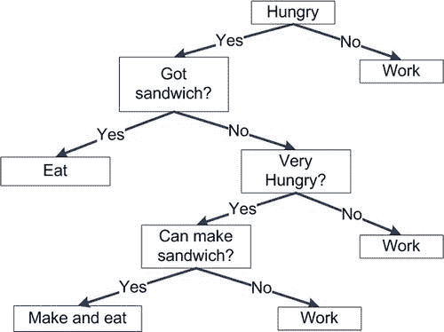

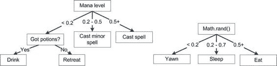

**图 13-16.** *决策树示例*

当每个节点都是一个独立的 JavaScript 对象，可以检查条件并返回一个决策或另一个节点时，由此产生的系统可以配置成实现相当有趣的 AI 行为。

决策树有许多不同类型。例如，树分支不一定只有“是/否”。它可以有多个分支，或概率条件，如图 13-17 所示。


### **图 13-17.** 决策树上的多分支与概率条件

**清单 13-6** 至 **13-8** 中的代码展示了此类决策代理的 JavaScript 实现。该代理只有两个“需求”——进食与睡眠。它会在需要时随时睡觉，但进食的概率仅为 30%。这些清单本身相当不言自明，代码基于两种类型的决策节点。

`NumericDecision` 检查对象的参数；如果参数值“小于或等于”阈值，则将执行委托给 `leNode`，若大于阈值则委托给 `gNode`。该数值决策用于触发饥饿行为。当饥饿值高于 50 时，代理会考虑寻找食物（有 30% 的概率）。我们需要的第二种节点是 `ProbabilisticNode`——它会根据随机数的值选择相应动作。

### **清单 13-6.** 决策树节点

```javascript
/**
 * 数值决策基于特定代理参数的值。
 * 若数值小于或等于阈值，执行 leNode
 * 否则执行 gNode。
 */
function NumericDecision(name, threshold, leNode, gNode) {
    this._name = name;
    this._threshold = threshold;
    this._leNode = leNode;
    this._gNode = gNode;
}

NumericDecision.prototype.execute = function(agent) {
    var node = agent[this._name] > this._threshold ? this._gNode : this._leNode;
    node.execute(agent);
};

/**
 * 概率决策根据机会值执行
 * 0 - 从不执行
 * 1 - 始终执行
 * 介于 0-1 之间
 */
function ProbabilisticDecision(chance, trueNode, falseNode) {
    this._chance = chance;
    this._trueNode = trueNode;
    this._falseNode = falseNode;
}

ProbabilisticDecision.prototype.execute = function(agent) {
    var node = Math.random() < this._chance ? this._trueNode : this._falseNode;
    node.execute(agent);
};
```

现在我们已经有了节点，接着可以添加一些动作。`EatAction` 让代理前往预定义的食物源位置并开始进食。`SleepAction` 让代理在原地睡觉。最后，`WanderAroundAction` 让代理在地图上选择一个随机点并向其移动。

### **清单 13-7.** 动作：决策树的叶节点

```javascript
/**
 * 进食 - 降低饥饿值
 */
function EatAction() { }

EatAction.prototype.execute = function(agent) {
    console.log("Decided to eat");
    navigateTo(220, 70);
    eat();
};

/**
 * 睡眠 - 增加能量
 */
function SleepAction() {}

SleepAction.prototype.execute = function(agent) {
    console.log("Decided to sleep");
    sleep();
};

/**
 * 无所事事
 */
function WanderAroundAction() {}

WanderAroundAction.prototype.execute = function(agent) {
    console.log("Wandering around...")
    goToRandomPoint();
};
```

最后，我们需要创建决策树并让其做出决策。**清单 13-8** 展示了具体实现方法。

### **清单 13-8.** 初始化决策树

```javascript
/**
 * 初始化决策树
 */
function buildDecisionTree() {
    var wander = new WanderAroundAction();
    var sleep = new SleepAction();
    var eat = new EatAction();
    return new NumericDecision("hunger", 50,
        new NumericDecision("energy", 30,
            sleep,
            wander),
        new ProbabilisticDecision(0.3,
            eat,
            new NumericDecision("energy", 30,
                sleep,
                wander)));
}
```

一旦决策树初始化完成，每当代理需要做出决策时，即可调用 `tree.execute()`。值得一提的是，决策不应在游戏的每一帧都执行。决策逻辑仅在角色需要重新考虑当前行为时触发。在本章附带的源代码示例中，角色在完成动作序列并需要执行新动作时才会做出决策。

决策本身可能需要复杂的动作。例如，决定为武器补充弹药可能涉及寻找弹药位置、移动至该位置（借助寻路算法）、拾取弹药并装填，最后返回前线。这样一组复杂动作通常被称为行为。


# 排版后的文本

构建人工智能有许多其他方法：模糊逻辑、面向目标的设计、状态机、规则系统及其组合。虽然涉及的内容很多，但对于许多休闲游戏而言，仅需具备寻路和基于决策树的 AI 引擎就足够了。如果你对进一步研究感兴趣，可以阅读伊恩·米林顿（Ian Millington）和约翰·芬格（John Funge）合著的优秀著作《游戏人工智能（第二版）》（Morgan Kaufmann，2009 年）。书中包含一系列讲解清晰的 AI 算法，若能明智运用，可使你的游戏机器人表现得非常聪明。

结合了寻路与决策技术的代码可在名为`04.decisions.html`的文件中找到，该文件与本章节的其他源码一同提供。别忘了时常访问 GitHub 上的 JavaScript AI 沙盒项目（<https://github.com/Juriy/gameai>）。你可能会在那里找到对自己游戏有用的内容。

## 总结

本章是深入探索 AI 主题的起点。人工智能在游戏开发中扮演着重要角色，但你应仔细评估特定游戏所需的 AI 水平。有时最有趣的游戏恰恰使用了最简单的 AI 技术。AI 执行的最基本且最常见的任务就是寻路——在关卡中两点之间找到一条路径。A*寻路算法依赖于航点图——即游戏世界中可到达区域的数学表示。

## 第 13 章：游戏中的 AI

我们学习了构建图的多种方法，并强调了每种技术的常见陷阱。我们还初步了解了为关卡表示导航数据的不同方式，即导航网格。

我们还探讨了决策树——一种帮助智能体选择下一步行动的简单算法。这可能是该系列中最简单的算法，但它能让我们实现非常有趣且逼真的行为。

## 第 14 章：JavaScript 游戏引擎

本章致力于介绍第三方工具：专为网页浏览器设计的游戏引擎和图形库。游戏引擎提供了制作游戏所需的高级功能，极大简化了开发者工作。例如，如果从头开始制作游戏，你必须亲自处理每个细节：加载图片、将其分解为帧和精灵、渲染世界、检测点击等。我们在第 7 章已经做过这些工作，你可能还记得需要操心相当多的方面。一个好的 2D 游戏引擎能直接为你提供所有这些功能。

此时常见的问题是：“既然可以直接选择游戏引擎并开始制作游戏，为什么还要花大量时间学习基础知识？”原因很简单：游戏引擎并非万能灵药，若不理解其背后的基本原理，就无法以最高效率使用它们。此外，当你找到适合需求的引擎时，可能仍需要为其添加一些游戏特需的功能。既然你已经掌握了这些知识，让我们看看一些旨在让游戏开发者工作更轻松的领先开源工具。

本章将专注于游戏引擎和图形库。我们将探讨以下主题：

- 游戏引擎及其与图形 API 的区别
- 实体组件系统

## 第 14 章：JavaScript 游戏引擎（续）

- 如何使用 2D 游戏引擎 Crafty.js 编写游戏

**注意：** 2D 和 3D 图形领域都有相当多的产品，所以如果你想知道我为什么选择介绍 Crafty 而不是引擎 X，我将解释我的决策依据。首先，工具必须免费且开源。阅读引擎代码以了解其内部工作原理是很有益处的。研究成熟引擎的代码是学习新技巧的好方法。其次，该项目应至少


### 排版后

至少是近期有过活跃更新的。如果它已经三四个月没有更新，那么该引擎的作者很可能已经对其失去了兴趣。第三，社区规模也很重要：一个活跃且乐于助人的社区总是加分项。

### 图形 API、库与游戏引擎

我们已经开始讨论游戏引擎、图形库和 API，但还没有强调这些工具类别之间的差异。本节旨在让你对它们的区别、用途和局限性有一个基本的了解。

假设你正拿着一部智能手机测试你刚创建的游戏。JavaScript 代码正在渲染帧，而角色正在敌群中奋力厮杀。但要说 100%准确的话，渲染帧的并非 JavaScript 本身。你发送到画布上的渲染命令，需要经过漫长路径，最终才能在负责实际工作的硬件上执行。

JavaScript 游戏开发的最大优点之一，就是你无需关心图形系统架构或硬件细节等底层问题。之所以能做到这一点，是因为浏览器提供了图形 API——即我们用于渲染的一组函数。

#### 图形 API

图形 API 是一个抽象层，位于你的代码和底层系统之间。其主要目标是使渲染与平台无关。图 14-1 展示了图形 API 的鸟瞰图。

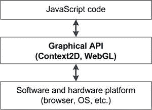

**图 14-1.** *图形 API 的高层视图。图形 API 的作用是在 JavaScript 代码和底层系统之间提供一个抽象层。*

到目前为止，我们只使用过`Context2D`和`WebGL`这两种图形 API。从 HTML5 游戏的角度来看，这些 API 属于底层 API：它们提供了一小组函数，这些函数就像微小的构建模块——你用来创建应用程序的小积木。在图形 API 层面工作，能让你完全控制渲染过程，至少是底层上下文所允许的“完全”控制。

这类 API 的缺点在于，实现你的想法通常需要编写大量代码。例如，要用`Context2D`画一条线，你需要设置描边样式，然后依次调用`beginPath()`、`moveTo()`、`lineTo()`，最后调用`stroke()`。要显示最简单的事物，至少需要五个函数调用！

你可以使用图形 API 将代码打磨至完美。考虑到上一段的例子，如果你知道你的游戏需要渲染许多线条，你可以微调执行此操作的函数。你可以按颜色对线条进行分组，并将`fillStyle()`和`stroke()`的调用次数降至最低——从而从 CPU 中榨取每一丝性能。高级 API 通常不允许这种级别的控制，有时你不得不为了开发速度而牺牲游戏性能。

#### 图形库

图形库是构建在原始 API 之上的“瑞士军刀”式工具，为处理图形内容时出现的典型任务提供标准解决方案。通常，它们比图形 API 更专业化。例如，一个库可以专注于通用几何图形并处理形状，或者专注于照片处理并调整亮度和饱和度，或者应用复杂的艺术效果和滤镜。第三种工具可能专门处理图表，并简化图形渲染任务。

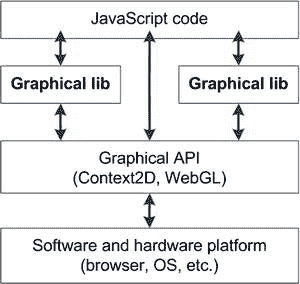

图形库有其优势：它们实现了那些否则可能需要你自己花费大量时间才能实现的功能。快，想一个在画布上应用“锐化边缘”滤镜的方法！大多数人无法立即回答这个问题；他们会花费宝贵的时间去搜索、编写代码、测试，最后才将其添加到项目中。`WebGL`是另一个底层 API 的好例子，有时它会让事情看起来……


# 图形库与游戏引擎

它们本应更易于使用。一些图形库让 WebGL 应用的编写成为真正的乐事。

部分图形库专为游戏设计，这意味着它们专注于解决典型的游戏开发任务。在第 7 章中，我们创建了一系列类来加载关卡、绘制等距地形、渲染对象、标记脏矩形区域等。实际上，我们编写了一个面向游戏的库，可用于在其上构建游戏。图 14-2 展示了图形库与渲染系统其他组件之间的关系。

**图 14-2.** *图形库是一组在图形 API 之上运行的工具，为典型的图形相关任务提供典型解决方案。*

世界发展日新月异，它不会等你亲手打造每一个工具。没有合适工具的帮助，几乎不可能完成一个项目。在本书的许多章节中，我们已经使用了一些工具：`Node.js`和`Express`框架、`Socket.IO`以及`Cordova`。图形领域也不例外——如果你知道某个库能解决你的问题，在重复造轮子之前，不妨先试试它。

#### 游戏引擎

游戏引擎的主要目标是为游戏服务。游戏引擎解决了游戏开发中特定的广泛问题。它们比典型的库复杂得多，且不限于处理图形。

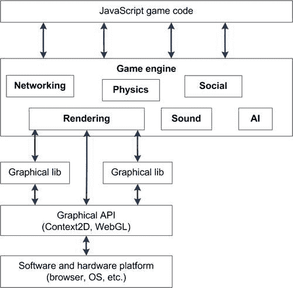

第 14 章：JavaScript 游戏引擎 **545

游戏引擎通常为构建游戏提供完整的解决方案，包括物理、人工智能、音效、视频播放、网络、社交功能以及关卡编辑器等组件。游戏引擎可以提供基础设施解决方案，如聊天室、高分榜或社交网络集成。

游戏引擎不仅是一个 API，也不仅是一组供程序员加速开发的辅助类。它是一个拥有自身架构的框架，能帮助程序员构建经过深思熟虑的应用。如果你想了解大型商业游戏引擎的样貌，可以尝试虚幻引擎（[www.unrealengine.com](http://www.unrealengine.com)）或 Unity3D（[`unity3d.com`](http://unity3d.com)）。

游戏引擎与系统其他层之间的关系如图 14-3 所示。

**图 14-3.** *游戏引擎为游戏开发提供复杂解决方案；渲染只是其中的一部分。*

**注意：** 在本节中，我并非倡导你为项目使用（或不用）任何类型的工具。没有万能的银弹，也没有适用于所有情况的 API。请务实思考：想想你实际能从该工具中获得什么，以及它的权衡之处是什么。也许该 API 是为比你最初计划支持的 Android 版本更新的版本设计的。也许该工具并非免费，而是需要一些投入。或者它可能为你节省一半的开发时间，让你的游戏比竞争对手更快推向市场！

第 14 章：JavaScript 游戏引擎 **Crafty

`Crafty`（[`craftyjs.com`](http://craftyjs.com)）是一个设计精良且轻量级的 2D 游戏引擎。核心文件压缩后仅有 81K，却仍提供了许多出色的开箱即用功能：

- 自定义事件系统
- 精灵表、动画和瓦片地图——包括等距地图
- 碰撞检测与"重力"
- 输入处理与音频播放

这只是一个简短的列表。完整的功能集在[官方文档](http://craftyjs.com/api/)中有详细描述。`Crafty`还支持模块，因此如果你缺少某些功能，可以查看[组件页面](http://craftycomponents.com)。

`Crafty`建立在"实体组件范式"（或称实体组件系统）的理念之上——这是一种完美契合游戏开发的特殊游戏实体处理方式。作为我们介绍`Crafty`的第一步，让我们看看实体组件系统与传统面向对象方法有何不同，以及你能用它解决哪些类型的游戏开发问题。


### 实体组件系统

让我们来思考一个典型的游戏，其中包含许多具有不同属性的对象。策略游戏就是一个很好的例子。游戏实体主要分为两大类：由工程师建造并固定在地面上的建筑物，以及可以移动、射击、飞行、治疗其他单位、携带乘客并执行其他有用功能的单位。现在，请思考一下这类游戏的类层次结构。通用的“游戏实体”应位于层次结构的顶层。接着，我们有建筑和单位两种实体。每个单位又可以飞行或步行、造成伤害或进行治疗、运输或被运输，甚至同时具备多种功能。如果继续这样构建类树，你很快就会得到一个相当复杂且难以管理的架构。图 14-4 展示了这样一个重量级层次结构的示例。

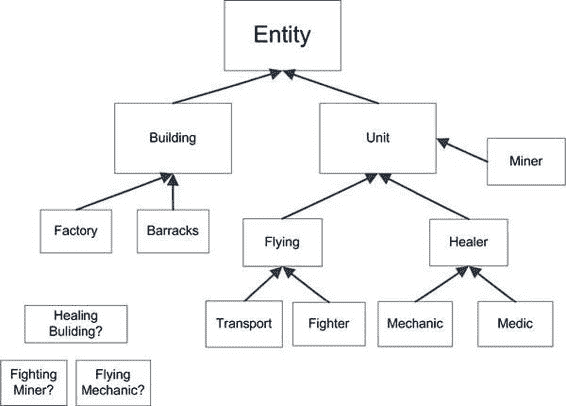

**图 14-4.** *游戏实体继承的一个典型问题*

即使你设法将实体拆分到树的分支中，你很快也会面临一个问题：如何添加那些必须同时属于两个分支的新实体。如果有一个可以治疗附近单位的建筑呢？一方面，它属于“建筑”层次结构，但另一方面，它必须继承自 `Healer`。然而，`Healer` 属于“单位”分支。这意味着它具有许多对建筑来说无用的方法。当你尝试添加“战斗矿工”或“飞行机械师”时，同样的情况也会发生。事实上，这是继承中的一个典型问题。多个独立且可互换的属性是继承最不擅长处理的情况。

另一种方法是使用“组合”方法。将像 `Fighter`、`Healer`、`Builder` 或 `Flyer` 这样的特定属性提取到单独的对象中，如图 14-5 所示。Crafty 使用术语“组件”来描述这些属性。每个组件都包含与其所描述属性特定的方法和属性。例如，一个 `Flyer` 可以拥有 `pitch`、`yaw` 和 `flightSpeed` 等属性，以及 `doBarrelRoll()` 或 `land()` 等方法。而一个 `Mechanic` 则会有 `sparePartsLeft` 和 `startFixing()`。


**图 14-5.** *游戏实体的“属性”或“组件”*

然后，这些组件被“注入”到对象中，从而描述出你想要的确切游戏单位。图 14-6 展示了一些可能的单位属性组合。

**图 14-6.** *组合组件以描述单位的属性*

通过使用这种方法，飞行机械师由三个组件组成：`destroyable`（因为有人可以射击它）、`flying`（因为它可以飞行，并且拥有飞行速度和飞行距离等参数）和 `mechanic`（意味着它可以修理损坏的单位）。类似地，治疗建筑和攻击型矿工也由三个组件组成。

在 JavaScript 中，这种系统的实现非常直接。本质上，组件是为了描述特定属性而必须添加到对象中的函数和变量的集合。例如，`Flyer` 和 `Mechanic` 组件可能如下所示：

```
var Flyer = {
  pitch: 0,
  yaw: 0.31,
  doBarrelRoll: function() {
    // code goes here
  }
}

var Mechanic = {
  sparePartsLeft: 10,
  startFixing: function() {
    // code goes here
  }
}
```

如果我们需要创建一个飞行机械师单位，我们必须将两个组件的代码合并到一个对象中，使结果如下所示：

```
var FlyingMechanic = {
  pitch: 0,
  yaw: 0.31,
  sparePartsLeft: 10,
  startFixing: function() {
    // code goes here
  },
  doBarrelRoll: function() {
    // code goes here
  }
}
```

程序化地组合组件也非常容易。清单 14-1 给出了一个示例实现。请注意，这不是一个 Crafty 的实现，而是一个展示该系统工作原理的简化模型。

**清单 14-1.** *程序化组合组件*

```
var flyingMechanic = {};
```


```javascript
[Flying, Mechanic].forEach(function(component) {
  for (var prop in component) {
    flyingMechanic[prop] = component[prop];
  }
});
```

这段代码简单地将各组件的属性和函数复制到 `flyingMechanic` 对象中。最终结果正如我们所期望：一个兼具飞行单位与机械师特质的对象。

古老的面向对象编程原则曾这样描述对象的组织方式：“组合优于继承”。在游戏开发中，这一原则的实践常被称为**实体组件系统**。游戏实体最初为空，随后通过组件不断丰富，每个组件描述了该实体的特定属性。每个组件都为对象添加新的参数和方法。这正是 Crafty 的核心思想，稍后我们将看到具体代码实现。

## 第 14 章：JavaScript 游戏引擎

**注意：** 实体组件系统还有另一个更常用的名称：**混入**。这个名称的灵感来源于一种可添加葡萄干、坚果或糖果等美味配料的冰淇淋。关于混入（这里指编程概念，而非冰淇淋）的深度探讨，可以参阅一篇精彩博文《重新审视 JavaScript 混入》，地址为 [`bit.ly/lZVgQs`](http://bit.ly/lZVgQs)。

既然我们已经了解了 Crafty 的核心思想，现在就开始用它编写一个真正的游戏吧！

### Crafty 入门

首先，从官方网站（[`craftyjs.com`](http://craftyjs.com)）下载最新版 Crafty（截至撰写本文时为 0.4.9 版本）。使用 Crafty 制作的游戏通常以一段简单的初始化代码开始，如清单 14-2 所示。

**清单 14-2.** *Crafty 初始化*

```html
<!DOCTYPE html>
<html lang="en">
<head>
<meta charset="utf-8" />
<meta name="viewport"
content="width=device-width, initial-scale=1.0, maximum-scale=1.0, user-scalable=no, target-densitydpi=device-dpi"/>
<style>
html, body {
overflow: hidden;
width: 100%;
height: 100%;
margin:0;
padding:0;
border: 0;
}
</style>
<script src="js/crafty.js"></script>
<script>
window.onload = function() {
// 全屏初始化 Crafty
Crafty.init();
// 初始化画布
Crafty.canvas.init();
// 其余游戏代码写在这里
};
</script>
</head>
<body>
</body>
</html>
```

Crafty 无需任何 HTML 元素即可启动：它会自行创建所需的 DOM 元素。此外，Crafty 还会尽力判断用户使用的是桌面浏览器还是移动浏览器。如果是移动浏览器，Crafty 会让画布元素占满整个屏幕，监听触摸事件作为输入，并添加适当的 meta 属性来设置视口属性。

下一步是定义一个或多个场景。场景即游戏画面，例如加载画面、游戏棋盘、高分榜等。第 12 章中的“四球游戏”有两个主要状态：“大厅”和“游戏”。尽管名称不同，Crafty 中的场景概念与之类似。清单 14-3 中的代码展示了如何为典型游戏流程创建四个场景。

**清单 14-3.** *设置游戏场景：加载、游戏、胜利和游戏结束*

```javascript
window.onload = function() {
Crafty.init();
Crafty.canvas.init();
Crafty.scene("loading", function() {
// 加载场景，例如显示加载画面
});
Crafty.scene("game", function() {
// 场景开始
}, function() {
// 场景结束
} );
Crafty.scene("win", function() {
// 胜利场景
});
Crafty.scene("gameover", function() {
// 游戏结束场景
});
// 启动"加载"场景
Crafty.scene("loading");
}
```


我们在本章中创建的游戏遵循一个简单流程，如图 14-7 所示。

**图 14-7.** *示例游戏的流程*

`Crafty.scene()` 函数用于定义或运行场景。传入的两个参数函数分别是 intro（场景启动时运行的代码）和 outro（下一个场景接管前运行的代码）。第一个函数是游戏的“核心”——在此处展示视觉效果并运行逻辑。


让我们给游戏添加一个简单的加载画面。为游戏创建一个漂亮的标志，并将其放入`img/logo.png`文件。或者，直接使用本章提供的标志文件。第一步是根据文件创建精灵：

```
Crafty.sprite(420, 75, "img/logo.png", { logo: [0,0] });
```

这行代码告诉`Crafty`，我们要从`"img/logo.png"`图片加载一个精灵。我们的精灵有一帧，其尺寸为 420 × 75 像素，帧名为`logo`，在精灵表中的位置为 (0, 0)。`Crafty`将会创建一个名为`logo`的新组件。现在，让我们创建使用这个新组件的实体：

```
var logoEntity = Crafty.e("2D, Canvas, logo");
```

借助`Crafty.e()`函数，我们创建了新的游戏实体。这个实体是三个组件的组合：`2D`、`canvas`和`logo`。前两个组件是`Crafty`的内置组件，它们决定了实体被绘制的方式。第三个组件`logo`，是我们刚刚创建的。让我们将新实体放置在屏幕中央。以下几行代码正是实现此目的：

```
logoEntity.attr({
  x: (Crafty.DOM.window.width - 420)/2,
  y: (Crafty.DOM.window.height - 75)/2
});
```

清单 14-4 展示了经过优化的代码版本。粗体行表示标志的新代码。

**清单 14-4.** *在游戏开始时显示标志*

```
var logo = { sprite: "img/logo.png", width: 420, height: 75 };

window.onload = function() {
  Crafty.init();
  Crafty.canvas.init();
  Crafty.scene("loading", function() {
    showLogo();
  });
  Crafty.scene("game",
    function() { /* 场景开始 */ },
    function() { /* 场景结束 */ } );
  Crafty.scene("win", function() {});
  Crafty.scene("gameover", function() {});
  // 启动 "loading" 场景
  Crafty.scene("loading");
};

function showLogo() {
  Crafty.background("#000");
  Crafty.sprite(logo.width, logo.height, logo.sprite, { logo: [0,0] });
  Crafty.e("2D, Canvas, logo").attr({
    x: (Crafty.DOM.window.width - logo.width)/2,
    y: (Crafty.DOM.window.height - logo.height)/2
  });
}
```

如果你运行应用程序，将会看到未来游戏的启动画面，如图 14-8 所示。

**图 14-8.** *未来游戏的标志*

#### Crafty 游戏

现在，让我们用`Crafty`构建一个简单的游戏。我将这个游戏命名为 "Escaping Knight"。游戏的目标是抓住一个试图逃离守卫路线并前往酒馆的骑士。玩家通过点击精灵来尝试抓住骑士。这个游戏虽然没什么挑战性，但它展示了大量实用的技术：

*   游戏生命周期（从加载到游戏画面，再到胜利或失败画面）
*   加载和渲染精灵
*   创建动画
*   响应用户输入
*   与精灵交互

完成后的游戏将如图 14-9 所示。

**图 14-9.** *完成后的 Escaping Knight 游戏*

##### 加载精灵

在`Crafty`中，没有什么比预加载一组图像更容易的了。对于 "Escaping Knight" 游戏，我们只需要其中的几个：用于渲染地形的瓦片集、四个用于各种物体（房屋和拱门）的瓦片、一个用于奔跑骑士角色的精灵表，以及两个用于 "Game Over" 和 "You Win" 画面的横幅。清单 14-5 展示了加载它们的代码。我们将只预加载游戏关卡所需的精灵，"Win" 和 "End Game" 的横幅将被延迟加载——就在玩家需要看到它们之前。

**清单 14-5.** *为关卡预加载一组精灵*

```
var images = ["img/terrain.png", "img/house-1.png", "img/house-2.png",
              "img/arch-left.png", "img/arch-right.png", "img/knight.png"];
Crafty.load(images,
  function() {
    // 当图片加载完成时调用
  });
```

我们希望将此代码添加到 "loading" 画面，因为图像必须在游戏过程开始前加载。一旦所有图像就绪，我们就可以准备进入下一个场景。"loading" 场景的最终版本将是：


如下是排版后的 Markdown 文档：

`look like` `列表 14-6`。

**`列表 14-6`.** **预加载游戏所需资源的“加载”场景**
```javascript
var images = ["img/terrain.png", "img/house-1.png", "img/house-2.png",
"img/arch-left.png", "img/arch-right.png", "img/knight.png"];
var logo = { sprite: "img/logo.png", width: 420, height: 75 };

Crafty.scene("loading", function() {
  Crafty.background("#000");
  showLogo();
  Crafty.load(images,
    function() {
      Crafty.scene("game");
    });
});

function showLogo() {
  Crafty.sprite(logo.width, logo.height, logo.sprite, { logo: [0,0] });
  Crafty.e("2D, Canvas, logo").attr({
    x: (Crafty.DOM.window.width - logo.width)/2,
    y: (Crafty.DOM.window.height - logo.height)/2
  });
}
```

在本地环境下，图片几乎是瞬间加载完成的，因此你很可能根本看不到加载画面。为了开发调试，你可能想要增加一个人为延迟，让加载画面至少显示两秒钟（参见`列表 14-7`）。当你的游戏正式上线后，只需移除这段代码即可。

**`列表 14-7`.** **延迟加载场景，以便你能够看到第一张图片**
```javascript
Crafty.scene("loading", function() {
  Crafty.background("#000");
  showLogo();
  var startTime = new Date().getTime();
  Crafty.load(images,
    function() {
      var timeLoading = new Date().getTime() - startTime;
      setTimeout(function() {
        Crafty.scene("game");
      }, Math.max(2000 - timeLoading, 0));
    });
});
```

此时，图片已加载完毕并准备好在屏幕上渲染。接下来的任务是渲染关卡。

**渲染地形和物体**

你已经看到过从图片创建精灵的代码。实际上，`Crafty.sprite()` 方法就是设计用来处理精灵表的。以下代码展示了它是如何工作的：

```javascript
Crafty.sprite(128, 68, "img/terrain.png", {
  grass: [0,0], grass2: [1,0], roadNW: [2,0],
  bricks: [0,1], roadSW: [1,1], roadNS: [2,1],
  roadWE: [0,2], roadNE: [1,2], roadSE: [2,2]
});
```

该精灵表由 `128 × 68` 像素的图片组成。每张图片占据精灵表的一个“单元格”。`Crafty.sprite()` 函数将这些单元格坐标与特定名称（如 `grass`、`bricks` 或 `roadWE`）关联起来。

然后，这个精灵就可以像其他任何组件一样使用了：

```javascript
Crafty.e("2D, Canvas, grass").attr({x: 30, y: 20});
```

现在，渲染关卡的代码对你来说应该是小菜一碟了（参见`列表 14-8`）。我们将使用与第 7 章完全相同的技术来渲染等距地图。如果你需要复习等距数学的知识，请随时回顾第 7 章。

**`列表 14-8`.** **渲染背景**
```javascript
var ground = [
  ["grass", "grass", "grass", "grass", "grass", "grass", "grass", "grass"],
  ["grass", "roadSE", "grass", "roadNS", "grass", "grass", "grass", "grass"],
  // ... 此处还有更多
  ["grass", "grass", "grass", "grass", "grass", "grass", "grass", "grass"]
];

var objects = [
  { sprite: "house2", x: 290, y: 198 },
  { sprite: "house1", x: 476, y: 282 },
  { sprite: "archRight", x: 553, y: 95 },
  { sprite: "archLeft", x: 440, y: 102 }
];

/**
 * 为我们将要渲染的每个瓦片和每个建筑创建精灵组件
 */
function createSprites() {
  Crafty.sprite(128, 68, "img/terrain.png", {
    grass: [0,0], grass2: [1,0], roadNW: [2,0],
    bricks: [0,1], roadSW: [1,1], roadNS: [2,1],
    roadWE: [0,2], roadNE: [1,2], roadSE: [2,2]
  });
  Crafty.sprite(32, 64, "img/knight.png", { princess: [0,0] });
  Crafty.sprite(128, 106, "img/house-1.png", { house1: [0,0] });
  Crafty.sprite(128, 159, "img/house-2.png", { house2: [0,0] });
  Crafty.sprite(151, 183, "img/arch-left.png", { archLeft: [0,0] });
  Crafty.sprite(142, 130, "img/arch-right.png", { archRight: [0,0] });
}

/**
 * 向场景中添加等距瓦片
 */
function drawTerrain() {
  for (var j = 0; j < ground.length; j++) {
    for (var i = 0; i < ground[j].length; i++) {
      Crafty.e("2D, Canvas, " + ground[j][i]).attr(
        {x: offsetX + i*124 + (j%2)*62, y: offsetY + j*31}
      );
    }
  }
}

/**
 * 添加小屋和拱门
 */
function drawObjects() {
  objects.forEach(function(object) {
    Crafty.e("2D, Canvas, " + object.sprite).attr(
```


## 第 14 章：JavaScript 游戏引擎

第一个函数为每个加载的图像创建精灵对象。

`drawTerrain()`和`drawObjects()`顾名思义：它们使用与之前示例相同的精灵绘制技术，唯一的区别是现在精灵按等距视图的合适顺序排列。

**注意：** Crafty 内置了对等距视图的支持（[`craftyjs.com/api/Crafty-isometric.html`](http://craftyjs.com/api/Crafty-isometric.html)）。然而，本章“手动”绘制地形只是为了保持简单明了。

如果您启动应用程序，您应该会看到一个渲染的景观，其中包含几栋房屋和一个在加载屏幕后立即出现的拱门，如图 14-10 所示。

**图 14-10.** *使用 Crafty 渲染的等距地形和对象*

##### 动画

在 Crafty 中，动画只需要几行代码。不会比您刚刚编写用于加载精灵的代码更多。要定义动画，您需要将`SpriteAnimation`组件分配给实体，并指定动画序列的帧。以下代码展示了如何为骑士定义动画：

```
Crafty.e("2D, Canvas, knight, SpriteAnimation")
.attr({x: 100, y: 280})
.animate("move ", 0, 0, 15)
```

这段代码表示：“获取骑士组件的精灵表，并创建一个名为`move`的动画序列。”该序列从单元格`(0, 0)`（图像的左上角）开始，向右循环 15 帧。如果这个概念听起来有点模糊，图 14-11 应该能使其清晰（图像仅显示 15 帧中的 5 帧）。

**图 14-11.** *Crafty 处理动画序列的方式：第一个参数是“锚点”帧的坐标，最后一个参数是序列中的帧数。*

创建动画序列后，您可以立即执行它，如清单 14-9 所示。

**清单 14-9.** *启动动画序列*

```
Crafty.e("2D, Canvas, knight, SpriteAnimation, Mouse")
.attr({x: 100, y: 280})
.animate("move ", 0, 0, 15)
.animate("move", 15, -1)
```

最后一行启动我们刚刚定义的序列。第一个参数是序列的名称（`"move"`），第二个参数是动画的持续时间，最后一个参数是重复次数，其中`-1`表示无限循环。

重新加载页面，欣赏骑士在原地奔跑。如果您希望他移动到某个地方，请添加清单 14-10 中突出显示的代码。

**清单 14-10.** *移动骑士*

```
Crafty.e("2D, Canvas, knight, SpriteAnimation, Mouse")
.attr({x: 100, y: 280})
.animate("move", 0, 0, 15)
.animate("move_right", 15, -1)
.bind("EnterFrame", function() {
  this.x += 0.8;
  this.y += 0.4;
});
```

`bind()`函数为`EnterFrame`事件注册一个监听器。`EnterFrame`在每个动画帧触发，为您提供更新精灵位置的机会。刷新代码，看看骑士跑开！是时候抓住他了！

##### 与实体的交互和事件系统

Crafty 有一个自定义事件系统，当您第一次开始使用这个引擎时，可能会感到有些困惑。Crafty 支持两种类型的事件：原生浏览器事件和自定义 Crafty 事件。例如，以下代码为支持实体的`DOM`组件（如果有的话）添加了一个 DOM 事件监听器：

```
Crafty.addEvent(this, entity._element, "mousedown", function() {
  alert("hi");
});
```

清单 14-11 中的代码为自定义 Crafty 事件创建了一个监听器。

**清单 14-11.** *为实体添加自定义 Crafty 事件监听器*

```
Crafty.e("2D, Canvas, SpriteAnimation, Mouse")
.attr({x: 100, y: 280})
.bind("MouseDown", function() {
  alert("hi");
});
```

正如我们在第 5 章中讨论的，浏览器事件通常不足以构建复杂的游戏，这就是 Crafty 区分两者的原因。


事件被视为“低级”机制——当你需要指定非标准行为或处理棘手的边缘情况时，才应使用它们。否则，`Crafty`事件是大多数情况下以一致方式处理问题的最佳途径。

要触发你自己的事件，请调用`trigger`方法。我们来更新那段渲染角色并使其通知外部世界输赢条件的代码。当用户点击骑士时，用户获胜；如果骑士到达安全区，则用户失败。代码清单 14-12 展示了如何在代码中实现这一想法。

**代码清单 14-12.** *触发胜利与游戏结束事件*

```  
function drawPrincess() {
    Crafty.e("2D, Canvas, knight, SpriteAnimation, Mouse")
        .attr({x: 100, y: 280})
        .animate("move ", 0, 0, 15)
        .animate("move ", 15, -1)
        .bind("EnterFrame", function() {
            this.x += 0.8;
            this.y += 0.4;
            if (this.x > 500) {
                Crafty.trigger("GameOver");
            }
        }).bind("MouseDown", function() {
            Crafty.trigger("Win");
        });
}
```

一旦你在代码的某处调用了`trigger`，就可以通过为特定事件类型添加监听器来响应事件：

```  
Crafty.bind("Win", function() {
    Crafty.scene("win");
});
```

请注意，该事件名为`MouseDown`。尽管 Android 设备上没有鼠标，但`Crafty`会模拟`MouseDown`事件，将`touchstart`浏览器事件包装起来，这与我们在前几章中的做法非常相似。

**注意：** 不要忘记为添加到每个游戏实体的每一项功能指定正确的组件。没有`SpriteAnimation`组件，骑士实体将“不知道”与动画相关的方法。同样，为了使用鼠标，我们必须向实体添加`Mouse`组件，使其能够感知输入事件。

#### 最终版本

游戏现在几乎完成了，但我们还需要添加两个用于显示“Game Over”和“You Win”信息的横幅。显示它们与显示标志（如代码清单 14-4 所示）并无区别。

我们这款用`Crafty`编写的简单游戏的源代码如代码清单 14-13 所示。（部分代码已被精简以便缩短篇幅。你可以在本章提供的配套资料中找到完整版本，文件名为`01.crafty.html`。）

**代码清单 14-13.** *一个完成的 Crafty 游戏的鸟瞰视图*

```  
var images = ["img/terrain.png", "img/house-1.png", "img/house-2.png",
              "img/arch-left.png", "img/arch-right.png", "img/knight.png"];

// The level
var ground = [
    ["grass", "grass", "roadNW", "grass", "roadNS", "grass", "grass", "grass"],
    /* ... more tiles here */
];

/* Location of sprites */
var objects = [
    { sprite: "house2", x: 290, y: 198 }, { sprite: "house1", x: 476, y: 282 },
    { sprite: "archRight", x: 553, y: 85}, { sprite: "archLeft", x: 440, y: 92 }
];

/* Banners - images and sizes */
var logo = { sprite: "img/logo.png", width: 420, height: 75 };
var winBanner = { sprite: "img/win.png", width: 420, height: 90 };
var gameOverBanner = { sprite: "img/gameover.png", width: 420, height: 90 };

window.onload = function() {
    Crafty.init();
    Crafty.canvas.init();
    Crafty.scene("loading", function() {
        Crafty.background("#000");
        showLogo();
        Crafty.load(images, function() { Crafty.scene("game"); });
    });
});

Crafty.scene("game", function() {
    createSprites();
    drawTerrain();
    drawObjects();
    drawKnight();
    // Once we get events - go to the appropriate scene
    Crafty.bind("Win", function() { Crafty.scene("win"); });
    Crafty.bind("GameOver", function() { Crafty.scene("gameover"); });
});

// These scenes only show banners
Crafty.scene("gameover", showGameOverBanner);
Crafty.scene("win", showWinBanner);

// Start the "loading" scene
Crafty.scene("loading");
};

/* Create sprite entities */
function createSprites() {
    Crafty.sprite(128, 68, "img/terrain.png", {
        grass: [0,0], grass2: [1,0], roadNW: [2,0],
        /* Other terrain tiles are described in a same way*/
    });
    Crafty.sprite(159, 148, "img/knight.png", { knight: [0,0] });
    Crafty.sprite(128, 106, "img/house-1.png", { house1: [0,0] });
    Crafty.sprite(128, 159, "img/house-2.png", { house2: [0,0] });
}
```


`Crafty.sprite(151, 183, "img/arch-left.png", { archLeft: [0,0] });`

`Crafty.sprite(142, 130, "img/arch-right.png", { archRight: [0,0] });`

```
/* 渲染等距地形 */
function drawTerrain() {
  for (var j = 0; j < ground.length; j++) {
    for (var i = 0; i < ground[j].length; i++) {
      Crafty.e("2D, Canvas, " + ground[j][i]).attr(
        {x: i*124 + (j%2)*62, y: j*31}
      );
    }
  }
}

/* 渲染小屋和拱门 */
function drawObjects() {
  objects.forEach(function(object) {
    Crafty.e("2D, Canvas, " + object.sprite).attr(
      {x: object.x, y: object.y}
    );
  });
}

/* 动画骑士并让其奔跑 */
function drawKnight() {
  Crafty.e("2D, Canvas, knight, SpriteAnimation, Mouse")
    .attr({x: 20, y: 170})
    .animate("move_right", 0, 0, 15)
    .animate("move_right", 15, -1)
    .bind("EnterFrame", function() {
      this.x += 0.8;
      this.y += 0.4;
      if (this.x > 450) {
        Crafty.trigger("GameOver");
      }
    }).bind("MouseDown", function() {
      Crafty.trigger("Win");
    });
}

function showLogo() {/* 显示横幅，如清单 14-4 所示 */}
function showWinBanner() { /* 显示横幅，如清单 14-4 所示 */ }
function showGameOverBanner() { /* 显示横幅，如清单 14-4 所示 */ }
```

正如你所见，`Crafty` 是一个非常优秀且便捷的游戏引擎，能够轻松处理相当复杂的任务。凭借良好的起步和活跃的社区，毫无疑问，它很快就会成为一个成熟的游戏开发引擎。

## 总结

在本章中，我们探讨了游戏引擎这一主题。首先描述了与图形系统交互的三个层级：图形 API、库和游戏引擎。我们了解了它们之间的区别、各自的用途和局限性。

我们在 `Crafty` 的帮助下构建了游戏——这是一个专注于为游戏开发者整合典型工具的 2D 游戏引擎，包括精灵表、动画、事件处理、游戏状态与转换以及许多其他功能。我们创建了一个相当完整的游戏（当然省略了玩法），它具备完整产品的绝大部分功能——而源代码总大小仅为约 140 行 JavaScript 代码。

尽管游戏引擎看起来像银弹，但它们并非如此。它们能为你节省大量时间和精力，但高效使用每个游戏引擎都需要了解其底层机制。即使你选择使用其中之一，通过本书各章节所学到的技能，也将让你更好地理解引擎的魔法。

## 第 15 章：构建原生应用

人们在安卓设备上使用的大多数应用都是原生的——即用 Java 编写并与操作系统紧密集成的程序。游戏也不例外。大多数安卓游戏都是原生游戏。本书中创建的应用则属于不同类型——它们是网络应用。这些应用已经运行得相当不错，而且毫无疑问，经过一些额外的打磨，将网络应用提升到商业水平并非难事。然而，有几个理由可能让你想为游戏构建原生安卓版本。

为什么要从已有的网页版本构建原生应用？这是个好问题。确实，网络应用有很多优势：部署更方便、无需安装、支持更多平台、更新更容易……那么为什么还要花额外时间做原生应用呢？以下是让原生应用非常有吸引力的最重要特性总结：

- 通过应用市场分发
- 访问原生 API
- 全屏模式
- 使用浏览器尚不支持的 HTML5 API
- 原生应用不一定需要网络连接，用户可以离线玩游戏

在本章中，我们将讨论原生应用的优缺点。此外，我们还将学习如何：

- 安装和配置 Apache Cordova（原 PhoneGap 和 Apache Callback）
- 将现有的网页游戏封装为原生应用
- 访问手机资源（如电话簿或 GPS）


### 构建原生应用

## 签名与发布

- 为应用签名，并准备将其发布到市场
- 在 Google Play 上注册
- 发布游戏，并通过 Google Play 应用下载
- 更新应用，并发布新版本

从头开始创建一个 Android 应用是一项相当复杂的任务：需要具备 Java 和 Android 架构方面的特定知识。如果你不熟悉这些技术，可能需要花费大量时间和精力才能掌握到能编写商业级游戏的程度。幸运的是，有一种方法可以在不失去熟悉的网页环境的前提下获得原生应用的优势，本章将专门探讨这个主题。

**注意：** 本章以逐步指南的形式编写。其中某些步骤与常规的网页开发任务相去甚远；要完全理解它们，需要具备其他领域的一些经验。我将尽力让你对整体流程有良好的了解，并为你理解原生应用的工作原理提供初步指引；然而，Java 编程超出了本书的讨论范围。如果你想了解更多，请自由查阅其他资料。关于 Java 入门，可以尝试阅读 Jay Bryant 所著的 *《Java 7 入门经典》*（Apress，2012）。如果你已有一定的 Java 基础，Mario Zechner 和 Robert Green 合著的 *《Android 游戏开发入门》* 第二版（Apress，2012）则是一本很好的资料。Android 开发近期已成为非常热门的话题，因此你很容易在网上找到优质的学习材料。

### 原生应用

让我们从一些非常基础的问题开始。什么是原生应用？它长什么样？又由什么构成？原生 Android 应用是用 Java 编写的。一个典型的 Android 项目包含 Java 文件、Java 库，以及资源和素材，例如图片、XML 配置文件和媒体文件。有一个名为 `AndroidManifest.xml` 的特殊文件，它保存着应用的相关信息。应用本身以 APK 文件的形式分发：一种具有特定内部结构的 zip 压缩包。

构建 APK 的过程相当漫长；当编码部分完成后，开发者需要完成以下步骤才能生成一个可在设备上部署的文件：

- 运行工具以自动生成几个 Java 文件
- 编译 Java 源代码
- 将编译后的源代码转换为 Android 字节码
- 将所有内容打包到 APK 文件中
- 使用密钥对 APK 进行签名
- 执行对齐操作——优化 APK 压缩包

如你所见，这个过程相当复杂。如果每次测试应用的一个微小改动都需要手动完成所有步骤，那将是对时间的巨大浪费。Android 开发者使用一个名为 `Ant`（[`ant.apache.org`](http://ant.apache.org)）的工具来简化流程。`Ant` 是一个自动化构建系统；它可以执行用 XML 编写的构建脚本，这些脚本描述了构建应用所需的每一步操作。它的工作方式类似于 Windows 上的 `.bat` 文件或 Linux 上的 `make`，但 `Ant` 是跨平台的，并且拥有许多 Java 相关的扩展。借助它，只需在命令行中执行一条命令就能创建一个 Android 应用。

**注意：** 大多数集成开发环境（IDE）都有支持 Android 开发的插件，能将应用构建过程的细节对开发者隐藏起来。Eclipse 和 IntelliJ Idea 都对 Android 开发有很好的支持。如果你考虑更深入地学习原生 Android 开发，可以先设置一个你喜欢的 IDE，就像我们在第 1 章中所做的那样。至于本章，使用命令行工具搭配文本编辑器就足以达成我们的目标。

从逻辑角度来看，Android 应用由各种组件和 UI 元素组成——按钮、进度条、组合框等等。这类组件有数十种，既有默认的也有自定义的。其中之一是“浏览器”，在 Android 中被称为 `WebView`。`WebView` 是一个常规的


组件（如按钮或进度条）；任何应用程序都可以使用它来像普通浏览器一样渲染 HTML 页面。

制作一个占用整个可用空间、包含 `WebView` 的单屏应用程序，并用它来渲染包含游戏的 HTML 文件并不困难。尽管页面渲染方式与往常一样，但它不再是一个“简单”的页面。它是一个真正的原生应用程序，可以访问通常禁止网页使用的系统资源。这样的应用程序结合了两个世界的优势：网页的简单性和原生应用的行为。

让我们更仔细地审视这种方法的优势：

- **市场**。像 Google Play 这样的应用市场是极其重要的分发渠道。与发布在市场上的原生应用相比，网页本身更难推广。在使用市场时，可以轻松收集社区反馈并通知用户新版本的功能。最后，但同样重要的是，如果你决定向用户收费，市场是处理账单的最佳方式。

- **访问原生 API**。普通应用可以访问的一切，你的网页也可以访问。例如，你可以访问文件系统、SQLite 数据库、连接设施、传感器以及普通 Android 应用可以访问的其他一切。有时你需要编写一些 Java 代码或使用现有的第三方组件来实现这一点。然而，这种无限制的资源访问为你构建完全不同的、更复杂的解决方案提供了途径。

**注意：** 当然，当我说“无限制访问”时，并不意味着你可以入侵用户的设备并为所欲为。Android 原生应用使用与网页不同的权限方案。用户安装应用时，系统会提示他确认“允许”某些类型的操作：访问网络、发送短信、读取通讯录等。之后，应用就可以使用这些设备资源。主要区别在于网页没有请求此类权限的选项。

- **全屏模式**。此功能对于游戏开发极其重要。在手持设备上，每一寸屏幕都很宝贵。地址栏和任务栏占用了大量有用空间！游戏可以利用全屏显示更大的地图部分，或显示自己的状态栏或 HUD（抬头显示器）。此外，全屏游戏给用户带来不同的感受。它更像他们过去常玩的普通 Java 游戏。

- **使用浏览器尚未支持的 API**。Android 浏览器（尤其是旧版 Android 上的浏览器）缺乏对某些优秀 HTML5 规范的实现。其中一些 API 可以借助原生资源来实现。`WebSocket` 和 `FileSystem API` 无法在普通网页中通过 shim 模拟——它们缺乏在所需级别与操作系统交互的权限。使用原生页面，可以实现一个符合标准的 shim，并将其用作真实 API 的替代品。

你可以看到，使用这种方法有很多理由。那么，让我们利用这项技术将我们的“四球”游戏（Four Balls game）准备好发布到 Android 市场——并发布它！

**设置 Apache Cordova（PhoneGap）**

毫不意外，已经有工具可以简化网页的包装过程。这个工具就是 Apache Cordova（[`phonegap.com`](http://phonegap.com)）。

**注意：** Cordova 最初名为 PhoneGap。后来它被移至 Apache Incubator，并更名为 Apache Callback。几个月后，它再次更名，现在被称为 Apache Cordova。在搜索博文、示例和教程时，最好使用最老的名称作为搜索词，因为 PhoneGap 是该项目在其大部分生命周期中为人所知的名字。在本章中，我们使用当前的名字——Cordova。

Cordova 是一个解决多个任务的工具。

- 它简化了“网页到原生”的包装过程。
- 它提供了对原生资源的访问：通讯录、相机等。


# 第 15 章：构建原生应用程序

它为第三方插件提供了一个平台，这是通过自定义功能扩展核心功能的标准方式。

`Cordova` 并非只针对 Android 的项目；它也为 iOS、Symbian、Blackberry 及其他多个平台提供了类似的工具集。该项目的最终目标是让开发者能够将现有的 HTML5 应用以原生应用的形式移植到不同的移动平台，通过应用商店进行分发，并访问设备特定的 API。这恰恰是我们所需要的。

让我们从安装 `Cordova` 及其依赖项开始。

#### 设置 Cordova

`Cordova` 没有特殊的安装步骤——从官网 ([`phonegap.com`](http://phonegap.com)) 下载归档文件，然后解压出其中名为 `lib/android` 的文件夹。无需设置任何环境变量之类的东西；只需记住解压的位置即可。

#### 设置 Apache Ant

Apache [Ant (http://ant.apache.org)](http://ant.apache.org) 是一个自动化构建系统，也是一种用于复杂构建脚本的基于 XML 的语言。为了使用 Apache `Cordova` 并创建原生应用，我们首先需要安装 `Ant`。

**注意：** 如果你使用的是 Mac，可能已经安装了 `Ant`。打开命令行并输入 `ant –version`。如果能看到版本号（比如 `1.8.2`），那么 `Ant` 就已经准备好可以工作了；否则，请按照下面的描述进行安装。

从官网 [`ant.apache.org/bindownload.cgi`](http://ant.apache.org/bindownload.cgi) 下载最新版本的 `Ant` 发行版，并将归档文件的内容解压到你选择的文件夹中。创建环境变量 `ANT_HOME`，并将其指向你刚刚解压的文件夹。修改 `PATH` 变量，将 `ANT_HOME\bin` 添加到路径中，这样命令行就能访问到可执行文件了。

输入：
```
ant –version
```

你应该会看到包含构建信息（版本和日期）的输出：
```
Apache Ant(TM) version 1.8.2 compiled on December 20 2010
```

如果看到类似内容，说明 `Ant` 已成功安装在系统上。

### 构建原生应用

此时，我们需要创建一个真正的原生 Android 项目。尽管我们需要编辑几个 Java 文件，但我们并不会进行大量的 Java 编程。如前所述，Android 开发的细节不在本书的讨论范围之内。不过，如果你对我稍加信任，并跟着做下去，你就会对自己能做什么有一个清晰的认识。如果你更喜欢深入研究，可以随时查看官方的原生 Android 开发 Hello World 教程 ([`developer.android.com/resources/tutorials/hello-world.html`](http://developer.android.com/resources/tutorials/hello-world.html))。

#### 创建空白的 Android 项目

第一步是创建一个空白的 Android 项目，并尝试在设备上启动它。导航到你想放置项目的文件夹，然后执行以下命令来显示可能的目标列表。目标就是你构建应用程序所基于的平台。

```
android list targets
```

可用的 Android 目标：
```
id: 1 or "android-8"
Name: Android 2.2
Type: Platform
API level: 8
Revision: 3
Skins: HVGA, QVGA, WQVGA400, WQVGA432, WVGA800 (default), WVGA854
ABIs : armeabi

id: 2 or "android-10"
Name: Android 2.3.3
Type: Platform
API level: 10
Revision: 2
Skins: HVGA, QVGA, WQVGA400, WQVGA432, WVGA800 (default), WVGA854
ABIs : armeabi
…
```

确定你计划支持的最低 Android 版本。我们将制作一个适用于 Android 2.2 及以上版本的应用。在我的电脑上，对应目标的 id 是 `1`。查看前面的输出：加粗的行显示了在哪里可以找到 Android 版本及其 id。有了版本 id 后，在控制台中再执行一条命令：

```
android create project --package com.juriy.fourballs --activity FourBalls --target 1 --path fourballsnative
```

这条命令会创建一个新的、空白的 Android 项目，可供编译。


## 排版后的内容

在设备上进行打包和测试。我们来仔细看看这些参数；一旦你开始准备生产环境，它们就变得非常重要。

- `--package` 是你的应用程序的“命名空间”。Java 开发者有一种惯例，即按照一定的规范部署他们的库，以便名称相同的类不会相互冲突。如果你有一个名为 `Sprite` 的类，而项目中的另一个库也有一个同名类，只要它们的包不同，这两个类就能正常工作。包是一个由点分隔的单词列表；不过，通常的做法是拿你拥有的域名并倒序书写。例如，我拥有域名 `juriy.com`；我可以使用包 `com.juriy`、`com.juriy.whatever`，甚至更长的 `com.juriy.game.client.utilites`。你需要为项目选择一个包名。

- `--activity` 是主类的名称。选择任何你觉得合适的名字即可。`FourBalls`、`Main` 或其他任何名字都可以。

- `--target` 是平台的版本 ID，如前所述。

- `--path` 是你存放文件的文件夹。由于没有名为 `fourballsnative` 的文件夹，系统为我创建了一个。

项目创建完成后，你会看到有不少新的文件和文件夹。请看图 15-1。你会看到一个类似的结构。如果你没有 Android 开发经验，不要试图去理解这些文件是做什么的。知道这是 Android 项目的典型结构就足够了。


**图 15-1.** *Android 项目的典型结构*

现在你已经构建了一个空项目。它还没有包含 Cordova，但已经可以在设备或模拟器上进行编译和测试。

#### 测试空的 Android 项目

在开始添加 Cordova 库之前，我们先确保创建的项目确实能工作。启动模拟器或通过 USB 线连接设备。确保调试模式已开启（如果你不知道如何启用调试模式，请参考附录 A）。确保你在项目文件夹的根目录下。执行以下命令：

```
ant clean debug install
```

`Ant` 使用一个名为 `build.xml` 的构建脚本来创建应用的调试版本。它会使用调试密钥对应用进行签名（每个 Android 应用都必须使用密钥签名——更多内容将在后面介绍），并将其安装到当前正在运行的模拟器或连接的设备上。如果它既没有找到模拟器也没有找到设备，构建将会失败。如果你操作正确，你应该能在已安装的应用列表中看到新创建的应用，并且能够运行它。这个应用看起来相当单调——一个黑色的屏幕上显示着灰色的“Hello World, `FourBalls`”文本，如图 15-2 所示。

**图 15-2.** *空的 Hello World Android 项目*

**注意：** 当你执行“install”命令时，需要确保设备或模拟器正在运行。如果两者都没有运行，构建脚本将会失败。如果即使模拟器已打开，脚本仍然失败，请依次执行以下两个命令：

```
adb kill-server
adb start-server
```

#### 基本的 Cordova 项目

现在我们需要完成构建“封装的原生应用”的主要工作。那就是将 Cordova 库添加到空项目中，修改 Java 文件，并将 Web 资源（HTML、脚本、CSS 等）放到正确的位置。本章的这一部分包含了许多“黑魔法”步骤。我鼓励你深入研究原生 Android 应用开发，以便更好地理解这个过程。

##### 为 Cordova 开发准备项目

首先，我们需要复制几个文件，并提供一定的文件夹结构，以便为我们的应用添加 Cordova 支持。请按照以下步骤操作：

1.  在你解压 Cordova 的文件夹中的 `/lib/android` 目录下找到 `cordova-2.0.0.jar`（当然，版本号可能不同）。
2.  将其复制到你项目的 `libs` 文件夹中。
3.  创建一个新文件夹 `assets`，并在其中创建另一个文件夹 `www`。


```markdown
将`/path/to/xxx`用作 Web 应用文件的根目录：HTML 文件、JavaScript 文件等。

4. 在第一步中与 jar 文件相同的位置找到`cordova-2.0.0.js`文件，并将其复制到新创建的`www`文件夹中。
5. 创建一个`index.html`文件——一个包含一些文本的纯 HTML 文件。稍后我们将用它来测试一切是否正常工作。我使用了清单 15-1 中的虚拟内容。
6. 将 Cordova 发行版中的`xml`文件夹复制到项目的`res`文件夹中。

**清单 15-1.** *用于测试 Cordova 项目是否正常工作的虚拟 HTML*

```html
<!DOCTYPE html>
<html lang="en">
<head>
<meta charset="utf-8" />
<meta name="viewport"
content="width=device-width, initial-scale=1.0, maximum-scale=1.0,
user-scalable=no, target-densitydpi=device-dpi"/>
<style>
html, body {
overflow: hidden;
width: 100%;
height: 100%;
margin:0;
padding:0;
border: 0;
}
#main {
font-size: 20px;
}
</style>
</head>
<body>
<div id="main">
Cordova is working!
</div>
</body>
</html>
```

完成这些步骤后，项目的结构应如图 15-3 所示。请仔细检查以确保一切正确。


**图 15-3.** *更新后的项目结构*

##### 更新 Java 文件和 Android 清单

现在我们需要稍微修改 Java 文件。在`src`子文件夹中找到唯一的`.java`文件，名为`FourBalls.java`。该文件在图 15-3 中已高亮显示。按照清单 15-2 所示修改文本。

**清单 15-2.** *主 Java 类*

```java
package com.juriy.fourballs;

import android.app.Activity;
import android.os.Bundle;

import org.apache.cordova.*;

public class FourBalls extends DroidGap {
@Override
public void onCreate(Bundle savedInstanceState) {
super.onCreate(savedInstanceState);
super.loadUrl("file:///android_asset/www/index.html");
}
}
```

确保在文件的第一行设置了包名。其余部分保持不变——Cordova 会处理其余一切。最后要做的就是编辑位于项目根目录的`AndroidManifest.xml`文件。清单 15-3 中的粗体行是您需要添加的行。

**清单 15-3.** *`AndroidManifest.xml`文件修改*

```xml
<?xml version="1.0" encoding="utf-8"?>
<manifest xmlns:android="http://schemas.android.com/apk/res/android"
package="com.juriy.fourballs"
android:versionCode="1"
android:versionName="1.0">
<supports-screens
android:largeScreens="true"
android:normalScreens="true"
android:smallScreens="true"
android:resizeable="true"
android:anyDensity="true"
/>
<!-- 如果您的页面将与服务器交互，请取消注释此行 -->
<!-- <uses-permission android:name="android.permission.INTERNET" /> -->
<application android:label="@string/app_name" >
<activity android:name="FourBalls"
android:label="@string/app_name"
android:configChanges="orientation|keyboardHidden" >
<intent-filter>
<action android:name="android.intent.action.MAIN" />
<category android:name="android.intent.category.LAUNCHER" />
</intent-filter>
</activity>
<activity android:name="org.apache.cordova.DroidGap"
android:label="@string/app_name"
android:configChanges="orientation|keyboardHidden">
<intent-filter>
</intent-filter>
</activity>
</application>
<uses-sdk android:minSdkVersion="8" />
</manifest>
```


**注意：** 最后的粗体行设置了`minSdkVersion`参数——应用程序运行所需的最低 Android 版本。嗯，不是 Android 操作系统本身，而是相应的 Android SDK“内部”版本。在此示例中，我们针对 Android 2.2，其 SDK 版本为 8。有关其他版本号，请参考此网页：`http://developer.android.com/guide/appendix/api-levels.html`。

##### 测试项目

现在项目已准备好进行测试。如果已关闭模拟器，请启动它。
```


再次执行。

> ant debug install

应用程序现在应该看起来像图 15-4 所示的截图。

**图 15-4.** *基本的 Cordova 启用项目*

恭喜你！项目运行正常！移植四球游戏现在是小菜一碟。只需将第 3 章的文件复制到 `www` 文件夹并重新构建应用程序。最终的应用看起来不再像网页；它没有地址栏或浏览器菜单，用户不会猜到你是（几乎）不写 Java 代码就创建了这个游戏。完成后，你的游戏应该看起来像图 15-5。


第 15 章：构建原生应用

**图 15-5.** *完成的 Cordova 应用程序。四球游戏现在看起来相当原生。*

### 网络

让我们继续 Cordova 的实验，创建一个多人游戏的原生版本。在这种情况下，仅仅将应用代码复制到 `assets/www` 是不够的。首先，你必须重写那些使用相对 URL 访问服务器端资源的代码行。当你启动 Cordova 应用时，它直接从文件系统加载页面。这意味着每个相对 URL 也指向文件系统，而不是像通常那样指向服务器。例如，考虑典型的 XHR 调用：

```
var xhr = new XMLHttpRequest();
xhr.open("GET", "user/182.json", true);
xhr.send(null);
```

通常情况下，请求会发送到服务器，服务器从数据库加载所需信息并形成动态响应。而在 Cordova 应用中，请求会尝试从 `/assets/www/user/182.json` 文件加载数据，显然会失败。解决这个问题很直接：使用绝对 URL 代替相对 URL：

```
xhr.open("GET", "http://myserver.com/user/182.json", true);
```

但是浏览器的同源策略呢？通常，你只能访问自己的服务器！好消息：对于 Cordova 加载的页面，没有这种策略限制。你可以输入任何你喜欢的 URL，并接收响应。

第 15 章：构建原生应用

复制第 12 章多人游戏应用中的代码，并调整绝对 URL，如清单 15-4 所示。

**清单 15-4.** *为四球多人游戏版本修复 URL*

```
<!DOCTYPE html>
<html lang="en">
<head>
...
<script src="js/OnlineGame.js"></script>
<script src="http://10.0.2.2/socket.io/socket.io.js"></script>
<!-- Events -->
<script src="js/EventEmitter.js"></script>
...
function init() {
    socket = io.connect("http://10.0.2.2");
...
```

进行此更改后，资源可以正确加载。当然，你需要根据你自己的系统设置调整 URL。清单 15-4 中的代码用于在模拟器上进行测试。

其次，我们需要调整应用的权限集。默认情况下，Android 原生应用不允许使用网络连接。要获得此权限，应用必须明确声明需要连接。然后，用户在首次安装应用时必须批准权限列表。Android 的安全模型比浏览器的限制性安全模型要好得多。如果用户信任你的应用，他可以允许几乎无限制地访问设备：文件系统、传感器、电话簿等（但最好只请求你需要的权限，而不是别的）。

要添加权限，再次修改 `AndroidManifest.xml`，如清单 15-5 所示。

**清单 15-5.** *从原生 Android 应用请求连接互联网的权限*

```
<?xml version="1.0" encoding="utf-8"?>
<manifest xmlns:android="http://schemas.android.com/apk/res/android"
    package="com.juriy.connectfour"
    android:versionCode="1"
    android:versionName="1.0">
...
<!-- 如果你的页面将与服务器交互，请取消注释此行 -->
<uses-permission android:name="android.permission.INTERNET" />
```

第 15 章：构建原生应用


取消注释该行，重建应用并运行。别忘了在启动应用前先启动 Node 服务器！四球游戏的多人版本现在也成了一个原生应用。

### 最终润色：名称、图标和全屏模式

原生应用已接近分发状态。让我们添加一些最终润色，让它看起来更棒。首先，应用列表中显示的游戏名称看起来不太美观——它是主活动的名称`FourBal s`——驼峰式且没有空格（这是自动生成的）。

要更改名称，找到`res/values/strings.xml`文件，并在`"app_name"`中添加一个空格（见清单 15-6）。

**清单 15-6.** *为应用添加人类可读的名称*

```xml
<?xml version="1.0" encoding="utf-8"?>
<resources>
    <string name="app_name">Four Balls</string>
</resources>
```

如果你重建并安装应用，名称看起来会好得多。

现在来处理图标。默认的 Android 应用图标是一个简陋的占位符，仅应在早期开发阶段使用。在生产环境中，应用必须拥有自己吸引人的图标。Android 有自己的样式指南，访问 [`developer.android.com/guide/practices/ui_guidelines/icon_design_launcher.html`](http://developer.android.com/guide/practices/ui_guidelines/icon_design_launcher.html) 可以查看。在要求设计师制作一套图标之前，最好把此链接发给他。

图标必须是带透明通道的 32 位 PNG。Android 运行在各种不同尺寸和密度的屏幕设备上。因此，生产级游戏的图标应创建为多种分辨率：36×36、48×48、72×72，以及用于超高清屏幕的 96×96（仅当目标为 Android 2.3 或更高版本时）。在透明背景上创建一个简单的图像，并为每种分辨率保存，或者使用随本章材料附带的图标。现在在`res`中创建四个新的子文件夹，并将对应的图标文件放入其中：

- `res/drawable`：48×48（默认值；你可以只保留这个文件夹，但这样图标会根据特定密度进行缩放，可能无法在所有分辨率下都显示良好）
- `res/drawable-hdpi`：72×72（高密度）
- `res/drawable-mdpi`：48×48（中密度）


- `res/drawable-ldpi`：36×36（低密度）

另外，如果你准备在 Google Play 上发布应用，请先创建一个 512×512 的高分辨率图标，并暂时保存在项目文件夹中。我们将在下一节中使用它。`res`文件夹现在应该如图 15-6 所示。

**图 15-6.** *不同尺寸的图标被放置到对应的文件夹中*

修改`AndroidManifest.xml`中的以下行：

```xml
<application android:label="@string/app_name" android:icon="@drawable/icon">
```

Android 会根据屏幕密度自动使用正确的图标。重建应用并享受新的外观，如图 15-7 所示！

下载自 Wow! eBook <www.wowebook.com>

**图 15-7.** *自定义图标让应用看起来更好*

最后的改进是隐藏标准的 Android 状态栏。游戏应用通常在全屏模式下运行。我们已经去掉了浏览器地址栏，接下来通过隐藏状态栏来再增加一些像素空间。打开`FourBalls.java`，并添加清单 15-7 中以粗体显示的行。

**清单 15-7.** *为应用启用全屏模式*

```java
package com.juriy.fourballs;

import android.app.Activity;
import android.os.Bundle;
import org.apache.cordova.*;
import android.view.WindowManager;

public class FourBalls extends DroidGap {
    @Override
    public void onCreate(Bundle savedInstanceState) {
        super.onCreate(savedInstanceState);
        super.loadUrl("file:///android_asset/www/index.html");
        getWindow().setFlags(WindowManager.LayoutParams.FLAG_FULLSCREEN,
                WindowManager.LayoutParams.FLAG_FULLSCREEN |
                WindowManager.LayoutParams.FLAG_FORCE_NOT_FULLSCREEN);
    }
}
```


再次重新构建并运行应用程序。您应该会看到状态栏已经消失，`Four Balls` 占用了每一个可用的屏幕像素。图 15-8 展示了旧版应用程序与新版本（没有状态栏）之间的差异。

  


## 第 15 章：构建原生应用程序

**图 15-8.** *带状态栏的游戏（左） vs. 不带状态栏的游戏（右）*

### 使用原生 API

为了完成对 Cordova 的介绍，让我们尝试另一个非常重要的功能——使用浏览器无法访问的原生设备资源。常规的 Java 应用程序可以直接通过 Java API 访问这些资源。JavaScript 无法直接访问此类 API，因此 Cordova 的任务是在两者之间提供一个桥梁。从高层来看，其架构如图 15-9 所示。

**图 15-9.** *原生资源与 HTML 页面之间的通信*

换句话说，对于您想使用的每一个 Java API 方法，Cordova 都必须提供一个 `Java 到 JavaScript 适配器`，并将该 API 显式暴露给网页。这就是 Cordova 支持插件系统的原因。如果您缺少某个 `原生` 功能，您可以随时自己编写一个插件，而无需等待开发者在核心框架中实现它。

我们在本节中使用的基本模板略有不同（见代码清单 15-8）。

**第 15 章：构建原生应用程序**  
**585**

**代码清单 15-8.** *使用原生资源的基本模板*

```html
<!DOCTYPE html>
<html lang="en">
<head>
<meta charset="utf-8" />
<meta name="viewport"
content="width=device-width, initial-scale=1.0, maximum-scale=1.0,
user-scalable=no, target-densitydpi=device-dpi"/>
<style>
html, body {
overflow: hidden;
width: 100%;
height: 100%;
margin:0;
padding:0;
border: 0;
}
#main {
font-size: 20px;
}
</style>
<script src="cordova-2.0.0.js"></script>
<script>
document.addEventListener("deviceready", onDeviceReady, false);
function onDeviceReady() {
/* code here */
}
</script>
</head>
<body>
<div id="main">
Cordova is working!
</div>
</body>
</html>
```

首先，我们需要加载 `cordova-2.0.0.js` 文件，该文件提供了原生访问功能。其次，`main` 入口点发生了变化。通常，我们会使用 body 的 `onload` 事件来插入 JavaScript 启动代码。对于 Cordova 应用程序，页面加载的速度可能比 Cordova 准备就绪提供其功能的速度更快，因此，您无法可靠地从 body 的 `onload` 中调用 `原生` 函数。Cordova 提供了自己的事件，用于指示原生函数已可以使用，代码清单 15-8 说明了其工作原理。当您收到 `deviceready` 事件时，就可以安全地调用任何 Cordova 代码。请注意，如果您不使用原生调用，则无需对应用程序做任何更改。

为了测试其工作原理，我们将读取整个设备电话簿并将每个联系人显示在列表中。为此，我们首先需要在 `AndroidManifest.xml` 中指定应用程序现在需要一个额外的权限——从联系人数据库读取的权限。将以下行添加到清单文件中，紧跟在 `INTERNET` 权限之后（见代码清单 15-9）。第二个权限 `ACCESS_NETWORK_STATE` 是 Cordova 本身所必需的。

**代码清单 15-9.** *请求读取联系人的权限*

```xml
<supports-screens
android:largeScreens="true"
android:normalScreens="true"
android:smallScreens="true"
android:resizeable="true"
android:anyDensity="true"
/>
<!-- 如果您的页面将与服务器交互，请取消注释此行 -->
<uses-permission android:name="android.permission.INTERNET" />
<!-- 用于从联系人数据库读取数据 -->
<uses-permission android:name="android.permission.READ_CONTACTS" />
<!-- Cordova 所必需 -->
<uses-permission android:name="android.permission.ACCESS_NETWORK_STATE" />
<application android:label="@string/app_name"
android:icon="@drawable/icon">
<activity android:name="FourBalls"
...
```

现在，用代码清单 15-10 中的代码更新 `index.html` 文件。

**代码清单 15-10.** *从 JavaScript 读取电话簿联系人*

```javascript
<script>
```


`document.addEventListener("deviceready", onDeviceReady, false);`

```javascript
function onDeviceReady() {
  var options = new ContactFindOptions();
  options.filter = "";
  options.multiple = true;
  var fields = ["displayName"];
  navigator.contacts.find(fields, onSuccess, onError, options);
}
```


# 第 15 章：构建原生应用程序

## **587

```javascript
function onSuccess(contacts) {
  var list = document.getElementById("contacts");
  alert("Got contacts " + contacts.length);
  for (var i = 0; i < contacts.length; i++) {
    list.innerHTML += "<li>" + contacts[i].displayName + "</li>";
  }
}

function onError() {
  alert("Could not get contacts");
}
```

```html
</script>
</head>
<body>
  <div id="main">
    Contacts:
    <ul id="contacts"></ul>
  </div>
</body>
</html>
```

请注意，这里出现了一些新的对象和列表项：`ContactFindOptions`、`contacts.find` 等等。这些元素是 Cordova 特有的，因此这段代码显然无法在常规浏览器中运行，即使在移动设备上也不行。

运行结果如图 15-10 所示的联系人列表。

**图 15-10.** *在模拟器上运行的联系人列表*

你可以在官方文档页面 [`docs.phonegap.com`](http://docs.phonegap.com) 上阅读更多关于可用 API 的信息。那里有许多有用的示例可供参考。本节仅着重介绍 API 使用的通用概念。现在，你可以自行探索所有可能的功能。

最后，我想提及一个非常重要的一点。请记住使用权限的基本规则：只申请你真正需要的权限。你申请的权限越多，用户相信你的应用程序是无害的游戏、而非想要窃取其隐私数据的恶意软件的可能性就越小。例如，申请 `INTERNET` 权限或 `READ_CONTACTS` 权限都是可以的。然而，如果一个应用同时申请了这两项权限，它就具备了将你的整个通讯录上传到任意网站所需的一切条件。这绝对不是用户想要的。在接下来的章节中，我们将恢复读取通讯录的权限，使我们的游戏再次成为一个无害、清白的应用程序。

## **为发布到市场做准备**

现在原生应用程序已经准备就绪，是时候将其发布到市场上了。这通常是“转向原生”的主要动力。该过程包含以下几个步骤：

-  创建密钥并为应用签名。
-  在 Android 市场注册（撰写本文时需支付 25 美元）。
-  发布应用程序。
-  在做出更改或发布新版本时更新应用程序。
-  本节的目的是将我们出色的“四球”游戏推向公众并发布到 Google Play 商店。根据我们的列表，第一步是为应用签名。

#### 签名应用程序

如果你没有接触过 Java、.NET 或类似平台，那么签名的概念对你来说可能有些陌生。签名是一种强大的安全机制，它允许用户验证特定数据的完整性和真实性。在 Android 开发中，这里的“数据”就是你分发的应用程序。每个应用程序都必须签名：不仅是通过市场分发的应用程序，任何应用程序都必须如此。我们在本章中创建的每个示例都隐含地进行了签名——Ant 构建脚本使用调试密钥为其签名。然而，Google Play 商店不接受调试密钥，因此你需要创建一个真正的密钥，才能与他人分享你的作品。

**注意：** 官方 Android [文档](http://developer.android.com/guide/publishing/app-signing.html)中提供了关于签名过程的非常出色的解释。在本节中，我不会详细解释数字签名的概念并重复在线信息，而是提供一个关于如何为将应用发布到 Android 市场做准备的快速指南。

## **589


##### 创建数字密钥

要签署应用程序，您需要创建一个数字密钥。管理密钥的命令行工具随 JDK 一同提供，名为 `keytool`。密钥存储在密钥库中——该文件包含多个密钥的信息。

执行以下命令生成一个包含 2048 位 RSA 密钥的密钥库：

```
keytool -genkey -v -keystore juriy-android.keystore -alias android-release -keyalg RSA -keysize 2048 -validity 10000
```

`keytool` 会提示您回答几个问题，如下方我的示例密钥创建输出所示。回答问题并非强制，因此您可以根据实际情况任意回答。

```
输入密钥库密码：
再次输入新密码：
您的名字与姓氏是什么？
  [未知]：Juriy Bura
您的组织单位名称是什么？
  [未知]：
您的组织名称是什么？
  [未知]：
您所在的城市或地区名称是什么？
  [未知]：Kiev
您所在的州或省份名称是什么？
  [未知]：
该单位的双字母国家代码是什么？
  [未知]：UA
CN=Juriy Bura, OU=Unknown, O=Unknown, L=Kiev, ST=Unknown, C=UA 是否正确？
  [否]：是
正在生成 2.048 位 RSA 密钥对和自签名证书 (SHA1withRSA)
有效期为 10.000 天
用于：CN=Juriy Bura, OU=Unknown, O=Unknown, L=Kiev, ST=Unknown, C=UA
输入 <android-release> 的密钥密码
    （如果与密钥库密码相同，则按回车）：
[正在存储 juriy-android.keystore]
```

密钥库是一个简单的文件，包含一个或多个密钥和证书。密钥库中的每个密钥都由其自己的密码保护，并有一个别名——您用来引用该密钥的名称。文件创建后，应该如下所示，请检查它是否为有效的密钥库，并且其中包含别名为 `android-release` 的密钥：

```
keytool -list -v -keystore juriy-android.keystore
输入密钥库密码：

密钥库类型：JKS
密钥库提供者：SUN

您的密钥库包含 1 个条目

别名名称：android-release
创建日期：2012 年 7 月 10 日
条目类型：PrivateKeyEntry
证书链长度：1
证书[1]：
所有者：CN=Juriy Bura, OU=Unknown, O=Unknown, L=Kiev, ST=Unknown, C=UA
签发者：CN=Juriy Bura, OU=Unknown, O=Unknown, L=Kiev, ST=Unknown, C=UA
序列号：4f357fb2
有效期自：2012 年 2 月 10 日星期五 22:36:02 EET 至：2039 年 6 月 28 日星期二 23:36:02 EEST
证书指纹：
         MD5：  EA:48:BE:09:AA:8A:05:20:AC:04:D6:13:B2:7A:09:05
         SHA1：74:ED:15:74:98:D0:A2:1F:89:76:46:E2:B6:2A:48:37:D9:66:AD:5D
         签名算法名称：SHA1withRSA
         版本：3
*******************************************
*******************************************
```

如果您看到类似上述信息，则说明密钥库已准备就绪。

##### 签署应用程序

下一步是构建应用程序的“发布”版本，并使用密钥对其进行签名。为此，您需要告诉 Ant 脚本密钥库的位置以及要使用的密钥（别名）。执行以下命令：

```
ant -Dkey.store=<密钥库路径>.keystore -Dkey.alias=<密钥别名> clean release
```

在构建脚本的某个时刻，`Ant` 会提示您输入两个密码：一个用于密钥库，另一个用于密钥。密码会在您输入时显示在屏幕上，因此请确保无人偷看。

或者，您可以在项目根目录的 `ant.properties` 文件中添加两行：

```
key.store=../<密钥库路径>
key.alias=<密钥别名>
```

如果这样做，您可以在命令行中省略额外参数，直接输入：

```
ant clean release
```

**注意：** 如果您像我一样对密码过于敏感，可以手动签署软件包。该过程稍微复杂一些，因为它要求您先签名，然后“对齐”应用程序。有关详细信息，请参考官方 Android 教程 [(http://developer.android.com/guide/publishing/app-signing.html#signapp)](http://developer.android.com/guide/publishing/app-signing.html#signapp)。


最后一步是检查已签名的应用程序是否确实已签名。在控制台中执行以下命令，并检查输出是否显示`jar verified`，如下所示。

> `jarsigner -verify bin/FourBalls-release-unsigned.apk`

`jar verified.`

如果你做对了所有步骤并看到此输出，那么你已经为发布到市场做好了准备！

当你使用"生产"密钥签署应用程序后，你将无法直接将其安装在"调试"版本之上。如果在构建过程中看到类似如下的消息：

`[exec] Failure [INSTALL_PARSE_FAILED_INCONSISTENT_CERTIFICATES]`

请卸载旧版本的应用程序：

> `adb uninstall <package>`

在我的案例中，我输入的是：

> `adb uninstall com.juriy.fourballs`

原因是，如果证书不匹配，Android 不会静默地重新安装应用程序。

### 发布到 Google Play

此步骤需要少量资金投入。要创建账户，你需要支付注册费，在撰写本文时为 25 美元。

**注意：** 如果你尚未准备好发布应用，建议你跳过本节，或者快速阅读以便了解如何在市场上操作。你现在已有的知识已足够创建应用程序，并将其发布在自己的网站上，展示给朋友和商业伙伴。本章接下来的几页将专门介绍 Google Play 商店。


访问 `https://play.google.com/apps/publish/`，使用你的 Google 账号登录，然后按照注册流程操作。注册的第一步如图 15-11 所示。

**图 15-11.** *Android 市场注册的第一步*

在你同意许可协议并支付注册费后，就可以开始发布了。初始网页将如图 15-12 所示。点击`上传应用`按钮，选择已签名的版本文件。该应用不会立即发布，所以如果你觉得自己还未百分之百准备好公开，不用担心。


**图 15-12.** *首次进入时的开发者控制台。此时尚无已发布的应用。*

图 15-10 中的截图显示的是一个已经有一个已发布应用的页面。如果你是刚开始，你会看到一个空的应用列表。

当文件上传完成后，你会看到 APK 的快速摘要，如图 15-13 所示。

**图 15-13.** *新的 APK 摘要屏幕*

在这里，你可以审查应用所需的权限列表。点击`保存`并进入发布表单。表单本身相当长；大部分列出的项目是可选的。不过，Android Market 指南建议将每个字段都视为必填项。对于一款新游戏，展示几张明亮多彩的截图并提供良好的产品描述尤为重要。要让人们想要玩你的游戏！

唯一必需的图片是截图和高分辨率图标（512 × 512）。其他都是可选的。然而，强烈建议尽可能多地提供推广素材。用户看到得越多，就越喜欢这个应用——也就越有可能下载它。

**注意：** 有多种方法可以为你的应用创建截图。最简单的方法是在模拟器中加载页面，并使用常规的屏幕捕获工具创建截图。另一种方法是使用名为`DDMS`（Dalvik 调试监控服务器）的小工具连接到你的设备，该工具位于 Android SDK 的`Tools`文件夹中。连接已启用 USB 调试的设备，运行该工具，从列表中选择设备，然后选择`设备屏幕截图`。搞定！你将获得一张与真实设备屏幕完全一致的截图。

按照指南填写表单：为应用选择名称，编写...


# 格式化后的文档

填写描述和推广文字，列出变更内容（在提交应用程序更新版本时使用），并选择分类。由于我要发布的应用程序远非真正的商业游戏，我将其归入“应用、库和演示”类别。

**注意：** 为了方便，我用于 Google Play 商店的截图、图标和推广图片已随本章的其他资源一同提供。你可以将它们用做参考点，或作为你自己应用程序的占位符。

表单的最后一部分是关于语言和分发区域的。填写完成后，打开“APK 文件”标签页，点击已上传的唯一 APK 文件旁边的“激活”按钮。当 APK 变为激活状态后，点击“发布”。几秒钟后，应用程序就发布成功并可下载了！此时你应已返回到应用列表，并看到新发布的应用。图 15-14 展示了开发者控制台此时的样子。


**第 15 章：构建原生应用 595**

**图 15-14.** *应用发布后的开发者控制台*

**注意：** 发布过程可能需要一些时间，所以如果你的应用程序没有立即上架，不必担心。喝杯咖啡休息一下通常有助于应用程序更快发布。

使用以下格式的 URL 访问应用页面：`https://play.google.com/store/apps/details?id=<package_name>`，其中`<package_name>`是你在本章开头设置的程序包名称。我新发布的游戏可通过`https://play.google.com/store/apps/details?id=com.juriy.fourballs`访问。如果你从 Android 设备点击此页面的链接，系统会提示你打开市场应用并安装“Four Balls”。这是该应用在 Android Market 中的“主页”。图 15-15 显示了该页面在桌面浏览器中的样子，图 15-16 则显示了该页面在设备上市场应用中的样子。


**第 15 章：构建原生应用 596**

**图 15-15.** *桌面浏览器中 Google Play 商店上的应用页面* **图 15-16.** *左侧：设备上打开的应用页面。右侧：安装提示显示所需权限列表。*

**第 15 章：构建原生应用 597**

如果你想了解更多关于发布过程的信息，请访问官方 Android 文档页面：`http://developer.android.com/guide/publishing/publishing.html`。

### 更新你的应用程序

一旦你的应用程序变得流行，你可能希望更新一些新功能来吸引更多用户。本章的最后部分专门讨论如何将更新推送到 Google Play 商店。让我们看一个简单的场景：你发现白色背景在设备上看起来不好看，想将其改为黑色。你在一分钟内修复了一行 JavaScript 代码，现在急于发布新版本。在创建新的签名构建之前，再次打开`AndroidManifest.xml`文件，并更新清单 15-11 中加粗的行。

**清单 15-11.** *在 Android Manifest 中更新应用版本*

```
<?xml version="1.0" encoding="utf-8"?>
<manifest xmlns:android="http://schemas.android.com/apk/res/android"
    package="com.juriy.fourballs"
    android:versionCode="2"
    android:versionName="1.0.1">
    ...
```

`versionCode`参数必须是一个整数，市场用它来比较用户设备上已安装的版本与市场上可用的最新版本。第二个参数`versionName`是用户看到的版本号。保存文件并重新构建应用程序。

一旦应用程序打包并签名完成，打开 Google Play 商店开发者控制台，选择“Four Balls”应用程序，并上传新的 APK。由于这是应用程序的新版本，并且与上一个版本相比有所变化，请填写


  
# 近期更新  

通过`近期更新`字段让用户了解为何需要更新。应用程序的外观已发生变化，因此你也应当更新截图和宣传图。关注这类细节对应用的成功至关重要。  

上传新的`APK`文件。点击第一个版本的`APK`旁的`停用`按钮，然后点击新版本`1.0.1`旁的`启用`按钮。点击`保存`并等待数分钟。更新内容会出现在市场上，所有已安装该应用的用户都会收到获取新版本的提示。  

与市场协作其实并不困难。一旦你发布第一个应用，就会对整个流程得心应手。市场是一个非常强大的分发渠道，当你的游戏能够在浏览器中运行时，就应该考虑将其发布到市场上。  

## 总结  

在本章中，我们学习了如何用`Apache Cordova`封装现有网页，并创建原生安卓应用。我们掌握了处理此类配置特殊性的方法：服务器 URL、应用权限以及原生应用资源的访问。  

我们学会了如何制作应用的"生产"版本：创建密钥、签名应用，并做好发布到`Google Play`商店的准备。  

在本章最后部分，我们探讨了如何使用`Google Play`商店——从创建账号到发布应用、与他人共享应用，再到更新至更新更好的版本。  

原生应用具有诸多优势。无论你是用`Java`还是`HTML5`技术栈创建此类应用都不重要。只要用户能将应用加载到设备上并运行你的游戏，你就达成了目标。  

---

# 第 16 章：添加音效  

音效是打造一款完整的、可供市场发售的游戏所需添加的最终元素之一。在移动游戏中，音效通常扮演次要角色。这背后有几个原因。  

- 移动游戏大多是休闲类游戏。人们在旅途中、排队时、机场候机期间或枯燥的会议中玩手游——这些场合下音效反而可能打扰他人。  
- 如果玩家戴着耳机，他们多半在听自己喜欢的音乐——来自庞大`MP3`曲库的歌曲。  
- 音效会消耗电量，尽管实际功耗很小，但仍有用户更愿意把电量留给其他用途。  
- 对多数休闲游戏而言，缺少音效并不会影响游戏体验。在像`反恐精英`这样的桌面游戏中，玩家仅凭脚步声就能判断敌人位置。在像`辐射 3`这样的游戏中，音效则是深入游戏世界的方式。相比之下，休闲游戏在"静音"模式下完全能够畅玩。  

尽管如此，音效仍是移动游戏中相当重要的方面，你不应在自己的项目中忽视它。没有音效的游戏更像未完成的业余作品，而非商业产品。看看`愤怒的小鸟`——这款现象级休闲游戏的经典范例：小猪们等待命运的安静咕哝声，加上小鸟们激昂的战斗呐喊，确实让游戏变得更加有趣。  

作为开发者，你的任务是让用户想要开启音效。即使只有 15%的用户会开启音效玩游戏，他们也一定会为你的市场评分增加额外的一颗星。  

本章将专注于音效。我们将学习以下主题：  

- Android 浏览器对音效的支持情况  
- 常见问题的解决方案  
- `SoundManager2`——终极网页音效库  
- 原生应用中的音效（`Cordova` API）  
- 常见音效可用性模式  

## 网页中的音频  

我们首先来看看"老大哥们"——即紧跟最新`HTML5`趋势的桌面浏览器——所提供的 API。目前有两种可用的音频 API 用于处理音效：简单的`HTML5`音频标签（`www.whatwg.org/specs/web-apps/current-work/#the-audio-element`）以及  


[sophisticated full-blown Web Audio API](https://dvcs.w3.org/hg/audio/raw-file/tip/webaudio/specification.html)

#### 音频标签

音频标签是在网页中播放声音的最简单方式。其 API 直观且简洁，如清单 16-1 所示。

**清单 16-1.** *在网页中使用音频元素*

```html
<head>
<script>
var audio;

function init() {
    audio = new Audio("sound/theme.mp3");
}

function play() {
    audio.play();
    setInterval(function() {
        audio.volume -= 0.1;
    }, 200);
}

function pause() {
    audio.pause();
}

function changeVolume(deltaVolume) {
    audio.volume += deltaVolume;
}
</script>
</head>

<body onload="init()">
<div>
    <button onclick="play()">播放</button>
    <button onclick="pause()">暂停</button>
    <button onclick="changeVolume(0.2)">音量+</button>
    <button onclick="changeVolume(-0.2)">音量-</button>
</div>
</body>
```

`new Audio("sound/theme.mp3")`这行代码是一个便捷构造函数，用于动态创建音频标签。

清单 16-2 中的代码会产生相同效果。

**清单 16-2.** *通过向页面添加 audio 标签来初始化声音的替代方法*

```html
<script>
var audio;

function init() {
    audio = document.getElementById("player");
}
/* 其余代码保持不变 */
</script>
</head>

<body onload="init()">
<div>
    <audio id="player" src="sound/theme.mp3"></audio>
    <button onclick="play()">播放</button>
    <button onclick="pause()">暂停</button>
    <button onclick="changeVolume(0.2)">音量+</button>
    <button onclick="changeVolume(-0.2)">音量-</button>
</div>
</body>
```

`audio`标签实现了音频功能的最基本功能：加载文件、播放/暂停音轨、调节播放音量。它也可以在网页上显示简单的播放控件（在游戏中很少需要）。尽管很难想象比这更简单的 API，但对于休闲游戏来说，这些功能通常已经足够：加载背景音乐、设置音量、循环播放，偶尔为各种游戏事件播放其他音效。

#### Web Audio API

Web Audio API 是面向 Web 的下一代音频处理 API。它不仅允许你播放音频，还能实时处理音频，操控原始音频数据——即波形。为了更好地理解该 API 的功能，不妨想想我们通过 Canvas API 实现的实时图像处理——面对成千上万的原始像素，我们可以做出真正令人惊叹的事情：动态渲染世界、创建 3D 模型、实现闪电和火焰等特效、用"战争迷雾"覆盖地图部分区域等等。之所以能够实现这一切，是因为我们可以操控原始像素数据，而不仅仅是静态的预渲染图像。

声音并不比图像简单，有时甚至更加复杂。想象一款 3D 冒险游戏：玩家进入一个房间，看到两个 NPC（非玩家角色）正在互相交谈并与玩家交流。最终产生的声音波形取决于许多不同的参数：
- 每个 NPC 相对于玩家的位置（离玩家越近，声音越响亮）
- 玩家面朝的方向（左右声道需要接收不同的声音才能营造真实感）
- 房间的大小和材质：洞穴中的声音与音乐厅或街道上的声音截然不同

由此可见，为这种复杂场景预渲染声音几乎是不可能的。Web Audio API 允许你获取声音的"源"并在播放前对其进行实时处理：混合多个音轨、应用洞穴回声或无线电静电等特效、添加滤波器，最后将处理结果发送到音频设备。

遗憾的是，该 API 目前仅适用于少数桌面浏览器，距离普及到大众市场的 Android 设备仍有相当距离。不过，为了内容的完整性，清单 16-3 提供了示例代码来展示如何实现这一功能。


# API 实践

**清单 16-3.** 使用 Web Audio API 播放声音

```javascript
var context;
var buffer;

function init() {
    try {
        context = new webkitAudioContext();
    } catch(e) {
        alert('Web Audio API not supported');
        return;
    }

    // Load the binary data from music file
    var request = new XMLHttpRequest();
    request.open('GET', "sound/theme.mp3", true);
    request.responseType = 'arraybuffer';
    request.onload = function() {
        // Decode data and play sound
        context.decodeAudioData(request.response, function(buff) {
            buffer = buff;
            var source = context.createBufferSource();
            source.buffer = buffer;
            source.connect(context.destination);
            source.noteOn(0);
        });
    };
    request.send(null);
}
```

**注意：** 音频 API 并不需要源文件。就像你可以在空白画布上画一条线一样，你也可以即时生成声音数据并播放。你可以创建诸如“虚拟钢琴”之类的应用，无需为每个音符准备单独的声音文件，甚至还可以制作更加复杂的应用，例如基于特定发音参数生成“逼真”的外星语音合成。

Web Audio API 与 HTML5 音频标签之间的区别，大致等同于 Canvas API 与 `IMG` 标签之间的区别。后者为你提供了一种渲染静态媒体的简单方式，而 Web Audio API 则让你对整个处理过程拥有完全的控制权（当然，代价是代码更加复杂）。

#### Android 浏览器中的声音

遗憾的是，Android 浏览器对声音 API 的支持相当差。Web Audio API 仍属于尖端技术，尚未完全普及到移动平台。然而，即使是基本的 `audio` 标签支持，在 Android 中也有不少 bug 和局限性。原生应用的情况要好得多，但标准浏览器仍有很大的改进空间。

第一个支持 `Audio` 元素的 Android 版本是 Android 2.2，而那种“支持”相当……特殊。尽管浏览器能识别该元素本身，但它无法播放任何音频文件。这看起来更像是为未来扩展预留的一个空壳。因此，直到 Android 2.3 Gingerbread 版本才真正支持音频播放。不过，这距离完美依然非常遥远。

说到音频文件，对播放音频的“支持”并不自动意味着浏览器能识别所有可能的音频格式。就像 `IMG` 标签只能显示少数几种文件格式——PNG、JPEG、GIF 以及少数其他格式——一样，`audio` 标签也仅限于特定的文件格式。更麻烦的是，对于浏览器应支持哪些格式，并没有统一的标准。一些厂商坚持使用 OGG 等开源免费格式，而另一些则力推 MP3 和 h.264 等封闭的专有格式。换句话说，没有一种文件格式是每种浏览器都支持的。这就是为什么 `audio` 标签允许你设置多个备选文件作为音频源的原因。浏览器会选择它能“认识”的格式。

在撰写本文时，Gingerbread 之前的设备仍占据着高达 23% 的市场份额。当然，简单放弃为每四位客户中的一位提供声音支持是不可取的。幸运的是，有一个库解决了 Android 的大部分声音问题。`SoundManager2` ([www.schillmania.com/projects/soundmanager2/](http://www.schillmania.com/projects/soundmanager2/)) 采用了一种简单的方法：如果浏览器过于简陋而无法播放音频，我们就让 Flash 来做繁重的工作。丰富的开箱即用媒体支持是 Flash 变得如此流行的原因之一——Flash Player 知道如何处理播放。

**注意：** `SoundManager2` 并非 Android 专属解决方案。它的使命是让从最老旧的版本开始的各种浏览器都能获得无缝的声音处理能力。使用 Flash 的想法也并不完全是新事物。我们在第 12 章中使用过的网络 API——`Socket.IO`，也提供了一种回退到 `Flash Sockets` 的选项——这是一种基于 Flash 的、在网页与服务器之间建立持久连接的实现。


# 第 16 章：添加声音

Flash 组件。正如你所见，对于仍在追赶潮流的浏览器来说，小型 Flash 组件通常扮演着"备选方案"的角色。

`SoundManager2` 最大的优点在于其易用性。只需几行代码——你的游戏就能拥有音乐了！

在本章中，我们将为现有游戏《逃亡骑士》添加音效——这个游戏是我们在第 14 章测试 Crafty 游戏引擎时创建的。请从第 14 章的游戏中复制代码，或使用你自己的项目。

**图 16-1.** *初始目录结构*

**605**

### 使用 SoundManager2

现在是时候为这个关于逃亡骑士的故事增添一些声音了。但首先，我们需要搭建项目环境。

#### 初始设置

第一步是从官方网站 [www.schillmania.com/projects/soundmanager2/doc/download/](http://www.schillmania.com/projects/soundmanager2/doc/download/) 下载最新版本的 SoundManager（编写本章时版本为 2.97a）。

然后，将压缩包解压到硬盘上的某个位置。该发行版包含许多演示和工具，但我们项目中只需要其中几个。请执行以下步骤：

1.  将发行版中的 `/script/soundmanager2.js` 文件复制到你的 `js` 文件夹。
2.  将整个 `swf` 文件夹复制到项目根目录。
3.  在项目根目录创建一个名为 `sound` 的新文件夹。我们将把音效文件放在那里。
4.  获取本书附带的 `theme.mp3` 文件，并将其复制到上一步创建的文件夹中。

你的目录结构应如图 16-1 所示。

**注意：** `SoundManager2` 发行版的 `script` 文件夹包含多个文件。它们都具有完全相同的生产功能。带有 `nodebug` 后缀的文件具有不同的默认设置（所有调试功能均已关闭）；它们没有注释和调试方法。名称中包含 `jsmin` 的文件已用 JSMin（[www.crockford.com/javascript/jsmin.html](http://www.crockford.com/javascript/jsmin.html)）预处理过，JSMin 是一种 JavaScript“代码压缩工具”，可以移除源代码中的所有多余空格，使文件更小、下载速度更快。在开发过程中，我们始终使用启用调试功能的原始未处理文件。一旦进入生产环境，请考虑将其替换为 `nodebug` 压缩版本。

现在，我们准备为游戏添加一些美妙的音效。将清单 16-4 中的代码添加到页面中。

**清单 16-4.** *初始化 SoundManager2*

```html
<script src="js/soundmanager2.js"></script>
<script>
soundManager.url = 'swf/';
soundManager.flashVersion = 9;
soundManager.onready(function() {
    soundManager.createSound({
        id:'theme',
        url:'sound/theme.mp3',
        autoLoad:true,
        onload:function() {
            this.play();
        }
    });
});
</script>
```

一旦加载了 `soundmanager2.js` 文件，`soundManager` 这个“神奇”的对象就会出现在全局命名空间中。前两行初始化基本设置——`swf` 文件夹的路径以及 `SoundManager` 将要使用的 `swf` 版本。有两个选项——8 和 9，默认是 8。版本 9 解锁了一些炫酷的新功能，而且你的玩家设备上很可能已经安装了相应版本的 Flash Player。

**注意：** 如果你比较务实，想了解使用旧版本 Flash Player 的用户（不仅限于移动设备）所占的百分比，请参考 Adobe 的官方版本使用统计信息：[www.adobe.com/products/flashplatformruntimes/statistics.displayTab3.html](http://www.adobe.com/products/flashplatformruntimes/statistics.displayTab3.html)

**607**

下一行添加了 `onready` 事件监听器，当 `soundManager` 开始运行并准备好执行实际的音频相关任务时，该监听器会被触发。最后，我们从 MP3 文件中加载声音，并指示 `soundManager` 在声音准备好后开始播放。

在浏览器中运行该页面，然后享受背景音乐吧。请注意，如果你在使用模拟器，此时可能听不到声音。这是因为模拟器没有 Flash 插件。如果你要进行调试...


在模拟器中使用声音时，你需要手动在模拟器上安装播放器。

音乐主题只播放一次。通常背景主题应该重复并连续播放。让我们让音乐循环起来。

#### 循环

循环本身相当容易实现——你只需要设置循环次数（参见清单 16-5）。

**清单 16-5.** *循环背景主题*

```
soundManager.url = 'swf/';
soundManager.flashVersion = 9;
soundManager.onready(function() {
  soundManager.createSound({
    id: 'loopTest',
    url: 'sound/theme.mp3',
    loops: 10000,
    autoLoad: true,
    onload:function() {
      this.play();
    }
  });
});
```

`SoundManager`不支持无限循环，所以当你需要无限播放时，只需使用一个像 10000 这样的大数字——对于一个五秒钟的声音样本，这将为你提供大约 13 小时的连续播放——对于休闲游戏来说已经足够了。

然而，音乐循环比这要棘手得多。就像图块必须与其相邻图块匹配以创建坚实地形的错觉一样，循环的结尾必须匹配开头。否则，玩家会清晰地听到乐曲在几毫秒后结束并重新开始。这将不是连续的环境背景音乐，而是一组令人厌烦的循环。

如果你将文件保存为`MP3`或类似的`有损格式`，你可能会发现另一个意外。即使声音在声音编辑器中完美循环，一旦在游戏中播放，每次迭代后你都会听到一声“咔哒”声。这是一个由有损压缩算法的特性导致的众所周知的问题。

看看图 16-2，它显示了一个简单的波形——一个生成的声音（就像电视公司用来屏蔽粗俗语言的那种）。图像的顶部显示了原始波形，底部显示了保存为`MP3`的相同波形。

**图 16-2.** *原始波形（顶部）和压缩后的 MP3 文件。由于压缩算法，前 50 毫秒几乎是静音的。*

请注意，压缩后的波形以大约 50 毫秒的静音开始。`MP3`就是这样工作的：它无法像我们希望的那样保存声音的每一个比特，这导致了烦人的“咔哒”声。然而，这当然不是游戏开发的借口。我们希望背景主题播放流畅。

有两种方法可以解决这个问题。如果样本以相对安静的片段（甚至静音）开始和结束，那么“咔哒”声就听不到了。它仍然存在，但玩家会认为这是音乐作品中安静的部分，不会感到烦躁。

另一种方法是使用专门的编码软件，它可以重新编码`MP3`并使“咔哒”声稍微“轻”一些。这背后的确切机制超出了本章的范围。如果你对更深入的解释感兴趣，请参考以下有用的链接：

- [www.schillmania.com/projects/soundmanager2/demo/api/#looping](http://www.schillmania.com/projects/soundmanager2/demo/api/#looping)：`SoundManager`关于循环的文档。
- [www.flickr.com/photos/schill/4499319436/](http://www.flickr.com/photos/schill/4499319436/)：关于如何为`SoundManager`制作流畅声音循环的快速“指南”。
- [www.compuphase.com/mp3/mp3loops.htm](http://www.compuphase.com/mp3/mp3loops.htm)：一个名为`MP3Loop`的工具的主页。顾名思义，该工具用于创建“循环”的`MP3`文件。该页面很好地解释了为什么`MP3`编码器会这样表现以及如何修复它。

从现在开始，我们将假设你的`MP3`文件已经为你的游戏准备好了。

#### 为游戏添加声音

现在我们已经准备好为游戏本身添加声音了。我们的游戏将包含三种声音：主主题、一个点击声和一个“游戏结束”声。主


# 主题声音应在加载后循环播放，而其他两个声音在特定游戏事件时播放。按照以下代码清单加载所有三个声音文件。首先，加载声音并将主题声音设置为加载时播放（参见清单 16-6）。

**清单 16-6.** *加载声音并在主题加载后播放*

`soundManager.url` = `'swf/'`;

`soundManager.flashVersion = 9;`

`soundManager.onready(function() {`

`soundManager.createSound({`

`id: 'theme',`

`url: 'sound/theme.mp3',`

`loops: 10000,`

`autoLoad: true,`

`onload:function() {`

`this.play();`

`}`

`});`

`soundManager.createSound({`

`id: 'click',`

`url: 'sound/click.mp3',`

`autoLoad: true`

`});`

`soundManager.createSound({`

`id: 'gameover',`

`url: 'sound/gameover.mp3',`

`autoLoad: true`

`});`

`});`

现在你有了循环播放的主主题音乐。不过，我用的这个声音对于休闲游戏来说太响了。你可以直接在代码中设置音量（值为 0 到 100 之间），如清单 16-7 所示。

**清单 16-7.** *设置声音音量*

`soundManager.createSound({`

`id: 'gameover',`

`url: 'sound/gameover.mp3',`

`volume: 40,`

`autoLoad: true`

`});`

现在让我们添加点击声音。当玩家点击屏幕时，这个声音播放。请注意，Android 有自己的点击声音，除非你在点击事件上调用`preventDefault()`，否则它会与我们的自定义声音同时播放。播放点击声音的代码如清单 16-8 所示。

**清单 16-8.** *当用户点击屏幕或按下鼠标按钮时播放点击声音*

```
Crafty.addEvent(this, window, "touchstart", function (e) {
  e.preventDefault();
  soundManager.getSoundById("click").play();
});

Crafty.addEvent(this, window, "mousedown", function (e) {
  e.preventDefault();
  soundManager.getSoundById("click").play();
});
```

不幸的是，调用`preventDefault()`也会导致 Crafty 忽略骑士精灵上的点击事件。我们必须将精灵渲染到单独的 DOM 元素上，然后手动添加事件监听器，如清单 16-9 所示。

**清单 16-9.** *绘制角色*

```
function drawCharacter() {
  var knight = Crafty.e("2D, DOM, knight, SpriteAnimation, Mouse")
    .attr({x: 100, y: 280})
    .animate("move_left", 1, 0, 3)
    .animate("move_right", 0, 1, 2)
    .animate("move_right", 15, -1)
    .bind("EnterFrame", function() {
      this.x += 0.3;
      if (this.x > 500) {
        Crafty.trigger("GameOver");
      }
    });

  Crafty.addEvent(this, knight._element, "touchstart", function() {
    Crafty.trigger("Win");
  });

  Crafty.addEvent(this, knight._element, "mousedown", function() {
    Crafty.trigger("Win");
  });
}
```

当游戏结束时，我们需要停止主主题并播放“游戏结束”主题一次。让我们创建一个函数来实现这个功能（参见清单 16-10）。

**清单 16-10.** *播放游戏结束声音*

```
function playGameoverSound() {
  soundManager.getSoundById("theme").stop();
  soundManager.getSoundById("gameover").play();
}
```

最后一步是在“赢”和“游戏结束”场景中调用这个函数（参见清单 16-11）。

**清单 16-11.** *为赢和失败状态播放游戏结束声音*

```
Crafty.scene("gameover", function() {
  playGameoverSound();
  showGameOverBanner();
});

Crafty.scene("win", function() {
  playGameoverSound();
  showWinBanner();
});
```

就是这样！只需 40 行代码（大部分是配置），我们就为游戏添加了不错的音效！

### 在 Cordova 应用中播放声音

如果你正在制作原生应用，你拥有更多可用的工具——实际上，整个 Android API 都是你的。在 Cordova 应用中使用它来播放声音是浪费的——Android 可以自行播放声音。Cordova 有一个用于媒体播放的简化 API，位于


[`http://docs.phonegap.com/en/1.0.0/phonegap_media_media.md.html`](http://docs.phonegap.com/en/1.0.0/phonegap_media_media.md.html)

用于在原生封装的应用程序中播放音频的代码如下所示：

```javascript
var media = new Media("/android_asset/www/sound/sound.mp3");
media.play();
```

就是这样。不要忘记加载核心的 PhoneGap API。至于循环播放，情况再次变得相当复杂。Cordova API 不知道如何循环播放媒体。Cordova 开发者忽略了社区关于此问题的请求，只是简单地说：“循环播放未在 Android 上实现。”绕过此限制的 Hack 方法如代码清单 16-12 所示。

**代码清单 16-12.** *使用 Cordova 循环播放音轨*

```javascript
var media = new Media("/android_asset/www/sound/sound.mp3",
    null, null,
    function(status) {
        if (status == 4) {
            media.stop();
            media.play();
        }
    }
);
media.play();
```

这段代码监听了媒体的`status`，一旦播放完成，就会重新开始播放。结果远非完美——循环之间的延迟非常明显，但聊胜于无。此外，还有一些插件可以为 Cordova 带来更好的声音支持。[`www.scirra.com/tutorials/283/phonegap-low-latency-audio/page-1`](http://www.scirra.com/tutorials/283/phonegap-low-latency-audio/page-1) 上的一篇文章描述了其中一个。

### 用户体验

声音是一个强大的功能，应该明智地使用。声音本质上比你可能在游戏中使用的其他类型的反馈更具感染力。这就是为什么你应该确保你的美妙音频带来的是乐趣而非烦恼。

在设计应用的声音功能时，请遵循常识。记住，你的用户可能正坐在礼堂里听一场无聊的讲座，上网寻找一些更刺激的东西。现在他找到了你的页面。如果你的应用程序大吹大擂地播放所有音效，用户会非常不高兴。

在 Web 世界中，一条经验法则是声音默认是禁用的。或者，你可以在用户首次启动时询问他是否要启用它——但永远不要创建默认开启声音的页面。你能做的最糟糕的事情是创建一个有显著延迟的引导音：如果用户已经切换到了另一个标签页，他将很难找到播放该曲调的页面。

如果你正在制作原生应用程序，你可以让声音默认开启，尽管我建议你友好一点，仍然询问用户是否想要声音。

一款休闲游戏应该可以在没有任何声音的情况下进行游玩。以下是关于优秀声音设计的更多提示：

-   使用静音按钮设计声音。使其在游戏屏幕内易于访问（最多点击两次）。
-   添加音量控制。允许玩家独立设置背景音乐和音效的音量。
-   使用一致的声音。就像来自同一集合的图标具有相同大小且相互匹配一样，声音应该具有相同的“风格”和音量。
-   不要使用过于响亮或扰人的声音，或带来负面情绪的声音。例如，游戏结束事件播放逼真的婴儿哭声，并不会激励你的玩家再试一次。

遵循这些简单的建议，你的游戏音频将顺利且自然地融入到游戏进程中。

## 总结

在本章中，我们学习了如何在浏览器中处理声音。声音 API 仍然远非完美，尤其是在移动设备上。像 `SoundManager2` 这样的库旨在使声音能够轻松地从 JavaScript 访问。当浏览器无法播放某些声音格式时，`SoundManager` 会使用 Flash 插件，并允许你在任何地方播放媒体。


# 添加声音

即使在相当老旧的浏览器上也能实现。

我们学习了如何播放单个音效和循环音效，如何处理有损音频格式的问题，以及如何实现无缝循环播放。还了解了 Apache Cordova 的声音功能，以便为原生应用添加音效。

我们为《逃离骑士》——即第 14 章用 Crafty 引擎创建的游戏——添加了声音功能。使用了三种音效：一个背景循环音效、一个“点击”音效，以及一个“游戏结束”音效。

### 进一步探索

本书中，我们学习了 Android 网页游戏开发的基础技术。现在，你已经清楚地了解如何从零开始制作自己的 Android 网页游戏：2D 或 3D、单人或多人在线、带声音、动画和 AI 功能。但游戏开发远不止于此。

移动娱乐世界是一个发展极其迅速的世界。即便是几年前听起来还很神奇的东西，如今已成为现实：GPS、3D 图形、富媒体、网络、语音识别、增强现实——所有这些都融合在崭新智能手机闪亮的屏幕之下。无限的可能性为你打开了大门，等你探索那些根本不同的游戏。

未来令人兴奋，随时准备好接纳你最疯狂的想法。

# 附录 A：调试客户端 JavaScript

我曾有位朋友告诉我：“在 Android 上调试 JavaScript 代码就像用勺子砍柴。”默认情况下，Android 浏览器没有任何调试器。我们无法实现典型的调试场景：设置断点、添加监视变量，然后以“逐步”模式执行，直到在代码中找到问题所在。因此，我们唯一能用的就是 `console.log`——将一些值写入设备日志，然后再读取。

不过，仍然有好几种工具和技巧，希望能让你的调试体验——即便谈不上愉快——至少变得稍微轻松一些。

本附录将专门介绍这些调试工具。调试是开发过程中最重要的环节。代码中的错误是不可避免的，而我们能做的，就是尽量快速、省力地修复它们。

好消息是，你通常可以在常规浏览器中完成 90% 的工作，只在设备上进行最后 10% 的打磨。通常，如果你在智能手机上发现了一个 bug，在桌面浏览器中也存在完全相同的 bug，而桌面浏览器拥有大量非常好用的工具来定位并修复问题。

Android 的默认浏览器基于 WebKit。显然，你用于早期测试和调试的主要桌面浏览器也应该来自同一家族。最流行的基于 WebKit 的浏览器是 Safari 和 Google Chrome。两者都拥有强大的“开发者工具”。如果你已经习惯在其中一种浏览器中进行调试，那么切换到另一种浏览器时也能轻松上手。

在本附录中，我们将学习如何执行以下操作：

- 使用桌面浏览器调试常见问题
- 使用 Android 提供的默认工具
- 使用 weinre 简化部分调试任务

## 调试示例

在本附录中，我们采用基于实操示例的方法。让我们尝试为我们的网页进行最简单的调试过程。我们需要一些 JavaScript 代码来操作（参见代码清单 A-1）。

### 代码清单 A-1. 存在 Bug 的 JavaScript 代码示例

```html
<!DOCTYPE html>
<html lang="en">
<head>
<meta charset="utf-8" />
<script>
function getMax(a, b) {
    if (a > b)
        return a;
    if (b > a)
        return b;
}

function init() {
    writeToDiv(getMax(1, 2));
    writeToDiv(getMax(4, 1));
    writeToDiv(getMax(1, 1));
}
</script>
```


```html
function writeToDiv(value) {
    document.getElementById("result").innerHTML += value + "<br/>";
}
</script>
</head>
<body onload="init()">
<div id="result"></div>
</body>
</html>
```

主函数 `getMax()`（来自清单 A-1）旨在返回两个数中的较大值。在给定数值输入的情况下，它应始终返回一个数字。将清单复制到一个新的 HTML 文件中，并加载到浏览器中：使用 `nginx`（在第 1 章中描述）或 `Node.js`（在第 10 章中描述）将页面提供给浏览器。以下输出与我们预期的并不完全一致：

```
2
4
undefined
```

页面没有显示三个数字，而是只显示了两个，然后出现了难看的 `undefined`。显然，该函数有一个 bug！是时候来解决它了。

## 在桌面浏览器中调试

遇到 bug 时，首先要做的是检查它是否能在桌面浏览器中重现。如果可以，那么你就可以使用全套开发工具来查找并修复有问题的代码行。

打开 Google Chrome 并加载该页面。然后按 `F12` 打开开发者工具窗口。欢迎来到你的终极调试工具。点击顶行的 **脚本** 按钮。现在你应该能看到我们刚刚创建的有 bug 的页面的代码。如果代码没有立即显示出来，你可能需要从下拉列表中选择包含脚本的正确文件，如图 A-1 所示。

**图 A-1.** *脚本标签页，显示页面代码以及一个包含已加载文件列表的下拉菜单*

调试 JavaScript 的思路与其他任何语言相同：定位看起来可疑的代码，在代码片段开头设置断点，然后逐行执行脚本，确保每一步中变量都具有正确的值。

在代码窗口左侧有一个带行号的面板。找到 `getMax()` 函数中的第一条指令：`if (a > b)`，然后点击左侧面板上对应的行（图 A-1 中的第 7 行）。现在你应该看到一个小蓝色箭头，表示断点已设置。然后重新加载页面。你刚才标记的那一行会以蓝色背景高亮显示（见图 A-2）。执行已暂停，你可以检查脚本的状态。

**图 A-2.** *在 Google Chrome 中调试 JavaScript*

图 A-2 右侧的面板可帮助你进行检查。例如，调用堆栈允许你检查当前正在执行的函数堆栈。看一下：第一个函数是 `onload`，它是事件处理程序，然后 `onload` 调用了一个名为 **"匿名函数"** 的东西——这是我们写在 body 标签的 `onload` 参数中的代码：`onload="init()"`。接着，它调用了 `init()` 函数，然后执行传递给了 `getMax()`。该函数将从 `init()` 中被调用三次，每次的结果会追加到前一个结果下方。如你所见，有问题的调用是最后一次，传入的参数是 `(1, 1)`。

接下来，检查 **作用域变量** 部分：一组从当前代码行可访问的变量。当你需要追踪某个表达式的结果时，打开 **监视表达式** 块，点击小的加号，然后输入要计算的表达式。例如，如果你输入 `Math.max(a, b)`，你将看到我们期望从自定义函数中得到的结果（见图 A-3）。如果变量在当前作用域中无法访问，你将看到 `ReferenceError`，而不是表达式的结果。

**图 A-3.** *近距离查看脚本标签页右侧面板，该面板允许你检查当前执行状态并管理断点*

按 `F10` 进入下一条指令，按 `F11` **"单步进入"** 函数。逐步遍历代码，直到你到达出错的代码处——在本例中，是第三次调用：`writeToDiv(getMax(1, 1))`。当参数相等时，似乎一切都会出错。没错，`if` 检查没有通过，`return` 语句根本没有被调用：这就是为什么我们得到了 `undefined` 值。好了，既然你知道问题出在哪里了——你就可以轻松修复它了！

**注意：** 这是典型的动态语言问题的另一个例子。在 JavaScript 中，同一个函数可以返回不同类型的值：字符串、数字、对象或 `undefined`。静态语言会在编译时检查函数的返回类型，像这样的错误永远不会进入生产环境。在 JavaScript 中，这段代码是完全合法的。

这很简单，对吧？也许甚至太简单了。这个 bug 不用调试器，仅通过阅读四行代码就能追踪到。但情况并非总是如此。有时你需要更多手段来调试一个就是不能按预期工作的函数。Chrome 的调试器功能远不止这些。详细的调试教程超出了本书的范围，但你可以在 `http://code.google.com/chrome/devtools/docs/overview.html` 找到更多关于 Chrome 开发者工具的信息。

## 在移动设备上调试

现在让我们考虑最坏的情况：你必须在设备（或模拟器）上调试代码。你唯一真正可行的选择是写入控制台，然后读取日志。这是一种繁琐且低效的技术，但不幸的是，当桌面浏览器不可用时，这是我们唯一的方法。

如果你打算用模拟器调试，运行它并打开页面。如果你使用的是真实设备，你首先需要启用 USB 调试；否则，你将无法访问设备日志。进入 **设置 ➤ 应用程序 ➤ 开发**，确保 **USB 调试** 已激活。之后，用数据线将你的智能手机或平板电脑连接到 PC，然后继续。

打开命令行并输入以下内容：

```
> adb logcat -v raw browser:I *:S
```

这会实时显示设备（或模拟器）的日志，并过滤它们，只显示你实际感兴趣的消息；在本例中，是来自浏览器的控制台输出。

**注意：** 你不相信魔法，想要一个更好的解释来说明这一切是如何工作的？好吧，`adb`（Android 设备桥）是用于从 PC 与 Android 设备或模拟器进行通信的工具。使用这个工具，你可以直接向设备发出命令，或使用设备的服务。除了检查日志，你还可以安装或卸载程序、重启设备，甚至访问你的 Android 设备的 shell。

我们刚才发出的命令（`logcat`）用于查看日志。第二个参数 `-v raw` 告诉 `logcat` 省略额外的日志信息，比如正在写入日志的进程 ID 或日志级别。最后一个参数是过滤器。默认情况下，`logcat` 非常冗长：每一个 Android 组件都倾向于记录周围发生的任何有趣的事情。没有过滤器，`logcat` 几乎毫无用处。尝试不带最后一个参数运行它，你自己就会看到。


# Android 日志调试

每个 Android 日志条目都有一个日志级别和一个标签。日志级别表示消息的严重程度：`Verbose`、`Debug`、`Info`、`Warn`、`Error`。标签通常表示写入日志的组件。

我们传递给 `logcat` 的最后一个参数包含两个过滤器：

`browser:I`

这意味着：为标签 `browser` 写入所有日志级别为 `Info` 及更高的输出（不显示 `Verbose`）。

第二个过滤器：

`*:S`

告诉它除了我们在其他过滤器中指定显示的内容之外，不要显示任何其他内容。星号（`*`）代表“所有其他标签”。`S` 表示 `Silent` —— 无日志记录。

使用这些选项运行 `logcat` 将只显示我们正在查找的输出。

现在让我们向应用程序添加一些调试输出，以了解其工作原理。

清单 [A-2] 是代码的更新版本，它打印出我们正在调试的函数的参数和返回值。

**清单 A-2.** 使用日志语句调试的更新示例（使用 logcat）

```javascript
function getMax(a, b) {
  console.log("getMax a=" + a + " b=" + b);
  if (a > b)
    return a;
  if (b > a)
    return b;
}

function init() {
  var result;
  writeToDiv(result = getMax(1, 2));
  console.log(result);
  writeToDiv(result = getMax(4, 1));
  console.log(result);
  writeToDiv(result = getMax(1, 1));
  console.log(result);
}
```

附录：调试客户端 JavaScript（[622]）

现在在设备浏览器中重新加载页面并查看 `logcat` 输出。每条消息后，`console.log` 会打印页面地址和行号。

```
> adb -d logcat -v raw browser:I *:S
--------- beginning of /dev/log/main
--------- beginning of /dev/log/system
Console: getMax a=1 b=2 http://192.168.1.142/:19
Console: 2 http://192.168.1.142/:29
Console: getMax a=4 b=1 http://192.168.1.142/:19
Console: 4 http://192.168.1.142/:31
Console: getMax a=1 b=1 http://192.168.1.142/:19
Console: undefined http://192.168.1.142/:33
```

你可能已经猜到了，这就是所谓的“用勺子砍木头”。这种方法极其缓慢且效率低下，但嘿，总比没有好。此外，你必须更改应用程序代码来添加日志记录，这可能会引入更多错误。底线是：只要能用桌面浏览器调试，就用它来调试。

### 几乎无需更改代码的日志记录

日志记录的一个缺点是必须更改代码才能使其工作。你必须在各处放置日志语句，只是为了调试有问题的片段。有时你只需要记录函数名称、输入参数和结果。所以这里在清单 A-3 中有一个技巧，可以向任何给定函数添加适度的日志记录功能，而无需显著影响其代码。

**清单 A-3.** 便捷日志包装器

```javascript
function getMax(a, b) {
  if (a > b)
    return a;
  if (b > a)
    return b;
}

/**
 * 创建"日志记录"包装器，记录每个函数调用：
 * 传递的参数和结果。
 * @param tag 日志标签（通常是函数名称）
 * @param fun 函数。确保传递函数本身，而不是函数结果！
 */
function wrapWithLogging(tag, fun) {
  return function() {
    var result = fun.apply(this, arguments);
    var argumentsString = Array.prototype.join.call(arguments, "|");
    console.error(tag + "(" + argumentsString + ") = " + result);
    return result;
  };
}

function init() {
  getMax = wrapWithLogging("getMax", getMax);
  writeToDiv(getMax(1, 2));
  writeToDiv(getMax(4, 1));
  writeToDiv(getMax(1, 1));
}
```

附录：调试客户端 JavaScript（[623]）


可以看到，`wrapWithLogging` 将目标函数作为参数，并将其包裹在一个匿名函数中，该匿名函数执行目标函数，然后将参数和返回值写入控制台。让我们更仔细地看一下代码。

```javascript
return function() {
  var result = fun.apply(this, arguments);
  var argumentsString = Array.prototype.join.call(arguments, "|");
  console.error(tag + "(" + argumentsString + ") = " + result);
  return result;
};
```

在第一行中，我们使用传递给它的任意参数执行原始函数。然后，我们创建函数参数的简单字符串表示，将消息写入控制台，并返回原始调用的结果。

接着，在下面的代码中，我们将原始函数替换为包装后的函数，并保持其余代码不变：

```javascript
getMax = wrapWithLogging("getMax", getMax);
```

writeToDiv(getMax(1, 2));

writeToDiv(getMax(4, 1));

writeToDiv(getMax(1, 1));

**注意：** 这种函数技巧可能看起来像黑魔法。好消息是，它实际上并非如此。只需要了解一些关于 JavaScript 的知识就能弄清楚。在 JavaScript 中，一切都是对象，甚至函数也是对象。

所以，如果你有如下代码：

```javascript
function foo() {
  return 1;
}
```

那么 `foo()`（带括号）会执行函数并返回结果，而 `foo`（不带括号）则引用函数本身，而不是它的结果。按照同样的逻辑，函数的返回类型可以是另一个函数——就像我们这里的例子一样。

第二个可能不那么明显的部分是 `arguments` 变量。它是一个可以从任何 JavaScript 函数内部访问的变量。它的行为类似于数组：你可以使用括号语法 `arguments[0]` 访问单个参数，或者获取 `arguments.length`，但不能对其使用数组方法，因为它*不是*真正的数组。因此，这里使用了 `join` 的技巧：

```javascript
Array.prototype.join.call(arguments, "|");
```

我们必须使用 `Array` 中的函数，因为 `arguments` 对象没有自己的 `join()` 方法。

控制台输出正是我们所需要的，如下所示：

Console: getMax(1|2) = 2 http://192.168.1.142/:25

Console: getMax(4|1) = 4 http://192.168.1.142/:25

Console: getMax(1|1) = undefined http://192.168.1.142/:25

这个辅助函数有些局限性。例如，对于接受对象作为参数的函数来说，它的作用有限：我的简单包装器不知道如何获取对象的属性并清晰地打印它们。当函数参数是对象时，它无法避免需要在函数体内放置日志语句的情况。

### weinre

`weinre`（[`people.apache.org/~pmuellr/weinre/`](http://people.apache.org/%7Epmuellr/weinre/isagreattoolthataimstofillthegapofremotedebuggingbetweenthePCandAndroidstockbrowser.Itdoesn%E2%80%99thavethewh)）是一个很棒的工具，旨在填补 PC 和 Android 原生浏览器之间远程调试的空白。它不具备桌面调试器的全部功能，但仍然非常有用。尽管它不允许你设置断点并分析变量，但它拥有一套丰富的工具，可用于 DOM 操作、跟踪脚本时间线以及直接在设备上即时执行 JavaScript。

下载最新版本的 `weinre-jar` 压缩包，请访问：


[`people.apache.org/~pmuellr/weinre/builds/.`](http://people.apache.org/~pmuellr/weinre/builds/) 解压 zip 文件，然后在命令行中运行以下命令：

```
java -jar weinre.jar --httpPort 8000 --boundHost -all-
```

`weinre.jar`文件是一个可执行的 Java 程序，用于启动调试服务器，该服务器充当设备和 PC 之间的中介。

它为连接到它的 WebKit 浏览器提供调试接口，并与调试目标（在设备或模拟器上运行的网页）交换命令。上述命令会在端口 8000 上启动服务器。

要完成设置，请将要调试的网页中添加以下一行代码：

```
<script src="http://10.0.2.2:8000/target/target-script-min.js#anonymous"></script>
```

这行代码指示 HTML 页面加载由调试服务器提供的特殊脚本，然后开始通信。根据您的环境更改 IP 地址和端口。例如，上述行用于从模拟器启动页面，该页面通过`10.0.2.2`引用主机操作系统。端口 8000 是通过`weinre.jar`启动选项配置的。

在设备上加载该页面。现在，在桌面 Chrome 浏览器中访问`http://localhost:8000/client`（该界面在 Safari 中也可用，但在 Chrome 上显示效果略好）。图 A-4 显示了打开的调试会话。背景中的浏览器窗口显示调试界面。如您所见，它看起来与我们在本附录第一节中尝试的 Chrome 开发者工具完全一样。


**附录：调试客户端 JavaScript**

**图 A-4** *weinre 调试会话。打开的“元素”选项卡允许您探索和修改设备 DOM 树的内容。*

有关 weinre 的更多信息，请参考其主页：`http://people.apache.org/~pmuellr/weinre/`。Chrome 开发者工具文档页面位于：`http://code.google.com/chrome/devtools/docs/overview.html`。

## 总结

Android 缺乏对浏览器中全功能调试的支持，这会使调试变得极其困难。幸运的是，大多数问题并非设备特定，可以在桌面浏览器上进行调试。基于 WebKit 的浏览器（Chrome 和 Safari）提供了一套出色的“开发工具”，专注于解决各种问题：布局、逻辑或时序。

在本附录中，我们学习了如何执行以下操作：

- 在基于 WebKit 的浏览器中调试网页
- 使用标准的 Android 工具：`console.log`和`logcat`来追踪问题
- 设置`weinre`以调试网页可能存在的布局或时序问题

# 索引

- **A**
  - 动画与精灵。*另请参阅* A*算法
    - 形式化描述，528-529
    - 实现，529-531
    - 非形式化描述，525-527
  - arguments.callee，150
  - browser，150
  - canvas，148
  - 扩展版本
    - 预估成本，526
    - 数字，527
    - 路径，525-526
  - 缓动函数，170
  - 特性，171
  - 节点列表，527-528
  - 函数，168
  - 注记，531-532
  - 钩子函数，170-171
  - 构造函数，169-170


# Ajax

- 循环，170
- 描述，450
- `PropertyAnimator`，168–169
- 缺点，451
- 帧，148–149
- 局限性，451

## 帧率与时间

- 反向 Ajax，461
- 方法，158
- 可接受的解决方案，465–471
- 更好的方法，159
- 最佳解决方案，463–465
- 流程，157–158
- 描述，461
- 函数，159–160
- 已过时的解决方案，471–472

## 图形密集型游戏

- 服务器推送架构，462
- 156–157

## Android 浏览器

- 603–604

##### Android SDK 与模拟器

- 实现，156
- `requestAnimationFrame`，157

## AVDs

- 定时器，158
- 创建，19–21
- 图形资源，123–124
- 管理器窗口，19

##### 实现

- 描述，17
- 加速与减速

## SDK 安装

- 17–18
- `Android Virtual Devices (AVDs)`，18
- 案例，160–161
- 创建，19–21
- 休闲与街机游戏，160
- 管理器窗口，19
- 坐标，160
- 自定义属性，167–168

# 索引

## 动画与精灵

- 导航网格，534–535
- 实现 (*续*)
  - 导航网格，534–535
  - `drawFrame()` 和 `getTimePassedSinceLastFrame()`，161–162
  - 概述，532
  - 射线投射，533–534

### 决策制定

- 快速失败，163
- 方法，539
- 分数，161
- 内部与外部条件，535
- 循环，166–167
- 参数，163
- 叶节点，537–539
- 属性，163–164
- 多分支，536
- 更新函数，164–166
- 节点，536–537
- 树，535–536

### JavaScript 线程模型

- 150–152

## JavaScript 定时器

- 149–150
- 游戏开发，514–515
- 平台射击游戏，123

#### 图

- 序列，149
- 不同布局，518–519
- 步骤，148–149
- 有向图，519–520

### 定时器

- JavaScript，521–525
- `clearTimeout`，155


# 索引

## A

`matrix representation`，519
`code execution`，152
`nodes/vertices`，517–518
`requestAnimationFrame`，153–158
`weights`，520
154

## 寻路

`setInterval` 调度，153
`distance`，516
`setTimeout`，154–155
`graph theory`，517
`setTimeout` 调度，153
`task`，515–516
`steps`，152
`waypoints`，517

## Apache Cordova (PhoneGap)

`Apache Ant`，570–571
**B**
`definition`，569
`Bézier curves`，62–63
`lib/android`，570
`Browser events`
`tasks`，569
`desktop vs Android`
`Aptana Studio`，11–14
`mediators`，174
`Argument-e`，179
`mobile control strengths`，175
`Artificial intelligence (AI)`
`weaknesses of mobile controls`，175
`A* algorithm`
`formal description`，528–529
`Buffer`，`WebGL`，365
`implementation`，529–531
`Building native applications`. *参见*
`informal description`，525–527
*亦参考* `Native applications`
`node lists`，527–528
`Cordova project`
`notes`，531–532
`development`，574–579
`algorithms`，513
`Java files and Android manifest`，576–578
`building a graph`
`full manual graph`，533
**索引** **631**
`testing`，578–579
`structure`，24
`empty Android project`，571–573
`asynchronous calls`，26
`final touches`
`magic parameters`，24–25
`add app_name`，581
`static-typed`，25
`custom icon`，582
`style`，22–23
`fullscreen mode`，583
`Context state`，81–82
`icons`，582
`Cordova application`，611–612
`status bar`，583–584
`Cordova development project`
`subfolders-icons`，581–582
`Java files and Android manifest`，576–578
`Java files`，571
`markets`
`steps`，574–579
`command signing`，590–591
`structure`，575
`digital key creation`，589–590
`testing`，578–579
`Google Play store`，591–597
`signing applications`，588–591
`steps`，588
`updation`，597–598
`native APIs`

## Crafty

`entity component system`
`combination`，548
`Flyer and Mechanic`
`components`，548


# 索引

架构，584

继承，546

联系人，587

混入，550

`index.html` 文件，586–587

面向对象编程原则，549

原生资源 – HTML 页面，

品质与组件，584，547–548

权限，585–587

简化模型，549

模板，584–585

特性，546

网络 – 游戏 – 多人游戏，579–580

动画，558–559

权限，580–581

实体与事件系统，结构，572，560–561

测试代码，573–574

逃亡骑士游戏，554

加载精灵，554–556

## C

技巧，554

画布，图形 – 地形与物体，556–558

上下文，47

Hello World – 坐标系，48–52

`Crafty.e()` 函数，552

描述，45–47

流程，552

代码，JavaScript – 初始化代码，550–551

环境，26

标志，553

长操作通知，场景，551，26

版本，561–563

资源，27

规则，28

## D

DOM 层级结构，179

Dalvik 调试监控服务 (DDMS)，473–474

拖放，205–206

DummyNet，474–475

调试，615

3D 引擎。*另请参阅* Hello World 3D – 描述，615–616

引擎 – 全尺寸，626

基础，333

在桌面浏览器中，617

计算机图形学，337

匿名函数，618

焦距工作原理，337

自定义函数，619

自然法则，338

开发者工具窗口，617

照相机，336

Google Chrome，618

渲染 – 加速，335

JavaScript 代码，616–617

日志记录，622–624

上下文，334

移动设备，620–622

GPU，334

Node.js – 图形，334

IntelliJ 模块，404–405

WebStorm，405–406

硬件渲染，335

数学，335–336

软件渲染，335

WebGL，333

决策，AI – 方法，539

## E


# 索引

## 内部与外部条件

空 Android 项目

535

生产，571–572

叶节点，537–539

结构，572

多分支，536

目标，571

节点，536–537

测试代码，573–574

树，535–536

交互结束，186

## 脏矩形技术

### 环境变量，JavaScript

#### 算法实现

Mac OS X Lion，4

脏区域阈值，306

路径，5–6

`dirtyRect`变量，309

Windows 7，4

`DirtyRectangleManager`，306–309

事件对象，177

### 探索 WebGL

`draw()`函数，310

颜色，381

`markAllDirty()`方法，309

更新着色器，383

图层集成，310–314

变量工作，384

位置标记，315

顶点着色器，384–386

在`ObjectLayer`中，315–317

加载模型，391

`setTileAt()`函数，315

3D 模型，391

重新绘制，303

二进制数据，393–394

规则，305

纹理，386–387

工作流程，304–306

坐标，388–389

# 索引

**633**

片段着色器，390–391

## 游戏与

加载，387

`game.handleResize()`，119

更新着色器，389–390

屏幕方向，95–98

WebGL，388

标准框架，91–95

用户输入处理，118–119

## F

多人游戏。*另见* 多人模式

Flash Socket，反向 Ajax，472

游戏

Forever IFRAME，反向 Ajax，472

概述，89–90

四球游戏，89， 420

渲染网页，425

`app.get`函数，430

`BoardModel`类，425

棋盘渲染

提供静态文件，425–426

背景、网格和令牌，

模板，426–431

105–107

会话，433–434

`BoardRenderer.js`，101

状态和逻辑

类结构，108

`_checkWinDirection()`，113

构造函数，101–103

`_data`变量，109

不同屏幕尺寸，103–104

`_getGameState()`，113

`BoardModel`构造函数，108

细粒度类，108


常量, 109

函数, 107

`makeTurn` 函数, 112

JSDoc 注释, 104–1055

`*可选*` 参数, 109

`repaint` 和 `drawToken`, 108

公共函数, 110

单令牌, 108

`reset()` 函数, 110

最终版本, 90

更新与移动, 111–11212

游戏架构

胜利条件, 113–11515

类, 99–100100

用户输入解析器, 431–43333

流程, 99

Web 开发框架,

下载自 Wow! eBook <www.wowebook.com>

独立组件, 99

420–4211

原则, 98

片段着色器, 364

屏幕选项卡, 100–101

完整手动图, 533

## Game 类

`_getBoardRect()` 函数,

**G**

115–1166

游戏引擎, 541

`_reset()` 和 `_clearCanvas()`,

2D 和 3D 图形, 542

117

优势，库, 544

构造函数, 115

API, 542–5433

`handleClick`, 116–117

广泛领域, 544

`handleResize` 函数, 115

复杂解决方案, 545

Hello World 应用, 421–425

## HTML 骨架

实体组件系统，

AI, 120

546–5500

特性, 546

# 索引

游戏引擎，crafty (*续*)

变换

Hello World, 550–553

上下文状态，81–872

版本，561–563

默认坐标系，76

JavaScript，542

描述，75

库，543–544

旋转，79

概述，541–542

示例项目，82–84

`GameObject` 类，268–272270

缩放，77–788

`globalCompositeOperation`，208

堆叠变换，80–81

图像 ID，210–211211

81

像素数据，212

平移，76–7777

`source-atop`，209–2100

图形处理单元 (GPU)，334

`source-over`，209

陀螺仪，175

平移，211

`GLSL`，366

**H**

存储限定符，369–370

处理事件，173

Google Play

API 事件，自定义，193

APK 文件选项卡，594

架构，196

APK 摘要屏幕，593


# 索引

`groups`（组），193

`application page`（应用页面），595–597

`InputHandlerBase`（输入处理器基类），196–200

`description and promo text`（描述与推广文案），594

`micromovement`（微动），195

`developer console`（开发者控制台），593

`MouseInputHandler`（鼠标输入处理器），200–203

`installation prompt`（安装提示），595–597

`TouchInputHandler`（触控输入处理器），203–204

`registration`（注册），591–592

`browser`（浏览器），174

`screenshots`（截图），594

`desktop vs Android`（桌面端与安卓端对比），174–176

## 图形

`custom events`（自定义事件），187–188

`canvas`（画布），45

`loaded events`（已加载事件），187

`context`（上下文），47

`types, system`（类型，系统），187

`coordinate system`（坐标系），48–52

`event listeners and emitters`（事件监听器与发射器），188

`description`（描述），45–47

`base class`（基类），188–191

`drawing task`（绘制任务），43–44

`callbacks vs. events`（回调函数与事件对比），191–192

`game anatomy`（游戏结构解析），42–43

`concrete`（具体类），191

`game board project code`（游戏面板项目代码），84–87

`firing objects`（发射对象），189–190

`HTML setup`（HTML 设置），44–45

`imageManager events`（图片管理器事件），192

`shapes`（形状），52

`imageManager events and callbacks`（图片管理器事件与回调函数），192

`paths`（路径），55–64

`rectangles`（矩形），52–55

`more from events`（更多事件相关内容），180

`subpaths`（子路径），65–66

`DOM elements, detection`（DOM 元素检测），181

`types`（类型），52

`targetTouches`（目标触摸点），180

### `strokes and fills`（描边与填充）

`colors`（颜色），66

`description`（描述），66

`gradients`（渐变），67–72

`patterns`（图案），72–75

## `touch and mouse interfaces`（触控与鼠标接口），182

`desktop browser support`（桌面浏览器支持），183–184

`device checking`（设备检测），182

# 索引

**635**

`event coordinates`（事件坐标），184

`error page design`（错误页面设计），438

`final version`（最终版本），184–186

`errorHandler middleware`（错误处理器中间件），439

`Hardware rendering`（硬件渲染），335

`four-argument function`（四参数函数），440

## `Hello World 3D engine`（Hello World 3D 引擎）

`nodemailer`（邮件发送模块），441–442

`final version`（最终版本），338–339

`logging`（日志记录），442–444

`implementing transformation`（实现变换）

`coordinates`（坐标），348–349

`NODE_ENV variable`（NODE_ENV 变量），444

`cube wireframe`（立方体线框），347

`server configurations`（服务器配置），444–447

`empty matrix`（空矩阵），347–348

`stream`（流），443

`HTML skeleton`（HTML 骨架）

`gl-matrix`（矩阵运算库），347

`game && game.handleResize()`（游戏实例 && 游戏实例的窗口调整处理方法），119

`source code`（源代码），349–351

`spinning`（旋转），348

`screen orientation`（屏幕方向）

`steps`（步骤），347


# 索引

## 游戏方向
- `game orientation`（游戏方向）, 96–97
- `matrices`（矩阵）
- `orientationchange`（方向变化）, 95
  - 定义, 342
- `portrait-locked page`（竖屏锁定页面）
  - 差异, 345
  - 与普通页面对比, 97
- `homogeneous coordinates`（齐次坐标）
- `repaint()`函数（重绘函数）, 97, 344–345
- `web games`（网页游戏）, 97–98
- `identity matrix`（单位矩阵）, 346
- `standard skeleton`（标准骨架）
- `multiplication`（乘法）, 342–343
- `browser events`（浏览器事件）, 93
- `transformation`（变换）, 342
- `game development`（游戏开发）, 94–95
- `translate`（平移）, 344
- `initFullScreenCanvas()`（初始化全屏画布函数）, 93
- `types`（类型）, 346
- `initial skeleton`（初始骨架）, 91
- `vertex coordinates`（顶点坐标）, 343–344
- `resizeCanvas`（调整画布大小）, 93
- `model`（模型）, 339–341
- `scrollbars`（滚动条）, 91
- `projection matrix`（投影矩阵）
  - 差异, 351
  - 数学细节, 352
- `style declaration`（样式声明）, 92
- `viewport tag`（视口标签）, 92
- `user-input handling`（用户输入处理）, 118–119
- `perspective parameters`（透视参数）, 352–353
- `renderCube`函数（渲染立方体函数）, 353
- 回顾, 354–355
- 茶壶渲染, 355
- `window coordinates`（窗口坐标）, 353
- `projections`（投影）, 341–342
- `scene`（场景）, 341
- `vertex and edge`（顶点与边）, 339–341

## I
- `InputHandlerBase`（输入处理器基类）
  - `_getInputCoordinates`（获取输入坐标）, 197
  - `_onDownDomEvent`（DOM 按下事件处理）, 198
  - `_onMoveDomEvent`（DOM 移动事件处理）, 198–199
  - `Clears_moving flag`（清除移动标志）, 199
  - 构造函数, 196–197
  - 游戏行为, 199
- `Housekeeping`（内务管理）, Node.js, 437
- `Integrated development environment`（集成开发环境）(IDE)
  - `Aptana Studio`, 11–14
  - 描述, 7
  - `IntelliJ IDEA`, 8–11
- `configure`函数（配置函数）, 445
- `error reporting system`（错误报告系统）, 437
- 人工错误创建, 437
- `canHandleMyself`函数（自处理能力函数）, 441

## 离屏画布缓存
- 技巧, 302
- 渲染顺序, 289
- `StaticImage`类（静态图像类）, 289–291
- 树状结构, 287

## 等距引擎
- `animate()`函数（动画函数）, 266
- 脏矩形
  - 数组, 270–271
  - 算法实现, 306–310
  - 层集成, 310–314
  - 位置标记, 315–317
  - `bind()`、`apply()`和`call()`函数, 263–267
- 脏矩形算法, 258
- `GameObject`类（游戏对象类）, 268–270
- `index.html`文件基本代码
- 重绘, 303
- 规则, 305
- 工作流程, 304–306

### 设置
- `IntelliJ IDEA` & 模块
  - 调试 Node 脚本, 404–405
  - 新项目创建, 8–11
  - 欢迎屏幕, 8


# 索引

`f()` 函数，264

## A

交互模式，257

## C

`img.onload()` 回调，264

## G

游戏引擎，256

## I

等距地形，258

### 交互

数学函数与

事件传播与

`Rect` 类，267–268

处理，325–329

`ObjectLayer`，258

目标，324

渲染层，258

`isPropagationStopped()`，329

用户输入，259

需求，325

工作区准备，259

### `stopPropagation()` 方法

用户界面，329–331

### `RoundStateButton`

### 等距地形

实现，321–322

坐标系，271–272

简单游戏，320

### `IsometricTileLayer`

#### `UiLayer` 类

实现，322–324

### 等距投影

渲染瓦片，272–277

坐标系，251

### 层管理器类

立方体，250

代码，317–319

网格，251

描述，317

正交视图，250

更新后的游戏类，319–320

瓦片地图，252

### 渲染对象

#### 数组

等距地形，302

坐标系，271–272

复合对象，300–302

#### `IsometricTileLayer`

数据结构，302

##### 实现

移动处理，298–300

### `drawMapRegion` 方法

对象缓存，294–298

279

### 对象集群

层插入，285–287

实现，291–294

### 离屏画布

#### `ObjectLayer` 测试，288

管理，282–285

**索引 637**

视口与地图边界，279–282

## M

### 遮罩，211

### 中介者，174

### 中间件

描述，434

层，435

`next()` 函数，436–437

会话，435

### 移动浏览器，38

### 模块

描述，412

### 装饰精灵

渲染瓦片

不正确渲染顺序，275

等距瓦片集，272

重叠，273–275

参数，276

技术，273

## N

### Node.js

创建，412–415

发现，415–416

## J, K

### Java 开发工具包 (JDK)，6–7

### JavaScript。*参见* *也参见* 游戏引擎

服务器端支持。*参见* Node.js

技术，22


`MouseInputHandler`, 195

`code`, 22–28

`button state`, 201

`mobile browsers`, 38

`canvas`, 202

`OOP`, 28–38

`events`, 202

`tools`

`firing`, 201

`Android SDK and emulator`,

`initializing`, 200

17–21

**多人游戏**

`components`, 3

`Four Balls, single-player`

`dynamic languages`, 2

`architecture`, 504

`environment variables`, 4–6

`game architecture`, 480

`IDE`, 7–14

`client job and server job`, 480–

`JDK`, 6–7

482

`static language`, 2

`components`, 482–483

`Web Server`, 14–16

`lag compensation techniques`,

`JavaScript threading model`, 150–152

482

`JSDoc comments`, 104–105

`game flow`, 498

`JSONP polling, reverse Ajax`, 471–

`GameSession class`, 501

472

`GameSession parameters`, 500

`implementation`, 495

**L**

`client-side`, 504–510

`Lag compensation techniques`, 482

`game session`, 510

`Layer manager class`

`code`, 317–319

`description`, 317

`updated game class`, 319–320

`network game anatomy`, 477–479

`Node.js`, 496–498

`project structure`, 483–484

**索引**

**多人游戏，Socket.IO**

`binary data`, 459–461

( *接上页* )

`error handling, with XHR`,

`client-server communications`,

456–458

486–489

`level specification`, 458–459

`description`, 484

`plain old XHR`, 454–456

`lobby screen insertion`, 489–

`versions`, 454

495

`nginx`, 15–16

`transports`, 485

`Node.js`

`startGame function`, 500

`command-line tool`, 399

```
debugging Node scripts
```

**N**

`IntelliJ module`, 404–405

`Namespaces`, 408–412

`WebStorm`, 405–406

`Native applications`. *参见* Apache

`description`, 399

`exports, pseudo-global variable`,

`advantages`, 568–569

413

`Android project`, 567

`Four Balls game`, 420

`Ant`, 567

`Hello World application`, 421–


# 部署

- `deployment`（部署），567
- 425
- `features`（特性），565
- `rendering web pages`（渲染网页），425–
- `IDEs`（集成开发环境），567
- 431
- `points`（要点），566
- `sessions`（会话），433–434
- `step-by-step guide`（分步指南），566
- `user input parser`（用户输入解析器），431–433
- `WebView`（网页视图），567
- `web development frameworks`（Web 开发框架），

# 网络架构

- 420–421
- `evolution`（演进），在 `web browsers`（Web 浏览器）中
- `housekeeping`（维护），437
- `Ajax`（异步 JavaScript 和 XML），450–452
- `error reporting system`（错误报告系统），437–
- `transports`（传输方式），452
- 442
- `usage pattern`（使用模式），450
- `logging`（日志记录），442–444
- `WebSocket`（Web 套接字），452
- `server configurations`（服务器配置），444–
- `reverse Ajax`（反向 Ajax）
- 447
- `acceptable solutions`（可接受的解决方案），465–471
- `inheritance problem`（继承问题），414
- `best solutions`（最佳解决方案），463–465
- `installation`（安装），403–404
- `description`（描述），461
- `JavaScript-driven virtual`（JavaScript 驱动的虚拟）
- `obsolete solutions`（过时的解决方案），471–472
- `machine`（机器），399
- `server-push architecture`（服务器推送架构），462
- `middleware`（中间件），434
- `server setup`（服务器设置），453
- `description`（描述），434
- `transports`（传输方式）
- `layers`（层），435
- `DDMS`（Dalvik 调试监控服务），473–474
- `next function`（下一个函数），436–437
- `description`（描述），472–473
- `sessions`（会话），435
- `DummyNet`（虚拟网络），474–475
- `modules`（模块），412
- `WANem project`（广域网模拟器项目），475
- `multiplayer games`（多人游戏），496–498
- `XMLHttpRequest API`（XMLHttpRequest 应用程序编程接口）
- `programming model`（编程模型），400
- `asynchronous model`（异步模型），402

# 索引

**639**

- `cluster layout`（集群布局），292
- `blocking server flow`（阻塞服务器流程），401–402
- `long-running request`（长时间运行请求），402
- `objects insertion`（对象插入），293
- `Node scripts`（Node 脚本），400–401
- `world space into clusters`（将世界空间划分为集群），
- `require function`（require 函数），413
- 292–293
- `script writing`（脚本编写），407
- `offscreen canvas caching trick`（离屏画布缓存技巧），
- `exceptions and stack traces`（异常与堆栈跟踪），
- 302
- 407–408
- `rendering order`（渲染顺序），289
- `global namespace and Node`（全局命名空间与 Node）
- `StaticImage class`（静态图像类），289–291
- `modules`（模块），408–412
- `tree-like structure`（树状结构），287
- `modules`（模块），412–416
- `Object-Oriented Programming (OOP)`（面向对象编程）
- `NPM`（Node 包管理器），417–419
- `description`（描述），28
- `standard package management`（标准包管理），
- `inheritance`（继承），33
- 417–419
- `architecture`（架构），34
- `NPM`（Node 包管理器）
- `description`（描述），417
- `basic setup`（基本设置），34–35
- `constructor`（构造函数），36–37


# 索引

- 文件夹结构，418
- 修正继承，35
- 已安装模块，419
- 描述，33
- 机器输出，417
- `extend()` 函数，38
- 对象，29

## O

- 原型，30–33
- `Object` 缓存
- `onCanvasTouchStart`，179
- `addObject()` 函数，296
- 正交投影，351
- `draw()` 函数更新，297
- 对象移除，296

## P

- 处理流程，294
- 参数 e，180
- 重置缓存，294
- 路径，图形
  - 三种状态，295
  - 弧线，57
- `ObjectLayer` 类
  - 角度，58
  - 数组，302
  - 方向，59
  - 基础测试，288
  - 游戏场地，60
  - 复合对象，300–302
  - 弧度，58
  - 数据结构，302
- 曲线
  - 运动处理，298–300
  - 贝塞尔曲线，62–63
  - 对象缓存，294
  - 绘制，63–64
  - `addObject()` 函数，296
  - 二次曲线，60–62
  - `draw()` 函数更新，297
  - 类型，60
  - 对象移除，296
  - 线条，56–57
  - 处理流程，294
  - 描边与填充，55
  - 重置缓存，294
- 透视投影，351
- 三种状态，295
- 管线，362
- 对象集群实现，291

## Q

- 效果，239
- 二次曲线，60–62
- 进一步构思，238–239
- 离屏缓冲，235
- 地图渲染，235

## R

- 光栅化，364
- 渲染
  - 离屏画布，236–237
  - 更新，236
  - `hello world`，375–380
  - `updateOffscreenBounds()` 函数，235–236
  - 着色器，373–375
- 反向 Ajax
  - 渲染，3D 立方体，373
  - 可接受的解决方案
  - 描述，465
  - 轮询技术，466
  - XHR 长轮询，466–469
  - XHR 流，469–471
  - 最佳解决方案，463
  - SSE，464–465
  - WebSocket，463
  - 描述，461
  - 已弃用的解决方案
    - Flash Socket，472
- 渲染虚拟世界 *(另见 世界对象)*
  - 章节概述，217
  - 绘制
    - `drawImage()`，231
    - `MapRenderer`，229
    - 更新，230–231
    - 视口，228–229
    - 可见瓦片，229–230
  - 等轴测投影


坐标系，251

永久 IFRAME，472

立方体，250

JSONP 轮询，471–472

网格，251

服务器推送架构，462

正交视图，250

旋转变换，79

瓦片地图，252

## 离屏缓冲区

canvas，231–232

**S**

## 绘制函数

`draw` 函数，233–234

## 缩放变换

缩放变换，77–78

## `draw()` 函数

`draw()` 函数，234–235

## 服务器发送事件 (SSE)

服务器发送事件 (SSE)，464–465

## `MapRenderer`

`MapRenderer`，232

## 着色器

着色器，366

## 视口

视口，233

## 形状，图形

#### 路径

路径，55

### 弧

弧，57–60

##### 曲线

曲线，60–64

##### 线条

线条，56–57

### 描边与填充

描边与填充，55

#### 矩形

矩形，52–55

##### 子路径

子路径，65–66

### 类型

类型，52

#### 瓦片地图

瓦片地图

### 优势

优势，220

### 数组

数组，219

##### 实现

实现，220–226

### 标记的瓦片

标记的瓦片，220

### 含义

含义，218

### 测量帧率

测量 FPS，226–228

### 截图

截图，219

### 超级地图问题

超级地图问题，219

### 魔兽争霸 2

魔兽争霸 2，218

## 单线程语言

单线程语言。*参见* JavaScript 线程模型

## 视口

### `draw()` 方法

`draw()` 方法，237–238

---

**索引 | 641**

## `Socket.IO`

### 精灵

#### 客户端-服务器通信

客户端-服务器通信，486–489

### 描述

描述，484

### 数据 URL

数据 URL

### 大厅屏幕插入

大厅屏幕插入

#### `addUser` 函数

`addUser` 函数，493

#### 已连接与已断开

已连接与已断开

#### 用户追踪

用户追踪，493

### `toDataURL` 方法

`toDataURL` 方法，135–137

### CSS 样式

CSS 样式，494–495

### `LobbyUsersList` 类

`LobbyUsersList` 类，489–491

### 服务器事件

服务器事件，492

### 传输方式

传输方式，485

## 2D 图形

2D 图形，124–125

### 位图/光栅图形

位图/光栅图形，124–125

### Canvas

canvas，135

### 占位符

占位符，134

### `src` 属性

`src` 属性，133–134

### `update` 和 `ImageManager`

更新 `ImageManager`，135

### 绘制图像

绘制图像

#### Canvas

canvas，139

#### `drawImage`

`drawImage`，141

#### 参数

参数，140

#### 源矩形

源矩形，140

#### 精灵表

精灵表，140

### 文件，图像加载

文件，图像加载

#### 异步操作

异步操作，127

#### 错误回调

错误回调，127–128

#### JavaScript

JavaScript，126–128

#### 图形图元

图形图元，125

### 加载图像

加载图像

## 软件渲染

软件渲染，335

## 声音

### Cordova 应用

Cordova 应用，611–612

### 特性

特性，614

### 原因

原因，599

## `SoundManager2`

### 目录结构

目录结构，605

### 游戏

游戏，609–611

#### 初始设置

初始设置，605–607


# 索引

- `files vs. data` URL, 138 页
- `looping`, 607–609 页
- `graphics`, 139 页
- `user experience`, 612–613 页
- 大小 *vs.* 数量, 137–138 页

## Web 页面

### 多图像加载

- Android 浏览器, 603–604 页
- `_loadItem` 函数, 131–132 页
- `audio` 标签, 600–601 页
- `_onItemLoaded` 函数, 132 页
- `parameters`, 602 页
- `bind()` 函数, 132 页
- Web Audio API, 602–603 页
- `class` 和 `load` 函数, 130 页

### SoundManager2

- `constructor`, 129–130 页
- `directory structure`, 605 页
- `expression`, 131 页
- `game`
- `get` 函数, 130 页
- `gameover` 场景, 611 页
- `ImageManager`, 128–129 页
- `preventDefault()`, 610 页
- `itemCounter` 对象, 131 页
- `tap` 事件, 610 页
- `onItemLoaded`, 133 页
- 主题声音, 609 页
- `onProgress`, 131 页
- `volume`, 610 页
- `parameters`, 129 页

#### 初始设置

- 605–607 页

## 性能，绘制图像

#### 循环

- 十进制像素, 143 页
- 背景主题, 607 页
- 桌面 PC, 144 页
- 压缩算法, 608 页
- evil, 142 页
- 深入解释, 608–609 页
- 单个图像, 143 页
- `jsperf.com` 测试, 141–142 页

## 精灵图，性能，绘制

### 标记的图块

- 220 页

### 图像（续）

- 含义, 218 页
- `Math.round()`, 143 页
- 测量 FPS, 226–228 页
- 优化, 142 页
- `render`
- 处理能力, 144 页
- `constructor`, 223–224 页
- 缩放图像, 125–126 页
- `function`, 225 页

### 工作表

- 网格, 224 页
- 锚点, 145 页
- 问题, 226 页
- 角色图像, 144–145 页
- 类型, 223 页
- 绘制代码, 147 页
- `update`, 225–226 页
- 帧描述, 147 页
- 版本, 226 页
- 参数, 146–147 页
- 截图, 219 页
- 光栅字体, 147 页
- 超级地图问题, 219 页
- `SpriteSheet` 类, 145–146 页
- Warcraft 2, 218 页
- 矢量图形, 125 页
- `xStats`, 226–228 页

## 存储限定符

- 369 页

## 计时器

### 描边与填充

- `clearTimeout`, 155 页
- 颜色, 66 页
- 代码执行, 152 页
- 描述, 66 页
- `requestAnimationFrame`, 153–154 页
- 渐变, 67 页
- `setInterval` 计划, 153 页
- 色标, 70 页


```markdown
- `setTimeout`, 154–155
- `description`, 67
- `setTimeout` 调度, 153
- `linear`, 67–69
- `steps`, 152
- `radial`, 69–72
- `TouchInputHandler`（触摸输入处理器）, 195
- `patterns, 72–75`
- 坐标追踪, 203–204
- `InputHandler.js`, 204

**T**

- touchmove 拖拽, 186
- targetTouches（触摸目标）, 180
- 图形变换
- 模板, Node.js, 426
- 上下文状态, 81–82
- 创建, 428–431
- 默认坐标系, 76
- 描述, 426
- 描述, 75
- 模板引擎, 427
- 旋转, 79
- JavaScript 线程模型。*参见*
- 示例项目, 82–84
- JavaScript 线程模型
- 缩放, 77–78
- 瓦片地图
- 叠加变换, 80–81
- 优势, 220
- 平移, 76–77
- 数组, 219
- 平移变换, 76–77
- 实现
- 传输层，网络架构，
- 资源, 221
- 472
- 渲染, 223–226
- DDMS, 473–474
- 设置, 221–23
- 描述, 472–473
- 图形与尺寸, 220–226
- DummyNet（虚拟网络）, 474–475
- WANem 项目, 475

**索引**

**643**

**U**

- 用户输入的方面, 357
- 用户输入
- 基础
- 高级
- 缓冲区, 365–366
- 复合操作, 208–
- 数据类型, 368
- 212
- 几何体, 360–362
- 拖放, 205–206
- 初始化, 358–360
- 图像遮罩与像素, 206–
- 操作与函数,
- 208
- 370–372
- 捕获用户输入
- 渲染管线, 363–365
- 事件监听器注册,
- 着色器与 GLSL, 366–367
- 179–180
- 立方体几何体, 361–362
- 片段, 176
- 数据变换, 375
- 监听器事件流, 180
- WebSocket, 463–464
- WebStorm
- 对象, 177
- 注册 DOM 属性,
- Node.js, 404
- 178–179
- 调试 Node 脚本, 405–406
- 模拟，摇杆
- Weinre, 624–626
- 坐标系, 213
- 世界对象
- 实现控制, 214–
- 坐标系
- 215
- 游戏对象, 240
- 位置，控制, 214
```


# 索引

## A
- `screen`（屏幕），241
- `game`（游戏），215–216
- `tile coordinates`（瓦片坐标），241
- `virtual`（虚拟），213
- `top-down view`（俯视图），241

## U
- `User interface (UI)`（用户界面）
  - `entities`（实体），240
  - `isometric engines`（等轴引擎），320

## O
- `optimizations`（优化）
  - `RoundStateButton`
    - `algorithms`（算法），248
    - `implementation`（实现），321–322
  - `animation frame`（动画帧），249
  - 从 Wow! eBook 下载 <www.wowebook.com>
  - `simple game`（简单游戏），320
  - `grid cells`（网格单元），248
  - `UiLayer class`（UiLayer 类），322–324
  - `objects`（对象），247
  - `scenarios`（场景），248
  - `rendered object`（渲染对象），245–247

## W
- `WorldObjectRenderer`
  - `Vertex shader`（顶点着色器），363, 367
  - `class`（类），242
- `Virtual joystick`（虚拟摇杆），213
  - `draw()` call（`draw()` 调用），242
  - `render objects`（渲染对象），243–245
  - `update`（更新），245
- `WANem project`（WANem 项目），475
  - `version`（版本），242–243
- `Web Server`（网页服务器）
  - `description`（描述），14

## X, Y, Z
- `XHR`
  - `mobile device`（移动设备），16
  - `nginx`，15–16
- `WebGL`
  - `error handling`（错误处理），456–458
  - `plain old`（传统），454–456

## XHR（续）
- `error handling, with XHR`（XHR 的错误处理），456–
- `reverse Ajax`（反向 Ajax）
  - 458
  - `long polling`（长轮询），466–469
  - `error types`（错误类型），457
  - `streaming`（流式传输），469–471
- `level 2 specification`（第 2 级规范），458–459

## XMLHttpRequest API
- `plain old XHR`（传统 XHR），454–456
- `binary data`（二进制数据），459–461
- `state 4`（状态 4），456
- `callbacks`（回调函数），459
- `versions`（版本），454
- `xhr.abort` function（`xhr.abort` 函数），457

---


# Pro Android Web Game Apps: Using HTML5, CSS3, and JavaScript（专业 Android Web 游戏应用：使用 HTML5、CSS3 和 JavaScript）

Juriy Bura

---

**Pro Android Web Game Apps: Using HTML5, CSS3, and JavaScript**（专业 Android Web 游戏应用：使用 HTML5、CSS3 和 JavaScript）  
版权所有 © 2012，作者 Juriy Bura 和 Paul Coates

保留所有权利。未经版权所有者及出版人事先书面许可，不得以任何形式或通过任何方式（电子或机械，包括影印、录音或任何信息存储检索系统）复制或传播本作品的任何部分。

ISBN-13（平装本）：978-1-4302-3819-5  
ISBN-13（电子版）：978-1-4302-3820-1

本书中可能包含商标名称、标识和图像。我们不会在每次出现商标名称、标识或图像时都使用商标符号，而是仅以编辑方式使用这些名称、标识和图像，以维护商标所有者的权益，且无意侵犯商标。

Android 机器人图像（01 / Android 机器人）复制自 Google 创作并共享的作品，并根据知识共享 3.0 署名许可条款使用。Android 及所有基于 Android 和 Google 的标志均为 Google 公司在美国及其他国家的商标或注册商标。Apress Media, L.L.C. 与 Google 公司无关联关系，且本书的编写未获得 Google 公司的认可。

本出版物中使用商品名称、商标、服务标志及类似术语，即使未明确标识，也不应被视为对专有权利归属的意见表达。

总裁兼出版商：Paul Manning  
首席编辑：Chris Nelson  
技术审校：Charles Cruz  
编辑委员会：Steve Anglin, Mark Beckner, Ewan Buckingham, Gary Cornell, Jonathan Gennick, Jonathan Hassell, Michelle Lowman, James Markham, Matthew Moodie, Jeff Olson, Jeffrey Pepper, Douglas Pundick, Ben Renow-Clarke, Dominic Shakeshaft, Matt Wade, Tom Welsh  
协调编辑：Brigid Duffy  
文字编辑：Kimberly Burton  
排版：Bytheway Publishing Services  
索引编制：SPi Global  
美术：SPi Global  
封面设计：Sergey Lesiuk  
封面设计师：Anna Ishchenko

本书通过 Springer Science+Business Media, LLC.（地址：233 Spring Street, 6th Floor, New York, NY 10013）在全球图书贸易中发行。电话：1-800-SPRINGER，传真：(201) 348-4505，电子邮件：orders-ny@springer-sbm.com，或访问 www.springeronline.com。

如需翻译相关信息，请发送电子邮件至 rights@apress.com，或访问 www.apress.com。

Apress 及 friends of ED 的书籍可批量购买，用于学术、企业或促销用途。大多数图书也提供电子版及许可证。如需更多信息，请参阅我们的特殊批量销售–电子书许可网页：www.apress.com/bulk-sales。

本书信息按“现状”提供，不提供任何担保。尽管在编写过程中已采取一切预防措施，但作者和出版者均不对因本书所含信息直接或间接引起的任何损失或损害向任何个人或实体承担责任。

本书的源代码可在 www.apress.com 上获取。您需要回答与本书相关的问题才能成功下载代码。

---

*致 Elena 和 Alysa*

---

## 内容概览

- **关于作者** ........................................................................................ xiii
- **致谢** ........................................................................................ xiv
- **引言** ........................................................................................ xv

# 第一部分：2D 世界
- **第 1 章：入门** .............................................................................. 1
- **第 2 章：浏览器中的图形：Canvas 元素** ............................ 41
- **第 3 章：创建第一个游戏** .............................................................. 89
- **第 4 章：动画与精灵** ............................................................... 123
- **第 5 章：事件处理与用户输入** .................................................. 173
- **第 6 章：渲染虚拟世界** .......................................................... 217
- **第 7 章：制作等轴引擎** ........................................................ 255

# 第二部分：3D 世界
- **第 8 章：浏览器中的 3D** ......................................................................... 333


## 第 9 章：使用 WebGL

# 第三部分：连接世界

## 第 10 章：走向服务器端

## 第 11 章：与服务器通信

# 第 12 章：网络游戏的架构

# 第四部分：完善世界

## 第 13 章：游戏中的 AI

## 第 14 章：JavaScript 游戏引擎

## 第 15 章：构建原生应用

## 第 16 章：添加音效

# 附录：调试客户端 JavaScript

# 索引

# 目录

# 关于作者

# 致谢

## 引言

# 第一部分：2D 世界

## 第 1 章：入门指南

### 工具

#### 我们需要的工具

##### Java 开发工具包

##### 集成开发环境

##### Web 服务器

##### Android SDK 与模拟器

### 技术要点

#### 代码

##### 面向对象编程

##### 关于移动浏览器的注意事项

## 本章小结

## 第 2 章：浏览器中的图形：Canvas 元素

### 游戏的架构

### 在浏览器中绘图

#### 基本 HTML 设置

#### 什么是 Canvas？

##### 绘图上下文

#### 坐标系

### 绘制图形

#### 矩形

#### 路径

##### 子路径

### 描边与填充

#### 纯色

#### 渐变

#### 图案

### 上下文状态与变换

#### 平移

#### 缩放

#### 旋转

#### 变换叠加


# 目录

上下文状态 .................................................................................................................................................... 81

示例项目中的上下文转换 ............................................................................................... 82

示例游戏项目结果 .................................................................................................................... 84

总结 .......................................................................................................................................................... 88

**第 3 章：创建第一个游戏** .............................................................. 89

HTML5 游戏骨架 ..................................................................................................................................... 90

标准骨架 ................................................................................................................................................. 91

强制屏幕方向 ............................................................................................................................................ 95

游戏架构 ............................................................................................................................................... 98

制作游戏 ................................................................................................................................................ 101

渲染棋盘 ............................................................................................................................................... 101

游戏状态与逻辑 ..................................................................................................................................... 108

组件整合：游戏类 ............................................................................................. 115

将游戏添加到 HTML 骨架 ......................................................................................................... 118

总结 ........................................................................................................................................................ 120

**第 4 章：动画与精灵** ............................................................... 123

精灵 ........................................................................................................................................................ 124

加载图像 .............................................................................................................................................. 126

绘制图像 .............................................................................................................................................. 139

精灵表 ...................................................................................................................................................... 144

动画基础 ............................................................................................................................................... 148

最简单的动画 .......................................................................................................................................... 148

JavaScript 线程模型 ........................................................................................................................... 150


# 计时器

# 动画优化

## 本章小结

## 第五章：事件处理与用户输入

浏览器事件

桌面浏览器与安卓浏览器的输入差异

利用事件捕获用户输入

从事件中获取更多信息

处理触摸与鼠标界面的差异

自定义事件

自定义事件监听器与发射器

`EventEmitter`：基类

事件与回调

自定义事件

实现`InputHandlerBase`

创建`MouseInputHandler`

创建`TouchInputHandler`

高级输入

拖放操作

像素级精确拾取与图像遮罩

复合操作

模拟摇杆

本章小结

## 第六章：渲染虚拟世界

瓦片地图

瓦片地图的核心思想

实现瓦片地图

测量 FPS

优化渲染性能

仅绘制所需内容

离屏缓冲区

缓存视口周围区域

世界对象

坐标系

实现`WorldObjectRenderer`

渲染顺序

优化方案

等距视图

本章小结

## 第七章：构建等距引擎

设置

规划方案

准备工作区

基础代码

工具函数


# 等距地形........................................................................................................271

坐标系............................................................................................................................................ 271

瓦片渲染................................................................................................................................................... 272

## 实现 IsometricTileLayer....................................................................................................................... 277

对象渲染......................................................................................................287

### 实现对象集群............................................................................................................................ 291

对象缓存...................................................................................................................................................... 294

处理移动............................................................................................................................................ 298

复合对象.............................................................................................................................................. 300

对象层：后续步骤.................................................................................................................................... 302

## 脏矩形.........................................................................................................303

工作原理...................................................................................................................................................... 304

实现................................................................................................................................................... 306

与层集成....................................................................................................................................... 310

标记脏矩形................................................................................................................................... 315

## UI 与图层管理器................................................................................................317

图层管理器.................................................................................................................................................... 317

用户界面........................................................................................................................................................................ 320

## 交互..................................................................................................................324

事件传播与处理........................................................................................................................ 325

停止传播................................................................................................................................... 329

本章小结....................................................................................................................331

# 第二部分：3D 世界[........................................................................................]

## 第 8 章：浏览器中的 3D......................................................................... 333

3D 渲染简介..........................................................................................334

3D 渲染的工作原理..........................................................................................335

数学基础............................................................................................................................................................. 335

一个 3D 示例..................................................................................................................................................... 336

Hello World 3D 引擎.........................................................................................338

模型与场景................................................................................................................................................ 339

渲染........................................................................................................................................................... 341

本章小结....................................................................................................................356

## 第 9 章：使用 WebGL.............................................................................. 357

WebGL 基础........................................................................................................358

初始化 WebGL............................................................................................................................................... 358

几何体............................................................................................................................................................ 360

OpenGL ES 2.0 渲染管线..................................................................................................................... 363

使用缓冲区...................................................................................................................................................... 365

着色器与 GLSL.............................................................................................................................................. 366

### 基础示例：渲染一个 3D 立方体.............................................................................373

在网页中使用着色器............................................................................................................................. 373

渲染 Hello World........................................................................................................................................ 375

探索 WebGL........................................................................................................380

颜色................................................................................................................................................................... 381


# 第三节：连接世界

## 第 10 章：转向服务端 397

### Node.js 基础 399

Node.js 简介 399

编程模型 400

安装 Node.js 403

调试 Node 脚本 404

### 为 Node.js 编写脚本 407

异常与堆栈跟踪 407

全局命名空间与 Node 模块 408

编写第一个模块 412

探索模块 415

使用 NPM 417

### 实战：构建游戏服务器 420

Node 的 Web 开发框架 420

基本输出 421

渲染网页 425

解析用户输入 431

处理会话 433

---

纹理 386

加载模型 391

总结 394

*从 Wow! eBook 下载 `<www.wowebook.com>`*


### 理解中间件

### 日常维护

### 错误报告

##### 日志记录

#### 服务器配置

## 本章小结

## 第 11 章：与服务器通信

### 浏览器网络功能的演进

### 服务器搭建

### 使用 XMLHttpRequest API 发起基本 HTTP 请求

#### 通过传统 XHR 发送 HTTP 请求

#### 使用 XHR 处理错误

#### XMLHttpRequest Level 2

#### 处理二进制数据

### 反向 Ajax

#### 存在的问题

#### 解决方案

#### 最佳方案

#### 可接受的方案

#### 已过时的方案

### 现场测试传输方式

#### DDMS（Dalvik 调试监视服务器）

#### 模拟不良网络环境的专用软件


# 概述

**第十二章：网络游戏剖析**

游戏架构：从单人游戏到多人游戏

项目结构

使用 `Socket.IO` 构建游戏大厅

客户端与服务器通信

为游戏添加大厅界面

添加游戏逻辑

在客户端与服务器之间共享逻辑

服务器端

客户端

概述

**第四部分：优化世界**

**第十三章：游戏中的 AI**

我的游戏需要 AI 吗？

寻路算法简介

图论

什么是图？

在 JavaScript 中实现图论

构建寻路 AI

`A*` 算法

构建寻路图的方法

决策制定

概述

**第十四章：JavaScript 游戏引擎**

图形 API、库与游戏引擎

图形 API

图形库

游戏引擎

Crafty

实体组件系统

Crafty Hello World

Crafty 游戏

最终版本

概述

**第十五章：构建原生应用**

原生应用

搭建 Apache Cordova (PhoneGap)

搭建 Cordova

搭建 Apache Ant

构建原生应用

创建空的 Android 项目

测试空的 Android 项目

基础 Cordova 项目

网络功能

最终润色：名称、图标与全屏模式


### 使用原生 API

准备市场发布

签署应用程序

在 Google Play 上架

更新你的应用程序

本章小结

**第 16 章：添加声音**

网页中的音频

音频标签

Web Audio API

Android 浏览器中的声音

使用 SoundManager2

初始设置

循环播放

为游戏添加声音

在 Cordova 应用中播放声音

用户体验

本章小结

延伸阅读

**附录：调试客户端 JavaScript**

调试示例

在桌面浏览器中调试

在移动设备上调试

（几乎）无需修改代码的日志记录

`weinre`

xi

目录

本章小结

本书涵盖内容

本书不涵盖内容

本书面向的读者

关于配套素材文件

本书结构说明

下载代码

联系作者

**索引**

xii

**关于作者**

- **Juriy Bura** 是一位独立顾问，常居地介于乌克兰基辅与瑞士苏黎世之间。他的主要专业领域是针对桌面与移动平台的游戏及实时网络应用。他是 Deadline Solutions（`http://deadline-solutions.com/about.html`）的联合所有人。Juriy 还是乌克兰 JavaScript 用户组的领导者、频繁的会议演讲者，以及热衷于探索浏览器极限的充满激情的网络开发者。凭借七年以上的 Java 与 JavaScript 开发经验，他确信游戏开发是最能在一行代码中浓缩乐趣的领域。闲暇时，Juriy 会陪伴家人，或在一个小型“极客”俱乐部里玩桌游。他在 `http://juriy.com` 上写博客，并在 Twitter 上以 `@juriy` 身份发布推文。

- **Paul Coates** 是一位自由职业的文稿编辑与英语教师，常居地介于英国特伦特河畔伯顿与乌克兰基辅。他确保了 Juriy 的素材在出版时拥有恰到好处的英语风味。在不向各年龄段学生教授他的母语时，Paul 会为外语作品的英文版、俄语及乌克兰语译作提供文稿编辑与校对服务。Paul 热爱电子游戏、电影和旅行。他偶尔在 `http://psykspopcornjungle.blogspot.com` 写博客，并偶尔在 Twitter 上以 `@Psyklax` 身份发布推文。

xiii

**致谢**

本书的完成离不开许多优秀人士的帮助与支持。我最感激我的妻子 Elena，在我最需要时，她的爱给予了我灵感；以及我的父母 Alexander 与 Vera Bura。我还要感谢我的好友们：Vadim Voituk，感谢他卓越的想法与专业技术；Alexey Kondratov，是他第一个向我阐明了一本书与一本 600 页的博客有何不同；以及 Artyom Volkhonskiy。在我需要你们的支持与意见时，你们始终在我身边，我对此非常感激。你们的帮助极大地提升了本书的质量。特别感谢才华横溢的艺术家 Sergey Lesiuk（`http://nitro-killer.deviantart.com`）。


感谢[killer.deviantart.com](http://nitro-killer.deviantart.com)为等距引擎创作了封面艺术和图形资源，以及 Marcus Studio（[www.marcusstudio.com.ua/](http://www.marcusstudio.com.ua/)）的伙伴们制作的精美动画骑士角色。在他们的帮助下，我们现在有更多优质免费资源可用于游戏项目。

感谢 Apress 团队，他们为本书的出版做出了卓越贡献：Steve Anglin、Brigid Duffy、Charlie Cruz、Kimberly Burton、Anna Ishchenko、Stephen Moles、Jonathan Gennick、Jean Blackburn，以及许多在幕后工作的同仁。

特别感谢 Chris Nelson 的审阅、建议，以及应对章节结构无休止修改的耐心。在您的帮助下，本书得以成型。与您合作非常愉快。

感谢 Paul Coates 对本书的宝贵贡献，以及他在周末期间审阅所有“最后时刻的修改”的热忱。

当然，还要感谢我的小天使 Alysa。不再有“爸爸今晚又要工作”了。我保证。

——Juriy Bura

我要感谢 Juriy 的出色工作，感谢 Apress 的 Stephen 和 Chris 让我们的第一本书写作成为愉快的经历，最重要的是感谢 Sasha，没有她一切皆不可能。

——Paul Coates

# 文档大纲

*   内容概览
*   目录
*   关于作者
*   致谢
*   引言
*   第 1 章 入门指南
    *   工具
        *   所需工具
        *   Java 开发工具包
        *   集成开发环境
        *   Web 服务器
        *   Android SDK 与模拟器
    *   技术
        *   代码
        *   面向对象编程
        *   关于移动浏览器
    *   本章小结
*   第 2 章 浏览器中的图形：Canvas 元素
    *   游戏结构剖析
    *   在浏览器中绘图
    *   基本 HTML 设置
    *   什么是 Canvas？
        *   上下文
        *   坐标系
    *   绘制图形
        *   矩形
        *   路径
        *   子路径
    *   描边与填充
        *   纯色
        *   渐变
        *   图案
    *   上下文状态与变换
        *   平移
        *   缩放
        *   旋转
        *   变换叠加
        *   上下文状态
        *   示例项目中的上下文变换
    *   示例游戏项目结果
    *   本章小结
*   第 3 章 创建第一个游戏
    *   HTML5 游戏骨架
        *   标准骨架
        *   强制屏幕方向
    *   游戏架构
    *   制作游戏
        *   渲染棋盘
        *   游戏状态与逻辑
        *   组件连接：Game 类
        *   将游戏添加到 HTML 骨架
    *   本章小结
*   第 4 章 动画与精灵
    *   精灵
        *   加载图片
        *   绘制图片
        *   精灵表
    *   动画基础
        *   最简单的动画
        *   JavaScript 线程模型
        *   定时器
        *   改进动画
    *   本章小结
*   第 5 章 事件处理与用户输入
    *   浏览器事件
        *   桌面浏览器与 Android 浏览器输入对比
        *   使用事件捕获用户输入
        *   [从事件中获取更多信息](#index_split_002.


# 目录

- 第 4 章 ...
  - 处理触控与鼠标界面的差异
  - 自定义事件
  - 自定义事件监听器与发射器
    - `EventEmitter`：基类
    - 事件 vs. 回调
  - 自定义事件
    - 实现 `InputHandlerBase`
    - 创建 `MouseInputHandler`
    - 创建 `TouchInputHandler`
  - 高级输入
    - 拖放
    - 像素完美拾取与图像遮罩
    - 复合操作
  - 模拟摇杆
  - 小结
- 第 6 章 渲染虚拟世界
  - 瓦片地图
    - 瓦片地图背后的思想
    - 实现瓦片地图
    - 测量帧率
  - 优化渲染性能
    - 仅绘制所需内容
    - 离屏缓冲区
    - 缓存视口周围区域
  - 世界对象
    - 坐标系
    - 实现 `WorldObjectRenderer`
    - 渲染顺序
    - 优化
  - 等距视图
  - 小结
- 第 7 章 制作等距引擎
  - 设置
    - 计划
    - 准备工作区
    - 基础代码
    - 工具函数
  - 等距地形
    - 坐标系
    - 渲染瓦片
    - 实现 `IsometricTileLayer`
  - 渲染对象
    - 实现对象簇
    - 对象缓存
    - 处理移动
    - 复合对象
    - 对象层：后续步骤
  - 脏矩形
    - 工作原理
    - 实现
    - 与层的集成
    - 标记脏矩形
  - 用户界面与图层管理器
    - 图层管理器
    - 用户界面
  - 交互
    - 事件传播与处理
    - 停止传播
  - 小结
- 第 8 章 浏览器中的 3D
  - 3D 渲染简介
  - 3D 渲染的工作原理
    - 数学基础
    - 一个 3D 示例
  - Hello World 3D 引擎
  - 模型与场景
    - 渲染
  - 小结
- 第 9 章 使用 WebGL
  - WebGL 基础
    - 初始化 WebGL
    - 几何体
    - OpenGL ES 2.0 渲染管线
    - 使用缓冲区
    - 着色器与 GLSL
  - 基本示例：渲染一个 3D 立方体
    - 在网页中使用着色器
    - 渲染 Hello World
  - 探索 WebGL
    - 颜色
    - 纹理
    - 加载模型
  - 小结
- 第 10 章 走向服务器端
  - Node.js 基础
    - Node.js 简介
    - 编程模型
    - 安装 Node.js
    - 调试 Node 脚本
  - 为 Node.js 编写脚本
    - 异常与堆栈跟踪
    - 全局命名空间与 Node 模块
    - 编写第一个模块
    - 探索模块
    - 使用 NPM
  - 实践：为游戏构建服务器
    - Node 的 Web 开发框架
    - 基本输出
    - 渲染网页
    - 解析用户输入
    - 处理会话
  - 理解中间件
  - 维护管理
    - 报告错误
    - 日志记录
    - 服务器配置
  - 小结
- 第 11 章 与服务器通信
  - 浏览器网络通信的演进
  - 服务器设置
  - 使用 `XMLHttpRequest` API 进行基本 HTTP 请求
    - 用传统 XHR 发送 HTTP 请求
    - 使用 XHR 处理错误
    - `XMLHttpRequest` 第二版
    - 处理二进制数据
  - 反向 Ajax
    - 问题
    - 解决方案
    - 最佳方案
    - 可接受的方案
    - 已过时的方案
  - 现场测试传输方式
    - DDMS（Dalvik 调试监控服务器）
    - 模拟差网络环境的专用软件
  - 小结
- 第 12 章 制作多人游戏
  - 网络游戏的构成
    - 游戏架构：从单机到多人


### 项目结构

## 基于 Socket.IO 的游戏大厅

#### 客户端-服务器通信

### 向游戏添加大厅界面

## 添加游戏玩法

### 客户端与服务器之间的逻辑共享

### 服务端

#### 客户端

## 本章小结

# 第 13 章 游戏中的 AI

### 我的游戏需要 AI 吗？

## 路径查找简介

#### 图

##### 什么是图？

##### 在 JavaScript 中实现图

## 构建路径查找 AI

#### A* 算法

### 构建路径查找图的方法

### 决策制定

## 本章小结

# 第 14 章 JavaScript 游戏引擎

## 图形 API、库和游戏引擎

#### 图形 API

#### 图形库

#### 游戏引擎

## Crafty

### 实体组件系统

### Crafty Hello World

#### Crafty 游戏

#### 最终版本

## 本章小结

# 第 15 章 构建原生应用

### 原生应用

### 设置 Apache Cordova (PhoneGap)

#### 设置 Cordova

#### 设置 Apache Ant

### 构建原生应用

### 创建一个空的 Android 项目

#### 测试空的 Android 项目

### 基本 Cordova 项目

### 网络连接

### 最后的润色：名称、图标和全屏模式

### 使用原生 API

## 为应用市场做准备

### 签署应用

### 发布到 Google Play

### 更新你的应用

## 本章小结

# 第 16 章 添加音效

## 网页上的音频

### Audio 标签

#### Web Audio API

### Android 浏览器中的音效

### 使用 SoundManager2

#### 初始设置

### 循环播放

### 向游戏添加音效

## 在 Cordova 应用中播放音效

### 用户体验

## 本章小结

## 延伸阅读

# 附录 A 调试客户端 JavaScript

## 调试示例

## 在桌面浏览器中调试

## 在移动设备上调试

### （几乎）无需修改代码的日志记录

### weinre

## 本章小结

# 索引
