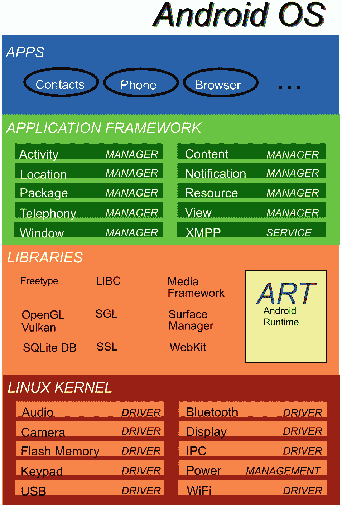

# Android 操作系统

Android 基于一个专门定制的 Linux 内核。该内核提供了所有底层驱动程序，用于处理硬件、程序执行环境以及底层通信通道。

在内核之上，你会发现 *Android 运行时 (ART)* 和一些用 C 编写的底层库。后者充当了应用相关库与内核之间的桥梁。Android 运行时是 Android 程序运行的执行引擎。

作为开发者，你几乎不需要了解这些底层库和 Android 运行时如何工作的细节，但你将使用它们来完成基本编程任务，例如处理音频子系统或数据库。

在底层库和 Android 运行时之上的是*应用框架*，它定义了您为 Android 构建的任何应用的外部结构。它处理活动、GUI 小部件、通知、资源等。虽然了解底层库肯定有助于编写优秀的程序，但了解应用框架对于编写任何 Android 应用都是必不可少的。

在最顶层，你会发现用户为完成任务而启动的应用。请参见图 1-1。

Android 应用系统包含应用、应用网络和库。

图 1-1

Android 操作系统

作为开发者，您将使用 Kotlin、Java 或 C++ 作为编程语言（或它们的组合）来创建 Android 应用。并且您将使用应用框架和库来与 Android 操作系统和硬件进行通信。在较低层面上使用 C++ 作为编程语言，处理目标架构的特殊性，会导致引入*原生开发工具包 (NDK)*，它是 Android SDK 的一个可选部分。虽然出于特殊目的可能需要使用 NDK，但在大多数情况下，为处理另一种语言及其带来的特殊挑战而付出的额外努力并不划算。因此，在本书中，我们主要会在适当的地方讨论 Kotlin 和 Java。

