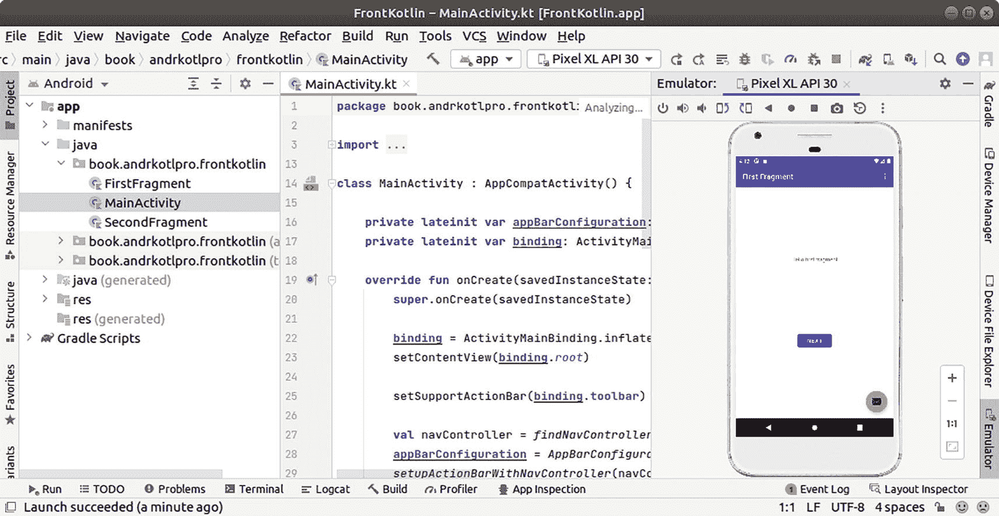

# 开发系统

在手持设备上运行的操作系统只是故事的一部分——作为开发者，您还需要一个用于创建 Android 应用的系统。后者发生在个人电脑或笔记本电脑上，您使用的软件套件是 *Android Studio*。

Android Studio 本身是您用于开发的 IDE，但当您安装和操作它时，SDK 也会随之安装，我们将在以下章节中讨论两者。我们还将讨论虚拟设备，它为在各种目标设备上测试您的应用提供了宝贵的帮助。

## Android Studio

Android Studio IDE 是用于创建和运行 Android 应用的专用开发环境。其主窗口以及模拟器视图如图 1-2 所示。

Android Studio 提供以下功能：

Android Studio 的截图。

图 1-2

Android Studio

*   管理 Kotlin、Java 和 C++ (NDK) 的程序源代码
*   管理程序资源
*   允许在模拟器或连接的实机中试运行应用
*   更多测试工具
*   调试功能
*   性能和内存分析器
*   代码检查
*   用于构建本地或可发布应用的工具

Studio 中包含的帮助和在线资源提供了足够的信息来掌握 Android Studio——在本书中，我们会不时地并在专门的章节中讨论它。

