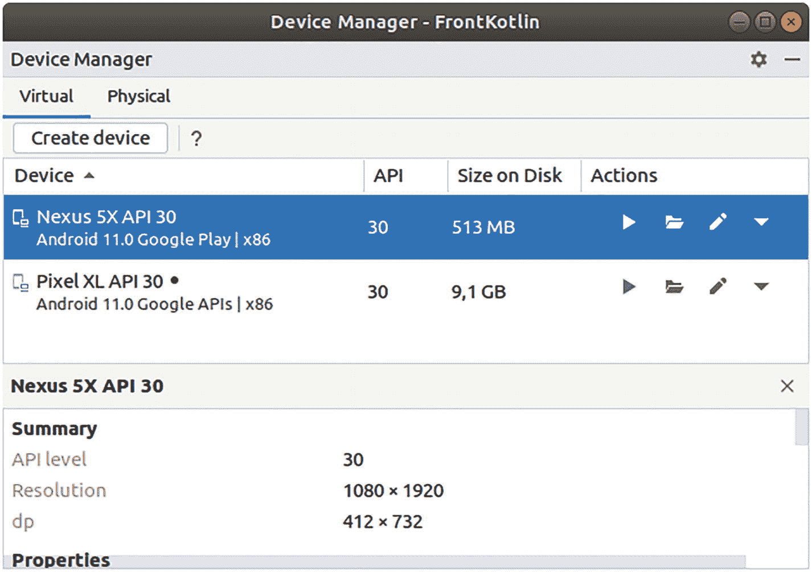

# 虚拟设备

为计算机开发软件始终包含一个挑战，即创建一个能够处理所有可能目标系统的程序。如今手持设备形式多样，这方面变得比以往任何时候都更加关键。您有尺寸在 3.9 英寸到 5.4 英寸及以上的智能手机设备，7 英寸到 14 英寸及以上的平板电脑，可穿戴设备，不同尺寸的电视等等，所有这些都运行着 Android 操作系统。

当然，作为开发者，您不可能购买所有必要的设备来覆盖所有可能的尺寸。这就是模拟器派上用场的地方。有了模拟器，您不必购买硬件，仍然可以开发 Android 应用。

Android Studio 使您能够轻松使用模拟器来开发和测试应用，并且通过使用 SDK 中的工具（请参见下一节“SDK”），您甚至可以在 Android Studio 外部操作模拟器。

注意

您*可以*在不拥有任何实机的情况下开发应用。但是，不建议这样做。您应该至少拥有一部最新一代的智能手机，如果经济条件允许，可能还需要一台平板电脑。原因在于，操作实机的感觉与模拟器不同，物理操作并非 100% 相同，性能也存在差异。

要从 Android Studio 内部管理虚拟设备，请通过 *工具 ➤ 设备管理器* 打开 Android 虚拟设备 (AVD) 管理器。在这里，您可以查看、修改、创建或删除以及启动虚拟设备。请参见图 1-3。



AVD 管理器的截图。

图 1-3

AVD 管理器

创建新的虚拟设备时，您将能够在“电视”、“穿戴设备”、“手机”、“汽车”或“平板电脑”设备中进行选择，可以选择要使用的 API 级别（并下载新的 API 级别），并且在设置中可以指定各种内容，如图形性能、摄像头模式等。有关管理 AVD（Android 虚拟设备）的详细信息，请参阅 [`https://developer.android.com/studio/run/managing-avds`](https://developer.android.com/studio/run/managing-avds) 上的在线文档。

用于创建虚拟镜像的虚拟设备基础镜像和皮肤可以在以下位置找到：

```
SDK_INST/system-images
SDK_INST/skins
```

以及安装了应用和用户数据的实际虚拟设备位于：

```
~/.android/avd
```

管理正在运行的虚拟设备也可以通过各种命令行工具来完成。请参阅第 19 章的“SDK 工具”和“SDK 平台工具”部分。

## SDK

与 Android Studio 相比，SDK 是一组松散耦合的工具，它们要么是 Android 开发所必需的，因此被 Android Studio 直接使用，要么至少对一些开发任务有帮助。它们都可以从 shell 中启动，并且可能带有或不带有自己的 GUI。

如果您不确定在安装 Android Studio 期间 SDK 安装在哪里，您可以轻松询问 Android Studio 本身：转到 *文件 ➤ 项目结构*，然后从菜单中选择“SDK 位置”。

属于 SDK 一部分的命令行工具在第 19 章中进行了描述。


