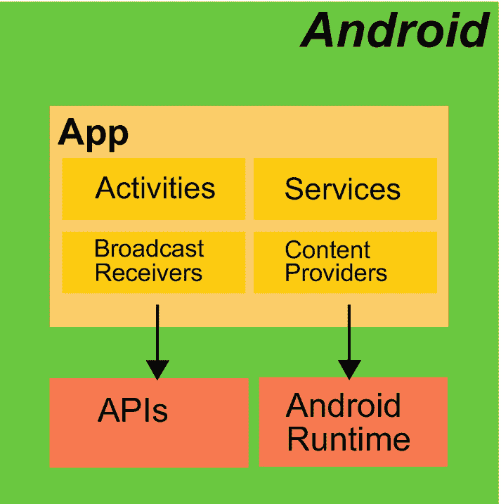
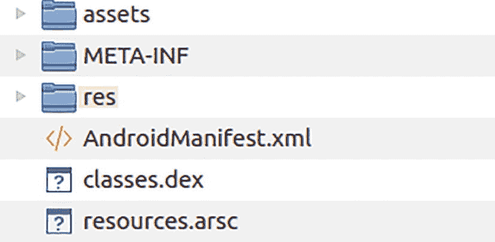

# 2. 应用

一个 Android 应用由 *活动*、*服务*、*广播接收器*和*内容提供者*等组件构成。参见图 2-1。活动用于与设备用户交互，服务用于在无专用用户界面的情况下运行的程序部分，广播接收器监听来自其他应用和组件的标准化消息，而内容提供者则允许其他应用和组件访问某个组件所提供的一定数量和类型的数据。



Android 操作系统将应用通过 API 接入 Android 运行时的流程图。

图 2-1
Android 操作系统中的应用

组件由 *Android 运行时*（或者你喜欢的话，也可以称之为执行引擎）启动，它既可以自行启动组件，也可以代表其他组件生成启动触发器。组件在何种情况下被启动取决于其类型及其所赋予的元信息。在其生命周期的另一端，所有正在运行的组件都可能从进程执行列表中被移除，原因可能是它们已完成工作，或者 Android 操作系统判定该组件不再需要而被移除，抑或是因为设备资源短缺而必须被移除。

为了使你的应用或组件尽可能稳定地运行，并让用户对其可靠性产生良好的感受，深入了解 Android 组件的生命周期会很有帮助。我们将在本章中探讨组件的系统特性及其生命周期。

构建一个应用或 Android 组件并不难——只需参考 Android 官方网站上的任何教程、Android Studio 提供的模板和示例，或者你在网络上其他地方能找到的成千上万个教程之一即可。然而，一个简单的应用并不一定就是专业级别的稳定应用，因为就应用而言，Android 的状态处理与桌面应用程序的状态处理是不同的。原因在于，你的 Android 设备很可能会为了节省系统资源而决定终止你的应用，特别是当你因一段时间内使用一个或多个其他应用而暂时挂起该应用时。

当然，Android 基本不会终止你正在使用的应用，但你必须采取预防措施。任何被 Android 终止的应用都应该能够以定义好的数据和加工状态重新启动，包括用户当前输入的大部分数据，并尽可能少地干扰用户当前的工作流程。

从文件角度来看，一个 Android 应用是单个后缀为 `.apk` 的压缩归档文件。它包含你的完整应用，包括在 Android 设备上运行该应用所需的所有元信息。其中最重要的控制工件是 `AndroidManifest.xml` 文件，它描述了应用以及应用所包含的组件。

我们在此不详细讨论这个归档文件的结构，因为在大多数情况下，Android Studio 会负责为你正确创建归档文件，所以你通常不需要了解其内部运作方式。但你可以轻松查看其内部结构。只需随便找一个 `*.apk` 文件，例如，一个你已经用 Android Studio 构建好的示例应用，它位于

```
AndroidStudioProject/[YOUR-APP]/release/app-release.apk
```

然后解压它——APK 文件就是普通的 zip 文件。你可能需要临时将后缀名改为 `.zip`，以便你的解压程序能够识别它。这样一个解压后的 APK 文件，例如，看起来会如图 2-2 所示。



一个解压后的 APK 文件片段，其中 META-INF、AndroidManifest.xml 和 resources.arsc 被高亮显示。

图 2-2
解压后的 APK 文件

你在那里看到的 `.dex` 文件包含了以 *Dalvik Executable* 格式编译的类，这类似于 Java 中的 JAR 文件。

我们稍后会讨论与应用相关的工件，但首先我们将从更概念化的角度来探讨什么是*任务*。

