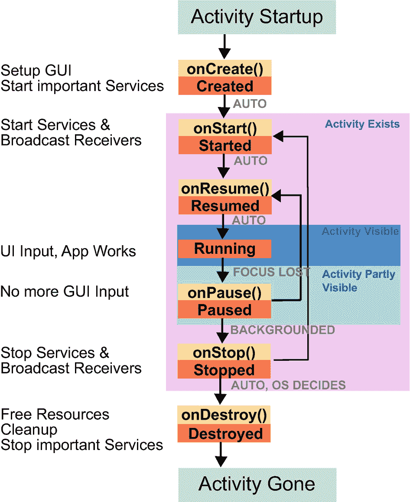

# 意图过滤器

`Intent`（意图）是用来告诉 Android 系统需要执行某项操作的对象。它可以是*显式*的，即精确指定需要调用的组件；也可以是*隐式*的，当我们不精确指定被调用的组件，而是让 Android 决定哪个应用和哪个组件能够响应该请求时，就属于隐式意图。如果存在歧义，并且 Android 无法确定要为隐式`Intent`调用哪个组件，Android 会询问用户。

为了使隐式`Intent`能够工作，可能的意图接收者需要声明它能接收哪些`Intent`。例如，某个 Activity 可能能够显示文本文件的内容，而调用者说“我需要一个能显示文本文件的 Activity”，就可能连接到这个 Activity。现在，意图接收者声明其能够响应意图请求的方式是：在其应用的 `AndroidManifest.xml` 文件中指定一个或多个*意图过滤器*。这种声明的语法如下：

```
<intent-filter android:icon="drawable resource"
android:label="string resource"
android:priority="integer" >
...
```

其中，`icon` 指向一个用于图标的可绘制资源 ID，`label` 指向一个用于标签的字符串资源 ID。如果未指定，将使用父元素的图标或标签。`priority` 属性是一个介于 -999 到 999 之间的数字，对于`Intent`，它指定了处理此类意图请求的能力；对于接收者，它指定了多个接收者的执行顺序。优先级高的在前，优先级低的在后。

> **注意**  
> `priority` 属性应谨慎使用——一个组件无法知道其他应用中的组件可能具有的优先级。因此，你会在应用之间引入某种类型的依赖关系，这并非设计本意。

此 `<intent-filter>` 元素可以作为以下元素的孩子：

*   `<activity>` 和 `<activity-alias>`
*   `<service>`
*   `<receiver>`

所以，`Intent` 可用于启动 Activity 和服务，以及发送广播消息。

该元素必须或可以拥有以下子元素：

*   `<action>` 是必需的。
*   `<category>`
*   `<data>`

> **注意**  
> 另请参阅 [`https://developer.android.com/reference/android/content/Intent`](https://developer.android.com/reference/android/content/Intent) 上的在线文档。

## Intent 动作

过滤器的 `<action>` 子元素（或多个子元素，你可以有多个）指定要执行的动作。语法如下：

```
<action android:name="string" />
```

这将是表达诸如“查看”、“选取”、“编辑”、“拨号”等动作的内容。通用动作的完整列表由 `android.content.Intent` 类中名称带有 `ACTION_*` 的常量指定，并在在线文本伴侣的“Intent 组成要素”一节中展示。除了这些通用动作，你也可以定义自己的动作。

> **注意**  
> 使用任何标准动作并不一定意味着你的设备上存在能够响应相应 `Intent` 的应用程序。

## Intent 类别

过滤器的 `<category>` 子元素指定了过滤器的类别。语法如下：

```
<category android:name="string" />
```

此属性可用于指定 `Intent` 应寻址的组件类型。你可以指定多个类别，但类别并非用于所有 `Intent`，你也可以省略它。仅当*所有*必需的类别都存在时，过滤器才会匹配该 `Intent`。

在调用者一侧使用 `Intent` 时，你可以通过编写如下代码来添加类别：

```
val intent:Intent = Intent(...)
intent.addCategory("android.intent.category.ALTERNATIVE")
```

标准类别对应于 `android.content.Intent` 类中名称带有 `CATEGORY_*` 的常量。我们在在线文本伴侣的“Intent 组成要素”一节中列出了它们。

> **注意**  
> 对于隐式 `Intent`，你*必须*在过滤器中使用 `DEFAULT` 类别。这是因为 `startActivity()` 和 `startActivityForResult()` 方法默认使用了此类别。

## Intent 数据

过滤器的 `<data>` 子元素是过滤器的数据类型规范。语法如下：

```
<data android:scheme="string"
      android:host="string"
      android:port="string"
      android:path="string"
      android:pathPrefix="string"
      android:pathPattern="string"
      android:mimeType="string" />
```

你可以指定以下任一项：

*   仅由 `mimeType` 元素指定的数据类型，例如 "text/plain" 或 "text/html"。所以你可以编写 `<data android:mimeType="text/html" />`。
*   由协议、主机、端口和某种路径规范指定的数据类型：`<scheme>://<host>:<port>[<path>|<pathPrefix>|<pathPattern>]`。这里 `<path>` 表示完整路径，`<pathPrefix>` 是路径的开头部分，`<pathPattern>` 类似于路径但可以使用通配符："X*" 表示 0 次或多次出现字符 "X"，".*" 表示 0 次或多次出现任何字符。由于转义规则，要表示字面量的 "*"，请编写 `\\`；要表示字面量的 "\"，请编写 `\\\\`。

或者，你也可以同时指定上述两个选项。  
在调用者一侧，你可以使用 `setType()`、`setData()` 和 `setDataAndType()` 来设置任意数据类型组合。

> **注意**  
> 对于隐式意图过滤器，如果调用者指定了一个 URI *数据*部分，例如 `intent.data = <某个 URI>`，那么仅在过滤器声明中指定协议/主机/端口/路径可能是不够的。在这种情况下，你还必须指定 MIME 类型，例如 `mimeType="*/*"`；否则，过滤器可能无法匹配。这种情况通常发生在*内容提供者*环境中，因为对于指定的 URI，内容提供者的 `getType()` 方法会被调用，其结果会被设置为 `Intent` 的 MIME 类型。

## Intent 额外数据

任何 `Intent` 都可以添加额外的数据，你可以用它来发送除 `<data>` 子元素指定的数据之外的其他数据。  
虽然你可以使用各种 `putExtra(...)` 方法中的任何一种来添加任何类型的额外数据，但也有几个通过 `putExtra(String,Bundle)` 发送的标准额外数据，其键值在在线文本伴侣的“Intent 组成要素”一节给出的列表中。

## Intent 标志

你可以通过调用以下方式来设置特殊的意图处理标志：

```
intent.flags = Intent. or Intent. or ...
```

这些标志大多指定了 Android 操作系统如何处理该 `Intent`。具体来说，形式为 `FLAG_ACTIVITY_*` 的标志针对由 `Context.startActivity(..)` 调用的 Activity，而像 `FLAG_RECEIVER_*` 这样的标志则用于 `Context.sendBroadCast(...)`。在线文本伴侣中“Intent 组成要素”一节的表格显示了详细信息。

## 系统意图过滤器

系统应用，即你购买智能手机后安装的应用，拥有意图过滤器，你可以从自己的应用中调用它们。不幸的是，猜测如何调用系统应用的 Activity 并不总是那么容易，而且相关的文档也很难找到。一个补救措施是从它们的 APK 文件中提取这些信息。对于 API 级别 26，这项工作已经为你完成，结果列在在线文本伴侣的“系统意图过滤器”一节中。

例如，假设你想发送一封电子邮件。查看在线文本伴侣中的系统意图表，你可以在“PrebuiltGmail”的表格中找到许多动作。应该使用哪一个呢？嗯，首先，通用接口不应该有太多的输入参数。其次，我们也可以查看动作名称来找到看似合适的动作。一个很有希望的候选者是 "SEND_TO" 动作：它显然只需要一个 "mailto:" 数据规范。碰巧的是，这正是我们实际需要的动作。使用精心构造的 "mailto:..." URL 可以指定更多的收件人、抄送和密送收件人、主题，甚至邮件正文。但是，你也可以直接使用 "mailto:master@universe.com"，并通过使用额外字段来添加收件人、正文等。请参阅“Intent 额外数据”一节。因此，要发送电子邮件，并可能让用户在设备上安装的多个电子邮件应用中进行选择，可以编写：

```
val intent = Intent(Intent.ACTION_SENDTO).apply {
    data = Uri.parse("mailto:master@universe.com")
    putExtra(Intent.EXTRA_SUBJECT, "Subject")
    putExtra(Intent.EXTRA_TEXT, "Body")
}
startActivity(intent)
```


```kotlin
val emailIntent: Intent = Intent(Intent.ACTION_SENDTO,
    Uri.fromParts("mailto", "abc@gmail.com", null))
emailIntent.putExtra(Intent.EXTRA_SUBJECT, "Subject")
emailIntent.putExtra(Intent.EXTRA_TEXT, "Body")
startActivity(Intent.createChooser(
    emailIntent, "发送邮件..."))
// 或者 startActivity(emailIntent)，如果你想使用
// 标准选择器（如果只有一个可能的接收者，则可能不显示选择器）。
```

**注意**

接收应用自行决定如何处理 Intent URI 和附加数据。设计糟糕的邮件客户端可能根本不允许指定邮件头数据。为安全起见，你可能需要将所有的头数据同时添加到“mailto:”URI *和*附加数据中。

## Activity 生命周期

Activity 有一个生命周期，与传统的桌面应用程序相反，它们有意地可能被 Android 操作系统随时终止。因此，作为开发者，你需要采取特殊预防措施来确保应用的稳定性。更准确地说，一个活动会处于以下状态之一：

-   **已关闭**：Activity 不可见且不处理任何任务。但包含该 Activity 的应用可能仍然存活，因为它有其他组件在运行。
-   **已创建**：该 Activity 可能是主 Activity 并由用户或其他组件启动，或者它是一个非主 Activity，由同一应用或满足安全考虑的其他应用中的其他组件启动。此外，当你翻转屏幕且应用需要用不同屏幕特性重建时，也会发生 Activity 创建。在创建过程中，会调用回调方法 `onCreate()`。你必须实现此方法，因为在此处需要构建 GUI。你也可以使用此回调方法启动或连接服务，或提供内容提供者数据。你可以使用 API 来*准备*播放音乐、操作相机或执行应用设计的任何其他功能。这也是一个初始化应用所需的数据库或其他数据存储的好地方。
-   **已启动**：一旦创建完成，或者在停止后重新启动的情况下——参见下文——Activity 将进入*已启动*状态。在此状态下，Activity 即将对用户可见。在启动过程中，会调用回调方法 `onStart()`。这是启动广播接收器、启动服务以及重建当 Activity 进入停止状态时你退出的内部状态和进程的好地方——参见下文。
-   **已恢复**：在即将对用户可见之前，Activity 会经历恢复过程。在此过程中，会调用回调 `onResume()`。
-   **运行中**：Activity 完全可见，用户可以与其交互。此状态紧接在恢复过程之后。
-   **已暂停**：Activity 失去焦点，但仍至少部分可见。例如，当用户点击“返回”或“概览”按钮时，就会失去焦点。Activity 可能继续向 UI 发送更新或继续产生声音，但在大多数情况下，Activity 将进入已停止状态——参见下文。在暂停过程中，会调用 `onPause()` 回调。暂停状态之后是已停止状态或已恢复状态。
-   **已停止**：Activity 将对用户不可见。它稍后可能会重新启动或销毁并从活动进程列表中移除。在停止过程中，会调用 `onStop()` 回调。停止之后要么是销毁要么是启动。例如，你可以在此处停止你在 `onStart()` 中启动的服务。
-   **已销毁**：Activity 被移除。会调用回调 `onDestroy()`，你应该实现它并在其中执行所有操作以释放资源和执行其他清理操作。

Activity 状态之间可能的转换列于表 3-1 中，并在图 3-1 中说明。



一个 Activity 状态转换流程图，包含 Activity 启动、Activity 存在、Activity 可见、Activity 部分可见和 Activity 消失等元素。

**图 3-1** Activity 状态转换

**表 3-1** Activity 状态转换

| 来自       | 前往       | 描述                                                       | 实现                                                                                                                                         |
| :--------- | :--------- | :--------------------------------------------------------- | :------------------------------------------------------------------------------------------------------------------------------------------- |
| 已关闭     | 已创建     | Activity 首次被调用或在销毁后被调用。                        | `onCreate()`: 调用 `super.onCreate()`，准备 UI，并启动服务。                                                                                     |
| 已创建     | 已启动     | Activity 在创建后启动。                                      | `onStart()`: 你可以在此处启动仅在 Activity 可见时才需要的服务。                                                                                 |
| `已启动`   | `已恢复`   | `已恢复状态自动跟随已启动状态。`                             | `onResume()`                                                                                                                                 |
| 已恢复     | 运行中     | 运行中状态自动跟随已恢复状态。                             | 此处发生 Activity 的功能，包括 UI 活动。                                                                                                         |
| `运行中`   | `已暂停`   | `Activity 失去焦点，因为用户点击了“返回”或“概览”按钮。`   | `onPause()`                                                                                                                                  |
| `已暂停`   | `已恢复`   | `Activity 尚未停止，用户导航回该 Activity。`                | `onResume()`                                                                                                                                 |
| 已暂停     | 已停止     | Activity 将对用户不可见，例如，因为另一个 Activity 启动了。    | `onStop()`: 你可以在此处停止仅在 Activity 可见时才需要的服务。                                                                                  |
| 已停止     | 已启动     | 已停止的 Activity 被重新启动。                               | `onStart()`: 你可以在此处启动仅在 Activity 可见时才需要的服务。                                                                                 |
| 已停止     | 已销毁     | 已停止的 Activity 被移除。                                  | `onDestroy()`: 释放所有资源，进行清理，并停止在 `onCreate()` 中启动的服务。                                                                      |

## 在 Activity 中保存状态

我们几乎过分强调了你需要采取预防措施，以确保你的应用在被 Android 操作系统强制停止时能以良好方式重新启动。现在我们提供一个关于如何做到这一点的建议。

查看 Activity 的生命周期——参见“Activity 生命周期”一节——我们可以看到，一个即将被 Android 操作系统终止的 Activity 会调用 `onStop()` 方法。但我们还有两个尚未提及的回调。它们名为 `onSaveInstanceState()` 和 `onRestoreInstanceState()`，每当 Android 决定需要保存或恢复 Activity 的数据时，就会调用它们。这与 `onStart()` 和 `onStop()` 不同，因为有时不需要保存状态。例如，如果一个 Activity 不会被销毁而只是暂停，状态无论如何都会保持，`onSaveInstanceState()` 和 `onRestoreInstanceState()` 将不会被调用。

Android 在这方面已经帮了我们：`onSaveInstanceState()` 和 `onRestoreInstanceState()` 的默认实现已经保存并恢复了具有 ID 的 UI 元素。因此，如果这就是你所需要的，你无需做任何事情。当然，你的 Activity 可能更复杂，并且可能包含你需要保留的其他字段。在这种情况下，你可以重写 `onSaveInstanceState()` 和 `onRestoreInstanceState()`。请确保你调用了父类的方法。否则，你必须自己处理所有 UI 元素：


```kotlin
override fun onSaveInstanceState(outState: Bundle?) {
    super.onSaveInstanceState(outState)
    // 在此处将你自己的数据添加到 Bundle 中……
    // 你可以使用这里提供的 put* 方法之一
    // 或编写你自己的 Parcelable 类型
}

override fun onRestoreInstanceState(savedInstanceState: Bundle?) {
    super.onRestoreInstanceState(savedInstanceState)
    // 在此处从 Bundle 还原你自己的数据……
    // 使用这里提供的 get* 方法之一
}
```

请注意，保存的状态也会传递到 `onCreate()` 回调中，因此你可以自行决定是使用 `onRestoreInstanceState()` 还是 `onCreate()` 方法来恢复状态。

在其他情况下，用于保存和恢复状态的标准机制可能无法满足你的需求。例如，它无法在停止应用时保留数据。在这种情况下，`onSaveInstanceState()` 不会被调用。如果你也需要在此类情况下保留数据，可以在 `onDestroy()` 中将应用数据保存到数据库，并在 `onCreate()` 回调中读取该数据库。请参阅第 8 章的“数据库”部分。

## 服务

服务是那些没有用户界面（状态栏中的通知或 Toast 除外）的组件，且概念上与长时间运行的进程密切相关。服务可以由应用启动，也可以被应用绑定，或者同时进行这两种操作。

服务分为两种：前台服务和后台服务。乍看之下，“前台服务”这个说法似乎有些矛盾，因为很多人倾向于告诉你“服务在后台运行”，但前台服务确实存在，并且区分前台服务和后台服务至关重要，因为它们的行为不同。

> **注意**
> 不要将服务误解为用于运行所有后台计算任务（即不干扰 GUI 活动）的构造。如果你需要一个不干扰 GUI，但在应用不活动时也无法运行，且不被应用外部使用的进程，请考虑使用额外的线程。请参阅第 11 章。

完全理解服务并非易事，尤其是在不同 Android 版本之间存在显著差异的情况下。虽然本章旨在为你提供概述并展示一些细节层面的提示，但它无法涵盖服务开发的所有方面。因此，建议你同时查阅在线文档：[`https://developer.android.com/guide/components/services`](https://developer.android.com/guide/components/services)。

### 前台服务

前台服务的内部功能因 Android 版本而异。在 Android 8.0 或 API 级别 26 之前，前台服务只是在状态栏有一个条目的后台服务，操作系统如何处理它们没有严格的影响；而在 Android 8.0 或 API 级别 26 之后，前台服务表现出特殊的行为，并得到 Android 操作系统的优先关注，这使它们不太可能因为资源短缺而被终止。具体来说：

*   **Android 8.0 或 API 级别 26 之前的前台服务** 只是那些在状态栏中显示通知条目的服务。需要使用服务的客户端组件并不知道启动的服务是否是前台服务；它只是通过 `startService(intent)` 启动服务。请参阅第 13 章。

*   **从 Android 8.0 或 API 级别 26 开始的前台服务** 以用户能感知到的方式运行。它们*必须*通过状态栏中的通知来与操作系统交互。客户端组件通过调用 `startForegroundService(intent)` 显式启动前台服务，并且服务本身必须在几秒钟内通过调用 `startForeground(notificationId, notification)` 明确告知 Android 操作系统它希望作为前台服务运行。

前台服务一个值得注意的生命周期特性是，它因资源短缺而被 Android 终止的可能性较小。然而，文档对此并不精确。有时你会读到“不会被终止”，有时是“不太可能被终止”。此外，Android 处理此类问题的方式可能会随着新版本而改变。作为一般经验法则，你应该非常保守并做好最坏的打算。在这种情况下，应理解为“不太可能被终止”，并在你的应用正在执行某些工作而服务停止运行时采取预防措施。

