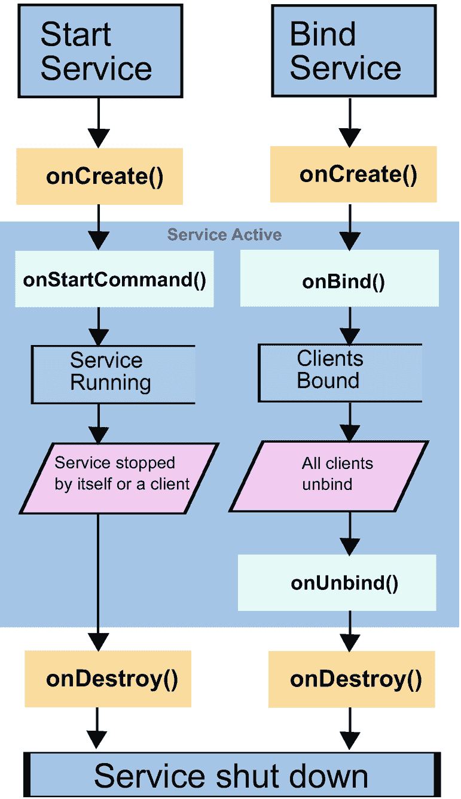

# Android 服务的启动与绑定

## 启动服务

要显式启动一个服务，你需要一个合适的 `Intent`。基本上有两种情况：

### 内部服务（同一应用）

首先，如果服务与调用方位于同一应用中，可以这样编写：

```
val intent = Intent(this, TheService::class.java)
startService(intent)
```

适用于普通服务，或者：

```
val intent = Intent(this, TheService::class.java)
if (Build.VERSION.SDK_INT >= Build.VERSION_CODES.O) {
    startForegroundService(intent)
} else {
    startService(intent)
}
```

适用于 Android 8.0 或 API 级别 26 开始定义的前台服务（在此之前的版本则按常规方式启动）。也就是说，我们可以直接引用服务类。如果你刚接触 Kotlin 开发，`TheService::class.java` 这种写法初看可能有些奇怪——这其实是 Kotlin 提供 Java 类作为参数的方式。

> **注意**
> 由于 `Intent` 可以通过各种 `putExtra()` 方法传递通用附加属性，我们也可以向服务传递数据。

### 外部服务（另一应用）

其次，如果要启动的服务属于另一个应用，即*外部*服务，则首先需要在服务声明中添加 intent filter，例如：

```
<action android:name="<PCKG_NAME>.START_SERVICE" />
```

其中 `<PCKG_NAME>` 是应用包的名称，`START_SERVICE` 也可以替换为其他标识符。然后在服务客户端中，可以这样编写：

```
val intent = Intent(".START_SERVICE")
intent.setPackage("<PCKG_NAME>")
startService(intent)
// ... 执行其他操作 ...
stopService(intent)
```

来启动和停止外部服务，其中 Intent 构造函数的参数必须与服务 intent filter 声明中的字符串完全一致。`setPackage()` 语句在这里很重要（当然你需要替换为服务所在的包名）；否则会触发安全限制，导致错误信息。

## 绑定服务

启动服务只是其中的一部分——另一部分是在服务运行时使用它。这正是*服务绑定*的用途。

### 内部绑定（同一应用）

要创建可供同一应用绑定的服务，可以这样编写：

```
/**
 * 用于本地绑定的类，即在同一应用中。
 */
class MyBinder(val servc: MyService) : Binder() {
    fun getService(): MyService {
        return servc
    }
}

class MyService : Service() {
    // 提供给客户端的 Binder
    private val binder: IBinder = MyBinder(this)
    // 随机数生成器
    private val generator: Random = Random()

    override fun onBind(intent: Intent): IBinder {
        return binder
    }

    /** 供客户端使用的方法 */
    fun getRandomNumber(): Int {
        return generator.nextInt(100)
    }
}
```

要在同一应用内绑定到此服务，在服务客户端中编写：

```
val servcConn = object : ServiceConnection {
    override fun onServiceDisconnected(compName: ComponentName?) {
        Log.e("LOG", "onServiceDisconnected: " + compName)
    }

    override fun onServiceConnected(compName: ComponentName?,
                                    binder: IBinder?) {
        Log.e("LOG", "onServiceConnected: " + compName)
        val servc = (binder as MyBinder).getService()
        Log.i("LOG", "Next random number from service: " +
                servc.getRandomNumber())
    }

    override fun onBindingDied(compName: ComponentName) {
        Log.e("LOG", "onBindingDied: " + compName)
    }
}

val intent = Intent(this, MyService::class.java)
val flags = BIND_AUTO_CREATE
bindService(intent, servcConn, flags)
```

其中 `object : ServiceConnection {...}` 结构是 Kotlin 中通过创建匿名内部类对象来实现接口的方式，类似于 Java 中的 `new ServiceConnection(){ ... }`。在 Kotlin 中，这种结构被称为*对象表达式*。此处的 `this` 在 Intent 构造函数中指向一个 `Context` 对象。你可以在 Activity 中这样使用它。如果将 `Context` 存储在变量中，请在此处使用该变量名。

当然，除了日志记录，你应该做更有意义的事情。特别是可以在 `onServiceConnected()` 方法中将 binder 或服务保存到变量中以便后续使用。不过要记住，你应当适当处理绑定失效或服务连接被终止的情况。例如，可以尝试重新绑定服务或通知用户，或者两者都做。

上述代码会在你绑定时自动启动服务（如果服务尚未存在）。这是通过以下语句实现的：

```
val flags = BIND_AUTO_CREATE
[...]
```

如果你确定服务正在运行而不需要此功能，可以省略它。但大多数情况下，包含该标志更稳妥。可用于设置绑定特性的标志如下：

- **`BIND_AUTO_CREATE`**：我们刚刚使用了它。表示如果服务尚未启动，则自动启动它。有时你会读到，如果绑定了服务，就不需要显式启动它，但这只有在设置了此标志时才成立。

- **`BIND_DEBUG_UNBIND`**：这会导致保存后续 `unbindService()` 的调用栈，以防后续的解绑命令有误。如果发生这种情况，会显示更详细的诊断输出。由于这会导致内存泄漏，此功能应仅用于调试目的。

- **`BIND_NOT_FOREGROUND`**：仅在客户端运行在前台进程且目标服务运行在后台进程时使用。使用此标志时，绑定过程不会将服务提升为前台调度优先级。

- **`BIND_ABOVE_CLIENT`**：使用此标志表示服务的优先级高于客户端（即服务调用者）。在资源短缺的情况下，系统会先于被调用的服务终止客户端。

- **`BIND_ALLOW_OOM_MANAGEMENT`**：此标志告诉 Android 操作系统，你更愿意接受 Android 将绑定视为非关键，并在内存不足时终止服务。

- **`BIND_WAIVE_PRIORITY`**：此标志将服务调用的调度权交由服务所在进程处理。

你可以根据需要将它们组合使用。

> **注意**
> 不能在 `BroadcastReceiver` 组件内部进行绑定，除非该 `BroadcastReceiver` 已通过 `registerReceiver(receiver, intentfilter)` 注册。在后一种情况下，接收器的生命周期与注册组件绑定。不过，你可以在广播接收器中通过用于启动（而非绑定）服务的 `Intent` 传递指令字符串。

### 外部绑定（另一应用）

要绑定外部服务（即属于另一个应用的服务），不能使用与内部服务相同的绑定技术。原因在于我们使用的 `IBinder` 接口无法直接访问服务类，因为该类在进程边界之外不可见。不过，我们可以将需要在服务和客户端之间传输的数据封装到 `android.os.Handler` 对象中，并使用该对象将数据从服务客户端发送到服务。为实现这一点，服务端首先需要定义一个用于接收消息的 `Handler`，例如：


```kotlin
internal class InHandler(val ctx: Context) : Handler() {
override
fun handleMessage(msg: Message) {
val s = msg.data.getString("MyString")
Toast.makeText(ctx, s, Toast.LENGTH_SHORT).show()
}
}
[...]
class MyService : Service() {
val myMessg:Messenger = Messenger(InHandler(this))
[...]
}
```

当然，收到消息时，除了创建 `Toast` 消息外，您还可以执行更有趣的操作。现在，在服务的 `onBind()` 方法中，我们返回信使提供的绑定器对象：

```kotlin
override
fun onBind(intent:Intent):IBinder {
return myMessg.binder
}
```

至于 `AndroidManifest.xml` 文件中的条目，我们可以按照与*启动*远程服务相同的方式来编写；请参阅前面的“启动服务”一节。

在服务客户端中，您需要添加一个 `Messenger` 属性和一个 `ServiceConnection` 对象，例如：

```kotlin
var remoteSrvc:Messenger? = null
private val myConnection = object : ServiceConnection {
override
fun onServiceConnected(className: ComponentName,
service: IBinder) {
remoteSrvc = Messenger(service)
}
override
fun onServiceDisconnected(className: ComponentName) {
remoteSrvc = null
}
}
```

要实际执行绑定，我们可以像处理内部服务一样进行。例如，在 Activity 的 `onCreate()` 方法中，您可以编写：

```kotlin
val intent:Intent = Intent(".START_SERVICE")
intent.setPackage("")
bindService(intent, myConnection, Context.BIND_AUTO_CREATE)
```

其中 `<PCKG_NAME>` 应替换为服务包的实际名称。

现在，要将消息从客户端跨进程边界发送到服务，您可以编写：

```kotlin
val msg = Message.obtain()
val bundle = Bundle()
bundle.putString("MyString", "要发送的消息")
msg.data = bundle
remoteSrvc?.send(msg)
```

请注意，在此示例中，您不能将这些代码行添加到 Activity 的 `onCreate()` 方法中的 `bindService()` 语句之后，因为 `remoteSrvc` 只有在连接建立后才会被赋值。但您可以将它们添加到 `ServiceConnection` 类的 `onServiceConnected()` 方法中。

> **注意：** 上述代码中未采取任何措施来确保连接正常。您应该为生产代码添加健全性检查。此外，请在 `onStop()` 方法中解除与服务的绑定。

## 服务发送的数据

到目前为止，我们讨论的是从服务客户端发送到服务的消息。将数据从服务反向发送到服务客户端也是可行的——可以通过在客户端中使用额外的*信使*、广播消息或 `ResultReceiver` 类来实现。

对于第一种方法，在服务客户端中提供另一个*处理程序*和*信使*，一旦客户端收到 `onServiceConnected()` 回调，就通过 `replyTo` 参数将第二个信使发送给服务：

```kotlin
internal class InHandler(val ctx: Context) : Handler() {
override
fun handleMessage(msg: Message) {
// 处理来自服务的消息
}
}
class MainActivity : AppCompatActivity() {
private var remoteSrvc:Messenger? = null
private var backData:Messenger? = null
private val myConn = object : ServiceConnection {
override
fun onServiceConnected(className: ComponentName,
service: IBinder) {
remoteSrvc = Messenger(service)
backData = Messenger(
InHandler(this@MainActivity))
// 建立反向通道
val msg0 = Message.obtain()
msg0.replyTo = backData
remoteSrvc?.send(msg0)
// 处理正向通信（客户端 -> 服务）
// 连接逻辑...
}
override
fun onServiceDisconnected(clazz: ComponentName) {
remoteSrvc = null
}
}
override fun onCreate(savedInstanceState: Bundle?) {
super.onCreate(savedInstanceState)
setContentView(R.layout.activity_main)
// 绑定到服务，使用清单中的 ID！
val intent = Intent(".START_SERVICE")
intent.setPackage("")
val flags = Context.BIND_AUTO_CREATE
bindService(intent, myConn, flags)
}
}
```

然后，服务可以使用此消息，提取 `replyTo` 属性，并利用它向服务客户端发送消息。


```kotlin
internal class IncomingHandler(val ctx: Context) : Handler() {
    override fun handleMessage(msg: Message) {
        val s = msg.data.getString("MyString")
        val repl = msg.replyTo
        Toast.makeText(ctx, s, Toast.LENGTH_SHORT).show()
        Log.e("IncomingHandler", "!!! " + s)
        Log.e("IncomingHandler", "!!! replyTo = " + repl)
        // 如果不为 null，我们现在可以使用 'repl' 向客户端发送消息。
        // 当然，我们也可以将其保存到其他地方以便稍后使用
        if (repl != null) {
            val thr = Thread(object : Runnable {
                override fun run() {
                    Thread.sleep(3000)
                    val msg = Message.obtain()
                    val bundle = Bundle()
                    bundle.putString("MyString", "一条要发送的回复消息")
                    msg.data = bundle
                    repl?.send(msg)
                }
            })
            thr.start()
        }
    }
}
```

另外两种方法，即使用广播消息或`ResultReceiver`类，将在第 5 章和第 13 章中介绍。

## 服务的子类

到目前为止，我们一直使用`android.app.Service`作为所描述服务的基类。不过，Android 还提供了其他可用作基类的类，它们具有不同的语义。对于 Android 8.0（及更高版本），可用的服务类或基类不少于 20 个。你可以在 Android API 文档中查看它们全部：

> **注意**  
> 在本书撰写时，你可以在 [`https://developer.android.com/reference/android/app/Service.xhtml`](https://developer.android.com/reference/android/app/Service.xhtml) 找到它。

请查看“已知直接子类”。以下三个尤为突出：

- **`android.app.Service`** ：这是我们迄今为止一直在使用的类。这是最基本的服务类。除非你在服务类*内部*使用多线程，或者服务被显式配置为在另一个进程中执行，否则该服务将在服务调用者的主线程内运行。如果这是 GUI 线程，并且除非你期望服务调用运行得非常快，否则强烈建议将服务活动发送到后台线程。

- **`android.app.IntentService`** ：虽然服务在设计上自然不会同时处理主线程的传入启动请求，但`IntentService`使用一个专用工作线程来接收多个启动消息。但它仍然只使用一个线程来处理启动请求，因此这些请求会一个接一个地执行。`IntentService`类负责正确停止服务，因此你无需自己操心。你需要在重写的`onHandleIntent()`方法中提供每个启动请求所需完成的服务工作。由于基本上你不需要其他任何东西，因此`IntentService`服务非常容易实现。请注意，从 Android 8.0 或 API 级别 26 开始，对后台进程有限制——请参阅“后台服务”一节——因此在适当的情况下，请考虑改用`JobIntentService`类。

- **`android.support.v4.app.JobIntentService`** 使用`JobScheduler`对服务执行请求进行排队。从 Android 8.0 或 API 级别 26 开始，对于后台服务，请考虑使用此服务基类。要实现这样的服务，你基本上需要创建一个`JobIntentService`的子类，并重写`onHandleWork(intent: Intent): Unit`方法来包含服务的工作负载。

## 服务的生命周期

在前面几节中描述了各种服务特性之后，从宏观角度来看，服务的实际生命周期可以说比活动的生命周期更简单。但需要小心。由于服务能够在后台运行，并且服务更容易受到 Android 操作系统强制停止的影响，因此它们可能需要与服务客户端进行特殊关注。

在你的服务实现中，你可以随意重写任何生命周期回调方法：

- `onCreate()`
- `onStartCommand()`
- `onBind()`
- `onUnbind()`
- `onRebind()`
- `onDestroy()`

例如，在开发或调试时记录服务调用信息。图 4-1 向您展示了服务生命周期的概览。



服务生命周期的流程图。启动和绑定服务到创建函数，服务激活经历不同阶段，并以销毁函数和服务关闭结束。

**图 4-1** 服务的生命周期

## 更多服务特性

关于服务的更多要点如下：

1. 服务与活动一起在`AndroidManifest.xml`中声明。它们如何相互交互的问题随之而来。当然，需要有人调用服务才能使用它们，但这也可以从其他服务、其他活动甚至其他应用程序中完成。

2. 出于性能和稳定性的原因，不要在活动的`onResume()`和`onPause()`期间绑定或解绑服务。如果你只需要在活动可见时与服务交互，请在`onStart()`和`onStop()`方法内部进行绑定和解绑。如果在活动停止并在后台运行时也需要服务连接，请在`onCreate()`和`onRestore()`方法中进行绑定和解绑。

3. 在远程连接操作中（服务位于另一个应用程序中），捕获并处理`DeadObjectException`异常。

4. 如果你重写服务的`onStartCommand(intent: Intent, flags: Int, startId: Int)`方法，首先确保也调用`super.onStartCommand()`方法，除非你有充分的理由不这样做。接下来，适当地对传入的`flags`参数做出反应，该参数指示这是否是因为先前的启动尝试失败而自动进行的后续启动请求。有关详细信息，请参阅 API 文档。最终，此方法返回一个整数，描述离开`onStartCommand()`方法后服务的状态——有关详细信息，请参阅 API 文档。

5. 从服务外部调用`stopService()`或从服务内部调用`stopSelf()`并不能保证服务立即停止。预计服务会继续存在一小段时间，直到 Android 真正停止它。

6. 如果服务的用途不是响应绑定请求，那么如果你重写了服务的`onBind()`方法，它应该返回`null`。

7. 虽然没有明确禁止，但对于一个旨在通过绑定与服务客户端进行通信的服务，请考虑禁止通过`startService()`启动该服务。在这种情况下，你*必须*在`bindService()`方法调用中提供`Context.BIND_AUTO_CREATE`标志。

## 5. 广播


