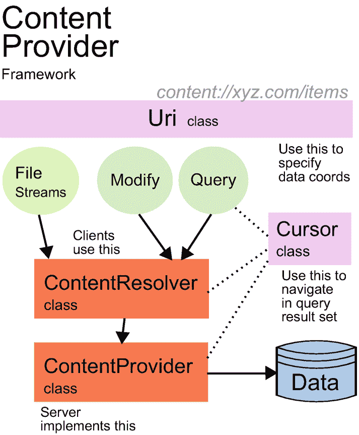

# 此命令  
将展示使用 `am` 命令创建广播消息和执行其他操作的所有可能性。

## 关于广播的随机笔记

- 你还可以在回调方法 `onPause()` 和 `onResume()` 中注册和注销由程序管理的接收器。显然，与使用 `onCreate()`/`onDestroy()` 配对相比，这种方式的注册和注销操作会更频繁。

- 当前正在执行的 `onReceive()` 方法会将进程优先级提升至“前台”级别，防止 Android 系统终止接收进程——只有在极端资源短缺的情况下才可能被终止。

- 如果你在 `onReceive()` 内部有长时间运行的操作，可以考虑在后台线程中运行它们，并提前结束 `onReceive()`。但是，由于完成 `onReceive()` 后进程优先级会恢复至正常级别，你的后台进程更有可能被终止，从而导致应用崩溃。你可以通过使用 `Context.goAsync()` 然后启动一个 `AsyncTask`（在其内部，最后必须调用从 `goAsync()` 获取的 `PendingResult` 对象上的 `finish()` 方法来最终释放资源），或者使用 `JobScheduler` 来防止这种情况。

- 自定义权限（我们在“保护隐式广播”部分使用过）会在应用安装时被注册。因此，定义自定义权限的应用必须在使用这些权限的应用之前安装。

- 通过隐式广播发送敏感信息时要谨慎。潜在恶意应用也可能尝试接收这些信息。至少你可以在发送方通过指定权限来保护广播。

- 为了清晰且不与其他应用混淆，广播操作和权限名称始终应使用命名空间。

- 避免从广播中启动 Activity——这违背了 Android 的可用性原则。

## 6. 内容提供者

## 内容提供者框架

*内容提供者*框架允许：

1.  使用其他应用提供的（结构化）数据
2.  提供（结构化）数据供其他应用使用
3.  支持将数据从一个应用复制到另一个应用
4.  向*搜索框架*提供数据
5.  向特殊的数据相关 UI 控件提供数据
6.  通过定义良好的标准化接口完成上述所有操作

通信的数据可以具有严格定义的结构，例如，来自数据库的行，具有定义的列名和类型，但也可以是没有任何语义关联的文件或字节数组。如果你应用的数据存储需求不符合上述任何情况，则无需实现内容提供者组件——而是使用常规的数据存储选项。

> **注意**：应用为其自身组件提供数据或使用自己的数据提供者访问内容并非严格禁止；然而，提到内容提供者时，我们通常想到的是应用间数据交换。但如果你需要，始终可以将应用内数据交换模式视为应用间通信的一个直接特例。

如果我们想要创建内容感知型应用，无论是提供内容还是消费内容，主要问题如下：

-   应用如何提供内容？
-   应用如何访问其他应用提供的内容？
-   应用如何处理其他应用提供的内容？
-   我们如何保护提供的数据？

在接下来的章节中，我们将专门探讨这些主题。图 6-1 展示了概述。



*一张内容提供者的图示，定义了文件流的 `Uri` 类如何修改、查询，并与游标类流一起流向内容解析器和提供者，最终到达数据。*

**图 6-1** – 内容提供者框架

## 提供内容

内容可以由你的应用提供，当然也可以由系统应用提供。例如，想想相机拍摄的照片或通讯录中的联系人。如果我们先看内容提供方，内容提供者框架会更容易理解。在后面的章节中，我们还将讨论消费者和其他主题。

首先，我们需要知道数据存在哪里。然而，内容提供者框架对数据实际来源不做任何假设——数据可以存在于文件、数据库、内存存储或你能想到的任何其他地方。这提高了你应用的可维护性。例如，在项目早期阶段，数据可能来自文件，但后来你切换到数据库或云存储，而可能的消费者无需关心这些变化，因为他们不必改变访问你内容的方式。因此，内容提供者框架为你的数据提供了一个抽象层。

为实现提供内容而需要实现的单一接口是抽象类：

```java
android.content.ContentProvider
```

在接下来的小节中，我们将从一个用例的角度来看这个类的实现。

## 初始化提供者

在你可实例化的 `ContentProvider` 类子类内部，你*必须*实现方法：

```java
onCreate()
```

当内容提供者被实例化时，Android 系统会调用此方法。你可以在这里初始化内容提供者，但应避免在此处放入耗时的初始化过程，因为实例化并不一定意味着内容提供者会被实际使用。如果你这里没什么特别的事情要做，直接将其实现为一个空方法即可。

若想了解更多关于内容提供者在实例化时的运行环境信息，你可以重写它的 `attachInfo()` 方法——在那里，你会获知内容提供者运行的上下文，并且还会得到一个 `ProviderInfo` 对象。只是别忘了在内部也调用 `super.attachInfo()`。

## 查询数据

对于查询类似数据库的数据集，有一个方法你*必须*实现，另外两个方法你可以*选择*实现：

```kotlin
abstract fun query(        // ----- 变体 A -----
    uri: Uri,
    projection: Array,
    selection: String,
    selectionArgs: Array,
    sortOrder: String
) : Cursor

// ----- 变体 B -----
// 你不需要实现这个。默认
// 实现会调用变体 A，但忽略
// 'cancellationSignal' 参数。
fun query(
    uri: Uri,
    projection: Array,
    selection: String,
    selectionArgs: Array,
    String sortOrder: String,
    cancellationSignal: CancellationSignal
) : Cursor

// ----- 变体 C -----
// 你不需要实现这个。默认
// 实现会将 bundle 参数转换为
// 调用变体 B 的相应参数。
// 使用的 bundle 键为：
//     ContentResolver.QUERY_ARG_SQL_SELECTION
//     ContentResolver.QUERY_ARG_SQL_SELECTION_ARGS
//     ContentResolver.QUERY_ARG_SQL_SORT_ORDER -或-
//         ContentResolver.QUERY_ARG_SORT_COLUMNS
//         （这是一个 String 数组）
fun query(
    uri: Uri,
    projection: Array,
    queryArgs: Bundle,
    cancellationSignal: CancellationSignal
) : Cursor
```

这些方法并非用于呈现诸如图像和声音之类的文件数据。然而，返回文件数据的链接或标识符是可以接受的。

在以下段落中，我们按名称和变体描述所有参数：

- **`uri`** : 这是一个重要参数，用于指定查询在数据空间中的类型坐标。内容消费者将通过适当指定此参数来告知他们对哪种*类型*的数据感兴趣。由于 URI 非常重要，我们将在专门的子章节中描述它们；请参阅下一节“设计内容 URI”。此参数对于变体 A、B 和 C 含义相同。


