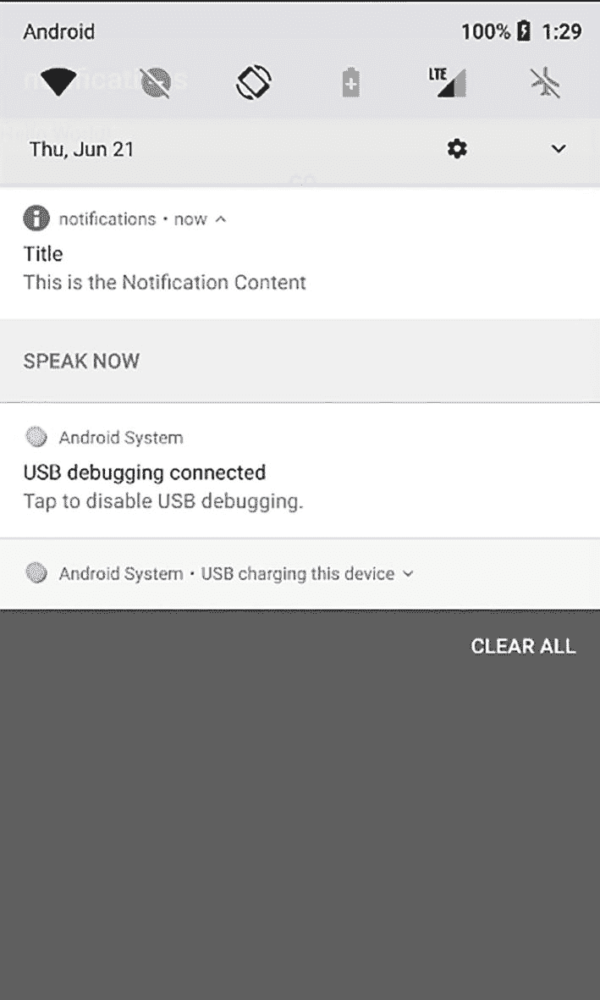
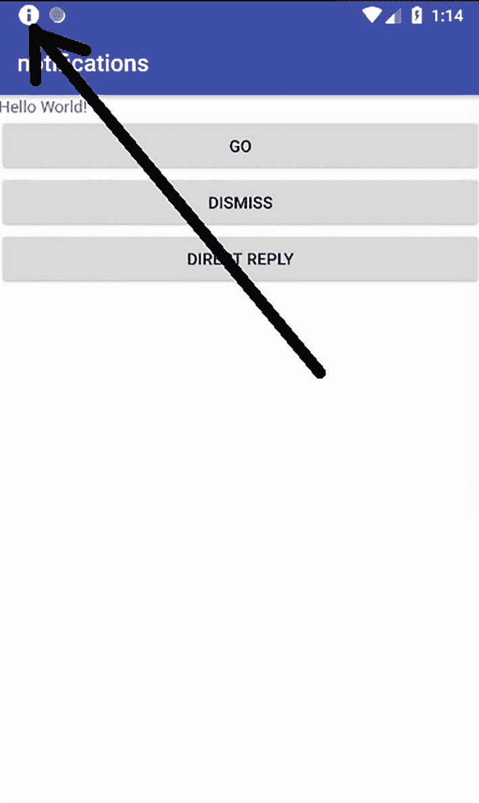
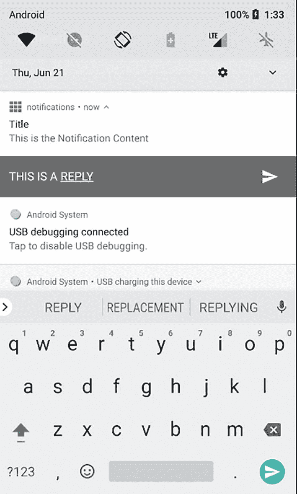
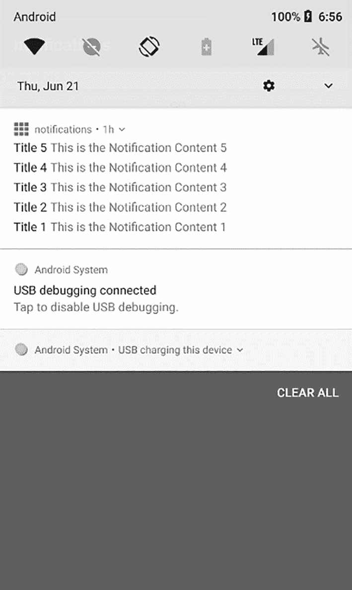

# 时间参数

`Time` 参数是指自上次启动以来经过的毫秒数（包含睡眠时间）。如果设备处于休眠状态，该事件将被丢弃，不会触发任何闹钟。

`AlarmManager` 还包含一些辅助方法。表 8-4 对这些方法进行了汇总。

**表 8-4** `AlarmManager` 的辅助方法

| 方法 | 描述 |
| --- | --- |
| `cancel(operation: PendingIntent) : Unit` | 移除所有与指定`Intent`匹配的闹钟。 |
| `cancel(listener: AlarmManager.OnAlarmListener): Unit` | 移除所有计划发送给指定`AlarmManager.OnAlarmListener`的闹钟。 |
| `getNextAlarmClock() : AlarmManager.AlarmClockInfo` | 获取当前计划的下一个闹钟的信息。 |
| `setTime(long millis): Unit` | 设置系统壁钟时间（UTC，自 1970 年 1 月 1 日 00:00:00 以来的毫秒数）。 |
| `setTimeZone(String timeZone): Unit` | 设置系统的持久默认时区。 |

### 通知

通知是应用可以在其正常 GUI 流程之外向用户呈现的消息。通知会显示在屏幕的特定区域，最显著的是在状态栏和屏幕顶部的通知抽屉中，此外也会出现在特殊对话框、锁屏、配对的 Android Wear 设备或应用图标角标上。智能手机上的示例请参见图 8-1 和图 8-2。在这些图中，您可以看到通知图标以及用户展开通知抽屉后的通知内容。



一张安卓智能手机通知栏的截图。

*图 8-2* 通知内容



一张通知截图，有三个选项卡，其中包含一个箭头指向的信息图标。

*图 8-1* 智能手机通知

通知还支持操作，例如点击时调用自定义活动，或者它们可以包含特殊的操作按钮，甚至包含用户可填写的编辑字段。同样，尽管通知最初只设计用于显示简短的文本片段，但在当前的 Android 版本中，也可以呈现较长的文本。

在线 API 文档建议使用支持库中的 `NotificationCompat` API。使用这个兼容层可以让旧版本在仅在新版本中才可用的功能上呈现类似或空操作变体，从而简化开发。虽然使用这个兼容层减轻了开发者在代码中编写许多分支以处理不同 Android API 级别的负担，但必须注意避免应用因过度依赖最新的通知 API 功能而变得不可用。

为了确保 Android Studio 中您的项目可以使用兼容性 API，请检查模块的 `build.gradle` 文件是否在 "dependencies" 部分包含以下内容：

```
dependencies {
    implementation "androidx.core:core:1.6.0"
    ...
}
```

以下各节概述了通知 API——随着该 API 在过去几年中大幅增长，建议用户查阅在线文档以获取所有通知功能的更详细描述：[`https://developer.android.com/guide/topics/ui/notifiers/notifications`](https://developer.android.com/guide/topics/ui/notifiers/notifications)。

## 创建和显示通知

要创建并显示通知，您需要准备触控操作和额外操作按钮的 `Intent`，使用通知构建器构建通知，注册通知渠道，最后让框架显示通知。示例如下：

```
val NOTIFICATION_CHANNEL_ID = "1"
val NOTIFICATION_ID = 1

// 确保该 Activity 存在
val intent = Intent(this, AlertDetails::class.java)
intent.flags = Intent.FLAG_ACTIVITY_NEW_TASK
// 或 Intent.FLAG_ACTIVITY_CLEAR_TASK
val tapIntent = PendingIntent.getActivity(this, 0, intent, 0)

// 确保该广播接收器存在，并且可以通过像这样的显式 Intent 调用
val actionIntent = Intent(this, MyReceiver::class.java)
actionIntent.action = "com.xyz.MAIN"
actionIntent.putExtra(EXTRA_NOTIFICATION_ID, 0)
val actionPendingIntent = PendingIntent.getBroadcast(this, 0, actionIntent, 0)

val builder = NotificationCompat.Builder(this, NOTIFICATION_CHANNEL_ID)
    .setSmallIcon( ... 一个图标资源 ID... )
    .setContentTitle("标题")
    .setContentText("内容 内容 内容 内容 ...")
    .setPriority(NotificationCompat.PRIORITY_DEFAULT)
    // 添加默认的点击操作
    .setContentIntent(tapIntent)
    .setAutoCancel(true)
    // 添加自定义操作按钮
    .addAction( ... 一个图标资源 ID ..., "前往", actionPendingIntent)
buildChannel(NOTIFICATION_CHANNEL_ID)
val notificationManager = NotificationManagerCompat.from(this)
notificationManager.notify(NOTIFICATION_ID, builder.build())
```

`buildChannel()` 函数在 Android API 级别 26（Android 8.0）及更高版本中是必需的——其代码如下：

```
fun buildChannel(channelId:String) {
    if (Build.VERSION.SDK_INT >= Build.VERSION_CODES.O) {
        // 创建 NotificationChannel，但仅在
        // API 26+ 之后才需要这样做
        val channel = if (Build.VERSION.SDK_INT >= Build.VERSION_CODES.O) {
            NotificationChannel(channelId,
                "渠道名称",
                NotificationManager.IMPORTANCE_DEFAULT)
        } else {
            throw RuntimeException("内部错误")
        }
        channel.description = "描述"
        // 向系统注册该渠道
        val notificationManager = if (Build.VERSION.SDK_INT >= Build.VERSION_CODES.M) {
            getSystemService(NotificationManager::class.java)
        } else {
            throw RuntimeException("内部错误")
        }
        notificationManager.createNotificationChannel(channel)
    }
}
```

以下是对其他代码的解释：

- 通知本身需要一个唯一 ID；我们将其保存在 `NOTIFICATION_ID` 中。
- 示例中的操作按钮（此处用于发送广播）仅作示例——可以没有操作按钮。
- `setAutoCancel(true)` 将导致用户在点击通知后自动解除通知。这仅在与 `setContentIntent()` 一起使用时才有效。
- 仅在 API 级别 26（Android 8.0）或更高版本时才需要创建通知渠道。外部 "if" 中的多余检查是为避免 Android Studio 提示兼容性问题所必需的。
- 对于所有字符串，如果可行，应使用资源 ID；否则，请使用更适合您需求的文本。

## 添加直接回复

从 API 级别 24（Android 7.0）开始，新增了用户输入文本作为通知消息回复的功能。这的一个主要用例当然是来自聊天客户端或电子邮件等消息系统的通知消息。示例如图 8-3 所示。



一张安卓智能手机通知栏的截图。其中包含一个回复通知。

*图 8-3* 回复通知

由于低于 24 的 API 级别无法提供此功能，您的应用不应依赖此功能。通常这很容易实现——对于 API 级别 23 及更低版本，通过点击通知调用的活动当然可以在需要时包含回复功能。

一个发出带有回复功能通知的方法可能如下所示：


```kotlin
fun directReply(view:View) {
    // 用于传递操作意图中字符串的键。
    val KEY_TEXT_REPLY = "key_text_reply"
    val remoteInput = RemoteInput.Builder(KEY_TEXT_REPLY)
        .setLabel("回复标签")
        .build()
    // 确保此广播接收器存在
    val CONVERSATION_ID = 1
    val messageReplyIntent = Intent(this, MyReceiver2::class.java)
    messageReplyIntent.action = "com.xyz2.MAIN"
    messageReplyIntent.putExtra("conversationId", CONVERSATION_ID)
    // 构建用于触发回复操作的 PendingIntent。
    val replyPendingIntent = PendingIntent.getBroadcast(applicationContext,
        CONVERSATION_ID,
        messageReplyIntent,
        PendingIntent.FLAG_UPDATE_CURRENT)
    // 创建回复操作并添加远程输入。
    val action = NotificationCompat.Action.Builder(
        ... 图标资源 ID ...,
        "回复", replyPendingIntent)
        .addRemoteInput(remoteInput)
        .build()
    val builder = NotificationCompat.Builder(this, NOTIFICATION_CHANNEL_ID)
        .setSmallIcon(... 图标资源 ID ...)
        .setContentTitle("标题")
        .setContentText("内容 内容 内容 ...")
        .setPriority(NotificationCompat.PRIORITY_DEFAULT)
        // 添加回复操作按钮
        .addAction(action)
    buildChannel(NOTIFICATION_CHANNEL_ID)
    val notificationManager = NotificationManagerCompat.from(this)
    notificationManager.notify(NOTIFICATION_ID, builder.build())
}
```

以下是关于此代码的一些说明：

- `KEY_TEXT_REPLY` 用于在意图接收器中标识回复文本。
- `CONVERSATION_ID` 用于标识对话链——在这里，通知和接收回复的意图必须知道它们彼此关联。
- 如同往常，请确保在生产代码中使用字符串资源和合适的文本。

当通知显示时，它将包含一个“回复”按钮，当用户按下它时，系统会询问一些回复文本，然后将其发送到意图接收器（示例中的 `messageReplyIntent`）。

用于回复文本的意图接收器可能有一个接收回调，看起来像这样：

```kotlin
override fun onReceive(context: Context, intent: Intent) {
    Log.e("LOG", intent.toString())
    val KEY_TEXT_REPLY = "key_text_reply"
    val remoteInput = RemoteInput.getResultsFromIntent(intent)
    val txt = remoteInput?.getCharSequence(KEY_TEXT_REPLY)?:"undefined"
    val conversationId = intent.getIntExtra("conversationId",0)
    Log.e("LOG","回复文本 = " + txt)
    // 对回复内容进行相应处理...
    // 构建一个新通知，告知用户系统已处理他们与之前通知的交互。
    val NOTIFICATION_CHANNEL_ID = "1"
    val repliedNotification = NotificationCompat.Builder(context, NOTIFICATION_CHANNEL_ID)
        .setSmallIcon(android.R.drawable.ic_media_play)
        .setContentText("已回复")
        .build()
    buildChannel(NOTIFICATION_CHANNEL_ID)
    // 发出新通知。
    val notificationManager = NotificationManagerCompat.from(context)
    notificationManager.notify(conversationId, repliedNotification)
}
```

此方法：

- 通过使用与回复输入相同的键，调用 `RemoteInput.getResultsFromIntent()` 来获取回复文本
- 获取我们作为额外值添加到 Intent 中的对话 ID
- 执行处理回复所需的任何操作
- 通过设置另一个通知来对回复作出回应

## 通知进度条

要向通知添加进度条，请在构建器中添加：

```kotlin
.setProgress(PROGRESS_MAX, PROGRESS_CURRENT, false)
```

其中 `PROGRESS_MAX` 是最大整数值，`PROGRESS_CURRENT` 在开始时为 0。或者，如果你想要一个不确定的进度条，你可以使用：

```kotlin
.setProgress(0, 0, true)
```

在执行工作的后台线程中，你可以通过定期执行以下代码来更新确定的进度条：

```kotlin
builder.setProgress(PROGRESS_MAX, currentProgress, false)
notificationManager.notify(NOTIFICATION_ID, builder.build())
```

并传入新的 `currentProgress` 值。

要完成确定的或不确的进度条，你可以编写：

```kotlin
builder.setContentText("下载完成")
    .setProgress(0,0,false)
notificationManager.notify(NOTIFICATION_ID, builder.build())
```

## 可展开通知

通知不仅仅可以包含短消息。使用可展开功能，还可以向用户显示更多信息。有关如何执行的详细信息，请查阅在线文档：例如，在你常用的搜索引擎中输入“Android 创建可展开通知”来查找相应的页面。

## 修正活动导航

为了改善用户体验，从通知内部启动的活动可以添加其预期的任务行为。例如，如果按下返回按钮，会调用堆栈中的下一个活动。为此，你必须在 `AndroidManifest.xml` 中定义活动层次结构，例如，如下所示：

```xml
...
```

然后你可以使用 `TaskStackBuilder` 为调用的 Intent 填充任务栈：

```kotlin
// 为你要启动的活动创建 Intent
val resultIntent = Intent(this, ResultActivity::class.java)
// 创建 TaskStackBuilder
val stackBuilder = TaskStackBuilder.create(this)
stackBuilder.addNextIntentWithParentStack(resultIntent)
// 获取包含返回栈的 PendingIntent
val resultPendingIntent = stackBuilder.getPendingIntent(0, PendingIntent.FLAG_UPDATE_CURRENT)
// -> 这可以在构建器内部用于 .setContentIntent()
```

有关活动和任务管理的更多详细信息，请参阅第 3 章的“活动和任务”部分。

## 通知分组

从 API 级别 24（Android 7.0）开始，可以对通知进行分组，以改进对以某种方式相关的多个通知的呈现。要创建这样的组，你只需添加：

```kotlin
.setGroup(GROUP_KEY)
```

到构建器链中，其中 `GROUP_KEY` 是你选择的字符串。如果你需要自定义排序（默认按接收日期排序），你可以使用构建器中的 `setSortKey()` 方法。然后按照该键进行字典序排序。通知抽屉内的分组可能看起来像图 8-4 所示。



**图 8-4** 通知组

对于低于 24 的 API 级别，其中没有 Android 管理的分组自动摘要，你可以添加一个通知摘要。只需像创建任何其他通知一样创建一个通知，但额外在构建器链中调用 `.setGroupSummary(true)`。确保组中的所有通知*以及*摘要都使用相同的 `setGroup(GROUP_KEY)`。

> **注意**
>
> 似乎在至少 API 级别 27 中存在一个错误，你*必须*添加一个摘要通知才能启用分组。因此建议是，无论你的目标 API 级别是什么，都添加一个通知摘要。

对于摘要，你可能希望调整显示样式，以显示适当数量的摘要项目。为此，你可以使用如下结构：

```kotlin
.setStyle(NotificationCompat.InboxStyle()
    .addLine("宇宙大师           去玩吃豆人")
    .addLine("Silvia Cheng         今晚派对")
    .setBigContentTitle("2 条新消息")
    .setSummaryText("xyz@example.com"))
```

放在构建器链内部。

## 通知渠道

从 Android 8.0 或 API 级别 26 开始，引入了另一种通过*通知渠道*对通知进行分组的方式。其背后的理念是赋予设备用户更多控制权，让他们决定系统如何对通知进行分类和优先级排序，以及通知如何呈现给用户。

要创建通知渠道，你编写：
```


```kotlin
if (Build.VERSION.SDK_INT >= Build.VERSION_CODES.O) {
    // 创建通知渠道，但仅在 API 26 及以上版本中需要
    val channel = if (Build.VERSION.SDK_INT >=
        Build.VERSION_CODES.O) {
            NotificationChannel(channelId,
                "渠道名称",
                NotificationManager.IMPORTANCE_DEFAULT)
        } else {
            throw RuntimeException("内部错误")
        }
    channel.description = "描述"
    // 向系统注册通知渠道
    val notificationManager =
        if (Build.VERSION.SDK_INT >=
            Build.VERSION_CODES.M) {
                getSystemService(
                    NotificationManager::class.java)
            } else {
                throw RuntimeException("内部错误")
            }
    notificationManager.
        createNotificationChannel(channel)
}
```

我们在前面的章节中已经看到了这段代码。就 Kotlin 语言风格而言，它看起来有点笨拙——引入了多余的 `if` 结构，是为了避免 Android Studio 对兼容性问题发出警告。请根据你的需求，在通知渠道的构造函数中调整渠道 ID、渠道名称和重要性等级，就像调整描述文本一样。

顺便提一下，最后一行中的 `createNotificationChannel()` 方法是幂等的——如果具有相同特征的渠道已经存在，则不会发生任何操作。`NotificationChannel` 构造函数中可能的重要性等级包括：`IMPORTANCE_HIGH`（声音和横幅通知）、`IMPORTANCE_DEFAULT`（声音）、`IMPORTANCE_LOW`（无声音）以及 `IMPORTANCE_MIN`（既无声音也不显示在状态栏中）。

虽然通知渠道的处理方式取决于用户，但在你的代码中，你仍然可以使用 `NotificationChannel` 对象的某个 `get*()` 方法来读取用户所做的设置，你可以通过 `getNotificationChannel()` 或 `getNotificationChannels()` 从管理器获取该对象。详情请参阅在线 API 文档。

还有一个通知渠道设置界面，你可以通过以下方式调用：

```kotlin
val intent = Intent(
    Settings.ACTION_CHANNEL_NOTIFICATION_SETTINGS)
intent.putExtra(Settings.EXTRA_APP_PACKAGE,
    getPackageName())
intent.putExtra(Settings.EXTRA_CHANNEL_ID,
    myNotificationChannel.getId())
startActivity(intent)
```

你还可以通过将通知渠道分组来进一步组织它们，例如，将工作相关渠道和私人类型渠道分开。要创建一个分组，你可以这样编写：

```kotlin
val groupId = "my_group"
// 用户可见的分组名称。
val groupName = "分组名称"
val notificationMngr =
    getSystemService(Context.NOTIFICATION_SERVICE)
        as NotificationManager
notificationMngr.createNotificationChannelGroup(
    NotificationChannelGroup(groupId, groupName))
```

然后，你可以通过每个通知渠道的 `setGroup()` 方法将其添加到该分组中。

## 通知徽章

从 Android 8.0 或 API 级别 26 开始，一旦通知到达系统，应用图标上就会显示一个通知徽章——见图 8-5。


**图 8-5** 通知徽章

你可以通过表 8-5 列出的 `NotificationChannel` 方法之一来控制此徽章。

**表 8-5** 通知徽章

| 方法 | 描述 |
| --- | --- |
| `setShowBadge(Boolean)` | 是否显示徽章。 |
| `setNumber(Int)` | 长按带有徽章的应用图标将显示已到达的通知数量。你可以通过此方法根据需要调整该数字。 |
| `setBadgeIconType(Int)` | 长按带有徽章的应用图标将显示与通知关联的图标。你可以通过此方法调整图标大小。可能的取值在 `NotificationCompat` 类中以常量形式提供：`BADGE_ICON_NONE`、`BADGE_ICON_SMALL` 和 `BADGE_ICON_LARGE`。 |

# 联系人

管理和使用联系人是手持设备必须胜任的任务之一。毕竟，手持设备，尤其是智能手机，经常用于与其他人通信，而联系人则是代表个人、群组、公司或其他“事物”的抽象实体，作为通信需求的地址点。

联系人如此重要，内置的联系人框架在 Android 的发展历程中已变得相当复杂。幸运的是，如果我们只关注后端部分，并省略本书其他章节描述的用户界面特性，那么复杂性可以有所降低。关于联系人框架的描述，剩下的内容包括：

-   查看内部机制，特别是使用的数据库模型
-   了解如何读取联系人数据
-   了解如何写入联系人数据
-   调用系统活动来处理单个联系人
-   同步联系人
-   使用快速联系人徽章

### 联系人框架内部机制

与联系人框架通信的基本类是 `android.content.ContentResolver` 类。这非常合理，因为联系人数据非常适合内容提供者处理。因此，你通常会使用内容提供者操作来处理联系人数据。参见第 6 章。

数据模型由三个主要表组成：*联系人*、*原始联系人*和*数据*表。此外，还存在一些用于管理任务的辅助表。你通常不需要处理任何形式的直接表访问，但如果你感兴趣，可以查看在线联系人框架文档以及 `ContactsContract` 类的文档，后者详细描述了联系人的内容提供者契约。

如果你想直接查看联系人表，可以使用 ADB（针对虚拟设备或已 root 的设备），在终端中通过 `cd SDK_INST/platform-tools ; ./adb root ; ./adb shell` 创建对设备的 shell 访问——参见第 19 章“SDK 平台工具”部分——然后从那里按如下方式调查表：

```bash
cd /data
find . -name 'contacts*.db'
