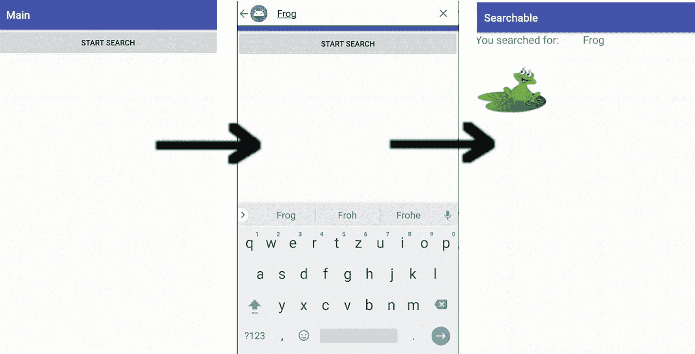
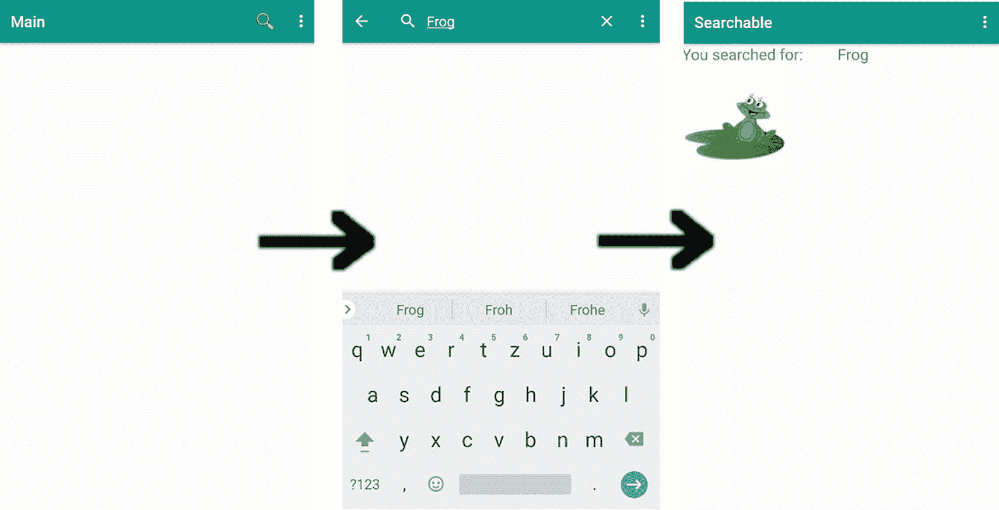
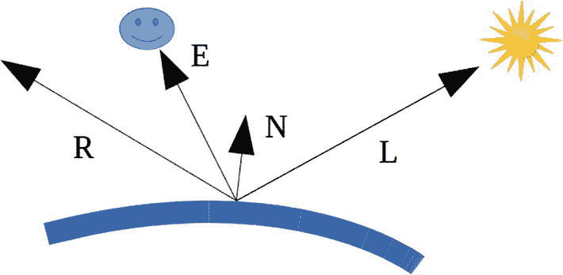
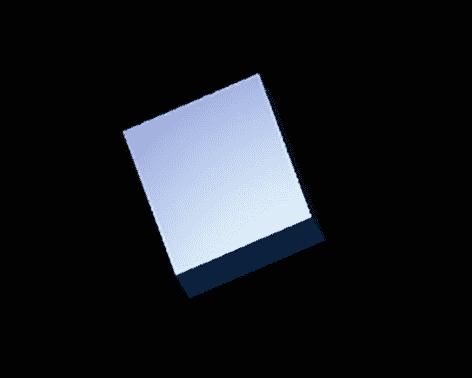

# 
sqlite3 
```

例如，输入 `.header on` 打开表头输出，`.tables` 列出所有表名，`select * from raw_contacts;` 列出原始联系人表。

### 读取联系人

为了读取一定数量的联系人（可能基于某些条件），你最好使用 `ViewModel` 作为视图数据持有者，用 `LiveData` 包装模型元素以确保模型更改能反映在屏幕重绘上，应用协程异步加载数据，并采用 Jetpack Compose 库实现优雅的前端设计。

> **注意：** 以前你会使用加载器，但这些已被弃用。使用 `ViewModel`、`LiveData`、协程和 Jetpack Compose 的组合可以确保你紧跟最新、最优雅的 Android 开发技术。

为了让这一切生效，请将以下依赖项添加到 `build.gradle` 中：

```groovy
def compose_version = '1.1.1'
implementation 'androidx.core:core-ktx:1.7.0'
implementation "androidx.compose.ui:" +
    "ui:$compose_version"
implementation "androidx.compose.foundation:" +
    "foundation:$compose_version"
implementation "androidx.compose.material:" +
    "material:$compose_version"
implementation "androidx.compose.ui:" +
    "ui-tooling-preview:$compose_version"
implementation 'androidx.lifecycle:' +
    'lifecycle-runtime-ktx:2.3.1'
implementation 'androidx.lifecycle:' +
    'lifecycle-extensions:2.2.0'
implementation "androidx.lifecycle:" +
    "lifecycle-livedata-ktx:2.4.1"
implementation "androidx.compose.runtime:" +
    "runtime-livedata:$compose_version"
implementation 'androidx.activity:' +
    'activity-compose:1.3.1'
// 我们需要这个来进行权限查询
// 使用 JetPack Compose：
implementation "com.google.accompanist:" +
    "accompanist-permissions:0.23.1"
```


# 排版后的文档

为了从联系人相关的数据库中读取数据，我们为每个联系人声明了一个`data class`和一个用于读取数据的数据源类：

```kotlin
package book.andrkotlpro.mycontacts1.db
import android.content.ContentResolver
import android.content.ContentUris
import android.net.Uri
import android.provider.ContactsContract
data class MyContact(val id:String, val lookupKey,
val display:String, val email:String)
class MyContactsDataSource(
private val contentResolver: ContentResolver) {
fun fetchContactsPrimary(): List {
val result: MutableList =
mutableListOf()
val CONTENT_URI =
ContactsContract.Contacts.CONTENT_URI
val PROJECTION = arrayOf(
ContactsContract.Contacts._ID,
ContactsContract.Contacts.LOOKUP_KEY,
ContactsContract.Contacts.DISPLAY_NAME_PRIMARY)
val SORT_ORDER = ContactsContract.Contacts.
DISPLAY_NAME_PRIMARY
val cursor = contentResolver.query(
CONTENT_URI,
PROJECTION,
null,
null,
SORT_ORDER
)
cursor?.let {
cursor.moveToFirst()
while (!cursor.isAfterLast) {
result.add(
MyContact(
cursor.getString(0),
cursor.getString(1),
cursor.getString(2),
""
)
)
cursor.moveToNext()
}
cursor.close()
}
return result.toList()
}
fun fetchContactsData(): List {
val result: MutableList =
mutableListOf()
val CONTENT_URI =
ContactsContract.Data.CONTENT_URI
val PROJECTION = arrayOf(
ContactsContract.Data._ID,
ContactsContract.Data.LOOKUP_KEY,
ContactsContract.Data.DISPLAY_NAME_PRIMARY,
ContactsContract.CommonDataKinds.Email.ADDRESS)
val SELECTION =
ContactsContract.Data.MIMETYPE + " = '" +
ContactsContract.CommonDataKinds.Email.
CONTENT_ITEM_TYPE +
"'"
val SORT_ORDER = ContactsContract.Data.
DISPLAY_NAME_PRIMARY
val cursor = contentResolver.query(
CONTENT_URI,
PROJECTION,
SELECTION,
null,
SORT_ORDER
)
cursor?.let {
cursor.moveToFirst()
while (!cursor.isAfterLast) {
result.add(
MyContact(
cursor.getString(0),
cursor.getString(1),
cursor.getString(2),
cursor.getString(3)
)
)
cursor.moveToNext()
}
cursor.close()
}
return result.toList()
}
}
```

`MyContactsDataSource`类提供了两个函数`fetchContactsPrimary()`和`fetchContactsData()`，用于分别从主联系人表和联系人数据表中读取数据。只有后者包含电子邮件地址，因此第一个函数仅用于演示目的，我们不会在后续代码中使用它。

在`SELECTION`字符串中，你可以根据需要添加搜索条件。其中“?”充当占位符，你可以在`query()`调用的倒数第二个参数中为其填充值，如下所示：

```kotlin
val SELECTION =
ContactsContract.CommonDataKinds.Email.ADDRESS +
" LIKE ? " + "AND " +
ContactsContract.Data.MIMETYPE + " = '" +
ContactsContract.
CommonDataKinds.Email.CONTENT_ITEM_TYPE +
"'"
val selectionArgs = arrayOf("%" + search + "%")
...
val cursor = contentResolver.query(
CONTENT_URI,
PROJECTION,
SELECTION,
selectionArgs,
SORT_ORDER
)
```

还有一些特殊的 URI 可供使用。例如，要通过电子邮件地址查找联系人，你可以使用内容 URI `ContactsContract.CommonDataKinds.Email.CONTENT_URI`。另一个选项是 URI `ContactsContract.Contacts.CONTENT_FILTER_URI`，它允许将搜索条件添加到 URI 内部，而不是作为`query()`调用的参数指定：

```kotlin
...
val PROJECTION : Array? = null
val SELECTION : String? = null
val selectionArgs : Array? = null
val contentUri = Uri.withAppendedPath(
ContactsContract.Contacts.CONTENT_FILTER_URI,
Uri.encode(search))
Log.e("LOG", contentUri.toString())
...
```

请注意，在这种情况下，不允许传递空字符串“”作为搜索条件。

`MyContactsRepository`类将查询封装到一个`suspend function`中，这是协程中用于“允许异步调用”的惯用写法。关于协程的更多信息，请参见[`https://kotlinlang.org/docs/coroutines-overview.xhtml`](https://kotlinlang.org/docs/coroutines-overview.xhtml)：

```kotlin
package book.andrkotlpro.mycontacts1.db
import kotlinx.coroutines.CoroutineDispatcher
import kotlinx.coroutines.withContext
class MyContactsRepository(
private val source: MyContactsDataSource,
private val myDispatcher: CoroutineDispatcher) {
suspend fun fetchContacts(): List {
return withContext(myDispatcher) {
source.fetchContactsData()
}
}
}
```

对于 ViewModel，我们定义了`ContactsViewModel`和`ContactsViewModelFactory`两个类。前者将查询结果列表封装到`LiveData`对象中（用于模型和 UI 层之间的数据绑定），后者则作为创建 ViewModel 实例的工厂：

```kotlin
package book.andrkotlpro.mycontacts1
import android.app.Application
import androidx.lifecycle.*
import book.andrkotlpro.mycontacts1.db.*
import kotlinx.coroutines.Dispatchers
class ContactsViewModel (
context: Application,
private val myContactsRepository: MyContactsRepository
) : AndroidViewModel(context) {
var myContacts: LiveData> = liveData {
emit(myContactsRepository.fetchContacts())
}
}
class ContactsViewModelFactory(
private val application: Application)
: ViewModelProvider.AndroidViewModelFactory(
application) {
override fun 
create(modelClass: Class): T {
return if (modelClass.isAssignableFrom(
ContactsViewModel::class.java)) {
val source = MyContactsDataSource(
application.contentResolver)
ContactsViewModel(application,
MyContactsRepository(source,
Dispatchers.IO)) as T
} else
throw IllegalArgumentException(
"Unknown ViewModel class")
}
}
```

在`ContactsViewModelFactory`内部，我们为`MyContactsRepository`实例化使用了`Dispatchers.IO`参数，这使得 suspend 函数可以在一个专为 IO 后台处理优化的线程池中执行。

清单文件`AndroidManifest.xml`包含了访问联系人数据库表所需的权限：

```xml
...

...
```

Activity 类的代码看起来与你习惯的非常不同，如果这是你的第一个 Jetpack Compose 项目。最显著的区别是不再使用布局 XML 文件。取而代之的是，前端视图结构采用了类似于构建器的语法，如下所示：

```kotlin
Column() {
Text(textToShow)
Button(onClick = { ... }) {
Text("Request permission")
}
}
```

Activity 类的完整代码如下：


```kotlin
package book.andrkotlpro.mycontacts1

import android.os.Bundle
import android.util.Log
import androidx.activity.ComponentActivity
import androidx.activity.compose.setContent
import androidx.compose.foundation.ExperimentalFoundationApi
import androidx.compose.foundation.layout.Column
import androidx.compose.foundation.layout.fillMaxSize
import androidx.compose.foundation.layout.padding
import androidx.compose.foundation.lazy.LazyColumn
import androidx.compose.foundation.lazy.items
import androidx.compose.material.*
import androidx.compose.runtime.*
import androidx.compose.ui.Modifier
import androidx.compose.ui.unit.dp
import androidx.compose.runtime.livedata.observeAsState
import androidx.lifecycle.ViewModelProvider
import book.andrkotlpro.mycontacts1.ui.theme.MyContacts1Theme
import com.google.accompanist.permissions.*

class MainActivity : ComponentActivity() {
    // 需要 @OptIn，因为库中的
    // com.google.accompanist.permissions 类
    // 是实验性的
    @OptIn(ExperimentalPermissionsApi::class)
    override fun onCreate(savedInstanceState: Bundle?) {
        super.onCreate(savedInstanceState)
        // 访问模型数据仅需这两行代码。
        val myViewModelFactory = ContactsViewModelFactory(application)
        val contactsViewModel = ViewModelProvider(this, myViewModelFactory).get(ContactsViewModel::class.java)
        setContent { // UI 构建器从这里开始
            // 包裹在主题中。请注意，主题
            // 类由 Studio 的
            // “新建项目”向导生成
            MyContacts1Theme {
                // 一个使用主题“background”颜色的表面容器
                Surface(modifier = Modifier.fillMaxSize(), color = MaterialTheme.colors.background) {
                    // 查询权限状态
                    val contactsPermissionState = rememberMultiplePermissionsState(listOf(
                        android.Manifest.permission.WRITE_CONTACTS,
                        android.Manifest.permission.READ_CONTACTS
                    ))
                    with(contactsPermissionState) {
                        if (allPermissionsGranted) {
                            ContactsContentLazy(contactsViewModel)
                        } else {
                            InquirePermission(this)
                        }
                    }
                }
            }
        }
    }
}

// @Composable 是 JetPack Compose 的一个重要特性
// 它允许提取 UI 构建器片段。此
// 可组合函数用于请求权限。
@OptIn(ExperimentalPermissionsApi::class)
@Composable
fun InquirePermission(contactsPermissionState: MultiplePermissionsState) {
    val textToShow = if (contactsPermissionState.shouldShowRationale) {
        "通讯录访问权限对此应用至关重要。" + " 请授予该权限。"
    } else {
        "此功能需要通讯录权限" + "才能使用。请授予权限。"
    }
    Column() {
        Text(textToShow)
        Button(onClick = { contactsPermissionState.launchMultiplePermissionRequest() }) {
            Text("请求权限")
        }
    }
}

// 联系人列表
@Composable
fun ContactsContentLazy(viewModel: ContactsViewModel) {
    // 以防你需要它...
    //val composableScope = rememberCoroutineScope()
    //val ctx = LocalContext.current
    // 重要的一行。`observeAsState` 确保
    // 如果底层数据发生变化，UI 会重新组合。
    // 它确实会这样做，因为借助协程，
    // 数据是异步获取的
    val list by viewModel.myContacts.observeAsState(mutableListOf())
    // LazyColumn 只渲染可见项。它也
    // 使列表视图可滚动
    LazyColumn(modifier = Modifier.padding(16.dp)) {
        //items(list, {itm -> itm.id}) { itm ->
        items(list) { itm ->
            Log.e("LOG", "--------------------------")
            Log.e("LOG", itm.id)
            Log.e("LOG", itm.lookupKey)
            Log.e("LOG", itm.display)
            Log.e("LOG", itm.email)
            Text(
                text = itm.id + "\n  " + itm.display + "\n  " + itm.email,
                modifier = Modifier.padding(bottom = 8.dp),
                style = MaterialTheme.typography.h5
            )
        }
    }
}
```

# 编写联系人

插入或更新联系人最好以批量模式进行。首先创建一个 `ContentProviderOperation` 类型的项目列表，然后按如下方式填充操作：

```kotlin
import android.content.Context
import android.content.ContentProviderOperation
import android.content.ContentResolver
import android.provider.ContactsContract
import android.content.ContentValues.TAG
import android.util.Log
import android.widget.Toast

class ContactsWriter(val ctx: Context, val contentResolver: ContentResolver) {
    val opList = mutableListOf<ContentProviderOperation>()

    fun addContact(accountType: String, accountName: String, firstName: String, lastName: String, emailAddr: String, phone: String) {
        val firstOperationIndex = opList.size
```

在此方法内部，我们首先创建一个新联系人。`Contacts` 表将被自动填充；无论如何都不允许直接访问。需要设备的用户账户和账户类型；否则，操作将静默失败！

```kotlin
        // 创建一个新的原始联系人。
        var op = ContentProviderOperation.newInsert(ContactsContract.RawContacts.CONTENT_URI)
            .withValue(ContactsContract.RawContacts.ACCOUNT_TYPE, accountType)
            .withValue(ContactsContract.RawContacts.ACCOUNT_NAME, accountName)
        opList.add(op.build())
```

接下来，仍在方法内部，我们为新行创建一个显示名称。这是 `StructuredName` 表中的一行：

```kotlin
        // 为新行创建显示名称
        op = ContentProviderOperation.newInsert(ContactsContract.Data.CONTENT_URI)
            // withValueBackReference 将确保
            // 外键关系被正确设置
            .withValueBackReference(ContactsContract.Data.RAW_CONTACT_ID, firstOperationIndex)
            // 数据行的 MIME 类型是 StructuredName
            .withValue(ContactsContract.Data.MIMETYPE, ContactsContract.CommonDataKinds.StructuredName.CONTENT_ITEM_TYPE)
            // 行的显示名称是 UI 中显示的名称。
            .withValue(ContactsContract.CommonDataKinds.StructuredName.DISPLAY_NAME, firstName + " " + lastName)
        opList.add(op.build())
```

同样地，我们添加电话号码和电子邮件地址：

```kotlin
        // 指定的电话号码
        op = ContentProviderOperation.newInsert(ContactsContract.Data.CONTENT_URI)
            // 修正外键关系
            .withValueBackReference(ContactsContract.Data.RAW_CONTACT_ID, firstOperationIndex)
            // 将数据行的 MIME 类型设置为 Phone
            .withValue(ContactsContract.Data.MIMETYPE, ContactsContract.CommonDataKinds.Phone.CONTENT_ITEM_TYPE)
            // 电话号码和类型
            .withValue(ContactsContract.CommonDataKinds.Phone.NUMBER, phone)
            .withValue(ContactsContract.CommonDataKinds.Phone.TYPE, android.provider.ContactsContract.CommonDataKinds.Phone.TYPE_HOME)
        opList.add(op.build())

        // 插入电子邮件
        op = ContentProviderOperation.newInsert(ContactsContract.Data.CONTENT_URI)
            // 修正外键关系
            .withValueBackReference(ContactsContract.Data.RAW_CONTACT_ID, firstOperationIndex)
            // 将数据行的 MIME 类型设置为 Email
            .withValue(ContactsContract.Data.MIMETYPE, ContactsContract.CommonDataKinds.Email.CONTENT_ITEM_TYPE)
            // 电子邮件地址和类型
            .withValue(ContactsContract.CommonDataKinds.Email.ADDRESS, emailAddr)
            .withValue(ContactsContract.CommonDataKinds.Email.TYPE, android.provider.ContactsContract.CommonDataKinds.Email.TYPE_HOME)
```

最后，在关闭方法之前，我们添加一个让步点。这没有功能上的影响，但引入了一个中断，以便系统可以执行其他工作来改善可用性。以下代码片段还包含了类的其余部分：

```kotlin
        // 添加一个让步点。
        op.withYieldAllowed(true)
        opList.add(op.build())
    }

    fun reset() {
        opList.clear()
    }

    fun doAll() {
        try {
            contentResolver.applyBatch(ContactsContract.AUTHORITY, opList as ArrayList)
        } catch (e: Exception) {
            // 显示警告
            val duration = Toast.LENGTH_SHORT
            val toast = Toast.makeText(ctx, "发生错误", duration)
            toast.show()
            // 记录异常
            Log.e("LOG", "插入联系人时遇到异常: " + e, e)
        }
    }
}
```


这里使用了固定的`phone type`和`email type`，但相信你能理解要点。另请注意，在生产代码中应使用资源字符串，而非此处展示的硬编码字符串。要使用该类，在 activity 中只需执行以下操作：

```
val cwr = ContactsWriter(this, contentResolver)
cwr.addContact("com.google","user@gmail.com",
"Peter","Kappa",
"post@kappa.com","0123456789")
cwr.addContact("com.google","user@gmail.com",
"Hilda","Kappa",
"post2@kappa.com","0123456789")
cwr.doAll()
```

为了更新联系人条目，我们在`ContactsWriter`类中引入另一个函数：

```
fun updateContact(id:String, firstName:String?,
lastName:String?, emailAddr:String?, phone:String?) {
var op : ContentProviderOperation.Builder? = null
if(firstName != null && lastName != null) {
op = ContentProviderOperation.newUpdate(
ContactsContract.Data.CONTENT_URI)
.withSelection(ContactsContract.Data.CONTACT_ID +
" = ? AND " + ContactsContract.Data.MIMETYPE +
" = ?",
arrayOf(id, ContactsContract.CommonDataKinds.
StructuredName.CONTENT_ITEM_TYPE))
.withValue(ContactsContract.Contacts.DISPLAY_NAME,
firstName + " " + lastName)
opList.add(op.build())
}
if(emailAddr != null) {
op = ContentProviderOperation.newUpdate(
ContactsContract.Data.CONTENT_URI)
.withSelection(ContactsContract.Data.CONTACT_ID +
" = ? AND " + ContactsContract.Data.MIMETYPE +
" = ?",
arrayOf(id, ContactsContract.CommonDataKinds.
Email.CONTENT_ITEM_TYPE))
.withValue(ContactsContract.CommonDataKinds.Email.
ADDRESS, emailAddr)
opList.add(op.build())
}
if(phone != null) {
op = ContentProviderOperation.newUpdate(
ContactsContract.Data.CONTENT_URI)
.withSelection(ContactsContract.Data.CONTACT_ID +
" = ? AND " + ContactsContract.Data.MIMETYPE +
" = ?",
arrayOf(id, ContactsContract.CommonDataKinds.
Phone.CONTENT_ITEM_TYPE))
.withValue(ContactsContract.CommonDataKinds.Phone.
NUMBER, phone)
opList.add(op.build())
}
}
```

作为输入，你需要*原始联系人*表中的 ID 键；任何不为`null`的函数参数都会被更新。例如，你可以在 activity 中编写：

```
val rawId = ...
val cwr = ContactsWriter(this, contentResolver)
cwr.updateContact(rawId, null, null,
"postXXX@kappa.com", null)
cwr.doAll()
```

作为最后一个函数，我们添加了删除联系人的功能，同样基于 ID：

```
fun delete(id:String) {
var op = ContentProviderOperation.newDelete(
ContactsContract.RawContacts.CONTENT_URI)
.withSelection(ContactsContract.RawContacts.
CONTACT_ID + " = ?",
arrayOf(id))
opList.add(op.build())
}
```

其使用方法与更新类似：

```
val rawId = ...
val cwr = ContactsWriter(this, contentResolver)
cwr.delete(rawId)
cwr.doAll()
```

## 使用联系人系统 Activity

若要读取或更新单个联系人，你可以避免编写自己的用户界面。只需使用系统 activity 来访问联系人即可。创建单个联系人的适当 Intent 调用如下所示：

```
val intent = Intent(Intents.Insert.ACTION)
intent.setType(ContactsContract.RawContacts.CONTENT_TYPE)
intent.putExtra(Intents.Insert.EMAIL, emailAddress)
.putExtra(Intents.Insert.EMAIL_TYPE,
CommonDataKinds.Email.TYPE_WORK)
.putExtra(Intents.Insert.PHONE, phoneNumber)
.putExtra(Intents.Insert.PHONE_TYPE,
Phone.TYPE_WORK)
startActivity(intent)
```

这将打开用于创建新联系人的联系人屏幕，并预填给定的字段。

若要改为编辑现有联系人，一旦你获得了查找键和原始联系人 ID —— 请参阅前面的“读取联系人”部分 —— 编写如下：

```
val uri = Contacts.getLookupUri(id, lookupKey)
val intent = Intent(Intent.ACTION_EDIT)
// 以下操作必须在 _ 一次 _ 调用中完成，不要
// 链式调用 .setData() 和 .setType()，因为它们
// 会互相覆盖！
intent.setDataAndType(uri, Contacts.CONTENT_ITEM_TYPE)
intent.putExtra("finishActivityOnSaveCompleted", true)
// 现在放入任何需要更新的数据，例如
intent.putExtra(Intents.Insert.EMAIL, newEmail)
...
startActivity(intent)
```

## 使用快速联系人徽章


# 快速联系人徽章

`QuickContactBadge` 允许你使用一个 GUI 小部件，用户点击它即可查看联系人的详细信息，并执行任何合适的操作，例如发送电子邮件、拨打电话等。此详情屏幕由系统呈现，你无需在应用中实现它。请参见图 8-6。


一张快速联系人徽章的截图，显示了一个动态图片。

**图 8-6** 快速联系人徽章

为了使用传统的 XML 描述方式生成这样一个快速联系人徽章，你需要在布局文件中添加以下内容：

```
<QuickContactBadge
    android:id="@+id/quickBadge"
    android:layout_width="wrap_content"
    android:layout_height="wrap_content" />
```

接下来我们将讨论如何使用 Jetpack Compose 来包含快速联系人徽章。

在你的代码中，你必须将该徽章与从联系人提供程序获取的以下信息关联起来：原始联系人 ID、查找键和缩略图 URI。相应的代码可能如下所示：

```
val id = row[ContactsContract.Contacts._ID]
val lookup = row[ContactsContract.Contacts.LOOKUP_KEY]
val photo = row[ContactsContract.Contacts.PHOTO_THUMBNAIL_URI]
```

其中，`row` 例如是你从联系人内容提供程序查询中获取的一个映射。在这种情况下，只需在*原始联系人*表中进行查询就足够了；你不需要再查询*数据*表。

接着，我们可以像下面这样配置徽章，例如，在通过用户界面活动加载联系人信息之后：

```
val contactUri = ContactsContract.Contacts.getLookupUri(id.toLong(), lookup)
quickBadge.assignContactUri(contactUri)
val thumbnail = loadContactPhotoThumbnail(photo.toString())
quickBadge.setImageBitmap(thumbnail)
```

其中，`loadContactPhotoThumbnail()` 函数用于加载缩略图数据：

```
private fun loadContactPhotoThumbnail(photoData: String): Bitmap? {
    var afd: AssetFileDescriptor? = null
    try {
        val thumbUri = Uri.parse(photoData)
        afd = contentResolver.openAssetFileDescriptor(thumbUri, "r")
        afd?.apply {
            fileDescriptor?.apply {
                return BitmapFactory.decodeFileDescriptor(this, null, null)
            }
        }
    } catch (e: FileNotFoundException) {
        // 处理文件未找到错误...
    } finally {
        afd?.close()
    }
    return null
}
```

如果我们想使用 Jetpack Compose 作为前端开发技术，我们会立即意识到没有可用的 `QuickContactBadge` 可组合元素。不过，这并非一个真正的问题，因为通过 `AndroidView`，在 Jetpack Compose 和传统 Android View 之间有一个兼容桥接。你需要做的只是添加以下内容：

```
AndroidView(
    modifier = Modifier.width(60.dp).height(60.dp),
    factory = { context ->
        // 此实例化一个非 Compose View：
        QuickContactBadge(context).apply {
            val contactUri = ContactsContract.Contacts.getLookupUri(
                itm.id.toLong(),
                itm.lookupKey
            )
            assignContactUri(contactUri)
            val thumbnail = loadContactPhotoThumbnail(itm.photoThumbnailUri)
            setImageBitmap(thumbnail)
        }
    },
    update = { view ->
        // View 已展开或状态已更新。
        // 如有必要，在此处添加逻辑。
        // 由于 QuickContactBadge 不表示状态，
        // 此处无需添加任何内容。
    }
)
```

到你的可组合结构体中。`itm` 是一个用于保存 ID、查找键和照片缩略图 URI 的数据持有者（数据类）。请记住，对于 Jetpack Compose，不需要在任何布局 XML 文件中添加条目。

# 搜索框架

*搜索框架*允许你将搜索功能无缝集成到你的应用中，并将你的应用注册为 Android 操作系统中的可搜索项提供程序。

谈到用户界面，你有两个选择：

- 打开操作系统提供的搜索对话框。
- 通过 `SearchView` 在你的 UI 中添加搜索小部件。

更精确地说，为了在你的应用中包含搜索功能，你必须：

1.  提供一个可搜索配置文件（XML 格式）。
2.  提供一个对话框或搜索小部件。
3.  提供一个 Activity，该 Activity (A) 能够接收搜索查询，(B) 在你的应用数据内执行搜索，(C) 并显示搜索结果。

本节的其余部分将逐一说明这些要求。

## 可搜索配置

可搜索配置文件名为 `searchable.xml`，位于你项目的 `/res/xml` 文件夹中。该文件最基本的内容如下：

```
<searchable xmlns:android="http://schemas.android.com/apk/res/android"
    android:label="@string/app_label"
    android:hint="@string/search_hint" />
```

`@string/...` 条目指向本地化的字符串资源。`@string/app_label` 指向一个标签，应与 `<application>` 元素的 `label` 属性值相等。另一个 `@string/search_hint` 是在搜索字段中尚未输入任何内容时显示的字符串。建议其内容类似于 `"搜索<内容>"`，其中的 `<内容>` 应与被搜索的数据类型相关。还有更多可能的属性和一些可选的子元素——我们将在后续章节中提及一些。完整列表请参阅在线文档中的“可搜索配置”文档。

## 可搜索 Activity

对于处理应用中搜索相关问题的 Activity，首先在 `AndroidManifest.xml` 中声明它。该 Activity 在其中需要有一个特殊的签名，如下所示：

```
<activity
    android:name=".SearchableActivity"
    android:exported="false">
    <intent-filter>
        <action android:name="android.intent.action.SEARCH" />
    </intent-filter>
    <meta-data
        android:name="android.app.searchable"
        android:resource="@xml/searchable" />
</activity>
```

Activity 的名称由你决定。所有其他标签和属性必须按此处所示。

接下来，我们让这个 Activity 接收搜索请求。这是在其 `onCreate()` 回调中完成的，如下所示：

```
override fun onCreate(savedInstanceState: Bundle?) {
    super.onCreate(savedInstanceState)
    setContentView(R.layout.activity_searchable)
    // 这是系统搜索对话框或搜索小部件传递查询字符串的标准方式：
    if (Intent.ACTION_SEARCH == intent.action) {
        val query = intent.getStringExtra(SearchManager.QUERY)
        doMySearch(query)
    }
    // 如有必要进行更多初始化...
}
```

`doMySearch()` 函数负责执行搜索并将结果（或其他内容）呈现在 `SearchableActivity` 中。实现方式完全取决于应用——可以是数据库搜索、使用内容提供程序的搜索，或者你能想到的任何其他方式。

## 搜索对话框

为了让任何 Activity 都能打开系统的搜索对话框，并将其中输入的查询传递给 `SearchableActivity`，你需要在 `AndroidManifest.xml` 中编写如下内容：

```
<activity
    android:name=".MainActivity"
    android:exported="true">
    <!-- 其他属性... -->
    <meta-data
        android:name="android.app.default_searchable"
        android:value=".SearchableActivity" />
</activity>
```

此示例允许 `MainActivity` 打开系统的搜索对话框——实际上，你可以使用应用内任何合适的 Activity 来实现此目的。

要在你的可搜索 Activity 中打开搜索对话框，编写以下代码：

```
onSearchRequested()
```

> **注意**  
> 通常，直接执行一个以“on…”开头的明显回调函数是一种不好的做法。你有时会为了“半合法”的快捷方式而这样做。我们在这里必须这样做，是因为你的设备可能有一个专用的搜索按钮。在这种情况下，系统会调用 `onSearchRequested()`，这是一个真正的回调方法。但由于这种按钮是可选的，因此始终有必要在你的应用中提供一个搜索启动器。

基于对话框的搜索流程如图 8-7 所示。



一张基于对话框的搜索流程截图，显示了一个动态图片和两个向右箭头。

**图 8-7** 基于对话框的搜索流程

## 搜索小部件

除了打开系统的搜索对话框，你也可以在你的 UI 中放置一个 `<SearchView>` 小部件。虽然原则上可以将其放置在任何地方，但建议将其放在操作栏中。为此，假设你已经设置了操作栏并在其中定义了菜单，那么在菜单 XML 定义中，编写以下内容：

```
<item
    android:id="@+id/action_search"
    android:title="@string/action_search"
    android:icon="@drawable/ic_search"
    app:actionViewClass="android.widget.SearchView"
    app:showAsAction="ifRoom" />
```

接下来，在你的应用中，为了将该小部件与搜索框架连接起来，需要执行以下操作：


```
// 设置可搜索配置
val searchManager = getSystemService(SEARCH_SERVICE)
as SearchManager
val searchView = menu.findItem(R.id.action_search).
actionView as SearchView
searchView.setSearchableInfo(
searchManager.getSearchableInfo(componentName))
// 不要将微件图标化；默认将其展开：
searchView.setIconifiedByDefault(false)
```

就是这样！流程看起来如图 8-8 所示（您需要按下操作栏中的搜索图标）。



一张基于微件的搜索流程截图，显示了一个动画图片和两个向右箭头。

**图 8-8** 基于微件的搜索流程

如果您想使用 Jetpack Compose 作为前端技术来实现相同的功能，则必须使用 `AndroidView`，因为搜索微件没有内置的可组合项：

```
@Composable
fun MySearchWidget() {
var searchTxt by remember { mutableStateOf("") }
AndroidView(
modifier = Modifier
.fillMaxWidth()
.height(60.dp),
factory = { context ->
// 这会实例化一个非 Compose 的
// 视图：
val searchManager =
getSystemService(SEARCH_SERVICE)
as SearchManager
SearchView(context).apply {
setSearchableInfo(
searchManager.
getSearchableInfo(
componentName))
isIconifiedByDefault = false
setQuery(searchTxt, false)
}
},
update = { view ->
// 视图已展开或状态已
// 更新。如有必要，在此处添加逻辑。
view.setQuery(searchTxt, false)
}
)
}
```

## 搜索建议

您可以通过两种方式帮助用户输入搜索查询字符串：首先，您可以**让系统记住查询**，以便下次使用搜索时调用。其次，您可以**让您的应用提供完全可自定义的建议**。

### 近期查询建议

对于近期查询建议，您需要实现 `SearchRecentSuggestionsProvider` 的一个内容提供器子类，并将其像其他内容提供器一样添加到 `AndroidManifest.xml` 中。一个基础但功能完整的近期查询建议内容提供器如下：

```
class RecentsProvider :
SearchRecentSuggestionsProvider {
val AUTHORITY = "com.example.RecentsProvider"
val MODE = DATABASE_MODE_QUERIES
init {
setupSuggestions(AUTHORITY, MODE)
}
}
```

在 `/res/xml/searchable.xml` 中按如下方式注册：

新增的是最后两个属性。这里的 `android:searchSuggestAuthority` 用于建立与提供器的连接。

该内容提供器仍需在 `AndroidManifest.xml` 中注册。例如，示例如下：

这会从一个自动生成的数据库中读取之前的查询。剩下要做的就是添加搜索查询。为此，请在 `SearchableActivity` 类中编写：

```
override fun onCreate(savedInstanceState: Bundle?) {
super.onCreate(savedInstanceState)
setContentView(R.layout.activity_searchable)
// 这是系统搜索对话框
// 或搜索微件传递查询字符串的标准方式：
if (Intent.ACTION_SEARCH == intent.action) {
val query =
intent.getStringExtra(SearchManager.QUERY)
// 将其添加到近期建议数据库中
val suggestions = SearchRecentSuggestions(this,
RecentsProvider.AUTHORITY, RecentsProvider.MODE)
suggestions.saveRecentQuery(q, null)
doMySearch(query)
}
// 如有必要，进行更多初始化操作...
}
```

`saveRecentQuery()` 方法的第二个参数可用于注释目的的第二行。要实现此功能，您需要 (A) 在 `RecentsProvider` 中使用 `val MODE = DATABASE_MODE_QUERIES or DATABASE_MODE_2LINES`，并且 (B) 找到在 `SearchableActivity` 类中检索注释文本的方法。

### 自定义建议

与近期查询建议相比，自定义建议更强大。它们可以完全针对应用或领域进行定制，并且您可以**根据用户当前的操作**，向用户提供智能化的建议。与近期查询建议相比，您需要实现并注册一个遵循特定规则的 `ContentProvider`：

*   Android 操作系统将使用类似以下的 URI 调用 `ContentProvider.query(uri, projection, selection, selectionArgs, sortOrder)`：

```
content://your.authority/
optional.suggest.path/
SUGGEST_URI_PATH_QUERY/

```

其中 `your.authority` 是内容提供器的授权，`/optional.suggest.path` 可能由搜索配置添加以用于消除歧义，而 `SUGGEST_URI_PATH_QUERY` 是常量 `SearchManager.SUGGEST_URI_PATH_QUERY` 的值。`<query>` 包含要搜索的字符串。只有当在搜索配置中适当配置后，`selection` 和 `selectionArgs` 参数才会被填充。

*   返回的 `Cursor` 必须包含以下字段（显示的是常量名称）：

    *   **BaseColumns._ID** – 您必须提供的（技术性）唯一 ID

    *   **SearchManager.SUGGEST_COLUMN_TEXT_1** – 搜索建议

    *   **SearchManager.SUGGEST_COLUMN_TEXT_2** – （可选）第二个较不重要的字符串，代表注释文本

    *   **SearchManager.SUGGEST_COLUMN_ICON_1** – （可选）一个可绘制资源的 ID、内容或文件 URI 字符串，用于显示在左侧的图标

    *   **SearchManager.SUGGEST_COLUMN_ICON_2** – （可选）一个可绘制资源的 ID、内容或文件 URI 字符串，用于显示在右侧的图标

    *   **SearchManager.SUGGEST_COLUMN_INTENT_ACTION** – （可选）一个 Intent 操作字符串，用于在点击建议时调用 Intent

    *   **SearchManager.SUGGEST_COLUMN_INTENT_DATA** – 一个随 Intent 发送的 Intent `data` 成员

    *   **SearchManager.SUGGEST_COLUMN_INTENT_DATA_ID** – 一个用于附加到 Intent `data` 成员的字符串

    *   **SearchManager.SUGGEST_COLUMN_INTENT_EXTRA_DATA** – 随 Intent 发送的额外数据

    *   **SearchManager.SUGGEST_COLUMN_QUERY** – 原始查询字符串

    *   **SearchManager.SUGGEST_COLUMN_SHORTCUT_ID** – 在为*快速搜索框*提供建议时使用 – 指示搜索建议是否应存储为快捷方式，以及是否应进行验证

    *   **SearchManager.SUGGEST_COLUMN_SPINNER_WHILE_REFRESHING** – 在为*快速搜索框*提供建议时使用 – 当该建议的快捷方式在快速搜索框中刷新时，应显示一个旋转加载器，而不是 `SUGGEST_COLUMN_ICON_2` 中的图标

让我们尝试构建一个有效的自定义建议示例。我们从之前描述的近期查询建议提供器的工作示例开始。无论您使用对话框还是微件方法，都没有关系。不同之处在于内容提供器和搜索配置。

作为由文件 `/res/xml/searchable.xml` 定义的搜索配置，输入：

然后我们定义一个新的内容提供器：

```
class CustomProvider : ContentProvider() {
override fun query(uri: Uri,
projection: Array?,
selection: String?,
selectionArgs: Array?,
sortOrder: String?): Cursor? {
Log.e("LOG", "query(): " + uri +
" - projection=" +
Arrays.toString(projection) +
" - selection=" + selection +
" - selectionArgs=" +
Arrays.toString(selectionArgs) +
" - sortOrder=" + sortOrder)
return null
}
override fun delete(uri: Uri, selection: String?,
selectionArgs: Array?): Int {
throw UnsupportedOperationException(
"尚未实现")
}
override fun getType(uri: Uri): String? {
throw UnsupportedOperationException(
"尚未实现")
}
override fun insert(uri: Uri, values: ContentValues?):
Uri? {
throw UnsupportedOperationException(
"尚未实现")
}
override fun onCreate(): Boolean {
return false
}
override fun update(uri: Uri, values: ContentValues?,
selection: String?,
selectionArgs: Array?): Int {
throw UnsupportedOperationException(
"尚未实现")
}
}
```

并在 `AndroidManifest.xml` 中注册：

到目前为止，当用户开始搜索时，会发生以下情况：


# Android 搜索建议与位置服务

## 搜索建议

每当用户输入或删除一个字符时，系统会检查搜索配置，并通过 `searchSuggestAuthority` 属性获知需要访问一个具有该权限的内容提供者。

通过查看 `AndroidManifest.xml`，系统发现该权限关联到提供者类 `CustomProvider`。

系统会调用该提供者的 `query()` 方法，并期望返回一个用于提供自定义建议的 `Cursor` 对象。

如果用户点击某条建议，由于 `searchSuggestIntentAction` 属性设置为 `android.intent.action.VIEW`，`SearchableActivity` 的 `onCreate()` 方法将会接收到携带 "VIEW" 动作的 Intent。

到目前为止，我们让 `query()` 方法返回 `null`，这相当于没有建议，但我们添加了日志语句，以便了解传递给 `query()` 方法的参数内容。例如，当用户输入 "sp" 时，当前的参数如下所示：

```
query(): content://com.example.CustomProvider/
search_suggest_query/sp?limit=50
projection=null
selection=null
selectionArgs=null
sortOrder=null
```

搜索框架传递给 `query()` 方法的参数可以通过各种搜索配置属性进行广泛定制。不过在这一点上，我们参考在线文档，并继续从第一个 `uri` 参数中提取信息。如何构建 `Cursor` 对象在第 6 章中有描述。在此示例中，我们使用 `MatrixCursor`，并且不再返回 `null`，而是可以返回如下内容：

```
override fun query(uri: Uri,
projection: Array?,
selection: String?,
selectionArgs: Array?,
sortOrder: String?): Cursor? {
Log.e("LOG", "query(): " + uri +
" - projection=" +
Arrays.toString(projection) +
" - selection=" + selection +
" - selectionArgs=" +
Arrays.toString(selectionArgs) +
" - sortOrder=" + sortOrder)
val lps = uri.lastPathSegment // 查询词
val qr = uri.encodedQuery     // 例如 "limit=50"
val curs = MatrixCursor(arrayOf(
BaseColumns._ID,
SearchManager.SUGGEST_COLUMN_TEXT_1,
SearchManager.SUGGEST_COLUMN_INTENT_DATA
))
curs.addRow(arrayOf(1, lps + "-Suggestion 1",
lps + "-Suggestion 1"))
curs.addRow(arrayOf(2, lps + "-Suggestion 2",
lps + "-Suggestion 2"))
return curs
}
```

这段代码位于 `SearchableActivity` 内部。此示例仅提供了简单的建议——你可以向 `MatrixCursor` 中写入更巧妙的内容。

作为最后的修改，你可以让系统的*快速搜索框*使用你的搜索建议。为此，你只需在搜索配置中添加 `android:includeInGlobalSearch = "true"`。用户必须在系统设置中允许此连接，该功能才能生效。

### 位置与地图

手持设备可以追踪其地理位置，并且可以与地图服务交互，以图形方式满足用户的位置需求。地理位置不仅涉及经纬度数值，还包括查找街道地址和兴趣点。虽然应用程序能在多大程度上追踪用户的个人生活，这无疑是一个重要的伦理问题，但由此带来的有趣应用和游戏的可能性几乎是无限的。在本节中，我们将讨论技术上的可能性。请谨慎处理用户数据，并对你如何处理这些数据保持透明。

Android 操作系统本身包含一个位置框架，其中的类位于 `android.location` 包中。然而，谷歌的官方立场是推荐使用 `Google Play Services location API`，因为它更精细且更易于使用。我们遵循此建议，并在以下段落中讨论 Services Location API。位置服务主要涉及两个方面：(A) 获取设备的地理位置，以经纬度对的形式；(B) 根据地理位置获取街道名称、门牌号码和其他兴趣点。

为了使你的应用能够使用 Services Location API，请在应用模块的 `build.gradle` 文件中添加以下依赖项：

```
implementation
'com.google.android.gms:play-services-location:11.8.0'
implementation
'com.google.android.gms:play-services-maps:11.8.0'
```

（实际为两行代码；请删除 "implementation" 后面的换行符。）

### 最后已知位置

获取设备位置最简单的方法是获取*最后已知位置*。为此，你需要在应用中请求权限。

精度在 10 码以内的 GPS 定位需要 *FINE* 位置权限，而精度大约在 100 码的基于网络的粗略定位需要 *COARSE* 位置权限。在清单文件中同时添加这两项权限能提供最多的选择，但根据你的需求，你也可以只添加粗略定位权限。

然后，在你的组件（例如，在 `onCreate()` 方法）中，像这样构造一个 `FusedLocationProviderClient`：

```
var fusedLocationClient: FusedLocationProviderClient? =
null
override fun onCreate(savedInstanceState: Bundle?) {
super.onCreate(savedInstanceState)
...
fusedLocationClient = LocationServices.
getFusedLocationProviderClient(this)
}
```

在你的应用中任何需要的地方，都可以用它来获取最后已知位置：

```
if (checkPermission(
Manifest.permission.ACCESS_COARSE_LOCATION,
Manifest.permission.ACCESS_FINE_LOCATION)) {
fusedLocationClient?.lastLocation?.
addOnSuccessListener(this,
{location : Location? ->
// 获取到了最后已知位置。在极少数情况下，这可能为 null。
if(location == null) {
// TODO，处理此情况
} else location.apply {
// 处理位置对象
Log.e("LOG", location.toString())
}
})
}
```

这里的 `checkPermission()` 函数会检查并可能获取所需的权限，具体如第 7 章所述。例如，它可能像这样实现：

```
val PERMISSION_ID = 42
private fun checkPermission(vararg perm:String) :
Boolean {
val havePermissions = perm.toList().all {
ContextCompat.checkSelfPermission(this,it) ==
PackageManager.PERMISSION_GRANTED
}
if (!havePermissions) {
if(perm.toList().any {
ActivityCompat.
shouldShowRequestPermissionRationale(this, it)}
) {
val dialog = AlertDialog.Builder(this)
.setTitle("权限")
.setMessage("需要权限！")
.setPositiveButton("确定",{
id, v ->
ActivityCompat.requestPermissions(
this, perm, PERMISSION_ID)
})
.setNegativeButton("取消",{
id, v ->
})
.create()
dialog.show()
} else {
ActivityCompat.requestPermissions(this, perm,
PERMISSION_ID)
}
return false
}
return true
}
```

为简单起见，我使用了字符串作为按钮标签和消息——在生产代码中，请务必使用资源文件！`checkPermission()` 函数在必要时会尝试从系统 Activity 获取权限。无论用户是否授予权限，在从该 Activity 返回后，你的应用可以在以下方法中相应地处理结果：

```
override
fun onRequestPermissionsResult(requestCode: Int,
permissions: Array,
grantResults: IntArray) {
when (requestCode) {
PERMISSION_ID -> {
...
}
...
}
}
```

### 注意事项

“最后已知位置”这个概念有些模糊。例如，在模拟设备中，仅通过提供的设备控制功能来设置位置，并不足以更改“最后已知位置”。只有像 Google Maps 这样的应用使用了位置更新机制后，此处描述的代码才能返回正确的值。下一节描述的机制虽然更复杂，但也更可靠。

### 追踪位置更新

如果你的应用需要追踪位置变化更新，则需要采用不同的方法。首先，所需的权限与“最后已知位置”部分所述相同，因此没有变化。区别在于需要向*融合位置提供者（Fused Location Provider）*请求周期性更新。为此，我们需要定义一个位置设置对象。容易混淆的是，对应的类名为 `LocationRequest`（也许叫 "LocationRequestSettings" 更好）。要创建一个这样的对象，请编写以下代码：


```kotlin
val reqSetting = LocationRequest.create().apply {
    fastestInterval = 10000
    interval = 10000
    priority = LocationRequest.PRIORITY_HIGH_ACCURACY
    smallestDisplacement = 1.0f
}
```

`.apply` 构造允许我们更快地配置对象——例如，`fastestInterval = 10000` 在内部被转换为 `reqSetting.setFastestInterval(10000)`。
各个设置的含义如下：

- **fastestInterval**  
  定位提供程序可能的最快总更新时间间隔（以毫秒为单位）。

- **interval**  
  请求的时间间隔（以毫秒为单位）。此设置仅为近似值。

- **priority**  
  请求的精度。此设置会影响电池使用情况。可能的值（来自 `LocationRequest` 的常量）：
  - `PRIORITY_NO_POWER`：仅在其他请求者主动请求更新时获取被动更新。
  - `PRIORITY_LOW_POWER`：仅在“城市”级别更新。
  - `PRIORITY_BALANCED_POWER_ACCURACY`：仅在“城市街区”级别更新。
  - `PRIORITY_HIGH_ACCURACY`：使用尽可能高的可用精度。

  该值将根据可用权限在内部进行调整。

- **smallestDisplacement**  
  触发更新消息所需的最小位移（以米为单位）。

有了定位请求设置后，我们检查系统是否能够满足我们的请求。这发生在以下代码片段中：

```kotlin
val REQUEST_CHECK_STATE = 12300 // any suitable ID
val builder = LocationSettingsRequest.Builder()
    .addLocationRequest(reqSetting)
val client = LocationServices.getSettingsClient(this)
client.checkLocationSettings(builder.build()).
    addOnCompleteListener { task ->
        try {
            val state: LocationSettingsStates = task.result.
                locationSettingsStates
            Log.e("LOG", "LocationSettings: \n" +
                "  BLE present: ${state.isBlePresent} \n" +
                "  BLE usable: ${state.isBleUsable} \n" +
                "  GPS present:  ${state.isGpsPresent} \n" +
                "  GPS usable: ${state.isGpsUsable} \n" +
                "  Location present: " +
                "${state.isLocationPresent} \n" +
                "  Location usable: " +
                "${state.isLocationUsable} \n" +
                "  Network Location present: " +
                "${state.isNetworkLocationPresent} \n" +
                "  Network Location usable: " +
                "${state.isNetworkLocationUsable} \n"
            )
        } catch (e: RuntimeExecutionException) {
            if (e.cause is ResolvableApiException)
                (e.cause as ResolvableApiException).
                    startResolutionForResult(
                        this@MainActivity,
                        REQUEST_CHECK_STATE)
        }
    }
```

这会异步执行检查，如果请求了高精度且设备的设置不允许基于 GPS 数据进行更新，则会调用相应的系统设置对话框。后者在异常捕获中有点尴尬地发生。相应系统意图调用的结果最终会进入：

```kotlin
override fun onActivityResult(requestCode: Int,
                              resultCode: Int, data: Intent) {
    if (requestCode and 0xFFFF == REQUEST_CHECK_STATE) {
        Log.e("LOG", "Back from REQUEST_CHECK_STATE")
        ...
    }
}
```

一切设置正确且拥有足够权限后，我们现在可以通过以下方式注册位置更新：

```kotlin
val locationUpdates = object : LocationCallback() {
    override fun onLocationResult(lr: LocationResult) {
        Log.e("LOG", lr.toString())
        Log.e("LOG", "Newest Location: " + lr.locations.last())
        // do something with the new location...
    }
}
fusedLocationClient?.requestLocationUpdates(reqSetting,
    locationUpdates,
    null /* Looper */)
```

为了停止位置更新，您可以将 `locationUpdates` 移动到类字段，并通过以下方式响应停止请求：

```kotlin
fun stopPeriodic(view:View) {
    fusedLocationClient?.
        removeLocationUpdates(locationUpdates)
}
```

## 地理编码

`Geocoder` 类允许确定给定地址的地理坐标 `(longitude, latitude)`，或者反过来，确定给定地理坐标的可能地址。这些过程被称为正向地理编码和反向地理编码。`Geocoder` 类内部使用在线 Google 服务，但细节隐藏在实现中——作为开发者，您使用 `Geocoder` 类时无需理解数据来源。

本节关于反向地理编码——我们使用一个包含经度和纬度的 `Location` 对象来查找附近的街道名称。首先，我们需要决定如何处理可能长时间运行的操作——执行查找需要网络操作，并且在线服务需要查找巨大的数据库。`IntentService` 将为我们完成这项工作，在可以返回结果的方法中，我们选择通过意图附加传递的 `ResultReceiver`。首先，我们在一个包含一些常量的类中定义服务与服务客户端之间的契约：

```kotlin
class GeocoderConstants {
    companion object Constants {
        val SUCCESS_RESULT = 0
        val FAILURE_RESULT = 1
        val PACKAGE_NAME = ""
        val RECEIVER = "$PACKAGE_NAME.RECEIVER"
        val RESULT_DATA_KEY =
            "$PACKAGE_NAME.RESULT_DATA_KEY"
        val LOCATION_DATA_EXTRA =
            "$PACKAGE_NAME.LOCATION_DATA_EXTRA"
    }
}
```

现在完整的服务类如下：

```kotlin
class FetchAddressService :
    IntentService("FetchAddressService") {
    override
    fun onHandleIntent(intent: Intent?) {
        val geocoder = Geocoder(this, Locale.getDefault())
        var errorMessage = ""
        // Get the location passed to this service through
        // an extra.
        val location = intent?.getParcelableExtra(
            GeocoderConstants.LOCATION_DATA_EXTRA)
            as Location
        // Get the Intent result receiver
        val receiver = intent.getParcelableExtra(
            GeocoderConstants.RECEIVER) as ResultReceiver
        var addresses: List? = null
        try {
            addresses = geocoder.getFromLocation(
                location.getLatitude(),
                location.getLongitude(),
                1) // Get just a single address!
        } catch (e: IOException) {
            // Catch network or other I/O problems.
            errorMessage = "service_not_available"
            Log.e("LOG", errorMessage, e)
        } catch (e: IllegalArgumentException) {
            // Catch invalid latitude or longitude values.
            errorMessage = "invalid_lat_long_used"
            Log.e("LOG", errorMessage + ". " +
                "Latitude = " + location.getLatitude() +
                ", Longitude = " +
                location.getLongitude(), e)
        }
        if (addresses == null || addresses.size == 0) {
            // No address was found.
            if (errorMessage.isEmpty()) {
                errorMessage = "no_address_found"
                Log.e("LOG", errorMessage)
            }
            deliverResultToReceiver(
                receiver,
                GeocoderConstants.FAILURE_RESULT,
                errorMessage)
        } else {
            val address = addresses[0]
            val addressFragments =
                (0..address.maxAddressLineIndex).
                    map { i -> address.getAddressLine(i) }
            val addressStr = addressFragments.joinToString(
                separator =
                System.getProperty("line.separator"))
            Log.i("LOG", "address_found")
            deliverResultToReceiver(
                receiver,
                GeocoderConstants.SUCCESS_RESULT,
                addressStr)
        }
    }
    private fun deliverResultToReceiver(
        receiver:ResultReceiver,
        resultCode: Int,
        message: String) {
        val bundle = Bundle()
        bundle.putString(GeocoderConstants.RESULT_DATA_KEY,
            message)
        receiver.send(resultCode, bundle)
    }
}
```

同样，对于生产代码，您应该使用资源字符串代替本示例中所示的字面量。该服务必须在 `AndroidManifest.xml` 中注册：

```xml

```

要使用此服务，我们首先构建一个 `ResultReceiver` 类，检查权限，然后（例如）使用*最后已知位置*来调用服务：


```kotlin
class AddressResultReceiver(handler: Handler?) :
    ResultReceiver(handler) {
    override
    fun onReceiveResult(resultCode: Int,
                        resultData: Bundle) {
        val addressOutput =
            resultData.getString(
                GeocoderConstants.RESULT_DATA_KEY)
        Log.e("LOG", "address result = " +
                addressOutput.toString())
        ...
    }
}
val resultReceiver = AddressResultReceiver(null)
fun startFetchAddress(view:View) {
    if (checkPermission(
            Manifest.permission.ACCESS_COARSE_LOCATION,
            Manifest.permission.ACCESS_FINE_LOCATION))
    {
        fusedLocationClient?.lastLocation?.
            addOnSuccessListener(this, {
                location: Location? ->
                if (location == null) {
                    // TODO
                } else location.apply {
                    Log.e("LOG", toString())
                    val intent = Intent(
                        this@MainActivity,
                        FetchAddressService::class.java)
                    intent.putExtra(
                        GeocoderConstants.RECEIVER,
                        resultReceiver)
                    intent.putExtra(
                        GeocoderConstants.LOCATION_DATA_EXTRA,
                        this)
                    startService(intent)
                }
            })
    }
}
```

你可以看到我们使用了显式`Intent`。这就是为什么我们无需在`AndroidManifest.xml`的服务声明中添加 intent 过滤器。

## 使用 ADB 获取位置信息

出于开发和调试的目的，你可以使用 ADB 获取连接到 PC 或笔记本电脑的设备的位置信息：

```bash
./adb shell dumpsys location
```

有关 CLI 命令的更多信息，请参见第 19 章。

## 地图

为你的位置相关应用添加地图，可以极大地提升用户体验。要添加 Google Maps API，最简单的方法是使用 Android Studio 提供的向导。请按以下步骤操作：

1.  添加地图活动：右键点击你的模块。然后在菜单中选择 **New** ➤ **Activity** ➤ **Gallery…**，从图库中选择一个 Google Maps 活动。点击 **Next**，在随后的界面中，根据你的需要输入活动参数。不过，选择一个合适的活动名称通常就足够了——默认设置在大多数情况下都是合理的。

2.  你需要一个 API 密钥才能使用 Google Maps。为此，在文件`/res/values/google_maps_api.xml`中，找到注释里的链接；它看起来像[`https://console.developers.google.com/flows/enableapi?`](https://console.developers.google.com/flows/enableapi?)`...`。在浏览器中打开此链接并按照那里的说明操作。最后，将在线生成的密钥作为该文件中`<string name = "google_maps_key" ... >`元素的文本输入。

我们现在拥有的是一个准备好的活动类、一个可以包含在应用中的 Fragment 布局文件，以及一个允许我们从 Google 服务器获取地图数据的已注册 API 密钥。

要包含`/res/layout/activity_maps.xml`定义的 Fragment，你在布局中编写：

```xml
<fragment
    android:id="@+id/map"
    android:name="com.google.android.gms.maps.SupportMapFragment"
    android:layout_width="match_parent"
    android:layout_height="match_parent" />
```

并根据需要调整尺寸。

在代码中，我们首先添加一段从服务器获取地图的代码片段。你在`onCreate()`回调中执行此操作，如下所示：

```kotlin
override fun onCreate(savedInstanceState: Bundle?) {
    ...
    val mapFragment = supportFragmentManager
        .findFragmentById(R.id.map)
        as SupportMapFragment
    mapFragment.getMapAsync(this)
}
```

其中`R.id.map`指向`/res/layout/activity_maps.xml`中地图的 ID。

接下来，我们添加一个回调，当地图加载完成并准备好接收命令时，该回调会被调用。为此，我们扩展处理地图的活动，使其同时实现接口`com.google.android.gms.maps.OnMapReadyCallback`：

```kotlin
class MainActivity : AppCompatActivity(),
    OnMapReadyCallback { ... }
```

并添加回调实现，例如：

```kotlin
/**
 * 当地图可用时，使用此方法保存并操作地图。
 */
override fun onMapReady(map: GoogleMap) {
    // 在德克萨斯州奥斯汀添加标记并移动摄像头
    val austin = LatLng(30.284935, -97.735464)
    map.addMarker(MarkerOptions().position(austin).
        title("奥斯汀的标记"))
    map.moveCamera(CameraUpdateFactory.
        newLatLng(austin))
}
```

如果设备上未安装 Google Play 服务，用户会自动收到安装提示。地图对象当然可以作为类对象字段保存，你可以用它做许多有趣的事情，包括添加标记、线条、缩放、移动等等。这些可能性在`com.google.android.gms.maps.GoogleMap`的在线 API 文档中有所描述。

## 偏好设置

偏好设置允许用户更改应用中某些功能部分的运行方式。与用户应用功能工作流程中提供的输入不同，偏好设置被更改的可能性较小，因此通常通过应用菜单中的单个“偏好设置”选项来访问偏好设置。

Android 的偏好设置 API 经历了重大改革。它现在是 Jetpack 的一部分，你可以在以下网址找到其文档：[`https://developer.android.com/guide/topics/ui/settings/`](https://developer.android.com/guide/topics/ui/settings/)、[`https://developer.android.com/jetpack/androidx/releases/preference/`](https://developer.android.com/jetpack/androidx/releases/preference/) 和 [`https://developer.android.com/reference/androidx/preference/package-summary`](https://developer.android.com/reference/androidx/preference/package-summary)。

为了能够使用 Jetpack 的偏好设置功能，我们必须正确地将依赖项添加到构建文件中：


以下是按照规范排版的 Markdown 文档：

```
// 项目级 build.gradle ***********************************
buildscript {
    ext.kotlin_version = '1.6.21'
    repositories {
        google()
        mavenCentral()
    }
    dependencies {
        classpath 'com.android.tools.build:gradle:7.2.1'
        classpath "org.jetbrains.kotlin:" +
                "kotlin-gradle-plugin:$kotlin_version"
    }
}

allprojects {
    repositories {
        google()
        mavenCentral()
    }
}

// 模块级 build.gradle ************************************
plugins {
    id 'com.android.application'
    id 'kotlin-android'
    id 'kotlin-kapt'
}

android {
    compileSdkVersion 32

    defaultConfig {
        applicationId "com.example.myapp"
        minSdkVersion 23
        targetSdkVersion 32
        versionCode 1
        versionName "1.0"
        testInstrumentationRunner 'androidx.test.runner.' +
                'AndroidJUnitRunner'
    }

    buildFeatures {
        // 为本模块启用 Jetpack Compose
        compose true
    }

    compileOptions {
        sourceCompatibility JavaVersion.VERSION_1_8
        targetCompatibility JavaVersion.VERSION_1_8
    }

    kotlinOptions {
        jvmTarget = "1.8"
    }

    composeOptions {
        //kotlinCompilerExtensionVersion '1.1.1'
        kotlinCompilerExtensionVersion '1.2.0-beta03'
    }

    buildTypes {
        release {
            minifyEnabled false
            proguardFiles getDefaultProguardFile(
                    'proguard-android.txt'), 'proguard-rules.pro'
        }
    }
}

dependencies {
    implementation "org.jetbrains.kotlin:" +
            "kotlin-stdlib-jdk7:$kotlin_version"
    implementation 'androidx.appcompat:appcompat:1.4.2'
    implementation 'androidx.activity:activity-ktx:1.4.0'
    implementation 'androidx.fragment:fragment-ktx:1.4.1'
    implementation 'com.google.android.material:' +
            'material:1.6.1'
    implementation 'androidx.constraintlayout:' +
            'constraintlayout:2.1.4'
    implementation "androidx.datastore:" +
            "datastore-preferences:1.0.0"
    implementation "androidx.preference:" +
            "preference-ktx:1.2.0"
    testImplementation 'junit:junit:4.13.2'
    androidTestImplementation 'androidx.test.ext:' +
            'junit:1.1.3'
    androidTestImplementation 'androidx.test.espresso:' +
            'espresso-core:3.4.0'

    def lifecycle_version = "2.4.1"
    implementation "androidx.lifecycle:" +
            "lifecycle-viewmodel-ktx:$lifecycle_version"
    implementation "androidx.lifecycle:" +
            "lifecycle-viewmodel-compose:$lifecycle_version"
    implementation "androidx.lifecycle:" +
            "lifecycle-livedata-ktx:$lifecycle_version"
    implementation "androidx.lifecycle:" +
            "lifecycle-runtime-ktx:$lifecycle_version"
    implementation "androidx.lifecycle:" +
            "lifecycle-viewmodel-savedstate:$lifecycle_version"
    implementation "androidx.lifecycle:" +
            "lifecycle-common-java8:$lifecycle_version"

    implementation 'androidx.compose.ui:ui:1.1.1'
    implementation 'androidx.compose.foundation:' +
            'foundation:1.1.1'
    implementation 'androidx.activity:' +
            'activity-compose:1.4.0'
    implementation 'androidx.compose.material:' +
            'material:1.1.1'
    implementation 'androidx.compose.material:' +
            'material-icons-core:1.1.1'
    implementation 'androidx.compose.material:' +
            'material-icons-extended:1.1.1'
    implementation 'androidx.compose.animation:' +
            'animation:1.1.1'
    implementation 'androidx.compose.ui:' +
            'ui-tooling:1.1.1'
    implementation 'androidx.lifecycle:' +
            'lifecycle-viewmodel-compose:2.4.1'
    implementation 'androidx.compose.runtime:' +
            'runtime-livedata:1.1.1'
    implementation 'androidx.compose.runtime:' +
            'runtime-rxjava2:1.1.1'
    implementation 'androidx.navigation:' +
            'navigation-compose:2.4.0'
    implementation 'androidx.constraintlayout:' +
            'constraintlayout-compose:1.0.0'
    androidTestImplementation 'androidx.compose.ui:' +
            'ui-test-junit4:1.1.1'
}
```

下面从一个简单的偏好设置示例流程开始，让你的 Activity 读取以下代码：

```
package com.example.myapp

import android.content.Context
import android.os.Bundle
import androidx.core.app.ActivityCompat
import androidx.core.content.ContextCompat
import androidx.appcompat.app.AppCompatActivity
import androidx.activity.compose.setContent
import androidx.activity.viewModels
import androidx.compose.material.*
import androidx.compose.runtime.*
import androidx.datastore.preferences.preferencesDataStore
import androidx.lifecycle.*
import androidx.navigation.compose.NavHost
import androidx.navigation.compose.composable
import androidx.navigation.compose.rememberNavController

import com.example.myapp.ui.*
import com.example.myapp.vm.SettingsViewModel

// 向 Context 添加偏好设置 DataStore。文档建议这样做，
// 以便我们拥有一个中心化的单一访问位置。
val Context.settingsDataStore by
        preferencesDataStore(name = "settings")

class MainActivity : AppCompatActivity() {
    ...
    override fun onCreate(savedInstanceState: Bundle?) {
        super.onCreate(savedInstanceState)
        ...
        // ViewModel ------------------------------------
        ...
        // 获取偏好设置的 ViewModel。因为我们需要在
        // ViewModel 内部使用 context 对象，所以必须
        // 如下所示使用 ViewModelProvider
        val settingsViewModel: SettingsViewModel by
                viewModels {
                    ViewModelProvider.AndroidViewModelFactory.
                            getInstance(application)
                }
        // ------------------------------------------------
        setContent {
            // 我们现在位于 JetPack Compose 内部...
            // 首先创建一个导航控制器。我们使用
            // rememberNavController()，以便 Compose
            // 知晓该导航控制器，并能够得当地处理导航
            // 状态变更。
            val navController = rememberNavController()
            ...
            Scaffold(
                    topBar = {
                        // 指示下拉菜单是否显示。由于使用了
                        // remember()，该值在重组时得以保持；
                        // 由于使用了 mutableStateOf()，Compose
                        // 可以动态响应状态变化：
                        val displayMenu = remember {
                            mutableStateOf(false) }
                        TopAppBar(
                                title = { Text(...) },
                                actions = {
                                    // 用于下拉菜单的图标按钮
                                    IconButton(onClick = {
                                        displayMenu.value =
                                                !displayMenu.value }) {
                                        Icon(Icons.Default.MoreVert, "")
                                    }
                                    DropdownMenu(
                                            expanded = displayMenu.value,
                                            onDismissRequest = {
                                                displayMenu.value = false }
                                    ) {
                                        // 用于导航到设置页面的下拉菜单项：
                                        DropdownMenuItem(onClick = {
                                            displayMenu.value = false
                                            nav.navigate("settings")
                                        }) {
                                            Text(text = "设置")
                                        }
                                        ...
                                    }
                                }
                        )
                    },
                    content = {
                        // 内容区域。我们让导航控制器
                        // 决定在此处显示什么。
                        NavHost(navController = navController,
                                startDestination = "home") {
                            composable("home"){
                                // "home" 屏幕的内容
                                ...
                            }
                            ...
                            composable("settings"){
                                // 设置屏幕
                                SettingsScreen(settingsViewModel).make()
                            }
                        }
                    }
            )
        }
    }
    ...
}
```

别忘了在清单文件中注册该 Activity。如果你的应用其余部分尚未使用 Compose，你仍然可以使用上面的代码。只需使用一个专属的设置 Activity，并将 `SettingsScreen( ... ).make()` 直接放在 `content = { }` 内部即可。

`SettingsViewModel` 充当偏好设置的持有者，同时它也是将数据存入偏好设置数据库或从中检索数据的地方。


```kotlin
package com.example.myapp.vm

import android.app.Application
import androidx.compose.runtime.getValue
import androidx.compose.runtime.mutableStateOf
import androidx.compose.runtime.setValue
import androidx.compose.runtime.snapshotFlow
import androidx.lifecycle.AndroidViewModel
import androidx.lifecycle.viewModelScope
import kotlinx.coroutines.flow.*
import kotlinx.coroutines.launch
import com.example.myapp.vm.prefs.Prefs

class SettingsViewModel(application: Application) :
    AndroidViewModel(application) {

    private val dataStore = Prefs(application)

    var user by mutableStateOf("")
    var flag by mutableStateOf(false)
    var count by mutableStateOf(0)

    init {
        viewModelScope.launch {
            user = dataStore.loadString("app_user", "")
                .first()
            launch {
                snapshotFlow { user }.onEach {
                    dataStore.save("app_user", it)
                }.collect()
            }

            flag = dataStore.loadBoolean("app_flag", false)
                .first()
            launch {
                snapshotFlow { flag }.onEach {
                    dataStore.save("app_flag", it)
                }.collect()
            }

            count = dataStore.loadInt("app_count", "")
                .first()
            launch {
                snapshotFlow { count }.onEach {
                    dataStore.save("app_count", it)
                }.collect()
            }
        }
    }
}
```

`launch { snapshotFlow { ... }` 注册了一个异步处理器，并确保任何值变化都会自动将新值保存到偏好设置 `DataStore` 中。

`Prefs` 类是一个通用外观类，用于与 `DataStore` 实现进行交互：

```kotlin
package com.example.myapp.prefs

import android.content.Context
import androidx.datastore.preferences.core.booleanPreferencesKey
import androidx.datastore.preferences.core.intPreferencesKey
import androidx.datastore.preferences.core.stringPreferencesKey
import androidx.datastore.preferences.core.edit
import kotlinx.coroutines.flow.Flow
import kotlinx.coroutines.flow.first
import kotlinx.coroutines.flow.map
import kotlinx.coroutines.runBlocking
import com.example.myapp.settingsDataStore

class Prefs(val context: Context) {

    suspend fun <T> save(key: String, v: T) {
        context.settingsDataStore.edit { preferences ->
            when (v) {
                is String -> preferences[stringPreferencesKey(key)] = v as String
                is Boolean -> preferences[booleanPreferencesKey(key)] = v as Boolean
                is Int -> preferences[intPreferencesKey(key)] = v as Int
                else -> throw IllegalArgumentException(v!!::class.java.toString())
            }
        }
    }

    fun loadBoolean(key: String, defVal: Boolean = false): Flow<Boolean> {
        return context.settingsDataStore.data
            .map { preferences ->
                preferences[booleanPreferencesKey(key)] ?: defVal
            }
    }

    fun loadString(key: String, defVal: String = ""): Flow<String> {
        return context.settingsDataStore.data
            .map { preferences ->
                preferences[stringPreferencesKey(key)] ?: defVal
            }
    }

    fun loadInt(key: String, defVal: Int = 0): Flow<Int> {
        return context.settingsDataStore.data
            .map { preferences ->
                preferences[intPreferencesKey(key)] ?: defVal
            }
    }

    // 非协程获取器
    fun getString(key: String, defVal: String = "") =
        runBlocking { loadString(key, defVal).first() }

    fun getInt(key: String, defVal: Int = 0) =
        runBlocking { loadInt(key, defVal).first() }

    fun getBoolean(key: String, defVal: Boolean = false) =
        runBlocking { loadBoolean(key, defVal).first() }
}
```

`SettingsScreen` 包含用于显示和调整偏好设置的完整 UI：

```kotlin
package com.example.myapp.ui

import androidx.compose.foundation.clickable
import androidx.compose.foundation.layout.*
import androidx.compose.foundation.rememberScrollState
import androidx.compose.foundation.verticalScroll
import androidx.compose.material.*
import androidx.compose.material.icons.Icons
import androidx.compose.material.icons.twotone.Help
import androidx.compose.runtime.*
import androidx.compose.ui.Modifier
import androidx.compose.ui.graphics.Color
import androidx.compose.ui.platform.LocalContext
import androidx.compose.ui.res.stringResource
import androidx.compose.ui.text.font.FontWeight
import androidx.compose.ui.unit.dp
import androidx.compose.ui.unit.sp
import androidx.constraintlayout.compose.ConstraintLayout
import com.example.myapp.vm.SettingsViewModel

class SettingsScreen(private val vm: SettingsViewModel) {

    @Composable
    fun make() {
        val ctx = LocalContext.current
        val DROPDOWN_TITLES: Array<String> = arrayOf("Item 1", "Item 2")
        var selectMenu by remember { mutableStateOf(false) }

        Box(modifier = Modifier.verticalScroll(rememberScrollState())) {
            Column {
                // ----------------------------------------
                SectionHeader("Header 1")
                // ----------------------------------------
                Label("Some String")
                TextFieldAndDescription(
                    text = vm.someString,
                    onValueChange = { vm.someString = it },
                    description = "Description"
                )
                // ...
                Label("Some String")
                Box {
                    ButtonForDropDown(
                        DROPDOWN_TITLES[vm.selector],
                        { selectMenu = !selectMenu },
                        description = "Description"
                    )
                    DropdownMenu(
                        expanded = selectMenu,
                        onDismissRequest = { selectMenu = false }
                    ) {
                        DROPDOWN_TITLES.forEachIndexed { i, s ->
                            DropdownMenuItem(onClick = {
                                vm.selector = i
                                selectMenu = false
                            }) {
                                Text(s)
                            }
                        }
                    }
                }
                // ----------------------------------------
                SectionHeader( /* ... */ )
                // ----------------------------------------
                // ...
            }
        }
    }
}

///////////////////////////////////////////////////////
///////////////////////////////////////////////////////
@Composable
private fun Label(text: String) {
    Spacer(modifier = Modifier.height(5.dp))
    Text(text = text)
}

@Composable
private fun SectionHeader(text: String) {
    Spacer(modifier = Modifier.height(25.dp))
    Text(text = text, fontSize = 20.sp, fontWeight = FontWeight.Bold)
}

@Composable
private fun ButtonForDropDown(
    text: String,
    onClick: () -> Unit,
    description: String = ""
) {
    ConstraintLayout(modifier = Modifier.fillMaxWidth()) {
        var helpShown by remember { mutableStateOf(false) }
        val icon = createRef()

        Button(
            colors = ButtonDefaults.buttonColors(backgroundColor = Color(200, 200, 255)),
            modifier = Modifier.fillMaxWidth(),
            onClick = onClick
        ) {
            Text(text = text)
        }

        Icon(
            Icons.TwoTone.Help,
            contentDescription = "",
            modifier = Modifier
                .constrainAs(icon) {
                    top.linkTo(parent.top, margin = 5.dp)
                    end.linkTo(parent.end, margin = 5.dp)
                }
                .height(35.dp)
                .width(35.dp)
                .clickable { helpShown = true }
        )

        HelpDialog(text = description, shown = helpShown, onDismiss = { helpShown = false })
    }
}
```

UI 使用了一些自定义的 `Compose` 组件。你可以将它们放在 UI 类旁边，甚至放在内部，但由于它们是通用型组件，你也可以将它们放在一个工具包中。


# Kotlin Compose 界面组件

```kotlin
@Composable
fun TextFieldAndDescription(text: String,
                            onValueChange: (String) -> Unit = {},
                            description: String) {
    ConstraintLayout(modifier = Modifier.fillMaxWidth()) {
        MyBasicTextField(value = text,
                         onValueChange = onValueChange)
        var helpShown by remember { mutableStateOf(false) }
        val icon = createRef()
        Icon(Icons.TwoTone.Help, contentDescription = "",
             modifier = Modifier
                 .constrainAs(icon) {
                     top.linkTo(parent.top, margin = -6.dp)
                     end.linkTo(parent.end, margin = 5.dp)
                 }
                 .height(33.dp)
                 .width(33.dp)
                 .clickable { helpShown = true })
        HelpDialog(text = description, shown = helpShown,
                   onDismiss = { helpShown = false })
    }
}

@Composable
fun HelpDialog(text: String, shown: Boolean,
               onDismiss: () -> Unit) {
    if (shown) {
        AlertDialog(
            onDismissRequest = onDismiss,
            confirmButton = {},
            dismissButton = {},
            text = {
                Text(text = text, fontSize = 17.sp)
            },
            modifier = Modifier
                .fillMaxWidth()
                .fillMaxHeight()
                .padding(10.dp),
            shape = RoundedCornerShape(5.dp),
            backgroundColor = Color.White,
            properties = DialogProperties(
                dismissOnBackPress = true,
                dismissOnClickOutside = true
            )
        )
    }
}

@Composable
fun MyBasicTextField(
    value: String,
    singleline: Boolean = true,
    onValueChange: (String) -> Unit = {},
    placeholder: String = "",
    keyboardOptions: KeyboardOptions = KeyboardOptions.Default,
    keyboardActions: KeyboardActions = KeyboardActions.Default,
    onFocusLost: () -> Unit = {},
    modifier: Modifier = Modifier
) {
    BasicTextField(value = value,
                   onValueChange = onValueChange,
                   singleLine = singleline,
                   textStyle = TextStyle.Default.merge(
                       TextStyle(fontSize = 18.sp)),
                   modifier = modifier
                       .padding(horizontal = 5.dp)
                       .fillMaxWidth()
                       .onFocusChanged { fs ->
                           if (!fs.isFocused) onFocusLost()
                       },
                   decorationBox = { innerTextField ->
                       Box(modifier = Modifier
                               .fillMaxWidth()
                               .offset(x = 2.dp),
                           contentAlignment = Alignment.CenterStart,
                       ) {
                           if (value.isEmpty()) {
                               Text(placeholder, fontSize = 18.sp,
                                    color = Color.Gray)
                           }
                           innerTextField()
                       }
                   },
                   keyboardOptions = keyboardOptions,
                   keyboardActions = keyboardActions)
}
```

为了从应用内部读取偏好设置，编写：

```kotlin
val someString = Prefs(context).readString("app_key",
                                           "default")
```

其中`context`可以是 Activity 本身，或者如果您在`@Composable`内部，则是`LocalContext.current`。`"app_key"`对应于`SettingsViewModel`中用作键的值之一。

## 用户界面

用户界面无疑是任何最终用户应用中最重要的一部分。对于企业级应用，没有用户界面当然是可能的，但即便如此，在大多数情况下，您仍会拥有某种基本的用户界面，即使仅仅是为了避免 Android 操作系统在进行资源管理任务时过早终止您的应用。在本章中，我们不会涵盖 Android UI 开发的基础知识——相反，我们假定您已经阅读过一些入门级书籍，或完成了官方教程，或浏览过网络上其他众多教程。我们在此要做的是讨论一些重要的 UI 相关问题，这些问题能够帮助您创建更稳定的应用，或者具有特殊卓越需求的应用。

## 后台任务

Android 依赖于单线程执行模型。这意味着当应用启动时，默认情况下只会启动一个线程，称为主线程，所有操作都在其中运行，除非您明确地为某些任务使用后台线程。就用户体验而言，这自动意味着如果您有长时间运行的任务会中断流畅的 UI 工作流，您必须采取特殊预防措施。对于现代应用来说，用户按下按钮后 UI 冻结，仅仅因为这个操作导致进程运行几秒或更长时间，这是不可接受的。因此，将长时间运行的任务放入后台至关重要。

完成将任务放入后台的一种方法是使用`IntentService`对象，如第 4 章“服务子类”部分所述。然而，根据具体情况，将所有后台工作放入服务可能会使您的应用设计变得臃肿，并且设备上运行过多的服务不利于保持资源使用率低。因此，对于低级别任务，最好使用更底层的方法。您有几种选择，我们将在以下部分中描述。

### Java 并发

在非常底层的级别上，您可以使用 Java 线程和`java.util.concurrent`包中的类来处理后台任务。从 Java 7 开始，这些类已经变得相当强大，但需要一些时间来充分理解所有选项和影响。您经常会读到，在 Android 操作系统内部直接处理线程不是一个好主意，因为线程在系统资源方面代价高昂。虽然这对于旧设备和旧版 Android 来说确实如此，但如今情况已不再如此。在摩托罗拉 Moto G4 上启动 1000 个线程并等待所有线程运行的一个简单测试显示，每个线程大约需要 0.0006 秒。因此，如果您习惯使用 Java 线程，并且不到一毫秒的启动时间对您来说可以接受，那么没有性能方面的理由不使用 Java 线程。然而，您必须考虑到线程在任何 Android 组件生命周期之外运行，因此如果使用线程，您需要手动处理生命周期问题。

在 Kotlin 中，线程的定义和启动非常简单：

```kotlin
val t = Thread {
    // 执行后台工作...
}.also { it.start() }
```

> **注意**
> 
> 在 Android 中，不允许仅从线程内部访问 UI。您必须按如下方式操作：
> 
> ```kotlin
> val t = Thread {
>     // 执行后台工作...
>     runOnUiThread {
>         // 使用 UI...
>     }
> }.also { it.start() }
> ```

## AsyncTask 类

`AsyncTask`对象是一个中等级别的辅助类，用于在后台运行代码。您需要重写其`doInBackground()`方法以执行一些后台工作，如果需要与 UI 通信，还需要实现`onProgressUpdate()`来进行通信，并从后台工作中触发`publishProgress()`以启动它。

从 Android 11 开始，`AsyncTask`已被弃用。我们在此提及是因为它的广泛使用。

> **注意**
> 
> Android Studio 将会发出警告，提示如果创建类似`val at = object : AsyncTask<Int, Int, Int>() { ... }`的`AsyncTask`对象，可能会发生内存泄漏。这是因为内部会持有一个对后台代码的静态引用。可以通过在方法上添加`@SuppressLint("StaticFieldLeak")`注解来抑制该警告。

> **警告**
> 
> `N`个`AsyncTask`作业不会导致所有`N`个作业并行执行——相反，它们都会在*一个*后台线程中顺序运行。

## Handlers

`Handler`是一个维护消息队列的对象，用于异步处理消息或`Runnable`对象。您可以使用`Handler`进行异步处理，方式如下：


# 并发与数据加载 in Android

## HandlerThread

```kotlin
var handlerThread : HandlerThread? = null
// 或：lateinit var handlerThread : HandlerThread
...
fun doSomething() {
    handlerThread = handlerThread ?:
        HandlerThread("MyHandlerThread").apply {
            start()
        }
    val handler = Handler(handlerThread?.looper)
    handler.post {
        // 在后台执行某些操作
    }
}
```

如果你像上面这个代码片段一样创建一个`HandlerThread`，那么所有通过`handler.post{}`发布的任务都会在后台运行，但它们是按**顺序**执行的。这意味着连续调用`handler.post{} ; handler.post{}`会串行执行。不过，你可以创建更多的`HandlerThread`对象来并行处理任务。要实现真正的并行，你需要为每个执行任务使用一个独立的`HandlerThread`。

> **注意**：`Handler`早在 Java 7 引入新的 `java.util.concurrent` 包之前就已经在 Android 中出现了。如今，在你自己的代码中，你可能会倾向于使用通用的 Java 类而非 `Handler`，而不会损失任何功能。然而，`Handler` 在 Android 的库中仍然很常见。

## Loaders（加载器）

`Loaders` 也在后台执行任务——它们主要用于从外部源加载数据。从 API level 28 开始，`Loaders` 已被弃用。现在你应该使用 `ViewModel` 和 `LiveData` 进行后台数据加载——详见后续内容。我们在此提及 `Loaders` 是为了完整性以及它们曾经广泛使用的原因。

## Coroutines（协程）

协程是 Kotlin 对非抢占式后台处理的解决方案。如果你习惯了 Java 的抢占式并发以及 Android 的 `AsyncTask`、`Handler` 和 `Loader`，那么理解协程的工作原理需要一些时间。

我们不会在此处对协程进行深入介绍，因为它在某种程度上引入了重大的范式转变，并且将协程完全整合到你的代码中是一项复杂的任务，需要大量使用 Jetpack 提供的库，这超出了本书当前版本的范围。不过，协程内容已计划在第三版更新中。目前请访问以下链接：
- [`developer.android.com/kotlin/coroutines`](https://developer.android.com/kotlin/coroutines)
- [`kotlinlang.org/docs/coroutines-overview.html`](https://kotlinlang.org/docs/coroutines-overview.html)

作为开胃菜，考虑在`ViewModel`（你将`ViewModel`作为 UI 相关类的数据持有者）中，你希望将一些 IO 相关的任务发送到后台。使用协程，你可以编写如下代码：

```kotlin
class MyViewModel(): ViewModel() {
    fun doSomething() {
        // 创建一个协程，将执行移出 UI 线程
        viewModelScope.launch(Dispatchers.IO) {
            // 做一些后台工作...
        }
    }
}
```

这里的 `viewModelScope`（来自基类）是一个上下文对象，特别适合在`ViewModel`中进行后台处理，而 `Dispatchers.IO` 表示需要 IO 相关的后台进程管理。你可以看到，配置执行器或 `Handler` 等控制并发所需的工作都留给了框架，因此不包含在我们的代码中——这正是**非抢占式**的含义。

### 在 ViewModel 中加载数据

在 `ViewModel` 中异步加载外部数据的最佳方式是基于协程和 `LiveData` 的组合。虽然远非一个完整的通用示例，但考虑一个用于偏好设置的 `ViewModel`：

```kotlin
import android.content.Context
import androidx.datastore.preferences.preferencesDataStore
import androidx.lifecycle.*
import android.app.Application
import androidx.compose.runtime.getValue
import androidx.compose.runtime.mutableStateOf
import androidx.compose.runtime.setValue
import androidx.compose.runtime.snapshotFlow
import kotlinx.coroutines.flow.*
import kotlinx.coroutines.launch
import androidx.datastore.preferences.core.edit
import androidx.datastore.preferences.core.stringPreferencesKey
import kotlinx.coroutines.runBlocking

// 一个中央"单例"DataStore。你可能将它放在主 Activity 旁边（而非内部）
val Context.settingsDataStore by preferencesDataStore(name = "settings")

// 一个用于使用 settings datastore 的包装类
class Prefs(val context: Context) {
    suspend fun <T> save(key: String, v: T) {
        context.settingsDataStore.edit { preferences ->
            when(v) {
                is String -> preferences[stringPreferencesKey(key)] = v as String
                else -> throw IllegalArgumentException(v!!::class.java.toString())
            }
        }
    }

    fun loadString(key: String, defVal: String = ""): Flow<String> {
        return context.settingsDataStore.data
            .map { preferences ->
                preferences[stringPreferencesKey(key)] ?: defVal
            }
    }

    // 非协程 getter。用于在协程外部使用
    fun getString(key: String, defVal: String = "") =
        runBlocking { loadString(key, defVal).first() }
}

// 一个 ViewModel。你在客户端代码中使用它来读取（和写入）偏好设置
class SettingsViewModel(application: Application): AndroidViewModel(application) {
    private val dataStore = Prefs(application)

    // 因为使用了 mutableStateOf("")，这是一个被观察的变量
    var someString by mutableStateOf("")

    init {
        viewModelScope.launch {
            // 从 datastore 异步加载
            someString = dataStore.loadString("some_string","").first()
            // 自动将更改保存到 datastore
            launch { snapshotFlow { someString }.onEach {
                dataStore.save("some_string", it) }.collect() }
        }
    }
}
```

`suspend fun <T> save()`（在 `Prefs` 类中）中的 `suspend` 关键字确保保存偏好设置（例如，在偏好设置界面中）是异步进行的。对应的加载偏好设置的方法 `loadString(...)` 返回一个 `Flow<String>`，这是协程中表示最终会求值为字符串的方式，在协程中用于异步获取值。有关其他构造，请参阅内联注释。

## 支持多种设备

设备兼容性是应用程序的一个重要问题。每当你创建一个应用时，你的目标当然是尽可能多地支持各种设备配置，并确保在特定设备上安装你的应用的用户能够正常使用。兼容性归结为以下几点：

- 找到你的应用能够在不同屏幕能力（包括像素宽度、像素高度、像素密度、色彩空间和屏幕形状）下运行的方法
- 找到你的应用能够在不同 API 版本下运行的方法
- 找到你的应用能够在不同硬件特性（包括传感器和键盘）下运行的方法
- 找到你能在 Google Play 商店中过滤应用可见性的方法
- 可能根据设备特性为同一应用提供不同的 APK

在本章中，我们将讨论与 UI 相关的兼容性问题，即重点关注屏幕和用户输入能力。

### 屏幕尺寸

为了让你的应用在不同屏幕尺寸上看起来美观，你有以下措施可用：

- **使用灵活的布局**：避免指定绝对位置和绝对宽度。相反，使用允许像“在 XX 右侧”或“使用可用空间的一半”等指定方式的布局。
- **使用备选布局**


# 使用备选布局

使用备选布局是为不同屏幕尺寸提供支持的一种非常强大的手段。布局 XML 文件可以放入名称包含尺寸过滤器的不同目录中。例如，你可以将一个布局放入 `res/layout/main_activity.xml` 文件，并将另一个布局放入 `res/layout-sw480dp/main_activity.xml` 文件，用以表示“最小宽度”为 480 dp（5 英寸或更大的大屏手机）。Android 开发者文档中的“提供资源”和“提供备选资源”文档分别在线详细描述了命名方案。然后，Android 操作系统会在用户设备上运行时自动选择最匹配的布局。

## 使用可拉伸图像

你可以为 UI 元素提供 *九宫格* 位图。在这类图像内部，你提供一个单像素宽的边框，标明图像的哪些部分可以重复以拉伸图像，并可选择性地标明哪些部分可用于内部内容。此类九宫格图像是后缀名为 `.9.png` 的 PNG 文件。Android Studio 允许将传统的 PNG 转换为九宫格 PNG——可使用上下文菜单来实现此目的。

### 像素密度

设备具有不同的像素密度。为了使你的应用尽可能与设备无关，在需要像素尺寸的地方，请使用 *密度无关像素* 尺寸，而不是 *像素尺寸*。密度无关像素尺寸使用 `dp` 作为单位，而像素使用 `px`。除此之外，你还可以基于不同的密度提供不同的布局文件——这种区分方式类似于前面描述的针对不同屏幕尺寸的区分。

### 声明受限屏幕支持

在某些情况下，你想通过声明某些屏幕特性无法使用来限制你的应用。显然，你希望避免这种情况，但如果不可避免，你可以在 `AndroidManifest.xml` 中：

-   ​告知应用某些 Activity 可以在 API 级别 24（Android 7.0）或更高版本中提供的多窗口模式下运行。为此，请使用属性 `android:resizeableActivity` 并将其设置为 `true` 或 `false`。
-   ​告知某些 Activity 在超过特定宽高比时应被加黑边（相应地添加边距）。为此，请使用属性 `android:maxAspectRatio` 并将宽高比指定为一个值。对于 Android 7.1 及更低版本，请在 `<application>` 元素内重复此设置，如 `<meta-data android:name = "android.max_aspect" android:value = "s.th." />` 所示。
-   ​通过使用 `<supports-screens>` 元素中的 `largestWidthLimitDp` 属性，告知某些 Activity 不应被拉伸超过某个特定限制。
-   ​使用更多 `<supports-screens>` 和 `<compatible-screens>` 元素及属性，如第 2 章所述。

### 检测设备能力

在你的应用内部，你可以检查某些特性，例如：

```
if(packageManager.
hasSystemFeature(PackageManager.FEATURE_...)) {
// ...
}
```

其中 `FEATURE_...` 是 `PackageManager` 中的众多常量之一。

另一个特性信息来源是 `Configuration`。在 Kotlin 中，在 Activity 内部，你可以通过以下方式获取配置对象：

```
val conf = resources.configuration
```

并从中获取有关当前使用的颜色模式、可用键盘、屏幕方向以及触摸屏能力的信息。要获取屏幕尺寸，你可以编写：

```
val size = Point()
windowManager.defaultDisplay.getSize(size)
// 或者 (getSystemService(Context.WINDOW_SERVICE)
//    as WindowManager).defaultDisplay.getSize(size)
val (width,height) = Pair(size.x, size.y)
```

要获取分辨率：

```
val metrics = DisplayMetrics()
windowManager.defaultDisplay.getMetrics(metrics)
val density = metrics.density
```

# 程序化 UI 设计

通常，UI 设计是通过在一个或多个 XML 布局文件中声明 UI 对象（`View` 对象）和容器（`ViewGroup` 对象）来完成的。虽然这是设计 UI 的推荐方式，而且大多数人可能会告诉你，你不应该采取其他方式，但确实存在一些理由，让你脱离 XML 布局设计，转而采用程序化布局：

-   **你需要布局具有更多动态性。** 例如，你的应用根据用户操作添加、删除或移动布局元素。或者你想创建一个游戏，其中的游戏元素由 `View` 对象表示，这些对象会动态移动、出现和消失。
-   **你的布局定义在服务器上。** 尤其是在企业环境中，在服务器上定义布局是有意义的——每当应用的布局发生变化时，你无需在所有设备上安装新版本。相反，只需更新一个中央布局引擎即可。
-   **你定义了一个布局构建器**，它允许以比 XML 更具表现力和更简洁的方式在 Kotlin 中指定布局。例如，考虑：

```
LinearLayout(orientation="vertical") {
TextView(id="tv1",
width="match_parent", height="wrap_content")
Button(id="btn1", text="Go",
onClick = { btn1Clicked() })
}
```

这是有效的 Kotlin 语法。

-   **你需要 XML 中未定义的特殊构造。** 虽然标准做法是尽可能在 XML 中定义，并在代码中完成其余部分，但你可能更倾向于单一技术解决方案，在这种情况下，你必须在代码中完成所有工作。

> **注：** 使用 Jetpack Compose 是程序化构建布局的一种极好方法。请参阅以下内容以及相关文档以了解如何做到这一点。

请注意，如果你放弃通过 XML 文件的描述性布局，转而使用程序化布局，则必须手动处理不同的屏幕尺寸、屏幕密度和其他硬件特性。尽管这总是可行的，但在某些情况下，这可能是一个复杂且容易出错的过程。某些特性（如 UI 元素尺寸）在 XML 中表达起来比在代码中要容易得多。

## 手动添加视图

要从程序化 UI 设计开始，最简单的方法是在 XML 中定义一个单独的容器，并在你的代码中使用它。我这里特意用了“简单”一词，因为布局有其自身的想法来决定如何以及何时放置其子元素，如果你的代码对如何以及何时放置视图有另外的想法，那么你最终可能会遇到时间、布局和裁剪问题的噩梦。`FrameLayout` 是一个很好的选择，你可以编写一个布局 XML，比如 `/res/layout/activity_main.xml`，以及：

```
class MainActivity : AppCompatActivity() {
var tv:TextView? = null
override fun onCreate(savedInstanceState: Bundle?) {
super.onCreate(savedInstanceState)
setContentView(R.layout.activity_main)
// 例如，在特定位置添加一个文本
tv = TextView(this).apply {
text = "Dynamic"
x = 37.0f
y = 100.0f
}
fl.addView(tv)
}
}
```

作为一个示例 Activity。例如，要添加一个按钮来移动前面示例中的文本，你可以编写：

```
val WRAP = ViewGroup.LayoutParams(
ViewGroup.LayoutParams.WRAP_CONTENT,
ViewGroup.LayoutParams.WRAP_CONTENT)
fl.addView(
Button(this).apply {
text = "Go"
setOnClickListener { v ->
v?.run {
x += 30.0f *
(-0.5f + Math.random().toFloat())
y += 30.0f *
(-0.5f + Math.random().toFloat())
}
}
}, WRAP
)
```

如果你不需要完全控制，并且希望布局对象按其设计方式执行其子元素定位和调整大小的工作，那么向其他布局类型（如 `LinearLayout`）添加子元素当然也可以在代码内部实现。只需使用 `addView()` 方法，无需通过 `setX()` 或 `setY()` 显式设置位置。在某些情况下，你必须使用 `layoutObject.invalidate()` 来触发后续的重新布局。后者必须在 UI 线程内完成，或者放在 `runOnUiThread{ ... }` 内部执行。


# 使用 Jetpack Compose 构建器

Android Jetpack 是 Android 技术领域中一个雄心勃勃的项目。它作为一个库的集合，旨在简化开发者的工作，并遵循最佳实践来提升代码质量，同时将 Kotlin 作为编写优雅代码的源泉。

我们在本书前面之所以没有讨论 Jetpack，纯粹是因为 Jetpack 库集合的庞大 —— Jetpack 本身完全可以作为另一本书的主题。此外，Jetpack 的前端设计方法在某种程度上与通过切换 Activity 来描述屏幕转换的基本思想相矛盾。说实话，在 Jetpack 之前的开发方法中已经包含了类似的概念，称为 `fragments`，它简化了在单个 Activity 内部重绘屏幕部分的功能。Jetpack 的 UI 技术，名为 `Jetpack Compose`，正是沿着这条路走向了真正的单 Activity 方法。此外，Jetpack 高度专注于函数而非类，这在一定程度上脱离了面向对象设计的领域。这种方式有利有弊 —— 使用 Jetpack 可以更容易地获得一个可工作的前端，但代码并不那么容易理解，因为函数不太容易被识别为属于描述特定关注点的类。

尽管如此，在本节中，我们将研究一个基于 `Jetpack Compose` 的前端设计示例，而不会描述 Jetpack 提供的所有功能。建议你查阅 [`developer.android.com/jetpack/`](https://developer.android.com/jetpack/) 上的在线文档，以了解 Jetpack 中包含的其他库。

我们从声明依赖项所需的两个构建文件开始：

```
// ---------- 项目 build.gradle ----------
buildscript {
ext.kotlin_version = '1.6.21'
repositories {
google()
mavenCentral()
}
dependencies {
classpath 'com.android.tools.build:gradle:7.2.1'
classpath "org.jetbrains.kotlin:" +
"kotlin-gradle-plugin:$kotlin_version"
}
}
allprojects {
repositories {
google()
mavenCentral()
}
}
// ---------- 模块 build.gradle ----------
plugins {
id 'com.android.application'
id 'kotlin-android'
id 'kotlin-kapt'
}
android {
compileSdkVersion 32
defaultConfig {
applicationId "com.example.myapp"
minSdkVersion 23
targetSdkVersion 32
versionCode 1
versionName "1.0"
testInstrumentationRunner ""+
'androidx.test.runner.AndroidJUnitRunner'
}
buildFeatures {
// 为此模块启用 Jetpack Compose
compose true
}
compileOptions {
sourceCompatibility JavaVersion.VERSION_1_8
targetCompatibility JavaVersion.VERSION_1_8
}
kotlinOptions {
jvmTarget = "1.8"
}
composeOptions {
//kotlinCompilerExtensionVersion '1.1.1'
kotlinCompilerExtensionVersion '1.2.0-beta03'
}
buildTypes {
release {
minifyEnabled false
proguardFiles getDefaultProguardFile(
'proguard-android.txt'), 'proguard-rules.pro'
}
}
}
dependencies {
implementation "org.jetbrains.kotlin:" +
"kotlin-stdlib-jdk7:$kotlin_version"
implementation 'androidx.appcompat:appcompat:1.4.2'
implementation 'androidx.activity:activity-ktx:1.4.0'
implementation 'androidx.fragment:fragment-ktx:1.4.1'
implementation 'com.google.android.material:' +
'material:1.6.1'
implementation 'androidx.constraintlayout:' +
'constraintlayout:2.1.4'
implementation 'com.jakewharton.timber:timber:5.0.1'
implementation "androidx.datastore:" +
"datastore-preferences:1.0.0"
implementation "androidx.preference:" +
"preference-ktx:1.2.0"
testImplementation 'junit:junit:4.13.2'
androidTestImplementation 'androidx.test.ext:' +
'junit:1.1.3'
androidTestImplementation 'androidx.test.espresso:' +
'espresso-core:3.4.0'
def lifecycle_version = "2.4.1"
implementation "androidx.lifecycle:" +
"lifecycle-viewmodel-ktx:$lifecycle_version"
implementation "androidx.lifecycle:" +
"lifecycle-viewmodel-compose:$lifecycle_version"
implementation "androidx.lifecycle:" +
"lifecycle-livedata-ktx:$lifecycle_version"
implementation "androidx.lifecycle:" +
"lifecycle-runtime-ktx:$lifecycle_version"
implementation "androidx.lifecycle:" +
"lifecycle-viewmodel-savedstate:$lifecycle_version"
implementation "androidx.lifecycle:" +
"lifecycle-common-java8:$lifecycle_version"
implementation 'androidx.compose.ui:ui:1.1.1'
implementation 'androidx.compose.foundation:' +
'foundation:1.1.1'
implementation 'androidx.activity:' +
'activity-compose:1.4.0'
implementation 'androidx.compose.material:' +
'material:1.1.1'
implementation 'androidx.compose.material:' +
'material-icons-core:1.1.1'
implementation 'androidx.compose.material:' +
'material-icons-extended:1.1.1'
implementation 'androidx.compose.animation:' +
'animation:1.1.1'
implementation 'androidx.compose.ui:ui-tooling:1.1.1'
implementation 'androidx.lifecycle:' +
'lifecycle-viewmodel-compose:2.4.1'
implementation 'androidx.compose.runtime:' +
'runtime-livedata:1.1.1'
implementation 'androidx.compose.runtime:' +
'runtime-rxjava2:1.1.1'
implementation "androidx.navigation:" +
"navigation-compose:2.4.0"
androidTestImplementation 'androidx.compose.ui:' +
'ui-test-junit4:1.1.1'
implementation "androidx.constraintlayout:" +
"constraintlayout-compose:1.0.0"
}
```

我们从主 Activity 开始，它在 Jetpack Compose 中作为 UI 单元的容器，这些 UI 单元被称为 `composables`。导航控制器（同样由 Jetpack Compose 提供）负责在不同屏幕之间切换，因此，即使是更复杂的应用，我们也只需要一个 Activity。


```kotlin
import android.content.Context
import android.content.pm.PackageManager
import android.os.Bundle
import androidx.core.app.ActivityCompat
import androidx.core.content.ContextCompat
import androidx.appcompat.app.AppCompatActivity
import androidx.activity.compose.setContent
import androidx.activity.viewModels
import androidx.compose.material.*
import androidx.compose.runtime.*
import androidx.lifecycle.*
import androidx.navigation.compose.NavHost
import androidx.navigation.compose.composable
import androidx.navigation.compose.rememberNavController

class MainActivity : AppCompatActivity() {
    override fun onCreate(savedInstanceState: Bundle?) {
        super.onCreate(savedInstanceState)
        // 视图模型 ------------------------------------
        val homeViewModel: HomeViewModel by viewModels()
        // ------------------------------------------------
        setContent {
            val navController = rememberNavController()
            val topBar by remember { mutableStateOf(MyTopBar(navController, this)) }
            val startDestination = "home"
            Scaffold(
                topBar = { topBar.make() },
                content = {
                    NavHost(navController = navController,
                        startDestination = startDestination) {
                        composable("home"){
                            HomeScreen(homeViewModel, navController).make()
                        }
                        composable("otherScreen"){
                            //...
                        }
                    }
                }
            )
        }
    }
}
```

`remember` 和 `mutableStateOf` 对于 `navController` 和 `topBar` 的构造至关重要，因为它们能确保变量的状态在因 UI 状态变化而发生重组时得以保留，并且负责处理 UI 的更新（例如当文本字段的值发生变化时，如下列表所示）。

类 `MyTopBar` 负责顶部操作栏的内容：

```kotlin
import android.app.Activity
import android.content.Context
import android.content.DialogInterface
import androidx.compose.material.*
import androidx.compose.material.icons.Icons
import androidx.compose.material.icons.filled.MoreVert
import androidx.compose.runtime.*
import androidx.compose.ui.platform.LocalContext
import androidx.navigation.NavHostController

class MyTopBar(private val nav: NavHostController,
               private val activity: Activity) {
    // 一个布尔变量，用于存储菜单的显示状态
    private lateinit var displayMenu: MutableState<Boolean>

    @Composable
    fun make() {
        displayMenu = remember { mutableStateOf(false) }
        // 获取本地上下文
        val context = LocalContext.current
        TopAppBar(
            title = { Text("我的应用") },
            actions = {
                // 下拉菜单的图标按钮
                IconButton(onClick = { displayMenu.value = !displayMenu.value }) {
                    Icon(Icons.Default.MoreVert, "")
                }
                DropdownMenu(
                    expanded = displayMenu.value,
                    onDismissRequest = { displayMenu.value = false }
                ) {
                    DropdownMenuItem(onClick = {
                        displayMenu.value = false
                        nav.navigate("settings")
                    }) {
                        Text(text = "设置")
                    }
                    // ... 更多菜单项
                }
            }
        )
    }
}
```

由于在定义 `displayMenu` 时使用了 `mutableStateOf()`，下拉菜单会随着 `displayMenu` 值的改变而自动响应并更新其 UI。

`HomeScreen` 的起点可以如下所示：

```kotlin
import androidx.compose.material.Button
import androidx.compose.material.Text
import androidx.compose.material.TextField
import androidx.compose.runtime.*
import androidx.navigation.NavHostController

class HomeScreen(
    private val vm: HomeViewModel,
    private val navController: NavHostController
) {
    @Composable
    fun make() {
        Column {
            Text(text = vm.text1)
            TextField(value = vm.text2,
                onValueChange = { vm.text2 = it })
        }
    }
}
```

目前，一个简单的 `ViewModel` 仅包含两个字符串变量 `text1` 和 `text2`：

```kotlin
import androidx.compose.runtime.*
import androidx.lifecycle.ViewModel

class HomeViewModel : ViewModel() {
    var text1 by mutableStateOf("你好")
    var text2 by mutableStateOf("")
}
```

在复杂的应用中，`ViewModel` 也将是使用某种外部存储（如 Room 数据库）来初始化和持久化值的地方。

## 适配器与列表控件

显示包含可变数量项目的列表的需求非常常见，尤其是在企业环境中。虽然 `AdapterView` 和具有各种子类的 `Adapter` 对象已经存在了一段时间，但我们将重点放在相对较新且高性能的**RecyclerView**上。您将看到，借助 Kotlin 的简洁性，实现 RecyclerView 变得非常优雅和全面。

基本思路如下：您有一个数组、列表或数据项的其他集合（可能来自数据库），并希望将它们发送到一个单一的 UI 元素，该元素负责所有呈现工作，包括渲染所有可见项目，并在必要时提供滚动功能。每个项目的呈现要么依赖于一个*项目* XML 布局文件，要么可以从代码内部动态生成。从每个数据项成员到其 UI 表示中对应视图元素的映射，应由一个**适配器**对象处理。

使用 RecyclerView，这一切都以直接的方式完成，但首先我们必须包含一个支持库，因为 RecyclerView 不是框架的一部分。为此，在您*模块*的 `build.gradle` 中的 `dependencies{ ... }` 部分内，添加：

```gradle
implementation 'com.android.support:recyclerview-v7:26.1.0'
```

（一行代码——删除 "implementation" 后的换行符）。

要告诉应用程序我们要使用 RecyclerView，请在 Activity 的布局文件中添加：

```xml
<android.support.v7.widget.RecyclerView
    android:id="@+id/recycler_view"
    android:layout_width="match_parent"
    android:layout_height="match_parent"/>
```

并像指定任何其他 `View` 一样指定其布局选项。

为了布局列表中的项目，请在 `res/layout` 内创建另一个布局文件，例如 `item.xml`，内容示例如下：

```xml
<?xml version="1.0" encoding="utf-8"?>
<RelativeLayout xmlns:android="http://schemas.android.com/apk/res/android"
    android:layout_width="match_parent"
    android:layout_height="wrap_content">
    <TextView
        android:id="@+id/firstLine"
        android:layout_width="wrap_content"
        android:layout_height="wrap_content"
        android:layout_margin="8dp"
        android:textSize="18sp"/>
</RelativeLayout>
```

如前所述，您也可以跳过此步骤，完全从代码内部定义项目的布局！接下来，我们提供一个适配器。在 Kotlin 中，这可以简单如下：

```kotlin
class MyAdapter(val myDataset: Array<String>) : RecyclerView.Adapter<MyAdapter.ViewHolder>() {
    companion object {
        class ViewHolder(val v: RelativeLayout) : RecyclerView.ViewHolder(v)
    }

    override fun onCreateViewHolder(parent: ViewGroup, viewType: Int): ViewHolder {
        val v = LayoutInflater.from(parent.context)
            .inflate(R.layout.item, parent, false) as RelativeLayout
        return ViewHolder(v)
    }

    override fun onBindViewHolder(holder: ViewHolder, position: Int) {
        // 用此位置的元素替换视图的内容
        holder.v.findViewById<TextView>(R.id.firstLine).text = myDataset[position]
    }

    override fun getItemCount(): Int = myDataset.size
}
```

以下是对该列表的几点说明：

*   `companion object` 内的类是 Kotlin 中声明静态内部类的方式。该类将每个数据项引用为 UI 元素。更准确地说，RecyclerView 内部只会持有足够表示*可见*项目的 ViewHolder。
*   只有在真正需要时，`onCreateViewHolder()` 函数才会被调用来创建 ViewHolder——更准确地说，大致上它只会在渲染用户可见项目时被调用。
*   `onBindViewHolder()` 函数将一个可见的 ViewHolder 连接到特定的数据项。在此我们必须替换 ViewHolder 视图的内容。

在 Activity 中，定义 RecyclerView 所需的全部代码如下：

```kotlin
with(recycler_view) {
    // 使用此设置以提升性能，如果你知道
    // 内容的变化不会改变 RecyclerView 的布局大小
    setHasFixedSize(true)
    // 例如，使用线性布局管理器
    layoutManager = LinearLayoutManager(this@MainActivity)
    // 指定适配器，使用一些示例数据
    val dataset = (1..21).map { "项目" + it }.toTypedArray()
    adapter = MyAdapter(dataset)
}
```

效果将如图 9-1 所示。对程序的有用扩展如下：

**图 9-1 RecyclerView 截图**


*   为所有项目添加点击监听器。
*   使项目可被选中。
*   使项目或项目部分可编辑。
*   自动响应底层数据的变化。
*   定制图形过渡效果。

关于这些内容，请参阅 recycler 视图的在线文档。不过，此处提供的代码应能为您提供一个良好的起点。

## 样式与主题

Android 应用默认使用的预定义样式已经为打造专业外观的应用提供了良好起点。但如果您想遵循公司的样式指南，或者希望打造视觉上出类拔萃的应用，那么创建自己的样式是值得的。甚至更好的是，创建自己的主题——这是一个应用于 UI 元素组的样式集合。

样式和主题在 `res/values/` 目录下以 XML 文件的形式创建。要创建新主题，您可以使用或创建一个名为 `themes.xml` 的文件，并写入如下内容：

```
<style name="AppTheme" parent="Theme.AppCompat">
    <item name="colorPrimary">@color/colorPrimary</item>
    <item name="colorPrimaryDark">@color/colorPrimaryDark</item>
    <item name="colorAccent">@color/colorAccent</item>
    <item name="android:windowBackground">#FF0000</item>
    <item name="android:textSize">22sp</item>
</style>
```

关于此示例，有几点说明：

*   `parent` 属性很重要。它表示我们想要创建一个覆盖兼容库中 `Theme.AppCompat` 主题部分内容的主题。
*   根据 `Theme` + 点号 + `AppCompat` 的命名规则，我们可以推断出 `Theme.AppCompat` 主题继承自 `Theme` 主题。这种由点号引发的继承关系可以有更多层级。
*   除了父主题 `Theme.AppCompat`，我们也可以使用它的子主题之一。您可以在 Android Studio 中点击 `AppCompat` 部分，然后按 `Ctrl+B` 查看子主题列表。Android Studio 会打开一个文件，其中列出了所有子主题，例如 `Theme.AppCompat.CompactMenu`、`Theme.AppCompat.Light` 等等。
*   在示例中，我们看到了两种覆盖样式的方法：以 `android:` 开头的属性指的是 UI 元素定义的样式设置，其方式与我们想要从布局文件中设置样式相同。您可以在所有视图的在线 API 文档中找到它们。不过，最好使用那些不以 `android:` 开头的属性，因为它们指的是构成主题的抽象样式标识符。如果您在在线文档中搜索 `R.styleable.Theme`，就能得到可能的项目名称列表。
*   多年来，样式系统变得愈发复杂——如果您有勇气且有时间，可以在 Android Studio 中通过反复按 `Ctrl+B` 来浏览所有父级相关的文件。
*   `@color/...` 引用的是 `res/values/colors.xml` 文件中的条目——您应该采用这种方法，并在您应用模块的 `res/values/colors.xml` 文件中定义新的颜色。
*   `<item>` 元素的值可以通过 `@style/...` 引用样式，例如，元素 `<item name="buttonStyle">@style/Widget.AppCompat.Button</item>`。您也可以覆盖此类项目——只需在 `styles.xml` 中定义您自己的样式并引用它们即可。

为了将此新主题一次性地应用于整个应用，您需要在清单文件 `AndroidManifest.xml` 中写入：

```
android:theme="@style/AppTheme"
```

> **注意**
> 您不必使用完整的主题来覆盖样式——相反，您可以覆盖或创建单个样式，然后将其应用于单个小部件。不过，使用主题可以极大地提高应用设计的一致性。

您可以为不同的 API 级别分配样式。为此，可以创建一个文件夹，例如 `res/values-v21/`，或任何适合您的级别编号。如果当前的 API 级别*大于或等于*该数字，则该文件夹内的样式将*额外*被应用。

## XML 中的字体

Android 从 API 26 级（Android 8.0）开始，以及使用支持库 26 的早期版本，允许您添加 TTF 或 OTF 格式的自定义字体。

> **注意**
> 要使用此支持库，请在您模块的 `build.gradle` 文件的 `dependencies` 部分添加 `implementation 'com.android.support:appcompat-v7:26.1.0'`。

要添加字体文件，请创建一个字体资源目录：选择“新建 ➤ Android 资源目录”，然后输入 `font` 作为目录名称，`font` 作为资源类型，然后点击“确定”。将您的字体文件复制到该新资源目录中，但首先要将所有文件名转换为仅包含 `a 到 z 以及 0 到 9_` 的字符，然后再使用后缀。

要应用新字体，请使用 `android:fontFamily` 属性，例如：

```
<TextView
    android:layout_width="match_parent"
    android:layout_height="wrap_content"
    android:fontFamily="@font/<FONT_NAME>"
/>
```

其中 `<FONT_NAME>` 是不带后缀的字体文件名。

要添加具有不同字体样式的字体，假设您的 `font` 资源文件夹中有 `myfont_regular.ttf`、`myfont_bold.ttf`、`myfont_italic.ttf` 和 `myfont_bold_italic.ttf`，请通过选择“新建 ➤ 字体资源文件”来添加一个 `myfont.xml` 文件。在其中写入：

```
<?xml version="1.0" encoding="utf-8"?>
<font-family xmlns:android="http://schemas.android.com/apk/res/android">
    <font android:fontStyle="normal" android:fontWeight="400" android:font="@font/myfont_regular" />
    <font android:fontStyle="normal" android:fontWeight="700" android:font="@font/myfont_bold" />
    <font android:fontStyle="italic" android:fontWeight="400" android:font="@font/myfont_italic" />
    <font android:fontStyle="italic" android:fontWeight="700" android:font="@font/myfont_bold_italic" />
</font-family>
```

并忽略 Android Studio 的版本警告——为了兼容性，所有属性都使用标准命名空间并额外使用一个兼容性命名空间。

然后，您可以在 UI 视图的 `android:fontFamily` 属性中使用此 XML 文件的名称（不带后缀）：

```
<TextView
    android:layout_width="match_parent"
    android:layout_height="wrap_content"
    android:fontFamily="@font/myfont"
    android:textStyle="normal"
/>
```

现在，您也可以将 `textStyle` 设置为 `italic`、`bold` 或 `bold|italic`。

## 2D 动画

动画能让您的应用看起来更炫酷，虽然过多的动画可能会显得怪异，但适量的动画能帮助用户理解应用的功能。Android 操作系统提供了多种可用的动画技术，我们将在以下各部分中对其进行描述。

## 自动动画布局

添加动画的一种非常简单的方法是使用内置的布局自动动画。您只需在布局声明中添加 `android:animateLayoutChanges="true"` 即可，例如：

```
<LinearLayout
    android:layout_width="match_parent"
    android:layout_height="match_parent"
    android:animateLayoutChanges="true">
    ...
</LinearLayout>
```

## 动画位图

您可以通过提供位图的不同版本并让 Android 在它们之间切换来为位图添加动画。首先，将所有图片添加到 `res/drawable` 目录中，例如 `img1.png`、`img2.png`、…、`img9.png`。然后，在同一文件夹中创建一个文件，例如命名为 `anim.xml`，并在其中写入：

```
<animation-list xmlns:android="http://schemas.android.com/apk/res/android" android:oneshot="false">
    <item android:drawable="@drawable/img1" android:duration="100" />
    <item android:drawable="@drawable/img2" android:duration="100" />
    ...
    <item android:drawable="@drawable/img9" android:duration="100" />
</animation-list>
```

其中每个位图幻灯片的持续时间以毫秒为单位。要使其不重复，请设置 `android:oneshot="true"`。将图片（例如，作为 `ImageView`）添加到您的布局中，如下所示：

```
<ImageView
    android:layout_width="wrap_content"
    android:layout_height="wrap_content"
    android:src="@drawable/anim"
    android:id="@+id/img" />
```

这准备好了动画，但它需要从程序内部启动，例如，如下所示：

```
img.setBackgroundResource(R.drawable.anim1)
img.setOnClickListener{
val anim = img.background as AnimationDrawable
anim.start()
}
```

此处，动画在用户点击图片时开始播放。

## 属性动画

属性动画框架允许您对任何想到的对象进行动画处理。使用 `android.animation.ValueAnimator` 类，您可以指定：

*   持续时间和重复模式
*   插值值的类型
*   动画期间的时间插值器
*   用于值更新的监听器

不过，大多数时候，您会使用 `android.animation.ObjectAnimator` 类，因为它已经针对对象及其属性进行操作，因此您不必实现监听器。此类有各种静态工厂方法来创建 `ObjectAnimator` 的实例，其中参数指定了要动画处理的对象、要使用的该对象属性的名称，以及动画期间要使用的值。然后，您可以在该对象上设置特定的插值器（默认是 `AccelerateDecelerateInterpolator`，它开始和结束缓慢，中间加速又减速），并添加一个值更新监听器（设置在 `onAnimationUpdate()` 中），例如，当需要通知 `View` 类型的某个目标对象必须更新自身时（通过调用 `invalidate()`）。

作为示例，我们在 `FrameLayout` 中定义一个 `TextView` 对象，并以加速方式将其从 x=0 移动到 x=500。布局文件包含：

```
<FrameLayout
    android:layout_width="match_parent"
    android:layout_height="match_parent">
    <TextView
        android:layout_width="wrap_content"
        android:layout_height="wrap_content"
        android:text="移动的文本"
        android:id="@+id/tv" />
</FrameLayout>
```

在代码内部，例如，在按钮被点击之后，执行：

```
val anim = ObjectAnimator.ofFloat(tv, "x", 0.0f, 500.0f)
.apply {
    duration = 1000 // 默认为 300ms
    interpolator = AccelerateInterpolator()
}
anim.start()
```

> **注意**


# Android 动画与过渡指南

此方法仅当相关对象（此处为 `TextView`）具有指定属性（此处为"x"）的 setter 方法时才有效。更准确地说，对象需要包含 `setX(Float)` 方法，而所有 `View` 对象都具备此方法。

### 注意事项

实际效果在很大程度上取决于 UI 对象所放置的布局——毕竟布局对象可能对如何定位对象有自己的想法，从而阻碍动画的实现。此处使用 `FrameLayout` 颇为理想，但您需要在代码中完成所有布局工作。

使用 `android.animation.AnimatorSet`，您可以编排一组动画。在线 API 文档将为您提供更多关于如何使用它的信息。

## 视图属性动画

在特定约束条件下，一些与 `View` 相关的属性也可以使用 `android.view.ViewPropertyAnimator` 进行动画处理。与常规属性动画相比，它的侵入性似乎较小，但只有少数属性可以动画化，并且只有绘图受动画影响——例如，如果视图移开，用于点击监听器的位置就会失效。除此之外，您还可以使用它来 (A) 平移视图、(B) 缩放视图、(C) 旋转视图以及 (D) 淡入或淡出视图。详细信息请参阅在线文档。

作为内置*视图属性*动画的扩展，您可能还想了解一下*投掷动画*。这类动画会对移动对象施加摩擦力，使动画看起来更自然。要查找关于投掷动画的信息，请在您常用的搜索引擎中搜索"Android 投掷动画"。

## 弹簧物理

为动画添加弹簧物理效果可以通过使移动更逼真来提升用户体验。要添加弹簧物理效果，您需要包含相应的支持库：在模块的 `build.gradle` 文件中，于 "dependencies" 元素内添加 "implementation 'com.android.support:support-dynamic-animation:27.1.0'"。

详细信息请参考 `android.support.animation.SpringAnimation` 类的在线 API 文档。最重要的设置如下：

- 在构造函数中，设置属性。可用的属性包括 alpha、translation、rotation、scroll value 和 scale。
- 添加监听器：使用 `addUpdateListener()` 和/或 `addEndListener()`。
- 使用 `setStartVelocity()` 以初始速度启动动画（默认值为 0.0f）。
- 使用 `getSpring().setDampingRatio()` 或在 Kotlin 中直接使用 `.spring.dampingRatio = ...` 来设置阻尼系数。
- 使用 `getSpring().setStiffness()` 或在 Kotlin 中直接使用 `.spring.stiffness = ...` 来设置弹簧刚度。

使用 `start()` 或 `animateToFinalPosition()` 启动动画。此操作必须在 GUI 线程内或 `runOnUiThread { ... }` 内部进行。

例如，在按钮按下后，一个弹簧动画的示例如下：

```
val springAnim = SpringAnimation(tv, DynamicAnimation.TRANSLATION_X, 500.0f).apply {
    setStartVelocity(1.0f)
    spring.stiffness = SpringForce.STIFFNESS_LOW
    spring.dampingRatio = SpringForce.DAMPING_RATIO_LOW_BOUNCY
}
springAnim.start()
```

# 过渡动画

过渡框架允许在不同的布局之间应用动画过渡。您基本上是从开始布局和结束布局创建 `android.transition.Scene` 对象，然后让 `TransitionManager` 执行操作，例如：

```
val sceneRoot: ViewGroup = ...
// 获取在进入此场景时作为场景根视图子视图添加的视图层次结构
val startViewHierarchy: ViewGroup = ...
// 结束场景的相同操作
val endViewHierarchy: ViewGroup = ...
// 创建场景
val startScene = Scene(sceneRoot, startViewHierarchy)
val endScene = Scene(sceneRoot, endViewHierarchy)
val fadeTransition = Fade()
TransitionManager.go(endScene, fadeTransition)
```

`sceneRoot` 可以是，例如，一个 `FrameLayout`，过渡动画将在其内部发生。然后您可以在开始时将开始布局（`startViewHierarchy`）添加进去。上述代码将建立一个到结束布局（`endViewHierarchy`）的过渡，所有操作都在 `sceneRoot` *内部* 进行。这种过渡既可以在代码中指定，也可以通过特殊的 XML 文件指定。详细信息请参阅在线文档。

### 注意事项

存在某些限制——并非所有 `View` 类型都能正确参与此类布局过渡。但是，您可以通过使用 `removeTarget()` 方法从过渡中排除某些元素。

## 使用过渡启动 Activity

当一个 Activity 被另一个 Activity 替换时，可以 (A) 为第一个 Activity 指定退出过渡，(B) 为第二个 Activity 指定进入过渡，以及 (C) 允许共同视图元素进行平滑过渡。此类过渡既可以通过特殊的 XML 文件指定，也可以在代码中指定。我们简要介绍后一种方法。关于 XML 方式以及更多详细信息，请查阅在线文档。

此类 Activity 切换过渡适用于 API 级别 21（Android 5.0）及以上版本。为确保您的代码在此之前的版本上也能工作，我们在以下代码片段中添加了一个检查：

```
if (Build.VERSION.SDK_INT >= Build.VERSION_CODES.LOLLIPOP) ...
```

要设置*退出*和*进入*过渡，请在两个 Activity 中使用以下代码片段：

```
override fun onCreate(savedInstanceState: Bundle?) {
    super.onCreate(savedInstanceState)
    if (Build.VERSION.SDK_INT >= Build.VERSION_CODES.LOLLIPOP) {
        with(window) {
            requestFeature(Window.FEATURE_CONTENT_TRANSITIONS)
            exitTransition = Explode()
            // 如果是在被调用的过渡中，请改用：
            // enterTransition = Explode()
            // 在被调用的过渡中使用此代码以
            // 优先启动进入过渡：
            // allowEnterTransitionOverlap = true
        }
    } else {
        // 不使用过渡进行 - 此处可以为空
    }
    ...
}
```

其中，除了 `Explode()`，您还可以选择 `Slide()`、`Fade()` 或 `AutoTransition()`。*Fade* 和 *Slide* 执行其字面含义；`AutoTransition` 会淡出不共有的元素（如下所述），移动并调整共有元素的大小，然后淡入新元素。

### 注意

`requestFeature()` 必须在 `onCreate()` 的开头调用。

仅当您通过以下方式启动新 Activity 时，过渡才会被激活：

```
if (Build.VERSION.SDK_INT >= Build.VERSION_CODES.LOLLIPOP) {
    startActivity(intent, ActivityOptions.makeSceneTransitionAnimation(this).toBundle())
} else {
    startActivity(intent)
}
```

当*被调用的* Activity 存在时，您可以使用 `Activity.finishAfterTransition()` 代替通常的 `finish()`，以便更妥善地处理反向过渡。同样，您需要将其放在 `if (Build.VERSION.SDK_INT >= Build.VERSION_CODES.LOLLIPOP)` 检查内部。

为了提升用户体验，您可以识别两个 Activity 共有的元素，并让过渡框架以特殊方式处理它们。为此，您需要做两件事：

- 为共有的 UI 元素赋予一个特殊的*过渡名称*：

    ```
    if (Build.VERSION.SDK_INT >= Build.VERSION_CODES.LOLLIPOP) {
        img.transitionName = "imgTrans"
        // 针对某个 "img" UI 元素
    }
    ```

    此名称必须唯一，并且该设置应在调用方和被调用方的 Activity 的 `onCreate()` 内部完成。

- 将之前的 `ActivityOptions.makeSceneTransitionAnimation(this)` 替换为：

    ```
    ActivityOptions.makeSceneTransitionAnimation(
        this@MainActivity,
        UPair.create(img, "imgTrans"),
        ...更多配对...
    )
    ```

    其中 `UPair` 是用于避免名称冲突的导入别名：`import android.util.Pair as UPair`。然后，您就可以，例如，使用 `AutoTransition()` 过渡，让这些共有的 UI 元素在动画期间得到特殊处理。


# Jetpack Compose 中的动画

`Jetpack Compose` 拥有自己非常简洁优雅的动画方法。`Jetpack Compose` 的在线文档对此有更详细的介绍并提供了示例。

# 快速图形 OpenGL ES

对于 Android 应用，你可以使用行业标准的 OpenGL ES 来渲染 2D 和 3D 高性能图形。其用户界面开发方式与标准 Android 操作系统方式有显著差异，因此你需要花一些时间来学习如何使用 OpenGL ES。但最终，你可能会获得出色的图形效果，这会让你的付出物有所值。

> **注意**
>
> 如果 Android 操作系统的用户界面能提供相同功能且性能问题不是关键，那么使用 OpenGL ES 就没有意义。

OpenGL ES 有不同版本：1.x、2.0 和 3.x。虽然 1.x 与后续版本在方法论上存在巨大差异，但 2.0 和 3.x 之间的差异并不大。然而，如果将 3.x 作为硬性要求，你可能会错失相当一部分潜在用户，因此建议是：

* 针对 OpenGL ES 2.0 进行开发，只有在确实需要时才添加 3.x 特性。如果使用 3.x，最好为不支持 3.x 的设备提供回退方案。

在接下来的章节中，我们将讨论版本 2.0。

> **注意**
>
> Android 平台上的 OpenGL ES 既受框架支持，也受 *原生开发套件* (NDK) 支持。本书中，我们将更侧重于框架类。

OpenGL ES 功能极其强大，使用模式也几乎是无穷无尽的。涵盖 OpenGL ES 提供的所有功能超出了本书的范围，但我将通过以下场景帮助你入门：

* 配置 Activity 以使用 OpenGL ES。
* 提供一个自定义的 `GLSurfaceView` 类来承载 OpenGL 场景。
* 提供两个图形基元：一个使用顶点缓冲区和着色器程序的三角形，以及一个使用顶点缓冲区、索引缓冲区和着色器程序的四边形。
* 提供一个渲染器来绘制图形。
* 简要概述如何引入视图投影。
* 简要概述如何添加运动。
* 简要概述如何添加光照。
* 简要概述如何响应用户输入。

# 在 Activity 中显示 OpenGL 表面

你可以通过以下方式，将自定义的 OpenGL 视图元素设置为 Activity 中唯一的 UI 元素：

```
class MyActivity : AppCompatActivity() {
var glView:GLSurfaceView? = null
override fun onCreate(savedInstanceState: Bundle?) {
super.onCreate(savedInstanceState)
// 创建一个 GLSurfaceView 实例并将其
// 设置为此 Activity 的 ContentView。
glView = MyGLSurfaceView(this)
setContentView(glView)
}
}
```

其中，`MyGLSurfaceView` 是我们接下来要定义的自定义 `GLSurfaceView`。

或者，你也可以使用普通的 XML 布局文件，并在其中添加自定义的 GL 视图，例如，编写如下代码：

```
<com.example.MyGLSurfaceView android:id="@+id/gl_view" ... />
```

此时，你必须指定自定义 GL 视图类的完整类路径。

# 创建自定义 OpenGL 视图元素

一个自定义的 OpenGL 视图元素可以很简单，只需继承 `android.opengl.GLSurfaceView`，并指定图形数据的渲染器、渲染模式，以及可能的用户交互监听器。但我们想要更进一步，加入 OpenGL ES 版本检查，以便能够判断是否可以包含 OpenGL ES 3.x 结构。代码如下：

```
import android.app.ActivityManager
import android.content.Context
import android.opengl.GLSurfaceView
import android.util.Log
import javax.microedition.khronos.egl.EGL10
class MyGLSurfaceView(context: Context) :
GLSurfaceView(context) {
val renderer: MyGLRenderer
var supports3x = false
var minVers = 0
init {
fetchVersion()
// 创建一个 OpenGL ES 2.0 上下文
setEGLContextClientVersion(2)
// 我们设置用于视图的 2.x 上下文工厂
setEGLContextFactory()
// 我们设置用于绘制图形的渲染器
renderer = MyGLRenderer()
setRenderer(renderer)
// 此设置会阻止 GLSurfaceView 帧重绘，
// 直到你调用 requestRender()
renderMode = GLSurfaceView.RENDERMODE_WHEN_DIRTY
}
private fun fetchVersion() {
val activityManager =
context.getSystemService(
Context.ACTIVITY_SERVICE)
as ActivityManager
val configurationInfo =
activityManager.deviceConfigurationInfo
val vers = configurationInfo.glEsVersion
// 例如 "2.0"
supports3x = vers.split(".")[0] == "3"
minVers = vers.split(".")[1].toInt()
Log.i("LOG", "Support OpenGL 3.x = " +
supports3x)
Log.i("LOG", "OpenGL minor version = " +
minVers)
}
private fun setEGLContextFactory() {
val EGL_CONTEXT_CLIENT_VERSION = 0x3098
// 来自 egl.h 的 C 源码
class ContextFactory :
GLSurfaceView.EGLContextFactory {
override fun createContext(egl: EGL10,
display: javax.microedition.khronos.
egl.EGLDisplay?,
eglConfig: javax.microedition.khronos.
egl.EGLConfig?)
:javax.microedition.khronos.egl.EGLContext? {
val attrib_list =
intArrayOf(EGL_CONTEXT_CLIENT_VERSION,
2, EGL10.EGL_NONE)
val ectx = egl.eglCreateContext(display,
eglConfig,
EGL10.EGL_NO_CONTEXT,
attrib_list)
return ectx
}
override fun destroyContext(egl: EGL10,
display: javax.microedition.khronos.
egl.EGLDisplay?,
context: javax.microedition.khronos.
egl.EGLContext?) {
egl.eglDestroyContext(display, context)
}
}
setEGLContextFactory(ContextFactory())
}
}
```

然后，你可以使用 `.supports3x` 来查看是否支持 OpenGL ES 3.x，并在需要时使用 `.minVers` 获取次版本号。此类使用的渲染器将在下文定义。另请注意，由于使用了 `RENDERMODE_WHEN_DIRTY`，只有在需要时才会进行重绘。如果你需要完全动态的更改，请注释掉该行。

# 带顶点缓冲区的三角形

一个负责绘制图形基元（本例中是一个简单的三角形）的类如下所示：

```
class Triangle {
val vertexShaderCode = """
attribute vec4 vPosition;
void main() {
gl_Position = vPosition;
}
""".trimIndent()
val fragmentShaderCode = """
precision mediump float;
uniform vec4 vColor;
void main() {
gl_FragColor = vColor;
}
""".trimIndent()
var program:Int? = 0
val vertexBuffer: FloatBuffer
var color = floatArrayOf(0.6f, 0.77f, 0.22f, 1.0f)
var positionHandle: Int? = 0
var colorHandle: Int? = 0
val vertexCount =
triangleCoords.size / COORDS_PER_VERTEX
val vertexStride = COORDS_PER_VERTEX * 4
// 每个顶点 4 字节
companion object {
// 每个顶点的坐标数量
internal val COORDS_PER_VERTEX = 3
internal var triangleCoords =
floatArrayOf( // 按逆时针顺序:
0.0f, 0.6f, 0.0f,   // 顶部
-0.5f, -0.3f, 0.0f, // 左下角
0.5f, -0.3f, 0.0f   // 右下角
)
}
```

在该类的 `init` 块内部，着色器被加载和初始化，并且顶点缓冲区被准备好：


```kotlin
init {
    val vertexShader = MyGLRenderer.loadShader(
        GLES20.GL_VERTEX_SHADER,
        vertexShaderCode)
    val fragmentShader = MyGLRenderer.loadShader(
        GLES20.GL_FRAGMENT_SHADER,
        fragmentShaderCode)
    // 创建空的 OpenGL ES 程序
    program = GLES20.glCreateProgram()
    // 将顶点着色器添加到程序
    GLES20.glAttachShader(program!!, vertexShader)
    // 将片段着色器添加到程序
    GLES20.glAttachShader(program!!, fragmentShader)
    // 创建 OpenGL ES 程序可执行文件
    GLES20.glLinkProgram(program!!)
    // 初始化形状坐标的顶点字节缓冲区
    // （每个浮点数 4 个字节）
    val bb = ByteBuffer.allocateDirect(
        triangleCoords.size * 4)
    // 使用设备硬件的本机字节顺序
    bb.order(ByteOrder.nativeOrder())
    // 从 bb 创建一个浮点缓冲区
    vertexBuffer = bb.asFloatBuffer()
    // 将坐标添加到缓冲区
    vertexBuffer.put(triangleCoords)
    // 将缓冲区起始位置设置为 0
    vertexBuffer.position(0)
}
```

`draw()`方法执行渲染工作。注意，与 OpenGL 渲染中的惯例一样，此方法必须运行得非常快。这里我们只是移动引用：

```kotlin
fun draw() {
    // 将程序添加到 OpenGL ES 环境
    GLES20.glUseProgram(program!!)
    // 获取顶点着色器 vPosition 成员的句柄
    positionHandle = GLES20.glGetAttribLocation(
        program!!, "vPosition")
    // 启用三角形顶点的句柄
    GLES20.glEnableVertexAttribArray(
        positionHandle!!)
    // 准备三角形坐标数据
    GLES20.glVertexAttribPointer(positionHandle!!,
        COORDS_PER_VERTEX,
        GLES20.GL_FLOAT, false,
        vertexStride, vertexBuffer)
    // 获取片段着色器 vColor 成员的句柄
    colorHandle = GLES20.glGetUniformLocation(
        program!!, "vColor")
    // 设置绘制三角形的颜色
    GLES20.glUniform4fv(colorHandle!!, 1, color, 0)
    // 绘制三角形
    GLES20.glDrawArrays(GLES20.GL_TRIANGLES, 0,
        vertexCount)
    // 禁用顶点数组
    GLES20.glDisableVertexAttribArray(
        positionHandle!!)
}
```

要了解这个三角形类如何在渲染器内部使用，请查看下文。

## 使用顶点缓冲区和索引缓冲区的四边形

在 OpenGL 中，具有三个以上顶点的多边形最好通过将尽可能多的三角形拼接在一起来描述。因此对于四边形，我们需要两个三角形。显然，某些顶点会出现多次：如果我们有一个四边形 A-B-C-D，我们需要声明三角形 A-B-C 和 A-C-D，因此顶点 A 和 C 各被使用了两次。

多次将顶点上传到图形硬件不是一个好的解决方案，这就是为什么存在*索引列表*：我们上传顶点 A、B、C 和 D，另外上传一个列表 0、1、3 和 2，它*指向*顶点列表，并将这两个三角形描述为一个三角形带（第一个是 0-1-3；第二个是 1-3-2）。四边形的对应代码如下：

```kotlin
class Quad {
    val vertexBuffer: FloatBuffer
    val drawListBuffer: ShortBuffer
    val vertexShaderCode = """
        attribute vec4 vPosition;
        void main() {
            gl_Position = vPosition;
        }
    """.trimIndent()
    val fragmentShaderCode = """
        precision mediump float;
        uniform vec4 vColor;
        void main() {
            gl_FragColor = vColor;
        }
    """.trimIndent()
    // 着色器程序
    var program:Int? = 0
    var color = floatArrayOf(0.94f, 0.67f, 0.22f, 1.0f)
    val vbo = IntArray(1) // 一个顶点缓冲区
    val ibo = IntArray(1) // 一个索引缓冲区
    var positionHandle: Int? = 0
    var colorHandle: Int? = 0
    companion object {
        val BYTES_PER_FLOAT = 4
        val BYTES_PER_SHORT = 2
        val COORDS_PER_VERTEX = 3
        val VERTEX_STRIDE = COORDS_PER_VERTEX *
            BYTES_PER_FLOAT
        var quadCoords = floatArrayOf(
            -0.5f, 0.2f, 0.0f, // 左上
            -0.5f, -0.5f, 0.0f, // 左下
            0.2f, -0.5f, 0.0f, // 右下
            0.2f, 0.2f, 0.0f) // 右上
        val drawOrder = shortArrayOf(0, 1, 3, 2)
        // 顶点绘制顺序
    }
```

与之前的三角形一样，我们在`init`块中初始化着色器和缓冲区：

```kotlin
init {
    val vertexShader = MyGLRenderer.loadShader(
        GLES20.GL_VERTEX_SHADER,
        vertexShaderCode)
    val fragmentShader = MyGLRenderer.loadShader(
        GLES20.GL_FRAGMENT_SHADER,
        fragmentShaderCode)
    program = GLES20.glCreateProgram().apply {
        // 将顶点着色器添加到程序
        GLES20.glAttachShader(this, vertexShader)
        // 将片段着色器添加到程序
        GLES20.glAttachShader(this, fragmentShader)
        // 创建 OpenGL ES 程序可执行文件
        GLES20.glLinkProgram(this)
    }
    // 初始化形状坐标的顶点字节缓冲区
    vertexBuffer = ByteBuffer.allocateDirect(
        quadCoords.size * BYTES_PER_FLOAT).apply{
        order(ByteOrder.nativeOrder())
    }.asFloatBuffer().apply {
        put(quadCoords)
        position(0)
    }
    // 初始化绘制列表的字节缓冲区
    drawListBuffer = ByteBuffer.allocateDirect(
        drawOrder.size * BYTES_PER_SHORT).apply {
        order(ByteOrder.nativeOrder())
    }.asShortBuffer().apply {
        put(drawOrder)
        position(0)
    }
    GLES20.glGenBuffers(1, vbo, 0);
    GLES20.glGenBuffers(1, ibo, 0);
    if (vbo[0] > 0 && ibo[0] > 0) {
        GLES20.glBindBuffer(GLES20.GL_ARRAY_BUFFER,
            vbo[0])
        GLES20.glBufferData(GLES20.GL_ARRAY_BUFFER,
            vertexBuffer.capacity() * BYTES_PER_FLOAT,
            vertexBuffer, GLES20.GL_STATIC_DRAW)
        GLES20.glBindBuffer(
            GLES20.GL_ELEMENT_ARRAY_BUFFER, ibo[0])
        GLES20.glBufferData(
            GLES20.GL_ELEMENT_ARRAY_BUFFER,
            drawListBuffer.capacity() *
            BYTES_PER_SHORT,
            drawListBuffer, GLES20.GL_STATIC_DRAW)
        GLES20.glBindBuffer(
            GLES20.GL_ARRAY_BUFFER, 0);
        GLES20.glBindBuffer(
            GLES20.GL_ELEMENT_ARRAY_BUFFER, 0)
    } else {
        //TODO: 一些错误处理
    }
}
```

`draw()`方法执行渲染工作，与我们之前描述的三角形类的情况一样：

```kotlin
fun draw() {
    // 将程序添加到 OpenGL ES 环境
    GLES20.glUseProgram(program!!)
    // 获取片段着色器 vColor 成员的句柄
    colorHandle = GLES20.glGetUniformLocation(
        program!!, "vColor")
    // 设置绘制四边形的颜色
    GLES20.glUniform4fv(colorHandle!!, 1, color, 0)
    // 获取顶点着色器 vPosition 成员的句柄
    positionHandle = GLES20.glGetAttribLocation(
        program!!, "vPosition")
    // 启用顶点的句柄
    GLES20.glEnableVertexAttribArray(
        positionHandle!!)
    // 准备坐标数据
    GLES20.glVertexAttribPointer(positionHandle!!,
        COORDS_PER_VERTEX,
        GLES20.GL_FLOAT, false,
        VERTEX_STRIDE, vertexBuffer)
    // 绘制四边形
    GLES20.glBindBuffer(
        GLES20.GL_ARRAY_BUFFER, vbo[0]);
    // 绑定属性
    GLES20.glBindBuffer(
        GLES20.GL_ELEMENT_ARRAY_BUFFER, ibo[0])
    GLES20.glDrawElements(GLES20.GL_TRIANGLE_STRIP,
        drawListBuffer.capacity(),
        GLES20.GL_UNSIGNED_SHORT, 0)
    GLES20.glBindBuffer(
        GLES20.GL_ARRAY_BUFFER, 0)
    GLES20.glBindBuffer(
        GLES20.GL_ELEMENT_ARRAY_BUFFER, 0)
    // 禁用顶点数组
    GLES20.glDisableVertexAttribArray(
        positionHandle!!)
}
```

在构造函数中，着色器程序、顶点缓冲区和索引缓冲区被上传到图形硬件。在可能被频繁调用的`draw()`方法内部，仅使用指向已上传缓冲区的指针。`Quad`类的用法将在以下章节中描述。

## 创建和使用渲染器

渲染器负责绘制图形对象。由于我们使用的是`android.opengl.GLSurfaceView`的子类，渲染器必须是`GLSurfaceView.Renderer`的子类。由于`Triangle`和`Quad`类有自己的着色器，渲染器所需要做的，除了一些样板代码外，就是实例化一个四边形和一个三角形，并使用它们的`draw()`方法。


```kotlin
class MyGLRenderer : GLSurfaceView.Renderer {
    companion object {
        fun loadShader(type: Int, shaderCode: String): Int {
            // 创建顶点着色器类型 (GLES20.GL_VERTEX_SHADER)
            // 或片段着色器类型 (GLES20.GL_FRAGMENT_SHADER)
            val shader = GLES20.glCreateShader(type)
            // 将源代码添加到着色器并编译
            GLES20.glShaderSource(shader, shaderCode)
            GLES20.glCompileShader(shader)
            return shader
        }
    }

    var triangle: Triangle? = null
    var quad: Quad? = null

    // 仅调用一次，用于设置视图的 OpenGL ES 环境。
    override fun onSurfaceCreated(gl: GL10?, config: javax.microedition.khronos.egl.EGLConfig?) {
        // 启用面剔除功能
        GLES20.glEnable(GL10.GL_CULL_FACE)
        // 指定不绘制哪些面
        GLES20.glCullFace(GL10.GL_BACK)
        // 设置背景帧颜色
        GLES20.glClearColor(0.0f, 0.0f, 0.0f, 1.0f)
    }

    // 每次重绘视图时调用。
    // 如果 renderMode = GLSurfaceView.RENDERMODE_WHEN_DIRTY (参见 MyGLSurfaceView)
    // 则不会每帧都调用此方法
    override fun onDrawFrame(unused: GL10) {
        // 重绘背景颜色
        GLES20.glClear(GLES20.GL_COLOR_BUFFER_BIT)
        triangle = triangle ?: Triangle()
        triangle?.draw()
        quad = quad ?: Quad()
        quad?.draw()
    }

    override fun onSurfaceChanged(unused: GL10, width: Int, height: Int) {
        GLES20.glViewport(0, 0, width, height)
    }
}
```

## 投影

一旦开始使用第三维度，就需要讨论投影。投影描述了顶点的三个维度如何映射到二维屏幕坐标。我们之前构建的 `Triangle` 和 `Quad` 图形基元都使用自己的着色器程序。虽然这提供了最大的灵活性，但为避免着色器程序的数量过多，更好的做法是将着色器程序提取出来，只在渲染器内部使用一个。此外，投影计算也只需要在一个地方完成。

另外，我们让渲染器为每个对象准备 N 乘以 2 个缓冲区对象以及一对顶点和索引缓冲区，并为每个图形基元的构造函数提供相应的句柄。新的 `Square` 类如下所示：

```kotlin
class Square(val program: Int?, val vertBuf: Int, val idxBuf: Int) {
    val vertexBuffer: FloatBuffer
    val drawListBuffer: ShortBuffer
    var color = floatArrayOf(0.94f, 0.67f, 0.22f, 1.0f)

    companion object {
        val BYTES_PER_FLOAT = 4
        val BYTES_PER_SHORT = 2
        val COORDS_PER_VERTEX = 3
        val VERTEX_STRIDE = COORDS_PER_VERTEX * BYTES_PER_FLOAT
        var coords = floatArrayOf(
            -0.5f, 0.2f, 0.0f,   // 左上
            -0.5f, -0.5f, 0.0f,  // 左下
            0.2f, -0.5f, 0.0f,   // 右下
            0.2f, 0.2f, 0.0f     // 右上
        )
        val drawOrder = shortArrayOf(0, 1, 3, 2)  // 绘制顶点的顺序
    }
}
```

该类不再包含着色器代码，因此 `init` 块中剩下的任务是准备要使用的缓冲区：

```kotlin
init {
    // 为形状坐标初始化顶点字节缓冲区
    vertexBuffer = ByteBuffer.allocateDirect(coords.size * BYTES_PER_FLOAT).apply {
        order(ByteOrder.nativeOrder())
    }.asFloatBuffer().apply {
        put(coords)
        position(0)
    }
    // 为绘制列表初始化字节缓冲区
    drawListBuffer = ByteBuffer.allocateDirect(drawOrder.size * BYTES_PER_SHORT).apply {
        order(ByteOrder.nativeOrder())
    }.asShortBuffer().apply {
        put(drawOrder)
        position(0)
    }
    if (vertBuf > 0 && idxBuf > 0) {
        GLES20.glBindBuffer(GLES20.GL_ARRAY_BUFFER, vertBuf)
        GLES20.glBufferData(GLES20.GL_ARRAY_BUFFER, vertexBuffer.capacity() * BYTES_PER_FLOAT,
            vertexBuffer, GLES20.GL_STATIC_DRAW)
        GLES20.glBindBuffer(GLES20.GL_ELEMENT_ARRAY_BUFFER, idxBuf)
        GLES20.glBufferData(GLES20.GL_ELEMENT_ARRAY_BUFFER,
            drawListBuffer.capacity() * BYTES_PER_SHORT,
            drawListBuffer, GLES20.GL_STATIC_DRAW)
        GLES20.glBindBuffer(GLES20.GL_ARRAY_BUFFER, 0)
        GLES20.glBindBuffer(GLES20.GL_ELEMENT_ARRAY_BUFFER, 0)
    } else {
        //TODO: 错误处理
    }
}
```

`draw()` 方法与之前没有本质区别——这次我们使用构造函数中提供的着色器程序。同样，该方法运行迅速，因为它仅移动引用：

```kotlin
fun draw() {
    // 将程序添加到 OpenGL ES 环境
    GLES20.glUseProgram(program!!)
    // 获取片段着色器 vColor 成员的句柄
    val colorHandle = GLES20.glGetUniformLocation(program!!, "vColor")
    // 设置绘制正方形的颜色
    GLES20.glUniform4fv(colorHandle!!, 1, color, 0)
    // 获取顶点着色器 vPosition 成员的句柄
    val positionHandle = GLES20.glGetAttribLocation(program!!, "vPosition")
    // 启用顶点的句柄
    GLES20.glEnableVertexAttribArray(positionHandle!!)
    // 准备坐标数据
    GLES20.glVertexAttribPointer(positionHandle!!, COORDS_PER_VERTEX,
        GLES20.GL_FLOAT, false, VERTEX_STRIDE, vertexBuffer)
    // 绘制正方形
    GLES20.glBindBuffer(GLES20.GL_ARRAY_BUFFER, vertBuf)
    GLES20.glBindBuffer(GLES20.GL_ELEMENT_ARRAY_BUFFER, idxBuf)
    GLES20.glDrawElements(GLES20.GL_TRIANGLE_STRIP, drawListBuffer.capacity(),
        GLES20.GL_UNSIGNED_SHORT, 0)
    GLES20.glBindBuffer(GLES20.GL_ARRAY_BUFFER, 0)
    GLES20.glBindBuffer(GLES20.GL_ELEMENT_ARRAY_BUFFER, 0)
    // 禁用顶点数组
    GLES20.glDisableVertexAttribArray(positionHandle!!)
}
```

在这里，在构造函数内部，我们获取了程序、顶点缓冲区名称（一个整数）和索引缓冲区名称（另一个整数）的句柄，并进一步准备并将顶点和索引缓冲区上传到图形硬件。让新的 `Triangle` 类使用相同的方法作为练习留给你。

新的渲染器类现在包含着色器程序并准备缓冲区的句柄。但我们更进一步，还添加了投影矩阵：

```kotlin
class MyGLRenderer : GLSurfaceView.Renderer {
    companion object {
        fun loadShader(type: Int, shaderCode: String): Int {
            // 创建顶点着色器类型 (GLES20.GL_VERTEX_SHADER)
            // 或片段着色器类型 (GLES20.GL_FRAGMENT_SHADER)
            val shader = GLES20.glCreateShader(type)
            // 将源代码添加到着色器并编译
            GLES20.glShaderSource(shader, shaderCode)
            GLES20.glCompileShader(shader)
            return shader
        }
    }

    val vertexShaderCode = """
        attribute vec4 vPosition;
        uniform mat4 uMVPMatrix;
        void main() {
            gl_Position = uMVPMatrix * vPosition;
        }
    """.trimIndent()

    val fragmentShaderCode = """
        precision mediump float;
        uniform vec4 vColor;
        void main() {
            gl_FragColor = vColor;
        }
    """.trimIndent()

    var triangle: Triangle? = null
    var square: Square? = null
    var program: Int? = 0
    val vbo = IntArray(2)  // 顶点缓冲区
    val ibo = IntArray(2)  // 索引缓冲区
    val vMatrix: FloatArray = FloatArray(16)
    val projMatrix: FloatArray = FloatArray(16)
    val mvpMatrix: FloatArray = FloatArray(16)
}
```

方法 `onSurfaceCreated()` 仅由系统在 OpenGL 渲染准备就绪时调用一次。我们用它来设置一些渲染标志并初始化着色器：

```kotlin
// 仅调用一次，用于设置视图的 OpenGL ES 环境。
override fun onSurfaceCreated(gl: GL10?, config: javax.microedition.khronos.egl.EGLConfig?) {
    // 启用面剔除功能
    GLES20.glEnable(GL10.GL_CULL_FACE)
    // 指定不绘制哪些面
    GLES20.glCullFace(GL10.GL_BACK)
    // 设置背景帧颜色
    GLES20.glClearColor(0.0f, 0.0f, 0.0f, 1.0f)

    val vertexShader = loadShader(GLES20.GL_VERTEX_SHADER, vertexShaderCode)
    val fragmentShader = loadShader(GLES20.GL_FRAGMENT_SHADER, fragmentShaderCode)

    // 创建空的 OpenGL ES 程序
    program = GLES20.glCreateProgram()
    // 将顶点着色器添加到程序
    GLES20.glAttachShader(program!!, vertexShader)
    // 将片段着色器添加到程序
    GLES20.glAttachShader(program!!, fragmentShader)
    // 创建 OpenGL ES 程序可执行文件
    GLES20.glLinkProgram(program!!)

    GLES20.glGenBuffers(2, vbo, 0)  // 仅为缓冲区名称
    GLES20.glGenBuffers(2, ibo, 0)

    // 创建相机视图和正交投影矩阵
    Matrix.setLookAtM(vMatrix, 0, 0f, 0f, 3.0f, 0f, 0f, 0f, 0f, 1.0f, 0.0f)
    Matrix.orthoM(projMatrix, 0, -1.0f, 1.0f, -1.0f, 1.0f, 100.0f, -100.0f)
}
```


回调方法`onDrawFrame()`在每次视图重绘时被调用。如果`renderMode = GLSurfaceView.RENDERMODE_WHEN_DIRTY`——参见类`MyGLSurfaceView`——那么它不会每帧都被调用，仅在检测到变化时调用。以下代码片段也封闭了类：

```
override fun onDrawFrame(unused: GL10) {
// Redraw background color
GLES20.glClear(GLES20.GL_COLOR_BUFFER_BIT)
GLES20.glUseProgram(program!!)
val muMVPMatrixHandle = GLES20.glGetUniformLocation(
program!!, "uMVPMatrix");
Matrix.multiplyMM(mvpMatrix, 0,
projMatrix, 0, vMatrix, 0)
// Apply the combined projection and camera view
// transformations
GLES20.glUniformMatrix4fv(muMVPMatrixHandle, 1,
false, mvpMatrix, 0);
triangle = triangle ?:
Triangle(program,vbo[0],ibo[0])
triangle?.draw()
square = square ?:
Square(program,vbo[1],ibo[1])
square?.draw()
}
override
fun onSurfaceChanged(unused: GL10, width: Int,
height: Int) {
GLES20.glViewport(0, 0, width, height)
}
}
```

你可以看到投影矩阵在 Kotlin 代码中计算，但作为着色器 *uniform* 变量上传，并在顶点着色器内部使用。

将投影应用于三维对象当然更有意义。作为此类 3D 对象的一般假设，我们期望：

- 四维齐次坐标中的顶点坐标
- 分配给顶点的 RGBA 颜色
- 分配给顶点的面法线

使用四个坐标值代替通常的三个（`x`, `y`, `z`）有助于透视投影。分配给顶点的颜色可以在着色器代码内部用于应用配色方案，但它们也可以被忽略或用于非着色目的——这完全取决于着色器代码。法线有助于实现逼真的光照。

渲染器获得了新的着色器代码：

```
val vertexShaderCode = """
attribute vec4 vPosition;
attribute vec4 vNorm;
attribute vec4 vColor;
varying vec4 fColor;
varying vec4 fNorm;
uniform mat4 uMVPMatrix;
void main() {
gl_Position = uMVPMatrix * vPosition;
fColor = vColor;
fNorm = vNorm;
}
""".trimIndent()
val fragmentShaderCode = """
precision mediump float;
varying vec4 fColor;
varying vec4 fNorm;
void main() {
gl_FragColor = fColor;
}
""".trimIndent()
```

作为一个示例 3D 对象，我展示了一个立方体，具有根据顶点颜色插值的着色，并且暂时忽略法线：

```
class Cube(val program: Int?, val vertBuf:Int,
val idxBuf:Int) {
val vertexBuffer: FloatBuffer
val drawListBuffer: ShortBuffer
```

伴生对象保存了我们为立方体所需的所有坐标和索引：

```
companion object {
val BYTES_PER_FLOAT = 4
val BYTES_PER_SHORT = 2
val COORDS_PER_VERTEX = 4
val NORMS_PER_VERTEX = 4
val COLORS_PER_VERTEX = 4
val VERTEX_STRIDE = (COORDS_PER_VERTEX +
NORMS_PER_VERTEX +
COLORS_PER_VERTEX) * BYTES_PER_FLOAT
var coords = floatArrayOf(
// positions  + normals + colors
// --- front
-0.2f, -0.2f, 0.2f, 1.0f,
0.0f, 0.0f, 1.0f, 0.0f,
1.0f, 0.0f, 0.0f, 1.0f,
0.2f, -0.2f, 0.2f, 1.0f,
0.0f, 0.0f, 1.0f, 0.0f,
1.0f, 0.0f, 0.0f, 1.0f,
0.2f, 0.2f, 0.2f, 1.0f,
0.0f, 0.0f, 1.0f, 0.0f,
1.0f, 0.0f, 0.0f, 1.0f,
-0.2f, 0.2f, 0.2f, 1.0f,
0.0f, 0.0f, 1.0f, 0.0f,
1.0f, 0.0f, 0.0f, 1.0f,
// --- back
-0.2f, -0.2f, -0.2f, 1.0f,
0.0f, 0.0f, -1.0f, 0.0f,
0.0f, 1.0f, 0.0f, 1.0f,
0.2f, -0.2f, -0.2f, 1.0f,
0.0f, 0.0f, -1.0f, 0.0f,
0.0f, 1.0f, 0.0f, 1.0f,
0.2f, 0.2f, -0.2f, 1.0f,
0.0f, 0.0f, -1.0f, 0.0f,
0.0f, 1.0f, 0.0f, 1.0f,
-0.2f, 0.2f, -0.2f, 1.0f,
0.0f, 0.0f, -1.0f, 0.0f,
0.0f, 1.0f, 0.0f, 1.0f,
// --- bottom
-0.2f, -0.2f, 0.2f, 1.0f,
0.0f, -1.0f, 0.0f, 0.0f,
0.0f, 0.0f, 1.0f, 1.0f,
0.2f, -0.2f, 0.2f, 1.0f,
0.0f, -1.0f, 0.0f, 0.0f,
0.0f, 0.0f, 1.0f, 1.0f,
0.2f, -0.2f, -0.2f, 1.0f,
0.0f, -1.0f, 0.0f, 0.0f,
0.0f, 0.0f, 1.0f, 1.0f,
-0.2f, -0.2f, -0.2f, 1.0f,
0.0f, -1.0f, 0.0f, 0.0f,
0.0f, 0.0f, 1.0f, 1.0f,
// --- top
-0.2f, 0.2f, 0.2f, 1.0f,
0.0f, 1.0f, 0.0f, 0.0f,
1.0f, 0.0f, 1.0f, 1.0f,
0.2f, 0.2f, 0.2f, 1.0f,
0.0f, 1.0f, 0.0f, 0.0f,
1.0f, 0.0f, 1.0f, 1.0f,
0.2f, 0.2f, -0.2f, 1.0f,
0.0f, 1.0f, 0.0f, 0.0f,
1.0f, 0.0f, 1.0f, 1.0f,
-0.2f, 0.2f, -0.2f, 1.0f,
0.0f, 1.0f, 0.0f, 0.0f,
1.0f, 0.0f, 1.0f, 1.0f,
// --- right
0.2f, -0.2f, 0.2f, 1.0f,
1.0f, 0.0f, 0.0f, 0.0f,
0.0f, 1.0f, 1.0f, 1.0f,
0.2f, 0.2f, 0.2f, 1.0f,
1.0f, 0.0f, 0.0f, 0.0f,
0.0f, 1.0f, 1.0f, 1.0f,
0.2f, 0.2f, -0.2f, 1.0f,
1.0f, 0.0f, 0.0f, 0.0f,
0.0f, 1.0f, 1.0f, 1.0f,
0.2f, -0.2f, -0.2f, 1.0f,
1.0f, 0.0f, 0.0f, 0.0f,
0.0f, 1.0f, 1.0f, 1.0f,
// --- left
-0.2f, -0.2f, 0.2f, 1.0f,
-1.0f, 0.0f, 0.0f, 0.0f,
1.0f, 1.0f, 0.0f, 1.0f,
-0.2f, 0.2f, 0.2f, 1.0f,
-1.0f, 0.0f, 0.0f, 0.0f,
1.0f, 1.0f, 0.0f, 1.0f,
-0.2f, 0.2f, -0.2f, 1.0f,
-1.0f, 0.0f, 0.0f, 0.0f,
1.0f, 1.0f, 0.0f, 1.0f,
-0.2f, -0.2f, -0.2f, 1.0f,
-1.0f, 0.0f, 0.0f, 0.0f,
1.0f, 1.0f, 0.0f, 1.0f
)
val drawOrder = shortArrayOf( // vertices order
0, 1, 2,     0, 2, 3,    // front
4, 6, 5,     4, 7, 6,    // back
8, 10, 9,    8, 11, 10,  // bottom
12, 13, 14,  12, 14, 15, // top
16, 18, 17,  16, 19, 18, // right
20, 21, 22,  20, 22, 23  // left
)
}
```

与之前的列表一样，我们使用`init`块来准备和初始化着色器所需的缓冲区：

```
init {
// initialize vertex byte buffer for shape
// coordinates, normals and colors
vertexBuffer = ByteBuffer.allocateDirect(
coords.size * BYTES_PER_FLOAT).apply{
order(ByteOrder.nativeOrder())
}.asFloatBuffer().apply {
put(coords)
position(0)
}
// initialize byte buffer for the draw list
drawListBuffer = ByteBuffer.allocateDirect(
drawOrder.size * BYTES_PER_SHORT).apply {
order(ByteOrder.nativeOrder())
}.asShortBuffer().apply {
put(drawOrder)
position(0)
}
if (vertBuf > 0 && idxBuf > 0) {
GLES20.glBindBuffer(
GLES20.GL_ARRAY_BUFFER, vertBuf)
GLES20.glBufferData(GLES20.GL_ARRAY_BUFFER,
vertexBuffer.capacity() *
BYTES_PER_FLOAT,
vertexBuffer, GLES20.GL_STATIC_DRAW)
GLES20.glBindBuffer(
GLES20.GL_ELEMENT_ARRAY_BUFFER, idxBuf)
GLES20.glBufferData(
GLES20.GL_ELEMENT_ARRAY_BUFFER,
drawListBuffer.capacity() *
BYTES_PER_SHORT,
drawListBuffer, GLES20.GL_STATIC_DRAW)
GLES20.glBindBuffer(
GLES20.GL_ARRAY_BUFFER, 0)
GLES20.glBindBuffer(
GLES20.GL_ELEMENT_ARRAY_BUFFER, 0)
} else {
// TODO: error handling
}
}
```

用于渲染图形的`draw()`方法这次读取


```kotlin
fun draw() {
    // 将程序添加到 OpenGL ES 环境中
    GLES20.glUseProgram(program!!)
    // 获取顶点着色器 vPosition 成员的句柄
    val positionHandle =
        GLES20.glGetAttribLocation(program,
            "vPosition")
    // 启用顶点句柄
    GLES20.glEnableVertexAttribArray(positionHandle)
    // 准备坐标数据
    GLES20.glVertexAttribPointer(
        positionHandle, COORDS_PER_VERTEX,
        GLES20.GL_FLOAT, false,
        VERTEX_STRIDE, vertexBuffer)
    // !!!!!!!!!!!!!!!!!!!!!!!!!!!!!!!!!!!!!!!!!!!!!!!
    // Java 绑定中的缓冲区偏移量有点特殊——
    // 对于法线和颜色，我们创建新的视图，
    // 然后重置顶点数组
    // !!!!!!!!!!!!!!!!!!!!!!!!!!!!!!!!!!!!!!!!!!!!!!!
    // 获取顶点着色器 vPosition 成员的句柄
    vertexBuffer.position(COORDS_PER_VERTEX)
    val normBuffer = vertexBuffer.slice()
    // 创建一个新视图
    vertexBuffer.rewind()
    // ... 并重绕原始缓冲区
    val normHandle = GLES20.glGetAttribLocation(
        program, "vNorm")
    if(normHandle >= 0) {
        // 启用顶点句柄
        GLES20.glEnableVertexAttribArray(normHandle)
        // 准备坐标数据
        GLES20.glVertexAttribPointer(normHandle,
            COORDS_PER_VERTEX,
            GLES20.GL_FLOAT, false,
            VERTEX_STRIDE, normBuffer)
    }
    // 获取顶点着色器 vColor 成员的句柄
    vertexBuffer.position(COORDS_PER_VERTEX +
        NORMS_PER_VERTEX)
    val colorBuffer = vertexBuffer.slice()
    // 创建一个新视图
    vertexBuffer.rewind()
    // ... 并重绕原始缓冲区
    val colorHandle = GLES20.glGetAttribLocation(
        program, "vColor")
    if(colorHandle >= 0) {
        // 启用顶点句柄
        GLES20.glEnableVertexAttribArray(colorHandle)
        // 准备坐标数据
        GLES20.glVertexAttribPointer(colorHandle,
            COLORS_PER_VERTEX,
            GLES20.GL_FLOAT, false,
            VERTEX_STRIDE, colorBuffer)
    }
    // 绘制立方体
    GLES20.glBindBuffer(GLES20.GL_ARRAY_BUFFER,
        vertBuf)
    GLES20.glBindBuffer(
        GLES20.GL_ELEMENT_ARRAY_BUFFER, idxBuf)
    GLES20.glDrawElements(GLES20.GL_TRIANGLES,
        drawListBuffer.capacity(),
        GLES20.GL_UNSIGNED_SHORT, 0)
    GLES20.glBindBuffer(GLES20.GL_ARRAY_BUFFER,
        0)
    GLES20.glBindBuffer(GLES20.GL_ELEMENT_ARRAY_BUFFER,
        0)
    // 禁用属性数组
    GLES20.glDisableVertexAttribArray(positionHandle)
    if(normHandle >= 0)
        GLES20.glDisableVertexAttribArray(normHandle)
    if(colorHandle >= 0)
        GLES20.glDisableVertexAttribArray(colorHandle)
}
```

## 运动

到目前为止，我们的物体是静态的，并且由于类 `MyGLSurfaceView` 中的 `renderMode = GLSurfaceView.RENDERMODE_WHEN_DIRTY`，重绘仅在需要时发生。如果改用 `GLSurfaceView.RENDERMODE_CONTINUOUSLY`，则每帧都会进行重绘。请注意，您仍然可以并且应该使用顶点和索引缓冲区来为着色器提供数据——您可以通过在 Kotlin 中调整矩阵或直接编辑着色器代码（例如，在添加更多`uniform`变量后）来轻松引入运动。

## 光照

光照可以在 `fragment shader` 代码中添加。这次我们将需要使用法向量，因为它们决定了光线如何被表面元素反射。如果引入光照，我们需要告知其位置。为此，在渲染器的伴生对象内添加：

```
val lightPos = floatArrayOf(0.0f, 0.0f, 4.0f, 0.0f)
```

随着着色器代码现在变得越来越复杂，我们应该弄清楚如何获取错误消息。为此，您可以在渲染器的 `loadShader()` 函数中添加：

```
val statusShader = IntArray(1)
GLES20.glGetShaderiv(shader, GLES20.GL_COMPILE_STATUS,
    IntBuffer.wrap(statusShader))
if (statusShader[0] == GLES20.GL_FALSE) {
    val s = GLES20.glGetShaderInfoLog(shader)
    Log.e("LOG", "Shader compilation: " + s)
}
```

类似地，在程序链接之后，添加以下代码片段：

```
val statusShader = IntArray(1)
GLES20.glGetShaderiv(program!!, GLES20.GL_LINK_STATUS,
    IntBuffer.wrap(statusShader))
if (statusShader[0] == GLES20.GL_FALSE) {
    val s = GLES20.glGetShaderInfoLog(program!!)
    Log.e("LOG", "Shader linking: " + s)
}
```

新的顶点着色器根据旋转和缩放（`不`包含平移，因此法向量的第四个分量为 `0.0`）传输变换后的法向量，同时也传输变换后的位置向量（这次包含平移）：

```
val vertexShaderCode = """
attribute vec4 vPosition;
attribute vec4 vNorm;
attribute vec4 vColor;
varying vec4 fColor;
varying vec3 N;
varying vec3 v;
uniform mat4 uVMatrix;
uniform mat4 uMVPMatrix;
void main() {
gl_Position = uMVPMatrix * vPosition;
fColor = vColor;
v = vec3(uVMatrix * vPosition);
N = normalize(vec3(uVMatrix * vNorm));
}
""".trimIndent()
```

请注意，我们仍然传输顶点颜色，尽管我们不会再使用它们。但您可以合并颜色信息，因此我们不会将其移除。以下代码忽略了顶点颜色。

新的片段着色器从顶点着色器获取插值后的位置和法线，添加一个用于光源位置的 `uniform` 变量，并在我们的案例中使用 `Phong` 着色模型来应用光照：

```
val fragmentShaderCode = """
precision mediump float;
varying vec4 fColor;
varying vec3 N;
varying vec3 v;
uniform vec4 lightPos;
void main() {
vec3 L = normalize(lightPos.xyz - v);
vec3 E = normalize(-v); // 视线坐标！
vec3 R = normalize(-reflect(L,N));
// 计算环境光项：
vec4 Iamb = vec4(0.0, 0.1, 0.1, 1.0);
// 计算漫反射项：
vec4 Idiff = vec4(0.0, 0.0, 1.0, 1.0) *
max(dot(N,L), 0.0);
Idiff = clamp(Idiff, 0.0, 1.0);
// 计算镜面高光项：
vec4 Ispec = vec4(1.0, 1.0, 0.5, 1.0) *
pow(max(dot(R,E),0.0),
/*光泽度=*/5.0);
Ispec = clamp(Ispec, 0.0, 1.0);
// 写入最终颜色：
gl_FragColor = Iamb + Idiff + Ispec;
//gl_FragColor = fColor; // 改用顶点颜色
}
""".trimIndent()
```

别忘了在渲染器的 `onDrawFrame()` 函数中添加光源位置的句柄：

```
// 光源位置
val lightPosHandle = GLES20.glGetUniformLocation(
    program!!, "lightPos");
GLES20.glUniform4f(lightPosHandle,
    lightPos[0],lightPos[1],lightPos[2],lightPos[3])
```

Phong 着色算法中使用的向量如图 [9-2] 所示。您可以在着色器代码中找到相同的向量名称。



一个 Phong 着色向量示意图，包含四个放射状箭头 E、N、R、L，以及一个太阳和月亮的图形。

**图 9-2** Phong 着色向量

当然，您可以通过使用 uniform 变量来控制颜色分量，从而为光照增加更多动态效果——为简单起见，我将它们硬编码在片段着色器中（所有那些 `vec4(...)` 构造函数）。一个有光照的立方体看起来如图 [9-3] 所示。



一个有光照的立方体示意图。

**图 9-3** 有光照的立方体

## 纹理

OpenGL 中的图像通过 `纹理` 来处理——这些是上传到图形硬件的位图数据，通常覆盖在由纹理定义的表面上。为了支持纹理，前面章节介绍的渲染器的伴生对象需要增加一个函数，用于从 Android 资源文件夹加载可纹理化的图像。

```kotlin
companion object {
...
fun loadTexture(context: Context, resourceId: Int):
Int {
val textureHandle = IntArray(1)
GLES20.glGenTextures(1, textureHandle, 0)
if (textureHandle[0] != 0) {
val options = BitmapFactory.Options().apply {
inScaled = false   // No pre-scaling
}
// Read in the resource
val bitmap = BitmapFactory.decodeResource(
context.getResources(),
resourceId, options)
// Bind to the texture in OpenGL
GLES20.glBindTexture(GLES20.GL_TEXTURE_2D,
textureHandle[0])
// Set filtering
GLES20.glTexParameteri(GLES20.GL_TEXTURE_2D,
GLES20.GL_TEXTURE_MIN_FILTER,
GLES20.GL_NEAREST)
GLES20.glTexParameteri(GLES20.GL_TEXTURE_2D,
GLES20.GL_TEXTURE_MAG_FILTER,
GLES20.GL_NEAREST)
// Load the bitmap into the bound texture.
GLUtils.texImage2D(GLES20.GL_TEXTURE_2D, 0,
bitmap, 0)
// The bitmap is no longer needed.
bitmap.recycle()
}else{
// TODO: handle error
}
return textureHandle[0]
}
```

除此之外，渲染器为顶点着色器和片段着色器均添加了新代码：

```kotlin
val vertexShaderCode = """
attribute vec4 vPosition;
attribute vec2 vTexture;
attribute vec4 vColor;
varying vec2 textureCoords;
varying vec4 fColor;
uniform mat4 uMVPMatrix;
void main() {
gl_Position = uMVPMatrix * vPosition;
textureCoords = vTexture;
fColor = vColor;
}
""".trimIndent()
val fragmentShaderCode = """
precision mediump float;
uniform sampler2D texture;  // The input texture.
varying vec2 textureCoords;
varying vec4 fColor;
void main() {
gl_FragColor = texture2D(texture, textureCoords);
// use vertex color instead:
// gl_FragColor = fColor;
}
""".trimIndent()
```

属性 `vTexture` 对应于对象顶点定义中的一个新数据段，而 `uniform sampler2D texture;` 描述了与 Kotlin 代码中定义的纹理对象的连接。

作为一个示例对象，我们定义一个平面，它除了额外提供纹理输入外，与我们之前定义的 `Cube` 类中的某个面非常相似：

```kotlin
class Plane(val program: Int?, val vertBuf:Int,
val idxBuf:Int, val context: Context) {
val vertexBuffer: FloatBuffer
val drawListBuffer: ShortBuffer
// Used to pass in the texture.
var textureUniformHandle: Int = 0
// A handle to our texture data
var textureDataHandle: Int = 0
```

伴生对象用于定义坐标和一些常量：

```kotlin
companion object {
val BYTES_PER_FLOAT = 4
val BYTES_PER_SHORT = 2
val COORDS_PER_VERTEX = 4
val TEXTURE_PER_VERTEX = 2
val NORMS_PER_VERTEX = 4
val COLORS_PER_VERTEX = 4
val VERTEX_STRIDE = (COORDS_PER_VERTEX +
TEXTURE_PER_VERTEX +
NORMS_PER_VERTEX +
COLORS_PER_VERTEX) * BYTES_PER_FLOAT
var coords = floatArrayOf(
// positions, normals, texture, colors
-0.2f, -0.2f, 0.2f, 1.0f,
0.0f, 0.0f, 1.0f, 0.0f,
0.0f, 1.0f,
1.0f, 0.0f, 0.0f, 1.0f,
0.2f, -0.2f, 0.2f, 1.0f,
0.0f, 0.0f, 1.0f, 0.0f,
1.0f, 1.0f,
1.0f, 0.0f, 0.0f, 1.0f,
0.2f, 0.2f, 0.2f, 1.0f,
0.0f, 0.0f, 1.0f, 0.0f,
1.0f, 0.0f,
1.0f, 0.0f, 0.0f, 1.0f,
-0.2f, 0.2f, 0.2f, 1.0f,
0.0f, 0.0f, 1.0f, 0.0f,
0.0f, 0.0f,
1.0f, 0.0f, 0.0f, 1.0f
)
val drawOrder = shortArrayOf( // vertices order
0, 1, 2,     0, 2, 3
)
}
```

在 `init` 块内部，定义了缓冲区并进行了初始化，同时我们还加载了一个纹理图像：

```kotlin
init {
// initialize vertex byte buffer for shape
// coordinates
vertexBuffer = ByteBuffer.allocateDirect(
coords.size * BYTES_PER_FLOAT).apply{
order(ByteOrder.nativeOrder())
}.asFloatBuffer().apply {
put(coords)
position(0)
}
// initialize byte buffer for the draw list
drawListBuffer = ByteBuffer.allocateDirect(
drawOrder.size * BYTES_PER_SHORT).apply {
order(ByteOrder.nativeOrder())
}.asShortBuffer().apply {
put(drawOrder)
position(0)
}
if (vertBuf > 0 && idxBuf > 0) {
GLES20.glBindBuffer(GLES20.GL_ARRAY_BUFFER,
vertBuf)
GLES20.glBufferData(GLES20.GL_ARRAY_BUFFER,
vertexBuffer.capacity() * BYTES_PER_FLOAT,
vertexBuffer, GLES20.GL_STATIC_DRAW)
GLES20.glBindBuffer(
GLES20.GL_ELEMENT_ARRAY_BUFFER, idxBuf)
GLES20.glBufferData(
GLES20.GL_ELEMENT_ARRAY_BUFFER,
drawListBuffer.capacity() *
BYTES_PER_SHORT,
drawListBuffer, GLES20.GL_STATIC_DRAW)
GLES20.glBindBuffer(GLES20.GL_ARRAY_BUFFER, 0)
GLES20.glBindBuffer(
GLES20.GL_ELEMENT_ARRAY_BUFFER, 0)
} else {
// TODO: handle error
}
// Load the texture
textureDataHandle =
MyGLRenderer.loadTexture(context,
R.drawable.myImage)
}
```

`draw()` 回调函数用于绘制包含纹理的缓冲区。在下面的代码片段中，我们也结束了该类的定义：
```


```kotlin
fun draw() {
    // 将程序添加到 OpenGL ES 环境中
    GLES20.glUseProgram(program!!)
    // 获取顶点着色器中 vPosition 成员的句柄
    val positionHandle =
        GLES20.glGetAttribLocation(program, "vPosition")
    // 启用顶点句柄
    GLES20.glEnableVertexAttribArray(positionHandle)
    // 准备坐标数据
    GLES20.glVertexAttribPointer(positionHandle,
        COORDS_PER_VERTEX,
        GLES20.GL_FLOAT, false,
        VERTEX_STRIDE, vertexBuffer)
    // !!!!!!!!!!!!!!!!!!!!!!!!!!!!!!!!!!!!!!!!!!!!!!
    // Java 绑定中的缓冲区偏移有些奇怪 —— 对于其他数组，我们会新建一个视图，然后重置顶点数组
    // !!!!!!!!!!!!!!!!!!!!!!!!!!!!!!!!!!!!!!!!!!!!!!
    // 获取顶点着色器中 vNorm 成员的句柄
    vertexBuffer.position(COORDS_PER_VERTEX)
    val normBuffer = vertexBuffer.slice()
    // 新建一个视图
    vertexBuffer.rewind()
    // …… 然后重置原始缓冲区
    val normHandle =
        GLES20.glGetAttribLocation(program, "vNorm")
    if(normHandle >= 0) {
        // 启用顶点句柄
        GLES20.glEnableVertexAttribArray(normHandle)
        // 准备坐标数据
        GLES20.glVertexAttribPointer(normHandle,
            COORDS_PER_VERTEX,
            GLES20.GL_FLOAT, false,
            VERTEX_STRIDE, normBuffer)
    }
    // 获取顶点着色器中 textureCoords 的句柄
    vertexBuffer.position(COORDS_PER_VERTEX +
            NORMS_PER_VERTEX)
    val textureBuffer = vertexBuffer.slice()
    // 新建一个视图
    vertexBuffer.rewind()
    // …… 然后重置原始缓冲区
    val textureHandle =
        GLES20.glGetAttribLocation(program, "vTexture")
    if(textureHandle >= 0) {
        // 启用纹理坐标句柄
        GLES20.glEnableVertexAttribArray(textureHandle)
        // 准备坐标数据
        GLES20.glVertexAttribPointer(textureHandle,
            COORDS_PER_VERTEX,
            GLES20.GL_FLOAT, false,
            VERTEX_STRIDE, textureBuffer)
    }
    // 获取顶点着色器中 vColor 成员的句柄
    vertexBuffer.position(COORDS_PER_VERTEX +
            NORMS_PER_VERTEX + TEXTURE_PER_VERTEX)
    val colorBuffer = vertexBuffer.slice()
    // 新建一个视图
    vertexBuffer.rewind()
    // …… 然后重置原始缓冲区
    val colorHandle =
        GLES20.glGetAttribLocation(program, "vColor")
    if(colorHandle >= 0) {
        // 启用顶点句柄
        GLES20.glEnableVertexAttribArray(colorHandle)
        // 准备坐标数据
        GLES20.glVertexAttribPointer(colorHandle,
            COLORS_PER_VERTEX,
            GLES20.GL_FLOAT, false,
            VERTEX_STRIDE, colorBuffer)
    }
    textureUniformHandle =
        GLES20.glGetUniformLocation(program, "texture")
    if(textureHandle >= 0) {
        // 将激活的纹理单元设置为纹理单元 0。
        GLES20.glActiveTexture(GLES20.GL_TEXTURE0)
        // 通过绑定到纹理单元 0，告诉纹理 uniform 采样器在着色器中使用此纹理。
        GLES20.glUniform1i(textureUniformHandle, 0)
    }
    // 绘制平面
    GLES20.glBindBuffer(GLES20.GL_ARRAY_BUFFER, vertBuf)
    GLES20.glBindBuffer(
        GLES20.GL_ELEMENT_ARRAY_BUFFER, idxBuf)
    GLES20.glDrawElements(GLES20.GL_TRIANGLES,
        drawListBuffer.capacity(),
        GLES20.GL_UNSIGNED_SHORT, 0)
    GLES20.glBindBuffer(GLES20.GL_ARRAY_BUFFER, 0)
    GLES20.glBindBuffer(
        GLES20.GL_ELEMENT_ARRAY_BUFFER, 0)
    // 禁用顶点数组
    GLES20.glDisableVertexAttribArray(positionHandle)
    if(normHandle >= 0)
        GLES20.glDisableVertexAttribArray(normHandle)
    if(textureHandle >= 0)
        GLES20.glDisableVertexAttribArray(textureHandle)
    if(colorHandle >= 0)
        GLES20.glDisableVertexAttribArray(colorHandle)
}
```

为了响应用户的触摸事件，你只需要重写 `onTouchEvent(e: MotionEvent): Boolean { ... }` 函数即可。你接收到的 `MotionEvent` 可以传达许多信息：
*   **触摸事件**：按下和抬起
*   **移动事件**：触摸时移动
*   **指针事件**：第二、第三……根手指的触摸

除此之外，还会注册一些其他事件——请参见 `MotionEvent` 的在线文档。

如果我们想要监听触摸和移动事件，这样一个监听器的最小实现如下：

```kotlin
override fun onTouchEvent(event: MotionEvent): Boolean {
    var handled = true
    when(event.actionMasked) {
        MotionEvent.ACTION_DOWN -> {
            Log.e("LOG", "动作: ACTION_DOWN " + event.toString())
        }
        MotionEvent.ACTION_UP -> {
            Log.e("LOG", "动作: ACTION_UP " + event.toString())
        }
        MotionEvent.ACTION_MOVE -> {
            Log.e("LOG", "动作: MOVE " + event.toString())
        }
        else -> handled = false
    }
    return handled || super.onTouchEvent(event)
}
```

你可以看到，当我们的监听器处理事件时，我们返回 `true`。特别是当我们收到一个 `ACTION_DOWN` 事件时，返回 `true` 是很重要的；否则，移动和抬起动作都将被忽略。

**注意**：我们检查的是事件对象的 `actionMasked` 访问器，而不是经常建议的 `action` 访问器。这样做的原因是，如果发生多点触摸事件，`action` 访问器可能包含额外的位。带掩码的变体更可靠。

## 使用 Vulkan 实现快速图形

*Vulkan* API 是在 Android 设备上满足高性能 3D 图形需求的另一种方式。与 OpenGL 相比，Vulkan 更适合视频游戏编程方法论，并且随着其开发始于 2016 年，它可以说是一个更现代的框架（OpenGL 自 1992 年就已存在）。在本书中，我们不会进一步讨论 Vulkan，但[`developer.android.com/ndk/guides/graphics/getting-started`](https://developer.android.com/ndk/guides/graphics/getting-started)和[www.khronos.org/vulkan/](http://www.khronos.org/vulkan/)为您提供了很好的起点，如果您想了解更多相关信息。

## 使用可移动项目的 UI 设计

如果你的应用需要可移动的 UI 元素，你最好使用 `FrameLayout` 类或其子类。我们希望自己处理 UI 元素的位置，而不希望布局类干扰这一点。`FrameLayout` 类不会动态定位其元素，因此对于这种定位方式来说，它是一个很好的选择。

如果你想让你的视图可移动，你可以创建一个子类并重写其 `onTouchEvent()` 方法。例如，假设你有一个 `ImageView` 并希望它可以移动。为此目的，创建一个如下所示的子类：

```kotlin
class MyImageView : ImageView {
    constructor(context: Context) : super(context)
    constructor(context: Context, attrs: AttributeSet) : super(context, attrs)

    var dx: Float = 0.0f
    var dy: Float = 0.0f

    override fun onTouchEvent(event: MotionEvent): Boolean {
        var handled = true
        when(event.actionMasked) {
            MotionEvent.ACTION_DOWN -> {
                //Log.e("LOG", "动作: ACTION_DOWN " + event.toString())
                dx = x - event.rawX
                dy = y - event.rawY
            }
            MotionEvent.ACTION_UP -> {
                //Log.e("LOG", "动作: ACTION_UP " + event.toString())
            }
            MotionEvent.ACTION_MOVE -> {
                //Log.e("LOG", "动作: MOVE " + event.toString())
                x = event.rawX + dx
                y = event.rawY + dy
            }
            else -> handled = false
        }
        return handled || super.onTouchEvent(event)
    }
}
```

如果你希望由代码中的一个单一中心点来处理移动，你可以执行以下操作之一：
*   为可移动视图创建一个基类，并让所有 UI 元素继承自它。
*   将触摸事件监听器添加到布局容器中。但是，你需要提供一些逻辑，通过检查像素坐标边界来找到被触摸的 UI 元素。

## 菜单和操作栏

如果你想要向用户呈现一个可选项目的列表，菜单和操作栏是重要的用户界面元素。在以下章节中，我们将介绍不同类型的菜单，并说明何时以及如何使用它们。

### 选项菜单

选项菜单会显示在应用栏内。Android Studio 将帮助你开始开发带有应用栏的应用。如果你想自己操作，请在你的布局中添加

在 Activity 的 `onCreate(...)` 方法中，我们需要告诉 Android 操作系统我们在使用应用栏。为此，通过以下方式注册应用栏：

```kotlin
setSupportActionBar(toolbar)
```


此外，在 Activity 中重写 `onCreateOptionsMenu(...)` 来创建菜单，并重写 `onOptionsItemSelected(...)` 来监听菜单点击事件：

```kotlin
override
fun onOptionsItemSelected(item: MenuItem): Boolean {
when (item.getItemId()) {
menu_item1 -> {
Toast.makeText(this,"Item 1",
Toast.LENGTH_LONG).show()
return true
}
menu_item2 -> {
Toast.makeText(this,"Item 2",
Toast.LENGTH_LONG).show()
return true
}
else -> return
super.onOptionsItemSelected(item)
}
}
override
fun onCreateOptionsMenu(menu: Menu): Boolean {
val inflater = menuInflater
inflater.inflate(R.menu.my_menu, menu)
return true
}
```

剩下的就是菜单本身的定义：在 `res/menu` 目录下添加一个名为 `my_menu.xml` 的 XML 文件，并在其中编写 `<item>` 元素，该元素可接受更多属性——请参阅在线文档（搜索 "Android menu resource"）。特别值得一提的是 `android:showAsAction` 属性——将其设置为 "ifRoom" 可以将菜单项作为单独的操作元素突出显示在操作栏中。

