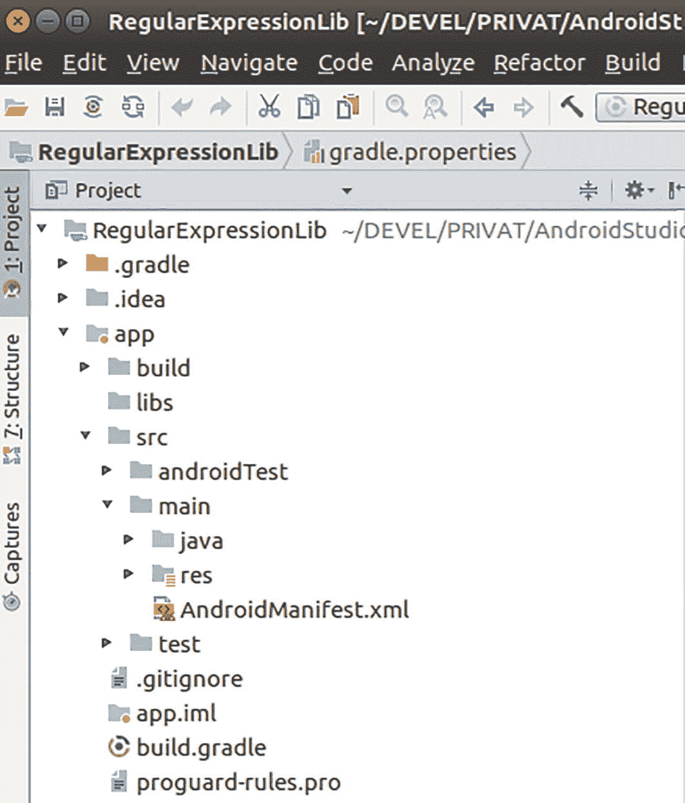

# 源集

如果你在 Android Studio 中创建一个项目，并切换到“项目”视图，你可以看到在 `src` 文件夹中有一个 `main` 文件夹。这对应于 `main` 源集，它是默认配置和使用的单一源集。请参见图 12-1。



一个带有文件夹列表的 Gradle 点属性正则表达式库的界面。

**图 12-1** “主”源集

然而，你可以拥有更多的源集，它们对应于构建类型、产品风味和构建变体。一旦你添加了更多的源集，构建将导致合并当前的构建变体、其包含的构建类型、其包含的产品风味，最后是 `main` 源集。要查看哪些源集将被包含在构建中，请打开窗口右侧的 Gradle 视图，并运行 `sourceSets` 任务。这将产生一个长列表，你可以看到类似以下的条目

```
main
Java sources: [app/src/main/java]
debug
Java sources: [app/src/debug/java]
free
Java sources: [app/src/free/java]
freeSinceapi21
Java sources: [app/src/freeSinceapi21/java]
freeSinceapi21Debug
Java sources: [app/src/freeSinceapi21Debug/java]
freeSinceapi21Release
Java sources: [app/src/freeSinceapi21Release/java]
paid
Java sources: [app/src/paid/java]
paidSinceapi21
Java sources: [app/src/paidSinceapi21/java]
release
Java sources: [app/src/release/java]
sinceapi21
Java sources: [app/src/sinceapi21/java]
```

这告诉你，如果你选择构建变体 `freeSinceapi21Debug`，构建过程会查找文件夹

```
app/src/freeSinceapi21Debug/java
app/src/freeSinceapi21/java
app/src/free/java
app/src/sinceapi21/java
app/src/debug/java
app/src/main/java
```

中的类，并相应地查找资源、资产和 `AndroidManifest.xml` 文件的对应文件夹。在此构建链中，Java 或 Kotlin 类不得重复，而清单文件以及资源和资产文件将由构建过程进行合并。

在文件 `build.gradle` 的 `dependencies { ... }` 部分内部，你可以根据构建变体分发依赖项。只需在任何设置前面加上源集的驼峰命名版本即可。例如，如果你希望为 `freeSinceapi21` 变体包含一个编译依赖项 `:mylib`，请编写

```
freeSinceapi21Compile ':mylib'
```

