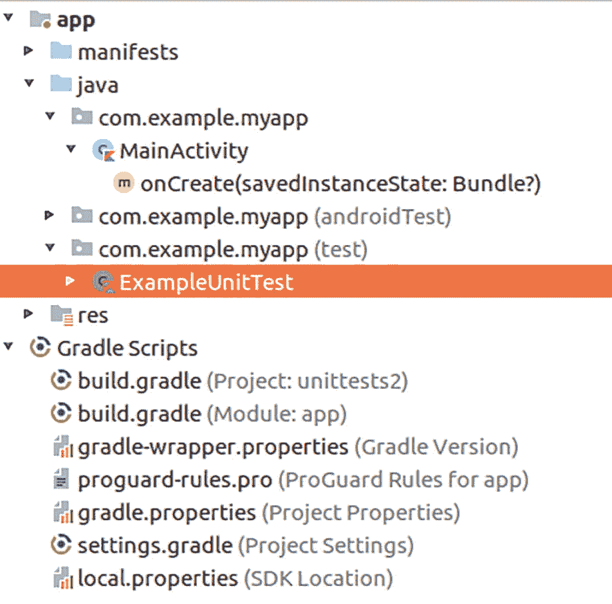

# 套接字连接与可穿戴设备开发

## 蓝牙套接字通信

```
/**
* 此线程在连接远程设备期间运行。
* 它负责处理所有传入和传出的传输。
*/
private inner
class SocketReadWrite(val mmSocket: BluetoothSocket) :
Thread() {
    private val mmInStream: InputStream?
    private val mmOutStream: OutputStream?
    init {
        mmInStream = mmSocket.inputStream
        mmOutStream = mmSocket.outputStream
        changeState(Companion.State.CONNECTED)
    }
    override fun run() {
        val buffer = ByteArray(1024)
        var bytex: Int
        // 保持监听 InputStream
        // 处于连接状态时
        while (mState ==
        Companion.State.CONNECTED) {
            try {
                // 从 InputStream 读取
                bytex = mmInStream!!.read(buffer)
            } catch (e: IOException) {
                connectionLost()
                break
            }
        }
    }
    /**
    * 写入已连接的输出流。
    *
    * @param buffer 要写入的字节
    */
    fun write(buffer: ByteArray) {
        mmOutStream!!.write(buffer)
    }
    fun cancel() {
        mmSocket.close()
    }
}
```

最后，我们提供一个方法，用于在套接字连接状态发生变化时通知相关方。这里它还会输出一条日志语句——在生产代码中，您应删除此语句或以其他方式向用户提供此信息：

```
private fun changeState(newState:State) {
    Log.e("LOG",
    "changing state: ${mState} -> ${newState}")
    mState = newState
    stateChangeListeners.forEach { it(newState) }
}
```

**注意：** 伴随对象中的 UUID 必须与服务器启动日志中看到的 UUID 匹配。

该类的作用如下：

-   一旦其`connect(...)`方法被调用，就会启动连接尝试。
-   如果连接成功，则会启动另一个线程，用于使用连接对象初始化输入和输出流。注意：此示例中未使用输入流——此处仅为提供信息。
-   通过其`mState`成员，客户端可以检查连接状态。
-   如果已连接，则可以调用`write(...)`方法通过连接通道发送数据。

要测试连接，请点击 UI 上的 "RFCOMM" 按钮。服务器应用程序随后应记录：

```
Command: 84
Command: 104
Command: 101
Command: 32
Command: 109
Command: 101
Command: 115
Command: 115
Command: 97
Command: 103
Command: 101
```

这是消息 "The message" 的数字表示形式。

## 硬件

Android 不仅仅可以在智能手机上呈现图形用户界面。它还与可穿戴设备、与配备相应功能的电视进行通信，以及车载信息娱乐系统有关。此外，智能手机还配备了摄像头、NFC 和蓝牙适配器，以及用于位置、运动、方向和指纹的传感器。当然，智能手机也可以打电话。本章介绍 Android 操作系统如何在非智能手机的设备上运行，以及如何与设备硬件进行交互。

### 可穿戴设备编程

Google Wear 关乎您佩戴在身上的小型设备。虽然目前这实际上仅限于您可以购买并戴在手腕上的智能手表，但未来的设备可能会是您眼镜、衣物或其他您能想到的任何事物的一部分。此外，谈到 Google Wear，您通常会想到需要随身携带并通过某种配对机制连接到 Google Wear 设备的智能手机，但现代设备也可以独立运行。这意味着它们不再需要配对的智能手机即可运行，并且可以自行通过 Wi-Fi、蓝牙或蜂窝适配器连接到互联网、蜂窝网络或局域网。

如果您恰好将配对的智能手机用于 Google Wear 应用，这不再局限于运行 Android 的手机，因此您可以同时将 Google Wear 设备与 Android 智能手机和 Apple iOS 手机配对。Wear OS 可与运行 Android 4.4 或更高版本以及 iOS 9.3 或更高版本的配对手机配合使用。

Google 针对智能手机应用的设计指南，更准确地说，是对简单且富有表现力的用户界面的要求，对于 Wear 应用来说更为重要。由于空间和输入能力有限，将 UI 元素和前端工作流程减少到最低限度对于 Wear 相关开发至关重要。否则，您将面临应用可用性和接受度显著下降的风险。

Google Wear 应用的常见用例包括：

-   设计自定义表盘（日期和时间显示）
-   添加表盘复杂功能（自定义表盘元素）
-   显示通知
-   消息传递
-   语音交互
-   Google 助理
-   播放音乐
-   拨打电话和接听电话
-   闹钟
-   具有简单用户界面的应用
-   智能手机和平板电脑应用的配套应用
-   传感器应用
-   基于位置的服务
-   支付应用

在接下来的章节中，我们将探讨 Google Wear 应用的开发事项。

### 可穿戴设备开发

虽然开发 Wear 应用时，您大多可以使用与智能手机或平板电脑应用开发相同的工具和技术，但您必须注意智能手表有限的空间，以及用户与手表交互方式与其它设备的差异。

尽管如此，开始 Wear 开发的首选工具仍是 Android Studio。在本节中，我们将介绍如何设置 IDE 以开始 Wear 开发，以及如何将设备连接到 Android Studio。

对于开发 Wear 应用，我们首先需要指出有两种操作模式：

-   **将可穿戴设备与智能手机配对**

    由于技术限制，无法将虚拟智能手表与虚拟智能手机配对。因此，您必须使用真实的手机来配对虚拟智能手表。

-   **独立模式**

    Wear 应用自行运行，无需与智能手机配对。强烈建议现代应用也能在独立模式下执行有意义的功能。

无论哪种情况，创建一个新的 Android Studio 项目，在 "目标 Android 设备" 中仅勾选 Wear 复选框。在后续屏幕中，选择以下选项之一：

-   **不添加活动**

    继续而不添加活动。您之后需要手动添加。

-   **空白 Wear 活动**

    添加布局和一个活动类。

-   **表盘**

    不会创建活动。相反，它会构建一个定义表盘所需的服务类。

```
class MainActivity : WearableActivity() {
    override
    fun onCreate(savedInstanceState: Bundle?) {
        super.onCreate(savedInstanceState)
        setContentView(R.layout.activity_main)
        setAmbientEnabled() // 启用始终在线模式
    }
}
```

此选择对应于要选择的开发范式。您将创建以下内容之一：

-   一个类似智能手机的应用，需要明确在手表上启动才能运行。
-   一个表盘。这或多或少是一个图形设计问题——表盘是手表表面显示日期和时间的视觉外观。


好的，作为高级文档工程师和翻译员，我将严格遵循您的注意事项和示例，将给定的英文文本翻译成中文。


### 表盘复杂功能

表盘复杂功能是添加到表盘上的一种功能。

我们将在以下章节中讨论不同的开发路径。

接下来，打开 `Tools ➤ AVD Manager` 并创建一个新的虚拟穿戴设备。现在，您可以在虚拟穿戴设备上启动您的应用。除非您选择了“不添加 Activity”，否则模拟器应该已经在表盘上显示一个启动 UI。

要将虚拟手表与您的智能手机配对，请使用 USB 数据线将智能手机连接到您的开发电脑，将其设为开发设备（在系统设置底部点击“版本号”七次），然后在智能手机上安装“Wear OS by Google”应用。在您的开发电脑上，通过以下方式设置通信：

```
./adb -d forward tcp:5601 tcp:5601
```

启动应用，然后从菜单中选择“Connect to Emulator”。如果您想使用真正的智能手表进行开发并需要调试功能，在线资源 [`https://developer.android.com/training/wearables/get-started/debugging`](https://developer.android.com/training/wearables/get-started/debugging) 提供了有关如何设置智能手表调试过程的更多信息。

## 可穿戴应用用户界面

在开始为您的 Wear 应用创建用户界面之前，请考虑使用内置机制之一，即如下章节所述的*通知*或*表盘复杂功能*。但是，如果您认为您的 Wear 应用有必要呈现自己的布局，请不要直接复制智能手机应用的布局并将其用于 Wear。相反，要构建真正的 Wear 用户界面，请使用 Wear 支持库提供的特殊 UI 元素。要使用它，请确保模块的 `build.gradle` 文件中包含：

```
dependencies {
...
implementation "androidx.wear:wear:1.2.0"
// Add support for wearable specific inputs
implementation "androidx.wear:wear-input:1.1.0"
implementation "androidx.wear:wear-input-testing:1.1.0"
// Use to implement wear ongoing activities
implementation "androidx.wear:wear-ongoing:1.0.0"
// Use to implement support for interactions from the
// Wearables to Phones
implementation "androidx.wear:" +
"wear-phone-interactions:1.1.0-alpha03"
// Use to implement support for interactions between
// the Wearables and Phones
implementation "androidx.wear:" +
"wear-remote-interactions:1.0.0"
}
```

这些库包含各种类，可帮助构建具有专为 Wear 开发定制的元素的 UI。在线 API 文档页面 [`https://developer.android.com/jetpack/androidx/releases/wear`](https://developer.android.com/jetpack/androidx/releases/wear) 包含有关如何使用这些类的详细信息。

## 可穿戴设备表盘

如果您想创建一个以特定自定义设计显示时间和日期的 Wear 表盘，请使用“Watch Face”选项，按照前面描述的项目创建向导开始。生成的向导服务类提供了一个相当详尽的表盘示例，您可以将其作为您自己表盘的起点。

## 添加表盘复杂功能

表盘复杂功能是表盘中数据片段的占位符。复杂功能数据提供者与复杂功能渲染器是严格分离的，因此，在您的表盘中，您不需要指定要显示哪些复杂功能。相反，您要指定显示复杂功能的位置，并且还可以指定可能的复杂功能数据类型，但让用户决定准确在何处显示哪些复杂功能。

在本节中，我们将讨论如何增强您的表盘以显示复杂功能数据。为此，我提出一种侵入性最小的方法来更新您的表盘实现，以便您能够更轻松地实现自己的想法。拥有一个如之前所述的可运行的表盘是本节的前提条件。

我们从 `AndroidManifest.xml` 中的条目开始。我们需要的是以下内容：

-   我们需要一种方法来告诉 Android，我们将为复杂功能 UI 元素提供一个配置 Activity。通过添加以下内容来实现：

```
<meta-data
    android:name="android.support.wearable.complications.¬
        COMPLICATION_PROVIDER_SERVICE_EXTRA"
    android:value=".ComplicationConfigActivity"/>
```

放在 `service` 元素内部（删除由 `¬` 表示的换行符）。这向 Android 表明存在一个复杂功能管理 Activity。我们将其映射到我们接下来要描述的新 Activity。

-   我们按如下方式添加有关权限查询 Activity 和配置 Activity 的信息：

```
<meta-data
    android:name="android.support.wearable.complications.¬
        COMPLICATION_PROVIDER_PERMISSION_CALLBACK"
    android:value=".PermissionActivity"/>
```

接下来，我们在表盘类中的任何合适位置添加：

```
lateinit var compl : MyComplications
private fun initializeComplications() {
compl = MyComplications()
compl.init(this@MyWatchFace, this)
}
override
fun onComplicationDataUpdate(
complicationId: Int,
complicationData: ComplicationData)
{
compl.onComplicationDataUpdate(
complicationId,complicationData)
}
private fun drawComplications(
canvas: Canvas, drawWhen: Long) {
compl.drawComplications(canvas, drawWhen)
}
// Fires PendingIntent associated with
// complication (if it has one).
private fun onComplicationTap(
complicationId:Int) {
Log.d("LOG", "onComplicationTap()")
compl.onComplicationTap(complicationId)
}
```

在同一文件中，在 `ci.onCreate(...)` 中添加：

```
initializeComplications()
```

并在 `onSurfaceChanged(...)` 的末尾添加：

```
compl.updateComplicationBounds(width, height)
```

在 `onTapCommand(...)` 函数内部，按如下方式替换相应的 `where` 代码块分支：

```
WatchFaceService.TAP_TYPE_TAP -> {
// The user has completed the tap gesture.
// Toast.makeText(applicationContext, R.string.message, Toast.LENGTH_SHORT)
//        .show()
compl.getTappedComplicationId(x, y)?.run  {
onComplicationTap(this)
}
}
```

这将判断用户是否点击了显示的某个复杂功能，如果是，则将事件转发给我们定义的新函数之一。最后，在 `onDraw(...)` 内部写入：

```
...
drawBackground(canvas)
drawComplications(canvas, now)
drawWatchFace(canvas)
...
```

为了处理复杂功能，创建一个新类 `MyComplications`，并让它读取：

```
class MyComplications {
```

我们首先在伴生对象中定义一组常量和实用方法：

```
companion object {
fun getComplicationId(
pos: ComplicationConfigActivity.
ComplicationLocation): Int {
// 在此处添加支持的位置
return when(pos) {
ComplicationConfigActivity.
ComplicationLocation.LEFT ->
LEFT_COMPLICATION_ID
ComplicationConfigActivity.
ComplicationLocation.RIGHT ->
RIGHT_COMPLICATION_ID
else -> -1
}
}
fun getSupportedComplicationTypes(
complicationLocation:
ComplicationConfigActivity.
ComplicationLocation): IntArray? {
return when(complicationLocation) {
ComplicationConfigActivity.
ComplicationLocation.LEFT ->
COMPLICATION_SUPPORTED_TYPES[0]
ComplicationConfigActivity.
ComplicationLocation.RIGHT ->
COMPLICATION_SUPPORTED_TYPES[1]
else -> IntArray(0)
}
}
private val LEFT_COMPLICATION_ID = 0
private val RIGHT_COMPLICATION_ID = 1
val COMPLICATION_IDS = intArrayOf(
LEFT_COMPLICATION_ID, RIGHT_COMPLICATION_ID)
private val complicationDrawables =
SparseArray()
private val complicationDat =
SparseArray()
// 左右表盘支持的类型。
private val COMPLICATION_SUPPORTED_TYPES =
arrayOf(
intArrayOf(ComplicationData.TYPE_RANGED_VALUE,
ComplicationData.TYPE_ICON,
ComplicationData.TYPE_SHORT_TEXT,
ComplicationData.TYPE_SMALL_IMAGE),
intArrayOf(ComplicationData.TYPE_RANGED_VALUE,
ComplicationData.TYPE_ICON,
ComplicationData.TYPE_SHORT_TEXT,
ComplicationData.TYPE_SMALL_IMAGE)
)
}
private lateinit var ctx:CanvasWatchFaceService
private lateinit var engine:MyWatchFace.Engine
```

在 `init()` 方法内部，我们注册要绘制的复杂功能。方法 `onComplicationDataUpdate()` 用于处理复杂功能数据更新，而 `updateComplicationBounds()` 则响应复杂功能大小的变化。


```kotlin
fun init(ctx:CanvasWatchFaceService,
engine: MyWatchFace.Engine) {
this.ctx = ctx
this.engine = engine
// 为每个位置创建一个 ComplicationDrawable
val leftComplicationDrawable =
ctx.getDrawable(custom_complication_styles)
as ComplicationDrawable
leftComplicationDrawable.setContext(
ctx.applicationContext)
val rightComplicationDrawable =
ctx.getDrawable(custom_complication_styles)
as ComplicationDrawable
rightComplicationDrawable.setContext(
ctx.applicationContext)
complicationDrawables[LEFT_COMPLICATION_ID] =
leftComplicationDrawable
complicationDrawables[RIGHT_COMPLICATION_ID] =
rightComplicationDrawable
engine.setActiveComplications(*COMPLICATION_IDS)
}
fun onComplicationDataUpdate(
complicationId: Int,
complicationData: ComplicationData) {
Log.d("LOG", "onComplicationDataUpdate() id: " +
complicationId);
complicationDat[complicationId] = complicationData
complicationDrawables[complicationId].
setComplicationData(complicationData)
engine.invalidate()
}
fun updateComplicationBounds(width: Int,
height: Int) {
// 对于大多数 Wear 设备，宽度和高度
// 是相同的
val sizeOfComplication = width / 4
val midpointOfScreen = width / 2
val horizontalOffset =
(midpointOfScreen - sizeOfComplication) / 2
val verticalOffset =
midpointOfScreen - sizeOfComplication / 2
complicationDrawables.get(LEFT_COMPLICATION_ID).
bounds =
// 左，上，右，下
Rect(
horizontalOffset,
verticalOffset,
horizontalOffset + sizeOfComplication,
verticalOffset + sizeOfComplication)
complicationDrawables.get(RIGHT_COMPLICATION_ID).
bounds =
// 左，上，右，下
Rect(
midpointOfScreen + horizontalOffset,
verticalOffset,
midpointOfScreen + horizontalOffset +
sizeOfComplication,
verticalOffset + sizeOfComplication)
}
```

方法`drawComplications()`实际上绘制了复杂功能。为此，我们扫描在`init`块中注册的复杂功能：

```kotlin
fun drawComplications(canvas: Canvas, drawWhen: Long) {
COMPLICATION_IDS.forEach {
complicationDrawables[it].
draw(canvas, drawWhen)
}
}
```

我们需要一种方法来找出我们的某个复杂功能是否被点击。方法`getTappedComplicationId()`负责处理这个问题。最后，方法`onComplicationTap()`对此类事件做出响应：

```kotlin
// 确定点击是否发生在复杂功能区域内，
// 否则返回 null。
fun getTappedComplicationId(x:Int, y:Int):Int? {
val currentTimeMillis = System.currentTimeMillis()
for(complicationId in
MyComplications.COMPLICATION_IDS) {
val res =
complicationDat[complicationId]?.run {
var res2 = -1
if(isActive(currentTimeMillis)
&& (getType() !=
ComplicationData.TYPE_NOT_CONFIGURED)
&& (getType() !=
ComplicationData.TYPE_EMPTY))
{
val complicationDrawable =
complicationDrawables[complicationId]
val complicationBoundingRect =
complicationDrawable.bounds
if (complicationBoundingRect.width()
> 0) {
if (complicationBoundingRect.
contains(x, y)) {
res2 = complicationId
}
} else {
Log.e("LOG",
"无法识别的复杂功能 id。")
}
}
res2
} ?: -1
if(res != -1) return res
}
return null
}
// 用户点击了复杂功能
fun onComplicationTap(complicationId:Int) {
Log.d("LOG", "onComplicationTap()")
val complicationData =
complicationDat[complicationId]
if (complicationData != null) {
if (complicationData.getTapAction()
!= null) {
try {
complicationData.getTapAction().send()
} catch (e: Exception ) {
Log.e("LOG",
"onComplicationTap() 点击错误: " +
e);
}
} else if (complicationData.getType() ==
ComplicationData.TYPE_NO_PERMISSION) {
// 发起权限请求。
val componentName = ComponentName(
ctx.applicationContext,
MyComplications::class.java)
val permissionRequestIntent =
ComplicationHelperActivity.
createPermissionRequestHelperIntent(
ctx.applicationContext,
componentName)
ctx.startActivity(permissionRequestIntent)
}
} else {
Log.d("LOG",
"复杂功能 " +
complicationId + " 没有 PendingIntent。")
}
}
}
```

剩下的工作就是编写配置活动。为此，创建一个新的 Kotlin 类`ComplicationConfigActivity`，并让它读取：

```kotlin
class ComplicationConfigActivity :
ActivityCompat(), View.OnClickListener {
companion object {
val TAG = "LOG"
val COMPLICATION_CONFIG_REQUEST_CODE = 1001
}
var mLeftComplicationId: Int = 0
var mRightComplicationId: Int = 0
var mSelectedComplicationId: Int = 0
// 用于标识渲染表盘的特定服务。
var mWatchFaceComponentName: ComponentName? = null
// 用于从表盘检索复杂功能数据以进行预览。
var mProviderInfoRetriever:
ProviderInfoRetriever? = null
var mLeftComplicationBackground: ImageView? = null
var mRightComplicationBackground: ImageView? = null
var mLeftComplication: ImageButton? = null
var mRightComplication: ImageButton? = null
var mDefaultAddComplicationDrawable: Drawable? = null
enum class ComplicationLocation {
LEFT,
RIGHT
}
```

像往常一样，我们使用`onCreate()`和`onDestroy()`回调来分别设置和清理用户界面。此外，方法`retrieveInitialComplicationsData()`被`onCreate()`用于初始化复杂功能：

```kotlin
override
fun onCreate(savedInstanceState: Bundle?) {
super.onCreate(savedInstanceState)
setContentView(R.layout.activity_config)
mDefaultAddComplicationDrawable =
getDrawable(R.drawable.add_complication)
mSelectedComplicationId = -1
mLeftComplicationId =
MyComplications.getComplicationId(
ComplicationLocation.LEFT)
mRightComplicationId =
MyComplications.getComplicationId(
ComplicationLocation.RIGHT)
mWatchFaceComponentName =
ComponentName(applicationContext,
MyWatchFace::class.java!!)
// 设置左侧复杂功能预览。
mLeftComplicationBackground =
left_complication_background
mLeftComplication = left_complication
mLeftComplication!!.setOnClickListener(this)
// 默认设置为"添加复杂功能"图标。
mLeftComplication!!.setImageDrawable(
mDefaultAddComplicationDrawable)
mLeftComplicationBackground!!.setVisibility(
View.INVISIBLE)
// 设置右侧复杂功能预览。
mRightComplicationBackground =
right_complication_background
mRightComplication = right_complication
mRightComplication!!.setOnClickListener(this)
// 默认设置为"添加复杂功能"图标。
mRightComplication!!.setImageDrawable(
mDefaultAddComplicationDrawable)
mRightComplicationBackground!!.setVisibility(
View.INVISIBLE)
mProviderInfoRetriever =
ProviderInfoRetriever(applicationContext,
Executors.newCachedThreadPool())
mProviderInfoRetriever!!.init()
retrieveInitialComplicationsData()
}
override fun onDestroy() {
super.onDestroy()
mProviderInfoRetriever!!.release()
}
fun retrieveInitialComplicationsData() {
val complicationIds =
MyComplications.COMPLICATION_IDS
mProviderInfoRetriever!!.retrieveProviderInfo(
object : ProviderInfoRetriever.
OnProviderInfoReceivedCallback() {
override fun onProviderInfoReceived(
watchFaceComplicationId:
Int,
complicationProviderInfo:
ComplicationProviderInfo?)
{
Log.d(TAG,
"onProviderInfoReceived: " +
complicationProviderInfo)
updateComplicationViews(
watchFaceComplicationId,
complicationProviderInfo)
}
},
mWatchFaceComponentName,
*complicationIds)
}
```

方法`onClick()`和`launchComplicationHelperActivity()`用于处理复杂功能上的点击事件：


`override fun onClick(view: View) { if (view.equals(mLeftComplication)) { Log.d(TAG, "Left Complication click()") launchComplicationHelperActivity( ComplicationLocation.LEFT) } else if (view.equals(mRightComplication)) { Log.d(TAG, "Right Complication click()") launchComplicationHelperActivity( ComplicationLocation.RIGHT) } } fun launchComplicationHelperActivity( complicationLocation: ComplicationLocation) { mSelectedComplicationId = MyComplications.getComplicationId( complicationLocation) if (mSelectedComplicationId >= 0) { val supportedTypes = MyComplications. getSupportedComplicationTypes( complicationLocation)!! startActivityForResult( ComplicationHelperActivity. createProviderChooserHelperIntent( applicationContext, mWatchFaceComponentName, mSelectedComplicationId, *supportedTypes), ComplicationConfigActivity. COMPLICATION_CONFIG_REQUEST_CODE) } else { Log.d(TAG, "Complication not supported by watch face.") } }`

为了处理 Android 操作系统发出的更新信号，我们提供了 `updateComplicationViews()` 和 `onActivityResult()` 方法：

```
fun updateComplicationViews(
    watchFaceComplicationId: Int,
    complicationProviderInfo: ComplicationProviderInfo?
) {
    Log.d(TAG, "updateComplicationViews(): id: " + watchFaceComplicationId)
    Log.d(TAG, "\tinfo: " + complicationProviderInfo)
    if (watchFaceComplicationId == mLeftComplicationId) {
        if (complicationProviderInfo != null) {
            mLeftComplication!!.setImageIcon(complicationProviderInfo.providerIcon)
            mLeftComplicationBackground!!.setVisibility(View.VISIBLE)
        } else {
            mLeftComplication!!.setImageDrawable(mDefaultAddComplicationDrawable)
            mLeftComplicationBackground!!.setVisibility(View.INVISIBLE)
        }
    } else if (watchFaceComplicationId == mRightComplicationId) {
        if (complicationProviderInfo != null) {
            mRightComplication!!.setImageIcon(complicationProviderInfo.providerIcon)
            mRightComplicationBackground!!.setVisibility(View.VISIBLE)
        } else {
            mRightComplication!!.setImageDrawable(mDefaultAddComplicationDrawable)
            mRightComplicationBackground!!.setVisibility(View.INVISIBLE)
        }
    }
}

override fun onActivityResult(requestCode: Int, resultCode: Int, data: Intent) {
    if (requestCode == COMPLICATION_CONFIG_REQUEST_CODE && resultCode == Activity.RESULT_OK) {
        // 检索所选 Complication 提供者的信息。
        val complicationProviderInfo = data.getParcelableExtra(ProviderChooserIntent.EXTRA_PROVIDER_INFO)
        Log.d(TAG, "Provider: " + complicationProviderInfo)
        if (mSelectedComplicationId >= 0) {
            updateComplicationViews(mSelectedComplicationId, complicationProviderInfo)
        }
    }
}
```

请注意，我们添加了一些日志语句，在生产代码中您可能需要删除它们。对应的布局可能如下所示：

经过所有这些添加，表盘支持根据用户需求添加两个可用的复杂功能。可以支持更多的复杂功能位置。只需重写代码的相应部分即可。

注意：按此处所示输入代码，Android Studio 会提示缺少资源，尤其是可绘制对象。要使此处提供的代码能够运行，您必须提供缺失的资源。通常，通过查看名称或尝试运行，您可以找出它们的用途。

## 提供复杂功能数据

Google Wear 设备默认包含多个复杂功能数据提供者，因此用户可以选择其中之一来填充表盘中的复杂功能占位符。

如果您想创建自己的复杂功能数据提供者，请按照 `AndroidManifest.xml` 中的声明准备一个新的服务：

从一个服务类 `CustomComplicationProviderService` 开始，如下所示：

```
class CustomComplicationProviderService : ComplicationProviderService() {
    // 此方法用于每个复杂功能的单次设置。
    override fun onComplicationActivated(complicationId: Int, dataType: Int, complicationManager: ComplicationManager?) {
        Log.d(TAG, "onComplicationActivated(): $complicationId")
    }

    // 复杂功能需要从您的提供者获取更新的数据。可能由以下原因之一触发：
    //   1. 活动的表盘复杂功能被更改为使用此提供者
    //   2. 使用此提供者的复杂功能变为活动状态
    //   3. UPDATE_PERIOD_SECONDS（清单中定义）已过期
    //   4. 手动方式：通过 ProviderUpdateRequester.requestUpdate() 触发更新
    override fun onComplicationUpdate(complicationId: Int, dataType: Int, complicationManager: ComplicationManager) {
        Log.d(TAG, "onComplicationUpdate() $complicationId")
        // ... 添加数据生成的代码 ...
        var complicationData: ComplicationData? = null
        when (dataType) {
            ComplicationData.TYPE_SHORT_TEXT -> complicationData = ComplicationData.Builder(ComplicationData.TYPE_SHORT_TEXT).... .build()
            ComplicationData.TYPE_LONG_TEXT -> complicationData = ComplicationData.Builder(ComplicationData.TYPE_LONG_TEXT). ...
            ComplicationData.TYPE_RANGED_VALUE -> complicationData = ComplicationData.Builder(ComplicationData.TYPE_RANGED_VALUE). ...
            else -> Log.w("LOG", "Unexpected complication type $dataType")
        }
        if (complicationData != null) {
            complicationManager.updateComplicationData(complicationId, complicationData)
        } else {
            // 即使没有发送数据，我们也要通知 ComplicationManager
            complicationManager.noUpdateRequired(complicationId)
        }
    }

    override fun onComplicationDeactivated(complicationId: Int) {
        Log.d("LOG", "onComplicationDeactivated(): $complicationId")
    }
}
```

要手动触发系统请求新的复杂功能数据，您可以使用 `ProviderUpdateRequester` 类，如下所示：

```
val compName = ComponentName(applicationContext, MyService::class.java)
val providerUpdateRequester = ProviderUpdateRequester(applicationContext, componentName)
providerUpdateRequester.requestUpdate(complicationId)
// 要更新所有复杂功能，请改用 providerUpdateRequester.requestUpdateAll()
```

### 可穿戴设备上的通知

可穿戴设备上的通知可以以桥接模式或独立模式运行。在桥接模式下，通知会自动与配对的智能手机同步；在独立模式下，Wear 设备会独立显示通知。

要开始创建您自己的通知，首先在项目设置向导中使用“Blank Wear Activity”创建一个 Wear 项目。我们修改布局文件以添加一个用于创建通知的按钮：

该活动将获得一个函数来响应按钮按下。在该函数内部，我们创建并发送一个通知：


```kotlin
class MainActivity : WearableActivity() {
    override fun onCreate(savedInstanceState: Bundle?) {
        super.onCreate(savedInstanceState)
        setContentView(activity_main)
        setAmbientEnabled() // 启用常亮模式
    }
    fun go(v: View) {
        val notificationId = 1
        // 通知的频道 ID
        val id = "my_channel_01"
        if (Build.VERSION.SDK_INT >=
            Build.VERSION_CODES.O) {
            // 创建 NotificationChannel
            val name = "My channel"
            val description = "Channel description"
            val importance =
                NotificationManager.IMPORTANCE_DEFAULT
            val mChannel = NotificationChannel(
                id, name, importance)
            mChannel.description = description
            // 向系统注册频道
            val notificationManager = getSystemService(
                Context.NOTIFICATION_SERVICE)
                    as NotificationManager
            notificationManager.
                createNotificationChannel(mChannel)
        }
        // 对于 Android 7.1.1（API 级别 25）及更低版本，通知频道 ID 将被忽略
        val notificationBuilder =
            NotificationCompat.Builder(this, id)
                .setSmallIcon(android.R.drawable.ic_media_play)
                .setContentTitle("标题")
                .setContentText("内容文本")
        // 获取 NotificationManager 服务
        val notificationManager =
            NotificationManagerCompat.from(this)
        // 发出通知
        notificationManager.notify(
            notificationId, notificationBuilder.build())
    }
}
```

如果启动此应用，会显示一个包含文本和按钮的简单 UI。按下按钮后会短暂显示通知图标，在我们的示例中是一个“播放”矩形。使用返回键和上滑手势，通知会显示标题和内容。此外，用户使用的表盘上可能添加了通知预览。参见图 14-1。


三个帧分别显示带有播放按钮和不同文本的 UI。1. 你好圆形世界、GO 按钮。2. 时钟显示电池 100%、时间 19:35 和日期 4 月 6 日。3. 标题、内容文本。

**图 14-1** Wear 上的通知

你还可以在代码中添加 `PendingIntent`，并在构建器内使用 `setContentIntent(...)` 注册它，以便在用户点击出现的通知时发送 Intent。此外，在构建器内，你还可以通过 `addAction(...)` 或 `addActions(...)` 添加额外的操作图标。通过构建 `NotificationCompat.WearableExtender` 对象并在构建器上调用 `extent(...)` 并传入此扩展器对象，可以将 Wear 特定的功能添加到通知中。请注意，通过向 `WearableExtender` 对象（而非构建器）添加操作，可以确保这些操作仅在可穿戴设备上显示。如需向 Wear 通知添加语音功能、使用预定义文本回复以及在桥接模式下使用特殊功能，请参阅在线文档：[`https://developer.android.com/training/wearables/notifications/index.xhtml`](https://developer.android.com/training/wearables/notifications/index.xhtml)。

## 控制应用在可穿戴设备上的可见性

从 Android 5.1 开始，Wear OS 设备允许即使在启用省电模式或*环境光*模式时，也能在后台运行 Wear 应用。你有两种方式来处理环境光模式：

*   使用 `AmbientModeSupport` 类。
*   使用 `WearableActivity` 类。

要使用 `AmbientModeSupport` 类，需实现 `Activity` 的子类，实现 `AmbientCallbackProvider` 接口，并按以下方式声明和保存 `AmbientController`：

```kotlin
class MainActivity : FragmentActivity(),
    AmbientModeSupport.AmbientCallbackProvider {
    override
    fun getAmbientCallback():
        AmbientModeSupport.AmbientCallback
    {
        ...
    }
    lateinit
    var mAmbientController:
        AmbientModeSupport.AmbientController
    override
    fun onCreate(savedInstanceState:Bundle?) {
        super.onCreate(savedInstanceState)
        ...
        mAmbientController =
            AmbientModeSupport.attach(this)
    }
}
```

在 `getAmbientCallback()` 函数内部，创建并返回 `AmbientModeSupport.AmbientCallback` 的子类。此回调负责在标准模式和环境光模式之间切换。环境光模式的具体行为由你作为开发者决定，但你应该采取省电措施，例如变暗的黑白图形、延长更新间隔等。允许环境光模式的第二种方式是让你的 Activity 继承 `WearableActivity` 类，在其 `onCreate(...)` 回调中调用 `setAmbientEnabled()`，并重写 `onEnterAmbient()` 和 `onExitAmbient()`。如果你还重写了 `onUpdateAmbient()`，可以将屏幕更新逻辑放在其中，并让系统决定环境光模式下使用的更新频率。

## Wear 中的身份验证

随着 Wear 应用能够在独立模式下运行，身份验证变得更加重要。详细描述相关适当的程序超出了本书的范围，但 [`https://developer.android.com/training/wearables/overlays/auth-wear`](https://developer.android.com/training/wearables/overlays/auth-wear) 页面提供了有关 Wear 中身份验证的详细信息。

## Wear 中的语音功能

为 Wear 设备添加语音功能非常有意义，因为由于设备尺寸较小，其他用户输入方法受到限制。你有两种选择：将你的应用连接到一个或多个系统提供的语音操作，或者定义你自己的操作。

> **注意**
>
> Wear 模拟器无法处理语音命令——你必须使用真实设备进行测试。

将系统语音事件连接到你的应用提供的 Activity 很简单——你只需按如下方式向 Activity 添加 intent 过滤器即可：

可能的语音键列于表 14-1 中。

**表 14-1** 系统语音命令

| 命令 | 清单键 | 附加数据 |
| --- | --- | --- |
| “OK, Google, 帮我叫辆出租车”<br>“OK, Google, 帮我叫车” | `com.google.android.gms.actions.RESERVE_TAXI_RESERVATION` | - |
| “OK, Google, 记个笔记”<br>“OK, Google, 给自己记笔记” | `android.intent.action.SEND`<br>类别：`com.android.voicesearch.SELF_NOTE` | `android.content.Intent.EXTRA_TEXT` – 包含笔记内容的字符串 |
| “OK, Google, 设一个早上 8 点的闹钟”<br>“OK, Google, 明早 6 点叫我起床” | `android.intent.action.SET_ALARM` | `android.provider.AlarmClock.EXTRA_HOUR` – 表示闹钟小时的整数。<br>`android.provider.AlarmClock.EXTRA_MINUTES` – 表示闹钟分钟的整数 |
| “OK, Google, 设一个 10 分钟的计时器” | `android.intent.action.SET_TIMER` | `android.provider.AlarmClock.EXTRA_LENGTH` – 表示计时器时长的整数，范围 1–86400（24 小时内的秒数） |
| “OK, Google, 开始秒表” | `com.google.android.wearable.action.STOPWATCH` | - |
| “OK, Google, 开始骑行”<br>“OK, Google, 开始骑车”<br>“OK, Google, 停止骑行” | `vnd.google.fitness.TRACK`<br>Mime 类型：`vnd.google.fitness.activity/biking` | `actionStatus` – 字符串，开始时值为 `ActiveActionStatus`，停止时值为 `CompletedActionStatus` |
| “OK, Google, 追踪我的跑步”<br>“OK, Google, 开始跑步”<br>“OK, Google, 停止跑步” | `vnd.google.fitness.TRACK`<br>Mime 类型：`vnd.google.fitness.activity/running` | `actionStatus` – 字符串，开始时值为 `ActiveActionStatus`，停止时值为 `CompletedActionStatus` |
| “OK, Google, 开始锻炼”<br>“OK, Google, 追踪我的锻炼”<br>“OK, Google, 停止锻炼” | `vnd.google.fitness.TRACK`<br>Mime 类型：`vnd.google.fitness.activity/other` | `actionStatus` – 字符串，开始时值为 `ActiveActionStatus`，停止时值为 `CompletedActionStatus` |
| “OK, Google, 我的心率是多少？”<br>“OK, Google, 我的 BPM 是多少？” | `vnd.google.fitness.VIEW`<br>Mime 类型：`vnd.google.fitness.data_type/com.google.heart_rate.bpm` | - |
```


# “OK, Google”语音操作与数据提取

“OK, Google，我今天走了多少步？”“OK，Google，我的步数是多少？”

| 操作 | MIME 类型 |
|------|----------|
| `vnd.google.fitness.VIEW` | `vnd.google.fitness.data_type/com.google.step_count.cumulative` |

可以像往常一样，通过多种 `Intent.get*Extra(...)` 方法之一从传入的 `Intent` 中提取额外数据。

你也可以提供应用定义的语音操作来启动自定义活动。为此，请在 `AndroidManifest.xml` 中按如下方式定义相关的每个 `<action>` 元素：

```xml
<activity
    android:name=".MyRunningApp"
    android:label="@string/start_my_running_app">
    <intent-filter>
        <action android:name="android.intent.action.VOICE_COMMAND" />
    </intent-filter>
</activity>
```

凭借“label”属性，你可以说出“启动我的跑步应用”来启动该活动。

你还可以让语音识别填充编辑字段。为此，请编写：

```kotlin
val SPEECH_REQUEST_CODE = 42
val intent = Intent(
    RecognizerIntent.ACTION_RECOGNIZE_SPEECH).apply {
    putExtra(RecognizerIntent.EXTRA_LANGUAGE_MODEL,
        RecognizerIntent.LANGUAGE_MODEL_FREE_FORM)
}.run {
    startActivityForResult(this, SPEECH_REQUEST_CODE)
}
```

并在重写的 `onActivityResult(...)` 回调中获取结果：

```kotlin
fun onActivityResult(requestCode: Int, resultCode: Int,
                     data: Intent) {
    if (requestCode and 0xFFFF == SPEECH_REQUEST_CODE
        && resultCode == RESULT_OK) {
        val results = data.getStringArrayListExtra(
            RecognizerIntent.EXTRA_RESULTS)
        val spokenText = results[0]
        // ... 处理语音文本
    }
    super.onActivityResult(
        requestCode, resultCode, data)
}
```

# 可穿戴设备的扬声器

如果你想使用连接到 Wear 设备的扬声器播放音频，首先检查 Wear 应用能否连接到扬声器：

```kotlin
fun hasSpeakers(): Boolean {
    val packageManager = context.getPackageManager()
    val audioManager =
        context.getSystemService(
            Context.AUDIO_SERVICE) as AudioManager
    if (Build.VERSION.SDK_INT >= Build.VERSION_CODES.M) {
        // 检查 FEATURE_AUDIO_OUTPUT 以防止误报。
        if (!packageManager.hasSystemFeature(
                PackageManager.FEATURE_AUDIO_OUTPUT)) {
            return false
        }
        val devices =
            audioManager.getDevices(
                AudioManager.GET_DEVICES_OUTPUTS)
        for (device in devices) {
            if (device.type ==
                AudioDeviceInfo.TYPE_BUILTIN_SPEAKER) {
                return true
            }
        }
    }
    return false
}
```

然后，你可以像在其他任何设备上播放声音一样播放声音。这在“播放媒体”一节中有详细描述。

# Wear 中的位置功能

要在 Wear 设备中使用位置检测，首先必须检查位置数据是否可用：

```kotlin
fun hasGps(): Boolean {
    return packageManager.hasSystemFeature(
        PackageManager.FEATURE_LOCATION_GPS)
}
```

如果可穿戴设备没有自带的位置传感器，则必须持续检查可穿戴设备是否已连接。可以通过处理回调来实现，如下所示：

```kotlin
var wearableConnected = false
fun onCreate(savedInstanceState: Bundle?) {
    ...
    Wearable.getNodeClient(this@MainActivity)
        .connectedNodes.addOnSuccessListener {
            wearableConnected = it.any {
                it.isNearby
            }
        }.addOnCompleteListener {
        }.addOnFailureListener {
            ...
        }
}
```

在此基础上，你可以使用 *Fused Location Provider* 处理位置检测，如第 8 章的“位置与地图”部分所述。

# Wear 中的数据通信

Wear OS 中的数据通信通过以下两种方式之一进行：

- **直接网络通信**：适用于能够自行连接网络并希望与非配对设备通信的 Wear 设备。
- **使用可穿戴数据层 API**：用于与配对手持设备进行通信。

对于直接网络通信，使用 `android.net.ConnectivityManager` 类来检查带宽等能力，并请求增加带宽等新能力。详细信息请参见该类的在线 API 文档。要实际执行网络通信，请使用 `android.net` 包中的类和接口。本节其余部分将描述用于与配对手持设备通信的 *可穿戴数据层 API*。

要访问可穿戴数据层 API，请通过以下方式获取 `DataClient` 或 `MessageClient`：

```kotlin
val dataClient = Wearable.getDataClient(this)
val msgClient = Wearable.getMessageClient(this)
```

在 activity 内部进行调用。你可以频繁调用，因为这两个操作开销都很低。消息客户端最适合传输小负载数据；对于较大负载，应改用数据客户端。此外，数据客户端是在 Wear 设备和手持设备之间同步数据的可靠方式，而消息客户端使用即发即忘模式。因此，消息客户端无法知道发送的数据是否实际到达。

使用数据客户端发送数据项时，创建 `PutDataMapRequest` 对象，调用其上的 `getDataMap()`，并使用各种 `put...()` 方法添加数据。最后，调用 `asPutDataRequest()` 并使用其结果调用 `DataClient.putDataItem(...)`。后者启动与其他设备的同步，并返回一个 `com.google.android.gms.tasks.Task` 对象，你可以向该对象添加监听器以观察通信。在接收方，你可以通过让你的 activity 实现 `DataClient.OnDataChangedListener` 并实现 `fun onDataChanged(dataEvents: DataEventBuffer)` 函数来观察数据同步。

对于较大的二进制数据集（如图像），可以使用 `Asset` 作为数据类型通过数据客户端发送，如下所示：

```kotlin
fun createAssetFromBitmap(bitmap: Bitmap): Asset {
    val byteStream = ByteArrayOutputStream()
    bitmap.compress(Bitmap.CompressFormat.PNG, 100,
        byteStream)
    return Asset.createFromBytes(byteStream
        .toByteArray())
}

val bitmap = BitmapFactory.decodeResource(
    getResources(), android.R.drawable.ic_media_play)
val asset = createAssetFromBitmap(bitmap)
val dataMap = PutDataMapRequest.create("/image")
dataMap.getDataMap().putAsset("profileImage", asset)
val request = dataMap.asPutDataRequest()
val putTask: Task<DataItem> =
    Wearable.getDataClient(this).putDataItem(request)
```

如果要改用消息客户端，首先需要找到合适的消息接收者。为此，首先将能力分配给合适的手持应用。这可以通过将文件 `wear.xml` 添加到 `res/values` 并使其包含以下内容来实现：

```xml
<resources>
    <string-array name="android_wear_capabilities">
        <item>my_capability1</item>
        <item>my_capability2</item>
        ...
    </string-array>
</resources>
```

要找到具有合适能力的手持设备（或网络节点）并向其发送消息，请编写：

```kotlin
val capabilityInfo = Tasks.await(
    Wearable.getCapabilityClient(this).getCapability(
        "my_capability1",
        CapabilityClient.FILTER_REACHABLE))
capabilityInfo.nodes.find {
    it.isNearby
}?.run {
    msgClient.sendMessage(
        this.id, "/msg/path", "Hello".toByteArray())
}
```

除此之外，你也可以直接将 `CapabilityClient.OnCapabilityChangedListener` 监听器添加到客户端，如下所示：

```kotlin
Wearable.getCapabilityClient(this).addListener({
    it.nodes.find {
        it.isNearby
    }?.run {
        msgClient.sendMessage(
            this.id, "/msg/path", "Hello".toByteArray())
    }
}, "my_capability1")
```

要接收此类消息，在安装于手持设备上的应用的任何位置，通过以下方式注册消息事件监听器：

```kotlin
Wearable.getMessageClient(this).addListener {
    messageEvent ->
    // 处理消息事件
}
```

# 使用 Android TV 进行编程

针对 Android TV 设备的应用开发与智能手机上的开发没有本质区别。然而，由于用户数十年观看电视形成的期望，其约定俗成的规范比智能手机更为严格。幸运的是，Android Studio 的项目构建向导可以帮助你入门。在本节中，我们也将探讨 Android TV 开发的重要方面。

## Android TV 使用场景

Android TV 应用的典型使用场景包括：

- 播放视频和音乐数据流及文件
- 帮助用户查找内容的目录
- 可在 Android TV 上运行的游戏（无需触摸屏）
- 展示带有内容的频道

## 启动 Android TV Studio 项目

如果你在 Android Studio 中启动一个新的 Android TV 项目，主要的关注点如下：

- 在清单文件中，添加以下条目


这将确保应用*也*能在配备触摸屏的智能手机上运行，并且包含 Android TV 所需的 Leanback 用户界面。

- 仍在清单文件中，你会看到启动 Activity 拥有一个像这样的 Intent 过滤器：

这里显示的类别很重要；否则，Android TV 将无法正确识别该应用。该 Activity 还需要一个 `android:banner` 属性，该属性指向一个在 Android TV 用户界面上 prominently 显示的横幅。

- 在模块的 `build.gradle` 文件中，leanback 支持库被添加到依赖项部分：

```
implementation 'com.android.support:leanback-v17:27.1.1'
```

为了进行开发，你可以使用虚拟设备或真机。虚拟设备通过“工具”菜单中的 AVD 管理器进行安装。对于真机，请在“设置” ➤ “设备” ➤ “关于”中连续点击七次版本号。返回“设置”，进入“偏好设置”并在“开发者选项”中启用调试。

## Android TV 硬件特性

要判断某个应用是否在 Android TV 上运行，你可以像这样使用 `UiModeManager`：

```
val isRunnigOnTv =
(getSystemService(Context.UI_MODE_SERVICE)
as UiModeManager).currentModeType ==
Configuration.UI_MODE_TYPE_TELEVISION
```

此外，可用特性因设备而异。如果你的应用需要某些硬件特性，你可以像这样检查其可用性：

```
getPackageManager().
hasSystemFeature(PackageManager.FEATURE_*)
```

有关所有可能的特性，请参阅 `PackageManager` 的 API 文档。Android TV 设备上的用户输入通常通过 D-pad 控制器进行。为了构建稳定的应用，你应该对 D-pad 控制器的可用性变化做出响应：在 `AndroidManifest.xml` 文件中，添加 `android:configChanges = "keyboard|keyboardHidden|navigation"` 作为 Activity 的属性。然后，应用会通过重写的回调函数 `fun onConfigurationChanged( newConfig : Configuration )` 获知配置变更信息。

## Android TV 的 UI 开发

对于 Android TV 开发，建议使用 leanback 主题。为此，将 `AndroidManifest.xml` 文件中 `<application>` 元素的 `theme` 属性替换为：

```
android:theme="@style/Theme.Leanback"
```

这意味着不使用操作栏，这是合理的，因为 Android TV 不支持操作栏。此外，Activity 不得继承 `AppCompatActivity`，而必须继承 `android.support.v4.app.FragmentActivity`。

Android TV 应用的另一个特殊性是，可能会偶尔发生过扫描：根据像素尺寸和宽高比，Android TV 可能会裁剪掉屏幕的某些部分。为了避免布局被破坏，建议为主容器添加 48 dp × 27 dp 的边距，如下所示：

此外，建议为 Android TV 开发 1920 × 1080 像素的应用。对于其他硬件像素尺寸，Android 会在必要时自动缩小布局元素。由于用户无法点击可触控的 UI 元素，而是使用 D-pad 进行导航，因此 Android TV 需要另一种在 UI 元素间切换的方式。这可以通过向 UI 元素添加 `nextFocusUp`、`nextFocusDown`、`nextFocusLeft` 和 `nextFocusRight` 属性轻松实现。这些属性的参数是导航目标元素的 ID 说明，例如 `"@+id/xyzElement"`。

对于电视播放组件，leanback 库提供了一些有用的类和概念：

-   对于媒体浏览器，让你的 Fragment 继承 `android.support.v17.leanback.app.BrowseSupportFragment`。项目构建向导会创建一个已废弃的 `BrowseFragment`，但你可以查阅 `BrowseSupportFragment` 的 API 文档来学习新的方法。
-   在媒体浏览器中呈现的实际媒体项由卡片视图管理。要重写的相应类是 `android.support.v17.leanback.widget.Presenter`。
-   要显示所选媒体项的详细信息，请继承 `android.support.v17.leanback.app.DetailsSupportFragment` 类。向导会创建已废弃的 `DetailFragment` 代替，但它们的用法类似，你可以查阅 API 文档了解更多细节。
-   对于显示视频播放的 UI 元素，请使用 `android.support.v17.leanback.app.PlaybackFragment` 或 `android.support.v17.leanback.app.VideoFragment` 之一。
-   使用类 `android.media.session.MediaSession` 来配置一个*“正在播放”*卡片。
-   类 `android.media.tv.TvInputService` 支持将视频流直接渲染到 UI 元素上。调用 `onTune(...)` 将开始渲染直接视频流。
-   如果你的应用需要一个包含多个步骤的指南，例如，向用户呈现购买流程，你可以使用类 `android.support.v17.leanback.app.GuidedStepSupportFragment`。
-   要以非交互方式向首次用户呈现应用，请使用类 `android.support.v17.leanback.app.OnboardingSupportFragment`。

## 用于内容搜索的推荐频道

显示给用户的推荐有两种形式：Android 8.0 之前的推荐行和从 Android 8.0 或 API 级别 26 开始的推荐频道。为了不错过用户，你的应用应该通过 switch 代码同时服务于两者：

```
if (android.os.Build.VERSION.SDK_INT >=
Build.VERSION_CODES.O) {
// 推荐频道 API ...
} else {
// 推荐行 API ...
}
```

对于 Android 8.0 及更高版本，Android TV 主屏幕在频道列表顶部显示一个全局的*“接下来播放”*行，以及一些属于特定应用的频道。除了*“接下来播放”*行之外，一个频道不能属于多个应用。每个应用可以定义一个*默认频道*，该频道会自动显示在频道视图中——对于应用可能定义的所有其他频道，用户必须首先批准，频道才会显示在主屏幕上。

一个应用需要具有以下权限才能管理频道：

因此，请将它们添加到 `AndroidManifest.xml` 文件中。

此外，在你的模块的 `build.gradle` 文件中，将其添加到 `dependencies` 部分（一行）：

```
implementation
'com.android.support:support-tv-provider:27.1.1'
```

要创建频道、添加频道徽标，并可能将其设为默认频道，请编写：

```
val builder = Channel.Builder()
// 点击应用链接时要执行的 Intent。
val appLink = Intent(...).toUri(Intent.URI_INTENT_SCHEME)
// 必须使用类型 `TYPE_PREVIEW`
builder.setType(TvContractCompat.Channels.TYPE_PREVIEW)
.setDisplayName("频道名称")
.setAppLinkIntentUri(Uri.parse(appLink))
val channel = builder.build()
val channelUri = contentResolver.insert(
TvContractCompat.Channels.CONTENT_URI,
channel.toContentValues())
val channelId = ContentUris.parseId(channelUri)
// 选择其中一种方式
ChannelLogoUtils.storeChannelLogo(this, channelId,
/*Uri*/ logoUri)
ChannelLogoUtils.storeChannelLogo(this, channelId,
/*Bitmap*/ logoBitmap)
// 可选，将其设为默认频道
if (Build.VERSION.SDK_INT >= Build.VERSION_CODES.O)
TvContractCompat.requestChannelBrowsable(this,
channelId)
```

要更新或删除频道，请使用从频道创建步骤获取的频道 ID，然后编写：

```
// 更新：
contentResolver.update(
TvContractCompat.buildChannelUri(channelId),
channel.toContentValues(), null, null)
// 删除：
contentResolver.delete(
TvContractCompat.buildChannelUri(channelId),
null, null)
```

要添加一个节目，请使用：


```kotlin
val pbuilder = PreviewProgram.Builder()
// 节目被选中时要启动的 Intent
val progLink = Intent().toUri(Intent.URI_INTENT_SCHEME)
pbuilder.setChannelId(channelId)
.setType(TvContractCompat.PreviewPrograms.TYPE_CLIP)
.setTitle("标题")
.setDescription("节目描述")
.setPosterArtUri(largePosterArtUri)
.setIntentUri(Uri.parse(progLink))
.setInternalProviderId(appProgramId)
val previewProgram = pbuilder.build()
val programUri = contentResolver.insert(
TvContractCompat.PreviewPrograms.CONTENT_URI,
previewProgram.toContentValues())
val programId = ContentUris.parseId(programUri)
```

如果改为将节目添加到*Play Next*，则需要使用`WatchNextProgram.Builder`并编写代码，方式类似：

```kotlin
val wnbuilder = WatchNextProgram.Builder()
val watchNextType = TvContractCompat.
WatchNextPrograms.WATCH_NEXT_TYPE_CONTINUE
wnbuilder.setType(
TvContractCompat.WatchNextPrograms.TYPE_CLIP)
.setWatchNextType(watchNextType)
.setLastEngagementTimeUtcMillis(time)
.setTitle("标题")
.setDescription("节目描述")
.setPosterArtUri(largePosterArtUri)
.setIntentUri(Uri.parse(progLink))
.setInternalProviderId(appProgramId)
val watchNextProgram = wnbuilder.build()
val watchNextProgramUri = contentResolver
.insert(
TvContractCompat.WatchNextPrograms.CONTENT_URI,
watchNextProgram.toContentValues())
val watchnextProgramId =
ContentUris.parseId(watchNextProgramUri)
```

其中，`watchNextType`可以使用`TvContractCompat.WatchNextPrograms`中的以下常量之一：

- `WATCH_NEXT_TYPE_CONTINUE`：用户在观看内容时停止，可以在此处继续观看。
- `WATCH_NEXT_TYPE_NEXT`：系列中的下一个节目可用。
- `WATCH_NEXT_TYPE_NEW`：系列中的下一个节目刚刚可用。
- `WATCH_NEXT_TYPE_WATCHLIST`：当用户保存节目时，由系统或应用插入。

要更新或删除节目，请使用在生成节目时记住的节目 ID：

```kotlin
// 更新：
contentResolver.update(
TvContractCompat.
buildPreviewProgramUri(programId),
watchNextProgram.toContentValues(), null, null)
// 删除：
contentResolver.delete(
TvContractCompat.
buildPreviewProgramUri(programId),
null, null)
```

## 内容搜索的建议行

对于 Android 7.1 或 API 级别 25 及以下版本，建议由一个特殊的建议行处理。在更高版本中，不得使用建议行。

为了让应用参与 Android 8.0 之前版本的建议行，我们首先需要创建一个新的建议服务，如下所示：

```kotlin
class UpdateRecommendationsService :
IntentService("RecommendationService") {
companion object {
private val TAG = "UpdateRecommendationsService"
private val MAX_RECOMMENDATIONS = 3
}
override fun onHandleIntent(intent: Intent?) {
Log.d("LOG", "正在更新建议卡片")
val recommendations:List =
ArrayList()
// TODO: 填充建议影片列表...
var count = 0
val notificationManager =
getSystemService(Context.NOTIFICATION_SERVICE)
as NotificationManager
val notificationId = 42
for (movie in recommendations) {
Log.d("LOG", "建议 - " +
movie.title!!)
val builder = RecommendationBuilder(
context = applicationContext,
smallIcon = R.drawable.video_by_icon,
id = count+1,
priority = MAX_RECOMMENDATIONS - count,
title = movie.title ?: "",
description = "描述",
image = getBitmapFromURL(
movie.cardImageUrl ?:""),
intent = buildPendingIntent(movie))
val notification = builder.build()
notificationManager.notify(
notificationId, notification)
if (++count >= MAX_RECOMMENDATIONS) {
break
}
}
}
private fun getBitmapFromURL(src: String): Bitmap {
val url = URL(src)
return (url.openConnection() as HttpURLConnection).
apply {
doInput = true
}.let {
it.connect()
BitmapFactory.decodeStream(it.inputStream)
}
}
private fun buildPendingIntent(movie: Movie):
PendingIntent {
val detailsIntent =
Intent(this, DetailsActivity::class.java)
detailsIntent.putExtra("Movie", movie)
val stackBuilder = TaskStackBuilder.create(this)
stackBuilder.addParentStack(
DetailsActivity::class.java)
stackBuilder.addNextIntent(detailsIntent)
// 确保每个 PendingIntent 唯一，否则所有
// 建议将使用相同的 PendingIntent
detailsIntent.action = movie.id.toString()
return stackBuilder.getPendingIntent(
0, PendingIntent.FLAG_UPDATE_CURRENT)
}
}
```

`AndroidManifest.xml`中对应的条目是：

```xml

```

代码中提到的`RecommendationBuilder`是一个围绕通知构建器的封装类：

```kotlin
class RecommendationBuilder(
val id:Int = 0,
val context:Context,
val title:String,
val description:String,
var priority:Int = 0,
val image: Bitmap,
val smallIcon: Int = 0,
val intent: PendingIntent,
val extras:Bundle? = null
) {
fun build(): Notification {
val notification:Notification =
NotificationCompat.BigPictureStyle(
NotificationCompat.Builder(context)
.setContentTitle(title)
.setContentText(description)
.setPriority(priority)
.setLocalOnly(true)
.setOngoing(true)
.setColor(...)
.setCategory(
Notification.CATEGORY_RECOMMENDATION)
.setLargeIcon(image)
.setSmallIcon(smallIcon)
.setContentIntent(intent)
.setExtras(extras))
.build()
return notification
}
}
```

我们需要这个类，因为创建和传递通知是向系统告知建议的方式。

剩下的部分是一个在系统启动时启动，然后定期发送建议的组件。一个示例将使用广播接收器和闹钟来实现定期更新：

```kotlin
class RecommendationBootup : BroadcastReceiver() {
companion object {
private val TAG = "BootupActivity"
private val INITIAL_DELAY: Long = 5000
}
override
fun onReceive(context: Context, intent: Intent) {
Log.d(TAG, "BootupActivity 已启动")
if (intent.action!!.endsWith(
Intent.ACTION_BOOT_COMPLETED)) {
scheduleRecommendationUpdate(context)
}
}
private
fun scheduleRecommendationUpdate(context: Context) {
Log.d(TAG, "正在安排建议更新")
val alarmManager =
context.getSystemService(
Context.ALARM_SERVICE) as AlarmManager
val recommendationIntent = Intent(context,
UpdateRecommendationsService::class.java)
val alarmIntent =
PendingIntent.getService(
context, 0, recommendationIntent, 0)
alarmManager.setInexactRepeating(
AlarmManager.ELAPSED_REALTIME_WAKEUP,
INITIAL_DELAY,
AlarmManager.INTERVAL_HALF_HOUR,
alarmIntent)
}
}
```

在`AndroidManifest.xml`中有对应的条目：

```xml

```

为了实现此功能，你需要以下权限：

```xml

```


# Android TV 内容搜索

您的 Android TV 应用可以接入 Android 搜索框架。我们在第 8 章的“搜索框架”一节中对此进行了描述——在本节中，我们将指出在 TV 应用中使用搜索的特殊之处。

对于 TV 搜索*建议*而言，重要的搜索条目字段如表 14-2 所示，左侧列展示了来自 `SearchManager` 类的常量名称。您可以直接在数据库中使用它们，或者至少必须在应用内部提供一种映射机制。

**表 14-2** TV 搜索字段

| 字段 | 描述 |
| --- | --- |
| `SUGGEST_COLUMN_TEXT_1` | 必需：您的内容名称 |
| `SUGGEST_COLUMN_TEXT_2` | 您内容的文本描述 |
| `SUGGEST_COLUMN_RESULT_CARD_IMAGE` | 您内容的图片/海报/封面 |
| `SUGGEST_COLUMN_CONTENT_TYPE` | 必需：您媒体的 MIME 类型 |
| `SUGGEST_COLUMN_VIDEO_WIDTH` | 您媒体的宽度 |
| `SUGGEST_COLUMN_VIDEO_HEIGHT` | 您媒体的高度 |
| `SUGGEST_COLUMN_PRODUCTION_YEAR` | 必需：制作年份 |
| `SUGGEST_COLUMN_DURATION` | 必需：以毫秒为单位的时长 |

与任何其他搜索提供程序一样，请在您的应用内为搜索建议创建一个内容提供程序。

一旦用户提交搜索对话框以实际*执行*搜索查询，搜索框架就会发出一个带有 `SEARCH` 操作的 Intent，因此您可以编写一个带有适当 intent 过滤器的 Activity，如下所示：

# Android TV 游戏

虽然一开始游戏开发因其大屏幕显示而显得非常吸引人，但有几件事需要谨记：

* TV 始终处于横屏模式，因此请确保您的应用擅长使用横屏模式。
* 对于多人游戏，通常无法向用户隐藏信息，例如在纸牌游戏中。您可以将 TV 应用与运行在智能手机上的配套应用连接起来以解决此问题。
* 您的 TV 游戏应支持游戏手柄，并且应明确告知用户如何使用它们。在 `AndroidManifest.xml` 文件中，最好声明 `<uses-feature android:name = "android.hardware.gamepad" android:required = "false"/>`——如果改为编写 `required = "true"`，则会使没有游戏手柄的用户无法安装您的应用。

# Android TV 频道

直播内容的处理，即基于频道的连续内容的呈现，由 *TV 输入框架*以及 `com.android.tv`、`com.android.providers.tv` 和 `android.media.tv` 包中的各种类管理。它主要面向 OEM 制造商，作为将 Android 电视系统连接到直播数据流的辅助工具。有关详细信息，请查看这些包的 API 文档，或在您偏好的搜索引擎中输入“Android building TV channels”。

# 使用 Android Auto 和 Automotive OS 进行编程

Android 对汽车的支持有两种形式：

* **Android Auto** 适用于在智能手机上运行的汽车相关应用
* **Android Automotive OS** 适用于内置于车辆中的设备

在 Android Auto 和/或 Automotive OS 上，您可以运行媒体应用、消息应用、导航应用、兴趣点应用和视频播放应用。本书不进一步深入研究汽车相关的 Android 编程。然而，[`https://developer.android.com/training/cars`](https://developer.android.com/training/cars) 为汽车项目提供了一个良好的起点。此外，在 Android Studio 的“新建项目”向导中，您可以轻松地为 Android Automotive 媒体或消息应用设置项目。并且还有一个可用的模拟 Android Automotive OS 设备。

# 播放和录制声音

在 Android 中播放声音意味着以下两种情况之一，或两者兼有：

* **短声音片段**：通常作为对用户界面操作（如按下按钮或在编辑字段中输入内容）的反馈进行播放。另一种用例是游戏，其中某些事件可以映射到短音频片段。特别是对于 UI 响应，请确保不要打扰用户，并提供一种可以随时静音音频输出的可能性。
* **音乐播放**：您想要播放时长超过几秒的音乐片段。

对于短音频片段，您使用 `SoundPool`，而对于音乐片段，则使用 `MediaPlayer`。我们将在以下部分讨论它们以及音频录制。

## 短声音片段

对于短声音片段，您使用 `SoundPool` 并在初始化期间预加载声音。在使用 `SoundPool.load(...)` 方法之一加载声音后，您不能立即使用这些声音片段。相反，您必须等待所有声音加载完毕。建议的方法不是像一些博客中经常读到的那样等待一段时间——而是监听声音加载事件并统计已完成的片段。您可以自定义一个类来实现，例如：

```
class SoundLoadManager(val ctx:Context) {
  var scheduled = 0
  var loaded = 0
  val sndPool:SoundPool
  val soundPoolMap = mutableMapOf()
  init {
    sndPool =
      if (Build.VERSION.SDK_INT >=
        Build.VERSION_CODES.LOLLIPOP) {
        SoundPool.Builder()
          .setMaxStreams(4)
          .setAudioAttributes(
            AudioAttributes.Builder()
              .setUsage(
                AudioAttributes.USAGE_MEDIA)
              .setContentType(
                AudioAttributes.CONTENT_TYPE_MUSIC)
              .build()
          ).build()
      } else {
        SoundPool(4,
          AudioManager.STREAM_MUSIC,
          100)
      }
    sndPool.setOnLoadCompleteListener({
      sndPool, sampleId, status ->
      if(status != 0) {
        Log.e("LOG",
          "Sound could not be loaded")
      } else {
        Log.i("LOG", "Loaded sample " +
          sampleId + ", status = " +
          status)
      }
      loaded++
    })
  }
  fun load(resourceId:Int) {
    scheduled++
    soundPoolMap[resourceId] =
      sndPool.load(ctx, resourceId, 1)
  }
  fun allLoaded() = scheduled == loaded
  fun play(rsrcId: Int, loop: Boolean):Int {
    return soundPoolMap[rsrcId]?.run {
      val audioManager = ctx.getSystemService(
        Context.AUDIO_SERVICE) as AudioManager
      val curVolume = audioManager.
        getStreamVolume(
        AudioManager.STREAM_MUSIC)
      val maxVolume = audioManager.
        getStreamMaxVolume(
        AudioManager.STREAM_MUSIC)
      val leftVolume = 1f * curVolume / maxVolume
      val rightVolume = 1f * curVolume / maxVolume
      val priority = 1
      val noLoop = if(loop) -1 else 0
      val normalPlaybackRate = 1f
      sndPool.play(this, leftVolume, rightVolume,
        priority, noLoop, normalPlaybackRate)
    } ?: -1
  }
}
```

此类的功能如下：

* 加载并保存一个 `SoundPool` 实例。构造函数已弃用；这就是为什么我们根据 Android API 级别使用不同的初始化方式。此处显示的参数可根据您的需求进行调整。请参阅 `SoundPool`、`SoundPool.Builder` 和 `AudioAttributes.Builder` 的 API 文档。
* 提供一个带有资源 ID 作为参数的 `load()` 方法——例如，这可以是 `res/raw` 文件夹中的一个 WAV 文件。
* 提供一个 `allLoaded()` 方法，您可以用它来检查所有声音是否都已加载。
* 提供一个 `play()` 方法，您可以用它来播放已加载的声音。如果声音尚未加载则无操作。如果声音确实播放了，则返回流 ID，否则返回 `-1`。

要使用此类，请创建一个带有实例的字段。在初始化时，例如在 Activity 的 `onCreate(...)` 方法中，加载声音并调用 `play()` 开始播放。


```markdown
```
lateinit var soundLoadManager: SoundLoadManager
...
override
fun onCreate(savedInstanceState: Bundle?) {
    super.onCreate(savedInstanceState)
    setContentView(R.layout.activity_main)
    ...
    soundLoadManager = SoundLoadManager(this)
    with(soundLoadManager) {
        load(R.raw.click)
        // more ...
    }
}
fun go(v: View) {
    Log.e("LOG", "All sounds loaded = " +
            soundLoadManager.allLoaded())
    val strmId = soundLoadManager.play(
            R.raw.click, false)
    Log.e("LOG", "Stream ID = " + strmId.toString())
}
```

`SoundPool`类还允许停止和恢复声音。如果需要，你可以适当地扩展`SoundLoadManager`类来考虑这一点。

## 播放媒体

`MediaPlayer`类是你注册和播放任意长度和任意来源的音乐片段所需的一切。它是一个状态机，因此不是特别容易处理，但我们首先讨论操作媒体播放器可能需要的权限：

*   如果你的应用需要播放来自互联网的媒体，你必须通过将以下内容添加到`AndroidManifest.xml`文件中来允许互联网访问：

```
<uses-permission android:name="android.permission.INTERNET" />
```

*   如果你想防止播放被设备休眠中断，你需要获取唤醒锁。我们将在后面详细讨论，但为了实现这一点，首先需要将以下权限添加到`AndroidManifest.xml`：

```
<uses-permission android:name="android.permission.WAKE_LOCK" />
```

要了解如何在代码中进一步获取权限，请参阅第七章 7。

设置好必要的权限后，我们现在可以处理`MediaPlayer`类。如前所述，它的实例创建一个状态机，状态之间的转换对应于各种播放状态。更详细地说，对象可以处于以下状态之一：

*   **空闲**

一旦通过默认构造函数构造，或者在`reset()`之后，播放器处于*空闲*状态。

*   **已初始化**

一旦通过`setDataSource(...)`设置了数据源，播放器就处于*已初始化*状态。除非你先使用`reset()`，否则再次调用`setDataSource(...)`会导致错误。

*   **已准备**

准备阶段为回放准备一些资源和数据流。由于这可能需要一些时间，特别是对于来自互联网数据源的流资源，有两种方式可以开始这个转换：`prepare()`方法执行此步骤并阻塞程序流直到完成，而`prepareAsync()`将准备过程发送到后台。在后一种情况下，你必须通过`setOnPreparedListener(...)`注册一个监听器来了解准备步骤何时实际完成。在初始化之后、开始播放之前，你必须进行准备，并且在`stop()`之后，在再次开始播放之前，你必须再次进行准备。

*   **已启动**

成功准备后，可以通过调用`start()`开始播放。

*   **已暂停**

在`start()`之后，你可以通过调用`pause`来临时暂停播放。再次调用`start`会从当前播放位置恢复播放。

*   **已停止**

你可以在播放运行中或暂停时通过调用`stop()`来停止播放。一旦停止，不允许再次开始，除非先重复准备步骤。

*   **已完成**

一旦播放完成且没有启用循环，就会进入*已完成*状态。你可以从这里停止或重新开始。

请注意，各种静态的`create(...)`工厂方法集合了多个状态转换。详情请参阅 API 文档。

为你提供一个例子，一个用于播放`assets`文件夹内音乐文件的基本播放器 UI，使用同步准备，并带有开始/暂停按钮和停止按钮，如下所示：

```
var mPlayer: MediaPlayer? = null
fun btnText(playing:Boolean) {
    startBtn.text = if(playing) "Pause" else "Play"
}
fun goStart(v:View) {
    mPlayer = mPlayer?.run {
        btnText(!isPlaying)
        if(isPlaying)
            pause()
        else
            start()
        this
    } ?: MediaPlayer().apply {
        setOnCompletionListener {
            btnText(false)
            release()
            mPlayer = null
        }
        val fd: AssetFileDescriptor =
            assets.openFd("tune1.mp3")
        setDataSource(fd.fileDescriptor)
        prepare() // synchronous
        start()
        btnText(true)
    }
}
fun goStop(v:View) {
    mPlayer?.run {
        stop()
        prepare()
        btnText(false)
    }
}
```

这段代码大部分是不言自明的。`goStart()`和`goStop()`方法在按下按钮时被调用，`btnText(...)`用于指示状态变化。这里使用的构造：

```
mPlayer = mPlayer?.run {
    (A)
    this
} ?: MediaPlayer().apply {
    (B)
}
```

可能看起来很奇怪，但它所做的就是：如果`mPlayer`对象不为`null`，则执行(A)并最终对自己执行空赋值。否则，构造它，然后对其应用(B)。

为了使这个示例工作，你必须在布局中包含 ID 为`startBtn`和`stopBtn`的按钮，通过`android:onclick="goStop"`和`android:onclick="goStart"`连接它们，并在`assets/`文件夹中放置一个名为“tune1.mp3”的文件。该示例在按钮文本“Play”和“Pause”标签之间切换——当然，你也可以在这里使用`ImageButton`视图，并在按下时更改图标。

要使用任何其他数据源，包括来自互联网的在线流，请应用各种`setDataSource(...)`替代方案之一，或使用其中一个静态的`create(...)`方法。要监控各种状态转换，请通过`setOn...Listener(...)`添加适当的监听器。此外，建议在完成`MediaPlayer`对象的使用后立即调用`release()`，以释放不再使用的系统资源。

一些音乐的播放也可以在后台处理，例如，使用服务而不是活动。在这种情况下，如果你想避免设备因决定进入睡眠模式而中断播放，可以按如下方式获取唤醒锁：

```
mPlayer.setWakeMode(applicationContext,
    PowerManager.PARTIAL_WAKE_LOCK)
```

以防止 CPU 进入休眠，以及：

```
val wifiLock = (applicationContext.getSystemService(Context.WIFI_SERVICE) as WifiManager)
    .createWifiLock(WifiManager.WIFI_MODE_FULL, "myWifilock")
    .run {
        acquire()
        this
    }
... later:
wifiLock.release()
```

以防止网络连接被中断。

## 录制音频

要录制音频，你使用`MediaRecorder`类。使用它相当直接：

```
val mRecorder = MediaRecorder().apply {
    setAudioSource(MediaRecorder.AudioSource.MIC)
    setOutputFormat(MediaRecorder.OutputFormat.THREE_GPP)
    setOutputFile(mFileName)
    setAudioEncoder(MediaRecorder.AudioEncoder.AMR_NB)
}
mRecorder.prepare()
mRecorder.start()
... later:
mRecorder.stop()
```

关于输入、媒体格式和输出的其他选项，请参阅`MediaRecorder`类的 API 文档。

## 使用摄像头

向用户展示内容的应用程序一直是计算机的主要用途领域。最初是文本，后来是图片，再后来是电影。仅在最近几十年，相反的方向，即让用户展示内容，才越来越受到关注。随着手持设备配备质量越来越高的摄像头，能够处理摄像头数据应用的需求也随之出现。Android 在这方面提供了很大帮助。一个应用可以告诉 Android 操作系统拍照或录制电影并保存到某个位置，也可以完全控制相机硬件，并持续监控相机数据，按需更改变焦、曝光和对焦。

我们将在以下部分讨论所有这些内容。如果你需要我们在这里未描述的功能或设置，API 文档可作为对此问题进行扩展研究的起点。
```


# 拍摄照片

与相机硬件通信的高级方法，相当于下达“拍照并保存到指定位置”的指令。要实现这一功能，假设手持设备确实有摄像头且你拥有使用权限，你需要调用特定的 `Intent`，并告知保存图像的路径。在获取 Intent 结果后，你可以访问图像数据，既可以直接获取低分辨率缩略图，也可以在指定位置获取完整的图像数据。

我们首先告知 Android 系统，我们的应用需要摄像头。这通过在 `AndroidManifest.xml` 文件中添加 `<uses-feature>` 元素来实现：

```
```

然后在应用内部进行运行时检查：

```
if (!packageManager.hasSystemFeature(
PackageManager.FEATURE_CAMERA)) {
...
}
```

并根据检查结果做出相应处理。

为了声明必要的权限，需要在清单文件 `AndroidManifest.xml` 的 `<manifest>` 元素中编写：

```
```

关于如何检查权限并在需要时获取权限，请参见第 7 章。如果你希望将图片保存到公共存储空间，以便其他应用也能查看，还需要声明并获取 `"android.permission.WRITE_EXTERNAL_STORAGE"` 权限，其声明和获取方式相同。如果改为将图片数据保存到应用的私有空间，则需要声明一个略有不同的权限：

```
因为在 Android 4.4 或 API 级别 18 之后才需要此声明。
```

我们需要做一些额外的工作才能访问图像数据存储。除了刚才描述的权限，我们还需要在内容提供者安全级别上获得对存储的访问权限。这意味着，需要在 `AndroidManifest.xml` 的 `<application>` 元素中添加：

```
```

并在 `res/xml/file_paths.xml` 文件中编写：

```
```

`path` 属性的值取决于我们将图片保存在公共存储空间还是应用的私有数据空间：

-   如果要将图像保存到应用的私有数据空间，请使用 `"Android/data/com.example.package.name/files/Pictures"`。
-   如果要将图像保存到公共数据空间，请使用 `"Pictures"`。

> **注意：** 如果使用应用的私有数据空间，卸载应用时所有图片都将被删除。

为了启动系统相机，首先创建一个空文件，用于写入拍摄的照片。然后按如下方式创建并触发一个 `Intent`：

```
val REQUEST_TAKE_PHOTO = 42
var photoFile:File? = null
fun dispatchTakePictureIntent() {
fun createImageFile():File {
val timeStamp =
SimpleDateFormat("yyyyMMdd_HHmmss_SSS",
Locale.US).format(Date())
val imageFileName = "JPEG_" + timeStamp + "_"
val storageDir =
Environment.getExternalStoragePublicDirectory(
Environment.DIRECTORY_PICTURES)
// 若改为使用应用的私有空间:
// val storageDir =
// getExternalFilesDir(
// Environment.DIRECTORY_PICTURES)
val image = File.createTempFile(
imageFileName,
".jpg",
storageDir)
return image
}
val takePictureIntent =
Intent(MediaStore.ACTION_IMAGE_CAPTURE)
val canHandleIntent = takePictureIntent.
resolveActivity(packageManager) != null
if (canHandleIntent) {
photoFile = createImageFile()
Log.e("LOG","照片输出文件: ${photoFile}")
val photoURI = FileProvider.getUriForFile(this,
"com.example.autho.fileprovider",
photoFile!!)
Log.e("LOG","照片输出 URI: ${photoURI}")
takePictureIntent.putExtra(
MediaStore.EXTRA_OUTPUT, photoURI)
startActivityForResult(takePictureIntent,
REQUEST_TAKE_PHOTO)
}
}
dispatchTakePictureIntent()
```

请注意，`FileProvider.getUriForFile()` 中的第二个参数指定了授权，因此它也必须像之前展示的那样，出现在 `AndroidManifest.xml` 文件的 `<provider>` 元素中。

拍照完成后，可以使用应用的 `onActivityResult()` 方法来获取图像数据：

```
override
fun onActivityResult(requestCode: Int, resultCode: Int,
data: Intent) {
if ((requestCode and 0xFFFF) == REQUEST_TAKE_PHOTO
&& resultCode == Activity.RESULT_OK) {
val bmOptions = BitmapFactory.Options()
BitmapFactory.decodeFile(
photoFile?.getAbsolutePath(), bmOptions)?.run {
imgView.setImageBitmap(this)
}
}
}
```

其中 `imgView` 指向 UI 布局中的一个 `ImageView` 元素。

> **注意：** 与 API 文档建议的不同，返回的 `Intent` 在其 `data` 字段中并不总是可靠地包含缩略图——有些设备会包含，有些则不会。

由于我们使用 `photoFile` 字段来传输图像文件的名称，必须确保它在 Activity 重启后依然有效。为了使其持久化，编写：

```
override
fun onSaveInstanceState(outState: Bundle?) {
super.onSaveInstanceState(outState)
photoFile?.run{
outState?.putString("imgFile", absolutePath)
}
}
```

并在 `onCreate(...)` 中添加：

```
savedInstanceState?.run {
photoFile = getString("imgFile")?.let {File(it)}
}
```

只有当你使用公共存储空间保存图片时，才能将图像告知系统的媒体扫描器。通过编写以下代码实现：

```
val mediaScanIntent =
Intent(Intent.ACTION_MEDIA_SCANNER_SCAN_FILE)
val contentUri = Uri.fromFile(photoFile)
mediaScanIntent.setData(contentUri)
sendBroadcast(mediaScanIntent)
```

# 录制视频

使用系统应用录制视频与上一节描述的拍照过程没有本质区别。本节的其余部分假设你已经阅读过上一节的内容。

首先，我们需要在 `res/xml/file_paths.xml` 文件中添加一个不同的条目。因为我们现在要处理视频部分，请编写：

```
```

用于将视频保存到应用的私有数据空间，或者：

```
```

改为使用所有应用都可访问的公共数据空间。

然后，为了向 Android 系统发出开始录制视频并将数据保存到我们指定的文件的信号，编写：

```
var videoFile:File? = null
val REQUEST_VIDEO_CAPTURE = 43
fun dispatchRecordVideoIntent() {
fun createVideoFile(): File {
val timeStamp =
SimpleDateFormat("yyyyMMdd_HHmmss_SSS",
Locale.US).format(Date())
val imageFileName = "MP4_" + timeStamp + "_"
val storageDir =
Environment.getExternalStoragePublicDirectory(
Environment.DIRECTORY_MOVIES)
// 若改为使用应用的私有空间:
// val storageDir = getExternalFilesDir(
// Environment.DIRECTORY_MOVIES)
val image = File.createTempFile(
imageFileName,
".mp4",
storageDir)
return image
}
val takeVideoIntent =
Intent(MediaStore.ACTION_VIDEO_CAPTURE)
if (takeVideoIntent.resolveActivity(packageManager)
!= null) {
videoFile = createVideoFile()
val videoURI = FileProvider.getUriForFile(this,
"com.example.autho.fileprovider",
videoFile!!)
Log.e("LOG","视频输出 URI: ${videoURI}")
takeVideoIntent.putExtra(MediaStore.EXTRA_OUTPUT,
videoURI)
startActivityForResult(
takeVideoIntent, REQUEST_VIDEO_CAPTURE)
}
}
dispatchRecordVideoIntent()
```

为了在录制完成后最终获取视频数据，在 `onActivityResult(...)` 中添加：

```
if((requestCode == REQUEST_VIDEO_CAPTURE and 0xFFFF) &&
resultCode == Activity.RESULT_OK) {
videoView.setVideoPath(videoFile!!.absolutePath)
videoView.start()
}
```

其中 `videoView` 指向布局文件中的一个 `VideoView`。

同样，由于我们需要确保 `videoFile` 成员在 Activity 重启后仍然有效，请像之前为 `photoFile` 字段所做的那样，将其添加到 `onSaveInstanceState(...)` 和 `onCreate()` 中。

# 编写你自己的相机应用

使用 `Intent` 向 Android 系统发出拍照或录制视频的信号，对于许多用例来说可能已经足够。但一旦我们需要对相机或图形用户界面有更多控制，就需要使用相机 API 编写自己的相机访问代码。在本节中，我将向你展示一个既能显示预览，又能让你拍摄静态图像的应用。


我们首先从三个工具类开始。第一个类是 `TextureView` 的扩展。我们使用 `TextureView`，因为它能够在相机硬件和屏幕之间实现更快速的连接，我们对其进行了扩展，使其更好地适应相机的固定比例输出。代码如下：

```java
/**
 * 自定义 TextureView，能够根据设置的宽高比自动裁剪其尺寸
 */
class AutoFitTextureView : TextureView {
    constructor(context: Context) : super(context)
    constructor(context: Context, attrs: AttributeSet?) :
            super(context, attrs)
    constructor(context: Context, attrs: AttributeSet?,
                attributeSetId: Int) :
            super(context, attrs, attributeSetId)

    var mRatioWidth = 0
    var mRatioHeight = 0

    /**
     * 设置此视图的宽高比。视图的尺寸将根据参数计算出的比例进行测量。
     * 注意，参数的实际大小无关紧要，即调用 setAspectRatio(2, 3) 和
     * setAspectRatio(4, 6) 会产生相同的结果。
     *
     * @param width  相对水平尺寸
     * @param height 相对垂直尺寸
     */
    fun setAspectRatio(width: Int, height: Int) {
        if (width < 0 || height < 0) {
            throw IllegalArgumentException(
                "尺寸不能为负数。")
        }
        mRatioWidth = width
        mRatioHeight = height
        requestLayout()
    }

    override
    fun onMeasure(widthMeasureSpec: Int,
                  heightMeasureSpec: Int) {
        super.onMeasure(
            widthMeasureSpec, heightMeasureSpec)
        val width = MeasureSpec.getSize(widthMeasureSpec)
        val height = MeasureSpec.getSize(heightMeasureSpec)
        if (0 == mRatioWidth || 0 == mRatioHeight) {
            setMeasuredDimension(width, height)
        } else {
            val ratio = 1.0 * mRatioWidth / mRatioHeight
            if (width < height * ratio) {
                setMeasuredDimension(
                    width, (width / ratio).toInt())
            } else {
                setMeasuredDimension(
                    (height * ratio).toInt(), height)
            }
        }
    }
}
```

第二个工具类用于查询系统的后置摄像头，并在找到后存储其特性。代码如下：

```java
/**
 * 查找后置摄像头
 */
class BackfaceCamera(context: Context) {
    var cameraId: String? = null
    var characteristics: CameraCharacteristics? = null

    init {
        val manager = context.getSystemService(
            Context.CAMERA_SERVICE) as CameraManager
        try {
            manager.cameraIdList.find {
                manager.getCameraCharacteristics(it).
                    get(CameraCharacteristics.LENS_FACING) ==
                        CameraCharacteristics.LENS_FACING_BACK
            }.run {
                cameraId = this
                characteristics = manager.
                    getCameraCharacteristics(this)
            }
        } catch (e: CameraAccessException) {
            Log.e("LOG", "无法访问摄像头", e)
        }
    }
}
```

第三个工具类执行一些计算，帮助我们适当地将相机输出尺寸映射到纹理视图尺寸。代码如下：

```java
/**
 * 计算并保存预览尺寸
 */
class PreviewDimension {
    companion object {
        val LOG_KEY = "PreviewDimension"
        // Camera2 API 保证的最大预览宽度
        val MAX_PREVIEW_WIDTH = 1920
        // Camera2 API 保证的最大预览高度
        val MAX_PREVIEW_HEIGHT = 1080

        val ORIENTATIONS = SparseIntArray().apply {
            append(Surface.ROTATION_0, 90);
            append(Surface.ROTATION_90, 0);
            append(Surface.ROTATION_180, 270);
            append(Surface.ROTATION_270, 180);
        }
    }
}
```

作为配套函数，我们需要一个方法：给定相机支持的一系列尺寸，选择最小的一个，该尺寸至少与对应的纹理视图尺寸一样大，且最多不超过对应的最大尺寸，并且其宽高比与指定值匹配。如果不存在这样的尺寸，则选择最大的一个，该尺寸最多不超过对应的最大尺寸，并且其宽高比与指定值匹配：

```java
    /**
     * 计算最佳尺寸。
     *
     * @param choices           相机为预期输出类支持的尺寸列表
     * @param textureViewWidth  纹理视图相对于传感器坐标的宽度
     * @param textureViewHeight 纹理视图相对于传感器坐标的高度
     * @param maxWidth          可选的最大宽度
     * @param maxHeight         可选的最大高度
     * @param aspectRatio       宽高比
     * @return 最佳尺寸，如果没有足够大的尺寸则返回任意尺寸
     */
    fun chooseOptimalSize(choices: Array<Size>?,
                          textureViewWidth: Int,
                          textureViewHeight: Int,
                          maxWidth: Int, maxHeight: Int,
                          aspectRatio: Size): Size {
        // 收集至少与预览 Surface 一样大的支持分辨率
        val bigEnough = ArrayList<Size>()
        // 收集小于预览 Surface 的支持分辨率
        val notBigEnough = ArrayList<Size>()
        val w = aspectRatio.width
        val h = aspectRatio.height

        choices?.forEach { option ->
            if (option.width >= textureViewWidth
                && option.height >= textureViewHeight) {
                bigEnough.add(option)
            } else {
                notBigEnough.add(option)
            }
        }

        // 从中选择一个最小的足够大的。如果没有足够大的，则选择最大的不够大的。
        if (bigEnough.size > 0) {
            return Collections.min(bigEnough,
                CompareSizesByArea())
        } else if (notBigEnough.size > 0) {
            return Collections.max(notBigEnough,
                CompareSizesByArea())
        } else {
            Log.e(LOG_KEY,
                "找不到任何合适的尺寸")
            return Size(textureViewWidth,
                textureViewHeight)
        }
    }

    /**
     * 根据面积比较两个尺寸。
     */
    class CompareSizesByArea : Comparator<Size> {
        override
        fun compare(lhs: Size, rhs: Size): Int {
            // 此处进行类型转换以确保乘法不会溢出
            return Long.signum(lhs.width.toLong() *
                lhs.height -
                rhs.width.toLong() * rhs.height)
        }
    }
}

internal var rotatedPreviewWidth: Int = 0
internal var rotatedPreviewHeight: Int = 0
internal var maxPreviewWidth: Int = 0
internal var maxPreviewHeight: Int = 0
internal var sensorOrientation: Int = 0
internal var previewSize: Size? = null
```

我们需要一个计算预览尺寸（包括传感器方向）的方法。`calcPreviewDimension()`方法正是做这件事的。


```kotlin
fun calcPreviewDimension(width: Int, height: Int,
activity: Activity, bc: BackfaceCamera) {
// 确定是否需要交换维度以保证预览大小与传感器坐标一致。
val displayRotation =
activity.windowManager.defaultDisplay.rotation
sensorOrientation = bc.characteristics!!.
get(CameraCharacteristics.SENSOR_ORIENTATION)
var swappedDimensions = false
when (displayRotation) {
Surface.ROTATION_0, Surface.ROTATION_180 ->
if (sensorOrientation == 90 ||
sensorOrientation == 270) {
swappedDimensions = true
}
Surface.ROTATION_90, Surface.ROTATION_270 ->
if (sensorOrientation == 0 ||
sensorOrientation == 180) {
swappedDimensions = true
}
else -> Log.e("LOG",
"显示旋转角度无效：" +
displayRotation)
}
val displaySize = Point()
activity.windowManager.defaultDisplay.
getSize(displaySize)
rotatedPreviewWidth = width
rotatedPreviewHeight = height
maxPreviewWidth = displaySize.x
maxPreviewHeight = displaySize.y
if (swappedDimensions) {
rotatedPreviewWidth = height
rotatedPreviewHeight = width
maxPreviewWidth = displaySize.y
maxPreviewHeight = displaySize.x
}
if (maxPreviewWidth > MAX_PREVIEW_WIDTH) {
maxPreviewWidth = MAX_PREVIEW_WIDTH
}
if (maxPreviewHeight > MAX_PREVIEW_HEIGHT) {
maxPreviewHeight = MAX_PREVIEW_HEIGHT
}
}
/**
* 根据指定的屏幕旋转角度获取 JPEG 方向。
*
* @param rotation 屏幕旋转角度。
* @return JPEG 方向
*       (0、90、270、360 之一)
*/
fun getOrientation(rotation: Int): Int {
// 大多数设备传感器方向为 90 度，部分设备（如 Nexus 5X）为 270 度。
// 我们需要考虑这一点并正确旋转 JPEG。
// 对于方向为 90 度的设备，我们只需返回 ORIENTATIONS 中的映射。
// 对于方向为 270 度的设备，我们需要将 JPEG 旋转 180 度。
return (ORIENTATIONS.get(rotation) +
sensorOrientation + 270) % 360
}
```

为了呈现正确的预览图像，我们使用方法 `getTransformationMatrix()`：

```kotlin
fun getTransformationMatrix(activity: Activity,
viewWidth: Int, viewHeight: Int): Matrix {
val matrix = Matrix()
val rotation = activity.windowManager.
defaultDisplay.rotation
val viewRect = RectF(0f, 0f,
viewWidth.toFloat(), viewHeight.toFloat())
val bufferRect = RectF(0f, 0f,
previewSize!!.height.toFloat(),
previewSize!!.width.toFloat())
val centerX = viewRect.centerX()
val centerY = viewRect.centerY()
if (Surface.ROTATION_90 == rotation
|| Surface.ROTATION_270 == rotation) {
bufferRect.offset(
centerX - bufferRect.centerX(),
centerY - bufferRect.centerY())
matrix.setRectToRect(viewRect, bufferRect,
Matrix.ScaleToFit.FILL)
val scale = Math.max(
viewHeight.toFloat() / previewSize!!.height,
viewWidth.toFloat() / previewSize!!.width)
matrix.postScale(
scale, scale, centerX, centerY)
matrix.postRotate(
(90 * (rotation - 2)).toFloat(),
centerX, centerY)
} else if (Surface.ROTATION_180 == rotation) {
matrix.postRotate(180f, centerX, centerY)
}
return matrix
}
}
```

与前面几节一样，我们需要确保能获取必要的权限。为此，在 `AndroidManifest.xml` 中添加：

```xml
<!-- 在此添加权限 -->
```

接下来，我们编写一个活动（Activity），用于检查并可能获取必要权限，打开一个下文将定义其类的 `Camera` 对象，添加静态图像捕获按钮和捕获的静态图像消费者回调，并处理变换矩阵，使 `TextureView` 对象显示尺寸正确的预览图片。示例如下：

```kotlin
class MainActivity : ActivityCompat() {
companion object {
val LOG_KEY = "main"
val PERM_REQUEST_CAMERA = 642
}
lateinit var previewDim:PreviewDimension
lateinit var camera:Camera
override
fun onCreate(savedInstanceState: Bundle?) {
super.onCreate(savedInstanceState)
setContentView(R.layout.activity_main)
val permission1 =
ContextCompat.checkSelfPermission(
this, Manifest.permission.CAMERA)
if (permission1 !=
PackageManager.PERMISSION_GRANTED) {
ActivityCompat.requestPermissions(this,
arrayOf(Manifest.permission.CAMERA),
PERM_REQUEST_CAMERA)
}else{
start()
}
}
override fun onDestroy() {
super.onDestroy()
camera.close()
}
fun go(v: View) {
camera.takePicture()
}
```

方法 `start()` 用于正确处理相机对象并设置预览画布。请注意，当屏幕关闭后重新打开时，`SurfaceTexture` 可能已经可用，此时 `onSurfaceTextureAvailable` 不会被调用。在这种情况下，我们可以在此处直接打开相机并启动预览。否则，我们需等待 `SurfaceTextureListener` 中的表面准备就绪：

```kotlin
private fun start() {
previewDim = PreviewDimension()
camera = Camera(
this, previewDim, cameraTexture).apply {
addPreviewSizeListener { w,h ->
Log.e(LOG_KEY,
"PreviewSizeListener 返回的预览尺寸：
${w} ${h}")
cameraTexture.setAspectRatio(w,h)
}
addStillImageConsumer(::dataArrived)
}
// 正确处理屏幕关闭后重新打开的情况。
if (cameraTexture.isAvailable()) {
camera.openCamera(cameraTexture.width,
cameraTexture.height)
configureTransform(cameraTexture.width,
cameraTexture.height)
} else {
cameraTexture.surfaceTextureListener = object :
TextureView.SurfaceTextureListener {
override
fun onSurfaceTextureSizeChanged(
surface: SurfaceTexture?,
width: Int, height: Int) {
configureTransform(width, height)
}
override
fun onSurfaceTextureUpdated(
surface: SurfaceTexture?) {
}
override
fun onSurfaceTextureDestroyed(
surface: SurfaceTexture?): Boolean {
return true
}
override
fun onSurfaceTextureAvailable(
surface: SurfaceTexture?,
width: Int, height: Int) {
camera.openCamera(width, height)
configureTransform(width, height)
}
}
}
}
private fun dataArrived(it: ByteArray) {
Log.e(LOG_KEY, "数据已到达：大小为 " + it.size)
// 对图片进行进一步处理...
}
private fun configureTransform(
viewWidth: Int, viewHeight: Int) {
val matrix =
previewDim.getTransformationMatrix(
this, viewWidth, viewHeight)
cameraTexture.setTransform(matrix)
}
```

当权限检查从相应的系统调用返回后，`onRequestPermissionsResult()` 回调用于启动预览：

```kotlin
override
fun onRequestPermissionsResult(requestCode: Int,
permissions: Array,
grantResults: IntArray) {
super.onRequestPermissionsResult(requestCode,
permissions, grantResults)
when (requestCode) {
PERM_REQUEST_CAMERA -> {
if(grantResults[0] ==
PackageManager.PERMISSION_GRANTED) {
start()
}
}
}
}
}
```

对应的布局文件包含一个“拍照”按钮和自定义的 `TextureView` UI 元素，内容如下：

```xml
<!-- 在此添加布局 XML -->
```

其中，你需要将 `de.pspaeth.camera2.AutoFitTextureView` 替换为你自己类的完整路径。

`Camera` 类将确保我们把重要的活动置于后台，准备存放静态图像捕获数据的空间，并构建一个相机会话对象。同时，它还处理一些尺寸相关的问题。

```kotlin
/**
 * 一款将预览画面发送到 TextureView 的相机
 */
class Camera(val activity: Activity,
             val previewDim: PreviewDimension,
             val textureView: TextureView) {
    companion object {
        val LOG_KEY = "camera"
        val STILL_IMAGE_FORMAT = ImageFormat.JPEG
        val STILL_IMAGE_MIN_WIDTH = 480
        val STILL_IMAGE_MIN_HEIGHT = 480
    }
    private val previewSizeListeners =
        mutableListOf<((Int, Int) -> Unit)>()
    fun addPreviewSizeListener(
        l: (Int, Int) -> Unit) {
        previewSizeListeners.add(l)
    }
    private val stillImageConsumers =
        mutableListOf<((ByteArray) -> Unit)>()
    fun addStillImageConsumer(
        l: (ByteArray) -> Unit) {
        stillImageConsumers.add(l)
    }
    /**
     * 一个额外的线程和处理器，用于执行
     * 不应阻塞 UI 的任务。
     */
    private var mBackgroundThread: HandlerThread? = null
    private var mBackgroundHandler: Handler? = null
    private var cameraDevice: CameraDevice? = null
    private val backfaceCamera =
        BackfaceCamera(activity)
    // 保存后置摄像头的 ID
    /**
     * 一个 [Semaphore]，用于防止应用在
     * 关闭相机之前退出。
     */
    private val cameraOpenCloseLock = Semaphore(1)
    private var imageReader: ImageReader? = null
    private var paused = false
    private var flashSupported = false
    private var activeArraySize: Rect? = null
    private var cameraSession: CameraSession? = null
    private var stillImageBytes: ByteArray? = null
```

`openCamera()` 方法检查权限、连接相机数据输出并启动与相机的连接：

```kotlin
fun openCamera(width: Int, height: Int) {
    startBackgroundThread()
    val permission1 =
        ContextCompat.checkSelfPermission(
            activity, Manifest.permission.CAMERA)
    if (permission1 !=
        PackageManager.PERMISSION_GRANTED) {
        Log.e(LOG_KEY,
              "Internal error: "+
              "Camera permission missing")
    }
    setUpCameraOutputs(width, height)
    val manager = activity.getSystemService(
        Context.CAMERA_SERVICE)
            as CameraManager
    try {
        if (!cameraOpenCloseLock.tryAcquire(
                2500, TimeUnit.MILLISECONDS)) {
            throw RuntimeException(
                "Time out waiting.")
        }
        val mStateCallback = object :
            CameraDevice.StateCallback() {
            override
            fun onOpened(cameraDev: CameraDevice) {
                // 此方法在相机打开时被调用。我们在此处启动相机预览。
                cameraOpenCloseLock.release()
                cameraDevice = cameraDev
                createCameraSession()
            }
            override
            fun onDisconnected(
                cameraDev: CameraDevice) {
                cameraOpenCloseLock.release()
                cameraDevice?.close()
                cameraDevice = null
            }
            override
            fun onError(cameraDev: CameraDevice,
                        error: Int) {
                Log.e(LOG_KEY,
                      "Camera on error callback: "
                      + error);
                cameraOpenCloseLock.release()
                cameraDevice?.close()
                cameraDevice = null
            }
        }
        manager.openCamera(
            backfaceCamera.cameraId,
            mStateCallback,
            mBackgroundHandler)
    } catch (e: CameraAccessException) {
        Log.e(LOG_KEY,"Could not access camera", e)
    } catch (e: InterruptedException) {
        Log.e(LOG_KEY,
              "Interrupted while camera opening.", e)
    }
}
/**
 * 启动静态图像捕捉。
 */
fun takePicture() {
    cameraSession?.takePicture()
}
fun close() {
    stopBackgroundThread()
    cameraSession?.run {
        close()
    }
    imageReader?.run {
        surface.release()
        close()
        imageReader = null
    }
}
```

以下是处理后台线程和相机会话的几个私有方法：

```kotlin
//////////////////////////////////////////////////////
//////////////////////////////////////////////////////
/**
 * 启动一个后台线程及其 [Handler]。
 */
private fun startBackgroundThread() {
    mBackgroundThread =
        HandlerThread("CameraBackground")
    mBackgroundThread?.start()
    mBackgroundHandler = Handler(
        mBackgroundThread!!.getLooper())
}
/**
 * 停止后台线程及其 [Handler]。
 */
private fun stopBackgroundThread() {
    mBackgroundThread?.run {
        quitSafely()
        try {
            join()
            mBackgroundThread = null
            mBackgroundHandler = null
        } catch (e: InterruptedException) {
        }
    }
}
private fun createCameraSession() {
    cameraSession = CameraSession(mBackgroundHandler!!,
                                  cameraOpenCloseLock,
                                  backfaceCamera.characteristics,
                                  textureView,
                                  imageReader!!,
                                  cameraDevice!!,
                                  previewDim,
                                  activity.windowManager.defaultDisplay.
                                  rotation,
                                  activeArraySize!!,
                                  1.0).apply {
        createCameraSession()
        addStillImageTakenConsumer {
            //Log.e(LOG_KEY, "!!! PICTURE TAKEN!!!")
            for (cons in stillImageConsumers) {
                mBackgroundHandler?.post(
                    Runnable {
                        stillImageBytes?.run{
                            cons(this)
                        }
                    })
            }
        }
    }
}
```

`setUpCameraOutputs()` 方法负责连接相机数据输出的核心工作：

```kotlin
/**
 * 设置与相机相关的成员变量：
 * activeArraySize、imageReader、previewDim、
 * flashSupported
 *
 * @param width  相机预览可用尺寸的宽度
 * @param height 相机预览可用尺寸的高度
 */
private fun setUpCameraOutputs(
    width: Int, height: Int) {
    activeArraySize = backfaceCamera.
        characteristics?.
        get(CameraCharacteristics.
            SENSOR_INFO_ACTIVE_ARRAY_SIZE)
    val map =
        backfaceCamera.characteristics!!.get(
            CameraCharacteristics.
            SCALER_STREAM_CONFIGURATION_MAP)
    val stillSize = calcStillImageSize(map)
    imageReader =
        ImageReader.newInstance(
            stillSize.width,
            stillSize.height,
            STILL_IMAGE_FORMAT, 3).apply {
            setOnImageAvailableListener(
                ImageReader.OnImageAvailableListener {
                        reader ->
                    if (paused)
                        return@OnImageAvailableListener
                    val img = reader.acquireNextImage()
                    val buffer = img.planes[0].buffer
                    stillImageBytes =
                        ByteArray(buffer.remaining())
                    buffer.get(stillImageBytes)
                    img.close()
                }, mBackgroundHandler)
        }
    previewDim.calcPreviewDimension(width, height,
                                     activity, backfaceCamera)
    val texOutputSizes =
        map?.getOutputSizes(
            SurfaceTexture::class.java)
    val optimalSize =
        PreviewDimension.chooseOptimalSize(
            texOutputSizes,
            previewDim.rotatedPreviewWidth,
            previewDim.rotatedPreviewHeight,
            previewDim.maxPreviewWidth,
            previewDim.maxPreviewHeight,
            stillSize)
    previewDim.previewSize = optimalSize
    // 我们将 TextureView 的宽高比
    // 与我们选择的预览尺寸相匹配。
    val orientation =
        activity.resources.configuration.
        orientation
    if (orientation ==
        Configuration.ORIENTATION_LANDSCAPE) {
        previewSizeListeners.forEach{
            it(optimalSize.width,
               optimalSize.height) }
    } else {
        previewSizeListeners.forEach{
            it(optimalSize.height,
               optimalSize.width) }
    }
    // 检查闪光灯是否支持。
    val available =
        backfaceCamera.characteristics?.
        get(CameraCharacteristics.
            FLASH_INFO_AVAILABLE)
    flashSupported = available ?: false
}
```

最后一个私有方法计算静态图像尺寸。当按下或模拟快门时，该方法发挥作用：

```kotlin
private fun calcStillImageSize(
    map: StreamConfigurationMap): Size {
    // 对于静态图像捕捉，我们使用最小的
    // 至少达到某个宽度 x 高度尺寸的图像
    val jpegSizes =
        map.getOutputSizes(ImageFormat.JPEG)
    var stillSize: Size? = null
    for (s in jpegSizes) {
        if (s.height >= STILL_IMAGE_MIN_HEIGHT
            && s.width >= STILL_IMAGE_MIN_WIDTH) {
            if (stillSize == null) {
                stillSize = s
            } else {
                val f =
                    (s.width * s.height).toFloat()
                val still =
                    (stillSize.width *
                     stillSize.height).toFloat()
                if (f < still) {
                    stillSize = s
                }
            }
        }
    }
    return stillSize ?: Size(100,100)
}
}
```


我们需要的最后一个类，可能也是最复杂的类，是`CameraSession`。它是一个状态机，处理包括自动对焦和自动曝光在内的各种相机状态，并提供两个数据通道：预览纹理和捕获的静态图像存储。在我解释这里使用的一些结构之前，先展示代码清单：

```
/**
* A camera session class.
*/
class CameraSession(val handler: Handler,
val cameraOpenCloseLock:Semaphore,
val cameraCharacteristics:CameraCharacteristics?,
val textureView: TextureView,
val imageReader: ImageReader,
val cameraDevice: CameraDevice,
val previewDim: PreviewDimension,
val rotation:Int,
val activeArraySize: Rect,
val zoom: Double = 1.0) {
companion object {
val LOG_KEY = "Session"
enum class State {
STATE_PREVIEW,
// 显示相机预览。
STATE_WAITING_LOCK,
// 等待对焦锁定。
STATE_WAITING_PRECAPTURE,
// 等待曝光进入预捕获状态。
STATE_WAITING_NON_PRECAPTURE,
// 等待曝光状态变为非预捕获状态。
STATE_PICTURE_TAKEN
// 照片已拍摄。
}
}
var mState:State = State.STATE_PREVIEW
```

内部类`MyCaptureCallback`负责处理预览和静态图像捕获两种情况。然而，对于预览，状态转换仅限于*开*和*关*：

```
inner class MyCaptureCallback :
CameraCaptureSession.CaptureCallback() {
private fun process(result: CaptureResult) {
if(captSess == null)
return
when (mState) {
State.STATE_PREVIEW -> {
// 相机预览正常工作时，我们无需执行任何操作。
}
State.STATE_WAITING_LOCK -> {
val afState = result.get(
CaptureResult.CONTROL_AF_STATE)
if (CaptureResult.
CONTROL_AF_STATE_FOCUSED_LOCKED
== afState
|| CaptureResult.
CONTROL_AF_STATE_NOT_FOCUSED_LOCKED
== afState
|| CaptureResult.
CONTROL_AF_STATE_PASSIVE_FOCUSED
== afState) {
if(cameraHasAutoExposure) {
mState =
State.STATE_WAITING_PRECAPTURE
runPrecaptureSequence()
} else {
mState =
State.STATE_PICTURE_TAKEN
captureStillPicture()
}
}
}
State.STATE_WAITING_PRECAPTURE -> {
val aeState = result.get(
CaptureResult.CONTROL_AE_STATE)
if (aeState == null ||
aeState == CaptureResult.
CONTROL_AE_STATE_PRECAPTURE
||
aeState == CaptureRequest.
CONTROL_AE_STATE_FLASH_REQUIRED) {
mState =
State.STATE_WAITING_NON_PRECAPTURE
}
}
State.STATE_WAITING_NON_PRECAPTURE -> {
val aeState = result.get(
CaptureResult.CONTROL_AE_STATE)
if (aeState == null ||
aeState != CaptureResult.
CONTROL_AE_STATE_PRECAPTURE) {
mState = State.STATE_PICTURE_TAKEN
captureStillPicture()
}
}
else -> {}
}
}
override
fun onCaptureProgressed(
session: CameraCaptureSession,
request: CaptureRequest,
partialResult: CaptureResult) {
//...
}
override
fun onCaptureCompleted(
session: CameraCaptureSession,
request: CaptureRequest,
result: TotalCaptureResult) {
process(result)
}
}
var captSess: CameraCaptureSession? = null
var cameraHasAutoFocus = false
var cameraHasAutoExposure = false
val captureCallback = MyCaptureCallback()
private val stillImageTakenConsumers =
mutableListOf Unit>()
fun addStillImageTakenConsumer(l: () -> Unit) {
stillImageTakenConsumers.add(l)
}
```

自动对焦操作仅限于支持该功能的相机设备。这在`createCameraSession()`的开头进行检查。同样地，自动曝光操作仅限于合适的设备：

```
/**
* 创建一个新的[CameraCaptureSession]，用于相机预览和拍照。
*/
fun createCameraSession() {
//Log.e(LOG_KEY,"Starting preview session")
cameraHasAutoFocus = cameraCharacteristics?.
get(CameraCharacteristics.
CONTROL_AF_AVAILABLE_MODES)?.let {
it.any{ it ==
CameraMetadata.CONTROL_AF_MODE_AUTO }
} ?: false
cameraHasAutoExposure = cameraCharacteristics?.
get(CameraCharacteristics.
CONTROL_AE_AVAILABLE_MODES)?.let {
it.any{ it == CameraMetadata.
CONTROL_AE_MODE_ON ||
it == CameraMetadata.
CONTROL_AE_MODE_ON_ALWAYS_FLASH ||
it == CameraMetadata.
CONTROL_AE_MODE_ON_AUTO_FLASH ||
it == CameraMetadata.
CONTROL_AE_MODE_ON_AUTO_FLASH_REDEYE }
} ?: false
try {
val texture = textureView.getSurfaceTexture()
// 我们将默认缓冲区的大小配置为我们所需的相机预览尺寸。
texture.setDefaultBufferSize(
previewDim.previewSize!!.width,
previewDim!!.previewSize!!.height)
// 这是开始预览所需的输出 Surface。
val previewSurface = Surface(texture)
val takePictureSurface = imageReader.surface
```

这里有两个相机输出消费者——用于预览的纹理和用于静态图像捕获的图像读取器。两者都是构造函数参数，并且都用于创建会话对象——参见`cameraDevice.createCaptureSession(...)`：

```
// 在这里，我们创建一个同时用于相机预览和拍照的 CameraCaptureSession。
cameraDevice.
createCaptureSession(Arrays.asList(
previewSurface, takePictureSurface),
object : CameraCaptureSession.
StateCallback() {
override
fun onConfigured(cameraCaptureSession:
CameraCaptureSession) {
// 当会话准备就绪时，我们开始显示预览。
captSess = cameraCaptureSession
try {
val captReq =
buildPreviewCaptureRequest()
captSess?.
setRepeatingRequest(captReq,
captureCallback,
handler)
} catch (e: Exception) {
Log.e(LOG_KEY,
"无法在 onConfigured()中访问相机", e)
}
}
override fun onConfigureFailed(
cameraCaptureSession:
CameraCaptureSession) {
Log.e(LOG_KEY,
"相机配置失败")
}
override fun onActive(
sess: CameraCaptureSession) {
}
override fun onCaptureQueueEmpty(
sess: CameraCaptureSession) {
}
override fun onClosed(
sess: CameraCaptureSession) {
}
override fun onReady(
sess: CameraCaptureSession) {
}
override fun onSurfacePrepared(
sess: CameraCaptureSession,
surface: Surface) {
}
}, handler
)
} catch (e: Exception) {
Log.e(LOG_KEY, "访问相机失败", e)
}
}
/**
* 发起静态图像捕获。
*/
fun takePicture() {
lockFocusOrTakePicture()
}
fun close() {
try {
cameraOpenCloseLock.acquire()
captSess?.run {
stopRepeating()
abortCaptures()
close()
captSess = null
}
cameraDevice.run {
close()
}
} catch (e: InterruptedException) {
Log.e(LOG_KEY,
"尝试锁定相机以关闭时被中断", e)
} catch (e: CameraAccessException) {
Log.e(LOG_KEY, "关闭时出现相机访问异常", e)
} finally {
cameraOpenCloseLock.release()
}
}
```

以下是私有方法。各种`build*CaptureRequest()`方法展示了如何准备请求，然后将这些请求发送到相机硬件：


```kotlin
//////////////////////////////////////////////////////
//////////////////////////////////////////////////////
private fun buildPreviewCaptureRequest():
CaptureRequest {
val texture = textureView.getSurfaceTexture()
val surface = Surface(texture)
// 我们设置了一个 CaptureRequest.Builder，用于预览输出 Surface。
val reqBuilder = cameraDevice.
createCaptureRequest(
CameraDevice.TEMPLATE_PREVIEW)
reqBuilder.addTarget(surface)
// 缩放
val cropRect = calcCropRect()
reqBuilder.set(
CaptureRequest.SCALER_CROP_REGION,
cropRect)
// 关闭闪光灯
reqBuilder.set(CaptureRequest.FLASH_MODE,
CameraMetadata.FLASH_MODE_OFF)
// 连续自动对焦
reqBuilder.set(CaptureRequest.CONTROL_AF_MODE,
CaptureRequest.
CONTROL_AF_MODE_CONTINUOUS_PICTURE)
return reqBuilder.build()
}
private fun buildTakePictureCaptureRequest() :
CaptureRequest {
// 这是我们用于拍照的 CaptureRequest.Builder。
val captureBuilder =
cameraDevice.createCaptureRequest(
CameraDevice.TEMPLATE_STILL_CAPTURE)
captureBuilder.addTarget(imageReader.getSurface())
// 自动对焦模式
captureBuilder.set(CaptureRequest.CONTROL_AF_MODE,
CaptureRequest.
CONTROL_AF_MODE_CONTINUOUS_PICTURE)
// 自动闪光
captureBuilder.set(CaptureRequest.CONTROL_AE_MODE,
CaptureRequest.
CONTROL_AE_MODE_ON_AUTO_FLASH)
// captureBuilder.set(CaptureRequest.FLASH_MODE,
// CameraMetadata.FLASH_MODE_OFF)
// 缩放
val cropRect = calcCropRect()
captureBuilder.set(CaptureRequest.
SCALER_CROP_REGION, cropRect)
// 方向
captureBuilder.set(CaptureRequest.
JPEG_ORIENTATION,
previewDim.getOrientation(rotation))
return captureBuilder.build()
}
private fun buildPreCaptureRequest() :
CaptureRequest {
val surface = imageReader.surface
val reqBuilder =
cameraDevice.createCaptureRequest(
CameraDevice.TEMPLATE_STILL_CAPTURE)
reqBuilder.addTarget(surface)
reqBuilder.set(CaptureRequest.
CONTROL_AE_PRECAPTURE_TRIGGER,
CaptureRequest.
CONTROL_AE_PRECAPTURE_TRIGGER_START)
return reqBuilder.build()
}
private fun buildLockFocusRequest() :
CaptureRequest {
val surface = imageReader.surface
val reqBuilder =
cameraDevice.createCaptureRequest(
CameraDevice.TEMPLATE_STILL_CAPTURE)
reqBuilder.addTarget(surface)
reqBuilder.set(CaptureRequest.
CONTROL_AF_TRIGGER,
CameraMetadata.CONTROL_AF_TRIGGER_START)
return reqBuilder.build()
}
private fun buildCancelTriggerRequest() :
CaptureRequest {
val texture = textureView.getSurfaceTexture()
val surface = Surface(texture)
val reqBuilder =
cameraDevice.createCaptureRequest(
CameraDevice.TEMPLATE_PREVIEW)
reqBuilder.addTarget(surface)
reqBuilder.set(CaptureRequest.CONTROL_AF_TRIGGER,
CameraMetadata.CONTROL_AF_TRIGGER_CANCEL)
return reqBuilder.build()
}
```

捕获静态图片由方法 `captureStillPicture()` 处理。请注意，与许多其他相机相关功能类似，适当的任务会被发送到后台，并由回调处理后台处理结果：

```kotlin
private fun captureStillPicture() {
val captureRequest =
buildTakePictureCaptureRequest()
if (captSess != null) {
try {
val captureCallback = object :
CameraCaptureSession.CaptureCallback() {
override fun onCaptureCompleted(
session: CameraCaptureSession,
request: CaptureRequest,
result: TotalCaptureResult) {
//Util.showToast(activity,
//"已获取静态图像")
stillImageTakenConsumers.forEach {
it() }
unlockFocusAndBackToPreview()
}
}
captSess?.run {
stopRepeating()
capture(captureRequest,
captureCallback, null)
}
} catch (e: Exception) {
Log.e(LOG_KEY,
"无法捕获图片", e)
}
}
}
private fun lockFocusOrTakePicture() {
if(cameraHasAutoFocus) {
captSess?.run {
try {
val captureRequest =
buildLockFocusRequest()
mState = State.STATE_WAITING_LOCK
capture(captureRequest,
captureCallback,
handler)
} catch (e: Exception) {
Log.e(LOG_KEY,
"无法锁定对焦", e)
}
}
} else {
if(cameraHasAutoExposure) {
mState = State.STATE_WAITING_PRECAPTURE
runPrecaptureSequence()
} else {
mState = State.STATE_PICTURE_TAKEN
captureStillPicture()
}
}
}
/**
* 解锁对焦。当静态图片捕获序列完成时应调用此方法。
*/
private fun unlockFocusAndBackToPreview() {
captSess?.run {
try {
mState = State.STATE_PREVIEW
val cancelAfTriggerRequest =
buildCancelTriggerRequest()
val previewRequest =
buildPreviewCaptureRequest()
capture(cancelAfTriggerRequest,
captureCallback,
handler)
setRepeatingRequest(previewRequest,
captureCallback,
handler)
} catch (e: Exception) {
Log.e(LOG_KEY,
"无法返回预览模式", e)
}
}
}
```

用于捕获静态图片的预捕获序列由方法 `runPrecaptureSequence()` 执行。当从方法 `lockFocusThenTakePicture()` 的 `captureCallback` 中收到响应时应调用此方法：

```kotlin
/**
* 运行用于捕获静态图片的预捕获序列。
*/
private fun runPrecaptureSequence() {
try {
captSess?.run {
val captureRequest = buildPreCaptureRequest()
mState = State.STATE_WAITING_PRECAPTURE
capture(captureRequest, captureCallback,
handler)
}
} catch (e: Exception) {
Log.e(LOG_KEY, "无法访问相机", e)
}
}
private fun calcCropRect(): Rect {
with(activeArraySize) {
val cropW = width() / zoom
val cropH = height() / zoom
val top = centerY() - (cropH / 2f).toInt()
val left = centerX() - (cropW / 2f).toInt()
val right = centerX() + (cropW / 2f).toInt()
val bottom = centerY() + (cropH / 2f).toInt()
return Rect(left, top, right, bottom)
}
}
}
```

以下是关于 `CameraSession` 类的一些说明：

* 模拟器不具备自动对焦功能。代码已对此进行了处理。
* 术语“预捕获”只是*自动曝光*的另一种说法。
* 在本类中使用闪光灯是一个`待办事项`。如需启用闪光，请查看代码中提及闪光的地方。
* 通过从 `CameraSession` 开始的监听器链，静态图片捕获数据最终会到达 `MainActivity` 的 `dataArrived(...)` 方法。在那里，你可以开始编写进一步的处理算法，例如保存、发送、转换、读取等。

## Android 与 NFC

只要 Android 设备具备 NFC 适配器，它就能与其他支持 NFC 的设备或 NFC 标签进行短距离无线通信。我们在第 13 章的“Android 与 NFC”一节中讨论了 NFC。

## Android 与蓝牙

几乎所有现代 Android 设备都内置了蓝牙。通过蓝牙，它们可以与其他蓝牙设备进行无线通信。详情请参阅第 13 章的“Android 与蓝牙”一节。

## Android 传感器

Android 设备会向应用提供关于其环境的各种信息：

* 由指南针或陀螺仪确定的方位
* 由加速度力提供的运动状态
* 重力
* 气温和气压、湿度
* 光照强度


# 近距传感器，例如：检测与用户耳朵之间的距离

设备精确的地理空间位置并非由传感器检测。如需使用 GPS 检测位置坐标，请参见第 8 章的“位置与地图”部分。

## 获取传感器能力

从 Android 4.0（API 级别 14）开始，Android 设备应提供由各种 `android.hardware.Sensor.TYPE_`* 常量定义的所有传感器类型。如需查看所有传感器及其相关信息列表，请使用以下代码片段：

```
val sensorManager = getSystemService(
Context.SENSOR_SERVICE) as SensorManager
val deviceSensors =
sensorManager.getSensorList(Sensor.TYPE_ALL)
deviceSensors.forEach { sensor ->
Log.e("LOG", "+++" + sensor.toString())
}
```

如需获取特定传感器，例如：

```
val magneticFieldSensor = sensorManager.getDefaultSensor(
Sensor.TYPE_MAGNETIC_FIELD)
```

获取 `Sensor` 对象后，您可以获取其各种信息。详情请参阅 `android.hardware.Sensor` 的 API 文档。如需查找传感器数值，请参见下一节。

## 监听传感器事件

Android 支持以下两种传感器事件监听器：

- 传感器精度的变化
- 传感器数值的变化

如需注册监听器，请按上一节所述获取传感器管理器和传感器，然后在 Activity 中使用类似以下代码：

```
val sensorManager = getSystemService(
Context.SENSOR_SERVICE) as SensorManager
val magneticFieldSensor = sensorManager.getDefaultSensor(
Sensor.TYPE_MAGNETIC_FIELD)
sensorManager.registerListener(this,
magneticFieldSensor,
SensorManager.SENSOR_DELAY_NORMAL)
```

对于时间分辨率，您也可以使用其他延迟规格之一 `SensorManager.SENSOR_DELAY_`*。

接着，Activity 必须重写并实现 `android.hardware.SensorEventListener`：

```
class MainActivity : ActivityCompat(),
SensorEventListener {
private lateinit var sensorManager:SensorManager
private lateinit var magneticFieldSensor:Sensor
override fun onCreate(savedInstanceState: Bundle?) {
...
sensorManager =
getSystemService(Context.SENSOR_SERVICE)
as SensorManager
magneticFieldSensor =
sensorManager.getDefaultSensor(
Sensor.TYPE_MAGNETIC_FIELD)
}
override
fun onAccuracyChanged(sensor: Sensor, accuracy: Int) {
// 当传感器精度改变时在此处执行相应操作
}
override
fun onSensorChanged(event: SensorEvent) {
Log.e("LOG", Arrays.toString(event.values))
// 使用此传感器数值执行相应操作
}
override
fun onResume() {
super.onResume()
sensorManager.registerListener(this,
magneticFieldSensor,
SensorManager.SENSOR_DELAY_NORMAL)
}
override
fun onPause() {
super.onPause()
sensorManager.unregisterListener(this)
}
}
```

如本例所示，当不再需要传感器事件监听器时，务必取消注册，因为传感器可能会大量消耗电池电量。

> **注意**：与名称暗示的不同，即使传感器数值未实际变化，`onSensorChanged` 事件也可能被触发。

在 `onSensorChanged()` 中从 `SensorEvent.values` 获取的所有可能传感器数值列于表 14-3。

### 表 14-3：传感器事件数值

| 类型 | 数值 |
| --- | --- |
| `TYPE_ACCELEROMETER` | Vector3：沿 x-y-z 轴的加速度，单位为 *m/s²*。包含重力。 |
| `TYPE_AMBIENT_TEMPERATURE` | 标量：环境空气温度，单位为 °C。 |
| `TYPE_GRAVITY` | Vector3：沿 x-y-z 轴的重力，单位为 *m/s²*。 |
| `TYPE_GYROSCOPE` | Vector3：绕 x-y-z 轴各自的旋转速率，单位为 *rad/s*。 |
| `TYPE_LIGHT` | 标量：照度，单位为 *lx*。 |
| `TYPE_LINEAR_ACCELERATION` | Vector3：沿 x-y-z 轴的加速度，单位为 *m/s²*。不含重力。 |
| `TYPE_MAGNETIC_FIELD` | Vector3：地磁场强度，单位为 *μT*。 |
| `TYPE_ORIENTATION` | Vector3：方位角、俯仰角、横滚角，单位为度。 |
| `TYPE_PRESSURE` | 标量：环境气压，单位为 *hPa*。 |
| `TYPE_PROXIMITY` | 标量：与物体的距离，单位为 *cm*。 |
| `TYPE_RELATIVE_HUMIDITY` | 标量：环境相对湿度，单位为 %。 |
| `TYPE_ROTATION_VECTOR` | Vector4：以四元数表示的旋转向量。 |
| `TYPE_SIGNIFICANT_MOTION` | 每当检测到显著运动时触发事件。要捕获此事件，必须通过 `SensorManager.requestTriggerSensor(...)` 注册。 |
| `TYPE_STEP_COUNTER` | 标量：自重启且传感器激活后累计的步数。 |
| `TYPE_STEP_DETECTOR` | 每当检测到一步时触发事件。 |
| `TYPE_TEMPERATURE` | 已弃用。标量：设备温度，单位为 °C。 |

某些传感器具有未校准版本，这意味着它们能更精确地显示变化，但在固定点基准上的关联精度较低：

- `TYPE_ACCELEROMETER_UNCALIBRATED`
- `TYPE_GYROSCOPE_UNCALIBRATED`
- `TYPE_MAGNETIC_FIELD_UNCALIBRATED`

除了 `TYPE_ROTATION_VECTOR` 传感器，您还可以使用以下之一：

- `TYPE_GAME_ROTATION_VECTOR`
- `TYPE_GEOMAGNETIC_ROTATION_VECTOR`

第一个不使用陀螺仪，检测变化更精确，但无法精确确定*北方*的方向。第二个使用磁场而非陀螺仪——精度较低，但更省电。

## 与电话通话交互

Android 提供多种方式来与来电、去电以及拨号过程进行交互。您的应用可能实现的电话相关最常用场景如下：

- 监控电话状态变化，例如获知来电和去电。
- 发起拨号过程以开始去电。
- 提供您自己的用户界面来管理通话。

您可以在 `android.telecom`、`android.telephony` 包及其子包中找到电话相关的类和接口。

### 监控电话状态变化

要监控电话状态变化，请在 `AndroidManifest.xml` 中添加以下权限：

`READ_PHONE_STATE` 权限允许检测正在进行的通话状态。`PROCESS_OUTGOING_CALLS` 权限允许您的应用查看去电号码，甚至使用不同号码或取消通话。关于如何在应用内获取权限，请参见第 7 章。

为监听电话相关事件，您接下来需要在 `AndroidManifest.xml` 中添加一个广播接收器：

```
...
```

并实现它，例如如下所示：

```
package ...
import android.telephony.TelephonyManager as TM
import ...
class CallMonitor : BroadcastReceiver() {
companion object {
private var lastState = TM.CALL_STATE_IDLE
private var callStartTime: Date? = null
private var isIncoming: Boolean = false
private var savedNumber: String? = null
}
```

`onReceive()` 回调处理接收到的广播，此处为来电或去电。


```kotlin
override
fun onReceive(context: Context, intent: Intent) {
    if (intent.action ==
        Intent.ACTION_NEW_OUTGOING_CALL) {
        savedNumber = intent.extras!!.
            getString(Intent.EXTRA_PHONE_NUMBER)
    } else {
        val stateStr = intent.extras!!.
            getString(TM.EXTRA_STATE)
        val number = intent.extras!!.
            getString(TM.EXTRA_INCOMING_NUMBER)
        val state = when(stateStr) {
            TM.EXTRA_STATE_IDLE ->
                TM.CALL_STATE_IDLE
            TM.EXTRA_STATE_OFFHOOK ->
                TM.CALL_STATE_OFFHOOK
            TM.EXTRA_STATE_RINGING ->
                TM.CALL_STATE_RINGING
            else -> 0
        }
        callStateChanged(context, state, number)
    }
}
protected fun onIncomingCallReceived(
    ctx: Context, number: String?, start: Date){
    Log.e("LOG",
        "IncomingCallReceived ${number} ${start}")
}
protected fun onIncomingCallAnswered(
    ctx: Context, number: String?, start: Date) {
    Log.e("LOG",
        "IncomingCallAnswered ${number} ${start}")
}
protected fun onIncomingCallEnded(
    ctx: Context, number: String?,
    start: Date?, end: Date) {
    Log.e("LOG",
        "IncomingCallEnded ${number} ${start}")
}
protected fun onOutgoingCallStarted(
    ctx: Context, number: String?, start: Date) {
    Log.e("LOG",
        "OutgoingCallStarted ${number} ${start}")
}
protected fun onOutgoingCallEnded(
    ctx: Context, number: String?,
    start: Date?, end: Date) {
    Log.e("LOG",
        "OutgoingCallEnded ${number} ${start}")
}
protected fun onMissedCall(
    ctx: Context, number: String?, start: Date?) {
    Log.e("LOG",
        "MissedCall ${number} ${start}")
}
```

私有方法 `callStateChanged()` 会响应与电话通话对应的各种状态变化：

```kotlin
/**
* 来电：
*     振铃时 IDLE -> RINGING，
*     接听时 -> OFFHOOK，
*     挂断时 -> IDLE
* 去电：
*     拨出时 IDLE -> OFFHOOK，
*     挂断时 -> IDLE
*/
private fun callStateChanged(
    context: Context, state: Int, number: String?) {
    if (lastState == state) {
        return // 状态无变化
    }
    when (state) {
        TM.CALL_STATE_RINGING -> {
            isIncoming = true
            callStartTime = Date()
            savedNumber = number
            onIncomingCallReceived(
                context, number, callStartTime!!)
        }
        TM.CALL_STATE_OFFHOOK ->
            if (lastState != TM.CALL_STATE_RINGING) {
                isIncoming = false
                callStartTime = Date()
                onOutgoingCallStarted(context,
                    savedNumber, callStartTime!!)
            } else {
                isIncoming = true
                callStartTime = Date()
                onIncomingCallAnswered(context,
                    savedNumber, callStartTime!!)
            }
        TM.CALL_STATE_IDLE ->
            if (lastState == TM.CALL_STATE_RINGING) {
                //振铃但未接听——漏接
                onMissedCall(context,
                    savedNumber, callStartTime)
            } else if (isIncoming) {
                onIncomingCallEnded(context,
                    savedNumber, callStartTime,
                    Date())
            } else {
                onOutgoingCallEnded(context,
                    savedNumber, callStartTime,
                    Date())
            }
    }
    lastState = state
}
```

使用这样的监听器，你可以收集关于电话使用情况的统计信息、创建优先级电话号码列表，或执行其他有趣的操作。要将电话通话与联系人信息关联起来，请参阅第 8 章的“联系人”部分。

## 发起拨号流程

要从你的应用内部发起拨号流程，基本上有两种选择：

*   发起拨号流程，用户可以查看并更改被叫号码。
*   发起拨号流程，用户无法更改被叫号码。

对于第一种情况（向用户展示号码并允许其修改），你无需任何特殊权限。只需编写：

```kotlin
val num = "+34111222333"
val intent = Intent(Intent.ACTION_DIAL,
    Uri.fromParts("tel", num, null))
startActivity(intent)
```

要使用预设号码发起拨号流程，你需要额外添加 `CALL_PHONE` 权限。关于如何获取该权限，请参阅第 7 章。随后可通过以下方式启动拨号过程：

```kotlin
val num = "+34111222333"
val intent = Intent(Intent.ACTION_CALL,
    Uri.fromParts("tel", num, null))
startActivity(intent)
```

## 创建自定义电话通话界面

Android 文档中的“构建通话应用”在线页面描述了如何创建包含自定义界面的电话通话活动。详情请参见该页面。

## 指纹认证

Android 中的指纹认证属于生物识别认证框架的一部分。用于指纹认证的旧版 API（Android Fingerprint API）随 Android 6.0（API 级别 23）引入。在此之前，如果存在供应商特定的 API，则必须使用这些 API。对于 Android 11（API 级别 30）或更高版本，请使用 [`https://developer.android.com/training/sign-in/biometric-auth`](https://developer.android.com/training/sign-in/biometric-auth) 上提供的生物识别认证信息。对于低至 API 级别 23 的版本，可以使用相同的类，特别是 `BiometricPrompt`，因为该 API 具有内置的向后兼容支持。

要使用它，请在 `build.gradle` 文件的 dependencies 部分添加：

```gradle
implementation "androidx.biometric:biometric:1.1.0"
```

## 15. 测试

在信息技术领域，关于测试的讨论很多。测试在过去几十年中备受关注，原因有三：

*   测试是开发者和用户之间的接口。
*   测试在某种程度上可以工程化。
*   测试有助于创造收益。

开发者往往会对自己的软件产生带有偏见的看法。这样说绝非冒犯之意。这很自然：如果你在某个主题上投入了大量时间，你可能会失去预判新用户想法的能力。因此，强烈建议你定期跳出开发者的角色，问自己这个问题：“假设我对这个应用一无所知——如果进入这个 GUI 工作流，它是否有意义、是否易于遵循、是否难以造成不可恢复的错误？”测试正是为此提供帮助——它迫使开发者进入最终用户的角色，并对自己提出同样的问题。

软件开发远非一门工业化的工程科学。这既是好消息，也是坏消息。如果有强大的工程化路径，遵循公认的开发模式会更容易，其他开发者也能更轻松地理解你的工作。另一方面，不那么精确的工程化也为更多创造力打开了大门，使开发成为一种艺术。优秀的开发者深知自己始终在这两个极限之间摇摆。

如今的测试倾向于优先考虑工程化。这是因为你可以精确地说明软件应该做什么，而完全不需要理会任何一行代码。因此，部分测试根本不关心事情在编码层面是如何实现的，从而排除了满足开发需求的众多可能性。当然，这对于低层级的单元测试并不成立，但即使是单元测试，你也能看到软件制品契约与测试方法论之间存在很强的重叠。因此，与单纯的开发相比，测试的工程化程度更高。然而，由于测试只是整个开发过程的一个方面，你依然可以作为一名开发者拥有有趣的工作，并生活在两个世界中：在编码时做一名艺术家，在编写测试时做一名工程师。

在开发链的另一端，根据你的意图，你可能希望最终用户为你的应用付费。测试显然有助于避免因未预料到的 bug 而产生的挫败感，让公众更容易认可你的应用。关于 Android 测试的讨论很多，你可以在官方 Android 文档中找到优质信息以及入门或高级视频。本章剩余部分应被视为关于测试问题的建议和经验性知识总结。我也没有打算对测试的方方面面进行入门介绍，但我希望可以为你自己的深入探索提供一个起点。


# 单元测试

单元测试以类为测试目标，检验应用中低层功能层面的内容。这里所说的"功能性"，是指单元测试通常以确定性的、直接的方式，检查方法调用的输入与输出之间的确定性关系，可能包含（但不一定包含）类实例的状态变量。

### 标准单元测试

在 Android 环境中，标准单元测试不依赖设备硬件或任何 Android 框架类，因此在开发机上执行。这类测试通常适用于库，而不太适合与 GUI 相关的功能。这也是为何此类单元测试对大多数 Android 应用的适用性有一定限制。

然而，如果你的应用类中包含方法调用，且你能根据不同的输入集预判调用结果，那么使用标准单元测试就很有意义。为应用添加单元测试十分简便。实际上，如果你使用 Android Studio 创建新项目，所有配置都已为你准备就绪，甚至会给你一个示例测试类。参见图 15-1。



测试设置对应的文件夹和应用列表。其中 **Example UnitTest** 已高亮显示。

**图 15-1** 初始单元测试设置

因此，你可以立即以该测试类为示例开始编写单元测试——只需在源代码的 *test* 目录下添加更多测试类即可。

> **注意**  
> 虽然并非技术上的硬性要求，但常见的约定是：测试类使用与被测类相同的名称，并附加 "Test" 后缀。因此，`com.example.myapp.TheClass` 的测试类应命名为 `com.example.myapp.TheClassTest`。

要在 Android Studio 中运行单元测试，右键点击 *test* 目录，选择"在…中运行测试"或"在…中调试测试"。

## 使用桩版 Android 框架的单元测试

默认情况下，用于执行单元测试的 Gradle 插件包含一个桩版 Android 框架，当任何 Android 类被调用时会抛出异常。

你可以通过在应用的 `build.gradle` 文件中添加以下内容来改变此行为：

```
android {
  ...
  testOptions {
    unitTests.returnDefaultValues = true
  }
}
```

此后，任何对 Android 类方法的调用都不会执行任何操作，并根据需求返回 `null`。

## 使用模拟 Android 框架的单元测试

如果你需要在单元测试中访问 Android 类，并期望它们执行实际功能，那么使用社区支持的 *Robolectric* 框架作为单元测试实现是一个可行的选择。借助 Robolectric，你可以模拟按钮点击、文本读写以及大量其他 GUI 相关操作。尽管如此，这一切仍在你的开发机上运行，从而显著加速测试。

要让你的项目使用 Robolectric，请在应用的 `build.gradle` 文件中添加：

```
android {
  testOptions {
    unitTests {
      includeAndroidResources = true
    }
  }
}
dependencies {
  ...
  //testImplementation 'junit:junit:4.12'
  testImplementation "org.robolectric:robolectric:4.8.1"
}
```

例如，一个模拟点击 `Button` 并检查点击操作是否更新了 `TextView` 的测试类如下所示：

```
package com.example.robolectric
import org.junit.runner.RunWith
import org.robolectric.RobolectricTestRunner
import org.robolectric.shadows.ShadowApplication
import android.content.Intent
import android.widget.Button
import android.widget.TextView
import org.junit.Test
import org.robolectric.Robolectric
import org.junit.Assert.*
@RunWith(RobolectricTestRunner::class)
class MainActivityTest {
  @Test
  fun clickingGo_shouldWriteToTextView() {
    val activity = Robolectric.setupActivity(
        MainActivity::class.java!!)
    activity.findViewById(R.id.go).
        performClick()
    assertEquals("Clicked",
        activity.findViewById(
            R.id.tv).text)
  }
}
```

你可以像运行任何普通单元测试一样启动此测试：右键点击 *test* 目录，选择"在…中运行测试"或"在…中调试测试"。更多测试选项和详细信息，请参见 Robolectric 主页：[`www.robolectric.org`](http://www.robolectric.org)。

## 使用 Mocking 的单元测试

Mocking（模拟）是指让测试钩入 Android OS 函数的调用，并通过模仿其功能来模拟执行。如果你想在单元测试中引入 Mocking，Android 开发者文档建议使用 *Mockito* 测试库。我建议更进一步，使用基于 Mockito 的 *PowerMock*，它增加了对静态或 final 类的模拟等更强大的功能。

要启用 PowerMock，请在应用的 `build.gradle` 文件中添加：

```
android {
  ...
  testOptions {
    unitTests.returnDefaultValues = true
  }
}
dependencies {
  ...
  def powermock_version = "2.0.2"
  testImplementation ("org.powermock:
      powermock-module-junit4:${powermock_version}")
  testImplementation ("org.powermock:
      powermock-api-mockito2:${powermock_version}")
  testImplementation 'junit:junit:4.13.2'
}
```

（删除 "powermock:" 后的换行符。）

`unitTests.returnDefaultValues = true` 条目负责处理桩版 Android 实现，以确保单元测试不会抛出异常，以防万一。

作为一个非平凡的例子，我展示一个向数据库写入条目的 Activity。我们将模拟实际的数据库实现，但仍需确保必要的表被创建且 `insert` 语句被执行。使用 Android Studio 中的相应向导创建一个 Jetpack Compose Activity。

现在，向该 Activity 添加以下方法：

```
fun count() {
  val db = openOrCreateDatabase("MyDb",
      MODE_PRIVATE, null)
  with(db) {
    val resultSet = rawQuery(
        "Select * from MyItems", null)
    val cnt = resultSet.count
    Toast.makeText(this@MainActivity,
        "Count: ${cnt}", Toast.LENGTH_LONG).
        show()
  }
  db.close()
}
fun saveInDb(item:String) {
  val tm = System.currentTimeMillis() / 1000
  val db = openOrCreateDatabase("MyDb",
      MODE_PRIVATE, null)
  with(db) {
    execSQL("CREATE TABLE IF NOT EXISTS " +
        "MyItems(Item VARCHAR,timestamp INT);")
    execSQL("INSERT INTO MyItems VALUES(?,?);",
        arrayOf(item, tm))
  }
  db.close()
}
```

对于测试本身，在源代码的 *test* 目录下创建一个类 `MainActivityTest`。其内容如下：


```kotlin
package book.andrkotlpro.mocktest
import android.database.sqlite.SQLiteDatabase
import androidx.activity.ComponentActivity
import org.junit.Test
import org.junit.runner.RunWith
import org.mockito.ArgumentMatchers
import org.mockito.BDDMockito.*
import org.powermock.api.mockito.PowerMockito
import org.powermock.core.classloader.annotations.PrepareForTest
import org.powermock.modules.junit4.PowerMockRunner
import org.powermock.reflect.Whitebox
import java.lang.reflect.Constructor
import java.lang.reflect.Method
@RunWith(PowerMockRunner::class)
@PrepareForTest(MainActivity::class)
class MainActivityTest {
    @Test
    fun table_created() {
        val componentActivityConstructors: Array<Constructor<*>> =
            PowerMockito.constructors(
                ComponentActivity::class.java.getConstructor()
            )
        PowerMockito.suppress(componentActivityConstructors)
        val activity = MainActivity()
        val activitySpy = spy(activity)
        val db = mock(SQLiteDatabase::class.java)
        // given
        given(activitySpy.openOrCreateDatabase(anyString(), anyInt(), any())).willReturn(db)
        // when
        Whitebox.invokeMethod(activitySpy, "saveInDb", "hello")
        // then
        verify(db).execSQL(ArgumentMatchers.argThat { arg ->
            arg.toString().matches(Regex("(?i)create table.*\\bMyItems\\b.*"))
        })
    }
    @Test
    fun item_inserted() {
        val componentActivityConstructors: Array<Constructor<*>> =
            PowerMockito.constructors(
                ComponentActivity::class.java.getConstructor()
            )
        PowerMockito.suppress(componentActivityConstructors)
        val activity = MainActivity()
        val activitySpy = spy(activity)
        val db = mock(SQLiteDatabase::class.java)
        // given
        given(activitySpy.openOrCreateDatabase(anyString(), anyInt(), any())).willReturn(db)
        // when
        Whitebox.invokeMethod(activitySpy, "saveInDb", "hello")
        // then
        verify(db).execSQL(
            ArgumentMatchers.argThat { arg ->
                arg.toString().matches(Regex("(?i)insert into MyItems\\b.*"))
            },
            ArgumentMatchers.argThat { arg ->
                val arr = arg as Array<*>
                arr[0] == "hello" && arr[1] is Number
            }
        )
    }
}
```

`@RunWith(PowerMockRunner::class)` 将确保 PowerMock 被用作单元测试运行器，而 `@PrepareForTest(MainActivity::class)` 则准备好 `MainActivity` 类，使其即使被标记为“final”（这是 Kotlin 的默认行为）也能被模拟。

第一个函数 `table_created()` 旨在确保在必要时创建表。它的工作过程如下：

- 首先确保 `ComponentActivity` 的构造方法不会被调用。这是必要的，因为该类是生命周期感知的，因此会被 UI 框架观察。
- 实例化 `MainActivity`。
- 将 `MainActivity` 实例包装到一个*间谍对象（Spy）*中。这使我们能够挂接到方法调用，从而模拟出实际的实现。
- 创建一个 `SQLiteDatabase` 的模拟对象，这样我们就能在不使用真实数据库的情况下挂接到数据库操作。
- 接下来的 `//given`、`//when` 和 `//then` 部分遵循 BDD（行为驱动开发）风格。
- 在 `//given` 部分，我们模拟了 activity 的 `openOrCreateDatabase()` 调用，让它返回我们的模拟数据库。
- 在 `//when` 部分，我们调用 activity 类的 `saveInDb()` 方法。
- 在 `//then` 部分，我们检查 `saveInDb()` 的调用是否触发了适当的数据库操作来创建必要的表。为此，我们使用了一个 `ArgMatcher`，它允许我们检查适当的方法调用参数。

测试函数 `item_inserted()` 做的事情几乎相同，但检查的是是否有一条适当的 *插入* 语句被发送到数据库。现在你可以运行这些测试，它们应该能毫无问题地通过。

## 集成测试

集成测试介于单元测试和完整的用户界面测试之间。单元测试在开发机器上进行细粒度的测试工作，而完整的用户界面测试则在真实或虚拟设备上运行。集成测试也在设备上运行，但它们测试的不是整个应用，而是在隔离的执行环境中测试选定的组件。

集成测试位于源代码的 `androidTest` 目录下。你还需要在应用的 `build.gradle` 文件中添加几个依赖包。

```groovy
dependencies {
    ...
    androidTestImplementation 'com.android.support:support-annotations:27.1.1'
    androidTestImplementation 'com.android.support.test:runner:1.0.2'
    androidTestImplementation 'com.android.support.test:rules:1.0.2'
}
```

注意：需要移除 `androidTestImplementation` 后面的换行符。

### 测试服务

为了测试一个带有绑定的服务，可以编写如下代码：

```kotlin
@RunWith(AndroidJUnit4::class)
class ServiceTest {
    // @Rule 会包裹测试调用——这里我们
    // 使用 'ServiceTestRule' 来确保
    // 服务能够正确地启动和停止。
    @Rule @JvmField
    val mServiceRule = ServiceTestRule()
    @Test
    fun testWithBoundService() {
        val serviceIntent = Intent(
            InstrumentationRegistry.getTargetContext(),
            MyService::class.java
        ).apply {
            // 如果需要，可以通过 Intent 向
            // 服务传递数据。
            putExtra("IN_VAL", 42L)
        }
        // 绑定服务并获取
        // 绑定器（Binder）的引用。
        val binder: IBinder = mServiceRule.bindService(serviceIntent)
        // 获取对服务的引用
        val service: MyService = (binder as MyService.MyBinder).getService()
        // 验证服务是否正常工作。
        assertThat(service.add(11, 27), `is`(38))
    }
}
```

这测试了一个名为 `MyService` 的简单服务，其中包含一个 `add(Int, Int)` 服务方法：

```kotlin
class MyService : Service() {
    class MyBinder(val servc: MyService) : Binder() {
        fun getService(): MyService {
            return servc
        }
    }
    private val binder: IBinder = MyBinder(this)
    override fun onBind(intent: Intent): IBinder = binder
    fun add(a: Int, b: Int) = a + b
}
```

要运行集成测试，右键点击源代码中的 `androidTest` 目录，选择“Run Tests in …”。这将创建并上传一个 APK 文件，通过 `InstrumentationRegistry.getTargetContext()` 创建一个集成测试上下文，然后在设备上运行测试。

### 测试 Intent 服务

与官方文档声称的不同，基于 `IntentService` 类的服务也可以进行集成测试。只是你不能使用 `@Rule ServiceTestRule` 来处理服务的生命周期，因为意图服务（Intent Service）有自己的启动和停止时机。但你可以自己管理生命周期。作为示例，我展示了一个简单意图服务的测试，该服务运行 10 秒钟，并通过 `ResultReceiver` 持续回传数据。

服务本身的代码如下：

```kotlin
class MyIntentService() :
    IntentService("MyIntentService") {
    class MyResultReceiver(val cb: (Double) -> Unit) :
        ResultReceiver(null) {
        companion object {
            val RESULT_CODE = 42
            val INTENT_KEY = "my.result.receiver"
            val DATA_KEY = "data.key"
        }
        override
        fun onReceiveResult(resultCode: Int,
                            resultData: Bundle?) {
            super.onReceiveResult(resultCode, resultData)
            val d = resultData?.get(DATA_KEY) as Double
            cb(d)
        }
    }
    var status = 0.0
    override fun onHandleIntent(intent: Intent) {
        val myReceiver = intent.
            getParcelableExtra<MyResultReceiver>(
                MyResultReceiver.INTENT_KEY)
        for (i in 0..100) {
            Thread.sleep(100)
            val bndl = Bundle().apply {
                putDouble(MyResultReceiver.DATA_KEY,
                    i * 0.01)
            }
            myReceiver.send(MyResultReceiver.RESULT_CODE,
                bndl)
        }
    }
}
```

以及测试类，同样位于源代码的 `androidTest` 目录下：

```kotlin
@RunWith(AndroidJUnit4::class)
class MyIntentServiceTest {
    @Test
    fun testIntentService() {
        var serviceVal = 0.0
        val ctx = InstrumentationRegistry.
            getTargetContext()
        val serviceIntent = Intent(ctx,
            MyIntentService::class.java
        ).apply {
            `package` = ctx.packageName
            putExtra(
                MyIntentService.MyResultReceiver.INTENT_KEY,
                MyIntentService.MyResultReceiver({ d ->
                    serviceVal = d
                }))
        }
        ctx.startService(serviceIntent)
        val tm0 = System.currentTimeMillis() / 1000
        var ok = false
        while (System.currentTimeMillis() / 1000 - tm0 < 20) {
            if (serviceVal == 1.0) {
                ok = true
                break
            }
            Thread.sleep(1000)
        }
        assertThat(ok, `is`(true))
    }
}
```

好的，作为高级文档工程师和翻译员，我将遵循您的格式要求，将给定的英文文本翻译成中文。


该测试会调用服务，并在一段时间内监听其结果。当检测到服务按预期完成工作时，测试便会通过。

## 测试内容提供者

为了测试内容提供者，Android 提供了一个特殊的类 `ProviderTestCase2`，它会启动一个独立的临时环境，从而确保测试不会干扰用户数据。例如，一个测试用例的代码如下：

```kotlin
@RunWith(AndroidJUnit4::class)
class MyContentProviderTest :
    ProviderTestCase2(
        MyContentProvider::class.java,
        "com.example.database.provider.MyContentProvider") {
    @Before public override   // "public" 是必须的！
    fun setUp() {
        context = InstrumentationRegistry.
            getTargetContext()
        super.setUp()
        val mockRslv: ContentResolver = mockContentResolver
        mockRslv.delete(MyContentProvider.CONTENT_URI,
            "1=1", arrayOf())
    }
    @Test
    fun test_inserted() {
        val mockCtx: Context = mockContext
        val mockRslv: ContentResolver = mockContentResolver
        // 添加一条记录
        val cv = ContentValues()
        cv.put(MyContentProvider.COLUMN_PRODUCTNAME,
            "Milk")
        cv.put(MyContentProvider.COLUMN_QUANTITY,
            27)
        val newItem = mockRslv.insert(
            MyContentProvider.CONTENT_URI, cv)
        // 查询所有记录
        val cursor = mockRslv.query(
            MyContentProvider.CONTENT_URI,
            null, null, null)
        assertThat(cursor.count, `is`(1))
        cursor.moveToFirst()
        val ind = cursor.getColumnIndex(
            MyContentProvider.COLUMN_PRODUCTNAME)
        assertThat(cursor.getString(ind), `is`("Milk"))
    }
}
```

列名、授权（authority）和 URI 的使用都取决于具体的内容提供者——对于测试用例来说，关键在于要使用模拟的内容解析器（mocked content resolver）来与内容提供者通信。

> **注意**  
> 请注意 `setUp()` 方法中前两行的顺序——这与你可能在 2018 年 5 月的 Android 开发者文档中看到的不同。该文档此处有误。

## 测试广播接收器

对于测试广播接收器，Android 测试框架并没有提供特别的关注。这很大程度上取决于被测试的广播接收器实际执行的操作。假设它执行了某种副作用，例如向数据库写入数据，那么你可以使用之前测试内容提供者时用到的测试上下文来模拟（mock）该数据库操作。

例如，看看下面这个位于 `"androidTest"` 源码目录下的测试用例：

```kotlin
import android.support.test.InstrumentationRegistry
import android.support.test.runner.AndroidJUnit4
import org.junit.Test
import org.junit.runner.RunWith
import org.junit.Assert.*
import org.hamcrest.Matchers.*
import android.content.Intent
@RunWith(AndroidJUnit4::class)
class BroadcastTest {
    @Test
    fun testBroadcastReceiver() {
        val context = InstrumentationRegistry.
            getTargetContext()
        val intent = Intent(context,
            MyReceiver::class.java)
        intent.putExtra("data", "Hello World!")
        context.sendBroadcast(intent)
        // 给接收器一些时间来完成工作
        Thread.sleep(5000)
        // 检查数据库中由广播接收器添加的记录
        val db = MyDBHandler(context)
        val p = db.findProduct("Milk")
        assertThat(p, isA(Product::class.java))
        assertThat(p!!.productName, `is`("Milk"))
    }
}
```

你可以看到，我们使用了由 `InstrumentationRegistry.getTargetContext()` 提供的上下文。这将确保广播接收器以及后续测试所使用的数据库，都会使用一个临时空间来存储数据。运行此测试与运行其他集成测试一样，可以通过右键单击它或其所在的包，然后选择“Run …”或“Run Tests in …”。

## 用户界面测试

进行用户界面测试时，你可以模拟用户的使用场景，从而检查你的应用整体上是否如预期般运行。我简要提及两个框架：

*   **Espresso**  
    使用 *Espresso* 来编写针对你应用的测试，而无需考虑跨应用的活动。使用 Espresso，你可以执行以下操作：当某个特定的 `View`（`Button`、`TextView`、`EditText` 等）出现时，执行某些操作（如输入文本或执行点击），然后检查是否满足某些后续条件。

*   **UI Automator**  
    使用 *UI Automator* 来编写跨越多个应用的测试。使用 UI Automator，你可以检查布局以了解活动的 UI 结构，模拟对活动的操作，并对 UI 元素进行检查。

关于如何使用这两种工具的详细信息，请查阅在线文档——例如，在您常用的搜索引擎中输入“Android 自动化 UI 测试”来查找相关资源。

## 16. 故障排查

在前一章中，我们讨论了测试应用的各种方法。如果测试失败，日志通常会告诉你具体发生了什么；如果这还不够，你可以扩展应用的日志记录，以查看问题出在哪里。
但是，即使拥有最佳的测试方案，你的应用仍可能无法完全按预期运行。首先，它可能只是偶尔在功能上做错事。其次，它可能在非功能方面表现不佳，这意味着随着时间推移它会消耗大量内存资源，或者在速度上表现很差。
本章我们将讨论一些技术，用于解决你的应用可能出现的问题。我们将讨论日志记录、调试和监控，以及 Android Studio 或 SDK 中能帮助我们处理这些问题的工具。

### 日志记录

在 Android 中记录日志非常简便——你只需导入 `android.util.Log`，然后在代码中编写诸如 `Log.e("LOG", "Message")` 这样的语句来发出日志消息。随后，Android Studio 会帮助你收集、过滤和分析这些日志。
虽然在开发过程中使用日志记录非常方便，但当涉及到发布应用时，这就变得有问题了。你不想影响应用的性能，文档也建议移除所有日志记录，这基本上否定了你在日志记录上投入的所有工作。如果用户后来报告了问题，你又需要添加日志记录语句进行故障排查，修复完成后再将它们移除，如此反复。

为了规范这个过程，我建议从一开始就为日志记录添加一个简单的封装：

```kotlin
class Log {
    companion object {
        fun v(tag: String, msg: String) {
            android.util.Log.v(tag, msg)
        }
        fun v(tag: String, msg: String, tr: Throwable) {
            android.util.Log.v(tag, msg, tr)
        }
        fun d(tag: String, msg: String) {
            android.util.Log.d(tag, msg)
        }
        fun d(tag: String, msg: String, tr: Throwable) {
            android.util.Log.d(tag, msg, tr)
        }
        fun i(tag: String, msg: String) {
            android.util.Log.i(tag, msg)
        }
        fun i(tag: String, msg: String, tr: Throwable) {
            android.util.Log.i(tag, msg, tr)
        }
        fun w(tag: String, msg: String) {
            android.util.Log.w(tag, msg)
        }
        fun w(tag: String, msg: String, tr: Throwable) {
            android.util.Log.w(tag, msg, tr)
        }
        fun w(tag: String, tr: Throwable) {
            android.util.Log.w(tag, tr)
        }
        fun e(tag: String, msg: String) {
            android.util.Log.e(tag, msg)
        }
        fun e(tag: String, msg: String, tr: Throwable) {
            android.util.Log.e(tag, msg, tr)
        }
    }
}
```

然后你可以使用与 Android 标准相同的简单日志记录符号，但以后可以自由更改日志记录的实现，而无需修改代码的其余部分。例如，你可以添加一个简单的开关：

```kotlin
class Log {
    companion object {
        val ENABLED = true
        fun v(tag: String, msg: String) {
            if(!ENABLED) return
            // <- 将其添加到所有其他语句
            android.util.Log.v(tag, msg)
        }
        ...
    }
}
```

或者，你可以仅对虚拟设备启用日志记录。不幸的是，目前没有简单可靠的方法来确定你的应用是否在虚拟设备上运行。博客中提出的所有解决方案都有其优缺点，并且可能会随着新的 Android 版本而改变。你可以做的另一种方法是将构建变量传递给你的应用。为此，在你的应用的 `build.gradle` 文件中添加：

```groovy
buildTypes {
    release {
        ...
        buildConfigField "boolean", "LOG", "false"
    }
    debug {
        ...
        buildConfigField "boolean", "LOG", "true"
    }
}
```

然后，在你的日志实现中，只需替换为：

```kotlin
val ENABLED = BuildConfig.LOG
```


# 日志开关

这会打开用于调试 APK 的日志记录，否则将其关闭。

> **注意**
> 在之前的版本中，我们还讨论了将 `Log4j` 等日志框架添加到 Android 项目中。由于目前 Android 的替代日志框架似乎并未获得太多关注，甚至因主要安全漏洞而缺少更新，因此我目前不建议在 Android 中使用它们。相反，请使用内置日志器，或如前所述使用其包装器。

提高性能的最后一个措施是在日志记录活动中使用 lambda 表达式。为此，请在自定义日志器中按如下方式使用日志方法：

```
fun v(tag: String, msg: ()->String) {
    if(!ENABLED) return
    Logger.getLogger(tag).trace(msg.invoke())
}
... // 其他语句类似
```

在代码中，你可以像下面这样发出日志消息：

```
Log.v("LOG",
    {-> "Number of items added = " + calculate()})
```

这种方法的优势在于，如果日志未启用，则不会计算日志消息，从而为应用的发布版本带来一些性能提升。

### 调试

关于在 Android Studio 中进行调试，没有太多要说的——它按预期工作。你在代码中设置断点，一旦程序流程到达断点，你就可以逐步执行程序的其余部分，观察程序的行为以及变量如何变化。

# 性能监控

Android Studio 拥有一个非常强大的性能监视器，它可以让你在方法级别分析性能问题。要使用它，你首先必须找到一种方法，让可能存在性能问题的代码部分在循环中运行。你可以尝试使用测试来实现这一点，但临时向代码中添加人工循环也是可行的。

然后，在循环运行时，在 Android Studio 中打开 `View` ➤ `Tool Windows` ➤ `Profiler`。接着添加性能分析会话。

性能分析器监视器会显示出来，如图 [16-1] 所示。除了 CPU 性能分析，它还包含内存使用情况分析。

![] (images/463716_2_En_16_Chapter/463716_2_En_16_Fig1_HTML.jpg)

*性能分析通道示意图，包含 CPU、内存等组件。*

**图 16-1 性能分析器通道**

在那里，点击“CPU”通道会将视图缩小到你在图 [16-2] 中看到的性能监视器图表。

![] (images/463716_2_En_16_Chapter/463716_2_En_16_Fig2_HTML.jpg)

*说明 CPU 性能分析部分的图表。*

**图 16-2 CPU 性能分析部分**

在下方面板中滚动浏览线程，然后你可以尝试找到可疑的线程。对于我在此处运行的示例，你可以看到 `DefaultDispatch` 线程做了相当多的工作。

在中间面板中，你可以看到图 [16-3] 所示的捕获控件。

![] (images/463716_2_En_16_Chapter/463716_2_En_16_Fig3_HTML.jpg)

*CPU 性能分析捕获控件示意图，包含调用栈样本记录和其他记录。*

**图 16-3 CPU 性能分析捕获控件**

选择捕获模式——`Java/Kotlin Method Trace Recording` 通常是一个不错的选择——然后你可以通过按下相应命名的按钮开始录制。捕获完成后，分析会向你显示热点，直至类方法级别。从那里通常可以很容易地找到性能瓶颈。

有关性能监控的更多信息和细节，请参阅 Android Studio 的文档和屏幕上的上下文帮助。

# 内存使用监控

除了像上一节所示对应用的性能进行性能分析外，Android Studio 的性能分析器还允许查找内存泄漏或与糟糕的内存管理相关的问题。再次将有问题的代码部分放入循环并启动它。通过 `View` ➤ `Tool Windows` ➤ `Profiler` 打开性能分析器。选择内存通道，性能分析器会立即向你显示如图 [16-4] 所示的内存使用情况图表。

![] (images/463716_2_En_16_Chapter/463716_2_En_16_Fig4_HTML.jpg)

*内存监视器使用情况示意图。*

**图 16-4 内存监视器**

运行一段时间后，你可以看到内存使用量在上升——这是因为在示例应用中，我添加了一个人为的内存泄漏。参见图 [16-5]。

![] (images/463716_2_En_16_Chapter/463716_2_En_16_Fig5_HTML.jpg)

*内存性能分析及较长时间段的内存泄漏示意图。*

**图 16-5 内存性能分析，较长时间段**

要开始分析，请选择 `Record Java/Kotlin Allocations` 并启动录制会话。从这里你可以使用各种分析工具。参见图 [16-6]。

![] (images/463716_2_En_16_Chapter/463716_2_En_16_Fig6_HTML.jpg)

*内存性能分析详情示意图。*

**图 16-6 内存性能分析，详情**

如果你选择 `Arrange by Callstack` 模式，你可以看到哪个方法导致了泄漏。对于我的示例，它指向以下方法：

```
fun go(l: MutableList) {
    Thread {
        while (true) {
            l.add("" + System.currentTimeMillis())
            Thread.sleep(1)
        }
    }.start()
}
```

我在其中编程了一个人为的内存泄漏。参见图 [16-7]。

![] (images/463716_2_En_16_Chapter/463716_2_En_16_Fig7_HTML.jpg)

*内存性能分析及问题定位示意图。*

**图 16-7 内存性能分析，问题定位**

如果这还不足以解决内存问题，你可以额外获取一个堆转储。为此，请选择 `Capture heap dump` 录制模式。然后你可以使用与之前相同的技术，或者将堆导出为 HPROF 文件，并使用其他工具分析转储。

> **注意**
> 这样的堆转储允许确定对象引用关系——这超出了 Android Studio 的内存分析范围。这使你能够最大程度地洞察内存结构，但需要花费一些时间来熟悉像 `Eclipse Memory Analyzer` 这样的堆转储分析工具，并找到正确的答案。

# 17. 分发应用

如果你完成了应用，你需要找到一种分发方式。为此主要的平台是 *Google Play Store*，但如果你能说服用户允许从“其他来源”安装应用，也可以使用其他分发渠道。我不会在此介绍分发渠道列表，也不会提供使用 Google Play Store 的详细说明。根据你目标市场的不同，选项实在太多。此外，本书并非旨在介绍一般的应用营销。

如需进一步了解此问题，请访问：
[`https://developer.android.com/google/play/dist`](https://developer.android.com/google/play/dist)
或
[`https://developer.android.com/distribute/marketing-tools/alternative-distribution`](https://developer.android.com/distribute/marketing-tools/alternative-distribution)
或
[`https://support.google.com/googleplay/android-developer/`](https://support.google.com/googleplay/android-developer/)。

## Android App Bundle

APK 作为分发格式已经存在了一段时间，谷歌于 2021 年引入了一种新的打包格式 *Android App Bundle* 或 AAB。它通过过滤掉用户不需要的本地化资源等文件，简化了向最终用户的分发。Android Studio 允许在 `Build` ➤ `Generate Signed Bundle/APK…` ➤ `Android App Bundle` 处创建 AAB。

## 你自己的应用商店


一旦设备允许从 Google Play 商店以外的来源安装应用程序，就可以从任何服务器（包括您自己的企业服务器）提供 `APK` 或 `AAB` 文件。请注意，此选项因使用的 Android 版本而异：

- 在 Android 7（API 级别 25）及更低版本中，`"安全"` 部分有一个系统范围的设置，用于允许从 Google Play 以外的来源进行安装。
- 从 Android 8（API 级别 26）开始，从其他来源安装应用的权限是按应用处理的，例如浏览器中的设置。

无论您选择哪种分发渠道，都必须首先通过 `Build` ➤ `Generate Signed Bundle/APK…` 生成已签名的 `APK` 或 `AAB`。然后，将其复制到服务器，并确保文件被分配了 `"application/vnd.android.package-archive"` MIME 类型（对于 `APK` 文件）或 `"application/x-authorware-bin"` 和 `"application/octet-stream"` 之一（对于 `AAB` 文件，选择最适合您的一种）。

**注意**

尽管 Android Studio 会自动将应用的调试版本上传到虚拟设备或通过 USB 连接的设备，但对于虚拟设备，您也可以测试已签名的 `APK` 安装过程。如果您在本地开发机器上运行服务器，请在虚拟设备内部使用 IP 地址 `10.0.2.2` 连接到开发机器。最好先卸载开发构建过程安装的版本。

然后，您可以使用设备的浏览器下载并安装 `APK` 和 `AAB` 文件。

## Google Play 商店

尽管这不是对 Google Play 商店使用的介绍，但为了给您提供关于分发技术方面的一些额外要点，我在此列出一些随机提示：

- 如前所述，在应用可以分发到 Google Play 之前，您*必须*对其签名。
- 在线文档建议在分发应用之前，从应用中移除所有日志记录语句。作为一种破坏性较小的替代方案，请遵循第 16 章 `"日志记录"` 部分的说明，并创建一个自定义日志记录器。
- 如果您的应用使用数据库，请为数据库架构更改时提供更新机制。请参阅 `SQLiteOpenHelper` 类。如果您忘记了这一点，更新应用并从版本到版本升级数据库可能会变得非常麻烦。
- 可以为不同的设备分发不同的 `APK`。本书对这一功能有些忽略，因为在当今现代设备中，应用的大小不再起关键作用，您通常可以将所有内容放入一个 `APK` 文件中。如果您仍想提供多个 `APK`，请查阅在线文档——在您喜欢的搜索引擎中搜索 `"Android multiple APK"` 或类似内容。
- 如果您在真实设备上测试应用，如果设备上使用的 Google 帐户与分发应用时使用的帐户不同，事情会变得稍微容易一些。否则，Google 不会让您通过 Play 商店安装应用。请尽早执行此操作，因为稍后更改设备的 Google 帐户可能会很复杂。
- 本地化所有向用户显示的文本！在本书中，为简洁起见，未使用本地化，但您绝对应该为您的应用执行此操作。Android Studio 附带的 `LINT` 检查器有助于发现本地化缺陷，使用模拟器附带的自定义语言环境切换器也可以进行检查。
- 尽管仅为智能手机形态（屏幕尺寸、分辨率）进行开发有些诱人，但您也应该为其他形态因素检查您的设计。各种模拟器可以帮助您做到这一点。您至少还应该为平板电脑测试您的应用。

应用分发的中心点是 [*Google Play Console*](https://play.google.com/console/)。这也是您可以开始营销应用的地方。

## 18. 即时应用

即时应用允许设备用户在不实际安装的情况下使用应用。在 Google Play 商店中，您有时会看到的 `"Try it"` 按钮启动的就是这样一个即时应用。有关即时应用的更多信息，请参阅 [`https://developer.android.com/topic/google-play-instant/`](https://developer.android.com/topic/google-play-instant/) 或 [`https://support.google.com/googleplay/android-developer/answer/9900182?hl=en`](https://support.google.com/googleplay/android-developer/answer/9900182%253Fhl%253Den)。

## 开发即时应用

在过去的几年里，即时应用的开发和推出发生了巨大变化。

开发、构建和推出即时应用的蓝图如下：

- 检查执行条件。允许使用以下权限：`ACCESS_COARSE_LOCATION`、`ACCESS_FINE_LOCATION`、`ACCESS_NETWORK_STATE`、`BILLING`（自 Play Billing Library 1.0 起已弃用）、`CAMERA`、`INSTANT_APP_FOREGROUND_SERVICE`（Android 8.0 = API 级别 26 及更高版本）、`INTERNET`、`READ_PHONE_NUMBERS`（Android 8.0 = API 级别 26 及更高版本）、`RECORD_AUDIO`、`VIBRATE` 和 `WAKE_LOCK`。
- 声明启用即时的应用模块。Android Studio 在此处提供各种帮助工具。
- 生成上传密钥和密钥库（作为 Android Studio 的工具部分）。
- 使用您的上传密钥对应用进行签名（作为 Android Studio 的工具部分）。
- 配置 Play 应用签名（Google Play 控制台）。
- 将您的应用作为 `AAB` 上传到 Google Play。

为了避免描述在您阅读本书时已经过时的事情，我决定不在本书中进一步介绍此主题。相反，请访问 [`https://developer.android.com/topic/google-play-instant/getting-started/instant-enabled-app-bundle`](https://developer.android.com/topic/google-play-instant/getting-started/instant-enabled-app-bundle)，这为您开发即时应用提供了一个极好的起点。

## 19. CLI

在本章中，我们简要总结了一些命令行工具，您可以在 *Android Studio* 之外使用它们进行构建、管理以及一些维护任务。

**注意**

- 这些工具在某种程度上是"半"官方的——您可能在 SDK 文件夹中的略有不同的位置找到它们，并且在线文档不一定是最新的。
- 此处显示的工具是 Linux 发行版的一部分。对于其他操作系统，提供了对应的工具，其用法类似。
- 此列表并非详尽无遗——如果您安装的 SDK 包较少或较多，它可能与您的安装不同。

## SDK 工具

以下是在 `SDK_INST/tools/bin` 文件夹中提供的平台无关工具，其中 SDK 安装目录通常位于 `Android` 内，而 `Android` 又位于您的主文件夹内。

`tools` 文件夹包含虚拟设备和 SDK 本身的管理，以及各种测试和工件管理工具。表 19-1 提供了这些工具的列表和描述。

**表 19-1** SDK 工具

| 命令 | 描述 |
| :--- | :--- |
| `apkanalyzer` | 使用此工具分析 `APK` 文件，例如，您可以在 `PROJECT-DIR/PROJECT/release` 文件夹中找到这些文件（`PROJECT` 通常为 `"app"`）。在不带参数的情况下调用命令 `./apkanalyzer` 会显示使用信息。 |
| `archquery` | 一个用于查询操作系统架构的简单工具：`./archquery` 输出例如 `"x86_64"`。 |


# Android SDK 工具指南

## 工具概述

`avdmanager`

使用此工具管理虚拟设备（AVD = Android Virtual Device）。您可以创建、移动和删除设备，以及列出设备、目标和 AVD。调用不带参数的命令
`./avdmanager`
会显示使用信息。此命令处理的虚拟设备的数据文件位于 `~/.android/avd` 中。用于创建设备的系统映像位于 `SDK_INST/system-images` 中。

`jobb`

使用此工具管理 OBB（Opaque Binary Blob）文件。这些是*APK 扩展文件*，存储在外部存储设备（例如 SD 卡）上，并且只能从您的应用内部访问。调用不带参数的命令
`./jobb`
会显示使用信息。

`lint`

用于代码检查的 LINT 工具。调用不带参数的命令
`./lint`
会显示使用信息。

`monkeyrunner`

这是一个强大的测试工具，可通过 PC 上的 Python 脚本控制 Android 应用。调用
`./monkeyrunner`
会显示使用信息。不带参数启动它会启动一个 Jython shell。

`screenshot2`

使用此工具从设备或模拟器截取屏幕截图。调用不带参数的命令
`./screenshot2`
会显示使用信息。

`sdkmanager`

此工具可帮助您管理 Android SDK 的软件包。您可以安装、卸载或更新 SDK 软件包，并可以使用它列出已安装和可用的软件包。调用
`./sdkmanager --help`
会显示详细的使用信息。例如，要列出已安装和可用的软件包（包括构建工具、平台、文档、源代码、系统映像以及更多 SDK 组件），请调用
`./sdkmanager --list`
要安装新组件，该工具需要下载它们。存在一些标志；请查看 `–help` 的输出以了解如何指定代理或禁用 HTTPS 的使用。

`uiautomatorviewer`

打开 UI Automator GUI。用法概要：
`./uiautomatorviewer`
这在当前的 JDK 中已失效。请改用虚拟设备扩展控件中的“录制和回放”功能。

## 父目录中的工具

在父目录
```
SDK_INST/tools
```
中，您会找到更多工具。有关这些工具的摘要，请参见表 19-2。

**表 19-2 更多 SDK 工具**

| 命令 | 描述 |
| --- | --- |
| `android` | **已弃用。** 不带参数调用它以查看概要。 |
| `emulator` | 模拟器管理工具。我们在第 1 章“虚拟设备”一节中讨论了模拟器。调用 `./emulator -help` 以获取此命令的使用信息。 |
| `emulator-check` | 主机的诊断工具。查看 `./emulator-check -h` 的输出以获取概要。 |
| `mksdcard` | 创建一个用作模拟器映像的 FAT32 映像。不带参数调用它 `./mksdcard` 以获取使用信息。 |
| `monitor` | 启动图形设备监视器。这与从 Android Studio 内部调用的设备监视器相同，路径为 *Tools ➤ Android ➤ Android Device Monitor*。请注意，如果在 Android Studio 实例运行时运行此命令，可能会收到错误消息。 |
| `proguard` | Proguard 程序位于此目录中。使用 Proguard，您可以通过忽略不需要的文件、类、字段和方法来缩减 APK 文件。请在在线文档中查找“Shrink Your Code and Resources”以了解 Proguard 的工作原理。 |

另请参阅[`https://developer.android.com/studio/command-line`](https://developer.android.com/studio/command-line)。

## SDK 构建工具

以下是在文件夹
```
SDK_INST/build-tools/[VERSION]
```
中提供的构建工具。包含链接器、编译器、APK 文件工具和一个 AIDL（Android 接口定义语言）管理工具。请参见表 19-3。

**表 19-3 SDK 工具**

| 命令 | 描述 |
| --- | --- |
| `aapt` | 这是 Android 资产打包工具。调用不带参数的命令 `./aapt` 会显示使用信息。该工具能够列出 APK 文件的内容，并从中提取信息。此外，它还能够打包资产，以及向 APK 文件添加和从中删除元素。该工具还负责创建 `R` 类，该类将资源映射到可从代码内部使用的资源 ID（Android Studio 会自动为您完成此操作）。 |
| `aapt2` | 这是前述 `aapt` 工具的继任者。调用不带参数的命令 `./aapt2` 会显示一些基本使用信息。调用任何 `./aapt2 CMD -h`（其中 `CMD` 为 “compile”、“link”、“dump”、“diff”、“optimize” 和 “version” 之一）会提供更详细的信息。与 `aapt` 命令的帮助进行交叉核对可获得额外帮助。 |
| `aarch64-linux-android-ld` | 针对具有 64 位 ARM 架构的设备的 Android 目标文件的专用链接器。调用命令 `./aarch64-linux-android-ld --help` 会显示详细的使用信息。如果您使用 Android Studio，通常不必直接调用该工具，因为它会为您处理编译和链接。 |
| `aidl` | AIDL 是 Android 接口定义语言，用于处理不同应用的 *Bound Service* 类之间的低级进程间通信。`aidl` 工具可用于将 `*.aidl` 接口定义文件编译成定义接口的 Java 语言接口文件。调用不带参数的 `./aidl` 命令会显示使用信息。 |
| `apksigner` | 管理 APK 文件签名。APK 文件在发布前需要签名。Android Studio 会帮助您完成此过程 – 请参阅 *Build ➤ Generate Signed APK* – 但您也可以使用此工具。调用 `./apksigner -h` 以获取使用信息。 |
| `arm-linux-androideabi-ld` | 针对具有 32 位 ARM 架构的设备，以及针对已由 ABI 编译器生成的目标文件的 Android 目标文件的专用链接器。调用命令 `./arm-linux-androideabi-ld --help` 会显示详细的使用信息。如果您使用 Android Studio，通常不必直接调用该工具，因为它会为您处理编译和链接。 |
| `bcc_compat` | Android 用于 *renderscript* 的 BCC 编译器。调用命令 `./bcc_compat --help` 会显示使用信息。 |
| `dexdump` | 用于调查 DEX 文件的工具，DEX 文件位于 APK 文件内部并包含类。不带参数调用 `./dexdump` 会显示使用信息。 |
| `d8` | 用于管理 DEX 文件的工具。例如，您可以创建 DEX 文件或转储其内容。调用 `./dx --help` 以获取使用信息。 |
| `i686-linux-android-ld` | 针对具有 x86 架构的设备的 Android 目标文件的链接器。调用命令 `./i686-linux-android-ld --help` 会显示详细的使用信息。如果您使用 Android Studio，通常不必直接调用该工具，因为它会为您处理编译和链接。 |
| `llvm-rs-cc` | renderscript 源码编译器（离线模式）。调用 `./llvm-rs-cc --help` 以查看一些使用信息。 |
| `mipsel-linux-android-ld` | 针对具有 MIPS 架构的设备的 Android 目标文件的链接器。调用命令 `./mipsel-linux-android-ld --help` 会显示详细的使用信息。如果您使用 Android Studio，通常不必直接调用该工具，因为它会为您处理编译和链接。 |
| `split-select` | 允许根据目标设备配置生成选择 *Split APK* 的逻辑。调用命令 `./split-select --help` 会显示一些使用信息。 |


# x86_64-linux-android-ld

一个用于 Android 目标文件的链接器，面向 x86 64 位架构的设备。调用命令 `./x86_64-linux-android-ld --help` 会显示详细的使用信息。通常，如果你使用 Android Studio，则无需直接调用该工具，因为它会为你处理编译和链接。

# zipalign

Zip 对齐工具。开发者可能不太习惯的是，操作系统可能依赖于以特定方式对齐的存档文件元素，例如，条目始终从 32 位边界开始。此工具可用于相应调整 zip 文件。调用 `./zipalign -h` 会显示使用信息。

另请参阅 [`https://developer.android.com/studio/command-line`](https://developer.android.com/studio/command-line)。

# SDK Platform Tools

以下是在 `SDK_INST/platform-tools` 文件夹内提供的平台相关工具。

参见表 19-4。

**表 19-4** SDK Platform Tools

| 命令 | 描述 |
| --- | --- |
| `adb` | *Android Debug Bridge*。请参见表下方对 `adb` 命令的描述。 |
| `dmtracedump` | 从跟踪转储创建图形化调用堆栈图。跟踪文件必须通过 `android.os.Debug` 类获取。不带参数调用 `./dmstracedump` 以获取命令信息。 |
| `e2fs2roid` | 挂载镜像文件。当前已损坏。 |
| `etc1tool` | 用于在 PNG 和 ETC1 图像格式之间进行转换。调用 `./etc1tool --help` 查看使用信息。 |
| `fastboot` | 这是 *fastboot* 程序，可用于修改设备的固件。调用 `./fastboot --help` 查看使用信息。 |
| `hprof-conv` | 用于将从 Android OS 工具获取的 HPROF 堆文件转换为标准 HPROF 格式。不带参数调用 `./hprof-conv` 以获取使用信息。 |
| `make_f2fs` | 用于在某些设备上创建 F2FS 文件系统。不带参数调用 `./make_f2fs` 以获取使用信息。 |
| `mke2fs` | 生成 Linux 第二扩展文件系统。不带参数调用 `./mke2fs` 查看选项。 |
| `sload_f2fs` | 用于将文件加载到 F2FS 设备中。不带参数调用 `./sload_f2fs` 查看选项。 |
| `sqlite3` | 启动 SQLITE 管理工具。调用 `./sqlite3 -help` 查看使用信息。 |

另请参阅 [`https://developer.android.com/studio/command-line`](https://developer.android.com/studio/command-line)。

# Android Debug Bridge (ADB)

由 `adb` 命令调用的 *Android Debug Bridge* (ADB) 是一个多功能工具，用于从开发 PC 连接到正在运行的模拟器以及通过 USB 或 Wi-Fi 连接的设备。它由开发 PC 上的客户端和透明服务器进程以及设备上运行的守护进程组成。你可以使用 `adb` 来：

*   查询可访问的设备。
*   安装和卸载应用（APK 文件）。
*   向设备复制文件或从设备复制文件。
*   执行备份和恢复。
*   连接到应用的日志输出。
*   在设备上启用 root 访问权限。
*   在设备上启动 Shell（例如，查看和检查应用的文件）。
*   启动和停止活动和服务。
*   发送广播。
*   启动和停止性能分析会话。
*   转储堆。
*   访问设备上的包管理器。
*   截取屏幕截图和录制视频。
*   重启设备。

更多详情，请查阅在线文档中的 “Android Debug Bridge” 页面（[`https://developer.android.com/studio/command-line/adb`](https://developer.android.com/studio/command-line/adb)）。通过以下方式调用它：

```
./adb
```

显示命令自带的帮助信息，例如：

```
./adb devices
```

列出已连接的设备，以及 `./adb -s DEVICE_NAME shell` 在设备上打开 Shell，其中 `DEVICE_NAME` 参数是设备列表第一列中的条目之一。如果只有一个设备，则在后一个命令中可以省略 `-s` 标志和设备名称。

**注意**

你必须在真实设备上启用调试功能，以便 ADB 能够成功连接到它们。

# 索引

A


# AbstractCursor 及其相关类

`AbstractCursor.onMove()` 方法

## 获取特殊权限

`SYSTEM_ALERT_WINDOW` 权限  
`WRITE_SETTINGS`  
`ACTION_CREATE_DOCUMENT`  
`ACTION_OPEN_DOCUMENT`

## Activity

`AndroidManifest.xml`  
`declare`  
`显式`/`隐式 Intent`  
`intent filters`  
参见 `Intent 过滤器`  
`lifecycle`  
`保留状态`  
`返回数据`  
`启动`  
`状态转换`  
和 `任务`  
`用户视角`  

`ActivityCompat.requestPermissions()`  
`ActivityCompat.requestPermissions(...)`  
`ActivityCompat.shouldShowRequestPermissionRationale()`  

`Activity` 元素  
`intent-filter`  
`布局`  
`meta-data`  
`Activity.finishAfterTransition()`  

`Activity 读取`  

与 `Activity` 相关的 manifest 条目  
`android:configChanges`  
`documentLaunchMode` 标志  
`启动模式`  
`manifest 标志`  
`屏幕方向模式`  
`软键盘输入模式`  

`Activity.RESULT_CANCELED`  
`Activity.RESULT_FIRST_USER + N`  
`Activity.RESULT_OK`  

`Adapter` 对象  
`AdapterView` 对象  
`addView()` 方法  

## 闹钟事件

`AlarmManager`  
`辅助方法`  
`设备休眠`  
`设备唤醒`  
`设备锁定`  
`设备关机`  
`handler`  
`发出闹钟`  
`PendingIntent`  
`type: int` 参数  
`AlarmManager.ELAPSED_REALTIME`  
`AlarmManager.ELAPSED_REALTIME_WAKEUP`  
`AlarmManager.RTC`  
`AlarmManager.RTC_WAKEUP`  

## Android

API  
和蓝牙  
参见 `蓝牙`  
Gradle DSL 参考  
和 Kotlin  
日志记录  
和 NFC  
参见 `NFC`  
测试  
双世界方法论  
版本  
Volley  
可穿戴设备  
参见 `可穿戴设备`  

`Android 7.0`  
`Android 8.0`  

`android.animation.AnimatorSet`  
`android.animation.ObjectAnimator` 类  
`android.animation.ValueAnimator`  

Android 应用  
`AndroidManifest.xml` 文件  
Android Runtime  
Android Studio  
`.apk`  
应用清单  
组件  
`.dex` 文件  
清单主要属性  
`package`  
`任务`  
解压后的 APK 文件  
Android App Bundle (AAB)  

`android.app.IntentService`  
`android.app.job.JobService`  
`android.app.Service`  

Android Auto  
Android Automotive OS  
Android 广播  

`android.content.Activity` 类  
`android.content.ContentResolver` 类  
`android.content.Context`  
`android.database.Cursor` 对象  

Android 调试桥 (ADB)  
Android 设备  
`android:directBootAware` 标志  
Android 文档  
`android.hardware.bluetooth` 功能  
"`android.intent.category.LAUNCHER`"  
Android 接口定义语言 (AIDL)  
Android Jetpack  
Android 库  

`AndroidManifest.xml` 文件  
`android.opengl.GLSurfaceView`  

Android 操作系统  
`应用框架`  
ART  
C++  
Google LLC  
Java  
Kotlin  
Linux 内核  
NDK  
2003 年  

`android.os.Handler` 对象  

Android Runtime (ART)  
Android 搜索框架  

Android 传感器  
`android.hardware.SensorEventListener`  
功能  
`sensor event` 监听器  
`sensor event` 值  
传感器管理器  
时间分辨率  
类型  
非校准版本  

`android:service` 标志  
`android:service` 清单  

Android Studio  
AAB  
IDE  
内存分析  
性能监视器  
项目  
项目构建向导  
虚拟设备  
Wear 开发  

`android.support.animation.SpringAnimation`  
`android.support.v4.app.JobIntentService`  

## Android TV

Android Studio 项目  
频道  
内容搜索  
游戏  
硬件功能  
推荐频道  
添加节目  
Android 8.0  
`build.gradle` 文件  
创建  
默认频道  
形式  
权限  
“接下来播放”行  
`TvContractCompat.WatchNextPrograms`  
更新/删除  
`WatchNextProgram.Builder`  
推荐行  

`AndroidManifest.xml`  
广播接收器  
通知  
定期更新  
权限  
`RecommendationBuilder`  
服务创建  
版本  

UI 开发  
操作栏  
布局  
leanback 库  
leanback 主题  
偶尔的过度扫描  
像素  
UI 元素  
用例  
用户预期  

`android.view.ViewPropertyAnimator`  

Android 虚拟设备 (AVD)  

## 动画位图

## API

联系人  
参见 `联系人`  
数据库  
参见 `数据库`  
位置和地图  
参见 `位置和地图`  
通知  
参见 `通知 API`  
偏好设置  
参见 `偏好设置 API`  
调度  
`AlarmManager`  
异步  
Java 并发类  
Java/Kotlin 线程  
`JobInfo` 构建器选项  
`JobScheduler`  
Kotlin 协程  
`SyncAdapter`  
搜索框架  
参见 `搜索框架`  

`AppCompatActivity`  

## 应用声明

子元素  
`<activity>`  
`<activity-alias>`  
`<application>` 元素  
`<meta-data>`  
`<profileable>`  
`<provider>`  
`<receiver>`  
`<service>`  
`<uses-library>`  
`<uses-native-library>`  
清单应用属性  

## 应用框架

## 应用营销

## 应用构建流程

构建相关文件  
构建变体  
构建类型  
产品风味  
源集  

控制台  
模块配置  
构建文件  
`compose_version` 变量  
`defaultConfig { ... }`  
`dependencies {...}` 部分  
元素


# 签名

## 应用微件

`arrayOf(...)` 库方法

# Artifactory

`AssetFileDescriptor`

`AsyncTask` 对象

`attachInfo()` 方法

# 音频

## 自动动画布局

`AutoTransition()` 淡入淡出

# 辅助 `AlarmManager` 方法

# AVD 管理器

# B

# 后台服务

# 后台任务，UI

`AsyncTask` 类

协程

`Handlers`

`IntentService` 对象

Java 并发

加载数据，ViewModel

加载器

单线程执行模型，Android

# 批量访问内容数据

# Beam 技术

`BIND_ABOVE_CLIENT`

`BIND_ALLOW_OOM_MANAGEMENT`

`BIND_AUTO_CREATE`

`BIND_DEBUG_UNBIND`

`BIND_NOT_FOREGROUND`

`BIND_WAIVE_PRIORITY`

`BlockedNumberContract`

# 蓝牙

API

通信

描述

在线文档

RfComm 客户端

参见 RfComm 客户端

RfComm 服务器

# BlueCove

兼容性问题

文件夹结构

Groovy

输出，时间戳

scripts/rfcomm.groovy

`startRfComm.sh` 文件

符号链接

# 启动/关机

# 广播

附加额外数据

`AndroidManifest.xml` 文件

Android 操作系统

应用微件

音频

蓝牙

启动/关机

自定义权限

文档/源码

显式广播

参见 显式广播

隐式广播

参见 隐式广播

隐式 Intent

监听器

媒体

网络

通知

`onReceive()` 方法

包（应用）

电源管理

安全性

广播消息

显式广播

隐式广播

通过命令行发送广播消息

电话

电视

USB

用户账户

其他

Wi-Fi

`buildChannel()` 函数

# C

# 内容解析器

# C++

`CalendarContract`

`call()` 方法

`CallLog`

# 相机

Activity

Android

自动对焦操作

后台线程/相机会话

`build*CaptureRequest()` 方法

`calcPreviewDimension()` 方法

`Camera` 类

`CameraSession` 类

`captureStillPicture()` 方法

`createCameraSession()`

`getTransformationMatrix()` 方法

图像尺寸

布局文件

`MyCaptureCallback` 类

`onRequestPermissionsResult()` 方法

`openCamera()` 方法

输出消费者

权限

录制视频

数据空间

获取

res/xml/file_paths.xml

保存

videoView

`runPrecaptureSequence()` 方法

`setUpCameraOutputs()` 方法

尺寸

尺寸问题

`start()` 方法

`SurfaceTextureListener`

拍照

`<application>` 元素

权限

数据空间

创建空文件

高级方法

Intent

`<manifest>` 元素

媒体扫描器

`onActivityResult()`

`onCreate(...)`

权限

`photoFile`

`res/xml/file_paths.xml`

运行时检查

存储

`<uses-feature>` 元素

工具类

后置摄像头

计算

`TextureView`

`CancellationSignal.isCanceled()`

`canCurrentUserBlockNumbers()`

`canonicalize()`

`canonicalize(url:Uri)`

`checkPermission()`

`childColumns` 属性

`close()` 方法

# 基于云的内容提供器

# COARSE 位置权限

# 命令行工具

### 通信

后端

`AndroidManifest.xml`

选项

后台操作

主机卡模拟

`HttpsURLConnection`

GET URL

`onCreate()` 回调

测试服务器

Bash 脚本

Java 密钥库文件

Maven 项目

Servlet API

# Volley

添加依赖

`cancel()`

开发/测试

HTTP 方法

JSON 对象/JSON 数组

POST 方法

`RequestQueue`

单例模式

字符串请求

`TextView` UI 元素

# 伴生对象

# 兼容性 API

# 兼容性库

## 可组合项

# 消费内容

访问系统内容提供器

`BlockedNumberContract`

`CalendarContract`

`CallLog`

`ContactsContract`

`DocumentsContract`

`FontsContract`

`MediaStore`

设置

`SyncStateContract`

`UserDictionary`

`VoicemailContract`

`android.content.ContentResolver` 对象

批量访问内容数据

内容解析器

# 联系人

内置联系人框架

手持设备

内部机制

快速联系人徽章

读取

系统 Activity

写入

`ContactsContract` 类

`ContactsContract.Contacts`

`ContactsContract.Data`

`ContactsContract.RawContacts`

`ContactsViewModel` 类

`ContactsViewModelFactory`

`ContactsWriter` 类

# 内容接口契约

`ContentObserver`

# 内容提供器

抽象层

属性

客户端访问一致性，URI 规范化

内容接口契约

完成 `ContentProvider` 实现

创建内容感知型应用

Cursor 类

AbstractCursor 及其他

Cursor 接口

Cursor 实现

设计内容 URI

在提供器代码内分发 URI

扩展

文件

框架

通知监听器数据变更

初始化

修改内容

查询数据库

注册

`ContentProvider` 类

`ContentProvider` 方法

`ContentResolver` 字段

`ContentResolver.notifyChange()`

# 上下文菜单

`Context.sendBroadCast(...)`

`Context.startActivity(..)`

# 上下文操作模式

# 协程


# 公司项目

## `createNotificationChannel()`

## `Cursor` 对象

- `Cursor` 接口
- 管理方法
- API 文档
- 数据检索
- 监听器
- 导航
- 其他

## `CustomProvider` 类

- 自定义建议

## D

- Dalvik 虚拟机
- 危险权限
- 数据表
- 数据访问对象 (DAO)
- 数据库
  - Android
  - 客户端
  - 配置，Room
  - DAO
  - 声明
  - 实体
  - Kotlin 对象 *与* 数据库存储对象
  - 迁移
  - 嵌套对象
  - 可观察查询
  - 关系
  - Room 架构
  - Room 架构组件
  - Room 构建器选项
  - SQLite 库
  - 事务
  - 使用索引

- 数据类
- 穿戴式设备中的数据通信
  - 资产数据类型
  - 能力
  - `CapabilityClient.OnCapabilityChangedListener`
  - `ConnectivityManager` 类
  - `DataClient`/`MessageClient` 类
  - 数据项
  - 数据层 API
  - 数据同步
  - 直接网络通信
  - 消息事件监听器

- 调试
- 设备兼容性
- 设备保护存储
- 直接启动模式

## `DocumentsContract`

- `DocumentsContract.buildChildDocumentsUri()`
- `DocumentsContract.Document`
- `DocumentsContract.EXTRA_LOADING`
- `DocumentsContract.Root`
- 文档提供器
  - 访问文档
  - `ACTION_CREATE_DOCUMENT`
  - `ACTION_OPEN_DOCUMENT`
  - `android.content.ContentProvider`
  - `android.provider.DocumentsProvider`
  - `Cursor.setNotificationUri()`
  - `DocumentsContract.Document`
  - `DocumentsContract.EXTRA_LOADING`
  - `DocumentsContract.Root`
  - `openDocument`
  - `override fun onCreate()`
  - `parentDocumentId`
  - `queryChildDocuments`
  - `queryDocument`
  - `queryRecentDocuments`
  - `queryRoots`
  - `querySearchDocuments`
  - SAF

- `doInBackground()` 方法
- `doMySearch()` 函数

## 拖放

- 数据传输
- 定义
- 拖动数据
- 拖动阴影
- 手势
- 监听拖动事件
- 多点触控事件
- 阴影对象
- 开始拖动
- 视图
- 拖动数据
- 拖动阴影
- `draw()` 方法

## E

- Eclipse 内存分析器
- 可工程性
- 实体
- 可展开通知
- 显式广播
  - `ComponentName`
  - 本地广播接收器
  - `MyReceiver`
  - 远程广播接收器
  - 安全性
  - 发送方和接收方

- 显式 Intent
- 显式本地广播
- 显式远程广播

## F

- `fetchContactsData()`
- `fetchContactsPrimary()`
- 基于文件的数据库
- 精确位置权限
- 指纹认证
- `finish()` 方法
- Firebase
- Firebase Cloud Messaging (FCM)
- Firebase 云存储
- `FirebaseInstanceIdService`
- 标志
- 滑动动画
- `FontsContract`
- XML 中的字体
- 前台服务
- Fragment
- `FrameLayout`
- 前端开发技术
- 函数式编程
- 融合位置提供器

## G

- `Geocoder`
- `get*()` 方法
- `getAmbientCallback()` 函数
- `getNotificationChannel()`
- `getType(Uri)` 方法
- `GLSurfaceView.Renderer`
- `go()` 方法
- Google Maps API
- Google Play 服务
- Google Play 服务位置 API
- Google Play 商店
- Google 设计指南
- Google Wear
  - 智能手机
  - 用例

- `grantUriPermissions`
- 通知分组

## H

- 手持设备
- `Handler`
- `HandlerThread`
- 处理 Fragment
- 硬件特性
  - 音频
  - 蓝牙
  - 摄像头
  - 设备 UI
  - 指纹扫描仪
  - 游戏手柄
  - 红外
  - 位置
  - NFC
  - OpenGL ES
  - 屏幕
  - 传感器
  - 电话
  - 触摸屏
  - USB
  - Vulkan
  - Wi-Fi

- 基于主机的卡模拟

## I

- `IBinder` 接口
- 隐式广播
  - 主动或待机监听
  - 决策
  - Intent 过滤器匹配
    - 操作
    - 类别
    - 数据和类型说明符
  - 监听系统广播
  - 接收
  - 接收组件
  - 安全性
  - 发送

- 隐式 Intent
- 索引缓冲区
- `init` 块
- `insert()` 方法
- 免安装应用
- 集成测试
  - 广播接收器
  - 内容提供器
  - Intent 服务
  - 包
  - 测试服务

- Intent 操作
- Intent 类别
- Intent 组成部分
  - 自定义类别
  - 通用操作
  - Intent 操作
    - Activity
    - 广播
  - Intent 类别
  - Intent 额外数据
  - Intent 标志
    - Activity
    - 广播
  - Intent 数据
  - Intent 额外数据

- Intent 过滤器
  - 操作
  - `AndroidManifest.xml` 文件
  - `Apktool`
  - `Browser2` Activity
  - `CalendarGooglePrebuilt` Activity
  - `camera2` Activity
  - `CaptivePortalLogin` Activity
  - 类别
  - `CertInstaller` Activity
  - 子元素
  - `Chrome` Activity
  - `CompanionDeviceManager` Activity
  - `CtsShimPrebuilt` Activity
  - `CustomLocale`（仅限虚拟设备！）Activity
  - `development`（仅限虚拟设备！）Activity
  - `DownloadProviderUi` Activity
  - `Drive` Activity
  - `Duo` Activity
  - `EasterEgg` Activity
  - `ExactCalculator` Activity
  - `GoogleHindiIME` Activity
  - `GooglePinyinIME` Activity
  - `GoogleTTS` Activity
  - `HTMLViewer` Activity
  - Intent 操作
  - Intent 类别
  - Intent 数据
  - Intent 额外数据
  - Intent 标志
  - `KeyChain` Activity
  - `LatinIMEGooglePrebuilt` Activity
  - 启动 Activity 和服务


```markdown

