# 开始入门

如果你误读了本书的标题，以为它讨论和解读的是核心转储，并希望它能帮你调试一个棘手的应用崩溃问题，那你拿错了书。请去找调试器、内存工具，并预约一下验光师。否则，你购买、借阅、通过某种方式获得这本书，是因为你想更好地理解和在 iOS 应用中实现 Core Data。那么，你拿对了书。

你或许正捧着一本纸质书阅读，它厚重结实，隐约散发着装订胶水的味道。你或许在 nook、iPad、Kindle、Sony Reader、Kobo eReader 或其他电子书阅读器上翻动这些页面。你或许正盯着电脑屏幕——无论是笔记本电脑、上网本还是显示器——一边阅读几行文字，一边告诉自己别去管屏幕边缘像 CNN 滚屏一样刷新的 Twitter 信息流。在阅读时，你知道自己不仅可以随时停下来，还可以随时继续。无论何时你想读这本书，都可以拿起来。如果你标记了上次读到的位置，甚至可以从上次停下的地方重新开始。对于书籍来说，我们对此习以为常。

用户对于应用也抱有同样的期望。

用户期望每次启动应用时都能找到他们的数据。苹果的 Core Data 框架能帮助你确保这一点。本章将向你介绍 Core Data，解释它是什么、如何诞生，以及如何为 iOS 构建基于 Core Data 的简单应用。本书将带你走过 Core Data 的简单与复杂。请利用书中的信息，创建能够可靠、高效地存储和检索数据的应用，让用户能够信赖他们的数据。不过，请谨慎编写代码——你肯定不想写出有漏洞的代码，然后不得不处理棘手的应用崩溃问题。


### 什么是 Core Data？

当人们使用电脑时，他们期望能够保留在完成任务过程中取得的任何进展。保存进度对于办公软件、代码编辑器以及涉及小个子水管工的游戏来说至关重要，这就是程序员所说的*持久化*。大多数软件都需要持久化能力，即存储和检索数据的能力，这样用户就不必在每次使用应用程序时重新输入所有数据。有些软件可以在没有任何数据存储或检索的情况下运行；计算器、水平仪以及那些会发出恼人或粗俗声音的应用就是典型的例子。然而，大多数有用的应用程序都会保留某些状态，无论是面向配置的数据、实现某个目标的进度，还是用户创建并关心的大量相关数据。理解如何在 iOS 设备上持久化数据，对于大多数有意义的 iOS 开发至关重要。

Apple 的 Core Data 提供了一个功能强大的持久化框架。Core Data 并非唯一的数据存储选项，也并非在所有场景下都是最佳选择，但它与 Cocoa Touch 开发框架的其他部分配合良好，并且能很好地映射到对象。Core Data 隐藏了数据存储的大部分复杂性，让你能够专注于让你的应用程序变得有趣、独特或易于使用。

尽管 Core Data 可以将数据存储在关系型数据库（例如 SQLite）中，但它本身并不是一个数据库引擎。它甚至不一定非得使用关系型数据库来存储数据。虽然 Core Data 提供了一个实体关系图工具，但它不是一个数据建模器。它不像 Hibernate 那样是一个数据访问层，尽管它提供了许多相同的对象-关系映射功能。相反，Core Data 将这些工具的最佳特性整合到一个数据管理框架中，允许你以一种类似于在常规面向对象编程中处理的对象图的方式来处理实体、属性和关系。

早期的 iPhone 程序员没有 Core Data 框架的强大功能来存储和检索数据。下一节将向你展示 iOS 中持久化背后的历史。

### iOS 中的持久化历史

Core Data 源自在 NeXT 技术基础上的演进，最初是经由 WebObjects 的关系是从名为“企业对象框架”（EOF）的技术演变而来，WebObjects 是另一项 NeXT 技术，至今仍为苹果网站的部分功能提供支持。它于 2005 年首次作为 Mac OS X 10.4（"Tiger"）的一部分亮相，但直到 2009 年 6 月发布的 SDK 3.0 版本才出现在 iPhone 上。在 Core Data 出现之前，iPhone 开发者在持久化方面有以下选择：

- 使用属性列表，其中包含各种数据类型键值对的嵌套列表。
- 使用 SDK 的 `NSCoding` 协议将对象序列化到文件。
- 利用 iPhone 对关系型数据库 SQLite 的支持。
- 将数据持久化到互联网云端。

开发者在构建第一波涌入苹果 App Store 的应用时，使用了所有这些数据存储机制。这些存储选项中的每一个仍然可行，并且开发者在使用更新版本的 SDK 构建新应用时继续使用它们。

然而，这些选项都无法与 Core Data 的强大功能、易用性以及与 Cocoa 的良好兼容性相媲美。尽管在 Core Data 问世之前的时代，有像 `FMDatabase` 或 `ActiveRecord` 这样的框架来简化 iOS 上的持久化处理，但当 Core Data 可用时，开发者们还是感激地投向了它的怀抱。

虽然 Core Data 可能并非最佳地解决所有持久化问题，并且你可能会使用其他手段（如前面列出的选项）来解决某些持久化场景，但你大多数情况下还是会求助于 Core Data。当你阅读本书，了解 Core Data 解决的问题以及它解决问题的优雅方式后，你很可能会在任何可能的时候使用 Core Data。随着新的持久化需求的出现，你不会问自己“我应该为此使用 Core Data 吗？”，而是会问：“有什么理由*不*使用 Core Data 吗？”

下一节将向你展示如何使用 Xcode 的项目模板构建一个基本的 Core Data 应用程序。即使你已经生成了一个 Xcode Core Data 项目，并且知道要点击哪些按钮和复选框，也不要跳过下一节。它将解释模板生成的与 Core Data 相关的代码部分，并形成一个理解基础，本书的其余部分将在此基础上展开。

### 创建一个基础的 Core Data 应用程序

Core Data 的众多方面、类以及细微差别值得进行精妙的分析和深入的讨论，以教会你掌握 Core Data 复杂性所需的一切知识。然而，建立支持理论的实践基础对于掌握同样至关重要。本节将使用 Xcode 内置模板之一构建一个简单的基于 Core Data 的应用程序，然后剖析其 Core Data 相关代码中最关键的部分，以展示它们的作用以及如何交互。在本节结束时，你将理解这个应用程序如何与 Core Data 交互以存储和检索数据。

#### 理解 Core Data 组件

在构建本节的基础 Core Data 应用程序之前，你应该对 Core Data 的各个组件有一个高层次的理解。图 1-1 展示了你将在此节中构建的应用程序的关键元素。请查看此图，以鸟瞰视角了解此应用程序实现了什么，其所有部分如何匹配，以及为什么需要它们。

作为 Core Data 的用户，你绝不应直接与底层持久化存储交互。Core Data 的基本原则之一是持久化存储应对用户进行抽象。这样做的一个关键优势是，将来能够无缝地更改后端存储，而无需修改其余代码。你应该尝试将 Core Data 描绘成一个管理对象持久化的框架，而不是想着数据库。毫不奇怪，由该框架管理的对象必须继承自 `NSManagedObject`，通常被称为托管对象。不过，不要认为 Core Data 组件命名约定中缺乏想象力就表明这是一个缺乏想象力或平庸的框架。事实上，Core Data 在将所有对象图相互依赖、优化和缓存保持在可预测状态方面做得非常出色，因此你无需为此担忧。如果你曾经尝试构建自己的对象管理框架，你就会明白 Core Data 为你解决的问题是多么复杂。

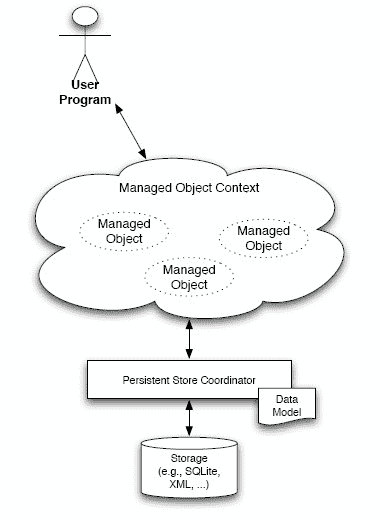

**图 1-1.** *Core Data 组件概览*

就像我们需要一个宜居的环境才能生存一样，托管对象必须存在于一个适合它们生存的环境中，通常称为*托管对象上下文*，或简称为*上下文*。上下文不仅会跟踪你正在更改的对象的状态，还会跟踪所有依赖于它或它所依赖的对象的状态。你应用程序中的 `NSManagedObjectContext` 对象提供了这个上下文，并且是你的代码必须始终能够访问的关键属性。你通常通过让应用程序委托初始化 `NSManagedObjectContext` 对象并将其作为其属性之一暴露给应用程序，来实现对该对象的访问。你的应用程序上下文通常也会将 `NSManagedObjectContext` 对象提供给主视图控制器。没有上下文，你将无法与 Core Data 交互。


### 创建新项目

首先，启动`Xcode`，通过菜单选择`File`  `New`  `New Project`来创建一个新项目。请注意，你也可以通过按下  +  +`N` 来创建新项目。从应用程序模板列表中，在左侧的`iOS`下选择`Application`项，然后在右侧选择`Master-Detail Application`。点击`Next`，在下一个屏幕的`Product Name`字段中输入`BasicApplication`，在`Company Identifier`字段中输入`book.coredata`，取消勾选`Use Storyboard`，并勾选`Use Core Data`。参见图 1-2。点击`Next`按钮，选择`Xcode`将创建`BasicApplication`目录和项目的父目录，然后点击`Create`。`Xcode`会创建你的项目，生成项目文件，并在其 IDE 窗口中打开所有生成的文件，如图 1-3 所示。

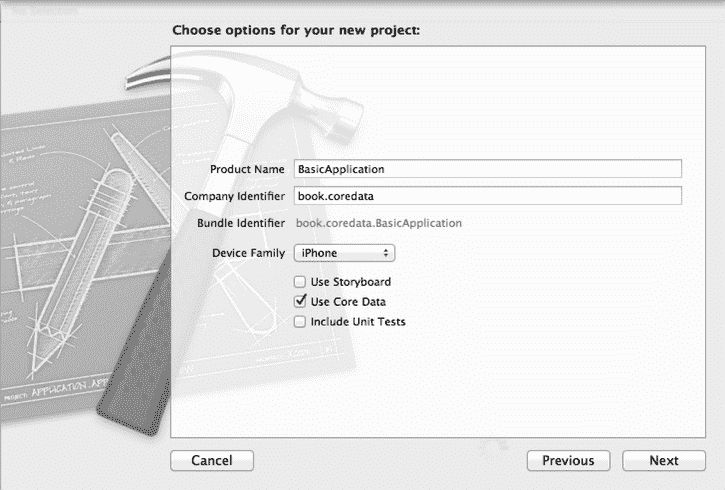

**图 1-2.** *使用 Core Data 创建新项目*

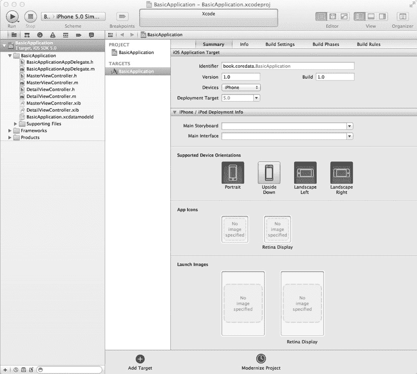

**图 1-3.** *Xcode 显示你的新项目*

### 运行新项目

在深入研究代码之前，先运行它看看效果。点击`Run`按钮启动应用程序。`iPhone Simulator`会打开，应用程序会显示基于导航的界面，如图 1-4 所示，其中表格视图占据了屏幕大部分区域，左上角有一个`Edit`按钮，右上角是常规的、用加号表示的`Add`按钮。应用程序的表格显示了一个空列表，表明应用程序没有识别到任何事件，这正是生成的`Xcode Core Data`项目所存储的状态。通过点击应用程序右上角的加号按钮，创建一个带有当前时间戳的新事件。

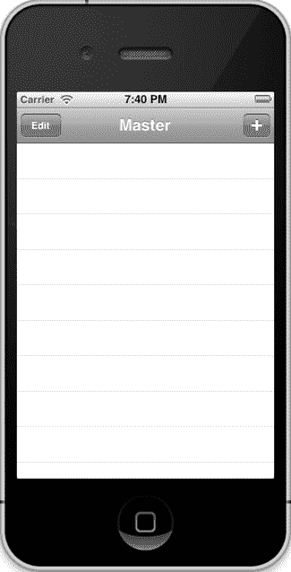

**图 1-4.** *带有空白屏幕的基础应用程序*

现在，点击`Xcode IDE`中的`Stop`按钮停止应用程序。如果应用程序没有使用 Core Data 持久化存储，那么退出时就会丢失刚刚创建的事件。在没有持久化存储的情况下使用此应用维护一个事件列表将是一项西绪福斯式的任务——你必须在每次启动应用时重新创建这些事件。然而，由于应用程序使用了持久化存储，它通过`Core Data`框架保存了你创建的事件。重新启动应用程序后，事件依然存在，如图 1-5 所示。

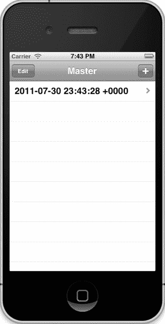

**图 1-5.** *包含持久化事件的基础应用程序*

### 理解应用程序的组件

该应用程序的结构相对简单。它包含一个描述数据存储中实体的数据模型，一个促进视图与数据存储交互的视图控制器，以及一个帮助初始化和启动应用程序的应用委托。图 1-6 展示了涉及的类以及它们之间的关系。

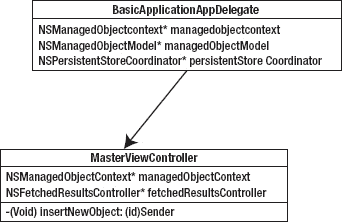

**图 1-6.** *BasicApplication 示例中涉及的类*

注意负责管理用户界面的`MasterViewController`类拥有一个指向托管对象上下文的句柄，以便与 Core Data 交互。当你阅读代码时，你会发现`MasterViewController`类是从应用委托中获取托管对象上下文的。这发生在控制器的`initWithNibName:bundle:`方法中，如下所示：

```
- (id)initWithNibName:(NSString *)nibNameOrNil bundle:(NSBundle *)nibBundleOrNil
{
  self = [super initWithNibName:nibNameOrNil bundle:nibBundleOrNil];
  if (self) {
    self.title = NSLocalizedString(@"Master", @"Master");
    id delegate = [[UIApplication sharedApplication] delegate];
    self.managedObjectContext = [delegate managedObjectContext];
  }
  return self;
}
```

名为`BasicApplication.xcdatamodeld`的入口（实际上文件系统中的一个目录）包含数据模型`BasicApplication.xcdatamodel`。数据模型是每个 Core Data 应用程序的核心。这个特定的数据模型仅为应用程序定义了一个名为`Event`的实体。`Events`被定义为仅包含一个名为`timeStamp`、类型为`Date`的属性的实体，如图 1-7 所示。

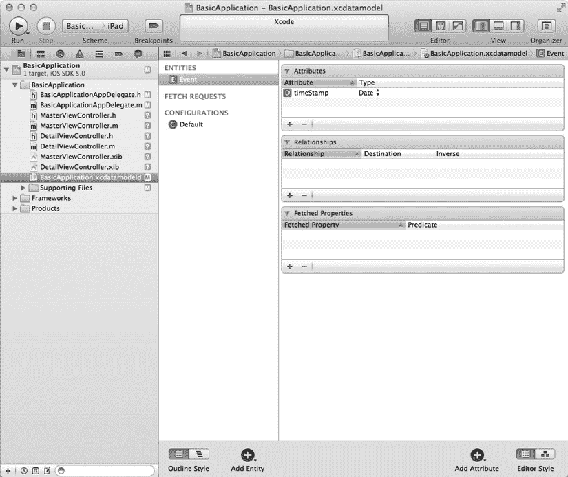

**图 1-7.** *Xcode 生成的数据模型*

`Event`实体的类型是`NSManagedObject`，这是 Core Data 管理的所有实体的基本类型。第 2 章将更详细地解释`NSManagedObject`类型。


### 获取结果

下一个值得关注的类是`MasterViewController`。打开它的头文件（`MasterViewController.h`）会看到两个属性：

```
@property (strong, nonatomic) NSFetchedResultsController *fetchedResultsController;
@property (strong, nonatomic) NSManagedObjectContext *managedObjectContext;
```

这些属性的定义语法与任何 Objective-C 类属性相同。`NSFetchedResultsController`是 Core Data 框架提供的一种控制器类型，用于帮助管理查询结果。`NSManagedObjectContext`则是应用持久化存储的一个句柄，它提供了一个上下文或环境，供托管对象在其中存在。

`MasterViewController`的实现（位于`MasterViewController.m`中）展示了如何与 Core Data 框架交互以存储和检索数据。`MasterViewController`的实现为`fetchedResultsController`属性提供了一个显式的 getter 方法，该方法预先配置了该属性，以便从数据存储中获取数据。

创建获取控制器的第一步是创建一个用于检索`Event`实体的请求，如下面来自`fetchedResultsController`访问器的代码所示：

```
NSFetchRequest *fetchRequest = [[NSFetchRequest alloc] init];
NSEntityDescription *entity = [NSEntityDescription entityForName:@"Event"
 inManagedObjectContext:self.managedObjectContext];
[fetchRequest setEntity:entity];
```

请求的结果可以使用 Cocoa Foundation 框架中的排序描述符进行排序。排序描述符定义了用于排序的字段以及排序是升序还是降序。在本例中，按时间倒序排序，如下所示：

```
NSSortDescriptor *sortDescriptor = [[NSSortDescriptor alloc] initWithKey:
@"timeStamp" ascending:NO];
NSArray *sortDescriptors = [[NSArray alloc] initWithObjects:sortDescriptor, nil];
[fetchRequest setSortDescriptors:sortDescriptors];
```

一旦定义了请求，就可以用它来构建获取控制器。由于`MasterViewController`实现了`NSFetchedResultsControllerDelegate`，因此它可以被设置为`NSFetchedResultsController`的委托，以便在结果集发生变化时自动收到通知，并相应地更新其视图。你也可以通过调用托管对象上下文的`executeFetchRequest`方法获得相同的结果，但这样你就无法享受到使用`NSFetchedResultsController`带来的其他优势，例如与`UITableView`的无缝集成，稍后你将在本节和第 9 章中看到这一点。以下是构建获取控制器的代码：

```
NSFetchedResultsController *aFetchedResultsController = [[NSFetchedResultsController
 alloc] initWithFetchRequest:fetchRequest managedObjectContext:
self.managedObjectContext sectionNameKeyPath:nil cacheName:@"Master"];
aFetchedResultsController.delegate = self;
self.fetchedResultsController = aFetchedResultsController;
```

**注意：** 你可能已经注意到，前面的`initWithFetchRequest`使用了一个名为`cacheName`的参数。你可以将`cacheName`参数设为`nil`来阻止缓存，但指定一个缓存名称则告诉 Core Data 去检查是否存在一个名称匹配的缓存，并查看它是否已经包含了相同的获取请求定义。如果找到匹配，它将重用缓存的结果。如果找到同名缓存条目但请求不匹配，则该缓存会被删除。如果完全找不到，则执行该请求，并为下次使用创建缓存条目。这显然是一种优化，旨在防止重复执行相同的请求。Core Data 会智能地管理其缓存，以便如果结果被其他调用更新，受影响的缓存会被移除。

最后，你需要指示控制器执行其查询以开始检索结果。为此，请使用`performFetch`方法。

```
NSError *error = nil;
if (![self.fetchedResultsController performFetch:&error]) {
  NSLog(@"Unresolved error %@, %@", error, [error userInfo]);
  abort();
}
```

你可以在代码清单 1–1 中看到`fetchedResultsController`的完整 getter 方法。

**代码清单 1–1.** fetchedResultsController 的完整 Getter 方法

```
- (NSFetchedResultsController *)fetchedResultsController
{
  if (__fetchedResultsController != nil)
  {
    return __fetchedResultsController;
  }

  /*
   设置获取结果控制器。
   */
  // 为实体创建获取请求。
  NSFetchRequest *fetchRequest = [[NSFetchRequest alloc] init];
  // 根据实际情况编辑实体名称。
  NSEntityDescription *entity = [NSEntityDescription entityForName:@"Event" inManagedObjectContext:self.managedObjectContext];
  [fetchRequest setEntity:entity];

  // 将批处理大小设置为合适的数值。
  [fetchRequest setFetchBatchSize:20];

  // 根据实际情况编辑排序键。
  NSSortDescriptor *sortDescriptor = [[NSSortDescriptor alloc] initWithKey:@"timeStamp" ascending:NO];
  NSArray *sortDescriptors = [[NSArray alloc] initWithObjects:sortDescriptor, nil];

  [fetchRequest setSortDescriptors:sortDescriptors];

  // 根据实际情况编辑分区名称键路径和缓存名称。
  // 分区名称键路径为 nil 表示“无分区”。
  NSFetchedResultsController *aFetchedResultsController = [[NSFetchedResultsController
alloc] initWithFetchRequest:fetchRequest managedObjectContext:self.managedObjectContext
sectionNameKeyPath:nil cacheName:@"Master"];
  aFetchedResultsController.delegate = self;
  self.fetchedResultsController = aFetchedResultsController;

        NSError *error = nil;
        if (![self.fetchedResultsController performFetch:&error])
  {
    /*
     用能恰当处理错误的代码替换此实现。

     abort() 会导致应用程序生成崩溃日志并终止。虽然此函数在开发过程中可能有用，但不应在正式发布的应用程序中使用。如果无法从错误中恢复，请显示一个警告面板，指示用户通过按 Home 键退出应用程序。
     */
    NSLog(@"Unresolved error %@, %@", error, [error userInfo]);
    abort();
        }

  return __fetchedResultsController;
}   
```

`NSFetchedResultsController`的行为类似于托管对象的集合，与`NSArray`类似，这使得它易于使用。事实上，它公开了一个名为`fetchedObjects`的只读属性，该属性的类型是`NSArray`，这使得访问它获取的对象更加容易。同样继承自`UITableViewController`的`MasterViewController`类，正好演示了`NSFetchedResultsController`在管理表格内容方面的优越性。


#### 插入新对象

快速浏览`insertNewObject:`方法，即可了解如何创建新事件（托管对象）并将其添加到持久化存储中。托管对象由数据模型中的实体描述定义，并且只能存在于上下文之中。第一步是获取当前上下文以及实体定义。在本例中，你无需显式命名实体，而是复用已附加到获取结果控制器中的实体定义：

```
NSManagedObjectContext *context = [self.fetchedResultsController managedObjectContext];
NSEntityDescription *entity = [[self.fetchedResultsController fetchRequest] entity];
```

既然已经收集了创建新托管对象所需的所有元素，接下来就可以创建`Event`对象并设置其`timeStamp`值。

```
NSManagedObject *newManagedObject = [NSEntityDescription
    insertNewObjectForEntityForName:[entity name] inManagedObjectContext:context];
[newManagedObject setValue:[NSDate date] forKey:@"timeStamp"];
```

该过程的最后一步是告知 Core Data 将更改保存到其上下文中。显而易见的更改是你刚刚创建的对象，但请记住，调用`save:`方法也会影响上下文中其他任何未保存的更改。

```
NSError *error = nil;
if (![context save:&error]) {
    NSLog(@"Unresolved error %@, %@", error, [error userInfo]);
    abort();
}
```

插入新`Event`对象的完整方法如列表 1–2 所示。

**列表 1–2.** *插入新事件对象的完整方法*

```
- (void)insertNewObject {
    // 创建由获取结果控制器管理的实体的一个新实例。
    NSManagedObjectContext *context = [self.fetchedResultsController managedObjectContext];
    NSEntityDescription *entity = [[self.fetchedResultsController fetchRequest] entity];
    NSManagedObject *newManagedObject = [NSEntityDescription insertNewObjectForEntityForName:[entity name] inManagedObjectContext:context];

    // 如果合适，配置新托管对象。
    // 通常应使用存取方法，但此处使用 KVC 可避免向模板中添加自定义类。
    [newManagedObject setValue:[NSDate date] forKey:@"timeStamp"];

    // 保存上下文。
    NSError *error = nil;
    if (![context save:&error]) {
        NSLog(@"Unresolved error %@, %@", error, [error userInfo]);
        abort();
    }
}
```

#### 初始化托管上下文

显然，如果不先初始化托管上下文，上述所有操作都无法进行。这是应用程序委托的职责。在启用 Core Data 的应用程序中，委托必须暴露三个属性。

```
@property (readonly, strong, nonatomic) NSManagedObjectContext *managedObjectContext;
@property (readonly, strong, nonatomic) NSManagedObjectModel *managedObjectModel;
@property (readonly, strong, nonatomic) NSPersistentStoreCoordinator *persistentStoreCoordinator;
```

请注意，它们都被标记为只读，这可以防止应用程序中的任何其他组件直接设置它们。仔细查看`BasicApplicationAppDelegate.m`会发现，这三个属性都有显式的 getter 方法。

首先，托管对象模型从数据模型（`BasicApplication.xcdatamodel`）派生并加载。

```
- (NSManagedObjectModel *)managedObjectModel
{
    if (__managedObjectModel != nil) {
        return __managedObjectModel;
    }
    NSURL *modelURL = [[NSBundle mainBundle] URLForResource:@"BasicApplication" withExtension:@"momd"];
    __managedObjectModel = [[NSManagedObjectModel alloc] initWithContentsOfURL:modelURL];
    return __managedObjectModel;
}
```

然后，创建一个持久化存储来支持该模型。在本例中，与大多数 Core Data 场景一样，持久化存储由 SQLite 数据库提供支持。托管对象模型是数据存储的逻辑表示，而持久化存储则是该数据存储的具体实现。

```
- (NSPersistentStoreCoordinator *)persistentStoreCoordinator {
    if (__persistentStoreCoordinator != nil) {
        return __persistentStoreCoordinator;
    }

    NSURL *storeURL = [[self applicationDocumentsDirectory] URLByAppendingPathComponent:@"BasicApplication.sqlite"];

    NSError *error = nil;
    __persistentStoreCoordinator = [[NSPersistentStoreCoordinator alloc] initWithManagedObjectModel:[self managedObjectModel]];
    if (![__persistentStoreCoordinator addPersistentStoreWithType:NSSQLiteStoreType configuration:nil URL:storeURL options:nil error:&error]) {
        NSLog(@"Unresolved error %@, %@", error, [error userInfo]);
        abort();
    }

    return __persistentStoreCoordinator;
}
```

最后，创建托管对象上下文。

```
- (NSManagedObjectContext *)managedObjectContext {
    if (__managedObjectContext != nil) {
        return __managedObjectContext;
    }

    NSPersistentStoreCoordinator *coordinator = [self persistentStoreCoordinator];
    if (coordinator != nil) {
        __managedObjectContext = [[NSManagedObjectContext alloc] init];
        [__managedObjectContext setPersistentStoreCoordinator:coordinator];
    }
    return __managedObjectContext;
}
```

该上下文在整个应用程序中被用作与 Core Data 框架和持久化存储交互的唯一接口，如图 1–8 所示。

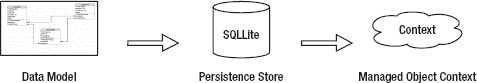

**图 1–8.** *Core Data 初始化序列*

最后，当应用程序委托的`application:didFinishLaunchingWithOptions:`方法被调用时，一切开始运作。

```
- (BOOL)application:(UIApplication *)application didFinishLaunchingWithOptions:(NSDictionary *)launchOptions
{
    self.window = [[UIWindow alloc] initWithFrame:[[UIScreen mainScreen] bounds]];
    // 应用程序启动后的自定义覆盖点。

    MasterViewController *controller = [[MasterViewController alloc] initWithNibName:@"MasterViewController" bundle:nil];
    self.navigationController = [[UINavigationController alloc] initWithRootViewController:controller];
    self.window.rootViewController = self.navigationController;
    [self.window makeKeyAndVisible];
    return YES;
}
```

调用委托的`managedObjectContext`属性的 getter 方法会触发一系列连锁反应：`- (NSManagedObjectContext *)managedObjectContext`调用`- (NSPersistentStoreCoordinator *)persistentStoreCoordinator`，后者再调用`- (NSManagedObjectModel *)managedObjectModel`。因此，对`managedObjectContext`的调用会初始化整个 Core Data 栈，并使 Core Data 处于就绪状态。

如果你在机器上跟随 Xcode 进行操作，那么你已经有了一个基于 Xcode 模板生成的基本 Core Data 应用程序，可以运行它来创建、存储和检索事件数据。但是，如果你有一个现有的应用程序，并希望为其添加 Core Data 的强大功能，该怎么办呢？下一节将演示如何向现有的 iOS 应用程序添加 Core Data。


### 将 Core Data 添加到现有项目

并非总能像上一节所示那样，创建一个新应用并勾选“使用 Core Data”复选框。开发者们常常是先启动一个项目，编写大量代码，之后才意识到自己的应用需要 Core Data。我们认识一些开发者，他们拒绝承认应该手动将 Core Data 添加到现有应用中。他们非但不尝试去理解如何使用这个框架，反而受一种想要证明自己能写出更优秀持久化层的欲望驱使，踏上了曲折迂回的编程之路，结果却差强人意。他们把“坚持”和“固执”混为一谈。为了让这一转变更加轻松，本节将解释改造一个应用，使其能够识别并使用 Core Data 所需的具体步骤。

启用一个应用以利用 Core Data 分为三个步骤。

1.  添加 Core Data 框架。
2.  创建数据模型。
3.  初始化托管对象上下文。

接下来的三小节将引导您完成这三个步骤，以便您能为任何现有的 iOS 应用添加 Core Data 支持。

#### 添加 Core Data 框架

在 Objective-C 的世界里，库被称为*框架*。展开 Xcode 源代码树中的“Frameworks”分组，可以看到项目只识别少数几个框架。典型的 iOS 应用至少会包含 UIKit（iOS 的用户界面框架）、Foundation 和 Core Graphics。将 Core Data 添加到现有应用的第一步，就是通过将该框架添加到项目中来让应用识别它。为此，请执行以下步骤：

1.  在 Xcode 左侧选择项目，此时右侧会显示目标设置（见图 1-9）。
2.  选择第四个标签页“Build Phases”，并展开名为“Link Binary With Libraries”的部分（见图 1-10）。
3.  点击该部分下方的 + 按钮，查看可添加的框架列表（见图 1-11）。
4.  选择 `CoreData.framework` 并点击“Add”按钮。
5.  （可选）将项目源代码列表中的 `CoreData.framework` 条目拖动到“Frameworks”文件夹中。

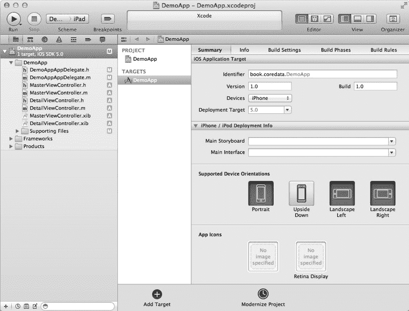

**图 1-9.** *选择项目以查看目标设置*

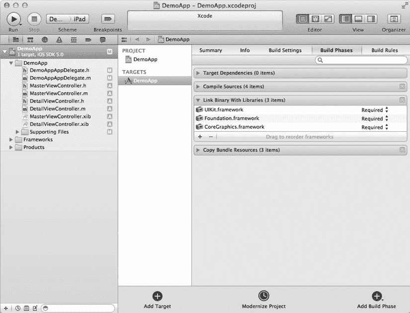

**图 1-10.** *查看“Link Binary With Libraries”设置*

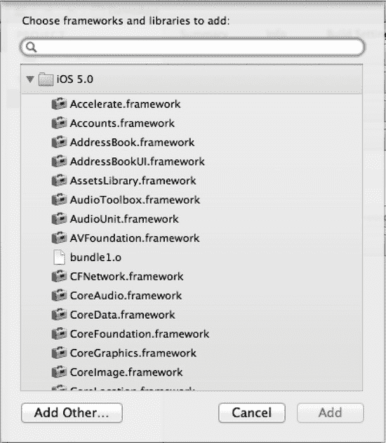

**图 1-11.** *选择要链接的框架*

`CoreData.framework` 现在已列在 Xcode 的左侧。由于应用现在能够识别 Core Data 框架，因此可以使用该框架特有的类，而不会产生编译错误。

#### 创建数据模型

没有数据模型的 Core Data 应用是不完整的。数据模型描述了将由框架管理的所有实体。为简单起见，本节创建的模型只包含一个具有单一属性的类。可以在 Xcode 中通过选择菜单中的 `File`  `New`  `New File`，然后从 iOS Core Data 模板中选取“Data Model”类型来创建数据模型，如图 1-12 所示。点击“Next”，将数据模型命名为 `MyModel.xcdatamodeld`，如图 1-13 所示，然后点击“Save”。这将生成您的新数据模型并在 Xcode 中打开它（见图 1-14）。

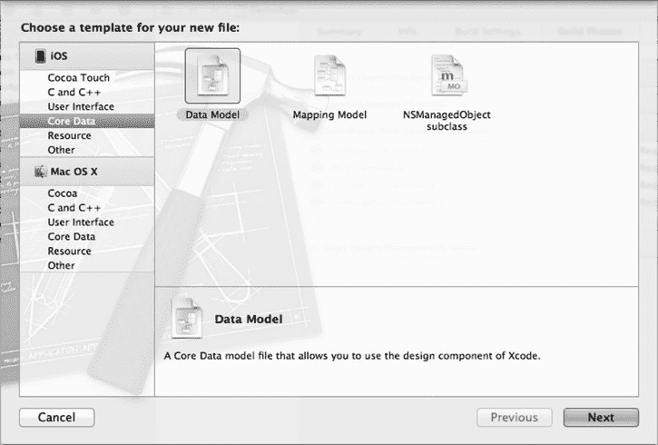

**图 1-12.** *添加数据模型*

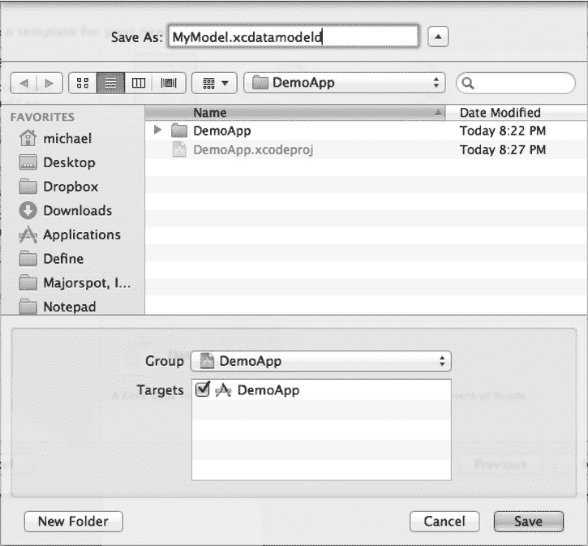

**图 1-13.** *命名您的数据模型*

一旦数据模型打开，您可以通过点击 Xcode 窗口底部的“Add Entity”按钮来添加实体。您可以通过选择一个实体，然后按住“Add Entity”按钮右侧的“Add Attribute”按钮，并从下拉菜单中选择属性类型（属性、关系或抓取属性）来向实体添加属性。Xcode 会更改此按钮的标签以匹配您上次添加的属性类型。只需点击该按钮即可添加该类型的属性。在此示例中，创建一个名为 `MyData` 的单个实体，并为其添加一个名为 `myAttribute`、类型为 `String` 的单个属性，如图 1-15 所示。

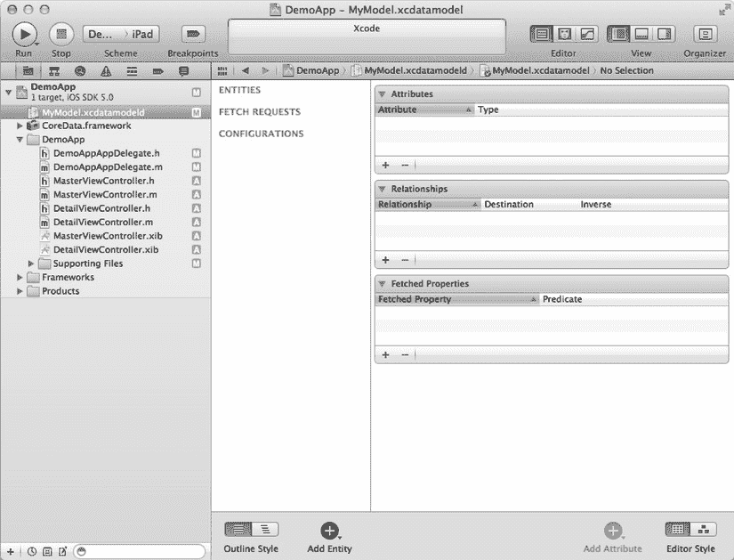

**图 1-14.** *您新建的空数据模型*

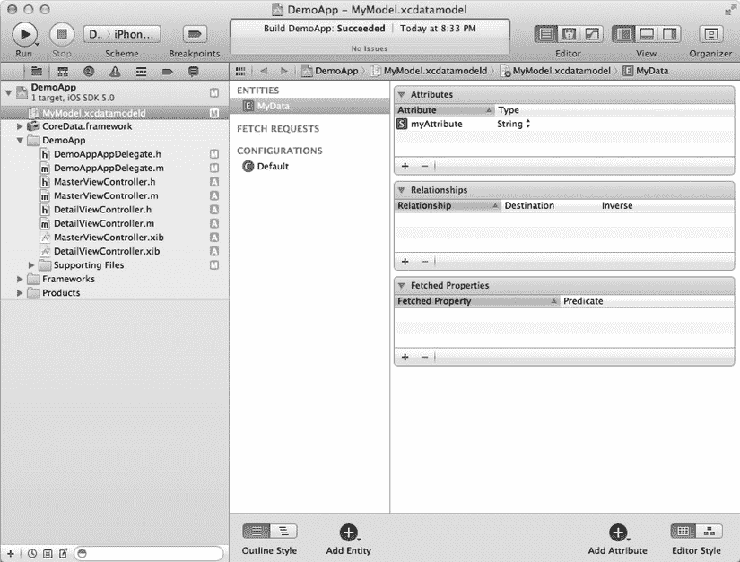

**图 1-15.** *添加实体和属性*


### 初始化托管对象上下文

最后一步是初始化托管对象上下文、持久化数据存储和对象模型。通常你可以添加与 Xcode 在创建项目时选择使用 Core Data 会生成的相同代码：将这些组件定义为应用程序委托中的属性，声明一个`saveContext`方法，以及声明一个获取用于存储 Core Data 数据库文件的应用程序文档目录的辅助方法。你的`DemoAppAppDelegate.h`文件应该如代码清单 1-3 所示。

**代码清单 1-3.** *DemoAppAppDelegate.h 文件*

```
#import <UIKit/UIKit.h>
#import <CoreData/CoreData.h>

@interface DemoAppAppDelegate : UIResponder <UIApplicationDelegate> {

}

@property (strong, nonatomic) UIWindow *window;
@property (strong, nonatomic) UINavigationController *navigationController;

@property (nonatomic, retain, readonly) NSManagedObjectContext *managedObjectContext;
@property (nonatomic, retain, readonly) NSManagedObjectModel *managedObjectModel;
@property (nonatomic, retain, readonly) NSPersistentStoreCoordinator *persistentStoreCoordinator;

- (void)saveContext;
- (NSURL *)applicationDocumentsDirectory;

@end
```

切换到实现文件（`DemoAppAppDelegate.m`）。首先为新属性添加`@synthesize`行，如下所示：

```
@synthesize managedObjectContext=__managedObjectContext;
@synthesize managedObjectModel=__managedObjectModel;
@synthesize persistentStoreCoordinator=__persistentStoreCoordinator;
```

上一节展示了上下文是由物理数据存储创建的，而物理数据存储又是由数据模型创建的。初始化顺序保持不变，从你刚刚定义的模型加载对象模型开始。

```
- (NSManagedObjectModel *)managedObjectModel {
  if (__managedObjectModel != nil) {
    return __managedObjectModel;
  }
  NSURL *modelURL = [[NSBundle mainBundle] URLForResource:@"MyModel" withExtension:@"momd"];
  __managedObjectModel = [[NSManagedObjectModel alloc] initWithContentsOfURL:modelURL];
  return __managedObjectModel;
}
```

现在你已经加载了对象模型，可以利用它来创建持久化存储处理器。此示例使用`NSSQLiteStoreType`来指示存储机制应依赖于 SQLite 数据库，如下所示：

```
- (NSPersistentStoreCoordinator *)persistentStoreCoordinator {
  if (__persistentStoreCoordinator != nil) {
    return __persistentStoreCoordinator;
  }

  NSURL *storeURL = [[self applicationDocumentsDirectory] URLByAppendingPathComponent:@"DemoApp.sqlite"];

  NSError *error = nil;
  __persistentStoreCoordinator = [[NSPersistentStoreCoordinator alloc] initWithManagedObjectModel:[self managedObjectModel]];
  if (![__persistentStoreCoordinator addPersistentStoreWithType:NSSQLiteStoreType configuration:nil URL:storeURL options:nil error:&error]) {
    NSLog(@"Unresolved error %@, %@", error, [error userInfo]);
    abort();
  }
  return __persistentStoreCoordinator;
}
```

请注意，这段代码依赖于辅助方法`applicationDocumentsDirectory`来确定在哪里存储 SQLite 文件；稍后你将定义该方法。

接下来，从你刚刚定义的持久化存储初始化上下文。

```
- (NSManagedObjectContext *)managedObjectContext {
  if (__managedObjectContext != nil) {
    return __managedObjectContext;
  }

  NSPersistentStoreCoordinator *coordinator = [self persistentStoreCoordinator];
  if (coordinator != nil) {
    __managedObjectContext = [[NSManagedObjectContext alloc] init];
    [__managedObjectContext setPersistentStoreCoordinator:coordinator];
  }
  return __managedObjectContext;
}
```

为了完成在应用程序中准备使用 Core Data 的工作，你必须实现`applicationDocumentsDirectory`方法和`saveContext`方法。同样，你可以克隆 Xcode 生成的内容，如下所示：

```
- (NSURL *)applicationDocumentsDirectory {
  return [[[NSFileManager defaultManager] URLsForDirectory:NSDocumentDirectory inDomains:NSUserDomainMask] lastObject];
}

- (void)saveContext {
  NSError *error = nil;
  NSManagedObjectContext *managedObjectContext = self.managedObjectContext;
  if (managedObjectContext != nil) {
    if ([managedObjectContext hasChanges] && ![managedObjectContext save:&error]) {
      NSLog(@"Unresolved error %@, %@", error, [error userInfo]);
      abort();
    }
  }
}
```

配置好 Core Data 后，应用程序现在可以使用托管对象上下文来存储和检索实体。让我们用一个简单的示例来演示这个过程：应用程序持久化并显示其被启动的次数。

在应用程序委托实现文件`DemoAppAppDelegate.m`中，编辑`didFinishLaunchingWithOptions:`方法，添加代码以检索之前的启动次数并添加新的启动事件。

**注意：** 尽管托管对象上下文、持久化存储协调器和托管对象模型通常是应用程序委托的成员，但存储和检索数据的代码通常放在与数据视图相对应的控制器中。这里将存储和检索条目的代码直接添加到应用程序委托中，只是为了方便和简单。在实际应用程序中，这类代码很可能属于控制器。

检索之前启动次数的代码会获取上下文并执行一个请求来获取类型为`MyData`的实体。

```
NSManagedObjectContext *context = [self managedObjectContext];
NSFetchRequest *request = [[NSFetchRequest alloc] init];
NSEntityDescription *entity = [NSEntityDescription entityForName:@"MyData" inManagedObjectContext:context];
[request setEntity:entity];
NSArray *results = [context executeFetchRequest:request error:nil];
```

然后你可以遍历结果数组来显示之前的启动次数。

```
for (NSManagedObject *object in results) {
  NSLog(@"Found %@", [object valueForKey:@"myAttribute"]);
}
```

**注意：** 与托管对象属性交互的一种方式是使用键/值对通用访问器方法。`[object valueForKey:@"myAttribute"]`将检索`myAttribute`的值，而`[object setValue:@"theValue" forKey:@"myAttribute"]`将设置`myAttribute`的值。

最后，在让应用程序继续正常执行之前，向上下文添加一个新条目，并使用之前实现的`saveContext`方法将新条目保存到持久化存储中。

```
NSString *launchTitle = [NSString stringWithFormat:@"launch %d", [results count]];
NSManagedObject *object = [NSEntityDescription insertNewObjectForEntityForName:[entity name] inManagedObjectContext:context];
[object setValue:launchTitle forKey:@"myAttribute"];
[self saveContext];
NSLog(@"Added: %@", launchTitle);
```

首次启动应用程序会产生以下输出：

```
2011–02-25 05:13:23.783 DemoApp[2299:207] Added: launch 0
```

第二次启动时会显示之前的启动记录：

```
2011–02-25 05:15:48.883 DemoApp[2372:207] Found launch 0
2011–02-25 05:15:48.889 DemoApp[2372:207] Added: launch 1
```

应用程序委托实现文件中的完整方法如代码清单 1-4 所示。

**代码清单 1-4.** *应用程序委托实现文件中的完整方法*


`- (BOOL)application:(UIApplication *)application didFinishLaunchingWithOptions:(NSDictionary *)launchOptions {
    // 从 Core Data 获取启动记录
    NSManagedObjectContext *context = [self managedObjectContext];
    NSFetchRequest *request = [[NSFetchRequest alloc] init];
    NSEntityDescription *entity = [NSEntityDescription entityForName:@"MyData" inManagedObjectContext:context];
    [request setEntity:entity];
    NSArray *results = [context executeFetchRequest:request error:nil];

    // 遍历结果并打印日志
    for (NSManagedObject *object in results) {
        NSLog(@"找到 %@", [object valueForKey:@"myAttribute"]);
    }

    // 为本次启动添加新条目
    NSString *launchTitle = [NSString stringWithFormat:@"启动 %d", [results count]];
    NSManagedObject *object = [NSEntityDescription insertNewObjectForEntityForName:[entity name] inManagedObjectContext:context];
    [object setValue:launchTitle forKey:@"myAttribute"];
    [self saveContext];
    NSLog(@"已添加: %@", launchTitle);

    [self.window makeKeyAndVisible];
    return YES;
}`

此前对 Core Data 一无所知的现有应用程序，现已通过最少的改造，装备了强大的数据存储管理框架。按照以下步骤，即可将 Core Data 的强大功能添加到任何现有应用程序中。

### 总结

无论是从零开始构建 iOS 应用程序，还是为现有 iOS 应用程序添加持久化功能，你都应强烈考虑使用 Apple 的 Core Data 框架。通过使用 Xcode 的模板和代码生成，可以快速入门 Core Data，或者你也可以手动添加 Core Data。无论采用哪种方式，Core Data 都提供了一个持久化层，它抽象了数据存储和检索的大部分复杂性，并允许你以对象图的形式可靠地处理数据。

本章概述了 Core Data 的各种类，以及它们如何协同工作——从上下文到托管对象，再到持久化存储及其协调器。你初步了解了获取结果控制器及其工作原理，但仅看到了简单的示例。下一章将更深入地剖析 Core Data 框架，揭示各个类及其内部工作机制，以便你精确掌握如何使用 Core Data 来持久化用户数据。

## 第 2 章

## 理解 Core Data

许多开发者在初次接触 Core Data 时，会认为它及其相关的类是一团乱麻，反而阻碍而非增强了数据访问。或许他们是 Rails 开发者，习惯于通过拼凑方法名来创建动态查找器，让“约定优于配置”来处理数据访问的繁琐工作。又或许他们是 Java 开发者，一直使用注解来配置企业 JavaBeans (EJB) 或使用 Hibernate 来处理普通的旧式 Java 对象 (POJO)。无论其背景如何，许多开发者不会自然而然地接受 Core Data 框架或其处理数据的方式，就像许多开发者在初次接触 Interface Builder 及其构建用户界面时创建的动态对象时感到不适一样。我们建议你保持耐心和开放的心态，并向你保证 Core Data 框架绝非一个鲁布·戈德堡机械。该框架中的各类协同工作，宛若 1980 年代拉里·伯德领衔的波士顿凯尔特人队在阵地进攻中的配合，一旦你理解了它们，就能看到其精妙与严谨。

本章将解释 Core Data 框架中的各个类，既有单独介绍，也有对其协同工作方式的说明。请花时间阅读每个类的介绍，追溯它们如何协同工作，并动手输入和理解示例。

### Core Data 框架类

第 1 章引导你完成了让应用程序搭载 Core Data 的简单步骤。你看到了一些代码片段，了解了要使用哪些类，并发现了要使 Core Data 工作需要调用和传递哪些方法及参数。你忠实地（或许有些盲目地）遵循了第 1 章的建议，同时可能好奇所有这些代码、类、方法和参数背后究竟是什么。阅读上一章的大多数开发者可能都想过，如果将某个参数值替换为另一个会发生什么。其中少数人甚至真的尝试了。在尝试的人中，有一小部分得到了除崩溃以外的结果，而其中又有一部分人确实得到了他们预期中的结果。

著名计算机科学家、因开发编程语言而获得 1972 年图灵奖的爱德格·迪杰斯特拉曾谈到，优雅是决定成败的品质，而非可有可无的奢侈品。Core Data 不仅解决了对象持久化的问题，而且是以优雅的方式解决的。要想在代码中实现优雅，你应该理解 Core Data，而不是仅仅猜测它的工作原理。阅读完本章后，你不仅将详细了解 Core Data 框架的结构，还会明白该框架仅用一小组类就解决了一个复杂问题，使得解决方案简单、清晰而优雅。

在本章中，你将构建一个类图，展示框架中涉及的类以及它们如何交互。你还将看到，有些类属于 Core Data 框架，而另一些则来自其他 Cocoa 框架（如 Foundation 框架）。在构建类图的同时，你还将在 Xcode 中构建一个小型应用程序，该程序处理一个虚构公司的组织结构图。

要跟随本章进行操作，请使用“单视图应用程序”模板创建一个空白 iPhone 应用程序，如图 2–1 所示，并将其命名为 `OrgChart`。

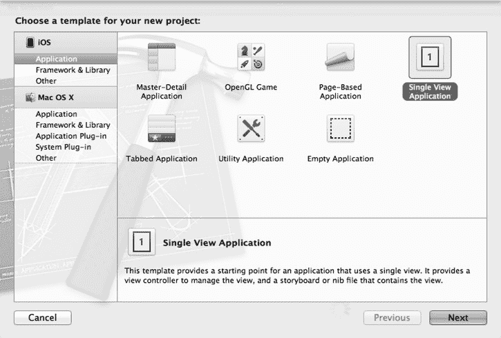

**图 2–1.** *在 Xcode 中创建一个新应用程序。*

按照第 1 章中“向现有项目添加 Core Data”一节的描述，将 Core Data 框架添加到项目中。你的 Xcode 项目应类似图 2–2。启动该应用程序并确保其不会崩溃。它除了显示一个灰色屏幕外什么也不做，但这个空白屏幕意味着你已经准备好继续构建该基于 Core Data 的应用程序的其余部分。

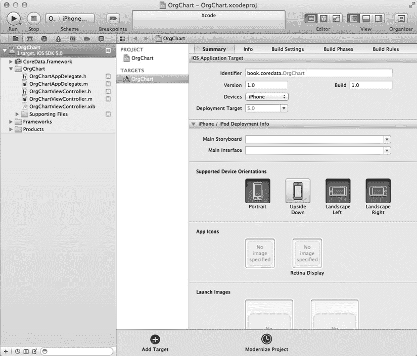

**图 2–2.** *添加了 Core Data 的 Xcode 空白项目*

图 2–3 描绘了你通常与之交互的 Core Data 类。第 1 章讨论了托管对象上下文，它由 `NSManagedObjectContext` 类实现，并包含对 `NSManagedObject` 类型托管对象的引用。

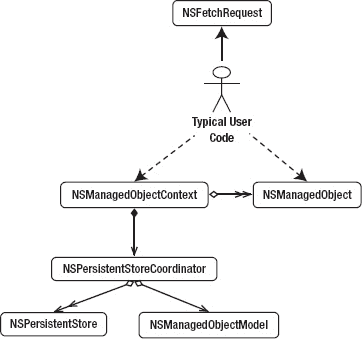

**图 2–3.** *高级概览*

你的代码通过向上下文添加托管对象来存储数据，并通过使用由 `NSFetchRequest` 类实现的获取请求来检索数据。如第 1 章所示，上下文使用持久化存储协调器（由 `NSPersistentStoreCoordinator` 类实现）进行初始化，并由数据模型（由 `NSManagedObjectModel` 类实现）定义。本章的其余部分将讨论这些类是如何创建的、它们如何交互以及如何使用它们。

```objc
`- (BOOL)application:(UIApplication *)application didFinishLaunchingWithOptions:(NSDictionary *)launchOptions {
    // 从 Core Data 获取启动记录
    NSManagedObjectContext *context = [self managedObjectContext];
    NSFetchRequest *request = [[NSFetchRequest alloc] init];
    NSEntityDescription *entity = [NSEntityDescription entityForName:@"MyData" inManagedObjectContext:context];
    [request setEntity:entity];
    NSArray *results = [context executeFetchRequest:request error:nil];

    // 遍历结果并打印日志
    for (NSManagedObject *object in results) {
        NSLog(@"找到 %@", [object valueForKey:@"myAttribute"]);
    }

    // 为本次启动添加新条目
    NSString *launchTitle = [NSString stringWithFormat:@"启动 %d", [results count]];
    NSManagedObject *object = [NSEntityDescription insertNewObjectForEntityForName:[entity name] inManagedObjectContext:context];
    [object setValue:launchTitle forKey:@"myAttribute"];
    [self saveContext];
    NSLog(@"已添加: %@", launchTitle);

    [self.window makeKeyAndVisible];
    return YES;
}`
```


#### 模型定义类

如第 1 章所述，所有 Core Data 应用程序都需要一个对象模型。模型定义了要持久化的实体及其属性。实体具有三种属性：

*   属性（Attributes）
*   关系（Relationships）
*   获取属性（Fetched Properties）

表 2-1 列出了不同的类及其角色的简要描述。遍历这些类以更好地理解模型实例化背后的机制是一项有趣的练习，但在实践中，在 Xcode 中创建模型通常是以图形方式完成的，无需编写一行代码。

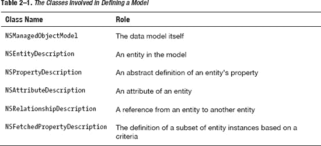

图 2-4 展示了定义模型所涉及的类之间的关系。`NSManagedObjectModel` 持有对零个或多个 `NSEntityDescription` 对象的引用。每个 `NSEntityDescription` 持有对零个或多个 `NSPropertyDescription` 对象的引用。`NSPropertyDescription` 是一个抽象类，具有三个具体实现：

*   `NSAttributeDescription`
*   `NSRelationshipDescription`
*   `NSFetchedPropertyDescription`

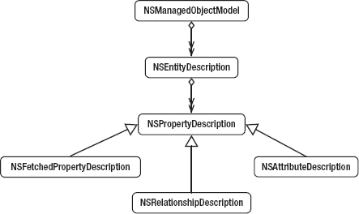

**图 2-4.** *模型定义类*

这一小组类足以定义你在处理 Core Data 项目时将使用的任何对象模型。如第 1 章中更详细的解释，你可以通过在菜单中选择 `File`  `New`  `New File`，并从 iOS Core Data 模板中选择 Data Model 类型，从而在 Xcode 中创建数据模型。在本节中，你将创建一个代表公司组织架构图的模型。在 Xcode 中，创建你的模型并命名为 `OrgChart`。在这个数据模型中，一个组织有一名负责人（首席执行官，即 CEO）。这位负责人有直接下属，而这些下属也可能有自己的直接下属。为简单起见，假设一个人有两个属性：唯一的员工标识符和姓名。你终于准备好开始在 Xcode 中定义数据模型了。

打开数据模型文件，并添加一个新的 `Organization` 实体。与一个人类似，一个组织由唯一标识符和名称定义，因此向 `Organization` 实体添加两个属性。属性是实体的标量属性，这意味着它们是简单的数据持有者，可以包含单个值。属性类型在 `NSAttributeType` 结构中定义，每种类型都会对实体强制实施某些数据约束。例如，如果属性的类型是整数，那么你尝试在该字段中放入字母数字值将会导致错误。表 2-2 列出了不同的类型及其含义。

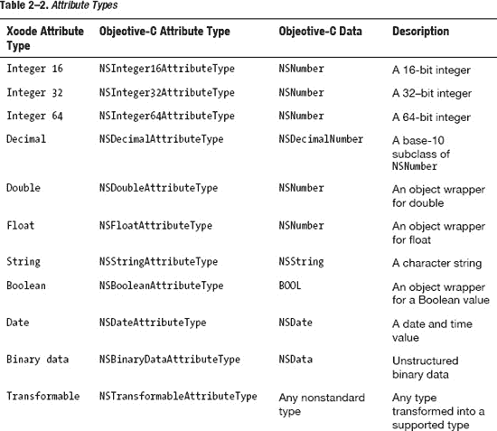

**注意：** 第 5 章将详细阐述 `Transformable` 类型及其使用方法。Transformable 属性是一种告诉 Core Data 你想在托管对象中使用不受支持的数据类型，并且你将提供代码在持久化时将属性数据转换为受支持的类型来帮助 Core Data 的方法。

将第一个属性命名为 `id`，第二个命名为 `name`。默认情况下，新属性的类型设置为 `Undefined`，这特意阻止了代码编译，以强制你为每个属性设置类型。组织标识符总是简单的数字，因此对 `id` 属性使用 `Integer 16` 类型。对 `name` 属性使用 `String` 类型。此时，你的项目应如图图 2-5 所示。

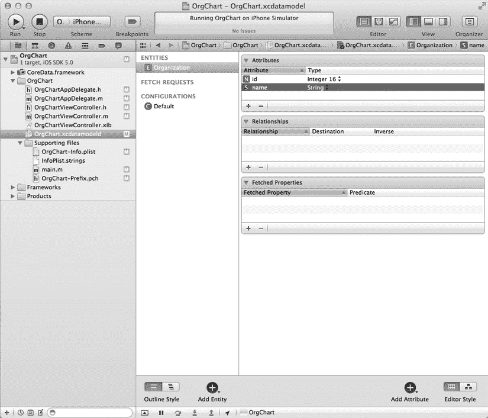

**图 2-5.** *带有 Organization 实体的项目*

此时，如果数据模型被正在运行的程序加载，它将由图图 2-6 所示的对象图表示。

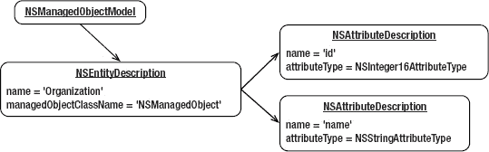

**图 2-6.** *作为对象的组织模型*

该图显示，托管对象模型（类型为 `NSManagedObjectModel`）指向一个实体描述，由名为 `Organization` 的 `NSEntityDescription` 实例表示，该实例对其 `managedObjectClassName` 属性使用了 `NSManagedObject`。该实体描述有两个属性描述（类型为 `NSAttributeDescription`）。每个属性描述有两个属性：`name` 和 `attributeType`。第一个属性描述的 `name` 和 `attributeType` 属性分别具有值 `id` 和 `NSInteger16AttributeType`，而第二个属性则具有值 `name` 和 `NSStringAttributeType`。

以创建 `Organization` 实体相同的方式，创建另一个名为 `Person` 的实体，包含两个属性：`id` 和 `name`。你可以通过创建一个从 `Organization` 实体到 `Person` 实体的关系，并将其命名为 `leader`，从而将组织与其负责人关联起来。一旦这两个实体存在于 Xcode 中，创建关系就像选择源实体（`Organization`），单击并按住“添加属性”按钮直到出现下拉菜单，然后选择“添加关系”一样简单。将新关系命名为 `leader`，并将其目标设置为 `Person`。现在，添加一个从 `Person` 到 `Person` 的关系（是的，从 `Person` 实体回到自身的关系），并将其命名为 `employees`。这定义了一个人到其下属的关系。默认情况下，Xcode 创建一对一关系，这意味着保持默认设置的关系将一个源链接到一个目标。由于一个负责人可以管理许多下属，`Person` 和 `Person` 之间的关系应该是一对多关系。要在 Xcode 中更正此关系，首先通过单击 Xcode 工具栏中“视图”上方最右侧的按钮来显示 Xcode 的实用工具面板，从而显示该关系的属性。然后，单击以显示“数据模型检查器”，方法是单击实用工具面板顶部最右侧的按钮（请参阅图 2-7）。

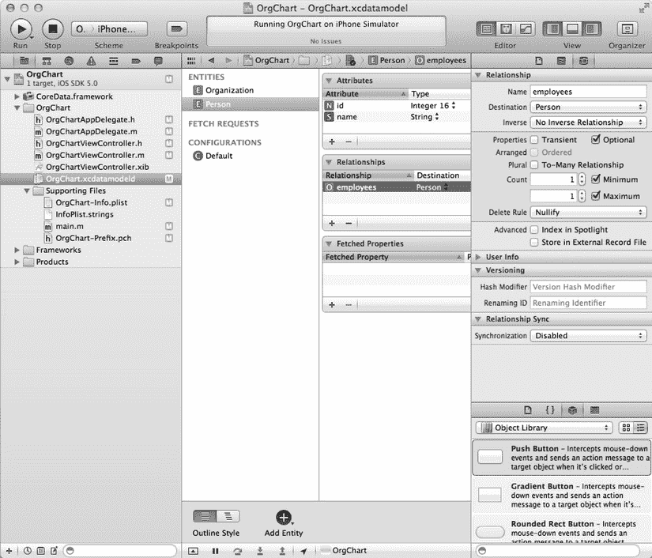

**图 2-7.** *显示关系的属性*

显示属性后，你现在可以通过选中“对多关系”旁边的复选框，将 `employees` 关系更改为一对多关系，如图 2-8 所示。

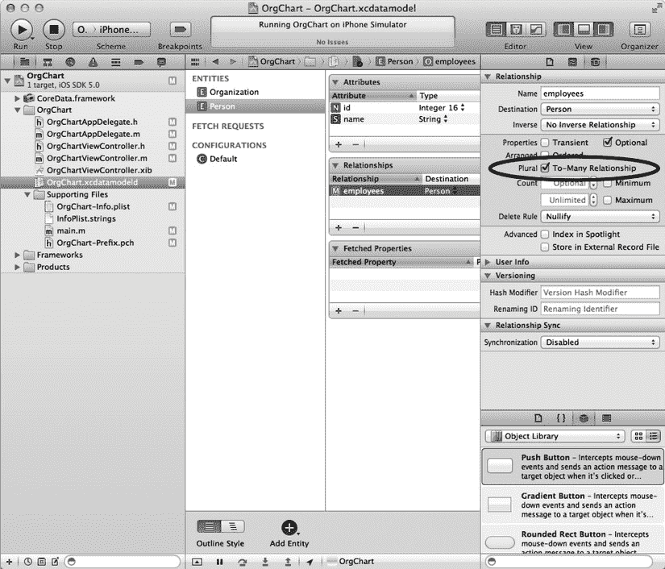

**图 2-8.** *一对多关系*

**注意：** 在本章中，我们想向您展示如何使用模型编辑器设计的数据模型被解释为 Core Data 类。我们在创建模型时有意地走了一些捷径。有关如何创建对象模型的更详细信息，请参考第 4 章。

**注意：** 您可能会注意到 Xcode 抱怨您创建的两个关系，警告您存在一致性错误和配置错误的属性。Xcode 会抱怨缺少反向关系的 Core Data 关系，但这在此应用程序中应该不是问题。缺少反向关系带来的唯一影响是您无法导航反向关系。您可以暂时安全地忽略这些警告。

当前的数据模型如图图 2-9 所示，而图 2-10 显示了 Core Data 将如何把数据模型定义加载到活动对象中。


**图 2-9.** *数据模型*

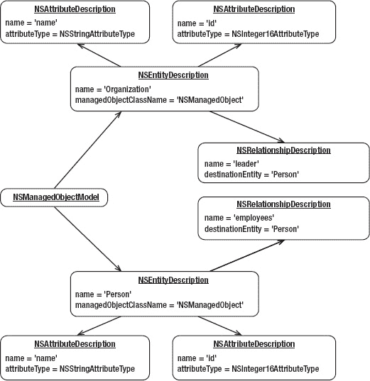

**图 2-10.** *包含 Person 的组织模型*

请注意，图 2-10 中描绘的对象图并未显示 Core Data 存储的对象图。相反，它展示了 Core Data 如何将您以图形方式创建的数据模型解释为可用于创建数据存储模式的对象。让 Core Data 加载数据模型并将其解释为 `NSManagedObjectModel` 的典型方法是通过使用如下代码创建指向数据模型的 URL：


`NSURL *modelURL = [[NSBundle mainBundle] URLForResource:@"OrgChart" withExtension:@"momd"];`

然后，你可以将该 URL 传递给托管对象模型的初始化器来创建模型，从而将对象模型描述加载到内存中。相关代码如下：

`__managedObjectModel = [[NSManagedObjectModel alloc] initWithContentsOfURL:modelURL];`

了解模型如何在 Core Data 内部表示为对象通常并不十分有用，除非你对创建自定义数据存储感兴趣，或者希望在运行时以编程方式生成数据模型。这类似于以编程方式创建 `UIViews`，而不是使用 Xcode 内置的用户界面编辑器 Interface Builder。然而，深入理解 Core Data 的工作原理能让你预见并避免复杂问题、排查错误，并创造性地优雅解决问题。

你已经了解了数据模型如何表示为 Core Data 类，但同样也注意到，除非涉及框架的高级使用，否则你几乎不需要直接与这些类交互。本章到目前为止讨论的所有类都涉及描述模型。本章剩余部分将专门讨论代表数据本身或数据访问器的类。

### 数据访问类

你在第 1 章中了解到，Core Data 的初始化从将数据模型加载到 `NSManagedObjectModel` 对象开始。上一节通过示例展示了 `NSManagedObjectModel` 如何将该模型表示为 `NSEntityDescription` 和 `NSPropertyDescription` 对象。初始化序列的第二步是通过 `NSPersistentStoreCoordinator` 创建并绑定到持久化存储。最后，初始化序列的第三步会创建 `NSManagedObjectContext`，你的代码通过它与上下文交互来存储和检索数据。为了更清晰说明，图 2–11 展示了表示上下文和底层持久化存储的类图。

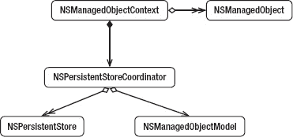
**图 2–11.** *托管对象上下文对象图*

请注意 图 2–11 中 `NSManagedObjectModel` 对象在类图中的位置。它被加载并传递给持久化存储协调器（`NSPersistentStoreCoordinator`），以便持久化存储协调器能够确定如何在持久化存储中表示数据。持久化存储协调器充当托管对象上下文与实际写入数据的持久化存储之间的中介。除其他任务外，它还通过 `migratePersistentStore:` 方法管理数据从一个存储到另一个存储的迁移。

`NSPersistentStoreCoordinator` 使用 `NSManagedObjectModel` 类进行初始化。一旦分配了协调器对象，它就可以加载并注册所有持久化存储。以下代码演示了持久化存储协调器的初始化过程。它在其 `initWithManagedObjectModel:` 方法中接收托管对象模型，然后通过调用 `addPersistentStoreWithType:` 方法注册持久化存储。

`NSURL *storeURL = [[self applicationDocumentsDirectory] URLByAppendingPathComponent:@"OrgChart.sqlite"];`

`NSError *error = nil;`
`__persistentStoreCoordinator = [[NSPersistentStoreCoordinator alloc] initWithManagedObjectModel:[self managedObjectModel]];`
`if (![__persistentStoreCoordinator addPersistentStoreWithType:NSSQLiteStoreType configuration:nil URL:storeURL options:nil error:&error])`
`{`
`  NSLog(@"Unresolved error %@, %@", error, [error userInfo]);`
`  abort();`
`}`

iOS 默认提供三种类型的持久化存储，如表 2–3 所示。

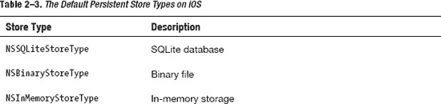

**注意：** Mac OS X 上的 Core Data 提供第四种类型（`NSXMLStoreType`），它使用 XML 文件作为存储机制。这种第四种类型在 iOS 上不可用，大概是因为 iDevice 的处理器速度较慢，且解析 XML 本身对处理器消耗较大。不过，在 iDevice 上解析 XML 是可行的，这一点从多个 iOS XML 解析库的存在即可证明。苹果似乎没有对 iOS 上缺少 XML 存储类型给出官方解释。

典型用户会发现自己在使用 SQLite 类型，该类型将数据存储到运行在 iDevice 上的 SQLite 数据库中，通常甚至可以说是唯一使用的类型。然而，你应该了解并理解其他类型，因为不同情况可能需要使用其他类型。尽管内存中的“持久化”存储听起来可能没什么用，但其经典用途是缓存从远程服务器获取的信息，并创建数据的本地副本，以限制带宽使用和相关延迟。数据在远程服务器上保持持久化，并且始终可以重新获取。

一旦创建了持久化存储协调器，托管对象上下文就可以作为 `NSManagedObjectContext` 实例进行初始化。托管对象上下文负责协调进出持久化存储的数据。这听起来可能是一项简单的任务，但请考虑以下挑战：


*   如果有两个线程请求同一个对象，它们必须获取到指向同一个实例的指针。
*   如果同一个对象被多次请求，上下文必须足够智能，不去访问持久化存储，而是从其缓存中返回该对象。
*   上下文应能将针对持久化存储的更改保留在自身内部，直到请求执行提交操作。

**注意：** 苹果强烈（并且合理地）反对对 `NSManagedObjectContext` 进行子类化，因为它所执行的操作非常复杂，并且有可能使上下文及其管理的对象进入不可预测的状态。

表 2–4 列出了一些用于检索、创建或删除数据对象的方法。更新数据是通过直接更改数据对象的属性来完成的。上下文会跟踪它从数据存储中拉取的每一个对象，并感知你做出的任何更改，以便这些更改能够持久化到后备存储。

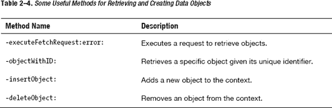

请记住，`NSManagedObjectContext` 负责协调进出持久化存储的数据传输，并保证数据对象的一致性。你应该仔细考虑删除托管对象的影响。当删除一个与其他托管对象存在关系的托管对象时，Core Data 必须决定如何处理这些相关对象。关系的一个属性是“删除规则”，这是表 2–5 中解释的四种删除规则之一。表 2–5 将正在被删除的对象称为*父对象*，将位于关系另一端的对象称为*相关对象*。

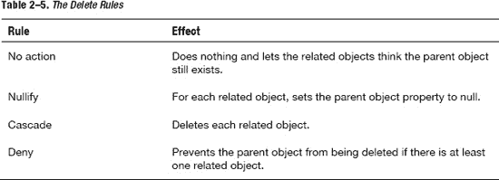

除了控制对持久化存储的访问之外，托管对象上下文还允许使用与用户界面设计中相同的范式来执行撤销和重做操作。表 2–6 列出了处理撤销和重做操作时使用的重要方法。

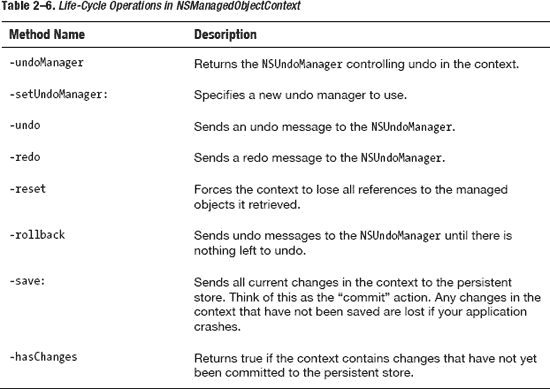

第 5 章 讨论了 Core Data 操作的撤销和重做。

`NSManagedObjectContext` 是所有数据对象必须经过的、通往持久化存储的大门。为了能够跟踪数据，Core Data 强制所有数据对象继承自 `NSManagedObject` 类。你已经在本章前面看到，`NSEntityDescription` 实例定义了数据对象。`NSManagedObject` 实例就是数据对象。Core Data 使用它们的实体描述来知道要访问哪些属性以及期望何种类型。

托管对象支持键值编码（即名称-值对），以便为其包含的数据提供通用的访问器。访问数据的最简单方式是通过 `valueForKey:` 方法。可以使用 `setValue:forKey:` 方法将数据放入对象中。`key` 参数是数据模型中属性的名称。

```
- (id)valueForKey:(NSString *)key
- (void)setValue:(id)value forKey:(NSString *)key
```

注意，`valueForKey:` 方法返回一个 `id` 类型的实例，这是一种通用类型。实际的数据类型同样由数据模型和你指定的属性类型决定。请参考表 2–2 以了解这些类型的列表。

`NSManagedObject` 还提供了几种方法，帮助 `NSManagedObjectContext` 确定对象是否有任何更改。当需要提交任何更改时，上下文可以询问它跟踪的托管对象是否发生了变化。苹果强烈反对你重写这些方法，以防止干扰提交序列。

**注意：** 每个 `NSManagedObject` 实例都保留了一个对其所属上下文的引用。这也是一种无需到处传递上下文就能持有其引用的低成本方式。只要你拥有一个托管对象，就可以获取回其上下文。

要创建一个新的 `NSManagedObject` 实例，你首先需要根据实体名称和知道该实体的托管对象上下文，创建一个合适的 `NSEntityDescription` 实例。`NSEntityDescription` 实例为新的 `NSManagedObject` 实例提供了定义（或描述）。然后，你向刚创建的 `NSEntityDescription` 实例发送消息，以将一个新建的托管对象插入到上下文中并返回给你。代码如下所示：

```
NSEntityDescription *entity = [NSEntityDescription entityForName:@"Organization"
    inManagedObjectContext:managedObjectContext];
NSManagedObject *org = [NSEntityDescription insertNewObjectForEntityForName:[entity
    name] inManagedObjectContext:managedObjectContext];
```

一旦你在上下文中创建了托管对象，就可以设置它的值。要为前面代码创建的名为 `org` 的 `NSManagedObject` 实例设置 `name` 属性，请调用以下代码：

```
[org setValue:@"MyCompany, Inc." forKey:@"name"];
```

### 键值观察

你可以通过主动查询的方式来负责发现对托管对象所做的任何更改。当某些事件触发控制器对托管对象执行操作时，这种方法非常有用。然而，在很多情况下，让托管对象本身在你更改它们时负责通知你，可以让你的设计更加高效和优雅。为了提供这种通知服务，`NSManagedObject` 类支持键值观察，以便在某个键的值更改之前和之后立即发送通知。键值观察并非 Core Data 特有的模式，而是贯穿 Cocoa 框架的。

与键值观察通知相关的两个主要方法是 `willChangeValueForKey:` 和 `didChangeValueForKey:`。前者在更改发生前立即调用，后者在更改发生后立即调用。然而，为了让一个对象 `observerObject` 能够接收来自托管对象 `managedObject` 中属性 `theProperty` 值更改的通知，观察者对象必须首先使用如下代码向该对象注册：

```
[managedObject addObserver:observerObject forKeyPath:@"theProperty"
    options:(NSKeyValueObservingOptionNew | NSKeyValueObservingOptionOld) context:nil];
```

注册之后，观察者将开始即时收到它所监听的属性的更改通知。当尝试保持用户界面与其显示的数据同步时，这是一个极其有用的机制。


### 查询类

到目前为止，本章已经介绍了如何初始化 Core Data 基础设施以及如何与它创建的对象进行交互。本节将讲解通过发送获取请求来检索数据的基础知识。毫不意外，获取请求是 `NSFetchRequest` 的实例。但或许会令你稍感惊讶的是，它几乎是 Core Data 框架中唯一一个与数据检索相关的类。在构建数据获取请求时所用到的其他大多数类都属于 Foundation Cocoa 框架，该框架也被其他所有 Cocoa 框架所使用。图 2–12 展示了源自 `NSFetchRequest` 的类图。

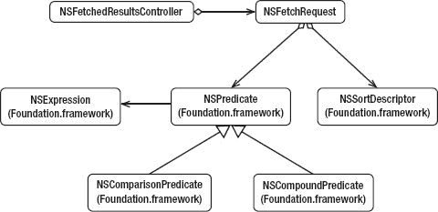

**图 2–12.** *NSFetchRequest 类图*

获取请求由两个主要元素组成：一个 `NSPredicate` 实例和一个 `NSSortDescriptor` 实例。`NSPredicate` 通过指定约束条件来帮助过滤数据，而 `NSSortDescriptor` 则按特定顺序排列结果集。这两个元素都是可选的，如果你未指定它们，那么若未指定 `NSPredicate`，结果将不受约束；若未指定 `NSSortDescriptor`，结果则不会排序。

创建一个简单的请求来检索持久化存储区中的所有组织（不受约束且不排序）的代码如下所示：

```
NSFetchRequest *fetchRequest = [[NSFetchRequest alloc] init];
NSEntityDescription *entity = [NSEntityDescription entityForName:@"Organization" inManagedObjectContext:managedObjectContext];
[fetchRequest setEntity:entity];
NSArray* organizations = [managedObjectContext executeFetchRequest:fetchRequest error:nil];
```

首先，你需要为请求对象预留内存空间。然后，从上下文中检索出要获取的对象的实体描述，并将其设置到请求对象中。最后，通过调用 `executeFetchRequest:` 在托管对象上下文中执行查询。

由于你没有使用 `NSPredicate` 实例来约束请求，因此 `organizations` 数组将包含代表持久化存储区中每个组织的 `NSManagedObject` 实例。为了过滤结果并只返回部分组织，你需要使用 `NSPredicate` 类。要创建一个简单的谓词，将结果限制为名称包含字符串 `"Inc."` 的组织，你可以调用 `NSPredicate` 的 `predicateWithFormat:` 方法，传入格式字符串以及要插入格式中的数据。然后，在托管对象上下文中执行请求之前，将该谓词添加到获取请求中。代码如下所示：

```
NSPredicate *predicate = [NSPredicate predicateWithFormat:@"name contains %@", @"Inc."];
[fetchRequest setPredicate:predicate];
```

要按组织名称的字母顺序对结果集进行排序，可以在执行请求之前向请求添加排序描述符。

```
NSSortDescriptor *sortByName = [[NSSortDescriptor alloc] initWithKey:@"name" ascending:YES];
[fetchRequest setSortDescriptors:[NSArray arrayWithObject:sortByName]];
```

第 6 章将更深入地讲解如何使用谓词进行简单和复杂查询，以及如何使用排序描述符进行排序。

图 2–13 将本章中你见过的所有 Core Data 类图整合到一个单一的类图中，展示了所有这些类在框架中的关系。

图中用线条人物代表的用户代码主要与四个类进行交互：

* `NSManagedObject` (1)
* `NSManagedObjectContext` (2)
* `NSFetchRequest` (3)
* `NSFetchedResultsController` (4)

请在图 2–13 中找到这四个编号为 1–4 的类，并将它们作为锚点，你应该能识别出本章已学习过的各个独立类图。唯一的例外是 `NSFetchedResultsController` (4)，它与 iOS 表格视图紧密配合。我们将在第 9 章中介绍 `NSFetchedResultsController`。

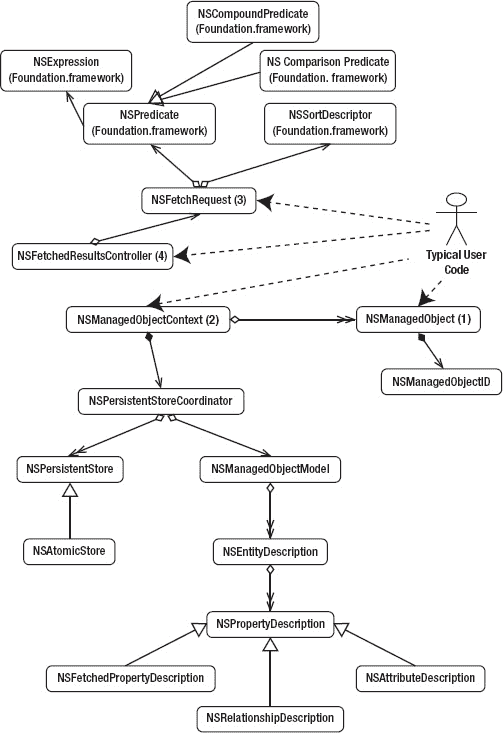

**图 2–13.** *Core Data 的主要类*


### 类的交互方式

至此，您应该已经对与 Core Data 交互所涉及的类以及其底层机制有了良好的理解。本节将扩展上一节创建的 `OrgChart` 应用程序，展示 Core Data 类之间交互的一些示例。与上一节类似，本章仍将重点保持在相对基础的层面。本章的目标是展示这些类如何协同工作。本书其余章节将深入探讨每个概念（如数据操作、自定义持久化存储、性能优化等）。

上一节创建的数据模型应类似于 图 2–14 所示。

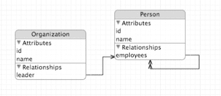

**图 2–14.** *组织数据模型*

`Organization` 和 `Person` 实体均使用 `Integer 16` 类型的属性作为每个实体的唯一标识符。阅读至此的大部分程序员可能已经想到了自增，并曾在 Xcode 用户界面中点击尝试自行启用标识符属性的自增功能。如果你正是其中一员，现在又回来阅读本章，你很可能已经感到沮丧并放弃了尝试。你找不到自增功能的原因很简单：它不存在。Core Data 使用真正的对象引用来管理对象图。它不需要像在关系数据库中那样作为主键使用的唯一自增标识符。如果持久化存储恰好是像 SQLite 这样的关系数据库，框架可能会使用一些自增标识符作为主键。但无论如何，作为 Core Data 用户，你不必担心这一点；这只是实现细节。我们特意在这个例子中引入标识符的概念，原因有二：

*   引出自增的问题。
*   展示如何使用 Core Data 管理数值。

人员标识符的含义类似于社会保险号。它并非为了自增而设计，因为它是在数据存储外部计算得出的标识符。在 `Organization` 示例中，我们简单地通过对象哈希值派生 ID。虽然这不能保证唯一性，但足以满足此应用的目的，并且实现简单。

**注意：**作为程序员，你应该注意不要过分拘泥于已有的数据库知识。Core Data 不是数据库；它是一个对象图持久化框架。其行为更接近于面向对象数据库，而非传统的关系数据库。

代码清单 2–1 展示了应用程序委托类 `OrgChartAppDelegate.h` 的头文件。你可以看到三个 Core Data 相关的属性：

*   `NSManagedObjectContext *managedObjectContext`
*   `NSManagedObjectModel *managedObjectModel`
*   `NSPersistentStoreCoordinator *persistentStoreCoordinator`

你还可以看到返回应用程序文档目录（持久化存储所在位置）的方法声明，以及另一个用于保存托管对象上下文的 `saveContext:` 方法声明。实现文件 `OrgChartAppDelegate.m` 将定义这些方法。

**代码清单 2–1.** *`OrgChartAppDelegate.h`*

```
#import <UIKit/UIKit.h>
#import <CoreData/CoreData.h>

@class OrgChartViewController;

@interface OrgChartAppDelegate : UIResponder <UIApplicationDelegate>

@property (strong, nonatomic) UIWindow *window;
@property (strong, nonatomic) OrgChartViewController *viewController;
@property (readonly, strong, nonatomic) NSManagedObjectContext *managedObjectContext;
@property (readonly, strong, nonatomic) NSManagedObjectModel *managedObjectModel;
@property (readonly, strong, nonatomic) NSPersistentStoreCoordinator *persistentStoreCoordinator;

- (void)saveContext;
- (NSURL *)applicationDocumentsDirectory;

@end
```

在 `OrgChartAppDelegate.m` 中，为来自 `OrgChartAppDelegate.h` 的三个 Core Data 相关属性添加 `@synthesize` 行，如下所示：

```
@synthesize managedObjectContext = __managedObjectContext;
@synthesize managedObjectModel = __managedObjectModel;
@synthesize persistentStoreCoordinator = __persistentStoreCoordinator;
```

接着，你需要为这三个 Core Data 相关属性编写访问器代码。每个访问器首先判断其负责的对象是否已被创建。如果已创建，则返回该对象。如果未创建，则访问器使用适当的 Core Data 公式创建该对象，创建所需的任何其他成员对象，并返回它。代码清单 2–2 中需添加到 `OrgChartAppDelegate.m` 的代码应该看起来很熟悉。

**代码清单 2–2.** *添加三个 Core Data 相关属性的访问器*

```
- (void)saveContext
{
    NSError *error = nil;
    NSManagedObjectContext *managedObjectContext = self.managedObjectContext;
    if (managedObjectContext != nil)
    {
        if ([managedObjectContext hasChanges] && ![managedObjectContext save:&error])
        {
            NSLog(@"Unresolved error %@, %@", error, [error userInfo]);
            abort();
        }
    }
}

#pragma mark - Core Data stack

/**
 Returns the managed object context for the application.
 If the context doesn't already exist, it is created and bound to the persistent store coordinator for the application.
 */
- (NSManagedObjectContext *)managedObjectContext
{
    if (__managedObjectContext != nil)
    {
        return __managedObjectContext;
    }

    NSPersistentStoreCoordinator *coordinator = [self persistentStoreCoordinator];
    if (coordinator != nil)
    {
        __managedObjectContext = [[NSManagedObjectContext alloc] init];
        [__managedObjectContext setPersistentStoreCoordinator:coordinator];
    }
    return __managedObjectContext;
}

/**
 Returns the managed object model for the application.
 If the model doesn't already exist, it is created from the application's model.
 */
- (NSManagedObjectModel *)managedObjectModel
{
    if (__managedObjectModel != nil)
    {
        return __managedObjectModel;
    }
    NSURL *modelURL = [[NSBundle mainBundle] URLForResource:@"OrgChart" withExtension:@"momd"];
    __managedObjectModel = [[NSManagedObjectModel alloc] initWithContentsOfURL:modelURL];
    return __managedObjectModel;
}

/**
 Returns the persistent store coordinator for the application.
 If the coordinator doesn't already exist, it is created and the application's store added to it.
 */
- (NSPersistentStoreCoordinator *)persistentStoreCoordinator
{
    if (__persistentStoreCoordinator != nil)
    {
        return __persistentStoreCoordinator;
    }

    NSURL *storeURL = [[self applicationDocumentsDirectory] URLByAppendingPathComponent:@"OrgChart.sqlite"];

    NSError *error = nil;
    __persistentStoreCoordinator = [[NSPersistentStoreCoordinator alloc] initWithManagedObjectModel:[self managedObjectModel]];
    if (![__persistentStoreCoordinator addPersistentStoreWithType:NSSQLiteStoreType configuration:nil URL:storeURL options:nil error:&error])
    {
        NSLog(@"Unresolved error %@, %@", error, [error userInfo]);
        abort();
    }

    return __persistentStoreCoordinator;
}

#pragma mark - Application's Documents directory
```


```objectivec
/**
 返回应用程序 Documents 目录的 URL。
 */
- (NSURL *)applicationDocumentsDirectory
{
  return [[[NSFileManager defaultManager] URLsForDirectory:NSDocumentDirectory
                                            inDomains:NSUserDomainMask] lastObject];
}
```

由于本章重点在于 Core Data 如何运作，而非用户界面设计与开发，`OrgChart` 应用可以满足于一个空白的灰色屏幕。所有工作都将在 `didFinishLaunchingWithOptions:` 方法中完成，我们将向您展示如何使用外部工具来验证 Core Data 是否正确持久化了对象。

在从持久化存储中读取任何数据之前，您必须先写入数据。修改 `didFinishLaunchingWithOptions:` 方法，调用一个名为 `createData:` 的新方法，如下所示：

```objectivec
- (BOOL)application:(UIApplication *)application
didFinishLaunchingWithOptions:(NSDictionary *)launchOptions
{
  [self createData];
  self.window = [[UIWindow alloc] initWithFrame:[[UIScreen mainScreen] bounds]];
  // 应用程序启动后的自定义覆盖点。
  self.viewController = [[OrgChartViewController alloc]
                          initWithNibName:@"OrgChartViewController" bundle:nil];
  self.window.rootViewController = self.viewController;
  [self.window makeKeyAndVisible];
  return YES;
}
```

在 `OrgChartAppDelegate.h` 中，像这样声明 `createData:` 方法：

```objectivec
- (void)createData;
```

现在，在 `OrgChartAppDelegate.m` 中像这样定义 `createData:` 方法：

```objectivec
- (void)createData
{
}
```

在 `createData:` 方法的实现中，您需要创建一个组织机构和三名员工。先从组织机构开始。请记住，就您而言，托管对象存在于托管对象上下文中。不必担心持久化存储；托管对象上下文会为您管理持久化存储。您只需创建代表组织机构的托管对象，并使用以下代码将其插入到托管对象上下文中：

```objectivec
NSManagedObject *organization = [NSEntityDescription
                                 insertNewObjectForEntityForName:@"Organization"
                                 inManagedObjectContext:self.managedObjectContext];
```

现在您已经创建了一个组织机构，但尚未为其指定名称和标识符。`name` 属性的类型是 `String`，因此像这样为组织机构设置名称：

```objectivec
[organization setValue:@"MyCompany, Inc." forKey:@"name"];
```

`id` 属性的类型是 `Integer 16`，这是一个类。所有 Core Data 属性都必须有一个类类型，而非基本类型。要为组织机构创建 `id` 属性，先从组织机构名称的哈希值创建一个基本类型 `int`，然后将基本类型 `int` 转换为 `NSNumber` 对象，以便在 `setValue:forKey:` 方法中使用。代码如下所示：

```objectivec
[organization setValue:[NSNumber numberWithInt:[@"MyCompany, Inc." hash]] forKey:@"id"];
```

**注意：** Core Data 为了符合键值编码要求，对属性使用对象。任何基本类型都应转换为 `NSNumber`，以便使用 `setValue:forKey:` 方法。

现在组织机构有了名称和标识符，尽管这些更改尚未提交到持久化存储。框架知道您已经更改了它所追踪的对象，并在调用 `save:` 方法提交上下文更改时，对持久化存储进行必要的调整。

一个没有员工的组织机构几乎没什么用处，因此使用与创建组织机构相同的方法创建三个分别名为 John、Jane 和 Bill 的人员：使用适当名称的实体描述在托管对象上下文中创建一个新的托管对象，并设置名称和标识符值。代码如下所示：

```objectivec
NSManagedObject *john = [NSEntityDescription insertNewObjectForEntityForName:@"Person"
                                              inManagedObjectContext:self.managedObjectContext];
[john setValue:@"John" forKey:@"name"];
[john setValue:[NSNumber numberWithInt:[@"John" hash]] forKey:@"id"];

NSManagedObject *jane = [NSEntityDescription insertNewObjectForEntityForName:@"Person"
                                              inManagedObjectContext:self.managedObjectContext];
[jane setValue:@"Jane" forKey:@"name"];
[jane setValue:[NSNumber numberWithInt:[@"Jane" hash]] forKey:@"id"];

NSManagedObject *bill = [NSEntityDescription insertNewObjectForEntityForName:@"Person"
                                              inManagedObjectContext:self.managedObjectContext];
[bill setValue:@"Bill" forKey:@"name"];
[bill setValue:[NSNumber numberWithInt:[@"Bill" hash]] forKey:@"id"];
```

现在您有了一个组织机构和三个互不关联的人员。组织结构图应该将 John 设为公司的领导者，而 Jane 和 Bill 则向 John 汇报。`OrgChart` 应用的数据模型有两种类型的关系。领导者是 `Organization` 与 `Person` 之间的一对一关系，而员工则通过 `Person` 与自身之间的一对多关系进行设置。设置一对一关系的值出奇地简单。

```objectivec
[organization setValue:john forKey:@"leader"];
```

Core Data 知道您正在分配一个关系值，因为它了解数据模型，并知道 `leader` 代表一个一对一关系。如果您传递了一个具有错误实体类型的托管对象作为值，您的代码将无法运行。

要将 Jane 和 Bill 分配为 John 的下属，您必须为 `employees` 这一对多关系赋值。Core Data 会将一对多关系的多端作为一个集合（`NSSet`）返回，这是一个由唯一对象构成的无序集合。对于 John 的 `employees` 关系，如果您调用 `valueForKey:` 方法，Core Data 会返回为 John 工作的现有员工集合。然而，由于您想向集合中添加对象，请调用 `mutableSetValueForKey:` 方法，因为它会返回一个 `NSMutableSet`（您可以向其中添加和删除对象），而不是不可变的 `NSSet`。将一个新的 `Person` 托管对象添加到返回的 `NSMutableSet` 中，即可为关系添加一名新员工。代码如下所示：

```objectivec
NSMutableSet *johnsEmployees = [john mutableSetValueForKey:@"employees"];
[johnsEmployees addObject:jane];
[johnsEmployees addObject:bill];
```

同样，由于您已经修改了 Core Data 所追踪的对象图，您无需再做任何其他事情来帮助它管理不同数据片段之间的依赖关系。一切行为都如同您对常规对象的预期一样。不过，同样地，这些更改在您使用创建的 `saveContext:` 方法保存托管对象上下文之前不会提交。

```objectivec
[self saveContext];
```

`createData:` 方法的内容至此结束。运行应用程序，在您的 SQLite 数据库中创建数据。再次强调，在 iPhone 模拟器中您只会看到一个空白的灰色屏幕。在下一节中，我们将使用其他工具来验证 `OrgChart` 应用程序是否已将数据添加到数据库中。


#### SQLite 入门

由于 `OrgChart` 应用使用 `SQLite` 作为持久化存储，并且你刚刚创建了该存储并存入了一些数据，因此你可以使用任何 `SQLite` 查看工具（例如 `Base` (`http://menial.co.uk/software/base/`)、`SQLite Database Browser` (`http://sqlitebrowser.sourceforge.net/`) 或 `SQLite Manager` (`http://code.google.com/p/sqlite-manager/`)）来查看它。但请注意，如果你从外部工具更改了 `Core Data` 所拥有的 `SQLite` 数据库，那么随意操作数据库可能会引发问题。`Core Data` 管理 `SQLite` 数据库的方式属于实现细节，随时可能发生变化。此外，你可能会以某种方式损坏数据，导致 `Core Data` 无法读取数据或正确重建对象图。请将此视为一个警告。然而，在开发应用程序时，你可以通过删除损坏的数据库并让应用重新创建它来从中恢复，所以请放心使用工具深入数据库来调试你的应用。

尽管有图形化浏览工具可用，但我们推荐使用你的 Mac 上已经安装的、功能完善的命令行工具：`sqlite3`。在 Mac 上，打开 `Terminal.app` 进入命令提示符，然后切换到 iPhone 模拟器的部署目录，操作如下：

`cd ~/Library/Application\ Support/iPhone\ Simulator`

要找到名为 `OrgChart.sqlite` 的数据库文件，请使用 `find` 命令：

`find . -name "OrgChart.sqlite" –print`

你应该会看到类似这样的输出：

`./5.0/Applications/E8654A34-8EC4-4EAF-B531-00A032DD5977/Documents/OrgChart.sqlite`

生成的 ID 将与前例不同，而且 Apple 过去曾移动过相对路径，未来也可能再次移动，因此你的路径会与此不同。这是指向你数据库文件的相对路径。要打开该数据库，请将该相对路径传递给 `sqlite3` 可执行文件，操作如下：

`sqlite3 ./5.0/Applications/E8654A34-8EC4-4EAF-B531-00A032DD5977/Documents/OrgChart.sqlite`

运行此命令后，你将进入 `SQLite` 交互式 shell。在此界面中，你可以运行 SQL 命令，直到退出 shell。

```
SQLite version 3.7.5
Enter ".help" for instructions
Enter SQL statements terminated with a ";"
sqlite>
```

一个有趣的命令是 `.schema`，它将显示 `Core Data` 为了支持你的对象模型而创建的 SQL 模式。

```
sqlite> .schema
CREATE TABLE ZORGANIZATION ( Z_PK INTEGER PRIMARY KEY, Z_ENT INTEGER, Z_OPT INTEGER, ZID
INTEGER, ZLEADER INTEGER, ZNAME VARCHAR );
CREATE TABLE ZPERSON ( Z_PK INTEGER PRIMARY KEY, Z_ENT INTEGER, Z_OPT INTEGER, ZID
INTEGER, Z2EMPLOYEES INTEGER, ZNAME VARCHAR );
CREATE TABLE Z_METADATA (Z_VERSION INTEGER PRIMARY KEY, Z_UUID VARCHAR(255), Z_PLIST
BLOB);
CREATE TABLE Z_PRIMARYKEY (Z_ENT INTEGER PRIMARY KEY, Z_NAME VARCHAR, Z_SUPER INTEGER,
Z_MAX INTEGER);
CREATE INDEX ZORGANIZATION_ZLEADER_INDEX ON ZORGANIZATION (ZLEADER);
CREATE INDEX ZPERSON_Z2EMPLOYEES_INDEX ON ZPERSON (Z2EMPLOYEES);
sqlite>
```

请注意，这些表的命名与你的实体并不完全一致，表的列数多于实体的属性数，并且数据库中还存在一些在 `Core Data` 数据模型中找不到的额外表。你还可以看到，`Core Data` 负责创建了用作主键的整型列，并管理着它们的唯一性。如果你熟悉 `SQLite`，就会知道任何定义为 `INTEGER PRIMARY KEY` 的列都会自动递增，但关键是你不必知道这一点甚至无需关心。`Core Data` 会处理唯一性。

你应该能解读 `Core Data` 用于将实体映射到表的代码，并识别出支持这两个实体的两个表：`ZORGANIZATION` 和 `ZPERSON`。你可以在运行 `OrgChart` 应用后查询这些表，并验证数据确实已存储在数据库中。

```
sqlite> select Z_PK, ZID, ZLEADER, ZNAME from ZORGANIZATION;
1|-19904|2|MyCompany, Inc.

sqlite> select Z_PK, ZID, Z2EMPLOYEES, ZNAME from ZPERSON;
1|6050|2|Jane
2|-28989||John
3|28151|2|Bill
sqlite>
```

这些行相当易于阅读。你可以看到你创建的单个组织，它的领导者（`ZLEADER`）是 `Z_PK=2` 的那个人（John）。John 没有上级，但 Jane 和 Bill 有相同的上级（`Z2EMPLOYEES`），而该上级的 `Z_PK` 是 `2`（正如所料，又是 John）。

要退出 `SQLite` 交互式 shell，请键入 `.quit` 并按下回车键。

```
sqlite> .quit
```


### 使用 Core Data 读取数据

在本章中，你使用 Core Data 将数据写入 SQLite 数据库，并使用 `sqlite3` 命令行工具读取数据，确认数据已正确存储在持久化存储中。你也可以使用 Core Data 从持久化存储中读取数据。返回 Xcode，打开 `OrgChartAppDelegate.m` 文件，添加使用 Core Data 读取数据的方法。

由于员工关系是递归的（即源实体和目标实体相同），请使用递归方法来显示一个人及其下属。接下来展示的递归 `displayPerson:` 方法接受两个参数（要显示的人以及缩进级别），并通过递归遍历一个人的员工列表，在适当的缩进级别打印他们。代码如下所示：

```
- (void)displayPerson:(NSManagedObject*)person withIndentation:(NSString*)indentation
{
  NSLog(@"%@Name: %@", indentation, [person valueForKey:@"name"]);

  // 为子级别增加缩进
  indentation = [NSString stringWithFormat:@"%@  ", indentation];

  NSSet *employees = [person valueForKey:@"employees"];
  id employee;
  NSEnumerator *it = [employees objectEnumerator];
  while ((employee = [it nextObject]) != nil)
  {
    [self displayPerson:employee withIndentation:indentation];
  }
}
```

现在编写一个方法，从上下文中检索所有组织，并显示它们及其领导者以及领导者的下属。代码见代码清单 2-3。

**代码清单 2-3.** *从数据库读取数据的方法*

```
- (void)readData
{
  NSManagedObjectContext *context = [self managedObjectContext];
  NSEntityDescription *orgEntity = [NSEntityDescription entityForName:@"Organization"
inManagedObjectContext:context];

  NSFetchRequest *fetchRequest = [[NSFetchRequest alloc] init];
  [fetchRequest setEntity:orgEntity];

  NSArray *organizations = [context executeFetchRequest:fetchRequest error:nil];

  id organization;
  NSEnumerator *it = [organizations objectEnumerator];
  while ((organization = [it nextObject]) != nil)
  {
    NSLog(@"Organization: %@", [organization valueForKey:@"name"]);

    NSManagedObject *leader = [organization valueForKey:@"leader"];
    [self displayPerson:leader withIndentation:@"  "];
  }
}
```

将方法声明添加到 `OrgChartAppDelegate.h` 中，以消除编译器警告。

```
- (void)readData;
- (void)displayPerson:(NSManagedObject *)person withIndentation:(NSString *)indentation;
```

最后，修改 `didFinishLaunchingWithOptions:` 方法，调用 `[self readData]` 而非 `[self createData]`。

```
- (BOOL)application:(UIApplication *)application
didFinishLaunchingWithOptions:(NSDictionary *)launchOptions
{
  //[self createData];
  [self readData];
  self.window = [[UIWindow alloc] initWithFrame:[[UIScreen mainScreen] bounds]];
  // 应用程序启动后的自定义覆盖点。
  self.viewController = [[OrgChartViewController alloc]
initWithNibName:@"OrgChartViewController" bundle:nil];
  self.window.rootViewController = self.viewController;
  [self.window makeKeyAndVisible];
  return YES;
}
```

构建并启动应用程序，然后查看调试日志，你应该会看到以下输出，其中显示了你创建的、以 John 为领导的组织，以及 John 的两名下属：

```
2011-07-30 22:18:37.422 OrgChart[4460:f203] Organization: MyCompany, Inc.
2011-07-30 22:18:37.424 OrgChart[4460:f203]   Name: John
2011-07-30 22:18:37.425 OrgChart[4460:f203]     Name: Bill
2011-07-30 22:18:37.426 OrgChart[4460:f203]     Name: Jane
```

你可以随意对 `OrgChart` 应用进行实验，修改 `createData:` 方法中创建的管理对象，调用 `createData:` 来存储你的更改，并调用 `readData:` 来验证更改是否已写入。你可以在每次运行之间删除 SQLite 数据库文件，让 `OrgChart` 应用重新创建它，或者让多次运行在数据库中积累对象。例如，如果你为 Jane 添加了一个新下属（Jack），那么 `OrgChart` 应用的输出将如下所示：

```
2011-07-30 22:22:21.858 OrgChart[4517:f203] Organization: MyCompany, Inc.
2011-07-30 22:22:21.860 OrgChart[4517:f203]   Name: John
2011-07-30 22:22:21.861 OrgChart[4517:f203]     Name: Bill
2011-07-30 22:22:21.861 OrgChart[4517:f203]     Name: Jane
2011-07-30 22:22:21.862 OrgChart[4517:f203]       Name: Jack
```

Jack 向 Jane 汇报。Jane 和 Bill 都向 John 汇报。John 是公司的领导者。

### 小结

至此，Core Data 框架对你来说应该不再那么令人望而生畏了。在本章中，你探索了高效管理整个对象图持久化所涉及的主要类，而无需让用户接触复杂的图算法或繁琐的 C API 来与特定数据库交互。使用 Core Data 就像开车一样，无需成为修车技师。该框架仅用大约十几个类就能表示对象模型并管理数据对象图。类结构的简洁性具有迷惑性。你已经看到了 Core Data 的强大功能——而这仅仅是个开始。当你深入探索其众多配置选项、UI 绑定、可选的持久化存储以及自定义托管对象类时，你将会进一步领略 Core Data 的精妙之处。

