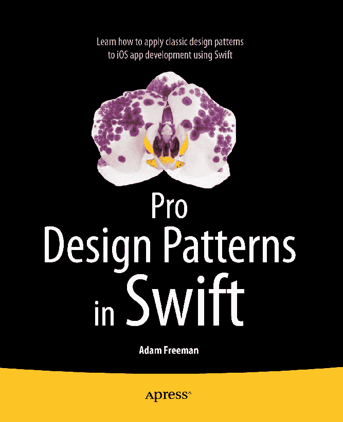

# Swift 专业设计模式

亚当·弗里曼

ISBN 978-1-4842-0395-8  
电子书 ISBN 978-1-4842-0394-1  
DOI 10.1007/978-1-4842-0394-1

© Apress 2015

**Swift 专业设计模式**

总经理：Welmoed Spahr  
首席编辑：James DeWolf  
开发编辑：Douglas Pundick  
技术审校：Fabio Claudio Ferracchiati  
编辑委员会：Steve Anglin, Mark Beckner, Gary Cornell, Louise Corrigan, James DeWolf, Jonathan Gennick, Jonathan Hassell, Robert Hutchinson, Michelle Lowman, James Markham, Matthew Moodie, Jeff Olson, Jeffrey Pepper, Douglas Pundick, Ben Renow-Clarke, Gwenan Spearing, Matt Wade, Steve Weiss  
协调编辑：Kevin Walter  
文字编辑：Kim Wimpsett  
排版：SPi Global  
索引编制：SPi Global  
插图制作：SPi Global  
封面设计：Anna Ishchenko

本书由 Springer Science+Business Media New York 在全球图书贸易中发行，地址：233 Spring Street, 6th Floor, New York, NY 10013。电话：1-800-SPRINGER，传真：(201) 348-4505，电子邮件：`orders-ny@springer-sbm.com`，或访问[`www.springeronline.com`](http://www.springeronline.com/)。Apress Media, LLC 是一家加利福尼亚有限责任公司，其唯一成员（所有者）是 Springer Science + Business Media Finance Inc（SSBM Finance Inc）。SSBM Finance Inc 是一家特拉华州公司。

如需了解翻译信息，请发送电子邮件至`rights@apress.com`，或访问[`www.apress.com`](http://www.apress.com/)。Apress 及 friends of ED 书籍可批量购买，用于学术、企业或推广用途。大多数图书也提供电子书版本和许可证。更多信息，请参阅我们的特别批量销售—电子书许可网页：[`www.apress.com/bulk-sales`](http://www.apress.com/bulk-sales)。

作者在本书中引用的任何源代码或其他补充材料，读者可在[`www.apress.com`](http://www.apress.com/)获取。有关如何查找本书源代码的详细信息，请访问[`www.apress.com/source-code/`](http://www.apress.com/source-code/)。

本作品受版权保护。出版商保留所有权利，无论是整体还是部分材料，具体包括翻译、重印、重用插图、朗诵、广播、以缩微胶卷或任何其他物理方式复制，以及电子改编、计算机软件，或现在已知或以后开发的类似或不同方法的传输或信息存储与检索。免除此法律保留的是与评论或学术分析相关的简短摘录，或专门为输入和执行于计算机系统而提供、仅供购买者使用的材料。本出版物或其部分的复制仅允许在出版商所在地现行版权法的规定下进行，且使用许可必须始终从 Springer 获得。使用许可可通过版权清算中心的 RightsLink 获取。违反者将根据相应的版权法受到起诉。

本书中可能出现商标名称、标识和图像。我们不在此类商标名称、标识或图像的每次出现时使用商标符号，而仅以编辑方式使用这些名称、标识和图像，以利于商标所有者，无意侵犯商标权。

本出版物中使用的商号、商标、服务标志及类似术语，即使未被明确标识，也不应被视为对其是否受专有权利保护的看法。

尽管本书中的建议和信息在出版时被认为是真实准确的，但作者、编辑或出版商均不对可能存在的任何错误或遗漏承担法律责任。出版商对本书所含材料不作任何明示或暗示的担保。

谨以此书献给我亲爱的妻子，Jacqui Griffyth。

## 关于作者

亚当·弗里曼是一位经验丰富的 IT 专业人士，曾在多家公司担任高级职位，最近担任一家全球银行的首席技术官和首席运营官。现已退休，他致力于写作和跑步。

## 关于技术审校

Fabio Claudio Ferracchiati 是一位高级顾问、高级分析师/开发人员，精通 Microsoft 技术。他在 BluArancio SpA（[`www.bluarancio.com`](http://www.bluarancio.com/)）担任高级分析师/开发人员和 Microsoft Dynamics CRM 专家。他是 Microsoft .NET 认证解决方案开发专家、Microsoft .NET 认证应用程序开发专家、Microsoft 认证专家，同时也是一位多产的作家和技术审校。在过去十年中，他为意大利和国际杂志撰写文章，并合著了十多本涵盖各种计算机主题的书籍。

目录

**第一部分：准备工作**

*   **第 1 章：理解设计模式** 3
    *   将设计模式置于上下文中 3
    *   设计模式简介 4
    *   理解设计模式的结构 4
    *   量化设计模式的价值 5
    *   在问题出现后使用设计模式 6
    *   理解设计模式的局限性 6
    *   关于本书 7
        *   你需要了解什么？ 7
        *   你需要哪些软件？ 7
        *   本书的结构是怎样的？ 7
        *   从哪里获取示例代码？ 8
    *   本章小结 8
*   **第 2 章：熟悉 Xcode** 9
    *   使用 Xcode Playgrounds 9
        *   创建一个 Playground 10
        *   显示变量的值历史 12
        *   使用值时间线 15
        *   在 Playground 中显示 UI 组件 16
    *   使用 OS X 命令行工具项目 18
        *   创建一个命令行项目 18
        *   理解 Xcode 布局 20
        *   添加一个新的 Swift 文件 21
    *   本章小结 24
*   **第 3 章：创建 SportsStore 应用** 25
    *   创建一个非结构化的 iOS 应用项目 25
        *   创建项目 27
        *   理解 Xcode 布局 28
        *   定义数据 28
        *   创建基本布局 31
        *   添加基本组件 32
        *   配置自动布局 34
        *   测试基本布局 35
        *   实现总计标签 36
            *   创建引用 36
            *   更新显示 38
        *   实现表格单元格 39
            *   定义自定义表格单元格和布局 40
            *   设置表格单元格布局约束 42
            *   创建表格单元格类和输出口 42
            *   实现数据源协议 44
            *   注册数据源 46
            *   测试数据源 46
        *   处理编辑操作 47
        *   处理事件 48
        *   测试 SportsStore 应用 50
    *   本章小结 51

**第二部分：创建型模式**

*   **第 4 章：对象模板模式** 55
    *   准备示例项目 56
    *   理解该模式解决的问题 56
    *   理解对象模板模式 59
    *   实现对象模板模式 60
    *   理解该模式的优势 61
        *   解耦的优势 61
        *   封装的优势 62
        *   演进的公共展示的优势 65
    *   理解该模式的陷阱 67
    *   Cocoa 中的对象模板模式示例 67
    *   将模式应用于 SportsStore 应用 67
        *   准备示例应用 68
        *   创建 Product 类 70
        *   应用 Product 类 72
        *   扩展摘要显示 75
    *   本章小结 76
*   **第 5 章：原型模式** 77
    *   理解该模式解决的问题 78
        *   产生昂贵的初始化 78
        *   创建模板依赖 79
    *   理解原型模式 81
    *   实现原型模式 81
        *   克隆引用类型 84
        *   理解浅拷贝和深拷贝 87
        *   拷贝数组 91
    *   理解原型模式的优势 93
        *   避免昂贵的初始化 93
        *   将对象创建与对象使用分离 96
    *   理解原型模式的陷阱 102
        *   理解深浅拷贝陷阱 102
        *   理解暴露扭曲陷阱 103
        *   理解非标准协议陷阱 103
    *   Cocoa 中的原型模式示例 103
        *   使用 Cocoa 数组 103
        *   使用 NSCopying 属性特性 106
    *   将模式应用于 SportsStore 应用 107
        *   准备示例应用 108
        *   在 Product 类中实现 NSCopying 108
        *   创建 Logger 类 109
        *   在视图控制器中记录更改 110
        *   测试更改 112
    *   本章小结 112
*   **第 6 章：单例模式** 113
    *   准备示例项目 114
    *   理解该模式解决的问题 114
        *   理解共享资源封装问题 115
    *   理解单例模式 117
    *   实现单例模式 118
        *   快速单例实现 118
        *   创建传统单例实现 121
        *   处理并发 122
    *   理解单例模式的陷阱 128
        *   理解泄漏陷阱 128
        *   理解共享代码文件陷阱 129
        *   理解并发陷阱 129
    *   Cocoa 中的单例模式示例 130
    *   将模式应用于 SportsStore 应用 130
        *   保护数据数组 131
        *   保护回调 132
        *   定义单例 133
    *   本章小结 136
*   **第 7 章：对象池模式** 137
    *   准备示例项目 138
    *   理解该模式解决的问题 138
    *   理解对象池模式 139
    *   实现对象池模式 141
        *   定义池类 141
        *   使用池类 145
    *   理解对象池模式的陷阱 148
    *   Cocoa 中的对象池模式示例 148
    *   将模式应用于 SportsStore 应用 149
        *   准备示例应用 150
        *   创建（模拟）服务器 150
        *   创建对象池 150
        *   应用对象池 152
    *   本章小结 155
*   **第 8 章：对象池变体** 157
    *   准备示例项目 158
    *   理解对象池模式的变体 158
        *   理解对象创建策略 158
        *   理解对象重用策略 163
        *   理解空池策略 167
        *   理解分配策略 179
    *   理解模式变体的陷阱 182
        *   理解预期差距陷阱 182
        *   理解过度利用和利用不足陷阱 183
    *   Cocoa 中的模式变体示例 183
    *   将模式变体应用于 SportsStore 183
    *   本章小结 185
*   **第 9 章：工厂方法模式** 187
    *   准备示例项目 188
    *   理解该模式解决的问题 189
    *   理解工厂方法模式 191
    *   实现工厂方法模式 192
        *   定义全局工厂方法 193
        *   使用基类 194
    *   工厂方法模式的变体 199
    *   理解该模式的陷阱 201
    *   Cocoa 中的工厂方法模式示例 201
    *   将模式应用于 SportsStore 应用 202
        *   准备示例应用 202
        *   实现工厂方法模式 204
        *   使用工厂方法模式 205
    *   本章小结 206
*   **第 10 章：抽象工厂模式** 207
    *   准备示例项目 208
    *   理解该模式解决的问题 211
    *   理解抽象工厂模式 212
    *   实现抽象工厂模式 213
        *   创建抽象工厂 214
        *   创建具体工厂 214
        *   完成抽象工厂 215
        *   使用抽象工厂模式 216
    *   抽象工厂模式的变体 217
        *   隐藏抽象工厂类 217
        *   将单例模式应用于具体工厂 219
        *   将原型模式应用于实现类 220
    *   理解该模式的陷阱 227
    *   Cocoa 中的模式示例 227
    *   将模式应用于 SportsStore 应用 227
        *   准备示例应用 227
        *   定义实现协议和类 228
        *   定义抽象和具体工厂类 229
        *   使用工厂和实现类 230
    *   本章小结 231
*   **第 11 章：建造者模式** 233
    *   准备示例项目 234
    *   理解该模式解决的问题 235
    *   理解建造者模式 238
    *   实现建造者模式 239
        *   定义建造者类 239
        *   使用建造者 240
        *   理解该模式的影响 241
    *   建造者模式的变体 245
    *   理解建造者模式的陷阱 247
    *   Cocoa 中的建造者模式示例 247
    *   将模式应用于 SportsStore 应用 248
        *   准备示例应用 248
        *   定义建造者类 249
        *   使用建造者类 250
    *   本章小结 250

**第三部分：结构型模式**

*   **第 12 章：适配器模式** 253
    *   准备示例项目 254
        *   创建数据源 254
        *   定义应用 255
    *   理解该模式解决的问题 257
    *   理解适配器模式 258
    *   实现适配器模式 259
    *   适配器模式的变体 261
        *   将适配器定义为包装类 262
        *   创建双向适配器 263
    *   理解适配器模式的陷阱 266
    *   Cocoa 中的适配器模式示例 266
    *   将模式应用于 SportsStore 应用 267
        *   准备示例应用 267
        *   定义适配器类 267
        *   使用适配后的功能 269
    *   本章小结 270
*   **第 13 章：桥接模式** 271
    *   准备示例项目 272
    *   理解该模式解决的问题 274
    *   理解桥接模式 275
    *   实现桥接模式 277
        *   处理消息 277
        *   处理通道 278
        *   创建桥接 279
        *   添加新的消息类型和通道 280
    *   桥接模式的变体 284
        *   折叠桥接 286
    *   理解桥接模式的陷阱 288
    *   Cocoa 中的桥接模式示例 288
    *   将模式应用于 SportsStore 应用 288
        *   准备示例应用 288
        *   理解问题 289
        *   定义桥接类 289
    *   本章小结 291
*   **第 14 章：装饰器模式** 293
    *   准备示例项目 294
    *   理解该模式解决的问题 295
    *   理解装饰器模式 298
    *   实现装饰器模式 298
    *   装饰器模式的变体 300
        *   创建具有新功能的装饰器 300
        *   创建合并的装饰器 304
    *   理解装饰器模式的陷阱 306
        *   副作用陷阱 306
    *   [Cocoa 中的装饰器模式示例](#A978-1-4842-0394-1_14

