# 2. 熟悉 Xcode

在本章中，我将使用 Xcode 来演示我在整本书中展示示例的方式。Playground 是 Xcode 6 最有用的功能之一，它允许在无需创建应用程序项目的情况下创建和评估代码实验。我使用 Playground 来帮助描述模式旨在解决的问题，并用它们来演示简单的实现。

我在本书中描述的许多设计模式依赖于对类、方法和属性的访问限制。Swift 支持访问保护关键字，但它们是按文件进行操作的。这对 Playground 来说是一个问题，因为所有代码都在一个文件中，因此访问保护无法强制执行。我描述的许多设计模式需要支持并发访问，而 Playground 在这方面处理得并不好。

出于这些原因，我还使用了 OS X 命令行工具项目，这是支持多文件的最简单的 Xcode 项目。命令行工具项目不会向用户呈现窗口化的用户界面，仅限于从控制台读取和写入。使用这种简单项目类型的好处在于，它使我能够专注于我所描述的设计模式以及实现它所需的代码，而无需处理用户界面的复杂性。

当然，很少有真实世界的项目会如此简单，在第 3 章中，我将创建一个名为 SportsStore 的 iOS 应用程序，它确实提供了一个图形用户界面，并且我将在每一章中使用它来为应用我所描述的模式提供额外的上下文。

## 使用 Xcode Playground

Xcode Playground 是一种很好的方法，可以在无需创建 iOS 应用程序项目的情况下对代码进行原型设计和测试想法。Playground 是 Xcode 6 的一个新功能，许多开发者对它并不熟悉，尤其是那些被 Swift 吸引到 iOS 和 Mac OS 开发领域，并且没有使用过早期 Xcode 版本来开发 Objective-C 的开发者。

### 创建 Playground

当你启动 Xcode 时，你会看到一个启动屏幕，允许你选择是创建一个新的 Playground、创建一个新项目，还是从源代码仓库中检出现有项目，如图 2-1 所示。

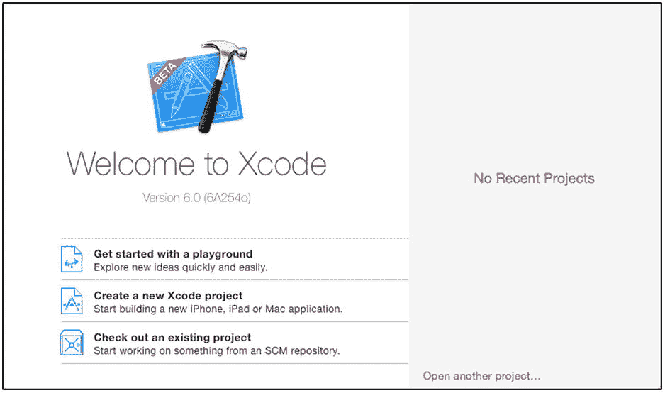

图 2-1.

Xcode 6 启动屏幕 提示

如果启动窗口未显示，请从“文件”菜单中选择新建 ➤ Playground。

点击“开始使用 Playground”。Xcode 会提示你选择一个位置来命名和保存 Playground 文件。将名称更改为 MyFirstPlayground，并确保为平台选择了 iOS，如图 2-2 所示。

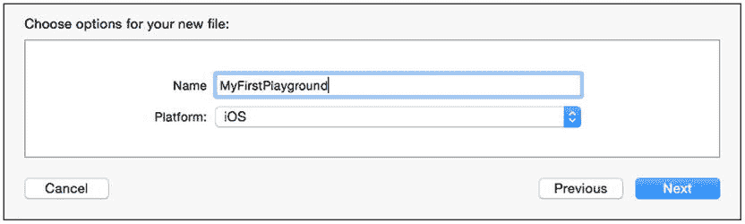

图 2-2.

命名 Playground 并选择平台

点击“下一步”按钮，选择一个你将来容易找到 Playground 的位置，如图 2-3 所示。

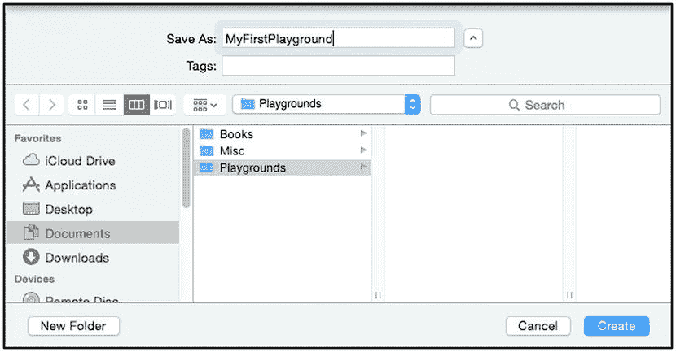

图 2-3.

更改 Playground 文件的名称并选择保存位置

Xcode 会在你选择的位置创建一个名为 `MyFirstPlayground.playground` 的文件，其内容如清单 2-1 所示。如果这是你第一次使用 Xcode，系统会要求你启用开发者模式。

```
Listing 2-1. The Contents of the MyFirstPlayground.playground File

import UIKit

var str = "Hello, playground"
```

提示

我不会在本书的清单中显示 Xcode 添加的注释，也不会添加我自己的注释。在实际项目中，我会不停地写注释，但在本书中，我会在随附的文字中解释我所写语句的效果。

Playground 提供了对输入到编辑器中的代码的洞察。Playground 中有一条注释和两个语句。注释会被忽略，而 `import` 语句使 Cocoa 的 `UIKit` 框架中的类可用。正是第二个语句暗示了 Playground 的能力。

```
var str = "Hello, playground"
```

这个语句创建了一个名为 `str` 的变量，并使用一个字符串字面量设置了它的值。如果你在 Playground 中查看该语句的右侧，你会看到该变量的值被显示出来，如图 2-4 所示。

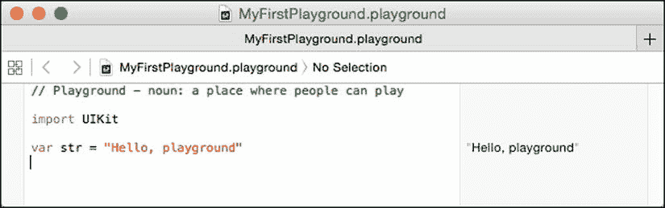

图 2-4.

一个简单的 Playground

这是一个有趣的开始，但并不是特别有用。在接下来的章节中，我将向你展示我在本书中依赖的不同的 Playground 功能。


### 显示变量的值历史

修改 playground 中的代码以匹配列表 2-2，你将体会到 playground 的强大之处。

列表 2-2. 在 `MyFirstPlayground.playground` 文件中定义循环

```
import UIKit
var str = "Hello, playground"
var counter = 0;
for (var i = 0; i < 10; i++) {
    counter += i;
    println("Counter: \(counter)");
}
```

**提示：** 你无需编译（甚至无需保存）playground 文件即可看到更改的效果。每次编辑后，代码语句会自动被评估。

我定义了一个初始值为 `0` 的 `counter` 变量，以及一个 `for` 循环，该循环在每次迭代中增加 `counter` 的值，并使用 `println` 函数将当前值写入控制台。右侧面板会更新，在更改 `counter` 值的语句旁边显示 `(10 times)`。在 `(10 times)` 消息的右侧有一个小的圆形加号按钮，如图 2-5 所示。

**提示：** 请确保点击更改 `counter` 变量值的语句旁边的按钮，而不是调用 `println` 函数的语句旁边的按钮。

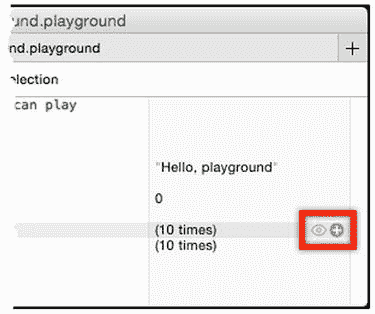

图 2-5. 显示值历史的按钮

此符号标记为“值历史”，点击它会打开一个面板，显示 `counter` 变量值在代码执行过程中如何变化，并显示通过 `println` 函数生成的控制台输出。图 2-6 展示了该视图。

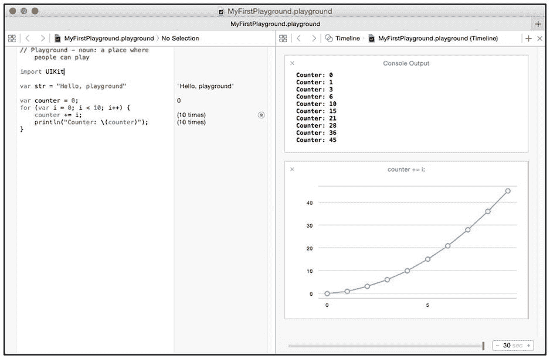

图 2-6. 在 playground 中显示值历史

图表显示了 `counter` 变量的值在 `for` 循环的每次迭代中如何变化。你可以显示 playground 中定义的任何变量的值历史，但数值类型的数据展示效果最好。

### 关于编码风格的一点说明

你会注意到，我在整本书中都使用分号来结束语句，尽管 Swift 并不要求在语句后使用分号，除非你需要在一行中分隔多个语句。

虽然这不是 Swift 的要求，但我几十年来一直使用需要分号的语言编写代码，而且——尽管我尝试过——我无法改掉这个习惯。对我来说，未结束的语句看起来总是不对劲，我会自动按下分号键。我曾考虑过通读每一章并删除分号，但那会导致示例出错，而我努力在书中避免这种情况。因此，带着歉意，我决定让我的偏好自然体现，在列表中使用分号。不过，你不必遵循我的风格：Swift 的优点之一是其对代码风格宽松的处理方式，你完全可以自由地表达自己的偏好和习惯（如果你愿意，也可以添加不必要的分号）。

### 使用值时间线

在“值历史”面板的底部有一个滑块，你可以用它来查看变量值在代码执行期间的变化情况。当有多个变量需要查看时，这个滑块的效果更容易体现。在列表 2-3 中，我向 playground 添加了一些额外的语句。

列表 2-3. 向 `MyFirstPlayground.playground` 文件中添加额外语句

```
import UIKit
var str = "Hello, playground"
var counter = 0;
var secondCounter = 0;
for (var i = 0; i < 10; i++) {
    counter += i;
    println("Counter: \(counter)");
    for j in 1...10 {
        secondCounter += j;
    }
}
```

通过点击 `for` 循环中语句右侧的圆形按钮，显示 `counter` 和 `secondCounter` 变量的值历史。你将看到两个独立的图表，通过左右拖动播放头（面板底部的红色竖条）可以移动到代码执行的不同时间点，从而查看变量值之间的关系，如图 2-7 所示。

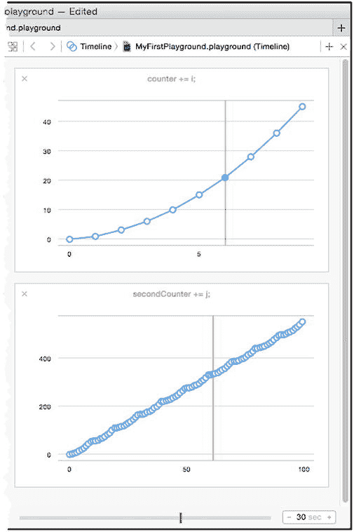

图 2-7. 在 playground 中查看变量值时间线

### 在 Playground 中显示 UI 组件

Playground 还可用于显示 UI 组件，我依靠它来演示 Cocoa 如何实现一些模式。列表 2-4 展示了我如何修改 playground 以显示一个文本字段。

列表 2-4. 向 `MyFirstPlayground.playground` 文件中添加 UI 组件

```
import UIKit
var str = "Hello, playground"
var counter = 0;
var secondCounter = 0;
for (var i = 0; i < 10; i++) {
    counter += i;
    println("Counter: \(counter)");
    for j in 1...10 {
        secondCounter += j;
    }
}
let textField = UITextField(frame: CGRectMake(0, 0, 200, 50));
textField.text = "Hello";
textField.borderStyle = UITextBorderStyle.Bezel;
textField;
```

在 playground 中使用 UI 组件与常规 Xcode 项目有两个重要区别。第一个区别是你必须使用带有 `frame` 参数的初始化器，并使用 `CGRectMake` 函数生成一个包含该组件的框架，如下所示：

```
...
let textField = UITextField(frame: CGRectMake(0, 0, 200, 50));
...
```

`CGRectMake` 函数的参数是包含组件的框架边界，其中第三和第四个值定义了宽度和高度。我指定了一个宽 200 像素、高 50 像素的框架，这对于一个文本字段来说足够了。

第二个区别是 playground 中的最后一条语句，它只包含了我为其分配 UI 组件的变量名。

```
...
textField;
...
```

这是必需的，以便 Xcode 会在语句右侧提供加号图标；点击该图标会在辅助编辑器中显示该组件，如图 2-8 所示。辅助编辑器面板显示语句的结果，因此需要一个返回已配置 UI 组件对象的语句。

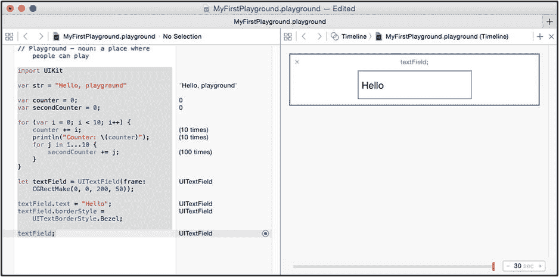

图 2-8. 在 playground 中显示 UI 组件

## 使用 OS X 命令行工具项目

OS X 命令行工具项目非常适合演示 Swift 中的设计模式。这类项目支持多文件和并发性，这使得演示访问保护的效果以及多线程工作的效果成为可能。

### 创建命令行项目

在 Xcode 启动屏幕上点击“Create a new Xcode project”，或者如果启动屏幕不可见，从 Xcode 的 File 菜单中选择 New ➤ Project。选择命令行工具模板，该模板位于 OS X ➤ Application 类别中，如图 2-9 所示。

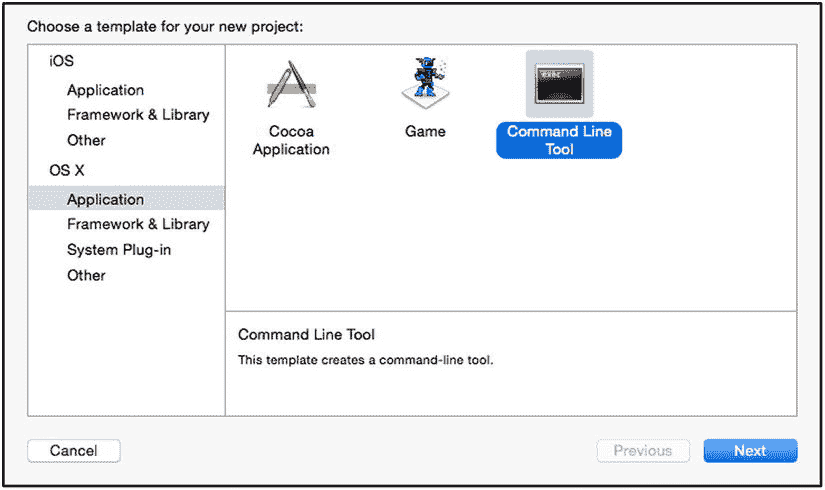

图 2-9. 选择命令行工具模板

点击 Next 按钮，Xcode 将提示你输入要创建的项目的详细信息。将名称设置为 `MyCommandLine`，并确保 Language 选项设置为 Swift，如图 2-10 所示。我将 Apress 指定为项目组织，但本书中我不依赖这些值，你可以将它们设置为你自己的组织。

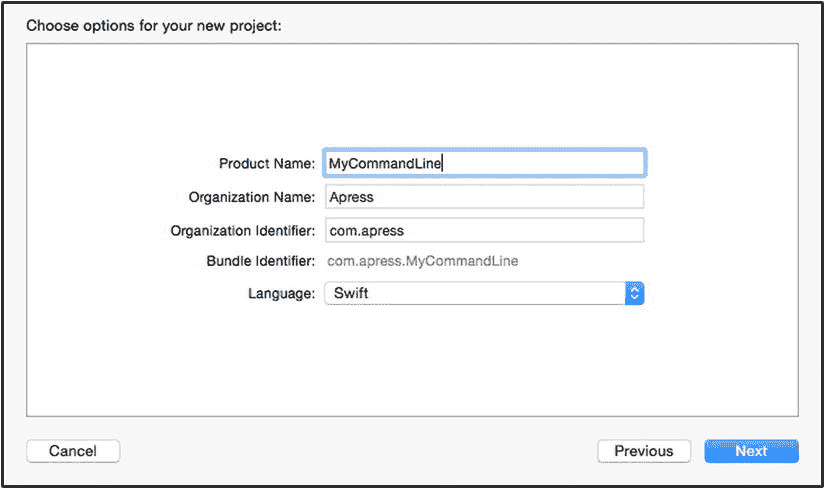

图 2-10. 指定项目的详细信息

点击 Next 按钮，Xcode 将提示你指定项目的位置。选择一个方便的位置，然后点击 Create 按钮。Xcode 将创建项目文件并打开主项目窗口。


### 理解 Xcode 布局

当 Xcode 显示项目时，你会看到与图 2-11 类似的布局。你看到的布局可能略有不同，但我会解释如何打开每个面板。

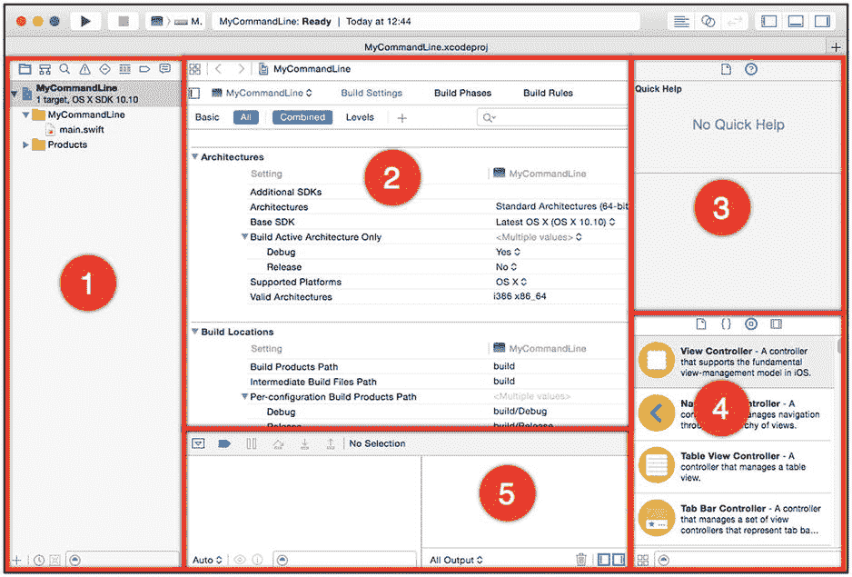

图 2-11.  
命令行工具项目的 Xcode 布局

我对 Xcode 呈现的主要面板进行了编号，并在表 2-1 中为刚接触 Xcode 的读者进行了描述。部分面板的内容会随 Xcode 执行的任务而变化，因此我包含了如何选择内容的详细信息。

表 2-1.  
默认的 Xcode 面板

| 编号 | 描述 |
| --- | --- |
| 1 | 这是导航器面板，它通过顶部边缘的一排按钮选择不同的视图来展示项目内容。我使用的是项目导航视图，通过点击该排中的第一个按钮即可显示。导航器面板的可见性通过 `View ➤ Navigators` 菜单控制。 |
| 2 | 这是主编辑器窗口，它会根据正在编辑的文件自适应。有多种编辑器可用，包括一个项目设置编辑器（项目首次创建时显示的就是它）、一个用于 `.swift` 文件的代码编辑器，以及一个名为 UI Builder 的拖放式编辑器，用于处理 `.storyboard` 文件。（我将在第 3 章中使用 `.storyboard` 文件。）选择 `View ➤ Standard Editor ➤ Show Standard Editor` 打开代码编辑器。 |
| 3 | 这是检查器面板，它显示应用程序中组件的信息，并在创建应用程序布局时使用。我将在第 3 章中进一步描述此面板。 |
| 4 | 这是实用工具面板。此面板的内容通过顶部边缘的四个按钮设置，图中显示的视图是对象库，其中包含用于创建应用程序布局的 UI 控件，我将在第 3 章中使用它。你可以通过选择 `View ➤ Utilities ➤ Show Object Library` 菜单来显示对象库。 |
| 5 | 这是调试面板，用于与调试器交互并显示使用 Swift 的 `println` 函数编写的控制台消息。命令行工具应用程序的输出就显示在这里。此面板通过 `View ➤ Debug Area` 菜单控制。 |

### 添加新的 Swift 文件

我之所以使用命令行工具项目，是为了创建多个代码文件，并用 `private` 等关键字来实施访问保护。要向项目中添加新文件，请在导航器面板中选择项目导航视图，然后右键点击 `MyCommandLine` 文件夹项（该文件夹当前包含一个名为 `main.swift` 的文件），如图 2-12 所示。

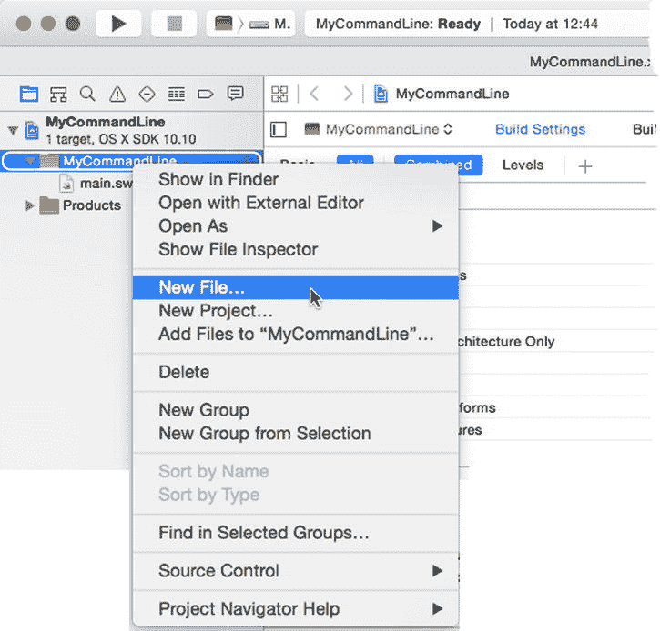

图 2-12.  
向示例项目添加新文件

Xcode 将显示可用于新文件的文件模板集合。选择 Swift 文件模板，如图 2-13 所示。

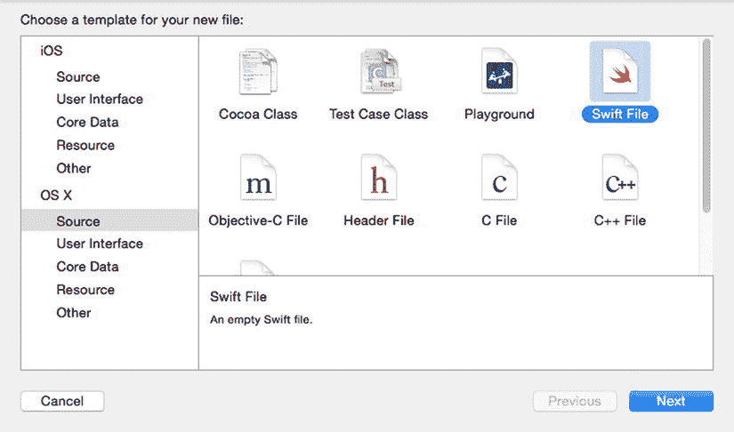

图 2-13.  
选择 Swift 文件模板

点击“下一步”按钮，并将新文件的名称设置为 `MyCode.swift`，如图 2-14 所示。

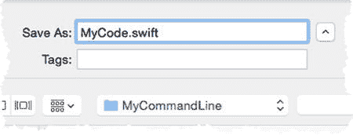

图 2-14.  
设置代码文件的名称

点击“创建”按钮，Xcode 将创建该文件并打开以供编辑。将默认内容替换为清单 2-5 中所示的语句。

清单 2-5. `MyCode.swift` 文件的内容

```
class MyClass {

    func writeHello() {

        println("Hello!");

    }

    private func writePassword() {

        println("secret");

    }

}
```

我定义了一个名为 `MyClass` 的类，并添加了两个方法。`writeHello` 方法没有访问控制关键字，可以从同一模块或项目中的任何位置调用。`writePassword` 方法使用了 `private` 关键字修饰，这意味着它只能从 `MyCode.swift` 文件中定义的类型访问。

`main.swift` 文件包含应用程序执行时将运行的语句。在本书的大多数示例中，我会在 `main.swift` 文件中添加语句，以代表设计模式中的调用组件。清单 2-6 显示了为此示例添加到文件中的语句。

清单 2-6. `main.swift` 文件的内容

```
let myObject = MyClass();

myObject.writeHello();
```

我从 `MyClass` 类创建了一个对象，并调用了 `writeHello` 方法。要编译并运行应用程序，请点击 Xcode 窗口顶部的播放图标，如图 2-15 所示。

> **提示**  
> 如果看不到图中所示的按钮，请从 Xcode 的“视图”菜单中选择“显示工具栏”。你也可以使用“产品”菜单来控制项目的编译和执行。


图 2-15.  
编译并运行应用程序的 Xcode 按钮

Xcode 将编译代码并运行应用程序，以下输出将出现在调试控制台窗口中：

```
Hello!

Program ended with exit code: 0
```

输出的第一行来自对 `println` 函数的调用。第二行表示示例程序已终止。我通常不会显示第二行，并且我构建的一些示例应用程序不会自行终止。

## 本章小结

在本章中，我解释了如何使用 Xcode 创建 Playground 和命令行工具项目，这是我在本书中介绍设计模式的主要方式。在下一章中，我将介绍创建一个名为 SportsStore 的 iOS 应用程序的过程，为了提供尽可能多的示例并将模式置于更真实的场景中，我会将本书中的每种模式都应用到这个应用程序中。

