# 3. 创建 SportsStore 应用

在上一章中，我向你展示了如何使用 Xcode 创建 Playground 和命令行工具，这是我在后续章节中介绍每种设计模式的方式。

我喜欢在我的书中提供尽可能多的代码示例，因此在本章中，我将创建一个名为 SportsStore 的 iOS 应用。我创建的这个应用完全是结构松散的，这意味着我只是尽可能直接地将代码和 UI 拼凑在一起，完全没有考虑其长期后果。当然，这与设计模式背道而驰，但这却是一种出奇常见的开发风格。在本书中，我将设计模式应用于这个结构松散的应用，以提供更多使用它们的上下文。


## 创建无结构的 iOS 应用项目

在本节中，我将创建一个简单的 iOS 应用，允许用户从名为 **SportsStore** 的零售商处购买产品。为了创建一个无需复杂视觉布局、且能让我专注于代码结构的易懂示例，我将只实现购物流程中的部分功能。

这对我来说很幸运，因为我是世界上最差的界面设计师之一。当你看到我创建的 iOS 布局时，你就会感受到我审美上的匮乏——我们就称之为 **极简时尚** 并继续前进吧。（在我自己的项目中，我会与专业设计师合作，如果你也面临类似的审美挑战，我鼓励你这样做）。

我在本节中使用的开发风格被称为 **单类应用**，这种风格没有结构或设计。这是一种常见的开发风格，尤其对于面向对象语言经验较少的程序员来说更是如此。

这是我提出设计模式价值的 **”之前“** 状态，而在我向你介绍每种模式时，我会展示 **”之后“** 的状态。因此，我构建了这个应用，以便强调我所描述的设计模式的影响，但这种开发风格非常普遍，你几乎在任何项目中都能看到类似的代码，尤其是那些刚从面向对象语言转型的开发者的作品。我相信，如果你回想一下你认识的程序员，你至少能想到一个写出类似代码的人。

**提示：** 我一步一步描述创建应用的过程，因为许多读者是 Xcode 和 Swift 世界的新手。如果你是一位经验丰富的 Xcode 用户，那么你可以直接跳到 第 4 章 并从 Apress.com 下载该项目。

我将创建的应用是一个简单的库存管理工具，面向一家名为 **SportsStore** 的虚构体育器材零售商。我在我的大部分书籍中都使用了某种形式的 **SportsStore**，它让我能够突出展示如何使用不同的语言、平台和模式来解决常见问题。图 3-1 展示了我将为 **SportsStore** 应用创建的初始界面的模型。

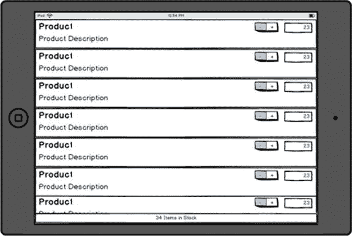

**图 3-1.** SportsStore 示例应用的模型

用户将看到一个以表格形式显示的产品列表。每个产品将显示其名称、描述以及当前库存数量。用户可以通过文本字段直接编辑库存水平，或使用步进器来增加或减少数值。

**示例应用的价值**

我绝不想假装 **SportsStore** 应用本身很有用——但这并非示例的目的。示例的目标是提供一个框架，使我能够在比 playground 或命令行工具中的代码片段更广泛的上下文中演示不同的模式。

**SportsStore** 示例的复杂度恰到好处，足以让我演示如何应用各种模式，同时又无需处理诸如数据持久化、安全性、数据验证以及真实项目中必须考虑的所有其他棘手问题。

创建一个更真实的应用的问题在于，书中过多的篇幅将被用于编写与手头主题不直接相关的代码。这不是我想写的书，希望也不是你想读的那种书。

### 创建项目

要创建一个新项目，请从 Xcode 的 **File** 菜单中选择 **New** ➤ **Project**。你将看到 Xcode 支持的项目类型列表。从 **iOS** ➤ **Application** 部分选择 **Single View Application**，如图 3-2 所示。

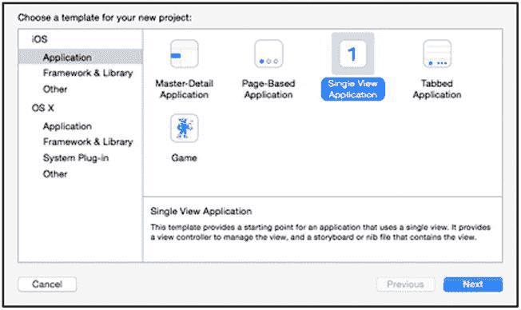

**图 3-2.** 选择 Xcode 项目类型

点击 **Next** 按钮，系统将要求你为新项目选择选项。将 **Product Name** 设置为 `SportsStore`，并分别将 **Organization Name** 和 **Identifier** 设置为 `Apress` 和 `com.apress`。确保 **Language** 选择了 `Swift`，**Devices** 选项选择了 `iPad`，并且 **Use Core Data** 选项未被勾选，如图 3-3 所示。

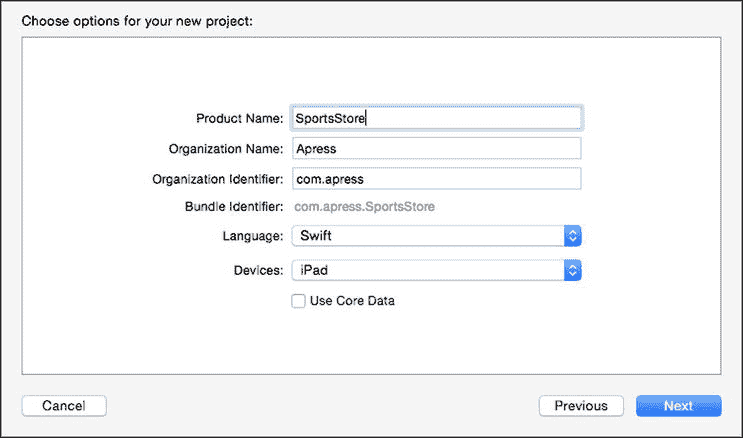

**图 3-3.** 为新 Xcode 项目选择选项

点击 **Next** 按钮，系统将提示你选择项目文件的保存位置。选择一个方便的位置并点击 **Create** 按钮以生成项目的初始内容。

### 了解 Xcode 布局

Xcode 将创建项目，你会看到项目的默认视图，如图 3-4 所示。其布局及包含的面板与 第 2 章 中描述的相同。

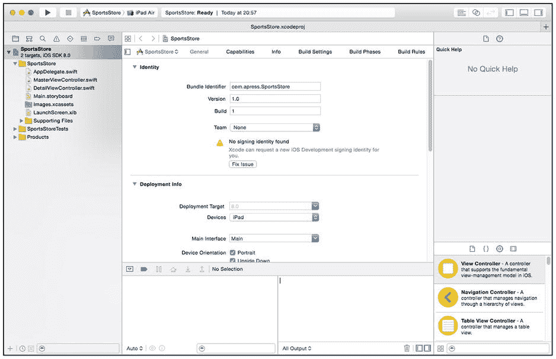

**图 3-4.** Xcode 项目布局


### 定义数据

为了保持示例应用的简洁，我将静态定义产品数据。在真实应用中，这种做法并不实用，因为用户所做的更改无法持久保存，但对于本书来说已经足够了——我希望能专注于设计模式，而非搭建数据服务。

我将把所有代码定义在 Xcode 创建项目时生成的 `ViewController.swift` 文件中。在导航面板中找到该文件并点击。Xcode 将切换到代码编辑器。清单 3-1 展示了 `ViewController.swift` 文件的内容，以及我为定义数据所做的修改。

**清单 3-1.** 向 `ViewController.swift` 文件添加数据

```
import UIKit

class ViewController: UIViewController {

    var products = [
        ("Kayak", "A boat for one person", "Watersports", 275.0, 10),
        ("Lifejacket", "Protective and fashionable", "Watersports", 48.95, 14),
        ("Soccer Ball", "FIFA-approved size and weight", "Soccer", 19.5, 32),
        ("Corner Flags", "Give your playing field a professional touch",
            "Soccer", 34.95, 1),
        ("Stadium", "Flat-packed 35,000-seat stadium", "Soccer", 79500.0, 4),
        ("Thinking Cap", "Improve your brain efficiency by 75%", "Chess", 16.0, 8),
        ("Unsteady Chair", "Secretly give your opponent a disadvantage",
            "Chess", 29.95, 3),
        ("Human Chess Board", "A fun game for the family", "Chess", 75.0, 2),
        ("Bling-Bling King", "Gold-plated, diamond-studded King",
            "Chess", 1200.0, 4)];

    override func viewDidLoad() {
        super.viewDidLoad()
    }

    override func didReceiveMemoryWarning() {
        super.didReceiveMemoryWarning()
    }

}
```

> **提示**  
> **视图控制器**这个术语涉及 Swift/Cocoa 开发中最重要的模式之一，即*模型/视图/控制器（MVC）*。该模式贯穿于 iOS 开发始终，我将在第 5 部分深入介绍。本章中，我将暂时忽略 MVC 模式，将所需的大部分代码集中到一个类中。

我创建了一个名为 `products` 的变量，并为其赋值一个由元组组成的数组，每个元组代表一个产品。元组可以轻松地将多个值组合在一起。有关元组如何定义和使用的快速说明，请参阅“使用元组”边栏。

> **提示**  
> Swift 在赋值字面浮点值（如 `19.5`）时，会使用 `Double` 类型，即使本可以使用更小的 `Float` 类型。我本可以通过显式指定类型来强制使用 `Float` 值——即 `Float(19.5)`——但为了保持示例的简洁，我将接受使用 `Double` 值。

---

### 使用元组

为了演示元组的使用，我创建了一个名为 `Tuples.playground` 的新 playground。我已将该 playground 包含在本书附带的免费源代码下载中。它包含以下代码：

```
import Foundation;

var myProduct = ("Kayak", "A boat for one person", "Watersports", 275.0, 10);

func writeProductDetails(product: (String, String, String, Double, Int)) {
    println("Name: \(product.0)");
    println("Description: \(product.1)");
    println("Category: \(product.2)");
    let formattedPrice = NSString(format: "$%.2lf", product.3);
    println("Price: \(formattedPrice)");
}

writeProductDetails(myProduct);
```

该 playground 中的代码定义了一个元组和一个函数，该函数将其各个值的详细信息打印到控制台。请注意，要在函数中将元组作为参数接受，我需要将各个值的类型指定为逗号分隔的列表，这与创建元组的方式类似，如下所示：

```
...
func writeProductDetails(product: (String, String, String, Double, Int)) {
...
```

在元组中使用字面数值时必须小心，因为 Swift 会自动为值选择类型。这就是为什么我在 playground 中将产品价格指定为 `275.0`。如果我省略了小数部分，Swift 会创建一个 `(String, String, String, Int, Int)` 元组，该元组将无法被 `writeProductDetails` 函数接受为参数。

在函数内部，我通过引用索引来访问元组中的值，如下所示：

```
...
println("Description: \(product.1)");
...
```

表达式 `product.1` 引用作为参数传递给 `writeProductDetails` 函数的元组中索引 1 处的值。元组索引从零开始，这意味着此表达式的计算结果为 `A boat for one person`。

我在 playground 中使用了 `NSString` 类来格式化产品价格。Swift 使得与不同的 Cocoa 框架（包括提供字符串格式化等核心功能的 `Foundation` 框架）协同工作变得非常容易。

要查看 playground 中代码的效果，请从“视图”菜单中选择**助理编辑器 ➤ 显示助理编辑器**。控制台输出将如下所示：

```
Name: Kayak
Description: A boat for one person
Category: Watersports
Price: $275.00
```

元组是定义数据类型的一种便捷方式，但它们也有局限性，我将在第 4 章中解释。

---

## 创建基本布局

我接下来要对示例项目做出的更改是定义一个基本布局，包括一个表格（将为每个产品显示一行）和一个标签（将显示库存中的产品总数）。

在本节中，我将使用 Xcode 的 Interface Builder（IB），这是一个拖放式的界面布局工具。熟悉 IB 的工作方式可能需要一些时间，因此我将逐步解释我所遵循的过程。如果您是一位经验丰富的 Xcode 开发者，则可以跳过此部分。

第一步是点击导航面板中的 `Main.storyboard` 文件以进行编辑。这将打开 IB 窗口，其中显示应用程序将呈现给用户的视图，如图 3-5 所示。

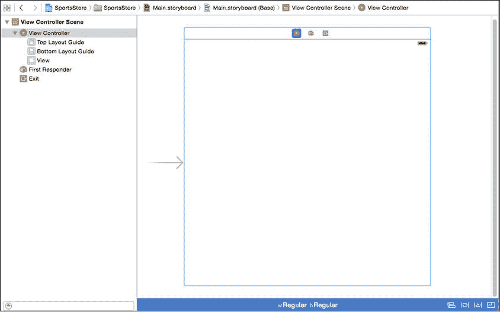

**图 3-5.** 使用 Interface Builder 编辑故事板

显示区域的主要部分显示了应用程序将呈现给用户的视图。此应用程序中只有一个视图，因为我在创建项目时选择了“单视图应用程序”模板。该视图目前显示为一个空框，因为其中没有任何用户界面组件。

左侧是控件的层次结构，顶层项目是**视图控制器场景**。目前其中的内容不多，但随着我添加 SportsStore 应用所需的组件，它将会被填充。控件层次结构是 Interface Builder 编辑器中一个很有用的部分，因为它使得选择组件以及创建组件之间的关系变得容易，您将在构建视图的过程中看到这一点。


### 添加基本组件

要向视图中添加组件，请从 Xcode 窗口右下角的“对象库”中将其拖拽到视图上并释放。然后，您可以在布局中定位该组件。

我需要的第一个组件是一个 `Label`（标签），我将用它来显示库存产品的数量。您可以通过向下滚动列表，或在面板底部的搜索框中输入组件名称，在“对象库”中找到 `Label` 组件。将 `Label` 拖拽到视图中。目前放在哪里并不重要。

添加 `Label` 后，您可以使用位于 Xcode 窗口右上角的检查器面板对其进行配置。面板顶部有一些按钮，可用于选择不同的检查器，如图 3-6 所示。

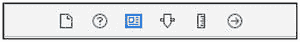

图 3-6.

检查器面板选择按钮

使用面板顶部的按钮选择“属性检查器”，并进行表 3-1 中描述的更改。

表 3-1.

标签控件所需的配置更改

| 属性 | 更改 |
| --- | --- |
| `Color` | 此属性控制标签文本的颜色。为此属性选择白色。 |
| `Alignment` | 此属性控制标签中文本的水平对齐方式。点击使文本居中的按钮。 |
| `Background` | 此属性设置标签的背景颜色。为此属性选择黑色。 |
| `Font` | 此属性设置标签显示文本所用的字体，应设置为 `System Bold 30`。 |

设置完属性后，调整标签的位置和大小，使其与视图的底部边缘对齐，并接触左右边缘，如图 3-7 所示。您可以使用“大小检查器”或使用视图中标签显示的拖拽手柄来调整标签的大小和位置。我将标签定位在 `(0, 550)` 坐标处，并将标签设置为 `600` x `50` 像素。

下一步是添加表格。在“对象库”中找到 `Table View` 组件，将其拖拽到视图中并释放。调整表格大小，使其占据视图中标签未占用的所有空间。当您将顶部边缘向上拖拽时，会看到它吸附到电池图标正下方的一条参考线。这就是顶部布局参考线，它允许应用程序适应设备窗口，而不会遮挡状态栏，如图 3-7 所示。

注意

请使用 `Table View` 组件，而不是 `Table View Controller`。

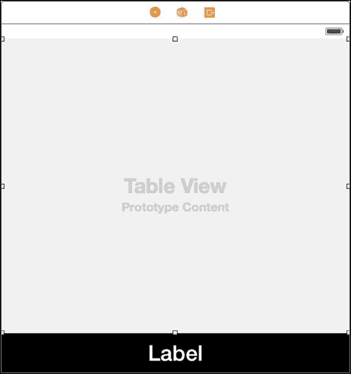

图 3-7.

添加基本布局组件

### 配置自动布局

下一步是指定组件在设备屏幕上的定位方式。布局在故事板编辑器中看起来不错，但 iOS 设备支持多种分辨率，并且应用程序可能以纵向或横向模式显示。自动布局是一项允许指定组件相对于其容器或其他组件的大小和位置的功能。在本节中，我将为表格定义布局。

自动布局通过指定约束来工作，这些约束固定了组件相对于其容器或其他组件的位置和大小。您可以使用代码语句来指定约束，但使用 UI Builder 提供的拖放支持更简单。

设置约束最可靠的方法是使用控件层级，因为这样可以轻松确保为正确的组件定义约束。要创建第一个约束，请按住 Control 键并从 `Table View` 拖拽到层级中的 `View` 项。释放鼠标按钮时，将出现一个弹出菜单，如图 3-8 所示，该图显示了故事板中视图左侧立即显示的对象层级。

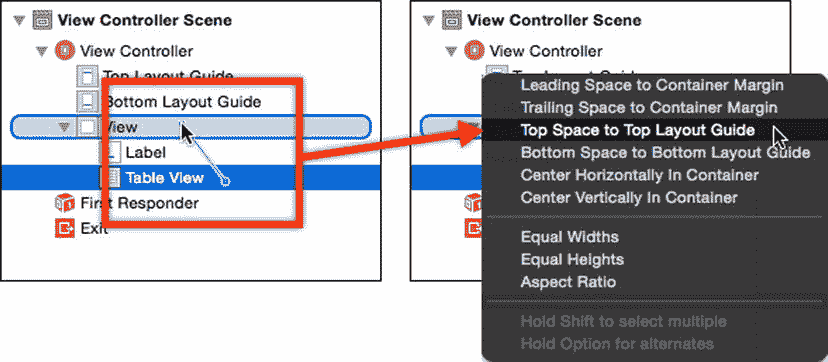

图 3-8.

使用组件层级应用约束

按住 Shift 键并选择以下项目：

*   领先间距到容器边距
*   尾部间距到容器边距
*   顶部间距到顶部布局参考线

选择了所有三个菜单项后，点击弹出菜单外部将其关闭。组件层级中会出现一个新的 `Constraints` 项来包含这些约束，这些约束的作用是确保表格视图的顶部、左侧和右侧边缘始终与容器的边缘接触，无论布局大小如何。

表 3-2 显示了所需的其余约束，所有约束都使用相同的技术创建。

提示

对于表中的最后一个约束，请按住 Control 键拖拽并释放，使线的两端都位于控件层级中 `Label` 项的边界内。

表 3-2.

基本布局所需的约束

| 拖拽自 | 拖拽至 | 约束 |
| --- | --- | --- |
| `Label` | `View` | `领先间距到容器边距` `尾部间距到容器边距` `底部间距到底部布局参考线` |
| `Table View` | `Label` | `垂直间距` |
| `Label` | `Label` | `高度` |

### 测试基本布局

在进一步操作之前，我想检查布局及其约束是否正确设置。要构建并测试应用程序，请点击 Xcode 工具栏中的“播放”按钮，该工具栏横跨 Xcode 窗口顶部，如图 3-9 所示。（该按钮实际上标有“构建然后运行当前方案”，但这名称有些笨拙。）

提示

如果您看不到该按钮，请从 Xcode 的“视图”菜单中选择“显示工具栏”。


图 3-9.

Xcode 中用于构建和启动应用程序的按钮

Xcode 附带了一个 iOS 模拟器，点击“播放”按钮将编译代码并将其发送到模拟器。您可以使用“播放”按钮旁边的选择器更改模拟的设备，如图 3-9 所示，我选择了 iPad 2。您可以使用任何设备，但 iPad 2 便于生成紧凑的屏幕截图，这对页面布局很有用。

点击“播放”按钮，Xcode 将编译项目并启动模拟器，如图 3-10 所示。

注意

我展示了模拟器的横向模式，该模式通过模拟器“硬件”菜单中的“向左旋转”和“向右旋转”选项显示。我通常在书中展示横向屏幕截图，因为它们更适合书籍布局，并最大限度地减少页面上的空白区域。

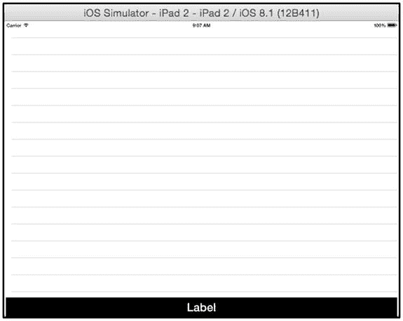

图 3-10.

在 iOS 模拟器中运行示例应用程序

## 实现总量标签

现在是时候开始实现驱动布局的代码了。在本节中，我将连接标签，使其显示库存产品的总量。在接下来的小节中，我将逐步介绍在布局和代码之间创建关系的过程。


### 创建引用

我在上一节中使用 Interface Builder 编辑的故事板文件是一个 XML 文件。这个文件定义了用户界面组件的布局和配置，但还需要一个额外的步骤，才能从应用程序代码中访问那些在运行时创建的组件实例（例如标签）。

> **提示：** 您可以通过在导航器面板中右键单击或按住 Control 键单击该文件，然后从弹出菜单中选择 **打开方式 ➤ 源代码** 来查看 XML 内容。

Xcode 有一个名为“助理编辑器”的功能，它会显示与主编辑器区域中显示的文件在逻辑上相关的内容。从“视图”菜单中选择 **助理编辑器 ➤ 显示助理编辑器**，Xcode 会向布局中添加一个新的窗格，该窗格将显示 `ViewController.swift` 文件的内容。

> **提示：** Xcode 会自动选择要在助理编辑器中显示的文件，但它并不总是能显示您想要的文件。您可以通过 Option 键单击导航器面板中的某个文件，来明确选择要在助理编辑器窗格中显示的文件。

按住 Control 键单击视图控制器场景组件层次结构中的 `Label`，并将其拖拽到助理编辑器中。将鼠标指针定位到 `class` 定义和 `product` 变量下方，然后松开鼠标。会弹出一个窗口，允许您配置一个输出口，该输出口是应用程序布局所创建的标签实例与 `UIViewController` 类之间的关联，如图 3-11 所示。

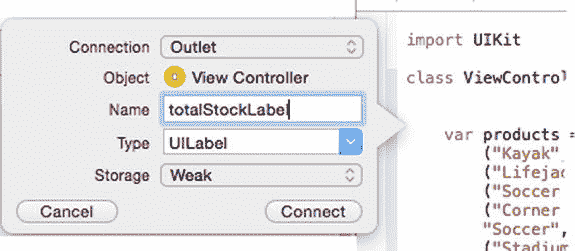

**图 3-11.** 为标签创建输出口

将 `名称` 字段设置为 `totalStockLabel`，然后点击 **连接** 按钮。Xcode 将会向 `ViewController` 类添加一个新变量，如代码清单 3-2 所示。（您无法手动添加此代码语句，因为 Xcode 会在幕后对项目进行其他更改）。

**代码清单 3-2.** 在 `ViewController.swift` 文件中添加输出口

```
import UIKit

class ViewController: UIViewController {

    @IBOutlet weak var totalStockLabel: UILabel!

    var products = [
        ("Kayak", "A boat for one person", "Watersports", 275.0, 10),
        ("Lifejacket", "Protective and fashionable", "Watersports", 48.95, 14),
        ("Soccer Ball", "FIFA-approved size and weight", "Soccer", 19.5, 32),
        ("Corner Flags", "Give your playing field a professional touch",
        "Soccer", 34.95, 1),
        ("Stadium", "Flat-packed 35,000-seat stadium", "Soccer", 79500.0, 4),
        ("Thinking Cap", "Improve your brain efficiency by 75%", "Chess", 16.0, 8),
        ("Unsteady Chair", "Secretly give your opponent a disadvantage",
        "Chess", 29.95, 3),
        ("Human Chess Board", "A fun game for the family", "Chess", 75.0, 2),
        ("Bling-Bling King", "Gold-plated, diamond-studded King",
        "Chess", 1200.0, 4)];

    override func viewDidLoad() {
        super.viewDidLoad()
    }

    override func didReceiveMemoryWarning() {
        super.didReceiveMemoryWarning()
    }
}
```

该变量的类型是 `UILabel`，这是 `UIKit` 框架中实现标签功能的类的名称。`@IBOutlet` 属性将该新变量标识为一个输出口。

### 更新显示

代码清单 3-3 展示了我如何使用该输出口来更新标签显示的文本，以显示库存中的商品数量。

**代码清单 3-3.** 在 `ViewController.swift` 文件中显示总库存

```
import UIKit

class ViewController: UIViewController {

    @IBOutlet weak var totalStockLabel: UILabel!

    var products = [
        ("Kayak", "A boat for one person", "Watersports", 275.0, 10),
        ("Lifejacket", "Protective and fashionable", "Watersports", 48.95, 14),
        ("Soccer Ball", "FIFA-approved size and weight", "Soccer", 19.5, 32),
        ("Corner Flags", "Give your playing field a professional touch",
        "Soccer", 34.95, 1),
        ("Stadium", "Flat-packed 35,000-seat stadium", "Soccer", 79500.0, 4),
        ("Thinking Cap", "Improve your brain efficiency by 75%", "Chess", 16.0, 8),
        ("Unsteady Chair", "Secretly give your opponent a disadvantage",
        "Chess", 29.95, 3),
        ("Human Chess Board", "A fun game for the family", "Chess", 75.0, 2),
        ("Bling-Bling King", "Gold-plated, diamond-studded King", "Chess",
        1200.0, 4)];

    override func viewDidLoad() {
        super.viewDidLoad();
        displayStockTotal();
    }

    override func didReceiveMemoryWarning() {
        super.didReceiveMemoryWarning()
    }

    func displayStockTotal() {
        let stockTotal = products.reduce(0,
            {(total, product) -> Int in return total + product.4});
        totalStockLabel.text = "库存 \(stockTotal) 件商品";
    }
}
```

我定义了一个名为 `displayStockTotal` 的新方法，它使用了 Swift 标准库中的 `reduce` 扩展。`reduce` 方法为数组中的每个条目调用一个函数。我将该函数表示为一个闭包，该闭包对每个数据元组中索引 4 的值进行求和。

生成总数后，我设置了标签的 `text` 属性，这会更改 `UILabel` 组件在应用程序布局中显示的字符串。

我从 `viewDidLoad` 方法中调用 `displayStockTotal` 方法，该方法在应用程序初始化且视图加载时被调用。要测试这些更改，请点击 Xcode 工具栏中的 **播放** 按钮。效果显示在图 3-12 中。

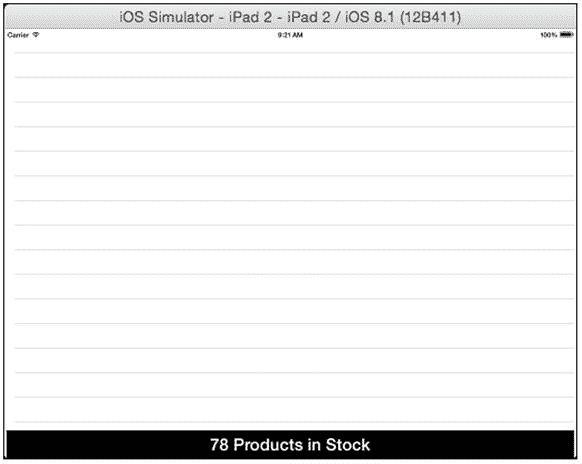

**图 3-12.** 显示产品总数

## 实现表格单元格

在本节中，我将实现对表格的支持，以便向用户提供有关每种产品库存水平的信息，并允许更改库存水平。我将创建一个包含其他控件的自定义表格单元格，并将所有内容连接到 `ViewController` 类中，遵循创建单类应用程序的前提。（但是，您将看到，我无法仅使用一个类来完成所有工作，最终我将创建一个简单的第二个类，其中包含一些 `IBOutlet` 属性）。


### 定义自定义表格单元格与布局

在导航窗格中点击 `Main.storyboard` 文件以打开界面构建器编辑器。确保层级结构已展开，以便你能看到布局中的各个组件。在对象库中找到 `Table View` `Cell` 组件，将其拖拽至层级结构中的 `Table View` 组件上，然后松开鼠标。

层级结构中将出现一个新的 `Content View` 项，它对应于主 IB 视图中的一个 `Prototype Cells` 对象——这将是用于生成表格单元格的模板。

在对象库中找到 `Text Field` 项，并将其拖拽至层级结构中的 `Content View` 项上。`Text Field` 组件呈现一个可编辑文本字段。调整文本字段的位置和大小，使其占据表格单元格的右侧，如图 3-13 所示。图中的蓝色虚线是 Xcode 提供的布局参考线，用于帮助定位组件。

> **提示：** 你可以直接将标签拖拽到编辑器窗格主体部分的布局中，但这样很容易将组件添加到布局的错误位置。我发现使用层级结构更可靠，尤其是在处理复杂布局时。

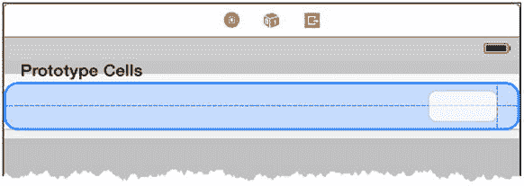

**图 3-13.** 在自定义表格单元格中定位第一个标签

确保文本字段已选中（在主编辑器窗格或组件层级结构中均可），然后使用属性检查器设置表 3-3 中显示的值。

**表 3-3.** `Text Field` 所需的配置更改

| 属性 | 更改 |
| --- | --- |
| `Font` | 将此属性设置为 `System 20.0`。 |
| `Alignment` | 设置此属性，使文本与组件右边缘对齐。 |

现在，将对象库中的 `Label` 和 `Stepper` 项拖拽到层级结构中的 `Content View` 项上，以创建图 3-14 所示的布局。

> **提示：** 不必追求像素级完美的布局——大致接近即可。我通过在**编辑器**菜单中选择**画布** > **显示边界矩形**，启用了图中显示每个组件边界的蓝色线条。

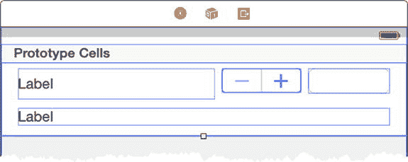

**图 3-14.** 将剩余组件添加到自定义表格单元格布局中

你需要在层级结构中选择 `Table View Cell` 项，并使用拖拽手柄增加表格单元格的高度，以便所有内容都能容纳。

为了更容易区分两个 `Label` 组件，点击层级结构中上方标签的条目，将其名称改为 `Name Label`。点击另一个 `Label`，将其名称改为 `Description Label`。最后，点击 `Text Field` 的条目，将其名称改为 `Text Field`（默认名称包含字段样式的详细信息）。

最后一步是配置组件。表 3-4 列出了组件的新名称以及应使用属性检查器更改的属性。

**表 3-4.** 自定义表格单元格组件所需的属性更改

| 组件 | 属性 | 值 |
| --- | --- | --- |
| `Name Label` | `Font` | `System Bold 30` |
| `Description Label` | `Font` | `System 25` |
| `Text Field` | `Font` | `System 30` |

### 设置表格单元格布局约束

使用组件层级结构设置表 3-5 中所示的布局约束。这些约束确保无论用于显示应用的设备和方向如何，表格单元格的内容都将保持可见。

**表 3-5.** 自定义表格单元格组件所需的约束

| 拖拽自 | 拖拽至 | 约束 |
| --- | --- | --- |
| `Text Field` | `Content View` | `尾部空间到容器边距` `顶部空间到容器边距` |
| `Text Field` | `Text Field` | `宽度` |
| `Stepper` | `Content View` | `顶部空间到容器边距` |
| `Stepper` | `Text Field` | `水平间距` |
| `Name Label` | `Content View` | `前导空间到容器边距` `顶部空间到容器边距` |
| `Name Label` | `Stepper` | `水平间距` |
| `Name Label` | `Name Label` | `高度` |
| `Description Label` | `Content View` | `前导空间到容器边距` `尾部空间到容器边距` `底部空间到容器边距` |

### 创建表格单元格类与出口

为了能够在表格单元格中显示每个产品的详细信息，我需要能够引用上一节添加到布局中的组件。为此，我创建了带有 `IBOutlet` 属性的变量，就像我为显示库存总件数的 `UILabel` 组件所做的那样。但这里有个小问题：我需要定义一个用于实例化表格中每个单元格的类，然后将其用作出口的容器。我无法在 `ViewController` 类中处理这个问题，因为自定义数据单元格类必须派生自 `UITableViewCell`，而 Swift 不支持多重类继承。代码清单 3-4 显示了在 `ViewController.swift` 文件中添加一个新类的操作。

**代码清单 3-4.** 在 `ViewController.swift` 文件中添加表格单元格类

```
import UIKit

class ProductTableCell : UITableViewCell {

}

class ViewController: UIViewController {
    // ...为简洁起见，省略了语句...
}
```

我定义了一个名为 `ProductTableCell` 的新类，它将用于实例化表格中的单元格。要应用此类，请在组件层级结构中选择 `Table View Cell` 项，然后使用身份检查器将 `Class` 属性的值更改为 `ProductTableCell`，并将 `Module` 属性的值更改为 `SportsStore`。

接下来，切换到属性检查器，并将 `Identifier` 属性设置为 `ProductCell`。

> **提示：** 更改 `Class` 属性会告诉 iOS 在需要表格单元格时使用 `ProductTableCell` 类。设置 `Identifier` 将允许我请求自动创建 `ProductTableCell` 对象，我将在下一节中执行此操作。

按住 Control 键，依次将上一节添加的四个组件——两个标签、一个文本字段和一个步进器——拖拽到代码编辑器中的新 `ProductTableCell` 类中，以创建新的出口属性；你可以从组件层级结构或故事板中拖拽这些项目。表 3-6 显示了组件名称与我为出口使用的名称之间的映射关系。

> **提示：** 如果在创建出口时看到错误，提示没有 `ProductTableCell` 类的可用信息，请重启 Xcode。

**表 3-6.** `ProductTableCell` 类中组件名称到出口属性名称的映射

| 名称 | 描述 |
| --- | --- |
| `Name Label` | `nameLabel` |
| `Description Label` | `descriptionLabel` |
| `Stepper` | `stockStepper` |
| `Text Field` | `stockField` |

当你创建完所有四个出口后，`ProductTableCell` 类应与代码清单 3-5 一致。

**代码清单 3-5.** 在 `ViewController.swift` 文件的 `ProductTableCell` 类中添加出口属性

```
...

class ProductTableCell : UITableViewCell {

    @IBOutlet weak var nameLabel: UILabel!
    @IBOutlet weak var descriptionLabel: UILabel!
    @IBOutlet weak var stockStepper: UIStepper!
    @IBOutlet weak var stockField: UITextField!
}

...
```

只要定义了所有四个属性，并且它们与表中所示的组件对应，属性的顺序无关紧要。


### 实现数据源协议

为了提供带数据的表格，我需要实现`UITableViewDataSource`协议中的两个方法，这样我就能告诉表格有多少行并生成每个单元格。在此之前，我需要创建一个输出口属性，以便能够从`ViewController`类中引用表格视图。

从组件层级中按住 Control 键拖动`Table View`元素到`ViewController`类，松开鼠标，以便 Xcode 在`totalStockOutlet`属性下方创建该属性。将属性名称设为`tableView`。结果应添加清单 3-6 中所示的属性。

**清单 3-6.** 在 ViewController.swift 文件中为表格视图添加输出口属性

```
import UIKit

class ProductTableCell : UITableViewCell {
    // ...为简洁起见省略了语句...
}

class ViewController: UIViewController {
    @IBOutlet weak var totalStockLabel: UILabel!
    @IBOutlet weak var tableView: UITableView!
    // ...为简洁起见省略了语句...
}
```

现在我可以将协议添加到`UIViewController`类中，并实现`UITableViewDataSource`协议中的两个方法，如清单 3-7 所示。

**清单 3-7.** 在 ViewController.swift 文件中实现数据源协议方法

```
import UIKit

class ProductTableCell: UITableViewCell {
    @IBOutlet weak var nameLabel: UILabel!
    @IBOutlet weak var descriptionLabel: UILabel!
    @IBOutlet weak var stockStepper: UIStepper!
    @IBOutlet weak var stockField: UITextField!
}

class ViewController: UIViewController, UITableViewDataSource {
    @IBOutlet weak var totalStockLabel: UILabel!
    @IBOutlet weak var tableView: UITableView!
    var products = [
        ("Kayak", "A boat for one person", "Watersports", 275.0, 10),
        ("Lifejacket", "Protective and fashionable", "Watersports", 48.95, 14),
        ("Soccer Ball", "FIFA-approved size and weight", "Soccer", 19.5, 32),
        ("Corner Flags", "Give your playing field a professional touch",
            "Soccer", 34.95, 1),
        ("Stadium", "Flat-packed 35,000-seat stadium", "Soccer", 79500.0, 4),
        ("Thinking Cap", "Improve your brain efficiency by 75%", "Chess", 16.0, 8),
        ("Unsteady Chair", "Secretly give your opponent a disadvantage",
            "Chess", 29.95, 3),
        ("Human Chess Board", "A fun game for the family", "Chess", 75.0, 2),
        ("Bling-Bling King", "Gold-plated, diamond-studded King",
            "Chess", 1200.0, 4)];

    override func viewDidLoad() {
        super.viewDidLoad();
        displayStockTotal();
    }

    override func didReceiveMemoryWarning() {
        super.didReceiveMemoryWarning();
    }

    func tableView(tableView: UITableView,
        numberOfRowsInSection section: Int) -> Int {
            return products.count;
    }

    func tableView(tableView: UITableView,
        cellForRowAtIndexPath indexPath: NSIndexPath) -> UITableViewCell {
            let product = products[indexPath.row];
            let cell = tableView.dequeueReusableCellWithIdentifier("ProductCell")
                as ProductTableCell;
            cell.nameLabel.text = product.0;
            cell.descriptionLabel.text = product.1;
            cell.stockStepper.value = Double(product.4);
            cell.stockField.text = String(product.4);
            return cell;
    }

    func displayStockTotal() {
        let stockTotal = products.reduce(0,
            {(total, product) -> Int in return total + product.4});
        totalStockLabel.text = "\(stockTotal) Products in Stock";
    }
}
```

`UITableDataViewDataSource`协议中的方法都叫做`tableView`，通过它们定义的参数来区分。定义`numberOfRowsInSection`参数的`tableView`方法版本用于确定表格中会有多少行，我通过返回`product`数组中元组的数量来实现。

`tableView`方法的另一个版本创建`UITableViewCell`类的实例，该类代表表格中的一行。通过`indexPath`参数的`row`属性可以访问该行的信息。我为表格视图添加输出口属性的原因在于，这样可以调用`dequeueReusableCellWithIdentifier`方法，该方法会复用那些已创建但用于显示不再可见内容的单元格。`dequeueReusableCellWithIdentifier`方法的参数是我用来为自定义表格单元格设置`Identifier`属性的值，这样表格就知道如何创建`ProductTableCell`类的实例。

### 注册数据源

显示数据的最后一步是将视图控制器类注册为表格的数据源。按住 Control 键从组件层级中的`Table View`元素拖动到`View Controller`元素。松开鼠标时，会弹出一个菜单——选择`dataSource`项以链接`ViewController`和表格，如图 3-15 所示。

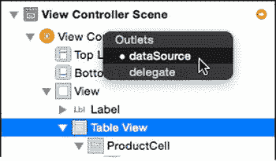

**图 3-15.** 为表格视图设置数据源

### 测试数据源

为了测试由`ViewController`类提供的数据，点击 Xcode 工具栏上的 Play 按钮，这将构建项目并将应用发送到 iOS 模拟器，如图 3-16 所示。

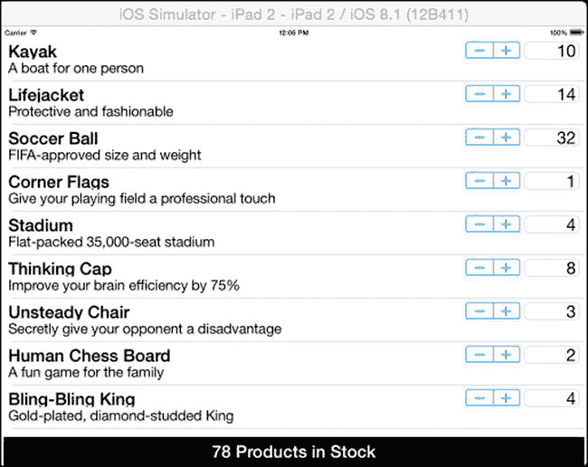

**图 3-16.** 测试 SportsStore 应用

## 处理编辑操作

在本节中，我将通过连接`Stepper`和`Text Field`组件来完善 SportsStore 应用，以便用户能够更改产品的库存量。为了直观地确认更改，我将更新屏幕底部`Label`组件显示的文本。

切换到连接检查器，然后点击组件层级中的`Text Field`元素。检查器会显示支持的事件列表。从`Editing Changed`事件右侧的圆形（即连接井）拖动到助理编辑器中的`ViewController`类，并将线条定位在`displayStockTotal`方法定义的上方。松开鼠标，会出现一个弹出菜单，如图 3-17 所示。

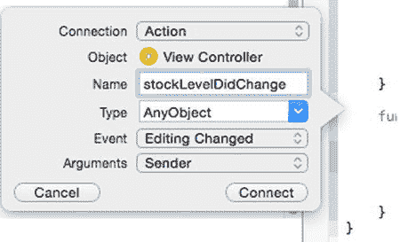

**图 3-17.** 创建操作方法

将`Name`设置为`stockLevelDidChange`，然后点击 Connect 按钮。Xcode 会将清单 3-8 所示的方法添加到`ViewController`类中。

**清单 3-8.** 在 ViewController.swift 文件中添加操作方法

```
...
@IBAction func stockLevelDidChange(sender: AnyObject) {
}
...
```

`IBAction`属性表明这是一个将在布局组件发生更改时被调用的方法——本例中，是在文本字段被编辑时触发。

我希望当步进器的值发生变化时也能调用相同的方法，因此点击组件层级中的`Stepper`元素，转到连接检查器，然后从`Value Changed`连接井处拖动。

将指针定位到`stockLevelDidChange`方法上，直到该方法高亮显示，并且文本气泡从`Insert Action`变为`Connection Action`，然后松开鼠标按钮。

**提示：** Xcode 在连接到现有事件时可能不可靠。如果你没有看到方法高亮显示，那么只需创建一个新的操作方法，并将其名称设置为`stockLevelDidChange`，就像对文本字段所做的那样。这会在代码文件中创建两个同名的方法。删除其中一个方法——删除哪个都无所谓。组件和方法之间的关系是通过方法名来处理的，因此这种替代方法可以用来绕开 Xcode 的一个限制。


### 处理事件

当用户与`Stepper`或`Text Field`组件交互时，会调用`stockLevelDidChange`方法，从而让我能够相应地更新库存水平。清单 3-9 展示了我对`ViewController`类所做的修改，以便处理这些事件。

**清单 3-9. 在 ViewController.swift 文件中处理事件**

```swift
import UIKit

class ProductTableCell : UITableViewCell {

@IBOutlet weak var nameLabel: UILabel!
@IBOutlet weak var descriptionLabel: UILabel!
@IBOutlet weak var stockStepper: UIStepper!
@IBOutlet weak var stockField: UITextField!

var productId:Int?;

}

class ViewController: UIViewController, UITableViewDataSource {

@IBOutlet weak var totalStockLabel: UILabel!
@IBOutlet weak var tableView: UITableView!

var products = [
("Kayak", "A boat for one person", "Watersports", 275.0, 10),
("Lifejacket", "Protective and fashionable", "Watersports", 48.95, 14),
("Soccer Ball", "FIFA-approved size and weight", "Soccer", 19.5, 32),
("Corner Flags", "Give your playing field a professional touch",
"Soccer", 34.95, 1),
("Stadium", "Flat-packed 35,000-seat stadium", "Soccer", 79500.0, 4),
("Thinking Cap", "Improve your brain efficiency by 75%", "Chess", 16.0, 8),
("Unsteady Chair", "Secretly give your opponent a disadvantage",
"Chess", 29.95, 3),
("Human Chess Board", "A fun game for the family", "Chess", 75.0, 2),
("Bling-Bling King", "Gold-plated, diamond-studded King",
"Chess", 1200.0, 4)];

override func viewDidLoad() {
super.viewDidLoad()
displayStockTotal();
}

override func didReceiveMemoryWarning() {
super.didReceiveMemoryWarning()
}

func tableView(tableView: UITableView,
numberOfRowsInSection section: Int) -> Int {
return products.count;
}

func tableView(tableView: UITableView,
cellForRowAtIndexPath indexPath: NSIndexPath) -> UITableViewCell {
let product = products[indexPath.row];
let cell = tableView.dequeueReusableCellWithIdentifier("ProductCell")
as ProductTableCell;
cell.productId = indexPath.row;
cell.nameLabel.text = product.0;
cell.descriptionLabel.text = product.1;
cell.stockStepper.value = Double(product.4);
cell.stockField.text = String(product.4);
return cell;
}

@IBAction func stockLevelDidChange(sender: AnyObject) {
if var currentCell = sender as? UIView {
while (true) {
currentCell = currentCell.superview!;
if let cell = currentCell as? ProductTableCell {
if let id = cell.productId? {
var newStockLevel:Int?;
if let stepper = sender as? UIStepper {
newStockLevel = Int(stepper.value);
} else if let textfield = sender as? UITextField {
if let newValue = textfield.text.toInt()? {
newStockLevel = newValue;
}
}
if let level = newStockLevel {
products[id].4 = level;
cell.stockStepper.value = Double(level);
cell.stockField.text = String(level);
}
}
break;
}
}
displayStockTotal();
}
}

func displayStockTotal() {
let stockTotal = products.reduce(0,
{(total, product) -> Int in return total + product.4});
totalStockLabel.text = "\(stockTotal) Products in Stock";
}
}
```

我做的第一个修改是向`ProductTableCell`类添加了一个`productId`属性，并在创建表格单元格的`tableView`方法中对其进行了设置。在`stockLevelDidChange`方法中，我使用这个属性来建立调用该方法的组件与需要更改库存水平的产品之间的映射关系。`setLevelDidChange`方法的参数是触发事件的组件，我利用它来确定如何获取新的库存水平并更新给用户显示的内容。在`stockLevelDidChange`方法的末尾，我调用了`displayStockTotal`，以便在视觉上向用户强调该变化。

## 测试 SportsStore 应用

无结构的 SportsStore 应用现在已完成。要查看最终结果，请点击 Xcode 工具栏上的“Play”按钮。图 3-18 展示了该应用在横向模式下的外观。

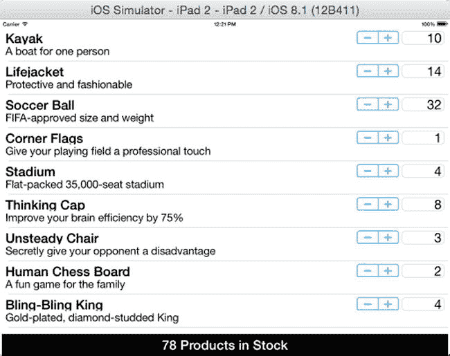

*图 3-18. 完成后的无结构 SportsStore 应用*

用户会看到一个产品列表，并可以使用`Stepper`和`Text Field`组件来更改每个产品的库存水平。库存总数显示在屏幕底部。

这个应用毫无疑问是基础性的，但它让我能够展示本书所需的 Xcode 技术，并提供了一个示例，我可以在其中应用不同的模式，同时向你展示代码片段。

## 总结

Xcode 是一款特性鲜明的开发工具，起初可能令人困惑，但它确实拥有一些创建应用的好工具。在本章中，我创建了一个尽可能少结构的 iOS 应用。我依靠这个应用在更广泛的背景下演示设计模式，以便为它们的使用提供更真实的场景。

