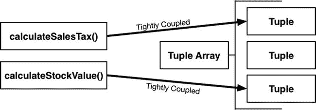
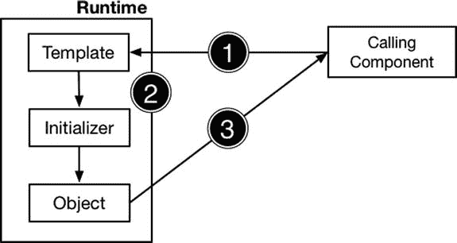
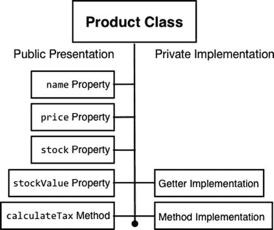
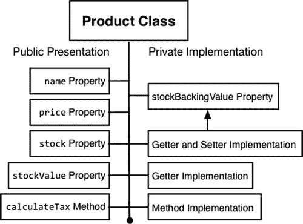
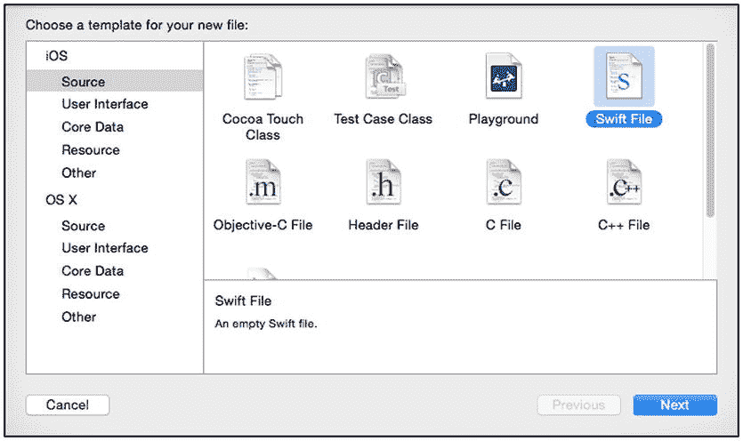
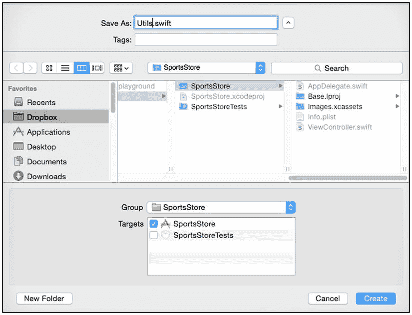
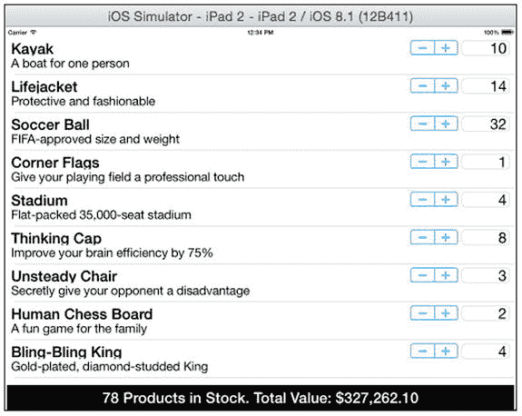

# 4. 对象模板模式

在本章中，我将介绍一种对于面向对象编程极为基础的技术，以至于它通常不被归类为设计模式：直接从类或结构体创建新对象。在后续章节中，我会描述管理对象创建的不同技术，但我想首先解释使用类和结构体作为创建对象的模板所带来的优势。这不仅是一个重要的主题本身，而且有助于阐明不使用模板创建对象时会出现的问题；它也为后续解释更高级模式的优势奠定了基础。表 4-1 将对象模板模式置于上下文中。

**表 4-1.** 将对象模板模式置于上下文中

| 问题 | 答案 |
| --- | --- |
| 这是什么？ | 对象模板模式使用类或结构体作为规范，为给定数据类型定义数据类型和逻辑。对象使用模板创建，并在初始化期间设置数据值，可以通过使用模板中的默认值，或使用组件提供给类或结构体初始化器（也称为构造器）的值来设置。 |
| 有什么好处？ | 对象模板模式为将数据值及其操作逻辑分组提供了基础，这被称为封装。封装允许对象向使用者呈现 API，同时隐藏该 API 的私有实现。这有助于防止组件之间的紧密耦合。 |
| 何时应使用此模式？ | 除最简单的项目外，所有项目都应使用此模式。Swift 元组是一个有趣的功能，但它们可能导致长期的维护问题，而创建简单的类或结构体只需稍微多花一点工作。 |
| 何时应避免此模式？ | 使用此模式没有缺点，但本书本部分的后续模式将展示更高级的使用技巧。 |
| 如何判断是否已正确实现该模式？ | 当你可以更改类或结构体的私有实现，而无需对使用它的组件进行相应更改时，说明该模式已正确实现。 |
| 有哪些常见陷阱？ | 此模式的唯一陷阱是，当你的本意是使用类时，却将结构体用作模板。结构体和类有很多共同点，但当从它们创建的对象被赋值给新变量时，它们的行为不同，我将在第 5 章中解释这一点。（还有其他区别，但与本主题无关。） |
| 有哪些相关模式？ | 我将在第 5 章中描述的原型模式，提供了另一种创建对象的技术。 |

## 准备示例项目

在本章中，我按照第 3 章中描述的相同过程，创建了一个名为 `ObjectTemplate` 的 Xcode OS X 命令行工具项目。目前无需其他准备。

## 理解该模式解决的问题

在第 3 章中，我使用 Swift 元组来定义 SportsStore 应用处理的数据。以下是该代码中的一个元组示例：

```
("Kayak", "A boat for one person", "Watersports", 275.0, 10)
```

元组是一组组合在一起的值，方便易用，但它们带来了一些问题，意味着应限制其使用。清单 4-1 显示了我添加到 `main.swift` 文件中的语句，Xcode 会将该文件添加到命令行工具项目中。

**清单 4-1.** `main.swift` 文件的内容

```
var products = [
    ("Kayak", "A boat for one person", 275.0, 10),
    ("Lifejacket", "Protective and fashionable", 48.95, 14),
    ("Soccer Ball", "FIFA-approved size and weight", 19.5, 32)
];

func calculateTax(product:(String, String, Double, Int)) -> Double {
    return product.2 * 0.2;
}

func calculateStockValue(tuples:[(String, String, Double, Int)]) -> Double {
    return tuples.reduce(0, {
        (total, product) -> Double in
        return total + (product.2 * Double(product.3))
    });
}

println("Sales tax for Kayak: $\(calculateTax(products[0]))");
println("Total value of stock: $\(calculateStockValue(products))");
```

在这段代码中，我定义了一个表示产品的元组数组，以及两个对这些元组进行操作的函数。`calculateTax` 函数定义了一个元组参数，用于计算价格的销售税（我住在伦敦，税率设为 20%，这是英国的销售税率）。`calculateStockValue` 函数对该元组数组进行操作，通过将库存数量乘以产品价格来计算总价值。我调用了这两个函数，并使用 `println` 函数输出结果。运行项目会在 Xcode 调试控制台中产生以下输出：

```
Sales tax for Kayak: $55.0
Total value of stock: $4059.3
```

本书反复出现的主题之一是，紧密耦合的组件是设计模式的对立面。当一个组件依赖于另一个组件的内部工作原理时，或者换种说法，当你更改一个组件而无需同时更新另一个组件时，这两个组件就是紧密耦合的。

“组件”这个术语定义较为宽泛，在这里我指的是元组数组以及对其进行操作的函数。图 4-1 展示了 playground 中两个函数与元组之间存在的紧密耦合。



**图 4-1.** playground 中的紧密耦合

这两个函数在定义参数的方式以及函数体内部都与元组紧密耦合。在定义操作元组的函数时，元组值的数量、顺序和类型必须完全匹配。在函数体中对元组进行操作时，用于获取或设置值的索引必须显式定义。以下是 `calculateSalesTax` 函数，其中我高亮显示了对元组的依赖：

```
func calculateTax(product: (String, String, String, Double, Int)) -> Double {
    return product.3 * 0.2;
}
```

以下是 `calculateStockValue` 函数所存在的依赖：

```
func calculateStockValue(tuples:[(String, String, Double, Int)]) -> Double {
    return tuples.reduce(0, {(total, product) -> Double in
        return total + (product.2 * Double(product.3))
    });
}
```

对元组结构的依赖意味着函数和元组是紧密耦合的。紧密耦合最明显的影响是，对元组的更改会迫使所有存在依赖的地方都进行相应更改。在清单 4-2 中，你可以看到当我从元组中删除一个值时会发生什么。

**清单 4-2.** 从 `main.swift` 文件的元组中删除一个值

```
var products = [
    ("Kayak", 275.0, 10),
    ("Lifejacket", 48.95, 14),
```


`("Soccer Ball", 19.5, 32)];`

`func calculateTax(product:(String, Double, Int)) -> Double {`

`return product.1 * 0.2;`

`}`

`func calculateStockValue(tuples:[(String, Double, Int)]) -> Double {`

`return tuples.reduce(0, {(total, product) -> Double in`

`return total + (product.1 * Double(product.2))`

`});`

`}`

`println("Sales tax for Kayak: $\(calculateTax(products[0]))");`

`println("Total value of stock: $\(calculateStockValue(products))");`

## 理解紧耦合为何会成为问题

紧耦合的组件会使代码更难维护，这意味着进行修改和测试其影响需要花费更多精力。如清单 4-2 所示，一个组件的变更会要求依赖其实现的组件也随之更改。在包含大量紧耦合的应用中，这些变更会在代码中级联传导，以至于进行一个简单的修复或添加一项新功能就变成了一次实质性的大重写。

松耦合组件是设计模式的一个关键目标，但正如我在第 1 章中解释的，将某种模式应用于应用并不总是合理的。在某些开发场景中，紧耦合是完全合理的，要么是因为它能带来性能提升（例如实时软件），要么是因为该应用不太可能需要任何维护（因为它极为简单或生命周期很短）。在判定你预计不会维护该代码时要谨慎；很少有应用最终符合这种情况，即便这最初就是该意图。

我移除了描述产品的值，且突出显示的语句显示了函数中所需的相应更改。在一个真实项目中，这些更改会逐渐累积，并且如果它们影响了其他紧耦合，那么更改的数量可能导致应用中很大一部分代码被修改。这种程度的更改难以管理，并且需要彻底的测试，以确保更改已一致地应用，并且没有引入任何新错误。

## 理解对象模板模式

对象模板模式使用一个类或结构体来定义一个模板，对象便基于此模板创建。当一个应用组件需要某个对象时，它通过指定模板名称以及运行时所需的用于配置对象的初始化数据值，来调用 Swift 运行时创建该对象。对象模板模式包含三个操作，如图 4-2 所示。



图 4-2. 对象模板模式

第一个操作是调用组件请求 Swift 运行时创建一个对象，并提供要使用的模板名称以及用于定制将要创建的对象的任何运行时数据值。

在第二个操作中，Swift 运行时分配存储该对象所需的内存，并使用模板创建它。模板包含初始化方法，这些方法用于通过设置对象的初始状态（通过调用组件提供的运行时值、模板中定义的值，或两者皆有）来让对象准备就绪，然后 Swift 运行时调用该初始化器以准备好对象供使用。在最后一个操作中，Swift 运行时将创建好的对象交给调用组件。这三个步骤可以反复重复，因此单个模板可用于创建多个对象。

### 理解类、结构体、对象和实例

有些面向对象编程术语在日常开发中使用较为随意，但在理解设计模式时可能会令人困惑。此模式的关键术语是类、结构体、对象和实例。

类和结构体都是模板，即 Swift 遵循对象模板模式所需的设计蓝图。Swift 遵循模板中的指令来创建新对象。同一个模板可被重复用于创建多个对象。每个对象都不同，但都是使用相同的指令创建的，就像一份食谱可以制作多个蛋糕一样（添加一个 `Int`、一个修改其值的方法，等等）。

实例一词与对象含义相同，但用于指代创建该对象所使用的模式的名称，因此一个 `Product` 对象也可以被称为 `Product` 类的一个实例。

要点在于，类和结构体是你在开发期间编写的指令，而对象是在应用运行时创建的。例如，当你更改对象存储的值时，它并不会更改用于创建它的模板。

## 实现对象模板模式

清单 4-3 展示了一个名为 `Product.swift` 的新文件的内容，我将其添加到了示例项目中，并用它来定义一个名为 `Product` 的类。

清单 4-3. Product.swift 文件的内容

```
class Product {
    var name:String;
    var description:String;
    var price:Double;
    var stock:Int;
    init(name:String, description:String, price:Double, stock:Int) {
        self.name = name;
        self.description = description;
        self.price = price;
        self.stock = stock;
    }
}
```

我在清单中创建了一个简单的类，以便尽可能贴近地复制基于元组的方法，但我稍后会为该类添加功能。清单 4-4 展示了我是如何更新 `main.swift` 文件以使用 `Product` 类的。

清单 4-4. 在 main.swift 文件中使用 Product 类

```
var products = [
    Product(name: "Kayak", description: "A boat for one person",
        price: 275, stock: 10),
    Product(name: "Lifejacket", description: "Protective and fashionable",
        price: 48.95, stock: 14),
    Product(name: "Soccer Ball", description: "FIFA-approved size and weight",
        price: 19.5, stock: 32)];

func calculateTax(product:Product) -> Double {
    return product.price * 0.2;
}

func calculateStockValue(productsArray:[Product]) -> Double {
    return productsArray.reduce(0, {(total, product) -> Double in
        return total + (product.price * Double(product.stock))
    });
}

println("Sales tax for Kayak: $\(calculateTax(products[0]))");
println("Total value of stock: $\(calculateStockValue(products))");
```

与大多数模式一样，使用一个类来定义对象的模板需要一些额外工作，但它有实质性的好处；事实上，这些好处对于有效的面向对象编程是如此基本，以至于类和结构体的使用通常被视为理所当然，即便存在更快速、更直接的方法（例如元组）也是如此。

使用元组时，数据结构定义和一组值的设置是在一个简单步骤中完成的，而使用模板则有两步：定义模板和使用模板创建对象。

## 理解该模式的优势

使用模板的好处是显著的，并且通常值得为定义模板付出努力，无论它是一个类还是一个结构体。元组是一个很棒的特性，但对于严肃的软件开发人员来说，类和结构体通常更可取，因为它们提供了元组无法匹敌的控制水平和松耦合特性，正如我在以下章节中解释的那样。


### 解耦的好处

为了让示例尽可能简单，清单 4-4 中的例子并未充分利用类和结构体提供的全部功能，但它足以说明：即使是最简单的模板，也能减少变更带来的影响。清单 4-5 展示了如何从 `Product` 类中移除 `description` 属性。

**清单 4-5.** 从 `Product` 类中移除一个属性

```
class Product {
    var name:String;
    var price:Double;
    var stock:Int;
    init(name:String, price:Double, stock:Int) {
        self.name = name;
        self.price = price;
        self.stock = stock;
    }
}
```

清单 4-6 展示了我在 `main.swift` 文件中做的相应修改。

**清单 4-6.** 更新 `main.swift` 文件以反映 `Product` 类的变更

```
var products = [
    Product(name: "Kayak", price: 275, stock: 10),
    Product(name: "Lifejacket", price: 48.95, stock: 14),
    Product(name: "Soccer Ball", price: 19.5, stock: 32)];

func calculateTax(product:Product) -> Double {
    return product.price * 0.2;
}

func calculateStockValue(productsArray:[Product]) -> Double {
    return productsArray.reduce(0, {
        (total, product) -> Double in
        return total + (product.price * Double(product.stock))
    });
}

println("Sales tax for Kayak: $\(calculateTax(products[0]))");
println("Total value of stock: $\(calculateStockValue(products))");
```

我更新了用于创建 `Product` 类实例的语句，使其不再为 `description` 属性提供值。需要注意的重要一点是，我对 `Product` 类所做的修改完全不影响 `calculateTax` 和 `calculateStockValue` 这两个函数，这是因为类中的每个属性都是独立于其他属性进行定义和访问的，并且这两个函数都不依赖于 `description` 属性。

使用类和结构体可以将变更的影响范围限制在直接受其影响的代码内，从而避免了在使用结构较松散的数据类型（例如元组）时可能出现的、大范围的连锁变更。

### 封装的好处

使用类或结构体作为数据对象模板最重要的好处在于它对封装的支持。封装是面向对象编程的核心思想之一，其中有两个方面与本章相关。

第一个方面是，封装允许将数据值以及对这些值进行操作的逻辑组合到一个单独的组件中。将数据和逻辑结合起来可以使代码更易于阅读，因为与该数据类型相关的所有内容都定义在同一个位置。清单 4-7 展示了如何更新 `Product` 类，使其包含一些逻辑。

**清单 4-7.** 在 `Product.swift` 文件中添加逻辑

```
class Product {
    var name:String;
    var price:Double;
    var stock:Int;
    init(name:String, price:Double, stock:Int) {
        self.name = name;
        self.price = price;
        self.stock = stock;
    }

    func calculateTax(rate: Double) -> Double {
        return self.price * rate;
    }

    var stockValue: Double {
        get {
            return self.price * Double(self.stock);
        }
    }
}
```

我添加了一个 `calculateTax` 方法，它接受一个税率作为参数并用于计算销售税，同时还添加了一个 `stockValue` 计算属性，它实现了一个 getter 子句来计算库存总价值。为了反映这些变更，我更新了 `main.swift` 文件中操作 `Product` 对象的代码语句，使其使用新的方法和属性，如清单 4-8 所示。

**清单 4-8.** 更新 `main.swift` 文件中的代码

```
var products = [
    Product(name: "Kayak", price: 275, stock: 10),
    Product(name: "Lifejacket", price: 48.95, stock: 14),
    Product(name: "Soccer Ball", price: 19.5, stock: 32)];

func calculateStockValue(productsArray:[Product]) -> Double {
    return productsArray.reduce(0, {(total, product) -> Double in
        return total + product.stockValue;
    });
}

println("Sales tax for Kayak: $\(products[0].calculateTax(0.2))");
println("Total value of stock: $\(calculateStockValue(products))");
```

这些看起来可能只是简单的改动，但发生了重要的事情：`Product` 类现在拥有了一个公共表现和一个私有实现，如图 4-3 所示。



**图 4-3.** `Product` 类的公共和私有方面

公共表现是其他组件可以使用的 API。任何组件都可以获取或设置 `name`、`price` 和 `stock` 属性的值，并以任何需要的方式使用它们。公共表现还包括 `stockValue` 属性和 `calculateTax` 方法，但——这是关键部分——不包括它们的实现。

**提示：** 不要将私有实现的概念与使用 `private` 关键字混淆。`private` 关键字限制了谁能使用类、方法或属性，但即使没有使用 `private` 关键字，方法和计算属性的实现对于调用它的组件来说也是不可见的。

在不暴露其实现的情况下展示属性或方法的能力，使得打破紧密耦合变得容易，因为其他组件不可能依赖于实现。例如，清单 4-9 展示了如何更改 `calculateTax` 方法的实现来定义一个最高税额。由于计算是在 `Product` 对象的实现内部执行的，因此其他组件无法察觉这个变更，它们相信 `Product` 类知道如何执行其计算。

**清单 4-9.** 更改 `Product.swift` 文件中的方法实现

```
...

func calculateTax(rate: Double) -> Double {
    return min(10, self.price * rate);
}

...
```

我使用了 Swift 标准库中的 `min` 函数将销售税额上限设定为 10 美元。我在清单 4-9 中只展示了 `calculateTax` 方法，因为在 Playground 中无需更改任何其他代码语句来适应新的税额计算；变更发生在 `Product` 类的私有实现部分，其他组件无法与之建立依赖关系。运行应用程序会产生以下结果：

```
Sales tax for Kayak: $10.0
Total value of stock: $4059.3
```


### 公开展示方式演进的益处

Swift 的一个优良特性是，你可以随着应用程序的变化来逐步演进类的公开展示方式。就目前的情况而言，`stock` 属性是一个标准的存储属性，可以被设置为任何`Int`值，但库存中出现负数是不合理的，这样做还会影响由 `stockValue` 计算型属性返回的结果。

Swift 允许我将 `stock` 存储属性无缝替换为一个计算型属性，该属性的实现可以强制执行验证策略，以确保库存水平永远不会低于零。清单 4-10 展示了我为改变属性处理方式所做的修改。

**清单 4-10.** 在 `Product.swift` 文件中添加计算型属性

```
class Product {
    var name:String;
    var price:Double;
    private var stockBackingValue:Int = 0;
    var stock:Int {
        get {
            return stockBackingValue;
        }
        set {
            stockBackingValue = max(0, newValue);
        }
    }
    init(name:String, price:Double, stock:Int) {
        self.name = name;
        self.price = price;
        self.stock = stock;
    }
    func calculateTax(rate: Double) -> Double {
        return min(10, self.price * rate);
    }
    var stockValue: Double {
        get {
            return self.price * Double(self.stock);
        }
    }
}
```

我定义了一个支撑变量来保存 `stock` 属性的值，并用一个带有 getter 和 setter 的计算型属性替换了存储属性 `stock`。getter 直接返回支撑属性的值（我将其命名为 `stockBackingValue`），而 setter 则使用标准库中的 `max` 函数，在尝试用负值设置该属性时，将支撑值设为零。这一修改的效果是，「Product」类的公开部分和私有部分都发生了变化，但这种变化不会影响使用该类的代码，如图 4-4 所示。



**图 4-4.** 将存储属性改为计算型属性的效果

清单 4-11 展示了我对 `main.swift` 文件所做的修改，以检验新的验证属性。

**清单 4-11.** 在 `main.swift` 文件中检查验证

```
var products = [
    Product(name: "Kayak", price: 275, stock: 10),
    Product(name: "Lifejacket", price: 48.95, stock: 14),
    Product(name: "Soccer Ball", price: 19.5, stock: 32)];

func calculateStockValue(productsArray:[Product]) -> Double {
    return productsArray.reduce(0, {(total, product) -> Double in
        return total + product.stockValue;
    });
}

println("Sales tax for Kayak: $\(products[0].calculateTax(0.2))");
println("Total value of stock: $\(calculateStockValue(products))");
products[0].stock = -50;
println("Stock Level for Kayak: \(products[0].stock)");
```

我在 playground 末尾添加了两条语句，用来测试 `stock` 属性处理负值的能力，除此之外不需要其他任何修改。特别地，那些依赖于 `stock` 属性的代码语句，并不知道该属性已从存储属性变为计算型属性。以下是运行示例应用程序时产生的控制台输出：

```
Sales tax for Kayak: $10.0
Total value of stock: $4059.3
Stock Level for Kayak: 0
```

最后一条消息展示了计算型属性的效果：我将 `stock` 属性设置为 `-50`，但获取属性值时，得到的是 `0`。

## 理解该模式的陷阱

使用此模式时需要避免的陷阱是选择了错误的模板类型，这通常意味着在更适合使用类的地方使用了结构体。Swift 的类和结构体有很多共同点，但在这种模式的上下文中有一个重要区别：结构体是值类型对象，而类是引用类型对象。我将在第 5 章（描述原型模式时）更详细地解释这个区别。

### Cocoa 中对象模板模式的示例

由于这是一个非常基础的模式，类和结构体在 Cocoa 框架及 Swift 内建类型中随处可见。诸如字符串、数组和字典等基本类型都是作为结构体实现的，而类则用于表示从网络连接到用户界面接口的各种事物。我不打算列出 iOS 和 Cocoa 框架中使用的所有类和结构体，但如果你想了解这个模式在 iOS 开发中的根深蒂固程度，可以看看我用来创建 SportsStore 应用程序的那些类。除了我在本章创建的 `Product` 类之外，我还使用了 `NSNumberFormatter` 来格式化货币字符串，使用 `UIViewController` 来管理应用程序呈现的视图，以及使用 `UILabel`、`UITextField` 和 `UIStepper` 等类来向用户展示布局组件。

## 将模式应用于 SportsStore 应用

在本节中，我将创建并使用一个 `Product` 类，将其用于移除 SportsStore 应用中的元组。如果你没有按照第 3 章中的步骤说明进行操作，也无需担心；你可以从 [Apress.com](https://Apress.com) 下载该项目的源代码，以及本书的所有源代码。

### 准备示例应用

本章的准备工作是创建一个 Swift 文件，我将使用它来定义与设计模式无直接关联的实用函数。要向项目添加新文件，请按住 Control 键并单击项目导航器中的 SportsStore 文件夹，然后从菜单中选择新文件。Xcode 会呈现不同文件类型的选择，如图 4-5 所示。



**图 4-5.** 选择新文件的类型

从 iOS ➤ 源类别中选择 Swift 文件，然后单击下一步按钮。将文件名设置为 `Utils.swift`，并确保在目标列表中勾选了 SportsStore，如图 4-6 所示。



**图 4-6.** 创建 `Product.swift` 文件

Xcode 将创建新文件并打开以供编辑。清单 4-12 展示了我如何使用该文件定义 `Utils` 类。

**清单 4-12.** `Utils.swift` 文件的内容

```
import Foundation;

class Utils {
    class func currencyStringFromNumber(number:Double) -> String {
        let formatter = NSNumberFormatter();
        formatter.numberStyle = NSNumberFormatterStyle.CurrencyStyle;
        return formatter.stringFromNumber(number) ?? "";
    }
}
```

我定义了一个类型方法（也称为静态方法），名为 `currencyStringFromNumber`，它接受一个`Double`值，并返回一个格式化为货币值的字符串。例如，值 `1000.1` 会被格式化为字符串 `$1,000.10`。（货币符号会根据设备的区域设置而应用。在美国以外的地区，美元符号可能会被其他符号替换，例如欧元符号或英镑符号。）

字符串格式化并非我在本表中描述的模式的一部分，因此我将这段代码定义在 `Utils.swift` 文件中，以避免干扰。当我在 SportsStore 布局底部标签所显示的信息中添加内容时，将使用这个新的类型方法。


### 创建 Product 类

正如我在“理解 Swift 访问控制”边栏中解释的那样，`private` 关键字并不会限制对同一类文件中定义代码的访问。由于我想强调该模式所提供的公开/私有分离，我将创建一个新文件并用它来定义 `Product` 类。按照我在上一节中描述的过程，在 SportsStore 项目中添加一个名为 `Product.swift` 的文件，并用它来定义清单 4-13 所示的类。

**清单 4-13.** `Product.swift` 文件的内容

```
class Product {

    private(set) var name:String;
    private(set) var description:String;
    private(set) var category:String;
    private var stockLevelBackingValue:Int = 0;
    private var priceBackingValue:Double = 0;

    init(name:String, description:String, category:String, price:Double,
        stockLevel:Int) {
        self.name = name;
        self.description = description;
        self.category = category;
        self.price = price;
        self.stockLevel = stockLevel;
    }

    var stockLevel:Int {
        get { return stockLevelBackingValue;}
        set { stockLevelBackingValue = max(0, newValue);}
    }

    private(set) var price:Double {
        get { return priceBackingValue;}
        set { priceBackingValue = max(1, newValue);}
    }

    var stockValue:Double {
        get {
            return price * Double(stockLevel);
        }
    }
}
```

清单 4-13 中所示的 `Product` 类强调将公开表示与私有实现分离，我通过几种方式实现了这一点。第一种方式是用 `private` 或 `private(set)` 注释属性。`private` 关键字将当前文件外部的代码隐藏其所应用的内容，这导致 `priceBackingValue` 和 `stockLevelBackingValue` 属性对 SportsStore 应用程序的其余部分完全不可见，因为 `Product.swift` 文件中只有 `Product` 类。

用 `private(set)` 注释属性意味着该属性可以被同一模块中其他文件的代码读取，但只能由 `Product.swift` 文件中的代码设置。我在清单 4-13 中对大部分属性使用了 `private(set)`，这使得属性的值可以通过传递给类初始化器的参数进行设置，但无法以其他方式设置。

> **提示**
> 
> 我本可以使用常量达到类似的效果，但在本章中我想强调对象模板模式，而 `private(set)` 是一个更有用的例子。

我使用的另一种技术是只定义了一个 `get` 子句的计算属性。计算属性的实现是私有的，尽管该属性本身在整个当前模块中都是可用的。

### 理解 Swift 访问控制

Swift 采用了一种不寻常的访问控制方法，这可能会让粗心的人措手不及。访问控制有三个级别，通过 `public`、`private` 和 `internal` 关键字来应用。`private` 关键字限制性最强；它将类、结构体、方法和属性的访问限制在同一文件中定义的代码。基于单个文件限制访问是一种与大多数语言不同的方法，这意味着 `private` 在 Xcode playground 中没有效果。

`internal` 关键字表示允许在当前模块内进行访问。这是默认的访问控制级别，如果未应用任何关键字，则使用该级别。对于大多数 iOS 开发者来说，`internal` 保护将允许一个类、结构体、方法、函数或属性在整个项目中使用。

`public` 关键字应用限制性最弱的控制级别，允许从任何地方进行访问，包括当前模块外部。这对于创建框架并且需要使用 `public` 关键字来定义框架向其他开发者提供的 API 的开发者来说最为有用。

如果你从 C# 或 Java 等语言转向 Swift，那么你可以通过在各自的 `.swift` 文件中定义每个类或结构体，并使用 `private` 和 `internal` 访问级别来最接近地重现你所习惯的访问控制。

### 应用 Product 类

应用 `Product` 类是一个简单的过程。为了使用 `Product` 类，我需要将 `ViewController.swift` 文件中的元组替换为 `Product` 实例，并将对单个元组值的引用替换为相应的 `Product` 属性。清单 4-14 显示了我所做的更改。

**清单 4-14.** 在 `ViewController.swift` 文件中应用 Product 类

```
import UIKit

class ProductTableCell : UITableViewCell {
    @IBOutlet weak var nameLabel: UILabel!
    @IBOutlet weak var descriptionLabel: UILabel!
    @IBOutlet weak var stockStepper: UIStepper!
    @IBOutlet weak var stockField: UITextField!
    var product:Product?;
}

class ViewController: UIViewController, UITableViewDataSource {
    @IBOutlet weak var totalStockLabel: UILabel!
    @IBOutlet weak var tableView: UITableView!
    var products = [
        Product(name:"Kayak", description:"A boat for one person",
            category:"Watersports", price:275.0, stockLevel:10),
        Product(name:"Lifejacket", description:"Protective and fashionable",
            category:"Watersports", price:48.95, stockLevel:14),
        Product(name:"Soccer Ball", description:"FIFA-approved size and weight",
            category:"Soccer", price:19.5, stockLevel:32),
        Product(name:"Corner Flags",
            description:"Give your playing field a professional touch",
            category:"Soccer", price:34.95, stockLevel:1),
        Product(name:"Stadium", description:"Flat-packed 35,000-seat stadium",
            category:"Soccer", price:79500.0, stockLevel:4),
        Product(name:"Thinking Cap",
            description:"Improve your brain efficiency by 75%",
            category:"Chess", price:16.0, stockLevel:8),
        Product(name:"Unsteady Chair",
            description:"Secretly give your opponent a disadvantage",
            category: "Chess", price: 29.95, stockLevel:3),
        Product(name:"Human Chess Board",
            description:"A fun game for the family", category:"Chess",
            price:75.0, stockLevel:2),
        Product(name:"Bling-Bling King",
            description:"Gold-plated, diamond-studded King",
            category:"Chess", price:1200.0, stockLevel:4)];

    override func viewDidLoad() {
        super.viewDidLoad()
        displayStockTotal();
    }

    override func didReceiveMemoryWarning() {
        super.didReceiveMemoryWarning()
    }

    func tableView(tableView: UITableView,
        numberOfRowsInSection section: Int) -> Int {
        return products.count;
    }

    func tableView(tableView: UITableView,
        cellForRowAtIndexPath indexPath: NSIndexPath) -> UITableViewCell {
        let product = products[indexPath.row];
        let cell = tableView.dequeueReusableCellWithIdentifier("ProductCell")
            as ProductTableCell;
        cell.product = products[indexPath.row];
        cell.nameLabel.text = product.name;
        cell.descriptionLabel.text = product.description;
        cell.stockStepper.value = Double(product.stockLevel);
        cell.stockField.text = String(product.stockLevel);
        return cell;
    }

    @IBAction func stockLevelDidChange(sender: AnyObject) {
        if var currentCell = sender as? UIView {
            while (true) {
                currentCell = currentCell.superview!;
                if let cell = currentCell as? ProductTableCell {
                    if let product = cell.product? {
                        if let stepper = sender as? UIStepper {
                            product.stockLevel = Int(stepper.value);
                        } else if let textfield = sender as? UITextField {
                            if let newValue = textfield.text.toInt()? {
                                product.stockLevel = newValue;
                            }
                        }
                        cell.stockStepper.value = Double(product.stockLevel);
                        cell.stockField.text = String(product.stockLevel);
                    }
                    break;
                }
            }
        }
        displayStockTotal();
    }

    func displayStockTotal() {
        let stockTotal = products.reduce(0,
            {(total, product) -> Int in return total + product.stockLevel});
        totalStockLabel.text = "\(stockTotal) Products in Stock";
    }
}
```


## 迁移至使用 `Product` 类

迁移至使用 `Product` 类非常简单。在准备代码清单 4-14 时，我首先在 `products` 数据数组中使用该类，然后修复所有编译器错误，直到所有对元组的引用都被替换。这是一个枯燥且容易出错的过程，因此，如果可能的话，最好从一开始就使用类和结构体来启动项目（遗憾的是，在接手现有代码时这并不总是可行）。

## 确保视图与模型分离

关于代码清单 4-14 中的代码，有几点需要注意。首先，`ViewController.swift` 文件定义了一个名为 `ProductTableCell` 的类，我用它来包含对应用布局中代表产品的 UI 组件的引用，并在用户更改库存水平时定位产品。在代码清单 4-14 中，我将一个引用 `products` 数组中元组索引位置的变量替换为了对 `Product` 对象的引用，如下所示：

```
class ProductTableCell : UITableViewCell {
    @IBOutlet weak var nameLabel: UILabel!
    @IBOutlet weak var descriptionLabel: UILabel!
    @IBOutlet weak var stockStepper: UIStepper!
    @IBOutlet weak var stockField: UITextField!
    var product:Product?;
}
```

你可能想知道为什么我没有将 `ProductTableCell` 与 `Product` 类合并，形成一个代表产品及其显示 UI 组件的单一实体。我将在第 5 部分描述模型/视图/控制器（MVC）模式时详细解释原因，但简而言之，将应用中的数据与其呈现给用户的方式分开是一种好的实践（用 MVC 的说法，就是将模型与视图分离）。强制执行这种分离使得相同的数据可以更容易地以不同方式显示。我可能需要为应用添加第二个视图，以网格形式展示产品，如果没有模型和视图之间的分离，合并后的类将需要包含两个视图中所有 UI 组件的引用，这会很快变得笨拙，并使应用修改变得棘手且容易出错。

## 扩展摘要显示

在本章中，我一直对元组持批评态度，但当它们以自包含的方式使用时，而不是用来表示应用全局数据时，它们可以是一种有用的语言特性。

在代码清单 4-15 中，你可以看到一个我喜欢使用元组的例子。我更改了 `ViewController` 类的 `displayStockTotal` 方法的实现，以便通过一次对全局 `reduce` 函数的调用来计算库存中的商品数量和库存总价值（我使用在代码清单 4-12 中定义的 `currencyStringFromNumber` 方法对其进行了格式化）。

**代码清单 4-15.** 在 ViewController.swift 文件中使用元组

```
func displayStockTotal() {
    let finalTotals:(Int, Double) = products.reduce((0, 0.0),
        {(totals, product) -> (Int, Double) in
            return (
                totals.0 + product.stockLevel,
                totals.1 + product.stockValue
            );
        });
    totalStockLabel.text = "\(finalTotals.0) Products in Stock. "
        + "Total Value: \(Utils.currencyStringFromNumber(finalTotals.1))";
}
```

元组允许我为每次 `reduce` 函数迭代生成两个总值（一个用于库存中的商品数量，一个用于库存价值）。我本可以通过其他方式实现这一点——例如定义一个具有两个属性的结构体，或者使用 `for` 循环枚举数组并更新两个局部变量——但使用元组能很好地配合 Swift 闭包，并生成简单易读的代码。这种用法（即创建一个类或结构体显得大材小用，因为数据不会在方法外部导出）发挥了元组的优势，并且不会导致在应用内部更广泛地传递元组时出现的紧耦合和维护问题。

你可以通过启动应用来查看我计算的额外总值的效果。布局底部的标签将显示库存中的商品数量和总值，如图 4-7 所示。



**图 4-7.** 向 SportsStore 应用的信息摘要添加内容

## 本章小结

在本章中，我描述了一个位于 Swift 开发核心的模式：定义一个用于创建对象的模板。这种模式的好处是它提供了基本工具，可用于拆分紧密耦合的组件，允许向对象的消费者呈现公共 API，并隐藏私有实现。在下一章中，我将介绍一种不同的对象创建方式：使用原型。

