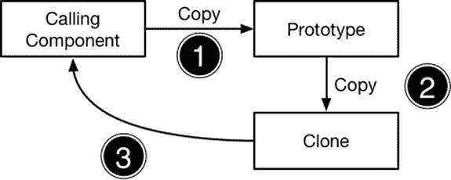
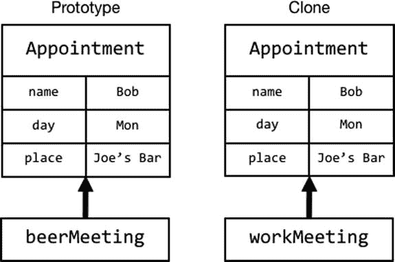
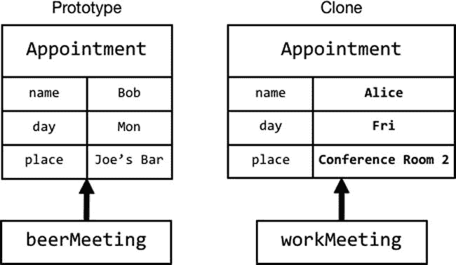
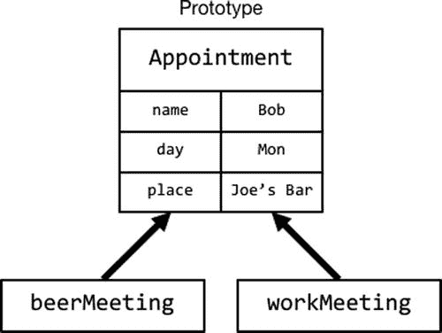
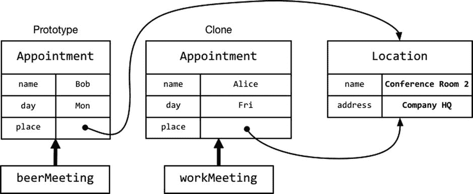
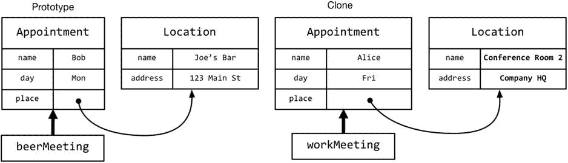

# 5. 原型模式

在本章中，我将介绍原型模式，该模式通过复制一个现有对象（称为原型）来创建新对象。原型本身是使用模板创建的（如第 4 章所述），但后续实例都是克隆体。表 5-1 将原型模式置于上下文中。

**表 5-1.** 将原型模式置于上下文中

| 问题 | 答案 |
| --- | --- |
| 它是什么？ | 原型模式通过复制一个现有对象（称为原型）来创建新对象。 |
| 有什么好处？ | 主要好处是向使用对象的组件隐藏创建对象的代码；这意味着组件不需要知道创建新对象需要哪个类或结构体，不需要知道初始化器的细节，并且在创建和实例化子类时也不需要更改。此模式还可用于避免每次创建特定类型的新对象时重复昂贵的初始化。 |
| 何时应该使用此模式？ | 当你编写一个需要创建对象新实例，但又不想依赖类初始化器的组件时，此模式非常有用。 |
| 何时应该避免此模式？ | 使用此模式没有缺点，但你应该了解本书本部分中的其他模式，以确保为你的应用选择最合适的模式。 |
| 如何知道你是否正确实现了该模式？ | 要测试此模式的有效实现，请更改用于原型对象的类或结构体的初始化器，并检查在创建克隆的组件中是否需要相应的更改。作为第二个测试，为原型类创建一个子类，并确保组件可以克隆它而无需任何更改。请参阅“实现原型模式”一节。 |
| 有哪些常见陷阱？ | 主要陷阱是在克隆原型对象时选择了错误的复制方式。有两种可用的复制方式——浅复制和深复制——为你的应用选择正确的类型非常重要。有关详细信息，请参阅“理解浅复制和深复制”一节。 |
| 是否有任何相关模式？ | 最相关的模式是我在第 4 章中描述的对象模板模式。另请参阅单例模式，它提供了一种共享单个对象的方法，以避免需要创建额外的实例。 |

## 理解该模式解决的问题

在第 4 章中，我解释了如何使用模板创建对象，但这种方法也有其自身的缺点，我将在以下部分中描述。


### 承担高昂的初始化成本

某些类或结构体模板的使用成本很高，这意味着初始化对象的新实例可能需要消耗大量内存或计算资源，才能让该对象准备好被使用。为了演示这类问题，我创建了 `Initialization.playground` 文件，其内容如代码清单 5-1 所示。

**代码清单 5-1.** `Initialization.playground` 文件的内容

```
class Sum {
    let resultsCache: [[Int]];
    var firstValue:Int;
    var secondValue:Int;
    init(first:Int, second:Int) {
        resultsCache = [[Int]](count: 10, repeatedValue:
            Int);
        for i in 0..<10 {
            for j in 0..<10 {
                resultsCache[i][j] = i + j;
            }
        }
        self.firstValue = first;
        self.secondValue = second;
    }
    var Result:Int {
        get {
            return firstValue < resultsCache.count
                && secondValue < resultsCache[firstValue].count
                ? resultsCache[firstValue][secondValue]
                : firstValue + secondValue;
        }
    }
}
var calc1 = Sum(first:0, second: 9).Result;
var calc2 = Sum(first:3, second: 8).Result;
println("Calc1: \(calc1) Calc2: \(calc2)");
```

我定义了一个名为 `Sum` 的类，它负责计算传入其初始化器的两个整数值之和。作为一种优化手段，`Sum` 类的初始化器创建了一个二维 `Int` 数组，并用预计算的值填充它，旨在用初始化期间的时间开销来换取后续更快速的计算。

定义好 `Sum` 类之后，我创建了两个实例并使用它们进行计算。每次创建新的 `Sum` 对象时，我都需要承担创建并填充那个二维数组的开销——这种开销既体现在存储计算值所需的内存上，也体现在计算资源上。最后，我将两个计算结果输出到控制台，得到如下输出：

```
Calc1: 9 Calc2: 11
```

这看起来可能是一个不切实际的例子，但这种编码风格却出奇地常见，通常是过早优化的结果——程序员在编写代码时试图推测性地提升性能，而不是基于后续的性能测试——这通常会导致性能更差且代码可读性更低。不过，这个例子中有两个方面不太现实。第一，`Sum` 类执行的工作非常简单，即使是最热衷于优化的程序员也不太可能认为缓存两个整数相加的开销是值得的。第二，playground 将 `Sum` 类以及创建其实例的两条语句放在了同一个文件中。在真实项目中，初始化代码埋藏在深层的类继承层级中，而使用该类的语句则位于应用程序完全不同的部分。

### 创建模板依赖关系

若想根据模板创建新对象，组件必须掌握三条信息：

- 与该对象关联的模板
- 必须调用的初始化器
- 初始化器参数的名称和类型

这些信息会在整个应用中散布开来，只要某处需要创建对象的新实例，就会用到它们。这带来的问题是，它会形成对模板的依赖：一旦模板发生变化，所有使用该模板创建对象的组件都必须更新，以反映这种变化。你可以在代码清单 5-2 中看到这一点，我在其中重新定义了 `Sum` 类，为其新增了一个初始化器参数。

**代码清单 5-2.** 在 `Initialization.playground` 文件中添加一个初始化器

```
class Sum {
    let resultsCache: [[Int]];
    var firstValue:Int;
    var secondValue:Int;
    init(first:Int, second:Int, cacheSize:Int) {
        resultsCache = [[Int]](count: cacheSize, repeatedValue:
            Int);
        for i in 0 ..< cacheSize {
            for j in 0 ..< cacheSize {
                resultsCache[i][j] = i + j;
            }
        }
        self.firstValue = first;
        self.secondValue = second;
    }
    var Result:Int {
        get {
            return firstValue < resultsCache.count
                && secondValue < resultsCache[firstValue].count
                ? resultsCache[firstValue][secondValue]
                : firstValue + secondValue;
        }
    }
}
var calc1 = Sum(first:0, second: 9, cacheSize:100).Result;
var calc2 = Sum(first:3, second: 8, cacheSize:20).Result;
println("Calc1: \(calc1) Calc2: \(calc2)");
```

这个初始化器参数用于控制生成的缓存结果数量。如清单所示，我必须更新创建 `Sum` 对象的语句，以使用修改后的初始化器。当创建 `Sum` 对象的仅有两条语句彼此紧挨着时，修改微不足道；但在真实项目中，这些构造语句可能分散在各处，每处语句都需对 `Sum` 类的实现有足够了解，才能为 `cacheSize` 初始化器参数提供一个合理的值。

> **提示**  
> 本章的目标是介绍原型模式，但解决这类问题还有其他方式。例如，我可以定义一个便利初始化器，它调用指定的初始化器，并为 `cacheSize` 参数提供一个默认值。正如我在第 1 章中解释的，模式并不总是问题的唯一解决方案。

## 理解原型模式

原型模式使用**现有对象**（而非类或结构体）来创建新对象。这通常被称为**克隆**，因为新对象是现有对象的完全副本，包括对象自创建以来对其存储属性所做的任何修改。图 5-1 展示了原型模式的工作原理。



**图 5-1.** 原型模式

原型模式包含三个操作。首先，需要对象的组件调用原始对象（称为**原型**）复制自身。第二个操作是复制过程，在此过程中创建一个新对象（称为**克隆体**）。在最后一个操作中，原型将克隆体交给调用组件，完成复制过程。


## 实现原型模式

当你将值类型赋值给新变量时，Swift 会自动应用原型模式。值类型通过`structs`（结构体）定义，所有 Swift 内置类型在底层都是以`structs`形式实现的。这意味着只需将字符串、布尔值、集合、枚举、元组和数值类型赋值给新变量，就能完成克隆。Swift 会复制该原型（prototype）的值，并以此创建一个克隆。清单 5-3 展示了`ValueTypes.playground`文件的内容，我创建此文件是为了演示值类型如何被克隆。

## 清单 5-3. `ValueTypes.playground`文件的内容

```
struct Appointment {
    var name:String;
    var day:String;
    var place:String;
    func printDetails(label:String) {
        println("\(label) with \(name) on \(day) at \(place)");
    }
}

var beerMeeting = Appointment(name: "Bob", day: "Mon", place: "Joe's Bar");
var workMeeting = beerMeeting;
workMeeting.name = "Alice";
workMeeting.day = "Fri";
workMeeting.place = "Conference Rm 2";
beerMeeting.printDetails("Social");
workMeeting.printDetails("Work");
```

我定义了一个名为`Appointment`的结构体，它拥有存储属性`name`、`day`、`place`，以及一个将属性值输出到控制台的`printDetails`方法。首先，我将该结构体作为模板来创建一个新对象，如下所示：

```
var beerMeeting = Appointment(name: "Bob", day: "Mon", place: "Joe's Bar");
```

原型模式显然需要一个原型对象，该对象通常从模板创建而来。这看似有悖直觉，但你总得先获得原型。一旦有了原型，我通过将其赋值给一个新变量来创建副本，如下所示：

```
var workMeeting = beerMeeting;
```

此时，我有两个独立的`Appointment`对象，分别赋值给了`beerMeeting`和`workMeeting`变量。两个对象的`name`、`day`和`place`属性拥有相同的值，如图 5-2 所示。



**图 5-2.** 克隆结构体原型的效果

创建克隆后，我为其`name`、`day`和`place`属性赋予新值，将其配置为代表与原型不同的另一项预约，如图 5-3 所示。



**图 5-3.** 配置克隆对象

最后，我在两个`Appointment`对象上分别调用`printDetails`方法，得到如下输出：

```
Social with Bob on Mon at Joe's Bar
Work with Alice on Fri at Conference Rm 2
```

一旦创建了原型，我就可以根据需求创建和配置任意数量的克隆，而无需承担使用结构体模板带来的额外开销。

### 克隆引用类型

使用类创建的对象是引用类型。当你将引用类型赋值给新变量时，Swift 不会复制这些对象，而是会创建该对象的一个新引用，使得两个变量指向同一个对象。清单 5-4 展示了`ReferenceTypes.playground`文件的内容。在该文件中，我重写了上一章的`Appointment`示例，使用类而非结构体作为模板。

## 清单 5-4. `ReferenceTypes.playground`文件的内容

```
class Appointment {
    var name:String;
    var day:String;
    var place:String;
    init(name:String, day:String, place:String) {
        self.name = name; self.day = day; self.place = place;
    }
    func printDetails(label:String) {
        println("\(label) with \(name) on \(day) at \(place)");
    }
}

var beerMeeting = Appointment(name: "Bob", day: "Mon", place: "Joe's Bar");
var workMeeting = beerMeeting;
workMeeting.name = "Alice";
workMeeting.day = "Fri";
workMeeting.place = "Conference Rm 2";
beerMeeting.printDetails("Social");
workMeeting.printDetails("Work");
```

除了使用`class`关键字外，我还为`Appointment`类添加了一个初始化器。Swift 会为结构体创建默认初始化器，但不会为类创建。除了使用类来定义`Appointment`类型外，此示例的代码与清单 5-3 完全相同。然而，控制台显示的结果却不同。

```
Social with Alice on Fri at Conference Rm 2
Work with Alice on Fri at Conference Rm 2
```

问题在于只有一个`Appointment`对象，而`workMeeting`和`beerMeeting`变量都指向它，如图 5-4 所示。



**图 5-4.** 将引用对象赋值给新变量

由于只有一个`Appointment`对象，我通过`workMeeting`变量对存储属性所做的更改，在通过`beerMeeting`变量访问这些属性时也会被读取到，这就是为什么控制台输出了意料之外且无用的结果。

### 实现`NSCopying`协议

为现有对象分配新引用是面向对象编程的重要组成部分，但这对于原型模式并无帮助。为了支持克隆，`Foundation`框架定义了`NSCopying`协议，它允许你指定对象应如何被克隆。清单 5-5 展示了我如何更新`Appointment`类以实现`NSCopying`协议。

## 清单 5-5. 在`ReferenceTypes.playground`文件中实现`NSCopying`协议

```
import Foundation

class Appointment : NSObject, NSCopying {
    var name:String;
    var day:String;
    var place:String;
    init(name:String, day:String, place:String) {
        self.name = name; self.day = day; self.place = place;
    }
    func printDetails(label:String) {
        println("\(label) with \(name) on \(day) at \(place)");
    }
    func copyWithZone(zone: NSZone) -> AnyObject {
        return Appointment(name:self.name, day:self.day, place:self.place);
    }
}

var beerMeeting = Appointment(name: "Bob", day: "Mon", place: "Joe's Bar");
var workMeeting = beerMeeting.copy() as Appointment;
workMeeting.name = "Alice";
workMeeting.day = "Fri";
workMeeting.place = "Conference Rm 2";
beerMeeting.printDetails("Social");
workMeeting.printDetails("Work");
```

**提示：** 你只能在类上实现`NSCopying`协议，而不能在结构体上实现。结构体始终只进行浅拷贝。

`NSCopying`协议定义了`copyWithZone`方法，该方法在对象被复制时调用。复制对象所使用的机制留给类来实现。在此例中，我使用当前对象的存储属性值创建了一个`Appointment`类的新实例。

**提示：** 在实现`copyWithZone`方法时，可以忽略`NSZone`参数。

为了利用`NSCopying`协议，我必须修改`Appointment`类，使其继承自定义了`copy`方法的`NSObject`。要复制一个`Appointment`对象，我需要在原型上调用`copy`方法（而不是`copyWithZone`），如下所示：

```
var workMeeting = beerMeeting.copy() as Appointment;
```

`copyWithZone`方法返回`AnyObject`，这意味着我必须使用`as`关键字将`copy`方法创建的对象向下转型，以便`workMeeting`变量具有正确的类型。

**注意：** 实现`NSCopying`协议并不会将引用类型转变为值类型。你必须调用`copy`方法来克隆原型。如果只是简单地将原型赋值给一个新变量，你得到的将是指向原型的另一个引用，而不是一个新对象。


### 理解浅拷贝与深拷贝

原型模式的一个重要方面是对象是通过深拷贝还是浅拷贝来克隆的，这涉及到如何处理指向其他引用类型的存储属性。在代码清单 5-6 中，我在 `ReferenceTypes`  playground 中定义了一个新类，并为 `Appointment` 类添加了一个新属性，该属性指向该类的一个实例。

**代码清单 5-6.** 在 `ReferenceTypes.playground` 文件中添加引用类型属性

```
import Foundation

class Location {
    var name:String;
    var address:String;

    init(name:String, address:String) {
        self.name = name; self.address = address;
    }
}

class Appointment : NSObject, NSCopying {
    var name:String;
    var day:String;
    var place:Location;

    init(name:String, day:String, place:Location) {
        self.name = name; self.day = day; self.place = place;
    }

    func printDetails(label:String) {
        println("\(label) with \(name) on \(day) at \(place.name), "
            + "\(place.address)");
    }

    func copyWithZone(zone: NSZone) -> AnyObject {
        return Appointment(name:self.name, day:self.day,
            place:self.place);
    }
}

var beerMeeting = Appointment(name: "Bob", day: "Mon",
    place: Location(name:"Joe's Bar", address: "123 Main St"));
var workMeeting = beerMeeting.copy() as Appointment;
workMeeting.name = "Alice";
workMeeting.day = "Fri";
workMeeting.place.name = "Conference Rm 2";
workMeeting.place.address = "Company HQ";
beerMeeting.printDetails("Social");
workMeeting.printDetails("Work");
```

我创建了一个简单的 `Location` 类，并将其用于 `Appointment` 对象的 `place` 属性。以下是控制台显示的输出：

```
Social with Bob on Mon at Conference Rm 2, Company HQ
Work with Alice on Fri at Conference Rm 2, Company HQ
```

同样，我通过 `workMeeting` 变量所做的更改，也影响了通过 `beerMeeting` 变量可以访问的存储值。这是因为我将 `place` 属性的类型从值类型（`String`）更改为引用类型（`Location`），并且我的 `NSCopying` 协议实现为原型的 `Location` 对象创建了一个新的引用，如图 5-5 所示。



**图 5-5.** 克隆原型时拷贝引用所产生的影响

这被称为浅拷贝，即拷贝的是对象的引用，而非对象本身。如图 5-5 所示，存在两个 `Appointment` 对象，但它们的 `place` 属性指向的是同一个 `Location` 对象。这就是为什么我通过 `workMeeting.place` 属性所做的更改会影响到通过 `beerMeeting.place` 属性获取的值。

> **提示：** 与 `NSCopying` 协议相关的是 `@NSCopying` 属性特性，它可以应用于存储属性。`@NSCopying` 特性会自动调用分配给该注解属性的对象的 `copyWithZone` 方法，我将在本章后面的“Cocoa 中原型模式的示例”一节中演示其用法。

#### 实现深拷贝

深拷贝会创建原型所有引用对象的副本，在本例中，这将确保每个 `Appointment` 对象通过其 `place` 属性指向不同的 `Location` 对象。代码清单 5-7 展示了如何在 `ReferenceTypes` playground 中实现深拷贝。

**代码清单 5-7.** 在 `ReferenceTypes.playground` 文件中实现深拷贝

```
import Foundation

class Location : NSObject, NSCopying {
    var name:String;
    var address:String;

    init(name:String, address:String) {
        self.name = name; self.address = address;
    }

    func copyWithZone(zone: NSZone) -> AnyObject {
        return Location(name: self.name, address:self.address);
    }
}

class Appointment : NSObject, NSCopying {
    var name:String;
    var day:String;
    var place:Location;

    init(name:String, day:String, place:Location) {
        self.name = name; self.day = day; self.place = place;
    }

    func printDetails(label:String) {
        println("\(label) with \(name) on \(day) at \(place.name), "
            + "\(place.address)");
    }

    func copyWithZone(zone: NSZone) -> AnyObject {
        return Appointment(name:self.name, day:self.day,
            place:self.place.copy() as Location);
    }
}

var beerMeeting = Appointment(name: "Bob", day: "Mon",
    place: Location(name:"Joe's Bar", address: "123 Main St"));
var workMeeting = beerMeeting.copy() as Appointment;
workMeeting.name = "Alice";
workMeeting.day = "Fri";
workMeeting.place.name = "Conference Rm 2";
workMeeting.place.address = "Company HQ";
beerMeeting.printDetails("Social");
workMeeting.printDetails("Work");
```

为了创建深拷贝，我必须在 `Location` 类上实现 `NSCopying` 协议，将基类改为 `NSObject`，并定义 `copyWithZone` 方法。你想要深拷贝的所有引用类型都必须实现 `NSCopying` 协议，因此你必须在原型所引用的所有类中重复此过程，包括那些通过其他引用间接引用的类。

#### 选择浅拷贝还是深拷贝

在浅拷贝和深拷贝之间进行选择并没有硬性规定，必须根据具体的类逐个做出决定。你应该考虑三个因素：拷贝一个对象所需的工作量、存储副本所需的内存量，以及拷贝对象的使用方式。

最后一个因素——拷贝对象将如何使用——是最重要的。以代码清单 5-7 中的 `Location` 类为例，在 `Appointment` 对象之间共享对象是毫无意义的，因为对一个预约地点所做的更改不太可能适用于引用同一个 `Location` 对象的其他预约，尤其是在社交预约和工作预约混在一起的情况下。

可能存在一组相关的预约，它们共享一个地点会带来好处。例如，设想一整天的系列会议都在同一个会议室举行——你的应用程序可能会从优化相关会议的 `Location` 对象创建中受益。在这种情况下，你应该权衡创建和存储新对象所需的计算量和内存，与管理共享对象引用的复杂性之间的利弊。在 `Appointment`/`Location` 示例中，`Location` 对象非常容易创建，并且需要的存储空间极小（仅两个 `String` 值），因此，为了确定何时可以共享 `Location` 对象以及何时不能而付出的开销和复杂性是完全不合理的。

我能给出的最佳建议是，仔细思考对象的用途，并弄清楚哪些对象是打算在你从原型创建的所有副本中通用的。如果你不确定，那么先从浅拷贝开始，因为它是最简单的实现方式——它并不总是正确的技术，但它能让你在不需在整个应用程序中实现 `NSCopying` 协议的情况下测试更改带来的影响。


如前所述，实现`NSCopying`协议并不会将引用类型转换为值类型，因此我必须调用`copy`方法来创建`Appointment`原型的`Location`对象的克隆，这正是我在`Appointment`类定义的`copyWithZone`方法中所做的。

```
func copyWithZone(zone: NSZone) -> AnyObject {
    return Appointment(name:self.name, day:self.day,
        place:self.place.copy() as Location);
}
```

这些改动意味着`Appointment`原型及其`Location`对象都被克隆了，如图 5-6 所示。



图 5-6. 深拷贝的效果

你可以通过查看示例代码的控制台输出来观察深拷贝的效果，如下所示：

```
Social with Bob on Mon at Joe's Bar, 123 Main St
Work with Alice on Fri at Conference Rm 2, Company HQ
```

由于`Appointment`对象拥有各自的`Location`对象，因此通过`workMeeting`变量应用的更改不会影响到通过`beerMeeting`变量访问的对象。

### 拷贝数组

Swift 数组被实现为结构体，这使其成为值类型。当你将数组赋值给一个新变量时，数组本身以及其中包含的任何值类型都会被拷贝。数组中包含的引用类型会被浅拷贝，因此原型数组和克隆数组都将包含对相同对象的引用。清单 5-8 展示了`ArrayCopy.playground`文件的内容，我创建该文件用于演示。

**清单 5-8.** `ArrayCopy.playground`文件的内容

```
import Foundation

class Person : NSObject, NSCopying {
    var name:String;
    var country:String;
    init(name:String, country:String) {
        self.name = name; self.country = country;
    }
    func copyWithZone(zone: NSZone) -> AnyObject {
        return Person(name: self.name, country: self.country);
    }
}

var people = [Person(name:"Joe", country:"France"),
    Person(name:"Bob", country:"USA")];
var otherpeople = people;
people[0].country = "UK";
println("Country: \(otherpeople[0].country)");
```

> **提示：** 作为一种性能优化，Swift 数组只有在被修改时才会被拷贝，这被称为**惰性拷贝**。在日常使用中你无需担心这一点，因为它在后台无缝进行，但这意味着如果你只是读取数组内容，克隆数组的行为就像引用类型；一旦你进行修改，它就会表现得像值类型。

我创建了一个名为`people`的数组，其中包含两个`Person`对象。我将该数组赋值给一个名为`otherpeople`的变量，然后修改`people`数组中的第一个对象。以下是控制台输出，显示数组内容是浅拷贝的，尽管数组本身是一个结构体：

```
Country: UK
```

要深拷贝一个数组，你必须检查数组中的每个元素，查找其类派生自`NSObject`并实现了`NSCopying`协议的对象，如清单 5-9 所示。

**清单 5-9.** 在`ArrayCopy.playground`文件中深拷贝数组

```
import Foundation

class Person : NSObject, NSCopying {
    var name:String;
    var country:String;
    init(name:String, country:String) {
        self.name = name; self.country = country;
    }
    func copyWithZone(zone: NSZone) -> AnyObject {
        return Person(name: self.name, country: self.country);
    }
}

func deepCopy(data:[AnyObject]) -> [AnyObject] {
    return data.map({item -> AnyObject in
        if (item is NSCopying && item is NSObject) {
            return (item as NSObject).copy();
        } else {
            return item;
        }
    })
}

var people = [Person(name:"Joe", country:"France"),
    Person(name:"Bob", country:"USA")];
var otherpeople = deepCopy(people) as [Person];
people[0].country = "UK";
println("Country: \(otherpeople[0].country)");
```

> **提示：** 在“Cocoa 中原型模式的示例”一节中，我将解释如何拷贝由`NSArray`和`NSMutableArray`类实现的 Cocoa 数组。这些类的行为与我在此节描述的内置 Swift 数组不同，理解其工作原理在处理 Objective-C 代码时会很有用。

我定义了一个名为`deepCopy`的函数，它接受一个数组并使用`map`方法来拷贝数组。我传递给`map`方法的闭包会检查对象是否可以被深拷贝，如果可以，则调用`copy`方法。其他对象则不加修改地添加到结果数组中。如下控制台输出所示，深拷贝后的数组不再包含对相同对象的引用：

```
Country: France
```

## 理解原型模式的优点

在以下小节中，我将描述原型模式提供的优点。其中一些优点解决了我在本章开头指出的问题，但还有一些额外的优点源于通过`NSCopying`协议拷贝对象的方式。


### 避免昂贵的初始化操作

使用`NSCopying`协议可以让对象自行负责复制，这意味着克隆可以避免昂贵的初始化操作。在本章开头，我使用了`Initialization.playground`文件定义了一个`Sum`类，该类在其初始化器中生成了一个缓存结果数组，如代码清单 5-10 所示。

**代码清单 5-10.** `Initialization.playground`文件的内容

```swift
class Sum {
    let resultsCache: [[Int]];
    var firstValue:Int;
    var secondValue:Int;
    init(first:Int, second:Int) {
        resultsCache = [[Int]](count: 10, repeatedValue:
            Int);
        for i in 0..<10 {
            for j in 0..<10 {
                resultsCache[i][j] = i + j;
            }
        }
        self.firstValue = first;
        self.secondValue = second;
    }
    var Result:Int {
        get {
            return firstValue < resultsCache.count
                && secondValue < resultsCache[firstValue].count
                ? resultsCache[firstValue][secondValue]
                : firstValue + secondValue;
        }
    }
}
var calc1 = Sum(first:0, second: 9).Result;
var calc2 = Sum(first:3, second: 8).Result;
println("Calc1: \(calc1) Calc2: \(calc2)");
```

每次创建`Sum`对象时，都需要承担分配和填充二维数组`resultsCache`的开销。通过实现`NSCopying`协议，我可以应用原型模式，并在`copyWithZone`方法中选择性地克隆对象，如代码清单 5-11 所示。

**代码清单 5-11.** 在`Initialization.playground`文件中应用原型模式

```swift
import Foundation

class Sum : NSObject, NSCopying {
    let resultsCache: [[Int]];
    var firstValue:Int;
    var secondValue:Int;
    init(first:Int, second:Int) {
        resultsCache = [[Int]](count: 10, repeatedValue:
            Int);
        for i in 0..<10 {
            for j in 0..<10 {
                resultsCache[i][j] = i + j;
            }
        }
        self.firstValue = first;
        self.secondValue = second;
    }
    private init(first:Int, second:Int, cache:[[Int]]) {
        self.firstValue = first;
        self.secondValue = second;
        resultsCache = cache;
    }
    var Result:Int {
        get {
            return firstValue < resultsCache.count
                && secondValue < resultsCache[firstValue].count
                ? resultsCache[firstValue][secondValue]
                : firstValue + secondValue;
        }
    }
    func copyWithZone(zone: NSZone) -> AnyObject {
        return Sum(first:self.firstValue,
            second: self.secondValue,
            cache: self.resultsCache);
    }
}

var prototype = Sum(first:0, second:9);
var calc1 = prototype.Result;
var clone = prototype.copy() as Sum;
clone.firstValue = 3; clone.secondValue = 8;
var calc2 = clone.Result;
println("Calc1: \(calc1) Calc2: \(calc2)");
```

我修改了类声明，使基类变为`NSObject`（它提供了`copy`方法），并实现了`NSCopying`协议。为了支持克隆，我添加了一个新的初始化器，它接受缓存数据作为参数，而不是自行生成数据。我用`private`关键字标注了这个初始化器，这样我就能在`copyWithZone`函数中使用它，通过原型生成的缓存数据克隆对象，同时防止其他组件提供自己的结果数据。

### 分离对象的创建与使用

正如我在本章前面解释的那样，从模板创建对象需要掌握三方面的知识：

- 与对象关联的模板
- 必须调用的初始化器
- 初始化器参数的名称和类型

原型模式允许组件从原型创建新对象，而无需了解模板的任何信息，这意味着你可以更改类或结构体，而无需修改需要创建其实例的组件。换句话说，你可以通过将对象的创建方式与使用方式分离，来最小化对已定义模板的依赖数量。遵循原型模式的组件无需知道它们所克隆的原型对象的类型，这使得在需要创建新对象的组件中，可以限制对子类的了解程度。这是一个容易引起混淆的好处，因此我将分阶段构建示例。代码清单 5-12 展示了`Hiding.playground`文件的内容，我是为此示例创建的。

**代码清单 5-12.** `Hiding.playground`文件的内容

```swift
import Foundation

class Message {
    var to:String;
    var subject:String;
    init(to:String, subject:String) {
        self.to = to; self.subject = subject;
    }
}

class MessageLogger {
    var messages:[Message] = [];
    func logMessage(msg:Message) {
        messages.append(msg);
    }
    func processMessages(callback:Message -> Void) {
        for msg in messages {
            callback(msg);
        }
    }
}

var logger = MessageLogger();
var message = Message(to: "Joe", subject: "Hello");
logger.logMessage(message);
message.to = "Bob";
message.subject = "Free for dinner?";
logger.logMessage(message);
logger.processMessages({msg -> Void in
    println("Message - To: \(msg.to) Subject: \(msg.subject)");
});
```

我定义了一个`Message`类，它拥有`to`和`subject`存储属性，以及一个`MessageLogger`类，它存储传递给其`logMessage`方法的`Message`对象，并通过传递给`processMessages`方法的闭包处理存储的对象。

本例中的问题始于一个事实：我重复使用了`Message`对象，这是一种常见的优化——尽管是针对更复杂的类型。（请暂时忽略重复使用对象的好处；这是一种通常几乎不加思索就会应用的优化，即使创建对象的成本微不足道。）

```
...
message.to = "Bob";
message.subject = "Free for dinner?";
logger.logMessage(message);
...
```

重复使用`Message`对象带来的影响是，`MessageLogger`类定义的数组中填满了对同一对象的引用。你可以在控制台输出中看到这个问题的效果，该输出由我传递给`processMessages`方法的闭包生成。

```
Message - To: Bob Subject: Free for dinner?
Message - To: Bob Subject: Free for dinner?
```

## （并非真正）解决问题

如果你不熟悉原型模式，或者不喜欢`NSCopying`协议的工作方式，你可能会倾向于修改`MessageLogger`类，使其使用类初始化器创建自己的`Message`对象，如代码清单 5-13 所示。

**代码清单 5-13.** 在`Hiding.playground`文件中修改`MessageLogger`类

```swift
...
class MessageLogger {
    var messages:[Message] = [];
    func logMessage(msg:Message) {
        messages.append(Message(to: msg.to, subject: msg.subject));
    }
    func processMessages(callback:Message -> Void) {
        for msg in messages {
            callback(msg);
        }
    }
}
...
```

**提示**

我无法仅通过存储数据值来解决此问题，因为传递给`process`方法的闭包期望处理的是`Message`对象。而且，正如你稍后将了解的那样，还有一个更严重的潜在问题需要解决，而提取数据值是无法解决的。

这种方法解决了问题，如下面的控制台输出所示：

```
Message - To: Joe Subject: Hello
Message - To: Bob Subject: Free for dinner?
```


## 揭示根本问题

直接问题已经得到解决，但我只是为将来埋下了隐患，因为 `MessageLogger` 类现在依赖于能够通过调用 `Message` 类的初始化器来创建 `Message` 对象。当我将 `Message` 子类化以创建更专业的类时，我的方案就失效了，如代码清单 5-14 所示。

**代码清单 5-14.** 在 `Hiding.playground` 文件中添加一个子类

```
import Foundation

class Message {
    var to:String;
    var subject:String;

    init(to:String, subject:String) {
        self.to = to; self.subject = subject;
    }
}

class DetailedMessage : Message {
    var from:String;

    init(to: String, subject: String, from:String) {
        self.from = from;
        super.init(to: to, subject: subject);
    }
}

class MessageLogger {
    var messages:[Message] = [];

    func logMessage(msg:Message) {
        messages.append(Message(to: msg.to, subject: msg.subject));
    }

    func processMessages(callback:Message -> Void) {
        for msg in messages {
            callback(msg);
        }
    }
}

var logger = MessageLogger();
var message = Message(to: "Joe", subject: "Hello");
logger.logMessage(message);
message.to = "Bob";
message.subject = "Free for dinner?";
logger.logMessage(message);
logger.logMessage(DetailedMessage(to: "Alice", subject: "Hi!", from: "Joe"));
logger.processMessages({msg -> Void in
    if let detailed = msg as? DetailedMessage {
        println("Detailed Message - To: \(detailed.to) From: \(detailed.from)"
        + " Subject: \(detailed.subject)");
    } else {
        println("Message - To: \(msg.to) Subject: \(msg.subject)");
    }
});
```

我对 `Message` 进行了子类化，定义了 `DetailedMessage` 类，并创建了该子类的一个实例，以便将其传递给 `MessageLogger` 定义的 `logMessage` 方法。我还修订了传递给 `processMessages` 方法的闭包，使其能输出 `DetailedMessage` 对象存储的额外属性。

问题在于，`MessageLogger` 类接收到了 `Message` 和 `DetailedMessage` 对象，但它只向自身的存储数组添加了 `Message` 对象。当调用 `processMessage` 方法时，只会显示 `to` 和 `subject` 属性，而 `from` 属性中包含的额外细节则永久丢失了。下面是代码清单 5-14 的控制台输出：

```
Message - To: Joe Subject: Hello
Message - To: Bob Subject: Free for dinner?
Message - To: Alice Subject: Hi!
```

## （并非真正）解决问题

如果不使用原型模式，解决第二个问题的明显方法是让 `MessageLogger` 类知晓存在 `Message` 和 `DetailedMessage` 类，以及如何分别创建它们，如代码清单 5-15 所示。

**代码清单 5-15.** 在 `Hiding.playground` 文件中修改 `MessageLogger` 类

```
...
class MessageLogger {
    var messages:[Message] = [];

    func logMessage(msg:Message) {
        if let detailed = msg as? DetailedMessage {
            messages.append(DetailedMessage(to: detailed.to,
                subject: detailed.subject, from: detailed.from));
        } else {
            messages.append(Message(to: msg.to, subject: msg.subject));
        }
    }

    func processMessages(callback:Message -> Void) {
        for msg in messages {
            callback(msg);
        }
    }
}
...
```

这通过增加 `MessageLogger` 类对 `Message` 类及其子类的了解程度，解决了当前问题。但每当我创建一个新的子类或更改任何初始化器时，都需要更新 `logMessage` 方法，这导致代码维护工作量的增加，是我们不希望看到的。

### 应用原型模式

我可以通过实现 `NSCopying` 协议并使用原型模式来克隆 `MessageLogger` 类所处理的对象，从而创建一种更好的方法，如代码清单 5-16 所示。

**代码清单 5-16.** 在 `Hiding.playground` 文件中应用原型模式

```
import Foundation

class Message : NSObject, NSCopying {
    var to:String;
    var subject:String;

    init(to:String, subject:String) {
        self.to = to; self.subject = subject;
    }

    func copyWithZone(zone: NSZone) -> AnyObject {
        return Message(to: self.to, subject: self.subject);
    }
}

class DetailedMessage : Message {
    var from:String;

    init(to: String, subject: String, from:String) {
        self.from = from;
        super.init(to: to, subject: subject);
    }

    override func copyWithZone(zone: NSZone) -> AnyObject {
        return DetailedMessage(to: self.to,
            subject: self.subject, from: self.from);
    }
}

class MessageLogger {
    var messages:[Message] = [];

    func logMessage(msg:Message) {
        messages.append(msg.copy() as Message);
    }

    func processMessages(callback:Message -> Void) {
        for msg in messages {
            callback(msg);
        }
    }
}

var logger = MessageLogger();
var message = Message(to: "Joe", subject: "Hello");
logger.logMessage(message);
message.to = "Bob";
message.subject = "Free for dinner?";
logger.logMessage(message);
logger.logMessage(DetailedMessage(to: "Alice", subject: "Hi!", from: "Joe"));
logger.processMessages({msg -> Void in
    if let detailed = msg as? DetailedMessage {
        println("Detailed Message - To: \(detailed.to) From: \(detailed.from)"
        + " Subject: \(detailed.subject)");
    } else {
        println("Message - To: \(msg.to) Subject: \(msg.subject)");
    }
});
```

我将 `Message` 类的基类型更改为 `NSObject`，并在 `Message` 和 `DetailedMessage` 类中实现了 `copyWithZone` 方法。这使得我能够克隆传递给 `logMessage` 方法的对象，而无需担心子类或初始化器的问题。

**提示**

请注意，我不需要在 `DetailedMessage` 类中实现 `NSCopying` 协议，因为它继承自 `Message` 类。我所需要做的只是重写 `copyWithZone` 方法。

控制台中显示的输出表明，应用原型模式确保了由 `DetailedMessage` 类定义的额外属性不会丢失。

```
Message - To: Joe Subject: Hello
Message - To: Bob Subject: Free for dinner?
Detailed Message - To: Alice From: Joe Subject: Hi!
```

应用原型模式的优点是，只要对象最初是从 `Message` 类或其某个子类创建的，就可以被克隆；创建新的子类或修改类的初始化器不需要对 `MessageLogger` 类进行任何更改，这使得代码更加灵活且易于维护。

**提示**

只需多付出一点努力，我就可以完全打破对 `Message` 类的依赖，创建一个可以克隆对象的通用类。有关详细信息，请参见“将模式应用于 SportsStore 应用程序”一节。

## 理解原型模式的陷阱

在使用原型模式时，有几个陷阱需要避免，我将在以下各节中进行描述。

### 理解深拷贝与浅拷贝的陷阱

第一个要避免的陷阱是，在需要深拷贝时却执行了浅拷贝。在克隆对象时，仔细考虑是需要创建一个完全独立的副本，还是简单的引用就足够了。创建引用比执行深拷贝更快更简单，但这确实意味着两个或更多引用将指向同一个对象。

此外，请不要忘记，需要考虑正在克隆的整个对象层级结构，而不仅仅是调用 `copy` 方法的那个对象。对于每个指向引用类型的变量，都必须做出浅拷贝与深拷贝的决策。有关详细信息和示例，请参见本章前面的“实现深拷贝”一节。


### 理解“暴露原型陷阱”

一个常见的陷阱是强制要求存在一个用于创建所有克隆对象的单一原型对象。这会导致扭曲的代码结构，使得原型为了防范复制需求而暴露给应用中的每一个组件。不要害怕在你的应用的每个逻辑部分中拥有多个原型，也不要忘记你可以从克隆体创建副本。

**提示：** 原型模式的一些拥护者认为，你不应该使用原型对象异常来创建克隆。我不同意这种限制，并且认为克隆任何支持原型模式的对象都没有害处，包括正在用于执行工作的对象和克隆对象本身。

### 理解“非标准协议陷阱”

实现原型模式的 iOS 标准方式是实现 `NSCopying` 协议，并确保原型的基类是 `NSObject`。这个 `NSCopying` 协议对 Swift 并不特别友好，因此你可能会倾向于通过定义自己的协议或定义复制构造器（即接受类实例并克隆它的初始化器）来创建更优雅的解决方案。

这两种方法都可行，但 `NSCopying` 的好处之一是它在 iOS 框架中被广泛理解和应用。偏离标准协议会将原型模式的应用范围限制在你的自定义类中，并且会使与期望采用 `NSCopying` 协议的第三方代码协作变得困难。我的建议是坚持使用 `NSObject` 和 `NSCopying`。它们可能有些笨拙，但它们是有效的，并且被广泛使用。

## Cocoa 中原型模式的例子

原型模式在 Cocoa 中随处可见，尤其是在 `Foundation` 框架中，你会发现许多类都实现了 `NSCopying`。我在下一节中描述一个有用的实例，并解释如何通过使用属性特性使 `NSCopying` 协议更符合 Swift 风格。

### 使用 Cocoa 数组

特别值得注意的是 `NSArray` 类及其子类 `NSMutableArray`。你经常会从 Objective-C 模块中使用这些类接收数据，它们遵循与内置 Swift 数组不同的路径。清单 5-17 展示了 `NSArray.playground` 文件的内容，我创建该文件用于演示。

**清单 5-17.** NSArray.playground 文件的内容

```
import Foundation

class Person : NSObject, NSCopying {
    var name:String
    var country: String

    init(name:String, country:String) {
        self.name = name; self.country = country;
    }

    func copyWithZone(zone: NSZone) -> AnyObject {
        return Person(name: self.name, country: self.country);
    }
}

var data = NSMutableArray(objects: 10, "iOS", Person(name:"Joe", country:"USA"));
var copiedData = data;
data[0] = 20;
data[1] = "MacOS";
(data[2] as Person).name = "Alice"

println("Identity: \(data === copiedData)");
println("0: \(copiedData[0]) 1: \(copiedData[1]) 2: \(copiedData[2].name)");
```

**提示：** `NSArray` 类创建一个不可变数组，该数组无法修改。`NSMutableArray` 是 `NSArray` 的子类，它允许修改。我使用了 `NSMutableArray` 类，因为我想演示数组及其内容是如何被复制的。

我创建了一个包含一个 `Int`、一个 `String` 和一个 `Person` 对象的 `NSMutableArray` 对象，其中 `Person` 对象来自我在 playground 中定义的 `Person` 类，该类实现了 `NSCopying` 协议。（`NSArray` 和 `NSMutableArray` 不是强类型的，这与 Swift 内置数组不同。）

我将该数组赋值给一个名为 `copiedData` 的新变量，然后修改 `data` 数组中的每个值。为了完成这个示例，我使用 Swift 恒等运算符来检查 `data` 和 `copiedData` 变量是否引用同一个对象，并打印出 `copiedData` 数组中的项目。以下是 playground 产生的控制台输出：

```
Identity: true
0: 20 1: MacOS 2: Alice
```

Swift 数组是作为结构体实现的，这意味着将一个 Swift 数组赋值给一个新变量会创建一个新数组并复制其值对象。但这里的情况并非如此。相反，`data` 和 `copiedData` 变量都引用同一个 `NSMutableArray` 对象，并且修改其中一个变量中的值会影响通过两者获取的数据。`NSArray` 和 `NSMutableArray` 都是引用类型，这产生了与使用内置 Swift 数组时不同的行为。

#### 对 Cocoa 数组进行浅拷贝

我可以应用原型模式来复制该数组，这将执行浅拷贝。除了我一直在本章中使用的 `copy` 方法外，在处理 `Foundation` 类时，还有另一个与原型的相关的方法需要考虑：`mutableCopy`。表 5-2 描述了这些方法。

**表 5-2.** NSArray 和 NSMutableArray 类定义的原型方法

| 名称 | 描述 |
| --- | --- |
| `copy()` | 返回一个 `NSArray` 实例，该实例不可修改 |
| `mutableCopy()` | 返回一个 `NSMutableArray` 实例，该实例允许修改 |

这些方法代表了 Swift 处理可变和不可变数组的方式（通过使用 `let` 和 `var` 关键字来处理）与 Cocoa 和 Objective-C 所采取的方法之间的冲突。清单 5-18 展示了如何通过调用 `mutableCopy` 方法来创建 `NSMutableArray` 对象的克隆，从而生成另一个 `NSMutableArray` 作为克隆体。

**清单 5-18.** 在 NSArray.playground 文件中克隆一个 Cocoa 数组

```
...
var data = NSMutableArray(objects: 10, "iOS", Person(name:"Joe", country:"USA"));
var copiedData = data.mutableCopy() as NSArray;
...
```

克隆操作的效果是，我得到了两个独立的 `NSMutableArray` 对象。数组的内容被浅拷贝，这意味着值类型被复制，但两个数组都引用同一个 `Person` 对象，这可以从控制台输出中看到。

```
Identity: false
0: 10 1: iOS 2: Alice
```


### 创建 Cocoa 数组的深拷贝

`NSArray` 和 `NSMutableArray` 类定义了复制构造器，用于复制数组，并可选地对原型数组的内容执行深拷贝。尽管我在描述原型模式潜在陷阱时建议不要使用复制构造器，但它们是 Objective-C 的常见技术，你会在关键的 Cocoa 类中找到它们。`代码清单 5-19` 展示了如何在 `NSArray.playground` 文件中对数据数组执行深拷贝。

**代码清单 5-19.** 在 `NSArray.playground` 文件中执行深拷贝

```
var data = NSMutableArray(objects: 10, "iOS", Person(name:"Joe", country:"USA"));
var copiedData = NSMutableArray(array: data, copyItems: true);
```

复制构造器的参数包括原型数组和一个 `Bool` 值，该值指定是否克隆实现了 `NSCopyable` 协议的对象。我将 `copyItems` 参数指定为 `true`，这确保每个数组最终都包含一个独立的 `Person` 对象，控制台输出已证实了这一点。

`Identity: false`

`0: 10 1: iOS 2: Joe`

## 单层深拷贝与 `NSCoding` 协议

我在表 5-2 中描述的 `copy` 和 `mutableCopy` 方法执行的是顶层深拷贝，这意味着数组类只负责克隆其包含的对象，而不处理嵌套对象。一些程序员并不认为这是真正的深拷贝，因为它不会克隆数组可能引用的任何对象。作为一种替代方案，你有时会看到推荐使用 `NSCoding` 协议，该协议确实能强制进行完整的深拷贝。

这里有两个陷阱。首先，`NSCoding` 协议负责对象的序列化和反序列化，用它来实现原型模式是一种开销很大的操作——原型需要被渲染成序列化形式，然后恢复并赋值给一个新变量。对于具有大量嵌套引用的大型复杂对象来说，这是一项繁重的工作。

更严重的问题是，使用 `NSCoding` 假定执行深拷贝的程序员比编写原始类的程序员更了解对象的结构、用途和实现。强制深拷贝通常是一个坏主意，因为被序列化的对象的私有实现可能依赖于共享引用，当创建独立的实例时，这可能会导致奇怪且意想不到的缺陷。

我的建议是，相信你所克隆对象的 `copyWithZone` 方法的实现，将其作为关于对象应如何克隆的权威知识来源，并避免在没有充分理由和大量测试的情况下强加自己的观点。

## 使用 `NSCopying` 属性特性

Swift 支持通过用特性修饰属性来改变其行为。其中一种特性是 `@NSCopying`，它可以应用于任何存储属性，以合成一个设置器，该设置器会为派生自 `NSObject` 并实现了 `NSCopying` 协议的对象调用 `copy` 方法。用于调用属性设置器的值被视为原型，并被克隆以获得要存储的值。`代码清单 5-20` 显示了 `NSCopyingAttribute.playground` 文件的内容，我创建该文件是为了进行演示。

**代码清单 5-20.** `NSCopyingAttribute.playground` 文件的内容

```
import Foundation

class LogItem {

    var from:String?;
    @NSCopying var data:NSArray?
}

var dataArray = NSMutableArray(array: [1, 2, 3, 4]);
var logitem = LogItem()
logitem.from = "Alice";
logitem.data = dataArray;
dataArray[1] = 10;
println("Value: \(logitem.data![1])");
```

在这个示例中，我定义了一个名为 `LogItem` 的类，它包含可选的 `from` 和 `data` 变量。我对 `data` 变量应用了 `@NSCopying` 特性，这样当设置属性时，数组值会被浅拷贝。

为了演示设置属性时数组被拷贝，我创建了一个 `NSMutableArray` 对象，用它来设置 `LogItem` 对象的 `data` 属性。然后我修改了数组中的一个元素，并打印出赋给 `LogItem` 对象 `data` 属性的数组中对应的值。Playground 产生以下控制台输出，证实已应用原型模式且数组已被拷贝：

`Value: 2`

`@NSCopying` 特性存在一些限制。首先，在初始化期间设置的值不会被克隆，这就是为什么我将 `LogItem` 类的 `data` 属性定义为可选类型，这样就不必在初始化器中为它们设置值。

另一个限制是，即使对象支持 `mutableCopy` 方法，`@NSCopying` 特性也会调用 `copy` 方法。这意味着当我将 `NSMutableArray` 对象赋给 `LogItem` 方法的 `data` 属性时，它被转换成了不可变的 `NSArray` 对象，从而阻止我执行进一步的修改。

## 将模式应用于 SportsStore 应用

在本节中，我将把原型模式应用于 SportsStore 应用，以便将模式置于更广泛的上下文中。我将对我之前介绍的其中一个类进行变体设计，用于记录对 `Product` 对象的更改，方法是在调试控制台写入一条消息。

### 准备示例应用

本章无需任何准备，我将直接接着 第 4 章 结束的地方继续讲解 SportsStore 应用。

> **提示**  
> 你可以从 [`Apress.com`](https://Apress.com) 下载 SportsStore 项目，以及本书的所有源代码。


### 在 Product 类中实现 NSCopying

第一步是更新我在第 4 章中创建的 `Product` 类，使其能够被克隆。为此，我必须将基类设置为 `NSObject` 并实现 `NSCopying` 协议，但有一些棘手的问题需要处理，如代码清单 5-21 所示。

**代码清单 5-21.** 在 `Product.swift` 文件中实现 `NSCopying` 协议

```
import Foundation

class Product : NSObject, NSCopying {

    private(set) var name:String;
    private(set) var productDescription:String;
    private(set) var category:String;
    private var stockLevelBackingValue:Int = 0;
    private var priceBackingValue:Double = 0;

    init(name:String, description:String, category:String, price:Double,
        stockLevel:Int) {
        self.name = name;
        self.productDescription = description;
        self.category = category;
        super.init();
        self.price = price;
        self.stockLevel = stockLevel;
    }

    var stockLevel:Int {
        get { return stockLevelBackingValue;}
        set { stockLevelBackingValue = max(0, newValue);}
    }

    private(set) var price:Double {
        get { return priceBackingValue;}
        set { priceBackingValue = max(1, newValue);}
    }

    var stockValue:Double {
        get {
            return price * Double(stockLevel);
        }
    }

    func copyWithZone(zone: NSZone) -> AnyObject {
        return Product(name: self.name, description: self.description,
            category: self.category, price: self.price,
            stockLevel: self.stockLevel);
    }
}
```

代码清单 5-21 中的修改凸显了当对现有类回溯性地添加克隆支持时，会出现的两个常见问题。第一个问题是，我不得不更改描述产品的存储属性名称，因为 `NSObject` 类定义了一个名为 `description` 的方法。我按如下方式更改了属性名称：

```
...
private(set) var productDescription :String;
...
```

我在应用中尚未使用过这个属性，因此无需额外修改。在实际应用中，则需要进行一些明智的重构。这并非世界末日，但最好在开发过程中尽早应用原型模式，以避免此类问题。

第二个问题也是由基类改为 `NSObject` 引起的。子类的初始化器会调用其父类的初始化器，但这必须在存储属性设置完成之后、计算属性使用之前进行。正是出于这个原因，我在 `Product` 类的初始化器中间调用了 `super.init`。

### 创建 Logger 类

我需要一种方法来跟踪应用中对 `Product` 对象所做的更改。我添加了一个名为 `Logger.swift` 的文件到项目中，其内容如代码清单 5-22 所示。

**代码清单 5-22.** `Logger.swift` 文件的内容

```
import Foundation

class Logger<T where T:NSObject, T:NSCopying> {
    var dataItems:[T] = [];
    var callback:(T) -> Void;

    init(callback:T -> Void) {
        self.callback = callback;
    }

    func logItem(item:T) {
        dataItems.append(item.copy() as T);
        callback(item);
    }

    func processItems(callback:T -> Void) {
        for item in dataItems {
            callback(item);
        }
    }
}
```

这是我在“实现原型模式”一节中使用的类的泛型版本。我对泛型类型参数施加了一个约束，确保 `Logger` 类只能用于存储那些继承自 `NSObject` 并实现了 `NSCopying` 协议的对象。`Logger` 类定义了一个初始化器，它接受一个回调函数，当新项目被记录时，该函数会接收这些新项目。这让我能够以一种简单直接的方式分发新项目的详细信息，但在第 22 章介绍观察者模式时，我将演示一种更好的方法。

### 在视图控制器中记录更改

现在，我可以通过创建 `Logger` 类的实例，并在用户指定不同的库存水平时用它来存储 `Product` 对象，从而记录更改。由于我仍在使用一个结构松散的应用，这些更改将进入 `ViewController.swift` 文件，如代码清单 5-23 所示（为了简洁起见，我从清单中省略了该文件的大量内容，因为更改虽小，但散布在整个文件中）。我作为 `Logger` 初始化器参数提供的回调函数，会输出发生更改的产品的名称和库存水平。

**代码清单 5-23.** 在 `ViewController.swift` 文件中记录产品更改

```
import UIKit

// ...为简洁起见，省略了 ProductTableCell 类...

var handler = { (p:Product) in
    println("Change: \(p.name) \(p.stockLevel) items in stock");
};

class ViewController: UIViewController, UITableViewDataSource {
    @IBOutlet weak var totalStockLabel: UILabel!
    @IBOutlet weak var tableView: UITableView!
    let logger = Logger<Product>(callback: handler);

    var products = [
        Product(name:"Kayak", description:"A boat for one person",
            category:"Watersports", price:275.0, stockLevel:10),
        // ...为简洁起见，省略了其他产品...
        Product(name:"Bling-Bling King",
            description:"Gold-plated, diamond-studded King",
            category:"Chess", price:1200.0, stockLevel:4)];

    // ...为简洁起见，省略了方法...

    func tableView(tableView: UITableView,
        cellForRowAtIndexPath indexPath: NSIndexPath) -> UITableViewCell {
        let product = products[indexPath.row];
        let cell = tableView.dequeueReusableCellWithIdentifier("ProductCell")
            as ProductTableCell;
        cell.product = products[indexPath.row];
        cell.nameLabel.text = product.name;
        cell.descriptionLabel.text = product.productDescription;
        cell.stockStepper.value = Double(product.stockLevel);
        cell.stockField.text = String(product.stockLevel);
        return cell;
    }

    @IBAction func stockLevelDidChange(sender: AnyObject) {
        if var currentCell = sender as? UIView {
            while (true) {
                currentCell = currentCell.superview!;
                if let cell = currentCell as? ProductTableCell {
                    if let product = cell.product? {
                        if let stepper = sender as? UIStepper {
                            product.stockLevel = Int(stepper.value);
                        } else if let textfield = sender as? UITextField {
                            if let newValue = textfield.text.toInt()? {
                                product.stockLevel = newValue;
                            }
                        }
                        cell.stockStepper.value = Double(product.stockLevel);
                        cell.stockField.text = String(product.stockLevel);
                        logger.logItem(product);
                    }
                    break;
                }
            }
            displayStockTotal();
        }
    }
}
// ...为简洁起见，省略了方法...
```

> **注意**
>
> 在代码清单 5-23 中，我将回调闭包定义在了 `ViewController` 类之外。在我撰写本文时，Swift 编译器存在一个错误，不允许以内联方式定义这种闭包。


#### 测试更改

剩下的工作就是测试这些更改。启动应用，并对显示的商品库存数量进行修改。每次修改后，你都会在 Xcode 调试控制台中看到类似如下的消息：

`Change: Kayak 11 items in stock`

`Change: Lifejacket 15 items in stock`

`Change: Soccer Ball 31 items in stock`

`Change: Corner Flags 2 items in stock`

值得花点时间思考一下我所做的更改带来的影响。创建通用 `Logger` 类的挑战在于，它接收的对象将来可能会发生变化，但通过实现原型模式，`Logger` 类能够在不了解对象本质（除了它们的基类以及——隐含地——它们对 `NSCopying` 协议的实现）的情况下创建克隆。

**提示**：如果控制台不可见，请从 Xcode 的 **View** 菜单中选择 **Debug Area ➤ Activate Console**。

将对象的复制操作与其定义类解耦，意味着我可以修改 `Product` 的初始化器，或者创建并使用其子类，而无需在 `Logger` 类中进行相应的更改。总体效果是简化了应用中的代码，并使其更易于扩展和长期维护。

## 总结

在本章中，我描述了原型模式，并演示了如何利用它在不了解对象定义类的情况下创建新对象。我解释了对象如何进行深拷贝和浅拷贝，并阐述了与此过程相关的最常见陷阱。在下一章中，我将描述单例模式，该模式确保应用中仅存在给定类型的单个对象。

