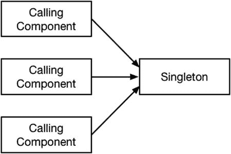
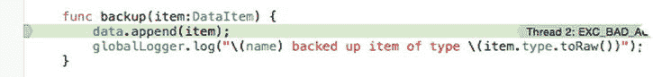

# 6. 单例模式

本章我将介绍单例模式，该模式确保应用中仅存在给定类型的单个对象。这是最常用的设计模式之一，因为它能解决经常出现的问题——要么是需要一个对象来表示真实世界的资源，要么是希望确保所有特定类型的活动（例如日志记录）都以一致的方式处理。表 6-1 将单例模式置于上下文中。

**表 6-1. 单例模式上下文**

| 问题 | 答案 |
| --- | --- |
| 这是什么？ | 单例模式确保应用中仅存在给定类型的单个对象。 |
| 有什么好处？ | 单例模式可用于管理表示真实世界资源的对象，或封装共享资源。 |
| 何时应使用此模式？ | 当创建更多对象并不会增加可用的真实世界资源数量，或者当您希望整合某项活动（如日志记录）时，应使用单例模式。 |
| 何时应避免此模式？ | 如果没有多个组件需要访问共享资源，或者应用中没有表示真实世界资源的对象，则单例模式用处不大。 |
| 如何判断是否正确实现了该模式？ | 当给定类型只有一个实例，并且该实例不能被复制和克隆，也无法创建更多实例时，就表明正确实现了该模式。 |
| 是否存在常见陷阱？ | 主要陷阱是使用了引用类型（可被复制）或实现了 `NSCopying` 协议（可被克隆）的类。单例模式通常需要针对并发使用采取一些保护措施，这是问题的常见来源。 |
| 是否有相关模式？ | 对象池模式（我将在第 7 章中描述）管理固定数量的对象，而不是单例模式处理的单个对象。 |

## 准备示例项目

我为本章创建了一个名为 `Singleton` 的 OS X 命令行工具项目，遵循了我在第 2 章中描述的相同流程。无需进一步准备。

## 理解模式解决的问题

单例模式确保给定类型仅存在一个对象，并且所有依赖该对象的组件都使用同一个实例。这与我在第 5 章中描述的原型模式不同，该模式使得复制对象变得容易。相比之下，单例模式只允许存在一个对象，并阻止其被复制。

单例模式解决的问题出现在您拥有一个不希望在整个应用中被复制的对象时，要么因为它代表真实世界的资源（如打印机或服务器），要么因为您希望将一组相关活动整合到一处。对于真实世界的资源来说，能够创建新的代表打印机或服务器的对象是毫无意义的，因为创建对象并不能神奇地添加新的硬件设备。

即使对于更抽象的表达，能够创建多个对象也可能成为问题。清单 6-1 显示了 `BackupServer.swift` 文件的内容，我已将其添加到 `Singleton` 项目中。

**清单 6-1. BackupServer.swift 文件的内容**

```
import Foundation

class DataItem {

    enum ItemType : String {
        case Email = "Email Address";
        case Phone = "Telephone Number";
        case Card = "Credit Card Number";
    }

    var type:ItemType;
    var data:String;

    init(type:ItemType, data:String) {
        self.type = type; self.data = data;
    }
}

class BackupServer {
    let name:String;
    private var data = [DataItem]();

    init(name:String) {
        self.name = name;
    }

    func backup(item:DataItem) {
        data.append(item);
    }

    func getData() -> [DataItem]{
        return data;
    }
}
```

我定义了一个 `BackupServer` 类，用于表示归档数据项的服务器，数据项由 `DataItem` 类的实例表示。我无需深入探讨创建归档的细节来演示单例模式，因此 `BackupServer` 类定义的 `backup` 方法只是将其 `DataItem` 对象追加到一个名为 `data` 的存储实例属性中，该属性稍后可以通过 `getData` 方法访问。在清单 6-2 中，您可以看到我如何修改 `main.swift` 文件以使用 `BackupServer` 类。

**清单 6-2. 在 main.swift 文件中使用 BackupServer 类**

```
var server = BackupServer(name:"Server#1");
server.backup(DataItem(type: DataItem.ItemType.Email, data: "joe@example.com"));
server.backup(DataItem(type: DataItem.ItemType.Phone, data: "555-123-1133"));
var otherServer = BackupServer(name:"Server#2");
otherServer.backup(DataItem(type: DataItem.ItemType.Email, data: "bob@example.com"));
```

项目中的代码可以编译并执行，但这在实际中没有任何意义。如果 `BackupServer` 对象的目的是代表一个真实的备份服务器，那么任何人都可以创建一个新对象并开始调用 `backup` 方法，这又意味着什么呢？真实服务器不会仅仅因为程序员创建了一个新对象就被配置好（尽管我承认我喜欢这种说法），因此结果是清单 6-2 中备份的部分数据不会到达真实的服务器，也就不会被备份。即使在云服务器的世界里，创建一个新的服务器实例通常也需要比实例化一个新的 Swift 对象更多的工作。

换句话说，清单 6-2 中的代码没有意义，因为代表真实世界服务器的对象只有在与一个已存在并预先配置好的服务器关联时才能工作——这意味着需要仔细控制与真实服务器对应对象的创建，并防止创建任何其他实例。

**提示**：目前示例项目没有产生任何输出。


好的，作为一名高级文档工程师和翻译员，我将严格遵循您提供的注意事项和示例格式，对给定的英文文本进行翻译。


## 理解共享资源封装问题

并非所有能从单例模式中获益的对象都代表现实世界中的实体。有时，您会希望创建一个能够被应用程序中所有组件以简单一致的方式使用的对象。为了演示这一点，清单 6-3 展示了`Logger.swift`文件的内容，我已将该文件添加到示例项目中。

**清单 6-3.** `Logger.swift` 文件的内容

```
class Logger {

    private var data = [String]()

    func log(msg:String) {
        data.append(msg);
    }

    func printLog() {
        for msg in data {
            println("Log: \(msg)");
        }
    }
}
```

这是一个简单的日志类，我常用它来调试自己项目中的问题。我喜欢像 Xcode 自带的现代调试器，但我也常常回归到这类传统技巧，因为仅通过观察消息在控制台中出现的顺序就能学到很多东西。

`Logger` 类定义了一个 `log(msg:)` 方法，该方法接收 `String` 类型的消息参数并将其追加到一个数组中。调用 `printLog()` 方法来显示这些消息，该方法通过调用全局函数 `println()` 来实现。清单 6-4 展示了我是如何更新 `main.swift` 文件，以记录我所备份的数据项的详细信息。

**清单 6-4.** 在 `main.swift` 文件中使用 `Logger` 类

```
let logger = Logger();
var server = BackupServer(name:"Server#1");
server.backup(DataItem(type: DataItem.ItemType.Email, data: "joe@example.com"));
server.backup(DataItem(type: DataItem.ItemType.Phone, data: "555-123-1133"));
logger.log("Backed up 2 items to \(server.name)");
var otherServer = BackupServer(name:"Server#2");
otherServer.backup(DataItem(type: DataItem.ItemType.Email, data: "bob@example.com"));
logger.log("Backed up 1 item to \(otherServer.name)");
logger.printLog();
```

如果您运行该应用程序，您将在控制台中看到以下输出：

```
Log: Backed up 2 items to Server#1
Log: Backed up 1 item to Server#2
```

一切都按预期工作：我使用 `Logger` 类的本地实例记录了一些调试消息，并在备份完所有数据后调用 `printLog()` 方法来输出这些消息。当我想在 `BackupServer` 类中也记录一些调试消息时，问题就出现了，如清单 6-5 所示。

**清单 6-5.** 在 `BackupServer.swift` 文件中添加日志记录

```
...
class BackupServer {
    let name:String;
    private var data = [DataItem]();
    let logger = Logger();

    init(name:String) {
        self.name = name;
        logger.log("Created new server \(name)");
    }

    func backup(item:DataItem) {
        data.append(item);
        logger.log("\(name) backed up item of type \(item.type.rawValue)");
    }

    func getData() -> [DataItem]{
        return data;
    }
}
...
```

现在有两个 `Logger` 对象，每个对象都维护着一组消息。在 `main.swift` 文件中，我调用 `Logger` 对象的 `printLog()` 方法时，并不会打印出记录在 `BackupServer` 类中的消息。我需要的是一个单一的 `Logger` 对象，用于捕获应用程序中所有的调试消息，并且需要一种方法让应用程序组件能够定位到这个 `Logger` 对象，而无需创建紧密耦合——这就是所谓的封装共享资源。

## 理解单例模式

单例模式通过确保应用程序中一个类只有一个实例，来解决现实世界对象和共享资源封装这两个问题。这个对象（称为单例）在其所有需要其功能的组件之间共享，如图 6-1 所示。



**图 6-1.** 单例模式

这个图看起来很简单，但单例模式很特别，因为它的实现与所使用的编程语言紧密相关。Swift 不具备某些用于在 C# 和 Java 等语言中实现该模式的功能，因此需要一些巧思。

## 实现单例模式

在实现单例模式时，需要遵循一些重要的规则：

-   单例必须是其类型的唯一存在实例。
-   单例不能被其他对象替换，即使是相同类型的对象也不行。
-   需要使用单例的组件必须能够定位到它。

单例永远不能有多个实例，这要么是因为该对象代表了现实世界的资源，要么是因为您希望将所有活动（例如日志记录）都通过同一个对象来集中处理。在接下来的章节中，我将描述如何在 Swift 中实现单例模式。

**注意**

单例模式仅适用于引用类型，这意味着只有类才支持。结构体和其他值类型无效，因为它们在赋值给新变量时会被复制。复制引用类型的唯一方法是通过其初始化器创建新实例，或者依赖它实现 `NSCopying` 协议。详情请参见第 5 章。


### 快速单例实现

实现单例最快捷的方式是使用 Swift 全局常量。全局常量具备一些有用的特性，这些特性为遵循我在上一节中列出的规则奠定了基础。代码清单 6-6 展示了如何在 `Logger.swift` 文件中基于全局常量来实现单例模式。

**代码清单 6-6.** 在 `Logger.swift` 文件中实现单例模式

```
let globalLogger = Logger();

final class Logger {
    private var data = [String]()

    private init() {
        // 什么也不做——用于阻止其他文件中的代码创建实例
    }

    func log(msg:String) {
        data.append(msg);
    }

    func printLog() {
        for msg in data {
            println("Log: \(msg)");
        }
    }
}
```

我做的第一个改动是定义了一个名为 `globalLogger` 的全局常量。这看起来可能没什么大不了的，但 Swift 语言对全局常量和变量做出了两项保证：它们会被**延迟初始化**，并且这种延迟初始化是**线程安全**的。这些保证意味着，单例对象只有在首次读取 `globalLogger` 常量的值时才被创建，并且在读取时，即使另一个线程在单例初始化期间尝试读取该值，也只会实例化出 `Logger` 类的单个实例。

我在代码清单 6-6 中做的其他改动是针对 `Logger` 类的。我将该类标记为 `final` ，以防止定义子类，并将初始化器标记为 `private` ，这样就不能从 `Logger.swift` 文件外部创建实例了。定义好单例并保护其类以防止创建其他实例之后，我就可以更新 `BackupServer` 类了，如代码清单 6-7 所示。

**代码清单 6-7.** 在 `BackupServer.swift` 文件中使用单例

```
...
class BackupServer {
    let name:String;
    private var data = [DataItem]();

    init(name:String) {
        self.name = name;
        globalLogger.log("Created new server \(name)");
    }

    func backup(item:DataItem) {
        data.append(item);
        globalLogger.log("\(name) backed up item of type \(item.type.rawValue)");
    }

    func getData() -> [DataItem]{
        return data;
    }
}
...
```

我移除了本地的 `Logger` 对象，并添加了对单例的 `log` 方法的调用。我在上一节中列出的最后一条规则是，组件应该能够定位到单例，而正如你所见，使用全局常量使得这一过程变得非常简单。

> **提示：** 这种实现方式也遵循了其他规则。私有初始化器和延迟初始化确保了 `Logger` 类只有一个实例，而使用常量意味着 `globalLogger` 所引用的对象**不能被**更改。

我还需要对 `main.swift` 文件进行修改，如代码清单 6-8 所示。

**代码清单 6-8.** 在 `main.swift` 文件中使用单例

```
var server = BackupServer(name:"Server#1");
server.backup(DataItem(type: DataItem.ItemType.Email, data: "joe@example.com"));
server.backup(DataItem(type: DataItem.ItemType.Phone, data: "555-123-1133"));
globalLogger.log("Backed up 2 items to \(server.name)");

var otherServer = BackupServer(name:"Server#2");
otherServer.backup(DataItem(type: DataItem.ItemType.Email, data: "bob@example.com"));
globalLogger.log("Backed up 1 item to \(otherServer.name)");

globalLogger.printLog();
```

如果你运行该应用程序，你会看到单例模式让我能够收集所有的日志消息并将它们写入控制台。

```
Log: Created new server Server#1
Log: Server#1 backed up item of type Email Address
Log: Server#1 backed up item of type Telephone Number
Log: Backed up 2 items to Server#1
Log: Created new server Server#2
Log: Server#2 backed up item of type Email Address
Log: Backed up 1 item to Server#2
```

### 创建传统的单例实现

使用全局变量效果很好，但如果你是从 C# 或 Java 转到 Swift，你可能会习惯于通过其类来访问单例的约定。问题在于 Swift 不支持类型存储属性，因此需要一些巧思才能以传统方式应用单例模式。代码清单 6-9 展示了如何使用带有静态属性的结构体来解决这个问题。

**代码清单 6-9.** 在 `BackupServer.swift` 文件中实现单例模式

```
...
final class BackupServer {
    let name:String;
    private var data = [DataItem]();

    private init(name:String) {
        self.name = name;
        globalLogger.log("Created new server \(name)");
    }

    func backup(item:DataItem) {
        data.append(item);
        globalLogger.log("\(name) backed up item of type \(item.type.rawValue)");
    }

    func getData() -> [DataItem]{
        return data;
    }

    class var server:BackupServer {
        struct SingletonWrapper {
            static let singleton = BackupServer(name:"MainServer");
        }
        return SingletonWrapper.singleton;
    }
}
...
```

> **注意：** 在全局常量和嵌套结构体之间做选择是个人喜好问题。我喜欢全局变量的简洁性，但多年的 Java 和 C# 开发经验让我对嵌套结构体感觉更舒适。如果你确实使用全局常量，那么请确保在整个应用程序中使用明确且一致的命名约定。

在计算类型属性 `server` 内部，我定义了一个名为 `SingletonWrapper` 的结构体，它有一个名为 `singleton` 的静态存储属性。我创建了单例 `BackupServer` 对象并将其赋值给 `singleton` 属性。最后，我返回 `singleton` 属性的值作为 `server` 属性的值。

如果你一时没看懂上一句话，别担心。这项技术依赖于 Swift 处理 `struct` 定义和静态存储属性的方式，以确保只创建 `BackupServer` 类的一个实例，尽管这段代码有点烧脑。

要访问该单例，我读取了 `BackupServer.server` 属性的值，如代码清单 6-10 所示。

**代码清单 6-10.** 在 `main.swift` 文件中使用单例

```
var server = BackupServer.server;
server.backup(DataItem(type: DataItem.ItemType.Email, data: "joe@example.com"));
server.backup(DataItem(type: DataItem.ItemType.Phone, data: "555-123-1133"));
globalLogger.log("Backed up 2 items to \(server.name)");

var otherServer = BackupServer.server;
otherServer.backup(DataItem(type: DataItem.ItemType.Email, data: "bob@example.com"));
globalLogger.log("Backed up 1 item to \(otherServer.name)");

globalLogger.printLog();
```

代码清单中的 `server` 和 `otherServer` 变量都引用同一个单例，这意味着所有的 `DataItem` 对象都被发送到了同一台服务器。


### 处理并发问题

如果在多线程应用中使用单例，就需要仔细思考不同组件同时对单例执行操作会带来什么后果，并确保能防范任何潜在问题。

**警告**  
高效的并发编程需要深思熟虑和丰富的经验。人们往往怀着美好的初衷开始，最终却得到一个运行缓慢甚至卡死的应用。在着手多线程项目之前，请花时间学习并发编程的基础概念，并给自己留出足够的开发时间来编写正确代码并进行全面测试。

潜在的并发问题很常见，就连我简单的 `Logger` 和 `BackupServer` 类也存在这些问题，因为 Swift 的数组并非线程安全。这意味着两个或更多线程可能同时调用数组的 `append` 方法，从而破坏数据结构。为了演示该问题，我对 `main.swift` 文件做了一些修改，如代码清单 6-11 所示。

**代码清单 6-11.** 在 `main.swift` 文件中执行并发请求

```
import Foundation

var server = BackupServer.server;

let queue = dispatch_queue_create("workQueue", DISPATCH_QUEUE_CONCURRENT);

let group = dispatch_group_create();

for count in 0 ..< 100 {

    dispatch_group_async(group, queue, {() in

        BackupServer.server.backup(DataItem(type: DataItem.ItemType.Email,

            data: "bob@example.com"))

    });

}

dispatch_group_wait(group, DISPATCH_TIME_FOREVER);

println("\(server.getData().count) items were backed up");
```

此代码清单使用 Grand Central Dispatch (GCD) 异步调用 `BackupServer` 单例的 `backup` 方法 100 次。如果你不熟悉 GCD，可参阅“理解 Grand Central Dispatch”边栏，其中简要解释了本清单及后续清单中的代码。本章中有多处 GCD 边栏，我在本书中大量使用 GCD 来实现在多种模式。我会解释我所用的每个功能的工作原理，但不会深入细节，因为并发编程（包括 GCD）超出了本书的讨论范围。GCD 的完整细节请参见 [`developer.apple.com/library/ios/documentation/Performance/Reference/GCD_libdispatch_Ref/index.html`](https://developer.apple.com/library/ios/documentation/Performance/Reference/GCD_libdispatch_Ref/index.html)。

**理解 GRAND CENTRAL DISPATCH：第 1 部分**

Cocoa 并发编程有多种技术可用，但我在本书中使用的是 Grand Central Dispatch，我认为它是最容易使用的。并发编程是一个高级主题，我不会详细描述 GCD，但会简要说明我在本章示例中如何使用 GCD。有关 GCD 的更多信息，请参见 [`developer.apple.com/library/ios/documentation/Performance/Reference/GCD_libdispatch_Ref/index.html`](https://developer.apple.com/library/ios/documentation/Performance/Reference/GCD_libdispatch_Ref/index.html)。

GCD 是 `Foundation` 框架的标准组成部分，其核心思想是块队列，每个块执行一些工作。你选择或创建一个队列，然后创建表示并发任务的块（以 Swift 闭包形式表示）。GCD 是一个 C API，语法并不特别像 Swift，但一旦掌握其要领，使用起来就很简单。在代码清单 6-11 中，我像这样创建了一个新队列：

```
let queue = dispatch_queue_create("workQueue", DISPATCH_QUEUE_CONCURRENT);
```

`dispatch_queue_create` 函数接受两个参数，用于设置队列的名称和类型。我将队列命名为 `workQueue`，并使用 `DISPATCH_QUEUE_CONCURRENT` 常量指定队列中的块应由多个线程并发处理。我将表示队列的对象赋值给一个名为 `queue` 的常量。（队列类型是 `dispatch_queue_t`，你会在本章后面以及第 7 章的示例中看到我使用它。）

我可以将多个块分组，以便在所有块执行完毕时收到通知。使用 `dispatch_group_create` 函数创建组，如下所示：

```
let group = dispatch_group_create();
```

为了提交要异步执行的工作，我使用 `dispatch_group_async` 函数将块添加到队列中，如下所示：

```
dispatch_group_async(group, queue, {() in

    BackupServer.server.backup(DataItem(type: DataItem.ItemType.Email,

        data: "bob@example.com"))

});
```

第一个参数是该块关联的组，第二个参数是将要添加块的队列，最后一个参数是块本身，以闭包形式表示。该闭包不接受参数，也不返回结果。GCD 会从队列中取出每个工作块并异步执行——不过，正如你将了解到的，队列也可用于序列化工作。

最后一步是等待所有 100 个块完成，我像这样操作：

```
dispatch_group_wait(group, DISPATCH_TIME_FOREVER);
```

`dispatch_group_wait` 函数会阻塞当前线程，直到指定组中的所有块完成。第一个参数是要监听的组，第二个参数是等待的持续时间。通过使用 `DISPATCH_TIME_FOREVER` 值，我指定要无限期等待组中的块完成。

要观察问题，只需启动应用程序。并发问题都与时机有关，需要两个或更多线程同时执行冲突操作。运行应用时你也许运气好，不会发生这样的冲突——但更可能的情况是，两次调用 `backup` 方法重叠，导致两个线程同时尝试通过 `append` 方法向数组添加数据，从而引发错误。发生这种情况时，调试器会在 `backup` 方法处中断，如图 6-2 所示。

**提示**  
如果你幸运地没有遇到错误，请再次运行应用程序。许多因素会影响并发问题，但示例中的代码大多数时候都会失败。



**图 6-2.** 并发问题

调试器报告的具体错误可能不同，但问题是一样的：操作 Swift 数组的内容并非线程安全操作，使用数组的单例需要添加并发保护机制。


#### 序列化访问

为了解决这个问题，我需要确保在同一时间只有一个代码块被允许调用数组的 `append` 方法。列表 6-12 展示了如何使用 GCD 来解决该问题。（我在第二个边栏“理解 Grand Central Dispatch：第二部分”中解释了我所使用的 GCD 特性。）

**列表 6-12.** 在 `BackupServer.swift` 文件中序列化对数组的访问

```
import Foundation

class DataItem {
    enum ItemType : String {
        case Email = "Email Address";
        case Phone = "Telephone Number";
        case Card = "Credit Card Number";
    }
    var type:ItemType;
    var data:String;
    init(type:ItemType, data:String) {
        self.type = type; self.data = data;
    }
}

final class BackupServer {
    let name:String;
    private var data = [DataItem]();
    private let arrayQ = dispatch_queue_create("arrayQ", DISPATCH_QUEUE_SERIAL);
    private init(name:String) {
        self.name = name;
        globalLogger.log("Created new server \(name)");
    }
    func backup(item:DataItem) {
        dispatch_sync(arrayQ, {() in
            self.data.append(item);
            globalLogger.log(
                "\(self.name) backed up item of type \(item.type.rawValue)");
        })
    }
    func getData() -> [DataItem]{
        return data;
    }
    class var server:BackupServer {
        struct SingletonWrapper {
            static let singleton = BackupServer(name:"MainServer");
        }
        return SingletonWrapper.singleton;
    }
}
```

在这个列表中，我执行了与列表 6-11 相反的操作：我获取了一组异步块，并强制它们按顺序串行执行，以确保在任何时候只有一个块调用数组的 `append` 方法。

这看起来可能有些自相矛盾，但在实际应用中，多个组件会创建这些块，而不是单个 `for` 循环。这些组件无法协调它们的活动，通常也不了解彼此，因此，单例模式就需要承担起保护其所依赖资源的责任。

## 理解 Grand Central Dispatch——第二部分

在列表 6-12 中，我使用 `dispatch_queue_create` 函数创建了一个队列，如下所示：

```
...
private let arrayQ = dispatch_queue_create("arrayQ", DISPATCH_QUEUE_SERIAL);
...
```

第一个参数是队列的名称，第二个参数——`DISPATCH_QUEUE_SERIAL` 值——指定了将从队列中取出块并逐一执行，也就是说，在前一个块完成之前，不会开始执行下一个块。

在 `backup` 方法中，我使用 `dispatch_sync` 函数将块添加到队列中。

```
...
dispatch_sync(arrayQ, {() in
    self.data.append(item);
    globalLogger.log(
        "\(self.name) backed up item of type \(item.type.toRaw())");
})
...
```

`dispatch_sync` 函数与我在列表 6-11 中使用的 `dispatch_group_async` 函数一样，都会将工作添加到队列中，但它会等待块执行完毕后才返回，而 `dispatch_group_async` 函数则会立即返回，将块留待将来某个时刻到达队列前端时再执行。（它也不指定组。`dispatch_sync` 的异步等价物是 `dispatch_async`。）

用于将块添加到方法中的函数并不影响块的执行方式——影响的只是函数在将块添加到队列后是立即返回，还是阻塞直到块被处理完毕。

我所创造的效果是：调用 `backup` 方法是一个同步操作，它只有在数据被添加到数组后才会返回，并且由于我指定了一个串行队列，这意味着该方法必须等到队列中所有排在前面的备份任务都处理完毕后才会返回。

我在列表 6-12 中所做的更改确保了 `BackupServer` 单例中使用的数组受到保护，但 `backup` 方法使用了 `Logger` 类，这同样带来了类似的问题。尽管对 `log` 方法的调用在 `BackupServer` 类内部是串行化的，但其他组件仍可能同时使用该单例并调用 `log` 方法，这将导致我之前描述的那类数据损坏。为了完整性，我使用 GCD 保护了 `Logger` 类中的数据数组，如列表 6-13 所示。

**列表 6-13.** 在 `Logger.swift` 文件中添加并发保护

```
import Foundation;

let globalLogger = Logger();

final class Logger {
    private var data = [String]()
    private let arrayQ = dispatch_queue_create("arrayQ", DISPATCH_QUEUE_SERIAL);
    private init() {
        // do nothing - required to stop instances being
        // created by code in other files
    }
    func log(msg:String) {
        dispatch_sync(arrayQ, {() in
            self.data.append(msg);
        });
    }
    func printLog() {
        for msg in data {
            println("Log: \(msg)");
        }
    }
}
```

`Logger` 类通过全局常量技术暴露其单例，但保护数据数组免遭损坏的技术是相同的——我创建了一个串行 GCD 队列，并使用 `dispatch_sync` 方法确保数组修改操作一次只执行一个。如果你运行该应用程序，将不会出现数据损坏，控制台窗口会显示以下输出：

```
100 items were backed up
```

## 理解单例模式的陷阱

在实现单例模式时，有几个需要避免的陷阱，仔细考量你的实现以确保遵循本章前面描述的规则至关重要。在接下来的小节中，我将指出最常见的问题。

### 理解泄露陷阱

实现单例时最常见的问题是产生一个可被复制的对象，这要么是因为它是由结构体（或内置引用类型之一）创建的，要么是因为它是由实现了 `NSCopying` 协议（我在第 5 章中描述过）的类创建的。

结构体不能作为单例工作，因为每当它们被赋给一个新变量或常量，或作为参数传递时，它们都会被复制。但你可能倾向于使用一个实现了 `NSCopying` 协议的类，因为你相信使用该单例的组件不会进行复制。我建议谨慎行事：其他开发者可能没有意识到不复制单例的重要性，你应该采取措施创建一个严格的模式实现。允许其他组件复制或克隆该原型会打破单例三条规则中的第一条。

> **提示：** 如果你无法控制需要作为单例的对象的类定义，可以使用装饰模式来防止对象被当作原型对待。详见第 14 章。

### 理解共享代码文件陷阱

Swift 的访问保护关键字是在文件级别生效的，这意味着将 `private` 关键字应用于初始化器只影响包含该单例的文件之外的代码。你应该始终将单例和全局常量（如果你使用了的话）定义在它们自己的文件中，这样其他组件就无法创建单例类的自己的实例，这打破了单例的第一条规则。

### 理解并发陷阱

单例模式中最棘手的问题与并发相关，即使对于经验丰富的程序员来说，这也可能是一个困难的主题。在接下来的小节中，我将描述最常见的问题。


#### 未应用并发保护

第一个问题是在需要时未应用并发保护。并非每个单例都会面临并发问题，但这是你需要认真考虑的事情。如果你依赖于共享数据结构（如数组）或全局函数（如 `println`），那么就需要确保单例的代码不会被多个线程同时访问。如有疑问，应假定存在潜在问题，因为对共享资源的访问进行序列化所带来的开销，总比应用部署到客户手中后发生崩溃要小得多。

#### 一致地应用并发保护

并发保护必须贯穿整个单例，这样所有操作公共资源（如数组）的代码才能以相同的方式被序列化。只要有一个方法或代码块在访问数组时未进行序列化，就可能面临两个线程冲突并破坏数据的风险。如果你发现很难追踪所有修改共享资源的代码，那么就应该重新考虑代码的设计，将资源以及操作它的代码提取到单独的类中，以便更集中地应用并发保护。

#### 错误的优化

有一种普遍看法认为，像 GCD 这样的并发机制性能不佳，因此并发保护应该采用底层方式并尽量少用。我认为这种观点毫无道理。确实有些应用场景中每个 CPU 周期都至关重要，但这样的场景少之又少，而在现代操作系统上，应用任何并发机制（即使是像 GCD 这样的高级抽象）带来的实际开销都是微乎其微的。

对性能问题的感知，通常源于并发保护暴露了糟糕的代码设计。如果你有 200 个线程排队访问同一个数组，那么你应该考虑的是线程数量以及线程与数组的比例是否合理，而不是开始折腾底层的操作系统锁。（有助于改善这种比例的一种模式是对象池模式，我将在第 7 章和第 8 章中介绍。）

我的建议是使用 GCD，因为它相对易于理解、使用方便，并且能很好地利用 Swift 闭包。如果你确实遇到了性能问题，那么应该思考问题出现的原因，并考虑应用本书中描述的模式是否能最大程度地减少应用中的争用点。

## Cocoa 中的单例模式示例

Cocoa 框架中使用了多个单例，它们通常用于表示应用中的顶层组件。最常见的示例是 `UIApplication` 类，它提供了控制应用整体行为并与 iOS 功能集成的特性。通过类型方法 `sharedApplication` 可以访问 `UIApplication` 单例。

## 将模式应用于 SportsStore 应用

在本节中，我将把单例模式应用于 SportsStore 应用，以便将该模式置于更广泛的上下文中。应用中只有一个区域适合应用单例模式，那就是我在第 5 章中为演示原型模式而创建的 `Logger` 类，它与我本章中用来演示使用单例模式解决共享资源封装问题的同名类相似。清单 6-14 展示了 SportsStore 项目中 `Logger` 类的现有定义。

**清单 6-14.** SportsStore 项目中 Logger.swift 文件的内容

```
import Foundation

class Logger<T where T:NSObject, T:NSCopying> {

    var dataItems:[T] = [];

    var callback:(T) -> Void;

    init(callback:T -> Void) {
        self.callback = callback;
    }

    func logItem(item:T) {
        dataItems.append(item.copy() as T);
        callback(item);
    }

    func processItems(callback:T -> Void) {
        for item in dataItems {
            callback(item);
        }
    }
}
```

提示

你可以从 [`Apress.com`](https://Apress.com) 下载 SportsStore 项目以及本章所有清单的源代码。

我将从并发问题入手来应用单例模式，然后创建单例。SportsStore 的 `Logger` 类存在两个潜在的并发问题。第一个问题是 `dataItems` 数组在 `logItem` 和 `processItems` 方法中都被使用，有可能多个线程试图在 `logItem` 方法中向数组添加新项，甚至可能在其他线程试图在 `processItems` 方法中读取数组内容时发生。

#### 保护数据数组

我将使用 GCD 来保护数组，但我会对前面示例中使用的方法进行一些变化，以便区分读取数组内容的线程和写入数组内容的线程。允许多个线程同时读取数组内容不会带来任何并发风险，只要没有线程同时修改数组即可。你可以在清单 6-15 中看到我是如何解决这个问题的。

**清单 6-15.** 在 Logger.swift 文件中应用并发保护

```
import Foundation

class Logger<T where T:NSObject, T:NSCopying> {

    var dataItems:[T] = [];

    var callback:(T) -> Void;

    var arrayQ = dispatch_queue_create("arrayQ", DISPATCH_QUEUE_CONCURRENT);

    init(callback:T -> Void) {
        self.callback = callback;
    }

    func logItem(item:T) {
        dispatch_barrier_async(arrayQ, {() in
            self.dataItems.append(item.copy() as T);
            self.callback(item);
        });
    }

    func processItems(callback:T -> Void) {
        dispatch_sync(arrayQ, {() in
            for item in self.dataItems {
                callback(item);
            }
        });
    }
}
```

我在 `processItems` 方法中使用 `dispatch_sync` 函数添加一个枚举数组的工作块，并等待该块完成后再让方法返回。不同之处在于，我在 `logItem` 方法中使用了 `dispatch_barrier_async` 函数来创建一个向数组添加项的工作块。`dispatch_barrier_async` 函数会向队列中添加一个特殊的块，从而改变队列的行为。队列会等待其之前的所有块都完成后，才会开始执行这个屏障块；并且在该屏障块完成之前，不会处理后续的任何块。

**理解 Grand Central Dispatch：第 3 部分**

在 `Logger` 类的上下文中，读取操作包含在普通块中，写入操作则包含在屏障块中。当屏障块到达队列头部时，GCD 会等待所有仍在进行中的读取操作完成。一旦它们全部完成，GCD 就会执行屏障块（它会修改数组），并且在该屏障块完成之前不会处理任何后续块。屏障块完成后，队列中的后续项将像往常一样被并行处理，直到遇到下一个屏障块。

换句话说，使用屏障可以将并发队列临时转换为串行队列，其持续时间就是处理屏障块所需的时间，之后队列又会变回并发队列。无论你更喜欢哪种理解方式，使用 GCD 屏障都可以轻松创建读写锁。


### 保护回调函数

第二个问题需要更深入的思考。我通过使用屏障来允许多个读取者，这意味着通过初始化器设置的回调函数可能会被并发调用。这就出现了一个常见的并发难题。

我有几个选择。第一个选择是不做任何处理——也就是当前代码的状态——并假设提供回调的代码已经意识到了并发风险，并采取了必要的预防措施。从`Logger`类的角度来看，这是最简单的选择，因为它将负担转移到了别处。这并非完全不可取，因为`Logger`类无法了解回调的实现方式，最终可能会在`Logger`类和定义回调的组件中都加入并发保护。冗余的并发保护可能导致应用程序所写不当时发生死锁。另一个问题是，我可能最终完全没有保护，从而面临数据损坏的风险。这是最简单的选择，但也是最不确定的。

第二个选择是由`Logger`类承担起责任。这是一种安全的选择，但同样可能产生冗余保护；不过，这确实意味着数据损坏可以避免。

第三个选择——也是我将在本例中遵循的做法——是让组件在选择何时提供回调。你可以从代码清单 6-16 中看到我是如何修改`Logger`类以支持此功能的。

**代码清单 6-16.** 在 Logger.swift 文件中添加可选的并发保护

```swift
import Foundation

class Logger<T where T:NSObject, T:NSCopying> {

    var dataItems:[T] = [];
    var callback:(T) -> Void;
    var arrayQ = dispatch_queue_create("arrayQ", DISPATCH_QUEUE_CONCURRENT);
    var callbackQ = dispatch_queue_create("callbackQ", DISPATCH_QUEUE_SERIAL);

    init(callback:T -> Void, protect:Bool = true) {
        self.callback = callback;
        if (protect) {
            self.callback = {(item:T) in
                dispatch_sync(self.callbackQ, {() in
                    callback(item);
                });
            };
        }
    }

    func logItem(item:T) {
        dispatch_barrier_async(arrayQ, {() in
            self.dataItems.append(item.copy() as T);
            self.callback(item);
        });
    }

    func processItems(callback:T -> Void) {
        dispatch_sync(arrayQ, {() in
            for item in self.dataItems {
                callback(item);
            }
        });
    }
}
```

我定义了一个单独的队列，并添加了一个带有默认值的初始化器参数，这样我就可以在不修改应用程序其他部分代码的情况下应用这些保护措施。如果需要保护——或者调用者省略了新参数——那么我就将回调包装在一个闭包中，该闭包会向新队列添加一个代码块。

### 定义单例

现在我已经解决了并发问题，接下来我将定义单例对象，并保护`Logger`类，使其无法在应用程序的其他地方被实例化。代码清单 6-17 显示了我所做的修改。

**代码清单 6-17.** 在 Logger.swift 文件中创建单例

```swift
import Foundation

let productLogger = Logger<Product>(callback: {p in
    println("Change: \(p.name) \(p.stockLevel) items in stock");
});

final class Logger<T where T:NSObject, T:NSCopying> {

    var dataItems:[T] = [];
    var callback:(T) -> Void;
    var arrayQ = dispatch_queue_create("arrayQ", DISPATCH_QUEUE_CONCURRENT);
    var callbackQ = dispatch_queue_create("callbackQ", DISPATCH_QUEUE_SERIAL);

    private init(callback:T -> Void, protect:Bool = true) {
        self.callback = callback;
        if (protect) {
            self.callback = {(item:T) in
                dispatch_sync(self.callbackQ, {() in
                    callback(item);
                });
            };
        }
    }

    func logItem(item:T) {
        dispatch_barrier_async(arrayQ, {() in
            self.dataItems.append(item.copy() as T);
            self.callback(item);
        });
    }

    func processItems(callback:T -> Void) {
        dispatch_sync(arrayQ, {() in
            for item in self.dataItems {
                callback(item);
            }
        });
    }
}
```

对于泛型类型，无法使用结构体来创建单例，因此我不得不定义一个全局常量，以`Product`类型实例化`Logger`类。我更喜欢结构体的做法，但我也很喜欢能够将泛型类与多种类型结合使用，并且在这种情况下我很乐意使用全局常量方法。剩下的修改是更新应用程序中唯一使用`Logger`类的组件，如代码清单 6-18 所示。

**代码清单 6-18.** 在 ViewController.swift 文件中使用单例

```swift
import UIKit

class ProductTableCell: UITableViewCell {
    @IBOutlet weak var nameLabel: UILabel!
    @IBOutlet weak var descriptionLabel: UILabel!
    @IBOutlet weak var stockStepper: UIStepper!
    @IBOutlet weak var stockField: UITextField!
    var product: Product?;
}

class ViewController: UIViewController, UITableViewDataSource {
    @IBOutlet weak var totalStockLabel: UILabel!
    @IBOutlet weak var tableView: UITableView!

    //let logger = Logger<Product>(callback: handler);

    var products = [
        Product(name:"Kayak", description:"A boat for one person",
                category:"Watersports", price:275.0, stockLevel:10),
        // ...为简洁起见，省略部分代码...
    ]

    @IBAction func stockLevelDidChange(sender: AnyObject) {
        if var currentCell = sender as? UIView {
            while (true) {
                currentCell = currentCell.superview!;
                if let cell = currentCell as? ProductTableCell {
                    if let product = cell.product? {
                        if let stepper = sender as? UIStepper {
                            product.stockLevel = Int(stepper.value);
                        } else if let textfield = sender as? UITextField {
                            if let newValue = textfield.text.toInt()? {
                                product.stockLevel = newValue;
                            }
                        }
                        cell.stockStepper.value = Double(product.stockLevel);
                        cell.stockField.text = String(product.stockLevel);
                        productLogger.logItem(product);
                    }
                    break;
                }
            }
        }
        displayStockTotal();
    }

    // ...为简洁起见，省略部分代码...
}
```

## 本章小结

在本章中，我描述了单例模式，并解释了如何使用它来确保应用程序中只有一个特定类型的对象。单例模式易于理解，但需要仔细关注才能正确实现，尤其是在确保代码对并发使用安全方面。在下一章中，我将描述对象池模式，它与单例模式共享一些共同思想，但作用于同一类型的多个对象。


