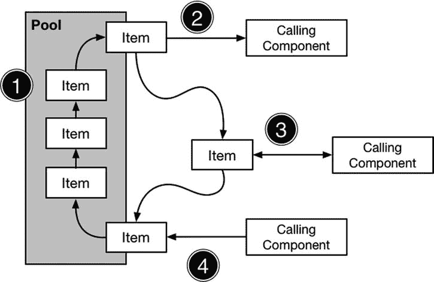

# 7. 对象池模式

对象池模式是单例模式的一种变体，它提供对多个相同对象的访问，而非单个实例。当你拥有代表一组可互换资源的对象，且每个资源在任意时刻只能被一个组件使用时，该模式会非常有用。在本章中，我将描述基本的对象池模式，并在第 8 章中向你展示一些有用的变体，使对象池能够适应不同的场景。表 7-1 将对象池模式置于上下文中进行了说明。

**表 7-1.** 将对象池模式置于上下文中

| 问题 | 答案 |
| --- | --- |
| 它是什么？ | 对象池模式管理一组可重用的对象，这些对象被提供给调用组件。一个组件从池中获取一个对象，用它来执行工作，然后将其返还给池，以便它可以被重新分配以满足未来的请求。已分配给调用者的对象在返回到池之前，其他组件无法使用。 |
| 有什么好处？ | 对象池模式向使用对象的组件隐藏了对象的构造过程，并允许通过重复使用对象来分摊昂贵的初始化成本。 |
| 何时应使用此模式？ | 当你拥有许多相同的对象，且需要管理它们的创建时，应使用对象池模式。这种情况可能是因为这些对象代表了现实世界中的资源，或者创建新实例的成本很高。 |
| 何时应避免此模式？ | 如果在任何时刻只能存在一个对象（应使用单例模式），或者对可存在的对象数量没有限制（应允许调用组件创建自己的实例，或使用本书中描述的其他模式，如工厂方法模式），则不应使用此模式。 |
| 如何判断是否正确实现了此模式？ | 当对象被分配给调用组件而无需创建新实例，并且当返还给池的对象被用于满足后续请求时，就说明该模式已正确实现。 |
| 有哪些常见陷阱？ | 主要陷阱是实现并发保护，以确保对象被正确分配，并且不会损坏用于实现该模式的数据结构。 |
| 有哪些相关模式？ | 单例模式与对象池模式有一些共同思路，但它管理的是单个对象。 |

## 准备示例项目

对于本章，我创建了一个名为 `ObjectPool` 的 OS X 命令行工具项目。无需进一步准备。

## 理解该模式解决的问题

在许多项目中，会有一些对象其实例数量必须受到限制，但又不至于仅仅只有一个实例。为了帮助将此问题置于现实世界的背景下，我将创建一个示例，代表图书馆用来追踪书籍的系统。清单 7-1 显示了我添加到示例项目中的名为 `Book.swift` 的文件内容。

**清单 7-1.** `Book.swift` 文件的内容

```
class Book {

let author:String;

let title:String;

let stockNumber:Int;

var reader:String?

var checkoutCount = 0;

init(author:String, title:String, stock:Int) {

self.author = author;

self.title = title;

self.stockNumber = stock;

}

}
```

在追踪图书馆书籍的系统中，创建或克隆 `Book` 对象并不会神奇地创建出图书馆中的实体书，但同样地，使用单例模式来管理 `Book` 也没有意义，因为图书馆对大多数书籍都会拥有不止一份副本，而且其中任何一本都可以满足某人的阅读愿望。

图书馆中的每本书一次只能由一位读者借出，并且在归还之前不能再次使用。读者可以在书籍有库存时立即借阅，但一旦库存耗尽，任何想借阅的人都需要等到有书被归还或图书馆增加馆藏。

我面临的问题是需要一种模式来管理大量相同且可互换的对象，并提供一种让它们能够被公平和合理地使用的模型。

**提示：** 图书馆书籍是可重用和可互换对象组的现实世界例子，但在软件开发中，你也会遇到一些抽象的例子。最常见的例子包括线程和网络连接，但这是一个会以多种方式频繁出现的问题。

## 理解对象池模式

对象池模式管理一组可互换的对象，称为对象池——或者简称为池。需要对象的组件从池中借用一个对象，用它来执行一些工作，然后在工作完成后将其返还给池。返还的对象随后将用于满足后续的请求，这些请求可能来自同一个组件或另一个组件。

对象池模式可用于管理代表现实世界资源的对象，也可用于通过重用对象来满足多个组件的请求，从而分摊昂贵的初始化过程。

对象池有四个重要操作，如图 7-1 所示。第一个操作是初始化，为准备待管理的对象集合。

第二个操作是借出，需要对象的组件从池中借用一个对象。

第三个操作是组件使用该对象执行某种工作。这不需要池进行任何操作，但这确实意味着池所管理的对象会在一段时间内处于使用中，并且不能借给其他组件。

第四个也是最后一个操作是归还，组件将对象返还给池，以便它可以用来满足未来的借用请求。



**图 7-1.** 对象池的基本操作

在多线程应用程序中，第二、第三和第四个操作可能同时发生。在多个组件之间共享对象会带来潜在的并发问题。两个或多个组件可能同时请求借出或归还对象，对象池必须确保每次借用请求在借出时都能获得不同的对象，并且确保归还时对象不会丢失。

有时也会出现请求无法立即被满足的情况，因为池中的所有对象都已被借出并使用中。池必须能够处理这些请求，要么向组件指示没有可用对象，要么允许组件等待直到有对象被归还。

## 实现对象池模式

在本章中，我将创建该模式的一个基本实现，以演示不同操作是如何实现的。一个基本的对象池管理一组固定的对象，并依赖于从池中借出对象的组件在完成后将其归还。这是一个很好的起点，因为它让我能够解决基本的并发技术，而这些技术是该模式健壮实现的核心。在第 8 章中，我将向你展示该模式的一些变体，你可以使用它们将基本池调整为你自己的项目。


### 定义池类

第一步是创建一个通用的 `Pool` 类，用于管理指定类型的对象集合。这并非必须是一个泛型类，但管理对象池是一种常见需求，而泛型类可以轻松地在不同项目中复用代码。我给示例项目添加了一个名为 `Pool.swift` 的文件，其内容如代码清单 7-2 所示。

**代码清单 7-2.** `Pool.swift` 文件的内容

```
import Foundation

class Pool<T> {

    private var data = [T]();

    init(items:[T]) {
        data.reserveCapacity(data.count);
        for item in items {
            data.append(item);
        }
    }

    func getFromPool() -> T? {
        var result:T?;
        if (data.count > 0) {
            result = self.data.removeAtIndex(0);
        }
        return result;
    }

    func returnToPool(item:T) {
        self.data.append(item);
    }

}
```

`Pool` 类——更准确地说是 `Pool<T>`——在初始化时接收它要管理的对象集合。初始化器将这些项目复制到一个本地 `data` 数组中，我将其用作一个简单的队列集合，其中包含可供使用的对象。当调用 `getFromPool` 方法时，我通过调用 `removeAtIndex` 方法返回数组头部的对象。当之前获取的对象使用完毕后，会调用 `returnToPool` 方法，我使用 `append` 方法将其添加到 `data` 数组中，以便后续调用 `getFromPool` 方法时可以再次使用。

#### 保护数据数组

在对象池模式中，处理并发请求非常重要，我需要解决两个问题。第一个问题与我在处理单例模式时遇到的一样：`getFromPool` 和 `returnToPool` 方法中包含修改 `data` 数组的语句，我需要确保没有两个线程同时使用这些方法。代码清单 7-3 展示了如何添加一个 Grand Central Dispatch (GCD) 队列，并应用 `dispatch_sync` 函数来保护数组免受并发修改的影响。

**代码清单 7-3.** 在 `Pool.swift` 文件中保护数组免受并发修改

```
import Foundation

class Pool<T> {

    private var data = [T]();
    private let arrayQ = dispatch_queue_create("arrayQ", DISPATCH_QUEUE_SERIAL);

    init(items:[T]) {
        data.reserveCapacity(data.count);
        for item in items {
            data.append(item);
        }
    }

    func getFromPool() -> T? {
        var result:T?;
        if (data.count > 0) {
            dispatch_sync(arrayQ, {() in
                result = self.data.removeAtIndex(0);
            })
        }
        return result;
    }

    func returnToPool(item:T) {
        dispatch_async(arrayQ, {() in
            self.data.append(item);
        });
    }

}
```

> **提示**  
> 你可以在不添加并发保护的情况下实现对象池模式，但前提是确保你的应用程序只会使用单个线程来访问池中的对象。不过要小心：应用程序随着复杂度增加往往需要处理并发，届时未受保护的对象池会引发问题。我的建议是，即使你预计不需要，也始终添加并发保护。

我使用了 `dispatch_sync` 和 `dispatch_async` 函数，通过闭包创建了包含数组操作代码的代码块。我将这些代码块添加到一个由 `dispatch_queue_create` 函数创建的队列中，并将该队列配置为 `DISPATCH_QUEUE_SERIAL` 值，这样一次只执行一个代码块。这通过确保同一时间只有一个线程能修改数组来保护其免受损坏。

#### 确保对象可被取出

`Pool` 类中还存在着第二个并发问题，这意味着代码仍可能遇到麻烦。在 `getFromPool` 方法中，我在向队列添加获取对象的代码块之前，会检查 `data` 数组中是否有空闲对象，如下所示：

```
...
func getFromPool() -> T? {
    var result:T?;
    if (data.count > 0) {
        dispatch_sync(arrayQ, {() in
            result = self.data.removeAtIndex(0);
        })
    }
    return result;
}
...
```

这是一个经典的并发问题。假设 `data` 数组中有一个空闲对象，并且两个线程在相差几毫秒的时间内调用了 `getFromPool` 方法。第一个线程检查 `data.count` 值，发现有一个空闲对象，于是使用 `dispatch_sync` 方法将一个会从数组中移除该对象以便使用的代码块排入队列。

随后不久，第二个线程也执行了同样的操作。它同样认为数组中有一个空闲对象，因为第一个线程创建的代码块尚未执行。第二个线程将自身的代码块排入队列，期望也能获取该对象。第一个线程的代码块执行并成功移除了空闲对象。接着第二个线程的代码块被执行，但由于数组此时已为空，导致出现错误。

为了解决这个问题，我需要确保调用 `getFromPool` 方法的线程在无法保证获取到对象时，不会调度代码块去获取空闲对象。代码清单 7-4 展示了如何使用 GCD 的信号量特性解决此问题。

**代码清单 7-4.** 在 `Pool.swift` 文件中应用信号量

```
import Foundation

class Pool<T> {

    private var data = [T]();
    private let arrayQ = dispatch_queue_create("arrayQ", DISPATCH_QUEUE_SERIAL);
    private let semaphore:dispatch_semaphore_t;

    init(items:[T]) {
        data.reserveCapacity(data.count);
        for item in items {
            data.append(item);
        }
        semaphore = dispatch_semaphore_create(items.count);
    }

    func getFromPool() -> T? {
        var result:T?;
        if (dispatch_semaphore_wait(semaphore, DISPATCH_TIME_FOREVER) == 0) {
            dispatch_sync(arrayQ, {() in
                result = self.data.removeAtIndex(0);
            })
        }
        return result;
    }

    func returnToPool(item:T) {
        dispatch_async(arrayQ, {() in
            self.data.append(item);
            dispatch_semaphore_signal(self.semaphore);
        });
    }

}
```

信号量的核心是一个计数器，你可以在下面用于创建信号量的语句中看到这一点：

```
...
semaphore = dispatch_semaphore_create(items.count);
...
```

`dispatch_semaphore_create` 函数接受一个 `Int` 值，用于设置计数器的初始值。每次调用 `dispatch_semaphore_wait` 函数时，计数器都会递减，如下所示：

```
...
if (dispatch_semaphore_wait(semaphore, DISPATCH_TIME_FOREVER) == 0) {
    dispatch_sync(arrayQ, {() in
        result = self.data.removeAtIndex(0);
    });
}
...
```

当计数器归零时，对 `dispatch_semaphore_wait` 函数的调用将会阻塞。通过在 `getFromPool` 方法中调用 `dispatch_semaphore_wait` 函数，每次从 `data` 数组中移除一个对象时，计数器就会递减，并且当数组中没有更多可分配的对象时，对该方法的调用将会阻塞。

计数器通过调用 `dispatch_semaphore_signal` 函数递增，我在 `returnToPool` 方法中将对象添加到 `data` 数组后执行此操作。

```
...
dispatch_async(arrayQ, {() in
    self.data.append(item);
    dispatch_semaphore_signal(self.semaphore);
});
...
```

这会增加计数器，允许一个阻塞在 `dispatch_semaphore_wait` 函数上的线程继续执行。对信号量函数的调用平衡了获取和归还池对象的请求数量，并且除非在代码块执行时确实有对象在等待，否则可以防止 `getFromPool` 方法向队列添加代码块。


### 消费池类

既然已经创建了一个通用的池类，我就可以通过将其应用于管理一个`Book`对象集合，来完成对象池模式的应用。清单 7-5 展示了我在名为`Library.swift`的新文件中定义的`Library`类的定义。

**清单 7-5.** 在`Library.swift`文件中消费池类

```
import Foundation

final class Library {

    private let books:[Book];
    private let pool:Pool<Book>;

    private init(stockLevel:Int) {
        books = [Book]();
        for count in 1 ... stockLevel {
            books.append(Book(author: "Dickens, Charles", title: "Hard Times",
                stock: count))
        }
        pool = Pool<Book>(items:books);
    }

    private class var singleton:Library {
        struct SingletonWrapper {
            static let singleton = Library(stockLevel:2);
        }
        return SingletonWrapper.singleton;
    }

    class func checkoutBook(reader:String) -> Book? {
        var book = singleton.pool.getFromPool();
        book?.reader = reader;
        book?.checkoutCount++;
        return book;
    }

    class func returnBook(book:Book) {
        book.reader = nil;
        singleton.pool.returnToPool(book);
    }

    class func printReport() {
        for book in singleton.books {
            println("...Book#\(book.stockNumber)...");
            println("Checked out \(book.checkoutCount) times");
            if (book.reader != nil) {
                println("Checked out to \(book.reader!)");
            } else {
                println("In stock");
            }
        }
    }
}
```

`Library`类通过将我在清单 7-4 中定义的`Pool`类与我在第 6 章中描述的单例模式相结合，实现了对象池模式。我需要使用单例，因为在这个例子中应该只有一个`Library`，尽管`Library`本身可以有多个池，每个池管理单个书名下的多个副本。清单 7-5 中的代码描绘了一个相当萧条的图书馆，其全部馆藏仅为查尔斯·狄更斯小说的两本副本。

当你访问一个真实的图书馆时，如果有可用的书，你可以借阅所需副本；如果没有，你可以排队等候其他读者归还。图书馆提供了这些服务，但并不会让你了解其背后流程的运作方式。例如，你无需找到其他正在等待该书副本的人，并弄清楚归还的副本应如何分配。

### 宽松的对象创建策略

请注意，我在不同的文件中定义了`Library`和`Book`类，并且没有阻止`Book`类在`Library`外部被实例化。在实现单例模式时，我使用了`private`构造函数并定义了访问类，因为我希望展示如何完全控制单例的创建。在本章中，我采取了更宽松的方法，因为我正在建模一个可能存在多个`Book`对象来源的环境，这代表了现实世界中书籍的多种来源（例如，出版商、图书批发商和在线商店都可以为图书馆提供书籍）。我不会在示例中构建所有可能的来源，但我想说明你可以使用此模式来管理对象，而无需限制其供应。只要与`Library`对象关联的`Book`对象未经其同意就不能被修改，我的模型就与现实世界保持一致。

现实世界中的图书馆如何管理其书籍的细节是隐藏的，这也是我在实现`Library`类时所采用的方法。我没有通过单例暴露`Pool<Book>`对象，而是定义了名为`checkoutBook`和`returnBook`的类型方法，这些方法代表调用者与池进行交互。这些方法还允许我在书籍被借出时对其进行预处理：我设置了`reader`属性的值，并递增了`checkoutCount`属性。当书籍被归还时，我会清除`reader`属性。

`checkoutCount`和`reader`属性都由`printReport`方法使用，该方法详细列出了`Library`创建的每个`Book`对象，记录了这本书被借出的次数以及它当前是否在池中。这是一个诊断方法，允许我在测试期间查看池所管理的书籍状态。清单 7-6 展示了我在`main.swift`文件中用于测试`Library`类及其对`Pool`类使用的代码。

**清单 7-6.** 在`main.swift`文件中测试 Library 和 Pool

```
import Foundation

var queue = dispatch_queue_create("workQ", DISPATCH_QUEUE_CONCURRENT);
var group = dispatch_group_create();

println("Starting...");

for i in 1 ... 20 {
    dispatch_group_async(group, queue, {() in
        var book = Library.checkoutBook("reader#\(i)");
        if (book != nil) {
            NSThread.sleepForTimeInterval(Double(rand() % 2));
            Library.returnBook(book!);
        }
    });
}

dispatch_group_wait(group, DISPATCH_TIME_FOREVER);

println("All blocks complete");

Library.printReport();
```

这段代码使用一个`for`循环创建异步 GCD 块，这些块从`Library`借出并归还`Book`对象。为了使示例更逼真一些，我在获取到`Book`之后、归还它之前添加了一个延迟，如下所示：

```
...
NSThread.sleepForTimeInterval(Double(rand() % 2));
...
```

`NSThread.sleepForTimeInterval`会暂停执行该语句的线程。我控制了休眠的持续时间，使其随机生成并强制为零秒或一秒，这意味着某些块会立即归还图书，而其他块则会在等待一秒钟后才归还图书。我这样做是因为我希望池中对象的使用能够重叠。如果没有延迟，这些对象将严格轮换地被借出和归还，这并非真实项目（当然，也非现实世界）中使用池对象的方式。

启动应用程序以查看结果。运行需要几秒钟，请耐心等待。当`main.swift`文件中生成的所有块都执行完毕后，你将看到类似于下面的输出：

```
Starting...
All blocks complete
...Book#1...
Checked out 13 times
In stock
...Book#2...
Checked out 7 times
In stock
```

你的结果可能不同，因为我添加的延迟的随机性质会改变对象从池中取出和归还的顺序。

虽然你的结果可能不同，但书籍被借出的总次数应为`20`，这与`main.swift`文件中创建的 GCD 块数量相同。在我的例子中，一个`Book`对象被借出了 13 次，另一个被借出了 7 次。这种差异是由我添加的延迟引起的，这导致第一个`Book`对象在池中循环了多次，而速度较慢的读者则持有了另一个对象。

## 理解对象池模式的陷阱

实现对象池模式时需要小心，因为很容易创建一个不起作用或不适合其所用应用程序的池。很容易被创建完美池的想法冲昏头脑，尤其是在考虑到我在第 8 章中描述的变体时。结果可能是代码难以维护，以及一个部署后行为不可预测的不稳定对象池。

在保护对象池免受并发访问时也需要小心，以避免创建一个会意外锁死的池，即使它在你的开发测试期间能正常运行。要保守一点，优先考虑安全性而非性能——最重要的是，尽可能用多种不同的使用场景测试你的代码。我建议尽可能保持对象池的简单，专注于产生一个能够工作且易于测试的东西。


## Cocoa 中对象池模式的示例

Cocoa 框架在其公开 API 中并未暴露对象池，唯有一个常见的例外：表格单元格对象。你可以在 SportsStore 应用中看到相关示例，其中使用 `UITableViewCell` 对象来显示表格视图中的行。清单 7-7 展示了 SportsStore 项目中 `ViewController.swift` 文件里 `tableView` 方法的实现。

清单 7-7 在 `ViewController.swift` 文件中获取（潜在）池化的 `UITableViewCell`

```
...

func tableView(tableView: UITableView,
cellForRowAtIndexPath indexPath: NSIndexPath) -> UITableViewCell {
    let product = products[indexPath.row];
    let cell = tableView.dequeueReusableCellWithIdentifier("ProductCell")
        as ProductTableCell;
    cell.product = products[indexPath.row];
    cell.nameLabel.text = product.name;
    cell.descriptionLabel.text = product.productDescription;
    cell.stockStepper.value = Double(product.stockLevel);
    cell.stockField.text = String(product.stockLevel);
    return cell;
}

...
```

这是为显示而获取 `UITableViewCell` 对象时调用的方法。高亮语句显示，我通过调用 `UITableView` 类定义的 `dequeueReusableCellWithIdentifier` 方法来获取 `UITableView` 对象。`UIKit` 框架管理着 `UITableViewCell` 对象的创建和分配，以便它们可以被复用。苹果并未公开 `UIKit` 框架的源代码，因此无法查看池的具体实现，但这正是一个通过复用对象来抵消昂贵初始化的池化示例。

提示

`dequeueReusableCellWithIdentifier` 方法结合了对象池和工厂方法模式。我在第 9 章中描述了工厂方法模式，简而言之，表格可以通过不同类型的表格单元格来填充，而方法参数（此处为 `ProductCell`）用于区分它们。

## 将模式应用于 SportsStore 应用

我打算将对象池模式应用于 SportsStore 应用，以管理网络请求对象池。目前，SportsStore 应用有一个静态的 `Product` 对象数组展示给用户，我将用一系列网络调用来替换它，这些调用会获取产品详情，并在库存水平变化时更新服务器。

### 准备示例应用

我将从第 6 章结束时的 SportsStore 项目继续，本章无需任何前期准备。

提示

请记住，你可以从 [`Apress.com`](https://Apress.com) 下载 SportsStore 项目每个阶段以及本书所有其他示例的源代码。

### 创建（虚拟）服务器

我不想深入探讨创建和设置服务器的细节，因此我将模拟请求和响应，但这不会影响创建和应用池的演示。我在 SportsStore 项目中添加了一个名为 `NetworkConnection.swift` 的文件，并用它来定义清单 7-8 所示的类。

清单 7-8 `NetworkConnection.swift` 文件的内容

```
import Foundation

class NetworkConnection {
    private let stockData: [String: Int] = [
        "Kayak" : 10, "Lifejacket": 14, "Soccer Ball": 32,"Corner Flags": 1,
        "Stadium": 4, "Thinking Cap": 8, "Unsteady Chair": 3,
        "Human Chess Board": 2, "Bling-Bling King":4
    ];

    func getStockLevel(name:String) -> Int? {
        NSThread.sleepForTimeInterval(Double(rand() % 2));
        return stockData[name];
    }
}
```

`NetworkConnection` 类是我在对象池中管理的对象的模板。它有一个私有的 `stockData` 属性，该属性被设置为包含 SportsStore 产品初始库存水平的字典，并以产品名称作为索引。`getStockLevel` 方法在字典中查找产品并返回库存水平值。我使用了 `NSThread.sleepForTimeInterval` 方法为某些请求添加了一秒的随机延迟。

### 创建对象池

我在前面示例中演示的对象池都是泛型类，这使得在不同的项目中复用类变得容易。为了增加多样性，我为 SportsStore 实现了一个针对特定类型（`NetworkConnection` 类）的对象池。清单 7-9 显示了我添加到 SportsStore 项目中的 `NetworkPool.swift` 文件的内容。

清单 7-9 `NetworkPool.swift` 文件的内容

```
import Foundation

final class NetworkPool {
    private let connectionCount = 3;
    private var connections = [NetworkConnection]();
    private var semaphore:dispatch_semaphore_t;
    private var queue:dispatch_queue_t;

    private init() {
        for _ in 0 ..< connectionCount {
            connections.append(NetworkConnection());
        }
        semaphore = dispatch_semaphore_create(connectionCount);
        queue = dispatch_queue_create("networkpoolQ", DISPATCH_QUEUE_SERIAL);
    }

    private func doGetConnection() -> NetworkConnection {
        dispatch_semaphore_wait(semaphore, DISPATCH_TIME_FOREVER);
        var result:NetworkConnection? = nil;
        dispatch_sync(queue, {() in
            result = self.connections.removeAtIndex(0);
        });
        return result!;
    }

    private func doReturnConnection(conn:NetworkConnection) {
        dispatch_async(queue, {() in
            self.connections.append(conn);
            dispatch_semaphore_signal(self.semaphore);
        });
    }

    class func getConnection() -> NetworkConnection {
        return sharedInstance.doGetConnection();
    }

    class func returnConnecton(conn:NetworkConnection) {
        sharedInstance.doReturnConnection(conn);
    }

    private class var sharedInstance:NetworkPool {
        get {
            struct SingletonWrapper {
                static let singleton = NetworkPool();
            }
            return SingletonWrapper.singleton;
        }
    }
}
```

这是一个管理 `NetworkConnection` 对象集合的池，遵循我在本章前面创建的基本模式。`NetworkPool` 类实现了对象池模式，但它也使用了第 6 章中的单例模式，以便应用中的其他组件能够轻松定位到此池。


### 应用对象池

为了应用对象池，我创建了一个名为 `ProductDataStore` 的类，并将静态定义的产品数据移入其中——尽管没有库存水平信息。清单 7-10 展示了 `ProductDataStore.swift` 文件的内容，我已将其添加到 SportsStore 项目中。

**清单 7-10.** `ProductDataStore.swift` 文件的内容

```swift
import Foundation

final class ProductDataStore {

    var callback:((Product) -> Void)?;

    private var networkQ:dispatch_queue_t

    private var uiQ:dispatch_queue_t;

    lazy var products:[Product] = self.loadData();

    init() {
        networkQ = dispatch_get_global_queue(DISPATCH_QUEUE_PRIORITY_BACKGROUND, 0);
        uiQ = dispatch_get_main_queue();
    }

    private func loadData() -> [Product] {
        for p in productData {
            dispatch_async(self.networkQ, {() in
                let stockConn = NetworkPool.getConnection();
                let level = stockConn.getStockLevel(p.name);
                if (level != nil) {
                    p.stockLevel = level!;
                    dispatch_async(self.uiQ, {() in
                        if (self.callback != nil) {
                            self.callback!(p);
                        }
                    })
                }
                NetworkPool.returnConnecton(stockConn);
            });
        }
        return productData;
    }

    private var productData:[Product] = [
        Product(name:"Kayak", description:"A boat for one person",
            category:"Watersports", price:275.0, stockLevel:0),
        Product(name:"Lifejacket", description:"Protective and fashionable",
            category:"Watersports", price:48.95, stockLevel:0),
        Product(name:"Soccer Ball", description:"FIFA-approved size and weight",
            category:"Soccer", price:19.5, stockLevel:0),
        Product(name:"Corner Flags",
            description:"Give your playing field a professional touch",
            category:"Soccer", price:34.95, stockLevel:0),
        Product(name:"Stadium", description:"Flat-packed 35,000-seat stadium",
            category:"Soccer", price:79500.0, stockLevel:0),
        Product(name:"Thinking Cap", description:"Improve your brain efficiency",
            category:"Chess", price:16.0, stockLevel:0),
        Product(name:"Unsteady Chair",
            description:"Secretly give your opponent a disadvantage",
            category: "Chess", price: 29.95, stockLevel:0),
        Product(name:"Human Chess Board", description:"A fun game for the family",
            category:"Chess", price:75.0, stockLevel:0),
        Product(name:"Bling-Bling King",
            description:"Gold-plated, diamond-studded King",
            category:"Chess", price:1200.0, stockLevel:0)];
}
```

`ProductDataStore` 已成为 SportsStore 应用中 `Product` 对象的权威来源。通过 `products` 属性获取 `Product` 对象，该属性返回一个私有数组的内容。`Product` 对象定义时 `stockLevel` 值为零，但 `products` 属性是惰性计算的，并使用 `NetworkPool` 类请求每个产品的当前库存水平。请求完成后，`Product` 对象会被更新，并调用一个可选回调函数以通知新信息的到来。

**提示**  
在实际项目中，通过单个请求获取所有库存水平会更合理，但为了本章的目的，我希望通过比池中对象更多的请求来测试对象池。

注意，我在此类中使用了两个 GCD 队列。我获取了一个全局队列（由 GCD 自动创建），并设置后台优先级，以执行模拟的网络请求。使用后台优先级意味着获取库存信息的延迟不会阻止更重要任务的执行，例如响应用户交互。在处理回调时，我使用主应用队列以确保更新立即执行，而不会推迟到后台任务完成。

清单 7-11 展示了我对 `ViewController.swift` 文件所做的更改，以使用 `ProductDataStore` 类，而不是在本地定义数据。

**清单 7-11.** 在 `ViewController.swift` 文件中使用 `ProductDataSource` 类

```swift
import UIKit

class ProductTableCell: UITableViewCell {
    // ...为简洁起见省略语句...
}

class ViewController: UIViewController, UITableViewDataSource {
    @IBOutlet weak var totalStockLabel: UILabel!
    @IBOutlet weak var tableView: UITableView!

    var productStore = ProductDataStore();

    override func viewDidLoad() {
        super.viewDidLoad();
        displayStockTotal();

        productStore.callback = {(p:Product) in
            for cell in self.tableView.visibleCells() {
                if let pcell = cell as? ProductTableCell {
                    if pcell.product?.name == p.name {
                        pcell.stockStepper.value = Double(p.stockLevel);
                        pcell.stockField.text = String(p.stockLevel);
                    }
                }
            }
            self.displayStockTotal();
        }
    }

    override func didReceiveMemoryWarning() {
        super.didReceiveMemoryWarning();
    }

    func tableView(tableView: UITableView,
        numberOfRowsInSection section: Int) -> Int {
            return productStore.products.count;
    }

    func tableView(tableView: UITableView,
        cellForRowAtIndexPath indexPath: NSIndexPath) -> UITableViewCell {
            let product = productStore.products[indexPath.row];
            let cell = tableView.dequeueReusableCellWithIdentifier("ProductCell")
                as ProductTableCell;
            cell.product = product;
            cell.nameLabel.text = product.name;
            cell.descriptionLabel.text = product.productDescription;
            cell.stockStepper.value = Double(product.stockLevel);
            cell.stockField.text = String(product.stockLevel);
            return cell;
    }

    @IBAction func stockLevelDidChange(sender: AnyObject) {
        // ...为简洁起见省略语句...
    }

    func displayStockTotal() {
        let finalTotals:(Int, Double) = productStore.products.reduce((0, 0.0),
            {(totals, product) -> (Int, Double) in
                return (
                    totals.0 + product.stockLevel,
                    totals.1 + product.stockValue
                );
        });
        totalStockLabel.text = "\(finalTotals.0) Products in Stock. "
            + "Total Value: \(Utils.currencyStringFromNumber(finalTotals.1))";
    }
}
```

我定义了一个 `productStore` 属性，该属性被分配了一个 `ProductDataStore` 对象，并从中获取 `Product` 对象以供显示。我还定义了回调闭包，用于定位用于显示 `Product` 的表格单元格（如果可见），并更新其显示的库存水平。

运行应用时你看到的效果是：库存值最初显示为零，然后随着对象从池中取出并用于发起（模拟的）网络请求而逐步更新。我在 `NetworkConnection` 类中添加的随机延迟意味着更新将逐渐到来，因为对象池限制了并发请求的数量。

## 总结

在本章中，我解释了如何应用基本对象池模式来管理对象的集合。在下一章中，我将向你展示如何改变对象池的工作方式，以管理具有不同使用模式的对象。


好的，作为高级文档工程师和翻译员，我已经根据您提供的注意事项和示例，将给定的英文文本翻译成了中文。

---


