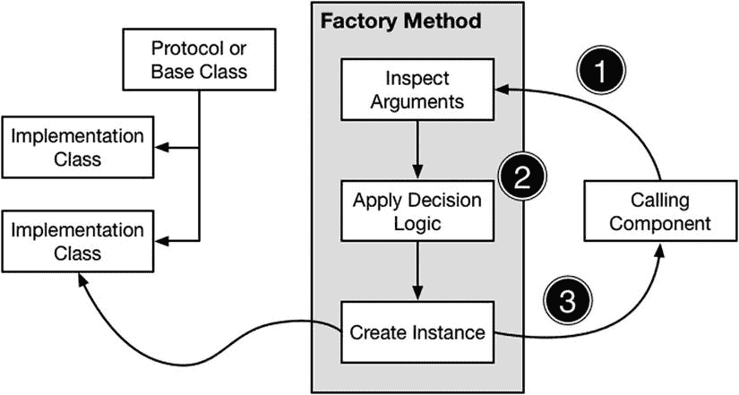
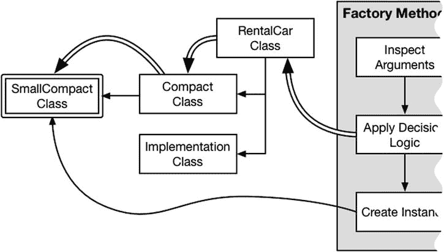

# 9. 工厂方法模式

工厂方法模式用于在多个实现同一协议或共享同一基类的类之间进行选择。该模式允许实现子类提供特化功能，而依赖这些子类的组件无需了解这些类的任何细节以及它们之间的关联方式。表 9-1 将工厂方法模式置于上下文中。

**注意**

工厂方法模式与抽象工厂模式密切相关。有关抽象工厂模式的详细信息以及如何在两者之间做出选择，请参阅第 10 章。

**表 9-1.** 将工厂方法模式置于上下文中

| 问题 | 答案 |
| --- | --- |
| 它是什么？ | 工厂方法模式选择一个实现类来满足调用组件的请求，而无需该组件了解实现类或其相互关联方式的任何信息。 |
| 有什么好处？ | 该模式整合了决定选择哪个实现类的逻辑，并防止该逻辑分散在整个应用程序中。这也意味着调用组件仅依赖于顶层协议或基类，无需了解实现类或选择它们的过程的任何信息。 |
| 何时使用此模式？ | 当你有多个实现同一协议或派生自同一基类的类时，使用此模式。 |
| 何时应避免此模式？ | 当没有公共协议或共享基类时，不要使用此模式，因为此模式的工作原理是让调用组件仅依赖于单一类型。 |
| 如何知道是否正确实现了此模式？ | 当适当的类被实例化，而调用组件不知道使用了哪个类或如何选择它时，就正确实现了此模式。 |
| 有哪些常见陷阱？ | 没有。工厂方法模式实现简单。 |
| 有哪些相关模式？ | 工厂方法模式通常与单例模式和对象池模式结合使用。 |

## 准备示例项目

在本章中，我创建了一个名为 `FactoryMethod` 的 OS X 命令行工具项目。我向项目添加了一个名为 `RentalCar.swift` 的文件，其内容如代码清单 9-1 所示。

**代码清单 9-1.**`RentalCar.swift` 文件的内容

```
protocol RentalCar {
    var name:String { get };
    var passengers:Int { get };
    var pricePerDay:Float { get };
}

class Compact : RentalCar {
    var name = "VW Golf";
    var passengers = 3;
    var pricePerDay:Float = 20;
}

class Sports : RentalCar {
    var name = "Porsche Boxter";
    var passengers = 1;
    var pricePerDay:Float = 100;
}

class SUV : RentalCar {
    var name = "Cadillac Escalade";
    var passengers = 8;
    var pricePerDay:Float = 75;
}
```

该文件包含一个名为 `RentalCar` 的协议以及三个遵循该协议的类：`Compact`、`Sports` 和 `SUV`。代码清单 9-2 展示了 `CarSelector.swift` 文件的内容，我将其添加到项目中，该文件定义了一个依赖于 `RentalCar` 协议及其实现的类。

**代码清单 9-2.**`CarSelector.swift` 文件的内容

```
class CarSelector {
    class func selectCar(passengers:Int) -> String? {
        var car:RentalCar?;
        switch (passengers) {
        case 0...1:
            car = Sports();
        case 2...3:
            car = Compact();
        case 4...8:
            car = SUV();
        default:
            car = nil;
        }
        return car?.name;
    }
}
```

`CarSelector` 类定义了一个名为 `selectCar` 的类型方法，该方法实例化一个 `RentalCar` 协议的实现，该实现能够容纳由 `passengers` 参数指定的乘客数量（不包括驾驶员）。`selectCar` 方法的结果是被选中并实例化的 `RentalCar` 实现类的 `name` 属性的值。我还将代码清单 9-3 中所示的语句添加到了 `main.swift` 文件中。

**代码清单 9-3.**`main.swift` 文件的内容

```
import Foundation

let passengers = [1, 3, 5];

for p in passengers {
    println("\(p) passengers: \(CarSelector.selectCar(p)!)");
}
```

`main.swift` 文件中的代码针对不同的乘客数量调用了 `CarSelector.selectCar` 方法，并将结果写入调试控制台。运行应用程序时，你将看到以下输出：

```
1 passengers: Porsche Boxter
3 passengers: VW Golf
5 passengers: Cadillac Escalade
```


## 理解该模式要解决的问题

工厂方法模式解决了一个常见问题：当存在多个遵循同一协议的类，且需要选择实例化哪一个时。你可以在代码清单 9-2 中看到具体应用，其中`CarSelector.selectCar`方法根据`passengers`参数的值，从遵循`RentalCar`协议的类中选择并实例化一个。

这种方法存在两个相关问题。第一个问题是，由于需要实例化具体实现类，`CarSelector`类并未从`RentalCar`协议提供的抽象中受益。事实上，`RentalCar`协议并未带来任何实际好处——当添加新的实现类时就能看出这一点，如代码清单 9-4 所示。

**代码清单 9-4.** 在`RentalCar.swift`文件中添加新实现类

```
protocol RentalCar {
    var name:String { get };
    var passengers:Int { get };
    var pricePerDay:Float { get };
}

// ...为简洁起见，省略其他实现类...

class Minivan : RentalCar {
    var name = "Chevrolet Express";
    var passengers = 14;
    var pricePerDay:Float = 40;
}
```

该清单展示了`Minivan`类的添加，代码清单 9-5 则显示了它对`CarSelector`类的影响。

**代码清单 9-5.** 在`CarSelector.swift`文件中添加对新实现类的支持

```
class CarSelector {
    class func selectCar(passengers:Int) -> String? {
        var car:RentalCar?;
        switch (passengers) {
        case 0...1:
            car = Sports();
        case 2...3:
            car = Compact();
        case 4...8:
            car = SUV();
        case 9...14:
            car = Minivan();
        default:
            car = nil;
        }
        return car?.name;
    }
}
```

`CarSelector`类必须了解它想使用的每一个`RentalCar`协议实现，并知道何时创建它们。这不同于紧耦合，因为`CarSelector`类不依赖于所使用类的实现细节，但问题依然存在——它依赖于对实现协议类的了解。新增实现类需要更新`CarSelector`类；同样，当某个具体实现类的适用条件发生变化时，也需要更新。例如，如果我将`Sports`类使用的车型改为四座，就必须更新`CarSelector`类，使其知道该车型可用于 1 到 3 名乘客。

第二个问题是，随着我添加需要选择`RentalCar`协议实现的组件，关于如何选择实现类的知识会分散到整个应用程序中。在代码清单 9-6 中，你可以看到添加到项目中的`PriceCalculator.swift`文件的内容。

**代码清单 9-6.** `PriceCalculator.swift`文件的内容

```
class PriceCalculator {
    class func calculatePrice(passengers:Int, days:Int) -> Float? {
        var car:RentalCar?;
        switch (passengers) {
        case 0...1:
            car = Sports();
        case 2...3:
            car = Compact();
        case 4...8:
            car = SUV();
        case 9...14:
            car = Minivan();
        default:
            car = nil;
        }
        return car == nil ? nil : car!.pricePerDay * Float(days);
    }
}
```

`PriceCalculator`类定义了一个名为`calculatePrice`的类型方法，用于计算给定乘客数和天数下的租车费用。选择`RentalCar`实现类的代码与`CarSelector`类完全相同，并且同样依赖于对这些类之间关系的理解。

> **注意**：在如此简单的示例中，这样重复代码显然不合理；但在一个多开发者的复杂项目中，由于没有其他方式获取实现类的实例，这种情况很容易出现。

这两个问题都是创建健壮且易于维护的软件的障碍。对类之间关系的分散依赖意味着，每当需要调整关系时，都会在整个应用程序中引发连锁变更，而且很容易遗漏某个必要的修改，从而产生难以测试的 bug。

## 理解工厂方法模式

工厂方法模式将选择实现类所需的逻辑封装在一个单一方法中，供调用组件访问。工厂方法仅向调用者暴露协议或基类，而不透露实现类的细节或它们之间的关系。工厂方法模式包含三个操作，如图 9-1 所示。



**图 9-1.** 工厂方法模式

第一个操作发生在调用组件调用工厂方法时，它向工厂方法提供用于决定实例化哪个实现类的参数。

在第二个操作中，工厂方法将决策逻辑应用于调用组件提供的参数，以决定实例化哪个实现类。最终操作会创建实现类的一个实例，并将其返回给调用组件，完成整个过程，为调用者提供其工作所需的对象。

调用组件无需理解实现类之间的关系。事实上，它甚至不需要知道这些实现类的存在，因为工厂方法的返回类型是协议或基类型，而不是已创建的具体实现（你将在下一节中看到具体工作原理）。

### 实现工厂方法模式

工厂方法模式的核心——顾名思义——是一个方法。该方法封装了选择实现类的决策逻辑，定义了执行逻辑所需的参数，并返回其所操作协议的一个实现。

在 Java 和 C# 等语言中，实现工厂方法的标准机制是抽象类——一种定义了具体功能但必须通过子类化才能实例化的类型。在 Swift 中，实现工厂方法有两种基本方式，但略显不够优雅，我将在后续章节中演示。


## 定义全局工厂方法

实现该模式最简单的方法是定义一个全局函数。全局函数在整个应用程序中都可使用，这使得调用组件能够轻松地找到并调用它们，如代码清单 9-7 所示。

**代码清单 9-7.** 在 `RentalCar.swift` 文件中实现工厂方法模式

```
func createRentalCar(passengers:Int) -> RentalCar? {
    var car:RentalCar?;
    switch (passengers) {
        case 0...1:
            car = Sports();
        case 2...3:
            car = Compact();
        case 4...8:
            car = SUV();
        case 9...14:
            car = Minivan();
        default:
            car = nil;
    }
    return car;
}

protocol RentalCar {
    var name:String { get };
    var passengers:Int { get };
    var pricePerDay:Float { get };
}

class Compact : RentalCar {
    var name = "VW Golf";
    var passengers = 3;
    var pricePerDay:Float = 20;
}

// ...为简洁起见，省略了实现类...
```

这看起来可能只是一个小改动，因为名为 `createRentalCar` 的全局函数包含了与 `CarSelector` 和 `PriceCalculator` 类相同的决策逻辑。即便如此，它对调用组件产生的影响是深远的。代码清单 9-8 展示了 `CarSelector` 类为使用该全局函数所做的更改。

**代码清单 9-8.** 在 `CarSelector.swift` 文件中调用全局函数

```
class CarSelector {
    class func selectCar(passengers:Int) -> String? {
        return createRentalCar(passengers)?.name;
    }
}
```

不仅代码量大大减少，而且 `CarSelector` 类只依赖于全局工厂函数和 `RentalCar` 协议。它不再了解任何关于实现类及其之间关系的信息——它只知道调用全局函数 `createRentalCar` 会生成一个符合该协议的对象。代码清单 9-9 展示了 `PriceCalculator` 类相应的更改。

**代码清单 9-9.** 在 `PriceCalculator.swift` 文件中调用全局函数

```
class PriceCalculator {
    class func calculatePrice(passengers:Int, days:Int) -> Float? {
        var car = createRentalCar(passengers);
        return car == nil ? nil : car!.pricePerDay * Float(days);
    }
}
```

每个类所提供的附加价值都保持不变，而且不会将决策逻辑和实现类扩散到整个应用程序中。

## 使用基类

全局函数的方法是可行的，但可能会感觉与它操作的协议和类有些脱节。另一种方法是用一个定义了工厂函数的基类来替代协议。代码清单 9-10 展示了实现此方法所需的更改。（为了简化示例并为将来的改动做准备，我还减少了实现类的数量。）

**代码清单 9-10.** 在 `RentalCar.swift` 文件中使用基类实现模式

```
class RentalCar {
    private var nameBV:String;
    private var passengersBV:Int;
    private var priceBV:Float;

    private init(name:String, passengers:Int, price:Float) {
        self.nameBV = name;
        self.passengersBV = passengers;
        self.priceBV = price;
    }

    final var name:String {
        get { return nameBV; }
    }

    final var passengers:Int {
        get { return passengersBV; }
    };

    final var pricePerDay:Float {
        get { return priceBV; }
    };

    class func createRentalCar(passengers:Int) -> RentalCar? {
        var car:RentalCar?;
        switch (passengers) {
            case 0...3:
                car = Compact();
            case 4...8:
                car = SUV();
            default:
                car = nil;
        }
        return car;
    }
}

class Compact : RentalCar {
    private init() {
        super.init(name: "VW Golf", passengers: 3, price: 20);
    }
    // 紧凑型汽车特有的功能在此处实现
}

class SUV : RentalCar {
    private init() {
        super.init(name: "Cadillac Escalade", passengers: 8, price: 75);
    }
    // SUV 特有的功能在此处实现
}
```

**提示**

这只是实现风格上的差异。我更喜欢这种方式，因为我习惯于在其他语言中使用抽象类，而这在 Swift 中是能最接近该方法的做法。你可以选择最适合自己编码风格的方法。

我已经用 `RentalCar` 类替代了 `RentalCar` 协议。我想用这个类来捕获协议对其实现施加的实现契约，因此我定义了 `final` 计算属性来暴露名称、乘客数量和价格，并定义了由 `private` 构造函数设置的私有后备存储属性。子类必须调用 `RentalCar` 的初始化器，这需要提供计算属性所使用的后备存储值，从而产生类似于使用协议的效果。

`RentalCar` 类定义了一个名为 `createRentalCar` 的类型方法，该方法包含决策逻辑，并负责创建返回给调用组件的对象。代码清单 9-11 展示了如何更新 `CarSelector` 类以使用新的实现。

**代码清单 9-11.** 在 `CarSelector.swift` 文件中消费基类

```
class CarSelector {
    class func selectCar(passengers:Int) -> String? {
        return RentalCar.createRentalCar(passengers)?.name;
    }
}
```

代码清单 9-12 展示了 `PriceCalculator` 类相应的更改。

**代码清单 9-12.** 在 `PriceCalculator.swift` 文件中消费基类

```
class PriceCalculator {
    class func calculatePrice(passengers:Int, days:Int) -> Float? {
        var car = RentalCar.createRentalCar(passengers);
        return car == nil ? nil : car!.pricePerDay * Float(days);
    }
}
```


### 为深层类层次结构委派决策

如果你正在处理一个深度嵌套的实现类层次结构，那么将部分决策逻辑委派给类本身会非常有用，如代码清单 9-13 所示。

**代码清单 9-13.** 在 `RentalCar.swift` 文件中委派决策逻辑

```
class RentalCar {
    private var nameBV:String;
    private var passengersBV:Int;
    private var priceBV:Float;
    
    private init(name:String, passengers:Int, price:Float) {
        self.nameBV = name;
        self.passengersBV = passengers;
        self.priceBV = price;
    }
    
    final var name:String { get { return nameBV; }}
    final var passengers:Int { get { return passengersBV; }};
    final var pricePerDay:Float { get { return priceBV; }};
    
    class func createRentalCar(passengers:Int) -> RentalCar? {
        var carImpl:RentalCar.Type?;
        switch (passengers) {
        case 0...3:
            carImpl = Compact.self;
        case 4...8:
            carImpl = SUV.self
        default:
            carImpl = nil;
        }
        return carImpl?.createRentalCar(passengers);
    }
}

class Compact : RentalCar {
    private convenience init() {
        self.init(name: "VW Golf", passengers: 3, price: 20);
    }
    
    private override init(name: String, passengers: Int, price: Float) {
        super.init(name: name, passengers: passengers, price: price);
    }
    
    override class func createRentalCar(passengers:Int) -> RentalCar? {
        if (passengers < 2) {
            return Compact();
        } else {
            return SmallCompact();
        }
    }
}

class SmallCompact : Compact {
    private init() {
        super.init(name: "Ford Fiesta", passengers: 3, price: 15);
    }
}

class SUV : RentalCar {
    private init() {
        super.init(name: "Cadillac Escalade", passengers: 8, price: 75);
    }
    
    override class func createRentalCar(passengers:Int) -> RentalCar? {
        return SUV();
    }
}
```

> **注意**  
> 有些人认为将对象创建委派给实现类是工厂方法模式的核心部分。我持有更宽松的观点，通常只在处理复杂的类层次结构时才使用委派。对于更简单的情况，我倾向于将决策逻辑集中在一个地方，就像我在上一节中所做的那样，因为我觉得这样更容易测试和维护。

我通过继承 `Compact` 类来创建 `SmallCompact` 类，从而扩展了可用的租车范围。我本可以将选择 `Compact` 或 `SmallCompact` 的决策逻辑放在 `RentalCar` 类中，但对于深层嵌套的类层次结构（远比我这里使用的两个类要深），这种方法会变得难以维护。

另一种方法是将决策下推到实现类中，例如，基于这样的原则：`Compact` 类最适合判断何时应该使用它自身，以及何时使用 `SmallCompact` 类更合适，如图 9-2 所示。



**图 9-2.** 将决策委派给子类

在委派决策时，工厂方法必须将之前合并在一起的工作拆分为两个独立操作。第一个操作是确定将实例化哪个类型来满足请求，如下所示：

```
...
var carImpl:RentalCar.Type?;
switch (passengers) {
case 0...3:
    carImpl = Compact.self;
case 4...8:
    carImpl = SUV.self
default:
    carImpl = nil;
}
...
```

`carImpl` 变量被定义为一个可选的 `RentalCar.Type` 类型。`Type` 后缀表明该变量将是一个元类型而非对象（即指实现类本身，而非其实例）。`RentalCar` 工厂方法中的逻辑会选择一个顶层实现类，然后调用其 `createRentalCar` 方法来创建结果并返回给调用者。

```
...
return carImpl?.createRentalCar(passengers);
...
```

部分而言，将决策逻辑放在何处是个人偏好的问题。我通常会先将决策逻辑集中在工厂方法中，只有当条件语句难以管理，或者用于验证决策的单元测试变得笨拙时，才开始进行委派——到那时，我才会开始将决策下推到类本身中。但请记住，将所有逻辑放在工厂方法中会创建对所有实现类及其子类的依赖，当处理复杂的类层次结构时，这可能会削弱应用该模式所带来的好处。


## 工厂方法模式的变体

工厂方法模式可以与其他模式结合，通过整合决策逻辑来为更复杂的应用程序增加结构。最常见的组合是使用工厂方法模式选择不同的单例对象，这些对象要么实现同一个通用协议，要么都派生自同一个基类。在代码清单 9-14 中，你可以看到我如何将示例项目中的实现类修改为单例。

代码清单 9-14. 在 `RentalCar.swift` 文件中结合单例模式与工厂方法模式

```
class RentalCar {
    private var nameBV:String;
    private var passengersBV:Int;
    private var priceBV:Float;
    
    private init(name:String, passengers:Int, price:Float) {
        self.nameBV = name;
        self.passengersBV = passengers;
        self.priceBV = price;
    }
    
    final var name:String { get { return nameBV; }}
    final var passengers:Int { get { return passengersBV; }};
    final var pricePerDay:Float { get { return priceBV; }};
    
    class func createRentalCar(passengers:Int) -> RentalCar? {
        var carImpl:RentalCar.Type?;
        switch (passengers) {
        case 0...3:
            carImpl = Compact.self;
        case 4...8:
            carImpl = SUV.self
        default:
            carImpl = nil;
        }
        return carImpl?.createRentalCar(passengers);
    }
}

class Compact : RentalCar {
    private convenience init() {
        self.init(name: "VW Golf", passengers: 3, price: 20);
    }
    
    private override init(name: String, passengers: Int, price: Float) {
        super.init(name: name, passengers: passengers, price: price);
    }
    
    override class func createRentalCar(passengers:Int) -> RentalCar? {
        if (passengers < 2) {
            return sharedInstance;
        } else {
            return SmallCompact.sharedInstance;
        }
    }
    
    class var sharedInstance:RentalCar {
        get {
            struct SingletonWrapper {
                static let singleton = Compact();
            }
            return SingletonWrapper.singleton;
        }
    }
}

class SmallCompact : Compact {
    private init() {
        super.init(name: "Ford Fiesta", passengers: 3, price: 15);
    }
    
    override class var sharedInstance:RentalCar {
        get {
            struct SingletonWrapper {
                static let singleton = SmallCompact();
            }
            return SingletonWrapper.singleton;
        }
    }
}

class SUV : RentalCar {
    private init() {
        super.init(name: "Cadillac Escalade", passengers: 8, price: 75);
    }
    
    override class func createRentalCar(passengers:Int) -> RentalCar? {
        return SUV();
    }
}
```

我修改了 `Compact` 和 `Subcompact` 类，使它们使用第 6 章中描述的结构体技术来定义单例。这些单例被应用于 `Compact.createRentalCar` 方法的修改实现中，该方法返回共享实例，而不是创建新实例。

结合单例模式与工厂方法模式的结果是，关于单例的知识被紧密封装在实现类内部。工厂方法的调用组件不知道——也不关心——它接收到的是新实例还是单例，工厂方法本身也同样不关心。你还可以将单例与新实例混合使用。`SUV` 类就说明了这一点，它没有使用单例，其 `createRentalCar` 方法的实现每次被调用时都会创建一个新实例。

**提示** 你还可以使用工厂方法来管理对一组相关对象池的访问。如果这样做，请记住为每个实现对象类创建一个对象池。如果对所有对象使用单个对象池，调用者将收到错误的实现类型。

## 理解该模式的陷阱

该模式没有严重的陷阱，只需确保工厂方法不会透露任何关于选择了哪个实现类来满足请求的细节。

## Cocoa 中的工厂方法模式示例

Objective-C 的 Cocoa 类广泛使用了工厂方法模式，将实现该模式的类称为类簇。类簇通过工厂方法进行管理，但这些方法在 Swift 中被映射为便捷初始化器，从而隐藏了底层细节。

例如，`Foundation` 框架中的 `NSNumber` 类定义了一个名为 `numberWithBool` 的 Objective-C 工厂方法，它接受一个 `BOOL` 值并返回一个表示该值的 `NSNumber` 对象（数值为 `0` 或 `1`）。

这个 `numberWithBool` 方法在 Swift 中表现为一个接受 `Bool` 值的便捷初始化器，如下所示：

```
var number = NSNumber(bool: true);
```

调用此初始化器的结果是创建了一个 `NSBoolNumber` 对象，但这对调用者来说是隐藏的，并以 `NSNumber` 对象的形式呈现。

**注意** 无法使用 Swift 的初始化器为你自己的类实现工厂方法模式。只有 Objective-C 的工厂方法才会以这种方式处理。

## 将模式应用于 SportsStore 应用程序

为了完成本章，我将把工厂方法模式应用于 SportsStore 应用程序，以创建 `Product` 类的变体。

**提示** 请记住，你可以从 [`Apress.com`](https://Apress.com) 下载本书所有项目的源代码——包括不同阶段的 SportsStore 应用程序。


### 准备示例应用

为了准备演示该模式，我需要创建代表不同类型产品的实现类。列表 9-15 展示了我创建的附加类。

**列表 9-15.** 在 `Product.swift` 文件中定义子类

```
import Foundation

class Product : NSObject, NSCopying {

    private(set) var name:String;
    private(set) var productDescription:String;
    private(set) var category:String;
    private var stockLevelBackingValue:Int = 0;
    private var priceBackingValue:Double = 0;
    private var salesTaxRate:Double = 0.2;

    required init(name:String, description:String, category:String, price:Double,
        stockLevel:Int) {
        self.name = name;
        self.productDescription = description;
        self.category = category;
        super.init();
        self.price = price;
        self.stockLevel = stockLevel;
    }

    var stockLevel:Int {
        get { return stockLevelBackingValue;}
        set { stockLevelBackingValue = max(0, newValue);}
    }

    private(set) var price:Double {
        get { return priceBackingValue;}
        set { priceBackingValue = max(1, newValue);}
    }

    var stockValue:Double {
        get {
            return (price * (1 + salesTaxRate)) * Double(stockLevel);
        }
    }

    func copyWithZone(zone: NSZone) -> AnyObject {
        return Product(name: self.name, description: self.description,
            category: self.category, price: self.price,
            stockLevel: self.stockLevel);
    }

    var upsells:[UpsellOpportunities] {
        get {
            return Array();
        }
    }
}

enum UpsellOpportunities {
    case SwimmingLessons;
    case MapOfLakes;
    case SoccerVideos;
}

class WatersportsProduct : Product {
    required init(name: String, description: String, category: String,
        price: Double, stockLevel: Int) {
        super.init(name: name, description: description, category: category,
            price: price, stockLevel: stockLevel);
        salesTaxRate = 0.10;
    }
    override var upsells:[UpsellOpportunities] {
        return [UpsellOpportunities.SwimmingLessons, UpsellOpportunities.MapOfLakes];
    }
}

class SoccerProduct: Product {
    required init(name: String, description: String, category: String,
        price: Double, stockLevel: Int) {
        super.init(name: name, description: description, category: category,
            price: price, stockLevel: stockLevel);
        salesTaxRate = 0.25;
    }
    override var upsells:[UpsellOpportunities] {
        return [UpsellOpportunities.SoccerVideos];
    }
}
```

我增强了 `Product` 类，增加了一个用于计算库存价值的税率。我还定义了一个名为 `UpsellOpportunities` 的枚举，用于列出可能引起客户兴趣的附加产品。

我创建了两个派生自 `Product` 的子类：`WatersportsProduct` 和 `SoccerProduct`。在实现工厂方法模式时，我定义的决策逻辑将根据产品类别选择相应的子类。普通的 `Product` 对象将代表那些没有专门子类的产品。

### 实现工厂方法模式

为了实现该模式，我在 `Pattern` 类上定义了一个类型方法，其中包含了所有的决策逻辑。SportsStore 应用的对象层级结构过于简单，无需将决策逻辑委托出去。列表 9-16 展示了工厂方法。

**列表 9-16.** 在 `Product.swift` 文件中实现工厂方法模式

```
...
class Product : NSObject, NSCopying {
    private(set) var name:String;
    private(set) var productDescription:String;
    private(set) var category:String;
    private var stockLevelBackingValue:Int = 0;
    private var priceBackingValue:Double = 0;
    private var salesTaxRate:Double = 0.2;

    required init(name:String, description:String, category:String, price:Double,
        stockLevel:Int) {
        self.name = name;
        self.productDescription = description;
        self.category = category;
        super.init();
        self.price = price;
        self.stockLevel = stockLevel;
    }
    // ...为简洁起见，省略了属性和方法...

    class func createProduct(name:String, description:String, category:String,
        price:Double, stockLevel:Int) -> Product {
        var productType:Product.Type;
        switch (category) {
            case "Watersports":
                productType = WatersportsProduct.self;
            case "Soccer":
                productType = SoccerProduct.self;
            default:
                productType = Product.self;
        }
        return productType(name:name, description: description, category: category,
            price: price, stockLevel: stockLevel);
    }
}
...
```

工厂方法名为 `createProduct`，它通过 `switch` 语句根据 `category` 参数选择具体的类。然后实例化该类以生成返回给调用者的对象。`createProduct` 方法返回 `Product` 类的实例，并隐藏了哪个子类被选中以及选择过程的具体细节。

### 使用工厂方法模式

为了使用工厂方法模式，我将直接实例化 `Product` 类的操作替换为对工厂方法的调用，如列表 9-17 所示。

**列表 9-17.** 在 `ProductDataStore.swift` 文件中使用工厂方法

```
import Foundation

final class ProductDataStore {
    var callback:((Product) -> Void)?;
    private var networkQ:dispatch_queue_t
    private var uiQ:dispatch_queue_t;
    lazy var products:[Product] = self.loadData();
    // ...为简洁起见，省略了初始化器和方法...

    private var productData:[Product] = [
        Product.createProduct("Kayak", description:"A boat for one person",
            category:"Watersports", price:275.0, stockLevel:0),
        Product.createProduct("Lifejacket",
            description:"Protective and fashionable",
            category:"Watersports", price:48.95, stockLevel:0),
        Product.createProduct("Soccer Ball",
            description:"FIFA-approved size and weight",
            category:"Soccer", price:19.5, stockLevel:0),
        Product.createProduct("Corner Flags",
            description:"Give your playing field a professional touch",
            category:"Soccer", price:34.95, stockLevel:0),
        Product.createProduct("Stadium",
            description:"Flat-packed 35,000-seat stadium",
            category:"Soccer", price:79500.0, stockLevel:0),
        Product.createProduct("Thinking Cap",
            description:"Improve your brain efficiency",
            category:"Chess", price:16.0, stockLevel:0),
        Product.createProduct("Unsteady Chair",
            description:"Secretly give your opponent a disadvantage",
            category: "Chess", price: 29.95, stockLevel:0),
        Product.createProduct("Human Chess Board",
            description:"A fun game for the family",
            category:"Chess", price:75.0, stockLevel:0),
        Product.createProduct("Bling-Bling King",
            description:"Gold-plated, diamond-studded King",
            category:"Chess", price:1200.0, stockLevel:0)];
}
```

当你运行应用程序时，将会为每个产品选择合适的类，并且你会看到库存总价值会发生变化，以反映每个产品类别不同的销售税率。

## 本章小结

在本章中，我向你展示了如何应用工厂方法模式，将选择实例化哪个子类以满足调用组件需求的逻辑整合起来。在下一章中，我将向你展示如何使用抽象工厂模式来创建一系列相关的对象。


