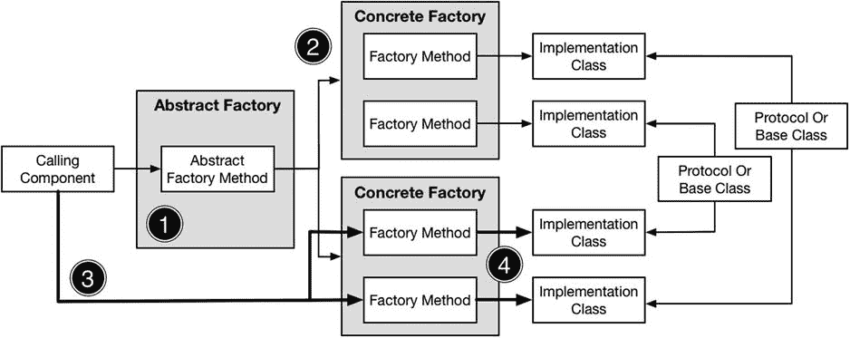
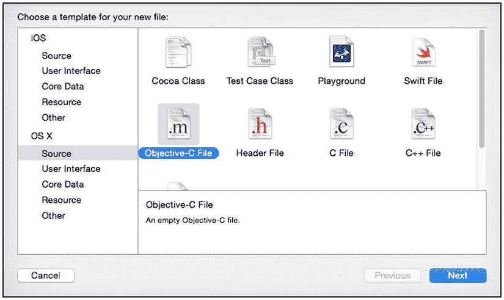
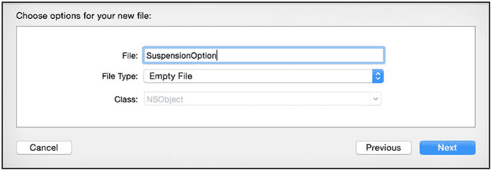
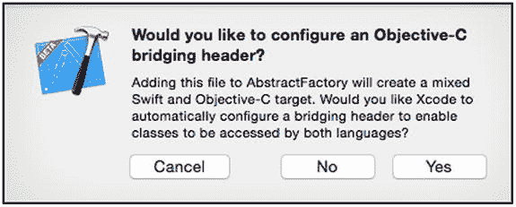

# 10. 抽象工厂模式

在本章中，我将介绍抽象工厂模式。该模式与我在第 9 章中描述的工厂方法模式类似，但它允许调用组件获取一族或一组相关对象，而无需知道具体使用了哪些类来创建它们。表 10-1 将抽象工厂模式置于上下文中进行说明。

表 10-1. 将抽象工厂模式置于上下文中

| 问题 | 答案 |
| --- | --- |
| 是什么？ | 抽象工厂模式允许调用组件创建一组相关对象。该模式隐藏了用于创建对象的类以及从调用组件中选择这些原因的全部细节。此模式与我之前在第 9 章描述的工厂方法模式类似，但它向调用组件提供一组对象。 |
| 有什么好处？ | 调用组件无需知道用于创建对象的类或选择它们的原因，这使得在不更改使用这些对象的组件的情况下，可以更改所使用的类。 |
| 何时使用此模式？ | 当需要确保调用组件使用多个兼容对象，而该组件无需知道哪些对象能够协同工作时，使用此模式。 |
| 何时应避免使用此模式？ | 不要使用此模式来创建单个对象；工厂方法模式是更简单的替代方案，应优先使用。 |
| 如何判断是否已正确实现该模式？ | 当调用组件接收到一组对象，却不知道用于实例化它们的类是哪些时，即视为正确实现了此模式。调用组件应仅能通过对象实现的协议或其派生自的基类来访问对象的功能。 |
| 有哪些常见陷阱？ | 主要的陷阱是将所用类的细节泄露给调用组件，这要么会创建对选择类的决策过程的依赖，要么会创建对特定类的依赖。 |
| 有哪些相关模式？ | 当仅需要单个对象时，工厂方法模式（第 9 章）是一种更简单的模式。抽象工厂方法通常与单例模式和原型模式结合使用（参见“抽象工厂模式的变体”部分）。 |

## 准备示例项目

对于本章，我创建了一个名为`AbstractFactory`的新 OS X 命令行工具项目。本章的示例基于为不同车型创建所需的零件。首先，我添加了一个名为`Floorplans.swift`的文件，其内容如代码清单 10-1 所示。

代码清单 10-1. `Floorplans.swift`文件的内容

```
protocol Floorplan {
    var seats:Int { get }
    var enginePosition:EngineOption { get }
}

enum EngineOption : String {
    case FRONT = "Front"
    case MID = "Mid"
}

class ShortFloorplan: Floorplan {
    var seats = 2
    var enginePosition = EngineOption.MID
}

class StandardFloorplan: Floorplan {
    var seats = 4
    var enginePosition = EngineOption.FRONT
}

class LongFloorplan: Floorplan {
    var seats = 8
    var enginePosition = EngineOption.FRONT
}
```

我定义了一个名为`Floorplan`的协议，它代表汽车的基础结构。它包含一个由`Int`类型属性`seats`表示的车座数量，以及一个安装在由`EngineOption`枚举值表示的特定位置的发动机，该位置由`enginePosition`属性表示。我定义了三个遵循该协议的类，每个类代表一种不同的地板布局配置：`ShortFloorplan`、`StandardFloorplan`和`LongFloorplan`。

我用另一个名为`Suspension.swift`的文件重复了此过程，其内容如代码清单 10-2 所示。

代码清单 10-2. `Suspension.swift`文件的内容

```
protocol Suspension {
    var suspensionType:SuspensionOption { get }
}

enum SuspensionOption : String {
    case STANDARD = "Standard"
    case SPORTS = "Firm"
    case SOFT = "Soft"
}

class RoadSuspension : Suspension {
    var suspensionType = SuspensionOption.STANDARD
}

class OffRoadSuspension : Suspension {
    var suspensionType = SuspensionOption.SOFT
}

class RaceSuspension : Suspension {
    var suspensionType = SuspensionOption.SPORTS
}
```

此处的协议称为`Suspension`，它定义了一个名为`suspensionType`的属性，该属性被设置为`SuspensionOption`中的一个值。与之前类似，我创建了三个遵循该协议的类，以代表三种不同的悬挂产品。

我为最后一组产品创建了一个名为`Drivetrains.swift`的文件，如代码清单 10-3 所示。

代码清单 10-3. `Drivetrains.swift`文件的内容

```
protocol Drivetrain {
    var driveType:DriveOption { get }
}

enum DriveOption : String {
    case FRONT = "Front"
    case REAR = "Rear"
    case ALL = "4WD"
}

class FrontWheelDrive : Drivetrain {
    var driveType = DriveOption.FRONT
}

class RearWheelDrive : Drivetrain {
    var driveType = DriveOption.REAR
}

class AllWheelDrive : Drivetrain {
    var driveType = DriveOption.ALL
}
```

该协议代表一个驱动系统，并定义了一个属性，该属性接受`DriveOption`枚举中的一个值。实现类代表了可用于汽车生产的三种不同类型的驱动系统。

为了完成准备工作，我添加了一个名为`CarsParts.swift`的文件，其内容如代码清单 10-4 所示。

代码清单 10-4. `CarsParts.swift`文件的内容

```
enum Cars: String {
    case COMPACT = "VW Golf"
    case SPORTS = "Porsche Boxter"
    case SUV = "Cadillac Escalade"
}

struct Car {
    var carType:Cars
    var floor:Floorplan
    var suspension:Suspension
    var drive:Drivetrain

    func printDetails() {
        println("Car type: \(carType.rawValue)")
        println("Seats: \(floor.seats)")
        println("Engine: \(floor.enginePosition.rawValue)")
        println("Suspension: \(suspension.suspensionType.rawValue)")
        println("Drive: \(drive.driveType.rawValue)")
    }
}
```

我定义了一个名为`Cars`的枚举，它为我要创建的每种车型设置了值，以及一个名为`Car`的结构体，它代表一辆完整的汽车，其属性对应示例中的每种产品。`printDetails`函数将汽车设置的详细信息输出到调试控制台。

提示

请注意，我将`String`用作此项目中所有枚举的基类型。在实际项目中你不会这样做，但在示例中它很有帮助，因为它允许我通过将原始值写入调试控制台来轻松指示选择了哪些值。


## 理解该模式解决的问题

在第 9 章中，我展示了如何使用工厂方法模式，让调用组件无需知道具体选择或选择原因，即可获取实现类的实例。

本章面临的问题与之类似，但适用于那些不共享通用协议或基类的相关对象组。在上一节中，我定义了三个汽车部件的协议，并从中创建了三个实现类。对于`Cars`枚举中的每个值，我都希望从每个类别中选择合适的产品，如表 10-2 所示。

**表 10-2.** 车型与产品映射关系

| 车型 | 底盘布局 | 悬挂系统 | 驱动系统 |
| --- | --- | --- | --- |
| `COMPACT` | `StandardFloorplan` | `RoadSuspension` | `FrontWheelDrive` |
| `SPORTS` | `ShortFloorplan` | `RaceSuspension` | `RearWheelDrive` |
| `SUV` | `LongFloorplan` | `OffRoadSuspension` | `AllWheelDrive` |

目前，组件要创建一辆汽车的唯一途径是必须至少了解表中部分内容，才能实例化所需的类。代码清单 10-5 展示了如何在`main.swift`文件中创建实现对象，并用它们设置`Car`结构的属性。

**代码清单 10-5.** `main.swift`文件的内容

```
var car = Car(carType: Cars.SPORTS,
              floor: ShortFloorplan(),
              suspension: RaceSuspension(),
              drive: RearWheelDrive());
car.printDetails();
```

运行应用程序时，你将在调试控制台中看到以下输出：

```
Car type: Porsche Boxter
Seats: 2
Engine: Mid
Suspension: Firm
Drive: Rear
```

这种方法带来的问题与我在第 9 章中面临的问题相同：选择实现类的决策逻辑将在整个应用程序中分散和重复，并且会形成对单个实现类存在的依赖。如果表 10-2 中的产品映射发生变化，那么所有需要操作这些产品的组件都需要进行相应的修改。这类修改既繁琐、易出错，又难以测试。

## 理解抽象工厂模式

抽象工厂模式与工厂方法模式有着共同的目的，但它是用于创建那些关系无法通过通用协议或基类表达的对象组。在示例应用程序中，需要三个对象来填充`Car`结构，而每个对象将实现不同的协议：`Floorplan`、`Suspension`和`Drivetrain`协议。

## 工厂方法与抽象工厂模式

关于工厂方法模式和抽象工厂模式之间的区别，以及各自的使用时机，存在着无休止的争论。由于不同语言的特性改变了实现方式，并强调或隐藏了细微差别，使得这场争论更加复杂。

我的建议是关注意图而非实现。如果你有一个像表 10-2 这样的产品矩阵，并且需要确保不会出现例如跑车的悬挂系统与 SUV 的底盘布局混用的情况，那么就使用抽象工厂模式。抽象工厂模式将对象组中的具体对象细节隐藏在具体工厂类中，而具体工厂类又对调用组件隐藏。这种额外的复杂性使得很容易向产品矩阵中添加新行（通过创建新的具体工厂）或更改现有行中的产品（通过修改具体工厂）。

工厂方法模式则简单得多，因为它只处理单个对象，并且只需隐藏选择了哪个实现类。正如你将看到的，我通过将多个工厂方法组合到一个类中来实现抽象工厂模式。

简而言之，忽略语义上的争论，专注于目标。使用工厂方法模式来创建单个对象；如果你试图管理一组对象，则使用抽象工厂模式。

抽象工厂模式通过将决策逻辑集中在一个地方来解决其分散化的问题。该模式通过只向调用组件提供协议访问权限（而非符合协议的具体类）来解决对特定实现类的依赖问题。抽象工厂模式包含四个操作，如图 10-1 所示。



**图 10-1.** 抽象工厂模式

该模式需要使用一个抽象工厂类，该类定义了一个方法，该方法将返回一个协议或基类的实现。模式中的第一个操作发生在调用组件调用抽象工厂方法获取对象时。

对于第二个操作，抽象工厂方法会检查调用组件的请求，并选择一个具体工厂类，即实现了工厂方法模式的类（如第 9 章所述）。创建具体工厂类的实例并将其返回给调用者。

在第三个操作中，调用组件调用由具体工厂类定义的工厂方法。这引出了第四个也是最后一个操作，在此操作中，实例化实现类，以向调用组件提供其所需的对象。

在尝试理解此模式时，重点关注其他类的知识在整个模式中如何分布会有所帮助。具体工厂知道哪些实现类属于同一组，并且它的方法会创建同一组内的对象，即使这些类实现了不同的协议或源于不同的基类。

抽象工厂不知道将使用哪些实现类，但它确实知道如何为任何给定请求选择合适的工厂类。

调用组件只知道工厂以及实现类使用的协议或基类，而不直接了解实现类。它依赖抽象工厂来提供合适的工厂类，并依赖具体工厂来选择合适的实现类。

## 实现抽象工厂模式

在接下来的几节中，我将向你展示如何实现抽象工厂模式，以创建代表本章开头定义的汽车产品的对象。


### 创建抽象工厂

我将从创建抽象工厂类开始。这个类是模式的核心，因为它被用作具体工厂的基类。清单 10-6 展示了我添加到示例项目中的 `Abstract.swift` 文件的内容。

**清单 10-6.** `Abstract.swift` 文件的内容

```
class CarFactory {

    func createFloorplan() -> Floorplan {
        fatalError("Not implemented");
    }

    func createSuspension() -> Suspension {
        fatalError("Not implemented");
    }

    func createDrivetrain() -> Drivetrain {
        fatalError("Not implemented");
    }

}
```

这个抽象工厂名为 `CarFactory`，它定义了 `createFloorplan`、`createSuspension` 和 `createDrivetrain` 方法，这些方法返回实现了三种产品协议（`Floorplan`、`Suspension` 和 `Drivetrain`）的对象。该类仅包含足以作为具体工厂类（将在下一节定义）基类的功能。一旦定义了具体工厂类，我将回到这个类并完善它，使其能够选择和调用具体工厂。

### 创建具体工厂

下一步是创建具体工厂类，这些类负责创建一组可以协同使用的产品对象。我向项目中添加了一个名为 `Concrete.swift` 的文件，并用它定义了清单 10-7 中所示的类。

**清单 10-7.** `Concrete.swift` 文件的内容

```
class CompactCarFactory : CarFactory {

    override func createFloorplan() -> Floorplan {
        return StandardFloorplan();
    }

    override func createSuspension() -> Suspension {
        return RoadSuspension();
    }

    override func createDrivetrain() -> Drivetrain {
        return FrontWheelDrive();
    }

}

class SportsCarFactory : CarFactory {

    override func createFloorplan() -> Floorplan {
        return ShortFloorplan();
    }

    override func createSuspension() -> Suspension {
        return RaceSuspension();
    }

    override func createDrivetrain() -> Drivetrain {
        return RearWheelDrive();
    }

}

class SUVCarFactory : CarFactory {

    override func createFloorplan() -> Floorplan {
        return LongFloorplan();
    }

    override func createSuspension() -> Suspension {
        return OffRoadSuspension();
    }

    override func createDrivetrain() -> Drivetrain {
        return AllWheelDrive();
    }

}
```

每个具体工厂类都派生自 `CarFactory` 类，并重写其方法以创建表 10-2 中所示的产品组之一。

### 完善抽象工厂

现在我可以回到抽象工厂类并完成模式的实现。清单 10-8 展示了选择具体工厂的变化，以便为调用方提供获取具体工厂的途径。

**清单 10-8.** 在 `Abstract.swift` 文件中完成模式实现

```
class CarFactory {

    func createFloorplan() -> Floorplan {
        fatalError("Not implemented");
    }

    func createSuspension() -> Suspension {
        fatalError("Not implemented");
    }

    func createDrivetrain() -> Drivetrain {
        fatalError("Not implemented");
    }

    final class func getFactory(car:Cars) -> CarFactory? {
        var factory:CarFactory?
        switch (car) {
            case .COMPACT:
                factory = CompactCarFactory();
            case .SPORTS:
                factory = SportsCarFactory();
            case .SUV:
                factory = SUVCarFactory();
        }
        return factory;
    }

}
```

我添加了一个名为 `getFactory` 的类型方法，它接受一个来自 `Cars` 枚举的值，选择一个具体工厂，并将其实例返回给调用方。被选中的工厂以 `CarFactory` 对象的形式呈现给调用方，而关于哪个具体工厂被选中及其原因等细节则保持私有。

### 使用抽象工厂模式

最后一步是更新创建 `Car` 对象的代码，使其通过抽象工厂获取产品。清单 10-9 展示了我在 `main.swift` 文件中所做的更改。

**清单 10-9.** 在 `main.swift` 文件中使用抽象工厂模式

```
let factory = CarFactory.getFactory(Cars.SPORTS);
if (factory != nil) {
    let car = Car(carType: Cars.SPORTS,
        floor: factory!.createFloorplan(),
        suspension: factory!.createSuspension(),
        drive: factory!.createDrivetrain());
    car.printDetails();
}
```

我没有直接实例化实现对象，而是使用抽象工厂类来获取所需车型的具体工厂，然后调用 `create` 方法来获取实现对象。如果运行应用程序，你将看到以下输出：

```
Car type: Porsche Boxter
Seats: 2
Engine: Mid
Suspension: Firm
Drive: Rear
```

如清单 10-9 所示，`main.swift` 文件中的代码与各个产品类之间没有依赖关系。这意味着，如果表 10-2 中所示的矩阵发生变化，我可以更新相应的具体工厂类，而无需在使用这些工厂的组件中进行相应的更改。在清单 10-10 中，你可以看到我如何更改了跑车的驱动系统选项。

**清单 10-10.** 在 `Concrete.swift` 文件中更改实现类

```
...
class SportsCarFactory : CarFactory {

    override func createFloorplan() -> Floorplan {
        return ShortFloorplan();
    }

    override func createSuspension() -> Suspension {
        return RaceSuspension();
    }

    override func createDrivetrain() -> Drivetrain {
        return AllWheelDrive();
    }

}
...
```

运行应用程序产生的输出显示了更改的效果。

```
Car type: Porsche Boxter
Seats: 2
Engine: Mid
Suspension: Firm
Drive: 4WD
```

通过将哪些产品组应归属于一起的决策集中起来，具体工厂降低了变更对应用程序的影响，这使得决策逻辑更易于测试和维护。抽象工厂则集中了选择具体工厂的决策逻辑，进一步将调用组件与实现类组如何相互关联的细节隔离开来。

## 抽象工厂模式的变体

有一些常见的变体可用于调整抽象工厂的实现方式。正如我在以下章节中解释的，基本机制保持不变，但实现方式会有所改动，以控制对象的创建方式。


### 隐藏抽象工厂类

第一种变体也是最常见的，是将抽象工厂模式的实现隐藏在调用组件用于存储实现对象的类或结构体中。在示例应用程序中，即指 `Car` 结构体。清单 10-11 展示了我如何修改它以直接处理抽象和具体工厂类。

清单 10-11. 在 `CarParts.swift` 文件中隐藏模式

```
enum Cars: String {
    case COMPACT = "VW Golf";
    case SPORTS = "Porsche Boxter";
    case SUV = "Cadillac Escalade";
}

struct Car {
    var carType:Cars;
    var floor:Floorplan;
    var suspension:Suspension;
    var drive:Drivetrain;

    init(carType:Cars) {
        let concreteFactory = CarFactory.getFactory(carType);
        self.floor = concreteFactory!.createFloorplan();
        self.suspension = concreteFactory!.createSuspension();
        self.drive = concreteFactory!.createDrivetrain();
        self.carType = carType;
    }

    func printDetails() {
        println("Car type: \(carType.rawValue)");
        println("Seats: \(floor.seats)");
        println("Engine: \(floor.enginePosition.rawValue)");
        println("Suspension: \(suspension.suspensionType.rawValue)");
        println("Drive: \(drive.driveType.rawValue)");
    }
}
```

我添加了一个初始化器，它接受以 `Cars` 值表示的所需汽车类型，并用它来请求抽象工厂生成具体工厂。随后，该具体工厂被用于获取初始化对象所需的 `Floorplan`、`Suspension` 和 `Drivetrain` 对象。此更改的影响是显著简化了 `main.swift` 文件中的代码，如清单 10-12 所示。

清单 10-12. 在 `main.swift` 文件中隐藏工厂的效果

```
let car = Car(carType: Cars.SPORTS);
car.printDetails();
```

**警告**

这种方法对调用组件的目标做了两个假设。它假设调用组件想创建一个 `Car` 对象，并且需要所有三个对象。如果你确实采用这种变体，请确保调用组件仍然可以访问抽象工厂，以便它能为其所需目的创建所需的对象。

### 对具体工厂应用单例模式

另一种常见的变体是对具体工厂应用单例模式。具体工厂非常适合作为单例，因为它们仅包含从实现类创建对象所需的逻辑。应用单例模式的第一步是更新抽象工厂类，即具体工厂的基类。清单 10-13 展示了我所做的更改。

清单 10-13. 在 `Abstract.swift` 文件中为单例模式做准备

```
class CarFactory {
    required init() {
        // do nothing
    }

    func createFloorplan() -> Floorplan {
        fatalError("Not implemented");
    }

    func createSuspension() -> Suspension {
        fatalError("Not implemented");
    }

    func createDrivetrain() -> Drivetrain {
        fatalError("Not implemented");
    }

    final class func getFactory(car:Cars) -> CarFactory? {
        var factoryType:CarFactory.Type;
        switch (car) {
        case .COMPACT:
            factoryType = CompactCarFactory.self;
        case .SPORTS:
            factoryType = SportsCarFactory.self;
        case .SUV:
            factoryType = SUVCarFactory.self;
        }

        var factory = factoryType.sharedInstance;
        if (factory == nil) {
            factory = factoryType();
        }
        return factory;
    }

    class var sharedInstance:CarFactory? {
        get {
            return nil;
        }
    }
}
```

我添加了一个 `sharedInstance` 计算类型属性，具体工厂如果希望被视为单例，可以重写该属性。我修改了 `getfactory` 方法的实现，使其读取 `sharedInstance` 属性的值，如果有结果则将其返回给调用者。没有重写 `sharedInstance` 属性的具体类将继承默认实现，我通过创建一个新的工厂实例来处理请求。清单 10-14 展示了我如何更新其中一个具体工厂，使其被当作单例处理。

清单 10-14. 在 `Concrete.swift` 文件中应用单例模式

```
...
class SportsCarFactory : CarFactory {
    override func createFloorplan() -> Floorplan {
        return ShortFloorplan();
    }

    override func createSuspension() -> Suspension {
        return RaceSuspension();
    }

    override func createDrivetrain() -> Drivetrain {
        return AllWheelDrive();
    }

    override class var sharedInstance:CarFactory? {
        get {
            struct SingletonWrapper {
                static let singleton = SportsCarFactory();
            }
            return SingletonWrapper.singleton;
        }
    }
}
...
```

我重写了 `SportsCarFactory` 类的 `sharedInstance` 属性以实现单例模式，如第 6 章所述。我未对另外两个具体工厂类进行修改，这意味着每次它们被选中处理来自调用组件的请求时，都会创建新的实例。相比之下，`SportsCarFactory` 类将只有一个实例，用于处理抽象工厂选择它的所有请求。

### 对实现类应用原型模式

你也可以对实现类应用单例模式，但这意味着所有组件将操作同一组对象，这仅适用于可变状态极少或没有，或者已设置并发保护的情况。

一种更常见的变体是使用原型模式，通过克隆来创建实现对象。在接下来的章节中，我将准备应用程序以使用原型模式，并向你展示如何实现它。


### 准备示例应用程序

第一步是更新实现类，使其能够被克隆。这项工作比预期的更复杂，因为用于实现原型模式的 `NSCopying` 协议无法在 Swift 枚举上运行。这意味着我必须创建一个 Objective-C 枚举，并将其导入到 Swift 中，以获得所需的行为。

首先，在项目导航器中右键点击 `AbstractFactory` 项，然后从弹出菜单中选择“新建文件”。从列表中选择 Objective-C 文件模板，如图 10-2 所示。



图 10-2. 向项目添加 Objective-C 文件

点击“下一步”按钮，将文件名设置为 `SuspensionOption`，如图 10-3 所示。



图 10-3. 设置 Objective-C 文件的名称

点击“下一步”按钮，将文件保存到项目中已有的 Swift 文件旁。保存文件时，Xcode 会提示你创建一个桥接头文件，如图 10-4 所示。



图 10-4. Xcode 提示创建桥接头文件

点击“是”按钮创建该文件，这是将我要编写的 Objective-C 枚举导入到 Swift 中所必需的。Xcode 会创建两个文件。第一个是 `SuspensionOption.m`，即 Objective-C 文件。我无需对此文件做任何修改；创建它只是为了引导 Xcode 设置桥接头文件——也就是 Xcode 创建的另一个文件。桥接头文件名为 `AbstractFactory-Bridging-Header.h`，清单 10-15 展示了我为准备要定义的枚举所进行的添加操作。

**清单 10-15.** `AbstractFactory-Bridging-Header.h` 文件的内容

```
#import "SuspensionOption.h"
```

向项目添加另一个文件，但这次添加一个名为 `SuspensionOption.h` 的头文件。编辑该文件，使其包含清单 10-16 所示的代码。

**清单 10-16.** `SuspensionOption.h` 文件的内容

```
#import <Foundation/Foundation.h>

typedef NS_ENUM(NSInteger, SuspensionOption) {

SuspensionOptionSTANDARD,

SuspensionOptionSPORTS,

SuspensionOptionSOFT

};
```

这个枚举将被导入到 Swift 中，作为我在 `Suspension.swift` 文件中定义的枚举的兼容替代品。清单 10-17 展示了我是如何移除 Swift 枚举并为原型模式做准备的。

**清单 10-17.** 在 `Suspension.swift` 文件中为原型模式做准备

```
import Foundation

@objc protocol Suspension {

var suspensionType:SuspensionOption { get };

}

//enum SuspensionOption : String {

//    case STANDARD = "Standard"; case SPORTS = "Firm"; case SOFT = "Soft";

//}

class RoadSuspension : Suspension {

var suspensionType = SuspensionOption.STANDARD;

}

class OffRoadSuspension : Suspension {

var suspensionType = SuspensionOption.SOFT;

}

class RaceSuspension : NSObject, NSCopying, Suspension {

var suspensionType = SuspensionOption.SPORTS;

func copyWithZone(zone: NSZone) -> AnyObject {

return RaceSuspension();

}

}
```

我为 `Suspension` 协议添加了 `@objc` 属性，以便稍后在具体工厂类中实现原型模式时能够进行类型转换。我注释掉了 Swift 的 `SuspensionOption` 枚举，避免与 Objective-C 的对应枚举冲突。最后，我修改了 `RaceSuspension` 类，使其实现 `NSCopying` 协议，从而允许将其视为原型。

**提示**  
对实现类应用原型模式的效果微乎其微，因为它们非常简单。有关该模式产生更大影响的详细信息，请参阅第 5 章。

如果运行该应用程序，你将看到以下输出：

```
Car type: Porsche Boxter
Seats: 2
Engine: Mid
Suspension: 1
Drive: 4WD
```

请注意，`Suspension` 的值是一个数字。Objective-C 不允许将字符串作为枚举的底层类型，因此我在清单 10-16 中定义 `SuspensionOption` 枚举时使用了整数。因此，输出不再显示悬架的描述性字符串。


### 应用原型模式

将原型模式应用于实现类而非具体工厂非常重要。这有两个原因：第一，除非所有具体工厂都是单例，否则最终可能会产生多个原型，这会削弱应用该模式的效果。第二，关于哪些实现类被视为原型、哪些应被实例化的知识将在各个工厂中重复，这意味着更改一个实现类的行为将需要所有使用它的具体工厂类进行相应的更改。如果忘记进行所有这些更改，将导致某个实现类的处理方式不一致。

清单 10-18 展示了如何通过在 `Suspension` 协议中定义一个工厂用来获取符合协议对象的方法来规避这些问题，并允许每个实现类自行决定如何创建该对象。

**清单 10-18.** 在 `Suspension.swift` 文件中应用原型模式

```
import Foundation

@objc protocol Suspension {
    var suspensionType:SuspensionOption { get };
    class func getInstance() -> Suspension;
}

class RoadSuspension : Suspension {
    var suspensionType = SuspensionOption.STANDARD;
    private init() {};
    class func getInstance() -> Suspension {
        return RoadSuspension();
    }
}

class OffRoadSuspension : Suspension {
    var suspensionType = SuspensionOption.SOFT;
    private init() {};
    class func getInstance() -> Suspension {
        return OffRoadSuspension();
    }
}

class RaceSuspension : NSObject, NSCopying, Suspension {
    var suspensionType = SuspensionOption.SPORTS;
    private override init() {};
    func copyWithZone(zone: NSZone) -> AnyObject {
        return RaceSuspension();
    }
    private class var prototype:RaceSuspension {
        get {
            struct SingletonWrapper {
                static let singleton = RaceSuspension();
            }
            return SingletonWrapper.singleton;
        }
    }
    class func getInstance() -> Suspension {
        return prototype.copy() as Suspension;
    }
}
```

**提示**

在实际项目中，你会将模式应用于所有实现类，但此处我只更改悬挂类以避免重复类似的改动。

我在 `Suspension` 协议中增加了一个名为 `getInstance` 的方法。每个实现类都需要定义此方法，其中 `RoadSuspension` 和 `OffRoadSuspension` 只是简单地创建新对象。`RaceSuspension` 类则将原型定义为单例，并在每次调用 `getInstance` 方法时复制它。

**提示**

我为实现类定义了空的 `private` 初始化方法，这样它们就不能被直接实例化。请注意，我针对 `RaceSuspension` 类使用了 `override` 关键字，因为它从 `NSObject` 类继承了一个空的初始化方法，而 `NSObject` 是 `NSCopying` 协议所需的基类。详见第 5 章。

在清单 10-19 中，你可以看到我如何更新具体工厂类以反映悬挂类的变化。

**清单 10-19.** 在 `Concrete.swift` 文件中修订悬挂类的消费方式

```
class CompactCarFactory : CarFactory {
    override func createFloorplan() -> Floorplan {
        return StandardFloorplan();
    }
    override func createSuspension() -> Suspension {
        return RoadSuspension.getInstance();
    }
    override func createDrivetrain() -> Drivetrain {
        return FrontWheelDrive();
    }
}

class SportsCarFactory : CarFactory {
    override func createFloorplan() -> Floorplan {
        return ShortFloorplan();
    }
    override func createSuspension() -> Suspension {
        return RaceSuspension.getInstance();
    }
    override func createDrivetrain() -> Drivetrain {
        return AllWheelDrive();
    }
    override class var sharedInstance:CarFactory? {
        get {
            struct SingletonWrapper {
                static let singleton = SportsCarFactory();
            }
            return SingletonWrapper.singleton;
        }
    }
}

class SUVCarFactory : CarFactory {
    override func createFloorplan() -> Floorplan {
        return LongFloorplan();
    }
    override func createSuspension() -> Suspension {
        return OffRoadSuspension.getInstance();
    }
    override func createDrivetrain() -> Drivetrain {
        return AllWheelDrive();
    }
}
```

完成这些改动后，`RaceSuspension` 类的实例通过原型模式创建。这一事实对具体工厂类是隐藏的，这使得更改单个实现类的行为变得容易，而无需进一步更改具体工厂。

## 理解该模式的陷阱

此模式的主要陷阱是模糊了不同组件之间的界限。具体来说，抽象工厂类应仅包含选择具体工厂的决策逻辑，而不应包含实现类的逻辑。同样，具体工厂应包含选择实现类的逻辑，而不应提供产品协议定义的任何功能。

唯一需要避免的另一个陷阱出现在将此模式与第 7 章中描述的对象池模式结合使用时。如果你试图为每个实现类管理独立的池，并让调用组件等待一组对象变得可用，这将是一种灾难性的组合。当所有组件都需要相同类型的对象时，对象池的效果最佳；而试图排队访问重叠的对象集，通常会在两个组件各自获取了对方所需的空闲对象时导致死锁。如果你确实尝试结合这些模式，请确保你的调用组件始终以相同的顺序从池中获取对象，并特别注意避免死锁。

## Cocoa 中该模式的示例

当你创建一个 Cocoa 对象时，无法判断是使用了工厂方法模式还是抽象工厂模式。作为对象的接收者，你根本不知道你收到的是一个具体工厂，还是一个基于你的请求选择了其类的普通对象。苹果在其文档中混淆了工厂方法模式和抽象工厂模式，这无济于事，这就是为什么你经常会听到类簇被描述为这两种模式的实现。

这正应该是这样的，因为这两种模式都是关于向调用组件隐藏决策和实现的，而判断使用了哪种模式的唯一方法是查看源代码。如果你能通过其他方式判断，那么这两种模式的实现都是有缺陷的。

## 将模式应用于 SportsStore 应用程序

为了演示如何应用抽象工厂模式，我将更改 SportsStore 库存总价值的生成方式，以便可以选择不同的货币和汇率。在接下来的小节中，我将逐步介绍定义协议和实现类的过程，这些协议和类将转换库存价值并准备显示，以及通过抽象工厂和具体工厂提供这些类的过程。

### 准备示例应用程序

本章无需准备工作；我将继续使用第 9 章结束时的项目。

**提示**

如果你不想手动重新创建 SportsStore 项目，请不要忘记你可以从 [`Apress.com`](https://Apress.com) 下载每一章的源代码。


### 定义实现协议与类

第一步是创建一个文件，其中包含实现类的定义以及用于表达其功能的协议。清单 10-20 展示了我添加到 SportsStore 项目中的`StockValueImplementations.swift`文件的内容。

**清单 10-20.** `StockValueImplementations.swift`文件的内容

```swift
import Foundation

protocol StockValueFormatter {
    func formatTotal(total: Double) -> String;
}

class DollarStockValueFormatter: StockValueFormatter {
    func formatTotal(total: Double) -> String {
        let formatted = Utils.currencyStringFromNumber(total);
        return "\(formatted)";
    }
}

class PoundStockValueFormatter: StockValueFormatter {
    func formatTotal(total: Double) -> String {
        let formatted = Utils.currencyStringFromNumber(total);
        return "£\(dropFirst(formatted))";
    }
}

protocol StockValueConverter {
    func convertTotal(total: Double) -> Double;
}

class DollarStockValueConverter: StockValueConverter {
    func convertTotal(total: Double) -> Double {
        return total;
    }
}

class PoundStockValueConverter: StockValueConverter {
    func convertTotal(total: Double) -> Double {
        return 0.60338 * total;
    }
}
```

我定义了两个协议和两组实现类。这两个协议分别称为`StockValueFormatter`和`StockValueConverter`。`StockValueConverter`协议负责将货币金额从美元进行转换，而`StockValueFormatter`协议则负责准备货币金额的格式。我创建了两组实现类，一组直接传递美元金额而不做任何修改，另一组则将金额转换为英镑。

### 定义抽象工厂与具体工厂类

我在一个名为`StockValueFactories.swift`的新文件中定义了抽象工厂和具体工厂类，其内容如清单 10-21 所示。

**清单 10-21.** `StockValueFactories.swift`文件的内容

```swift
import Foundation

class StockTotalFactory {
    enum Currency {
        case USD
        case GBP
    }

    private(set) var formatter: StockValueFormatter?;
    private(set) var converter: StockValueConverter?;

    class func getFactory(curr: Currency) -> StockTotalFactory {
        if (curr == Currency.USD) {
            return DollarStockTotalFactory.sharedInstance;
        } else {
            return PoundStockTotalFactory.sharedInstance;
        }
    }
}

private class DollarStockTotalFactory: StockTotalFactory {
    private override init() {
        super.init();
        formatter = DollarStockValueFormatter();
        converter = DollarStockValueConverter();
    }

    class var sharedInstance: StockTotalFactory {
        get {
            struct SingletonWrapper {
                static let singleton = DollarStockTotalFactory();
            }
            return SingletonWrapper.singleton;
        }
    }
}

private class PoundStockTotalFactory: StockTotalFactory {
    private override init() {
        super.init();
        formatter = PoundStockValueFormatter();
        converter = PoundStockValueConverter();
    }

    class var sharedInstance: StockTotalFactory {
        get {
            struct SingletonWrapper {
                static let singleton = PoundStockTotalFactory();
            }
            return SingletonWrapper.singleton;
        }
    }
}
```

`StockTotalFactory`类是抽象工厂，它根据传递给`getFactory`方法的`Currency`枚举值，在具体类`DollarStockTotalFactory`和`PoundStockTotalFactory`之间进行选择。其效果如表 10-3 所示的矩阵。

**表 10-3.** 货币与格式化器/转换器的映射关系

| 货币 | StockValueFormatter | StockValueConverter |
|----------|----------------------|----------------------|
| `USD`    | `DollarStockValueFormatter` | `DollarStockValueConverter` |
| `GBP`    | `PoundStockValueFormatter` | `PoundStockValueConverter` |

### 使用工厂与实现类

最后一步是使用抽象工厂来转换和格式化库存的价值。清单 10-22 展示了我对`ViewController.swift`文件所做的更改。

**清单 10-22.** 在`ViewController.swift`文件中使用抽象工厂模式

```swift
...

func displayStockTotal() {
    let finalTotals: (Int, Double) = productStore.products.reduce((0, 0.0),
        {(totals, product) -> (Int, Double) in
            return (
                totals.0 + product.stockLevel,
                totals.1 + product.stockValue
            );
        });

    var factory = StockTotalFactory.getFactory(StockTotalFactory.Currency.GBP);
    var totalAmount = factory.converter?.convertTotal(finalTotals.1);
    var formatted = factory.formatter?.formatTotal(totalAmount!);
    totalStockLabel.text = "\(finalTotals.0) Products in Stock. "
        + "Total Value: \(formatted!)";
}

...
```

我指定了 GBP 货币，这将选择负责处理英镑的实现类组。当你运行应用程序时，库存总价值将从美元转换为英镑并显示在应用程序中，如图 10-5 所示。


**图 10-5.** 转换并格式化库存价值

`ViewController`类能够格式化库存价值，而无需了解所选择的具体类及其提供的实现类的任何细节。

## 本章小结

在本章中，我解释了如何使用抽象工厂模式来创建属于某个组或系列的对象，但这些对象并不遵循通用协议，也不共享公共基类。在下一章中，我将描述建造者模式。

