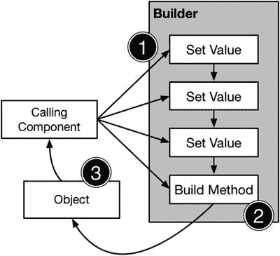

# 11. 建造者模式

建造者模式用于将对象的配置与其创建过程分离。调用组件拥有配置数据，并将其传递给一个中介——建造者——由后者负责代表该组件创建对象。这种分离可以减少调用组件对其所用对象的了解程度，并将默认配置值集中到建造者类中，而不是要求每个创建对象的组件都拥有这些配置值。表 11-1 展示了建造者模式的背景信息。

**表 11-1.** 建造者模式的背景信息

| 问题 | 答案 |
|----------|--------|
| 它是什么？ | 建造者模式将创建对象所需的逻辑和默认配置值放入一个建造者类中。这使得调用组件能够以最少的配置数据创建对象，并且无需了解创建对象时将使用的默认值。 |
| 有什么好处？ | 此模式使得更改创建对象所使用的默认配置值，以及更改实例化对象所用的类变得更加容易。 |
| 何时应使用此模式？ | 当创建对象需要复杂的配置过程，并且你不想让默认配置值分散在整个应用程序中时，使用此模式。 |
| 何时应避免使用此模式？ | 当创建每个对象所需的每个数据值都各不相同，即无法使用默认值时，不要使用此模式。 |
| 如何判断实现正确？ | 调用组件只需提供那些没有默认值的数据值（虽然也可以提供值来覆盖部分或全部默认值）即可创建对象。 |
| 有常见的陷阱吗？ | 没有。 |
| 有相关的模式吗？ | 此模式可以与工厂方法模式或抽象工厂模式结合使用，以根据调用组件提供的配置数据更改用于创建对象的实现类。 |


## 准备示例项目

本章中，我创建了一个名为`Builder`的全新 OS X 命令行工具项目，并在项目中添加了一个名为`Food.swift`的文件，用于定义清单 11-1 中所示的类。

**清单 11-1.** `Food.swift` 文件的内容

```
class Burger {

    let customerName:String;
    let veggieProduct:Bool;
    let patties:Int;
    let pickles:Bool;
    let mayo:Bool;
    let ketchup:Bool;
    let lettuce:Bool;
    let cook:Cooked;

    enum Cooked : String {
        case RARE = "Rare";
        case NORMAL = "Normal";
        case WELLDONE = "Well Done";
    }

    init(name:String, veggie:Bool, patties:Int, pickles:Bool, mayo:Bool,
        ketchup:Bool, lettuce:Bool, cook:Cooked) {
        self.customerName = name;
        self.veggieProduct = veggie;
        self.patties = patties;
        self.pickles = pickles;
        self.mayo = mayo;
        self.ketchup = ketchup;
        self.lettuce = lettuce;
        self.cook = cook;
    }

    func printDescription() {
        println("Name \(self.customerName)");
        println("Veggie: \(self.veggieProduct)");
        println("Patties: \(self.patties)");
        println("Pickles: \(self.pickles)");
        println("Mayo: \(self.mayo)");
        println("Ketchup: \(self.ketchup)");
        println("Lettuce: \(self.lettuce)");
        println("Cook: \(self.cook.rawValue)");
    }
}
```

`Burger`类代表餐厅中的一份订单，并为通过构造函数设置的订单不同方面定义了常量值。`printDescription`方法将这些常量的值输出到调试控制台。清单 11-2 展示了我如何编辑`main.swift`文件来创建一个`Burger`对象并调用`printDescription`方法。

**清单 11-2.** `main.swift` 文件的内容

```
let order = Burger(name: "Joe", veggie: false, patties: 2, pickles: true,
    mayo: true, ketchup: true, lettuce: true, cook: Burger.Cooked.NORMAL);
order.printDescription();
```

运行该应用会产生以下输出：

```
Name Joe
Veggie: false
Patties: 2
Pickles: true
Mayo: true
Ketchup: true
Lettuce: true
Cook: Normal
```

## 理解模式解决的问题

当对象需要大量配置数据值，而调用组件并非对这些值都有值时，就会出现生成器模式所要解决的问题。以`Burger`类为例，其初始化器要求为其所代表的汉堡的每个方面提供值。以下是我虚构餐厅中的点餐流程：

- 服务员询问顾客姓名。
- 服务员询问顾客是否需要素食餐。
- 服务员询问顾客是否要定制汉堡。
- 服务员询问顾客是否要升级并额外购买一个肉饼。

这个过程虽然只有四个步骤，却引发了一些问题。清单 11-3 展示了如何在`main.swift`文件中模拟此过程，从而改变我创建`Burger`对象的方式。

**清单 11-3.** 在 `main.swift` 文件中实现点餐流程

```
// 第 1 步 - 询问姓名
let name = "Joe";

// 第 2 步 - 是否需要素食？
let veggie = false;

// 第 3 步 - 定制汉堡？
let pickles = true;
let mayo = false;
let ketchup = true;
let lettuce = true;
let cooked = Burger.Cooked.NORMAL;

// 第 4 步 - 购买额外肉饼？
let patties = 2;

let order = Burger( name: name, veggie: veggie, patties: patties, pickles: pickles,
    mayo: mayo, ketchup: ketchup, lettuce: lettuce, cook: cooked );
order.printDescription();
```

`Burger`的初始化器要求调用组件在客户不想更改默认值时了解这些默认配置值——例如，要知道标准汉堡包含两个肉饼并加有番茄酱。每个需要`Burger`对象的组件都必须具备这一知识，其结果是默认值的任何更改都必须在每个调用组件中实现。

### 理解伸缩初始化器反模式

在其他语言中，生成器模式被用作伸缩初始化器或伸缩构造函数反模式的替代方案。反模式是那些无法解决预期问题或以困难或危险方式解决问题的常用技术。在某些语言中，伸缩构造函数模式是一种常用技术，旨在简化使用定义大量初始化器参数的类。考虑以下类：

```
class Milkshake {
    enum Size { case SMALL; case MEDIUM; case LARGE };
    enum Flavor { case CHOCOLATE; case STRAWBERRY; case VANILLA };
    let count:Int;
    let size:Size;
    let flavor:Flavor;

    init(flavor:Flavor, size:Size, count:Int) {
        self.count = count;
        self.size = size;
        self.flavor = flavor;
    }
}
```

`Milkshake`类定义了一个包含三个参数的初始化器。这要求调用组件了解这些参数的默认值，并且即使在需要默认值时也要提供值，如下所示：

```
var shake = Milkshake(
    flavor: Milkshake.Flavor.CHOCOLATE,
    size: Milkshake.Size.MEDIUM,
    count: 1
);
```

大多数顾客只想要一份中杯奶昔，只需指定口味即可。伸缩初始化器反模式试图通过提供提供默认值的便捷初始化器来改善这种情况，如下所示：

```
class Milkshake {
    enum Size { case SMALL; case MEDIUM; case LARGE };
    enum Flavor { case CHOCOLATE; case STRAWBERRY; case VANILLA };
    let count:Int;
    let size:Size;
    let flavor:Flavor;

    init(flavor:Flavor, size:Size, count:Int) {
        self.count = count;
        self.size = size;
        self.flavor = flavor;
    }

    convenience init(flavor:Flavor, size:Size) {
        self.init(flavor:flavor, size:size, count:1);
    }

    convenience init(flavor:Flavor) {
        self.init(flavor:flavor, size:Size.MEDIUM);
    }
}
```

每个便捷初始化器省略一个附加参数，并调用前一个初始化器并传入一个默认值。这样可以在调用组件不知道未提供的参数的默认值的情况下创建对象，如下所示：

```
var shake = Milkshake(flavor: Milkshake.Flavor.CHOCOLATE);
```

伸缩初始化器被认为是一种反模式，因为它们会导致大量难以阅读和维护的初始化器。在 Swift 中，你可以通过使用默认参数值来避免伸缩初始化器，如下所示：

```
class Milkshake {
    enum Size { case SMALL; case MEDIUM; case LARGE };
    enum Flavor { case CHOCOLATE; case STRAWBERRY; case VANILLA };
    let count:Int;
    let size:Size;
    let flavor:Flavor;

    init(flavor:Flavor, size:Size = Size.MEDIUM, count:Int = 1) {
        self.count = count;
        self.size = size;
        self.flavor = flavor;
    }
}
```

当想要创建`Milkshake`对象的组件省略了`size`和`count`参数时，就会使用它们的默认值。这样做的好处是，默认值在`Milkshake`类内部定义，无需定义初始化器的各种排列组合。


## 理解建造者模式

建造者模式通过在组件及其需要操作的对象之间引入一个中介——称为建造者——来解决问题。如图 11-1 所示，建造者模式包含三个操作。



图 11-1. 建造者模式

在第一个操作中，调用组件向建造者提供一条数据，用于替换创建对象时使用的某个默认值。每次调用组件从其所遵循的流程中获取新值时，该操作都会重复执行。以我的点餐流程为例，调用组件能够在序列的每个阶段之后向建造者提供新的数据。

在第二个操作中，调用组件要求建造者创建一个对象。这向建造者表明，将不会再有新数据，并且应该使用它已接收到的数据值以及调用组件未指定的数据项的默认值来创建一个对象。

在第三个操作中，建造者创建一个对象，并将其作为对象返回给调用组件。

调用组件知道需要什么——例如，一个不加番茄酱的汉堡——但它不知道如何创建它。建造者类知道如何创建汉堡，也知道默认配置，但它不知道顾客在任何特定订单中的需求。建造者模式将“需要什么”和“如何创建”结合在一起，同时避免调用组件与其所需对象之间产生紧密耦合。

## 实现建造者模式

在接下来的章节中，我将演示如何将建造者模式应用到示例项目中，以便将 `Burger` 类的创建过程与使用 `Burger` 对象的组件解耦。

### 定义建造者类

第一步是定义建造者类，其中包含 `Burger` 初始化器参数的默认值，并提供了允许调用组件更改这些值的方法。代码清单 11-4 展示了我添加到示例项目中的 `Builder.swift` 文件的内容。

代码清单 11-4. `Builder.swift` 文件的内容

```
class BurgerBuilder {

private var veggie  = false;
private var pickles = true;
private var mayo    = true;
private var ketchup = true;
private var lettuce = true;
private var cooked  = Burger.Cooked.NORMAL;
private var patties = 2;

func setVeggie(choice: Bool)  { self.veggie  = choice; }
func setPickles(choice: Bool) { self.pickles = choice; }
func setMayo(choice: Bool)    { self.mayo    = choice; }
func setKetchup(choice: Bool) { self.ketchup = choice; }
func setLettuce(choice: Bool) { self.lettuce = choice; }
func setCooked(choice: Burger.Cooked) { self.cooked = choice; }
func addPatty(choice: Bool)   { self.patties = choice ? 3 : 2; }

func buildObject(name: String) -> Burger {
return Burger(name: name, veggie: veggie, patties: patties,
pickles: pickles, mayo: mayo, ketchup: ketchup,
lettuce: lettuce, cook: cooked);
}

}
```

`BurgerBuilder` 类定义了用于更改创建 `Burger` 对象时所使用的数据值的方法。`Burger` 初始化器中只有 `name` 参数没有默认值，因此 `buildObject` 方法接受一个 `name` 参数。该类通过使用 `name` 值、通过其他方法提供的值以及默认值创建一个 `Burger` 对象来响应 `buildObject` 方法的调用。

**提示**

我本来可以在类中使用属性，但我更倾向于使用方法，因为通过在 `buildObject` 方法上定义参数，我可以清楚地指出那些没有默认值的参数。在本章稍后部分将建造者模式应用于 SportsStore 应用时，我将演示如何使用属性来创建建造者。

该类定义的所有方法几乎都与底层属性直接对应。唯一例外的是 `addPatty` 方法，它允许调用组件指定肉饼的数量——只需指定是否需要额外添加一个即可。这种方法使我能够处理额外肉饼的情况，而无需让调用组件了解默认数量是多少。

### 消费建造者

下一步是使用建造者来创建一个对象。代码清单 11-5 展示了我对 `main.swift` 文件所做的更改。

代码清单 11-5. 在 `main.swift` 文件中消费建造者模式

```
var builder = BurgerBuilder();

// 第 1 步 - 询问姓名
let name = "Joe";

// 第 2 步 - 是否需要素食餐？
builder.setVeggie(false);

// 第 3 步 - 定制汉堡？
builder.setMayo(false);
builder.setCooked(Burger.Cooked.WELLDONE);

// 第 4 步 - 购买额外肉饼？
builder.addPatty(false);

let order = builder.buildObject(name);
order.printDescription();
```

这看起来可能与我之前不使用建造者模式创建 `Burger` 对象的方式相似，但使用建造者作为中介，通过隔离变化的影响，提高了灵活性。

### 理解模式的影响

第一个改进是，可以在不修改调用组件或 `Burger` 类的情况下更改建造者中的默认值。如果大多数顾客选择不要酸黄瓜——大概是因为它们古怪、可怕，并且破坏了美味的汉堡——那么餐厅可以更新菜单，制作不添加酸黄瓜的汉堡。代码清单 11-6 展示了对建造者类的更改。

代码清单 11-6. 在 `Builder.swift` 文件中禁用酸黄瓜

```
class BurgerBuilder {

private var veggie  = false;
private var pickles = false;
private var mayo    = true;
private var ketchup = true;
private var lettuce = true;
private var cooked  = Burger.Cooked.NORMAL;
private var patties = 2;

func setVeggie(choice: Bool)  { self.veggie  = choice; }
func setPickles(choice: Bool) { self.pickles = choice; }
func setMayo(choice: Bool)    { self.mayo    = choice; }
func setKetchup(choice: Bool) { self.ketchup = choice; }
func setLettuce(choice: Bool) { self.lettuce = choice; }
func setCooked(choice: Burger.Cooked) { self.cooked = choice; }
func addPatty(choice: Bool)   { self.patties = choice ? 3 : 2; }

func buildObject(name: String) -> Burger {
return Burger(name: name, veggie: veggie, patties: patties,
pickles: pickles, mayo: mayo, ketchup: ketchup,
lettuce: lettuce, cook: cooked);
}

}
```

调用组件不知道默认值已经更改，`Burger` 类也不知道，但现在除非顾客明确要求，否则创建的 `Burger` 对象将不包含酸黄瓜。你可以从运行应用程序产生的输出中看到效果。

```
Name Joe
Veggie: false
Patties: 2
Pickles: false
Mayo: false
Ketchup: true
Lettuce: true
Cook: Well Done
```


### 改变流程

第二个改进之处在于，我可以在不修改生成器或 `Burger` 类的前提下，变更或精简点餐流程。额外添加肉饼的升级版可能只是限时优惠，而餐厅为了让顾客关注新品，可能会询问所有顾客是否想要素肉汉堡。即使我从流程中省略了这些步骤，我依然可以使用生成器来创建 `Burger` 对象，如代码清单 11-7 所示。

**代码清单 11-7.** 在 `main.swift` 文件中修改流程

```
var builder = BurgerBuilder();

// 第 1 步 - 询问姓名
let name = "Joe";

// 第 2 步 - 定制汉堡？
builder.setMayo(false);
builder.setCooked(Burger.Cooked.WELLDONE);

let order = builder.buildObject(name);
order.printDescription();
```

尽管流程发生了变化，顾客仍然会收到相同的订单。不过，这并非普遍适用；因为向流程中添加新步骤可能需要其他修改。

### 改变对象

第三个改进之处在于，我可以修改 `Burger` 类，并将变更的影响吸收到生成器类中，从而避免其传播到调用组件。代码清单 11-8 展示了当餐厅在菜单中添加培根后，`Burger` 类的变化。

**代码清单 11-8.** 在 `Food.swift` 文件中添加培根

```
class Burger {
    let customerName:String;
    let veggieProduct:Bool;
    let patties:Int;
    let pickles:Bool;
    let mayo:Bool;
    let ketchup:Bool;
    let lettuce:Bool;
    let cook:Cooked;
    let bacon:Bool;

    enum Cooked : String {
        case RARE = "Rare";
        case NORMAL = "Normal";
        case WELLDONE = "Well Done";
    }

    init(name:String, veggie:Bool, patties:Int, pickles:Bool, mayo:Bool,
         ketchup:Bool, lettuce:Bool, cook:Cooked, bacon:Bool) {
        self.customerName  = name;
        self.veggieProduct = veggie;
        self.patties       = patties;
        self.pickles       = pickles;
        self.mayo          = mayo;
        self.ketchup       = ketchup;
        self.lettuce       = lettuce;
        self.cook          = cook;
        self.bacon         = bacon;
    }

    func printDescription() {
        println("Name     \(self.customerName)");
        println("Veggie:  \(self.veggieProduct)");
        println("Patties: \(self.patties)");
        println("Pickles: \(self.pickles)");
        println("Mayo:    \(self.mayo)");
        println("Ketchup: \(self.ketchup)");
        println("Lettuce: \(self.lettuce)");
        println("Cook:    \(self.cook.rawValue)");
        println("Bacon:   \(self.bacon)");
    }
}
```

在菜单中添加培根改变了 `Burger` 的初始化器，这需要对生成器协议和类进行相应的修改，如代码清单 11-9 所示。

**代码清单 11-9.** 在 `Builder.swift` 文件中更新生成器协议和类

```
class BurgerBuilder {
    private var veggie  = false;
    private var pickles = false;
    private var mayo    = true;
    private var ketchup = true;
    private var lettuce = true;
    private var cooked  = Burger.Cooked.NORMAL;
    private var patties = 2;
    private var bacon   = true;

    func setVeggie(choice: Bool)  { self.veggie  = choice; }
    func setPickles(choice: Bool) { self.pickles = choice; }
    func setMayo(choice: Bool)    { self.mayo    = choice; }
    func setKetchup(choice: Bool) { self.ketchup = choice; }
    func setLettuce(choice: Bool) { self.lettuce = choice; }
    func setCooked(choice: Burger.Cooked) { self.cooked = choice; }
    func addPatty(choice: Bool)   { self.patties = choice ? 3 : 2; }
    func setBacon(choice: Bool)   { self.bacon = choice; }

    func buildObject(name: String) -> Burger {
        return Burger(name: name, veggie: veggie, patties: patties,
                      pickles: pickles, mayo: mayo, ketchup: ketchup,
                      lettuce: lettuce, cook: cooked, bacon: bacon);
    }
}
```

**提示** 请注意，培根的默认设置包含在生成器中，而非 `Burger` 类中。

需要 `Burger` 对象的组件可以不加修改地使用生成器，只要它们乐意接收默认带有培根的汉堡即可。

```
Name Joe
Veggie: false
Patties: 2
Pickles: false
Mayo: false
Ketchup: true
Lettuce: true
Cook: Well Done
Bacon: true
```

### 避免不一致的配置

最后一个改进之处在于，生成器类可以用来避免不一致的配置，从而防止对象无法创建。例如，默认在所有汉堡中添加培根，对于订购素肉汉堡的顾客来说，很可能不受欢迎。代码清单 11-10 展示了如何在生成器类中处理这种情况。

**代码清单 11-10.** 在 `Builder.swift` 文件中处理不一致的配置

```
...
func setVeggie(choice: Bool) {
    self.veggie = choice;
    if (choice) {
        self.bacon = false;
    }
}
...
```

我更新了 `setVeggie` 方法，以便在请求素肉汉堡时移除培根。然而，这并不妨碍顾客将培根作为定制选项进行请求，并且调用组件仍然负责主导点餐流程。


## 建造者模式的变体

你可以将建造者模式与其它模式结合来创建其变体，通常是工厂方法模式或抽象工厂模式（我在第 9 章和第 10 章中介绍过）。

我最常用的组合方式是定义多个建造者类，这些类设定不同的默认值，并通过工厂方法模式来应用它们。清单 11-11 展示了如何为一种不同类型的汉堡添加一个新的建造者，并添加了一个允许选择建造者的工厂方法。

**清单 11-11.** 在 `Builder.swift` 文件中结合建造者模式和工厂方法模式

```
enum Burgers {
    case STANDARD; case BIGBURGER; case SUPERVEGGIE;
}

class BurgerBuilder {
    private var veggie  = false;
    private var pickles = false;
    private var mayo    = true;
    private var ketchup = true;
    private var lettuce = true;
    private var cooked  = Burger.Cooked.NORMAL;
    private var patties = 2;
    private var bacon   = true;

    private init() {
        // 不执行任何操作
    }

    func setVeggie(choice: Bool) {
        self.veggie = choice;
        if (choice) {
            self.bacon = false;
        }
    }

    func setPickles(choice: Bool) { self.pickles = choice; }
    func setMayo(choice: Bool)    { self.mayo    = choice; }
    func setKetchup(choice: Bool) { self.ketchup = choice; }
    func setLettuce(choice: Bool) { self.lettuce = choice; }
    func setCooked(choice: Burger.Cooked) { self.cooked = choice; }
    func addPatty(choice: Bool)   { self.patties = choice ? 3 : 2; }
    func setBacon(choice: Bool)   { self.bacon   = choice; }

    func buildObject(name: String) -> Burger {
        return Burger(name: name, veggie: veggie, patties: patties,
            pickles: pickles, mayo: mayo, ketchup: ketchup,
            lettuce: lettuce, cook: cooked, bacon: bacon);
    }

    class func getBuilder(burgerType:Burgers) -> BurgerBuilder {
        var builder:BurgerBuilder;
        switch (burgerType) {
            case .BIGBURGER: builder   = BigBurgerBuilder();
            case .SUPERVEGGIE: builder = SuperVeggieBurgerBuilder();
            case .STANDARD: builder    = BurgerBuilder();
        }
        return builder;
    }
}

class BigBurgerBuilder : BurgerBuilder {
    private override init() {
        super.init();
        self.patties = 4;
        self.bacon = false;
    }

    override func addPatty(choice: Bool) {
        fatalError("Cannot add patty to Big Burger");
    }
}

class SuperVeggieBurgerBuilder : BurgerBuilder {
    private override init() {
        super.init();
        self.veggie = true;
        self.bacon = false;
    }

    override func setVeggie(choice: Bool) {
        // 不执行任何操作 - 始终是素食
    }

    override func setBacon(choice: Bool) {
        fatalError("Cannot add bacon to this burger");
    }
}
```

我创建了一个名为 `Burgers` 的枚举，详细列出了提供的汉堡种类，并在 `BurgerBuilder` 类中定义了一个工厂方法，该方法接受一个 `Burgers` 值，并选择一个建造者返回给调用者。`BurgerBuilder` 类将继续用于制作 `STANDARD`（标准）汉堡，但我创建了子类来处理新的 `BigBurger`（大汉堡）和 `SuperVeggieBurger`（超级素食汉堡）产品。

新的建造者修改了不同汉堡组件的默认值，为点餐过程创建了不同的起点，并限制了可能的更改集，例如防止向 `BigBurger` 添加额外的肉饼，或向 `SuperVeggieBurger` 添加培根。

为了利用这些更改，我必须修改点餐流程，让服务员询问顾客需要哪种汉堡，如清单 11-12 所示。

**清单 11-12.** 在 `main.swift` 文件中修改点餐流程

```
// 第 1 步 - 询问姓名
let name = "Joe";

// 第 2 步 - 选择产品
let builder = BurgerBuilder.getBuilder(Burgers.BIGBURGER);

// 第 3 步 - 定制汉堡？
builder.setMayo(false);
builder.setCooked(Burger.Cooked.WELLDONE);

let order = builder.buildObject(name);
order.printDescription();
```

## 理解建造者模式的陷阱

只要你记住，用于创建对象的默认值应该定义在建造者类中，而不是调用组件中，那么这种模式就没有任何陷阱。

## Cocoa 中建造者模式的示例

建造者模式最常用的例子可以在 `Foundation` 框架的 `NSDateComponents` 类中找到。`NSDateComponents` 类是一个建造者，它允许调用组件指定设置，用于生成代表日历日期的 `NSDate` 对象。清单 11-13 展示了我创建的一个名为 `DateBuilder.playground` 的 Xcode playground 文件内容。

**清单 11-13.** `DateBuilder.playground` 文件的内容

```
import Foundation;

var builder = NSDateComponents();

builder.hour     = 10;
builder.day      = 6;
builder.month    = 9;
builder.year     = 1940;
builder.calendar = NSCalendar(calendarIdentifier: NSGregorianCalendar);

var date         = builder.date;
println(date!);
```

我通过实例化 `NSDateComponents` 类来创建建造者，并通过设置其定义的属性来配置将要生成的对象。我为 `hour`、`day`、`month`、`year` 和 `calendar` 属性设置了值，以替换建造者定义的默认值。

为了创建对象，我读取了 `date` 属性的值，并收到一个已根据我提供的值配置好的 `NSDate` 对象。我将该值写入控制台，在 playground 控制台中显示以下输出：

```
1940-09-06 09:00:00 +0000
```

我没有为建造者提供构成日期的所有组件的值，因此建造者对其分钟、秒和时区组件使用了默认值，这就是这些部分被设置为零的原因。

通过实现建造者模式，`NSDateComponents` 类允许我以适合我的顺序指定有限数量的值来配置一个日期。建造者直到读取 `date` 属性时才会创建 `NSDate` 对象，这允许我在数据可用时提供它们。

## 将模式应用于 SportsStore 应用程序

在本节中，我将演示建造者模式的一个常见用途：生成对象的序列化表示。我还将向您展示如何使用属性而非方法来创建建造者。

### 准备示例应用程序

我将从第 10 章离开的地方继续处理 SportsStore 应用程序。我将实现建造者模式来创建产品数据更改的序列化表示。我向 SportsStore 项目添加了一个名为 `ChangeRecord.swift` 的新文件，并用它定义了清单 11-14 所示的类。

**清单 11-14.** `ChangeRecord.swift` 文件的内容

```
class ChangeRecord : Printable {
    private let outerTag:String;
    private let productName:String;
    private let catName:String;
    private let innerTag:String;
    private let value:String;

    private init(outer:String, name:String, category:String,
        inner:String, value:String) {
        self.outerTag    = outer;
        self.productName = name;
        self.catName     = category;
        self.innerTag    = inner;
        self.value       = value;
    }

    var description : String {
        return "<\(outerTag)><\(innerTag) name=\"\(productName)\"" +
            " category=\"\(catName)\">\(value)</\(innerTag)></\(outerTag)>"
    }
}
```

`ChangeRecord` 类用于创建一个表示更改的 XML 风格字符串。该类定义了一组用于配置该字符串的属性。`ChangeRecord` 类实现了 `Printable` 协议，这意味着当该类的实例被传递给 `println` 函数时，将使用其 `description` 属性。


好的，作为高级文档工程师和翻译员，我将严格遵循您提供的注意事项和示例，将给定的英文文本翻译成中文。


### 定义构建器类

为了实现构建器模式，我创建了一个名为 `ChangeRecordBuilder` 的新类，如代码清单 11-15 所示。

**代码清单 11-15.** 在 `ChangeRecord.swift` 文件中定义了一个构建器类

```swift
class ChangeRecord : Printable {
    // ...语句已省略以保持简洁...
}

class ChangeRecordBuilder {
    var outerTag:String;
    var innerTag:String;
    var productName:String?;
    var category:String?;
    var value:String?;

    init() {
        outerTag = "change";
        innerTag = "product";
    }

    var changeRecord:ChangeRecord? {
        get {
            if (productName != nil && category != nil && value != nil) {
                return ChangeRecord(outer: outerTag, name: productName!,
                    category: category!, inner: innerTag, value: value!);
            } else {
                return nil;
            }
        }
    }
}
```

我在 `ChangeRecordBuilder` 类中使用了属性来实现该模式，这与使用方法的方式不同。`ChangeRecordBuilder` 为 `outerTag` 和 `innerTag` 属性提供了默认值，但要求调用方为 `productName`、`category` 和 `value` 属性提供值。

`changeRecord` 属性在创建 `ChangeRecord` 对象之前，必须检查是否提供了所需的值，但 `ChangeRecordBuilder` 类没有办法指示何时缺少必需的值。我能做的最好的事情是，当缺少某个值时，从 `changeRecord` 属性返回一个可选类型。（正因如此，我更喜欢使用方法来实现构建器模式。）

### 使用构建器类

为了使用构建器，我更新了 `Logger` 类，以便默认回调使用 `ChangeRecord` 对象将消息写入控制台，如代码清单 11-16 所示。

**代码清单 11-16.** 在 `Logger.swift` 文件中使用了构建器类

```swift
import Foundation;

let productLogger = Logger<Product>(callback: {p in
    var builder         = ChangeRecordBuilder();
    builder.productName = p.name;
    builder.category    = p.category;
    builder.value       = String(p.stockLevel);
    builder.outerTag    = "stockChange";
    var changeRecord = builder.changeRecord;
    if (changeRecord != nil) {
        println(builder.changeRecord!);
    }
});

final class Logger<T where T:NSObject, T:NSCopying> {
    // ...语句已省略以保持简洁...
}
```

你可以通过启动应用并更改某个产品的库存量来查看更改的效果。调试控制台将显示类似如下的消息（我已对其格式化，以便阅读）：

```xml
<stockChange>
<product name="Lifejacket" category="Watersports">15</product>
</stockChange>
```

## 本章小结

在本章中，我描述了构建器模式，并向你展示了当直接实例化会导致调用方需要了解对象的默认配置值，以及当配置数据是逐步获取时，如何使用它来控制对象的创建。

构建器模式是创建型模式中的最后一个，在第三部分中，我将描述一种不同类型的模式：结构型模式。

