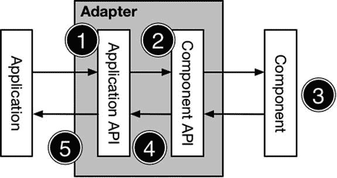

# 第三部分：结构型模式

## 12. 适配器模式

在本章中，我将介绍第一个结构型模式：适配器模式。该模式允许两个提供相关功能的对象即使拥有不兼容的 API 也能协同工作。表 12-1 将适配器模式置于上下文中。

**表 12-1.** 将适配器模式置于情境中

| 问题 | 答案 |
| --- | --- |
| 它是什么？ | 适配器模式通过引入一个从一个组件映射到另一个组件的适配器，使得拥有不兼容 API 的两个组件能够协同工作。 |
| 有什么好处？ | 该模式允许你将无法修改其源码的组件集成到你的应用程序中。当你使用第三方框架或消费另一个项目的输出时，这是一个常见问题。 |
| 何时应该使用此模式？ | 当你需要集成一个提供与应用程序中其他组件类似功能，但使用不兼容 API 的组件时，请使用此模式。 |
| 何时应该避免此模式？ | 当你能够修改要集成的组件源代码时，或者当可以将其提供的数据直接迁移到你的应用程序时，请不要使用此模式。 |
| 如何知道是否正确实现了该模式？ | 当适配器允许在不修改应用程序或组件的情况下将该组件集成到应用程序中时，该模式就被正确实现了。 |
| 是否有常见的陷阱？ | 唯一的陷阱是，若试图扩展该模式，强行集成一个未能提供适配目标 API 所期望功能的组件。 |
| 是否有相关的模式？ | 许多结构型模式具有相似的实现但意图不同。请确保你从我本书本部分描述的模式中选择了正确的模式。 |

## 准备示例项目

针对本章，我创建了一个名为 `Adapter` 的新 OS X 命令行工具项目。我向该项目添加了一个名为 `Employees.swift` 的新文件，并使用它来定义代码清单 12-1 中所示的类型。

**代码清单 12-1.** `Employees.swift` 文件的内容

```swift
struct Employee {
    var name:String;
    var title:String;
}

protocol EmployeeDataSource {
    var employees:[Employee] { get };
    func searchByName(name:String) -> [Employee];
    func searchByTitle(title:String) -> [Employee];
}
```

本章的示例将是一个简单的员工目录，`Employee` 结构体将用于表示单个员工。提供员工数据的类需要实现 `EmployeeDataSource` 协议。

#### 创建数据源

我向项目添加了一个名为 `DataSources.swift` 的文件，并使用它来定义代码清单 12-2 中所示的类。

**代码清单 12-2.** `DataSources.swift` 文件的内容

```swift
import Foundation

class DataSourceBase : EmployeeDataSource {
    var employees = [Employee]();

    func searchByName(name: String) -> [Employee] {
        return search({e -> Bool in
            return e.name.rangeOfString(name) != nil;
        });
    }

    func searchByTitle(title: String) -> [Employee] {
        return search({e -> Bool in
            return e.title.rangeOfString(title) != nil;
        })
    }

    private func search(selector:(Employee -> Bool)) -> [Employee] {
        var results = [Employee]();
        for e in employees {
            if (selector(e)) {
                results.append(e);
            }
        }
        return results;
    }
}

class SalesDataSource : DataSourceBase {
    override init() {
        super.init();
        employees.append(Employee(name: "Alice", title: "VP of Sales"));
        employees.append(Employee(name: "Bob", title: "Account Exec"));
    }
}

class DevelopmentDataSource : DataSourceBase {
    override init() {
        super.init();
        employees.append(Employee(name: "Joe", title: "VP of Development"));
        employees.append(Employee(name: "Pepe", title: "Developer"));
    }
}
```

`DataSourceBase` 类遵循 `EmployeeDataSource` 协议，并提供了数据源功能的实现，我可以轻松地派生该类以向应用程序添加新数据。我创建了两个数据源类——`SalesDataSource` 和 `DevelopmentDataSource`——它们为两个部门提供员工信息。


### 定义应用程序

为了消费数据源，我在项目中添加了一个名为 `EmployeeSearch.swift` 的文件，并用它来定义清单 12-3 中所示的类。

**清单 12-3.** `EmployeeSearch.swift` 文件的内容

```
class SearchTool {
    enum SearchType {
        case NAME; case TITLE;
    }
    private let sources:[EmployeeDataSource];
    init(dataSources: EmployeeDataSource...) {
        self.sources = dataSources;
    }
    var employees:[Employee] {
        var results = [Employee]();
        for source in sources {
            results += source.employees;
        }
        return results;
    }
    func search(text:String, type:SearchType) -> [Employee] {
        var results = [Employee]();
        for source in sources {
            results += type == SearchType.NAME ? source.searchByName(text)
                : source.searchByTitle(text);
        }
        return results;
    }
}
```

`SearchTool` 类作用于一个数据源集合，它整合这些数据源的内容及其搜索能力，以提供对员工数据的统一访问。清单 12-4 展示了我添加到 `main.swift` 文件中用于测试该功能的代码。

**清单 12-4.** 在 `main.swift` 文件中测试示例应用

```
let search = SearchTool(dataSources: SalesDataSource(), DevelopmentDataSource());
println("--List--");
for e in search.employees {
    println("Name: \(e.name)");
}
println("--Search--");
for e in search.search("VP", type: SearchTool.SearchType.TITLE) {
    println("Name: \(e.name), Title: \(e.title)");
}
```

运行该应用程序会在调试控制台中产生以下输出：

```
--List--
Name: Alice
Name: Bob
Name: Joe
Name: Pepe
--Search--
Name: Alice, Title: VP of Sales
Name: Joe, Title: VP of Development
```

## 理解该模式解决的问题

适配器模式要解决的问题在于，当一个现有系统需要集成一个功能相似但未提供通用接口且无法修改的新组件时。该示例应用代表了现有系统——一个员工目录，它依赖符合 `EmployeeDataSource` 协议的类来提供搜索功能。当需要将一个新的数据源集成到目录中，而该数据源又不符合此协议时，问题便出现了。

有很多原因会导致不兼容的代码被引入到应用程序中。在员工目录的例子中，收购或合并可能需要集成另一家公司的系统。在较小的规模上，当使用第三方组件，或者当你依赖另一个相关项目开发团队编写的代码时，不兼容的代码也可能被引入到项目中。

为了说明这个问题，假设我示例中的公司收购了一家竞争对手，并希望扩展目录以包含新公司的员工。好消息是，新公司已经有了一个完善的员工目录，但坏消息是，它没有使用母公司所需的类型。为了呈现这个问题，我在项目中添加了一个名为 `NewCo.swift` 的文件，并用它来定义清单 12-5 中所示的简单目录类型。

**清单 12-5.** `NewCo.swift` 文件的内容

```
class NewCoStaffMember {
    private var name:String;
    private var role:String;
    init(name:String, role:String) {
        self.name = name; self.role = role;
    }
    func getName() -> String {
        return name;
    }
    func getJob() -> String {
        return role;
    }
}
class NewCoDirectory {
    private var staff:[String: NewCoStaffMember];
    init() {
        staff = ["Hans": NewCoStaffMember(name: "Hans", role: "Corp Counsel"),
            "Greta": NewCoStaffMember(name: "Greta", role: "VP, Legal")];
    }
    func getStaff() -> [String: NewCoStaffMember] {
        return staff;
    }
}
```

`NewCoDirectory` 类提供了一个 `NewCoStaffMember` 对象的字典，这些对象以员工姓名作为键。它没有搜索功能，并且与本章开头创建的目录没有通用类型。我面临的问题是将 `NewCoDirectory` 类集成到现有的员工目录中。

**为什么不仅仅是修改代码？**

我可以通过修改 `NewCoDirectory` 类来解决这个问题，但这在现实世界中并不总是可行的，这也是适配器模式如此有用的原因。代码无法修改的主要原因是，当组件是从第三方购买时，你甚至可能看不到源代码，只能看到它暴露的 API。当你是他们销售的数千名客户之一时，组件开发者不太可能采用你私有的 API。

你还会在大型公司工作时遇到无法更改的代码。常见的原因包括处理遗留产品（“我们不知道它如何工作，也不敢碰它”）、处理资源不足的项目（“我们大约需要 2 年时间才能实现你的 API”），以及处理政治问题（“你应该实现我的 API”）。

无论原因是什么，结果都一样：一个提供了你所需功能但不以你想要的方式提供的 API。出于本章的目的，假设我没有 `NewCoDirectory` 类的源代码（也许因为它是一个现成的产品），并且我需要在无法进行任何更改的情况下，找到一种方法来集成它提供的员工数据。

我可以通过修改 `SearchTool` 应用程序来解决这个问题，使其知道如何查询新的数据源。这意味着，对于我集成的每一个组件，以及需要查询数据源的每一个应用程序部分，我都必须重复这个修改过程。结果是，每次添加新的数据源或更改现有数据源时，都需要进行一系列复杂的更改——而这正是设计模式旨在避免的情况。

## 理解适配器模式

适配器模式允许两个不兼容的类协同工作，它通过适配其中一个类所呈现的 API，将应用程序期望的 API 映射到组件提供的 API，如图 12-1 所示。在示例应用程序中，我需要适配 `NewCoDirectory` 类定义的 API，以便 `SearchTool` 类能够使用它。



**图 12-1.** 适配器模式

适配器模式中有五个操作。第一个操作是应用程序使用它期望的 API 向适配器发起一个请求。在第二个操作中，适配器利用它对两个 API 的了解，选择一个能够处理该请求的组件方法或属性。

在第三个操作中，组件接收来自适配器的请求，执行其工作，并将结果返回给适配器。

在第四个操作中，适配器利用它对两个 API 的了解，将客户端提供的结果转换为应用程序期望的结果，并在最后一个操作中返回该结果。

应用程序和组件彼此不知道对方的存在。适配器向应用程序呈现一个它已知的 API，并隐藏了该 API 如何映射到组件所提供的 API 的细节。


## 实现适配器模式

最优雅地实现适配器模式的方式是使用 Swift 扩展。扩展允许你为无法修改的类添加功能。这些功能包括添加对某个协议的遵循，这非常适合实现适配器模式。代码清单 12-6 展示了 `Adapter.swift` 文件的内容，该文件已添加到示例文件中，我使用它来通过扩展实现该模式。

**代码清单 12-6. Adapter.swift 文件的内容**

```
import Foundation

extension NewCoDirectory : EmployeeDataSource {

    var employees:[Employee] {
        return map(getStaff().values, { sv -> Employee in
            return Employee(name: sv.getName(), title: sv.getJob());
        });
    }

    func searchByName(name:String) -> [Employee] {
        return createEmployees(filter: {(sv:NewCoStaffMember) -> Bool in
            return sv.getName().rangeOfString(name) != nil;
        });
    }

    func searchByTitle(title:String) -> [Employee] {
        return createEmployees(filter: {(sv:NewCoStaffMember) -> Bool in
            return sv.getJob().rangeOfString(title) != nil;
        });
    }

    private func createEmployees(filter filterClosure:(NewCoStaffMember -> Bool))
        -> [Employee] {
            return map(filter(getStaff().values, filterClosure), {entry -> Employee in
                return Employee(name: entry.getName(), title: entry.getJob());
            });
    }

}
```

我定义了一个扩展，使 `NewCoDirectory` 类遵循 `EmployeeDataSource` 协议。适配 API 的过程通常比仅仅在方法和属性之间进行映射要复杂，通常需要在适配器中加入一些逻辑来处理类型转换，并填补功能上的微小缺口。在代码清单 12-6 中，你可以看到我必须添加按姓名和标题搜索的功能，以及将 `NewCoDirectory` 类产生的 `NewCoStaffMember` 对象转换为 `EmployeeDataSource` 协议所期望的 `Employee` 对象。

**提示**

扩展只能操作被扩展类中可访问的属性和方法。这就是为什么我通过 `NewCoDirectory` 类定义的 `getStaff` 方法来获取员工详细信息，而不是通过一个名为 `staff` 的 `private` 属性。

使用扩展意味着 `NewCoDirectory` 类的实例可以传递给 `SearchTool` 初始化器，并像任何其他数据源一样被处理，如代码清单 12-7 所示。扩展定义的属性和方法——以及它所遵循的任何协议——会自动应用于该扩展的类，即使该类本身没有被修改。

**代码清单 12-7. 在 main.swift 文件中使用适配器**

```
let search = SearchTool(dataSources: SalesDataSource(),
    DevelopmentDataSource(), NewCoDirectory());
println("--List--");
for e in search.employees {
    println("Name: \(e.name)");
}
println("--Search--");
for e in search.search("VP", type: SearchTool.SearchType.TITLE) {
    println("Name: \(e.name), Title: \(e.title)");
}
```

不需要对 `SearchTool` 类进行任何修改，通过运行应用程序，你可以看到目录如何包含 `NewCo` 的员工。

```
--List--
Name: Alice
Name: Bob
Name: Joe
Name: Pepe
Name: Greta
Name: Hans
--Search--
Name: Alice, Title: VP of Sales
Name: Joe, Title: VP of Development
Name: Greta, Title: VP, Legal
```

### 为什么不直接迁移数据？

在我的示例中，另一种方法是将数据从被收购公司的系统迁移到母公司的系统中。当然，这并不总是一个解决方案，而且在尝试将第三方代码集成到你的应用程序中时，这种方法也无济于事。

从长远来看，数据迁移有很多吸引人的地方，但很难快速实现，尤其是对于像员工目录这样与复杂业务流程和遗留应用程序深度绑定的应用程序。将所有数据迁移到一个单一平台，最终会通过淘汰其中一个系统来降低成本——这在并购中非常重要——但这需要大量的努力，并且对关键员工提出了要求，而这些员工很可能正专注于其他问题。像适配器这样的模式可以帮助减少在交易完成后的日子里启动的复杂项目数量，并争取一些时间来看看其他业务流程将如何变化。

实现一个长期的战略解决方案总是可取的，但通过使用适配器来获得一些短期利益，往往更务实，也更有可能成功。

## 适配器模式的变体

在实现适配器模式时，有两种有用的变体，我将在下面的章节中进行描述。

### 将适配器定义为包装类

如果你不喜欢使用扩展，那么你可以将适配器实现为一个包装组件的类。代码清单 12-8 展示了如何用类替换扩展适配器。

**代码清单 12-8. 在 Adapter.swift 文件中将适配器实现为包装类**

```
class NewCoDirectoryAdapter : EmployeeDataSource {
    private let directory:NewCoDirectory;

    init() {
        directory = NewCoDirectory();
    }

    var employees:[Employee] {
        return map(directory.getStaff().values, { sv -> Employee in
            return Employee(name: sv.getName(), title: sv.getJob());
        });
    }

    func searchByName(name:String) -> [Employee] {
        return createEmployees(filter: {(sv:NewCoStaffMember) -> Bool in
            return sv.getName().rangeOfString(name) != nil;
        });
    }

    func searchByTitle(title:String) -> [Employee] {
        return createEmployees(filter: {(sv:NewCoStaffMember) -> Bool in
            return sv.getJob().rangeOfString(title) != nil;
        });
    }

    private func createEmployees(filter filterClosure:(NewCoStaffMember -> Bool))
        -> [Employee] {
            return map(filter(directory.getStaff().values, filterClosure),
                {entry -> Employee in
                    return Employee(name: entry.getName(), title: entry.getJob());
            });
    }

}
```

**提示**

使用包装类并没有什么优势，但有一些高级适配无法通过扩展实现，我将在下一节中进行描述。

适配器中包含的逻辑与基于扩展的实现相同，只是适配器的编写方式发生了变化。我仍然需要实现执行搜索的支持，并且仍然需要在结果类型之间进行映射。

这种方法要求适配器类被实例化并使用，而不是使用（扩展后的）组件本身，如代码清单 12-9 所示。

**代码清单 12-9. 在 main.swift 文件中使用适配器包装类**

```
let search = SearchTool(dataSources: SalesDataSource(),
    DevelopmentDataSource(), NewCoDirectoryAdapter());
println("--List--");
for e in search.employees {
    println("Name: \(e.name)");
}
println("--Search--");
for e in search.search("VP", type: SearchTool.SearchType.TITLE) {
    println("Name: \(e.name), Title: \(e.title)");
}
```


### 创建双向适配器

适配器模式的标准实现假设方法和属性调用的流向是单向的：从应用程序到组件。通常情况下确实如此，尤其是在处理像 UI 控件这样的第三方组件时。但有时组件也会期望发起自己的操作，通常是查询应用程序的状态或通知应用程序其自身状态或所提供的服务发生了变化。为了演示这个问题，我创建了一个名为`TwoWayAdapter.playground`的 playground，并用它来定义清单 12-10 中所示的类和协议。（我之所以使用 playground，是因为在示例应用程序中演示这个问题需要列出大量代码来处理一些微小的改动。）

**清单 12-10.** TwoWayAdapter.playground 文件的内容

```
// application
protocol ShapeDrawer {
    func drawShape();
}

class DrawingApp {
    let drawer:ShapeDrawer;
    var cornerRadius:Int = 0;

    init(drawer:ShapeDrawer) {
        self.drawer = drawer;
    }

    func makePicture() {
        drawer.drawShape();
    }
}

// component library
protocol AppSettings {
    var sketchRoundedShapes:Bool { get };
}

class SketchComponent {
    private let settings:AppSettings;

    init(settings:AppSettings) {
        self.settings = settings;
    }

    func sketchShape() {
        if (settings.sketchRoundedShapes) {
            println("Sketch Circle");
        } else {
            println("Sketch Square");
        }
    }
}
```

我将代码分成了两部分——一部分用于应用程序，另一部分用于需要集成的组件。在应用程序端，`DrawingApp`类依赖`ShapeDrawer`协议在`makePicture`方法中执行其工作。在组件端，`SketchComponent`类依赖`AppSettings`协议来确定它应该绘制什么类型的形状。

目标是创建一个适配器，让`DrawingApp`对象能够使用`SketchComponent`对象来创建形状，同时，作为回报，让`SketchComponent`能够通过`AppSettings`协议查询应用程序。

单向使用适配器很容易，但让对象通过适配器进行双向通信则困难得多——尤其是因为我创建的类具有冲突的初始化器。除非我有一个符合`ShapeDrawer`协议的对象作为初始化参数，否则我无法创建`DrawingApp`的实例。同样，除非我能给`SketchComponent`的初始化器传递一个符合`AppSettings`协议的对象，否则我也无法创建`SketchComponent`对象。清单 12-11 展示了我为解决这个问题并使这些类相互集成而创建的适配器。

**清单 12-11.** 在 TwoWayAdapter.playground 文件中创建适配器

```
// application
protocol ShapeDrawer {
    func drawShape();
}

class DrawingApp {
    // ...为简洁起见，省略了语句...
}

// component library
protocol AppSettings {
    var sketchRoundedShapes:Bool { get };
}

class SketchComponent {
    // ...为简洁起见，省略了语句...
}

class TwoWayAdapter : ShapeDrawer, AppSettings {
    var app:DrawingApp?;
    var component:SketchComponent?

    func drawShape() {
        component?.sketchShape();
    }

    var sketchRoundedShapes: Bool {
        return app?.cornerRadius > 0;
    }
}
```

这个名为`TwoWayAdapter`的适配器类符合`ShapeDrawer`和`AppSettings`协议，并使用`DrawingApp`和`SketchComponent`类的可选实例来实现协议方法。这是绕过初始化器冲突需求的关键，如清单 12-12 所示。

**清单 12-12.** 在 TwoWayAdapter.playground 文件中使用适配器

```
protocol ShapeDrawer {
    func drawShape();
}

class DrawingApp {
    // ...为简洁起见，省略了语句...
}

// component library
protocol AppSettings {
    var sketchRoundedShapes:Bool { get };
}

class SketchComponent {
    // ...为简洁起见，省略了语句...
}

class TwoWayAdapter : ShapeDrawer, AppSettings {
    // ...为简洁起见，省略了语句...
}

let adapter = TwoWayAdapter();
let component = SketchComponent(settings: adapter);
let app = DrawingApp(drawer: adapter);
adapter.app = app;
adapter.component = component;
app.makePicture();
```

> **注意**：这是一个无法使用 Swift 扩展创建的适配器，因为它需要操作两个不同的类。

我先创建了一个适配器实例，该实例符合创建`SketchComponent`和`DrawingApp`对象所需的协议。然后我设置了适配器的`app`和`component`属性，这样适配器就有了其方法所需的对象。结果是两个对象都可以通过适配器互相调用，你可以在 playground 的调试控制台中看到输出。

```
Sketch Square
```

## 理解适配器模式的陷阱

适配器模式仅在集成具有相似功能的组件时才有用，这意味着尽管类的 API 不同，但它们提供的功能是兼容的。

在示例应用程序中，有一个消费员工数据的组件（`SearchTool`类）和一个提供员工数据的组件（`NewCoDirectory`类）。这些类的功能是兼容的，但我不能将`NewCoDirectory`类用作数据源，因为它没有实现`SearchTool`类所需的协议。

当组件提供的功能不同时，适配器模式就无济于事了。例如，适配器模式不能用于集成提供员工停车位详细信息的数据库，因为应用程序中不支持这些数据，无论对 API 进行多少适配都无法改变这一点。为了有效使用适配器模式，请纯粹关注 API，并尽可能保持适配方案简单。

## Cocoa 中适配器模式的示例

Cocoa 并没有直接暴露适配器模式，因为其组件为标准行为设定了规范。如果你想将一个组件集成到 Cocoa 中，那么就需要实现一个协议。一个很好的例子是第 5 章中我用来实现原型模式的`NSCopying`协议：如果你想将一个类集成到 Cocoa 的对象拷贝支持中，那么即使它已经有自己的克隆创建方法，你也需要让它符合`NSCopying`协议。这就是任何平台上的核心 API 的立场；如果需要适配器，那么你有责任在你的代码中定义它。

## 将模式应用于 SportsStore 应用

并非所有适配器都通过映射单一类型来将组件集成到应用程序中。为了演示这一点，我将创建一个适配器，它实现抽象工厂模式，并遵循实现协议来完成其工作。

### 准备示例应用程序

我在示例项目中添加了一个名为`Euro.swift`的文件，并用它来定义清单 12-13 中所示的类。

**清单 12-13.** Euro.swift 文件的内容

```
class EuroHandler {
    func getDisplayString(amount:Double) -> String {
        let formatted = Utils.currencyStringFromNumber(amount);
        return "€\(dropFirst(formatted))";
    }

    func getCurrencyAmount(amount:Double) -> Double {
        return 0.76164 * amount;
    }
}
```

`EuroHandler`类将美元金额转换为欧元，并创建格式化的货币字符串。这与我在第 10 章中添加到 SportsStore 应用以演示抽象工厂模式的功能类型相同，但是`EuroHandler`类并不完全符合应用程序期望的模型，因此需要一个适配器。


### 定义适配器类

为了将 `EuroHandler` 类适配到 SportsStore 应用程序中，我需要定义一个具体的工厂类，用于生成 `StockValueConverter` 和 `StockValueFormatter` 对象。清单 12-14 展示了我对 `StockValueFactories.swift` 文件所做的修改。

**清单 12-14.** 在 `StockValueFactories.swift` 文件中定义适配器

```
import Foundation

class StockTotalFactory {

    enum Currency {
        case USD
        case GBP
        case EUR
    }

    private(set) var formatter:StockValueFormatter?;
    private(set) var converter:StockValueConverter?;

    class func getFactory(curr:Currency) -> StockTotalFactory {
        if (curr == Currency.USD) {
            return DollarStockTotalFactory.sharedInstance;
        } else if (curr == Currency.GBP){
            return PoundStockTotalFactory.sharedInstance;
        } else {
            return EuroHandlerAdapter.sharedInstance;
        }
    }
}

// ...为简洁起见，省略了其他工厂...

class EuroHandlerAdapter : StockTotalFactory,
    StockValueConverter, StockValueFormatter {
    private let handler:EuroHandler;

    override init() {
        self.handler = EuroHandler();
        super.init();
        super.formatter = self;
        super.converter = self;
    }

    func formatTotal(total:Double) -> String {
        return handler.getDisplayString(total);
    }

    func convertTotal(total:Double) -> Double {
        return handler.getCurrencyAmount(total);
    }

    class var sharedInstance:EuroHandlerAdapter {
        get {
            struct SingletonWrapper {
                static let singleton = EuroHandlerAdapter();
            }
            return SingletonWrapper.singleton;
        }
    }
}
```

**提示** 我必须将工厂类定义在 `StockValueFactories.swift` 文件中，因为需要为 `StockTotalFactory` 类中的 `private` 属性设置值，这意味着要将适配器放在同一个文件中。

我已经更新了 `StockTotalFactory` 类，添加了对欧元处理的支持，并定义了一个名为 `EuroHandlerAdapter` 的适配器。该适配器派生自 `StockTotalFactory` 类，并同时遵循 `StockValueConverter` 和 `StockValueFormatter` 协议。它通过创建 `EuroHandler` 实例并将其提供的功能映射到协议指定的方法，从而适配了 `EuroHandler` 类。我也可以通过定义扩展来处理协议，但我更倾向于在可能的情况下将适配器保持为单一类型。

### 使用适配后的功能

在清单 12-15 中，你可以看到我如何更新了 `ViewController` 类的 `displayStockTotal` 方法，以便欧元成为选定的货币。

**清单 12-15.** 在 `ViewController.swift` 文件中使用适配器

```
...

func displayStockTotal() {
    let finalTotals:(Int, Double) = productStore.products.reduce((0, 0.0),
        {(totals, product) -> (Int, Double) in
            return (
                totals.0 + product.stockLevel,
                totals.1 + product.stockValue
            );
    });

    var factory = StockTotalFactory.getFactory(StockTotalFactory.Currency.EUR);
    var totalAmount = factory.converter?.convertTotal(finalTotals.1);
    var formatted = factory.formatter?.formatTotal(totalAmount!);
    totalStockLabel.text = "\(finalTotals.0) Products in Stock. "
        + "Total Value: \(formatted!)";
}

...
```

结果是库存总价值将被转换为欧元并显示在应用程序布局的底部，如图 12-2 所示。


**图 12-2.** 欧元适配器的效果

## 本章小结

在本章中，我解释了如何使用适配器模式使两个接口不兼容的类协同工作。我演示了如何通过使用扩展以及创建一个包装被适配对象的类来定义适配器。在下一章中，我将描述桥接模式。

