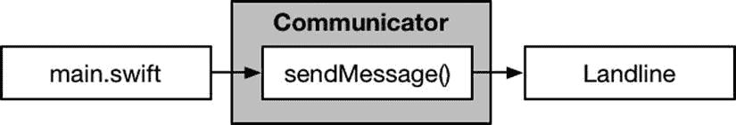
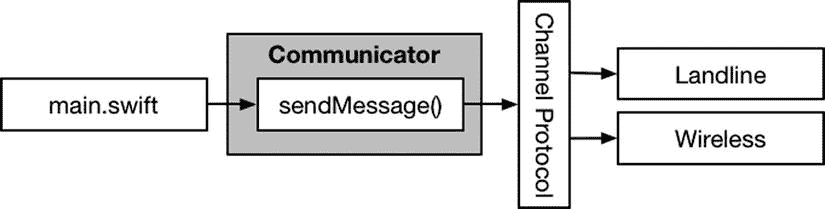
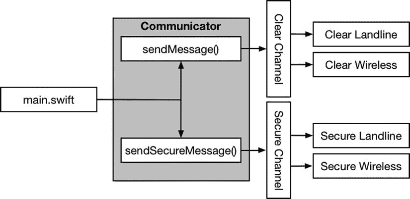
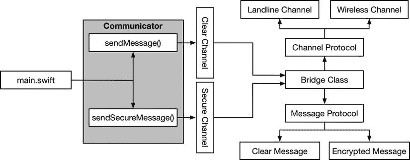
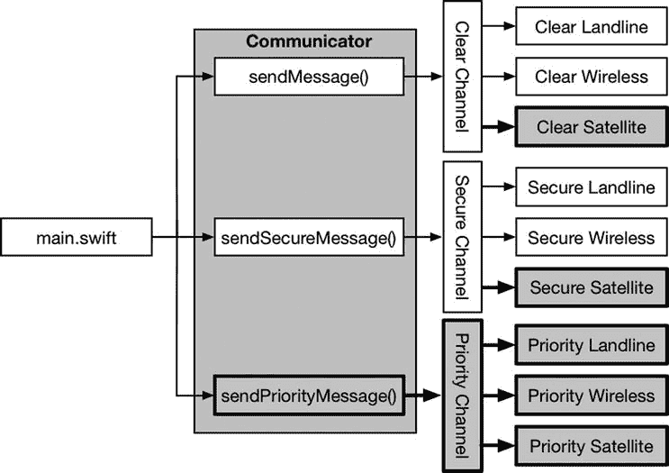
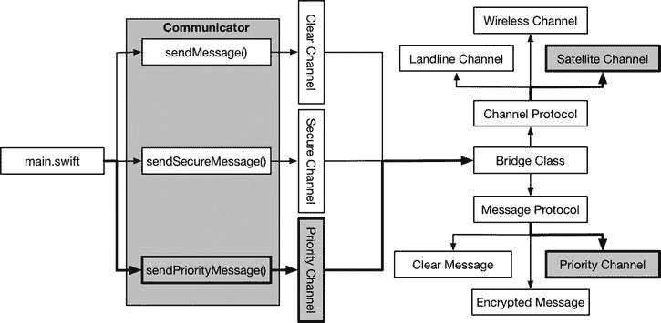

# 13. 桥接模式

桥接模式可能令人困惑。它看起来类似于我在第 12 章中描述的适配器模式，但其用途可能看起来有违直觉。在本章中，我将重点介绍桥接模式最常用于解决的问题，并解释为什么桥接模式和适配器模式最大的区别在于意图而非实现。表 13-1 展示了桥接模式的上下文。

**表 13-1.** 桥接模式上下文

| 问题 | 答案 |
| --- | --- |
| 它是什么？ | 桥接模式将抽象与其实现分离，以便两者可以独立更改，而无需相互对应地修改。更常见的是，桥接模式用于解决称为“爆炸式类层次结构”的问题，该问题通常源于重复但欠考虑的代码重构，并导致需要不断增加类来为应用程序添加新功能。 |
| 有什么好处？ | 当桥接模式应用于爆炸式类层次结构问题时，其好处是添加新功能到应用程序只需要一个类。更广泛地说，该模式在抽象或其实现发生变化时，能隔离变更的影响。 |
| 何时使用此模式？ | 使用此模式来解决爆炸式类层次结构问题，或在两个 API 之间建立桥梁。 |
| 何时应避免此模式？ | 在尝试集成第三方组件时不要使用此模式；请改用我在第 12 章中描述的适配器模式。 |
| 如何知道是否正确实现了该模式？ | 针对爆炸式类层次结构问题，当添加新功能或添加对新平台的支持只需一个类即可完成时，即表示正确实现了该模式。更广泛地说，当你能够更改抽象（例如协议或闭包签名）而无需相应地更改其实现时，即表示正确实现了该模式。 |
| 是否有常见的陷阱？ | 如果通用代码未能与平台特定代码分离，爆炸式类层次结构将无法解决。 |
| 是否有相关的模式？ | 许多结构型模式具有相似的实现但意图不同。请确保从我在本书这部分描述的模式中选择正确的模式。 |


## 准备示例项目

本章我创建了一个新的 OS X 命令行工具项目，命名为 `Bridge`。为此项目的准备工作，我添加了一个名为 `Comms.swift` 的文件，并在其中定义了清单 13-1 所示的类型。

清单 13-1. `Comms.swift` 文件的内容

```
protocol ClearMessageChannel {
    func send(message:String);
}

protocol SecureMessageChannel {
    func sendEncryptedMessage(encryptedText:String);
}

class Communicator {
    private let clearChannel:ClearMessageChannel;
    private let secureChannel:SecureMessageChannel;

    init (clearChannel:ClearMessageChannel, secureChannel:SecureMessageChannel) {
        self.clearChannel = clearChannel;
        self.secureChannel = secureChannel;
    }

    func sendCleartextMessage(message:String) {
        self.clearChannel.send(message);
    }

    func sendSecureMessage(message:String) {
        self.secureChannel.sendEncryptedMessage(message);
    }
}
```

`Communicator` 类提供了一些方法，用于发送普通消息和安全消息。处理这些消息的机制由 `ClearMessageChannel` 和 `SecureMessageChannel` 协议定义，这两个协议各自规定了处理一种通信类型所需的方法。

我打算支持两种不同的网络传输机制：有线网络和无线网络。我创建了一个名为 `Channels.swift` 的文件，并在其中创建了清单 13-2 所示的类。

清单 13-2. `Channels.swift` 文件的内容

```
class Landline : ClearMessageChannel {
    func send(message: String) {
        println("Landline: \(message)");
    }
}

class SecureLandLine : SecureMessageChannel {
    func sendEncryptedMessage(message: String) {
        println("Secure Landline: \(message)");
    }
}

class Wireless : ClearMessageChannel {
    func send(message: String) {
        println("Wireless: \(message)");
    }
}

class SecureWireless : SecureMessageChannel {
    func sendEncryptedMessage(message: String) {
        println("Secure Wireless: \(message)");
    }
}
```

为了完成准备工作，我在 `main.swift` 文件中添加了代码，该代码创建了发送消息所需的通道，并使用这些通道创建了一个 `Communicator` 对象，如清单 13-3 所示。

清单 13-3. `main.swift` 文件的内容

```
var clearChannel = Landline();
var secureChannel = SecureLandLine();
var comms = Communicator(clearChannel: clearChannel, secureChannel: secureChannel);
comms.sendCleartextMessage("Hello!");
comms.sendSecureMessage("This is a secret");
```

运行该项目会在 Xcode 调试控制台中输出以下内容：

```
Landline: Hello!
Secure Landline: This is a secret
```

## 理解该模式要解决的问题

如果觉得我添加到示例应用程序中的代码考虑不周，那是因为我一次性添加了所有类。桥接模式解决的问题，通常是在向应用程序添加功能并重构代码时逐渐显现出来的。

最终我得到了两个特性（普通消息和安全消息）以及实现这些特性的两个平台（有线网络和无线网络）。没有人会一开始就计划创建这种层次结构，它通常是在良好的初衷下逐渐形成的。一个应用程序通常从一个特性和一个平台开始，如图 13-1 所示。



图 13-1. 应用程序的简单起点

在某个时候，需要添加另一个平台，并且该平台的选择将根据应用程序的配置方式而改变。一些明智的重构添加了一个协议，该协议标识了平台需要做什么，并创建了处理平台细节的实现类，如图 13-2 所示。



图 13-2. 处理多个平台

之后，需要添加一个新特性——安全消息——因此又添加了一个协议，并创建了实现对象，如图 13-3 所示。这就是我在上一节中创建的应用程序状态。



图 13-3. 处理多个特性

问题在于，每当我添加一个新特性或一个新平台时，实现类的数量就会急剧增加。事实上，实现类的总数是特性数量与平台数量的乘积，这意味着如果我向应用程序添加第三个特性，实现类的数量将是六个（3 和 2 的乘积）。再增加一个平台将需要九个实现类（3 和 3 的乘积）。

这被称为类层次结构爆炸问题，它会产生一大堆难以跟踪、更难以维护的协议和实现类。类层次结构爆炸通常并非有意为之，但在时间紧迫、需要添加新特性并推动项目前进时，却很容易产生。


## 理解桥接模式

桥接模式将抽象与其实现分离，使得二者可以独立地发生变化。这听起来可能有悖常理，但桥接模式通过创建两个独立的层级结构，将各平台特有的功能与跨平台共用的功能分离开，从而解决了类层级结构爆炸的问题。并由此创建了一个能将两个层级结构关联起来的桥接类。

**提示**

将通用功能与平台特有功能分离是桥接模式最常用且最有效的应用方式，但它也可以用于分离任意抽象与其实现。参见“将模式应用于 SportsStore 应用”章节以获取更通用的示例。

在示例应用中，各平台特有的功能是通过特定类型网络传输消息。通用功能则是消息的准备工作。第一步是定义描述各领域（消息发送与传输）的协议，然后为其创建实现类。图 13-4 展示了新的层级结构以及将它们关联起来的桥接类。

**提示**

如果抽象描述难以立即理解，不必担心。桥接模式确实可能难以解析。如果你正在努力理解其原理，可先阅读后续章节了解模式的具体实现，再回头重读本描述。



*图 13-4. 桥接模式*

桥接类负责组合`Channel`和`Message`协议，利用`Communicator`类依赖的协议，提供其所需的功能。

**注意**

请注意我并未修改`Communicator`类。桥接类支持`Communicator`类所期望的 API，并将该 API 映射（更准确说是桥接）到新的消息和通道层级结构。`Communicator`类保持原样，因为实现桥接模式的默认前提是应用中还有其他多个类期望相同的协议。参见"折叠桥接"章节以了解替代方案。

### 桥接模式难道不就是适配器模式吗？

桥接模式与我在第 12 章描述的适配器模式非常相似。毕竟，桥接类不就是在为依赖`ClearChannel`和`SecureChannel`协议的`Communicator`类适配`Channel`和`Message`协议吗？

桥接模式和适配器模式确实相似，但它们应用于不同场景。当需要集成无法修改代码的组件（如第三方控件）时，使用适配器模式。你添加适配器使第三方组件能通过应用期望的 API 使用，但无法改变组件的工作方式（因为只有运行时组件，或修改会被组件开发团队的下一版本覆盖）。

当可以修改源代码、能改变组件工作方式时，使用桥接模式，适用于混合了通用功能与平台特有功能的类层级结构。应用桥接模式不仅涉及创建桥接类，还需要重构组件以分离通用代码和平台特有代码。

## 实现桥接模式

描述桥接模式固然有用，但代码示例更能演示其运作方式。在后续章节中，我将重构示例应用以应用桥接模式，防止类层级结构爆炸。

### 处理消息

第一步是处理与网络类型无关的通用功能，即消息的创建和准备工作。列表 13-4 展示了添加到示例项目中的`Messages.swift`文件内容。

**列表 13-4.** Messages.swift 文件内容

```
protocol Message {
    init (message:String);
    func prepareMessage();
    var contentToSend:String { get };
}

class ClearMessage : Message {
    private var message:String;
    required init(message:String) {
        self.message = message;
    }
    func prepareMessage() {
        // 无需操作
    }
    var contentToSend:String {
        return message;
    }
}

class EncryptedMessage : Message {
    private var clearText:String;
    private var cipherText:String?;
    required init(message:String) {
        self.clearText = message;
    }
    func prepareMessage() {
        cipherText = String(reverse(clearText));
    }
    var contentToSend:String {
        return cipherText!;
    }
}
```

我定义了一个名为`Message`的协议。该协议定义了一个接受消息文本的必需初始化器，并定义了一个`prepareMessage`方法，该方法将被调用以便符合协议的各类的实例有机会处理消息文本。只读属性`contentToSend`将用于获取需要通过网络传输的文本内容。

我定义了两个符合该协议的类。第一个类是`ClearMessage`，用于表示不需要加密的消息。第二个类是`EncryptedMessage`，用于需要加密的消息（此处的加密仅将字符串字符反转——虽然不足以用于实际项目，但对示例应用已足够）。

### 处理通道

下一步是定义各网络特有的功能，即消息传输。列表 13-5 展示了我对`Channels.swift`文件所做的修改。

**列表 13-5.** 修订 Channels.swift 文件内容

```
protocol Channel {
    func sendMessage(msg:Message);
}

class LandlineChannel : Channel {
    func sendMessage(msg: Message) {
        println("Landline: \(msg.contentToSend)");
    }
}

class WirelessChannel : Channel {
    func sendMessage(msg: Message) {
        println("Wireless: \(msg.contentToSend)");
    }
}
```

我定义了一个名为`Channel`的协议，其中包含一个`sendMessage`方法。与原始版本不同，通道不再负责处理不同类型的消息。`sendMessage`方法将被传入一个`Message`对象，其`contentToSend`属性返回需要传输的内容。通道无需知道它们正在发送何种类型的消息，只需专注于传输处理。

我定义了两个符合`Channel`协议的类，分别对应有线网络和无线网络。两个类的`sendMessage`方法实现都会向调试控制台输出一条消息，指示所使用的通道和传输内容。


### 创建桥接器

最后，我需要创建一个类，作为 `Communicator` 类与新的 `Message` 和 `Channel` 协议之间的桥接器。清单 13-6 展示了 `Bridge.swift` 文件的内容，我已将其添加到示例项目中。

**清单 13-6.** `Bridge.swift` 文件的内容

```
class CommunicatorBridge : ClearMessageChannel, SecureMessageChannel {
    private var channel:Channel;
    init(channel:Channel) {
        self.channel = channel;
    }
    func send(message: String) {
        let msg = ClearMessage(message: message);
        sendMessage(msg);
    }
    func sendEncryptedMessage(encryptedText: String) {
        let msg = EncryptedMessage(message: encryptedText);
        sendMessage(msg);
    }
    private func sendMessage(msg:Message) {
        msg.prepareMessage();
        channel.sendMessage(msg);
    }
}
```

`CommunicatorBridge` 类实现了 `Communicator` 类所依赖的 `ClearMessageChannel` 和 `SecureMessageChannel` 协议。它利用新的 `Message` 和 `Channel` 协议来实现这些协议。`CommunicatorBridge` 类会根据其被调用的方法选择适当的 `Message` 实现类，并将创建的 `Message` 对象传递给其初始化器给定的 `Channel` 对象。

清单 13-7 展示了如何更新 `main.swift` 文件，以使用 `CommunicatorBridge` 类来配置 `Communicator` 对象。

**清单 13-7.** 在 `main.swift` 文件中使用 `CommunicatorBridge` 类

```
var bridge = CommunicatorBridge(channel: LandlineChannel());
var comms = Communicator(clearChannel: bridge, secureChannel: bridge);
comms.sendCleartextMessage("Hello!");
comms.sendSecureMessage("This is a secret");
```

运行应用程序会产生以下输出：

```
Landline: Hello!
Landline: terces a si sihT
```

### 添加新的消息类型和通道

为了演示桥接模式的效果，我将为应用程序添加一种新的消息类型和一个新的通道。新消息用于高优先级通信，新通道用于卫星网络。首先，我在 `Communicator` 类中添加了对优先级消息的支持，如清单 13-8 所示。无论是否应用了桥接模式，这些修改都是必须进行的。

**清单 13-8.** 在 `Comms.swift` 文件中添加对新消息类型的支持

```
protocol ClearMessageChannel {
    func send(message:String);
}
protocol SecureMessageChannel {
    func sendEncryptedMessage(message:String);
}
protocol PriorityMessageChannel {
    func sendPriority(message:String);
}
class Communicator {
    private let clearChannel:ClearMessageChannel;
    private let secureChannel:SecureMessageChannel;
    private let priorityChannel:PriorityMessageChannel;
    init (clearChannel:ClearMessageChannel, secureChannel:SecureMessageChannel,
          priorityChannel:PriorityMessageChannel) {
        self.clearChannel = clearChannel;
        self.secureChannel = secureChannel;
        self.priorityChannel = priorityChannel;
    }
    func sendCleartextMessage(message:String) {
        self.clearChannel.send(message);
    }
    func sendSecureMessage(message:String) {
        self.secureChannel.sendEncryptedMessage(message);
    }
    func sendPriorityMessage(message:String) {
        self.priorityChannel.sendPriority(message);
    }
}
```

在原始的类层次结构下（没有桥接模式），添加一种新消息和一个新通道需要创建五个新类，如图 13-5 所示。



**图 13-5.** 在没有桥接模式的情况下为应用程序添加新特性

这是问题的核心所在。没有桥接模式，当我在应用程序中添加新特性时，必须创建更多的类。在应用桥接模式后，添加相同的消息类型和通道只需要两个新类——一个用于消息类型，一个用于通道，如图 13-6 所示。



**图 13-6.** 使用桥接模式为应用程序添加新特性

该图看起来更复杂，但这是因为桥接模式为应用程序增加了更多结构（毕竟桥接模式是一种结构性模式）。就新特性所需的工作量而言，所需付出的努力要少得多。清单 13-9 展示了 `NewFeatures.swift` 文件的内容，我将其添加到示例项目中，以实现新的消息类型和通道。

**清单 13-9.** `NewFeatures.swift` 文件的内容

```
class SatelliteChannel : Channel {
    func sendMessage(msg: Message) {
        println("Satellite: \(msg.contentToSend)");
    }
}
class PriorityMessage : ClearMessage {
    override var contentToSend:String {
        return "Important: \(super.contentToSend)";
    }
}
```

定义了新类之后，我必须更新桥接器，使其能够接受来自 `Communicator` 类的新消息类型，如清单 13-10 所示。

**清单 13-10.** 在 `Bridge.swift` 文件中添加对新消息类型的支持

```
class CommunicatorBridge : ClearMessageChannel,
    SecureMessageChannel, PriorityMessageChannel {
    private var channel:Channel;
    init(channel:Channel) {
        self.channel = channel;
    }
    func send(message: String) {
        let msg = ClearMessage(message: message);
        sendMessage(msg);
    }
    func sendEncryptedMessage(encryptedText: String) {
        let msg = EncryptedMessage(message: encryptedText);
        sendMessage(msg);
    }
    func sendPriority(message: String) {
        sendMessage(PriorityMessage(message: message));
    }
    private func sendMessage(msg:Message) {
        msg.prepareMessage();
        channel.sendMessage(msg);
    }
}
```

现在我可以更改 `main.swift` 文件中的代码来测试新功能，如清单 13-11 所示。

**清单 13-11.** 在 `main.swift` 文件中测试新消息类型

```
var bridge = CommunicatorBridge(channel: SatelliteChannel());
var comms = Communicator(clearChannel: bridge, secureChannel: bridge,
                         priorityChannel: bridge);
comms.sendCleartextMessage("Hello!");
comms.sendSecureMessage("This is a secret");
comms.sendPriorityMessage("This is important");
```

运行应用程序会产生以下输出，这展示了新的消息类型和通道：

```
Satellite: Hello!
Satellite: terces a si sihT
Satellite: Important: This is important
```


## 桥接模式的变体

平台是在运行时选择的，通常通过配置文件或某些外部设置来指定。在示例应用程序中，平台是消息发送的通道，而平台的选择取决于可用的网络硬件。在实践中，我会像这样显式选择平台：

```
...
var bridge = CommunicatorBridge(channel: SatelliteChannel());
...
```

这种做法并不现实，因为平台特定的实现是在编译时选择的，我必须更改代码并重新编译才能切换平台。我之所以这样做，是因为我不想为了演示桥接模式的用法而去创建配置系统或检测不同类型的网络。

最简单的变体方式是应用工厂方法模式，这样平台特定实现的选择对桥接类以及应用程序的其他部分都是隐藏的。清单 13-12 展示了我在示例应用程序中如何实现工厂方法模式——该方法已在第 9 章中描述。

**清单 13-12.** 在`Channels.swift`文件中应用工厂方法模式

```
class Channel {
    enum Channels {
        case Landline;
        case Wireless;
        case Satellite;
    }

    class func getChannel(channelType:Channels) -> Channel {
        switch channelType {
            case .Landline:
                return LandlineChannel();
            case .Wireless:
                return WirelessChannel();
            case .Satellite:
                return SatelliteChannel();
        }
    }

    func sendMessage(msg:Message) {
        fatalError("Not implemented");
    }
}

class LandlineChannel : Channel {
    override func sendMessage(msg: Message) {
        println("Landline: \(msg.contentToSend)");
    }
}

class WirelessChannel : Channel {
    override func sendMessage(msg: Message) {
        println("Wireless: \(msg.contentToSend)");
    }
}
```

我将`Channel`类型的定义从协议改为了类，并定义了一个名为`Channels`的嵌套枚举，用于列举可用的平台集合：有线（Landline）、无线（Wireless）和卫星（Satellite）。我还定义了一个类方法`getChannel`，它接受一个`Channels`值，并实例化表示该平台的类。

我必须对`LandlineChannel`和`WirelessChannel`类中定义的`sendMessage`方法使用`override`关键字，因为`Channel`已从协议变为类。清单 13-13 展示了卫星实现类的相应更改。

**清单 13-13.** 在`NewFeatures.swift`文件中修改方法声明

```
class SatelliteChannel : Channel {
    override func sendMessage(msg: Message) {
        println("Satellite: \(msg.contentToSend)");
    }
}

class PriorityMessage : ClearMessage {
    override var contentToSend:String {
        return "Important: \(super.contentToSend)";
    }
}
```

清单 13-14 展示了`CommunicatorBridge`类的更改，初始化方法现在接受枚举值，而不是实现类的实例。

**清单 13-14.** 在`Bridge.swift`文件中更改初始化方法

```
class CommunicatorBridge : ClearMessageChannel, SecureMessageChannel,
    PriorityMessageChannel {
    private var channel:Channel;

    init(channel:Channel.Channels) {
        self.channel = Channel.getChannel(channel);
    }

    func send(message: String) {
        let msg = ClearMessage(message: message);
        sendMessage(msg);
    }

    func sendEncryptedMessage(encryptedText: String) {
        let msg = EncryptedMessage(message: encryptedText);
        sendMessage(msg);
    }

    func sendPriority(message: String) {
        sendMessage(PriorityMessage(message: message));
    }

    private func sendMessage(msg:Message) {
        msg.prepareMessage();
        channel.sendMessage(msg);
    }
}
```

最后，我需要更新`main.swift`文件中平台选择的代码，如清单 13-15 所示。

**清单 13-15.** 更新`main.swift`文件

```
var bridge = CommunicatorBridge(channel: Channel.Channels.Satellite);
var comms = Communicator(clearChannel: bridge,
    secureChannel: bridge, priorityChannel: bridge);
comms.sendCleartextMessage("Hello!");
comms.sendSecureMessage("This is a secret");
comms.sendPriorityMessage("This is important");
```

### 折叠桥接

应用桥接模式时，通常假设被桥接的协议会在应用程序的其他地方使用。在示例中，这意味着会有其他类似于`Communicator`的类依赖于`ClearMessageChannel`、`SecureMessageChannel`和`PriorityMessageChannel`协议，这也是我保留这些协议以及`Communicator`类，并在它们之上应用桥接的原因。

在某些应用程序中，可能只有一个类依赖于这些协议，这样就可以将这个类与桥接合并，并移除多余的协议。

第一步是从项目中移除`Bridge.swift`文件。其中包含的`CommunicatorBridge`类将不再需要，并且它会阻止 Xcode 构建项目，因为它依赖于我将要移除的协议。下一步是将桥接功能添加到`Communicator`类中，如清单 13-16 所示。

**清单 13-16.** 在`Comms.swift`文件中添加桥接功能

```
//protocol ClearMessageChannel {
//    func send(message:String);
//}
//
//protocol SecureMessageChannel {
//    func sendEncryptedMessage(message:String);
//}
//
//protocol PriorityMessageChannel {
//    func sendPriority(message:String);
//}

class Communicator {
    private let channnel:Channel;

    init (channel:Channel.Channels) {
        self.channnel = Channel.getChannel(channel);
    }

    private func sendMessage(msg:Message) {
        msg.prepareMessage();
        channnel.sendMessage(msg);
    }

    func sendCleartextMessage(message:String) {
        self.sendMessage(ClearMessage(message: message));
    }

    func sendSecureMessage(message:String) {
        self.sendMessage(EncryptedMessage(message: message));
    }

    func sendPriorityMessage(message:String) {
        self.sendMessage(PriorityMessage(message: message));
    }
}
```

我注释掉了旧的协议，并更改了`Communicator`类，使其直接操作`Message`和`Channel`协议，不再依赖单独的桥接类。

**注意**

这种变体仅当单个类使用桥接时才有用。如果你发现需要对多个类进行类似清单 13-16 的更改，那么说明你错误地应用了该模式。结果可能仍是对之前应用程序结构的改进，但你并未应用桥接模式，也无法享受到将通用与平台特定功能的实现与应用程序其他部分隔离所带来的好处。

我还必须更新`main.swift`文件中用于选择平台和发送消息的代码，如清单 13-17 所示。

**清单 13-17.** 在`main.swift`文件中使用折叠后的桥接

```
var comms = Communicator(channel: Channel.Channels.Satellite);
comms.sendCleartextMessage("Hello!");
comms.sendSecureMessage("This is a secret");
comms.sendPriorityMessage("This is important");
```

**注意**

如果你没有移除`Bridge.swift`文件或至少注释掉其内容，你将无法构建该项目。


## 理解桥接模式的陷阱

唯一的陷阱在于未能识别哪些功能是所有平台共有的，哪些是特定于平台的。成功实现桥接模式需要将通用功能和特定功能分离到不同的层级中，而正确识别这种划分可能相当困难。

根据经验法则，如果在每个平台类中都看到重复的语句组，它们就属于候选的通用功能。同样，处理不同平台的控制流语句则是特定于平台的。这看似显而易见的建议，但在一个经过多次糟糕重构、充斥着复制粘贴语句、hack 和变通方案的复杂类型层级中，要理清头绪往往非常困难。

## Cocoa 中的桥接模式示例

桥接模式将实现细节隐藏在公共 API 之后，因此无法确定 Cocoa 框架中是否使用了该模式。

## 将模式应用于 SportsStore 应用

虽然桥接模式通常用于整理不断膨胀的类层级，但它也可以用于将任何抽象与其实现分离。在本节中，我将利用该模式的这种更广泛的应用来创建一个桥接，使 API 的目的更加明确。

### 准备示例应用

本章无需进行任何准备工作，我将直接从第 12 章的项目开始。请记住，你可以从 [`Apress.com`](https://Apress.com) 下载 SportsStore 应用以及本书中的所有其他示例。

### 理解问题

在第 8 章中，我添加了一个模拟从远程服务器获取产品初始库存水平的功能。该过程为每个产品返回的数据在产品详情显示在应用布局中之后才可用，这促使我在 `ProductDataStore` 类中定义了一个用于发出更新信号的回调。以下是该回调的签名：

```
...
var callback:((Product) -> Void)?;
...
```

这个定义很简单：将具有库存水平值的 `Product` 对象传递给回调，回调无需定义返回结果。

这是一种定义通知回调的常见方式，它反映了许多开发者关注问题的方式：在编写新功能时，它被认为是应用中最重要的功能。遗憾的是，这种回调风格没有考虑到通知的接收者可能已经注册了其他事件源，而每个事件源也定义了以自我为中心的回调。这样一来，如果不为每个事件源定义单独的闭包来处理，就很难准确判断变更通知的目的，这意味着通知源在隐式地引导接收者的实现逻辑。

桥接模式可以帮助解决这个问题，它可以在事件源所需的回调与一个更有用的 API 之间建立桥梁，从而为通知的接收者提供额外的上下文信息。

### 定义桥接类

我所需的桥接类很简单，它只需要使用上一节中我展示签名的回调来接收事件，并将其映射到一个更有用的回调上，该回调为通知的最终接收者提供更多上下文信息。代码清单 13-18 显示了我添加到 SportsStore 项目中的 `EventBridge.swift` 文件的内容。

**代码清单 13-18.** EventBridge.swift 文件的内容

```
class EventBridge {

    private let outputCallback:(String, Int) -> Void;

    init(callback:(String,Int) -> Void) {
        self.outputCallback = callback;
    }

    var inputCallback:(Product) -> Void {
        return { p in self.outputCallback(p.name, p.stockLevel); }
    }

}
```

`EventBridge` 类很简单，但它将事件源与目标分离开来，并提供了一种方式，使得两者中的任何一个都可以在不修改另一个的情况下进行更改。关键在于，传入通知中的 `Product` 对象不会随传出通知一起传递——相反，只传递产品名称和新的库存水平。这种更简单的通知更适合 `ViewController` 类，它实际上并不关心 `Product` 对象，而更专注于更新显示给客户端的数值。代码清单 13-19 显示了我如何使用 `EventBridge` 类来简化 `ViewController` 代码。

**代码清单 13-19.** 在 ViewController.swift 文件中应用桥接

```
import UIKit

// ...为简洁起见，省略了 ProductTableCell 类...

class ViewController: UIViewController, UITableViewDataSource {

    @IBOutlet weak var totalStockLabel: UILabel!
    @IBOutlet weak var tableView: UITableView!

    var productStore = ProductDataStore();

    override func viewDidLoad() {
        super.viewDidLoad();
        displayStockTotal();
        let bridge = EventBridge(callback: updateStockLevel);
        productStore.callback = bridge.inputCallback;
    }

    func updateStockLevel(name:String, level:Int) {
        for cell in self.tableView.visibleCells() {
            if let pcell = cell as? ProductTableCell {
                if pcell.product?.name == name {
                    pcell.stockStepper.value = Double(level);
                    pcell.stockField.text = String(level);
                }
            }
        }
        self.displayStockTotal();
    }

    override func didReceiveMemoryWarning() {
        super.didReceiveMemoryWarning();
    }

    // ...为简洁起见，省略了其他方法...
}
```

这看起来可能不是一个实质性的变化，但它意味着我可以定义一个单一的方法——`updateStockLevel`——来捕获所有库存水平的更新，无论它们在应用中的哪个位置产生。我可能需要使用一个桥接来转换原始事件，以便能够调用 `updateStockLevel`，但我不再需要为每个只向我发送 `Product` 对象的单个事件源定义闭包。

## 总结

在本章中，我描述了桥接模式，并解释了如何通过分离通用代码和特定于平台的代码来处理不断膨胀的类层级。我还解释了桥接模式具有更通用的作用，即将抽象与其实现分离，并演示了如何利用这一点来更改用于接收事件的 API。在下一章中，我将描述装饰器模式。


