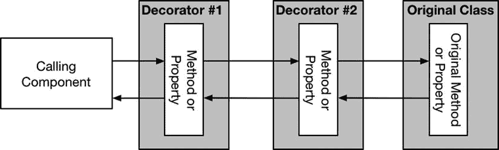

# 14. 装饰器模式

在本章中，我将介绍装饰器模式，它允许在运行时选择性地修改对象的行为。这种模式有多种用途，但在处理无法修改的类时效果最为显著。选择性修改意味着你可以选择哪些对象被更改，哪些保留其原始功能。表 14-1 将装饰器模式置于具体语境中。

表 14-1. 装饰器模式语境说明

| 问题 | 答案 |
| --- | --- |
| 这是什么？ | 装饰器模式允许改变单个对象的行为，而无需修改用于创建这些对象的类或使用它们的组件。 |
| 优点是什么？ | 用装饰器模式定义的行为变化可以组合起来，产生复杂的效果，而无需创建大量子类。 |
| 何时使用此模式？ | 当你需要改变对象的行为，但又不改变创建它们的类或使用它们的组件时，可使用此模式。 |
| 何时应避免此模式？ | 当你能够修改创建所需对象的类时，不应使用此模式。直接修改类通常更简单、更容易。 |
| 如何判断是否正确实现了该模式？ | 当你能够选择某个类创建的部分对象进行修改，而不影响所有对象，且无需修改该类时，就说明正确实现了该模式。 |
| 有哪些常见陷阱？ | 主要陷阱是实现该模式时影响了某个类创建的所有对象，而不是允许选择性应用更改。一个不太常见的陷阱是，实现该模式时引入了与修改对象原始目的无关的隐藏副作用。 |
| 是否有相关模式？ | 许多结构型模式有相似的实现，但意图不同。请确保从本书这一部分描述的模式中选出正确的一个。 |

## 准备示例项目

按照我在前面章节中使用的方法，我创建了一个名为 `Decorator` 的新 OS X 命令行工具项目。我在项目中添加了一个名为 `Purchase.swift` 的文件，其内容如代码清单 14-1 所示。

代码清单 14-1. `Purchase.swift` 文件的内容

```
class Purchase : Printable {
    private let product:String;
    private let price:Float;
    init(product:String, price:Float) {
        self.product = product;
        self.price = price;
    }
    var description:String {
        return product;
    }
    var totalPrice:Float {
        return price;
    }
}
```

`Purchase` 类表示顾客在商店中选择的商品。该类定义了存储产品名称的属性，并通过计算属性 `description` 和 `totalPrice` 将其公开。接下来，我在示例项目中添加了一个名为 `CustomerAccount.swift` 的文件，并用它定义了代码清单 14-2 中所示的类。

代码清单 14-2. `CustomerAccount.swift` 文件的内容

```
import Foundation

class CustomerAccount {
    let customerName:String;
    var purchases = [Purchase]();
    init(name:String) {
        self.customerName = name;
    }
    func addPurchase(purchase:Purchase) {
        self.purchases.append(purchase);
    }
    func printAccount() {
        var total:Float = 0;
        for p in purchases {
            total += p.totalPrice;
            println("Purchase \(p), Price \(formatCurrencyString(p.totalPrice))");
        }
        println("Total due: \(formatCurrencyString(total))");
    }
    func formatCurrencyString(number:Float) -> String {
        let formatter = NSNumberFormatter();
        formatter.numberStyle = NSNumberFormatterStyle.CurrencyStyle;
        return formatter.stringFromNumber(number) ?? "";
    }
}
```

`CustomerAccount` 类维护一个 `Purchase` 对象的集合，用于表示顾客的购买记录。新的购买记录通过 `addPurchase` 方法添加到账户中，`printAccount` 方法会将账户摘要输出到 Xcode 调试控制台。代码清单 14-3 展示了我在 `main.swift` 文件中添加的语句，用于使用 `Purchase` 和 `CustomerAccount` 类。

代码清单 14-3. `main.swift` 文件的内容

```
let account = CustomerAccount(name:"Joe");
account.addPurchase(Purchase(product: "Red Hat", price: 10));
account.addPurchase(Purchase(product: "Scarf", price: 20));
account.printAccount();
```

`Purchase` 类遵循 `Printable` 协议，这意味着当对象被传递给 `println` 方法时，会使用 `description` 属性的值。运行示例应用程序将产生以下输出：

```
Purchase Red Hat, Price $10.00
Purchase Scarf, Price $20.00
Total due: $30.00
```


## 理解该模式所解决的问题

假设我想为客户添加一些礼品选项，但又不能修改上一节中定义的 `Purchase` 或 `CustomerAccount` 类。导致类无法被修改的原因有很多，但最常见的情况是，这些类是第三方提供的框架的一部分。在我这个示例应用中，`Purchase` 和 `CustomerAccount` 类可能属于一个现成的销售管理系统。

客户可以自由组合搭配这些礼品选项，每个选项价格不同，且可独立应用。表 14-2 列出了这些选项及其成本。

表 14-2. 购买时的礼品选项

| 礼品选项 | 成本 |
| --- | --- |
| 礼品包装 | $2 |
| 丝带 | $1 |
| 礼品配送 | $5 |

为礼品选项添加支持最直接的方式是创建 `Purchase` 类的子类，这样我就可以在不修改 `Purchase` 类或原本期望操作 `Purchase` 对象的 `CustomerAccount` 类的情况下，定义新的行为。

代码清单 14-4 展示了我添加到示例项目中、用于为礼品选项定义子类的 `Options.swift` 文件的内容。

代码清单 14-4. `Options.swift` 文件的内容

```swift
class PurchaseWithGiftWrap : Purchase {
    override var description:String { return "\(super.description) + giftwrap"; }
    override var totalPrice:Float { return super.totalPrice + 2;}
}

class PurchaseWithRibbon : Purchase {
    override var description:String { return "\(super.description) + ribbon"; }
    override var totalPrice:Float { return super.totalPrice + 1; }
}

class PurchaseWithDelivery : Purchase {
    override var description:String { return "\(super.description) + delivery"; }
    override var totalPrice:Float { return super.totalPrice + 5; }
}
```

我定义的这三个类分别代表表 14-2 中的一个选项，并重写了 `description` 和 `totalPrice` 属性。代码清单 14-5 展示了如何通过使用这些子类而非 `Purchase` 基类来指定一个选项。

代码清单 14-5. 在 `main.swift` 文件中使用 `Purchase` 子类

```swift
let account = CustomerAccount(name:"Joe");
account.addPurchase(Purchase(product: "Red Hat", price: 10));
account.addPurchase(Purchase(product: "Scarf", price: 20));
account.addPurchase(PurchaseWithGiftWrap(product: "Sunglasses", price: 25));
account.printAccount();
```

运行该应用会在调试控制台产生以下输出：

```
Purchase Red Hat, Price $10.00
Purchase Scarf, Price $20.00
Purchase Sunglasses + giftwrap, Price $27.00
Total due: $57.00
```

这些子类虽然能用，但无法满足我的业务需求：客户不能自由组合搭配选项。每个子类仅代表单个选项，我无法表示客户既要礼品包装又要配送的购买情况。显然，我需要为这种组合创建另一个子类，如代码清单 14-6 所示。

代码清单 14-6. 在 `Options.swift` 文件中为礼品选项组合添加子类

```swift
class PurchaseWithGiftWrap : Purchase {
    override var description:String { return "\(super.description) + giftwrap"; }
    override var totalPrice:Float { return super.totalPrice + 2;}
}

class PurchaseWithRibbon : Purchase {
    override var description:String { return "\(super.description) + ribbon"; }
    override var totalPrice:Float { return super.totalPrice + 1; }
}

class PurchaseWithDelivery : Purchase {
    override var description:String { return "\(super.description) + delivery"; }
    override var totalPrice:Float { return super.totalPrice + 5; }
}

class PurchaseWithGiftWrapAndDelivery : Purchase {
    override var description:String {
        return "\(super.description) + giftwrap + delivery"; }
    override var totalPrice:Float { return super.totalPrice + 5 + 2; }
}
```

这只是其中一种可能的组合。为了让客户有完整的选择范围，我需要为以下所有组合创建子类：

- 礼品包装
- 丝带
- 配送
- 礼品包装 + 丝带
- 礼品包装 + 配送
- 丝带 + 配送
- 礼品包装 + 丝带 + 配送

随着我添加更多选项，类的数量会不断增加，因为我必须处理所有可能的排列组合。大量的类增加了出错风险，也使维护变得困难。例如，更改某个选项的价格可能会导致大规模的修改，并且很容易遗漏一个或多个本应更新的类。

## 理解装饰器模式

装饰器通过创建装饰器类来解决排列组合问题。装饰器是原始类的包装器，可以改变其行为。装饰器提供与被包装类相同的 API，并且装饰器可以包裹其他装饰器，从而创建各种排列组合。图 14-1 说明了装饰器模式。



图 14-1. 装饰器模式

装饰器提供与原始类相同的方法和属性，因此它们可以作为替代品使用，无需修改调用组件。如图所示，装饰器通常会调用其包装对象的方法和属性。由于所有涉及的对象都具有相同的方法和属性，装饰器并不知道它包装的对象是原始类的实例，还是另一个装饰器。


## 实现装饰器模式

装饰器模式通过继承无法修改的类来实现，以创建一个定义相同属性和方法、并可作为透明替代品的类。装饰器类定义一个`private`属性来存储被包装的对象，并利用该对象提供待装饰的基础功能。清单 14-7 展示了如何在`Options.swift`文件中用装饰器替代前一节的独立类。

**清单 14-7.** 在 Options.swift 文件中定义装饰器类

```
class BasePurchaseDecorator : Purchase {
    private let wrappedPurchase:Purchase;
    init(purchase:Purchase) {
        wrappedPurchase = purchase;
        super.init(product: purchase.description, price: purchase.totalPrice);
    }
}

class PurchaseWithGiftWrap : BasePurchaseDecorator {
    override var description:String { return "\(super.description) + giftwrap"; }
    override var totalPrice:Float { return super.totalPrice + 2;}
}

class PurchaseWithRibbon : BasePurchaseDecorator {
    override var description:String { return "\(super.description) + ribbon"; }
    override var totalPrice:Float { return super.totalPrice + 1; }
}

class PurchaseWithDelivery : BasePurchaseDecorator {
    override var description:String { return "\(super.description) + delivery"; }
    override var totalPrice:Float { return super.totalPrice + 5; }
}
```

为减少重复，我定义了一个`BasePurchaseDecorator`类，它继承自`Purchase`，并定义一个接收`Purchase`对象的初始化器，将其赋值给一个私有存储变量。

各个装饰器继承了`Purchase`变量及初始化器，并重写了`description`和`totalPrice`属性。每个装饰器属性都会调用被包装`Purchase`对象的对应属性，对结果进行处理，然后将其返回给调用者。例如，在`totalPrice`属性中，每个装饰器都从被包装对象获取价格，再加上自身所代表选项的成本。

> **提示：** 某些需要装饰的对象可能由协议定义，且实现类不会暴露给开发者。但这并不改变装饰器的实现方式。装饰器应遵循该协议，并包装一个同样遵循该协议的对象。

这些装饰器继承自`Purchase`类，并定义了接收`Purchase`对象的初始化器，这意味着它们可以组合起来创建多种对象排列组合，如清单 14-8 所示。

**清单 14-8.** 在 main.swift 文件中使用装饰器类

```
let account = CustomerAccount(name:"Joe");
account.addPurchase(Purchase(product: "Red Hat", price: 10));
account.addPurchase(Purchase(product: "Scarf", price: 20));
account.addPurchase(PurchaseWithDelivery(purchase:
    PurchaseWithGiftWrap(purchase:
        Purchase(product: "Sunglasses", price:25))));
account.printAccount();
```

我创建了一个`Purchase`对象代表太阳镜的购买，并将其传递给`PurchaseWithGiftWrap`装饰器的初始化器。接着将这个装饰器对象传递给`PurchaseWithDelivery`的初始化器以添加第二个装饰器，并将经过两次装饰的购买项添加到客户账户中。我没有对`Purchase`或`CustomerAccount`类做任何修改，但运行应用产生的输出表明，装饰器类已成功实现礼品选项的定义：

```
Purchase Red Hat, Price $10.00
Purchase Scarf, Price $20.00
Purchase Sunglasses + giftwrap + delivery, Price $32.00
Total due: $62.00
```

购买项的描述中包含了已选选项，且这些选项的成本已反映在价格中。

## 装饰器模式的变体

装饰器模式有两种变体，我将在后续章节中介绍。

### 创建具有新功能的装饰器

我在前面章节中定义的装饰器，其 API 与被装饰对象相同。这意味着装饰器对使用装饰后对象的类而言基本透明，让应用程序无需修改即可获得额外功能（本例中为礼品选项）。

第一种模式变体是创建在原始对象定义之外，增加额外方法或属性的装饰器。这为装饰器可实现的功能增强类型提供了更大灵活性，但代价是降低了这些增强功能应用的灵活性。为演示这一点，我在示例项目中添加了一个名为`Discounts.swift`的新文件，并用其定义了清单 14-9 所示的装饰器。

**清单 14-9.** Discounts.swift 文件的内容

```
class DiscountDecorator: Purchase {
    private let wrappedPurchase:Purchase;
    init(purchase:Purchase) {
        self.wrappedPurchase = purchase;
        super.init(product: purchase.description, price: purchase.totalPrice);
    }
    override var description:String {
        return super.description;
    }
    var discountAmount:Float {
        return 0;
    }
    func countDiscounts() -> Int {
        var total = 1;
        if let discounter = wrappedPurchase as? DiscountDecorator {
            total += discounter.countDiscounts();
        }
        return total;
    }
}

class BlackFridayDecorator : DiscountDecorator {
    override var totalPrice:Float {
        return super.totalPrice - discountAmount;
    }
    override var discountAmount:Float {
        return super.totalPrice * 0.20;
    }
}

class EndOfLineDecorator : DiscountDecorator {
    override var totalPrice:Float {
        return super.totalPrice - discountAmount;
    }
    override var discountAmount:Float {
        return super.totalPrice * 0.70;
    }
}
```

我定义了`DiscountDecorator`，它包装一个`Purchase`对象，并暴露其`description`和`totalPrice`属性。该装饰器还定义了`discountAmount`属性，用于返回商品在促销时的折扣金额。`totalPrice`属性的实现利用`discountAmount`值来降低购买价格。`countDiscounts`方法通过检查包装对象是否为打折装饰器，并沿着包装链追溯，从而计算出该购买项已应用了多少个折扣。

我从`DiscountDecorator`派生出了两个装饰器类，分别代表不同的促销条件。清单 14-10 展示了如何将这些装饰器应用于购买项。

**清单 14-10.** 在 swift.main 文件中应用折扣装饰器

```
let account = CustomerAccount(name:"Joe");
account.addPurchase(Purchase(product: "Red Hat", price: 10));
account.addPurchase(Purchase(product: "Scarf", price: 20));
account.addPurchase(EndOfLineDecorator(purchase:
    BlackFridayDecorator(purchase: PurchaseWithDelivery(purchase:
        PurchaseWithGiftWrap(purchase:Purchase(product: "Sunglasses", price:25))))));
account.printAccount();
```

我同时使用了`EndOfLineDecorator`和`BlackFridayDecorator`来对太阳镜购买项组合应用折扣。运行应用程序会产生以下结果：

```
Purchase Red Hat, Price $10.00
Purchase Scarf, Price $20.00
Purchase Sunglasses + giftwrap + delivery, Price $7.68
Total due: $37.68
```

新的装饰器并未修改产品的描述，但将价格从 32 美元降低到了 25.60 美元。


#### 使用新功能

新的装饰器所提供的 `countDiscounts` 方法让我能够获取已应用于购买商品上的折扣数量信息，如代码清单 14-11 所示。

**代码清单 14-11.** 在 `main.swift` 文件中显示折扣数量

```
let account = CustomerAccount(name:"Joe");
account.addPurchase(Purchase(product: "Red Hat", price: 10));
account.addPurchase(Purchase(product: "Scarf", price: 20));
account.addPurchase(EndOfLineDecorator(purchase:
    BlackFridayDecorator(purchase: PurchaseWithDelivery(purchase:
        PurchaseWithGiftWrap(purchase:Purchase(product: "Sunglasses", price:25))))));
account.printAccount();
for p in account.purchases {
    if let d = p as? DiscountDecorator {
        println("\(p) has \(d.countDiscounts()) discounts");
    } else {
        println("\(p) has no discounts");
    }
}
```

我检查了 `CustomerAccount` 对象存储的每个 `Purchase` 对象是否为 `DiscountDecorator` 类的实例，如果是，则调用 `countDiscounts` 方法。运行该应用程序会产生以下输出：

```
Purchase Red Hat, Price $10.00
Purchase Scarf, Price $20.00
Purchase Sunglasses + giftwrap + delivery, Price $7.68
Total due: $37.68
Red Hat has no discounts
Scarf has no discounts
Sunglasses + giftwrap + delivery has 2 discounts
```

#### 理解具有新功能的装饰器的局限性

实现新功能的装饰器对装饰的应用方式施加了限制。为了暴露新功能，装饰器类的每个实例都需要至少另一个组件能够找到它——要么是调用组件，要么是在嵌套装饰器情况下作为包装器的装饰器。

我定义的折扣装饰器对它们的应用顺序很敏感。在代码清单 14-11 中，两个折扣都应用于购买的总成本，包括已选择的礼品选项，如下所示：

```
account.addPurchase(EndOfLineDecorator(purchase:
    BlackFridayDecorator(purchase: PurchaseWithDelivery(purchase:
        PurchaseWithGiftWrap(purchase:Purchase(product: "Sunglasses", price:25))))));
```

代码清单 14-12 展示了如果我想要其中一个折扣仅适用于商品价格而不包括选项，该语句将如何变化。

**代码清单 14-12.** 在 `main.swift` 文件中更改折扣的应用

```
let account = CustomerAccount(name:"Joe");
account.addPurchase(Purchase(product: "Red Hat", price: 10));
account.addPurchase(Purchase(product: "Scarf", price: 20));
account.addPurchase(EndOfLineDecorator(purchase:
    PurchaseWithDelivery(purchase:PurchaseWithGiftWrap(purchase:
        BlackFridayDecorator(purchase:
            Purchase(product: "Sunglasses", price:25))))));
account.printAccount();
for p in account.purchases {
    if let d = p as? DiscountDecorator {
        println("\(p) has \(d.countDiscounts()) discounts");
    } else {
        println("\(p) has no discounts");
    }
}
```

`BlackFridayDecorator` 仅降低了太阳镜的价格，并不影响礼品选项的价格。以下是运行该应用程序的输出：

```
Purchase Scarf, Price $20.00
Purchase Sunglasses + giftwrap + delivery, Price $8.10
Total due: $38.10
Red Hat has no discounts
Scarf has no discounts
Sunglasses + giftwrap + delivery has 1 discounts
```

价格计算正确，但请注意，摘要中仅显示了一个折扣。发生这种情况是因为礼品选项装饰器不了解折扣装饰器及其提供的附加功能。

这种不灵活性并不意味着你应该避免使用装饰器定义新功能，但你应该谨慎行事，并考虑它对应用程序其余部分的影响，尤其是在已经使用了其他装饰器的情况下。

### 创建合并型装饰器

到目前为止，我定义了简单的装饰器类，因为我希望强调该模式的工作原理，并展示如何选择和应用装饰器，而无需修改它们所装饰的类或依赖这些类的类。

装饰器不必如此简单，该模式允许对原始类定义的方法和属性进行任何实现。一种常见的变体是创建合并型装饰器，它将多个更改应用于一个对象。代码清单 14-13 展示了我是如何将礼品选项装饰器合并到一个类中的。

**警告**

装饰器可以自由创建自己的方法和属性实现，但你应该只使用它们来执行与原始类实现相同的任务。一个好的装饰器实现可能会在示例应用程序中对 `totalPrice` 属性应用销售税，但一个糟糕的实现会返回库存中的商品数量。装饰器应增强或扩展原始类的功能，而不是将新功能偷偷塞入现有 API。

**代码清单 14-13.** 在 `Options.swift` 文件中为多个购买选项创建单个装饰器

```
class GiftOptionDecorator : Purchase {
    private let wrappedPurchase:Purchase;
    private let options:[OPTION];
    enum OPTION {
        case GIFTWRAP;
        case RIBBON;
        case DELIVERY;
    }
    init(purchase:Purchase, options:OPTION...) {
        self.wrappedPurchase = purchase;
        self.options = options;
        super.init(product: purchase.description, price: purchase.totalPrice);
    }
    override var description:String {
        var result = wrappedPurchase.description;
        for option in options {
            switch (option) {
            case .GIFTWRAP:
                result = "\(result) + giftwrap";
            case .RIBBON:
                result = "\(result) + ribbon";
            case .DELIVERY:
                result = "\(result) + delivery";
            }
        }
        return result;
    }
    override var totalPrice:Float {
        var result = wrappedPurchase.totalPrice;
        for option in options {
            switch (option) {
            case .GIFTWRAP:
                result += 2;
            case .RIBBON:
                result += 1;
            case .DELIVERY:
                result += 5;
            }
        }
        return result;
    }
}
```

这仍然是一个装饰器；它允许我选择性地修改 `Purchase` 对象的行为，并允许我创建礼品选项的组合。不同之处在于，它合并了这些选项，因此它们可以应用于单个对象。代码清单 14-14 展示了我如何更新创建购买的代码以使用这个新的装饰器。

**提示**

对于小型项目，我更倾向于使用单独的装饰器类。我发现它们更优雅，使用起来也更愉快。然而，它们更难维护，对于更复杂的项目，我会切换到将相关增强功能组合在一起的合并型装饰器。我发现合并型装饰器不那么优雅，但更易于管理。

**代码清单 14-14.** 在 `main.swift` 文件中使用合并型装饰器

```
let account = CustomerAccount(name:"Joe");
account.addPurchase(Purchase(product: "Red Hat", price: 10));
account.addPurchase(Purchase(product: "Scarf", price: 20));
account.addPurchase(EndOfLineDecorator(purchase: BlackFridayDecorator(purchase:
    GiftOptionDecorator(purchase: Purchase(product: "Sunglasses", price:25),
        options: GiftOptionDecorator.OPTION.GIFTWRAP,
        GiftOptionDecorator.OPTION.DELIVERY))));
account.printAccount();
for p in account.purchases {
    if let d = p as? DiscountDecorator {
        println("\(p) has \(d.countDiscounts()) discounts");
    } else {
        println("\(p) has no discounts");
    }
}
```

由于需要调整格式以适合页面，这段代码看起来有点丑陋，但结果与我之前在上一节中应用两个单独装饰器类时完全相同。


## 理解装饰器模式的陷阱

实现装饰器模式时需避免两个陷阱。第一个陷阱是尝试使用 Swift 扩展来装饰对象。装饰器模式的主要特性之一是装饰可以被有选择性地应用于单个对象，而扩展则会更改指定类型的所有对象。

### 副作用陷阱

第二个陷阱出现在编写装饰器时——你可能会发现可以用它来执行超出装饰对象方法和属性范围的操作。这种想法颇具吸引力。例如，我可以修改用于指示配送选项的装饰器，使其自动安排配送时间。

这会产生副作用，因为它并非被装饰对象原本用途的一部分。副作用通常带来的问题比解决的问题更多，这也正是与装饰器模式相关的第二个陷阱。

副作用装饰器难以维护，尤其是在团队开发环境中。另一位看到你的 `DeliveryDecorator` 类名的程序员，不太可能意识到它除了装饰对象之外还做了其他事情。当这个类被随意修改或在应用的其他地方重用时，配送问题就会开始出现。

请为你的装饰器类保持专注的职责范围，并使用独立的类处理诸如配送之类的相关活动。

## Cocoa 中装饰器模式的示例

Cocoa 中最著名的装饰器模式应用是处理滚动窗口。Cocoa 并没有为每个可展示给用户的 UI 组件定义滚动条和滚动机制，而是使用 `NSClipView` 装饰对象，再通过 `NSScrollView` 对 `NSClipView` 进行装饰。`NSScrollView` 显示滚动条、处理用户交互，并管理 `NSClipView` 以确定 UI 组件的哪一部分对用户可见。

## 将模式应用于 SportsStore 应用

为了将装饰器模式放在更广泛的背景下，我将把它应用于 SportsStore 应用中的 `Product` 类，以降低所有 `Soccer` 类别产品的价格，并提高库存量不超过四件的任何商品的价格。

### 准备示例应用

本章无需任何准备工作，我将直接沿用第 13 章结束时的 SportsStore 项目。

提示

请记住，本书中的所有示例均可从 [`Apress.com`](https://Apress.com) 免费下载。

### 创建装饰器

一旦理解了装饰器模式的工作原理，创建装饰器类就是一个简单的过程。清单 14-15 展示了 `ProductDecorators.swift` 文件的内容，我已将其添加到 SportsStore 项目中。

清单 14-15. `ProductDecorators.swift` 文件的内容

```
class PriceDecorator : Product {
    private let wrappedProduct:Product;
    required init(name:String, description:String, category:String,
                  price:Double, stockLevel:Int) {
        fatalError("Not supported");
    }
    init(product:Product) {
        self.wrappedProduct = product;
        super.init(name: product.name, description: product.productDescription,
                   category: product.category, price: product.price,
                   stockLevel: product.stockLevel);
    }
}

class LowStockIncreaseDecorator : PriceDecorator {
    override var price:Double {
        var price = wrappedProduct.price;
        if (stockLevel <= 4) {
            price = price * 1.5;
        }
        return price;
    }
}

class SoccerDecreaseDecorator : PriceDecorator {
    override var price:Double {
        return super.wrappedProduct.price * 0.5;
    }
}
```

`PriceDecorator` 类是我的装饰器基类，它是 `Product` 类的子类。`Product` 类定义了一个 `required` 初始化器，我必须将其添加到 `PriceDecorator` 中，但不想使用它。我使用了 `fatalError` 函数，这样就不必实现 `required` 初始化器，并定义了一个新的初始化器，该初始化器接受一个将被装饰的 `Product` 对象。

`LowStockIncreaseDecorator` 和 `SoccerDecreaseDecorator` 类是装饰器类，它们重写了 `price` 属性以更改产品的价格。

### 应用装饰器

我希望在产品创建时就将装饰器应用于 `Product` 对象。清单 14-16 展示了我是如何更改 `ProductDataStore` 类中 `loadData` 方法的。

清单 14-16. 在 `ProductDataStore.swift` 文件中应用装饰器

```
...
private func loadData() -> [Product] {
    var products = [Product]();
    for product in productData {
        var p:Product = LowStockIncreaseDecorator(product: product);
        if (p.category == "Soccer") {
            p = SoccerDecreaseDecorator(product: p);
        }
        dispatch_async(self.networkQ, {() in
            let stockConn = NetworkPool.getConnection();
            let level = stockConn.getStockLevel(p.name);
            if (level != nil) {
                p.stockLevel = level!;
                dispatch_async(self.uiQ, {() in
                    if (self.callback != nil) {
                        self.callback!(p);
                    }
                })
            }
            NetworkPool.returnConnecton(stockConn);
        });
        products.append(p);
    }
    return products;
}
...
```

我用 `LowStockIncreaseDecorator` 类装饰所有 `Product` 对象，但仅将 `SoccerDecreaseDecorator` 应用于 `Soccer` 类别中的 `Product` 对象。效果是：所有足球产品的价格被永久降低，而库存量降至五件以下的产品价格将上涨。

## 总结

在本章中，我描述了装饰器模式，并解释了如何用它来在运行时改变对象的行为。装饰器模式在处理无法修改的类时尤其有用，即使在处理第三方或遗留框架时，也能轻松增强应用功能。在下一章中，我将介绍组合模式，该模式允许将单个实例和对象集合进行一致处理。

